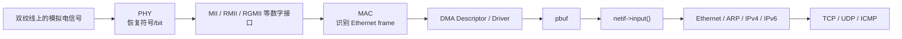
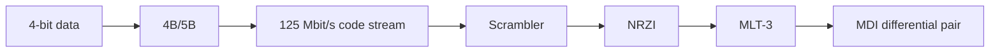
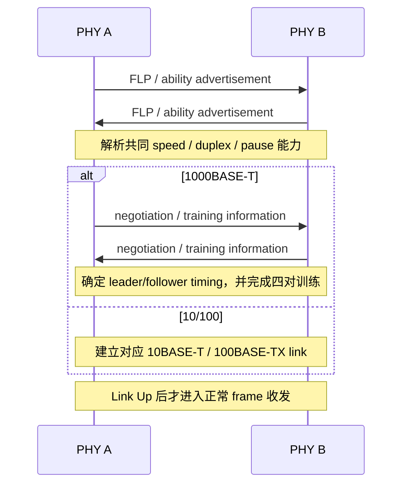
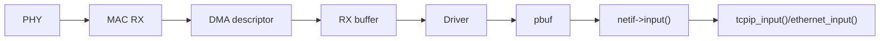

<meta name="referrer" content="no-referrer" />

# 教程 00：从网线上的电信号到 lwIP——PHY、MAC、DMA 与 `netif` 的完整边界

> 摘要：沿物理介质、PHY、MAC、DMA/Driver 到 lwIP netif 建立 Ethernet 收发心智模型，并解释速率协商、抗干扰、冲突与 MAC 过滤。

[TOC]

这篇文章只回答一个问题：**一段 Ethernet 数据从网线进入设备，最终为什么会变成 lwIP 能处理的 `pbuf`；反方向又怎样从 lwIP 回到网线。**

它不会把 PHY、EMC、交换机、DMA、lwIP 分别写成百科，而是只保留理解这条数据路径所必需的细节。后续教程再分别深入 `pbuf`、ARP/IPv4/ICMP、UDP、TCP、线程模型和内存管理。

## 1. 先建立总路径：网线上没有 `pbuf`，lwIP 里也没有模拟波形

真实 Ethernet 收发跨过的是多个完全不同的数据边界：



反方向则是：

```text
TCP/UDP/ICMP
    ↓
IPv4/IPv6/ARP
    ↓
Ethernet Header
    ↓
netif->linkoutput()
    ↓
Driver / DMA Descriptor
    ↓
MAC
    ↓
PHY
    ↓
双绞线
```

IEEE 802.3 定义 MAC 与 Physical Layer 的职责边界；lwIP 则从 `netif`、Ethernet header 和 `pbuf` 这一侧开始工作。[S1](#source-s1)[S2](#source-s2)

因此排障时首先要避免把这些对象混成一层：

| 观察对象 | 所在位置 | 典型内容 |
| --- | --- | --- |
| 示波器上的波形 | PHY/介质 | 模拟电压、边沿、噪声、抖动 |
| PHY 状态寄存器 | PHY | Link、Auto-Negotiation、speed/duplex |
| DMA descriptor | MAC/Driver | buffer 地址、长度、OWN/status |
| Ethernet frame | MAC/lwIP Ethernet | DA、SA、EtherType、payload |
| `pbuf` | lwIP | payload 指针、`len`、`tot_len`、链 |
| TCP segment | TCP | seq、ack、flags、payload |

一个 PHY 可以 Link Up，但 DMA 没收到 frame；DMA 可以收到 frame，但 `netif->input()` 没被调用；`netif` 可以 Up，但 IP 没配好；IP 可以正常，TCP 应用仍可能出错。这些都是不同层次的问题。

## 2. RJ45 网线为什么是 8 根线：本质上是 4 对差分双绞线

常见 8P8C/RJ45 铜缆有 8 根导体，但 Ethernet 不把它们理解成 8 根互不相关的“0/1 线”，而是 4 个 twisted pair。10BASE-T 和 100BASE-TX 常用两对数据线；1000BASE-T 使用四对，并且四对都参与数据传输。[S1](#source-s1)[S15](#source-s15)

```text
Pair A: 两根导体形成一个差分通道
Pair B: 两根导体形成一个差分通道
Pair C: 两根导体形成一个差分通道
Pair D: 两根导体形成一个差分通道
```

### 2.1 为什么两根线必须成对

接收器重点观察的是两根线之间的差：

```text
Vdiff = V+ - V-
```

如果外部干扰同时耦合到一对线：

```text
V+' = V+ + N
V-' = V- + N
```

那么：

```text
Vdiff' = (V+ + N) - (V- + N)
       = V+ - V-
```

理想情况下共同叠加的噪声被差分接收抵消，这就是 common-mode rejection 的核心直觉。双绞又让两根导体沿线不断交换空间位置，使外界电磁场更接近“同时作用于两根线”，从而提高共模抵消效果。[S11](#source-s11)[S16](#source-s16)

这也解释了一个常见现象：**线序测试“1 到 8 都通”不代表高速 Ethernet 一定稳定。** 如果把原本属于不同 pair 的导体错误地拼成所谓 split pair，直流导通测试可能完全正常，但差分阻抗、串扰和抗共模能力已经被破坏，高速时会出现 CRC error、协商降速或间歇掉链。

### 2.2 10/100 与 1000BASE-T 对 pair 的使用为什么不同

在常见 MDI 引脚视角下，四对线通常对应 1-2、3-6、4-5、7-8 四个 pair。10BASE-T/100BASE-TX 的经典实现只使用其中两对完成一个方向的发送和另一个方向的接收；1000BASE-T 则把四对全部用于数据，并通过回波抵消让每一对同时承担本端 TX 与 RX。[S10](#source-s10)[S15](#source-s15)

这会直接影响现场判断：

```text
某根只属于第 3/4 pair 的导体断路
  → 10/100 可能仍然能够 Link
  → 1000BASE-T 可能协商失败或降级
```

因此“同一根网线在 100M 正常、强制 1G 失败”时，首先就应检查四对完整性、pair mapping、连接器压接与线缆类别，而不是先怀疑 TCP。

还要区分 **pair polarity** 与 **pair swap**。某些 PHY 能自动修正差分对正负极性，也能通过 Auto-MDI/MDI-X 适应发送/接收 pair 的互换，但这不代表任意错误接线都能被 PHY 修复。把两根来自不同 pair 的导体拼在一起形成 split pair，已经破坏传输通道本身，自动极性修正无法补救。

### 2.2 为什么还要 100 Ω、Magnetics 和 PCB 走线约束

高速差分链路不只是“把两根 GPIO 接出去”。PHY MDI 到变压器、RJ45 和线缆形成传输通道，通常围绕约 100 Ω differential impedance 设计。阻抗突变、stub、过孔、参考平面割裂、pair 内长度差都会带来反射和模式转换。[S11](#source-s11)[S16](#source-s16)

Magnetics 常承担隔离、共模抑制和与介质匹配相关的作用；很多模块还组合 common-mode choke。TVS/ESD 器件则用于承受外部静电和浪涌，但器件选型与布局本身也会引入寄生参数，所以不能简单理解为“保护器件越多越好”。

因此链路稳定性是一个整体结果：

```text
线缆质量
+ 双绞关系
+ 连接器
+ Magnetics
+ PCB 差分走线
+ PHY 模拟前端
+ DSP/均衡/回波抵消
+ 时钟质量
+ 正确协商
```

任何一处质量不足都可能表现成“能 Link，但是压力一上来就丢包”。

## 3. Ethernet 线上什么算 0、什么算 1：不同速率使用不同编码

“几伏算 0、几伏算 1”不是一个能横跨 10M/100M/1G 的答案。Ethernet PHY 先把 bit 映射成特定 line coding / symbol，再通过模拟前端驱动介质。不同 PHY 标准的编码完全不同。[S1](#source-s1)

### 3.1 10BASE-T：Manchester 看的是 bit 中间的跳变

10BASE-T 使用 Manchester 编码。一个 bit period 中必定存在中间跳变，因此接收端既获得数据，也更容易恢复时钟。IEEE 802.3 convention 下，逻辑值由中点跳变方向编码，而不是简单由“高电平=1、低电平=0”决定。[S8](#source-s8)[S9](#source-s9)[S17](#source-s17)

可以把它抽象为：

```text
bit stream
   ↓
Manchester encoder
   ↓
每个 bit 中点发生确定方向的 transition
   ↓
双绞线
   ↓
PHY receiver 根据 transition 恢复 clock + data
```

因为 10 Mbit/s 每个 bit 内包含一次强制中点跳变，所以线路状态变化节奏可达到约 20 MHz 量级。这里再次说明：**10 Mbit/s 是数据 bit rate，不等于“线上只有 10 MHz”。**

### 3.2 100BASE-TX：4B/5B → Scrambler → NRZI → MLT-3

100BASE-TX 的内部路径更长。典型 PHY 实现可以概括为：[S8](#source-s8)[S9](#source-s9)



4B/5B 把 4 个数据 bit 映射成 5-bit code group：

```text
100 Mbit/s × 5 / 4 = 125 Mbit/s
```

因此内部 code stream 是 125 Mbit/s。Scrambler 避免数据长期形成不利频谱；NRZI 再把 code bit 映射成“是否发生状态转换”；MLT-3 则让线路在多个电平状态之间按规则变化，以降低主要频谱能量。

这意味着在 MLT-3 上也不能盯住某个瞬时电压就说“这是 bit 1”。接收端必须按编码状态机反向恢复：

```text
MLT-3 waveform
→ transition recovery
→ NRZI decode
→ descramble
→ 5B code group
→ 4B data
```

### 3.3 1000BASE-T：四对都同时收发，不再是一对纯 TX、一对纯 RX

1000BASE-T 的思路再次变化：四对线全部使用，而且每一对都可以同时承载本端发送和对端发送。PHY 需要从本端接收的混合信号中消除自己的 echo，并抑制来自其他 pair 的串扰，再通过均衡与判决恢复远端符号。[S10](#source-s10)[S18](#source-s18)

```text
本端发送信号 ───────┐
                    ├─ 同一 pair 上叠加 ─→ RX analog/DSP
远端发送信号 ───────┘                  │
                                      ├─ Echo cancellation
其它 pair 串扰 ────────────────────────┤
                                      ├─ NEXT cancellation
                                      ├─ Equalization
                                      └─ Symbol decision
```

1000BASE-T 使用 4D-PAM5 等机制，把多对线、多电平 symbol 和编码组合起来达到 1 Gbit/s。重点不是背每一个 PAM level，而是建立一个正确心智模型：**1 Gbit/s 并不是把 10BASE-T 的“高低电平”简单加速 100 倍。**

## 4. bit rate、symbol rate、时钟频率和有效吞吐不是同一个量

阅读 Ethernet 文档时很容易把以下量混成“速率”：

| 名称 | 含义 | 示例 |
| --- | --- | --- |
| bit rate | 协议传递的数据 bit 速率 | 100 Mbit/s |
| code rate | 编码后的 bit/code stream | 100BASE-TX 为 125 Mbit/s |
| symbol rate | 每秒发送多少 symbol | 取决于调制方式 |
| clock | 数字接口/恢复电路使用的时钟 | RMII/RGMII 等各有约束 |
| application throughput | 应用真正获得的 payload/s | 小于 line rate |

Ethernet 线速还要承担 Preamble/SFD、Ethernet Header、FCS、IFG，以及上层 IP/TCP/UDP header 等开销。[S20](#source-s20)

例如一个很小的 payload 并不会只占 payload 对应的 wire time：MAC 仍要遵守最小帧与 IFG 等规则。因此“网口 1 Gbit/s”不是“应用 `send()` 每秒一定得到 125 MB/s”。实际吞吐还受：

```text
frame size
协议头开销
CPU/cache
DMA descriptor
内存拷贝
TCP window/cwnd
switch congestion
对端处理能力
```

影响。

## 5. 两端怎样决定 10M、100M、1G 与 duplex：Auto-Negotiation

PHY 接上线以后，不是“谁先猜到速率谁赢”。支持 Auto-Negotiation 的两端会交换能力 advertisement，再从共同能力中解析工作模式。[S1](#source-s1)[S10](#source-s10)[S18](#source-s18)



### 5.1 Advertisement 与共同能力：为什么两端不会随便选一个速率

Auto-Negotiation 的基本思想是“各自声明能力，再从交集里选模式”。能力中不仅有 speed，还可能包含 duplex、pause 等信息。对于 10/100 copper，PHY 通过 link pulse/FLP 机制交换能力；1000BASE-T 还需要进一步完成相关控制参数和训练。[S1](#source-s1)[S18](#source-s18)

可以把解析过程简化为：

```text
A advertise = {10H, 10F, 100H, 100F, 1000F}
B advertise = {10F, 100F, 1000F}
                    ↓
共同能力 = {10F, 100F, 1000F}
                    ↓
按标准优先级选择共同最高模式
```

这里的“最高”不是应用程序自己排序字符串，而是 PHY 按标准定义的能力解析规则完成。软件通常只需要配置 advertisement mask、启动/重启 Auto-Negotiation，并在完成后读取 resolved mode。

### 5.2 “协商成功”不只等于选出数字 100 或 1000

PHY 还需要形成一致的 duplex、时序和具体 PHY mode。1000BASE-T 还包含 leader/follower timing 关系和训练过程。[S18](#source-s18)

如果一端强制 100M/full、另一端保持 Auto-Negotiation，可能发生能力识别不完整甚至 duplex mismatch。典型现象不是“完全不 Link”，而是：

```text
Link Up
但吞吐异常
CRC/FCS 或 collision 相关统计异常
单向正常、双向压力异常
```

所以调试 PHY 时，不能只打印 `link=1`，还要读 resolved speed/duplex 与相关状态寄存器。

### 5.3 Auto-MDI/MDI-X 解决的是 pair 映射，不是速率协商

Auto-MDI/MDI-X 允许 PHY 自动适应常见直通/交叉 pair mapping，因此现代设备通常不再要求人工选择 crossover cable。[S10](#source-s10)[S19](#source-s19)

它解决的是“哪一对接到哪一对”的物理映射问题；Auto-Negotiation 解决的是能力与工作模式。二者不要混为一件事。

## 6. 链路为什么能抗干扰：不是靠一个机制，而是多层共同完成

抗干扰至少有四类机制共同工作。

### 6.1 介质层：差分 + 双绞 + 受控阻抗

差分传输降低对共模噪声的敏感度；双绞改善外部场耦合对称性；受控差分阻抗减少反射。[S11](#source-s11)[S16](#source-s16)

### 6.2 模拟前端：Magnetics、common-mode 处理、ESD

隔离变压器和 common-mode 结构帮助处理隔离和共模能量；ESD/保护网络降低外部瞬态造成的破坏风险。[S11](#source-s11)[S16](#source-s16)

### 6.3 PHY DSP：equalizer、baseline wander、echo/NEXT cancellation

100BASE-TX PHY 常带自适应均衡等电路；Gigabit PHY 还需要 echo/NEXT cancellation 和更复杂的 DSP。[S10](#source-s10)[S19](#source-s19)

因此线缆衰减、不同长度 pair、反射和串扰不是单纯靠“差分”解决，而是由整个接收链共同恢复。

### 6.4 稳定性要看 error counter，而不是只看 Link LED

Link LED 亮只说明 PHY 建立了某种链路状态，并不能证明误码率足够低。真实调试应尽量结合 PHY/MAC 能提供的统计：

```text
link drop / renegotiation count
CRC/FCS error
symbol/code error
alignment/length error
RX overflow / missed frame
TX underflow / retry error
```

如果 Link 长时间保持，却 CRC/FCS error 随流量快速增长，问题更像介质/时序/信号完整性；如果 MAC error 很干净但 RX descriptor 不前进，则更应该检查 DMA/driver；如果 driver 能看到正确 frame，而 lwIP 不响应，再进入协议栈路径。这样的“最后一个正确边界”比单看 ping 成败有信息量。

一些 Gigabit PHY 还提供 cable diagnostics/TDR 类能力，用脉冲反射估计开路、短路和大致故障距离；它适合帮助定位线缆问题，但不能替代示波器、网络分析或对 PCB 时序/阻抗的检查。[S18](#source-s18)

### 6.5 MAC/FCS：发现“这一帧已经坏了”

PHY 把 bit 交给 MAC 后，Ethernet frame 还有 FCS/CRC 用于检测传输错误。FCS 能帮助发现 frame 被破坏，但它不是前向纠错；坏帧通常被 MAC/driver 丢弃并计入统计。[S20](#source-s20)[S23](#source-s23)

因此：

```text
抗干扰 ≠ 永远不会出 bit error
```

更准确的说法是：物理层尽量提高信号恢复可靠性，FCS 再负责发现剩余 frame error，上层协议在需要时通过自身机制恢复数据可靠性。

## 7. PHY 与 MAC 之间是什么：MII/RMII/RGMII 是数字接口，MDIO 是管理接口

网线接的是 PHY MDI 一侧；MAC 与 PHY 之间通常走 MII/RMII/GMII/RGMII 等数字接口。具体平台会选择其中一种。[S1](#source-s1)[S7](#source-s7)

```text
RJ45 / Magnetics
      │
     MDI
      │
     PHY
      │  RMII/RGMII: frame data
      │  MDC/MDIO:   management
      ▼
     MAC
      │
     DMA
```

RMII/RGMII 上看到的是数字 data/control/clock，不是网线上的 MLT-3/PAM 信号。PHY 已经完成线路编码、恢复和 DSP。

### 7.1 为什么 MDIO 能读寄存器但 Ping 仍失败

MDC/MDIO 是管理平面。软件可通过它读取 PHY ID、reset、Auto-Negotiation、link、speed、duplex 等状态。[S7](#source-s7)[S18](#source-s18)

因此下面几件事互相不能推出：

```text
MDIO 能读 PHY ID
    ≠ Link Up
Link Up
    ≠ RMII/RGMII 时序正确
RMII/RGMII 正确
    ≠ DMA descriptor 正确
DMA 正确
    ≠ lwIP input path 正确
```

RGMII 还涉及时钟与 data 的 timing/skew。某些 PHY/SoC 支持内部 programmable delay；如果 PCB 延迟与内部 delay 配置重复或缺失，都可能出现“偶尔通、温度/线长变化后失败”的问题。[S18](#source-s18)

## 8. MAC 看到的 Ethernet frame 到底是什么

从 MAC 角度，一个典型 Ethernet frame 可以抽象为：[S1](#source-s1)[S20](#source-s20)

```text
Preamble | SFD | Destination MAC | Source MAC | Type/Length | Payload | FCS
```

帧与帧之间还有 IFG。基本 Ethernet frame 还有 minimum frame size 等规则。[S20](#source-s20)

### 8.1 最小帧、Padding 与 MTU 不要混在一起

经典 Ethernet 基本 frame 有最小长度要求。若上层 payload 太短，MAC/Ethernet 层需要 padding，使帧达到最低传输长度；这和 IP MTU 是两个方向不同的约束。[S20](#source-s20)

```text
minimum Ethernet frame
    解决：frame 太短时如何满足 MAC/CSMA-CD 历史约束

IP MTU
    解决：一个 L3 packet 在该接口上通常允许多大而不需要进一步分片/处理
```

因此抓到一个很短的 ICMP/ARP frame 时，不能只按 application payload 去算线上的 frame 长度。反过来，`MTU=1500` 也不是说“整个 Ethernet frame 只有 1500 bytes”；MAC header、可能的 VLAN tag 和 FCS 属于另外的开销层次。

但 lwIP 的 `struct eth_hdr` 并不等于“网线上从 Preamble 到 FCS 的全部内容”。目标版本中 lwIP 的 Ethernet header 主要描述：

```c
struct eth_hdr {
  struct eth_addr dest;
  struct eth_addr src;
  u16_t type;
};
```

也就是 destination/source MAC 和 EtherType。[S2](#source-s2)

Preamble/SFD 通常由 MAC 硬件处理；FCS 也往往由 MAC 生成/检查，并不会作为 lwIP `pbuf` payload 的一部分继续向上传递。Unix TAP Port 也明确按“frame without CRC”的方式工作。[S3](#source-s3)

所以在不同观测点抓到的“同一个 frame”长度可能不同：

```text
线上时间预算：包含 Preamble/SFD、FCS、IFG 等
MAC/DMA buffer：通常没有 Preamble/SFD，FCS 是否保留取决于硬件配置
lwIP pbuf：通常从 Ethernet Header 开始
IP 层 pbuf 视图：Ethernet Header 已经被消费/跳过
TCP 层 pbuf 视图：IP/TCP Header 又被继续解析
```

这也是后续教程反复跟踪 `p->payload` 的原因。

## 9. Ethernet 怎么避免“打架”：half duplex collision 与现代 full duplex 要分开

### 9.1 经典共享介质：CSMA/CD

早期共享 Ethernet/hub 场景中，多台设备处于同一个 collision domain，需要执行 CSMA/CD：监听介质、发送、检测 collision、jam、退避后重试。[S1](#source-s1)[S21](#source-s21)

二进制指数退避属于 MAC 介质访问机制。对于集成 Ethernet MAC 的 MCU/SoC，这类 carrier sense、collision detect、backoff/retry 通常由 MAC 硬件状态机完成，lwIP 不参与随机 slot 的计算。

```text
lwIP
  ↓ netif->linkoutput()
Driver / DMA
  ↓
MAC hardware
  ├─ carrier sense
  ├─ collision detect
  ├─ backoff / retry   ← half-duplex 时
  └─ frame TX
```

lwIP 中可能看到 `tcp_backoff[]` 一类代码，但那是 TCP RTO 退避，是 L4 可靠性机制，和 Ethernet collision backoff 不是一回事。

### 9.2 现代交换式 full duplex：同一条链路没有传统 collision

现代主机与交换机之间通常是一条 point-to-point full-duplex link：TX 与 RX 可以同时工作，不运行传统 CSMA/CD。[S21](#source-s21)

因此“两台主机同时发数据”不会让两股波形在同一根共享总线上直接撞在一起；每个 ingress link 都是独立的。

### 9.3 多个输入同时去同一个输出：这是 queue/congestion

如果多个 ingress 同时向交换机同一个 egress 发送，例如两个 1G ingress 都持续灌向一个 1G egress，问题变成：

```text
Ingress A ─┐
           ├─> switch buffer/queue ─> 1G egress
Ingress B ─┘
```

交换机只能排队。瞬时 burst 可以由 buffer 吸收；持续 oversubscription 最终会产生 output drop。[S13](#source-s13)[S24](#source-s24)

所以必须区分：

```text
collision：共享 half-duplex 介质上的 MAC 竞争
congestion：交换网络中流量超过某个输出/缓冲能力
```

这两个问题的层次、统计计数和解决方式都不同。

## 10. MAC 地址怎样决定“这帧给谁”：终端 MAC filter 与交换机 FDB 是两件事

### 10.1 终端首先看 Destination MAC

Ethernet frame 带 Destination MAC 和 Source MAC。48-bit MAC 地址中还包含 individual/group、universal/local 等语义；全 `FF` 是 Ethernet broadcast address。[S14](#source-s14)

IP 地址解决“网络层 endpoint/route”，MAC 地址解决当前二层链路的递送。IPv4 已知目标 IP 但不知道下一跳 MAC 时，需要 ARP 完成 protocol address → hardware address 的解析。[S5](#source-s5)

因此：

```text
IP address != MAC address
ARP 也不是“把 IP 转换成 MAC 的数学函数”
```

ARP 是局域网内通过 request/reply 动态学习映射。

### 10.2 “不是我的 MAC”通常在硬件 MAC 就被过滤

真实 MCU Ethernet MAC 一般提供 receive filter，常见模式包括：[S12](#source-s12)[S23](#source-s23)

- perfect address match；
- broadcast accept/drop；
- multicast perfect/hash filter；
- unicast hash；
- promiscuous；
- all-multicast 等。

正常非 promiscuous 模式下，如果 Destination MAC 不属于本机允许集合，frame 往往根本不会成为正常 RX descriptor，也不会进入 lwIP。

Hash filter 的意义是节省硬件 compare 表项：对 MAC 计算 hash 后只看若干 bit。代价是不同 MAC 可能映射到同一 hash entry，因此可能出现 false positive；这类额外 frame 仍可由更高层语义继续过滤。

硬件 filter 的配置通常需要与软件模式同步：

| 模式 | 硬件大致行为 | 常见用途 |
| --- | --- | --- |
| perfect unicast | 只接受若干精确 MAC | 正常单地址/多地址接口 |
| broadcast enable | 接受 FF:FF:FF:FF:FF:FF | ARP、DHCP 等需要广播的场景 |
| multicast perfect/hash | 只接受加入的 multicast 集合或其 hash | IGMP/MLD 驱动的组播接收 |
| all-multicast | 接收所有 multicast | 组播调试/特殊应用 |
| promiscuous | 尽可能接受所有 frame | 抓包、桥接、诊断 |

如果 driver 为了调试临时打开 promiscuous，却忘记恢复，就会看到大量“理论上不属于本机”的 unicast frame 进入 RX ring；这不是交换机失效，而是终端自己取消了正常过滤。

lwIP 还提供 `igmp_mac_filter` / IPv6 multicast filter callback 等接口，让协议栈在加入/离开 multicast group 时通知底层驱动配置硬件 multicast filter。[S2](#source-s2)

### 10.3 `ethernet_input()` 不是通用 NIC Destination-MAC Filter

当 frame 已经进入 lwIP，`ethernet_input()` 的重点是解析 EtherType/VLAN 等，并把 frame 分发给 ARP、IPv4、IPv6 等处理路径，而不是重新模拟完整 NIC hardware filter。[S2](#source-s2)

这条边界非常重要：如果怀疑“为什么本机收到了一个不该收的 unicast”，首先看 MAC hardware filter / driver mode / promiscuous 配置，而不是先在 `ethernet_input()` 里找 destination-MAC compare。

### 10.4 交换机根据 MAC 转发，但不是终端 MAC filter

交换机通过 Source MAC 学习 FDB entry，再按 Destination MAC + VLAN 做 lookup：known unicast 定向转发，unknown destination 可能 flood，broadcast/multicast 根据桥接规则复制。[S13](#source-s13)[S22](#source-s22)

```text
终端 MAC filter：决定“这个 ingress frame 是否交给本机上层”
交换机 FDB：决定“这个 ingress frame 应从哪些 egress port 发出去”
```

二者都看 MAC，但职责完全不同。

## 11. 从 MAC 到 lwIP：DMA descriptor、Driver、`pbuf` 和 `netif`

嵌入式 Ethernet 最关键的软件/硬件边界通常不在 TCP，而是在 DMA descriptor。

典型 RX：



典型 TX：

```text
lwIP pbuf
→ netif->linkoutput()
→ driver 填 descriptor/buffer
→ ownership 交给 DMA
→ MAC 发送
→ TX completion 后回收资源
```

### 11.1 Descriptor ownership 是最常见的分界

不同控制器的 descriptor 格式不同，但一般都要表达：

```text
buffer address
length
ownership
first/last segment
status/error
```

CPU 填好 TX descriptor 后，把 ownership 交给 DMA；DMA 完成以后，CPU/driver 才能安全重用 buffer。RX 同理，DMA 写入 buffer 后通过 descriptor 状态把 frame 交给 CPU。

在带 D-cache 的 MCU/MPU 上，还必须保证 DMA 与 CPU 对 buffer/descriptor 的可见性。cache clean/invalidate、memory barrier 和 buffer alignment 如果错误，会出现极难理解的症状：descriptor 看起来正确，但 packet 内容旧；或偶发收不到 frame。

一个常见的 RX ownership 时序是：

```text
DMA owns descriptor
    ↓ 收到 frame，写 buffer/status
CPU detects completed descriptor
    ↓ 必要时 invalidate cache
Driver 读取长度/status
    ↓ 创建或挂接 pbuf
netif->input(p, netif)
    ↓ lwIP 消费/释放
Driver 确认 buffer 可以回收
    ↓ 重新把 descriptor 交给 DMA
```

TX 则方向相反：CPU 先写 payload/descriptor，必要时 clean cache，再设置 ownership/kick DMA；完成中断或轮询确认 TX done 后才能回收相关资源。若 ownership 翻转顺序错误，可能产生“偶尔发送旧包”“descriptor 永久 busy”“释放后 DMA 继续访问”等故障。

### 11.2 `struct netif` 是 lwIP 的平台边界

目标版本中关键 callback 可以概括为：[S2](#source-s2)

```text
netif->input       driver 把收到的 packet 交给协议栈
netif->output      IPv4 输出，Ethernet 常绑定 etharp_output
netif->output_ip6  IPv6 输出
netif->linkoutput  已完成 L2 封装的 pbuf 真正交给 link driver
```

因此 TX 方向通常是：

```text
IPv4
→ etharp_output()
→ ethernet_output()
→ netif->linkoutput()
→ driver/DMA
```

RX 方向则是：

```text
driver 取得 frame
→ 构造/挂接 pbuf
→ netif->input(p, netif)
→ tcpip_input() 或 ethernet_input()
```

如果启用了 `NO_SYS=0` 和 tcpip thread 模型，`tcpip_input()` 会把 packet 投递到 tcpip thread，再在 Core thread 内继续处理。[S2](#source-s2)

### 11.3 `pbuf` 是 packet buffer，不是 Ethernet 硬件 descriptor

`pbuf` 保存 payload view、长度、链和引用计数等 lwIP 语义；descriptor 属于具体 MAC/DMA。二者可以通过 copy 模式连接，也可以通过 custom pbuf/zero-copy 方式绑定，但 ownership 必须明确。[S2](#source-s2)

错误的 zero-copy 生命周期会导致：DMA 还在使用 buffer 时 lwIP 已释放，或者 lwIP 仍引用 buffer 时 driver 已回收到 ring。

## 12. Link Up、Interface Up、IPv4 Ready、Ping Success 是四层状态

网络 bring-up 最容易犯的错误是看到 `Link Up` 就认为“网络已经正常”。实际上至少要区分：

| 状态 | 表示什么 | 不保证什么 |
| --- | --- | --- |
| PHY Link Up | PHY 建立物理链路 | DMA/lwIP 正常 |
| `NETIF_FLAG_LINK_UP` | 软件记录 link state | netif administratively up |
| `NETIF_FLAG_UP` | interface 被协议栈启用 | IPv4 配置正确 |
| IPv4 ready | address/netmask/route 可用 | 对端可达 |
| ARP/ICMP success | L2/L3 基本收发闭环 | TCP 应用一定正确 |

lwIP 将 link state 与 netif up/down 分开管理，这种分离就是为了表达它们不是同一个状态。[S2](#source-s2)

一个有效的排障顺序应该沿边界逐层确认：

```text
1. PHY 能否稳定 Link？resolved speed/duplex 是否正确？
2. MAC/PHY digital interface 是否工作？是否有 RX/TX error？
3. DMA descriptor 是否推进？buffer 内容是否变化？
4. Driver 是否把 frame 交给 netif->input()？
5. ethernet_input() 是否识别 EtherType？
6. ARP 是否建立邻居映射？
7. IPv4/ICMP 是否收发？
8. 最后才看 UDP/TCP/application。
```

这比一开始就在 TCP callback 里加日志有效得多，因为它能找到“最后一个已经确认正确的边界”。

## 13. Linux TAP 为什么适合学 lwIP，但不能替代真实 PHY/MAC bring-up

本仓库使用 Linux TAP 学习 lwIP。TAP 向 userspace 暴露 Ethernet frame；Unix Port 从 TAP fd `read()` frame，构造 `PBUF_RAW`，再交给 `netif->input()`；TX 则从 `pbuf` 拷贝到 buffer 后 `write()` 回 TAP。[S3](#source-s3)[S6](#source-s6)

因此 Host Lab 能非常好地研究：

```text
Ethernet Header
ARP
IPv4/IPv6
ICMP
UDP/TCP
pbuf
netif
thread/mailbox
```

但它替代了真实硬件中的：

```text
PHY 模拟前端
Auto-Negotiation 实际波形
RMII/RGMII 时序
MAC DMA descriptor
cache coherency
magnetics/ESD/layout
```

所以 TAP Lab 能证明 lwIP Core 行为，却不能证明目标板 Ethernet PHY/MAC bring-up 已正确。

## 14. 把一次同网段 Ping 串起来：从 bit 到 lwIP 再回到 bit

最后用同网段 Ping 把整条主线闭环。

### 14.1 首次发送前先 ARP

应用希望向目标 IPv4 地址发送 ICMP Echo Request，但 Ethernet 需要 Destination MAC。若 ARP cache 没有映射，lwIP 先通过 ARP request/reply 学到下一跳 MAC。[S5](#source-s5)

得到 MAC 后，IPv4 datagram 才能封装进 Ethernet frame。[S4](#source-s4)

### 14.2 TX

```text
ICMP Echo Request
→ IPv4 packet
→ ARP 已解析下一跳 MAC
→ ethernet_output()
→ netif->linkoutput()
→ driver/DMA descriptor
→ MAC 加入线侧所需信息/FCS
→ PHY 编码
→ 双绞线
```

### 14.3 对端 RX

```text
双绞线模拟信号
→ PHY 恢复 symbol/bit
→ MAC 检查 frame/FCS/目的 MAC
→ DMA 写 RX buffer
→ driver 构造 pbuf
→ netif->input()
→ ethernet_input()
→ EtherType=IPv4
→ ip4_input()
→ Protocol=ICMP
→ icmp_input()
```

Echo Reply 再沿反方向发送。

到这里，Stage 0 真正需要建立的心智模型只有一句：

> **Ethernet 的物理层负责把符号可靠地穿过介质，MAC 负责 frame 与本地二层接收/发送，DMA/Driver 把硬件 frame 转换成软件 buffer，而 lwIP 从 `netif`/`pbuf` 开始继续解析 ARP、IP、TCP/UDP。**

后续教程将沿这条边界继续：Stage 2 先从 TAP + `netif` 跑通第一包，Stage 3 深入 `pbuf`，Stage 4 再把 Ethernet/ARP/IPv4/ICMP 的真实源码路径展开。

## 资料来源

<a id="source-s1"></a>
### [S1] IEEE 802.3-2022 — IEEE Standard for Ethernet
- 类型：标准规范
- 版本：IEEE 802.3-2022，2022-07-29 发布
- URL/文档：[IEEE 802.3-2022](https://standards.ieee.org/ieee/802.3/10422/)
- 使用位置：PHY/MAC 边界、10/100/1000BASE-T、Auto-Negotiation、frame/CSMA-CD 基本约束
- 支撑内容：Ethernet MAC、Physical Layer、MII、双工、介质访问、铜介质 PHY 与 Auto-Negotiation 的标准边界

<a id="source-s2"></a>
### [S2] lwIP upstream `master`：`netif` 与 Ethernet Core
- 类型：目标版本上游源码
- 版本：`d08f4773edd0182b7910fc8f046eed82ffcd67c9`
- URL/文档：[`src/include/lwip/netif.h`](https://github.com/lwip-tcpip/lwip/blob/d08f4773edd0182b7910fc8f046eed82ffcd67c9/src/include/lwip/netif.h)、[`src/include/lwip/prot/ethernet.h`](https://github.com/lwip-tcpip/lwip/blob/d08f4773edd0182b7910fc8f046eed82ffcd67c9/src/include/lwip/prot/ethernet.h)、[`src/include/lwip/pbuf.h`](https://github.com/lwip-tcpip/lwip/blob/d08f4773edd0182b7910fc8f046eed82ffcd67c9/src/include/lwip/pbuf.h)、[`src/netif/ethernet.c`](https://github.com/lwip-tcpip/lwip/blob/d08f4773edd0182b7910fc8f046eed82ffcd67c9/src/netif/ethernet.c)、[`src/core/pbuf.c`](https://github.com/lwip-tcpip/lwip/blob/d08f4773edd0182b7910fc8f046eed82ffcd67c9/src/core/pbuf.c)、[`src/core/ipv4/igmp.c`](https://github.com/lwip-tcpip/lwip/blob/d08f4773edd0182b7910fc8f046eed82ffcd67c9/src/core/ipv4/igmp.c)、[`src/api/tcpip.c`](https://github.com/lwip-tcpip/lwip/blob/d08f4773edd0182b7910fc8f046eed82ffcd67c9/src/api/tcpip.c)
- 使用位置：`struct eth_hdr`、MAC filtering 与 lwIP 边界、`netif` RX/TX、multicast filter callback、`pbuf` 所有权/链、link/up 状态
- 支撑内容：`ethernet_input()`/`ethernet_output()`、VLAN hook、multicast/broadcast 标记、`igmp_mac_filter`、`pbuf_custom`/reference、`netif->input/output/linkoutput` 与 `tcpip_input()` 的线程投递语义

<a id="source-s3"></a>
### [S3] lwIP Unix TAP Port
- 类型：目标版本上游 Port 源码
- 版本：`d08f4773edd0182b7910fc8f046eed82ffcd67c9`
- URL/文档：[`contrib/ports/unix/port/netif/tapif.c`](https://github.com/lwip-tcpip/lwip/blob/d08f4773edd0182b7910fc8f046eed82ffcd67c9/contrib/ports/unix/port/netif/tapif.c)
- 使用位置：“Linux TAP 为什么适合学 lwIP”
- 支撑内容：TAP fd RX/TX、`PBUF_RAW` 分配、CRC 不进入 Host buffer、`tapif_init()` 对 `netif` callback 的绑定

<a id="source-s4"></a>
### [S4] RFC 894 — A Standard for the Transmission of IP Datagrams over Ethernet Networks
- 类型：Internet Standard
- 版本：RFC 894 / STD 41，1984-04
- URL/文档：[RFC 894](https://www.rfc-editor.org/rfc/rfc894.html)
- 使用位置：“从物理 bit 到 lwIP 的最终数据路径”
- 支撑内容：IPv4 datagram 在 Ethernet frame 中的标准封装关系

<a id="source-s5"></a>
### [S5] RFC 826 — An Ethernet Address Resolution Protocol
- 类型：协议规范
- 版本：RFC 826，1982-11
- URL/文档：[RFC 826](https://www.rfc-editor.org/rfc/rfc826.html)
- 使用位置：“MAC 地址不是 IP 的另一种写法”“从物理 bit 到 lwIP 的最终数据路径”
- 支撑内容：协议地址到 Ethernet hardware address 的动态解析，以及 ARP request/reply 基本语义

<a id="source-s6"></a>
### [S6] Linux Kernel — Universal TUN/TAP device driver
- 类型：Linux Kernel 官方文档
- 版本：访问日期 2026-10-01
- URL/文档：[Universal TUN/TAP device driver](https://kernel.org/doc/html/latest/networking/tuntap.html)
- 使用位置：“Linux TAP 为什么适合学 lwIP”
- 支撑内容：TUN/TAP userspace device model，以及 TUN 传 IP packet、TAP 传 Ethernet frame 的边界

<a id="source-s7"></a>
### [S7] STMicroelectronics — STM32MPU Ethernet overview
- 类型：厂商资料，作为 MCU/MPU + 外置 PHY 的实现示例
- 版本：访问日期 2026-10-01
- URL/文档：[Ethernet overview](https://wiki.st.com/stm32mpu/wiki/Ethernet_overview)
- 使用位置：MAC-PHY 数据/管理接口
- 支撑内容：MII/RMII/GMII/RGMII 与 MDC/MDIO 的具体平台实例；不用于泛化所有控制器引脚实现

<a id="source-s8"></a>
### [S8] Microchip AN1120 — Ethernet Theory of Operation
- 类型：厂商应用笔记
- 版本：AN1120 / DS01120A
- URL/文档：[Ethernet Theory of Operation](https://ww1.microchip.com/downloads/en/AppNotes/01120a.pdf)
- 使用位置：10BASE-T Manchester、100BASE-TX 4B/5B/MLT-3、scrambling、frame size
- 支撑内容：10M/100M 线路编码、MLT-3 transition 规则、100M 125 Mbit/s code stream、基本 Ethernet stream/frame 说明

<a id="source-s9"></a>
### [S9] Microchip LAN8742A/LAN8742Ai Data Sheet
- 类型：10/100 Ethernet PHY 数据手册
- 版本：DS00001989A
- URL/文档：[LAN8742A/LAN8742Ai Data Sheet](https://www.microchip.com/content/dam/mchp/documents/OTH/ProductDocuments/DataSheets/DS_LAN8742_00001989A.pdf)
- 使用位置：10BASE-T/100BASE-TX TX/RX path、Manchester、4B/5B、RMII、NLP
- 支撑内容：10M 20 MHz Manchester encoder/decoder、100M 4B/5B→scrambler→NRZI→MLT-3 的实际 PHY 实现链

<a id="source-s10"></a>
### [S10] Microchip LAN8840 Gigabit Ethernet Transceiver Data Sheet
- 类型：10/100/1000 Ethernet PHY 数据手册
- 版本：DS00004727C 系列
- URL/文档：[LAN8840 Data Sheet](https://ww1.microchip.com/downloads/aemDocuments/documents/UNG/ProductDocuments/DataSheets/LAN8840-Data-Sheet-DS00004727.pdf)
- 使用位置：四对线/MDI-X、1000BASE-T、4D-PAM5、echo/NEXT、pair skew/polarity、Auto-Negotiation
- 支撑内容：1000BASE-T 四对同时 TX/RX、DSP block、echo/NEXT cancel、4D-PAM5、MDI/MDI-X mapping 与 link mode priority

<a id="source-s11"></a>
### [S11] TI — EMI/EMC-Compliant Industrial Dual-Port Gigabit Ethernet Reference Design
- 类型：厂商参考设计
- 版本：TIDU832B
- URL/文档：[Design guidelines for DP83867](https://e2e.ti.com/cfs-file/__key/communityserver-discussions-components-files/138/Design-guidelines-for-DP83867CRRGZ.pdf)
- 使用位置：“双绞线为什么是两根一起传”“链路为什么能稳定工作”
- 支撑内容：100 Ω differential routing、pair matching、magnetics/common-mode/ESD、PHY-to-magnetics/RJ45 layout 与 EMC 设计实例

<a id="source-s12"></a>
### [S12] STMicroelectronics STM32H743/753/750 Reference Manual — Ethernet MAC filtering
- 类型：MCU 参考手册，作为终端 MAC 硬件过滤实现示例
- 版本：RM0433 Rev.5
- URL/文档：[STM32H7 Reference Manual](https://www.st.com/content/ccc/resource/technical/document/reference_manual/group0/c9/a3/76/fa/55/46/45/fa/DM00314099/files/DM00314099.pdf/jcr:content/translations/en.DM00314099.pdf)
- 使用位置：“MAC 层怎么过滤不是这个 MAC 的数据”
- 支撑内容：perfect unicast/multicast、hash unicast/multicast、promiscuous mode 的具体硬件语义

<a id="source-s13"></a>
### [S13] IEEE 802.1Q-2022 — Bridges and Bridged Networks
- 类型：桥接网络标准
- 版本：IEEE 802.1Q-2022
- URL/文档：[IEEE 802.1Q-2022](https://standards.ieee.org/ieee/802.1Q/10323/)
- 使用位置：交换机 forwarding/filtering、VLAN/FDB、多个 ingress 竞争同一 egress、broadcast replication
- 支撑内容：MAC Bridge、Filtering Database、VLAN 与 bridged network 的标准边界，以及广播/未知目的流量的桥接作用域

<a id="source-s14"></a>
### [S14] IEEE 802 MAC addressing architecture
- 类型：IEEE 802 架构资料
- 版本：IEEE 802 公开教程资料
- URL/文档：[IEEE — Standard Group MAC Addresses](https://standards.ieee.org/wp-content/uploads/import/documents/tutorials/macgrp.pdf)
- 使用位置：“MAC 地址不是 IP 的另一种写法”
- 支撑内容：48-bit MAC、I/G bit、U/L bit、broadcast address 与 universal/local administration 语义

<a id="source-s15"></a>
### [S15] Microchip Developer Help — Ethernet Overview
- 类型：厂商技术概览
- 版本：访问日期 2026-10-01
- URL/文档：[Ethernet Overview](https://developerhelp.microchip.com/xwiki/bin/view/applications/ethernet/ethernet-overview/)
- 使用位置：“一根常见 RJ45 网线到底有几根线”
- 支撑内容：10BASE-T/100BASE-TX/1000BASE-T 的常见 data rate、pair count 与 copper segment length 概览

<a id="source-s16"></a>
### [S16] TI — EMC-Compliant 10/100-Mbps Ethernet PHY Reference Design
- 类型：厂商参考设计
- 版本：TIDUES1A
- URL/文档：[EMC-Compliant 10/100-Mbps Ethernet PHY Reference Design](https://www.ti.com/lit/ug/tidues1a/tidues1a.pdf)
- 使用位置：差分信号、magnetics/common-mode choke、common-mode rejection、ESD 与 MDI PCB 设计
- 支撑内容：MDI differential pair、100 Ω differential impedance、common-mode noise 抑制、magnetics/ESD/layout 与 EMC 设计指南

<a id="source-s17"></a>
### [S17] Microchip AN2371 — IEEE 802.3 Manchester convention
- 类型：厂商应用笔记
- 版本：AN2371
- URL/文档：[IEEE 802.3 Convention](https://onlinedocs.microchip.com/oxy/GUID-3A005322-7241-4A38-9889-70DEE3EF1259-en-US-3/GUID-717B7771-EAB8-42FF-B9B3-9F88A9897C7C.html)
- 使用位置：“10BASE-T 的 0/1”
- 支撑内容：IEEE 802.3 Manchester convention 中逻辑 0/1 与 mid-bit transition direction 的对应关系

<a id="source-s18"></a>
### [S18] Texas Instruments DP83867 10/100/1000 PHY Data Sheet
- 类型：Gigabit Ethernet PHY 数据手册
- 版本：DP83867E/IS/CS Data Sheet Rev. G（2026-06-03）
- URL/文档：[DP83867E/IS/CS Data Sheet](https://www.ti.com/lit/ds/symlink/dp83867e.pdf)
- 使用位置：1000BASE-T Auto-Negotiation/leader-follower、RGMII clock delay、reference clock、cable diagnostics、speed/duplex resolution
- 支撑内容：FLP 与能力解析、1000BASE-T leader/follower（历史 master/slave）参数、RGMII programmable delay、25/125 MHz clock output、cable diagnostics 与 10/100/1000 PHY 能力

<a id="source-s19"></a>
### [S19] Texas Instruments DP83848 10/100 PHY
- 类型：10/100 Ethernet PHY 官方产品/数据手册资料
- 版本：DP83848 family
- URL/文档：[DP83848T](https://www.ti.com/product/DP83848T)
- 使用位置：“链路为什么能稳定工作”
- 支撑内容：100BASE-TX adaptive equalization、baseline wander compensation、Auto-MDIX、10/100 link robustness 的具体 PHY 实现实例

<a id="source-s20"></a>
### [S20] IEEE 802.3 frame parameters / Microchip Ethernet MAC documentation
- 类型：标准公开资料与厂商 MAC 文档
- 版本：IEEE 802.3 参数；Microchip MAC documentation，访问日期 2026-10-01
- URL/文档：[IEEE 802.3 frame parameters](https://www.ieee802.org/3/ad_hoc/ngrates/public/calls/22_0622_HPE/zhuang_nea_01_220622.pdf)、[Microchip Ethernet MAC Transmit Block](https://onlinedocs.microchip.com/oxy/GUID-4D282FC5-82FC-4934-8BAD-D4A5D8422E6C-en-US-7/GUID-53D555E8-77F3-4DF4-A323-EE206DD5D1E1.html)
- 使用位置：Preamble/SFD、frame size/FCS/padding、minimum frame、IFG、half/full duplex、line-rate/packet-rate 计算
- 支撑内容：64/1518-octet basic frame、96-bit IFG、CRC/FCS、Preamble/SFD、half-duplex carrier/collision 与 full-duplex transmission 的线侧时间预算

<a id="source-s21"></a>
### [S21] Cisco — Troubleshooting Ethernet（CSMA/CD 与 full duplex 说明）
- 类型：厂商网络技术文档，用于辅助解释历史共享 Ethernet
- 版本：Cisco Internetworking Troubleshooting Guide
- URL/文档：[Troubleshooting Ethernet](https://www.cisco.com/en/US/docs/internetworking/troubleshooting/guide/tr1904.html)
- 使用位置：“Ethernet 怎么避免冲突打架”
- 支撑内容：half-duplex CSMA/CD、collision、backoff，以及 full-duplex 不使用 CSMA/CD 的工程解释

<a id="source-s22"></a>
### [S22] Microchip Ethernet Switch — MAC Address Table Configuration
- 类型：交换机官方文档
- 版本：访问日期 2026-10-01
- URL/文档：[MAC Address Table Configuration](https://onlinedocs.microchip.com/oxy/GUID-0E80C6A3-9BB0-4A8B-8AEB-8D56C51607B4-en-US-2/GUID-BB17A147-B238-4C0A-940B-FD21CAF2016B.html)
- 使用位置：“交换机也会按 MAC 地址过滤”
- 支撑内容：Source MAC learning、Destination MAC/VLAN lookup、known unicast forwarding 与 unknown destination flooding
<a id="source-s23"></a>
### [S23] Microchip Ethernet MAC Receive Block
- 类型：MCU/SoC MAC 官方文档，作为 RX error/filter delivery 行为示例
- 版本：访问日期 2026-10-01
- URL/文档：[MAC Receive Block](https://onlinedocs.microchip.com/oxy/GUID-7A87AF7C-8456-416F-A89B-41F172C54117-en-US-10/GUID-647F9059-B628-439F-85EA-6D5DC3979175.html)
- 使用位置：“MAC 层怎么过滤不是这个 MAC 的数据”“从 MAC filter 到 pbuf”
- 支撑内容：FCS/length/symbol error statistics、bad-FCS frame handling 与 RX resource drop 的具体控制器实例
<a id="source-s24"></a>
### [S24] Cisco — Troubleshooting Network Latency and Packet Drops on Catalyst 9000 Switches
- 类型：交换机厂商故障分析文档
- 版本：访问日期 2026-10-01
- URL/文档：[Troubleshooting Network Latency and Packet Drops on Catalyst 9000 Switches](https://www.cisco.com/c/en/us/support/docs/switches/catalyst-9300-series-switches/225617-troubleshooting-network-latency-and.html)
- 使用位置：“多个设备同时向一个端口发送时会怎样”
- 支撑内容：egress transmit queue 满导致 output drops、有限 buffer 对持续 oversubscription/microburst 的处理边界；用于说明 congestion 与 collision 的区别
