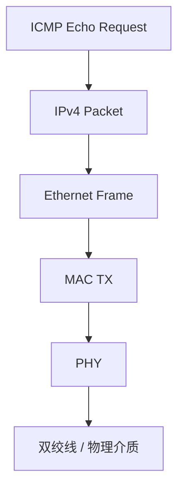
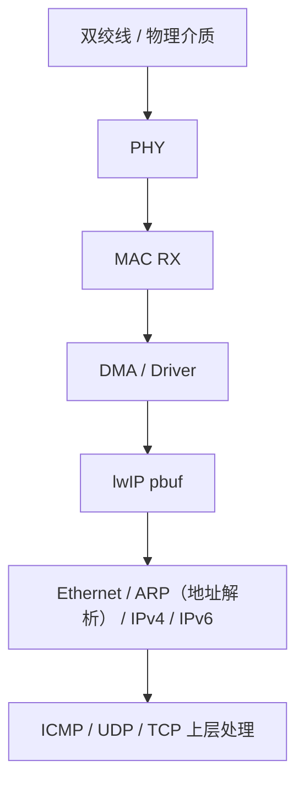
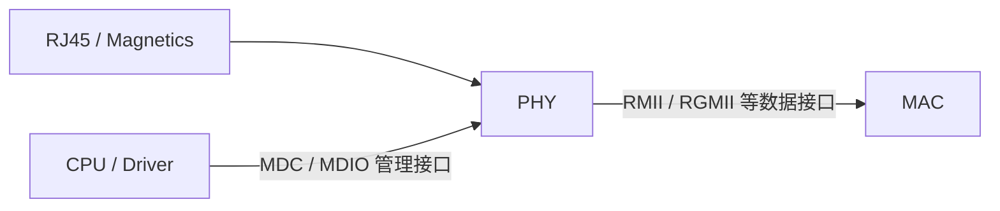
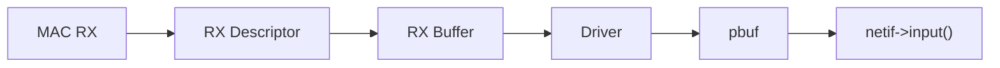
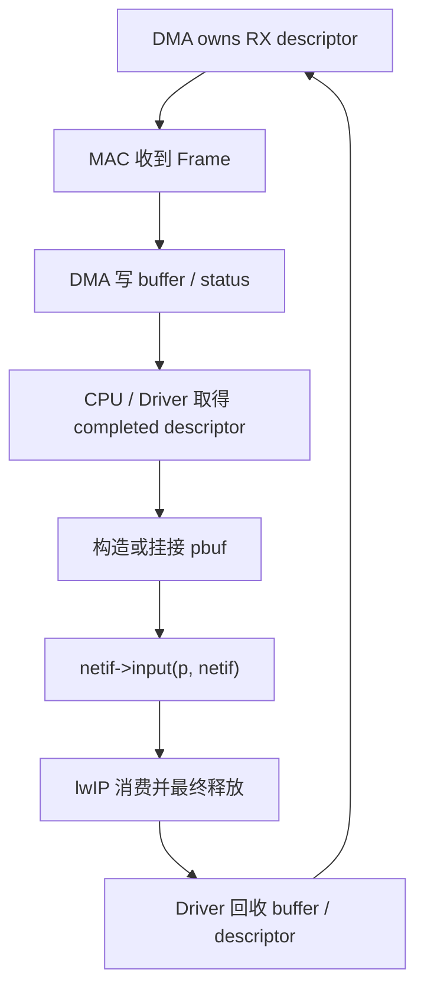
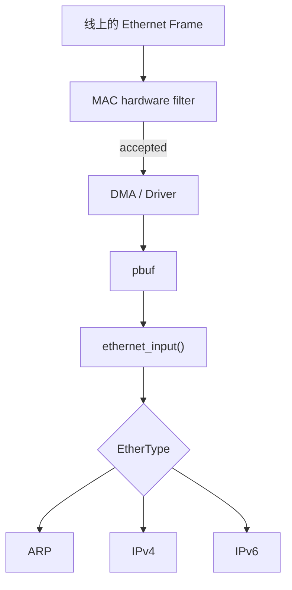
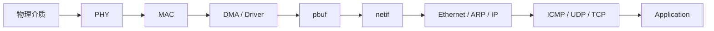

<meta name="referrer" content="no-referrer" />

# 教程 00：从网线上的电信号到 lwIP——PHY、MAC、DMA 与 `netif` 的完整边界

> 摘要：从初学者视角建立 Ethernet 的 PHY、MAC 与 Frame 心智模型，再沿 PHY→MAC→DMA/Driver→pbuf→netif 解释 MCU 与 lwIP 的真实边界。

[TOC]

Ethernet（以太网）是局域网里最常见的链路技术之一。Ethernet Frame（以太网帧）是 MAC 在链路上传输和接收的基本二层数据单元。对 MCU 网络开发而言，真正需要同时看懂的是两条边界：一条是 **网线上的信号怎样经过 PHY、MAC 和 DMA 变成内存里的 Ethernet Frame**，另一条是 **这些 Frame 怎样通过 Driver、`pbuf` 和 `netif` 进入 lwIP**。

本文第一次使用几个后面会反复出现的对象：**PHY（Physical Layer transceiver，物理层收发器）**负责把网线侧的模拟/符号信号与 MAC 侧的数字接口互相转换；**MAC（Media Access Control，介质访问控制器）**负责 Ethernet Frame 的发送、接收、过滤和 FCS（Frame Check Sequence，帧校验序列）等链路层工作；**DMA（Direct Memory Access，直接内存访问）**负责在 MAC 与内存 buffer 之间搬运 Frame；**Driver** 管理具体 MAC/DMA/PHY；lwIP 的 **`pbuf`（packet buffer）**承载协议栈看到的报文字节，**`netif`（network interface）**则抽象“一个可供协议栈收发 packet 的网络接口”。[S2](#source-s2)[S3](#source-s3)

这篇文章的目标不是背完 IEEE 802.3，而是建立一个足以支撑后续源码、抓包和 MCU 驱动调试的系统模型。即使不打开任何外部链接，正文仍会把后续需要的 Ethernet 基础讲完整；外部资料只用于确认规范事实和继续深入。

## 1. 建议提前阅读：三份资料分别解决什么问题

下面的资料值得在学习过程中反复对照，但不是继续阅读本文的强制前置。

1. [Microchip AN1120 — Ethernet Theory of Operation](https://www.microchip.com/en-us/application-notes/an1120)：适合第一次建立 Ethernet 协议栈位置、封装、Frame、MAC/PHY 和 RX/TX 数据流心智模型。[S1](#source-s1) 如果只读一份补充资料，优先看它的 Internet Protocol Stack、Data Encapsulation、Ethernet Frame Format 与 RX/TX stream 章节。
2. [IEEE 802.3-2022 — IEEE Standard for Ethernet](https://standards.ieee.org/ieee/802.3/10422/)：正式规范来源，用于确认 MAC、PHY、介质接口与 Ethernet 行为边界。[S2](#source-s2) 第一次学习时不需要逐页阅读。
3. [Linux Kernel — Universal TUN/TAP device driver](https://docs.kernel.org/networking/tuntap.html)：后续 Linux Host Lab 使用 TAP 模拟二层网卡，这份文档用于理解“为什么 userspace 可以直接读写 Ethernet Frame”。[S9](#source-s9)

如果后续进入真实 MCU PHY bring-up，再按芯片选择对应 Reference Manual、PHY Datasheet 和板级原理图；本文使用 STM32H7、DP83867 等资料只是说明工程边界，不把某一颗芯片的实现写成 Ethernet 通用规则。[S6](#source-s6)[S7](#source-s7)

## 2. 先把 Ethernet 放进完整网络路径

应用发送的数据不会直接变成网线上的电信号。这里的 IPv4（Internet Protocol version 4，互联网协议第 4 版）负责网络层寻址；IPv6（Internet Protocol version 6）是同一网络层职责的下一代协议。ARP（Address Resolution Protocol，地址解析协议）在 IPv4 Ethernet 局域网中把目标 IPv4 地址解析成下一跳 MAC 地址。Ping 常用 ICMP（Internet Control Message Protocol，互联网控制消息协议）的 Echo Request / Echo Reply 检查网络层可达性；UDP（User Datagram Protocol）和 TCP（Transmission Control Protocol）则是后续常见的传输层协议。以一个 IPv4 Ping 为例，发送方向可以先理解成：



接收方向则反过来：



这里第一次需要区分几个容易混淆的数据单位：

| 名称 | 所在层次 | 当前文章中的含义 |
| --- | --- | --- |
| Ethernet **Frame（帧）** | Link Layer | MAC 在链路上发送/接收的二层数据单元 |
| IPv4 **Packet / Datagram（包/数据报）** | Network Layer | Ethernet payload 中承载的网络层数据 |
| TCP **Segment（段）** | Transport Layer | IPv4/IPv6 payload 中承载的 TCP 数据单元 |
| `pbuf` | lwIP 内部对象 | 保存当前协议层可见字节及长度、链、引用关系的软件 buffer |

Frame、IP Packet 与 `pbuf` 不是三个不同网络副本的固定关系。`pbuf->payload` 是一个会随协议层处理而移动的数据视图：刚进入 Ethernet 层时通常指向 Ethernet Header，进入 IPv4 层后 Ethernet Header 已经被消费，后续再继续推进到 transport header。[S3](#source-s3)

## 3. 一个 Ethernet Frame 至少要先看懂什么

后续源码和 Wireshark 中最常遇到的 Ethernet II Frame 可以先抽象成：

```text
+--------------------+
| Destination MAC    |  目标链路地址
+--------------------+
| Source MAC         |  源链路地址
+--------------------+
| EtherType          |  payload 属于哪种上层协议
+--------------------+
| Payload            |  ARP / IPv4 / IPv6 ...
+--------------------+
| FCS                |  链路层错误检测，通常由 MAC 硬件处理
+--------------------+
```

**MAC Address（MAC 地址）**是 Ethernet 链路层使用的地址，不等于 IPv4/IPv6 地址。Destination MAC 决定这一帧在当前二层网络中交给哪个接口；`EtherType` 则告诉接收端 payload 应该按哪一种上层协议解释，例如 ARP、IPv4 或 IPv6。[S1](#source-s1)[S3](#source-s3)

目标 lwIP 版本中的基础 Ethernet Header 对应：[S3](#source-s3)

```c
struct eth_hdr {
  struct eth_addr dest;
  struct eth_addr src;
  u16_t type;
};
```

这段结构体没有 Preamble、SFD 或 FCS，不代表这些内容在线路上不存在，而是说明 **lwIP 与 MAC 硬件的观察边界并不等于完整线侧 Frame**。Preamble/SFD 通常由 MAC 发送/识别，FCS 通常由 MAC 生成和校验；Driver 交给 lwIP 的 buffer 一般从 Destination MAC 开始，也通常不再包含 FCS。[S1](#source-s1)[S4](#source-s4)

IPv4 在 Ethernet 中如何封装由 RFC 894 定义；ARP 如何把协议地址解析为 hardware address 可继续参考 RFC 826。[S10](#source-s10)[S11](#source-s11) Stage 02/04 会用真实 Ping 抓包再把这两个协议映射回源码。

## 4. PHY 与 MAC：一个负责物理信号，一个负责 Frame

PHY 面向物理介质，MAC 面向 Ethernet Frame。它们通常不是通过“网线协议”直接对话，而是通过 MII（Media Independent Interface）、RMII（Reduced MII）、GMII（Gigabit MII）、RGMII（Reduced Gigabit MII）等标准化数字接口传输 data/control/clock。[S2](#source-s2)[S5](#source-s5)

除了数据接口，PHY 还常提供 MDC（Management Data Clock）和 MDIO（Management Data Input/Output）组成的管理接口，供 CPU/Driver 读写 PHY 寄存器；它承载的是管理控制，不承载正常 Ethernet Frame payload。[S5](#source-s5)[S6](#source-s6)



这里还要区分两类接口：

- **RMII/RGMII 等数据接口**：真正承载 MAC 与 PHY 之间的帧数据和时序；
- **MDC/MDIO 管理接口**：只承载 PHY 管理寄存器访问，CPU/Driver 可通过它读取 PHY ID、Link、Auto-Negotiation、speed/duplex 等状态。[S5](#source-s5)[S6](#source-s6)

**Auto-Negotiation（自动协商）**是链路伙伴之间协商可用速率、双工等能力的 PHY/Ethernet 机制；**speed/duplex** 分别表示链路速率和半双工/全双工工作方式。它们由 PHY/MAC/Driver 处理，不由 lwIP Core 实现。后续 Stage 22 与 Stage 44 会专门处理 link lifecycle 与具体 STM32 PHY 恢复流程。

因此：

```text
MDIO 能读 PHY ID
    != Link Up
Link Up
    != RMII/RGMII 数据时序正确
数字接口正确
    != DMA descriptor 正常推进
DMA 正常
    != lwIP 收包路径正确
```

这组“不等价关系”是 Ethernet 调试最重要的第一层边界。

## 5. MAC 收到 Frame 后，为什么还需要 DMA 和 Descriptor

真实 MCU 中，MAC 通常不会逐字节调用 C 函数把 Frame 填进 `pbuf`。MAC 与内存之间一般由 DMA 搬运，而 DMA 依靠 **Descriptor（描述符）**知道 buffer 在哪里、多长、当前由 CPU 还是 DMA 使用以及传输结果是什么。[S7](#source-s7)

可以把 RX 数据流先理解为：



常见 Descriptor 需要表达的概念包括：

```text
buffer address
length
ownership
first/last segment
status/error
```

其中 **ownership（所有权）**回答“当前谁有权读写或回收这个 buffer”。例如 RX descriptor 在 DMA 持有时，CPU 不能把它当成已经完成的 packet 使用；DMA 收到完整 Frame 并交还后，Driver 才能读取长度/status、构造 `pbuf`，最后在资源不再被 lwIP 使用时把 buffer 重新交给 DMA。

典型 RX 生命周期：



TX 则方向相反：lwIP 把一个已经完成二层封装的 `pbuf` 交给 `netif->linkoutput()`，Driver 把 payload 组织给 TX descriptor，满足平台所需的 cache/memory ordering 后把 ownership 交给 DMA；发送完成后资源才可以回收。Stage 20/21 讲通用 ownership、zero-copy 与 backpressure，Stage 43 再进入 STM32H7 的具体 descriptor/cache 路径。

## 6. `pbuf` 与 DMA Buffer 不是同一个概念

这是从驱动进入 lwIP 时最容易形成错误心智模型的地方。

**DMA Buffer** 是 MAC/DMA 能访问的一段内存；**`pbuf`** 是 lwIP 的 packet buffer 对象，除了指向数据，还维护 `len`、`tot_len`、链和引用计数等协议栈语义。[S3](#source-s3)

二者可以有两种常见关系：

```text
Copy RX:
DMA Buffer --copy--> lwIP-owned pbuf

Zero-copy / custom RX:
DMA Buffer <---- pbuf 指向同一片数据 ---->
```

Copy 模式生命周期简单，但增加一次内存复制；Zero-copy 可以减少复制，却要求 Driver、DMA 与 lwIP 对“什么时候可以再次使用这片内存”有严格一致的 ownership contract。Stage 03 会专门解释 `pbuf` 生命周期，Stage 20/43 再把它与 DMA buffer 连接起来。

在带 D-Cache（Data Cache，数据缓存）的 MCU 上还会多一个可见性问题：CPU Cache 与 DMA 访问主存可能看到不同版本的数据。**Clean** 通常表示把 CPU cache 中的脏数据写回主存，**Invalidate** 表示丢弃 CPU cache 中旧副本，让后续读取重新从主存取得 DMA 已更新的数据。具体何时做、操作范围和对齐要求属于平台实现，不是 lwIP 协议规则。

## 7. `netif` 为什么是 lwIP 与平台驱动的关键边界

`struct netif` 把“协议栈如何向一个接口收发 packet”抽象成 callback。目标版本中，当前系列最重要的是：[S3](#source-s3)

| callback | 当前职责 |
| --- | --- |
| `netif->input` | Driver 把收到的 packet 交给协议栈 |
| `netif->output` | IPv4 输出入口，Ethernet 场景常进入 ARP/二层封装 |
| `netif->output_ip6` | IPv6 输出入口 |
| `netif->linkoutput` | 已完成 L2 封装的数据真正交给 link driver |

因此 RX 可以简化为：

```text
Driver 取得 Frame
→ 构造/挂接 pbuf
→ netif->input(p, netif)
→ tcpip_input() 或 ethernet_input()
→ ARP / IPv4 / IPv6 ...
```

TX 则通常是：

```text
IPv4 / IPv6 上层输出
→ 二层封装
→ netif->linkoutput()
→ Driver / DMA
→ MAC
→ PHY
```

`netif` 不等于物理网卡硬件本身；它是 lwIP 中代表网络接口的软件对象。真实 MCU 上它连接 Ethernet Driver，Linux Host Lab 中则可以连接 TAP Port。正因为这个抽象存在，同一套 lwIP Core 才能在不同硬件/Host Port 上复用。[S3](#source-s3)[S4](#source-s4)

## 8. MAC Filter 与 `ethernet_input()` 是两个不同的分发边界

当 Frame 从线进入本机时，至少会经历两种完全不同的“要不要接收/交给谁”的判断。

第一层是 **MAC hardware receive filter**：硬件根据 Destination MAC、broadcast（广播，面向当前二层广播域内所有节点）、multicast（组播，面向加入某个组的节点）、promiscuous（混杂模式，接收本来不属于本机的更多 Frame）等规则决定 Frame 是否进入本机 RX path。不同 MAC 的 perfect/hash/filter 细节不同，这是硬件/Driver 行为。[S7](#source-s7)[S8](#source-s8)

第二层是 lwIP 的协议分发：Frame 已经被 Driver 交给 `ethernet_input()` 后，lwIP 根据 EtherType 决定 payload 进入 ARP、IPv4、IPv6 等哪个上层处理器。[S3](#source-s3)



所以“Frame 为什么没有进入 lwIP”和“Frame 进入 lwIP 后为什么没有进入 IPv4”是两个层次的问题，不能用同一个断点解释。

## 9. Link Up、Interface Up、IP Ready 与 Ping Success 不是同一个状态

Ethernet 网络 bring-up 至少包含多个独立状态。lwIP 也明确把 link state 与 interface up/down 分开管理。[S3](#source-s3)

| 状态 | 表示什么 | 不能推出什么 |
| --- | --- | --- |
| PHY Link Up | PHY 已建立物理链路 | DMA 与 lwIP 一定正常 |
| `NETIF_FLAG_LINK_UP` | 软件记录 link 已可用 | interface 已启用或 IP 已配置 |
| `NETIF_FLAG_UP` | 协议栈允许该接口工作 | 地址/路由一定正确 |
| IP Ready | address/netmask/route 等网络层条件满足 | 对端一定可达 |
| ARP/ICMP Success | L2/L3 基本收发闭环 | UDP/TCP/Application 一定正确 |

这也是后续排障顺序应该从底向上推进的原因：

```text
PHY Link
→ MAC/RMII/RGMII
→ DMA Descriptor / Buffer
→ Driver / pbuf
→ netif input/output
→ Ethernet / ARP
→ IPv4 / IPv6
→ ICMP / UDP / TCP
→ Application
```

如果最后一个已经确认正确的边界是 DMA，就不应该先在 TCP callback 中寻找原因。

## 10. Linux TAP 能学习什么，不能证明什么

本仓库后续使用 Linux TAP 学习 lwIP。TAP 是 Linux 提供的虚拟二层网络设备：userspace 程序从 TAP fd 读取时拿到 Ethernet Frame，写回 TAP 时则把 Ethernet Frame 注入 Host 网络路径。[S9](#source-s9)

目标 Unix Port 中，TAP RX 会读取 Frame、构造 `PBUF_RAW` 再交给 `netif->input()`；TX 则把 `pbuf` 数据写回 TAP。[S4](#source-s4)

因此 Host Lab 很适合研究：

```text
Ethernet Header
ARP / IPv4 / IPv6
ICMP / UDP / TCP
pbuf / netif
thread / mailbox
```

但它没有真实 MCU 的：

```text
PHY 模拟前端
实际 Auto-Negotiation 波形
RMII/RGMII 时序
MAC DMA descriptor
MCU D-Cache coherency
magnetics / ESD / PCB layout
```

所以 TAP 上 Ping 成功能够证明当前 Host Port 与 lwIP Core 的数据通路成立，却不能证明目标板 PHY/MAC/DMA bring-up 正确。反过来，目标板 Link Up 也不能证明 lwIP Core 路径已经工作。

## 11. 从这一张总图进入后续系列

到这里，后续所有文章都可以挂回同一张边界图：



接下来的学习顺序也由这张图自然展开：

- Stage 01 先把 upstream 源码、Linux Host、Debug build tree 与 compile database 准备好；
- Stage 02 从真实 `main()` 走到第一次 Ping，把 TAP Frame 映射到 lwIP 调用链；
- Stage 03/04 再分别深化 `pbuf` 生命周期与 Ethernet/ARP/IPv4/ICMP 分发；
- Stage 20～22 抽象 DMA ownership、descriptor ring/backpressure 与 PHY link lifecycle；
- Stage 42～44 最终回到 STM32H750 + RT-Thread 的具体实现。

Stage 00 最需要带走的不是某个寄存器，而是三个边界：**PHY/MAC 负责物理链路与 Ethernet Frame，DMA/Driver 负责硬件 buffer 与软件 packet 的交接，lwIP 从 `pbuf`/`netif` 这一侧继续实现网络协议。**

## 资料来源

<a id="source-s1"></a>
### [S1] Microchip AN1120 — Ethernet Theory of Operation
- 类型：厂商 Application Note / Ethernet 入门资料
- 版本：AN1120 / DS01120A
- URL/文档：[AN1120 官方页面](https://www.microchip.com/en-us/application-notes/an1120)、[Ethernet Theory of Operation PDF](https://ww1.microchip.com/downloads/en/AppNotes/01120a.pdf)
- 使用位置：Ethernet 系统位置、封装、Frame、MAC/PHY、RX/TX 数据流
- 支撑内容：用于建立 Ethernet 协议栈与 Frame 的规范化心智模型，并作为后续深入阅读入口

<a id="source-s2"></a>
### [S2] IEEE 802.3-2022 — IEEE Standard for Ethernet
- 类型：标准规范
- 版本：IEEE 802.3-2022
- URL/文档：[IEEE 802.3-2022](https://standards.ieee.org/ieee/802.3/10422/)
- 使用位置：PHY/MAC、Ethernet 标准边界、链路层术语
- 支撑内容：Ethernet MAC、Physical Layer、介质接口与标准职责边界

<a id="source-s3"></a>
### [S3] lwIP upstream `master`：`netif` 与 Ethernet Core
- 类型：目标版本上游源码
- 版本：`d08f4773edd0182b7910fc8f046eed82ffcd67c9`
- URL/文档：[`src/include/lwip/netif.h`](https://github.com/lwip-tcpip/lwip/blob/d08f4773edd0182b7910fc8f046eed82ffcd67c9/src/include/lwip/netif.h)、[`src/include/lwip/prot/ethernet.h`](https://github.com/lwip-tcpip/lwip/blob/d08f4773edd0182b7910fc8f046eed82ffcd67c9/src/include/lwip/prot/ethernet.h)、[`src/netif/ethernet.c`](https://github.com/lwip-tcpip/lwip/blob/d08f4773edd0182b7910fc8f046eed82ffcd67c9/src/netif/ethernet.c)
- 使用位置：`struct eth_hdr`、`netif` callback、EtherType 分发、link/interface 状态
- 支撑内容：确认 lwIP 看到的 Ethernet Header、`netif->input/output/linkoutput` 与 Ethernet Core 边界

<a id="source-s4"></a>
### [S4] lwIP Unix TAP Port
- 类型：目标版本上游 Port 源码
- 版本：`d08f4773edd0182b7910fc8f046eed82ffcd67c9`
- URL/文档：[`contrib/ports/unix/port/netif/tapif.c`](https://github.com/lwip-tcpip/lwip/blob/d08f4773edd0182b7910fc8f046eed82ffcd67c9/contrib/ports/unix/port/netif/tapif.c)
- 使用位置：TAP 与真实 MAC/DMA 的能力边界、`PBUF_RAW` RX/TX
- 支撑内容：Host Port 从 TAP fd 读取/写入 Ethernet Frame 并连接 `pbuf`/`netif`

<a id="source-s5"></a>
### [S5] STMicroelectronics — Ethernet overview
- 类型：厂商平台资料
- URL/文档：[STM32MPU Ethernet overview](https://wiki.st.com/stm32mpu/wiki/Ethernet_overview)
- 使用位置：PHY/MAC 数据接口与 MDC/MDIO 管理接口
- 支撑内容：MII/RMII/GMII/RGMII 与 MDC/MDIO 的平台实现示例

<a id="source-s6"></a>
### [S6] Texas Instruments — DP83867 Gigabit Ethernet PHY
- 类型：PHY 数据手册
- 版本：DP83867E/IS/CS
- URL/文档：[DP83867E/IS/CS Data Sheet](https://www.ti.com/lit/ds/symlink/dp83867e.pdf)
- 使用位置：RGMII timing/delay、PHY 管理状态与 speed/duplex 示例
- 支撑内容：说明真实 PHY 上时序、内部 delay、管理状态属于平台/器件实现

<a id="source-s7"></a>
### [S7] STMicroelectronics STM32H7 Reference Manual — Ethernet MAC/DMA
- 类型：MCU Reference Manual
- 版本：RM0433 Rev.5
- URL/文档：[STM32H7 Reference Manual](https://www.st.com/resource/en/reference_manual/rm0433-stm32h742-stm32h743-753-and-stm32h750-value-line-advanced-armbased-32bit-mcus-stmicroelectronics.pdf)
- 使用位置：MAC filtering、DMA descriptor、硬件/Driver 边界
- 支撑内容：提供具体 MCU 的 MAC/DMA/过滤实现实例；不作为 Ethernet 通用格式来源

<a id="source-s8"></a>
### [S8] Microchip — Ethernet MAC Receive Block
- 类型：MAC 官方文档
- URL/文档：[MAC Receive Block](https://onlinedocs.microchip.com/oxy/GUID-7A87AF7C-8456-416F-A89B-41F172C54117-en-US-10/GUID-647F9059-B628-439F-85EA-6D5DC3979175.html)
- 使用位置：MAC receive filter/error 与 RX delivery 边界
- 支撑内容：说明 FCS/length/symbol error 与硬件接收资源、过滤和丢弃之间的控制器实现边界

<a id="source-s9"></a>
### [S9] Linux Kernel — Universal TUN/TAP device driver
- 类型：Linux Kernel 官方文档
- URL/文档：[Universal TUN/TAP device driver](https://docs.kernel.org/networking/tuntap.html)
- 使用位置：Linux Host Lab 中 TAP 的定位
- 支撑内容：TAP 的 userspace 虚拟 Ethernet device 模型及读写边界

<a id="source-s10"></a>
### [S10] RFC 894 — A Standard for the Transmission of IP Datagrams over Ethernet Networks
- 类型：Internet Standard
- URL/文档：[RFC 894](https://www.rfc-editor.org/rfc/rfc894.html)
- 使用位置：IPv4 datagram 与 Ethernet Frame 的封装关系
- 支撑内容：确认 IPv4 over Ethernet 的标准封装

<a id="source-s11"></a>
### [S11] RFC 826 — An Ethernet Address Resolution Protocol
- 类型：Internet Standard
- URL/文档：[RFC 826](https://www.rfc-editor.org/rfc/rfc826.html)
- 使用位置：与 Stage 02/04 Ping/ARP 源码教程的衔接
- 支撑内容：ARP Request/Reply 与 protocol address 到 hardware address 的解析语义