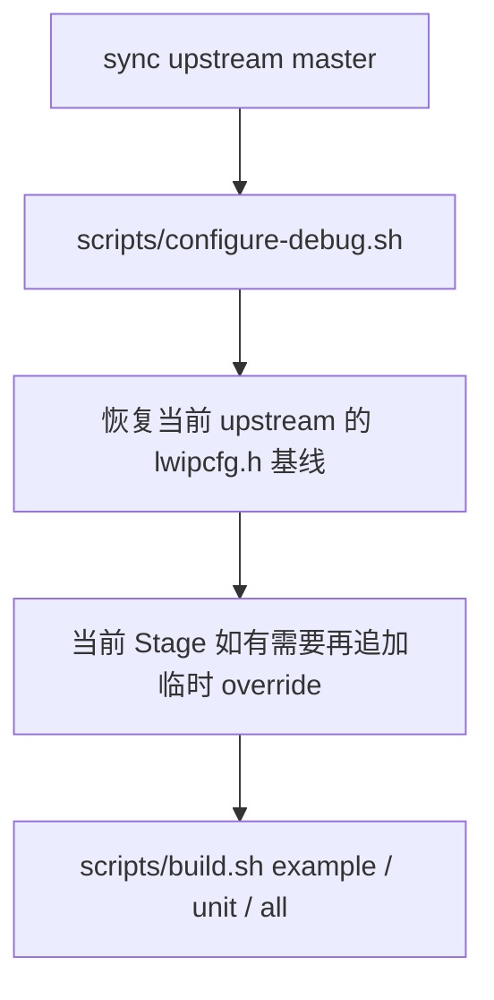
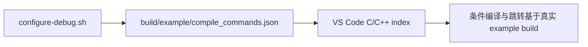
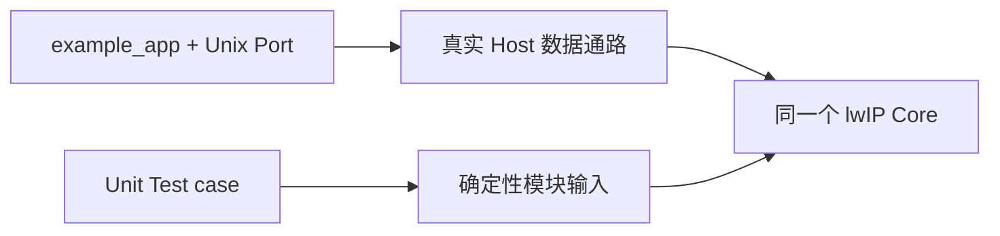
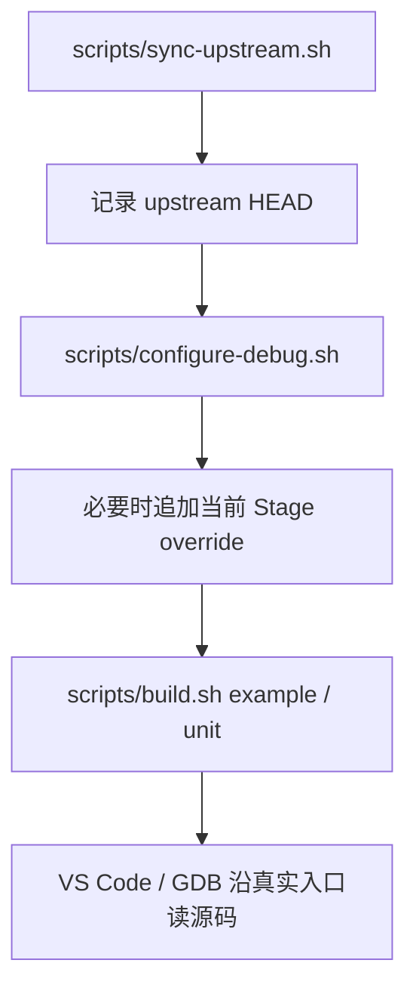

<meta name="referrer" content="no-referrer" />

# 教程 01：从 upstream `master` 到第一条可读源码链——Linux Host、构建树与源码地图

> 摘要：沿一条可重复的成功路径建立 lwIP Linux Host 学习环境：锁定 upstream revision、生成 Debug build tree 与 compile database，并把 VS Code 带到真实源码入口。

[TOC]

这一篇不先讲 TCP、UDP 或 `pbuf`。目标只有一个：**把仓库准备到“下一篇可以直接从 `main()` 开始读源码”的状态。**

本文把官方 `lwip-tcpip/lwip` 仓库称为 **upstream（上游仓库）**；`master` 是当前系列持续跟踪的 upstream 分支。**HEAD** 表示当前 checkout 指向的 Git commit；**Debug build tree（调试构建树）**是 CMake 为 Debug 配置生成的构建目录；**compile database（编译数据库）**则记录每个 C 源文件真实使用的 compiler、include path、宏和编译选项。后文会在第一次操作这些对象时继续展开。

完成 Stage 01 后应同时具备四个可观察结果：

```text
upstream/lwip 已初始化并能显示明确 HEAD commit
scripts/check-env.sh 通过
build/example 与 build/unit-tests 已完成 Debug configure
两个 build tree 都生成 compile_commands.json，并能成功构建目标
```

所有命令都从项目根目录执行。

## 1. 先确认 Linux Host 工具齐全，再碰 upstream

第一次执行任何仓库初始化脚本前，先运行：

```sh
scripts/check-env.sh
```

这里的 **Host** 指运行构建工具和 lwIP Unix Port 的 Linux 主机，不是后续真实 MCU。脚本检查：[S3](#source-s3)

```text
git
cmake
ninja
gdb
pkg-config
C compiler
libcheck
```

这些工具分别承担：

- **Git**：管理父仓库和 lwIP submodule；
- **CMake**：根据项目描述生成 build tree；
- **Ninja**：执行当前 CMake 生成的实际构建任务；
- **GDB**：后续源码断点调试；
- **pkg-config**：查询 Host library 的编译/链接参数；
- **C compiler**：真正编译 lwIP C 源码；
- **libcheck**：upstream Unix Unit Test 使用的 C 单元测试框架，不是 lwIP Core 运行依赖。[S3](#source-s3)

成功时每项会输出 `[OK]`，最后出现：

```text
Common Host tools are ready.
```

如果出现 `[MISS]`，Ubuntu 环境可以按脚本给出的命令补依赖：

```sh
sudo apt update
sudo apt install build-essential cmake ninja-build gdb check git pkg-config
```

`bootstrap-repository.sh` 本身就依赖 Git，`sync-upstream.sh` 还需要能访问 upstream remote，因此把 Host 工具检查放在第一步可以避免“初始化脚本失败后才发现 git 不存在”这种隐形前置条件。

## 2. 为什么 `upstream/lwip` 使用 Git submodule

Host 工具已经具备，再处理源码版本。

`upstream/lwip` 使用 **Git submodule（Git 子模块）**管理：父仓库不把 lwIP 的全部历史复制成自己的一部分，而是记录“另一个 Git 仓库当前应该位于哪个 commit”。父仓库索引里保存这种 submodule 指针的条目也常称为 **gitlink**。[S2](#source-s2)

项目结构因此分成两个版本对象：

```text
lwip-source-lab/
├── docs/                  本系列文章
├── scripts/               Host 学习脚本
└── upstream/lwip/         官方 lwIP submodule
```

| 版本对象 | 决定什么 |
| --- | --- |
| 父仓库 commit | 文档、脚本以及 submodule 指针的版本 |
| `upstream/lwip` commit | 当前真正阅读和构建的 lwIP 实现版本 |

后续文章分析函数行为时，真正决定实现语义的是第二项。所以这一阶段的第一条版本原则是：**每次进入源码前先知道 `upstream/lwip` 当前到底是哪一个 commit。**

## 3. 第一次 bootstrap：让 submodule、branch 与 HEAD 都变成显式状态

第一次准备仓库时执行：

```sh
scripts/bootstrap-repository.sh
```

脚本会：[S2](#source-s2)

1. 确认项目根目录是父 Git 仓库；必要时初始化；
2. 如果父仓库已经记录 `upstream/lwip` submodule，就执行 `submodule update --init`；
3. 如果目录里已经存在一个干净的 lwIP Git clone，则尽量复用，而不是先删除；
4. 把 submodule branch 配置为 `master`；
5. 调用 `scripts/sync-upstream.sh` 同步官方 `master`；
6. 最后打印当前 lwIP `HEAD`。

如果已有 lwIP clone 存在已跟踪本地修改，脚本会停止而不是静默覆盖；这一点保护了源码实验现场。[S2](#source-s2)

成功路径末尾应该出现：

```text
lwIP submodule initialized.
HEAD: <40-character commit>
```

紧接着确认 branch 与 revision：

```sh
git -C upstream/lwip branch --show-current
git -C upstream/lwip rev-parse HEAD
```

当前系列文章绑定的 upstream revision 是：

```text
d08f4773edd0182b7910fc8f046eed82ffcd67c9
```

[S1](#source-s1) 如果以后 `master` 前进，不要把旧文章中的结论自动套到新 commit；Source Map 应绑定实际阅读的 revision。

### 日常更新不再重复 bootstrap

仓库建立完成后使用：

```sh
scripts/sync-upstream.sh
```

它会 `fetch origin master`，确认本地 branch 是 `master`，并且只允许 **fast-forward（快进）**。Fast-forward 表示本地 HEAD 仍是远端新 HEAD 的祖先，Git 只需要把分支指针向前移动，不需要改写已经分叉的历史。[S2](#source-s2)

如果本地有已跟踪修改、分支错误、领先或分叉，脚本会停止。这里“拒绝自动修复”比强行同步更适合源码学习仓库，因为版本冲突必须显式处理。

## 4. `configure-debug.sh`：一次建立两棵独立 Debug build tree

源码版本明确以后执行：

```sh
scripts/configure-debug.sh
```

**Build tree（构建树）**是 CMake 在源码目录之外生成的构建文件、缓存、target 关系和编译数据库。当前脚本建立两棵：[S3](#source-s3)

```text
build/
├── example/       upstream Unix example_app
└── unit-tests/    upstream Unix Check tests
```

这里的 `example_app` 是 upstream 提供的 Unix 示例程序，用真实 Host Port 驱动 lwIP Core；Unit Test（单元测试）则用人工构造的确定性输入触发某个模块。Stage 00 已说明 TAP 是 Linux 的虚拟 Ethernet 接口，Stage 02 会让 `example_app` 通过 TAP 真正收发 Frame。

它们服务于两种学习路径：

| Build tree | 当前用途 |
| --- | --- |
| `build/example` | 真实 Unix Port、TAP 与协议栈数据通路 |
| `build/unit-tests` | 用确定性输入触发 `pbuf`、TCP、mem/memp 等模块 |

### 4.1 为什么 configure 一开始先刷新 `lwipcfg.h`

脚本先把：

```text
contrib/examples/example_app/lwipcfg.h.example
```

复制为：

```text
contrib/examples/example_app/lwipcfg.h
```

`lwipcfg.h` 是 upstream `example_app` 的本地配置入口，不是 lwIP Core 的唯一全局配置文件。每次 configure 都从当前 upstream 模板恢复，可以避免前一个 Stage 临时追加的宏污染下一个 Stage。[S3](#source-s3)

这里的 **Stage override** 指某一篇教程为了观察特定编译分支而临时追加的配置宏。它只服务于当前学习阶段，不是永久项目配置。

因此后续 Stage 的顺序固定为：



追加 override 后不要再次执行 `configure-debug.sh`，因为模板复制会把刚写入的临时配置覆盖掉。

### 4.2 成功后应该看到什么

脚本末尾会打印：

```text
Example build:    .../build/example
Unit-test build:  .../build/unit-tests
```

立即检查 CMake cache：

```sh
test -f build/example/CMakeCache.txt
test -f build/unit-tests/CMakeCache.txt
```

两个命令都返回 0，说明两条学习路径已经完成 configure。

## 5. `compile_commands.json`：让编辑器知道每个 `.c` 文件实际上怎样编译

两棵 build tree 都启用了：

```text
-DCMAKE_EXPORT_COMPILE_COMMANDS=ON
```

因此会生成：

```text
build/example/compile_commands.json
build/unit-tests/compile_commands.json
```

**Compile database（编译数据库）**记录每个 **translation unit（翻译单元，通常对应一次独立编译的 `.c` 文件）**真实使用的 compiler、include path、`-D` 宏和其他编译参数。[S3](#source-s3)

它直接影响源码阅读质量，因为 lwIP 大量逻辑依赖条件编译：

```c
#if NO_SYS
#if LWIP_IPV4
#if LWIP_TCP
#if TCP_QUEUE_OOSEQ
```

如果编辑器不知道当前 translation unit 的真实宏，就可能把不会进入当前 build 的分支当成有效代码，或者把真正执行的分支错误灰掉。

configure 后检查：

```sh
test -s build/example/compile_commands.json
test -s build/unit-tests/compile_commands.json
```

`-s` 要求文件存在且非空。到这里，源码索引需要的机器可读编译上下文已经产生。

## 6. 第一次完整 build：确认“不只是能索引，还真的能编译”

执行：

```sh
scripts/build.sh all
```

`build.sh` 不会重新 configure，也不会修改 `lwipcfg.h`；它只检查 build tree 已存在，然后分别构建：[S3](#source-s3)

```text
example_app
lwip_unittests
```

也可以按需要单独执行：

```sh
scripts/build.sh example
scripts/build.sh unit
```

第一次成功的判断很直接：`scripts/build.sh all` 以 0 退出，并且 CMake/Ninja 没有编译或链接错误。如果 build tree 尚未配置，脚本会明确提示先执行 `scripts/configure-debug.sh`，不会偷偷替当前 Stage 重跑 configure。[S3](#source-s3)

到这里要区分两个结果：

```text
compile_commands.json 存在
    -> 编辑器有真实编译上下文

build 成功
    -> 当前 Host toolchain + 当前 upstream revision 能完成目标编译
```

两者都成立，后续的“跳转到定义”和 GDB 断点才建立在真实 build 上。

## 7. VS Code 为什么默认绑定 example build 的 compile database

仓库 `.vscode/settings.json` 把 C/C++ 默认 compile database 指向：[S4](#source-s4)

```text
${workspaceFolder}/build/example/compile_commands.json
```

同时设置：

```text
cmake.sourceDirectory = upstream/lwip
cmake.buildDirectory  = build/example
cmake.configureOnOpen = false
```

`configureOnOpen=false` 很重要：打开 VS Code 不应该绕过仓库脚本自动重跑 CMake，因为 `configure-debug.sh` 还负责恢复 `lwipcfg.h` 基线并执行 Host toolchain / libcheck 兼容性探测。[S3](#source-s3)[S4](#source-s4)

因此 Stage 01 到这里形成了一条明确关系：



Unit Test 需要单独分析时，再查看 `build/unit-tests/compile_commands.json` 对应条目，不把两棵 build tree 的宏手工混进同一份 `includePath`。

## 8. 第一条源码链从哪里开始：先找行为入口，不按目录浏览

环境已经具备版本、索引和 build 证据，现在才进入源码。

### 8.1 Unix `example_app` 的真实入口

当前 upstream example 入口是：[S5](#source-s5)

```text
contrib/examples/example_app/test.c
```

后续主线从：

```text
main()
  -> main_loop()
```

开始。Stage 02 会继续进入 `tcpip_init()`、`test_init()`、`netif` 和 TAP。Stage 01 不提前展开这些函数，因为这一篇的学习终点只是让它们已经“可定位、可跳转、可构建”。

### 8.2 Unit Test 是另一种触发方式，不是另一套 lwIP Core

Unit Test 从具体 suite/case 进入。例如 Stage 03 会使用：[S6](#source-s6)

```text
test/unit/core/test_pbuf.c
```

测试代码构造确定性输入，再调用 `pbuf_alloc()`、`pbuf_cat()`、`pbuf_free()` 等 Core API。它与 `example_app` 的关系可以概括为：



因此后续文章可以同时使用 example 与 Unit Test 做证据，但不能把 example/test 的特殊实现直接写成 **lwIP Core contract（Core 对上层与 Port 保持的接口/行为约束）**。

## 9. 第一张源码地图：只解决“源码在哪”，不提前替代运行时调用链

到这里再建立目录地图最合适，因为 build、compile database 和真实入口都已经存在。

| 目录 | 本系列主要关注点 |
| --- | --- |
| `src/core/` | IPv4、UDP、TCP、`pbuf`、mem/memp 等 Core 实现 |
| `src/api/` | `tcpip_thread`、Netconn、Socket API |
| `src/include/lwip/` | Core 数据结构、配置项和公开 API |
| `src/netif/` | Ethernet 等通用 netif 实现 |
| `contrib/ports/unix/` | Linux/Unix Host 的 `sys_arch`、TAP 等平台实现 |
| `contrib/apps/` | upstream 示例应用 |
| `test/unit/` | upstream 确定性 Unit Test |

这张表回答“源码大致在哪里”，不回答“运行时怎样执行”。后续源码文章始终从行为入口、注册关系和真实调用路径组织，而不是按目录顺序浏览。

## 10. 后续每个 Stage 的日常循环

完成这一篇后，后续学习基本重复下面的操作链：



`check-env.sh` 不必每天机械执行，但换机器、更新工具链或出现 Host 构建异常时，应先回到 Host 工具检查。

真正不能交换的是：

```text
configure baseline
→ stage-specific override
→ build
```

因为 configure 会重新复制 `lwipcfg.h.example`。

到这里，Stage 02 需要的条件已经全部建立：upstream revision 可追溯、Host 工具明确、Debug build tree 已生成、compile database 已绑定真实 build、example/unit target 能编译，而且已经知道第一条源码链从 `main()` 开始。

## 资料来源

<a id="source-s1"></a>
### [S1] lwIP upstream `master`
- 类型：目标版本上游源码
- 版本：`d08f4773edd0182b7910fc8f046eed82ffcd67c9`
- URL/文档：[lwip-tcpip/lwip](https://github.com/lwip-tcpip/lwip/tree/d08f4773edd0182b7910fc8f046eed82ffcd67c9)
- 使用位置：源码版本基线、example 与 Unit Test 入口、目录地图
- 支撑内容：确认当前系列读取的 upstream revision、源码目录和构建入口

<a id="source-s2"></a>
### [S2] 本仓库 upstream 同步脚本
- 类型：项目脚本
- 文件：[`scripts/bootstrap-repository.sh`](https://github.com/wdfk-prog/lwIP-Source-Lab/blob/main/scripts/bootstrap-repository.sh)、[`scripts/sync-upstream.sh`](https://github.com/wdfk-prog/lwIP-Source-Lab/blob/main/scripts/sync-upstream.sh)
- 使用位置：submodule、`master` 同步、HEAD 与 fast-forward 规则
- 支撑内容：证明父仓库与 upstream 版本如何分离，以及同步脚本在本地修改/分叉情况下如何停止

<a id="source-s3"></a>
### [S3] 本仓库 Host 配置与构建脚本
- 类型：项目脚本
- 文件：[`scripts/check-env.sh`](https://github.com/wdfk-prog/lwIP-Source-Lab/blob/main/scripts/check-env.sh)、[`scripts/configure-debug.sh`](https://github.com/wdfk-prog/lwIP-Source-Lab/blob/main/scripts/configure-debug.sh)、[`scripts/build.sh`](https://github.com/wdfk-prog/lwIP-Source-Lab/blob/main/scripts/build.sh)
- 使用位置：Host 工具检查、两棵 build tree、`lwipcfg.h` 基线、compile database 与 build 生命周期
- 支撑内容：证明项目实际执行的依赖检查、CMake configure、Host 兼容性探测和目标构建规则

<a id="source-s4"></a>
### [S4] 本仓库 VS Code 配置
- 类型：项目配置
- 文件：[`.vscode/settings.json`](https://github.com/wdfk-prog/lwIP-Source-Lab/blob/main/.vscode/settings.json)、[`.vscode/tasks.json`](https://github.com/wdfk-prog/lwIP-Source-Lab/blob/main/.vscode/tasks.json)、[`.vscode/launch.json`](https://github.com/wdfk-prog/lwIP-Source-Lab/blob/main/.vscode/launch.json)
- 使用位置：`compile_commands.json`、CMake Tools 与编辑器源码索引
- 支撑内容：证明 VS Code 默认使用 example build 的 compile database，并且不会在打开工作区时自动绕过仓库脚本 configure

<a id="source-s5"></a>
### [S5] upstream `example_app` 入口
- 类型：目标版本上游源码
- 版本：`d08f4773edd0182b7910fc8f046eed82ffcd67c9`
- URL/文档：[`contrib/examples/example_app/test.c`](https://github.com/lwip-tcpip/lwip/blob/d08f4773edd0182b7910fc8f046eed82ffcd67c9/contrib/examples/example_app/test.c)
- 使用位置：example 源码阅读入口
- 支撑内容：`main()`、`main_loop()`、`test_init()` 等真实入口

<a id="source-s6"></a>
### [S6] upstream `pbuf` Unit Test
- 类型：目标版本上游测试源码
- 版本：`d08f4773edd0182b7910fc8f046eed82ffcd67c9`
- URL/文档：[`test/unit/core/test_pbuf.c`](https://github.com/lwip-tcpip/lwip/blob/d08f4773edd0182b7910fc8f046eed82ffcd67c9/test/unit/core/test_pbuf.c)
- 使用位置：Unit Test 在系列中的角色
- 支撑内容：展示 upstream 如何用确定性 case 调用 `pbuf` API，并与真实 Host 数据通路形成互补证据