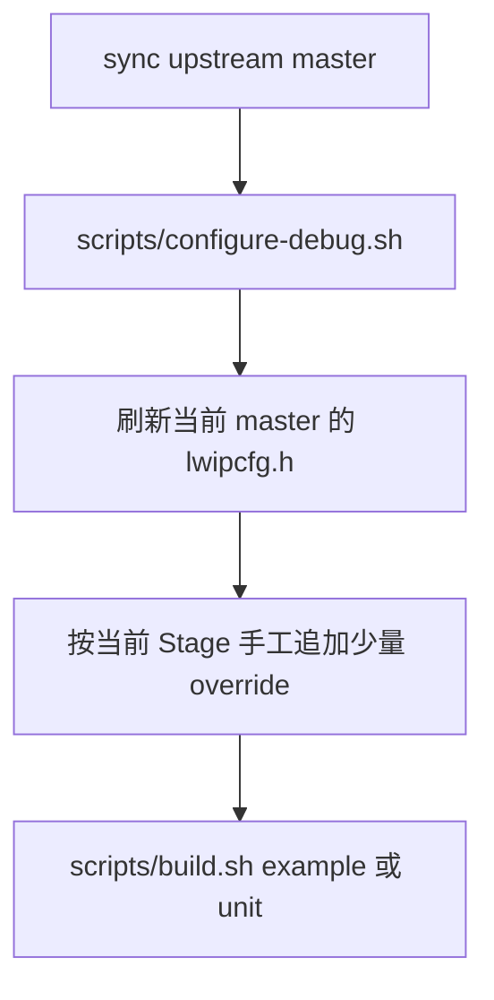
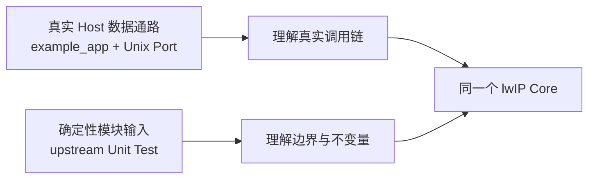

<meta name="referrer" content="no-referrer" />

# 教程 01：从 upstream `master` 到第一条可读源码链——Linux Host、构建树与源码地图

> 摘要：建立固定追踪 upstream master 的 Linux Host 学习仓库，理解源码、构建树、compile database 与后续源码阅读之间的关系。

[TOC]

本系列后续所有实验都基于同一个前提：**实际阅读的是当前 upstream `master` 的源码，而项目仓库只保存学习文档、公共脚本和 submodule 指针。** 当前系列核对的 upstream `master` 为 `d08f4773edd0182b7910fc8f046eed82ffcd67c9`。[S1](#source-s1)

这一阶段不先讲 TCP、UDP 或 pbuf。先把后续源码阅读依赖的三件事建立起来：源码从哪里来、Debug build tree 如何产生、编辑器如何知道每个 `.c` 文件真正用了哪些 include 和编译宏。

## 1. `upstream/lwip` 为什么使用 Git submodule

项目自身和 lwIP upstream 是两个不同的版本对象：

```text
lwip-source-lab/
├── docs/                  学习文章
├── scripts/               公共 Host 工具
└── upstream/lwip/         upstream lwIP submodule
```

`upstream/lwip` 不是复制进来的第三方源码目录，而是父仓库记录的一条 Gitlink。这样做的意义不是“省空间”，而是把两个问题分开：

- 项目文档可以持续修改；
- lwIP 仍然可以独立跟踪官方 `master`；
- 每次学习都能记录“这篇文章对应哪个 upstream commit”。[S2](#source-s2)

第一次建立仓库时执行：

```sh
scripts/bootstrap-repository.sh
```

这个脚本会检查父仓库、初始化或添加 `upstream/lwip` submodule，把 submodule branch 配置成 `master`，随后调用 `scripts/sync-upstream.sh` 同步官方分支。[S2](#source-s2)

以后只需要：

```sh
scripts/sync-upstream.sh
```

它会：

1. 确认 `upstream/lwip` 没有已跟踪的本地修改；
2. `fetch origin master`；
3. 确认本地 branch 是 `master`；
4. 只允许 fast-forward 到新的 `origin/master`，不会静默覆盖分叉历史。[S2](#source-s2)

这里第一次需要区分两个“版本号”：

| 对象 | 表示什么 |
| --- | --- |
| 父仓库 commit | 学习文档、脚本和 submodule 指针的版本 |
| `upstream/lwip` commit | 实际阅读的 lwIP 源码版本 |

后续文章引用源码时，真正决定实现行为的是第二项。

## 2. 先检查 Host 是否具备公共工具

执行：

```sh
scripts/check-env.sh
```

脚本检查 `git`、`cmake`、`ninja`、`gdb`、`pkg-config`、C compiler 和 `libcheck`。[S3](#source-s3)

这里的 `libcheck` 是 upstream Unix Unit Test 使用的 C 单元测试框架；它不是 lwIP Core 的运行依赖。也就是说，`example_app` 能否运行和 Unit Test 能否构建是两个不同问题。这个区分后面会反复出现：**example/port/test 是学习载体，不等于 Core 自身的硬依赖。**

## 3. `configure-debug.sh` 实际建立了什么

先执行：

```sh
scripts/configure-debug.sh
```

它建立两棵互不混用的 Debug build tree：[S3](#source-s3)

```text
build/
├── example/       upstream Unix example_app
└── unit-tests/    upstream Unix Check tests
```

### 3.1 为什么每次 configure 都刷新 `lwipcfg.h`

脚本先执行等价于：

```sh
cp upstream/lwip/contrib/examples/example_app/lwipcfg.h.example \
   upstream/lwip/contrib/examples/example_app/lwipcfg.h
```

`lwipcfg.h` 是 `example_app` 的本地配置入口，不是 lwIP Core 的全局配置文件。它会改变 example 选择哪些功能、地址和示例应用。每次 configure 先从当前 `master` 模板恢复，可以防止前一个 Stage 的临时宏残留到下一个 Stage。[S3](#source-s3)

因此后续各 Stage 的顺序固定为：



注意：**Stage override 之后不要再次执行 `configure-debug.sh`**，否则刚写入的临时配置会被模板覆盖。

### 3.2 为什么还要单独配置 Unit Test

example tree 的入口是 upstream 根目录 `CMakeLists.txt`；Unit Test tree 的入口是 `contrib/ports/unix/check`。[S1](#source-s1)

两者关注面不同：

- `example_app`：真实 Unix Port、TAP、协议栈数据通路；
- Unit Test：围绕 `pbuf`、TCP、内存等模块构造确定性输入。

`configure-debug.sh` 还会对当前 Host compiler 和 `libcheck` 做兼容性探测，仅在需要时给 Unit Test 添加 workaround。[S3](#source-s3) 这些 workaround 是 **Host toolchain 适配**，不要误写成 lwIP 协议行为。

## 4. `compile_commands.json` 为什么是源码阅读的一部分

两棵 build tree 都启用了：

```text
-DCMAKE_EXPORT_COMPILE_COMMANDS=ON
```

因此 CMake 会产生 `compile_commands.json`。这个文件记录每个 translation unit 的真实 compiler、include path、宏和选项。VS Code 默认把 `build/example/compile_commands.json` 作为 C/C++ source index 数据源。[S3](#source-s3)[S4](#source-s4)

这比手工配置一长串 `includePath` 更适合源码阅读，因为后续会遇到大量条件编译：

```c
#if NO_SYS
#if LWIP_IPV4
#if LWIP_TCP
#if TCP_QUEUE_OOSEQ
```

编辑器只有知道当前 translation unit 的真实宏，才能正确判断哪一支代码是当前 build 会编译的。

## 5. 构建入口为什么只有一个公共脚本

配置完成以后，根据需要执行：

```sh
scripts/build.sh example
scripts/build.sh unit
scripts/build.sh all
```

`build.sh` 不会偷偷重新 configure。它只检查目标 build tree 是否已经存在，然后调用对应的 CMake target。[S3](#source-s3)

这意味着后续文章里出现：

```sh
scripts/configure-debug.sh
# 修改 lwipcfg.h
scripts/build.sh example
```

这三个动作有严格顺序，不能随意交换。

## 6. 从哪个源码入口开始读

环境准备完成后，不按目录名逐文件浏览，而是先定位实际行为入口。

### 6.1 Unix `example_app`

当前 example 程序入口在：

```text
contrib/examples/example_app/test.c
```

主线从：

```text
main()
  -> main_loop()
```

开始；Stage 2 会从这里继续进入 `tcpip_init()`、`test_init()`、`netif` 和 TAP。[S5](#source-s5)

### 6.2 模块 Unit Test

Unit Test 则从具体 suite/case 反推它调用的模块 API。例如 Stage 3 读取：

```text
test/unit/core/test_pbuf.c
```

重点不是测试框架本身，而是它如何构造输入，让 `pbuf_alloc()`、`pbuf_cat()`、`pbuf_free()` 等函数在可控条件下执行。[S6](#source-s6)

因此后续源码阅读会同时使用两类证据：



这也是为什么不能把 example/test 的特殊实现直接当成 Core 规则：它们只是从不同方向触发同一套 Core 代码。

## 7. 第一张源码地图：只记“谁属于哪一层”

现在只需要建立最小目录心智模型，不在这里提前解释所有协议：

| 目录 | 本系列主要关注点 |
| --- | --- |
| `src/core/` | IPv4、UDP、TCP、pbuf、mem/memp 等 Core 实现 |
| `src/api/` | `tcpip_thread`、Netconn、Socket API |
| `src/include/lwip/` | Core 数据结构、配置项和公开 API |
| `src/netif/` | Ethernet 等通用 netif 层实现 |
| `contrib/ports/unix/` | Linux/Unix Host 对 `sys_arch`、TAP 等平台接口的实现 |
| `contrib/apps/` | upstream 示例应用 |
| `test/unit/` | upstream 确定性 Unit Test |

这张地图回答的是“源码在哪里”，不回答“运行时怎么走”。真正的调用链从下一篇 `main()` 开始建立。[S1](#source-s1)

## 资料来源

<a id="source-s1"></a>
### [S1] lwIP upstream `master`
- 版本：`d08f4773edd0182b7910fc8f046eed82ffcd67c9`
- URL/文档：[lwip-tcpip/lwip](https://github.com/lwip-tcpip/lwip/tree/d08f4773edd0182b7910fc8f046eed82ffcd67c9)
- 使用位置：源码版本基线、example 与 Unit Test 入口、目录地图
- 支撑内容：确认当前系列读取的 upstream revision、源码目录和构建入口

<a id="source-s2"></a>
### [S2] 本仓库 upstream 同步脚本
- 文件：[`scripts/bootstrap-repository.sh`](https://github.com/wdfk-prog/lwIP-Source-Lab/blob/main/scripts/bootstrap-repository.sh)、[`scripts/sync-upstream.sh`](https://github.com/wdfk-prog/lwIP-Source-Lab/blob/main/scripts/sync-upstream.sh)
- 使用位置：submodule、`master` 同步和 fast-forward 规则
- 支撑内容：证明父仓库与 upstream 版本如何分离，以及同步脚本不会静默重写分叉历史

<a id="source-s3"></a>
### [S3] 本仓库 Host 配置与构建脚本
- 文件：[`scripts/check-env.sh`](https://github.com/wdfk-prog/lwIP-Source-Lab/blob/main/scripts/check-env.sh)、[`scripts/configure-debug.sh`](https://github.com/wdfk-prog/lwIP-Source-Lab/blob/main/scripts/configure-debug.sh)、[`scripts/build.sh`](https://github.com/wdfk-prog/lwIP-Source-Lab/blob/main/scripts/build.sh)
- 使用位置：Host 工具、两棵 build tree、`lwipcfg.h` 刷新、build 生命周期
- 支撑内容：证明项目实际执行的工具检查、CMake 配置和构建规则

<a id="source-s4"></a>
### [S4] 本仓库 VS Code 配置
- 文件：[`.vscode/settings.json`](https://github.com/wdfk-prog/lwIP-Source-Lab/blob/main/.vscode/settings.json)、[`.vscode/tasks.json`](https://github.com/wdfk-prog/lwIP-Source-Lab/blob/main/.vscode/tasks.json)、[`.vscode/launch.json`](https://github.com/wdfk-prog/lwIP-Source-Lab/blob/main/.vscode/launch.json)
- 使用位置：`compile_commands.json` 与编辑器源码索引
- 支撑内容：证明 VS Code 默认使用 example build 的 compile database，并保留公共 build/debug 入口

<a id="source-s5"></a>
### [S5] upstream `example_app` 入口
- 版本：`d08f4773edd0182b7910fc8f046eed82ffcd67c9`
- URL/文档：[`contrib/examples/example_app/test.c`](https://github.com/lwip-tcpip/lwip/blob/d08f4773edd0182b7910fc8f046eed82ffcd67c9/contrib/examples/example_app/test.c)
- 使用位置：example 源码阅读入口
- 支撑内容：`main()`、`main_loop()`、`test_init()` 等真实入口

<a id="source-s6"></a>
### [S6] upstream `pbuf` Unit Test
- 版本：`d08f4773edd0182b7910fc8f046eed82ffcd67c9`
- URL/文档：[`test/unit/core/test_pbuf.c`](https://github.com/lwip-tcpip/lwip/blob/d08f4773edd0182b7910fc8f046eed82ffcd67c9/test/unit/core/test_pbuf.c)
- 使用位置：Unit Test 在系列中的角色
- 支撑内容：展示 upstream 如何用确定性 case 调用 `pbuf` API
