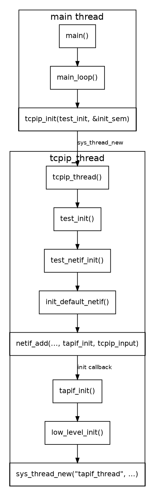
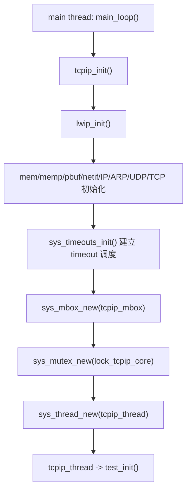
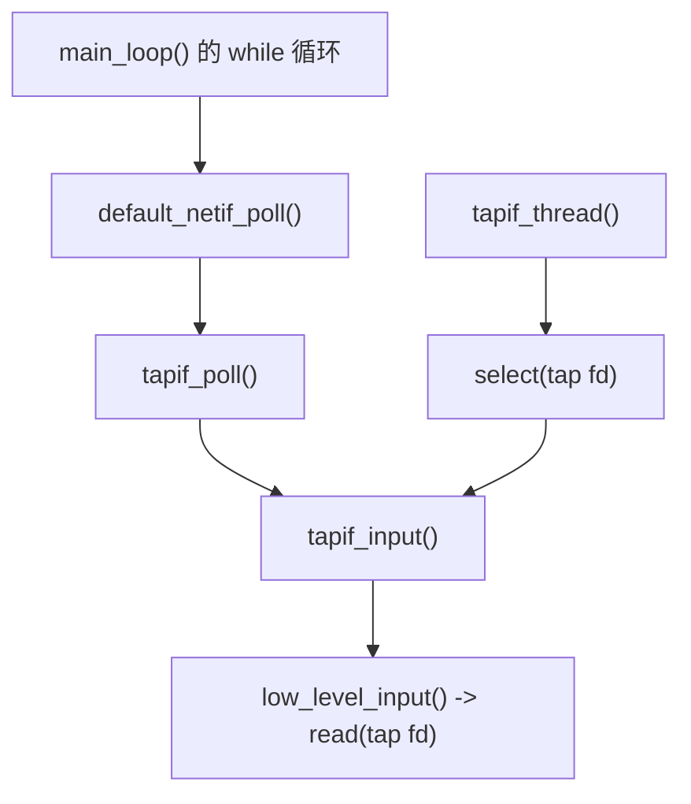
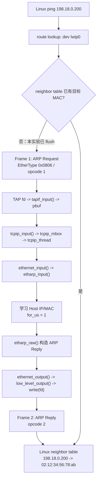
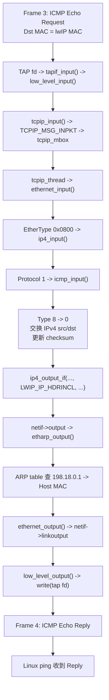

<meta name="referrer" content="no-referrer" />

# 教程 02：从 `main()` 到第一次 Ping——`netif`、TAP、ARP 与 ICMP 的完整源码链

> 摘要：从 Unix example_app 的真实入口出发，沿 netif、TAP、ARP、IPv4、ICMP 与收发路径追踪一次真实 Ping，并用实际 PCAP 与源码逐字段互证。

[TOC]

本文继续使用 upstream `master`。写作时核对的 `master` commit 为 `d08f4773edd0182b7910fc8f046eed82ffcd67c9`。[S1](#source-s1)

这一阶段的目标不是记住几条 Linux 命令，而是回答一条具体问题：

> 当 Linux Host 执行 `ping 198.18.0.200` 时，这个请求究竟怎样从 Linux 虚拟网卡进入 lwIP，又怎样经过 ARP、IPv4、ICMP 后返回 Host？

正文按实际执行顺序展开。协议名、网络层次和工具只在主线第一次需要时解释。

---

## 1. 程序从哪里开始：`main()` 只做了一次跳转

Unix `example_app` 的入口位于：

```text
upstream/lwip/contrib/examples/example_app/test.c
```

当前 `master` 的 `main()` 很薄。[S1](#source-s1)

```c
#if USE_PPP && PPPOS_SUPPORT
int main(int argc, char **argv)
#else /* USE_PPP && PPPOS_SUPPORT */
int main(void)
#endif /* USE_PPP && PPPOS_SUPPORT */
{
#if USE_PPP && PPPOS_SUPPORT
  if(argc > 1) {
    sio_idx = (u8_t)atoi(argv[1]);
  }
  printf("Using serial port %d for PPP\n", sio_idx);
#endif /* USE_PPP && PPPOS_SUPPORT */
  setvbuf(stdout, NULL,_IONBF, 0);

  main_loop();

  return 0;
}
```

这里第一次遇到 `USE_PPP`。它不是运行时状态，而是 `example_app` 的**编译期开关**：

- `PPP` 是 Point-to-Point Protocol，点到点协议；
- `USE_PPP=1` 才启用 example 中的 PPP 接口；当前 `test.c` 默认值是 `0`；
- `PPPOS_SUPPORT` 表示 PPP over Serial，即通过串口承载 PPP；
- 当前 Stage 2 走 Ethernet/TAP，因此这段 `argc/argv` 分支不会进入。

所以 `main()` 中这些 PPP 条件编译只说明同一个 example 还可以测试其他接口，不是当前 Ping 主线的一部分。[S1](#source-s1)

当前 Ethernet/TAP 实验继续跟：

```text
main()
  -> main_loop()
```

`main_loop()` 根据 `NO_SYS` 选择 lwIP 的运行模型。当前 `example_app/lwipopts.h` 明确设置 `NO_SYS=0`，因此使用带 OS 抽象的多线程路径。[S1](#source-s1)

```c
err = sys_sem_new(&init_sem, 0);
LWIP_ASSERT("failed to create init_sem", err == ERR_OK);
LWIP_UNUSED_ARG(err);
tcpip_init(test_init, &init_sem);
sys_sem_wait(&init_sem);
sys_sem_free(&init_sem);
```

这里建立了第一个重要边界：

- `main` 所在线程负责启动 example；
- `tcpip_init()` 创建 `tcpip_thread`；
- `test_init()` 不是由 `main()` 直接调用，而是在 `tcpip_thread` 启动后作为初始化完成回调执行。[S2](#source-s2)



这张图只回答一个问题：**`netif` 与 TAP 是在什么线程、经过哪些函数建立起来的。**

## 2. `tcpip_init()`：先初始化 Core，再创建 `tcpip_thread`

进入：

```text
upstream/lwip/src/api/tcpip.c
```

`tcpip_init()` 的关键连续片段如下：[S2](#source-s2)

```c
void
tcpip_init(tcpip_init_done_fn initfunc, void *arg)
{
  lwip_init();

  tcpip_init_done = initfunc;
  tcpip_init_done_arg = arg;
  if (sys_mbox_new(&tcpip_mbox, TCPIP_MBOX_SIZE) != ERR_OK) {
    LWIP_ASSERT("failed to create tcpip_thread mbox", 0);
  }
#if LWIP_TCPIP_CORE_LOCKING
  if (sys_mutex_new(&lock_tcpip_core) != ERR_OK) {
    LWIP_ASSERT("failed to create lock_tcpip_core", 0);
  }
#endif /* LWIP_TCPIP_CORE_LOCKING */

  sys_thread_new(TCPIP_THREAD_NAME, tcpip_thread, NULL,
                 TCPIP_THREAD_STACKSIZE, TCPIP_THREAD_PRIO);
}
```

### 2.1 `lwip_init()` 到底初始化了什么

`tcpip_init()` 的第一条实质调用就是 `lwip_init()`。这一步发生在调用 `tcpip_init()` 的 main thread 中；此时 `tcpip_thread` 还没有创建。也就是说，**lwIP 的协议模块和 timeout 基础设施先初始化，随后才建立 Core thread。**[S16](#source-s16)

下面是 `src/core/init.c` 中 `lwip_init()` 的执行路径阅读版，只保留当前学习主线需要观察的模块初始化顺序：[S16](#source-s16)

```c
void
lwip_init(void)
{
  stats_init();
#if !NO_SYS
  sys_init();
#endif

  mem_init();
  memp_init();
  pbuf_init();
  netif_init();

#if LWIP_IPV4
  ip_init();
#if LWIP_ARP
  etharp_init();
#endif
#endif

#if LWIP_RAW
  raw_init();
#endif
#if LWIP_UDP
  udp_init();
#endif
#if LWIP_TCP
  tcp_init();
#endif

#if LWIP_TIMERS
  sys_timeouts_init();
#endif
}
```

这段代码第一次把“初始化 lwIP”拆成具体对象：

| 初始化入口 | 建立的基础 | 当前阶段为什么需要知道 |
| --- | --- | --- |
| `sys_init()` | OS Port 的系统层初始化 | 后续 thread / mailbox / semaphore 都依赖 Port contract |
| `mem_init()` / `memp_init()` | heap 与 typed pool | `pbuf`、PCB、tcpip message、timeout 节点都需要内存 |
| `pbuf_init()` | packet buffer 子系统 | TAP 收到 frame 后会分配 `pbuf` |
| `netif_init()` | network interface 子系统 | 后续 `netif_add()` 才有基础环境 |
| `ip_init()` / `etharp_init()` | IPv4 与 ARP 模块 | 第一次 Ping 会走 ARP、IPv4 |
| `raw_init()` / `udp_init()` / `tcp_init()` | 各 transport/control PCB 模块 | 后续 Stage 5～10 会使用这些 PCB |
| `sys_timeouts_init()` | lwIP timeout 调度表 | ARP、IP reassembly、DHCP、DNS、IPv6 等周期任务从这里进入 timeout 系统 |

这里有一个后续 Stage 9 必须用到的特殊点：`sys_timeouts_init()` **不会在启动时直接让 TCP timer 永久运行**。TCP timer 位于 cyclic timer 表的第 0 项，但初始化函数故意跳过它；当真正出现 active/TIME-WAIT TCP PCB 时，`TCP_REG()` 才通过 `tcp_timer_needed()` 按需启动 TCP timer。[S16](#source-s16)

因此完整启动顺序不是“创建 tcpip_thread，然后线程自己初始化一切”，而是：



Stage 11 会把 timer、thread、mailbox、semaphore、mutex 放到同一张运行时模型里；这里先记住它们的**创建顺序**即可。

按执行顺序看：

1. `lwip_init()` 在 main thread 中初始化 Core module 与 timeout 基础设施；
2. 保存初始化完成回调 `test_init`；
3. 创建 `tcpip_mbox`；
4. 当前配置启用 Core Locking，因此创建 `lock_tcpip_core`；
5. 最后创建 `tcpip_thread`。

这里的 `mbox` 是 mailbox，即消息邮箱。后面 TAP 收到 Ethernet frame 后，并不会直接在读出 frame 的 Host 侧执行上下文中完成 IPv4/ICMP 协议处理；它会把收到的 `pbuf` 包成消息投递到这个 mailbox，再由 `tcpip_thread` 处理。[S2](#source-s2)

`tcpip_thread()` 启动后的关键结构是：[S2](#source-s2)

```c
static void
tcpip_thread(void *arg)
{
  struct tcpip_msg *msg;
  LWIP_UNUSED_ARG(arg);

  LWIP_MARK_TCPIP_THREAD();

  LOCK_TCPIP_CORE();
  if (tcpip_init_done != NULL) {
    tcpip_init_done(tcpip_init_done_arg);
  }

  while (1) {
    LWIP_TCPIP_THREAD_ALIVE();
    tcpip_mbox_fetch(&tcpip_mbox, (void **)&msg);
    if (msg == NULL) {
      LWIP_DEBUGF(TCPIP_DEBUG, ("tcpip_thread: invalid message: NULL\n"));
      LWIP_ASSERT("tcpip_thread: invalid message", 0);
      continue;
    }
    tcpip_thread_handle_msg(msg);
  }
}
```

因此初始化链此时变成：

```text
main thread
  main()
    -> main_loop()
       -> tcpip_init()
          -> sys_thread_new(tcpip_thread)

                      thread switch
                           ↓

tcpip_thread
  tcpip_init_done(...)
    -> test_init(...)
```

初始化完成后，`main_loop()` 还会进入自己的循环；当前 `master` 在 `USE_ETHERNET` 分支中调用 `default_netif_poll()`。[S1](#source-s1)[S3](#source-s3) 后面会看到，它和 `tapif_thread` 都能走到 `tapif_input()`。因此第一次 Ping 的 RX 上游并不是只有一个生产者；真正稳定、必须理解的线程边界，是收到的 `pbuf` 经 `tcpip_input()` 投递到 `tcpip_mbox` 后，由 `tcpip_thread` 继续协议处理。

---

## 3. `test_init()`：网络接口从这里开始建立

仍在 `test.c`。

`test_init()` 先初始化网络接口，再初始化 example apps。[S1](#source-s1)

```c
static void
test_init(void * arg)
{
#if NO_SYS
  LWIP_UNUSED_ARG(arg);
#else /* NO_SYS */
  sys_sem_t *init_sem;
  LWIP_ASSERT("arg != NULL", arg != NULL);
  init_sem = (sys_sem_t*)arg;
#endif /* NO_SYS */

  srand((unsigned int)time(NULL));

  test_netif_init();

  apps_init();

#if !NO_SYS
  sys_sem_signal(init_sem);
#endif /* !NO_SYS */
}
```

本阶段只继续跟：

```text
test_init()
  -> test_netif_init()
```

`test_netif_init()` 之所以分支很多，是因为 upstream example 同时支持多种接口。这里会遇到 `USE_SLIPIF`：[S1](#source-s1)

- `SLIP` 是 Serial Line Internet Protocol，用串行链路承载 IP；
- `USE_SLIPIF=0` 表示不创建 SLIP 接口；`1` 或 `2` 分别表示创建一个或两个 SLIP 接口；
- 当前 `test.c` 默认 `USE_SLIPIF=0`，所以 Stage 2 不进入 SLIP 分支；
- 当前主线只跟 `USE_ETHERNET` 下的 Ethernet/TAP 路径。

为了让第一次 Ping 的地址固定，本阶段使用：

```text
Host: 198.18.0.1/24
lwIP: 198.18.0.200/24
GW:   198.18.0.1
```

在 DHCP/AutoIP 关闭时，`test_netif_init()` 读取 `LWIP_PORT_INIT_IPADDR`、`LWIP_PORT_INIT_NETMASK`、`LWIP_PORT_INIT_GW`，然后调用 `init_default_netif()`。[S1](#source-s1)

后面的手工配置正是为了让这里得到确定地址，而不是让 DHCP 改变本章主线。

## 4. `init_default_netif()`：`struct netif` 第一次真正出现

进入：

```text
upstream/lwip/contrib/ports/unix/example_app/default_netif.c
```

核心代码很短：[S3](#source-s3)

```c
static struct netif netif;

#if LWIP_IPV4
#define NETIF_ADDRS ipaddr, netmask, gw,
void init_default_netif(const ip4_addr_t *ipaddr,
                        const ip4_addr_t *netmask,
                        const ip4_addr_t *gw)
#else
#define NETIF_ADDRS
void init_default_netif(void)
#endif
{
#if NO_SYS
netif_add(&netif, NETIF_ADDRS NULL, tapif_init, netif_input);
#else
  netif_add(&netif, NETIF_ADDRS NULL, tapif_init, tcpip_input);
#endif
  netif_set_default(&netif);
}
```

这里第一次需要理解 `netif`。

`netif` 是 **network interface（网络接口）** 在 lwIP Core 中的抽象。它不是 Linux 的 `struct net_device`，也不是某块具体 Ethernet 控制器；它负责把“协议栈看到的接口状态”和“Port/Driver 提供的收发函数”接起来。

继续阅读 `init_default_netif()`：当前 OS mode 分支调用 `netif_add()`：

```c
netif_add(&netif, NETIF_ADDRS NULL, tapif_init, tcpip_input);
```

同时传入两个关键函数：

- `tapif_init`：怎样初始化当前 Port；
- `tcpip_input`：收到数据后怎样交给 lwIP Core。

`netif_add()` 在 `src/core/netif.c` 中保存 `input` 回调，并调用 `init(netif)`：[S3](#source-s3)

```c
netif->state = state;
netif->num = netif_num;
netif->input = input;

#if LWIP_IPV4
  netif_set_addr(netif, ipaddr, netmask, gw);
#endif /* LWIP_IPV4 */

if (init(netif) != ERR_OK) {
  return NULL;
}
```

因此执行到这里后：

```text
netif->input = tcpip_input
```

随后：

```text
init(netif)
  -> tapif_init(netif)
```

也就是从 lwIP Core 正式进入 Unix TAP Port。

---

## 5. `tapif_init()`：把 `netif` 接到 Linux TAP

进入：

```text
upstream/lwip/contrib/ports/unix/port/netif/tapif.c
```

`tapif_init()` 把前面的抽象 `netif` 和 Unix TAP Port 的具体收发函数绑定起来。[S4](#source-s4)

```c
err_t
tapif_init(struct netif *netif)
{
  struct tapif *tapif = (struct tapif *)mem_malloc(sizeof(struct tapif));

  if (tapif == NULL) {
    LWIP_DEBUGF(NETIF_DEBUG, ("tapif_init: out of memory for tapif\n"));
    return ERR_MEM;
  }
  netif->state = tapif;
  MIB2_INIT_NETIF(netif, snmp_ifType_other, 100000000);

  netif->name[0] = IFNAME0;
  netif->name[1] = IFNAME1;
#if LWIP_IPV4
  netif->output = etharp_output;
#endif /* LWIP_IPV4 */
#if LWIP_IPV6
  netif->output_ip6 = ethip6_output;
#endif /* LWIP_IPV6 */
  netif->linkoutput = low_level_output;
  netif->mtu = 1500;

  low_level_init(netif);

  return ERR_OK;
}
```

到这里，`netif` 的三个关键方向已经绑定出来：

| 字段 | 当前函数 | 作用 |
| --- | --- | --- |
| `netif->input` | `tcpip_input` | RX：Port 收到数据后交给 lwIP Core |
| `netif->output` | `etharp_output` | IPv4 TX：根据下一跳 IP 解析/取得目标 MAC |
| `netif->linkoutput` | `low_level_output` | L2 TX：把完整 Ethernet frame 交给 Port |

### 5.1 `netif->flags`：接口现在具备什么能力

`low_level_init()` 中还有一行对后续分发非常关键：[S4](#source-s4)

```c
netif->flags = NETIF_FLAG_BROADCAST | NETIF_FLAG_ETHARP | NETIF_FLAG_IGMP;
```

`src/include/lwip/netif.h` 对相关 flag 的定义如下。[S3](#source-s3)

| Flag | 含义 | 当前 Stage 2 怎样用到 |
| --- | --- | --- |
| `NETIF_FLAG_UP` | **软件管理状态**为 UP，表示这个 `netif` 被启用 | `test_netif_init()` 后面通过 `netif_set_up()` 设置 |
| `NETIF_FLAG_BROADCAST` | 接口支持二层广播 | ARP Request 使用广播 MAC |
| `NETIF_FLAG_LINK_UP` | **链路状态**为 UP，表示驱动认为链路可用 | `low_level_init()` 通过 `netif_set_link_up()` 设置 |
| `NETIF_FLAG_ETHARP` | Ethernet + ARP 能力 | `tcpip_input()` 因此选择 `ethernet_input()`；ARP/IPv4 Ethernet 分发也依赖它 |
| `NETIF_FLAG_ETHERNET` | 接口是 Ethernet，但不一定使用 ARP/IP，例如只承载 PPPoE | 当前 `tapif.c` 没单独设置它，因为已经设置 `ETHARP` |
| `NETIF_FLAG_IGMP` | 支持 IPv4 IGMP multicast 管理 | 本次单播 Ping 不使用 |
| `NETIF_FLAG_MLD6` | 支持 IPv6 MLD multicast 管理 | 本次 IPv4 Ping 不使用 |

最容易混淆的是 `UP` 与 `LINK_UP`：

```text
NETIF_FLAG_UP       = 软件上“允许使用这个接口”
NETIF_FLAG_LINK_UP  = 驱动上“链路现在可用”
```

lwIP 的部分报告动作要求两者同时为真。[S3](#source-s3) 当前 TAP 没有真实网线 carrier detection，所以 Port 初始化时直接 `netif_set_link_up()`；随后 example 再调用 `netif_set_up()`。

### 5.2 `netif->mtu = 1500` 中的 MTU 是什么

MTU 是 **Maximum Transmission Unit，最大传输单元**。当前 Unix TAP Port 设置：[S4](#source-s4)

```c
netif->mtu = 1500;
```

对当前 IPv4 路径，可以先理解成：**一份不经过 IPv4 分片、直接交给这个二层接口发送的 IPv4 packet，长度不能超过 1500 字节；Ethernet Header 不计入这 1500 字节。** 更大的 IPv4 datagram 是否能够发送，要继续看 IPv4 分片、DF（Don't Fragment）以及具体配置，而不能把“IPv4 datagram 永远最大 1500”当成协议限制。[S10](#source-s10)

本次 Ping 的 IPv4 Total Length 只有 84 字节，远小于 1500，不会因为 MTU 触发分片。[S12](#source-s12)

### 5.3 为什么使用 TAP，而不是 TUN：Ethernet frame 与 IP packet 的区别

继续进入 `low_level_init()`：[S4](#source-s4)

```c
char *preconfigured_tapif = getenv("PRECONFIGURED_TAPIF");

tapif->fd = open(DEVTAP, O_RDWR);

ifr.ifr_flags = IFF_TAP|IFF_NO_PI;
if (ioctl(tapif->fd, TUNSETIFF, (void *) &ifr) < 0) {
  perror("tapif_init: "DEVTAP" ioctl TUNSETIFF");
  exit(1);
}
```

TUN/TAP 首先不是某个网络协议，而是 **Linux 内核提供给 userspace 的虚拟网络设备机制**。[S7](#source-s7) 可以把它理解成一块“没有真实网线和 PHY、但仍然挂在 Linux 网络栈里的虚拟网卡”。

普通物理网卡的收发路径大致是：

```text
Linux network stack
        ↕
NIC driver
        ↕
MAC / PHY
        ↕
真实网络
```

TUN/TAP 把下面的真实硬件部分换成了一个文件描述符：

```text
Linux network stack
        ↕
TUN/TAP virtual netdev，例如 lwip0
        ↕
Linux tun driver
        ↕
/dev/net/tun 对应的 fd
        ↕ read()/write()
userspace program，例如 example_app
```

这条边界的方向非常重要：[S7](#source-s7)

- Linux 网络栈**要从 `lwip0` 发出**一个 packet/frame 时，TUN/TAP driver 不会把它送给真实网卡，而是让绑定该接口的 userspace 程序从 fd 中 `read()` 出来；
- userspace 程序对这个 fd `write()` 一个 packet/frame 时，Linux 会把它当成**从 `lwip0` 收到的入站数据**，继续交给内核网络栈处理。

因此，本实验里的 `example_app` 实际上站在一块“虚拟网卡的另一端”：Linux Host 发向 `lwip0` 的 Ethernet frame 被 `tapif.c` 读走；lwIP 回包时 `write(tapif->fd, ...)`，Linux 又把这帧当成从 `lwip0` 收到。

`/dev/net/tun` 是 TUN/TAP driver 暴露给 userspace 的**字符设备入口**。程序先 `open("/dev/net/tun", O_RDWR)` 得到 fd，再通过 `ioctl(fd, TUNSETIFF, ...)` 告诉内核“这个 fd 要绑定哪一种虚拟网络接口”。`IFF_TUN` 与 `IFF_TAP` 就是在这里选择接口类型。[S7](#source-s7)

两种类型的核心区别是 userspace 从 fd 看到的数据从哪一层开始：

- **TUN**：虚拟的 Point-to-Point/L3 接口，userspace 读写 **IP packet**，开头就是 IPv4/IPv6 Header，没有 Ethernet Header；
- **TAP**：虚拟的 Ethernet/L2 接口，userspace 读写完整 **Ethernet frame**，包含目标 MAC、源 MAC、EtherType，后面才是 IPv4 packet、ARP 等 payload。[S7](#source-s7)

TUN/TAP 在这里是 Linux 接口类型名称，不需要把它们当成协议缩写去背。

把两种数据单位放在一起就很直观：

```text
Ethernet frame
┌─────────────┬─────────────┬───────────┬────────────────────────────┐
│ Dst MAC     │ Src MAC     │ EtherType │ Payload                    │
│ 6 bytes     │ 6 bytes     │ 2 bytes   │ IPv4 packet / ARP ...     │
└─────────────┴─────────────┴───────────┴────────────────────────────┘
                                           │
                                           └─ 当 EtherType=0x0800 时：
                                              ┌───────────────┬─────────────────┐
                                              │ IPv4 Header   │ ICMP/TCP/UDP... │
                                              └───────────────┴─────────────────┘
```

因此：

- **Ethernet frame** 是 L2 数据单位，包含 MAC 地址和 `EtherType`；
- **IP packet/datagram** 是 L3 数据单位，包含 IP 地址、TTL、Protocol 等字段，本身没有 Ethernet MAC Header；
- IPv4 packet 可以作为 Ethernet frame 的 payload；ARP 则是另一种 Ethernet payload，并不是 IPv4 packet。[S5](#source-s5)

### 5.4 L2、L3 是什么？一共有几层

`L2`、`L3` 中的 `L` 是 Layer。这里借用 OSI Reference Model 的层号描述协议位置。OSI 模型定义 7 层：[S8](#source-s8)

| 层 | 名称 | 当前系列最直观的例子 |
| --- | --- | --- |
| Layer 7 | Application，应用层 | HTTP、DNS 应用逻辑 |
| Layer 6 | Presentation，表示层 | 数据表示/编码抽象 |
| Layer 5 | Session，会话层 | 会话控制抽象 |
| Layer 4 | Transport，传输层 | TCP、UDP |
| Layer 3 | Network，网络层 | IPv4/IPv6，IP 地址与路由 |
| Layer 2 | Data Link，数据链路层 | Ethernet，MAC 地址，Ethernet frame |
| Layer 1 | Physical，物理层 | PHY、网线/无线物理传输 |

TCP/IP 实现不会机械地按 7 层拆成 7 个源码目录。这里真正要记住的是：

```text
TUN: 从 IPv4 Header 开始      -> L3
TAP: 从 Ethernet Header 开始  -> L2
```

本系列需要观察 MAC、EtherType、ARP 和 Ethernet Header，因此使用 TAP。[S7](#source-s7)

`IFF_NO_PI` 表示 Linux 不在 frame 前再附加额外的 TUN/TAP packet-information header，所以 `read(tapif->fd, ...)` 得到的第一字节就是实际 Ethernet frame。[S4](#source-s4)[S7](#source-s7)

### 5.5 `PRECONFIGURED_TAPIF` 怎样让 lwIP 绑定 `lwip0`

`low_level_init()` 读取：

```c
char *preconfigured_tapif = getenv("PRECONFIGURED_TAPIF");
```

存在这个变量时，代码把它写入 `ifr.ifr_name`，随后 `TUNSETIFF` 绑定对应 TAP。[S4](#source-s4)

所以：

```sh
PRECONFIGURED_TAPIF=lwip0 ./build/example/contrib/ports/unix/example_app/example_app
```

本质是在告诉 upstream `tapif.c`：把打开的 TAP fd 绑定到 Linux 已存在的 `lwip0`。

### 5.6 为什么源码里既有 `main_loop()` polling，又有 `tapif_thread()`

`main_loop()` **不是只初始化一次**。初始化完成后，它仍进入 `while` 循环，反复调用 `default_netif_poll()`；与此同时，Unix `tapif.c` 在 `NO_SYS=0` 时又创建 `tapif_thread()`，由 `select()` 阻塞等待同一个 TAP fd 可读。[S1](#source-s1)[S4](#source-s4)



因此当前 upstream **example + Unix Port** 确实存在两个 RX producer。两条路径最终都会对同一个 TAP fd 执行 `read()`，所以它们实际上在竞争同一个 RX 数据源。一个 frame 只会被某一次成功的 `read()` 消费，不会因为存在两个调用者就自动复制成两份。

这里还有一个值得注意的并发细节：`tapif_thread()` 先用 `select()` 等待可读，而 `tapif_poll()` 直接进入阻塞式 `read()`。如果两个执行上下文同时等待同一个 fd，某一方消费了 readiness 对应的数据后，另一方后续的 `read()` 可能继续等待下一帧。这正说明“两个 RX owner 同时读一个接口”不适合作为产品架构范式。

但这不是 lwIP Core 规定的通用架构，也不是产品代码必须照抄的模式。真实 Port 通常会明确选择一个 RX ownership 模型，例如：

- Ethernet 驱动专用 RX thread/task；
- 中断收到 frame 后交给 deferred worker/task；
- `NO_SYS=1` 场景由 main loop polling。

因此，如果 Unix/TAP Port 已由 `tapif_thread() -> select()` 专门负责 RX，从架构上并不需要另一个 main loop 同时竞争读取；当前双入口更适合看成 `contrib/examples/example_app` 与 Unix Port 组合后的 example 行为，而不是 lwIP 协议栈要求。[S1](#source-s1)[S4](#source-s4)

从这一节之后，协议主线以“frame 已进入 `tapif_input()`”作为统一入口；需要追查具体 frame 由哪个 producer 读到时，再回到上面两个入口。

## 6. 按源码要求准备 `lwip0`

前面的源码已经给出 Host 侧条件：`tapif.c` 要打开 `/dev/net/tun`，再通过 `TUNSETIFF` 绑定一个名为 `lwip0` 的 TAP。[S4](#source-s4)

先确认内核 TUN/TAP 设备节点存在：

```sh
ls -l /dev/net/tun
```

`/dev/net/tun` 不是最终接口名，而是 userspace 与 Linux TUN/TAP 驱动交互的字符设备入口。后面的 `lwip0` 才是网络接口。[S7](#source-s7)

安装本章需要的 Host 工具：

```sh
sudo apt update
sudo apt install iproute2 iputils-ping tcpdump
```

- `iproute2` 提供 `ip`：创建 TAP、配置地址、查询 route/neighbor；
- `iputils-ping` 提供 `ping`；
- `tcpdump` 把实际 Ethernet frame 保存成 PCAP。

创建 TAP：

```sh
sudo ip tuntap add dev lwip0 mode tap user "$USER"
```

逐项解释：

```text
ip tuntap add     创建一个 TUN/TAP 虚拟接口
dev lwip0         接口名为 lwip0
mode tap          选择 L2 TAP，而不是 L3 TUN
user "$USER"      把 TAP owner 设为当前用户，使 example_app 可用普通用户身份绑定它
```

给 **Linux Host 这一端** 配置 IPv4：

```sh
sudo ip addr add 198.18.0.1/24 dev lwip0
```

这不是给 lwIP 配地址。它表示 Linux 这一端是 `198.18.0.1`，`/24` 对应网段 `198.18.0.0/24`。Linux 会据此建立直连路由；后面用 `ip route get` 实际确认。

把 Linux 接口的软件管理状态置为 UP：

```sh
sudo ip link set lwip0 up
```

这里的 `up` 是 Linux `lwip0` 的接口状态，与 lwIP 内部 `NETIF_FLAG_UP` 是两个不同对象上的状态。

查看结果：

```sh
ip -d link show lwip0
ip -4 addr show lwip0
```

- `ip -d link show`：确认 `tun type tap`、UP、MTU 等 link 属性；
- `ip -4 addr show`：确认 `198.18.0.1/24` 已绑定到 `lwip0`。

本次实际 Host 输出中 `lwip0` 的 MTU 是 1500。

Linux TAP 接口自己的 MAC 是 Host 端地址；真实抓包中为：[S12](#source-s12)

```text
0e:df:2b:29:78:22
```

而 lwIP `tapif.c` 给 `netif->hwaddr` 填的是另一组固定 MAC：[S4](#source-s4)[S12](#source-s12)

```text
02:12:34:56:78:ab
```

这两个 MAC 分别属于链路两端。

### 6.1 在 Ping 前确认 Linux route 真正走 `lwip0`

执行：

```sh
ip route get 198.18.0.200
```

`route` 解决的是：**目标 IP 应该从哪个接口、经哪个下一跳发送**。正确结果关键部分应是：

```text
198.18.0.200 dev lwip0 src 198.18.0.1
```

此前实际排查曾出现：

```text
198.18.0.200 dev tap0 src 198.18.0.1
```

这意味着 Linux 会把后续 ARP/ICMP 发往旧 `tap0`，而 example_app 已绑定 `lwip0`。这种情况下 frame 尚未到达 `tapif.c`。

如果旧 `tap0` 仍持有同一实验网段，先检查：

```sh
ip -4 addr show tap0
ip route show 198.18.0.0/24
```

确认旧接口不再需要后，再移除冲突地址，例如：

```sh
sudo ip addr del 198.18.0.1/24 dev tap0
```

然后重新执行：

```sh
ip route get 198.18.0.200
```

直到结果明确为 `dev lwip0`。

## 7. 配置 lwIP 的静态 IPv4，再启动 example_app

先让通用配置脚本从当前 upstream 模板重新生成 `lwipcfg.h` 和 Debug build tree：

```sh
scripts/configure-debug.sh
```

随后追加本阶段静态地址 override：

```sh
cat >> upstream/lwip/contrib/examples/example_app/lwipcfg.h <<'STAGE2_CFG'

/* Source Lab: Stage 2 deterministic TAP network. */
#undef USE_DHCP
#define USE_DHCP 0
#undef USE_AUTOIP
#define USE_AUTOIP 0

#undef LWIP_PORT_INIT_IPADDR
#define LWIP_PORT_INIT_IPADDR(addr)  IP4_ADDR((addr), 198,18,0,200)
#undef LWIP_PORT_INIT_GW
#define LWIP_PORT_INIT_GW(addr)      IP4_ADDR((addr), 198,18,0,1)
#undef LWIP_PORT_INIT_NETMASK
#define LWIP_PORT_INIT_NETMASK(addr) IP4_ADDR((addr), 255,255,255,0)
STAGE2_CFG
```

直接构建，不要再次运行 `configure-debug.sh`，因为 configure 会重新从当前 upstream 模板刷新 `lwipcfg.h`：

```sh
scripts/build.sh example
```

启动：

```sh
PRECONFIGURED_TAPIF=lwip0 \
  ./build/example/contrib/ports/unix/example_app/example_app
```

本次实际运行输出为：

```text
Starting lwIP, local interface IP is 198.18.0.200
ip6 linklocal address: FE80::12:34FF:FE56:78AB
status_callback==UP, local interface IP is 198.18.0.200
status_callback==UP, local interface IP is 198.18.0.200
```

到这里可以确认的是“接口已经初始化并处于 UP”；还不能仅凭这些日志证明 ARP 与 ICMP 路径已经跑通。

---

## 8. 第一次 Ping：先观察实际发生的两阶段通信

为了让这次实验必然从“还不知道目标 MAC”的状态开始，先清掉 `lwip0` 上已有的 neighbor cache：

```sh
sudo ip neigh flush dev lwip0
```

这里第一次真正需要理解 **neighbor table（邻居表）**。

Linux 发送同网段 IPv4 packet 时要完成两类查找：

```text
route table
  198.18.0.200 应该走哪个接口？
  -> lwip0

neighbor table
  下一跳 198.18.0.200 在这个 L2 链路上的 MAC 是多少？
  -> 还不知道，因此需要 ARP
```

所以 route table 负责“往哪里走”，neighbor table 负责“这个下一跳的链路地址是什么”。`ip-neighbour(8)` 对 neighbour object 的定义就是“同一链路上的 protocol address 与 link-layer address 的绑定”，并明确指出 IPv4 neighbour table 也就是 ARP table。[S13](#source-s13)

对 IPv4 Ethernet，这个 IP→MAC 映射主要由 ARP 学习。可以查看：

```sh
ip neigh show dev lwip0
```

清空后开始抓包。创建目录：

```sh
mkdir -p captures
```

终端 A 保持 lwIP `example_app` 运行。

终端 B 抓取 ARP 和 ICMP，并在收到 4 个匹配 frame 后结束：

```sh
sudo tcpdump   -i lwip0   -nn   -e   -vvv   -s 0   -c 4   -w captures/ping.pcap   'arp or icmp'
```

终端 C：

```sh
ping -c 1 198.18.0.200
```

本次真实 `ping.pcap` 得到 4 帧。[S12](#source-s12)

| Frame | 长度 | 方向 | 协议 | 关键内容 |
| ---: | ---: | --- | --- | --- |
| 1 | 42 | Host → broadcast | ARP Request | `198.18.0.1` 询问 `198.18.0.200` 的 MAC |
| 2 | 42 | lwIP → Host | ARP Reply | `198.18.0.200` 返回 `02:12:34:56:78:ab` |
| 3 | 98 | Host → lwIP | IPv4 / ICMP | Echo Request，Type 8，Seq 1 |
| 4 | 98 | lwIP → Host | IPv4 / ICMP | Echo Reply，Type 0，Seq 1 |

仓库附带本次真实抓包：[`assets/stage2-ping.pcap`](assets/stage2-ping.pcap)。

这组 frame 正好说明当前 Ping 顺序：

1. `ping` 已知目标 **IP** 是 `198.18.0.200`；
2. neighbor table 被清空，不知道目标 **MAC**，所以 Linux 先发 ARP Request；
3. lwIP 返回 ARP Reply，Linux 学到 `198.18.0.200 -> 02:12:34:56:78:ab`；
4. Linux 才发送 ICMP Echo Request；
5. lwIP 返回 ICMP Echo Reply。

如果 neighbor table 已经有有效 MAC 映射，前两帧可以被跳过，Linux 直接发 ICMP。也就是说，“Ping 一定先 ARP”不是硬规则，而是**本实验主动 flush neighbor cache 后的确定路径**。

### 8.1 Frame 1：`EtherType 0x0806` 只说明“这是 ARP”，不说明 Request/Reply

Frame 1：[S12](#source-s12)

```text
Ethernet src: 0e:df:2b:29:78:22
Ethernet dst: ff:ff:ff:ff:ff:ff
EtherType:    0x0806

ARP opcode:   1
Sender IP:    198.18.0.1
Sender MAC:   0e:df:2b:29:78:22
Target IP:    198.18.0.200
Target MAC:   00:00:00:00:00:00
```

要区分两个字段：

```text
Ethernet Header: EtherType = 0x0806
    -> Ethernet payload 使用 ARP 格式

ARP Header: opcode = 1
    -> 这份 ARP 是 Request
```

`0x0806` **不是“ARP Request”的编号**。Frame 2 的 EtherType 仍为 `0x0806`，但 ARP opcode 是 `2`，所以它是 ARP Reply。[S5](#source-s5)[S12](#source-s12)

ARP 是 **Address Resolution Protocol，地址解析协议**。此时 Linux 已知目标 IP，但构造 Ethernet frame 时还不知道目标 MAC，所以要先把 IPv4 地址解析成 Ethernet MAC。[S9](#source-s9)

Request 使用广播目标 MAC：

```text
ff:ff:ff:ff:ff:ff
```

### 8.2 Ethernet 会不会把所有 frame 都交给 CPU

真实物理 Ethernet 接口通常不会把链路上所有 frame 都无条件交给上层。以 Linux netdevice/driver 模型为例，驱动存在 RX mode 配置入口，内核维护 unicast/multicast 地址列表以及 promiscuous/all-multicast 状态；具体由硬件过滤多少、由驱动或软件补多少，则取决于 NIC/MAC 能力与驱动实现。[S14](#source-s14)

常见正常接收集合包括：

- 发给本机 MAC 的 unicast；
- broadcast；
- 已配置/订阅的 multicast；
- promiscuous mode 下则可放宽过滤。

**目标 IP 不是 Ethernet 二层 MAC 接收过滤本身的字段**：Ethernet Header 提供的是目标 MAC 与 EtherType；frame 进入更高层后，IPv4 再依据目标 IP 判断是否属于本机。[S5](#source-s5)[S14](#source-s14)

lwIP 的 `ethernet_input()` 主要识别 broadcast/multicast 标记并根据 EtherType 分发，它不替物理 NIC 完成所有 unicast MAC 接收过滤。[S5](#source-s5)

本章是 Linux TAP，不是真实 PHY/NIC。Host 从 `lwip0` 发出的 egress frame 会由 TAP fd 提供给 userspace/lwIP；反向由 lwIP `write(fd)` 注入 Host 的 frame，其目标 MAC 是 Host `lwip0` 的 MAC。

### 8.3 Frame 3：ARP 完成后才出现 ICMP Echo Request

Frame 3 的 Ethernet 目标地址已经是 lwIP MAC：

```text
02:12:34:56:78:ab
```

IPv4 Header：[S12](#source-s12)

```text
Source:      198.18.0.1
Destination: 198.18.0.200
Protocol:    1
```

这里第一次需要解释 ICMP。

ICMP 是 **Internet Control Message Protocol，Internet 控制报文协议**。它由 IP 承载，`ping` 使用其中的 Echo Request/Echo Reply。[S11](#source-s11)

```text
Type 8 -> Echo Request
Type 0 -> Echo Reply
```

本次真实抓包：[S12](#source-s12)

```text
Request: Type 8, Code 0, Identifier 0x64fa, Sequence 1
Reply:   Type 0, Code 0, Identifier 0x64fa, Sequence 1
```

`Identifier` 是 ICMP Echo Header 中的 **16-bit id 字段**。`0x64fa` 只是这次 Linux ping 选择的值，对 lwIP 没有特殊含义；它与 `Sequence` 一起帮助发送端把 Echo Reply 对应回请求。[S6](#source-s6)[S11](#source-s11)

不要把这个 `Identifier` 和 IPv4 Header 中另一个叫 `Identification` 的分片字段混为一谈。

lwIP 构造 Echo Reply 时保留收到的 `id` 和 `seqno`，主要修改 Type、IP 源/目的地址与 checksum，因此 Frame 4 仍是 `Identifier 0x64fa, Sequence 1`。[S6](#source-s6)[S12](#source-s12)

## 9. 已经有了 `ping.pcap`，现在再打开 Wireshark

前面 `tcpdump -w captures/ping.pcap` 已经生成文件，此时再解释 PCAP 和 Wireshark才有具体对象。

### 9.1 PCAP 是什么

PCAP 是常见的 packet capture 文件格式。当前文件保存了抓包时间戳、捕获长度以及每个 Ethernet frame 的原始字节。

它不是 lwIP 的 `pcapif.c`：

```text
ping.pcap
  -> 抓包文件

contrib/ports/unix/port/netif/pcapif.c
  -> lwIP 的另一种 Host Port 实现
```

本章运行路径仍然是 `tapif.c`。

### 9.2 Ubuntu 安装 Wireshark

此时安装：

```sh
sudo apt install wireshark tshark
```

打开刚才真正产生的文件：

```sh
wireshark captures/ping.pcap
```

也可以直接打开仓库中的真实样本：

```sh
wireshark docs/assets/stage2-ping.pcap
```

只看本章两类协议：

```text
arp || icmp
```

Wireshark 主要看三块：

```text
Packet List
  -> 4 帧的时间顺序

Packet Details
  -> Ethernet II / ARP / IPv4 / ICMP 的字段树

Packet Bytes
  -> frame 的真实十六进制字节
```

本阶段真正有价值的阅读方式不是只看 `Info` 一列，而是反复建立：

```text
Wireshark 字段
    ↕
lwIP struct 字段
    ↕
处理这个字段的函数/分支
```

下面开始逐帧进入源码。

---

## 10. 以 `tapif_thread()` 为主线看 Frame 怎样进入 lwIP

第 5.6 节已经说明：当前 upstream example 还存在 `main_loop() -> default_netif_poll() -> tapif_poll()` 这条竞争读取路径。它是 example/Port 组合细节，不是协议处理本身。为了让源码主线清晰，本节从 `NO_SYS=0` 下专门创建的 RX thread 开始跟。[S4](#source-s4)

```c
static void
tapif_thread(void *arg)
{
  struct netif *netif;
  struct tapif *tapif;
  fd_set fdset;
  int ret;

  netif = (struct netif *)arg;
  tapif = (struct tapif *)netif->state;

  while(1) {
    FD_ZERO(&fdset);
    FD_SET(tapif->fd, &fdset);

    ret = select(tapif->fd + 1, &fdset, NULL, NULL, NULL);
    if(ret == 1) {
      tapif_input(netif);
    } else if(ret == -1) {
      perror("tapif_thread: select");
    }
  }
}
```

这条路径的角色分工是：

```text
tapif_thread()
  -> select(fd)      等待 TAP 有 frame 可读
  -> tapif_input()   开始一次 RX
  -> low_level_input()
  -> read(fd)        把 Ethernet frame bytes 读进 userspace
```

`low_level_input()` 随后把原始 bytes 复制进 lwIP 的 `pbuf`：[S4](#source-s4)

```c
readlen = read(tapif->fd, buf, sizeof(buf));
if (readlen < 0) {
  perror("read returned -1");
  exit(1);
}
len = (u16_t)readlen;

p = pbuf_alloc(PBUF_RAW, len, PBUF_POOL);
if (p != NULL) {
  pbuf_take(p, buf, len);
}
```

数据形态发生了第一次转换：

```text
Linux TAP fd 中的 Ethernet frame bytes
                 ↓ read()
          tapif.c 临时 buf[]
                 ↓ pbuf_alloc + pbuf_take
              lwIP pbuf
```

`pbuf` 是 lwIP 的 packet buffer。Stage 3 会专门分析 chain、`len/tot_len`、类型和引用计数；本阶段只需要确认：

> `low_level_input()` 返回时，`p->payload` 仍指向 **Ethernet Header**。

因此后面的 `ethernet_input()` 才能直接把 `p->payload` 解释为 `struct eth_hdr *`。

若调试当前 upstream example，实际 frame 也可能被第 5.6 节的 main-loop polling 路径先读走；但无论是哪一个 RX producer，进入 `tapif_input()` 之后的 lwIP 主线相同。

## 11. TAP RX 上游不直接跑协议：`netif->input` 把包交给 `tcpip_thread`

`tapif_input()` 得到 pbuf 后执行：[S4](#source-s4)

```c
static void
tapif_input(struct netif *netif)
{
  struct pbuf *p = low_level_input(netif);

  if (p == NULL) {
    LWIP_DEBUGF(TAPIF_DEBUG, ("tapif_input: low_level_input returned NULL\n"));
    return;
  }

  if (netif->input(p, netif) != ERR_OK) {
    LWIP_DEBUGF(NETIF_DEBUG, ("tapif_input: netif input error\n"));
    pbuf_free(p);
  }
}
```

无论上游是 `main_loop()` 的 poll 路径还是 `tapif_thread()`，进入 `tapif_input()` 后都会执行同一段代码。初始化时已经绑定：

```text
netif->input = tcpip_input
```

所以这里实际执行：

```text
tcpip_input(p, netif)
```

`tcpip_input()` 看到该 netif 设置了 Ethernet/ARP flags，会选择 `ethernet_input` 作为真正的协议入口，然后交给 `tcpip_inpkt()`。[S2](#source-s2)

`tcpip_inpkt()` 在默认非 `LWIP_TCPIP_CORE_LOCKING_INPUT` 路径中创建 `TCPIP_MSG_INPKT`：[S2](#source-s2)

```c
msg->type = TCPIP_MSG_INPKT;
msg->msg.inp.p = p;
msg->msg.inp.netif = inp;
msg->msg.inp.input_fn = input_fn;
if (sys_mbox_trypost(&tcpip_mbox, msg) != ERR_OK) {
  memp_free(MEMP_TCPIP_MSG_INPKT, msg);
  return ERR_MEM;
}
```

于是稳定的线程边界应该写成：

```text
TAP RX producer
  （main_loop poll 或 tapif_thread）
  -> tapif_input()
  -> low_level_input()
  -> pbuf
  -> tcpip_input()
  -> TCPIP_MSG_INPKT
  -> tcpip_mbox

                 thread switch
                      ↓

tcpip_thread
  tcpip_mbox_fetch()
  -> tcpip_thread_handle_msg()
```

这条边界对调试很重要：`low_level_input()` 命中在哪个 Host 线程并不是固定结论；`ethernet_input()` 之后的 Core 协议处理才稳定地落在 `tcpip_thread`。

`tcpip_thread_handle_msg()` 收到 `TCPIP_MSG_INPKT` 后调用消息里保存的 `input_fn`：[S2](#source-s2)

```c
case TCPIP_MSG_INPKT:
  if (msg->msg.inp.input_fn(msg->msg.inp.p,
                            msg->msg.inp.netif) != ERR_OK) {
    pbuf_free(msg->msg.inp.p);
  }
  memp_free(MEMP_TCPIP_MSG_INPKT, msg);
  break;
```

当前 `input_fn` 就是：

```text
ethernet_input
```

所以真正解析 Ethernet Header 的线程是 `tcpip_thread`，不是 `tapif_thread`。

---

## 12. Frame 1：`ethernet_input()` 为什么把它交给 `etharp_input()`

真实 Frame 1 的 Ethernet 字段为：[S12](#source-s12)

```text
Destination MAC = ff:ff:ff:ff:ff:ff
Source MAC      = 0e:df:2b:29:78:22
EtherType       = 0x0806
```

进入：

```text
upstream/lwip/src/netif/ethernet.c
```

`ethernet_input()` 首先把 `p->payload` 当成：

```c
struct eth_hdr *ethhdr
```

然后根据 EtherType 分流。[S5](#source-s5)

当类型为 ARP 时，关键路径是：[S5](#source-s5)

```c
case PP_HTONS(ETHTYPE_ARP):
  if (!(netif->flags & NETIF_FLAG_ETHARP)) {
    goto free_and_return;
  }
  if (pbuf_remove_header(p, next_hdr_offset)) {
    ETHARP_STATS_INC(etharp.lenerr);
    ETHARP_STATS_INC(etharp.drop);
    goto free_and_return;
  } else {
    etharp_input(p, netif);
  }
  break;
```

这里第一次发生 `p->payload` 视图变化：

```text
进入 ethernet_input：

p->payload
   ↓
[ Ethernet Header ][ ARP Header + fields ]

pbuf_remove_header(...)
          ↓

                   p->payload
                        ↓
[ Ethernet Header ][ ARP Header + fields ]
```

Ethernet Header 的字节还存在于底层 buffer 的前部，但当前 `pbuf` 数据视图已经从 ARP Header 开始。

于是 `etharp_input()` 可以直接：

```c
hdr = (struct etharp_hdr *)p->payload;
```

这就是 Wireshark `ARP` 字段树与 lwIP `struct etharp_hdr` 的第一个直接对应关系。

---

## 13. `etharp_input()`：先学习 Host 的 MAC，再判断请求是不是发给自己

进入：

```text
upstream/lwip/src/core/ipv4/etharp.c
```

真实 ARP Request 的关键字段是：[S12](#source-s12)

```text
Sender MAC = 0e:df:2b:29:78:22
Sender IP  = 198.18.0.1
Target MAC = 00:00:00:00:00:00
Target IP  = 198.18.0.200
Opcode     = Request
```

`etharp_input()` 先把 sender/target IP 取出，然后判断 target IP 是否等于当前 `netif` 的 IP：[S5](#source-s5)

```c
IPADDR_WORDALIGNED_COPY_TO_IP4_ADDR_T(&sipaddr, &hdr->sipaddr);
IPADDR_WORDALIGNED_COPY_TO_IP4_ADDR_T(&dipaddr, &hdr->dipaddr);

if (ip4_addr_isany_val(*netif_ip4_addr(netif))) {
  for_us = 0;
  from_us = 0;
} else {
  for_us = (u8_t)ip4_addr_eq(&dipaddr, netif_ip4_addr(netif));
  from_us = (u8_t)ip4_addr_eq(&sipaddr, netif_ip4_addr(netif));
}
```

本次：

```text
dipaddr = 198.18.0.200
netif IP = 198.18.0.200
```

因此：

```text
for_us = 1
```

但真正构造 Reply 之前，继续阅读 `etharp_input()`：它先执行一个重要动作。[S5](#source-s5)

```c
etharp_update_arp_entry(netif, &sipaddr, &(hdr->shwaddr),
                        for_us ? ETHARP_FLAG_TRY_HARD : ETHARP_FLAG_FIND_ONLY);
```

这一步先把 Host 的对应关系学进 lwIP ARP table：

```text
198.18.0.1
    ↕
0e:df:2b:29:78:22
```

这解释了真实 PCAP 中一个很重要的现象：

> 后面的 ICMP Echo Reply 可以直接单播给 Host，不需要 lwIP 再发一次 ARP Request。

因为 Host MAC 已经从第一帧 ARP Request 中被 lwIP 学到了。

随后仍在 `etharp_input()` 中，`opcode` 是 `ARP_REQUEST`，并且 `for_us && !from_us` 成立，于是调用 `etharp_raw()` 构造并发送 Reply：[S5](#source-s5)

```c
etharp_raw(netif,
           (struct eth_addr *)netif->hwaddr, &hdr->shwaddr,
           (struct eth_addr *)netif->hwaddr, netif_ip4_addr(netif),
           &hdr->shwaddr, &sipaddr,
           ARP_REPLY);
```

这里生成 Frame 2。

---

## 14. Frame 2：ARP Reply 怎样从 lwIP 写回 Host

真实 Reply：[S12](#source-s12)

```text
Ethernet src = 02:12:34:56:78:ab
Ethernet dst = 0e:df:2b:29:78:22

Sender IP    = 198.18.0.200
Sender MAC   = 02:12:34:56:78:ab
Target IP    = 198.18.0.1
Target MAC   = 0e:df:2b:29:78:22
```

ARP Reply 最终需要变成一个完整 Ethernet frame。最终链路会进入 `ethernet_output()`，再通过初始化阶段绑定的：

```text
netif->linkoutput = low_level_output
```

交给 `tapif.c`。[S5](#source-s5)[S4](#source-s4)

`low_level_output()` 做的事情很接近真实驱动 TX 的最简模型：[S4](#source-s4)

```c
if (p->tot_len > sizeof(buf)) {
  MIB2_STATS_NETIF_INC(netif, ifoutdiscards);
  perror("tapif: packet too large");
  return ERR_IF;
}

pbuf_copy_partial(p, buf, p->tot_len, 0);

written = write(tapif->fd, buf, p->tot_len);
```

也就是：

```text
lwIP pbuf / pbuf chain
        ↓ pbuf_copy_partial()
连续的 Ethernet frame bytes
        ↓ write(tap fd)
Linux lwip0
        ↓
Host 网络栈
```

这里的 `write()` 与 RX 的 `read()` 正好构成 Unix TAP Port 的两端。

---

## 15. Frame 3：EtherType `0x0800` 后进入 IPv4，再根据 Protocol `1` 进入 ICMP

ARP 完成后，Linux 已经知道目标 MAC，Frame 3 可以直接发送给：

```text
02:12:34:56:78:ab
```

Ethernet Header：[S12](#source-s12)

```text
Destination MAC = 02:12:34:56:78:ab
Source MAC      = 0e:df:2b:29:78:22
EtherType       = 0x0800
```

和 `0x0806` 一样，`EtherType` 只决定 **Ethernet payload 按什么协议解释**：

```text
0x0806 -> ARP
0x0800 -> IPv4
```

lwIP 在 `prot/ieee.h` 中定义 `ETHTYPE_ARP=0x0806`、`ETHTYPE_IP=0x0800`。[S5](#source-s5)

`ethernet_input()` 命中 `ETHTYPE_IP` 后移除 Ethernet Header，再调用 `ip4_input()`。[S5](#source-s5)

此时数据视图变成：

```text
                   p->payload
                        ↓
[ Ethernet ][ IPv4 Header ][ ICMP Header ][ Data ]
```

### 15.1 `IHL`、`TTL` 和 `Protocol` 分别告诉 `ip4_input()` 什么

真实 PCAP 的 IPv4 Header：[S12](#source-s12)

```text
Source IP      = 198.18.0.1
Destination IP = 198.18.0.200
IHL            = 20 bytes
Total Length   = 84 bytes
TTL            = 64
Protocol       = 1
```

**IHL** 是 Internet Header Length，即 IPv4 Header 长度。字段单位是 32-bit word；本次值相当于 5 个 32-bit word：

```text
5 * 4 bytes = 20 bytes
```

20 字节是没有 IPv4 options 时的最小 Header。`ip4_input()` 用 IHL 判断 Header 边界，并在向上层协议分发前执行：

```c
pbuf_remove_header(p, iphdr_hlen);
```

所以 IHL 也直接决定 `p->payload` 要向后移动多少字节。[S6](#source-s6)[S10](#source-s10)

**TTL** 是 Time To Live。名字保留了“生存时间”的历史语义，但 IPv4 转发时实际表现为 hop limit：每经过一个负责转发 IPv4 packet 的路由器，TTL 都会递减。这样可以防止路由配置错误时 packet 永远在网络里循环。[S10](#source-s10)

如果路由器处理 packet 时发现 TTL 已经耗尽，就会丢弃这个原始 IPv4 packet，并通常向原发送端返回一条 **ICMP Time Exceeded** 控制报文。[S11](#source-s11) 它不是 Ping 的 Echo Reply，而是在告诉发送端：**“这个 packet 没能继续到达目的地，因为它允许经过的跳数已经用完了。”**

RFC 792 定义的 Time Exceeded 是 **ICMP Type 11**，其中当前最相关的 Code 是：[S11](#source-s11)

| Type | Code | 含义 |
| ---: | ---: | --- |
| 11 | 0 | TTL exceeded in transit：转发途中 TTL 耗尽 |
| 11 | 1 | Fragment reassembly time exceeded：分片重组等待超时 |

Time Exceeded 还会携带原始 datagram 的 IPv4 Header 和开头一部分数据，使原发送端能够判断“是哪一个 packet 触发了这个错误”。这也是 `traceroute` 能逐跳发现路由器的基础：它从较小 TTL 开始发送 probe，并逐步增大 TTL，利用沿途网关返回的 ICMP Time Exceeded 识别每一跳。[S15](#source-s15)

lwIP 自己也实现了这条机制。`src/include/lwip/prot/icmp.h` 定义 `ICMP_TE = 11`；当 `ip4_forward()` 转发 packet 时，会先把 TTL 减 1，如果结果变成 0，并且原 packet 不是 ICMP，就调用：`icmp_time_exceeded(p, ICMP_TE_TTL)`。后者再通过 `icmp_send_response()` 生成 Type 11 的 ICMP 错误报文。[S6](#source-s6)

```text
ip4_forward()
    ↓ TTL - 1
TTL == 0 ?
    ↓ yes
icmp_time_exceeded(..., ICMP_TE_TTL)
    ↓
icmp_send_response(..., ICMP_TE, ...)
    ↓
ICMP Time Exceeded
```

本实验的 `198.18.0.1 -> 198.18.0.200` 是同一个 TAP 二层链路上的直连通信，不经过中间路由器，因此这次真实 PCAP 中不会出现 Time Exceeded。Request 的 TTL 是 Linux 发出的 `64`；Reply 的 TTL 是 `255`，因为当前 `example_app/lwipopts.h` 配置 `ICMP_TTL=255`，而 `icmp_input()` 构造 Reply 时执行 `IPH_TTL_SET(iphdr, ICMP_TTL)`。[S1](#source-s1)[S6](#source-s6)[S12](#source-s12)

**Protocol** 告诉 IPv4：Payload 要交给哪个上层协议。lwIP 当前定义：[S6](#source-s6)

| 常量 | 数值 | IPv4 payload |
| --- | ---: | --- |
| `IP_PROTO_ICMP` | 1 | ICMP |
| `IP_PROTO_IGMP` | 2 | IGMP，IPv4 multicast group management |
| `IP_PROTO_TCP` | 6 | TCP |
| `IP_PROTO_UDP` | 17 | UDP |
| `IP_PROTO_UDPLITE` | 136 | UDP-Lite |

### 15.2 `ip4_input()` 怎样从 IPv4 走到 `icmp_input()`

`ip4_input()` 先检查 Version/IHL、Total Length、Header checksum，并判断 Destination IP 能否由某个 netif 接收。[S6](#source-s6)

`198.18.0.200` 正是当前 netif 地址，因此 Frame 3 被接受。

如果构建启用了 `LWIP_RAW`，这里还会先执行 `raw_input(p, inp)`，让 Raw API 注册的 PCB 有机会观察或消费 packet；只有返回值不是 `RAW_INPUT_EATEN` 时才继续分发。[S6](#source-s6)

随后：

```c
pbuf_remove_header(p, iphdr_hlen);

switch (IPH_PROTO(iphdr)) {
#if LWIP_UDP
  case IP_PROTO_UDP:
    MIB2_STATS_INC(mib2.ipindelivers);
    udp_input(p, inp);
    break;
#endif /* LWIP_UDP */
#if LWIP_TCP
  case IP_PROTO_TCP:
    MIB2_STATS_INC(mib2.ipindelivers);
    tcp_input(p, inp);
    break;
#endif /* LWIP_TCP */
#if LWIP_ICMP
  case IP_PROTO_ICMP:
    MIB2_STATS_INC(mib2.ipindelivers);
    icmp_input(p, inp);
    break;
#endif /* LWIP_ICMP */
```

本次：

```text
IPv4 Protocol = 1
    -> IP_PROTO_ICMP
    -> icmp_input(p, inp)
```

同时 `p->payload` 从 IPv4 Header 移到 ICMP Header：

```text
进入 ip4_input：
                   p->payload
                        ↓
[ Ethernet ][ IPv4 Header ][ ICMP Header ][ Data ]

pbuf_remove_header(20)
                           p->payload
                                ↓
[ Ethernet ][ IPv4 Header ][ ICMP Header ][ Data ]
```

所以 `icmp_input()` 一进入就能把 `p->payload` 解释成 ICMP Header。

## 16. `icmp_input()`：Echo Request 怎样直接变成 Echo Reply

真实 Request：[S12](#source-s12)

```text
Type       = 8
Code       = 0
Identifier = 0x64fa
Sequence   = 1
```

`icmp_input()` 先读取第一个字节作为 ICMP Type，然后进入 `ICMP_ECHO` 分支。[S6](#source-s6)

这里一个很重要的实现细节是：**Echo Reply 优先尝试复用收到的 pbuf，而不是无条件重新构造一个全新 packet。**

当前实现会检查 pbuf 是否有足够的 header 空间；如果空间不足，才会分配新的 `PBUF_LINK/PBUF_RAM` 并复制内容。通过检查后，关键逻辑是：[S6](#source-s6)

```c
iecho = (struct icmp_echo_hdr *)p->payload;
if (pbuf_add_header(p, hlen)) {
  LWIP_DEBUGF(ICMP_DEBUG | LWIP_DBG_LEVEL_SERIOUS,
              ("Can't move over header in packet\n"));
} else {
  err_t ret;
  struct ip_hdr *iphdr = (struct ip_hdr *)p->payload;
  ip4_addr_copy(iphdr->src, *src);
  ip4_addr_copy(iphdr->dest, *ip4_current_src_addr());
  ICMPH_TYPE_SET(iecho, ICMP_ER);
  p->if_idx = NETIF_NO_INDEX;
```

也就是说 Reply 的核心变化是：

```text
IPv4 src:  198.18.0.1   -> 198.18.0.200
IPv4 dest: 198.18.0.200 -> 198.18.0.1
ICMP Type: 8            -> 0
```

随后继续阅读 `icmp_input()` 的 Echo Reply 分支：重新计算 ICMP/IP checksum 后调用 `ip4_output_if()`：[S6](#source-s6)

```c
ret = ip4_output_if(p, src, LWIP_IP_HDRINCL,
                    ICMP_TTL, 0, IP_PROTO_ICMP, inp);
```

`LWIP_IP_HDRINCL` 的含义是：

> 当前 pbuf 中已经包含 IPv4 Header，`ip4_output_if()` 不需要再新建一个 IP Header。

真实 Frame 4 与这条源码路径完全对应：[S12](#source-s12)

```text
Source IP      = 198.18.0.200
Destination IP = 198.18.0.1
Protocol       = 1
ICMP Type      = 0
Identifier     = 0x64fa
Sequence       = 1
```

---

## 17. Frame 4 的最后一段 TX：`ip4_output_if()` → `etharp_output()` → `low_level_output()`

`ip4_output_if()` 最终通过：

```text
netif->output
```

发送 IPv4 packet。[S5](#source-s5)[S6](#source-s6)

初始化阶段已经设置：

```text
netif->output = etharp_output
```

所以当前链路进入：

```text
etharp_output(netif, p, 198.18.0.1)
```

`etharp_output()` 对单播地址查 ARP table。[S5](#source-s5)[S6](#source-s6)

前面处理 Frame 1 时已经学到：

```text
198.18.0.1 -> 0e:df:2b:29:78:22
```

因此当前可以直接找到稳定 ARP entry，进入 `ethernet_output()`，构造：

```text
Ethernet src = 02:12:34:56:78:ab
Ethernet dst = 0e:df:2b:29:78:22
EtherType    = 0x0800
```

再调用：

```text
netif->linkoutput
  -> low_level_output()
  -> write(tapif->fd, ...)
```

这正是 PCAP Frame 4 的 Ethernet Header。[S5](#source-s5)[S6](#source-s6)[S12](#source-s12)

因此一份 ICMP Echo Reply 的完整反向链已经闭环：

```text
icmp_input()
  -> ip4_output_if()
     -> netif->output
        -> etharp_output()
           -> ethernet_output()
              -> netif->linkoutput
                 -> low_level_output()
                    -> write(tap fd)
                       -> lwip0
                          -> Linux Host
```

---

## 18. 把 `p->payload` 的变化一次看清

Stage 2 不深入 `pbuf` 内存布局，但必须先建立“协议层通过移动数据视图逐层解析 Header”的概念。

| 时刻 | `p->payload` 指向 | 处理函数 |
| --- | --- | --- |
| `low_level_input()` 刚完成 | Ethernet Header | `tapif_input()` |
| `ethernet_input()` 解析前 | Ethernet Header | `ethernet_input()` |
| Ethernet Header 移除后，ARP frame | ARP Header | `etharp_input()` |
| Ethernet Header 移除后，IPv4 frame | IPv4 Header | `ip4_input()` |
| IPv4 Header 移除后 | ICMP Header | `icmp_input()` |
| Echo Reply 恢复 IP Header 后 | IPv4 Header | `ip4_output_if(..., LWIP_IP_HDRINCL, ...)` |
| `ethernet_output()` 添加 Ethernet Header 后 | Ethernet Header | `low_level_output()` |

这也是为什么不能只记：

```text
ethernet_input -> ip4_input -> icmp_input
```

真正重要的是每次调用发生时，**同一个 `pbuf` 当前暴露给下一层的第一字节已经不同。**

Stage 3 将继续拆 `pbuf->payload`、`len`、`tot_len`、chain 与引用计数。

---

## 19. 用两张流程图回看完整 Ping

前面已经逐层读过源码，现在再把过程压缩成流程图。这里拆成两张：第一张只回答“为什么 Ping 前先出现 ARP”，第二张只回答“ICMP Echo Request 怎样进入 lwIP 并返回”。

### 19.1 第一阶段：Linux 先把目标 IP 解析成目标 MAC



这里有一个容易画错的点：ARP Reply TX 是 `etharp_raw() -> ethernet_output()`，**不会先经过 `etharp_output()`**。`etharp_output()` 是 IPv4 TX 根据目标 IP 查 MAC 的路径，而 ARP frame 在 `etharp_raw()` 中已经明确填写了 Ethernet 地址。[S5](#source-s5)

### 19.2 第二阶段：有了 MAC 后才真正发送 ICMP Echo Request



因此当前实验可以压成一句话：

> Linux 先通过 ARP 获得 lwIP 的 MAC；随后把 ICMP Echo Request 封装成发往该 MAC 的 IPv4/Ethernet frame。lwIP 的 ARP 路径回答“MAC 是什么”，IPv4/ICMP 路径处理 Ping；Echo Reply 再通过 lwIP 已学到的 Host ARP entry 写回 TAP。[S5](#source-s5)[S6](#source-s6)[S12](#source-s12)

`netif` 在整条链上不是某一层协议，而是 lwIP Core 与具体网络接口 Port 之间的连接对象：

```text
RX:
Port -> netif->input -> Core

IPv4 TX:
Core -> netif->output -> ARP/Ethernet

Link TX:
Ethernet -> netif->linkoutput -> Port
```

后续 Stage 3 直接接住本章已经进入 lwIP 的 `pbuf`，继续研究它怎样组织一份 packet。

## 资料来源

<a id="source-s1"></a>
### [S1] lwIP `example_app` 入口与编译配置
- 类型：上游源码
- 版本：commit `d08f4773edd0182b7910fc8f046eed82ffcd67c9`
- 定位：
  - [`contrib/examples/example_app/test.c`](https://github.com/lwip-tcpip/lwip/blob/d08f4773edd0182b7910fc8f046eed82ffcd67c9/contrib/examples/example_app/test.c)：`main()`、`main_loop()`、`test_init()`、`test_netif_init()`；`USE_PPP`、`USE_SLIPIF`
  - [`contrib/examples/example_app/lwipopts.h`](https://github.com/lwip-tcpip/lwip/blob/d08f4773edd0182b7910fc8f046eed82ffcd67c9/contrib/examples/example_app/lwipopts.h)：`NO_SYS=0`、`ICMP_TTL=255`
- 使用位置：程序入口、example 接口分支、`main_loop()` polling、Echo Reply TTL
- 支撑内容：当前 example 的真实运行分支与编译期配置

<a id="source-s2"></a>
### [S2] lwIP `tcpip.c`
- 类型：上游源码
- 版本：commit `d08f4773edd0182b7910fc8f046eed82ffcd67c9`
- 定位：[`src/api/tcpip.c`](https://github.com/lwip-tcpip/lwip/blob/d08f4773edd0182b7910fc8f046eed82ffcd67c9/src/api/tcpip.c)：`tcpip_init()`、`tcpip_thread()`、`tcpip_input()`、`tcpip_inpkt()`、`tcpip_thread_handle_msg()`
- 使用位置：Core thread 创建、mailbox、RX 跨线程交接
- 支撑内容：`pbuf` 怎样从 Port 上下文进入 `tcpip_thread`

<a id="source-s3"></a>
### [S3] lwIP `netif` 抽象与 flags
- 类型：上游源码
- 版本：commit `d08f4773edd0182b7910fc8f046eed82ffcd67c9`
- 定位：
  - [`contrib/ports/unix/example_app/default_netif.c`](https://github.com/lwip-tcpip/lwip/blob/d08f4773edd0182b7910fc8f046eed82ffcd67c9/contrib/ports/unix/example_app/default_netif.c)：`init_default_netif()`、`default_netif_poll()`
  - [`src/core/netif.c`](https://github.com/lwip-tcpip/lwip/blob/d08f4773edd0182b7910fc8f046eed82ffcd67c9/src/core/netif.c)：`netif_add()`、`netif_set_up()`、`netif_set_link_up()`
  - [`src/include/lwip/netif.h`](https://github.com/lwip-tcpip/lwip/blob/d08f4773edd0182b7910fc8f046eed82ffcd67c9/src/include/lwip/netif.h)：`NETIF_FLAG_*`
- 使用位置：`netif` 初始化、UP/LINK_UP、能力 flags
- 支撑内容：Core/Port 函数指针绑定与 netif 状态语义

<a id="source-s4"></a>
### [S4] lwIP Unix TAP Port
- 类型：上游源码
- 版本：commit `d08f4773edd0182b7910fc8f046eed82ffcd67c9`
- 定位：[`contrib/ports/unix/port/netif/tapif.c`](https://github.com/lwip-tcpip/lwip/blob/d08f4773edd0182b7910fc8f046eed82ffcd67c9/contrib/ports/unix/port/netif/tapif.c)：`tapif_init()`、`low_level_init()`、`tapif_thread()`、`tapif_poll()`、`tapif_input()`、`low_level_input()`、`low_level_output()`
- 使用位置：TAP 绑定、MTU/MAC、RX producer、fd read/write
- 支撑内容：Unix Port 怎样把 Linux TAP frame 转成/转回 `pbuf`

<a id="source-s5"></a>
### [S5] lwIP Ethernet 与 ARP 实现
- 类型：上游源码
- 版本：commit `d08f4773edd0182b7910fc8f046eed82ffcd67c9`
- 定位：
  - [`src/include/lwip/prot/ieee.h`](https://github.com/lwip-tcpip/lwip/blob/d08f4773edd0182b7910fc8f046eed82ffcd67c9/src/include/lwip/prot/ieee.h)：`ETHTYPE_IP`、`ETHTYPE_ARP`
  - [`src/netif/ethernet.c`](https://github.com/lwip-tcpip/lwip/blob/d08f4773edd0182b7910fc8f046eed82ffcd67c9/src/netif/ethernet.c)：`ethernet_input()`、`ethernet_output()`
  - [`src/core/ipv4/etharp.c`](https://github.com/lwip-tcpip/lwip/blob/d08f4773edd0182b7910fc8f046eed82ffcd67c9/src/core/ipv4/etharp.c)：`etharp_input()`、`etharp_raw()`、`etharp_output()`
- 使用位置：EtherType 分发、ARP Request/Reply、IPv4 TX 的 ARP lookup
- 支撑内容：ARP RX/TX 与 Ethernet Header 构造

<a id="source-s6"></a>
### [S6] lwIP IPv4 与 ICMP 实现
- 类型：上游源码
- 版本：commit `d08f4773edd0182b7910fc8f046eed82ffcd67c9`
- 定位：
  - [`src/include/lwip/prot/ip.h`](https://github.com/lwip-tcpip/lwip/blob/d08f4773edd0182b7910fc8f046eed82ffcd67c9/src/include/lwip/prot/ip.h)：`IP_PROTO_*`
  - [`src/core/ipv4/ip4.c`](https://github.com/lwip-tcpip/lwip/blob/d08f4773edd0182b7910fc8f046eed82ffcd67c9/src/core/ipv4/ip4.c)：`ip4_input()`、`ip4_output_if()`
  - [`src/include/lwip/prot/icmp.h`](https://github.com/lwip-tcpip/lwip/blob/d08f4773edd0182b7910fc8f046eed82ffcd67c9/src/include/lwip/prot/icmp.h)：`struct icmp_echo_hdr`
  - [`src/core/ipv4/icmp.c`](https://github.com/lwip-tcpip/lwip/blob/d08f4773edd0182b7910fc8f046eed82ffcd67c9/src/core/ipv4/icmp.c)：`icmp_input()`
- 使用位置：IHL/Protocol 分发、ICMP Identifier、Echo Request → Reply、Reply TTL、`ip4_forward()` 的 TTL 耗尽处理
- 支撑内容：IPv4/ICMP 数据视图、RX/TX 行为，以及 lwIP 生成 ICMP Time Exceeded 的调用链

<a id="source-s7"></a>
### [S7] Linux Kernel TUN/TAP 文档
- 类型：Linux Kernel 官方文档
- URL/文档：[Linux Kernel — Universal TUN/TAP device driver](https://docs.kernel.org/networking/tuntap.html)
- 使用位置：TUN/TAP、`/dev/net/tun`、`TUNSETIFF`、`IFF_NO_PI`
- 支撑内容：TUN 读写 IP packet、TAP 读写 Ethernet frame 的 userspace 接口语义

<a id="source-s8"></a>
### [S8] ITU-T X.200 / ISO/IEC 7498-1 OSI Reference Model
- 类型：标准
- 版本：ITU-T X.200 (07/1994)
- URL/文档：[ITU-T X.200](https://www.itu.int/rec/T-REC-X.200)
- 使用位置：L2/L3 与 OSI 七层
- 支撑内容：层号与层名称

<a id="source-s9"></a>
### [S9] RFC 826 — An Ethernet Address Resolution Protocol
- 类型：协议规范
- URL/文档：[RFC 826 — An Ethernet Address Resolution Protocol](https://www.rfc-editor.org/rfc/rfc826.html)
- 使用位置：neighbor 缺少 MAC 后为什么先 ARP
- 支撑内容：协议地址到 Ethernet 硬件地址解析与 Request/Reply 基本语义

<a id="source-s10"></a>
### [S10] RFC 791 — Internet Protocol
- 类型：协议规范
- URL/文档：[RFC 791 — Internet Protocol](https://www.rfc-editor.org/rfc/rfc791.html)
- 使用位置：IPv4 Header、IHL、TTL、MTU/fragmentation
- 支撑内容：IPv4 Header 字段和 datagram/fragmentation 语义

<a id="source-s11"></a>
### [S11] RFC 792 — Internet Control Message Protocol
- 类型：协议规范
- URL/文档：[RFC 792 — Internet Control Message Protocol](https://www.rfc-editor.org/rfc/rfc792.html)
- 使用位置：ICMP Echo Request/Reply、Identifier/Sequence、ICMP Time Exceeded
- 支撑内容：ICMP Echo 消息格式与语义，以及 Time Exceeded Type 11 / Code 0、1 的错误报告语义

<a id="source-s12"></a>
### [S12] Stage 2 实际 Ping 抓包
- 类型：用户实验
- 文件：[ `docs/assets/stage2-ping.pcap` ](assets/stage2-ping.pcap)
- 日期：2026-09-30
- Link type：Ethernet
- 使用位置：ARP Request/Reply、IPv4/ICMP 字段、TTL、Identifier、Sequence 与方向
- 支撑内容：4 帧真实顺序与实际字段

<a id="source-s13"></a>
### [S13] `ip-neighbour(8)` / iproute2 neighbour table
- 类型：Linux iproute2 manual
- URL/文档：[ip-neighbour(8) manual](https://man7.org/linux/man-pages/man8/ip-neighbour.8.html)
- 使用位置：`ip neigh flush/show`、neighbor table 的职责
- 支撑内容：neighbour object 建立 protocol address 与 link-layer address 的绑定；IPv4 neighbour table 即 ARP table

<a id="source-s14"></a>
### [S14] Linux Kernel netdevice receive mode
- 类型：Linux Kernel 官方文档
- URL/文档：[Linux Kernel — Network Devices](https://docs.kernel.org/networking/netdevices.html)、[Linux Kernel Networking KAPI](https://docs.kernel.org/networking/kapi.html)
- 使用位置：真实物理 Ethernet 接口的 RX 地址过滤、promiscuous/all-multicast 说明
- 支撑内容：`ndo_set_rx_mode`/`ndo_set_rx_mode_async` 接收 unicast 与 multicast 地址列表；`net_device` 维护 promiscuity、allmulti、unicast/multicast 地址状态，具体下沉方式由驱动/硬件实现

<a id="source-s15"></a>
### [S15] `traceroute(8)` Linux manual
- 类型：Linux traceroute manual
- URL/文档：[traceroute(8) manual](https://man7.org/linux/man-pages/man8/traceroute.8.html)
- 使用位置：TTL 与 ICMP Time Exceeded 的关系
- 支撑内容：traceroute 从较小 TTL 开始发送 probe，并通过沿途网关返回的 ICMP Time Exceeded 逐跳发现路径

<a id="source-s16"></a>
### [S16] lwIP Core 初始化与 timeout 初始化
- 版本：`d08f4773edd0182b7910fc8f046eed82ffcd67c9`
- URL/文档：[`src/core/init.c`](https://github.com/lwip-tcpip/lwip/blob/d08f4773edd0182b7910fc8f046eed82ffcd67c9/src/core/init.c)、[`src/core/timeouts.c`](https://github.com/lwip-tcpip/lwip/blob/d08f4773edd0182b7910fc8f046eed82ffcd67c9/src/core/timeouts.c)、[`src/include/lwip/priv/tcp_priv.h`](https://github.com/lwip-tcpip/lwip/blob/d08f4773edd0182b7910fc8f046eed82ffcd67c9/src/include/lwip/priv/tcp_priv.h)
- 使用位置：`lwip_init()` 的模块初始化顺序、`sys_timeouts_init()`、TCP timer 按需启动说明
- 支撑内容：证明协议模块与 timeout 基础设施在 `tcpip_thread` 创建前初始化，以及 TCP cyclic timer 不在启动阶段直接常驻运行
