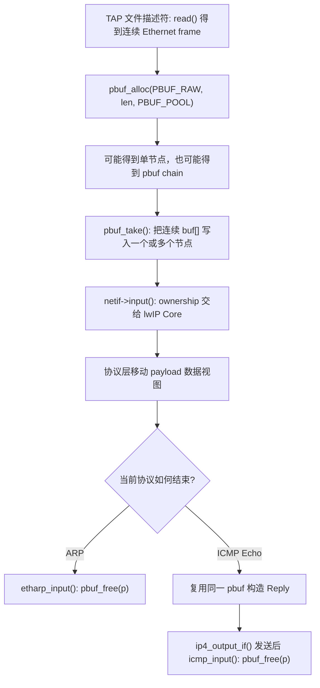
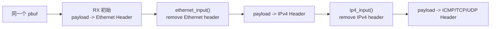
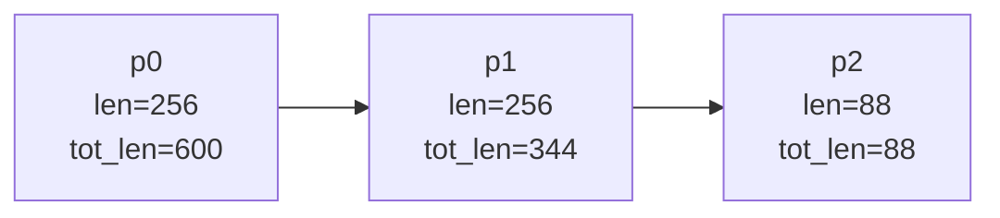
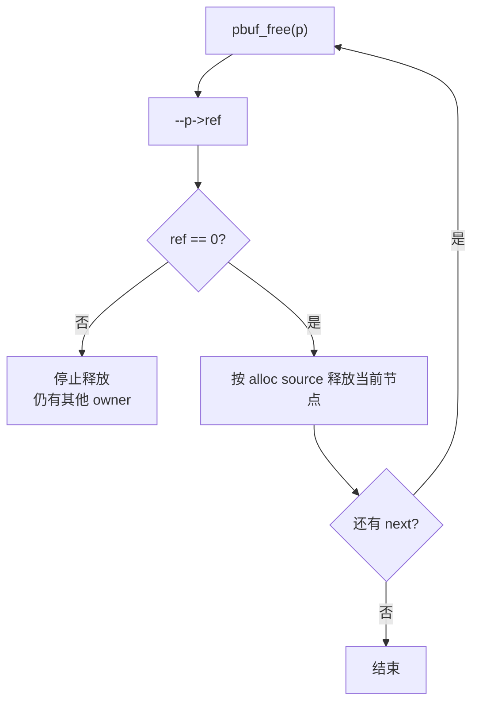

<meta name="referrer" content="no-referrer" />

# 教程 03：从 `low_level_input()` 到 `pbuf_free()`——`pbuf` 的数据视图、Chain 与引用计数

> 摘要：从 TAP 接收路径的 low_level_input 出发，把 pbuf 作为数据视图、Chain 与生命周期来读，沿分配、复制、协议层推进和释放追清整个 packet 的释放责任。

[TOC]

Stage 2 已经把一帧 Ethernet 数据从 TAP 带进 lwIP。现在需要回答一个更底层的问题：**这些字节进入协议栈后到底放在哪里，为什么同一个 packet 可以跨多块内存，又是谁负责最后释放它？**

`pbuf` 是 lwIP 的 **packet buffer（数据包缓冲区）对象**。它不是单纯的一块 `malloc()` 内存，而是“当前数据起点 `payload` + 当前节点长度 `len` + 整包剩余长度 `tot_len` + 下一节点 `next` + 引用计数 `ref` + 分配/数据属性”的组合。[S2](#source-s2) 多个 pbuf 节点通过 `next` 连接起来时称为 **pbuf chain（pbuf 链）**；一条 chain 仍然可以只代表一个 packet，而不是多个 packet。

这里沿用 Stage 2 的 TAP 实验：TAP 是 Linux 的虚拟 Ethernet 设备，frame 从它进入 lwIP。本文中的 **RX（receive，接收）**指 packet 从 TAP/网卡进入 lwIP 的方向；**Core（核心处理上下文）**指 lwIP 的主要协议处理执行环境；**ownership（所有权/释放责任）**指“当前哪一层有责任继续传递、保留引用或最终释放这份 pbuf”；**allocator（分配器）**指 pbuf 及其 payload 来自哪种内存分配来源，以及释放时应回到哪种回收路径。后文讨论 `ref`、`pbuf_cat()`、`pbuf_chain()` 和 `pbuf_free()` 时都围绕这些问题展开。

## 阅读源码前：建议提前阅读

1. [lwIP 2.1.x Doxygen — Packet buffers (PBUF)](https://www.nongnu.org/lwip/2_1_x/group__pbuf.html)：先浏览 `pbuf_alloc()`、`pbuf_free()` 以及 pbuf 类型相关的 API 说明，用来建立接口层概念。[S6](#source-s6)
2. [`src/include/lwip/pbuf.h` — 目标源码快照](https://github.com/lwip-tcpip/lwip/blob/d08f4773edd0182b7910fc8f046eed82ffcd67c9/src/include/lwip/pbuf.h)：重点看 `struct pbuf`、`pbuf_layer` 和 `pbuf_type`；本文的字段语义以这份目标版本源码为准。[S2](#source-s2)
3. [教程 02：从 `main()` 到第一次 Ping](02-netif-tap-first-ping.md)：如果还不清楚 `low_level_input()`、`netif->input()` 和 `tcpip_thread` 的位置，先恢复 TAP 接收到协议栈 Core 的主链。

预读资料不是正文依赖。下面先建立本篇真正需要的 pbuf 心智模型，再进入 `low_level_input()`。

## 进入源码前：先建立 pbuf 的生命周期模型

先区分五个后文会反复出现的概念：

- **node（节点）**：一个 `struct pbuf` 加它当前描述的 payload 区间；
- **chain（链）**：多个节点通过 `next` 组成，同一个 packet 可以跨多个节点；
- **data view（数据视图）**：`payload` 指向当前协议层看到的第一字节，`pbuf_remove_header()` / `pbuf_add_header()` 会移动这个视图；
- **headroom（头部预留空间）**：payload 前为后续协议 Header 预留的空间，`pbuf_layer` 主要决定这一初始偏移；
- **reference count（引用计数）**：`ref` 表示仍有多少引用持有当前 pbuf；`pbuf_free()` 先减少引用，只有减到 0 才真正释放。

当前 TAP 接收路径调用 `pbuf_alloc(PBUF_RAW, len, PBUF_POOL)`：`PBUF_RAW` 表示不额外为上层协议头预留 headroom，收到的 Ethernet Header 就从当前 payload 起点开始；`PBUF_POOL` 表示从接收用的 pbuf pool 分配节点，frame 较大时可能形成 chain。[S1](#source-s1)[S2](#source-s2) 图中的 ARP 与 ICMP Echo 只是用来展示两种真实的“谁最终释放 pbuf”结局，具体协议语义由 Stage 2/4 负责。

在当前 TAP Ping 主线中，一份 RX packet 的生命周期可以先压成这张导航图：



这张图回答“生命周期在哪里开始和结束”；后面的源码则要回答每一步为什么这样做。

把常见 API 与当前 packet 语义先对应起来：

| API / 字段 | 当前问题 | 关键语义 |
| --- | --- | --- |
| `pbuf_alloc(layer, length, type)` | 数据放在哪里、前面留多少 Header 空间 | `layer` 决定初始 headroom；`type` 决定 allocator/数据属性 |
| `pbuf_take()` | Host 连续 buffer 怎样写进 chain | 顺着 `next` 跨节点复制 |
| `payload` | 当前协议层从哪里开始读 | 会随 Header remove/add 移动 |
| `len` / `tot_len` | 当前节点与整包还有多长 | `tot_len` 从当前节点一直统计到 packet 末尾 |
| `pbuf_ref()` | 新 owner 怎样保留一份引用 | `ref + 1` |
| `pbuf_cat()` / `pbuf_chain()` | 两条链如何拼接 | 区别在 tail ownership 是否额外保留 |
| `pbuf_free()` | 什么时候真正释放 | `--ref` 后只释放 `ref==0` 的连续前缀 |

下面从真实入口 `low_level_input()` 开始。

## 1. `pbuf` 第一次在哪里出现：`low_level_input()`

Unix TAP Port 的 RX 路径不是先创建一个抽象“packet object”，而是先从 TAP 文件描述符读取真实 Ethernet frame，再按读到的长度申请 `pbuf`。下面是当前 upstream `tapif.c` 的连续源码片段：[S1](#source-s1)

```c
static struct pbuf *
low_level_input(struct netif *netif)
{
  struct pbuf *p;
  u16_t len;
  ssize_t readlen;
  char buf[1518]; /* max packet size including VLAN excluding CRC */
  struct tapif *tapif = (struct tapif *)netif->state;

  /* Obtain the size of the packet and put it into the "len"
     variable. */
  readlen = read(tapif->fd, buf, sizeof(buf));
  if (readlen < 0) {
    perror("read returned -1");
    exit(1);
  }
  len = (u16_t)readlen;

  MIB2_STATS_NETIF_ADD(netif, ifinoctets, len);

#if 0
  if (((double)rand()/(double)RAND_MAX) < 0.2) {
    printf("drop\n");
    return NULL;
  }
#endif

  /* We allocate a pbuf chain of pbufs from the pool. */
  p = pbuf_alloc(PBUF_RAW, len, PBUF_POOL);
  if (p != NULL) {
    pbuf_take(p, buf, len);
    /* acknowledge that packet has been read(); */
  } else {
    /* drop packet(); */
    MIB2_STATS_NETIF_INC(netif, ifindiscards);
    LWIP_DEBUGF(NETIF_DEBUG, ("tapif_input: could not allocate pbuf\n"));
  }

  return p;
}
```

这段代码把“Host 文件描述符”和“lwIP packet buffer”真正接起来了：

```text
TAP fd
  | read()
  v
临时连续数组 buf[1518]
  | len = readlen
  v
pbuf_alloc(PBUF_RAW, len, PBUF_POOL)
  | 可能得到一个节点，也可能得到一条 chain
  v
pbuf_take(p, buf, len)
  | 把连续 frame 按 pbuf 节点长度复制进去
  v
p -> 一整个 Ethernet frame 的 lwIP 表示
```

这里一次出现了三个参数，后文所有 `pbuf` 行为都从它们展开：[S1](#source-s1)[S2](#source-s2)

- `len`：这次 `read()` 实际返回的 frame 字节数，不是固定 MTU，也不是某个 pool element 的容量；
- `PBUF_RAW`：当前 RX 数据从最外层 Ethernet Header 开始，因此不额外预留协议头 headroom；
- `PBUF_POOL`：要求从 RX pool 取得承载数据的节点，长度较大时允许形成 chain。

所以这里的 `pbuf_alloc()` 不是普通意义的“申请一个结构体”。它同时决定节点来源、payload 起点和一整个 packet 是否需要跨多个节点。

## 2. `struct pbuf` 到底描述什么

`pbuf` 可以理解为“**一段数据视图 + 一组生命周期元数据**”。当前主线最重要的是七个字段：[S2](#source-s2)

```c
struct pbuf {
  struct pbuf *next;
  void *payload;
  u16_t tot_len;
  u16_t len;
  u8_t type_internal;
  u8_t flags;
  LWIP_PBUF_REF_T ref;
  u8_t if_idx;
};
```

| 字段 | 当前先理解成什么 |
| --- | --- |
| `payload` | 当前这一段可见数据的起点 |
| `len` | 当前这个 pbuf 节点里有多少有效字节 |
| `tot_len` | 从当前节点开始，到这个 packet 末尾一共还有多少字节 |
| `next` | 同一个 packet 的下一段 buffer |
| `ref` | 当前还有多少引用持有这个 pbuf |
| `type_internal` | 这个 pbuf 来自哪类 allocator、payload 有什么属性 |
| `flags/if_idx` | 额外 packet 属性和输入接口索引 |

最容易误解的是 `payload`：它不一定永远指向最初收到的 Ethernet Header。协议层调用 `pbuf_remove_header()` 后，`payload` 可以向后移动，让同一个 pbuf 在下一层看来“从 IPv4 Header 开始”或“从 ICMP/TCP/UDP Header 开始”。



这也是为什么把 `pbuf` 当普通 `malloc()` buffer 会丢失关键语义。

## 3. 为什么一个 packet 可能需要多个 pbuf

当前 example 配置的 `PBUF_POOL_BUFSIZE` 是 256 bytes，而 Ethernet **MTU（Maximum Transmission Unit，最大传输单元）**可以是 1500 bytes；一个较大的 frame 很自然会横跨多个 pool element。[S3](#source-s3)

关键不是记住“会形成 chain”，而是看 `pbuf_alloc()` 怎样真正做这件事。`PBUF_POOL` 分支从 `MEMP_PBUF_POOL` 循环取节点，每轮只把当前节点能承载的部分写入 `qlen`，直到 `rem_len` 归零：[S4](#source-s4)

```c
    case PBUF_POOL: {
      struct pbuf *q, *last;
      u16_t rem_len; /* remaining length */
      p = NULL;
      last = NULL;
      rem_len = length;
      do {
        u16_t qlen;
        q = (struct pbuf *)memp_malloc(MEMP_PBUF_POOL);
        if (q == NULL) {
          PBUF_POOL_IS_EMPTY();
          /* free chain so far allocated */
          if (p) {
            pbuf_free(p);
          }
          /* bail out unsuccessfully */
          return NULL;
        }
        qlen = LWIP_MIN(rem_len, (u16_t)(PBUF_POOL_BUFSIZE_ALIGNED - LWIP_MEM_ALIGN_SIZE(offset)));
        pbuf_init_alloced_pbuf(q, LWIP_MEM_ALIGN((void *)((u8_t *)q + SIZEOF_STRUCT_PBUF + offset)),
                               rem_len, qlen, type, 0);
        LWIP_ASSERT("pbuf_alloc: pbuf q->payload properly aligned",
                    ((mem_ptr_t)q->payload % MEM_ALIGNMENT) == 0);
        LWIP_ASSERT("PBUF_POOL_BUFSIZE must be bigger than MEM_ALIGNMENT",
                    (PBUF_POOL_BUFSIZE_ALIGNED - LWIP_MEM_ALIGN_SIZE(offset)) > 0 );
        if (p == NULL) {
          /* allocated head of pbuf chain (into p) */
          p = q;
        } else {
          /* make previous pbuf point to this pbuf */
          last->next = q;
        }
        last = q;
        rem_len = (u16_t)(rem_len - qlen);
        offset = 0;
      } while (rem_len > 0);
      break;
    }
```

注意 `pbuf_init_alloced_pbuf()` 收到两个不同长度：

```text
rem_len -> 当前节点的 tot_len
qlen    -> 当前节点的 len
```

这正是 `tot_len` 不变量的来源之一。假设一个 packet 最终由三段组成：

```text
p0.len = 256
p1.len = 256
p2.len = 88
```

那么从每个节点看，“当前 packet 还剩多少数据”分别是：

```text
p0.tot_len = 600
p1.tot_len = 344
p2.tot_len = 88
```

满足下面这个 `pbuf` 链长度不变量；它用于说明字段关系，不是某个函数中的独立执行语句：[S2](#source-s2)

```text
p->tot_len == p->len + (p->next ? p->next->tot_len : 0)
```



因此 pbuf **chain** 表示“同一个 packet 被 scatter 到多块内存”，不是“收到了三个 packet”。这一点后面读 `pbuf_take()`、TCP segmentation 和乱序重组时都会反复用到。

## 4. `PBUF_POOL`、`PBUF_RAM`、`PBUF_REF`、`PBUF_ROM` 为什么不能只看名字

现在已经知道 RX 为什么需要多个节点，再看四类 pbuf 就容易很多。[S2](#source-s2)[S4](#source-s4)

| 类型 | `struct pbuf` 与 payload 的来源 | 典型用途 | 生命周期关键点 |
| --- | --- | --- | --- |
| `PBUF_POOL` | `MEMP_PBUF_POOL` 固定池，结构和 payload 连续 | RX | 可以形成 chain；不要长期占满 RX pool |
| `PBUF_RAM` | `mem_malloc()` 一块连续 heap | TX/需要可修改连续存储 | 通常单节点 |
| `PBUF_REF` | `MEMP_PBUF` 只分配描述符，payload 指向外部可变 RAM | 临时引用外部数据 | 若要排队，必须保证外部数据生命周期或复制 |
| `PBUF_ROM` | `MEMP_PBUF` 只分配描述符，payload 指向稳定只读数据 | 长生命周期静态数据 | payload 不由 pbuf 释放 |

这里需要消歧两个概念：

- `PBUF_POOL` 的 “POOL” 指 allocator 来源；
- `pbuf chain` 指多个 pbuf 节点共同描述一个 packet。

一个 `PBUF_POOL` packet 可以是一条 chain；“POOL”和“chain”不是同一维度。

## 5. `pbuf_layer` 不是协议类型

`pbuf_alloc(layer, length, type)` 的第一个参数容易被误解成“我要申请 TCP pbuf/UDP pbuf”。源码里的 enum 直接说明它实际上是 **header headroom 的累计偏移量**：[S2](#source-s2)

```c
typedef enum {
  PBUF_TRANSPORT = PBUF_LINK_ENCAPSULATION_HLEN + PBUF_LINK_HLEN + PBUF_IP_HLEN + PBUF_TRANSPORT_HLEN,
  PBUF_IP = PBUF_LINK_ENCAPSULATION_HLEN + PBUF_LINK_HLEN + PBUF_IP_HLEN,
  PBUF_LINK = PBUF_LINK_ENCAPSULATION_HLEN + PBUF_LINK_HLEN,
  PBUF_RAW_TX = PBUF_LINK_ENCAPSULATION_HLEN,
  PBUF_RAW = 0
} pbuf_layer;
```

因此这些名字描述的是“当前 payload 前面至少要留出多少空间”，而不是 packet 已经属于哪种协议：

```text
PBUF_TRANSPORT
  预留 link + IP + transport header 空间

PBUF_IP
  预留 link + IP header 空间

PBUF_LINK
  预留 link-layer header 空间

PBUF_RAW
  不额外预留，payload 从当前原始数据起点开始
```

它解决的是 TX 时 `pbuf_add_header()` 能否直接把 `payload` 向前移动，而不是协议分发问题。真正“这是 IPv4、TCP 还是 UDP”由 Ethernet `EtherType`、IPv4 `Protocol` 等 header 字段决定。

`layer` 与 `type` 是两个独立轴：

| 参数 | 决定什么 |
| --- | --- |
| `layer` | payload 前的 headroom / 初始 offset |
| `type` | `struct pbuf` 和 payload 从哪里分配、数据属性与 allocator source |

Stage 4 会看到 RX 方向不断 `pbuf_remove_header()`；TX 方向则常常反过来 `pbuf_add_header()`。两者都是在改变同一个 `payload` 数据视图。

## 6. `pbuf_take()` 为什么能跨 Chain 写入

`low_level_input()` 已经有一块连续的临时 `buf[1518]`，而 `PBUF_POOL` 可能返回 chain。`pbuf_take()` 的真实实现并没有要求 `buf` 和 pbuf 一样分段，它沿 `next` 逐节点计算本轮 copy 长度：[S4](#source-s4)

```c
err_t
pbuf_take(struct pbuf *buf, const void *dataptr, u16_t len)
{
  struct pbuf *p;
  size_t buf_copy_len;
  size_t total_copy_len = len;
  size_t copied_total = 0;

  LWIP_ERROR("pbuf_take: invalid buf", (buf != NULL), return ERR_ARG;);
  LWIP_ERROR("pbuf_take: invalid dataptr", (dataptr != NULL), return ERR_ARG;);
  LWIP_ERROR("pbuf_take: buf not large enough", (buf->tot_len >= len), return ERR_MEM;);

  if ((buf == NULL) || (dataptr == NULL) || (buf->tot_len < len)) {
    return ERR_ARG;
  }

  /* Note some systems use byte copy if dataptr or one of the pbuf payload pointers are unaligned. */
  for (p = buf; total_copy_len != 0; p = p->next) {
    LWIP_ASSERT("pbuf_take: invalid pbuf", p != NULL);
    buf_copy_len = total_copy_len;
    if (buf_copy_len > p->len) {
      /* this pbuf cannot hold all remaining data */
      buf_copy_len = p->len;
    }
    /* copy the necessary parts of the buffer */
    MEMCPY(p->payload, &((const char *)dataptr)[copied_total], buf_copy_len);
    total_copy_len -= buf_copy_len;
    copied_total += buf_copy_len;
  }
  LWIP_ASSERT("did not copy all data", total_copy_len == 0 && copied_total == len);
  return ERR_OK;
}
```

把变量对应回当前 TAP frame：

```text
dataptr      -> low_level_input() 的临时 buf
len          -> read() 返回的完整 frame 长度
p            -> 当前正在填充的 pbuf 节点
p->len       -> 当前节点最多参与本轮 copy 的有效范围
copied_total -> 连续源 buffer 已经消费到哪里
```

所以一个 600-byte frame 即使落在三个 pool 节点里，对 `pbuf_take()` 来说仍是一条连续逻辑字节流：

```text
buf[0 .. 255]   -> p0->payload
buf[256 .. 511] -> p1->payload
buf[512 .. 599] -> p2->payload
```

反向操作 `pbuf_copy_partial()` 则把 chain 当作连续数据视图，从指定 offset 复制到调用者的连续 buffer。[S4](#source-s4)

## 7. `ref` 不是“是否正在使用”的布尔值

`ref` 的定义更严格：**等于当前引用这个 pbuf 的指针数量**。[S2](#source-s2)

新分配 pbuf 通常从 `ref = 1` 开始。`pbuf_ref()` 增加引用，`pbuf_free()` 则先减引用；只有减到 0，allocator 对应的内存才真正释放。[S4](#source-s4)



这里的 owner 不是 C++ 智能指针意义上的类型系统 owner，而是 lwIP 用引用计数维护的运行时所有权关系。

## 8. `pbuf_cat()` 与 `pbuf_chain()` 的差别就是 ownership

两者都会把 `t` 接到 `h` 后面并更新 `h` 侧 `tot_len`，但源码把 ownership 差异写得非常直接。[S4](#source-s4)

`pbuf_cat()` 的连续实现是：

```c
void
pbuf_cat(struct pbuf *h, struct pbuf *t)
{
  struct pbuf *p;

  LWIP_ERROR("(h != NULL) && (t != NULL) (programmer violates API)",
             ((h != NULL) && (t != NULL)), return;);
  LWIP_ASSERT("Creating an infinite loop", h != t);

  /* proceed to last pbuf of chain */
  for (p = h; p->next != NULL; p = p->next) {
    /* add total length of second chain to all totals of first chain */
    p->tot_len = (u16_t)(p->tot_len + t->tot_len);
  }
  /* { p is last pbuf of first h chain, p->next == NULL } */
  LWIP_ASSERT("p->tot_len == p->len (of last pbuf in chain)", p->tot_len == p->len);
  LWIP_ASSERT("p->next == NULL", p->next == NULL);
  /* add total length of second chain to last pbuf total of first chain */
  p->tot_len = (u16_t)(p->tot_len + t->tot_len);
  /* chain last pbuf of head (p) with first of tail (t) */
  p->next = t;
  /* p->next now references t, but the caller will drop its reference to t,
   * so netto there is no change to the reference count of t.
   */
}
```

它没有调用 `pbuf_ref(t)`。API contract（接口约定）是：调用者把自己原来持有的 `t` 引用转交给新的 chain，之后不能再把那份引用当成独立 ownership 使用。

`pbuf_chain()` 则是在相同拼接动作后明确再加一次引用：[S4](#source-s4)

```c
void
pbuf_chain(struct pbuf *h, struct pbuf *t)
{
  pbuf_cat(h, t);
  /* t is now referenced by h */
  pbuf_ref(t);
  LWIP_DEBUGF(PBUF_DEBUG | LWIP_DBG_TRACE, ("pbuf_chain: %p references %p\n", (void *)h, (void *)t));
}
```

因此差异不是“两个函数都能拼链，随便选一个”：

| API | 对 `t->ref` 的影响 | 调用者原引用 |
| --- | --- | --- |
| `pbuf_cat(h, t)` | 不增加 | 转交给新 chain，不应继续作为独立引用使用 |
| `pbuf_chain(h, t)` | `+1` | 调用者仍保留自己的引用，之后仍要负责释放 |

这个区别直接决定以后 `pbuf_free()` 是正常释放、提前释放还是泄漏。

## 9. `pbuf_free()` 为什么可能只释放 Chain 前半段

`pbuf_free()` 不是普通 linked-list destructor。源码先对每个节点执行 `--ref`，只有新值变成 0 才真正释放；一旦遇到仍有引用的节点，就立即停止向后走。[S4](#source-s4)

```c
u8_t
pbuf_free(struct pbuf *p)
{
  u8_t alloc_src;
  struct pbuf *q;
  u8_t count;

  if (p == NULL) {
    LWIP_ASSERT("p != NULL", p != NULL);
    LWIP_DEBUGF(PBUF_DEBUG | LWIP_DBG_LEVEL_SERIOUS,
                ("pbuf_free(p == NULL) was called.\n"));
    return 0;
  }

  count = 0;
  while (p != NULL) {
    LWIP_PBUF_REF_T ref;
    SYS_ARCH_DECL_PROTECT(old_level);
    SYS_ARCH_PROTECT(old_level);
    LWIP_ASSERT("pbuf_free: p->ref > 0", p->ref > 0);
    ref = --(p->ref);
    SYS_ARCH_UNPROTECT(old_level);
    if (ref == 0) {
      q = p->next;
      alloc_src = pbuf_get_allocsrc(p);
#if LWIP_SUPPORT_CUSTOM_PBUF
      if ((p->flags & PBUF_FLAG_IS_CUSTOM) != 0) {
        struct pbuf_custom *pc = (struct pbuf_custom *)p;
        LWIP_ASSERT("pc->custom_free_function != NULL", pc->custom_free_function != NULL);
        pc->custom_free_function(p);
      } else
#endif /* LWIP_SUPPORT_CUSTOM_PBUF */
      {
        if (alloc_src == PBUF_TYPE_ALLOC_SRC_MASK_STD_MEMP_PBUF_POOL) {
          memp_free(MEMP_PBUF_POOL, p);
        } else if (alloc_src == PBUF_TYPE_ALLOC_SRC_MASK_STD_MEMP_PBUF) {
          memp_free(MEMP_PBUF, p);
        } else if (alloc_src == PBUF_TYPE_ALLOC_SRC_MASK_STD_HEAP) {
          mem_free(p);
        } else {
          LWIP_ASSERT("invalid pbuf type", 0);
        }
      }
      count++;
      p = q;
    } else {
      p = NULL;
    }
  }
  return count;
}
```

这里同时完成两件事：

1. **引用计数决定是否能释放**：`ref != 0` 就停止；
2. **allocation source 决定怎么释放**：Pool 回 `memp_free(MEMP_PBUF_POOL)`，描述符型回 `MEMP_PBUF`，`PBUF_RAM` 回 `mem_free()`，custom pbuf 则调用自己的 free callback。

所以：

```text
pbuf_free(head)
```

真正的语义是“从 `head` 开始释放已经失去全部引用的连续前缀”，不是无条件 free 整条 `next` 链。

例如：

```text
p0.ref = 1
p1.ref = 2   <- 还有另一个 owner
p2.ref = 1
```

调用 `pbuf_free(p0)` 后：

```text
p0.ref: 1 -> 0  => p0 被释放
p1.ref: 2 -> 1  => 停止
p2 不会继续 decrement
```

这一点是后续 UDP callback、TCP receive、zero-copy RX 等 ownership 分析的基础。

## 10. 回到这次 Ping：成功路径上的 ownership 最终交给谁释放

前面已经理解 `pbuf_free()` 的通用算法，现在把它重新挂回 Stage 2 的真实 RX 主线。关键问题不是“哪里出现过 `pbuf_free()`”，而是：**Port 把 `p` 交给 Core 后，哪一层成为最后一个 owner？**

`tapif_input()` 从 `low_level_input()` 拿到 `p` 后调用 `netif->input(p, netif)`。只有 `netif->input()` 返回错误时，Port 才自己释放：[S1](#source-s1)

```c
static void
tapif_input(struct netif *netif)
{
  struct pbuf *p = low_level_input(netif);

  if (p == NULL) {
    return;
  }

  if (netif->input(p, netif) != ERR_OK) {
    pbuf_free(p);
  }
}
```

当前 `netif->input` 绑定的是 `tcpip_input()`。默认 mailbox 路径里，`tcpip_inpkt()` 把同一个 `p` 放进 `TCPIP_MSG_INPKT`，`tcpip_thread_handle_msg()` 再调用消息中保存的 `input_fn`；只有 `input_fn` 返回错误时，`tcpip_thread` 才执行兜底 `pbuf_free()`。[S7](#source-s7)

```c
case TCPIP_MSG_INPKT:
  if (msg->msg.inp.input_fn(msg->msg.inp.p,
                            msg->msg.inp.netif) != ERR_OK) {
    pbuf_free(msg->msg.inp.p);
  }
  memp_free(MEMP_TCPIP_MSG_INPKT, msg);
  break;
```

成功进入 `ethernet_input()` 后，具体协议 handler 负责把 packet 消费到结束。对 Stage 2 的两条主路径：

**ARP Request/Reply RX** 在 `etharp_input()` 尾部直接释放这份 ARP pbuf：[S8](#source-s8)

```c
  /* free ARP packet */
  pbuf_free(p);
}
```

**ICMP Echo Request RX** 则更有代表性：`icmp_input()` 尽量复用收到的同一份 pbuf，把 Echo Request 改成 Echo Reply，调用 `ip4_output_if()` 同步走完 TX 提交，然后在函数尾部释放收到/复用的 pbuf：[S9](#source-s9)

继续阅读 `icmp_input()` 的 Echo Request 分支。下面是发送 Echo Reply 的连续上游片段；`ip4_output_if()` 返回后，这个 case 结束：[S9](#source-s9)

```c
        /* send an ICMP packet */
        ret = ip4_output_if(p, src, LWIP_IP_HDRINCL,
                            ICMP_TTL, 0, IP_PROTO_ICMP, inp);
        if (ret != ERR_OK) {
          LWIP_DEBUGF(ICMP_DEBUG, ("icmp_input: ip_output_if returned an error: %s\n", lwip_strerr(ret)));
        }
      }
      break;
```

`switch (type)` 还包含其他 ICMP 类型，因此上面的 `break` 与公共释放点在源码中并不相邻。Echo case 结束后控制流离开 `switch`，继续到 `icmp_input()` 的公共函数尾部；这里的连续源码明确释放当前输入 pbuf：[S9](#source-s9)

```c
  pbuf_free(p);
  return;
```

这两个代码块分别来自同一个 `icmp_input()` 的 Echo case 与公共尾部，中间存在其他 `switch` 分支；正文显式保留这段控制流距离，而不是用省略符把非连续源码伪装成连续片段。

因此当前 Ping RX 的 ownership 可以概括为：

```text
low_level_input() 创建 pbuf
  -> tapif_input() 暂时持有
  -> tcpip_input()/mailbox 把处理权交给 tcpip_thread
  -> ethernet_input() 把 packet 交给具体协议 handler
  -> etharp_input() / icmp_input() 在成功消费后负责最终 pbuf_free()
```

这条链说明一个重要规则：**成功把 pbuf 交给下一层后，上层不能再按“自己的 buffer”随意释放；是否保留引用必须由 API contract 和 `ref` 明确表达。** 这也是后续 zero-copy、TCP receive callback 和 DMA RX ownership 分析的基础。

## 11. Unit Test 在这一阶段应该怎么看

upstream `test_pbuf.c` 提供的是确定性输入：它会显式申请不同 layer/type/length 的 pbuf，检查 chain 长度、不变量、header 调整和 copy 行为。[S5](#source-s5)

它和 TAP RX 的职责不同：

```text
TAP RX
  证明真实 frame 怎样进入 pbuf

Unit Test
  证明 pbuf API 在边界输入下保持哪些不变量
```

后续文章继续看到 `pbuf_cat()`、`pbuf_ref()`、`pbuf_free()` 时，都应该带着这三个问题读：

1. 当前 `payload` 指向哪一层 header？
2. 当前 chain 的 `len/tot_len` 是否仍表示同一个 packet？
3. 当前是谁持有引用，下一步谁负责释放？

## 资料来源

<a id="source-s1"></a>
### [S1] Unix TAP Port RX 路径
- 版本：`d08f4773edd0182b7910fc8f046eed82ffcd67c9`
- URL/文档：[`contrib/ports/unix/port/netif/tapif.c`](https://github.com/lwip-tcpip/lwip/blob/d08f4773edd0182b7910fc8f046eed82ffcd67c9/contrib/ports/unix/port/netif/tapif.c)
- 使用位置：真实 RX 中 `pbuf_alloc()`、`pbuf_take()` 的入口
- 支撑内容：证明 TAP frame 如何从连续 Host buffer 转成 lwIP pbuf

<a id="source-s2"></a>
### [S2] `struct pbuf` 与类型定义
- 版本：`d08f4773edd0182b7910fc8f046eed82ffcd67c9`
- URL/文档：[`src/include/lwip/pbuf.h`](https://github.com/lwip-tcpip/lwip/blob/d08f4773edd0182b7910fc8f046eed82ffcd67c9/src/include/lwip/pbuf.h)
- 使用位置：字段、Chain 不变量、`PBUF_*` 类型
- 支撑内容：`payload/len/tot_len/ref/next` 语义与 allocator/type flags

<a id="source-s3"></a>
### [S3] example `lwipopts.h`
- 版本：`d08f4773edd0182b7910fc8f046eed82ffcd67c9`
- URL/文档：[`contrib/examples/example_app/lwipopts.h`](https://github.com/lwip-tcpip/lwip/blob/d08f4773edd0182b7910fc8f046eed82ffcd67c9/contrib/examples/example_app/lwipopts.h)
- 使用位置：`PBUF_POOL_BUFSIZE` 等当前 example 配置
- 支撑内容：当前 Host example 的 pool buffer 配置基线

<a id="source-s4"></a>
### [S4] `pbuf` Core 实现
- 版本：`d08f4773edd0182b7910fc8f046eed82ffcd67c9`
- URL/文档：[`src/core/pbuf.c`](https://github.com/lwip-tcpip/lwip/blob/d08f4773edd0182b7910fc8f046eed82ffcd67c9/src/core/pbuf.c)
- 使用位置：allocation、copy、reference、chain、free
- 支撑内容：`pbuf_alloc()`、`pbuf_take()`、`pbuf_copy_partial()`、`pbuf_ref()`、`pbuf_cat()`、`pbuf_chain()`、`pbuf_free()` 的真实行为

<a id="source-s5"></a>
### [S5] upstream `pbuf` Unit Test
- 版本：`d08f4773edd0182b7910fc8f046eed82ffcd67c9`
- URL/文档：[`test/unit/core/test_pbuf.c`](https://github.com/lwip-tcpip/lwip/blob/d08f4773edd0182b7910fc8f046eed82ffcd67c9/test/unit/core/test_pbuf.c)
- 使用位置：确定性边界输入与 API 不变量
- 支撑内容：upstream 如何直接构造 pbuf case 检查 allocation、chain、header 与 copy 行为
<a id="source-s6"></a>
### [S6] lwIP Doxygen — Packet buffers (PBUF)
- 类型：lwIP 官方 API 文档
- URL/文档：[lwIP 2.1.x — Packet buffers (PBUF)](https://www.nongnu.org/lwip/2_1_x/group__pbuf.html)
- 使用位置：“阅读源码前”
- 支撑内容：提供 `pbuf_alloc()`、`pbuf_free()`、pbuf type/chain 的 API 层快速索引；目标实现细节仍以本项目源码快照为准

<a id="source-s7"></a>
### [S7] `tcpip.c` 的 RX mailbox ownership 桥
- 版本：`d08f4773edd0182b7910fc8f046eed82ffcd67c9`
- URL/文档：[`src/api/tcpip.c`](https://github.com/lwip-tcpip/lwip/blob/d08f4773edd0182b7910fc8f046eed82ffcd67c9/src/api/tcpip.c)
- 使用位置：“回到这次 Ping：成功路径上的 ownership 最终交给谁释放”
- 支撑内容：`tcpip_input()`、`tcpip_inpkt()`、`TCPIP_MSG_INPKT` 和错误路径 `pbuf_free()` 的 ownership 交接

<a id="source-s8"></a>
### [S8] ARP RX 的最终释放点
- 版本：`d08f4773edd0182b7910fc8f046eed82ffcd67c9`
- URL/文档：[`src/core/ipv4/etharp.c`](https://github.com/lwip-tcpip/lwip/blob/d08f4773edd0182b7910fc8f046eed82ffcd67c9/src/core/ipv4/etharp.c)
- 使用位置：“回到这次 Ping：成功路径上的 ownership 最终交给谁释放”
- 支撑内容：`etharp_input()` 消费 ARP packet 后在函数尾部执行 `pbuf_free(p)`

<a id="source-s9"></a>
### [S9] ICMP Echo RX/TX 与最终释放点
- 版本：`d08f4773edd0182b7910fc8f046eed82ffcd67c9`
- URL/文档：[`src/core/ipv4/icmp.c`](https://github.com/lwip-tcpip/lwip/blob/d08f4773edd0182b7910fc8f046eed82ffcd67c9/src/core/ipv4/icmp.c)
- 使用位置：“回到这次 Ping：成功路径上的 ownership 最终交给谁释放”
- 支撑内容：`icmp_input()` 复用 pbuf 构造 Echo Reply、调用 `ip4_output_if()` 后回到公共 `pbuf_free(p)` 释放点

