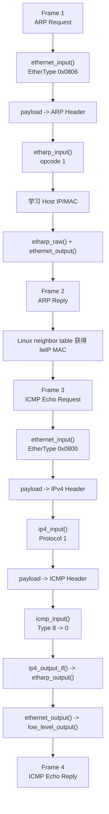

<meta name="referrer" content="no-referrer" />

# 教程 04：从 `ethernet_input()` 到 Echo Reply——Ethernet、ARP、IPv4 与 ICMP 的分层数据通路

> 摘要：用 Stage 2 的真实四帧 Ping 抓包对照 lwIP 源码，理解 EtherType、ARP opcode、IPv4 Protocol、ICMP Type 和 pbuf 数据视图如何逐层驱动分发。

[TOC]

本文源码块采用统一约定：除非代码块前明确标注为“上游连续源码片段”，其余 C 代码块一律视为按当前 revision 裁剪的“执行路径阅读版”。阅读版只删除与当前主线无关的注释、条件编译或旁支，不重排保留语句，也不使用省略号伪装缺失源码；示意代码会另行标注。

Stage 2 已经把第一次 Ping 跑通，也已经保留真实 `docs/assets/stage2-ping.pcap`。这一篇不再重复 TAP 创建和路由配置，而是从已经进入 Core 的 `pbuf` 开始，回答一个更具体的问题：**同一串字节为什么先被当成 Ethernet，再被当成 ARP 或 IPv4，最后又进入 ICMP？**[S1](#source-s1)

真实抓包中的四帧顺序是：[S1](#source-s1)

```text
Frame 1  ARP Request
Frame 2  ARP Reply
Frame 3  ICMP Echo Request
Frame 4  ICMP Echo Reply
```

这四帧正好覆盖一次最小 IPv4/Ethernet 往返中的两个阶段：先解析邻居 MAC，再发送真正的 ICMP Echo。

这里也明确一个此前容易被忽略的系列边界：**Stage 2～14 的网络层实验主线实际上一直主要是 IPv4。** Stage 4 从 `ETHTYPE_IP` 进入 `ip4_input()`；Stage 5～10 的 UDP/TCP 实验承载在当前 IPv4 Host/TAP 网络上；Stage 13 是 DHCPv4；Stage 14 当前实验解析 DNS A 记录。IPv4 没有被单独抽成“总论篇”，是因为它一直嵌在这些真实数据路径中。Stage 15 会暂时退出源码调用链，用 Theory-of-Operation 方式把这些 IPv4 知识与 IPv6 做一次整体对照。

## 1. `netif` 的三个方向先不要混

Unix TAP Port 初始化时会把三个函数指针写进同一个 `struct netif`：[S2](#source-s2)

```text
netif->input      = tcpip_input
netif->output     = etharp_output
netif->linkoutput = low_level_output
```

它们不是三个同义的“发送/接收函数”：

| 成员 | 方向 | 当前链路里的角色 |
| --- | --- | --- |
| `input` | Port → Core | 已经收到一个 frame，把 pbuf 交给 lwIP Core |
| `output` | IPv4 Core → Ethernet | 已知目标 IP，先决定下一跳 MAC |
| `linkoutput` | Ethernet → Port | 已经有完整 Ethernet frame，把字节交给设备/Port |

后面看到 `netif->output` 和 `netif->linkoutput` 时，可以直接判断：前者仍在处理 IP→MAC 的映射，后者已经进入真正的二层发送。

## 2. `ethernet_input()` 第一件事：把 `payload` 当成 Ethernet Header，然后按 EtherType 分发

从 Stage 2/3 进入 `ethernet_input()` 时，`p->payload` 指向 Ethernet Header。源码不是抽象地“识别协议”，而是直接把这段 bytes cast 成 `struct eth_hdr` 并读取 `type`：[S3](#source-s3)

```c
  /* points to packet payload, which starts with an Ethernet header */
  ethhdr = (struct eth_hdr *)p->payload;
  LWIP_DEBUGF(ETHARP_DEBUG | LWIP_DBG_TRACE,
              ("ethernet_input: dest:%"X8_F":%"X8_F":%"X8_F":%"X8_F":%"X8_F":%"X8_F", src:%"X8_F":%"X8_F":%"X8_F":%"X8_F":%"X8_F":%"X8_F", type:%"X16_F"\n",
               (unsigned char)ethhdr->dest.addr[0], (unsigned char)ethhdr->dest.addr[1], (unsigned char)ethhdr->dest.addr[2],
               (unsigned char)ethhdr->dest.addr[3], (unsigned char)ethhdr->dest.addr[4], (unsigned char)ethhdr->dest.addr[5],
               (unsigned char)ethhdr->src.addr[0],  (unsigned char)ethhdr->src.addr[1],  (unsigned char)ethhdr->src.addr[2],
               (unsigned char)ethhdr->src.addr[3],  (unsigned char)ethhdr->src.addr[4],  (unsigned char)ethhdr->src.addr[5],
               lwip_htons(ethhdr->type)));

  type = ethhdr->type;
```

当前主线只关心两种 EtherType：IPv4 和 ARP。真正的分支是：[S3](#source-s3)

```c
    case PP_HTONS(ETHTYPE_IP):
      if (!(netif->flags & NETIF_FLAG_ETHARP)) {
        goto free_and_return;
      }
      /* skip Ethernet header (min. size checked above) */
      if (pbuf_remove_header(p, next_hdr_offset)) {
        LWIP_DEBUGF(ETHARP_DEBUG | LWIP_DBG_TRACE | LWIP_DBG_LEVEL_WARNING,
                    ("ethernet_input: IPv4 packet dropped, too short (%"U16_F"/%"U16_F")\n",
                     p->tot_len, next_hdr_offset));
        LWIP_DEBUGF(ETHARP_DEBUG | LWIP_DBG_TRACE, ("Can't move over header in packet\n"));
        goto free_and_return;
      } else {
        /* pass to IP layer */
        ip4_input(p, netif);
      }
      break;

    case PP_HTONS(ETHTYPE_ARP):
      if (!(netif->flags & NETIF_FLAG_ETHARP)) {
        goto free_and_return;
      }
      /* skip Ethernet header (min. size checked above) */
      if (pbuf_remove_header(p, next_hdr_offset)) {
        LWIP_DEBUGF(ETHARP_DEBUG | LWIP_DBG_TRACE | LWIP_DBG_LEVEL_WARNING,
                    ("ethernet_input: ARP response packet dropped, too short (%"U16_F"/%"U16_F")\n",
                     p->tot_len, next_hdr_offset));
        goto free_and_return;
      } else {
        /* pass p to ARP module */
        etharp_input(p, netif);
      }
      break;
```

这几行代码同时完成两件事：

1. 根据 Ethernet Header 的 `type` 决定下一层；
2. 在调用下一层前用 `pbuf_remove_header()` 把 `p->payload` 推进到 L3/L2.5 payload。

因此：

```text
进入 ethernet_input()
    p->payload -> Ethernet Header

ETHTYPE_ARP
    remove Ethernet Header
    p->payload -> ARP Header
    etharp_input()

ETHTYPE_IP
    remove Ethernet Header
    p->payload -> IPv4 Header
    ip4_input()
```

这就是 Stage 3“同一个 pbuf 的数据视图会移动”在真实协议分发里的第一次落地。
## 3. Frame 1：为什么 ARP Request 先于 ICMP

Linux 已经知道目标 IPv4 是 `198.18.0.200`，但 Ethernet frame 发送前仍需要 Destination MAC。neighbor table 中没有映射时，Host 必须先问：[S4](#source-s4)[S5](#source-s5)

```text
Who has 198.18.0.200?
Tell 198.18.0.1
```

这个问题就是 ARP Request。

Frame 1 的关键字段分两层：

| 层 | 字段 | 值 | 表示什么 |
| --- | --- | --- | --- |
| Ethernet | Destination MAC | `ff:ff:ff:ff:ff:ff` | 二层广播 |
| Ethernet | EtherType | `0x0806` | payload 是 ARP |
| ARP | opcode | `1` | ARP Request |
| ARP | sender protocol address | `198.18.0.1` | Host IPv4 |
| ARP | target protocol address | `198.18.0.200` | 正在查询的 lwIP IPv4 |

`EtherType` 和 `opcode` 的职责完全不同：

```text
EtherType: 这是什么协议？
ARP opcode: 这个 ARP 消息要做什么？
```

## 4. `etharp_input()`：先验证 ARP Header、学习发送者，再决定要不要回复

`ethernet_input()` 已经移除了 Ethernet Header，所以 `etharp_input()` 入口第一行就可以把 `p->payload` 当成 `struct etharp_hdr`：[S4](#source-s4)

```c
  hdr = (struct etharp_hdr *)p->payload;

  /* RFC 826 "Packet Reception": */
  if ((hdr->hwtype != PP_HTONS(LWIP_IANA_HWTYPE_ETHERNET)) ||
      (hdr->hwlen != ETH_HWADDR_LEN) ||
      (hdr->protolen != sizeof(ip4_addr_t)) ||
      (hdr->proto != PP_HTONS(ETHTYPE_IP)))  {
    LWIP_DEBUGF(ETHARP_DEBUG | LWIP_DBG_TRACE | LWIP_DBG_LEVEL_WARNING,
                ("etharp_input: packet dropped, wrong hw type, hwlen, proto, protolen or ethernet type (%"U16_F"/%"U16_F"/%"U16_F"/%"U16_F")\n",
                 hdr->hwtype, (u16_t)hdr->hwlen, hdr->proto, (u16_t)hdr->protolen));
    ETHARP_STATS_INC(etharp.proterr);
    ETHARP_STATS_INC(etharp.drop);
    pbuf_free(p);
    return;
  }
```

通过格式检查以后，控制流仍在 `etharp_input()` 中。下面继续阅读 `etharp_input()`：它把 ARP sender/target IPv4 地址复制到对齐的本地变量，并判断 request/reply 是否针对本机：[S4](#source-s4)

```c
  IPADDR_WORDALIGNED_COPY_TO_IP4_ADDR_T(&sipaddr, &hdr->sipaddr);
  IPADDR_WORDALIGNED_COPY_TO_IP4_ADDR_T(&dipaddr, &hdr->dipaddr);

  if (ip4_addr_isany_val(*netif_ip4_addr(netif))) {
    for_us = 0;
    from_us = 0;
  } else {
    /* ARP packet directed to us? */
    for_us = (u8_t)ip4_addr_eq(&dipaddr, netif_ip4_addr(netif));
    /* ARP packet from us? */
    from_us = (u8_t)ip4_addr_eq(&sipaddr, netif_ip4_addr(netif));
  }
```

仍然在 `etharp_input()` 内，ARP 学习发生在处理 opcode 之前。只要 sender 信息满足当前更新策略，lwIP 先尝试把 `sender IP -> sender MAC` 写进 ARP cache：[S4](#source-s4)

```c
  etharp_update_arp_entry(netif, &sipaddr, &(hdr->shwaddr),
                          for_us ? ETHARP_FLAG_TRY_HARD : ETHARP_FLAG_FIND_ONLY);
```

然后才根据 `hdr->opcode` 决定动作。对发给本机的 ARP Request，直接调用 `etharp_raw()` 构造 Reply：[S4](#source-s4)

```c
    case PP_HTONS(ARP_REQUEST):
      LWIP_DEBUGF (ETHARP_DEBUG | LWIP_DBG_TRACE, ("etharp_input: incoming ARP request\n"));
      /* ARP request for our address? */
      if (for_us && !from_us) {
        /* send ARP response */
        etharp_raw(netif,
                   (struct eth_addr *)netif->hwaddr, &hdr->shwaddr,
                   (struct eth_addr *)netif->hwaddr, netif_ip4_addr(netif),
                   &hdr->shwaddr, &sipaddr,
                   ARP_REPLY);
```

继续阅读 `etharp_input()` 的 `switch (hdr->opcode)`。ARP Reply 没有另一套“交给应用”的 callback；cache 在前面已经更新，分支只记录这个 opcode，最后释放这次 ARP packet：[S4](#source-s4)

```c
    case PP_HTONS(ARP_REPLY):
      /* ARP reply. We already updated the ARP cache earlier. */
      LWIP_DEBUGF(ETHARP_DEBUG | LWIP_DBG_TRACE, ("etharp_input: incoming ARP reply\n"));
      break;
```

这解释了为什么“先学习 sender，再看 request/reply”比单纯背 ARP 四个地址字段更重要：同一条输入路径既完成邻居学习，又可能立即生成回复。
## 5. Frame 2：ARP Reply 为什么不走 `etharp_output()`

ARP Reply 的目标 MAC 已经来自 Request 的 sender MAC，所以 `etharp_raw()` 可以直接填写 Ethernet src/dst，并调用：

```text
etharp_raw()
  -> ethernet_output(..., ETHTYPE_ARP)
  -> netif->linkoutput
  -> low_level_output()
```

这里不需要 `etharp_output()`，因为 `etharp_output()` 的职责是“**拿一个目标 IPv4 去找 MAC**”；而 ARP Reply 已经明确知道目标 MAC。[S4](#source-s4)[S3](#source-s3)

这是一个很重要的边界：

| 函数 | 输入里是否已经知道 Destination MAC |
| --- | --- |
| `etharp_output()` | 不一定，需要先查/发 ARP |
| `ethernet_output()` | 已经知道 |

Frame 2 到达 Linux 后，Linux neighbor table 得到：

```text
198.18.0.200 -> 02:12:34:56:78:ab
```

于是下一阶段不再需要广播询问。

## 6. Frame 3：有了 MAC 后才发送 IPv4 packet

ICMP Echo Request 在线上仍然是一个 Ethernet frame，只是 payload 从 ARP 变成了 IPv4：[S1](#source-s1)

```text
Ethernet Header
  EtherType = 0x0800
        ↓
IPv4 Header
  Protocol = 1
        ↓
ICMP Echo Header + Data
```

这三个“类型/动作”字段再次不能混：

| 字段 | 所在层 | 当前值 | 决定什么 |
| --- | --- | --- | --- |
| EtherType | Ethernet | `0x0800` | 下一层是 IPv4 |
| Protocol | IPv4 | `1` | IPv4 payload 是 ICMP |
| ICMP Type | ICMP | `8` | 这是 Echo Request |

## 7. `ip4_input()`：Header 检查完成后，怎样把数据视图推进到 TCP/UDP/ICMP

进入 `ip4_input()` 时，`p->payload` 已经因为 `ethernet_input()` 的 `pbuf_remove_header()` 指向 IPv4 Header。源码先把这段 bytes 解释成 `struct ip_hdr`，检查版本、IHL、总长度、checksum、目的地址等；这些检查完成后才进入上层协议分发。[S6](#source-s6)

### 7.1 IHL：IPv4 Header 到底有多长

IPv4 Header 的最低长度是 20 bytes，但 IHL 可以包含 options。因此后面不能写死 `pbuf_remove_header(p, 20)`，而是使用解析后的 `iphdr_hlen`。[S7](#source-s7)

在分发前，lwIP 先保存“当前 IP packet 上下文”，这样 TCP/UDP/ICMP 仍能通过 `ip_current_src_addr()`、`ip_current_dest_addr()`、`ip4_current_header()` 访问刚才的 L3 信息：[S6](#source-s6)

```c
  ip_data.current_netif = netif;
  ip_data.current_input_netif = inp;
  ip_data.current_ip4_header = iphdr;
  ip_data.current_ip_header_tot_len = IPH_HL_BYTES(iphdr);
```

### 7.2 TTL：packet 还能被路由多少跳

TTL 属于 IPv4 Header，本机接收时它参与 header 语义，但真正的“每经过一个 router 减 1”发生在 forwarding 路径。当前 Echo 主线是 packet 的目的地址就是本机，所以不会因为进入 `ip4_input()` 就把 TTL 自减一次。[S7](#source-s7)

### 7.3 Protocol：IPv4 payload 下一步交给谁

这是本篇和后面 UDP/TCP 教程最关键的分发点。`ip4_input()` 在调用 L4/ICMP 之前先移除完整 IPv4 Header：[S6](#source-s6)

```c
    pbuf_remove_header(p, iphdr_hlen); /* Move to payload, no check necessary. */

    switch (IPH_PROTO(iphdr)) {
#if LWIP_UDP
      case IP_PROTO_UDP:
#if LWIP_UDPLITE
      case IP_PROTO_UDPLITE:
#endif /* LWIP_UDPLITE */
        MIB2_STATS_INC(mib2.ipindelivers);
        udp_input(p, inp);
        break;
#endif /* LWIP_UDP */
#if LWIP_TCP
      case IP_PROTO_TCP:
        MIB2_STATS_INC(mib2.ipindelivers);
        tcp_input(p, inp);
        break;
#endif /* LWIP_TCP */
#if LWIP_ICMP
      case IP_PROTO_ICMP:
        MIB2_STATS_INC(mib2.ipindelivers);
        icmp_input(p, inp);
        break;
#endif /* LWIP_ICMP */
```

因此 `Protocol` 不只是 Wireshark 里的一个数字，而是 lwIP 代码里的真实 `switch` 条件：

| IPv4 Protocol | 下一函数 | 进入函数时 `p->payload` |
| ---: | --- | --- |
| `1` | `icmp_input()` | ICMP Header |
| `6` | `tcp_input()` | TCP Header |
| `17` | `udp_input()` | UDP Header |

这里直接形成后续文章的共同入口：Stage 5 从 `Protocol=17` 继续，Stage 7 从 `Protocol=6` 继续。
## 8. `icmp_input()`：Echo Request 为什么可以复用同一个 pbuf 直接变成 Reply

`ip4_input()` 已经移除了 IPv4 Header，所以 `icmp_input()` 入口时 `p->payload` 指向 ICMP Header。函数先取得 ICMP type；`ICMP_ECHO` 分支在确认长度、checksum、广播/组播策略后准备回复。[S8](#source-s8)

```c
  type = *((u8_t *)p->payload);
#ifdef LWIP_DEBUG
  code = *(((u8_t *)p->payload) + 1);
  LWIP_UNUSED_ARG(code);
#endif /* LWIP_DEBUG */
  switch (type) {
    case ICMP_ER:
      MIB2_STATS_INC(mib2.icmpinechoreps);
      break;
    case ICMP_ECHO:
      MIB2_STATS_INC(mib2.icmpinechos);
      src = ip4_current_dest_addr();
```

这里已经进入 `icmp_input()` 的 `ICMP_ECHO` 分支。继续阅读 `icmp_input()`：回复并没有重新从应用层申请一块 payload，再逐层构造，而是尽量复用收到的 pbuf，把 IPv4 Header 重新加回数据视图，交换源/目的 IP，把 ICMP type 改成 Echo Reply，并更新 checksum：[S8](#source-s8)

```c
      iecho = (struct icmp_echo_hdr *)p->payload;
      if (pbuf_add_header(p, hlen)) {
        LWIP_DEBUGF(ICMP_DEBUG | LWIP_DBG_LEVEL_SERIOUS, ("Can't move over header in packet\n"));
      } else {
        err_t ret;
        struct ip_hdr *iphdr = (struct ip_hdr *)p->payload;
        ip4_addr_copy(iphdr->src, *src);
        ip4_addr_copy(iphdr->dest, *ip4_current_src_addr());
        ICMPH_TYPE_SET(iecho, ICMP_ER);
        p->if_idx = NETIF_NO_INDEX; /* we're reusing this pbuf, so reset its if_idx */
```

更新完 ICMP 与 IPv4 Header 后，控制流仍在 `icmp_input()`；下面这条 `ip4_output_if()` 调用就是该分支的发送出口：[S8](#source-s8)

```c
        /* send an ICMP packet */
        ret = ip4_output_if(p, src, LWIP_IP_HDRINCL,
                            ICMP_TTL, 0, IP_PROTO_ICMP, inp);
        if (ret != ERR_OK) {
          LWIP_DEBUGF(ICMP_DEBUG, ("icmp_input: ip_output_if returned an error: %s\n", lwip_strerr(ret)));
        }
```

`LWIP_IP_HDRINCL` 的含义是：当前 pbuf 已经包含 IPv4 Header，`ip4_output_if()` 不需要再额外构造一份。随后仍然进入 netif/ARP/Ethernet TX 路径。

所以 Echo Reply 的数据视图变化是：

```text
ip4_input() 移除 IPv4 Header
p->payload -> ICMP Header
        |
        | icmp_input() 检查 Echo Request
        | pbuf_add_header(p, hlen)
        v
p->payload -> 原 IPv4 Header
        |
        | 改 src/dst、ICMP type/checksum、IP checksum
        v
ip4_output_if(..., LWIP_IP_HDRINCL, ...)
```

这比“ICMP 收到 Echo Request 后发一个 Reply”更接近真正源码行为。
## 9. Frame 4：IPv4 TX 为什么又要经过 ARP

`ip4_output_if()` 已经有目标 IPv4 `198.18.0.1`，但 Ethernet Header 仍需要目标 MAC，于是通过 `netif->output` 进入 `etharp_output()`。[S6](#source-s6)[S4](#source-s4)

因为 Frame 1 已经让 lwIP ARP table 学到了 Host MAC，所以这里可以直接找到：

```text
198.18.0.1 -> Host MAC
```

然后：

```text
etharp_output()
  -> ethernet_output(..., ETHTYPE_IP)
  -> netif->linkoutput
  -> low_level_output()
```

`ethernet_output()` 在 pbuf 前重新加入 Ethernet Header，填写 src/dst MAC 和 EtherType，最后由 Unix Port 把完整 frame 写回 TAP fd。[S3](#source-s3)[S2](#source-s2)

## 10. 把四帧、结构体、函数和数据视图放到同一张图



这张图的重点不是记函数名，而是每层都做同一件事：**读取本层 header → 判断下一层/动作 → 调整 pbuf 数据视图 → 把同一个 packet 继续交下去。**

Stage 5 增加 UDP 后，Ethernet 和 IPv4 前半段都不会改变，只是 `Protocol = 17` 后改走 `udp_input()`。

## 资料来源

<a id="source-s1"></a>
### [S1] Stage 2 实际 Ping 抓包
- 类型：用户实验
- 文件：[`docs/assets/stage2-ping.pcap`](assets/stage2-ping.pcap)
- 配套文章：[`02-netif-tap-first-ping.md`](02-netif-tap-first-ping.md)
- 使用位置：四帧顺序、Ethernet/ARP/IPv4/ICMP 字段
- 支撑内容：真实 ARP Request/Reply 与 ICMP Echo Request/Reply，为 EtherType、opcode、IPv4 Protocol、ICMP Type 与方向提供实验依据

<a id="source-s2"></a>
### [S2] Unix TAP Port
- 版本：`d08f4773edd0182b7910fc8f046eed82ffcd67c9`
- URL/文档：[`contrib/ports/unix/port/netif/tapif.c`](https://github.com/lwip-tcpip/lwip/blob/d08f4773edd0182b7910fc8f046eed82ffcd67c9/contrib/ports/unix/port/netif/tapif.c)
- 使用位置：`netif->output/linkoutput`、`low_level_output()`
- 支撑内容：当前 Unix Port 怎样把 lwIP 二层输出写回 TAP fd

<a id="source-s3"></a>
### [S3] Ethernet Core
- 版本：`d08f4773edd0182b7910fc8f046eed82ffcd67c9`
- URL/文档：[`src/netif/ethernet.c`](https://github.com/lwip-tcpip/lwip/blob/d08f4773edd0182b7910fc8f046eed82ffcd67c9/src/netif/ethernet.c)
- 使用位置：EtherType 分发、Ethernet Header 移除/添加
- 支撑内容：`ethernet_input()` 与 `ethernet_output()` 的真实分层边界

<a id="source-s4"></a>
### [S4] ARP Core
- 版本：`d08f4773edd0182b7910fc8f046eed82ffcd67c9`
- URL/文档：[`src/core/ipv4/etharp.c`](https://github.com/lwip-tcpip/lwip/blob/d08f4773edd0182b7910fc8f046eed82ffcd67c9/src/core/ipv4/etharp.c)
- 使用位置：ARP cache、Request/Reply、IPv4 TX 的 IP→MAC 解析
- 支撑内容：`etharp_input()`、`etharp_raw()`、`etharp_output()` 的实际职责

<a id="source-s5"></a>
### [S5] RFC 826 — ARP
- URL/文档：[RFC 826 — An Ethernet Address Resolution Protocol](https://www.rfc-editor.org/rfc/rfc826.html)
- 使用位置：ARP Request/Reply 语义
- 支撑内容：Ethernet/IPv4 地址解析的报文字段和请求/响应模型

<a id="source-s6"></a>
### [S6] IPv4 Core
- 版本：`d08f4773edd0182b7910fc8f046eed82ffcd67c9`
- URL/文档：[`src/core/ipv4/ip4.c`](https://github.com/lwip-tcpip/lwip/blob/d08f4773edd0182b7910fc8f046eed82ffcd67c9/src/core/ipv4/ip4.c)
- 使用位置：IHL、Protocol 分发、`ip4_output_if()`
- 支撑内容：IPv4 input 验证、header 移除和上层协议 dispatch

<a id="source-s7"></a>
### [S7] RFC 791 — IPv4
- URL/文档：[RFC 791 — Internet Protocol](https://www.rfc-editor.org/rfc/rfc791.html)
- 使用位置：IHL、TTL、Protocol 字段
- 支撑内容：IPv4 Header 的字段语义与 TTL 转发行为

<a id="source-s8"></a>
### [S8] ICMP Core 与 RFC 792
- 版本：`d08f4773edd0182b7910fc8f046eed82ffcd67c9`
- URL/文档：[`src/core/ipv4/icmp.c`](https://github.com/lwip-tcpip/lwip/blob/d08f4773edd0182b7910fc8f046eed82ffcd67c9/src/core/ipv4/icmp.c)、[RFC 792 — Internet Control Message Protocol](https://www.rfc-editor.org/rfc/rfc792.html)
- 使用位置：Echo Request/Reply、Identifier/Sequence、Time Exceeded
- 支撑内容：`icmp_input()` 的 Echo Reply 构造和 ICMP Type/Code 语义
