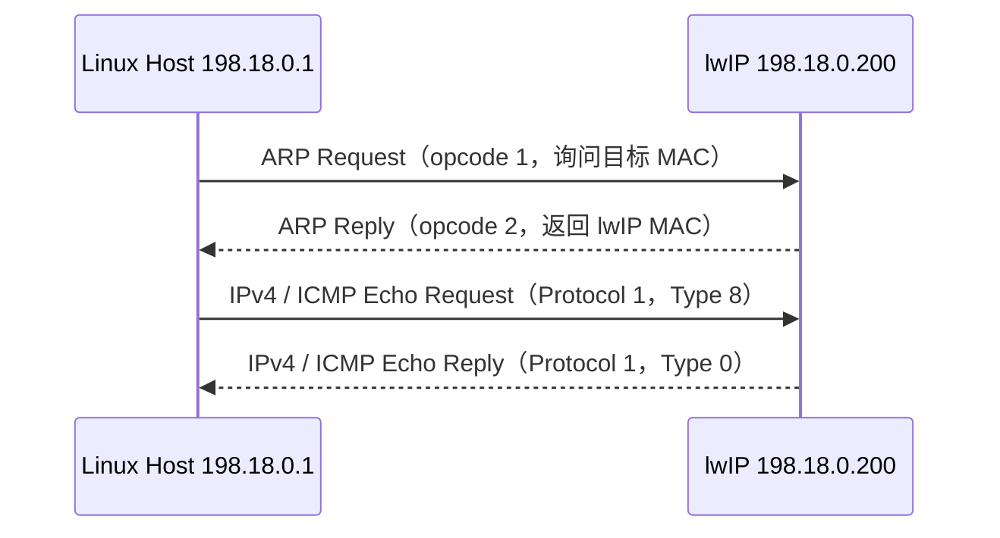
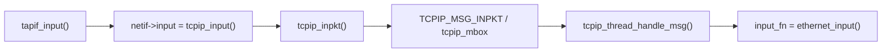
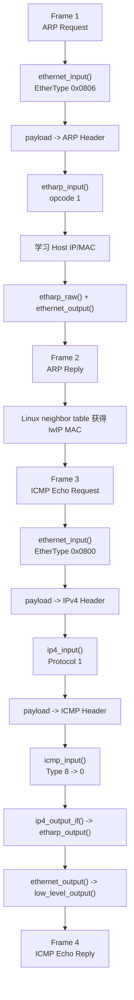

<meta name="referrer" content="no-referrer" />

# 教程 04：从 `ethernet_input()` 到 Echo Reply——Ethernet、ARP、IPv4 与 ICMP 的分层数据通路

> 摘要：用真实四帧 Ping 抓包建立 Ethernet、ARP、IPv4、ICMP 协议流程，再从 tcpip_input 异步入口桥进入协议栈核心，逐帧映射协议字段、函数分发与数据视图。

[TOC]

Stage 2 已经把第一次 Ping 从程序启动一直跑到 Echo Reply。本篇保留为独立的协议分发源码篇：不再讲 TAP 创建、Linux 路由配置和 example 启动，而是专门回答：**一份已经进入 lwIP Core 的 packet，怎样按照 Ethernet、ARP、IPv4、ICMP 的字段逐层被解释、分发和重新发送？**

为了让本篇可以独立阅读，先恢复必要名词。Ethernet frame 是链路层数据单元；EtherType 是 Ethernet Header 中标识上层 **payload（载荷，即 Header 之后承载的数据）**类型的字段。**MAC（Media Access Control）地址**是 Ethernet 链路层地址；ARP（Address Resolution Protocol，地址解析协议）在同一 IPv4 链路上把 IPv4 地址解析成 MAC 地址，ARP opcode 则区分 Request/Reply。IPv4 Header 的 Protocol 字段标识上层协议，本次值 `1` 表示 ICMP（Internet Control Message Protocol）；ICMP Echo 的 Type `8` 是 Request，Type `0` 是 Reply。[S5](#source-s5)[S7](#source-s7)[S8](#source-s8)

本文中的 **Core** 指 lwIP 的核心协议处理代码及其执行上下文，**Port（适配层）**指连接 Core 与具体操作系统/网卡接口的实现；**RX（receive，接收）**与 **TX（transmit，发送）**分别表示 packet（数据包）进入和离开协议栈的方向。`pbuf` 是 lwIP 的 packet buffer；`p->payload` 表示当前协议层看到的数据起点。Stage 3 已经解释其 chain 与 ownership，本篇重点看 `p->payload` 怎样随着 Ethernet Header、IPv4 Header 的移除/恢复而改变。

## 阅读源码前：建议提前阅读

1. [Cisco — Address Resolution Protocol](https://www.cisco.com/c/en/us/td/docs/routers/ios-xe/ip-addressing/ip-addressing/m_arp-config-arp-0.html)：用于先建立 IPv4→MAC 地址解析、ARP Request/Reply 和 ARP cache（ARP 缓存，用于保存 IPv4→MAC 映射）的直觉。[S9](#source-s9)
2. [Cloudflare — 什么是 Internet 协议？](https://www.cloudflare.com/zh-cn/learning/network-layer/internet-protocol/)：第一次接触 IPv4 时，用它理解 IP packet、源/目的地址以及上层协议承载。[S10](#source-s10)
3. [Cisco — Understand Ping and Traceroute Commands](https://www.cisco.com/c/en/us/support/docs/ios-nx-os-software/ios-software-releases-121-mainline/12778-ping-traceroute.html)：重点关注 Ping 使用 ICMP Echo Request/Reply 以及 ARP resolution（ARP 地址解析）对同网段 Ping 的影响。[S11](#source-s11)
4. [RFC 826 — ARP](https://www.rfc-editor.org/rfc/rfc826.html)、[RFC 791 — IPv4](https://www.rfc-editor.org/rfc/rfc791.html)、[RFC 792 — ICMP](https://www.rfc-editor.org/rfc/rfc792.html)：用于核对 opcode、IPv4 Header 和 ICMP Echo 字段的规范语义。[S5](#source-s5)[S7](#source-s7)[S8](#source-s8)

推荐资料负责提供权威定义和更完整背景；下面正文仍把本次源码会依赖的协议动作解释完整。

## 进入源码前：先把四帧协议流程与四个分发字段对齐

Stage 2 的真实 [`assets/stage2-ping.pcap`](assets/stage2-ping.pcap) 只有四帧：[S1](#source-s1)

| Frame | 方向 | 协议动作 | 决定源码分支的字段 |
| ---: | --- | --- | --- |
| 1 | Linux Host → broadcast | ARP Request：询问 `198.18.0.200` 的 MAC | EtherType `0x0806`；ARP opcode `1` |
| 2 | lwIP → Linux Host | ARP Reply：返回 `02:12:34:56:78:ab` | EtherType `0x0806`；ARP opcode `2` |
| 3 | Linux Host → lwIP | IPv4 / ICMP Echo Request | EtherType `0x0800`；IPv4 Protocol `1`；ICMP Type `8` |
| 4 | lwIP → Linux Host | IPv4 / ICMP Echo Reply | EtherType `0x0800`；IPv4 Protocol `1`；ICMP Type `0` |

这里的 **broadcast（广播）**指 Ethernet 目标 MAC 为 `ff:ff:ff:ff:ff:ff`，链路上的接收方都可能看到该 frame；ARP Request 使用广播是因为发送端此时还不知道目标 MAC。

后面的源码映射还会用到几个字段名。ARP 的 **sender/target** 分别表示“发送方”和“目标方”的协议地址/硬件地址字段；**ARP cache（ARP 缓存）**保存已经学习到的 IPv4→MAC 映射。IPv4 的 **IHL（Internet Header Length，Internet Header 长度）**表示 Header 占多少个 32-bit word；**checksum（校验和）**用于检测当前 Header 或协议消息中的比特错误，lwIP 在接收与改写回复时会按配置验证或重算它。[S4](#source-s4)[S7](#source-s7)[S8](#source-s8)

协议层的最小成功交互如下：



现在把“协议发生什么”映射到“源码在哪里做”：

| 协议动作 | 入口/关键函数 | 关键字段 | `p->payload` 的数据视图 |
| --- | --- | --- | --- |
| Ethernet 收帧并识别 payload 类型 | `ethernet_input()` | EtherType | Ethernet Header |
| ARP Request 解析、学习并回复 | `etharp_input()` → `etharp_raw()` | ARP opcode / sender / target | ARP Header |
| IPv4 接收并选择上层协议 | `ip4_input()` | IHL / Protocol | IPv4 Header → 上层 payload |
| ICMP Echo Request 改成 Reply | `icmp_input()` | ICMP Type / checksum | ICMP Header → 恢复 IPv4 Header |
| IPv4 Reply 再封装成 Ethernet | `ip4_output_if()` → `etharp_output()` → `ethernet_output()` | 目标 IPv4 / ARP cache / EtherType | IPv4 Header → Ethernet Header |

表中的 IHL 会直接影响源码的数据视图推进：lwIP 把它换算为字节数后决定要从 `p->payload` 移除多少 IPv4 Header，不能永远假定 20 bytes。[S7](#source-s7)

## 从 TAP 接收路径到 `ethernet_input()`：先补齐异步入口桥

本篇标题从 `ethernet_input()` 开始深挖，但它不能凭空出现。Unix TAP Port 收到 frame 后，`tapif_input()` 先把 pbuf 交给 `netif->input()`；初始化阶段这个函数指针已经绑定为 `tcpip_input()`。[S2](#source-s2)[S12](#source-s12)

```c
static void
tapif_input(struct netif *netif)
{
  struct pbuf *p = low_level_input(netif);

  if (p == NULL) {
    return;
  }

  if (netif->input(p, netif) != ERR_OK) {
    pbuf_free(p);
  }
}
```

进入 `tcpip_input()` 后，Ethernet/ARP 类型的 netif 会把真正的 Core input function 选成 `ethernet_input()`，再调用 `tcpip_inpkt()`。这里的 `NETIF_FLAG_ETHARP` 表示该接口启用了 Ethernet ARP/IPv4 处理能力，`NETIF_FLAG_ETHERNET` 表示它是 Ethernet 类型接口；任一条件满足时都需要先走 Ethernet frame 分发。[S12](#source-s12)

```c
err_t
tcpip_input(struct pbuf *p, struct netif *inp)
{
#if LWIP_ETHERNET
  if (inp->flags & (NETIF_FLAG_ETHARP | NETIF_FLAG_ETHERNET)) {
    return tcpip_inpkt(p, inp, ethernet_input);
  } else
#endif
    return tcpip_inpkt(p, inp, ip_input);
}
```

`LWIP_TCPIP_CORE_LOCKING_INPUT` 是“输入路径是否直接取得 **Core lock（核心协议栈互斥锁）**并同步执行”的编译配置；目标默认配置为 `0`，因此这里走 mailbox 异步路径。**mailbox（消息邮箱/线程间消息队列）**用于把工作投递给 `tcpip_thread`，`input_fn` 则是随消息保存的**输入函数指针**。`tcpip_inpkt()` 不在当前 Port/RX 上下文直接调用 `ethernet_input()`；它构造 `TCPIP_MSG_INPKT`，把 `p`、`netif` 和 `input_fn=ethernet_input` 一起投递到 `tcpip_mbox`：[S12](#source-s12)

```c
msg->type = TCPIP_MSG_INPKT;
msg->msg.inp.p = p;
msg->msg.inp.netif = inp;
msg->msg.inp.input_fn = input_fn;
if (sys_mbox_trypost(&tcpip_mbox, msg) != ERR_OK) {
  memp_free(MEMP_TCPIP_MSG_INPKT, msg);
  return ERR_MEM;
}
```

`tcpip_thread` 从 mailbox 取出消息后，`tcpip_thread_handle_msg()` 才在 Core thread 中调用保存的 `input_fn`：[S12](#source-s12)

```c
case TCPIP_MSG_INPKT:
  if (msg->msg.inp.input_fn(msg->msg.inp.p,
                            msg->msg.inp.netif) != ERR_OK) {
    pbuf_free(msg->msg.inp.p);
  }
  memp_free(MEMP_TCPIP_MSG_INPKT, msg);
  break;
```

因此本文真正的入口桥是：



从这里开始，执行上下文稳定在 `tcpip_thread`，下面才进入本篇真正要逐层展开的 Ethernet/ARP/IPv4/ICMP 分发。

## 1. `netif` 的三个方向先不要混

Unix TAP Port 初始化时会把三个函数指针写进同一个 `struct netif`：[S2](#source-s2)

```text
netif->input      = tcpip_input
netif->output     = etharp_output
netif->linkoutput = low_level_output
```

它们不是三个同义的“发送/接收函数”：

| 成员 | 方向 | 当前链路里的角色 |
| --- | --- | --- |
| `input` | Port → Core | 已经收到一个 frame，把 pbuf 交给 lwIP Core |
| `output` | IPv4 Core → Ethernet | 已知目标 IP，先决定下一跳 MAC |
| `linkoutput` | Ethernet → Port | 已经有完整 Ethernet frame，把字节交给设备/Port |

后面看到 `netif->output` 和 `netif->linkoutput` 时，可以直接判断：前者仍在处理 IP→MAC 的映射，后者已经进入真正的二层发送。

## 2. `ethernet_input()` 第一件事：把 `payload` 当成 Ethernet Header，然后按 EtherType 分发

从 Stage 2/3 进入 `ethernet_input()` 时，`p->payload` 指向 Ethernet Header。源码不是抽象地“识别协议”，而是直接把这段 bytes cast 成 `struct eth_hdr` 并读取 `type`：[S3](#source-s3)

```c
  /* points to packet payload, which starts with an Ethernet header */
  ethhdr = (struct eth_hdr *)p->payload;
  LWIP_DEBUGF(ETHARP_DEBUG | LWIP_DBG_TRACE,
              ("ethernet_input: dest:%"X8_F":%"X8_F":%"X8_F":%"X8_F":%"X8_F":%"X8_F", src:%"X8_F":%"X8_F":%"X8_F":%"X8_F":%"X8_F":%"X8_F", type:%"X16_F"\n",
               (unsigned char)ethhdr->dest.addr[0], (unsigned char)ethhdr->dest.addr[1], (unsigned char)ethhdr->dest.addr[2],
               (unsigned char)ethhdr->dest.addr[3], (unsigned char)ethhdr->dest.addr[4], (unsigned char)ethhdr->dest.addr[5],
               (unsigned char)ethhdr->src.addr[0],  (unsigned char)ethhdr->src.addr[1],  (unsigned char)ethhdr->src.addr[2],
               (unsigned char)ethhdr->src.addr[3],  (unsigned char)ethhdr->src.addr[4],  (unsigned char)ethhdr->src.addr[5],
               lwip_htons(ethhdr->type)));

  type = ethhdr->type;
```

当前主线只关心两种 EtherType：IPv4 和 ARP。真正的分支是：[S3](#source-s3)

```c
    case PP_HTONS(ETHTYPE_IP):
      if (!(netif->flags & NETIF_FLAG_ETHARP)) {
        goto free_and_return;
      }
      /* skip Ethernet header (min. size checked above) */
      if (pbuf_remove_header(p, next_hdr_offset)) {
        LWIP_DEBUGF(ETHARP_DEBUG | LWIP_DBG_TRACE | LWIP_DBG_LEVEL_WARNING,
                    ("ethernet_input: IPv4 packet dropped, too short (%"U16_F"/%"U16_F")\n",
                     p->tot_len, next_hdr_offset));
        LWIP_DEBUGF(ETHARP_DEBUG | LWIP_DBG_TRACE, ("Can't move over header in packet\n"));
        goto free_and_return;
      } else {
        /* pass to IP layer */
        ip4_input(p, netif);
      }
      break;

    case PP_HTONS(ETHTYPE_ARP):
      if (!(netif->flags & NETIF_FLAG_ETHARP)) {
        goto free_and_return;
      }
      /* skip Ethernet header (min. size checked above) */
      if (pbuf_remove_header(p, next_hdr_offset)) {
        LWIP_DEBUGF(ETHARP_DEBUG | LWIP_DBG_TRACE | LWIP_DBG_LEVEL_WARNING,
                    ("ethernet_input: ARP response packet dropped, too short (%"U16_F"/%"U16_F")\n",
                     p->tot_len, next_hdr_offset));
        goto free_and_return;
      } else {
        /* pass p to ARP module */
        etharp_input(p, netif);
      }
      break;
```

这几行代码同时完成两件事：

1. 根据 Ethernet Header 的 `type` 决定下一层；
2. 在调用下一层前用 `pbuf_remove_header()` 把 `p->payload` 推进到 L3/L2.5 payload。

因此：

```text
进入 ethernet_input()
    p->payload -> Ethernet Header

ETHTYPE_ARP
    remove Ethernet Header
    p->payload -> ARP Header
    etharp_input()

ETHTYPE_IP
    remove Ethernet Header
    p->payload -> IPv4 Header
    ip4_input()
```

这就是 Stage 3“同一个 pbuf 的数据视图会移动”在真实协议分发里的第一次落地。
## 3. Frame 1：把抓包里的 ARP Request 映射到 lwIP

开头已经建立了“先 ARP 解析 MAC，再发送 ICMP”的协议流程。本节把其中的 Frame 1 映射到 lwIP：Linux 尚未得到 `198.18.0.200` 对应的 MAC，因此抓包首先出现 ARP Request。[S1](#source-s1)[S5](#source-s5)

Frame 1 中与后续源码分发直接相关的字段只有两层：

| 层 | 字段 | 值 | 表示什么 |
| --- | --- | --- | --- |
| Ethernet | Destination MAC | `ff:ff:ff:ff:ff:ff` | 二层广播 |
| Ethernet | EtherType | `0x0806` | payload 是 ARP |
| ARP | opcode | `1` | ARP Request |
| ARP | sender protocol address | `198.18.0.1` | Host IPv4 |
| ARP | target protocol address | `198.18.0.200` | 正在查询的 lwIP IPv4 |

这里不展开 ARP 帧格式本身；后面源码只需要区分两个判断：`EtherType=0x0806` 让 `ethernet_input()` 进入 ARP，`opcode=1` 再让 `etharp_input()` 进入 Request 分支。

## 4. `etharp_input()`：先验证 ARP Header、学习发送者，再决定要不要回复

`ethernet_input()` 已经移除了 Ethernet Header，所以 `etharp_input()` 入口第一行就可以把 `p->payload` 当成 `struct etharp_hdr`：[S4](#source-s4)

```c
  hdr = (struct etharp_hdr *)p->payload;

  /* RFC 826 "Packet Reception": */
  if ((hdr->hwtype != PP_HTONS(LWIP_IANA_HWTYPE_ETHERNET)) ||
      (hdr->hwlen != ETH_HWADDR_LEN) ||
      (hdr->protolen != sizeof(ip4_addr_t)) ||
      (hdr->proto != PP_HTONS(ETHTYPE_IP)))  {
    LWIP_DEBUGF(ETHARP_DEBUG | LWIP_DBG_TRACE | LWIP_DBG_LEVEL_WARNING,
                ("etharp_input: packet dropped, wrong hw type, hwlen, proto, protolen or ethernet type (%"U16_F"/%"U16_F"/%"U16_F"/%"U16_F")\n",
                 hdr->hwtype, (u16_t)hdr->hwlen, hdr->proto, (u16_t)hdr->protolen));
    ETHARP_STATS_INC(etharp.proterr);
    ETHARP_STATS_INC(etharp.drop);
    pbuf_free(p);
    return;
  }
```

通过格式检查以后，控制流仍在 `etharp_input()` 中。下面继续阅读 `etharp_input()`：它把 ARP sender/target IPv4 地址复制到对齐的本地变量，并判断 request/reply 是否针对本机：[S4](#source-s4)

```c
  IPADDR_WORDALIGNED_COPY_TO_IP4_ADDR_T(&sipaddr, &hdr->sipaddr);
  IPADDR_WORDALIGNED_COPY_TO_IP4_ADDR_T(&dipaddr, &hdr->dipaddr);

  if (ip4_addr_isany_val(*netif_ip4_addr(netif))) {
    for_us = 0;
    from_us = 0;
  } else {
    /* ARP packet directed to us? */
    for_us = (u8_t)ip4_addr_eq(&dipaddr, netif_ip4_addr(netif));
    /* ARP packet from us? */
    from_us = (u8_t)ip4_addr_eq(&sipaddr, netif_ip4_addr(netif));
  }
```

仍然在 `etharp_input()` 内，ARP 学习发生在处理 opcode 之前。只要 sender 信息满足当前更新策略，lwIP 先尝试把 `sender IP -> sender MAC` 写进 ARP cache：[S4](#source-s4)

```c
  etharp_update_arp_entry(netif, &sipaddr, &(hdr->shwaddr),
                          for_us ? ETHARP_FLAG_TRY_HARD : ETHARP_FLAG_FIND_ONLY);
```

然后才根据 `hdr->opcode` 决定动作。对发给本机的 ARP Request，直接调用 `etharp_raw()` 构造 Reply：[S4](#source-s4)

```c
    case PP_HTONS(ARP_REQUEST):
      LWIP_DEBUGF (ETHARP_DEBUG | LWIP_DBG_TRACE, ("etharp_input: incoming ARP request\n"));
      /* ARP request for our address? */
      if (for_us && !from_us) {
        /* send ARP response */
        etharp_raw(netif,
                   (struct eth_addr *)netif->hwaddr, &hdr->shwaddr,
                   (struct eth_addr *)netif->hwaddr, netif_ip4_addr(netif),
                   &hdr->shwaddr, &sipaddr,
                   ARP_REPLY);
```

继续阅读 `etharp_input()` 的 `switch (hdr->opcode)`。ARP Reply 没有另一套“交给应用”的 callback；cache 在前面已经更新，分支只记录这个 opcode，最后释放这次 ARP packet：[S4](#source-s4)

```c
    case PP_HTONS(ARP_REPLY):
      /* ARP reply. We already updated the ARP cache earlier. */
      LWIP_DEBUGF(ETHARP_DEBUG | LWIP_DBG_TRACE, ("etharp_input: incoming ARP reply\n"));
      break;
```

这解释了为什么“先学习 sender，再看 request/reply”比单纯背 ARP 四个地址字段更重要：同一条输入路径既完成邻居学习，又可能立即生成回复。
## 5. Frame 2：ARP Reply 为什么不走 `etharp_output()`

ARP Reply 的目标 MAC 已经来自 Request 的 sender MAC，所以 `etharp_raw()` 可以直接填写 Ethernet src/dst，并调用：

```text
etharp_raw()
  -> ethernet_output(..., ETHTYPE_ARP)
  -> netif->linkoutput
  -> low_level_output()
```

这里不需要 `etharp_output()`，因为 `etharp_output()` 的职责是“**拿一个目标 IPv4 去找 MAC**”；而 ARP Reply 已经明确知道目标 MAC。[S4](#source-s4)[S3](#source-s3)

这是一个很重要的边界：

| 函数 | 输入里是否已经知道 Destination MAC |
| --- | --- |
| `etharp_output()` | 不一定，需要先查/发 ARP |
| `ethernet_output()` | 已经知道 |

Frame 2 到达 Linux 后，Linux neighbor table 得到：

```text
198.18.0.200 -> 02:12:34:56:78:ab
```

于是下一阶段不再需要广播询问。

## 6. Frame 3：把实际 Echo Request 的三个分发字段对到源码

ARP 完成后，Stage 2 的 Frame 3 是 Ethernet 承载的 IPv4/ICMP Echo Request。[S1](#source-s1) 这里把开头的协议流程继续映射到三个真正驱动源码分支的字段：

| 字段 | 当前抓包值 | lwIP 中决定的下一步 |
| --- | ---: | --- |
| Ethernet `EtherType` | `0x0800` | `ethernet_input()` 进入 `ip4_input()` |
| IPv4 `Protocol` | `1` | `ip4_input()` 进入 `icmp_input()` |
| ICMP `Type` | `8` | `icmp_input()` 进入 Echo Request 分支 |

## 7. `ip4_input()`：Header 检查完成后，怎样把数据视图推进到 TCP/UDP/ICMP

进入 `ip4_input()` 时，`p->payload` 已经因为 `ethernet_input()` 的 `pbuf_remove_header()` 指向 IPv4 Header。源码先把这段 bytes 解释成 `struct ip_hdr`，检查版本、IHL、总长度、checksum、目的地址等；这些检查完成后才进入上层协议分发。[S6](#source-s6)

### 7.1 IHL：IPv4 Header 到底有多长

IPv4 Header 的最低长度是 20 bytes，但 IHL 可以包含 options。因此后面不能写死 `pbuf_remove_header(p, 20)`，而是使用解析后的 `iphdr_hlen`。[S7](#source-s7)

在分发前，lwIP 先保存“当前 IP packet 上下文”，这样 TCP/UDP/ICMP 仍能通过 `ip_current_src_addr()`、`ip_current_dest_addr()`、`ip4_current_header()` 访问刚才的 L3 信息：[S6](#source-s6)

```c
  ip_data.current_netif = netif;
  ip_data.current_input_netif = inp;
  ip_data.current_ip4_header = iphdr;
  ip_data.current_ip_header_tot_len = IPH_HL_BYTES(iphdr);
```

IPv4 Header 其他字段（例如 TTL、Fragmentation）不改变当前这条直连 Ping 的分发，因此留到真正依赖这些字段的专题再展开；这里不靠外部资料替代当前主线需要的解释。

### 7.2 Protocol：IPv4 payload 下一步交给谁

这是本篇和后面 UDP/TCP 教程最关键的分发点。`ip4_input()` 在调用 L4/ICMP 之前先移除完整 IPv4 Header：[S6](#source-s6)

```c
    pbuf_remove_header(p, iphdr_hlen); /* Move to payload, no check necessary. */

    switch (IPH_PROTO(iphdr)) {
#if LWIP_UDP
      case IP_PROTO_UDP:
#if LWIP_UDPLITE
      case IP_PROTO_UDPLITE:
#endif /* LWIP_UDPLITE */
        MIB2_STATS_INC(mib2.ipindelivers);
        udp_input(p, inp);
        break;
#endif /* LWIP_UDP */
#if LWIP_TCP
      case IP_PROTO_TCP:
        MIB2_STATS_INC(mib2.ipindelivers);
        tcp_input(p, inp);
        break;
#endif /* LWIP_TCP */
#if LWIP_ICMP
      case IP_PROTO_ICMP:
        MIB2_STATS_INC(mib2.ipindelivers);
        icmp_input(p, inp);
        break;
#endif /* LWIP_ICMP */
```

因此 `Protocol` 不只是 Wireshark 里的一个数字，而是 lwIP 代码里的真实 `switch` 条件：

| IPv4 Protocol | 下一函数 | 进入函数时 `p->payload` |
| ---: | --- | --- |
| `1` | `icmp_input()` | ICMP Header |
| `6` | `tcp_input()` | TCP Header |
| `17` | `udp_input()` | UDP Header |

这里直接形成后续文章的共同入口：Stage 5 从 `Protocol=17` 继续，Stage 7 从 `Protocol=6` 继续。
## 8. `icmp_input()`：Echo Request 为什么可以复用同一个 pbuf 直接变成 Reply

`ip4_input()` 已经移除了 IPv4 Header，所以 `icmp_input()` 入口时 `p->payload` 指向 ICMP Header。函数先取得 ICMP type；`ICMP_ECHO` 分支在确认长度、checksum、广播/组播策略后准备回复。[S8](#source-s8)

```c
  type = *((u8_t *)p->payload);
#ifdef LWIP_DEBUG
  code = *(((u8_t *)p->payload) + 1);
  LWIP_UNUSED_ARG(code);
#endif /* LWIP_DEBUG */
  switch (type) {
    case ICMP_ER:
      MIB2_STATS_INC(mib2.icmpinechoreps);
      break;
    case ICMP_ECHO:
      MIB2_STATS_INC(mib2.icmpinechos);
      src = ip4_current_dest_addr();
```

这里已经进入 `icmp_input()` 的 `ICMP_ECHO` 分支。继续阅读 `icmp_input()`：回复并没有重新从应用层申请一块 payload，再逐层构造，而是尽量复用收到的 pbuf，把 IPv4 Header 重新加回数据视图，交换源/目的 IP，把 ICMP type 改成 Echo Reply，并更新 checksum：[S8](#source-s8)

```c
      iecho = (struct icmp_echo_hdr *)p->payload;
      if (pbuf_add_header(p, hlen)) {
        LWIP_DEBUGF(ICMP_DEBUG | LWIP_DBG_LEVEL_SERIOUS, ("Can't move over header in packet\n"));
      } else {
        err_t ret;
        struct ip_hdr *iphdr = (struct ip_hdr *)p->payload;
        ip4_addr_copy(iphdr->src, *src);
        ip4_addr_copy(iphdr->dest, *ip4_current_src_addr());
        ICMPH_TYPE_SET(iecho, ICMP_ER);
        p->if_idx = NETIF_NO_INDEX; /* we're reusing this pbuf, so reset its if_idx */
```

更新完 ICMP 与 IPv4 Header 后，控制流仍在 `icmp_input()`；下面这条 `ip4_output_if()` 调用就是该分支的发送出口：[S8](#source-s8)

```c
        /* send an ICMP packet */
        ret = ip4_output_if(p, src, LWIP_IP_HDRINCL,
                            ICMP_TTL, 0, IP_PROTO_ICMP, inp);
        if (ret != ERR_OK) {
          LWIP_DEBUGF(ICMP_DEBUG, ("icmp_input: ip_output_if returned an error: %s\n", lwip_strerr(ret)));
        }
```

`LWIP_IP_HDRINCL` 的含义是：当前 pbuf 已经包含 IPv4 Header，`ip4_output_if()` 不需要再额外构造一份。随后仍然进入 netif/ARP/Ethernet TX 路径。

所以 Echo Reply 的数据视图变化是：

```text
ip4_input() 移除 IPv4 Header
p->payload -> ICMP Header
        |
        | icmp_input() 检查 Echo Request
        | pbuf_add_header(p, hlen)
        v
p->payload -> 原 IPv4 Header
        |
        | 改 src/dst、ICMP type/checksum、IP checksum
        v
ip4_output_if(..., LWIP_IP_HDRINCL, ...)
```

这比“ICMP 收到 Echo Request 后发一个 Reply”更接近真正源码行为。
## 9. Frame 4：IPv4 TX 为什么又要经过 ARP

`ip4_output_if()` 已经有目标 IPv4 `198.18.0.1`，但 Ethernet Header 仍需要目标 MAC，于是通过 `netif->output` 进入 `etharp_output()`。[S6](#source-s6)[S4](#source-s4)

因为 Frame 1 已经让 lwIP ARP table 学到了 Host MAC，所以这里可以直接找到：

```text
198.18.0.1 -> Host MAC
```

然后：

```text
etharp_output()
  -> ethernet_output(..., ETHTYPE_IP)
  -> netif->linkoutput
  -> low_level_output()
```

`ethernet_output()` 在 pbuf 前重新加入 Ethernet Header，填写 src/dst MAC 和 EtherType，最后由 Unix Port 把完整 frame 写回 TAP fd。[S3](#source-s3)[S2](#source-s2)

## 10. 把四帧、结构体、函数和数据视图放到同一张图



这张图是对开头“协议四帧时序图”的实现侧补充：前者回答 Host 与 lwIP 之间交换了什么，下面这张图回答这些 frame 在 lwIP 内部经过哪些结构体和函数。重点不是记函数名，而是每层都做同一件事：**读取本层 header → 判断下一层/动作 → 调整 pbuf 数据视图 → 把同一个 packet 继续交下去。**

Stage 5 增加 UDP 后，Ethernet 和 IPv4 前半段都不会改变，只是 `Protocol = 17` 后改走 `udp_input()`。

## 资料来源

<a id="source-s1"></a>
### [S1] Stage 2 实际 Ping 抓包
- 类型：项目实验抓包
- 文件：[`docs/assets/stage2-ping.pcap`](assets/stage2-ping.pcap)
- 配套文章：[`02-netif-tap-first-ping.md`](02-netif-tap-first-ping.md)
- 使用位置：四帧顺序、Ethernet/ARP/IPv4/ICMP 字段
- 支撑内容：真实 ARP Request/Reply 与 ICMP Echo Request/Reply，为 EtherType、opcode、IPv4 Protocol、ICMP Type 与方向提供实验依据

<a id="source-s2"></a>
### [S2] Unix TAP Port
- 版本：`d08f4773edd0182b7910fc8f046eed82ffcd67c9`
- URL/文档：[`contrib/ports/unix/port/netif/tapif.c`](https://github.com/lwip-tcpip/lwip/blob/d08f4773edd0182b7910fc8f046eed82ffcd67c9/contrib/ports/unix/port/netif/tapif.c)
- 使用位置：`netif->output/linkoutput`、`low_level_output()`
- 支撑内容：当前 Unix Port 怎样把 lwIP 二层输出写回 TAP fd

<a id="source-s3"></a>
### [S3] Ethernet Core
- 版本：`d08f4773edd0182b7910fc8f046eed82ffcd67c9`
- URL/文档：[`src/netif/ethernet.c`](https://github.com/lwip-tcpip/lwip/blob/d08f4773edd0182b7910fc8f046eed82ffcd67c9/src/netif/ethernet.c)
- 使用位置：EtherType 分发、Ethernet Header 移除/添加
- 支撑内容：`ethernet_input()` 与 `ethernet_output()` 的真实分层边界

<a id="source-s4"></a>
### [S4] ARP Core
- 版本：`d08f4773edd0182b7910fc8f046eed82ffcd67c9`
- URL/文档：[`src/core/ipv4/etharp.c`](https://github.com/lwip-tcpip/lwip/blob/d08f4773edd0182b7910fc8f046eed82ffcd67c9/src/core/ipv4/etharp.c)
- 使用位置：ARP cache、Request/Reply、IPv4 TX 的 IP→MAC 解析
- 支撑内容：`etharp_input()`、`etharp_raw()`、`etharp_output()` 的实际职责

<a id="source-s5"></a>
### [S5] RFC 826 — ARP
- URL/文档：[RFC 826 — An Ethernet Address Resolution Protocol](https://www.rfc-editor.org/rfc/rfc826.html)
- 使用位置：ARP Request/Reply 语义
- 支撑内容：Ethernet/IPv4 地址解析的报文字段和请求/响应模型

<a id="source-s6"></a>
### [S6] IPv4 Core
- 版本：`d08f4773edd0182b7910fc8f046eed82ffcd67c9`
- URL/文档：[`src/core/ipv4/ip4.c`](https://github.com/lwip-tcpip/lwip/blob/d08f4773edd0182b7910fc8f046eed82ffcd67c9/src/core/ipv4/ip4.c)
- 使用位置：IHL、Protocol 分发、`ip4_output_if()`
- 支撑内容：IPv4 input 验证、header 移除和上层协议 dispatch

<a id="source-s7"></a>
### [S7] RFC 791 — IPv4
- URL/文档：[RFC 791 — Internet Protocol](https://www.rfc-editor.org/rfc/rfc791.html)
- 使用位置：IHL、Protocol 字段
- 支撑内容：IPv4 Header 长度与上层协议标识的规范语义

<a id="source-s8"></a>
### [S8] ICMP Core 与 RFC 792
- 版本：`d08f4773edd0182b7910fc8f046eed82ffcd67c9`
- URL/文档：[`src/core/ipv4/icmp.c`](https://github.com/lwip-tcpip/lwip/blob/d08f4773edd0182b7910fc8f046eed82ffcd67c9/src/core/ipv4/icmp.c)、[RFC 792 — Internet Control Message Protocol](https://www.rfc-editor.org/rfc/rfc792.html)
- 使用位置：Echo Request/Reply、Identifier/Sequence
- 支撑内容：`icmp_input()` 的 Echo Reply 构造和 ICMP Echo Type/Code 语义

<a id="source-s9"></a>
### [S9] Cisco ARP 说明
- 类型：厂商公开协议资料
- URL/文档：[Cisco — Address Resolution Protocol](https://www.cisco.com/c/en/us/td/docs/routers/ios-xe/ip-addressing/ip-addressing/m_arp-config-arp-0.html)
- 使用位置：“阅读源码前”
- 支撑内容：提供 ARP 地址解析、broadcast/request/reply 的权威补充阅读；正文自身仍建立并解释本次四帧所需的 ARP 模型

<a id="source-s10"></a>
### [S10] Cloudflare IP 入门资料
- 类型：公开技术学习资料
- URL/文档：[Cloudflare — 什么是 Internet 协议？](https://www.cloudflare.com/zh-cn/learning/network-layer/internet-protocol/)
- 使用位置：“阅读源码前”
- 支撑内容：提供 IP packet、源/目的地址和上层协议标识的补充阅读；正文自身解释本次 `ip4_input()` 所依赖的 IPv4 字段

<a id="source-s11"></a>
### [S11] Cisco Ping 说明
- 类型：厂商公开协议/排障资料
- URL/文档：[Cisco — Understand Ping and Traceroute Commands](https://www.cisco.com/c/en/us/support/docs/ios-nx-os-software/ios-software-releases-121-mainline/12778-ping-traceroute.html)
- 使用位置：“阅读源码前”
- 支撑内容：提供 ICMP Echo Request/Reply 与 ARP resolution 对 Ping 的补充阅读；正文自身完成四帧协议流程与 lwIP 函数的对应解释

<a id="source-s12"></a>
### [S12] lwIP `tcpip.c` — RX 异步入口桥
- 类型：上游源码
- 版本：`d08f4773edd0182b7910fc8f046eed82ffcd67c9`
- URL/文档：[`src/api/tcpip.c`](https://github.com/lwip-tcpip/lwip/blob/d08f4773edd0182b7910fc8f046eed82ffcd67c9/src/api/tcpip.c)、[`src/include/lwip/opt.h`](https://github.com/lwip-tcpip/lwip/blob/d08f4773edd0182b7910fc8f046eed82ffcd67c9/src/include/lwip/opt.h)
- 使用位置：“从 TAP 接收路径到 `ethernet_input()`：先补齐异步入口桥”
- 支撑内容：`LWIP_TCPIP_CORE_LOCKING_INPUT` 默认值、`tcpip_input()` 选择 `ethernet_input`、`tcpip_inpkt()` 构造 `TCPIP_MSG_INPKT`、mailbox 投递以及 `tcpip_thread_handle_msg()` 在 Core thread 调用 `input_fn` 的完整异步桥
