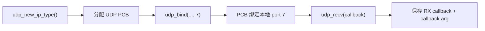
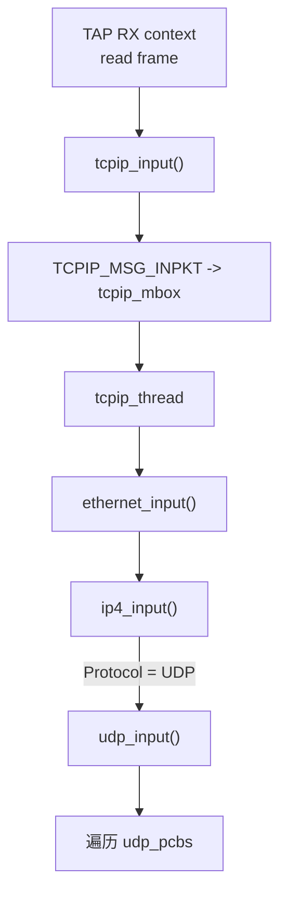
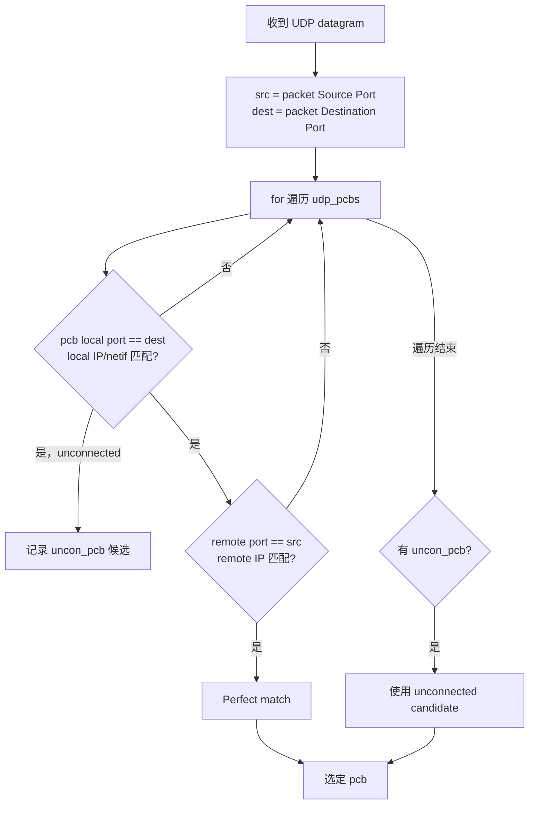
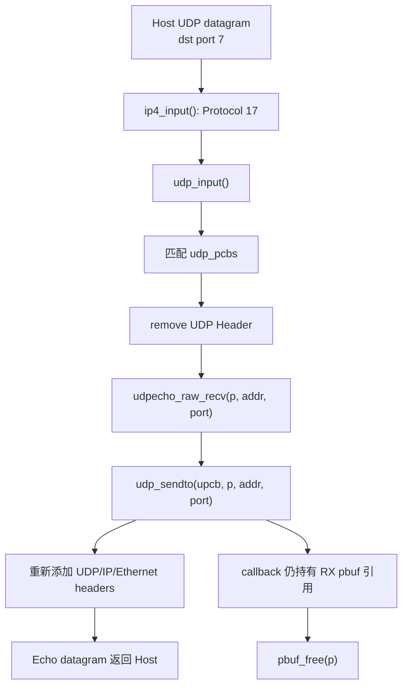

<meta name="referrer" content="no-referrer" />

# 教程 05：从 `udpecho_raw_init()` 到 Echo Reply——UDP Raw API、PCB 与回调数据通路

> 摘要：从 upstream Raw UDP Echo 的真实初始化入口开始，追踪 PCB 建立、端口匹配、pbuf ownership、回调执行和 UDP Echo 回包路径。

[TOC]

Stage 4 已经走到 `ip4_input()` 的 `Protocol` 分发。现在只改变一个条件：IPv4 Header 的 `Protocol` 不再是 `1`（ICMP），而是 `17`（UDP）。Ethernet、ARP、IPv4 前半段仍然复用，新的主线从 `udp_input()` 开始。[S1](#source-s1)[S2](#source-s2)

## 1. Raw API 的第一个真实入口：`udpecho_raw_init()`

upstream Raw UDP Echo 的初始化代码很短：[S1](#source-s1)

```c
udpecho_raw_pcb = udp_new_ip_type(IPADDR_TYPE_ANY);
if (udpecho_raw_pcb != NULL) {
  err = udp_bind(udpecho_raw_pcb, IP_ANY_TYPE, 7);
  if (err == ERR_OK) {
    udp_recv(udpecho_raw_pcb, udpecho_raw_recv, NULL);
  }
}
```

这三步分别建立三类状态：



这里第一次出现 PCB。PCB = Protocol Control Block，可以理解为 lwIP Core 为一个协议端点保存的运行时控制对象。对 UDP 来说，它记录 local/remote IP、port、flags 和接收 callback 等状态。[S2](#source-s2)

PCB 不是 socket fd，也不是 packet buffer：

| 对象 | 生命周期 | 主要内容 |
| --- | --- | --- |
| `struct udp_pcb` | UDP endpoint 生命周期 | 地址、端口、flags、callback |
| `struct pbuf` | 单个 packet 生命周期 | packet bytes + ownership |
| Linux/socket fd | Socket API 才出现 | application-facing descriptor |

Raw API 直接操作 PCB，所以应用代码必须遵守 lwIP Core 的线程上下文和 callback ownership 规则。

## 2. `udp_new_ip_type()`：PCB 从哪里来

`udp_new()`/`udp_new_ip_type()` 最终从 `MEMP_UDP_PCB` 固定对象池申请 `struct udp_pcb`，初始化后挂进 UDP PCB 管理体系。[S2](#source-s2)

这和 Stage 3 的 `PBUF_POOL` 是两种完全不同的 pool：

- `MEMP_UDP_PCB`：固定大小的协议控制对象；
- `MEMP_PBUF_POOL`：固定大小的 packet buffer。

一个 UDP endpoint 可以连续接收很多 pbuf，但通常只对应一个长期存在的 PCB。

## 3. `udp_bind()`：为什么 port 7 会成为 RX 匹配条件

`udp_bind(pcb, IP_ANY_TYPE, 7)` 把 PCB 的 local endpoint 配置成“任意本地地址 + UDP port 7”。[S2](#source-s2)

这里的 port 是 L4 的 16-bit 端口号，用来区分同一个 IP 上的不同 UDP endpoint。它和 Ethernet MAC、IPv4 address 是不同层次：

```text
L2: MAC address
L3: IPv4 address
L4: UDP port
```

因此一个 Host 可以把多个 UDP datagram 都发到 `198.18.0.200`，再通过 destination port 决定由哪个 UDP PCB 接收。

## 4. `udp_recv()` 并不收包，它只是注册 callback

`udp_recv(pcb, udpecho_raw_recv, NULL)` 把函数指针和 callback argument 保存到 PCB。[S2](#source-s2)

这一点必须和真正的 RX 事件分开：

```text
初始化阶段
  udp_recv()
  只建立 callback binding

运行阶段
  packet 到达
  udp_input() 匹配 PCB
  才调用 pcb->recv(...)
```

Raw API 是 callback 模型，不是“应用线程阻塞在 recv()”模型。Stage 6 的 Netconn 会专门改变这一点。

## 5. 一个 UDP datagram 怎样走到 `udp_input()`

Host 发送到 `198.18.0.200:7` 后，前半段仍然是：[S3](#source-s3)

```text
TAP -> pbuf
    -> tcpip_input()
    -> tcpip_thread
    -> ethernet_input()
    -> ip4_input()
```

`ip4_input()` 看到：

```text
Protocol = 17
```

于是移除 IPv4 Header 后调用 `udp_input()`。[S3](#source-s3)

进入 `udp_input()` 时：

```text
p->payload -> UDP Header
```

## 6. `udp_input()` 到底怎样找到应该调用哪个 PCB callback

最基本的 UDP Header 是：[S4](#source-s4)

```text
Source Port
Destination Port
Length
Checksum
```

这里最容易产生一个误解：**不是 TAP RX thread 自己拿 UDP destination port 去找 callback。** 当前 `LWIP_TCPIP_CORE_LOCKING_INPUT=0` 路径中，TAP/driver RX context 只负责把 `pbuf` 经 `tcpip_input()` 投递进 `tcpip_mbox`；真正运行 `ethernet_input() -> ip4_input() -> udp_input()` 的是 `tcpip_thread`。[S3](#source-s3)

因此本节讨论的 PCB 查找实际发生在：



### 6.1 `udp_input()` 先读取 UDP Source/Destination Port

进入 `udp_input()` 时，Stage 4 的 IPv4 Header 已经移除，`p->payload` 指向 UDP Header。继续阅读 `udp_input()` 的上游连续源码片段：[S2](#source-s2)

```c
udphdr = (struct udp_hdr *)p->payload;

/* is broadcast packet ? */
broadcast = ip_addr_isbroadcast(ip_current_dest_addr(), ip_current_netif());

/* convert src and dest ports to host byte order */
src = lwip_ntohs(udphdr->src);
dest = lwip_ntohs(udphdr->dest);
```

对接收方来说两个 port 的方向必须分清：

```text
packet Source Port      -> 远端端口 -> 后面与 pcb->remote_port 比较
packet Destination Port -> 本地端口 -> 后面与 pcb->local_port 比较
```

例如 Host 发往 Raw Echo：

```text
Host      198.18.0.1:53000
              |
              v
lwIP      198.18.0.200:7
```

进入 lwIP 的 packet 中：

```text
src  = 53000
dest = 7
```

所以最先决定“哪个本地 UDP endpoint 有资格接收”的是 **Destination Port 对 `pcb->local_port`**，不是拿 packet Source Port 去匹配 local port。

### 6.2 当前实现就是线性 `for` 遍历 `udp_pcbs` 链表

继续阅读 `udp_input()`。当前实现没有用 hash table 按 port O(1) 查找，而是从全局 `udp_pcbs` 链表头开始逐项遍历：[S2](#source-s2)

```c
pcb = NULL;
prev = NULL;
uncon_pcb = NULL;
/* Iterate through the UDP pcb list for a matching pcb.
 * 'Perfect match' pcbs (connected to the remote port & ip address) are
 * preferred. If no perfect match is found, the first unconnected pcb that
 * matches the local port and ip address gets the datagram. */
for (pcb = udp_pcbs; pcb != NULL; pcb = pcb->next) {
```

所以回答“是不是 `for` 循环遍历 PCB 链表”就是：**是。** 但匹配条件并不只有一个 port。

继续阅读 `udp_input()`：第一层先比较本地 endpoint。[S2](#source-s2)

```c
/* compare PCB local addr+port to UDP destination addr+port */
if ((pcb->local_port == dest) &&
    (udp_input_local_match(pcb, inp, broadcast) != 0)) {
```

这里包含：

```text
packet Destination Port <-> pcb->local_port
packet Destination IP   <-> pcb->local_ip / input netif / broadcast 规则
```

继续阅读 `udp_input()`：如果 PCB 没有 `UDP_FLAGS_CONNECTED`，它属于 unconnected PCB。当前实现先记录第一个 local endpoint 匹配的候选。[S2](#source-s2)

```c
if ((pcb->flags & UDP_FLAGS_CONNECTED) == 0) {
  if (uncon_pcb == NULL) {
    /* the first unconnected matching PCB */
    uncon_pcb = pcb;
```

这正对应 Raw Echo 的常见使用方式：`udp_bind()` 只绑定 local port 7，并没有事先绑定唯一的 remote peer，因此任意远端只要发到正确 local endpoint，都可能进入这个 PCB。

### 6.3 Connected PCB 还会继续比较 packet 的远端 endpoint

local endpoint 匹配以后，`udp_input()` 继续检查 packet source 与 PCB remote endpoint：[S2](#source-s2)

```c
/* compare PCB remote addr+port to UDP source addr+port */
if ((pcb->remote_port == src) &&
    (ip_addr_isany_val(pcb->remote_ip) ||
     ip_addr_eq(&pcb->remote_ip, ip_current_src_addr()))) {
```

对应关系是：

```text
pcb->local_port  <-> packet Destination Port
pcb->local_ip    <-> packet Destination IP
pcb->remote_port <-> packet Source Port
pcb->remote_ip   <-> packet Source IP
```

四个方向都满足时，源码称为 `Perfect match`。这种 fully matched connected PCB 优先级高于只匹配 local endpoint 的 unconnected PCB。

继续阅读 `udp_input()`：如果整条链表没有找到 fully matched PCB，遍历结束后才回退到之前记录的 `uncon_pcb`。[S2](#source-s2)

```c
/* no fully matching pcb found? then look for an unconnected pcb */
if (pcb == NULL) {
  pcb = uncon_pcb;
}
```

因此“port 匹配”更准确的心智模型是：



### 6.4 为什么完全匹配后还会把 PCB 移到链表头

继续阅读 `udp_input()`：找到 fully matched PCB 后，当前实现还有一个很小但很实用的优化。[S2](#source-s2)

```c
/* the first fully matching PCB */
if (prev != NULL) {
  /* move the pcb to the front of udp_pcbs so that is
     found faster next time */
  prev->next = pcb->next;
  pcb->next = udp_pcbs;
  udp_pcbs = pcb;
} else {
  UDP_STATS_INC(udp.cachehit);
}
break;
```

也就是 **move-to-front**：一个 connected flow 连续收很多 datagram 时，第一次命中的 PCB 会被移到 `udp_pcbs` 表头；下一个同 flow datagram 从头开始遍历时更可能第一项就命中。

这没有改变“线性链表匹配”的本质，只是让热点 PCB 更靠前。

### 6.5 选出 PCB 后，才验证 checksum、移除 UDP Header 并调用 callback

匹配出 `pcb` 之后，`udp_input()` 继续做 UDP checksum 检查。通过后才执行：[S2](#source-s2)

```c
if (pbuf_remove_header(p, UDP_HLEN)) {
  LWIP_ASSERT("pbuf_remove_header failed", 0);
  UDP_STATS_INC(udp.drop);
  MIB2_STATS_INC(mib2.udpinerrors);
  pbuf_free(p);
  goto end;
}
```

于是 `p->payload` 从：

```text
UDP Header
```

推进成：

```text
UDP Payload
```

继续阅读 `udp_input()` 的 callback dispatch 尾部：[S2](#source-s2)

```c
/* callback */
if (pcb->recv != NULL) {
  /* now the recv function is responsible for freeing p */
  pcb->recv(pcb->recv_arg, pcb, p, ip_current_src_addr(), src);
} else {
  /* no recv function registered? then we have to free the pbuf! */
  pbuf_free(p);
  goto end;
}
```

回到第 1 节的 `udpecho_raw_init()`：初始化阶段已经执行过 callback 注册：

```c
udp_recv(pcb, udpecho_raw_recv, NULL);
```

与运行阶段的真实链路终于完整对应：

```text
udp_recv()
  -> 把 udpecho_raw_recv 保存进 pcb->recv

packet 到达
  -> tcpip_thread
  -> udp_input()
  -> 遍历 udp_pcbs
  -> local/remote endpoint 匹配
  -> pbuf_remove_header(UDP_HLEN)
  -> pcb->recv(...)
  -> udpecho_raw_recv(...)
```

这一步才是 UDP demultiplex 的完整含义：同一条 IP input path 根据 packet endpoint 找到一个 PCB，再由 PCB 中预先注册的 function pointer 把 payload 分发给正确的上层 callback。

## 7. callback 看到的 pbuf 已经不是 UDP Header

`udp_input()` 在 callback 前执行 `pbuf_remove_header(p, UDP_HLEN)`。[S2](#source-s2)

所以 callback 收到：

```text
p->payload -> UDP payload
```

而不是：

```text
p->payload -> UDP Header
```

这和 Stage 4 完全相同：每一层处理完自己的 header 后，把 pbuf 数据视图推进到下一层。

callback 参数中的 `addr` 和 `port` 则保存发送方 endpoint：

```text
addr = remote IP
port = remote UDP source port
```

Raw Echo 用它们作为回包目标。

## 8. `udpecho_raw_recv()` 的 ownership 为什么必须看清

upstream callback：[S1](#source-s1)

```c
if (p != NULL) {
  udp_sendto(upcb, p, addr, port);
  pbuf_free(p);
}
```

这里能直接推出一个重要 ownership 契约：**callback 收到这个 RX pbuf 后，示例负责最终释放它。**

`udp_sendto()` 并没有把这个 payload pbuf 永久接管走，所以 callback 在发送调用返回后仍然执行 `pbuf_free(p)`。[S1](#source-s1)[S2](#source-s2)

不要把：

```text
udp_sendto(pcb, p, ...)
```

理解成“p 的 ownership 自动交给 UDP”。如果调用方后续不再需要 p，仍应按 API 语义释放自己的引用。

## 9. Echo TX：UDP Header 在哪里加回来

`udp_sendto()` 进入 UDP Core 后，会选择 source address/interface、准备 checksum，然后为 UDP Header 腾出空间并填写 source port、destination port、length/checksum，最后进入 IP output。[S2](#source-s2)

因此 callback 传入时：

```text
p->payload -> UDP payload
```

UDP Core 发出时会变成：

```text
UDP Header
+ payload
```

再往下：

```text
udp_sendto()
  -> ip4_output_if_src()
  -> netif->output
  -> etharp_output()
  -> ethernet_output()
  -> low_level_output()
```

ARP cache 如果已经有 Host MAC，就不需要再次广播 ARP；如果没有，`etharp_output()` 会重新触发地址解析。

## 10. 一次 Raw UDP Echo 的完整数据与 ownership 流



这张图同时回答两个不同问题：

- 数据怎样返回；
- RX pbuf 最后是谁释放。

两者不能混成“发送成功所以自动 free”。

## 11. Raw API 的线程边界

当前 `example_app` 配置 `NO_SYS=0`，Ethernet RX 通过 `tcpip_input()` 进入 `tcpip_thread`，`udp_input()` 和 Raw recv callback 都在 lwIP Core 上下文里执行。[S3](#source-s3)[S5](#source-s5)

这正是 Raw API 的关键约束：Raw callback 不是普通 application worker thread。回调里直接调用 Core API 很自然，但不能把它当成可以长时间阻塞的业务线程。

Stage 6 会从同一个 UDP Echo 问题出发，改用 Netconn：application thread 阻塞等待 mailbox，而 Core callback 只负责把数据交到 mailbox。

## 资料来源

<a id="source-s1"></a>
### [S1] upstream Raw UDP Echo 示例
- 版本：`d08f4773edd0182b7910fc8f046eed82ffcd67c9`
- URL/文档：[`contrib/apps/udpecho_raw/udpecho_raw.c`](https://github.com/lwip-tcpip/lwip/blob/d08f4773edd0182b7910fc8f046eed82ffcd67c9/contrib/apps/udpecho_raw/udpecho_raw.c)
- 使用位置：初始化、callback、Echo TX 与 pbuf 释放
- 支撑内容：`udp_new_ip_type()`、`udp_bind()`、`udp_recv()`、`udp_sendto()` 和 `pbuf_free()` 的示例调用顺序

<a id="source-s2"></a>
### [S2] UDP Core 实现
- 版本：`d08f4773edd0182b7910fc8f046eed82ffcd67c9`
- URL/文档：[`src/core/udp.c`](https://github.com/lwip-tcpip/lwip/blob/d08f4773edd0182b7910fc8f046eed82ffcd67c9/src/core/udp.c)、[`src/include/lwip/udp.h`](https://github.com/lwip-tcpip/lwip/blob/d08f4773edd0182b7910fc8f046eed82ffcd67c9/src/include/lwip/udp.h)
- 使用位置：PCB allocation/bind/callback、RX demultiplex、TX
- 支撑内容：`udp_input()` 的 PCB 匹配、header removal 和 callback 调用，以及 `udp_sendto()` 的发送语义

<a id="source-s3"></a>
### [S3] IPv4 与 `tcpip_thread` 输入链
- 版本：`d08f4773edd0182b7910fc8f046eed82ffcd67c9`
- URL/文档：[`src/core/ipv4/ip4.c`](https://github.com/lwip-tcpip/lwip/blob/d08f4773edd0182b7910fc8f046eed82ffcd67c9/src/core/ipv4/ip4.c)、[`src/api/tcpip.c`](https://github.com/lwip-tcpip/lwip/blob/d08f4773edd0182b7910fc8f046eed82ffcd67c9/src/api/tcpip.c)
- 使用位置：Protocol 17 分发和 callback 执行上下文
- 支撑内容：IPv4 如何进入 `udp_input()`，以及当前 OS 模式下 packet 如何进入 Core thread

<a id="source-s4"></a>
### [S4] RFC 768 — UDP
- URL/文档：[RFC 768 — User Datagram Protocol](https://www.rfc-editor.org/rfc/rfc768.html)
- 使用位置：UDP Header、port、length、checksum
- 支撑内容：UDP datagram 的基本报文格式与 endpoint 字段

<a id="source-s5"></a>
### [S5] example `lwipopts.h`
- 版本：`d08f4773edd0182b7910fc8f046eed82ffcd67c9`
- URL/文档：[`contrib/examples/example_app/lwipopts.h`](https://github.com/lwip-tcpip/lwip/blob/d08f4773edd0182b7910fc8f046eed82ffcd67c9/contrib/examples/example_app/lwipopts.h)
- 使用位置：当前 `NO_SYS`、UDP 和 Core threading 配置
- 支撑内容：限定本文描述的是当前 Unix `example_app` 构建，而不是所有 lwIP Port 的唯一线程模型
