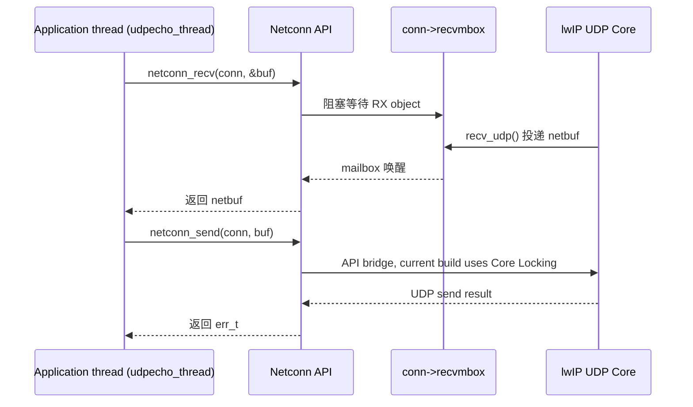
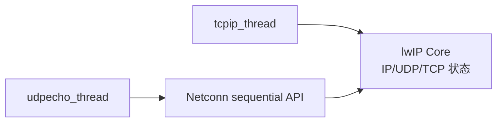
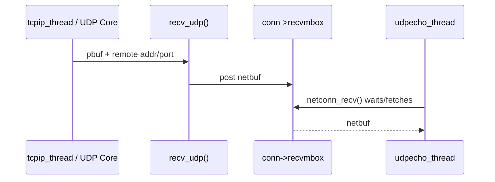
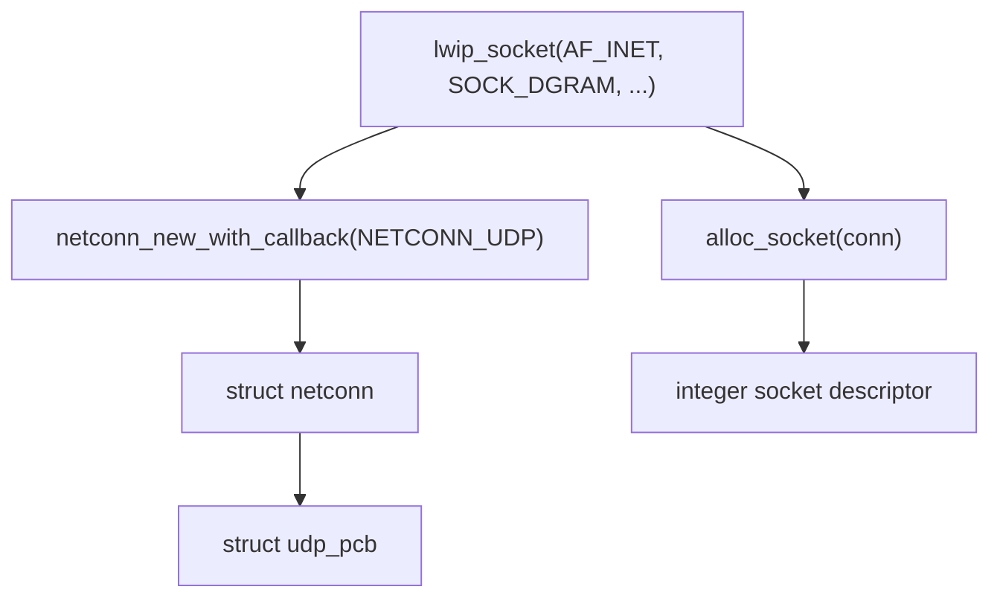
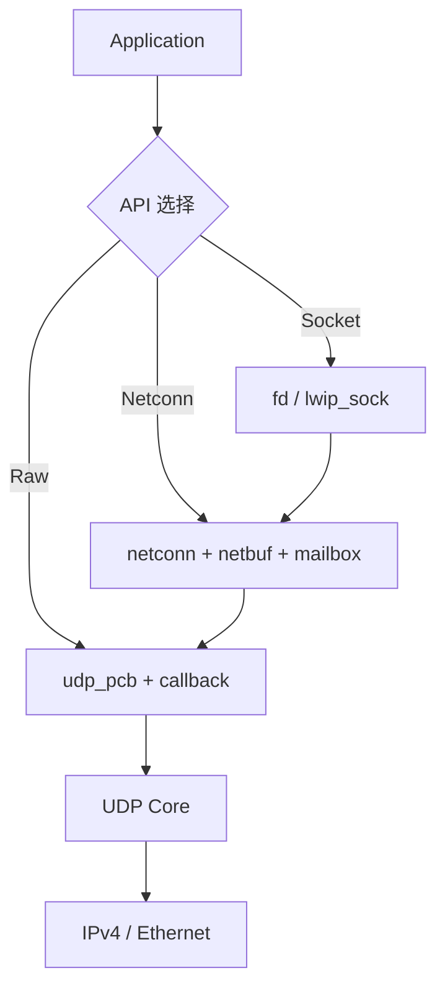

<meta name="referrer" content="no-referrer" />

# 教程 06：从 `udpecho_thread()` 到 Socket——Netconn、Mailbox 与顺序式 API

> 摘要：从应用线程与 lwIP Core 的执行边界出发，沿 Netconn UDP Echo 追踪 netconn、netbuf、mailbox、Core Locking，并映射到 Socket API。

[TOC]

Netconn 是 lwIP 的 **sequential API（顺序式 API）**：应用线程可以用 `netconn_recv()` 这类阻塞调用写普通“open/read/write/close”式逻辑，而协议 Core 仍保持事件驱动。**Raw API** 则是 lwIP 的 callback-style Core API，应用 callback 直接由协议栈事件驱动，不能把 callback 当成可长期阻塞的业务线程。[S8](#source-s8)

**Mailbox（消息邮箱）**是线程间传递指针/消息的队列抽象；**Core Locking** 是让非 `tcpip_thread` 线程先取得 Core mutex（保护协议 Core 的互斥锁）再执行受保护操作的同步方案。[S2](#source-s2)[S3](#source-s3)[S5](#source-s5) Socket API 再在 Netconn 之上增加 **fd（file descriptor，整数文件描述符）**、`sockaddr`（保存 socket 地址的结构）和 errno 风格错误码契约，从而接近 BSD/POSIX 类 Unix socket 编程模型。[S7](#source-s7)

Stage 5 的 Raw UDP Echo 已经说明：Raw callback 直接运行在 lwIP Core 执行上下文中。Stage 6 不再学习另一套 UDP，而是回答一个软件架构问题：**怎样把事件驱动的 UDP Core 变成应用线程可阻塞等待的顺序式接口？**

## 阅读源码前：建议提前阅读

这三份 lwIP 官方文档适合先建立 API 层次，但当前文章的执行细节仍以固定源码快照为准：

1. [lwIP 2.1.x — APIs](https://www.nongnu.org/lwip/2_1_x/group__api.html)：先看 Raw、Sequential、Socket 三类 API 的总体关系，以及 Raw callback 为什么不能阻塞。[S8](#source-s8)
2. [lwIP 2.1.x — Sequential-style APIs](https://www.nongnu.org/lwip/2_1_x/group__sequential__api.html)：重点理解 sequential API 是 blocking API，应用程序和 TCP/IP Core 处于不同执行上下文。[S8](#source-s8)
3. [lwIP 2.1.x — Socket API](https://www.nongnu.org/lwip/2_1_x/group__socket.html)：用于确认 Socket API 是 BSD-style 兼容层，并建立在 sequential API 之上。[S8](#source-s8)

## 先把三层 API 和线程边界放在同一张图里

三层 API 不是三套 TCP/IP 协议栈，而是同一套 lwIP Core 的三种应用访问方式：[S8](#source-s8)

| API 层 | 应用看到的主要对象 | 应用执行模型 | 与 Core 的关系 |
| --- | --- | --- | --- |
| Raw API | `udp_pcb` / `tcp_pcb`、`pbuf`、callback | 事件驱动，callback 不能阻塞 | 应用 callback 与协议 Core 位于同一受控执行上下文 |
| Netconn API | `struct netconn`、`netbuf` | 普通 application thread，可阻塞等待 | 通过 API bridge、Core Locking/`tcpip_thread` 与 `recvmbox` 连接 Core |
| Socket API | integer fd、`sockaddr`、application buffer | BSD/POSIX-style | 先映射到 `netconn`，再进入同一 Core |

这里几个对象必须先区分：

- **`pbuf`**：lwIP Core 的 packet buffer，保存 packet bytes 与引用/链信息；Stage 3 已系统讲过。
- **`netbuf`**：Netconn 面向 datagram 应用的 network-buffer descriptor，内部持有 `pbuf`，并附带源/目标地址和端口信息。[S3](#source-s3)
- **`struct netconn`**：顺序式 API 的连接/端点对象，保存 PCB 指针、接收 mailbox、状态、超时和 callback 等线程桥接状态。[S2](#source-s2)
- **`tcpip_thread`**：`NO_SYS=0` 时负责串行执行 lwIP Core 输入和定时器工作的 Core thread；它不是 `udpecho_thread` 这个应用线程。[S5](#source-s5)

当前 Unix `example_app` 明确配置 `LWIP_TCPIP_CORE_LOCKING=1`。因此部分 Netconn API 请求会通过 Core mutex 同步进入 Core；RX packet 输入仍使用 `LWIP_TCPIP_CORE_LOCKING_INPUT=0` 的 mailbox/thread 路径。两者不能混成一句“Netconn 都靠 mailbox 调 Core”。[S4](#source-s4)[S5](#source-s5)

对本篇 UDP Echo，最重要的双向桥接是：



这张图先建立运行时心智模型；下面再从 upstream `udpecho_init()` 的真实入口验证每一条边具体由哪个函数和对象实现。

## 1. 真正入口不是 `netconn_new()`，而是 `udpecho_init()` 创建 application thread

upstream Netconn UDP Echo 先执行：[S1](#source-s1)

```c
sys_thread_new("udpecho_thread", udpecho_thread, NULL,
               DEFAULT_THREAD_STACKSIZE, DEFAULT_THREAD_PRIO);
```

这一步第一次引入 **application thread**：它不是 `tcpip_thread`，而是跑顺序式应用逻辑的独立线程。



因此 Netconn 解决的核心问题不是“UDP 另一套实现”，而是**如何让 application thread 安全地使用 Core 对象并等待 RX 数据**。

## 2. `udpecho_thread()` 的代码形状为什么像 BSD socket

线程主线是：[S1](#source-s1)

```text
netconn_new(NETCONN_UDP)
  -> netconn_bind(..., port 7)
  -> while (...) {
       netconn_recv(conn, &buf)
       netconn_send(conn, buf)
       netbuf_delete(buf)
     }
```

和 Raw callback 相比，它看起来更像普通阻塞程序：

| Raw API | Netconn API |
| --- | --- |
| `udp_recv(pcb, callback, arg)` | `netconn_recv(conn, &buf)` |
| packet 到达后 Core 调 callback | application thread 阻塞等待数据 |
| 直接操作 `udp_pcb` | 操作 `struct netconn` |
| RX 对象是 `pbuf` | application 看到 `netbuf` |

但底层 UDP Core 并没有被替换。Netconn 最终仍然创建 UDP PCB，并给它注册一个内部 callback。[S2](#source-s2)

## 3. `netconn` 是什么：先看 `netconn_new_with_proto_and_callback()` 真正分配了什么

`netconn_new_with_proto_and_callback()` 先 `netconn_alloc()` 分配 application-facing `struct netconn`，然后通过 `netconn_apimsg()` 让 Core 创建对应 PCB。[S2](#source-s2)[S3](#source-s3)

```c
struct netconn *
netconn_new_with_proto_and_callback(enum netconn_type t, u8_t proto, netconn_callback callback)
{
  struct netconn *conn;
  API_MSG_VAR_DECLARE(msg);
  API_MSG_VAR_ALLOC_RETURN_NULL(msg);

  conn = netconn_alloc(t, callback);
  if (conn != NULL) {
    err_t err;

    API_MSG_VAR_REF(msg).msg.n.proto = proto;
    API_MSG_VAR_REF(msg).conn = conn;
    err = netconn_apimsg(lwip_netconn_do_newconn, &API_MSG_VAR_REF(msg));
    if (err != ERR_OK) {
      LWIP_ASSERT("freeing conn without freeing pcb", conn->pcb.tcp == NULL);
      LWIP_ASSERT("conn has no recvmbox", sys_mbox_valid(&conn->recvmbox));
#if LWIP_TCP
      LWIP_ASSERT("conn->acceptmbox shouldn't exist", !sys_mbox_valid(&conn->acceptmbox));
#endif /* LWIP_TCP */
```

`netconn_alloc()` 自己从 `MEMP_NETCONN` 取对象，并立即为 `recvmbox` 建 mailbox：[S3](#source-s3)

```c
  conn = (struct netconn *)memp_malloc(MEMP_NETCONN);
  if (conn == NULL) {
    return NULL;
  }

  conn->pending_err = ERR_OK;
  conn->type = t;
  conn->pcb.tcp = NULL;
```

继续阅读 `netconn_alloc()`。它根据 `netconn_type` 选择 mailbox 大小；UDP 类型选择 `DEFAULT_UDP_RECVMBOX_SIZE`：[S3](#source-s3)

```c
#if LWIP_UDP
    case NETCONN_UDP:
      size = DEFAULT_UDP_RECVMBOX_SIZE;
#if LWIP_NETBUF_RECVINFO
      init_flags |= NETCONN_FLAG_PKTINFO;
#endif /* LWIP_NETBUF_RECVINFO */
      break;
#endif /* LWIP_UDP */
```

回到同一个 `netconn_alloc()`，类型分支确定 `size` 后，下一步才真正创建 `recvmbox`：

```c
  if (sys_mbox_new(&conn->recvmbox, size) != ERR_OK) {
    goto free_and_return;
  }
```

因此 `struct netconn` 从出生时就带着顺序式 API 所需要的同步/队列状态，而 PCB 此时仍然是 `NULL`：

```text
struct netconn
  recvmbox / acceptmbox / op_completed
  state / timeout / callback
  pcb pointer = NULL
        |
        | netconn_apimsg(lwip_netconn_do_newconn)
        v
struct udp_pcb / tcp_pcb / raw_pcb
```

这证明 `netconn` 不是 PCB 的别名；它是包在协议 Core 外面的 application-thread bridge。
## 4. `netconn_new()` 怎样跨到 Core：当前配置为什么走 Core Lock 而不是 mailbox

当前 example 配置启用了 `LWIP_TCPIP_CORE_LOCKING=1`。[S4](#source-s4) 因此 Netconn 的同步 API 调用通过 `tcpip_api_call()` 获取 Core Lock 后直接执行目标函数：[S5](#source-s5)

```c
err_t
tcpip_api_call(tcpip_api_call_fn fn, struct tcpip_api_call_data *call)
{
#if LWIP_TCPIP_CORE_LOCKING
  err_t err;
  LOCK_TCPIP_CORE();
  err = fn(call);
  UNLOCK_TCPIP_CORE();
  return err;
#else /* LWIP_TCPIP_CORE_LOCKING */
```

如果关闭 Core Locking，控制流仍在 `tcpip_api_call()`，只是进入 `#else` 分支：这里构造 `TCPIP_MSG_API_CALL`，post 到 `tcpip_mbox`，再等待 semaphore 完成。[S5](#source-s5)

```c
  TCPIP_MSG_VAR_ALLOC(msg);
  TCPIP_MSG_VAR_REF(msg).type = TCPIP_MSG_API_CALL;
  TCPIP_MSG_VAR_REF(msg).msg.api_call.arg = call;
  TCPIP_MSG_VAR_REF(msg).msg.api_call.function = fn;
#if LWIP_NETCONN_SEM_PER_THREAD
  TCPIP_MSG_VAR_REF(msg).msg.api_call.sem = LWIP_NETCONN_THREAD_SEM_GET();
#else /* LWIP_NETCONN_SEM_PER_THREAD */
  TCPIP_MSG_VAR_REF(msg).msg.api_call.sem = &call->sem;
#endif /* LWIP_NETCONN_SEM_PER_THREAD */
  sys_mbox_post(&tcpip_mbox, &TCPIP_MSG_VAR_REF(msg));
  sys_arch_sem_wait(TCPIP_MSG_VAR_REF(msg).msg.api_call.sem, 0);
```

所以当前系列必须把两类 mailbox 区分开：

```text
tcpip_mbox
  作用：把 work 切到 tcpip_thread（当前 RX input 仍使用它）

conn->recvmbox
  作用：把收到的数据从 Core callback 交给 application thread
```

而当前 Netconn API 调 Core 的同步入口，因为 `LWIP_TCPIP_CORE_LOCKING=1`，主要通过 Core mutex 串行化，不需要每次都 post `tcpip_mbox`。
## 5. Core 真正创建 UDP PCB 的位置：`lwip_netconn_do_newconn()` 很短，但关键桥在 `pcb_new()`

`netconn_new_with_proto_and_callback()` 最终要求 Core 执行 `lwip_netconn_do_newconn()`。这个函数自身很短：[S3](#source-s3)

```c
lwip_netconn_do_newconn(void *m)
{
  struct api_msg *msg = (struct api_msg *)m;

  msg->err = ERR_OK;
  if (msg->conn->pcb.tcp == NULL) {
    pcb_new(msg);
  }
  /* Else? This "new" connection already has a PCB allocated. */
  /* Is this an error condition? Should it be deleted? */
  /* We currently just are happy and return. */

  TCPIP_APIMSG_ACK(msg);
}
```

真正按 `netconn_type` 分配 UDP/TCP/RAW PCB 的是 `pcb_new()`。对 UDP，它最终建立的绑定关系可以概括为：[S3](#source-s3)

```text
msg->conn->pcb.udp = udp_new_ip_type(...)
        |
        +-> udp_recv(msg->conn->pcb.udp, recv_udp, msg->conn)
```

最重要的不是函数名，而是 callback binding：

```text
UDP Core recv callback = recv_udp()
callback arg            = struct netconn *
```

也就是说，Netconn 没有取消 Stage 5 的 Raw callback 模型；它只是把 application callback 换成 lwIP 内部的 `recv_udp()`，再由这个内部 callback 把 packet 转交给 mailbox。
## 6. RX：`recv_udp()` 怎样把 Core callback 变成 `recvmbox` 里的 `netbuf`

UDP packet 到达后仍然经历：

```text
ip4_input()
  -> udp_input()
  -> 匹配 UDP PCB
  -> pcb->recv(...)
```

但现在 `pcb->recv` 是 `recv_udp()`。先进入 `recv_udp()`：它从 callback arg 恢复 `struct netconn *` 并检查 PCB 归属；随后仍在 `recv_udp()` 中为当前 datagram 分配 `MEMP_NETBUF`。[S3](#source-s3)

```c
  LWIP_ASSERT("recv_udp must have a pcb argument", pcb != NULL);
  LWIP_ASSERT("recv_udp must have an argument", arg != NULL);
  conn = (struct netconn *)arg;

  if (conn == NULL) {
    pbuf_free(p);
    return;
  }

  LWIP_ASSERT("recv_udp: recv for wrong pcb!", conn->pcb.udp == pcb);
```

`recv_udp()` 完成 `conn`/PCB 归属检查后继续执行下面的分配分支：

```c
  buf = (struct netbuf *)memp_malloc(MEMP_NETBUF);
  if (buf == NULL) {
    pbuf_free(p);
    return;
  } else {
    buf->p = p;
    buf->ptr = p;
    ip_addr_set(&buf->addr, addr);
    buf->port = port;
```

这一步没有复制 UDP payload：`netbuf` 只是 wrapper，内部继续持有原来的 RX pbuf。最后通过 `sys_mbox_trypost()` 把这个 wrapper 交给 application-facing mailbox：[S3](#source-s3)

```c
  len = p->tot_len;
  err = sys_mbox_trypost(&conn->recvmbox, buf);
  if (err != ERR_OK) {
    netbuf_delete(buf);
    LWIP_DEBUGF(API_MSG_DEBUG, ("recv_udp: sys_mbox_trypost failed, err=%d\n", err));
    return;
  } else {
#if LWIP_SO_RCVBUF
    SYS_ARCH_INC(conn->recv_avail, len);
#endif /* LWIP_SO_RCVBUF */
    /* Register event with callback */
    API_EVENT(conn, NETCONN_EVT_RCVPLUS, len);
  }
```

因此 callback model 到 sequential model 的真实桥接就是：


## 7. `netbuf` 是什么：为什么不直接把 pbuf 暴露给应用

`netbuf` 是 Netconn 层的 datagram wrapper。它内部仍然持有 pbuf，但同时携带 remote/local address、port、当前读指针等顺序 API 需要的信息。[S2](#source-s2)

因此：

```text
pbuf
  packet bytes + pbuf ownership

netbuf
  pbuf + datagram endpoint metadata + sequential API view
```

对 UDP 来说，一个 `netconn_recv()` 返回的 `netbuf` 对应一个完整 datagram。应用完成后执行 `netbuf_delete()`，由 Netconn 层按 ownership 释放内部资源。

## 8. `netconn_recv()` 为什么能阻塞：阻塞点就在 `sys_arch_mbox_fetch()`

`netconn_recv()` 对 UDP/RAW 最终进入 `netconn_recv_data()`。函数先检查当前 netconn 的 recv mailbox 是否可等待，然后根据 nonblocking/timeout 配置选择 tryfetch 或 blocking fetch。[S2](#source-s2)

阻塞路径的关键代码是：[S2](#source-s2)

```c
  NETCONN_MBOX_WAITING_INC(conn);
  if (netconn_is_nonblocking(conn) || (apiflags & NETCONN_DONTBLOCK) ||
      (conn->flags & NETCONN_FLAG_MBOXCLOSED) || (conn->pending_err != ERR_OK)) {
    if (sys_arch_mbox_tryfetch(&conn->recvmbox, &buf) == SYS_MBOX_EMPTY) {
      err_t err;
      NETCONN_MBOX_WAITING_DEC(conn);
      err = netconn_err(conn);
      if (err != ERR_OK) {
        return err;
      }
      if (conn->flags & NETCONN_FLAG_MBOXCLOSED) {
        return ERR_CONN;
      }
      return ERR_WOULDBLOCK;
    }
  } else {
#if LWIP_SO_RCVTIMEO
    if (sys_arch_mbox_fetch(&conn->recvmbox, &buf, conn->recv_timeout) == SYS_ARCH_TIMEOUT) {
      NETCONN_MBOX_WAITING_DEC(conn);
      return ERR_TIMEOUT;
    }
#else
    sys_arch_mbox_fetch(&conn->recvmbox, &buf, 0);
#endif /* LWIP_SO_RCVTIMEO*/
  }
```

所以 application thread 的“阻塞等待网络数据”并不是 CPU 忙等，也不是 UDP Core 阻塞；真正睡眠的是调用 `sys_arch_mbox_fetch()` 的 application thread。Core 收到 packet 后由 `recv_udp()` post `netbuf`，Port 的 mailbox 实现再唤醒等待线程。[S6](#source-s6)

拿到对象以后，`netconn_recv_data()` 更新 `recv_avail`/event，并把 mailbox 中的 pointer 返回给上层：[S2](#source-s2)

```c
#if LWIP_SO_RCVBUF
  SYS_ARCH_DEC(conn->recv_avail, len);
#endif /* LWIP_SO_RCVBUF */
  /* Register event with callback */
  API_EVENT(conn, NETCONN_EVT_RCVMINUS, len);

  *new_buf = buf;
  return ERR_OK;
```

这就是 Stage 5 和 Stage 6 最本质的线程模型差异：协议 Core 仍使用 callback，Netconn 在 callback 和 application 之间增加 mailbox，让 application 可以写成顺序式阻塞逻辑。
## 9. `netconn_send()` 怎样重新进入 UDP Core

Echo 线程拿到 `netbuf` 后执行 `netconn_send(conn, buf)`。[S1](#source-s1)

Netconn 层把这次调用包装成 API message，最终由 `lwip_netconn_do_send()` 根据 connection type 调用 UDP Core：[S2](#source-s2)[S3](#source-s3)

```text
netconn_send()
  -> lwip_netconn_do_send()
  -> udp_send()/udp_sendto()
  -> IPv4/Ethernet output
```

因此 Netconn 的 TX 不是第二套 UDP stack，只是把 application thread 的调用安全地桥接到已有 UDP PCB。

## 10. Socket API 为什么又套在 Netconn 上面

`lwip_socket()` 对 `SOCK_DGRAM` 会创建 `NETCONN_UDP`，随后为这个 netconn 分配一个 socket table entry，并把 integer fd 返回给应用。[S7](#source-s7)



这时 fd、netconn、PCB 是三层不同对象：

| 层 | 对象 | 面向谁 |
| --- | --- | --- |
| Socket | integer fd + `struct lwip_sock` | POSIX/BSD-style application |
| Netconn | `struct netconn` / `netbuf` / mailbox | lwIP sequential API |
| Raw/Core | `udp_pcb` / pbuf | protocol implementation |

## 11. `lwip_bind()`、`lwip_sendto()`、`lwip_recvfrom()` 最终去哪

### `lwip_bind()`

Socket 层先把 `sockaddr` 解析成 lwIP address/port，然后调用：

```text
netconn_bind(sock->conn, ...)
```

因此 bind 语义继续沿 Netconn→PCB 路径进入 Core。[S7](#source-s7)

### `lwip_sendto()`

UDP Socket TX 会先构造一个临时 `netbuf`，让其 payload 指向或复制 application data，再调用：

```text
netconn_send(sock->conn, &buf)
```

随后仍然走 Netconn→UDP Core。[S7](#source-s7)

### `lwip_recvfrom()`

RX 则从 socket 对应的 netconn 取得 `netbuf`，再把 pbuf 中的 datagram payload 复制到 application supplied buffer；不 `MSG_PEEK` 时会释放这次接收对象。[S7](#source-s7)

所以 Socket API 的主要新增工作是：descriptor table、`sockaddr` 转换、errno/POSIX-style contract、copy in/out 等，而不是重新实现 UDP。

## 12. 三层 API 最终应该怎样放在同一张图里



这张图强调的是抽象层次，不表示所有调用都按同步直线发生。尤其 RX 中，Netconn 要经过 `recv_udp()` 和 `recvmbox`；Socket 又在 Netconn 之上做一次 application buffer 转换。

Stage 7 进入 TCP 后，Socket/Netconn 层仍然存在，但 TCP Core 本身增加了连接状态机、sequence space 和发送队列。

## 资料来源

<a id="source-s1"></a>
### [S1] upstream Netconn UDP Echo 示例
- 版本：`d08f4773edd0182b7910fc8f046eed82ffcd67c9`
- URL/文档：[`contrib/apps/udpecho/udpecho.c`](https://github.com/lwip-tcpip/lwip/blob/d08f4773edd0182b7910fc8f046eed82ffcd67c9/contrib/apps/udpecho/udpecho.c)
- 使用位置：application thread、Netconn Echo 主线
- 支撑内容：`sys_thread_new()`、`netconn_new/bind/recv/send()` 的实际顺序

<a id="source-s2"></a>
### [S2] Netconn API library
- 版本：`d08f4773edd0182b7910fc8f046eed82ffcd67c9`
- URL/文档：[`src/api/api_lib.c`](https://github.com/lwip-tcpip/lwip/blob/d08f4773edd0182b7910fc8f046eed82ffcd67c9/src/api/api_lib.c)
- 使用位置：netconn allocation、bind、receive、send 与 mailbox waiting
- 支撑内容：顺序式 API 如何创建 `netconn` 并调用 API-message bridge

<a id="source-s3"></a>
### [S3] Netconn Core bridge
- 版本：`d08f4773edd0182b7910fc8f046eed82ffcd67c9`
- URL/文档：[`src/api/api_msg.c`](https://github.com/lwip-tcpip/lwip/blob/d08f4773edd0182b7910fc8f046eed82ffcd67c9/src/api/api_msg.c)
- 使用位置：PCB 创建、`recv_udp()`、`lwip_netconn_do_send()`
- 支撑内容：证明 Netconn 内部仍通过 Raw PCB callback 和 mailbox 与 protocol Core 连接

<a id="source-s4"></a>
### [S4] example Core Locking 配置
- 版本：`d08f4773edd0182b7910fc8f046eed82ffcd67c9`
- URL/文档：[`contrib/examples/example_app/lwipopts.h`](https://github.com/lwip-tcpip/lwip/blob/d08f4773edd0182b7910fc8f046eed82ffcd67c9/contrib/examples/example_app/lwipopts.h)
- 使用位置：`LWIP_TCPIP_CORE_LOCKING=1` 的当前构建边界
- 支撑内容：限定本文同步路径属于当前 example 配置

<a id="source-s5"></a>
### [S5] `tcpip_thread` 与 API-call bridge
- 版本：`d08f4773edd0182b7910fc8f046eed82ffcd67c9`
- URL/文档：[`src/api/tcpip.c`](https://github.com/lwip-tcpip/lwip/blob/d08f4773edd0182b7910fc8f046eed82ffcd67c9/src/api/tcpip.c)
- 使用位置：Core Locking、API message/locking 边界
- 支撑内容：`tcpip_send_msg_wait_sem()`、`tcpip_api_call()` 与 Core mutex 的实际实现

<a id="source-s6"></a>
### [S6] Unix `sys_arch` mailbox 实现
- 版本：`d08f4773edd0182b7910fc8f046eed82ffcd67c9`
- URL/文档：[`contrib/ports/unix/port/sys_arch.c`](https://github.com/lwip-tcpip/lwip/blob/d08f4773edd0182b7910fc8f046eed82ffcd67c9/contrib/ports/unix/port/sys_arch.c)
- 使用位置：`netconn_recv()` 的 blocking mailbox
- 支撑内容：当前 Unix Port 如何实现 lwIP mailbox/semaphore/thread abstraction

<a id="source-s7"></a>
### [S7] lwIP Socket API
- 版本：`d08f4773edd0182b7910fc8f046eed82ffcd67c9`
- URL/文档：[`src/api/sockets.c`](https://github.com/lwip-tcpip/lwip/blob/d08f4773edd0182b7910fc8f046eed82ffcd67c9/src/api/sockets.c)
- 使用位置：`lwip_socket()`、`lwip_bind()`、`lwip_sendto()`、`lwip_recvfrom()`
- 支撑内容：Socket descriptor 层如何建立在 Netconn 之上并进行 sockaddr/data copy 转换


<a id="source-s8"></a>
### [S8] lwIP 官方 API 分层文档
- 类型：lwIP 官方 Doxygen 文档
- 版本：2.1.x 文档；正文执行链以固定 commit `d08f4773edd0182b7910fc8f046eed82ffcd67c9` 为准
- URL/文档：[APIs](https://www.nongnu.org/lwip/2_1_x/group__api.html)、[Sequential-style APIs](https://www.nongnu.org/lwip/2_1_x/group__sequential__api.html)、[Socket API](https://www.nongnu.org/lwip/2_1_x/group__socket.html)
- 使用位置：“阅读源码前”、Raw/Netconn/Socket 分层模型
- 支撑内容：说明三类 API 的定位、sequential API 的 blocking/thread 模型，以及 Socket API 构建在 sequential API 之上的总体关系；当前配置与函数细节由 [S1]～[S7] 证明
