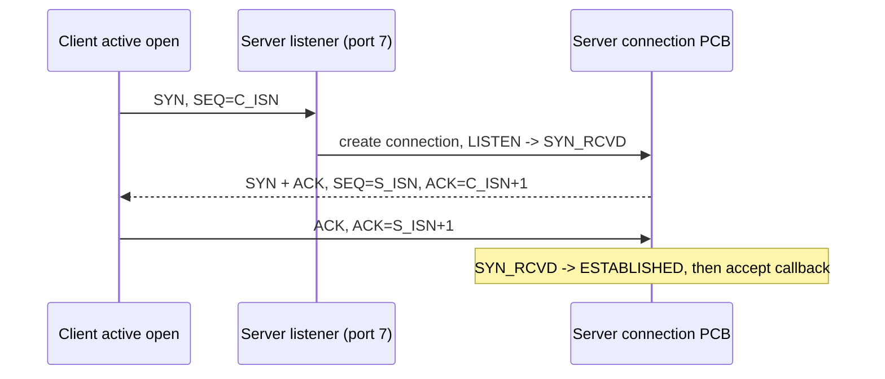
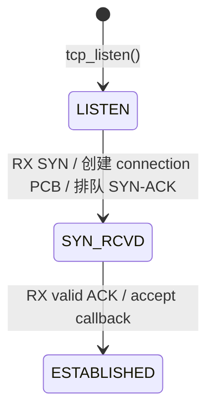
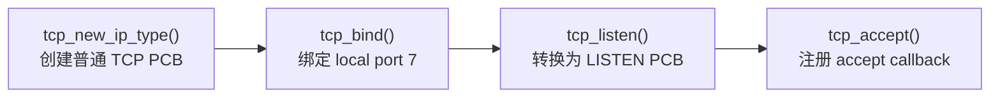
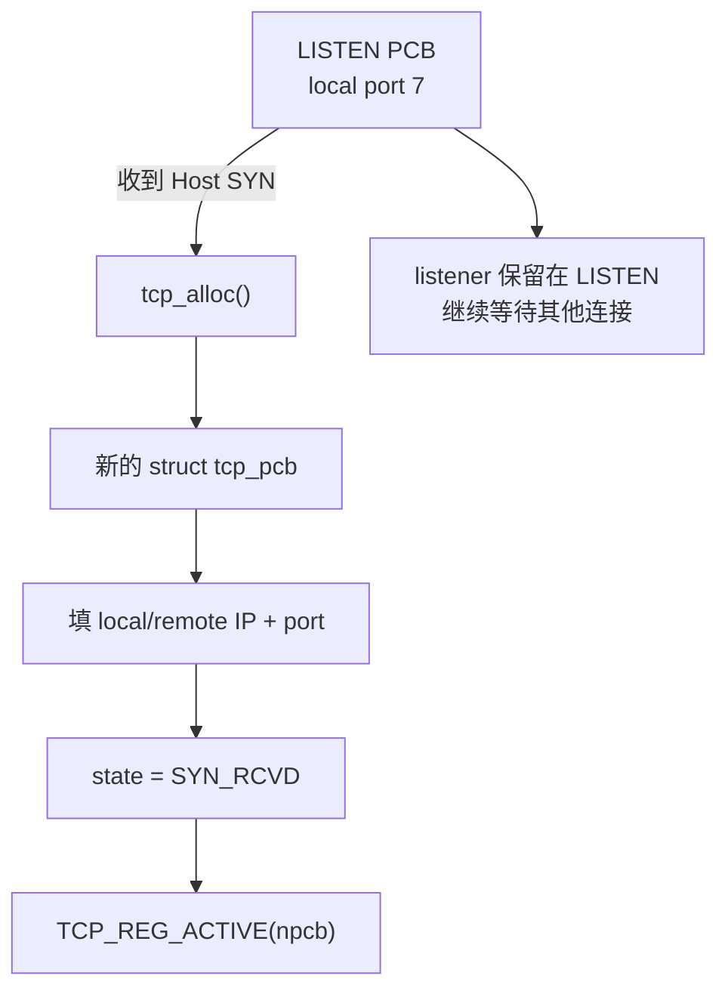
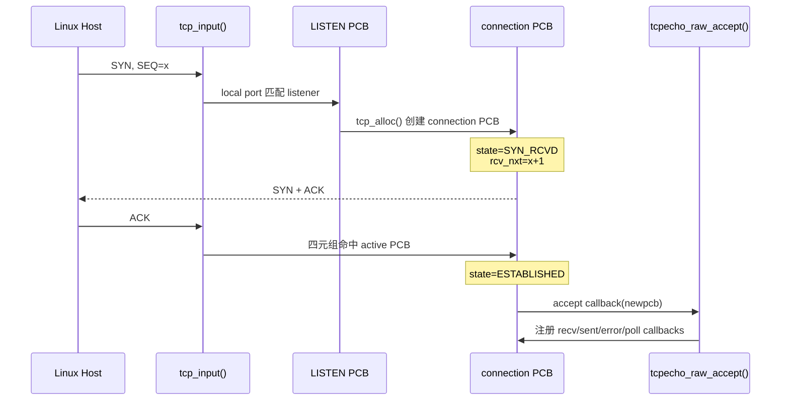

<meta name="referrer" content="no-referrer" />

# 教程 07：从 `tcpecho_raw_init()` 到 `ESTABLISHED`——TCP 三次握手与 PCB 状态机

> 摘要：从 TCP passive open 的三次握手模型出发，沿 Raw TCP Echo 监听入口追踪 LISTEN PCB、SYN_RCVD 连接 PCB、Sequence/ACK 与 accept callback。

[TOC]

TCP（Transmission Control Protocol，传输控制协议）是在 IP 之上提供可靠、有序 **byte stream（字节流）**的面向连接传输协议。与 Stage 5 的 UDP 不同，TCP 在发送普通应用数据前先建立连接，并用 Sequence Number（序列号）、Acknowledgment Number（确认号）以及重传等机制维护双方对同一字节流的状态。[S6](#source-s6)

建立连接时，**SYN（Synchronize）**用于同步初始序列号；**ACK（Acknowledgment）**表示确认号字段有效，并告诉对端“下一次期望哪个 sequence number”。本篇只研究服务端 **passive open（被动打开）**：lwIP 的 listener 处于 `LISTEN`（等待连接）状态；远端客户端执行 **active open（主动打开）**并发出 SYN 后，lwIP 为该远端创建 `SYN_RCVD`（已收到 SYN、已发 SYN/ACK、等待最终 ACK）的 connection PCB；final ACK 有效后进入 `ESTABLISHED`（连接已建立）。连接关闭相关状态不在本篇展开。

## 阅读源码前：建议提前阅读

1. [RFC 9293 — Transmission Control Protocol](https://www.rfc-editor.org/rfc/rfc9293.html)：重点看 TCP Header、Sequence Number/ACK 的定义，以及 3.5 节 Figure 6 的 Basic Three-Way Handshake。[S6](#source-s6)
2. [Wireshark Wiki — TCP 3-way handshaking](https://wiki.wireshark.org/TCP_3_way_handshaking)：用于把三次握手的三个 segment 对应到抓包；relative sequence number（相对序列号）只是分析工具为便于阅读而换算的显示值，不改变线上真实序列号。[S12](#source-s12)
3. [lwIP 2.1.x — TCP Raw API](https://www.nongnu.org/lwip/2_1_x/group__tcp__raw.html)：用于先认识 `tcp_bind()`、`tcp_listen()`、`tcp_accept()` 等公开 Raw API；本文实现细节仍以固定 commit 为准。[S13](#source-s13)

## 进入源码前先把三次握手讲清楚

### Endpoint、connection、segment 与四元组

TCP endpoint 由本地 IP/port 描述；一条已经建立的 TCP connection 则由 **四元组**唯一标识：local IP、local port、remote IP、remote port。TCP 在线上发送的协议数据单元称为 **segment（报文段）**，每个 segment 都有 TCP Header；Header 中的 flags（标志位）说明当前 segment 是否携带 SYN、ACK 等控制语义。[S6](#source-s6)

本篇只需要先理解两个 flag：

- **SYN（Synchronize）**：用于同步双方的初始序列号并建立连接；SYN 自身会占用一个 sequence number。
- **ACK（Acknowledgment）**：表示 TCP Header 中的 Acknowledgment Number 有效；这个数值表示“下一次期望收到的 sequence number”。

每一端建立连接时选择一个 **ISN（Initial Sequence Number，初始序列号）**。如果客户端 ISN 为 `C_ISN`，服务端收到 SYN 后确认 `C_ISN + 1`；如果服务端 ISN 为 `S_ISN`，客户端 final ACK 确认 `S_ISN + 1`。[S6](#source-s6)

### 三次握手为什么是三步



第一步只是客户端声明自己的初始 sequence space；第二步服务端同时确认客户端 SYN 并发送自己的 SYN；第三步客户端确认服务端 SYN。到 final ACK 被服务端接受时，双方才都知道“对端已经收到自己的 SYN”。[S6](#source-s6)

### 本篇只跟服务端 passive-open 状态



这里有一个 lwIP 实现细节要提前记住：**LISTEN 状态属于 `struct tcp_pcb_listen`；收到 SYN 后创建的 `SYN_RCVD`/`ESTABLISHED` connection 使用另一个 `struct tcp_pcb`。** 因此状态变化不能简单理解成“同一个对象从 LISTEN 原地改成 ESTABLISHED”。[S3](#source-s3)[S5](#source-s5)

### 协议动作怎样映射到 lwIP 源码

| 协议阶段 | 线上动作 | lwIP 入口/处理函数 | 关键 PCB/状态 | 下一步 |
| --- | --- | --- | --- | --- |
| 准备被动打开 | 本地 port 7 进入监听 | `tcp_new_ip_type()` → `tcp_bind()` → `tcp_listen()` → `tcp_accept()` | LISTEN PCB | 等待 SYN |
| 收到第一次握手 | RX SYN | `tcp_input()` → `tcp_listen_input()` | 新 connection PCB，`SYN_RCVD` | `tcp_enqueue_flags(TCP_SYN | TCP_ACK)` |
| 发送第二次握手 | TX SYN/ACK | `tcp_output()` / `tcp_output_segment()` | connection PCB 的发送/接收 sequence state | 等待 final ACK |
| 收到第三次握手 | RX ACK | `tcp_input()` → `tcp_process()` 的 `SYN_RCVD` 分支 | `ESTABLISHED` | `TCP_EVENT_ACCEPT()` |
| 应用接管连接 | accept event | `tcpecho_raw_accept()` | connection PCB 注册 recv/sent/poll callbacks | Stage 8 进入数据面 |

下面从真实入口 `tcpecho_raw_init()` 开始，逐步验证这张映射表。

## 1. 真正入口：`tcpecho_raw_init()` 先建立监听端点

`contrib/apps/tcpecho_raw/tcpecho_raw.c` 的初始化入口很短：[S1](#source-s1)

```c
void
tcpecho_raw_init(void)
{
  tcpecho_raw_pcb = tcp_new_ip_type(IPADDR_TYPE_ANY);
  if (tcpecho_raw_pcb != NULL) {
    err_t err;

    err = tcp_bind(tcpecho_raw_pcb, IP_ANY_TYPE, 7);
    if (err == ERR_OK) {
      tcpecho_raw_pcb = tcp_listen(tcpecho_raw_pcb);
      tcp_accept(tcpecho_raw_pcb, tcpecho_raw_accept);
    }
  }
}
```

这四步分别建立四种关系：



前面的协议模型已经使用 connection PCB。这里把它落到实现对象：PCB（Protocol Control Block，协议控制块）不是 packet 或 Linux file descriptor，而是 lwIP 保存 endpoint/connection 运行状态的对象。TCP 的 sequence state、窗口、重传队列和连接状态最终都落在 `tcp_pcb`/`tcp_pcb_listen` 中。[S2](#source-s2)

`tcp_bind()` 只说明“本地端口 7 属于这个 endpoint”；真正把它变成 listener 的是 `tcp_listen()`。

## 2. `tcp_listen()` 为什么会把原来的 PCB 换掉

`tcp_listen()` 有一个很容易忽略的 ownership 变化：**传进去的普通 `struct tcp_pcb` 在成功后会被释放，返回的是另一个更小的 `struct tcp_pcb_listen`。** upstream 注释直接把这一点作为 API contract 说明。[S3](#source-s3)

核心逻辑可以概括为：

```text
普通 struct tcp_pcb
  state = CLOSED
  local_port = 7
        │
        │ tcp_listen_with_backlog_and_err()
        ▼
分配 MEMP_TCP_PCB_LISTEN
复制 listener 需要保留的字段
state = LISTEN
释放原 tcp_pcb
加入 tcp_listen_pcbs
        ▼
struct tcp_pcb_listen
```

这里仍在 `tcpecho_raw_init()`：`tcp_bind()` 成功后，示例必须保存 `tcp_listen()` 返回的新 listener PCB：

```c
tcpecho_raw_pcb = tcp_listen(tcpecho_raw_pcb);
```

同样位于 `tcpecho_raw_init()` 的下面这种写法是错误理解，因为忽略了返回的新对象：

```c
tcp_listen(tcpecho_raw_pcb); /* 错误理解：忽略返回的新对象 */
```

为什么 listener 可以更小？因为它还不是一条具体 connection，不需要保存每个远端连接独有的发送队列、接收序号、拥塞窗口等状态。真正收到 SYN 后，lwIP 才为那个远端重新分配普通 `struct tcp_pcb`。[S2](#source-s2)[S3](#source-s3)

这里也要区分两个容易混淆的对象：

| 对象 | 表示什么 | 关键状态 |
| --- | --- | --- |
| `struct tcp_pcb_listen` | 本地监听端点 | `LISTEN` |
| `struct tcp_pcb` | 一条具体 TCP connection | `SYN_RCVD`、`ESTABLISHED` 等 |

一个 listener 可以先后产生很多 connection PCB；不能把它们理解成“同一个 PCB 状态不断变”。

## 3. TCP state 在 lwIP 里怎样落到 PCB 对象

TCP 状态本身已经由 RFC 9293 和前置资料定义，本节不再重讲状态机原理，只确认 **lwIP 用什么对象保存这些状态，以及本篇 passive open 会经过哪些值**。[S4](#source-s4)[S6](#source-s6)

`tcpbase.h` 中的 `enum tcp_state` 包含完整 TCP 生命周期；当前主线只用到下面四个位置：

| lwIP 状态/对象 | 当前源码里的含义 | 本篇在哪一步看到 |
| --- | --- | --- |
| `CLOSED` / 普通 `tcp_pcb` | listener 转换前的普通 PCB | `tcp_new_ip_type()` 之后 |
| `LISTEN` / `tcp_pcb_listen` | 等待远端 SYN 的监听对象 | `tcp_listen()` 之后 |
| `SYN_RCVD` / 新 `tcp_pcb` | `tcp_listen_input()` 收到 SYN 后为该远端创建的 connection PCB | 第 5～7 节 |
| `ESTABLISHED` / connection `tcp_pcb` | final ACK 通过 `tcp_process()` 后的已建立连接 | 第 8～9 节 |

`SYN_SENT` 属于 active open，即本地主动调用 `tcp_connect()` 后的路径。本篇主线是服务端 passive open，因此只在第 11 节做最小源码对照。

这里的重点不是重新记一张 TCP 状态图，而是先确认一个 lwIP 特有事实：**listener PCB 与后来创建的 connection PCB 不是同一个对象。** 后面的状态迁移必须跟着正确的 PCB 看。

## 4. 第一个 SYN 到达前：先把 `TAP RX -> tcpip_thread -> IPv4 -> TCP` 补完整

“TCP packet 从 IPv4 层进入 `tcp_input()`”只描述了 **TCP Core 的直接调用者**，如果不把前面的线程桥接补回来，很容易形成“网卡收到数据后直接调用 `tcp_input()`”的错误印象。

当前 Unix `example_app` 的真实路径是：[S8](#source-s8)[S9](#source-s9)[S10](#source-s10)[S11](#source-s11)

```text
Host 写入 TAP
  -> tapif_thread() 被 select() 唤醒
  -> tapif_input()
  -> low_level_input(): read(TAP fd) + pbuf_alloc/pbuf_take
  -> netif->input(p, netif)
       当前 netif->input = tcpip_input
  -> tcpip_input()
  -> tcpip_inpkt(..., ethernet_input)
  -> TCPIP_MSG_INPKT 投递到 tcpip_mbox
  -> tcpip_thread() 取出消息
  -> ethernet_input()
  -> EtherType == IPv4
  -> pbuf_remove_header(Ethernet header)
  -> ip4_input()
  -> Protocol == TCP
  -> pbuf_remove_header(IPv4 header)
  -> tcp_input()
```

### 4.1 `netif->input` 为什么在当前实验里就是 `tcpip_input()`

Unix example 创建默认网卡时，在 `NO_SYS == 0` 路径把 `tcpip_input` 直接传给 `netif_add()`：[S8](#source-s8)

```c
#if NO_SYS
netif_add(&netif, NETIF_ADDRS NULL, tapif_init, netif_input);
#else
  netif_add(&netif, NETIF_ADDRS NULL, tapif_init, tcpip_input);
#endif
```

因此 `tapif_input()` 中这句不是抽象描述，而是真正的线程切换入口：[S8](#source-s8)

```c
static void
tapif_input(struct netif *netif)
{
  struct pbuf *p = low_level_input(netif);

  if (p == NULL) {
#if LINK_STATS
    LINK_STATS_INC(link.recv);
#endif /* LINK_STATS */
    LWIP_DEBUGF(TAPIF_DEBUG, ("tapif_input: low_level_input returned NULL\n"));
    return;
  }

  if (netif->input(p, netif) != ERR_OK) {
    LWIP_DEBUGF(NETIF_DEBUG, ("tapif_input: netif input error\n"));
    pbuf_free(p);
  }
}
```

而 `tapif_input()` 又不是 `tcpip_thread` 主动轮询调用的。当前 `NO_SYS=0` Port 在初始化时创建独立的 `tapif_thread`，线程阻塞在 `select()`；TAP fd 可读后才进入 `tapif_input()`：[S8](#source-s8)

```c
static void
tapif_thread(void *arg)
{
  struct netif *netif;
  struct tapif *tapif;
  fd_set fdset;
  int ret;

  netif = (struct netif *)arg;
  tapif = (struct tapif *)netif->state;

  while(1) {
    FD_ZERO(&fdset);
    FD_SET(tapif->fd, &fdset);

    /* Wait for a packet to arrive. */
    ret = select(tapif->fd + 1, &fdset, NULL, NULL, NULL);

    if(ret == 1) {
      /* Handle incoming packet. */
      tapif_input(netif);
    } else if(ret == -1) {
      perror("tapif_thread: select");
    }
  }
}
```

所以这里至少有两个执行上下文：

```text
tapif_thread
    负责等待 Host TAP fd、把 frame 搬进 pbuf

tcpip_thread
    负责串行执行 Ethernet/IP/TCP/UDP 等 lwIP Core 输入处理
```

### 4.2 `tcpip_input()` 如何把 RX pbuf 交给 `tcpip_thread`

`tcpip_input()` 先根据 `netif` flags 决定收到的是 Ethernet frame 还是裸 IP packet。当前 TAP netif 具备 Ethernet/ARP 能力，因此选择 `ethernet_input`：[S9](#source-s9)

```c
err_t
tcpip_input(struct pbuf *p, struct netif *inp)
{
#if LWIP_ETHERNET
  if (inp->flags & (NETIF_FLAG_ETHARP | NETIF_FLAG_ETHERNET)) {
    return tcpip_inpkt(p, inp, ethernet_input);
  } else
#endif /* LWIP_ETHERNET */
    return tcpip_inpkt(p, inp, ip_input);
}
```

当前 `LWIP_TCPIP_CORE_LOCKING_INPUT` 默认是 `0`，所以 `tcpip_inpkt()` 不会在 `tapif_thread` 里直接执行 `ethernet_input()`；它分配一个 `TCPIP_MSG_INPKT`，保存 `p/netif/input_fn`，再投递到 `tcpip_mbox`：[S9](#source-s9)[S11](#source-s11)

```c
  msg = (struct tcpip_msg *)memp_malloc(MEMP_TCPIP_MSG_INPKT);
  if (msg == NULL) {
    return ERR_MEM;
  }

  msg->type = TCPIP_MSG_INPKT;
  msg->msg.inp.p = p;
  msg->msg.inp.netif = inp;
  msg->msg.inp.input_fn = input_fn;
  if (sys_mbox_trypost(&tcpip_mbox, msg) != ERR_OK) {
    memp_free(MEMP_TCPIP_MSG_INPKT, msg);
    return ERR_MEM;
  }
  return ERR_OK;
```

`tcpip_thread()` 一直从这个 mailbox 取消息，然后把消息交给 `tcpip_thread_handle_msg()`；其中 `TCPIP_MSG_INPKT` case 才调用前面保存的 `input_fn`：[S9](#source-s9)

```c
    case TCPIP_MSG_INPKT:
      LWIP_DEBUGF(TCPIP_DEBUG, ("tcpip_thread: PACKET %p\n", (void *)msg));
      if (msg->msg.inp.input_fn(msg->msg.inp.p, msg->msg.inp.netif) != ERR_OK) {
        pbuf_free(msg->msg.inp.p);
      }
      memp_free(MEMP_TCPIP_MSG_INPKT, msg);
      break;
```

这一步才是真正的：

```text
tapif_thread                     tcpip_thread
     |                                |
     | TCPIP_MSG_INPKT                |
     +------ tcpip_mbox ------------->|
                                      | ethernet_input(p, netif)
```

### 4.3 `ethernet_input()` 为什么接着进入 `ip4_input()`

进入 `ethernet_input()` 时，`p->payload` 仍指向 Ethernet Header。代码先把 `payload` 解释成 `struct eth_hdr`，读取 `type`；遇到 IPv4 EtherType 后移除 Ethernet Header，再调用 `ip4_input()`：[S10](#source-s10)

```c
  /* points to packet payload, which starts with an Ethernet header */
  ethhdr = (struct eth_hdr *)p->payload;
  type = ethhdr->type;
```

IPv4 分支的连续片段是：[S10](#source-s10)

```c
    case PP_HTONS(ETHTYPE_IP):
      if (!(netif->flags & NETIF_FLAG_ETHARP)) {
        goto free_and_return;
      }
      /* skip Ethernet header (min. size checked above) */
      if (pbuf_remove_header(p, next_hdr_offset)) {
        LWIP_DEBUGF(ETHARP_DEBUG | LWIP_DBG_TRACE | LWIP_DBG_LEVEL_WARNING,
                    ("ethernet_input: IPv4 packet dropped, too short (%"U16_F"/%"U16_F")\n",
                     p->tot_len, next_hdr_offset));
        LWIP_DEBUGF(ETHARP_DEBUG | LWIP_DBG_TRACE, ("Can't move over header in packet\n"));
        goto free_and_return;
      } else {
        /* pass to IP layer */
        ip4_input(p, netif);
      }
      break;
```

于是数据视图发生第一次推进：

```text
进入 ethernet_input(): p->payload -> Ethernet Header
移除 L2 header 后:       p->payload -> IPv4 Header
```

`ip4_input()` 完成 IPv4 Header 检查和本机目的地址判断后，把 `ip_data.current_ip4_header` 留作当前包的 L3 上下文；随后移除 IPv4 Header，根据 `Protocol` 字段分发。TCP 对应 `IP_PROTO_TCP`：[S10](#source-s10)

```c
    pbuf_remove_header(p, iphdr_hlen); /* Move to payload, no check necessary. */

    switch (IPH_PROTO(iphdr)) {
#if LWIP_UDP
      case IP_PROTO_UDP:
#if LWIP_UDPLITE
      case IP_PROTO_UDPLITE:
#endif /* LWIP_UDPLITE */
        MIB2_STATS_INC(mib2.ipindelivers);
        udp_input(p, inp);
        break;
#endif /* LWIP_UDP */
#if LWIP_TCP
      case IP_PROTO_TCP:
        MIB2_STATS_INC(mib2.ipindelivers);
        tcp_input(p, inp);
        break;
#endif /* LWIP_TCP */
#if LWIP_ICMP
      case IP_PROTO_ICMP:
        MIB2_STATS_INC(mib2.ipindelivers);
        icmp_input(p, inp);
        break;
#endif /* LWIP_ICMP */
```

因此，“TCP packet 从 IPv4 层进入 `tcp_input()`”的完整含义是：**同一个 RX pbuf 已经由 Ethernet 层消费 L2 Header，再由 IPv4 层验证并消费 L3 Header；只有 IPv4 `Protocol == TCP` 时，才把当前数据视图交给 TCP。**

```text
TAP read 完成后
p->payload -> Ethernet Header
        |
        | ethernet_input(): remove 14-byte Ethernet header
        v
p->payload -> IPv4 Header
        |
        | ip4_input(): remove IHL 指定的 IPv4 header
        v
p->payload -> TCP Header
        |
        | tcp_input(): remove TCP header + options
        v
p->payload -> TCP application payload
```

### 4.4 `tcp_input()` 不是一进来就查 PCB：先验证 TCP Header，再推进数据视图

这正是原文之前讲得过快的地方。`tcp_input()` 一开始就把当前 `p->payload` 解释成 TCP Header，然后依次做最小长度、广播/组播、checksum、TCP Header Length 检查：[S5](#source-s5)

```c
  tcphdr = (struct tcp_hdr *)p->payload;

  /* Check that TCP header fits in payload */
  if (p->len < TCP_HLEN) {
    LWIP_DEBUGF(TCP_INPUT_DEBUG, ("tcp_input: short packet (%"U16_F" bytes) discarded\n", p->tot_len));
    TCP_STATS_INC(tcp.lenerr);
    goto dropped;
  }

  /* Don't even process incoming broadcasts/multicasts. */
  if (ip_addr_isbroadcast(ip_current_dest_addr(), ip_current_netif()) ||
      ip_addr_ismulticast(ip_current_dest_addr())) {
    TCP_STATS_INC(tcp.proterr);
    goto dropped;
  }
```

checksum 与 TCP Header Length 检查继续发生在 header 还可访问时：[S5](#source-s5)

```c
#if CHECKSUM_CHECK_TCP
  IF__NETIF_CHECKSUM_ENABLED(inp, NETIF_CHECKSUM_CHECK_TCP) {
    /* Verify TCP checksum. */
    u16_t chksum = ip_chksum_pseudo(p, IP_PROTO_TCP, p->tot_len,
                                    ip_current_src_addr(), ip_current_dest_addr());
    if (chksum != 0) {
      LWIP_DEBUGF(TCP_INPUT_DEBUG, ("tcp_input: packet discarded due to failing checksum 0x%04"X16_F"\n",
                                    chksum));
      tcp_debug_print(tcphdr);
      TCP_STATS_INC(tcp.chkerr);
      goto dropped;
    }
  }
#endif /* CHECKSUM_CHECK_TCP */

  /* sanity-check header length */
  hdrlen_bytes = TCPH_HDRLEN_BYTES(tcphdr);
  if ((hdrlen_bytes < TCP_HLEN) || (hdrlen_bytes > p->tot_len)) {
    LWIP_DEBUGF(TCP_INPUT_DEBUG, ("tcp_input: invalid header length (%"U16_F")\n", (u16_t)hdrlen_bytes));
    TCP_STATS_INC(tcp.lenerr);
    goto dropped;
  }
```

继续阅读 `tcp_input()`。TCP Header Length 不是永远 20 bytes，因为 TCP options 也包含在 header 内；若整个 header/options 都在第一个 pbuf，`tcp_input()` 直接推进 `payload`：[S5](#source-s5)

```c
  tcphdr_optlen = (u16_t)(hdrlen_bytes - TCP_HLEN);
  tcphdr_opt2 = NULL;
  if (p->len >= hdrlen_bytes) {
    /* all options are in the first pbuf */
    tcphdr_opt1len = tcphdr_optlen;
    pbuf_remove_header(p, hdrlen_bytes); /* cannot fail */
  } else {
```

因此在后面的状态机里会同时存在两个不同视图：

- `tcphdr` 仍保存 TCP Header 地址，用来读取 `src/dest/seqno/ackno/flags/wnd`；
- `p->payload` 已经推进到 **TCP payload**，`p->tot_len` 也表示剩余 TCP data 长度。

这就是后面 `tcp_receive()` 能把 `p` 直接交给 application callback 的基础。

### 4.5 Header 处理完以后，`tcp_input()` 才做 demultiplex

TCP 不能只看 destination port。对已经建立的 connection，需要同时匹配 remote/local IP 和 remote/local port。active PCB 查找的实际条件是：[S5](#source-s5)

```c
    if (pcb->remote_port == tcphdr->src &&
        pcb->local_port == tcphdr->dest &&
        ip_addr_eq(&pcb->remote_ip, ip_current_src_addr()) &&
        ip_addr_eq(&pcb->local_ip, ip_current_dest_addr())) {
      /* Move this PCB to the front of the list so that subsequent
         lookups will be faster (we exploit locality in TCP segment
         arrivals). */
      LWIP_ASSERT("tcp_input: pcb->next != pcb (before cache)", pcb->next != pcb);
      if (prev != NULL) {
        prev->next = pcb->next;
        pcb->next = tcp_active_pcbs;
        tcp_active_pcbs = pcb;
      } else {
        TCP_STATS_INC(tcp.cachehit);
      }
      LWIP_ASSERT("tcp_input: pcb->next != pcb (after cache)", pcb->next != pcb);
      break;
    }
```

第一个 SYN 还没有 active connection，所以 active/time-wait 都匹配不到，最终才扫描 listen PCB。listener 没有固定 remote endpoint，所以先看 local port，再看 local IP 是否 exact/ANY match；命中后调用 `tcp_listen_input()`：[S5](#source-s5)

```c
      if (lpcb->local_port == tcphdr->dest) {
        if (IP_IS_ANY_TYPE_VAL(lpcb->local_ip)) {
#if SO_REUSE
          lpcb_any = lpcb;
          lpcb_prev = prev;
#else /* SO_REUSE */
          break;
#endif /* SO_REUSE */
        } else if (IP_ADDR_PCB_VERSION_MATCH_EXACT(lpcb, ip_current_dest_addr())) {
          if (ip_addr_eq(&lpcb->local_ip, ip_current_dest_addr())) {
            /* found an exact match */
            break;
          } else if (ip_addr_isany(&lpcb->local_ip)) {
#if SO_REUSE
            lpcb_any = lpcb;
            lpcb_prev = prev;
#else /* SO_REUSE */
            break;
#endif /* SO_REUSE */
          }
        }
      }
```

listener 查找完成后仍在 `tcp_input()`。命中 listener 时，`tcp_input()` 在这里明确调用 `tcp_listen_input(lpcb)`：[S5](#source-s5)

```c
      LWIP_DEBUGF(TCP_INPUT_DEBUG, ("tcp_input: packed for LISTENing connection.\n"));
#ifdef LWIP_HOOK_TCP_INPACKET_PCB
      if (LWIP_HOOK_TCP_INPACKET_PCB((struct tcp_pcb *)lpcb, tcphdr, tcphdr_optlen,
                                     tcphdr_opt1len, tcphdr_opt2, p) == ERR_OK)
#endif
      {
        tcp_listen_input(lpcb);
      }
      pbuf_free(p);
      return;
```

到这里才能准确说：第一个 SYN 从 `tcp_input()` 被 demultiplex 到监听端点。
## 5. SYN 到来：`tcp_listen_input()` 怎样创建 connection PCB

协议总流程现在走到第一次握手：Client SYN 已经穿过 Ethernet/IPv4/TCP 输入链并命中 listener。接下来要验证的是 `LISTEN -> SYN_RCVD` 为什么不是 listener 原地变状态，而是创建新的 connection PCB。

命中 listener 后，`tcp_listen_input()` 并不会把 listener 本身改成 `SYN_RCVD`。先看它收到 SYN 时的真实连续代码。[S5](#source-s5)

```c
  } else if (flags & TCP_SYN) {
    LWIP_DEBUGF(TCP_DEBUG, ("TCP connection request %"U16_F" -> %"U16_F".\n", tcphdr->src, tcphdr->dest));
#if TCP_LISTEN_BACKLOG
    if (pcb->accepts_pending >= pcb->backlog) {
      LWIP_DEBUGF(TCP_DEBUG, ("tcp_listen_input: listen backlog exceeded for port %"U16_F"\n", tcphdr->dest));
      return;
    }
#endif /* TCP_LISTEN_BACKLOG */
    npcb = tcp_alloc(pcb->prio);
    /* If a new PCB could not be created (probably due to lack of memory),
       we don't do anything, but rely on the sender will retransmit the
       SYN at a time when we have more memory available. */
    if (npcb == NULL) {
      err_t err;
      LWIP_DEBUGF(TCP_DEBUG, ("tcp_listen_input: could not allocate PCB\n"));
      TCP_STATS_INC(tcp.memerr);
      TCP_EVENT_ACCEPT(pcb, NULL, pcb->callback_arg, ERR_MEM, err);
      LWIP_UNUSED_ARG(err); /* err not useful here */
      return;
    }
```

这段代码先处理 backlog，再通过 `tcp_alloc()` 创建一个新的普通 `struct tcp_pcb`。只有分配成功，才开始把当前报文里的 endpoint 与 sequence state 写入新 PCB：[S5](#source-s5)

```c
    /* Set up the new PCB. */
    ip_addr_copy(npcb->local_ip, *ip_current_dest_addr());
    ip_addr_copy(npcb->remote_ip, *ip_current_src_addr());
    npcb->local_port = pcb->local_port;
    npcb->remote_port = tcphdr->src;
    npcb->state = SYN_RCVD;
    npcb->rcv_nxt = seqno + 1;
    npcb->rcv_ann_right_edge = npcb->rcv_nxt;
    iss = tcp_next_iss(npcb);
    npcb->snd_wl2 = iss;
    npcb->snd_nxt = iss;
    npcb->lastack = iss;
    npcb->snd_lbb = iss;
    npcb->snd_wl1 = seqno - 1;/* initialise to seqno-1 to force window update */
    npcb->callback_arg = pcb->callback_arg;
#if LWIP_CALLBACK_API || TCP_LISTEN_BACKLOG
    npcb->listener = pcb;
#endif /* LWIP_CALLBACK_API || TCP_LISTEN_BACKLOG */
```

这里的数据来源可以直接对应回刚才 `tcp_input()` 解析出的字段：

| 新 PCB 字段 | 来源 | 当前意义 |
| --- | --- | --- |
| `local_ip` | `ip_current_dest_addr()` | SYN 的 IPv4 destination，也就是本机地址 |
| `remote_ip` | `ip_current_src_addr()` | SYN 的 IPv4 source |
| `local_port` | listen PCB | 服务端监听端口 |
| `remote_port` | `tcphdr->src` | 客户端源端口 |
| `rcv_nxt` | `seqno + 1` | SYN 占一个 sequence number 后，下一个期望序号 |
| `iss/snd_nxt/lastack/snd_lbb` | `tcp_next_iss()` | 本端发送 sequence space 的初始位置 |

随后新 PCB 注册进 active list，而 listener 继续留在 `tcp_listen_pcbs`：[S5](#source-s5)

```c
    /* Register the new PCB so that we can begin receiving segments
       for it. */
    TCP_REG_ACTIVE(npcb);

    /* Parse any options in the SYN. */
    tcp_parseopt(npcb);
    npcb->snd_wnd = tcphdr->wnd;
    npcb->snd_wnd_max = npcb->snd_wnd;
```

因此对象关系应该记成：



状态迁移发生在**新 connection PCB** 上，而不是把 listener 直接改造成 connection。
## 6. 为什么收到 SYN 后 `rcv_nxt = seqno + 1`

SYN 本身不携带普通 application data，也仍然占用一个 TCP Sequence Number。RFC 9293 的 sequence space 规则要求 SYN 和 FIN 都消耗一个序号。[S6](#source-s6)

假设 Host 的 SYN 是：

```text
SEQ = 1000
SYN = 1
```

lwIP 接收后设置：

```text
rcv_nxt = 1001
```

含义是：**下一个期望从 Host 收到的 sequence number 是 1001。**

这里要把几个字段分开：

| 名称 | 所属方向 | 当前含义 |
| --- | --- | --- |
| `seqno` | RX TCP Header | 对端这个 segment 的第一个 sequence number |
| `rcv_nxt` | 本地 PCB | 本地下一步期望收到的 sequence number |
| `iss` | 本地发送侧 | Initial Send Sequence，本端握手起始 sequence |
| `snd_nxt` | 本地 PCB | 本端下一步准备发送的 sequence number 位置 |
| `lastack` | 本地 PCB | 已被对端累计确认到的位置 |

Stage 8 会继续深入 `snd_nxt`、`lastack`、发送队列。本篇只需要理解：接收 SYN 后 `rcv_nxt` 前进 1，本端也选择自己的 `iss` 来构造 SYN-ACK。

## 7. SYN-ACK 不是 `tcp_listen_input()` 直接拼一块 Ethernet frame

协议总流程现在走到第二次握手：`SYN_RCVD` connection PCB 已建立，服务端需要发送 SYN/ACK。下面沿实际调用链看控制 segment 如何排队，再由 TCP output 进入 IP/Ethernet TX。

新 PCB 建好以后，`tcp_listen_input()` 调用：[S5](#source-s5)

```c
rc = tcp_enqueue_flags(npcb, TCP_SYN | TCP_ACK);
if (rc != ERR_OK) {
  tcp_abandon(npcb, 0);
  return;
}
tcp_output(npcb);
```

这里第一次遇到两个 TCP flag：

- `SYN`：同步 sequence number，用于建立连接；
- `ACK`：Acknowledgment 字段有效，确认已经接收的 sequence space。

`SYN | ACK` 因此表示：“这是本端的 SYN，同时确认了刚才收到的对端 SYN”。

`tcp_enqueue_flags()` 先把控制 segment 放到 TCP 的发送队列；`tcp_output()` 再根据发送窗口等条件实际输出。最终才会经过 IP 与 netif TX 路径下发到 Ethernet/TAP。[S7](#source-s7)

这时发送队列第一次出现，但本篇只保留最小模型：

```text
生成 SYN-ACK segment
        ↓
TCP 发送队列
        ↓
tcp_output()
        ↓
IP / ARP / Ethernet / TAP
```

`unsent`、`unacked` 的对象迁移在 Stage 8 再展开。

## 8. 第三个 ACK：`tcp_process()` 如何真正完成 `SYN_RCVD -> ESTABLISHED`

协议总流程现在走到第三次握手：服务端已经发出 SYN/ACK，下面的 final ACK 决定 connection PCB 是否真正进入 `ESTABLISHED` 并触发 accept event。

Host 收到 SYN-ACK 后发送最终 ACK。这个 frame 会完整重复前面的 RX 链：`tapif_thread -> tcpip_input -> tcpip_thread -> ethernet_input -> ip4_input -> tcp_input`。区别在于此时四元组已经能够命中刚才注册到 `tcp_active_pcbs` 的 `npcb`，因此不再走 listen PCB 查找。[S5](#source-s5)

`tcp_input()` 为命中的 connection 构造临时 `inseg`，清空本轮输入产生的 `recv_data/recv_acked/recv_flags`，然后调用 `tcp_process()`：[S5](#source-s5)

```c
    /* Set up a tcp_seg structure. */
    inseg.next = NULL;
    inseg.len = p->tot_len;
    inseg.p = p;
    inseg.tcphdr = tcphdr;

    recv_data = NULL;
    recv_flags = 0;
    recv_acked = 0;

    if (flags & TCP_PSH) {
      p->flags |= PBUF_FLAG_PUSH;
    }

    tcp_input_pcb = pcb;
    err = tcp_process(pcb);
```

这里的 `inseg.p` 已经不是“完整 Ethernet frame 视图”。前面三层 header 已经依次被消费：Ethernet Header 和 IPv4 Header 在进入 TCP 前移除，TCP Header 又在 `tcp_input()` 开头移除，因此 `inseg.p->payload` 对数据 segment 来说指向 TCP payload；`inseg.tcphdr` 单独保留 header 指针供状态机读取。

在 `SYN_RCVD` 分支，final ACK 必须落在预期的发送 sequence range 内。满足后代码明确执行 `pcb->state = ESTABLISHED`，然后触发 listener 的 accept callback：[S5](#source-s5)

```c
    case SYN_RCVD:
      if (flags & TCP_SYN) {
        if (seqno == pcb->rcv_nxt - 1) {
          /* Looks like another copy of the SYN - retransmit our SYN-ACK */
          tcp_rexmit(pcb);
        }
      } else if (flags & TCP_ACK) {
        /* expected ACK number? */
        if (TCP_SEQ_BETWEEN(ackno, pcb->lastack + 1, pcb->snd_nxt)) {
          pcb->state = ESTABLISHED;
          LWIP_DEBUGF(TCP_DEBUG, ("TCP connection established %"U16_F" -> %"U16_F".\n", inseg.tcphdr->src, inseg.tcphdr->dest));
#if LWIP_CALLBACK_API || TCP_LISTEN_BACKLOG
          if (pcb->listener == NULL) {
            /* listen pcb might be closed by now */
            err = ERR_VAL;
          } else
#endif /* LWIP_CALLBACK_API || TCP_LISTEN_BACKLOG */
          {
#if LWIP_CALLBACK_API
            LWIP_ASSERT("pcb->listener->accept != NULL", pcb->listener->accept != NULL);
#endif
            tcp_backlog_accepted(pcb);
            /* Call the accept function. */
            TCP_EVENT_ACCEPT(pcb->listener, pcb, pcb->callback_arg, ERR_OK, err);
          }
```

如果这个 final ACK 同时携带 application data，状态迁移和 accept callback 之后还会直接调用 `tcp_receive(pcb)`，因此“握手 ACK”和“第一批 application bytes”并不存在必须分成两个 packet 的要求：[S5](#source-s5)

```c
          /* If there was any data contained within this ACK,
           * we'd better pass it on to the application as well. */
          tcp_receive(pcb);

          /* Prevent ACK for SYN to generate a sent event */
          if (recv_acked != 0) {
            recv_acked--;
          }

          pcb->cwnd = LWIP_TCP_CALC_INITIAL_CWND(pcb->mss);
```

到这里，运行时对象关系才真正变成：

```text
listen PCB
    继续 LISTEN

connection PCB
    SYN_RCVD
       |
       | final ACK 合法
       v
    ESTABLISHED
       |
       +-> listener accept callback
       +-> 若 ACK 携带 data，则继续 tcp_receive()
```
## 9. `tcpecho_raw_accept()` 给 ESTABLISHED PCB 挂上 application callbacks

握手完成后，upstream 示例进入：[S1](#source-s1)

```c
static err_t
tcpecho_raw_accept(void *arg, struct tcp_pcb *newpcb, err_t err)
{
  struct tcpecho_raw_state *es;

  if ((err != ERR_OK) || (newpcb == NULL)) {
    return ERR_VAL;
  }

  es = (struct tcpecho_raw_state *)mem_malloc(sizeof(struct tcpecho_raw_state));
  if (es != NULL) {
    es->state = ES_ACCEPTED;
    es->pcb = newpcb;
    es->p = NULL;

    tcp_arg(newpcb, es);
    tcp_recv(newpcb, tcpecho_raw_recv);
    tcp_err(newpcb, tcpecho_raw_error);
    tcp_poll(newpcb, tcpecho_raw_poll, 0);
    tcp_sent(newpcb, tcpecho_raw_sent);
    return ERR_OK;
  }
  return ERR_MEM;
}
```

这里同时存在两套 state，不要混淆：

| state | 属于谁 | 用途 |
| --- | --- | --- |
| `ESTABLISHED` | lwIP `struct tcp_pcb` | TCP 协议状态机 |
| `ES_ACCEPTED` | example `tcpecho_raw_state` | Echo application 自己的业务状态 |

后者不是 TCP 标准状态，也不是 lwIP Core 的通用状态。它只属于这个 example。这个区分体现了四层边界：TCP Core 负责 connection protocol state；example 负责 Echo application state。[S1](#source-s1)[S4](#source-s4)

`tcp_recv()`、`tcp_sent()` 等调用同样只是**注册 callback**，并不是“此刻开始收数据/发送完成”。真正触发它们的是后续 TCP input/ACK 事件。

## 10. 三次握手完整运行时流程

到这里才适合把已出现的对象串起来：



这里有两个不同“注册”：

1. 初始化时 `tcp_accept(listener, tcpecho_raw_accept)` 给 listener 注册 accept callback；
2. accept callback 运行以后，再给新 connection PCB 注册 recv/sent/error/poll callbacks。

如果把这两次注册混成一句“设置 callback”，就很难理解 callback 到底挂在哪个 PCB 上、何时才可能触发。

## 11. passive open 与 active open 只做最小对照

当前文章主线是服务端 passive open。客户端主动连接走另一个入口：`tcp_connect()`。[S3](#source-s3)

最小差异是：

```text
服务端 passive open:
CLOSED -> LISTEN -> [新 PCB] SYN_RCVD -> ESTABLISHED

客户端 active open:
CLOSED -> SYN_SENT -> ESTABLISHED
```

active open 本地先选择 initial sequence，排队 SYN；收到合法 SYN-ACK 后，`tcp_process()` 的 `SYN_SENT` 分支将 PCB 改成 `ESTABLISHED` 并触发 connected callback。[S5](#source-s5)

两条路径最终都进入同一个“已建立 connection PCB”模型；区别在于谁先发送 SYN，以及建立阶段由 listener 还是 `tcp_connect()` 发起。

## 12. 从握手过渡到数据面

握手完成后，Stage 8 不再关心“connection 是否存在”，而是沿刚注册的 `tcpecho_raw_recv()` 继续追：

```text
ESTABLISHED connection
        ↓
RX data
        ↓
tcp_receive()
        ↓
tcpecho_raw_recv()
        ↓
tcp_write()
        ↓
unsent / unacked
        ↓
ACK 回来释放发送资源
```

这也是为什么 Stage 7 到 `ESTABLISHED + callbacks registered` 就停止：再往下已经进入发送队列、窗口和 ACK reclaim 的另一套机制。

## 资料来源

<a id="source-s1"></a>
### [S1] upstream Raw TCP Echo 示例
- 版本：`d08f4773edd0182b7910fc8f046eed82ffcd67c9`
- URL/文档：[`contrib/apps/tcpecho_raw/tcpecho_raw.c`](https://github.com/lwip-tcpip/lwip/blob/d08f4773edd0182b7910fc8f046eed82ffcd67c9/contrib/apps/tcpecho_raw/tcpecho_raw.c)
- 使用位置：监听初始化、accept callback 和 application callback 注册
- 支撑内容：`tcp_new_ip_type()`、`tcp_bind()`、`tcp_listen()`、`tcp_accept()` 与 `tcpecho_raw_accept()` 的真实调用顺序

<a id="source-s2"></a>
### [S2] TCP PCB 数据结构
- 版本：`d08f4773edd0182b7910fc8f046eed82ffcd67c9`
- URL/文档：[`src/include/lwip/tcp.h`](https://github.com/lwip-tcpip/lwip/blob/d08f4773edd0182b7910fc8f046eed82ffcd67c9/src/include/lwip/tcp.h)
- 使用位置：`struct tcp_pcb`、`struct tcp_pcb_listen` 与 connection/listener 对象边界
- 支撑内容：listener 与 active connection 保存的状态不同

<a id="source-s3"></a>
### [S3] TCP PCB 创建、bind、listen 与 active open
- 版本：`d08f4773edd0182b7910fc8f046eed82ffcd67c9`
- URL/文档：[`src/core/tcp.c`](https://github.com/lwip-tcpip/lwip/blob/d08f4773edd0182b7910fc8f046eed82ffcd67c9/src/core/tcp.c)
- 使用位置：`tcp_listen()` 对象替换、PCB list 和 `tcp_connect()` 对照
- 支撑内容：listen PCB 分配/原 PCB 释放，以及 active open 的入口语义

<a id="source-s4"></a>
### [S4] lwIP TCP state 定义
- 版本：`d08f4773edd0182b7910fc8f046eed82ffcd67c9`
- URL/文档：[`src/include/lwip/tcpbase.h`](https://github.com/lwip-tcpip/lwip/blob/d08f4773edd0182b7910fc8f046eed82ffcd67c9/src/include/lwip/tcpbase.h)
- 使用位置：LISTEN、SYN_SENT、SYN_RCVD、ESTABLISHED 状态含义
- 支撑内容：当前 lwIP state enum 及其顺序

<a id="source-s5"></a>
### [S5] TCP RX 与握手状态机
- 版本：`d08f4773edd0182b7910fc8f046eed82ffcd67c9`
- URL/文档：[`src/core/tcp_in.c`](https://github.com/lwip-tcpip/lwip/blob/d08f4773edd0182b7910fc8f046eed82ffcd67c9/src/core/tcp_in.c)
- 使用位置：`tcp_input()` demultiplex、`tcp_listen_input()`、`tcp_process()`
- 支撑内容：SYN 创建 connection PCB、`SYN_RCVD`、SYN-ACK 排队、final ACK 进入 `ESTABLISHED` 和 accept event

<a id="source-s6"></a>
### [S6] RFC 9293 — TCP
- URL/文档：[RFC 9293 — Transmission Control Protocol](https://www.rfc-editor.org/rfc/rfc9293.html)
- 使用位置：三次握手、sequence space、SYN/FIN 消耗一个 sequence number
- 支撑内容：TCP 标准连接建立与 sequence number 语义

<a id="source-s7"></a>
### [S7] TCP 输出实现
- 版本：`d08f4773edd0182b7910fc8f046eed82ffcd67c9`
- URL/文档：[`src/core/tcp_out.c`](https://github.com/lwip-tcpip/lwip/blob/d08f4773edd0182b7910fc8f046eed82ffcd67c9/src/core/tcp_out.c)
- 使用位置：SYN-ACK 从控制 segment 排队到 `tcp_output()`
- 支撑内容：`tcp_enqueue_flags()`、`tcp_output()` 与 `tcp_output_segment()` 的发送关系

<a id="source-s8"></a>
### [S8] Unix TAP RX 与 netif input 绑定
- 版本：`d08f4773edd0182b7910fc8f046eed82ffcd67c9`
- URL/文档：[`contrib/ports/unix/port/netif/tapif.c`](https://github.com/lwip-tcpip/lwip/blob/d08f4773edd0182b7910fc8f046eed82ffcd67c9/contrib/ports/unix/port/netif/tapif.c)、[`contrib/ports/unix/example_app/default_netif.c`](https://github.com/lwip-tcpip/lwip/blob/d08f4773edd0182b7910fc8f046eed82ffcd67c9/contrib/ports/unix/example_app/default_netif.c)
- 使用位置：SYN 从 TAP fd 到 `netif->input()` 的线程入口
- 支撑内容：`tapif_thread()`、`tapif_input()`、`low_level_input()` 以及当前 `netif->input = tcpip_input` 的真实绑定

<a id="source-s9"></a>
### [S9] `tcpip_input()` 与 `tcpip_thread` packet handoff
- 版本：`d08f4773edd0182b7910fc8f046eed82ffcd67c9`
- URL/文档：[`src/api/tcpip.c`](https://github.com/lwip-tcpip/lwip/blob/d08f4773edd0182b7910fc8f046eed82ffcd67c9/src/api/tcpip.c)
- 使用位置：`TCPIP_MSG_INPKT`、`tcpip_mbox` 与 Core thread 执行边界
- 支撑内容：RX pbuf 怎样从 TAP thread 投递给 `tcpip_thread`，以及 `input_fn` 怎样在 Core context 中执行

<a id="source-s10"></a>
### [S10] Ethernet 到 IPv4/TCP 的协议分发
- 版本：`d08f4773edd0182b7910fc8f046eed82ffcd67c9`
- URL/文档：[`src/netif/ethernet.c`](https://github.com/lwip-tcpip/lwip/blob/d08f4773edd0182b7910fc8f046eed82ffcd67c9/src/netif/ethernet.c)、[`src/core/ipv4/ip4.c`](https://github.com/lwip-tcpip/lwip/blob/d08f4773edd0182b7910fc8f046eed82ffcd67c9/src/core/ipv4/ip4.c)
- 使用位置：EtherType IPv4 分支、IPv4 `Protocol == TCP` 分发与 `pbuf->payload` 两次推进
- 支撑内容：证明 `tcp_input()` 的直接调用者是 `ip4_input()`，并建立 Ethernet/IPv4/TCP 三层数据视图连续关系

<a id="source-s11"></a>
### [S11] 当前输入线程配置
- 版本：`d08f4773edd0182b7910fc8f046eed82ffcd67c9`
- URL/文档：[`contrib/examples/example_app/lwipopts.h`](https://github.com/lwip-tcpip/lwip/blob/d08f4773edd0182b7910fc8f046eed82ffcd67c9/contrib/examples/example_app/lwipopts.h)、[`src/include/lwip/opt.h`](https://github.com/lwip-tcpip/lwip/blob/d08f4773edd0182b7910fc8f046eed82ffcd67c9/src/include/lwip/opt.h)
- 使用位置：`NO_SYS=0`、`LWIP_TCPIP_CORE_LOCKING_INPUT=0` 的当前执行路径
- 支撑内容：限定本文的 RX mailbox/thread 路径是当前 Unix example 配置，而不是所有 lwIP Port 的唯一输入模型

<a id="source-s12"></a>
### [S12] Wireshark Wiki — TCP 3-way handshaking
- URL/文档：[TCP 3-way handshaking](https://wiki.wireshark.org/TCP_3_way_handshaking)
- 使用位置：“阅读源码前”、三次握手观察
- 支撑内容：提供 SYN、SYN/ACK、ACK 与 relative sequence number 的抓包视角；正文仍独立建立握手和状态模型


<a id="source-s13"></a>
### [S13] lwIP 官方 TCP Raw API 文档
- 类型：lwIP 官方 Doxygen 文档
- 版本：2.1.x 文档；正文源码事实以固定 commit `d08f4773edd0182b7910fc8f046eed82ffcd67c9` 为准
- URL/文档：[lwIP — TCP Raw API](https://www.nongnu.org/lwip/2_1_x/group__tcp__raw.html)
- 使用位置：“阅读源码前”、监听 Raw API 导航
- 支撑内容：说明 `tcp_bind()`、`tcp_listen()`、`tcp_accept()` 等公开 API 的定位；listener/connection PCB 的对象替换与握手状态机由 [S1]～[S7] 的目标源码证明
