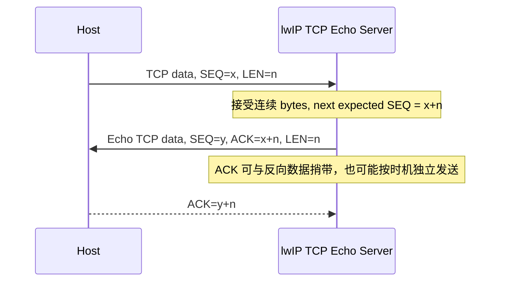
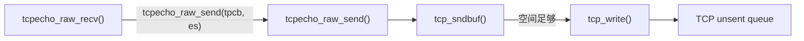
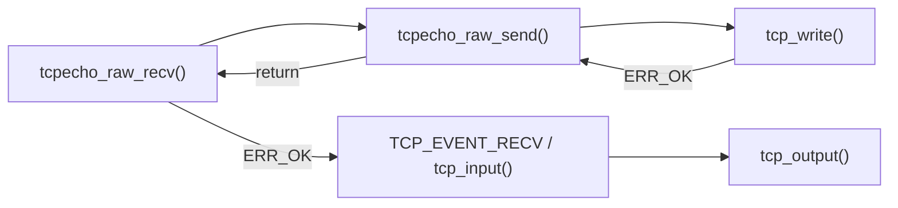
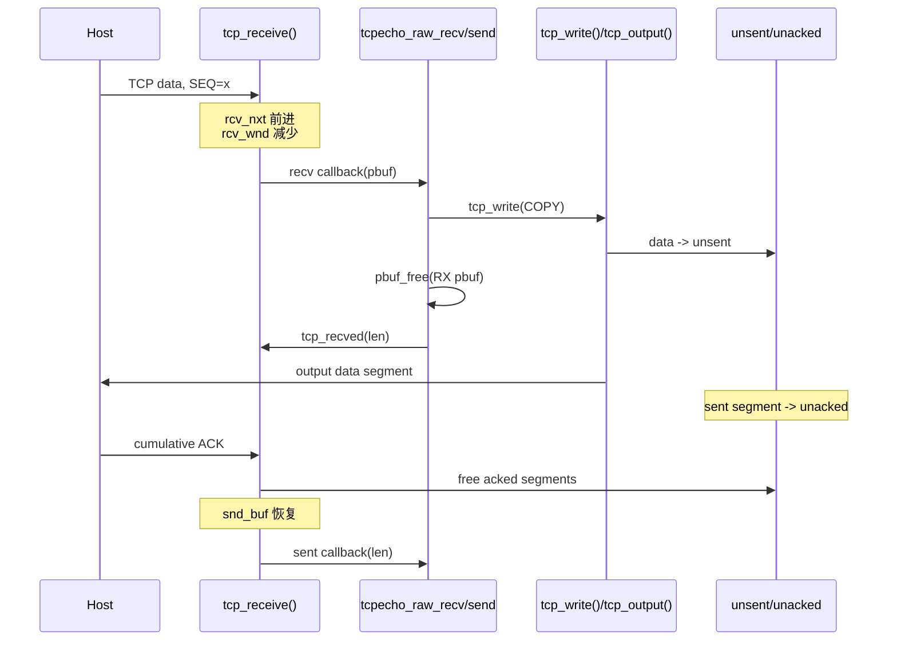

<meta name="referrer" content="no-referrer" />

# 教程 08：从 `tcp_write()` 到 ACK 清队列——TCP 数据发送、窗口与回调

> 摘要：从 TCP 字节流、序列号/确认号与窗口模型出发，沿 Raw TCP Echo 数据路径追踪接收回调、发送排队、待确认队列、ACK 清理和接收窗口归还。

[TOC]

Stage 7 已经完成 passive open，并得到一个 `ESTABLISHED` connection PCB。本篇从第一块 application data 到达开始继续追：TCP 怎样把收到的 bytes 交给 Raw recv callback，Echo 怎样通过 `tcp_write()` 把 bytes 排入发送队列，以及远端 ACK 怎样释放 `unacked` segment、恢复发送额度并触发 `sent` callback。[S1](#source-s1)[S2](#source-s2)

本篇只建立正常数据面的主干；重传超时（RTO）和快速重传（Fast Retransmit）留到 Stage 9，乱序接收与选择性确认（SACK）留到 Stage 10。为了让第一次接触 TCP 数据面的读者能直接进入源码，先把这一主干依赖的协议概念建立起来。

## 阅读源码前：建议提前阅读

1. [RFC 9293 — Transmission Control Protocol](https://www.rfc-editor.org/rfc/rfc9293.html)：重点看数据 bytes 如何编号、接收端如何确认，以及接收方怎样通告当前可接收空间。[S6](#source-s6)
2. [RFC 5681 — TCP Congestion Control](https://www.rfc-editor.org/rfc/rfc5681.html)：本篇只用它理解“网络拥塞也会限制发送量”这一事实；具体拥塞窗口及 Slow Start/Fast Retransmit 算法在正文首次需要和 Stage 9 再展开。[S7](#source-s7)
3. [lwIP 2.1.x — TCP Raw API](https://www.nongnu.org/lwip/2_1_x/group__tcp__raw.html)：用于先认识 `tcp_write()`、`tcp_output()`、`tcp_recved()`、`tcp_sndbuf()` 等公开接口/宏；具体执行行为以固定 commit 为准。[S9](#source-s9)
4. [Cisco — Troubleshooting TCP/IP](https://www.cisco.com/en/US/docs/internetworking/troubleshooting/guide/tr1907.html)：可作为 TCP Header、数据编号/确认与窗口机制的补充图解资料。[S8](#source-s8)

## 进入源码前先建立 TCP 正常数据面的协议模型

### TCP 传的是 byte stream，不是 datagram

TCP 对应用提供 **byte stream（字节流）**：应用写入的是连续 bytes，TCP 可以根据 MSS、窗口和实现策略把这些 bytes 切成一个或多个 segment；接收应用不能依赖“发送端一次 `write` 就对应接收端一次 callback”。[S6](#source-s6)

几个后文会反复出现的术语先统一：

- **Sequence Number（序列号）**：标识当前 TCP segment 中第一个数据 byte 在发送方向 sequence space 中的位置。
- **ACK / Acknowledgment Number（确认号）**：表示接收端下一次期望的 sequence number。正常 TCP ACK 是累计确认：ACK 前的连续 bytes 都被确认收到。[S6](#source-s6)
- **Receive Window（接收窗口）**：接收端通告自己当前还能接受多少数据，用于 flow control（流量控制）。在本地接收方向，lwIP 用 `rcv_wnd` 管理可接收额度；在发送方向，`snd_wnd` 保存对端通告给本端的窗口。[S2](#source-s2)[S3](#source-s3)
- **Congestion Window，`cwnd`（拥塞窗口）**：发送端根据网络拥塞控制算法维护的发送限制。它和对端通告的 `snd_wnd` 不是同一个窗口。[S7](#source-s7)
- **MSS（Maximum Segment Size，最大报文段数据长度）**：约束单个 TCP segment 通常承载多少 TCP payload；它不是 Ethernet MTU，也不是 `PBUF_POOL_BUFSIZE`。[S3](#source-s3)[S5](#source-s5)
- **`snd_buf`**：lwIP PCB 对“还允许应用通过 `tcp_write()` 排入多少 bytes”的本地记账额度；它也不是 `snd_wnd` 或 `cwnd`。[S3](#source-s3)

lwIP 发送队列中的两个名字也必须先分开：

- **`unsent`**：已经由 `tcp_write()` 组织成 TCP segment，但尚未进入“已发送等待确认”状态的队列。
- **`unacked`**：已经由 `tcp_output()` 发出、正在等待累计 ACK 确认的 segment 队列。[S3](#source-s3)[S4](#source-s4)

### 一次正常 Echo 数据交换在协议上发生什么

假设 Host 已和 lwIP 建立连接，Host 发送 `n` bytes，第一字节 sequence number 为 `x`。lwIP 接受这段连续数据后，下一次期望 sequence number 变成 `x+n`；确认可以单独发送，也可以和反向 Echo data 一起携带。Echo data 被 Host 接收后，Host 再用 ACK 确认服务器方向的 bytes。[S6](#source-s6)



这里最重要的因果关系是：**应用把 bytes 交给 `tcp_write()`，不等于对端已经收到；只有对应 ACK 推进后，相关 segment 才能从 `unacked` 释放。**

### 协议动作怎样映射到本篇源码

| 协议阶段 | TCP 语义 | lwIP 源码位置 | 关键对象/字段 | 下一步 |
| --- | --- | --- | --- | --- |
| RX data 到达 | 校验 sequence/window，接受连续 bytes | `tcp_input()` → `tcp_process()` → `tcp_receive()` | `rcv_nxt`、`rcv_wnd`、`recv_data` | `TCP_EVENT_RECV()` |
| 应用消费 RX | Echo callback 取得 payload | `tcpecho_raw_recv()` → `tcpecho_raw_send()` | RX `pbuf` | `tcp_write()` |
| 应用排队 TX | bytes 进入 TCP send queue | `tcp_write()` | `snd_buf`、`unsent` | 等待/触发 `tcp_output()` |
| TCP 真正输出 | segment 受 `snd_wnd`/`cwnd` 等限制发送 | `tcp_output()` | `unsent` → `unacked` | 等待远端 ACK |
| RX ACK | 累计确认已发送 bytes | `tcp_receive()` / ACK 清理逻辑 | ACK 推进位置、`unacked`、`snd_buf` | `TCP_EVENT_SENT()` |
| 应用归还 RX credit | 表示应用已经消费 bytes | `tcp_recved()` | `rcv_wnd` | 必要时产生 window update |

下面从 Stage 7 的直接 continuation——`tcp_input()` 处理 `ESTABLISHED` connection 的数据 segment——继续源码主线。

## 1. 第一块数据怎样从 `tcp_input()` 到达 `tcpecho_raw_recv()`

Stage 7 已经补齐 RX 前半段：`tapif_thread -> tcpip_input -> tcpip_thread -> ethernet_input -> ip4_input -> tcp_input`。到 Stage 8 不再重复每一层代码，但必须继续从 `tcp_input()` 的真实 continuation 往下走，否则 `recv callback` 会像凭空触发一样。[S2](#source-s2)

当四元组命中一个 `ESTABLISHED` PCB 后，`tcp_input()` 先构造当前输入 segment 的临时描述 `inseg`，再调用 `tcp_process()`：[S2](#source-s2)

```c
    /* Set up a tcp_seg structure. */
    inseg.next = NULL;
    inseg.len = p->tot_len;
    inseg.p = p;
    inseg.tcphdr = tcphdr;

    recv_data = NULL;
    recv_flags = 0;
    recv_acked = 0;

    if (flags & TCP_PSH) {
      p->flags |= PBUF_FLAG_PUSH;
    }
```

此时 `tcp_input()` 开头已经移除了 TCP Header，所以：

```text
inseg.tcphdr -> 当前 TCP Header
inseg.p      -> 当前 pbuf chain
p->payload   -> TCP application payload
p->tot_len   -> 当前 segment 的 TCP payload bytes
```

`tcp_process()` 在 `ESTABLISHED` 状态不会直接调用 application，而是进入 `tcp_receive()`：[S2](#source-s2)

```c
    case CLOSE_WAIT:
    /* FALLTHROUGH */
    case ESTABLISHED:
      tcp_receive(pcb);
      if (recv_flags & TF_GOT_FIN) { /* passive close */
        tcp_ack_now(pcb);
        pcb->state = CLOSE_WAIT;
      }
      break;
```

`tcp_receive()` 才负责 sequence/window/ACK/ooseq 等真正的数据面处理。对于当前主线的“按序到达且位于接收窗口中的 data”，它最终把可交付 pbuf 累积到本轮输入的 `recv_data`。`tcp_process()` 返回后，控制流回到 `tcp_input()`；只有这里才触发 Raw API recv event：[S2](#source-s2)

```c
          /* Notify application that data has been received. */
          TCP_EVENT_RECV(pcb, recv_data, ERR_OK, err);
          if (err == ERR_ABRT) {
#if TCP_QUEUE_OOSEQ && LWIP_WND_SCALE
            if (rest != NULL) {
              pbuf_free(rest);
            }
#endif /* TCP_QUEUE_OOSEQ && LWIP_WND_SCALE */
            goto aborted;
          }

          /* If the upper layer can't receive this data, store it */
          if (err != ERR_OK) {
#if TCP_QUEUE_OOSEQ && LWIP_WND_SCALE
            if (rest != NULL) {
              pbuf_cat(recv_data, rest);
            }
#endif /* TCP_QUEUE_OOSEQ && LWIP_WND_SCALE */
            pcb->refused_data = recv_data;
            LWIP_DEBUGF(TCP_INPUT_DEBUG, ("tcp_input: keep incoming packet, because pcb is \"full\"\n"));
```

`TCP_EVENT_RECV` 在 callback API 下最终进入 Stage 7 注册的 `tcpecho_raw_recv()`。所以真正链路是：

```text
tcp_input()
  -> tcp_process()
      -> tcp_receive()
          -> 更新 sequence/window，准备 recv_data
  <- return
  -> TCP_EVENT_RECV(..., recv_data, ...)
      -> tcpecho_raw_recv(..., p, ...)
```

这里从 TCP Core 跨回 Echo application。当前 callback 是 Stage 7 注册的 `tcpecho_raw_recv()`；下面继续阅读 `tcpecho_raw_recv()` 的 `ES_ACCEPTED` 分支。它保存收到的 `p`，然后**直接调用 `tcpecho_raw_send(tpcb, es)`**：[S1](#source-s1)

```c
else if(es->state == ES_ACCEPTED) {
  es->state = ES_RECEIVED;
  es->p = p;
  tcpecho_raw_send(tpcb, es);
  ret_err = ERR_OK;
}
```

这里的 `p` 已经是 **TCP payload 数据视图**，不是 Ethernet/IP/TCP Header。这个事实来自前面三层连续的 `pbuf_remove_header()`，而不是 application callback 自己再解析 header。
## 2. 进入 `tcpecho_raw_send()`：从 Echo callback 切到 TCP 发送循环

上一节的 call site 已经明确出现：

```c
tcpecho_raw_send(tpcb, es);
```

因此下一步不是“突然出现一个 while”，而是进入 `tcpecho_raw_send()`。下面直接展示 upstream 的完整函数，使当前函数名、局部变量和发送循环保持在同一个源码块里：[S1](#source-s1)

```c
static void
tcpecho_raw_send(struct tcp_pcb *tpcb, struct tcpecho_raw_state *es)
{
  struct pbuf *ptr;
  err_t wr_err = ERR_OK;

  while ((wr_err == ERR_OK) &&
         (es->p != NULL) &&
         (es->p->len <= tcp_sndbuf(tpcb))) {
    ptr = es->p;

    /* enqueue data for transmission */
    wr_err = tcp_write(tpcb, ptr->payload, ptr->len, 1);
    if (wr_err == ERR_OK) {
      u16_t plen;

      plen = ptr->len;
      /* continue with next pbuf in chain (if any) */
      es->p = ptr->next;
      if(es->p != NULL) {
        /* new reference! */
        pbuf_ref(es->p);
      }
      /* chop first pbuf from chain */
      pbuf_free(ptr);
      /* we can read more data now */
      tcp_recved(tpcb, plen);
    } else if(wr_err == ERR_MEM) {
      /* we are low on memory, try later / harder, defer to poll */
      es->p = ptr;
    } else {
      /* other problem ?? */
    }
  }
}
```

这段函数给出后续所有讨论的 application-side 入口：



### `tcp_sndbuf()` 为什么先于 `tcp_write()` 检查

`tcpecho_raw_send()` 的 `while` 条件先检查 `es->p->len <= tcp_sndbuf(tpcb)`，再调用 `tcp_write()`。

`tcp_sndbuf()` 返回的不是“当前网络还可以发送多少”，而是 PCB 的 **send buffer accounting**：还有多少 application bytes 可以通过 `tcp_write()` 排入 TCP 发送队列。[S3](#source-s3)

当前 example 配置中：

```c
#define TCP_MSS      1024
#define TCP_SND_BUF  2048
```

因此 `TCP_SND_BUF` 是 lwIP 为一个 PCB 管理的发送缓冲额度，不等同于：

- 对端 advertised receive window；
- congestion window；
- 一个 Linux socket 的 `SO_SNDBUF`；
- 一次 Ethernet frame 大小。

这些概念后面分别出现时再对应。

## 3. `tcp_write()` 的职责是怎样把 application bytes 变成 `unsent`

协议/源码映射现在从“应用收到 RX bytes”切到“应用提交反向 Echo bytes”。这一阶段还没有证明数据已经上网线；先看 `tcp_write()` 怎样把 application bytes 变成 TCP 自己管理的待发送 segment。

只说“`tcp_write()` 负责排队”仍然不够，需要看到它在源码里先检查什么、再怎样为数据建立 segment/pbuf。[S4](#source-s4)

函数入口首先拒绝 LISTEN PCB、空指针、超出 `snd_buf` 的写入，以及会让 queue length 超限的请求：[S4](#source-s4)

```c
err_t
tcp_write(struct tcp_pcb *pcb, const void *arg, u16_t len, u8_t apiflags)
{
  struct pbuf *concat_p = NULL;
  struct tcp_seg *last_unsent = NULL, *seg = NULL, *prev_seg = NULL, *queue = NULL;
  u16_t pos = 0;
  u16_t queuelen;
  u8_t optlen = 0;
  u8_t optflags = 0;
#if TCP_OVERSIZE
  u16_t oversize = 0;
  u16_t oversize_used = 0;
#endif /* TCP_OVERSIZE */
#if TCP_CHECKSUM_ON_COPY
  u16_t concat_chksum = 0;
  u8_t concat_chksum_swapped = 0;
  u16_t concat_chksummed = 0;
#endif /* TCP_CHECKSUM_ON_COPY */
  err_t err;
  u8_t memerr;

  LWIP_ASSERT_CORE_LOCKED();

  LWIP_ERROR("tcp_write: invalid pcb", pcb != NULL, return ERR_ARG);
  LWIP_ERROR("tcp_write: arg == NULL (programmer violates API)",
             arg != NULL, return ERR_ARG);

  if (pcb->state == LISTEN) {
    LWIP_DEBUGF(TCP_OUTPUT_DEBUG, ("tcp_write() called in invalid state LISTEN\n"));
    return ERR_CONN;
  }

  if (len == 0) {
    return ERR_OK;
  }
```

下面继续阅读 `tcp_write()`。发送缓冲额度的检查是明确代码，而不是一个抽象建议：[S4](#source-s4)

```c
  if (len > pcb->snd_buf) {
    LWIP_DEBUGF(TCP_OUTPUT_DEBUG | LWIP_DBG_LEVEL_SEVERE,
                ("tcp_write: too much data (len=%"U16_F" > snd_buf=%"TCPWNDSIZE_F")\n",
                 len, pcb->snd_buf));
    tcp_set_flags(pcb, TF_NAGLEMEMERR);
    return ERR_MEM;
  }
```

仍在 `tcp_write()` 中，前面的长度检查通过后，函数会尽量利用最后一个 `unsent` segment 的 oversize/可拼接空间，再按 MSS 和剩余长度分配新的 `tcp_seg` 与 pbuf。这里不复制整个数百行函数，而是继续定位到 `tcp_write()` 成功返回前的状态提交：[S4](#source-s4)

```c
  /* Finally, append queue to pcb->unsent */
  if (last_unsent == NULL) {
    pcb->unsent = queue;
  } else {
    last_unsent->next = queue;
  }

  /* Update the pcb state */
  pcb->snd_lbb += len;
  pcb->snd_buf -= len;
  pcb->snd_queuelen = queuelen;
```

因此一次成功 `tcp_write()` 至少同时改变三类状态：

```text
application bytes
      |
      +-> 新/扩展 pbuf + struct tcp_seg
      |
      +-> 挂入 pcb->unsent
      |
      +-> snd_lbb += len      sequence space 已为这些 bytes 编号
      |
      +-> snd_buf -= len      application 可继续 enqueue 的本地额度减少
```

这就是为什么 `tcp_write()` 成功并不能推出“网卡已经发出”：此时最确定的事实只是 **数据已经进入 TCP 自己管理的发送队列**。

### `tcp_write()` 返回以后，谁最终调用 `tcp_output()`

这一跳如果省略，下一节的 `tcp_output()` 就会像凭空出现。当前 Echo 路径中，`tcp_write()` 返回 `tcpecho_raw_send()`；`tcpecho_raw_send()` 根据返回值推进 `es->p`、释放已复制的 RX pbuf，并调用 `tcp_recved()` 归还 receive-window credit。发送循环结束后，`tcpecho_raw_send()` 返回 `tcpecho_raw_recv()`，Raw recv callback 再把 `ERR_OK` 返回给 `TCP_EVENT_RECV()`。[S1](#source-s1)[S2](#source-s2)

当前这次数据是由 `tcp_input()` 驱动进 callback 的。callback 返回后，控制流最终回到 `tcp_input()`；在完成 delayed-close 检查后，`tcp_input()` 明确执行：

```c
        tcp_input_pcb = NULL;
        if (tcp_input_delayed_close(pcb)) {
          goto aborted;
        }
        /* Try to send something out. */
        tcp_output(pcb);
```

因此本次 Echo 的真实桥接是：



这里要特别注意：`tcp_write()` 是 queueing API；这条 Echo 路径中真正尝试把 `unsent` 往下发送，是 `tcp_input()` 在 callback 返回以后调用 `tcp_output()`。其他调用场景也可以显式调用 `tcp_output()`，不能把“任何 `tcp_write()` 都自动立即调用 `tcp_output()`”写成通用规则。[S2](#source-s2)[S4](#source-s4)

## 4. `TCP_MSS` 与 `PBUF_POOL_BUFSIZE` 不是一个维度

这一阶段同时会遇到两个“大小”，很容易混淆：[S5](#source-s5)

| 配置 | 当前值 | 控制什么 |
| --- | ---: | --- |
| `TCP_MSS` | 1024 | 单个 TCP data segment 通常允许承载的最大 TCP payload 目标 |
| `PBUF_POOL_BUFSIZE` | 256 | 一个 pool pbuf element 可提供的 buffer 大小 |

所以一个 TCP segment 的 payload 可以跨多个 pbuf；反过来，一个 pbuf 的存在也不意味着 TCP 必须按那个大小分 segment。

MSS 是 TCP 层对 segment payload 的约束；`PBUF_POOL_BUFSIZE` 是内存池对象尺寸。Stage 12 会回到后者的 allocator 语义。

## 5. `tcp_output()`：源码里怎样从 `unsent` 推进到 `unacked`

到这里 `tcp_write()` 已完成 queueing。协议总流程接下来才进入真正的 TX：满足发送窗口和拥塞限制的 segment 从 `unsent` 取出，发出后进入 `unacked` 等待远端累计 ACK。

`tcp_output()` 不只是“扫描队列然后发送”。它先算真正允许发送的窗口：

```c
  wnd = LWIP_MIN(pcb->snd_wnd, pcb->cwnd);

  seg = pcb->unsent;
```

这里直接把 Stage 8 后面要区分的两个限制带进执行路径：对端 flow-control window `snd_wnd` 与本地 congestion window `cwnd`。[S4](#source-s4)

这里已经进入 `tcp_output()`。若 `unsent` 首 segment 已经超出当前可用窗口，`tcp_output()` 不会强行下发；窗口允许时才进入发送循环：[S4](#source-s4)

```c
  /* data available and window allows it to be sent? */
  while (seg != NULL &&
         lwip_ntohl(seg->tcphdr->seqno) - pcb->lastack + seg->len <= wnd) {
    LWIP_ASSERT("RST not expected here!",
                (TCPH_FLAGS(seg->tcphdr) & TCP_RST) == 0);

    if (pcb->state != SYN_SENT) {
      TCPH_SET_FLAG(seg->tcphdr, TCP_ACK);
    }

    err = tcp_output_segment(seg, pcb, netif);
    if (err != ERR_OK) {
      tcp_set_flags(pcb, TF_NAGLEMEMERR);
      return err;
    }
```

`tcp_output_segment()` 返回成功以后，`tcp_output()` 才把当前 node 从 `unsent` 头部摘下、推进 `snd_nxt`，并把占 sequence space 的 segment 接到 `unacked`：[S4](#source-s4)

```c
    pcb->unsent = seg->next;
    if (pcb->state != SYN_SENT) {
      tcp_clear_flags(pcb, TF_ACK_DELAY | TF_ACK_NOW);
    }
    snd_nxt = lwip_ntohl(seg->tcphdr->seqno) + TCP_TCPLEN(seg);
    if (TCP_SEQ_LT(pcb->snd_nxt, snd_nxt)) {
      pcb->snd_nxt = snd_nxt;
    }
    /* put segment on unacknowledged list if length > 0 */
    if (TCP_TCPLEN(seg) > 0) {
      seg->next = NULL;
      /* unacked list is empty? */
      if (pcb->unacked == NULL) {
        pcb->unacked = seg;
        useg = seg;
```

因此队列迁移不是概念图自己定义出来的，而是这几行指针操作直接形成的：

```text
成功 tcp_write()
    pcb->unsent -> seg

成功 tcp_output_segment()
    pcb->unsent = seg->next
    pcb->snd_nxt 前进
    pcb->unacked -> seg
```

`tcp_output_segment()` 继续补当前 ACK number、advertised receive window、TCP options/checksum，然后进入 IP output。到这里才从 TCP queueing 进入实际 L3/L2 TX 路径。[S4](#source-s4)
## 6. `snd_buf`、`snd_wnd`、`cwnd` 三者必须分开

走到 `tcp_output()` 时三个数同时开始影响发送，最好在这里一次消歧。`snd_wnd` 的 flow-control 语义来自 TCP，`cwnd` 的 sender-side congestion-control 语义由 RFC 5681 定义；下面只说明它们在 lwIP PCB 中怎样与本地 `snd_buf` 同时限制发送。[S3](#source-s3)[S4](#source-s4)[S7](#source-s7)

| 名称 | 谁控制 | 表示什么 | 主要限制什么 |
| --- | --- | --- | --- |
| `snd_buf` | 本地 lwIP memory/accounting | application 还能向 TCP queue 塞多少字节 | `tcp_write()` 是否还能接收数据 |
| `snd_wnd` | 对端 TCP Header 通告 | 对端当前允许本端继续占用多少 receive sequence space | flow control |
| `cwnd` | 本地 TCP congestion control | 当前网络拥塞控制允许 outstanding 的量 | congestion control |

所以：

```text
snd_buf 大
```

不能推出：

```text
现在可以立即把这些字节全发到线上
```

因为真正 output 还必须满足 `snd_wnd` 与 `cwnd` 等条件。

Stage 9 发生 loss 时，会看到 `cwnd`/`ssthresh` 变化；这里先只建立它们与 `snd_buf` 不同的边界。

## 7. Sequence Number：`snd_lbb`、`snd_nxt` 与 `lastack`

TCP 不是按“第几个 pbuf”确认，而是按 byte sequence space 累计确认。这个累计确认语义来自 TCP sequence/ACK 规则；当前 PCB 中三个字段承担不同位置：[S3](#source-s3)[S6](#source-s6)

- `snd_lbb`：last byte buffered，表示已经交给 TCP 排队的数据 sequence 右边界；`tcp_write()` 会推进它。
- `snd_nxt`：next sequence number to send，跟发送进度相关。
- `lastack`：对端累计 ACK 已经推进到的位置。

简化来看：

```text
已确认                    已发送待确认              已排队待发送
|-------------------------|-------------------------|
        lastack                 snd_nxt                 snd_lbb
              <--- unacked ---><--- unsent ---------->
```

这只是帮助建立相对位置的模型，实际 list segment 边界、控制 flag 与重传状态还会影响它们；不要把上图当作所有状态下严格连续的内存布局。

## 8. ACK 回来以后：代码怎样释放 `unacked` 并恢复 `snd_buf`

协议总流程现在进入最后一个关键阶段：Host 对 Echo data 返回累计 ACK。下面继续沿 RX 链验证 ACK 怎样推进发送状态，而不是把“网卡发送完成”误当成“TCP 数据已经被对端确认”。

ACK 也沿 Stage 7 的完整 RX 链重新进入 `tcp_input()`。四元组命中同一个 PCB 后，`tcp_process()` 在 `ESTABLISHED` 分支再次进入 `tcp_receive()`。这一次即使没有 application payload，只要 `TCP_ACK` flag 存在，ACK 状态机也会运行。[S2](#source-s2)

当 `ackno` 比 `lastack` 前进、且没有超过 `snd_nxt` 时，代码进入“ACK acknowledges new data”分支：[S2](#source-s2)

```c
    } else if (TCP_SEQ_BETWEEN(ackno, pcb->lastack + 1, pcb->snd_nxt)) {
      /* We come here when the ACK acknowledges new data. */
      tcpwnd_size_t acked;

      /* Reset the "IN Fast Retransmit" flag, since we are no longer
         in fast retransmit. Also reset the congestion window to the
         slow start threshold. */
      if (pcb->flags & TF_INFR) {
        tcp_clear_flags(pcb, TF_INFR);
        pcb->cwnd = pcb->ssthresh;
        pcb->bytes_acked = 0;
      }

      /* Reset the number of retransmissions. */
      pcb->nrtx = 0;

      /* Reset the retransmission time-out. */
      pcb->rto = (s16_t)((pcb->sa >> 3) + pcb->sv);

      /* Record how much data this ACK acks */
      acked = (tcpwnd_size_t)(ackno - pcb->lastack);

      /* Reset the fast retransmit variables. */
      pcb->dupacks = 0;
      pcb->lastack = ackno;
```

ACK 的发送队列回收发生在 `tcp_receive()` 中。前面的 ACK/RTT/`lastack` 更新完成后，继续阅读 `tcp_receive()`，真正回收 queue node 的代码是：[S2](#source-s2)

```c
      /* Remove segment from the unacknowledged list if the incoming
         ACK acknowledges them. */
      pcb->unacked = tcp_free_acked_segments(pcb, pcb->unacked, "unacked", pcb->unsent);
      /* We go through the ->unsent list to see if any of the segments
         on the list are acknowledged by the ACK. This may seem
         strange since an "unsent" segment shouldn't be acked. The
         rationale is that lwIP puts all outstanding segments on the
         ->unsent list after a retransmission, so these segments may
         in fact have been sent once. */
      pcb->unsent = tcp_free_acked_segments(pcb, pcb->unsent, "unsent", pcb->unacked);
```

`tcp_free_acked_segments()` 在释放 segment 时累计本轮 `recv_acked`。回到 `tcp_receive()` 后，这个值被加回发送缓冲额度：[S2](#source-s2)

```c
      pcb->snd_buf = (tcpwnd_size_t)(pcb->snd_buf + recv_acked);
```

因此 ACK 同时推进了至少四件事：

1. `lastack = ackno`：累计确认位置前移；
2. 被完全覆盖的 `tcp_seg` 从 `unacked` 中释放；
3. `snd_buf` 恢复，application 后续又能 `tcp_write()` 更多 bytes；
4. `recv_acked` 留给 `tcp_input()`，用于触发 Raw API 的 `sent` callback。

`tcp_input()` 在 `tcp_process()` 返回后检查 `recv_acked`，然后执行：[S2](#source-s2)

```c
        if (recv_acked > 0) {
          u16_t acked16;
#if LWIP_WND_SCALE
          u32_t acked = recv_acked;
          while (acked > 0) {
            acked16 = (u16_t)LWIP_MIN(acked, 0xffffu);
            acked -= acked16;
#else
          {
            acked16 = recv_acked;
#endif
            TCP_EVENT_SENT(pcb, (u16_t)acked16, err);
            if (err == ERR_ABRT) {
              goto aborted;
            }
          }
          recv_acked = 0;
        }
```

所以 `tcpecho_raw_sent()` 的直接触发者不是网卡 TX complete，而是**TCP 收到能够推进累计确认位置的新 ACK**。
## 9. `tcpecho_raw_sent()` 不是网卡的 TX complete interrupt

Raw Echo 注册了：

```c
tcp_sent(newpcb, tcpecho_raw_sent);
```

这个 callback 的触发条件是**远端 ACK 推进，TCP 确认 application data 已经被累计确认**，而不是本机 Ethernet driver 把 frame 写出以后就调用。[S1](#source-s1)[S2](#source-s2)

`tcpecho_raw_sent()` 收到的 `len` 对应这次已被 ACK 的 data bytes。示例将 `retries` 清零，并在还有待 Echo 的 pbuf 时继续尝试 `tcpecho_raw_send()`。[S1](#source-s1)

这也解释了为什么发送资源可以形成闭环：

```text
应用写入 tcp_write()
  ↓ 消耗 snd_buf
segment 等待 ACK
  ↓
ACK 推进
  ↓ 恢复 snd_buf
sent callback
  ↓
应用可继续排队更多数据
```

## 10. RX 方向：`rcv_nxt` 与 `rcv_wnd`

发送侧在管理 `snd_*`，接收侧则有另一组状态：[S2](#source-s2)

- `rcv_nxt`：下一步期望收到的 sequence number；
- `rcv_wnd`：当前本地 receive window 可接受的 sequence space。

收到连续 data 后，`tcp_receive()` 会推进：

```text
rcv_nxt += accepted sequence length
rcv_wnd -= accepted sequence length
```

然后把 pbuf ownership 交给 application callback。

这时为什么 window 要先减？因为这些 bytes 已经占用了接收资源，但 application 还没声明“消费完成”。

## 11. `tcp_recved()`：源码怎样把 application 已消费的 bytes 还给 receive window

RX 方向的另一条 accounting 线是 `rcv_wnd`。TCP 把 payload 交给 Raw callback 并不等于 application 已经处理完成；application 在真正消费数据后调用 `tcp_recved(pcb, len)`，lwIP 才恢复接收窗口 credit。[S3](#source-s3)

函数首先把 `len` 加回 `pcb->rcv_wnd`，同时防止超过配置的最大接收窗口：[S3](#source-s3)

```c
void
tcp_recved(struct tcp_pcb *pcb, u16_t len)
{
  u32_t wnd_inflation;
  tcpwnd_size_t rcv_wnd;

  LWIP_ASSERT_CORE_LOCKED();

  LWIP_ERROR("tcp_recved: invalid pcb", pcb != NULL, return);

  /* pcb->state LISTEN not allowed here */
  LWIP_ASSERT("don't call tcp_recved for listen-pcbs",
              pcb->state != LISTEN);

  rcv_wnd = (tcpwnd_size_t)(pcb->rcv_wnd + len);
  if ((rcv_wnd > TCP_WND_MAX(pcb)) || (rcv_wnd < pcb->rcv_wnd)) {
    pcb->rcv_wnd = TCP_WND_MAX(pcb);
  } else  {
    pcb->rcv_wnd = rcv_wnd;
  }
```

然后 `tcp_update_rcv_ann_wnd()` 计算是否值得立即向对端公告更大的窗口。如果右边界增长达到阈值，lwIP 会安排立即 ACK 并尝试输出：[S3](#source-s3)

```c
  wnd_inflation = tcp_update_rcv_ann_wnd(pcb);

  if (wnd_inflation >= TCP_WND_UPDATE_THRESHOLD) {
    tcp_ack_now(pcb);
    tcp_output(pcb);
  }
```

因此：

```text
收到 bytes
   -> rcv_wnd 被占用
   -> application callback 获得 pbuf
   -> application 处理 bytes
   -> tcp_recved(len)
   -> rcv_wnd credit 恢复
   -> 必要时发送 window update ACK
```

这和 `pbuf_free()` 仍然是两个不同动作：`pbuf_free()` 管内存 ownership，`tcp_recved()` 管 TCP flow-control credit。Echo 示例在处理完当前 pbuf 后同时做两件事，正因为它们解决的是两个不同问题。
## 12. Echo 里为什么先 `tcp_write()`，再 `pbuf_free(ptr)`

示例调用：[S1](#source-s1)

```c
wr_err = tcp_write(tpcb, ptr->payload, ptr->len, 1);
```

最后一个参数 `1` 对应 `TCP_WRITE_FLAG_COPY`。这意味着 `tcp_write()` 成功时，待发送数据已经复制/组织进 TCP 自己管理的 TX pbuf/segment，不再依赖当前 RX `ptr->payload` 的 lifetime。[S3](#source-s3)[S4](#source-s4)

所以后面的：

```c
pbuf_free(ptr);
tcp_recved(tpcb, plen);
```

分别完成：

1. 释放 application 当前持有的 RX pbuf reference；
2. 把 RX window credit 归还给 TCP。

如果使用非 COPY 模式，buffer lifetime contract 会不同，不能照搬这条 ownership 结论。

## 13. 一次 TCP Echo 的完整正常数据流



正常路径建立以后，Stage 9 只改变一个条件：**如果 segment 长时间留在 `unacked`，或者 ACK 没有推进却连续到来，lwIP 怎样判断发生了 loss？**

## 资料来源

<a id="source-s1"></a>
### [S1] upstream Raw TCP Echo 示例
- 版本：`d08f4773edd0182b7910fc8f046eed82ffcd67c9`
- URL/文档：[`contrib/apps/tcpecho_raw/tcpecho_raw.c`](https://github.com/lwip-tcpip/lwip/blob/d08f4773edd0182b7910fc8f046eed82ffcd67c9/contrib/apps/tcpecho_raw/tcpecho_raw.c)
- 使用位置：RX pbuf ownership、`tcp_sndbuf()`、`tcp_write()`、`tcp_recved()` 与 `sent` callback
- 支撑内容：Echo application 的真实 data callback 与 TX queue 使用方式

<a id="source-s2"></a>
### [S2] TCP 输入与 ACK 处理
- 版本：`d08f4773edd0182b7910fc8f046eed82ffcd67c9`
- URL/文档：[`src/core/tcp_in.c`](https://github.com/lwip-tcpip/lwip/blob/d08f4773edd0182b7910fc8f046eed82ffcd67c9/src/core/tcp_in.c)
- 使用位置：`rcv_nxt`/`rcv_wnd`、pbuf 交给 application、ACK 推进、`unacked` 清理和 sent event
- 支撑内容：`tcp_receive()` 与 `tcp_free_acked_segments()` 的正常数据/ACK 路径

<a id="source-s3"></a>
### [S3] TCP PCB 与 Raw API contract
- 版本：`d08f4773edd0182b7910fc8f046eed82ffcd67c9`
- URL/文档：[`src/include/lwip/tcp.h`](https://github.com/lwip-tcpip/lwip/blob/d08f4773edd0182b7910fc8f046eed82ffcd67c9/src/include/lwip/tcp.h)、[`src/include/lwip/tcpbase.h`](https://github.com/lwip-tcpip/lwip/blob/d08f4773edd0182b7910fc8f046eed82ffcd67c9/src/include/lwip/tcpbase.h)
- 使用位置：PCB 字段、`tcp_seg`、`tcp_sndbuf()`、`TCP_WRITE_FLAG_COPY`
- 支撑内容：发送/接收状态与 application API 的数据结构定义

<a id="source-s4"></a>
### [S4] TCP 输出与 `tcp_write()`
- 版本：`d08f4773edd0182b7910fc8f046eed82ffcd67c9`
- URL/文档：[`src/core/tcp_out.c`](https://github.com/lwip-tcpip/lwip/blob/d08f4773edd0182b7910fc8f046eed82ffcd67c9/src/core/tcp_out.c)
- 使用位置：segment 构造、`unsent`、`tcp_output()`、窗口限制与 `tcp_output_segment()`
- 支撑内容：`tcp_write()` 是 queueing API，实际输出由 `tcp_output()` 推进

<a id="source-s5"></a>
### [S5] example TCP/pbuf sizing 配置
- 版本：`d08f4773edd0182b7910fc8f046eed82ffcd67c9`
- URL/文档：[`contrib/examples/example_app/lwipopts.h`](https://github.com/lwip-tcpip/lwip/blob/d08f4773edd0182b7910fc8f046eed82ffcd67c9/contrib/examples/example_app/lwipopts.h)
- 使用位置：`TCP_MSS`、`TCP_SND_BUF`、`PBUF_POOL_BUFSIZE`
- 支撑内容：限定本文具体数值来自当前 example 配置，而不是 lwIP 的固定常量

<a id="source-s6"></a>
### [S6] RFC 9293 — TCP sequence 与 flow control
- URL/文档：[RFC 9293 — Transmission Control Protocol](https://www.rfc-editor.org/rfc/rfc9293.html)
- 使用位置：sequence/ACK 累计确认与 receive window 语义
- 支撑内容：TCP byte sequence space、ACK 与 flow-control 基本协议语义

<a id="source-s7"></a>
### [S7] RFC 5681 — TCP Congestion Control
- URL/文档：[RFC 5681 — TCP Congestion Control](https://www.rfc-editor.org/rfc/rfc5681.html)
- 使用位置：“阅读源码前”、`snd_wnd`/`cwnd` 消歧
- 支撑内容：区分 receiver advertised window 与 sender congestion window，并作为 Stage 9 后续拥塞控制/快速重传的规范入口

<a id="source-s8"></a>
### [S8] Cisco — Troubleshooting TCP/IP
- URL/文档：[Troubleshooting TCP/IP](https://www.cisco.com/en/US/docs/internetworking/troubleshooting/guide/tr1907.html)
- 使用位置：“阅读源码前”、TCP 数据面补充说明
- 支撑内容：提供 TCP Header、continuous byte stream、Sequence/Acknowledgment 与 Window 的补充图解；正文仍独立建立当前源码需要的正常数据面模型


<a id="source-s9"></a>
### [S9] lwIP 官方 TCP Raw API 文档
- 类型：lwIP 官方 Doxygen 文档
- 版本：2.1.x 文档；正文源码事实以固定 commit `d08f4773edd0182b7910fc8f046eed82ffcd67c9` 为准
- URL/文档：[lwIP — TCP Raw API](https://www.nongnu.org/lwip/2_1_x/group__tcp__raw.html)
- 使用位置：“阅读源码前”、TCP Raw API 导航
- 支撑内容：说明 `tcp_write()`、`tcp_output()`、`tcp_recved()`、`tcp_sndbuf()` 等接口/宏在 Raw TCP API 中的位置；发送队列和 ACK 处理的具体行为由 [S1]～[S4] 目标源码证明
