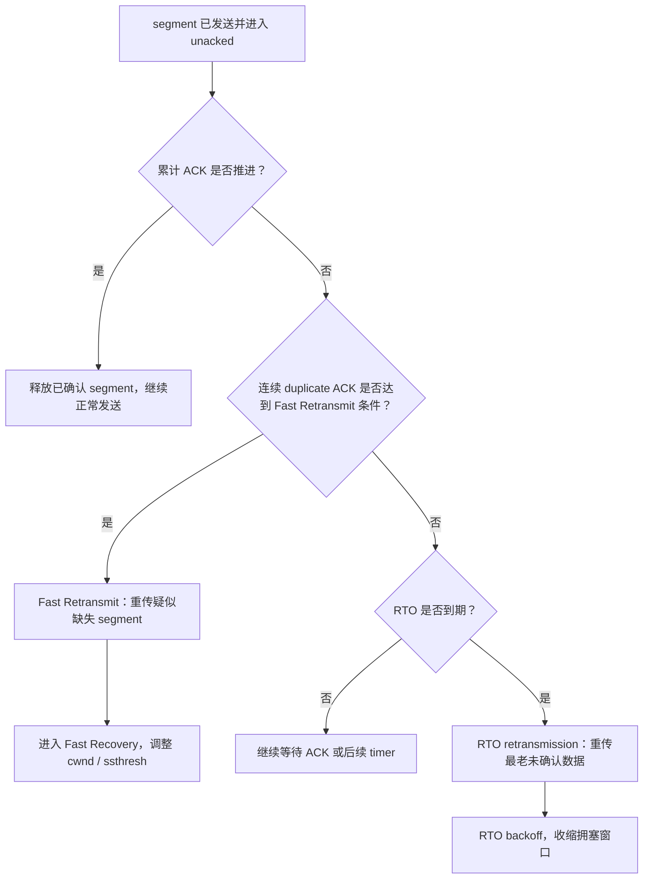
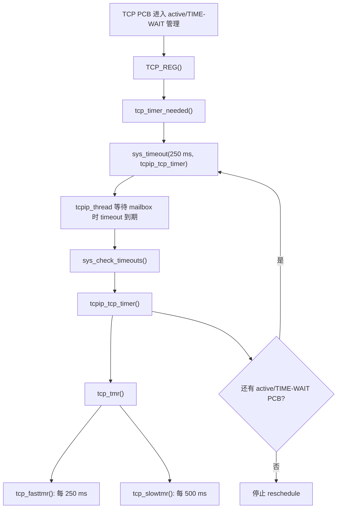
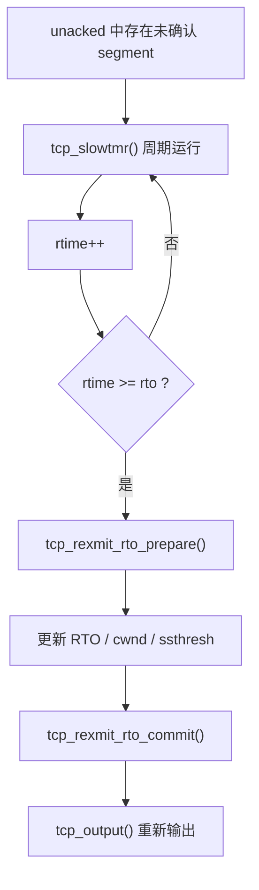
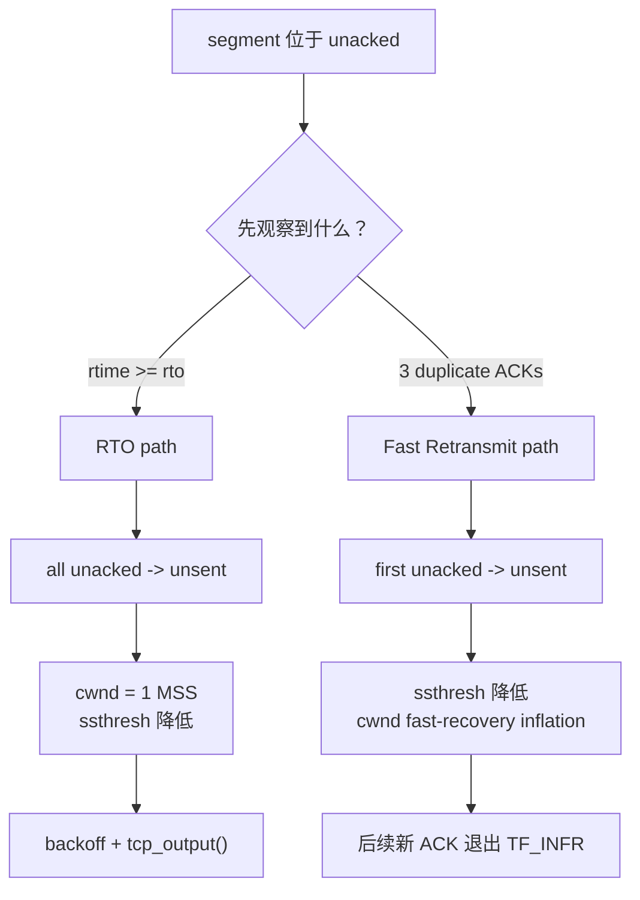

<meta name="referrer" content="no-referrer" />

# 教程 09：从 `tcp_slowtmr()` 到 Fast Retransmit——TCP 超时重传与重复 ACK

> 摘要：沿 lwIP 的 RTO 与 Fast Retransmit 源码路径，映射 RFC 定义的丢包恢复机制到 timer、ACK 判定、发送队列与拥塞控制状态。

[TOC]


Stage 8 已经建立了 TCP（Transmission Control Protocol，传输控制协议）正常发送路径：应用写入的字节被组织成 segment，发送后进入 `unacked`（lwIP 保存“已经发出但尚未被累计确认”的 segment 队列），对端返回累计 ACK（Acknowledgment，确认号）后，已确认 segment 才能释放。Stage 9 研究的是这个正常闭环被“丢包或确认长期不推进”打断后，TCP 怎样判断需要重传，以及 lwIP 用哪些 timer、PCB（Protocol Control Block，协议控制块）字段和队列动作实现恢复。

## 阅读源码前：建议提前阅读

下面资料用于校准协议语义和抓包术语，但不是继续阅读本文的强制前置条件。这里先给出阅读用途：第一份资料讲“如何从往返时延得到重传等待时间”，第二份讲“重复确认怎样触发快速重传与拥塞恢复”，第三份讲 Wireshark 怎样给这些现象打分析标签。后文会在进入源码前把对应术语逐一解释。

1. [RFC 6298 — Computing TCP's Retransmission Timer](https://www.rfc-editor.org/rfc/rfc6298.html)：用于理解 TCP 怎样测量往返时延，并据此决定“等多久仍收不到确认就该重传”；建议重点看等待时间如何更新，以及连续超时为什么要逐步拉长下一次等待。[S4](#source-s4)
2. [RFC 5681 — TCP Congestion Control](https://www.rfc-editor.org/rfc/rfc5681.html)：用于理解“连续收到相同确认号”为什么可作为丢包信号，以及快速重传后 sender 为什么还要进入一段拥塞恢复过程并调整发送窗口。[S5](#source-s5)
3. [Wireshark User's Guide — TCP Analysis](https://www.wireshark.org/docs/wsug_html_chunked/ChAdvTCPAnalysis.html)：用于理解抓包中的 `Retransmission`、`Fast Retransmission`、`Dup ACK` 等分析标签；这些标签是分析器判断，不等同于 lwIP 内部 PCB 状态。[S8](#source-s8)

## 先建立丢包恢复模型：RTO 与 duplicate ACK 是两条不同的证据路径

**RTT（Round-Trip Time，往返时间）**表示一个 TCP segment 发出后，到与它相关的 ACK 返回所经历的往返时延。TCP 不应把重传等待时间写成固定常量，因此会根据 RTT 样本维护 **RTO（Retransmission Timeout，重传超时）**：某批已发送数据在 RTO 内始终没有得到足够的 ACK 推进，就认为“等待已经超过当前网络时延模型能够解释的范围”，进入 timeout retransmission。[S4](#source-s4)

另一条证据来自 **duplicate ACK（重复 ACK）**。TCP 的累计 ACK 表示“这个 ACK 之前的连续 sequence space 已收到，下一步仍然期望 ACK 值指向的 byte”。如果后续数据已经到达，但中间出现一个 gap，receiver 会反复确认同一个 next expected sequence number。连续 duplicate ACK 因而可以在 RTO 到期前暴露“前面很可能缺了一段”。RFC 5681 把第三个 duplicate ACK 作为 Fast Retransmit 的经典触发条件。[S5](#source-s5)

这里还会反复出现两个拥塞控制字段：**`cwnd`（congestion window，拥塞窗口）**限制 sender 因拥塞控制允许同时在途的数据量；**`ssthresh`（slow-start threshold，慢启动阈值）**决定 slow start 与 congestion avoidance 的边界。**Fast Recovery（快速恢复）**是 Fast Retransmit 之后的一段拥塞控制阶段：sender 不必像 timeout 那样完全回到最保守的起点，而是利用仍在返回的 duplicate ACK 维持受控发送，直到新的累计 ACK 证明缺口已经跨过去。丢包既是可靠性问题，也是拥塞信号，因此 timeout 与 Fast Retransmit 都会改变这些字段，但恢复策略不同。[S5](#source-s5)

把两条恢复路径放在同一张协议导航图中：



这张图只描述协议恢复逻辑。进入源码后，关键映射如下：

| 协议动作/状态 | lwIP 关键位置 | 主要对象/字段 | 下一步 |
| --- | --- | --- | --- |
| 已发送但未累计确认 | `tcp_output()` 之后的发送队列 | `pcb->unacked` | 等待 ACK 或 timer |
| RTO 计时推进 | `tcp_slowtmr()` | `rtime`、`rto` | 判断 `rtime >= rto` |
| timeout 重传 | `tcp_rexmit_rto_prepare()` / `tcp_rexmit_rto_commit()` | `unacked`、`unsent`、`nrtx`、`rto_end` | 重新交给 output path |
| duplicate ACK 计数 | `tcp_receive()` | `dupacks` | 达到阈值后触发 fast path |
| Fast Retransmit / Recovery | `tcp_rexmit_fast()` | `TF_INFR`、`cwnd`、`ssthresh` | 等待后续新 ACK 退出 recovery |
| RTT/RTO 更新 | ACK 推进路径 | `rttest`、`rtseq`、`sa`、`sv`、`rto` | 为后续 timeout 提供新的等待尺度 |

下面从这些状态真正落在 lwIP 中的位置开始：`unacked`。

## 1. 重传从 `unacked` 开始

只要 PCB 还有 `unacked` segment，就说明线上存在“已发送但还没被累计确认”的 sequence space。Stage 8 已经看到新 ACK 会释放这些 segment；Stage 9 则研究它们长时间留在这里时发生什么。

`struct tcp_pcb` 中与本篇直接相关的字段包括：[S3](#source-s3)

```c
s16_t rtime;
u32_t rttest;
u32_t rtseq;
s16_t rto;
u8_t nrtx;
u8_t dupacks;
tcpwnd_size_t cwnd;
tcpwnd_size_t ssthresh;
u32_t rto_end;
```

不要把这些字段当成一组“重传参数”平铺记忆。它们分别服务于不同问题：

| 字段 | 当前职责 |
| --- | --- |
| `rtime` | 当前 retransmission timer 已经走了多少 slow-timer tick |
| `rto` | 当前允许等待多少 tick 才判定超时 |
| `nrtx` | 当前 connection 的重传次数状态 |
| `dupacks` | 连续满足 lwIP duplicate-ACK 判定的数量 |
| `cwnd` | congestion-control 允许的发送窗口 |
| `ssthresh` | slow start 与 congestion avoidance 的阈值 |
| `rttest` / `rtseq` | 当前用于估算 Round-Trip Time（往返时间）的测量状态 |
| `rto_end` | 一轮 timeout retransmission 覆盖 sequence space 的右边界 |

其中 `rttest` 是源码字段名，不是另一个协议。它表示“目前是否有一段 sequence 正在做往返时间样本测量”。发生重传后，原 segment 与重传 segment 的 ACK 很难再唯一对应，所以 lwIP 会停止这次测量。[S2](#source-s2)

## 2. `tcp_slowtmr()` 为什么会每 500 ms 运行：TCP timer 从哪里启动

直接从 `tcp_slowtmr()` 开讲会留下一个关键缺口：**谁每 500 ms 调它？timer 又是什么时候注册的？** 当前 lwIP 并没有创建一个独立的 “TCP timer thread”。TCP timer 建立在通用 `sys_timeout()` 调度器上，而且采用 **按需启动**。[S7](#source-s7)

### 2.1 `lwip_init()` 会初始化 timeout 系统，但故意跳过 TCP timer

Stage 2 已经补出了启动链：`tcpip_init()` 先调用 `lwip_init()`，而 `lwip_init()` 在 `LWIP_TIMERS` 开启时调用 `sys_timeouts_init()`。`sys_timeouts_init()` 会把 lwIP 的周期任务注册到 timeout list，但当前源码明确把 TCP 当作特殊项处理：[S7](#source-s7)

下面是 `sys_timeouts_init()` 的上游连续源码片段：

```c
void
sys_timeouts_init(void)
{
  size_t i;
  /* tcp_tmr() at index 0 is started on demand */
  for (i = (LWIP_TCP ? 1 : 0); i < LWIP_ARRAYSIZE(lwip_cyclic_timers); i++) {
    sys_timeout(lwip_cyclic_timers[i].interval_ms,
                lwip_cyclic_timer,
                LWIP_CONST_CAST(void *, &lwip_cyclic_timers[i]));
  }
}
```

当 `LWIP_TCP=1` 时，循环从索引 `1` 开始，因此索引 `0` 的 `tcp_tmr` 不会在 boot 阶段注册。原因也很直接：没有 active/TIME-WAIT TCP PCB 时，让 TCP 每 250 ms 永久唤醒没有必要。

### 2.2 PCB 进入 active/TIME-WAIT 管理后，`TCP_REG()` 才请求启动 timer

TCP PCB 被加入内部 PCB list 时会经过 `TCP_REG()`。当前 macro 的关键动作是把 PCB 挂入链表，然后调用 `tcp_timer_needed()`：[S7](#source-s7)

```c
#define TCP_REG(pcbs, npcb)                        \
  do {                                             \
    (npcb)->next = *pcbs;                          \
    *(pcbs) = (npcb);                              \
    tcp_timer_needed();                            \
  } while (0)
```

`tcp_timer_needed()` 并不是无条件启动 timer。只有 timer 当前关闭，并且 `tcp_active_pcbs` 或 `tcp_tw_pcbs` 至少有一个对象时，才创建第一次 250 ms timeout：[S7](#source-s7)

```c
void
tcp_timer_needed(void)
{
  LWIP_ASSERT_CORE_LOCKED();

  if (!tcpip_tcp_timer_active && (tcp_active_pcbs || tcp_tw_pcbs)) {
    tcpip_tcp_timer_active = 1;
    sys_timeout(TCP_TMR_INTERVAL, tcpip_tcp_timer, NULL);
  }
}
```

`TCP_TMR_INTERVAL` 在当前源码中定义为 `250 ms`。因此第一次进入 active/TIME-WAIT TCP 生命周期时，真正注册的是：

```text
sys_timeout(250 ms, tcpip_tcp_timer, NULL)
```

这里注册的不是“周期硬件定时器”，而是一个 `struct sys_timeo` timeout 节点。Stage 11 会继续展开该节点怎样由 `tcpip_thread` 在 mailbox wait 期间检查和触发。

### 2.3 `tcpip_tcp_timer()` 每次触发后决定“继续 250 ms”还是停止

第一次 250 ms 到期后，通用 timeout scheduler 调用 `tcpip_tcp_timer()`。它先调用 `tcp_tmr()`；如果仍然存在 active/TIME-WAIT PCB，就再注册下一次 250 ms timeout，否则关闭 active flag：[S7](#source-s7)

```c
static void
tcpip_tcp_timer(void *arg)
{
  LWIP_UNUSED_ARG(arg);

  tcp_tmr();

  if (tcp_active_pcbs || tcp_tw_pcbs) {
    sys_timeout(TCP_TMR_INTERVAL, tcpip_tcp_timer, NULL);
  } else {
    tcpip_tcp_timer_active = 0;
  }
}
```

因此 TCP timer 的生命周期与 PCB 生命周期绑定：

```text
没有 active/TIME-WAIT PCB
    -> TCP timer 不运行

出现 active/TIME-WAIT PCB
    -> tcp_timer_needed()
    -> 250 ms timeout

仍有 PCB
    -> callback 自己再注册下一次 250 ms

最后一个 active/TIME-WAIT PCB 消失
    -> 不再 reschedule
    -> timer 停止
```

### 2.4 `tcp_tmr()` 以 250 ms 为基础，再把 slow timer 降频到 500 ms

250 ms timeout 到期后并不是直接调用 `tcp_slowtmr()`，而是先进入 `tcp_tmr()`：[S1](#source-s1)

```c
void
tcp_tmr(void)
{
  tcp_fasttmr();

  if (++tcp_timer & 1) {
    tcp_slowtmr();
  }
}
```

所以当前节奏是：

- `tcpip_tcp_timer()`：每 250 ms 一次，只要 TCP PCB 仍需要 timer；
- `tcp_tmr()`：每次 250 ms callback 都进入；
- `tcp_fasttmr()`：每 250 ms 执行；
- `tcp_slowtmr()`：每隔一次 `tcp_tmr()` 执行，即每 500 ms 一次。[S1](#source-s1)[S7](#source-s7)



这条链解释了本篇后面那句“`tcp_slowtmr()` 每 500 ms 被 TCP timer 驱动一次”的完整来源：**它不是 OS 单独创建的 500 ms timer，也不是独立线程，而是 lwIP 通用 timeout list 中一个按需 250 ms 自重排 callback，再由 `tcp_tmr()` 每隔一次分派到 slow timer。**[S7](#source-s7)

## 3. `tcp_slowtmr()` 才是 timeout 判定入口

Stage 8 已经建立 `unacked`：它保存“已经交给输出路径、但累计 ACK 还没有越过其 sequence space”的 segment。真正决定“等多久算超时”的入口不在 `tcp_output()`，而在周期性运行的 `tcp_slowtmr()`。[S1](#source-s1)

下面开始直接读当前 revision 的实现。以下代码按本文约定作为执行路径阅读版展示：保留本节所需的真实语句与顺序，不用省略号伪装成完整函数；与本节无关的 persist timer、PCB 删除等分支放在代码块之外说明。

`tcp_slowtmr()` 每 500 ms 被 TCP timer 驱动一次。对 active PCB，它先推进 `rtime`，再和当前 `rto` 比较：[S1](#source-s1)

```c
/* Increase the retransmission timer if it is running */
if ((pcb->rtime >= 0) && (pcb->rtime < 0x7FFF)) {
  ++pcb->rtime;
}

if (pcb->rtime >= pcb->rto) {
  /* Time for a retransmission. */
  LWIP_DEBUGF(TCP_RTO_DEBUG, ("tcp_slowtmr: rtime %"S16_F
                              " pcb->rto %"S16_F"\n",
                              pcb->rtime, pcb->rto));
  /* If prepare phase fails but we have unsent data but no unacked data,
     still execute the backoff calculations below, as this means we somehow
     failed to send segment. */
  if ((tcp_rexmit_rto_prepare(pcb) == ERR_OK) ||
      ((pcb->unacked == NULL) && (pcb->unsent != NULL))) {
```

这里要把三个量分开：

- `rtime`：已经等待了多少个 slow-timer tick；
- `rto`：本轮允许等待多少 tick；
- `unacked`：还有哪些已发送 sequence space 没被累计确认。

因此 RTO 不是“某个 packet 自带一个倒计时”。timer 属于 PCB；只要还有需要等待确认的数据，`rtime` 就持续推进。达到 `rto` 后才进入 `tcp_rexmit_rto_prepare()`。



这里的 **RTO** 是 Retransmission Timeout。它与 Ethernet half-duplex 的 CSMA/CD binary exponential backoff 完全不是一件事：前者是 lwIP TCP 软件层的超时恢复，后者属于 Ethernet MAC 介质访问机制，通常由 MAC 硬件完成。[S1](#source-s1)[S4](#source-s4)

## 4. 为什么 RTO 分成 `prepare()` 和 `commit()`

`tcp_rexmit_rto_prepare()` 的第一件事不是“立刻发包”，而是先把发送队列重新组织成可重传状态。[S2](#source-s2)

```c
err_t
tcp_rexmit_rto_prepare(struct tcp_pcb *pcb)
{
  struct tcp_seg *seg;

  LWIP_ASSERT("tcp_rexmit_rto_prepare: invalid pcb", pcb != NULL);

  if (pcb->unacked == NULL) {
    return ERR_VAL;
  }

  for (seg = pcb->unacked; seg->next != NULL; seg = seg->next) {
    if (tcp_output_segment_busy(seg)) {
      LWIP_DEBUGF(TCP_RTO_DEBUG, ("tcp_rexmit_rto: segment busy\n"));
      return ERR_VAL;
    }
  }
  if (tcp_output_segment_busy(seg)) {
    LWIP_DEBUGF(TCP_RTO_DEBUG, ("tcp_rexmit_rto: segment busy\n"));
    return ERR_VAL;
  }

  seg->next = pcb->unsent;
  pcb->unsent = pcb->unacked;
  pcb->unacked = NULL;

  tcp_set_flags(pcb, TF_RTO);
  pcb->rto_end = lwip_ntohl(seg->tcphdr->seqno) + TCP_TCPLEN(seg);
  pcb->rttest = 0;

  return ERR_OK;
}
```

进入前假设：

```text
unacked:  A -> B -> C
unsent:   D -> E
```

prepare 成功后：

```text
unacked:  NULL
unsent:   A -> B -> C -> D -> E
```

这段代码还暴露了一个容易忽略的驱动边界：`tcp_output_segment_busy(seg)` 会检查 segment 是否仍被 deferred-transmission 的 netif driver 引用。如果底层驱动还没有释放这块发送数据，lwIP 不会为了 RTO 再把同一批 buffer 继续压给链路层。

队列重排之后，`TF_RTO` 记录“当前处于 RTO recovery”，`rto_end` 记录这轮 recovery 覆盖到的 sequence 边界，而 `rttest = 0` 停止当前 RTT sample。发生重传后，一个 ACK 已经无法唯一说明它确认的是原始发送还是重传副本，因此不能继续把这个 ACK 当成无歧义 RTT 样本。

## 5. lwIP 怎样落实 timeout 后的拥塞窗口收缩

`tcp_slowtmr()` 在 prepare 与 commit 之间修改 congestion-control 状态：[S1](#source-s1)

```text
eff_wnd = min(cwnd, snd_wnd)
ssthresh = eff_wnd / 2
ssthresh 最低保持 2 * MSS
cwnd = 1 * MSS
```

因此 timeout 不是纯粹的“把旧 segment 再发一遍”。TCP 把它视为更强的 congestion signal：

```text
发生超时
  ↓
降低 ssthresh
  ↓
cwnd 回到一个 MSS
  ↓
重新输出待确认数据
```

`cwnd` 与 `snd_wnd` 的区别在 Stage 8 已经建立：前者由本地 congestion control 管理，后者来自 peer 的 flow-control advertisement。这里取两者较小值来形成 loss 后的阈值基础。[S1](#source-s1)[S5](#source-s5)

## 6. lwIP 怎样把 RFC 6298 的 RTO backoff 落到 `rto`

prepare 成功后，`tcp_slowtmr()` 不会沿用第一次 timeout 的等待长度。当前代码根据 `nrtx` 选择 `tcp_backoff[]` 中的指数，并把平滑 RTT 基值左移相应位数：[S1](#source-s1)

```c
if (pcb->state != SYN_SENT) {
  u8_t backoff_idx = LWIP_MIN(pcb->nrtx, sizeof(tcp_backoff) - 1);
  int calc_rto = ((pcb->sa >> 3) + pcb->sv) << tcp_backoff[backoff_idx];
  pcb->rto = (s16_t)LWIP_MIN(calc_rto, 0x7FFF);
}

/* Reset the retransmission timer. */
pcb->rtime = 0;

/* Reduce congestion window and ssthresh. */
eff_wnd = LWIP_MIN(pcb->cwnd, pcb->snd_wnd);
pcb->ssthresh = eff_wnd >> 1;
if (pcb->ssthresh < (tcpwnd_size_t)(pcb->mss << 1)) {
  pcb->ssthresh = (tcpwnd_size_t)(pcb->mss << 1);
}
pcb->cwnd = pcb->mss;
pcb->bytes_acked = 0;

tcp_rexmit_rto_commit(pcb);
```

这段代码把 timeout 后的四件事连在一起：

1. 用 `nrtx` 选择更大的 RTO backoff；
2. `rtime = 0`，从新的 RTO 重新开始计时；
3. 把 `ssthresh` 收缩到有效窗口的一半、`cwnd` 收回一个 MSS；
4. 最后才 commit 并重新输出。

因此这里的 backoff 是 **TCP RTO backoff**。它解决的是“TCP 已经多次得不到 ACK，应降低重试频率并收缩拥塞窗口”，不是 Ethernet 介质层的碰撞退避。[S4](#source-s4)[S5](#source-s5)

## 7. `tcp_rexmit_rto_commit()` 才真正推进这轮重传

commit 本身很短，但它正好说明 prepare/commit 为什么要拆开：[S2](#source-s2)

```c
void
tcp_rexmit_rto_commit(struct tcp_pcb *pcb)
{
  LWIP_ASSERT("tcp_rexmit_rto_commit: invalid pcb", pcb != NULL);

  if (pcb->nrtx < 0xFF) {
    ++pcb->nrtx;
  }
  tcp_output(pcb);
}
```

`tcp_rexmit_rto_prepare()` 只负责把 `unacked` 重新排进 `unsent` 并建立 RTO recovery 状态；`tcp_slowtmr()` 在两者之间先调整 `rto/cwnd/ssthresh`；`tcp_rexmit_rto_commit()` 最后增加重传次数并调用正常的 `tcp_output()`。

这样重新发送的数据仍然受到 Stage 8 已经读过的正常发送窗口规则约束，而不是绕过 `cwnd` / `snd_wnd` 直接把所有旧 segment 一次性发出去。

到这里，RTO timeout 这条恢复路径已经闭环：timer 判断超时，`prepare()`/`commit()` 重排发送队列，并同步更新重传与拥塞状态。下面切换到协议总图中的另一条 loss signal——**duplicate ACK**；这条路径不等待 RTO 到期，而是根据 ACK 序列提前推断 gap。

## 8. Duplicate ACK 是另一种 loss signal

timeout 的证据是“等得够久”；Fast Retransmit 的证据则来自接收端持续返回相同累计 ACK。真正的判定代码位于 `tcp_receive()`，并不是简单比较一次 `ackno == lastack`。[S6](#source-s6)

```c
/* Clause 1 */
if (TCP_SEQ_LEQ(ackno, pcb->lastack)) {
  /* Clause 2 */
  if (tcplen == 0) {
    /* Clause 3 */
    if (pcb->snd_wl2 + pcb->snd_wnd == right_wnd_edge) {
      /* Clause 4 */
      if (pcb->rtime >= 0) {
        /* Clause 5 */
        if (pcb->lastack == ackno) {
          if ((u8_t)(pcb->dupacks + 1) > pcb->dupacks) {
            ++pcb->dupacks;
          }
          if (pcb->dupacks > 3) {
            TCP_WND_INC(pcb->cwnd, pcb->mss);
          }
          if (pcb->dupacks >= 3) {
            tcp_rexmit_fast(pcb);
          }
        }
      }
    }
  }
}
```

这五层条件对应：ACK 没有确认新数据、segment 没 payload、advertised window 没变化、确实有 outstanding data、ACK number 等于当前累计 ACK 边界。全部成立才增加 `dupacks`。

因此“抓包里看见两个相同 ACK number”还不能直接等价于 lwIP 内部 `dupacks == 2`。必须同时满足这里的其他条件。

## 9. 第三个 duplicate ACK 为什么进入 Fast Retransmit

达到阈值后，`tcp_receive()` 调用 `tcp_rexmit_fast()`。后者先通过 `tcp_rexmit()` 把**第一个** `unacked` segment 重新插回按 sequence 排序的 `unsent`，再改变 congestion-control 状态。[S2](#source-s2)

```c
err_t
tcp_rexmit(struct tcp_pcb *pcb)
{
  struct tcp_seg *seg;
  struct tcp_seg **cur_seg;

  LWIP_ASSERT("tcp_rexmit: invalid pcb", pcb != NULL);

  if (pcb->unacked == NULL) {
    return ERR_VAL;
  }

  seg = pcb->unacked;
  if (tcp_output_segment_busy(seg)) {
    return ERR_VAL;
  }

  pcb->unacked = seg->next;

  cur_seg = &(pcb->unsent);
  while (*cur_seg &&
         TCP_SEQ_LT(lwip_ntohl((*cur_seg)->tcphdr->seqno),
                    lwip_ntohl(seg->tcphdr->seqno))) {
    cur_seg = &((*cur_seg)->next);
  }
  seg->next = *cur_seg;
  *cur_seg = seg;

  if (pcb->nrtx < 0xFF) {
    ++pcb->nrtx;
  }
  pcb->rttest = 0;
  MIB2_STATS_INC(mib2.tcpretranssegs);
  return ERR_OK;
}
```

注意这个函数末尾**没有**调用 `tcp_output()`。源码注释说明它总是从 `tcp_input()` 路径触发；当前 input processing 结束时会统一尝试输出，因此这里先完成队列重排即可。

`tcp_rexmit_fast()` 随后建立 fast-recovery 状态：[S2](#source-s2)

```c
if (pcb->unacked != NULL && !(pcb->flags & TF_INFR)) {
  if (tcp_rexmit(pcb) == ERR_OK) {
    pcb->ssthresh = LWIP_MIN(pcb->cwnd, pcb->snd_wnd) / 2;

    if (pcb->ssthresh < (2U * pcb->mss)) {
      pcb->ssthresh = 2 * pcb->mss;
    }

    pcb->cwnd = pcb->ssthresh + 3 * pcb->mss;
    tcp_set_flags(pcb, TF_INFR);
    pcb->rtime = 0;
  }
}
```

这里和 RTO 的队列动作有本质区别：RTO prepare 把**全部** `unacked` 合回 `unsent`；Fast Retransmit 首先重排第一个 `unacked`。`TF_INFR` 防止同一个 recovery episode 重复执行首次 fast retransmit。

## 10. 两种标准 recovery 在 lwIP 中落到不同队列动作

| 维度 | RTO | Fast Retransmit |
| --- | --- | --- |
| 触发证据 | 等待时间达到 `rto` | 至少 3 个满足条件的 duplicate ACK |
| 入口 | `tcp_slowtmr()` | `tcp_receive()` |
| 初始重传范围 | 将全部 `unacked` 重新并回 `unsent` | 先重排第一个 `unacked` segment |
| `cwnd` | 降到 1 MSS | 进入 fast-recovery inflation |
| `ssthresh` | 取有效窗口的一半，最低 2 MSS | 同样按窗口一半并设最低值 |
| 时间信息 | 发生 backoff；停止当前往返时间 sample | 重置 `rtime`，避免马上又 RTO |

所以看到“同一个 SEQ 又发送了一次”只能证明发生了 retransmission，不能单凭这一帧判断到底是 timeout 还是 fast retransmit。必须结合 ACK 序列和 PCB 状态判断。

RTO retransmission 与 Fast Retransmit 两条重传触发路径到这里都已经出现。最后还需要回到它们共同依赖的时间尺度：ACK 正常推进时，lwIP 怎样从 RTT 样本重新计算后续 `rto`。

## 11. lwIP 的 RTT estimator 如何回到 `rto`

TCP 不能把每条网络路径都假设成固定延迟。lwIP PCB 保存平滑后的往返时间估计状态 `sa`、variation 状态 `sv`，并据此得到正常情况下的 `rto`；新 ACK 推进时会重置 `rto` 到由这些估计推导的值。[S3](#source-s3)[S6](#source-s6)

RFC 6298 给出了 TCP retransmission timer 的标准算法要求与 backoff 原则。[S4](#source-s4)

这里最重要的不是背具体公式，而是理解因果：

```text
测得一次可信的 Round-Trip Time sample
        ↓
更新平滑估计
        ↓
形成后续 retransmission timeout

发生 retransmission
        ↓
ACK 来源变得 ambiguous
        ↓
当前 sample 停止
```

这就是 `rttest = 0` 出现在重传路径中的原因。

## 12. 一次 loss episode 的两条源码路径



Stage 10 会继续研究另一类 ACK 现象的来源：如果接收端实际收到了更靠后的 sequence，但是中间出现 gap，它为什么能生成重复 ACK，以及 `ooseq`/SACK 怎样记录“哪些数据其实已经到达”。

## 资料来源

<a id="source-s1"></a>
### [S1] TCP slow timer 与 timeout policy
- 版本：`d08f4773edd0182b7910fc8f046eed82ffcd67c9`
- URL/文档：[`src/core/tcp.c`](https://github.com/lwip-tcpip/lwip/blob/d08f4773edd0182b7910fc8f046eed82ffcd67c9/src/core/tcp.c)
- 使用位置：`tcp_slowtmr()`、`rtime >= rto`、backoff、`cwnd`/`ssthresh` 收缩
- 支撑内容：当前 lwIP timeout 触发与恢复顺序

<a id="source-s2"></a>
### [S2] TCP retransmission 输出实现
- 版本：`d08f4773edd0182b7910fc8f046eed82ffcd67c9`
- URL/文档：[`src/core/tcp_out.c`](https://github.com/lwip-tcpip/lwip/blob/d08f4773edd0182b7910fc8f046eed82ffcd67c9/src/core/tcp_out.c)
- 使用位置：RTO prepare/commit、`tcp_rexmit()`、`tcp_rexmit_fast()`
- 支撑内容：`unacked`/`unsent` 重排、`TF_RTO`/`TF_INFR`、fast retransmit 的窗口变化

<a id="source-s3"></a>
### [S3] TCP PCB retransmission 字段
- 版本：`d08f4773edd0182b7910fc8f046eed82ffcd67c9`
- URL/文档：[`src/include/lwip/tcp.h`](https://github.com/lwip-tcpip/lwip/blob/d08f4773edd0182b7910fc8f046eed82ffcd67c9/src/include/lwip/tcp.h)
- 使用位置：`rtime`、`rto`、`rttest`、`rtseq`、`nrtx`、`dupacks`、`cwnd`、`ssthresh`
- 支撑内容：当前 PCB 保存的 retransmission/measurement/congestion 状态

<a id="source-s4"></a>
### [S4] RFC 6298 — TCP Retransmission Timer
- URL/文档：[RFC 6298 — Computing TCP's Retransmission Timer](https://www.rfc-editor.org/rfc/rfc6298.html)
- 使用位置：RTO、Round-Trip Time estimator 与 timeout backoff
- 支撑内容：TCP retransmission timer 的标准算法与 backoff 约束

<a id="source-s5"></a>
### [S5] RFC 5681 — TCP Congestion Control
- URL/文档：[RFC 5681 — TCP Congestion Control](https://www.rfc-editor.org/rfc/rfc5681.html)
- 使用位置：`cwnd`、`ssthresh`、fast retransmit / fast recovery
- 支撑内容：slow start、congestion avoidance、fast retransmit/recovery 的协议算法背景

<a id="source-s6"></a>
### [S6] TCP ACK 与 duplicate-ACK 处理
- 版本：`d08f4773edd0182b7910fc8f046eed82ffcd67c9`
- URL/文档：[`src/core/tcp_in.c`](https://github.com/lwip-tcpip/lwip/blob/d08f4773edd0182b7910fc8f046eed82ffcd67c9/src/core/tcp_in.c)
- 使用位置：duplicate ACK 判定、新 ACK、`TF_INFR` 退出与 RTO reset
- 支撑内容：`tcp_receive()` 如何区分重复 ACK 与推进 ACK，并触发 fast retransmit

<a id="source-s7"></a>
### [S7] lwIP timeout scheduler 与 TCP timer 按需启动
- 版本：`d08f4773edd0182b7910fc8f046eed82ffcd67c9`
- URL/文档：[`src/core/timeouts.c`](https://github.com/lwip-tcpip/lwip/blob/d08f4773edd0182b7910fc8f046eed82ffcd67c9/src/core/timeouts.c)、[`src/include/lwip/priv/tcp_priv.h`](https://github.com/lwip-tcpip/lwip/blob/d08f4773edd0182b7910fc8f046eed82ffcd67c9/src/include/lwip/priv/tcp_priv.h)
- 使用位置：`sys_timeouts_init()` 跳过 TCP、`TCP_REG()`、`tcp_timer_needed()`、`tcpip_tcp_timer()`、250 ms reschedule
- 支撑内容：证明 TCP timer 不是 boot 时永久启动，也没有独立 timer thread，而是 active/TIME-WAIT PCB 出现后通过通用 timeout scheduler 按需运行
<a id="source-s8"></a>
### [S8] Wireshark TCP Analysis
- URL/文档：[Wireshark User's Guide — TCP Analysis](https://www.wireshark.org/docs/wsug_html_chunked/ChAdvTCPAnalysis.html)
- 使用位置：源码前抓包前置阅读、Retransmission/Fast Retransmission/Dup ACK/Out-Of-Order 标签的边界说明
- 支撑内容：Wireshark 对 TCP analysis flags 的识别条件；用于帮助把抓包现象与 RFC/lwIP 状态分层，不作为 lwIP 内部状态的直接证据

