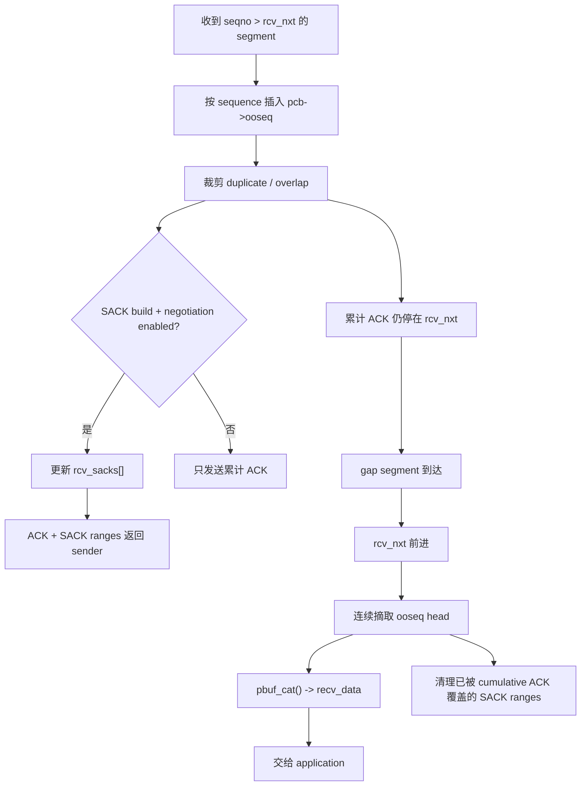

<meta name="referrer" content="no-referrer" />

# 教程 10：从 `tcp_receive()` 到 `ooseq` / SACK——TCP 乱序、重组与选择确认

> 摘要：从 seqno 大于 rcv_nxt 的真实接收条件出发，理解 lwIP 如何保存乱序 segment、裁剪重叠、在 gap 补齐后重组连续数据，以及 SACK 如何反馈已收到的离散 range。

[TOC]

本文源码块采用统一约定：除非代码块前明确标注为“上游连续源码片段”，其余 C 代码块一律视为按当前 revision 裁剪的“执行路径阅读版”。阅读版只删除与当前主线无关的注释、条件编译或旁支，不重排保留语句，也不使用省略号伪装缺失源码；示意代码会另行标注。

Stage 9 看到 duplicate ACK 可以触发 Fast Retransmit，但还没有回答一个更靠近接收端的问题：**为什么 receiver 会不断 ACK 同一个 `rcv_nxt`？**

一个常见原因是：更靠后的 TCP data 已经到达，但中间有一段 sequence gap。TCP 不能把 gap 后的数据直接当作连续 byte stream 交给 application，所以当前 lwIP 在 `TCP_QUEUE_OOSEQ=1` 时把它先放进 `pcb->ooseq`。[S1](#source-s1)[S2](#source-s2)

## 1. 从 `tcp_receive()` 的真实分支开始：先判断是不是 `rcv_nxt`

Stage 8 已经看到 `tcp_input()` 把 TCP header 从 `p->payload` 前端移走，并把解析后的 `inseg` 交给 `tcp_process()`；连接处于 `ESTABLISHED` 时，后者继续调用 `tcp_receive()`。因此 Stage 10 不从抽象的“乱序包”开始，而直接从 `tcp_receive()` 的 sequence-window 判断继续读。[S1](#source-s1)

这里先按执行路径阅读版看进入 receive window 后最关键的二分；保留语句来自当前 upstream revision，省去与本节无关的注释和旁支：[S1](#source-s1)

```c
if (TCP_SEQ_BETWEEN(seqno, pcb->rcv_nxt,
                    pcb->rcv_nxt + pcb->rcv_wnd - 1)) {
  if (pcb->rcv_nxt == seqno) {
    /* The incoming segment is the next in sequence. We check if
       we have to trim the end of the segment and update rcv_nxt
       and pass the data to the application. */
    tcplen = TCP_TCPLEN(&inseg);
```

`seqno == pcb->rcv_nxt` 表示 incoming segment 正好从“下一个期望 byte”开始，这是正常 in-sequence 路径。相反，只要 segment 仍在 receive window 内但 `seqno != rcv_nxt`，控制流最终会落到同一个大分支的 `else`，也就是 out-of-sequence 处理。

例如：

```text
pcb->rcv_nxt = 1000
incoming seq = 1500
```

说明 `[1000,1500)` 仍有缺口。虽然 `[1500,... )` 已经到达本机，TCP 对 application 暴露的是有序 byte stream，所以这段数据暂时不能通过 receive callback 交上去。[S3](#source-s3)

这个判断很重要：`ooseq` 并不是网卡发现 packet arrival order 不连续后建立的，而是 **TCP Core 在解析出 sequence number、与 PCB 的 `rcv_nxt` 比较之后** 才决定使用的重组队列。

## 2. `ooseq` 是什么：按 sequence 排序的待重组 segment list

`struct tcp_pcb` 在 `TCP_QUEUE_OOSEQ` 开启时保存：[S4](#source-s4)

```c
struct tcp_seg *ooseq;
```

`ooseq` 可以读作 out-of-sequence queue。它保存的是 `struct tcp_seg` 链表，按 sequence number 组织已经收到、但还不能形成从 `rcv_nxt` 开始连续数据的数据段。[S1](#source-s1)

它不是“第二个 socket receive buffer”，也不是 SACK 本身。

| 对象 | 位于哪里 | 保存什么 |
| --- | --- | --- |
| `ooseq` | receiver 的 lwIP PCB 内部 | 实际收到的乱序 segment/pbuf |
| `rcv_nxt` | receiver PCB | 下一个必须连续出现的 sequence number |
| SACK ranges | receiver PCB + TCP option | 告诉 sender 哪些离散 sequence range 已经收到 |

先有内部乱序数据，才可能需要对外产生 SACK feedback；两者不能互换。

## 3. 第一条乱序 segment：代码在哪里建立 `ooseq`

顺着上节的外层 `if` 往后读，`pcb->rcv_nxt != seqno` 会进入下面这个执行路径阅读版所示的真实分支：[S1](#source-s1)

```c
} else {
  /* We get here if the incoming segment is out-of-sequence. */

#if TCP_QUEUE_OOSEQ
  /* We queue the segment on the ->ooseq queue. */
  if (pcb->ooseq == NULL) {
    pcb->ooseq = tcp_seg_copy(&inseg);
#if LWIP_TCP_SACK_OUT
    if (pcb->flags & TF_SACK) {
      pcb->rcv_sacks[0].left = seqno;
      pcb->rcv_sacks[0].right = seqno + inseg.len;
    }
#endif /* LWIP_TCP_SACK_OUT */
  } else {
```

第一条乱序 segment 到来时，`tcp_seg_copy(&inseg)` 复制的是 `struct tcp_seg` 元数据并建立队列节点；对应 pbuf 会由这个 segment 节点继续引用。此时 `rcv_nxt` **不会**因为“数据已经物理到达”而跳到 1500，因为 `[1000,1500)` 仍然没有连续覆盖。

```text
rcv_nxt = 1000
incoming = [1500, 2000)

pcb->ooseq
    ↓
[1500, 2000)
```

若 SACK 已经在握手阶段协商并启用，同一位置还会记录第一个 SACK range；但 `ooseq` 保存实际数据，`rcv_sacks[]` 保存给 peer 的反馈范围，两者职责不同。

## 4. 第二条乱序 segment 到来：源码怎样找到插入位置

当 `pcb->ooseq != NULL`，代码不是 append，而是按 sequence number 遍历链表。下面的执行路径阅读版保留两种最重要的插入情况：incoming 与已有节点同起点，以及 incoming 落在 `prev` 与 `next` 之间。[S1](#source-s1)

```c
struct tcp_seg *next, *prev = NULL;
for (next = pcb->ooseq; next != NULL; next = next->next) {
  if (seqno == next->tcphdr->seqno) {
    if (inseg.len > next->len) {
      struct tcp_seg *cseg;

      if (next->next == NULL) {
        break;
      }

      cseg = tcp_seg_copy(&inseg);
      if (cseg != NULL) {
        if (prev != NULL) {
          prev->next = cseg;
        } else {
          pcb->ooseq = cseg;
        }
        tcp_oos_insert_segment(cseg, next);
      }
      break;
    } else {
      break;
    }
  } else {
    if (prev == NULL) {
      if (TCP_SEQ_LT(seqno, next->tcphdr->seqno)) {
        struct tcp_seg *cseg = tcp_seg_copy(&inseg);
        if (cseg != NULL) {
          pcb->ooseq = cseg;
          tcp_oos_insert_segment(cseg, next);
        }
        break;
      }
    } else {
```

这里已经能看到两个 invariant：

1. 链表按 TCP sequence number 排序，而不是 arrival time；
2. 相同 `seqno` 时不会无条件同时保留两个节点，而是比较 coverage，再决定保留哪个。

真正的 overlap 裁剪由下一节的 `tcp_oos_insert_segment()` 与插入点前一节点处理。

## 5. `tcp_oos_insert_segment()` 怎样处理 overlap

这个 helper 接收“准备插入的新节点 `cseg`”和“它后面的第一个旧节点 `next`”。源码直接体现两种处理：新节点完全覆盖后继节点时释放旧节点；只覆盖后继开头时裁短新节点。[S1](#source-s1)

```c
static void
tcp_oos_insert_segment(struct tcp_seg *cseg, struct tcp_seg *next)
{
  struct tcp_seg *old_seg;

  LWIP_ASSERT("tcp_oos_insert_segment: invalid cseg", cseg != NULL);

  if (TCPH_FLAGS(cseg->tcphdr) & TCP_FIN) {
    tcp_segs_free(next);
    next = NULL;
  } else {
    while (next &&
           TCP_SEQ_GEQ((seqno + cseg->len),
                       (next->tcphdr->seqno + next->len))) {
      if (TCPH_FLAGS(next->tcphdr) & TCP_FIN) {
        TCPH_SET_FLAG(cseg->tcphdr, TCP_FIN);
      }
      old_seg = next;
      next = next->next;
      tcp_seg_free(old_seg);
    }
    if (next &&
        TCP_SEQ_GT(seqno + cseg->len, next->tcphdr->seqno)) {
      cseg->len = (u16_t)(next->tcphdr->seqno - seqno);
      pbuf_realloc(cseg->p, cseg->len);
    }
  }
  cseg->next = next;
}
```

例如：

```text
new  = [1200, 2000)
next = [1400, 1600)
```

`next` 完全被覆盖，因此可以释放。如果是：

```text
new  = [1200, 1700)
next = [1600, 2000)
```

则 `cseg->len` 被裁到 1600，`pbuf_realloc()` 同步缩短这个 pbuf 的有效数据视图。这里再次把 Stage 3 的 `pbuf` 长度语义和 TCP sequence 重组连接起来：**TCP overlap 裁剪最终会落到 pbuf 的有效长度变化上。**

## 6. 前一个 segment 与新 segment 重叠也要处理

新 segment 与 `next` 的 overlap 由 helper 处理；但它还可能和插入点前面的 `prev` 重叠。`tcp_receive()` 在“incoming 落在 prev 与 next 之间”的分支先裁剪 `prev`，再调用 helper 处理右边：[S1](#source-s1)

```c
if (TCP_SEQ_BETWEEN(seqno, prev->tcphdr->seqno + 1,
                    next->tcphdr->seqno - 1)) {
  struct tcp_seg *cseg = tcp_seg_copy(&inseg);
  if (cseg != NULL) {
    if (TCP_SEQ_GT(prev->tcphdr->seqno + prev->len, seqno)) {
      prev->len = (u16_t)(seqno - prev->tcphdr->seqno);
      pbuf_realloc(prev->p, prev->len);
    }
    prev->next = cseg;
    tcp_oos_insert_segment(cseg, next);
  }
  break;
}
```

例如：

```text
prev = [1200,1700)
in   = [1600,2100)
```

插入前先把 `prev` 裁成 `[1200,1600)`，然后新节点负责从 1600 往后覆盖。于是 `ooseq` 的关键 invariant 可以落到真实代码上：**按 sequence 排序，并通过左右两边的裁剪尽量消除重复 sequence space。**

## 7. Gap 补齐后，为什么可以一次把多段数据交给 application

当缺口前沿终于收到 in-sequence segment，`tcp_receive()` 先推进 `rcv_nxt`；随后不是等下一次 packet arrival，而是立即检查 `ooseq` 队头是否正好接在新的 `rcv_nxt` 上。[S1](#source-s1)

```c
pcb->rcv_nxt = seqno + tcplen;

LWIP_ASSERT("tcp_receive: tcplen > rcv_wnd", pcb->rcv_wnd >= tcplen);
pcb->rcv_wnd -= tcplen;

tcp_update_rcv_ann_wnd(pcb);

if (inseg.p->tot_len > 0) {
  recv_data = inseg.p;
  inseg.p = NULL;
}

#if TCP_QUEUE_OOSEQ
while (pcb->ooseq != NULL &&
       pcb->ooseq->tcphdr->seqno == pcb->rcv_nxt) {

  struct tcp_seg *cseg = pcb->ooseq;
  seqno = pcb->ooseq->tcphdr->seqno;

  pcb->rcv_nxt += TCP_TCPLEN(cseg);
  LWIP_ASSERT("tcp_receive: ooseq tcplen > rcv_wnd",
              pcb->rcv_wnd >= TCP_TCPLEN(cseg));
  pcb->rcv_wnd -= TCP_TCPLEN(cseg);

  tcp_update_rcv_ann_wnd(pcb);
```

这段代码把“gap 补齐”变成了明确的状态变化：

```text
rcv_nxt = 1000
已有 ooseq: [1500,2000) -> [2000,2500)
收到 [1000,1500)

rcv_nxt: 1000 -> 1500
                 ↓ 队头正好连续
          1500 -> 2000
                 ↓ 下一节点继续连续
          2000 -> 2500
```

同一个 `while` 循环会把已经变成连续的多个节点一次性消费，因此 application 不需要逐个看到此前的乱序 arrival。

## 8. `pbuf_cat()` 在这里做的是数据视图重组

继续上一节同一个 `while`，当刚刚变成连续的 `cseg` 带 payload 时，lwIP 把它接到准备交给 application 的 `recv_data`：[S1](#source-s1)

```c
if (cseg->p->tot_len > 0) {
  if (recv_data) {
    pbuf_cat(recv_data, cseg->p);
  } else {
    recv_data = cseg->p;
  }
  cseg->p = NULL;
}

if (TCPH_FLAGS(cseg->tcphdr) & TCP_FIN) {
  recv_flags |= TF_GOT_FIN;
  if (pcb->state == ESTABLISHED) {
    pcb->state = CLOSE_WAIT;
  }
}

pcb->ooseq = cseg->next;
tcp_seg_free(cseg);
```

`cseg->p = NULL` 是 ownership 转移的关键证据：pbuf 已并入 `recv_data`，随后 `tcp_seg_free(cseg)` 只能释放 segment metadata，不能再释放已经交给 receive-data chain 的 pbuf。

这也是为什么只写“gap 补齐后把数据交给应用”不够。真实过程同时发生了：

1. `rcv_nxt` 前移；
2. `rcv_wnd` 扣减；
3. `ooseq` 节点出队；
4. pbuf chain 通过 `pbuf_cat()` 重组；
5. pbuf ownership 从 `tcp_seg` 转向 `recv_data`；
6. 最终在 `tcp_input()` 返回前通过 `TCP_EVENT_RECV()` 交给 application callback。

## 9. FIN 也参与 sequence ordering

FIN 没有普通 payload，但和 SYN 一样占用一个 sequence number。[S3](#source-s3)

因此乱序队列不能只按 `seg->len` 理解 sequence coverage。lwIP 使用 `TCP_TCPLEN(seg)` 把 payload length 与 SYN/FIN 占用的 sequence space 一起计算。[S1](#source-s1)

如果一个带 FIN 的 segment 提前到达，它也必须等前面的 gap 补齐后，connection state 才能按正确顺序进入 `CLOSE_WAIT` 等关闭状态。

这就是为什么 TCP sequence ordering 管的是协议 sequence space，不只是 application payload bytes。

## 10. 乱序到达为什么会产生重复 ACK

接收端虽然缓存了后面的数据，但累计 ACK 不能越过 gap。因此：

```text
rcv_nxt = 1000
收到 [1500,2000)
```

ACK number 仍然只能是：

```text
ACK = 1000
```

如果随后又收到更多 gap 后的数据，receiver 可能再次发送 ACK=1000。发送端就可能把这些相同 ACK 视为 duplicate ACK，最终触发 Stage 9 的 Fast Retransmit。[S1](#source-s1)[S5](#source-s5)

因此两篇文章在这里连接起来：

```text
receiver ooseq 看到 gap
        ↓
累计 ACK 无法前进
        ↓
重复 ACK 返回 sender
        ↓
sender dupacks 增加
        ↓
Fast Retransmit 缺失 segment
```

## 11. 这时才引入 SACK：累计 ACK 只能说“缺口在哪里”

只有累计 ACK 时，receiver 可以告诉 sender：

```text
ACK = 1000
```

它表达“1000 是下一个需要的 byte”，但不能同时准确告诉 sender：

```text
其实 [1500,2000) 和 [2200,2500) 已经到了
```

**SACK** 是 Selective Acknowledgment，选择确认。它允许 receiver 在 TCP option 中携带若干已收到的离散 sequence ranges，让 sender 更准确地知道哪些数据无需重传。[S6](#source-s6)

SACK 不替代 cumulative ACK；它是在累计 ACK 之外提供额外信息。

## 12. 当前 upstream 配置为什么默认看不到 SACK option

当前 lwIP Core 默认：[S2](#source-s2)

```c
#define LWIP_TCP_SACK_OUT 0
```

而当前 `example_app/lwipopts.h` 显式启用：[S7](#source-s7)

```c
#define TCP_QUEUE_OOSEQ 1
```

因此当前默认 example 可以缓存乱序数据，却不代表默认会在线上发出 SACK option。

这正好证明 `ooseq` 和 SACK 是两个不同能力：

```text
TCP_QUEUE_OOSEQ = 1
    内部是否缓存乱序 segment

LWIP_TCP_SACK_OUT = 1
    是否支持对 peer 发送 SACK feedback
```

## 13. SACK 还需要握手协商，而不是单边强行发送

即使编译启用了 `LWIP_TCP_SACK_OUT`，连接也要在 SYN 阶段通过 SACK-Permitted option 协商支持。[S1](#source-s1)[S6](#source-s6)

当前 `tcp_parseopt()` 收到有效 SACK-Permitted 后，会为 PCB 设置 `TF_SACK`；输出端只有在相应条件满足时才把 SACK capability/options 放进 segment。[S1](#source-s1)[S8](#source-s8)

所以要区分三层条件：

| 层次 | 条件 |
| --- | --- |
| build capability | `LWIP_TCP_SACK_OUT=1` |
| peer negotiation | handshake 中收到/协商 SACK-Permitted |
| runtime evidence | 当前确实存在可报告的 SACK range |

少其中任何一层，都不能仅凭“代码里有 SACK 函数”推断当前 ACK 一定携带 SACK。

## 14. `rcv_sacks[]` 保存的是已收到的离散 range

SACK 支持开启后，PCB 有：[S4](#source-s4)

```c
struct tcp_sack_range rcv_sacks[LWIP_TCP_MAX_SACK_NUM];
```

每个 range 用：

```text
left
right
```

表示 `[left, right)` 已经被 receiver 收到。

乱序 segment 进入/合并时，`tcp_add_sack()` 更新这些 ranges；gap 被补齐、累计 ACK 前进以后，`tcp_remove_sacks_lt()` 等 helper 会删除已经不再需要单独报告的 range。[S1](#source-s1)

## 15. SACK option 怎样进入 ACK

输出端根据 PCB 当前有效 SACK ranges 和 TCP option 空间计算能携带多少 blocks，然后 `tcp_build_sack_option()` 把这些 sequence range 编码到 TCP options。[S8](#source-s8)

当前 lwIP 还有一个具体 implementation choice：SACK ranges 目前通过 empty ACK 发送；当需要携带 SACK 时，接收路径会强制生成 empty ACK，而不是把这些 SACK blocks piggyback 到普通 data segment 上。[S1](#source-s1)[S8](#source-s8)

这是当前 lwIP 实现细节，不是“SACK 协议规定只能空 ACK 发送”。

## 16. `ooseq` 与 SACK 的完整关系



到这里，Stage 7～10 的 TCP 主干已经形成：

```text
握手建立 connection
  -> 正常数据排队/ACK 回收
  -> loss/retransmission
  -> out-of-order/reassembly/SACK
```

后面的 Stage 11 不再继续加 TCP 算法，而是把这些协议路径一直依赖的 `tcpip_thread`、mailbox、semaphore 与 Core Locking 单独展开。

## 资料来源

<a id="source-s1"></a>
### [S1] TCP receive、ooseq 与 SACK bookkeeping
- 版本：`d08f4773edd0182b7910fc8f046eed82ffcd67c9`
- URL/文档：[`src/core/tcp_in.c`](https://github.com/lwip-tcpip/lwip/blob/d08f4773edd0182b7910fc8f046eed82ffcd67c9/src/core/tcp_in.c)
- 使用位置：out-of-sequence 分支、overlap trimming、gap-fill、SACK range 更新与 option negotiation
- 支撑内容：`tcp_receive()`、`tcp_oos_insert_segment()`、`tcp_add_sack()`、`tcp_remove_sacks_lt()`、`tcp_parseopt()`

<a id="source-s2"></a>
### [S2] TCP queue/SACK 配置默认值
- 版本：`d08f4773edd0182b7910fc8f046eed82ffcd67c9`
- URL/文档：[`src/include/lwip/opt.h`](https://github.com/lwip-tcpip/lwip/blob/d08f4773edd0182b7910fc8f046eed82ffcd67c9/src/include/lwip/opt.h)
- 使用位置：`TCP_QUEUE_OOSEQ`、`LWIP_TCP_SACK_OUT`、`LWIP_TCP_MAX_SACK_NUM` 与 OOSEQ limits
- 支撑内容：Core 默认配置语义

<a id="source-s3"></a>
### [S3] RFC 9293 — TCP sequence space
- URL/文档：[RFC 9293 — Transmission Control Protocol](https://www.rfc-editor.org/rfc/rfc9293.html)
- 使用位置：有序 byte stream、累计 ACK、SYN/FIN 占用 sequence space
- 支撑内容：TCP sequence/acknowledgment 的标准语义

<a id="source-s4"></a>
### [S4] TCP PCB / segment / SACK 数据结构
- 版本：`d08f4773edd0182b7910fc8f046eed82ffcd67c9`
- URL/文档：[`src/include/lwip/tcp.h`](https://github.com/lwip-tcpip/lwip/blob/d08f4773edd0182b7910fc8f046eed82ffcd67c9/src/include/lwip/tcp.h)
- 使用位置：`ooseq`、`rcv_sacks[]`、`struct tcp_seg`
- 支撑内容：receiver 保存乱序 segment 与 SACK ranges 的 PCB 字段

<a id="source-s5"></a>
### [S5] Fast Retransmit 的 duplicate-ACK 消费路径
- 版本：`d08f4773edd0182b7910fc8f046eed82ffcd67c9`
- URL/文档：[`src/core/tcp_out.c`](https://github.com/lwip-tcpip/lwip/blob/d08f4773edd0182b7910fc8f046eed82ffcd67c9/src/core/tcp_out.c)
- 使用位置：乱序 ACK 与 Stage 9 Fast Retransmit 的衔接
- 支撑内容：`tcp_rexmit_fast()` 如何消费 duplicate-ACK loss signal

<a id="source-s6"></a>
### [S6] RFC 2018 — TCP Selective Acknowledgment
- URL/文档：[RFC 2018 — TCP Selective Acknowledgment Options](https://www.rfc-editor.org/rfc/rfc2018.html)
- 使用位置：SACK-Permitted、SACK blocks 与 cumulative ACK 的关系
- 支撑内容：TCP SACK option 的标准语义

<a id="source-s7"></a>
### [S7] current example `lwipopts.h`
- 版本：`d08f4773edd0182b7910fc8f046eed82ffcd67c9`
- URL/文档：[`contrib/examples/example_app/lwipopts.h`](https://github.com/lwip-tcpip/lwip/blob/d08f4773edd0182b7910fc8f046eed82ffcd67c9/contrib/examples/example_app/lwipopts.h)
- 使用位置：当前 example 的 `TCP_QUEUE_OOSEQ=1`
- 支撑内容：限定本文所说的当前 example behavior，不泛化到所有 Port/configuration

<a id="source-s8"></a>
### [S8] TCP output options
- 版本：`d08f4773edd0182b7910fc8f046eed82ffcd67c9`
- URL/文档：[`src/core/tcp_out.c`](https://github.com/lwip-tcpip/lwip/blob/d08f4773edd0182b7910fc8f046eed82ffcd67c9/src/core/tcp_out.c)、[`src/include/lwip/priv/tcp_priv.h`](https://github.com/lwip-tcpip/lwip/blob/d08f4773edd0182b7910fc8f046eed82ffcd67c9/src/include/lwip/priv/tcp_priv.h)
- 使用位置：SACK-Permitted 与 SACK option 构造
- 支撑内容：`tcp_build_sack_option()`、option flags 与 empty ACK SACK output
