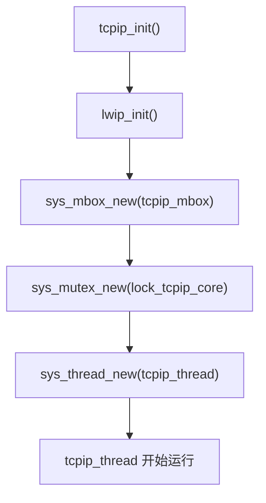
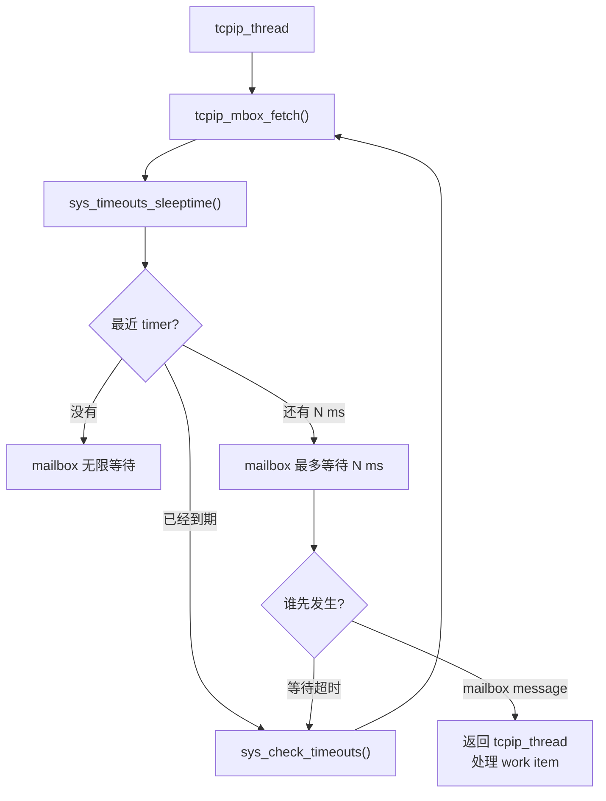
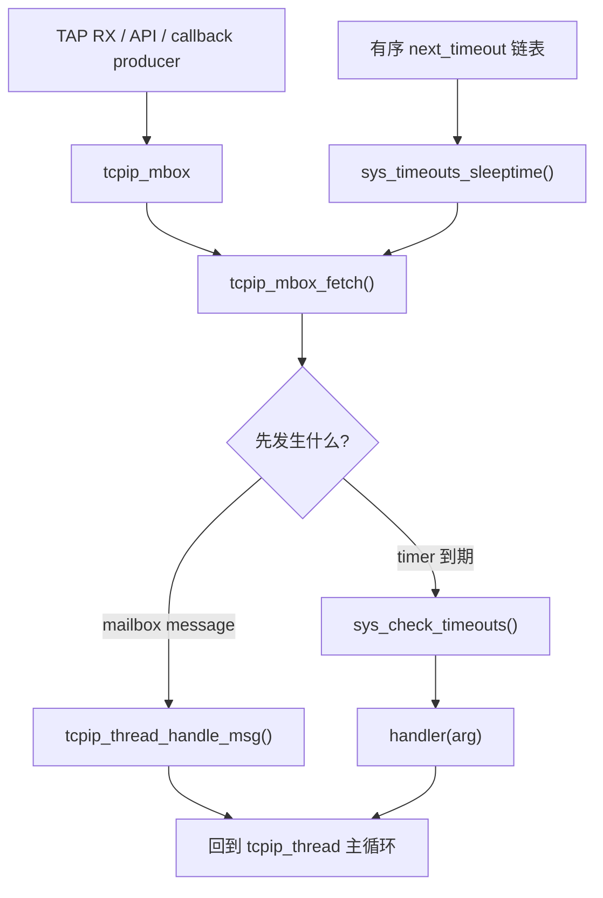
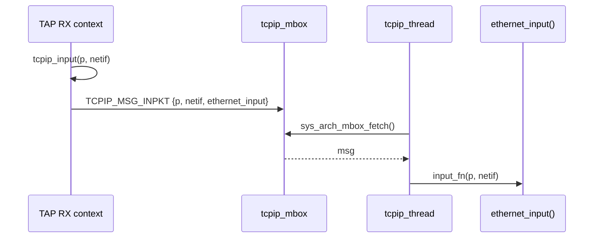
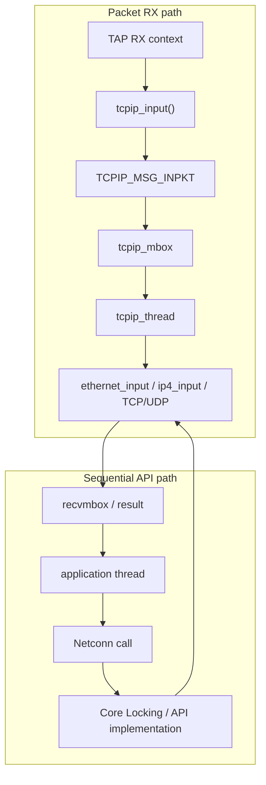

<meta name="referrer" content="no-referrer" />

# 教程 11：从 `tcpip_init()` 到 `sys_arch`——线程、Mailbox、Timer、Semaphore 与 Core Locking

> 摘要：从 tcpip_init 与 tcpip_thread 主循环追踪 mailbox、timeout、semaphore、mutex 和 Core Locking，理解 Core thread 与 Unix Port 的运行边界。

[TOC]


`sys_arch` 是 lwIP 面向操作系统或 RTOS 的移植抽象层，不属于 TCP/IP 协议本身。它解决的问题是：lwIP Core 需要线程、消息队列、信号量、互斥锁、时间与短临界区保护，但 Core 不应该绑定 pthread、RT-Thread 或某一种内核 API。Port 只要实现统一的 `sys_*` contract，Core 就能在不同 OS 上保持同一套调用方式。[S4](#source-s4)[S6](#source-s6)

## 阅读源码前：建议提前阅读

1. [lwIP 2.1.x — OS abstraction layer](https://www.nongnu.org/lwip/2_1_x/group__sys__os.html)：用于确认 `sys_arch` 要向 Core 提供哪些 thread/mailbox/semaphore/mutex/time primitive，以及 OS-specific 实现位于什么边界。[S10](#source-s10)
2. [lwIP 2.1.x — Multithreading](https://www.nongnu.org/lwip/2_1_x/multithreading.html)：用于理解 TCP/IP Core 的线程约束，以及“非 Core thread 持有全局 Core mutex 后直接执行受保护操作”这种 Core Locking 模式。[S11](#source-s11)
3. [`src/include/lwip/sys.h`](https://github.com/lwip-tcpip/lwip/blob/d08f4773edd0182b7910fc8f046eed82ffcd67c9/src/include/lwip/sys.h)：直接对照 Core 看到的 `sys_*` API，而不是先陷入某个 RTOS 的具体实现。[S4](#source-s4)

## 进入源码前先分清五个并发对象

当前 `example_app` 配置 `NO_SYS=0`，表示 lwIP 运行在 OS 模式，并存在专门处理 Core work 的 **`tcpip_thread`（TCP/IP Core thread）**。外部 RX context、application thread 或 timer 不能都假设自己天然处在 Core thread 中；它们必须通过规定的 handoff/locking 方式进入 Core。[S1](#source-s1)[S3](#source-s3)

**Mailbox（消息邮箱/消息队列）**用于把 work item 或 packet 指针排队交给另一个执行上下文；**Semaphore（信号量）**用于等待/通知某个条件或计数资源；**Mutex（互斥锁）**用于保证一段临界区同一时刻只有一个持有者。三者都属于同步原语，但语义不同，不能互换。[S4](#source-s4)

**Core Locking** 是 lwIP 的一种线程进入模式：允许非 Core thread 在持有全局 TCP/IP Core mutex 的前提下执行受保护的 Core 操作。它与 **`SYS_ARCH_PROTECT`** 不是同一个层次；后者用于更短、更底层的 lightweight protection，典型目标是保护极小范围的共享状态，而不是把整段 TCP/IP Core 调用都包起来。[S2](#source-s2)[S4](#source-s4)

这里的 **sequential API（顺序 API）**指 Netconn/Socket 这类允许 application thread 以阻塞式、顺序式调用使用协议栈的接口；它们内部仍必须把实际 Core work 安排到正确执行边界。当前文章后面会看到两条主要路径：packet RX 默认经 `tcpip_mbox` 投递给 Core thread，而某些 sequential API 在当前配置下可以通过 Core Locking 进入 Core。把它们放在同一张图里：

```mermaid
flowchart LR
    RX["RX context"] -->|"tcpip_inpkt() posts message"| M["tcpip_mbox"]
    M --> CT["tcpip_thread"]
    APP["Application thread"] -->|"sequential API"] CO{"当前 API bridge"}
    CO -->|"mailbox path"| M
    CO -->|"Core Locking enabled path"| LOCK["lock_tcpip_core"]
    LOCK --> CORE["lwIP Core operation"]
    CT --> CORE
```

这张图只建立并发边界。下面仍然从真实创建入口 `tcpip_init()` 开始，逐步确认 mailbox、mutex 与 thread 是在哪里创建、由谁消费的。

## 1. `tcpip_init()` 第一次把 lwIP Core 变成一个线程化系统

Stage 2 的启动路径已经走到：

```text
main_loop()
  -> tcpip_init(test_init, &init_sem)
```

现在进入 `tcpip_init()` 本身。当前实现按顺序做：[S3](#source-s3)

```c
lwip_init();

tcpip_init_done = initfunc;
tcpip_init_done_arg = arg;

sys_mbox_new(&tcpip_mbox, TCPIP_MBOX_SIZE);

#if LWIP_TCPIP_CORE_LOCKING
sys_mutex_new(&lock_tcpip_core);
#endif

sys_thread_new(TCPIP_THREAD_NAME, tcpip_thread, NULL,
               TCPIP_THREAD_STACKSIZE, TCPIP_THREAD_PRIO);
```

这里第一次同时出现 mailbox、mutex、thread。它们解决的是三个不同问题：

| 对象 | 解决什么问题 | 最小语义 |
| --- | --- | --- |
| thread | 谁执行 lwIP Core work | 独立执行上下文 |
| mailbox | 不同上下文怎样把 work/data 排队交给 Core | 消息队列 |
| mutex | 多线程直接进入 Core 时怎样互斥 | 同一时刻只允许一个持有者 |

不要把 mailbox 理解成“带数据的 mutex”，也不要把 mutex 理解成“只有一个元素的 mailbox”。它们的同步语义完全不同。



## 2. Core 实际依赖哪些 `sys_arch` contract

`sys_arch` contract 可以理解为 Core 与 OS Port 之间的“最小并发服务接口”：Core 只调用统一的 `sys_*` API，不直接调用 pthread 或 RTOS 原语；Port 负责把这些 API 映射到具体内核。[S4](#source-s4)[S10](#source-s10) `NO_SYS=1` 时没有这套 OS thread 模型；当前 example 是 `NO_SYS=0`，因此下面这些 API 会真实参与运行路径。

`src/include/lwip/sys.h` 声明的典型入口包括：[S4](#source-s4)

```text
sys_thread_new()
sys_sem_new() / sys_arch_sem_wait()
sys_mbox_new() / sys_mbox_post() / sys_arch_mbox_fetch()
sys_mutex_new() / sys_mutex_lock()
sys_now()
```

当前 Unix Port 的 `contrib/ports/unix/port/include/arch/sys_arch.h` 与 `contrib/ports/unix/port/sys_arch.c` 只是这套 contract 的一种 Host 实现。[S5](#source-s5)[S6](#source-s6) 后文因此只回答三个实现问题：`tcpip_thread` 为什么需要 mailbox，timer 怎样与 mailbox wait 汇合，以及 Core Locking/短临界区分别在哪个边界生效。

## 3. 为什么 `sys_sem_t` / `sys_mbox_t` 看起来只是 pointer

Unix `arch/sys_arch.h` 中定义：[S5](#source-s5)

```c
struct sys_sem;
typedef struct sys_sem * sys_sem_t;

struct sys_mutex;
typedef struct sys_mutex * sys_mutex_t;

struct sys_mbox;
typedef struct sys_mbox * sys_mbox_t;

struct sys_thread;
typedef struct sys_thread * sys_thread_t;
```

这是一种 **opaque handle**：Core 看到的是“某种 semaphore/mailbox/mutex handle”，但不需要知道结构体内部究竟存 pthread mutex、condition variable 还是其他 OS object。

这里的“opaque”不是加密，也不是动态类型。它只是有意隐藏 Port implementation detail，让 Core 只依赖 API contract。

## 4. `tcpip_thread` 的主循环实际上一直在消费 `tcpip_mbox`

进入 `tcpip_thread()`：线程入口先标记当前线程为 TCP/IP Core thread，取得 core lock，执行初始化 callback，然后进入永久循环。下面继续阅读 `tcpip_thread()` 的主循环：[S3](#source-s3)

```c
while (1) {                          /* MAIN Loop */
  LWIP_TCPIP_THREAD_ALIVE();
  /* wait for a message, timeouts are processed while waiting */
  tcpip_mbox_fetch(&tcpip_mbox, (void **)&msg);
  if (msg == NULL) {
    LWIP_DEBUGF(TCPIP_DEBUG, ("tcpip_thread: invalid message: NULL\n"));
    LWIP_ASSERT("tcpip_thread: invalid message", 0);
    continue;
  }
  tcpip_thread_handle_msg(msg);
}
```

这里不能只把 `tcpip_mbox_fetch()` 理解成“阻塞等 mailbox”。当 `LWIP_TIMERS=1` 时，它实际上同时等待两类事件：[S3](#source-s3)[S9](#source-s9)

1. `tcpip_mbox` 中先出现 packet/API/callback work item；
2. timeout list 中最近一个 timer 先到期。

所以 Core thread 没有 work 时不会 busy loop，但也不会因为阻塞在 mailbox 上而错过 timer。真正的等待逻辑在 `tcpip_mbox_fetch()` 内部把“最近 timeout 还剩多久”作为 mailbox 的最长阻塞时间。下面把这条之前容易被一句话带过的 timer 主线完整展开。

### 4.1 `tcpip_mbox_fetch()` 先问：最近一个 timeout 还有多久到期

`tcpip_thread()` 直接调用 `tcpip_mbox_fetch(&tcpip_mbox, ...)`；现在进入 `tcpip_mbox_fetch()`。当 `LWIP_TIMERS=1` 时，上游连续源码片段如下：[S3](#source-s3)[S9](#source-s9)

```c
static void
tcpip_mbox_fetch(sys_mbox_t *mbox, void **msg)
{
  u32_t sleeptime, res;

again:
  LWIP_ASSERT_CORE_LOCKED();

  sleeptime = sys_timeouts_sleeptime();
  if (sleeptime == SYS_TIMEOUTS_SLEEPTIME_INFINITE) {
    UNLOCK_TCPIP_CORE();
    sys_arch_mbox_fetch(mbox, msg, 0);
    LOCK_TCPIP_CORE();
    return;
  } else if (sleeptime == 0) {
    sys_check_timeouts();
    /* We try again to fetch a message from the mbox. */
    goto again;
  }

  UNLOCK_TCPIP_CORE();
  res = sys_arch_mbox_fetch(mbox, msg, sleeptime);
  LOCK_TCPIP_CORE();
  if (res == SYS_ARCH_TIMEOUT) {
    /* If a SYS_ARCH_TIMEOUT value is returned, a timeout occurred
       before a message could be fetched. */
    sys_check_timeouts();
    /* We try again to fetch a message from the mbox. */
    goto again;
  }
}
```

这段代码有三种情况。

**情况 1：当前没有任何 timeout。** `sys_timeouts_sleeptime()` 返回 `SYS_TIMEOUTS_SLEEPTIME_INFINITE`，于是：

```c
sys_arch_mbox_fetch(mbox, msg, 0);
```

当前 Unix Port 中 timeout 参数 `0` 表示无限等待，因此 Core thread 可以一直睡到 mailbox 有消息。

**情况 2：最近 timeout 已经到期。** `tcpip_mbox_fetch()` 中 `sleeptime == 0`，不再等待 mailbox，立即执行：

```text
sys_check_timeouts();
```

处理完到期 timer 后 `goto again`，重新计算下一次应等待多久。

**情况 3：最近 timeout 还没到期。** 假设还剩 137 ms：

```text
sys_timeouts_sleeptime() -> 137
```

那么可以把 `tcpip_mbox_fetch()` 的 timed wait 理解成：

```text
sys_arch_mbox_fetch(mbox, msg, 137);
```

表示“等待 mailbox，但最多只等 137 ms”。如果第 50 ms packet message 到达，mailbox 先唤醒；如果一直没有消息，137 ms 到期后返回 `SYS_ARCH_TIMEOUT`，随后调用 `sys_check_timeouts()`。

因此运行时不是“timer thread 与 tcpip_thread 两个线程竞争”，而是同一个 `tcpip_thread` 用 timed mailbox wait 同时等待两类事件：



### 4.2 `sys_timeouts_sleeptime()` 为什么只需要看 `next_timeout`

`sys_timeouts_sleeptime()` 没有遍历全部 timer。它只读全局链表头 `next_timeout`：[S9](#source-s9)

```c
u32_t
sys_timeouts_sleeptime(void)
{
  u32_t now;

  LWIP_ASSERT_CORE_LOCKED();

  if (next_timeout == NULL) {
    return SYS_TIMEOUTS_SLEEPTIME_INFINITE;
  }
  now = sys_now();
  if (TIME_LESS_THAN(next_timeout->time, now)) {
    return 0;
  } else {
    u32_t ret = (u32_t)(next_timeout->time - now);
    LWIP_ASSERT("invalid sleeptime", ret <= LWIP_MAX_TIMEOUT);
    return ret;
  }
}
```

原因在于 `next_timeout` 不是任意顺序的链表。所有 `struct sys_timeo` 都按**绝对到期时间从近到远排序**。因此链表头永远代表下一件最早需要发生的 timer event。

例如：

```text
next_timeout
   |
   v
+-----------+    +-----------+    +-----------+
| t=1050 ms | -> | t=1200 ms | -> | t=5000 ms | -> NULL
| handler A |    | handler B |    | handler C |
+-----------+    +-----------+    +-----------+
```

如果当前 `sys_now() = 1000 ms`，Core thread 最多只需要等 50 ms；1050 ms 的节点没处理完之前，后面的 1200/5000 ms 不可能更早到期。

### 4.3 timer 为什么天然按到期时间排序：`sys_timeout_abs()` 的插入逻辑

`sys_timeout()` 先计算：

```text
absolute due time = sys_now() + msecs
```

随后调用 `sys_timeout_abs()`。进入 `sys_timeout_abs()` 后，新节点从 `MEMP_SYS_TIMEOUT` 分配并填写 `handler`、`arg`、`time`；然后按 `time` 插入 `next_timeout` 链表。[S9](#source-s9)

```c
timeout->next = NULL;
timeout->h = handler;
timeout->arg = arg;
timeout->time = abs_time;

if (next_timeout == NULL) {
  next_timeout = timeout;
  return;
}
if (TIME_LESS_THAN(timeout->time, next_timeout->time)) {
  timeout->next = next_timeout;
  next_timeout = timeout;
} else {
  for (t = next_timeout; t != NULL; t = t->next) {
    if ((t->next == NULL) || TIME_LESS_THAN(timeout->time, t->next->time)) {
      timeout->next = t->next;
      t->next = timeout;
      break;
    }
  }
}
```

所以 `sys_timeout()` 注册一个 timer 的本质不是创建 OS timer object，而是把一个：

```text
{ absolute_due_time, handler, arg }
```

节点插进 lwIP 自己管理的有序链表。

### 4.4 `sys_check_timeouts()` 到底怎样执行 handler

当 `tcpip_mbox_fetch()` 判断 timer 已到期，直接进入 `sys_check_timeouts()`。下面是主循环的上游连续源码片段：[S9](#source-s9)

```c
u32_t
sys_check_timeouts(void)
{
  u32_t now;

  LWIP_ASSERT_CORE_LOCKED();

  /* Process only timers expired at the start of the function. */
  now = sys_now();

  do {
    struct sys_timeo *tmptimeout;
    sys_timeout_handler handler;
    void *arg;

    PBUF_CHECK_FREE_OOSEQ();

    tmptimeout = next_timeout;
    if (tmptimeout == NULL) {
      return SYS_TIMEOUTS_SLEEPTIME_INFINITE;
    }

    if (TIME_LESS_THAN(now, tmptimeout->time)) {
      u32_t ret = (u32_t)(tmptimeout->time - now);
      LWIP_ASSERT("invalid sleeptime", ret <= LWIP_MAX_TIMEOUT);
      return ret;
    }

    /* Timeout has expired */
    next_timeout = tmptimeout->next;
    handler = tmptimeout->h;
    arg = tmptimeout->arg;
    current_timeout_due_time = tmptimeout->time;
    memp_free(MEMP_SYS_TIMEOUT, tmptimeout);
    if (handler != NULL) {
      handler(arg);
    }
    LWIP_TCPIP_THREAD_ALIVE();

    /* Repeat until all expired timers have been called */
  } while (1);
}
```

真实执行顺序是：

```text
读取一次 now = sys_now()
    -> 看 next_timeout
    -> 没有节点：返回 INFINITE
    -> 头节点还没到期：返回剩余毫秒数
    -> 头节点已经到期：
         从链表摘下
         保存 handler/arg
         free MEMP_SYS_TIMEOUT node
         handler(arg)
         再检查下一项
```

例如：

```text
now = 1300 ms

1050 ms handler A -> 已过期 -> 调用
1200 ms handler B -> 已过期 -> 调用
5000 ms handler C -> 未到期 -> 返回 3700 ms
```

返回的 3700 ms 随后又会成为下一轮 `tcpip_mbox_fetch()` 的 mailbox 最大等待时间。

### 4.5 为什么 `sys_check_timeouts()` 开头只读取一次 `sys_now()`

源码注释明确写着：

```c
/* Process only timers expired at the start of the function. */
now = sys_now();
```

因此本轮只处理“函数进入这一刻已经到期”的节点。假设 handler A 自己执行了 100 ms，并使另一个 timer 在 handler 执行期间刚刚到期，当前 `now` 不会在循环中刷新成新时间；该 timer 可以留到下一轮 `tcpip_mbox_fetch()` / `sys_check_timeouts()` 再处理。[S9](#source-s9)

这个细节避免 `sys_check_timeouts()` 因 handler 执行时间较长而无限追赶“刚刚又到期”的 timer，同时也说明 lwIP software timer 不是硬实时中断：callback 的实际执行时间还受 Core thread 当前处理工作和前一个 handler 执行时间影响。

### 4.6 `dhcp_fine_tmr()` 这种“每 500 ms”周期任务，本质仍是反复注册 one-shot timeout

`sys_timeouts_init()` 会把 DHCP、ARP、DNS、ND6 等 `lwip_cyclic_timers[]` 项通过 `sys_timeout()` 放入同一 timeout list。[S9](#source-s9)

到期时，真正首先被调用的是通用 wrapper：

```c
void
lwip_cyclic_timer(void *arg)
{
  u32_t now;
  u32_t next_timeout_time;
  const struct lwip_cyclic_timer *cyclic = (const struct lwip_cyclic_timer *)arg;

  cyclic->handler();

  now = sys_now();
  next_timeout_time = (u32_t)(current_timeout_due_time + cyclic->interval_ms);
```

`cyclic->handler()` 可能就是：

```text
dhcp_fine_tmr()
dhcp_coarse_tmr()
etharp_tmr()
dns_tmr()
nd6_tmr()
...
```

handler 返回后，`lwip_cyclic_timer()` 再调用 `sys_timeout_abs()` 注册下一次 due time。[S9](#source-s9)

所以“每 500 ms 调 `dhcp_fine_tmr()`”的实现模型不是：

```text
独立 timer thread 每 500 ms sleep/wake
```

而是：

```text
one-shot sys_timeo 到期
    -> tcpip_mbox_fetch() timed wait 超时
    -> sys_check_timeouts()
    -> lwip_cyclic_timer()
    -> dhcp_fine_tmr()
    -> 再把下一次 one-shot due time 插回有序 timeout list
```

TCP timer 是这个体系里的特殊项：`sys_timeouts_init()` 刻意跳过 `lwip_cyclic_timers[0]` 的 TCP timer，由 `tcp_timer_needed()` 根据 active/TIME-WAIT PCB 按需启动；Stage 9 已经展开该特殊路径。[S9](#source-s9)

### 4.7 Mailbox 和 Timer 最终在同一个 `tcpip_thread` 串行汇合

到这里可以把本篇最容易混淆的“线程 + IPC + timer”关系放到一张图里：



因此当前 OS mode 下不存在“一个 timer thread 与一个 packet thread 同时修改 lwIP Core”的默认模型。packet work、API/callback work 与大量 protocol timer handler 最终都在 `tcpip_thread` 的 Core execution context 中串行推进；Core Locking 允许特定外部线程在满足约束时同步进入 Core，但那是另一条受锁保护的入口。[S3](#source-s3)[S9](#source-s9)

回到 `tcpip_thread()`：当 `tcpip_mbox_fetch()` 最终因为 mailbox message 返回，主循环才继续调用 `tcpip_thread_handle_msg()`。`tcpip_thread_handle_msg()` 根据 `msg->type` 区分 input packet、callback、timeout request 等 work item。[S3](#source-s3)

因此 mailbox 里放的不是固定一种 packet pointer，而是 `struct tcpip_msg` 描述的不同 work item。

## 5. `struct tcpip_msg` 是跨线程 work item

Stage 2 RX 路径里曾看到：

```text
tcpip_input(p, netif)
```

这一层并没有直接调用 `ethernet_input()`。当前 `LWIP_TCPIP_CORE_LOCKING_INPUT=0` 时，`tcpip_inpkt()` 会：[S3](#source-s3)[S2](#source-s2)

1. 从 `MEMP_TCPIP_MSG_INPKT` 分配一个 `tcpip_msg`；
2. 填入 `p`、`netif` 和 `input_fn`；
3. 标记类型为 `TCPIP_MSG_INPKT`；
4. `sys_mbox_trypost(&tcpip_mbox, msg)`。



这就是 RX 的 **handoff**：接包上下文负责把 work 交进 mailbox；真正的 Ethernet/IP/TCP/UDP Core processing 在 `tcpip_thread` 中继续。

## 6. 为什么当前 RX 仍走 mailbox，即使 `LWIP_TCPIP_CORE_LOCKING=1`

这是一个最容易混淆的配置组合。

`LWIP_TCPIP_CORE_LOCKING=1` 表示某些 non-Core threads 可以先取得 `lock_tcpip_core`，然后同步调用允许的 lwIP Core API。[S1](#source-s1)[S3](#source-s3)

但 packet input 是否直接用 core lock，是另一个选项：

```c
LWIP_TCPIP_CORE_LOCKING_INPUT
```

Core 默认是 `0`。[S2](#source-s2)

因此当前配置可以同时成立：

```text
Netconn/API control path
    可能通过 Core Locking 直接同步执行

RX packet input
    仍打包成 TCPIP_MSG_INPKT
    经过 tcpip_mbox
    由 tcpip_thread 调用 ethernet_input()
```

“用了 Core Locking”并不推出“mailbox 不再存在”。两者可以服务不同入口。

## 7. Core Locking 到底锁的是什么

`LOCK_TCPIP_CORE()` / `UNLOCK_TCPIP_CORE()` 保护的是 lwIP Core shared state，让允许的外部线程在持锁期间安全访问 Core API。[S3](#source-s3)[S5](#source-s5)

当前 Unix Port 将这组宏映射到 `sys_lock_tcpip_core()` / `sys_unlock_tcpip_core()`，底层使用 Port 的 mutex implementation。[S5](#source-s5)[S6](#source-s6)

它与普通 application mutex 的区别不在“mutex 类型更特殊”，而在**被保护的 invariant**：

> 持有 core lock 的上下文被允许访问本应串行化的 lwIP Core state。

所以不能随意拿其他 mutex 代替，也不能只看到某个 API 内部没有 mailbox 就认为它天然 thread-safe。

## 8. Mailbox、Semaphore、Mutex 不再单独教学，只映射当前调用点

三类 primitive 的一般定义直接以 lwIP OS abstraction 文档为准。[S10](#source-s10) 在当前源码里，它们的差异由“谁调用、等待什么、保护什么”体现得更清楚：

| primitive | 当前真实调用点 | 在本篇承担的语义 |
| --- | --- | --- |
| mailbox | `tcpip_mbox_fetch()`、`tcpip_inpkt()` | 把 packet/API work 排队交给 Core thread |
| semaphore | `main_loop()` 等待 `test_init()` 完成 | 一个调用方等待另一个上下文发出完成事件 |
| mutex | `lock_tcpip_core` | 允许 non-Core thread 在持锁期间同步进入受保护的 lwIP Core state |

Stage 2 的 init semaphore 由 `main_loop()` 等待、由 `test_init()` signal；这是一个具体的 wait/signal 关系，不需要再用抽象“信号量是什么”重复解释。[S7](#source-s7) 同样，mailbox 是否携带 work item、mutex 是否保护 Core invariant，都应从真实调用点判断，而不是从名字类比。

## 9. `SYS_ARCH_PROTECT` 又是另一层保护

`SYS_ARCH_PROTECT` / `SYS_ARCH_UNPROTECT` 面向的是更小粒度的 lightweight critical region，例如内存/统计等需要短时间原子保护的路径；它不是 `lock_tcpip_core` 的别名。[S4](#source-s4)[S6](#source-s6)

两者保护的 scope 不同：

```text
Core lock
  保护 lwIP Core 访问序列化

SYS_ARCH_PROTECT
  保护特定短临界区的并发原子性
```

一个 Port 可以用不同底层 primitive 实现它们。不能因为两者最终都可能碰 mutex/critical-section API，就把语义混在一起。

## 10. Unix Port 只作为 contract 的一份可观察实现

当前 Unix `sys_arch.c` 使用 pthread/condition/queue 等 Host primitives 实现 lwIP 所需的 thread、mailbox、semaphore、mutex 与时间接口。[S6](#source-s6) 这里需要保留的结论不是具体 pthread 字段，而是映射关系：

```text
lwIP Core call
    -> sys_* contract
    -> Unix sys_arch implementation
    -> pthread / condition / queue / clock
```

真实 MCU/RTOS Port 可以采用完全不同的底层 primitive，只要保持 lwIP 官方 contract 的等待、超时、唤醒和互斥语义。[S10](#source-s10) Stage 39 会把同一 contract 映射到 RT-Thread；因此本篇不再展开一套通用 pthread 教程。

## 11. 把 Stage 2 与 Stage 6 的线程路径放到同一张图



这张图不是说“所有 Netconn call 永远都不经过任何 mailbox”。Netconn 自己仍有 receive mailbox、completion synchronization 等对象；这里只表达当前 `LWIP_TCPIP_CORE_LOCKING=1` 下，Core API execution 与 RX input handoff 可以采用不同串行化机制。[S1](#source-s1)[S3](#source-s3)[S8](#source-s8)

## 12. Core、Port、example 三层最终边界

到这里可以明确哪些是 lwIP 的通用设计，哪些只是当前 Host 实验实现：

| 层次 | 本篇事实 |
| --- | --- |
| lwIP Core contract | `sys.h` 定义 thread/sem/mbox/mutex/time 抽象；OS mode 有 `tcpip_thread`/Core synchronization model |
| Unix Port | `sys_arch.c` 用 pthread 等 Host primitives 实现抽象 |
| current example config | `NO_SYS=0`、Core Locking 开启、packet input locking 关闭，因此 RX 仍走 `tcpip_mbox` |
| production implication | 目标平台需要满足同等 contract，但具体线程、ISR bottom-half、queue/mutex primitive 可完全不同 |

Stage 12 会继续利用这条分层思路，把“内存不足”也拆成 `mem` heap、`memp` typed pools 和 `pbuf` allocation policy，而不是笼统看成同一个 allocator。

## 资料来源

<a id="source-s1"></a>
### [S1] current example threading 配置
- 版本：`d08f4773edd0182b7910fc8f046eed82ffcd67c9`
- URL/文档：[`contrib/examples/example_app/lwipopts.h`](https://github.com/lwip-tcpip/lwip/blob/d08f4773edd0182b7910fc8f046eed82ffcd67c9/contrib/examples/example_app/lwipopts.h)
- 使用位置：`NO_SYS=0`、`LWIP_TCPIP_CORE_LOCKING=1`
- 支撑内容：限定当前 article 的 example configuration

<a id="source-s2"></a>
### [S2] Core threading option defaults
- 版本：`d08f4773edd0182b7910fc8f046eed82ffcd67c9`
- URL/文档：[`src/include/lwip/opt.h`](https://github.com/lwip-tcpip/lwip/blob/d08f4773edd0182b7910fc8f046eed82ffcd67c9/src/include/lwip/opt.h)
- 使用位置：`LWIP_TCPIP_CORE_LOCKING_INPUT=0`
- 支撑内容：packet input 是否通过 mailbox 或直接 core lock 的配置边界

<a id="source-s3"></a>
### [S3] `tcpip_thread`、`tcpip_mbox` 与 Core Locking
- 版本：`d08f4773edd0182b7910fc8f046eed82ffcd67c9`
- URL/文档：[`src/api/tcpip.c`](https://github.com/lwip-tcpip/lwip/blob/d08f4773edd0182b7910fc8f046eed82ffcd67c9/src/api/tcpip.c)
- 使用位置：`tcpip_init()`、`tcpip_thread()`、`tcpip_inpkt()`、message dispatch
- 支撑内容：OS mode Core thread 创建、input message handoff、callback/message processing

<a id="source-s4"></a>
### [S4] lwIP OS abstraction contract
- 版本：`d08f4773edd0182b7910fc8f046eed82ffcd67c9`
- URL/文档：[`src/include/lwip/sys.h`](https://github.com/lwip-tcpip/lwip/blob/d08f4773edd0182b7910fc8f046eed82ffcd67c9/src/include/lwip/sys.h)
- 使用位置：thread/semaphore/mailbox/mutex/`SYS_ARCH_PROTECT`
- 支撑内容：lwIP Core 对 OS Port 的抽象 API 需求

<a id="source-s5"></a>
### [S5] Unix `sys_arch` type mapping
- 版本：`d08f4773edd0182b7910fc8f046eed82ffcd67c9`
- URL/文档：[`contrib/ports/unix/port/include/arch/sys_arch.h`](https://github.com/lwip-tcpip/lwip/blob/d08f4773edd0182b7910fc8f046eed82ffcd67c9/contrib/ports/unix/port/include/arch/sys_arch.h)
- 使用位置：opaque handles 与 Core Locking macros
- 支撑内容：Unix Port 如何向 Core 暴露 `sys_*` handle 类型

<a id="source-s6"></a>
### [S6] Unix `sys_arch` implementation
- 版本：`d08f4773edd0182b7910fc8f046eed82ffcd67c9`
- URL/文档：[`contrib/ports/unix/port/sys_arch.c`](https://github.com/lwip-tcpip/lwip/blob/d08f4773edd0182b7910fc8f046eed82ffcd67c9/contrib/ports/unix/port/sys_arch.c)
- 使用位置：thread、mailbox、semaphore、mutex 与 lightweight protection 的 Host implementation
- 支撑内容：当前 Unix Port 的具体 synchronization primitives

<a id="source-s7"></a>
### [S7] example startup synchronization
- 版本：`d08f4773edd0182b7910fc8f046eed82ffcd67c9`
- URL/文档：[`contrib/examples/example_app/test.c`](https://github.com/lwip-tcpip/lwip/blob/d08f4773edd0182b7910fc8f046eed82ffcd67c9/contrib/examples/example_app/test.c)
- 使用位置：`main_loop()` 的 init semaphore 与 `test_init()` signal
- 支撑内容：semaphore 在当前 startup path 中解决的实际等待关系

<a id="source-s8"></a>
### [S8] Netconn implementation
- 版本：`d08f4773edd0182b7910fc8f046eed82ffcd67c9`
- URL/文档：[`src/api/api_lib.c`](https://github.com/lwip-tcpip/lwip/blob/d08f4773edd0182b7910fc8f046eed82ffcd67c9/src/api/api_lib.c)、[`src/api/api_msg.c`](https://github.com/lwip-tcpip/lwip/blob/d08f4773edd0182b7910fc8f046eed82ffcd67c9/src/api/api_msg.c)
- 使用位置：application thread、Core API execution 与 receive mailbox
- 支撑内容：Stage 6 的 sequential API 如何和本篇 `tcpip_thread`/Core Locking 模型衔接

<a id="source-s9"></a>
### [S9] lwIP software timeout scheduler
- 版本：`d08f4773edd0182b7910fc8f046eed82ffcd67c9`
- URL/文档：[`src/core/timeouts.c`](https://github.com/lwip-tcpip/lwip/blob/d08f4773edd0182b7910fc8f046eed82ffcd67c9/src/core/timeouts.c)
- 使用位置：`sys_timeout_abs()`、`sys_timeouts_sleeptime()`、`sys_check_timeouts()`、`lwip_cyclic_timer()` 与 `sys_timeouts_init()`
- 支撑内容：证明 timeout 节点按绝对到期时间排序、`tcpip_mbox_fetch()` 如何计算等待时长、到期 handler 如何执行，以及 cyclic timer 如何重新注册下一次 one-shot timeout

<a id="source-s10"></a>
### [S10] lwIP 官方 OS abstraction 文档
- 类型：lwIP 官方 API/Porting 文档
- 版本：lwIP 2.1.x 文档，访问日期 2026-10-03
- URL/文档：[OS abstraction layer](https://www.nongnu.org/lwip/2_1_x/group__sys__os.html)
- 使用位置：开篇阅读边界、`sys_*` contract、mailbox/semaphore/mutex 语义、Unix Port 与 RTOS Port 的边界
- 支撑内容：官方定义 OS-specific `sys_arch` 的职责，说明 semaphore、mailbox、mutex、thread、timer/`NO_SYS` 的 Porting 关系，并明确具体实现位于 `arch/sys_arch.h` 与 `sys_arch.c`


<a id="source-s11"></a>
### [S11] lwIP 官方 Multithreading 文档
- 类型：lwIP 官方 Porting 文档
- 版本：lwIP 2.1.x 文档，访问日期 2026-10-03
- URL/文档：[Multithreading](https://www.nongnu.org/lwip/2_1_x/multithreading.html)
- 使用位置：开篇并发模型、Core thread/Core Locking 与外部线程进入 Core 的边界
- 支撑内容：官方说明 lwIP 多线程环境下的 Core thread 约束、thread-safe API 范围与 Core Locking 模式
