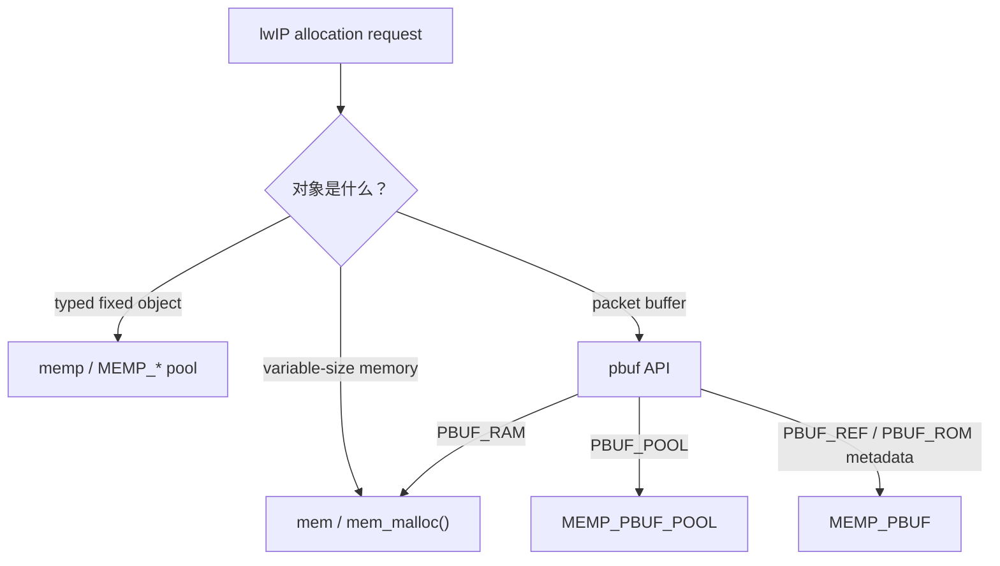
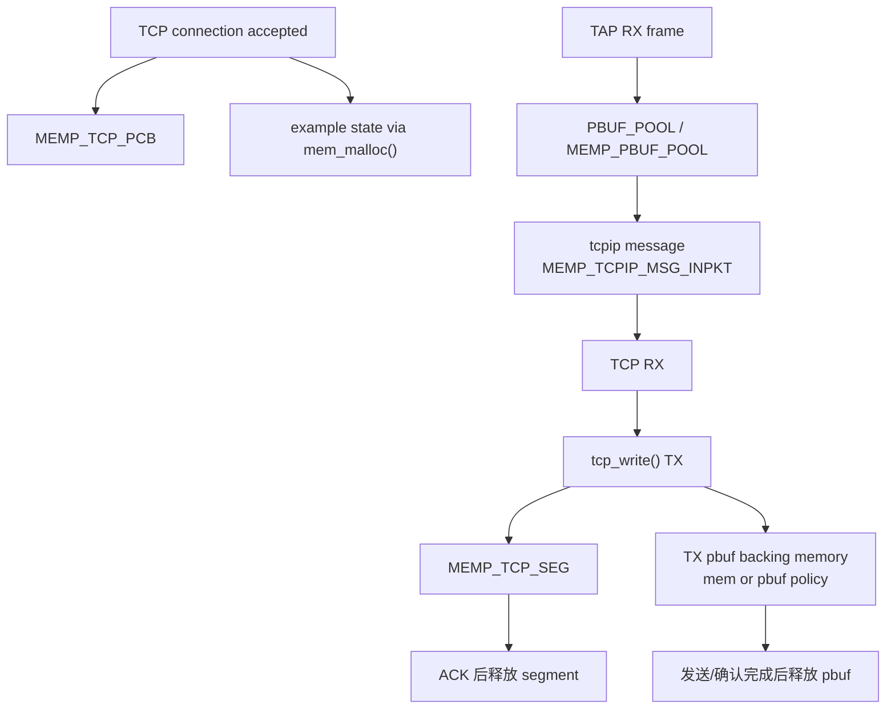

<meta name="referrer" content="no-referrer" />

# 教程 12：从 `pbuf_alloc()` / `tcp_new()` 到资源回收——`mem`、`memp` 与 `pbuf` 内存体系

> 摘要：把 pbuf、UDP/TCP PCB、TCP segment、Netconn 与 tcpip message 放回统一资源模型，理解 variable heap、typed pools 与 packet-buffer policy。

[TOC]


前面的文章已经遇到很多“分配失败”入口：`pbuf_alloc()`、`udp_new()`、`tcp_new()`、`netconn_new()`、`tcpip_inpkt()`。这里的 **allocator（内存分配器）**泛指“根据某种资源策略取得并回收内存/对象”的机制。如果把这些入口全部理解成同一个 `malloc()`，就会误判资源瓶颈：一个系统可能还有 variable-size heap 空间，却已经耗尽 TCP PCB 这类固定对象池；也可能控制对象充足，却因为 packet buffer pool 不够而无法接收新帧。

## 阅读源码前：建议提前阅读

1. [lwIP 2.1.x — Packet buffers (PBUF)](https://www.nongnu.org/lwip/2_1_x/group__pbuf.html)：用于理解 packet buffer 的四类主要存储/引用策略、pbuf chain 与 payload ownership；具体的 `PBUF_RAM/PBUF_POOL/PBUF_REF/PBUF_ROM` 名称会在下节逐一落到 allocator。[S9](#source-s9)
2. [lwIP 2.1.x — Heap and memory pools](https://www.nongnu.org/lwip/2_1_x/group__lwip__opts__mem.html)：用于理解 `MEM_SIZE`、`MEM_LIBC_MALLOC`、`MEMP_MEM_MALLOC` 等 allocator 配置如何改变 backend。[S10](#source-s10)
3. [`src/core/mem.c`](https://github.com/lwip-tcpip/lwip/blob/d08f4773edd0182b7910fc8f046eed82ffcd67c9/src/core/mem.c) 与 [`src/core/memp.c`](https://github.com/lwip-tcpip/lwip/blob/d08f4773edd0182b7910fc8f046eed82ffcd67c9/src/core/memp.c)：用于对照本文后续实际阅读的 variable-size allocator 与 typed pool 实现。[S1](#source-s1)[S2](#source-s2)

## 先建立统一资源模型：`mem`、`memp`、`pbuf` 不是三个互斥 allocator

**`mem`** 是 lwIP 的 variable-size memory allocator abstraction。默认配置可以使用 lwIP 自带 heap，也可以通过配置切换到 libc/custom allocator；因此 `mem_malloc()` 描述的是“需要一块可变长度内存”的语义，而不是永远等于某个固定实现。[S1](#source-s1)[S8](#source-s8)

**`memp`** 是 typed fixed-size pool 体系。每一种 `MEMP_*` 类型描述一种对象类别，例如 UDP PCB、TCP PCB、TCP segment、Netconn 或 tcpip message。典型配置会为不同类型保留独立数量预算，所以某一类对象耗尽不代表其他 pool 也同时耗尽。[S2](#source-s2)

**`pbuf`** 则是 packet buffer API 与 ownership policy。它根据 pbuf type 把“需要怎样的数据缓冲区”路由到不同底层来源：`PBUF_RAM` 通常需要一块可写、长度随 packet 变化的连续 allocation；`PBUF_POOL` 从 packet pool 获取一个或多个 buffer；`PBUF_REF` / `PBUF_ROM` 主要创建 pbuf metadata 去引用外部 payload，其 payload lifetime 不能按普通 `PBUF_RAM` 处理。[S3](#source-s3)[S9](#source-s9)

因此三者的关系不是：

```text
mem vs memp vs pbuf，三选一
```

而是：

```text
调用者先表达“我要什么对象/packet ownership”
        ↓
pbuf 或具体协议对象 API 决定资源类别
        ↓
最终落到 mem、某个 MEMP_* pool，或外部 payload 引用
```

后文还会区分两个很容易混淆的配置：**`PBUF_POOL_SIZE`** 是 packet pool 中 payload buffer 的数量；**`MEMP_NUM_PBUF`** 是 `MEMP_PBUF` metadata pool 的数量。二者名字都含 PBUF，但并不是同一个池。[S2](#source-s2)[S6](#source-s6)

下面不按 allocator 文件顺序讲，而是先从已经在前文真实出现过的 allocation call 反查：每一次分配最终落到了哪里。

## 1. 先从三个已经见过的真实 allocation call 对比

`tapif.c::low_level_input()` 在 Stage 2 RX 路径中调用：[S3](#source-s3)

```c
pbuf_alloc(PBUF_RAW, len, PBUF_POOL);
```

`udp_new_ip_type()` 在 Stage 5 创建 UDP PCB 时调用：[S4](#source-s4)

```c
memp_malloc(MEMP_UDP_PCB);
```

`tcp_alloc()` 在 Stage 7 创建 TCP connection PCB 时调用：[S5](#source-s5)

```c
memp_malloc(MEMP_TCP_PCB);
```

而 `tcp_write()` 产生的数据 pbuf 在一些路径上又会使用 `PBUF_RAM`，最终进入 `mem_malloc()`。[S3](#source-s3)

所以“lwIP 内存”不是一个池子：



## 2. `mem`：变量大小 allocation，真实代码怎样找 free block

`mem` 提供 `mem_malloc()` / `mem_free()` 等 variable-size allocator API。[S1](#source-s1) 当前 example 的 `MEM_ALIGNMENT=4`、`MEM_SIZE=10240` 只是这套 Host 配置给 internal heap 的预算，不是 lwIP 固定要求。[S6](#source-s6)

先看默认 internal allocator 的 `mem_malloc()`。函数先把请求长度按 `MEM_ALIGNMENT` 对齐，再从 `lfree` 指向的最低 free block 开始扫描：[S1](#source-s1)

```c
void *
mem_malloc(mem_size_t size_in)
{
  mem_size_t ptr, ptr2, size;
  struct mem *mem, *mem2;
  LWIP_MEM_ALLOC_DECL_PROTECT();

  if (size_in == 0) {
    return NULL;
  }

  size = (mem_size_t)LWIP_MEM_ALIGN_SIZE(size_in);
  if (size < MIN_SIZE_ALIGNED) {
    size = MIN_SIZE_ALIGNED;
  }
  if ((size > MEM_SIZE_ALIGNED) || (size < size_in)) {
    return NULL;
  }

  sys_mutex_lock(&mem_mutex);
  LWIP_MEM_ALLOC_PROTECT();

  for (ptr = mem_to_ptr(lfree); ptr < MEM_SIZE_ALIGNED - size;
       ptr = ptr_to_mem(ptr)->next) {
    mem = ptr_to_mem(ptr);

    if ((!mem->used) &&
        (mem->next - (ptr + SIZEOF_STRUCT_MEM)) >= size) {
```

继续阅读 `mem_malloc()`。找到足够大的 free block 后，如果剩余空间还能容纳新的 `struct mem` 和最小数据区，`mem_malloc()` 会把当前 block 拆成“本次已用块 + 新 free remainder”：[S1](#source-s1)

```c
if (mem->next - (ptr + SIZEOF_STRUCT_MEM) >=
    (size + SIZEOF_STRUCT_MEM + MIN_SIZE_ALIGNED)) {
  ptr2 = (mem_size_t)(ptr + SIZEOF_STRUCT_MEM + size);
  LWIP_ASSERT("invalid next ptr", ptr2 != MEM_SIZE_ALIGNED);

  mem2 = ptr_to_mem(ptr2);
  mem2->used = 0;
  mem2->next = mem->next;
  mem2->prev = ptr;

  mem->next = ptr2;
  mem->used = 1;

  if (mem2->next != MEM_SIZE_ALIGNED) {
    ptr_to_mem(mem2->next)->prev = ptr2;
  }
  MEM_STATS_INC_USED(used, (size + SIZEOF_STRUCT_MEM));
} else {
  mem->used = 1;
  MEM_STATS_INC_USED(used, mem->next - mem_to_ptr(mem));
}
```

因此 `mem_malloc()` 不是“从一个固定-size object pool 弹一个节点”，它需要处理长度、对齐、free-block 搜索和必要的 block split。这也是 `mem` 与下一节 `memp` 的本质差异。

`PBUF_RAM` 是前文最直接的使用者：`pbuf_alloc()` 根据 packet 长度算出 metadata + headroom + payload 的总大小，然后一次 `mem_malloc(alloc_len)`。[S3](#source-s3)

## 3. `memp`：按对象类型分开的 fixed-size pools

`memp` 面向的是“对象类型已知、element 大小固定、数量可配置”的资源。[S2](#source-s2) `memp_malloc(type)` 先用 `type` 找到对应 pool descriptor，再进入该 pool 的 free-list 操作：[S2](#source-s2)

```c
void *
memp_malloc(memp_t type)
{
  void *memp;
  LWIP_ERROR("memp_malloc: type < MEMP_MAX", (type < MEMP_MAX), return NULL;);

#if MEMP_OVERFLOW_CHECK >= 2
  memp_overflow_check_all();
#endif /* MEMP_OVERFLOW_CHECK >= 2 */

  memp = do_memp_malloc_pool(memp_pools[type]);

  return memp;
}
```

`memp_malloc()` 调用 `do_memp_malloc_pool()` 后，控制流进入具体 pool。默认 `MEMP_MEM_MALLOC=0` 时，下面继续阅读 `do_memp_malloc_pool()`：真正取 element 的位置是 `*desc->tab`，也就是当前 pool free list 的表头。[S2](#source-s2)

```c
SYS_ARCH_PROTECT(old_level);

memp = *desc->tab;

if (memp != NULL) {
  *desc->tab = memp->next;

#if MEMP_STATS
  desc->stats->used++;
  if (desc->stats->used > desc->stats->max) {
    desc->stats->max = desc->stats->used;
  }
#endif
  SYS_ARCH_UNPROTECT(old_level);
  return ((u8_t *)memp + MEMP_SIZE);
} else {
#if MEMP_STATS
  desc->stats->err++;
#endif
  SYS_ARCH_UNPROTECT(old_level);
}

return NULL;
```

这段代码说明 fixed pool allocation 的关键行为非常直接：

```text
pool free-list head
      ↓ pop
返回一个固定大小 element
```

pool 空了就返回 `NULL`，`memp_malloc()` 自己不会去借另一个类型的 pool，也不会自动扩容。某些上层模块会在失败后自行执行 reclaim policy，`tcp_alloc()` 就是后面的典型例子。

`memp_std.h` 把对象类型映射到各自 pool，例如 `MEMP_TCP_PCB`、`MEMP_TCP_SEG`、`MEMP_NETCONN`、`MEMP_TCPIP_MSG_INPKT`。因此“TCP PCB pool 用完”与“UDP PCB pool 用完”是两个独立资源状态。

## 4. 当前 example 的 resource budget 是怎样拆开的

当前 `lwipopts.h` 给出：[S6](#source-s6)

| 资源 | 当前数量/大小 | 前面在哪见过 |
| --- | ---: | --- |
| `MEM_SIZE` | 10240 bytes | `PBUF_RAM` 等 variable allocation |
| `MEMP_NUM_PBUF` | 16 | `PBUF_REF/PBUF_ROM` metadata |
| `MEMP_NUM_UDP_PCB` | 8 | Stage 5 `udp_new()` |
| `MEMP_NUM_TCP_PCB` | 5 | Stage 7 active TCP PCB |
| `MEMP_NUM_TCP_PCB_LISTEN` | 8 | Stage 7 listener |
| `MEMP_NUM_TCP_SEG` | 16 | Stage 8 TX queue / Stage 10 ooseq metadata |
| `MEMP_NUM_NETBUF` | 2 | Stage 6 Netconn payload wrapper |
| `MEMP_NUM_NETCONN` | 12 | Stage 6 sequential connection object |
| `MEMP_NUM_TCPIP_MSG_API` | 16 | API/callback work item |
| `MEMP_NUM_TCPIP_MSG_INPKT` | 16 | Stage 11 RX mailbox handoff |
| `PBUF_POOL_SIZE` | 120 | packet pool elements |
| `PBUF_POOL_BUFSIZE` | 256 bytes | 每个 packet pool element 的 buffer 尺寸 |

这张表最重要的不是记数字，而是说明 resource budgeting 要按对象类型做。比如高并发 TCP connection 可能先碰 `MEMP_TCP_PCB`；高吞吐 RX burst 可能先压 `PBUF_POOL`；大量 pending TX segments 又可能先消耗 `MEMP_TCP_SEG`。

## 5. `pbuf` type 怎样决定底层 allocator 与 payload ownership

四种 pbuf type 在这里要同时看“数据存在哪里”和“谁负责 payload 生命周期”：`PBUF_RAM` 让 lwIP 为 metadata 与 payload 准备可写的 variable-size allocation；`PBUF_POOL` 从 packet pool 取得一个或多个 element；`PBUF_REF` / `PBUF_ROM` 的 pbuf metadata 来自 `MEMP_PBUF`，payload 则引用外部存储，因此外部 owner 必须保证引用期间 payload 仍然有效。[S3](#source-s3)[S9](#source-s9) 下面继续沿 `pbuf_alloc()` 看这四类 policy 怎样映射到前面的 `mem/memp` 资源域。

| pbuf policy | 当前 allocator 路径 | 资源压力落点 |
| --- | --- | --- |
| `PBUF_RAM` | `mem_malloc()` | variable heap / configured backend |
| `PBUF_POOL` | `MEMP_PBUF_POOL` | packet pool element 数量与 element size |
| `PBUF_REF` / `PBUF_ROM` | `MEMP_PBUF` metadata | pbuf metadata pool；payload 由外部 owner 管理 |

### 5.1 `PBUF_POOL`：循环从 `MEMP_PBUF_POOL` 取 element

当前源码按剩余长度循环构造 pbuf chain，而不是假设一个 pool element 永远容纳整包：[S3](#source-s3)

```c
case PBUF_POOL: {
  struct pbuf *q, *last;
  u16_t rem_len;
  p = NULL;
  last = NULL;
  rem_len = length;
```

每次从 `MEMP_PBUF_POOL` 取得 element，再按当前 element 可承载长度推进 `rem_len`；因此大 packet 可以消耗多个 pool element。官方 PBUF 文档也明确 `PBUF_POOL` 可能返回 pbuf chain，而不是单节点。[S9](#source-s9)

### 5.2 `PBUF_RAM` 与引用型 pbuf 的差异只保留 allocator 映射

`PBUF_RAM` 的关键实现事实是一次 `mem_malloc()` 覆盖 pbuf metadata、headroom 与 payload；`PBUF_REF/PBUF_ROM` 则通过 `MEMP_PBUF` 分配 metadata，payload 不由普通 pbuf allocator 复制/持有。[S3](#source-s3) 更细的 payload lifetime 已在 Stage 3 讲过，Stage 20 还会把引用型/custom pbuf 接到 DMA buffer ownership，因此这里不再重复 packet-lifetime 教程。

## 6. `PBUF_POOL_SIZE` 与 `MEMP_NUM_PBUF` 不是同一个池

名称很相似，必须在这里消歧：[S2](#source-s2)[S3](#source-s3)

```text
PBUF_POOL_SIZE
    -> MEMP_PBUF_POOL element 数量
    -> element 同时包含 struct pbuf + pool payload backing memory

MEMP_NUM_PBUF
    -> MEMP_PBUF element 数量
    -> 主要用于只需要 pbuf metadata 的 REF/ROM 等场景
```

因此把 `MEMP_NUM_PBUF=16` 误认为“整个系统最多只能有 16 个 pbuf”是错误的；RX 的 `PBUF_POOL` 有自己独立的 `PBUF_POOL_SIZE=120`。

## 7. UDP/TCP PCB 为什么更适合 typed pool

`udp_new()` 直接从 `MEMP_UDP_PCB` 分配 `struct udp_pcb`。[S4](#source-s4)

TCP 普通 PCB、listen PCB 也分别来自：

```text
MEMP_TCP_PCB
MEMP_TCP_PCB_LISTEN
```

Stage 7 已经看到 `tcp_listen()` 为什么把普通 PCB 换成更小的 listener object；内存体系现在给出另一个视角：两种对象不仅 struct 不同，而且来自不同 typed pools。[S5](#source-s5)

这种设计让资源上限更显式，也避免把所有控制对象都交给 variable-size heap 管理。

## 8. `tcp_alloc()` 为什么不是第一次 pool allocation 失败就返回 NULL

`memp_malloc()` 本身 pool 空即返回 `NULL`，但 TCP 在它上面增加了一层协议专用的资源回收策略。直接看 `tcp_alloc()`：[S5](#source-s5)

```c
pcb = (struct tcp_pcb *)memp_malloc(MEMP_TCP_PCB);
if (pcb == NULL) {
  tcp_handle_closepend();

  tcp_kill_timewait();
  pcb = (struct tcp_pcb *)memp_malloc(MEMP_TCP_PCB);
  if (pcb == NULL) {
    tcp_kill_state(LAST_ACK);
    pcb = (struct tcp_pcb *)memp_malloc(MEMP_TCP_PCB);
    if (pcb == NULL) {
      tcp_kill_state(CLOSING);
      pcb = (struct tcp_pcb *)memp_malloc(MEMP_TCP_PCB);
      if (pcb == NULL) {
        tcp_kill_prio(prio);
        pcb = (struct tcp_pcb *)memp_malloc(MEMP_TCP_PCB);
        if (pcb != NULL) {
          MEMP_STATS_DEC(err, MEMP_TCP_PCB);
        }
      }
      if (pcb != NULL) {
        MEMP_STATS_DEC(err, MEMP_TCP_PCB);
      }
    }
    if (pcb != NULL) {
      MEMP_STATS_DEC(err, MEMP_TCP_PCB);
    }
  }
  if (pcb != NULL) {
    MEMP_STATS_DEC(err, MEMP_TCP_PCB);
  }
}
```

这段调用链非常适合区分“allocator policy”和“protocol policy”：

```text
memp_malloc(MEMP_TCP_PCB)
    pool empty -> NULL

TCP tcp_alloc()
    ↓
处理 pending close
    ↓
回收 TIME_WAIT
    ↓ retry
回收 LAST_ACK
    ↓ retry
回收 CLOSING
    ↓ retry
回收更低 priority active PCB
    ↓ retry
最终仍失败才返回 NULL
```

成功拿到 PCB 后，`tcp_alloc()` 才清零结构并初始化发送窗口、接收窗口、MSS、RTO、timer、`ssthresh` 等协议状态：[S5](#source-s5)

```c
if (pcb != NULL) {
  memset(pcb, 0, sizeof(struct tcp_pcb));
  pcb->prio = prio;
  pcb->snd_buf = TCP_SND_BUF;
  pcb->rcv_wnd = pcb->rcv_ann_wnd = TCPWND_MIN16(TCP_WND);
  pcb->ttl = TCP_TTL;
  pcb->mss = INITIAL_MSS;
  pcb->rto = LWIP_TCP_RTO_TIME / TCP_SLOW_INTERVAL;
  pcb->sv = LWIP_TCP_RTO_TIME / TCP_SLOW_INTERVAL;
  pcb->rtime = -1;
  pcb->cwnd = 1;
  pcb->tmr = tcp_ticks;
  pcb->last_timer = tcp_timer_ctr;
  pcb->ssthresh = TCP_SND_BUF;
}
```

所以 `tcp_new()` 返回的并不是“一块刚 malloc 出来的裸内存”，而是已经建立基本 TCP invariant 的 PCB。

这个 reclaim 策略只属于当前 TCP implementation。UDP 的 `udp_new()` 不会因为 `MEMP_UDP_PCB` 耗尽而自动杀 TIME_WAIT TCP connection；不同协议对象的资源策略不能从 `memp_malloc()` 名字推断为相同。

## 9. TCP segment 也有自己的 pool

Stage 8 `tcp_write()` 构造 queue node、Stage 10 `ooseq` 保存 segment metadata 时都会使用 `struct tcp_seg`。它由 `MEMP_TCP_SEG` 管理。[S2](#source-s2)[S5](#source-s5)

发送侧的真实分配点在 `tcp_create_segment()`。它先为 segment metadata 申请 `MEMP_TCP_SEG`，失败时会释放已经传入的 pbuf，再返回 `NULL`：[S5](#source-s5)

```c
if ((seg = (struct tcp_seg *)memp_malloc(MEMP_TCP_SEG)) == NULL) {
  LWIP_DEBUGF(TCP_OUTPUT_DEBUG | LWIP_DBG_LEVEL_SERIOUS,
              ("tcp_create_segment: no memory.\n"));
  pbuf_free(p);
  return NULL;
}
seg->flags = optflags;
seg->next = NULL;
seg->p = p;
LWIP_ASSERT("p->tot_len >= optlen", p->tot_len >= optlen);
seg->len = p->tot_len - optlen;
```

接收侧乱序队列并不会复制 payload；`tcp_seg_copy()` 再取一个 `MEMP_TCP_SEG` 节点，复制 metadata，并通过 `pbuf_ref()` 增加底层 pbuf 引用计数：[S5](#source-s5)

```c
cseg = (struct tcp_seg *)memp_malloc(MEMP_TCP_SEG);
if (cseg == NULL) {
  return NULL;
}
SMEMCPY((u8_t *)cseg, (const u8_t *)seg, sizeof(struct tcp_seg));
pbuf_ref(cseg->p);
return cseg;
```

因此 `MEMP_TCP_SEG` 同时支撑发送队列和接收端 `ooseq` 的 segment metadata。高吞吐、较大发送窗口或大量乱序场景都可能提高这个 pool 的占用，而 payload backing memory 则还会另外消耗 pbuf/mem 资源。

因此一个 TCP connection 即使 PCB allocation 成功，后续也可能因为 segment pool 紧张而不能继续正常 enqueue。

这说明 TCP resource sizing 至少有两个独立维度：

```text
connection count
    -> MEMP_TCP_PCB

queued segment count
    -> MEMP_TCP_SEG
```

还没算 payload backing memory、pbuf pool 和 API message objects。

## 10. 一次 TCP Echo 会同时跨多个 allocator

把 Stage 7～11 的对象放回来，可以看到一次很普通的 Echo 已经涉及多个资源域：



所以排查“为什么 tcp_write 返回 `ERR_MEM`”时，不能只看系统总剩余 RAM。具体失败可能来自 queue limit、segment pool、pbuf allocation 或其他 TCP accounting 条件。[S5](#source-s5)

## 11. `lwip_stats` 提供的是按 allocator/domain 观察资源的反馈面

lwIP 的 stats 配置可以记录 `mem`、`memp`、protocol 等统计；pool stats 能区分不同 `MEMP_*` 类型的 used/max/err 等信息。[S7](#source-s7)

这个反馈面对应前面建立的资源模型：

```text
不是只问：还剩多少 RAM？

而是问：
- 哪个 typed pool 接近上限？
- heap allocation 是否失败？
- PBUF_POOL 是否出现 empty？
- TCP segment/PCB/msg 哪类对象增长？
```

这种分类比盲目增大 `MEM_SIZE` 更接近真正的 sizing 问题。

## 12. 改变 allocator backend 后，资源模型为什么必须重算

`MEM_LIBC_MALLOC`、`MEM_CUSTOM_ALLOCATOR` 与 `MEMP_MEM_MALLOC` 会直接改变“谁真正提供内存”和“typed pool 是否仍有独立硬上限”。因此前面建立的 internal heap + typed fixed pools 模型只适用于对应配置，切换 backend 后必须重新判断 allocation source、线程/中断上下文约束和资源上限。[S8](#source-s8)[S10](#source-s10)

| 配置 | 改变什么 | 需要重新检查的假设 |
| --- | --- | --- |
| `MEM_LIBC_MALLOC` | `mem` 改用 libc allocator | `MEM_SIZE` 不再等价于 internal heap budget |
| `MEM_CUSTOM_ALLOCATOR` | `mem` 调用项目自定义 backend | 对齐、线程安全、失败语义由 Port/项目负责 |
| `MEMP_MEM_MALLOC` | typed `memp` objects 改走 `mem_malloc/free` | “每个 typed pool 数量就是硬上限”不再成立；执行时间与中断可用性也改变 |

所以配置变化后，不能继续沿用默认构建下的“typed fixed pool + internal heap”结论，而应从实际 backend 重新做 sizing。[S8](#source-s8)[S10](#source-s10)

## 13. 到 Stage 12 为止形成的统一数据面模型

```text
Host Ethernet frame
  -> TAP / netif
  -> PBUF_POOL
  -> tcpip message + tcpip_thread
  -> Ethernet / ARP / IPv4
  -> UDP PCB 或 TCP PCB
  -> TCP segment queues / ooseq / retransmission
  -> Raw / Netconn / Socket application API
```

这条链上每个“对象”都同时有两种视角：

1. 协议/线程职责：它做什么；
2. resource ownership：它从哪里分配、谁持有、什么时候释放。

Stage 3 先解决 pbuf lifetime，Stage 12 再把 PCB、segment、message 与 pbuf 放进完整 allocator 体系，两篇因此不是重复关系。

## 资料来源

<a id="source-s1"></a>
### [S1] lwIP `mem` allocator
- 版本：`d08f4773edd0182b7910fc8f046eed82ffcd67c9`
- URL/文档：[`src/core/mem.c`](https://github.com/lwip-tcpip/lwip/blob/d08f4773edd0182b7910fc8f046eed82ffcd67c9/src/core/mem.c)、[`src/include/lwip/mem.h`](https://github.com/lwip-tcpip/lwip/blob/d08f4773edd0182b7910fc8f046eed82ffcd67c9/src/include/lwip/mem.h)
- 使用位置：variable-size heap、`mem_malloc()`/`mem_free()`
- 支撑内容：默认 lwIP heap abstraction 与 allocation API

<a id="source-s2"></a>
### [S2] lwIP typed memory pools
- 版本：`d08f4773edd0182b7910fc8f046eed82ffcd67c9`
- URL/文档：[`src/core/memp.c`](https://github.com/lwip-tcpip/lwip/blob/d08f4773edd0182b7910fc8f046eed82ffcd67c9/src/core/memp.c)、[`src/include/lwip/memp.h`](https://github.com/lwip-tcpip/lwip/blob/d08f4773edd0182b7910fc8f046eed82ffcd67c9/src/include/lwip/memp.h)、[`src/include/lwip/priv/memp_std.h`](https://github.com/lwip-tcpip/lwip/blob/d08f4773edd0182b7910fc8f046eed82ffcd67c9/src/include/lwip/priv/memp_std.h)
- 使用位置：`MEMP_*` typed pools、object sizes 与 counts
- 支撑内容：UDP/TCP PCB、TCP segment、Netconn、tcpip message 等 pool 定义

<a id="source-s3"></a>
### [S3] pbuf allocator routing
- 版本：`d08f4773edd0182b7910fc8f046eed82ffcd67c9`
- URL/文档：[`src/core/pbuf.c`](https://github.com/lwip-tcpip/lwip/blob/d08f4773edd0182b7910fc8f046eed82ffcd67c9/src/core/pbuf.c)、[`src/include/lwip/pbuf.h`](https://github.com/lwip-tcpip/lwip/blob/d08f4773edd0182b7910fc8f046eed82ffcd67c9/src/include/lwip/pbuf.h)
- 使用位置：`PBUF_RAM`、`PBUF_POOL`、`PBUF_REF`、`PBUF_ROM`
- 支撑内容：不同 pbuf type 如何路由到 `mem`、`MEMP_PBUF_POOL` 或 `MEMP_PBUF`

<a id="source-s4"></a>
### [S4] UDP PCB allocation
- 版本：`d08f4773edd0182b7910fc8f046eed82ffcd67c9`
- URL/文档：[`src/core/udp.c`](https://github.com/lwip-tcpip/lwip/blob/d08f4773edd0182b7910fc8f046eed82ffcd67c9/src/core/udp.c)
- 使用位置：`udp_new()` / `MEMP_UDP_PCB`
- 支撑内容：UDP control block 的 typed-pool allocation

<a id="source-s5"></a>
### [S5] TCP PCB/segment allocation 与 reclaim
- 版本：`d08f4773edd0182b7910fc8f046eed82ffcd67c9`
- URL/文档：[`src/core/tcp.c`](https://github.com/lwip-tcpip/lwip/blob/d08f4773edd0182b7910fc8f046eed82ffcd67c9/src/core/tcp.c)、[`src/core/tcp_out.c`](https://github.com/lwip-tcpip/lwip/blob/d08f4773edd0182b7910fc8f046eed82ffcd67c9/src/core/tcp_out.c)
- 使用位置：`tcp_alloc()`、listen PCB、`MEMP_TCP_SEG`、resource-pressure policy
- 支撑内容：TCP typed-pool allocation 与第一次 allocation miss 后的 PCB reclaim strategy

<a id="source-s6"></a>
### [S6] current example memory budgets
- 版本：`d08f4773edd0182b7910fc8f046eed82ffcd67c9`
- URL/文档：[`contrib/examples/example_app/lwipopts.h`](https://github.com/lwip-tcpip/lwip/blob/d08f4773edd0182b7910fc8f046eed82ffcd67c9/contrib/examples/example_app/lwipopts.h)
- 使用位置：`MEM_SIZE`、各 `MEMP_NUM_*`、`PBUF_POOL_SIZE`、`PBUF_POOL_BUFSIZE`
- 支撑内容：本文具体 sizing 数字只对应当前 example config

<a id="source-s7"></a>
### [S7] lwIP statistics definitions
- 版本：`d08f4773edd0182b7910fc8f046eed82ffcd67c9`
- URL/文档：[`src/include/lwip/stats.h`](https://github.com/lwip-tcpip/lwip/blob/d08f4773edd0182b7910fc8f046eed82ffcd67c9/src/include/lwip/stats.h)、[`src/core/stats.c`](https://github.com/lwip-tcpip/lwip/blob/d08f4773edd0182b7910fc8f046eed82ffcd67c9/src/core/stats.c)
- 使用位置：mem/memp resource observation
- 支撑内容：按 allocator/pool 统计 used/max/error 的数据结构与 display path

<a id="source-s8"></a>
### [S8] allocator backend options
- 版本：`d08f4773edd0182b7910fc8f046eed82ffcd67c9`
- URL/文档：[`src/include/lwip/opt.h`](https://github.com/lwip-tcpip/lwip/blob/d08f4773edd0182b7910fc8f046eed82ffcd67c9/src/include/lwip/opt.h)
- 使用位置：`MEM_LIBC_MALLOC`、`MEM_CUSTOM_ALLOCATOR`、`MEMP_MEM_MALLOC`
- 支撑内容：更换 `mem` backend 或把 typed pools 路由到 heap 时的配置语义与 upstream caveat

<a id="source-s9"></a>
### [S9] lwIP 官方 Packet buffers 文档
- 类型：lwIP 官方 API 文档
- 版本：lwIP 2.1.x 文档，访问日期 2026-10-03
- URL/文档：[Packet buffers (PBUF)](https://www.nongnu.org/lwip/2_1_x/group__pbuf.html)
- 使用位置：开篇阅读边界、`PBUF_RAM/PBUF_POOL/PBUF_REF/PBUF_ROM` allocator/ownership policy、pbuf chain
- 支撑内容：官方定义各 pbuf type 的 allocation 语义、pbuf chain 行为以及外部引用型 payload 的边界

<a id="source-s10"></a>
### [S10] lwIP 官方 Heap and memory pools 配置文档
- 类型：lwIP 官方配置文档
- 版本：lwIP 2.1.x 文档，访问日期 2026-10-03
- URL/文档：[Heap and memory pools](https://www.nongnu.org/lwip/2_1_x/group__lwip__opts__mem.html)
- 使用位置：`MEM_SIZE`、`MEM_LIBC_MALLOC`、`MEMP_MEM_MALLOC`、allocator backend 变化
- 支撑内容：官方说明 heap/memory-pool 配置项的默认模型、backend 切换以及性能和中断上下文注意事项
