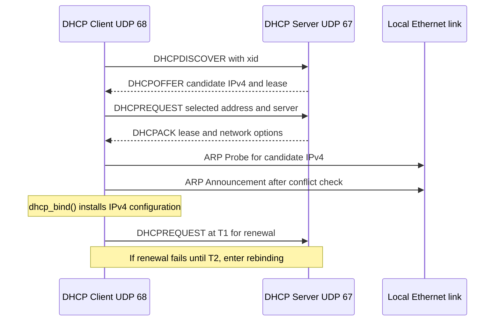
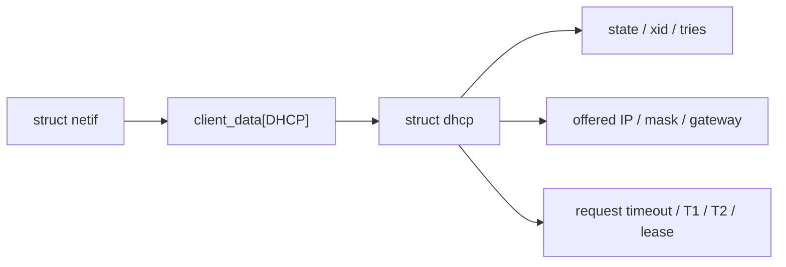
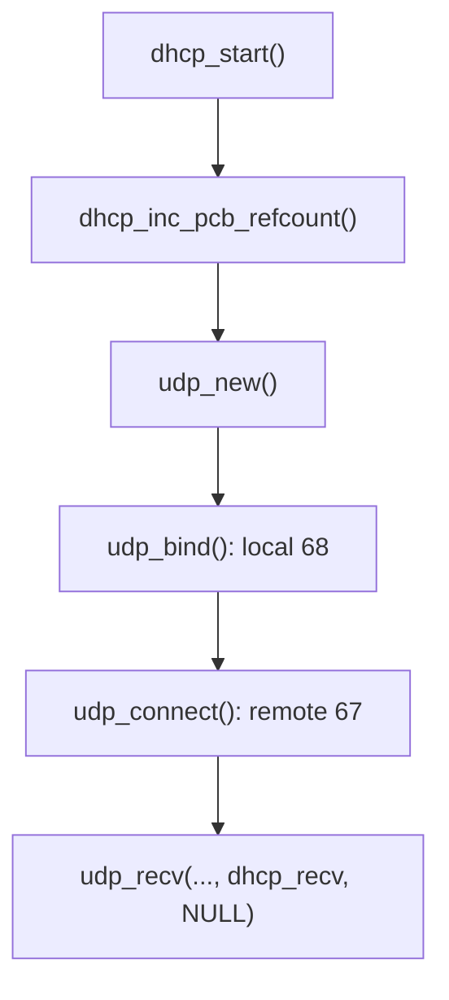
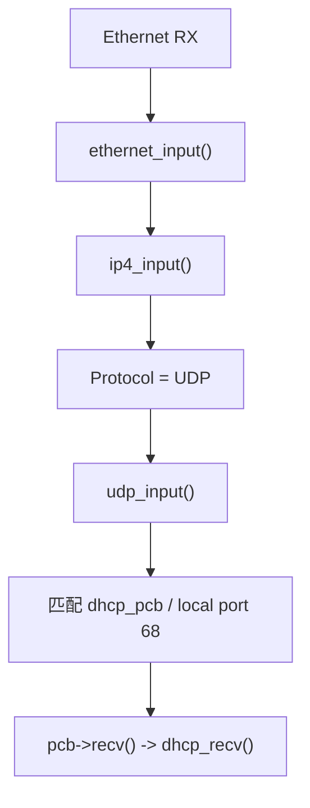
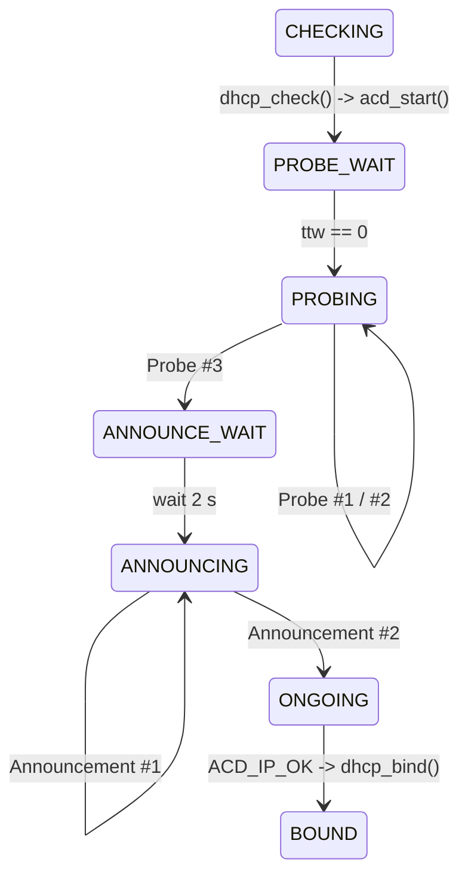
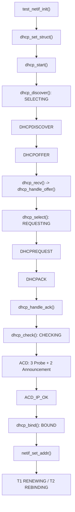

<meta name="referrer" content="no-referrer" />

# 教程 13：从 `dhcp_start()` 到 `DHCP_STATE_BOUND`——DHCPv4、ACD、Timer 与真实抓包

> 摘要：从 example_app 的 DHCP 入口追踪 DORA、UDP 回调、ACD、地址绑定与租约 Timer，并用真实 13 帧 PCAP 验证状态迁移。

[TOC]

DHCPv4（Dynamic Host Configuration Protocol for IPv4，IPv4 动态主机配置协议）解决的是“主机刚接入网络、还没有可用 IPv4 配置时，怎样从网络中的 DHCP Server 获得地址、子网掩码、默认网关、DNS Server 与租约生命周期参数”。当前 lwIP 充当 DHCP Client；Client 使用 UDP 68，Server 使用 UDP 67。由于 Client 在第一次请求时可能仍是 `0.0.0.0`，首次租约阶段允许依赖广播和链路层可达性完成配置交换。[S3](#source-s3)[S6](#source-s6)

本文还会遇到 ACD（Address Conflict Detection，IPv4 地址冲突检测）。ACD 不是 DHCP 的另一种报文，而是在候选 IPv4 地址真正投入使用前，通过 ARP（Address Resolution Protocol，地址解析协议）Probe / Announcement 检查地址是否与同一链路上的其他节点冲突；当前 Host/TAP 实验构建启用了 `LWIP_DHCP_DOES_ACD_CHECK`，且 Ethernet `netif` 带 `NETIF_FLAG_ETHARP`；在这一实现路径里，DHCPACK 后会从 DHCP 状态机桥接到 ACD，确认地址可用后才进入 `dhcp_bind()`。[S4](#source-s4)[S5](#source-s5)[S8](#source-s8)

## 0. 阅读源码前：先把 DHCPv4 的协议动作看懂

### 0.1 建议提前阅读

下面资料用于加速理解和核对规范，不是正文的强制前置条件：

1. [Microsoft Learn — Troubleshooting guide for Dynamic Host Configuration Protocol (DHCP)](https://learn.microsoft.com/en-us/windows-server/troubleshoot/troubleshoot-dhcp-issue)
   - 用途：快速建立 Client / Server、首次租约、续租（Renew）与重绑定（Rebind）的整体视角。[S14](#source-s14)
2. [RFC 2131 — Dynamic Host Configuration Protocol](https://www.rfc-editor.org/rfc/rfc2131.html) 与 [RFC 2132 — DHCP Options and BOOTP Vendor Extensions](https://www.rfc-editor.org/rfc/rfc2132.html)
   - 用途：核对 DHCP message、状态推进、租约与 Option 的规范语义。[S6](#source-s6)
3. [RFC 5227 — IPv4 Address Conflict Detection](https://www.rfc-editor.org/rfc/rfc5227.html)
   - 用途：理解 DHCPACK 之后为什么还会出现 ARP Probe / Announcement。[S8](#source-s8)

### 0.2 DORA、transaction ID 与 DHCP Option 分别解决什么问题

首次获得租约时，最常见的四步交互可以记作 DORA：Discover、Offer、Request、Acknowledgement。它不是一个新的协议层，只是对四种 DHCP message 的缩写。[S6](#source-s6)

| 阶段 | 方向 | 当前消息解决的问题 | Client 侧下一步 |
| --- | --- | --- | --- |
| DHCPDISCOVER | Client → Server | “当前链路上有哪些 DHCP Server 可以提供配置？” | 等待一个或多个候选 OFFER |
| DHCPOFFER | Server → Client | 提供候选 IPv4 地址以及 Server/租约相关参数 | 选择候选并发送 REQUEST |
| DHCPREQUEST | Client → Server | 明确请求哪个 Server 提供的哪个地址 | 等待 DHCPACK，或收到 DHCPNAK 表示请求被拒绝 |
| DHCPACK | Server → Client | 确认租约以及最终配置参数 | 保存 lease/T1/T2，并在当前 lwIP 配置下进入 ACD |

每次 DHCP transaction 都带 `xid`（transaction ID，事务标识符）。Client 生成 `xid`，Response 带回同一个值，接收端据此避免把无关 transaction 的消息误认为当前请求的响应。DHCP Option 则是在固定 BOOTP/DHCP message 头部之后携带的可变配置项；本文会遇到 Message Type、Requested IP、Server Identifier、Lease Time、T1、T2、Subnet Mask、Router 与 DNS Server 等 Option。[S3](#source-s3)[S6](#source-s6)

Lease（租约）意味着地址只在一定时间内有效。T1 是 Renewal Time：到达 T1 后，Client 优先向原 Server 续租；T2 是 Rebinding Time：如果续租仍未成功，到达 T2 后 Client 扩大请求范围，尝试从可达 DHCP Server 重新确认租约。租约最终过期仍未成功时，地址不能继续被当作有效租约使用。[S6](#source-s6)

### 0.3 一次成功 DHCP + ACD 会话先看协议总流程

下面只画本文实际会进入源码的主线。OFFER/ACK 在线上的广播或单播细节受 Client 状态、flags 与 Server 行为影响，因此图中只表达消息方向，不把某一种链路层投递方式泛化成所有 DHCP 会话。[S6](#source-s6)



因此“收到 ACK”与“接口已经正式拥有地址”在当前 **Ethernet + ACD enabled** 主线里不是同一个时刻。ACK 先把候选配置写入 `struct dhcp`，ACD 成功后 `dhcp_bind()` 才把地址写进 `netif`；若 ACD 未启用或接口没有 `NETIF_FLAG_ETHARP`，ACK 分支可以直接进入 `dhcp_bind()`。[S4](#source-s4)[S5](#source-s5)

### 0.4 协议动作怎样落到本文的 lwIP 源码

PCB（Protocol Control Block，协议控制块）是 lwIP 保存一个协议端点运行状态的对象；这里的 UDP PCB 保存 DHCP Client 使用的 UDP endpoint 与 receive callback。

| 协议阶段 | 协议对象/状态 | lwIP 入口或 handler | 关键对象 | 完成后的下一步 |
| --- | --- | --- | --- | --- |
| 启动 Client | INIT / SELECTING | `dhcp_start()` → `dhcp_discover()` | `struct dhcp`、UDP PCB | 发送 DHCPDISCOVER |
| 接收候选 | DHCPOFFER | `udp_input()` → `dhcp_recv()` → `dhcp_handle_offer()` | `xid`、offered address、server id | `dhcp_select()` |
| 选择地址 | DHCPREQUEST | `dhcp_select()` | Requested IP / Server Identifier Options | 等待 ACK |
| 接受租约 | DHCPACK | `dhcp_recv()` → `dhcp_handle_ack()` | lease / T1 / T2 / mask / gateway | 当前 Ethernet+ACD build 进入 `dhcp_check()` |
| 地址冲突检测 | ARP Probe / Announcement | `acd_start()` / `acd_tmr()` | `struct acd` | `ACD_IP_OK` callback |
| 正式采用地址 | BOUND | `dhcp_conflict_callback()` → `dhcp_bind()` | `netif` IPv4 fields | T1/T2 lifecycle |
| 续租/重绑定 | RENEWING / REBINDING | `dhcp_coarse_tmr()` | lease timers | REQUEST / ACK 或租约失效 |

下面进入真实源码时，正文会始终回到这张表中的“当前协议阶段”，而不是把 DHCP 协议与 C 函数拆成两条互不相干的叙事。

## 1. 进入 `dhcp_start()` 前，还必须区分两个 lwIP 接口状态

### 1.1 `administrative up` 与 `link up`

`NETIF_FLAG_UP` 表示接口在软件管理层已启用；`NETIF_FLAG_LINK_UP` 表示驱动/PHY 确认链路已建立。两者都不等于 IPv4 地址已经配置。[S2](#source-s2)

```text
netif_set_up()          -> administrative up
netif_set_link_up()     -> link up
netif_set_addr()        -> IPv4 配置变化
```

Stage 0/2 已经区分这些状态；本篇只保留 DHCP 需要的边界：`dhcp_start()` 要求 `netif` administratively up，但 link down 时只进入 INIT，不发 DISCOVER。

## 2. 真实入口：`test_netif_init()` 先绑定 `struct dhcp`，再调用 `dhcp_start()`

当前 example 并不是在 `dhcp_start()` 中第一次创造 DHCP 对象。`test.c` 先定义一个静态对象：[S1](#source-s1)

```c
#if LWIP_DHCP
static struct dhcp netif_dhcp;
#endif /* LWIP_DHCP */
```

`test_netif_init()` 在建立默认 `netif` 后依次执行：[S1](#source-s1)

```c
#if LWIP_DHCP
  dhcp_set_struct(netif_default, &netif_dhcp);
#endif /* LWIP_DHCP */
  netif_set_up(netif_default);
#if USE_DHCP
  err = dhcp_start(netif_default);
  LWIP_ASSERT("dhcp_start failed", err == ERR_OK);
#elif USE_AUTOIP
  err = autoip_start(netif_default);
  LWIP_ASSERT("autoip_start failed", err == ERR_OK);
#endif /* USE_DHCP */
```

三个动作分别是：

```text
dhcp_set_struct()
  -> 把长期 DHCP client state 绑定到当前 netif

netif_set_up()
  -> administrative up

 dhcp_start()
  -> 启动 DHCP negotiation
```

### 2.1 进入 `dhcp_set_struct()`：`struct dhcp` 被挂到 `netif->client_data`

下面是上游连续源码片段：[S4](#source-s4)

```c
void
dhcp_set_struct(struct netif *netif, struct dhcp *dhcp)
{
  LWIP_ASSERT_CORE_LOCKED();
  LWIP_ASSERT("netif != NULL", netif != NULL);
  LWIP_ASSERT("dhcp != NULL", dhcp != NULL);
  LWIP_ASSERT("netif already has a struct dhcp set", netif_dhcp_data(netif) == NULL);

  memset(dhcp, 0, sizeof(struct dhcp));
  dhcp->flags |= DHCP_FLAG_EXTERNAL_MEM;
  netif_set_client_data(netif, LWIP_NETIF_CLIENT_DATA_INDEX_DHCP, dhcp);
}
```

对象关系是：



这也连接 Stage 12：Core API 允许 `dhcp_start()` 在没有 object 时调用 `mem_malloc(sizeof(struct dhcp))`，但当前 example 已经预先绑定静态对象，所以本实验不会走动态分配 fallback。[S1](#source-s1)[S4](#source-s4)

## 3. `struct dhcp` 与 `struct dhcp_msg` 不是同一个对象

这两个名字很接近，但一个是**长期状态**，一个是**当前报文格式**。

`struct dhcp` 中与本文主线直接相关的字段包括：[S3](#source-s3)

```c
struct dhcp
{
  u32_t xid;
  u8_t pcb_allocated;
  u8_t state;
  u8_t tries;
  u8_t flags;

  dhcp_timeout_t request_timeout;
  dhcp_timeout_t t1_timeout;
  dhcp_timeout_t t2_timeout;
  dhcp_timeout_t t1_renew_time;
  dhcp_timeout_t t2_rebind_time;
  dhcp_timeout_t lease_used;
  dhcp_timeout_t t0_timeout;
  ip_addr_t server_ip_addr;
  ip4_addr_t offered_ip_addr;
  ip4_addr_t offered_sn_mask;
  ip4_addr_t offered_gw_addr;

  u32_t offered_t0_lease;
  u32_t offered_t1_renew;
  u32_t offered_t2_rebind;
#if LWIP_DHCP_DOES_ACD_CHECK
  struct acd acd;
#endif
};
```

`struct dhcp_msg` 则是线上 DHCP message 的 C 视图：[S3](#source-s3)

```c
struct dhcp_msg
{
  PACK_STRUCT_FLD_8(u8_t op);
  PACK_STRUCT_FLD_8(u8_t htype);
  PACK_STRUCT_FLD_8(u8_t hlen);
  PACK_STRUCT_FLD_8(u8_t hops);
  PACK_STRUCT_FIELD(u32_t xid);
  PACK_STRUCT_FIELD(u16_t secs);
  PACK_STRUCT_FIELD(u16_t flags);
  PACK_STRUCT_FLD_S(ip4_addr_p_t ciaddr);
  PACK_STRUCT_FLD_S(ip4_addr_p_t yiaddr);
  PACK_STRUCT_FLD_S(ip4_addr_p_t siaddr);
  PACK_STRUCT_FLD_S(ip4_addr_p_t giaddr);
  PACK_STRUCT_FLD_8(u8_t chaddr[DHCP_CHADDR_LEN]);
  PACK_STRUCT_FLD_8(u8_t sname[DHCP_SNAME_LEN]);
  PACK_STRUCT_FLD_8(u8_t file[DHCP_FILE_LEN]);
  PACK_STRUCT_FIELD(u32_t cookie);
  PACK_STRUCT_FLD_8(u8_t options[DHCP_OPTIONS_LEN]);
};
```

因此一份 OFFER 中的 `yiaddr` 会先进入 `struct dhcp_msg`，再由 `dhcp_handle_offer()` 保存到长期状态 `dhcp->offered_ip_addr`。

## 4. 进入 `dhcp_start()`：先准备 UDP PCB，再决定现在能不能 DISCOVER

`test_netif_init()` 调用 `dhcp_start(netif_default)` 后进入 DHCP Core。函数首先要求接口已经 administratively up：[S4](#source-s4)

```c
err_t
dhcp_start(struct netif *netif)
{
  struct dhcp *dhcp;
  err_t result;
  u8_t saved_flags;

  LWIP_ASSERT_CORE_LOCKED();
  LWIP_ERROR("netif != NULL", (netif != NULL), return ERR_ARG;);
  LWIP_ERROR("netif is not up, old style port?", netif_is_up(netif), return ERR_ARG;);
  dhcp = netif_dhcp_data(netif);

  if (netif->mtu < DHCP_MAX_MSG_LEN_MIN_REQUIRED) {
    return ERR_MEM;
  }
```

当前 example 已有静态 `struct dhcp`，所以 object 分支会复用它。继续阅读 `dhcp_start()`：随后函数取得 DHCP UDP PCB 的引用，并区分 link state：[S4](#source-s4)

```c
  if (dhcp_inc_pcb_refcount() != ERR_OK) {
    return ERR_MEM;
  }
  dhcp->pcb_allocated = 1;

  if (!netif_is_link_up(netif)) {
    dhcp_set_state(dhcp, DHCP_STATE_INIT);
    return ERR_OK;
  }

  result = dhcp_discover(netif);
  if (result != ERR_OK) {
    dhcp_release_and_stop(netif);
    return ERR_MEM;
  }
  return result;
}
```

这正好把前面的术语落到源码：

```text
administrative up
  -> dhcp_start() 可以启动

link down
  -> state = INIT
  -> 还不能发 DISCOVER

link up
  -> dhcp_discover()
```

## 5. `dhcp_inc_pcb_refcount()`：DHCP 继续使用 Stage 5 的 UDP Raw API

`dhcp_start()` 的直接子调用是 `dhcp_inc_pcb_refcount()`。第一次 DHCP client 启动时，它创建共享 UDP PCB，并注册 receive callback。[S4](#source-s4)

```c
static err_t
dhcp_inc_pcb_refcount(void)
{
  if (dhcp_pcb_refcount == 0) {
    LWIP_ASSERT("dhcp_inc_pcb_refcount(): memory leak", dhcp_pcb == NULL);

    dhcp_pcb = udp_new();

    if (dhcp_pcb == NULL) {
      return ERR_MEM;
    }

    ip_set_option(dhcp_pcb, SOF_BROADCAST);

    udp_bind(dhcp_pcb, IP4_ADDR_ANY, LWIP_IANA_PORT_DHCP_CLIENT);
    udp_connect(dhcp_pcb, IP4_ADDR_ANY, LWIP_IANA_PORT_DHCP_SERVER);
    udp_recv(dhcp_pcb, dhcp_recv, NULL);
  }

  dhcp_pcb_refcount++;
  return ERR_OK;
}
```

调用链是：



`struct dhcp` 是 per-netif 状态；当前 DHCP UDP PCB 则由模块共享并通过 refcount 管理。[S4](#source-s4)

## 6. 进入 `dhcp_discover()`：SELECTING 与第一次真实广播

Link 已经 up 时，`dhcp_start()` 直接进入 `dhcp_discover()`。函数先把状态变成 SELECTING，再构造 DISCOVER：[S4](#source-s4)

```c
static err_t
dhcp_discover(struct netif *netif)
{
  struct dhcp *dhcp = netif_dhcp_data(netif);
  err_t result = ERR_OK;
  u16_t msecs;
  u8_t i;
  struct pbuf *p_out;
  u16_t options_out_len;

  ip4_addr_set_any(&dhcp->offered_ip_addr);
  dhcp_set_state(dhcp, DHCP_STATE_SELECTING);
  p_out = dhcp_create_msg(netif, dhcp, DHCP_DISCOVER, &options_out_len);
```

继续阅读 `dhcp_discover()` 的发送点：[S4](#source-s4)

```c
    udp_sendto_if_src(dhcp_pcb, p_out, IP_ADDR_BROADCAST,
                      LWIP_IANA_PORT_DHCP_SERVER, netif, IP4_ADDR_ANY);
    pbuf_free(p_out);
```

这条调用的线上语义是：

```text
Ethernet dst = ff:ff:ff:ff:ff:ff
IPv4 src     = 0.0.0.0
IPv4 dst     = 255.255.255.255
UDP src      = 68
UDP dst      = 67
DHCP type    = DISCOVER
```

最终成功 PCAP 的 Frame 1 与这条源码完全对应：[S10](#source-s10)

```text
Frame 1
0.000000 s
02:12:34:56:78:ab -> ff:ff:ff:ff:ff:ff
0.0.0.0:68 -> 255.255.255.255:67
DHCPDISCOVER
xid = 0x61cd4c18
```

## 7. `dhcp_create_msg()`：transaction ID、Client MAC 与 `pbuf`

`dhcp_discover()` 直接调用 `dhcp_create_msg()`。进入该函数可以看到 DHCP message 本身仍然放在普通 `pbuf` 中：[S4](#source-s4)

```c
  p_out = pbuf_alloc(PBUF_TRANSPORT, sizeof(struct dhcp_msg), PBUF_RAM);
  if (p_out == NULL) {
    return NULL;
  }

  if ((message_type != DHCP_REQUEST) || (dhcp->state == DHCP_STATE_REBOOTING)) {
    if (dhcp->tries == 0) {
#if DHCP_CREATE_RAND_XID && defined(LWIP_RAND)
      xid = LWIP_RAND();
#else
      xid++;
#endif
    }
    dhcp->xid = xid;
  }

  msg_out = (struct dhcp_msg *)p_out->payload;
  memset(msg_out, 0, sizeof(struct dhcp_msg));

  msg_out->op = DHCP_BOOTREQUEST;
  msg_out->htype = LWIP_IANA_HWTYPE_ETHERNET;
  msg_out->hlen = netif->hwaddr_len;
  msg_out->xid = lwip_htonl(dhcp->xid);
```

这里建立：

```text
pbuf
  -> payload
  -> struct dhcp_msg
  -> xid / chaddr / options
```

成功 PCAP 的 DISCOVER、OFFER、REQUEST、ACK 四个 packet 使用相同 `xid=0x61cd4c18`，说明它们属于同一 transaction。[S10](#source-s10)

## 8. OFFER 怎么进入 `dhcp_recv()`：callback 在第 5 节已经注册

DHCPOFFER 返回后仍走前面已经建立的 RX 链：



Stage 5 已经完整讲过 UDP PCB demultiplex，本篇只保留最小桥接。`udp_input()` 调用已注册的 callback 后，callback 接管 `pbuf` ownership。[S7](#source-s7)

```c
if (pcb->recv != NULL) {
  pcb->recv(pcb->recv_arg, pcb, p, ip_current_src_addr(), src);
} else {
  pbuf_free(p);
  goto end;
}
```

### 8.1 进入 `dhcp_recv()`：不是看到 UDP 67/68 就直接接受

下面是 `dhcp_recv()` 的第一段上游连续源码片段：[S4](#source-s4)

```c
static void
dhcp_recv(void *arg, struct udp_pcb *pcb, struct pbuf *p,
          const ip_addr_t *addr, u16_t port)
{
  struct netif *netif = ip_current_input_netif();
  struct dhcp *dhcp = netif_dhcp_data(netif);
  struct dhcp_msg *reply_msg = (struct dhcp_msg *)p->payload;
  u8_t msg_type;
  u8_t i;
  struct dhcp_msg *msg_in;

  LWIP_UNUSED_ARG(arg);

  if ((dhcp == NULL) || (dhcp->pcb_allocated == 0)) {
    goto free_pbuf_and_return;
  }
```

继续阅读同一个 `dhcp_recv()`，它先检查 packet 是否属于当前 client transaction：[S4](#source-s4)

```c
  if (p->len < DHCP_MIN_REPLY_LEN) {
    goto free_pbuf_and_return;
  }

  if (reply_msg->op != DHCP_BOOTREPLY) {
    goto free_pbuf_and_return;
  }

  for (i = 0; i < netif->hwaddr_len &&
       i < LWIP_MIN(DHCP_CHADDR_LEN, NETIF_MAX_HWADDR_LEN); i++) {
    if (netif->hwaddr[i] != reply_msg->chaddr[i]) {
      goto free_pbuf_and_return;
    }
  }

  if (lwip_ntohl(reply_msg->xid) != dhcp->xid) {
    goto free_pbuf_and_return;
  }
```

因此至少同时验证：

```text
BOOTREPLY
Client hardware address
Transaction ID
DHCP options
```

## 9. Frame 2 DHCPOFFER：`dhcp_handle_offer()` 保存候选地址，再进入 `dhcp_select()`

最终成功 PCAP 的 Frame 2 只比 DISCOVER 晚约 `0.249 ms`，这是本地 TAP + 本地 dnsmasq 的实验结果，不应泛化为真实 LAN/WAN 的固定 DHCP 延迟。[S10](#source-s10)

```text
Frame 2
0.000249 s
Server MAC = 0e:df:2b:29:78:22
198.18.0.1:67 -> 198.18.0.149:68
DHCPOFFER
xid         = 0x61cd4c18
yiaddr      = 198.18.0.149
Server ID   = 198.18.0.1
Subnet Mask = 255.255.255.0
Router      = 198.18.0.1
Lease       = 3600 s
T1          = 1800 s
T2          = 3150 s
```

### 9.1 一个抓包细节：本机还是 `0.0.0.0`，为什么 OFFER 的 IPv4 目的地址可以是 `198.18.0.149`？

Frame 2 的 IPv4 destination 是候选地址 `198.18.0.149`，但此时 `example_app` 日志仍显示本地 IPv4 为 `0.0.0.0`。[S10](#source-s10)[S12](#source-s12) 这不是抓包矛盾。

当前 `ip4_input()` 对 DHCP client 有一个明确的 link-layer-addressed 特例：当普通 IPv4 destination 匹配没有找到本地 `netif` 时，如果 packet 是 UDP 且目的端口为 DHCP client 端口 68，就允许该 packet 使用当前 ingress `netif` 继续进入 UDP。[S13](#source-s13)

```c
#if LWIP_DHCP
#define IP_ACCEPT_LINK_LAYER_ADDRESSED_PORT(port) \
  ((port) == PP_NTOHS(LWIP_IANA_PORT_DHCP_CLIENT))
#endif
```

继续阅读 `ip4_input()` 对这类 packet 的接收分支：[S13](#source-s13)

```c
  if (netif == NULL) {
    if (IPH_PROTO(iphdr) == IP_PROTO_UDP) {
      const struct udp_hdr *udphdr =
        (const struct udp_hdr *)((const u8_t *)iphdr + iphdr_hlen);
      if (IP_ACCEPT_LINK_LAYER_ADDRESSED_PORT(udphdr->dest)) {
        netif = inp;
        check_ip_src = 0;
      }
    }
  }
```

所以 Frame 2/4 能在地址正式 bind 前到达 `dhcp_recv()`，依赖的是 Ethernet 已经把报文送到本机 MAC，加上 lwIP 对 DHCP client UDP 68 的 IPv4 输入特例。

`dhcp_recv()` 只有在当前状态为 SELECTING 时接受 OFFER，并调用 `dhcp_handle_offer()`。[S4](#source-s4)

```c
  else if ((msg_type == DHCP_OFFER) &&
           (dhcp->state == DHCP_STATE_SELECTING)) {
    dhcp_handle_offer(netif, msg_in);
  }
```

进入 `dhcp_handle_offer()`：[S4](#source-s4)

```c
static void
dhcp_handle_offer(struct netif *netif, struct dhcp_msg *msg_in)
{
  struct dhcp *dhcp = netif_dhcp_data(netif);

  if (dhcp_option_given(dhcp, DHCP_OPTION_IDX_SERVER_ID)) {
    dhcp->request_timeout = 0;

    ip_addr_set_ip4_u32(&dhcp->server_ip_addr,
      lwip_htonl(dhcp_get_option_value(dhcp, DHCP_OPTION_IDX_SERVER_ID)));

    ip4_addr_copy(dhcp->offered_ip_addr, msg_in->yiaddr);

    dhcp_select(netif);
  }
}
```

函数直接保存：

```text
server_ip_addr  = 198.18.0.1
offered_ip_addr = 198.18.0.149
```

然后直接进入 `dhcp_select()`。

## 10. Frame 3 DHCPREQUEST：`dhcp_select()` 明确选择地址与 Server

进入 `dhcp_select()` 后，state 先变成 REQUESTING：[S4](#source-s4)

```c
static err_t
dhcp_select(struct netif *netif)
{
  struct dhcp *dhcp;
  err_t result;
  u16_t msecs;
  u8_t i;
  struct pbuf *p_out;
  u16_t options_out_len;

  dhcp = netif_dhcp_data(netif);
  dhcp_set_state(dhcp, DHCP_STATE_REQUESTING);

  p_out = dhcp_create_msg(netif, dhcp, DHCP_REQUEST, &options_out_len);
```

继续阅读 `dhcp_select()`，当前 REQUEST 会携带 Requested IP 和 Server Identifier：[S4](#source-s4)[S6](#source-s6)

```c
    options_out_len = dhcp_option(options_out_len, msg_out->options,
                                  DHCP_OPTION_REQUESTED_IP, 4);
    options_out_len = dhcp_option_long(options_out_len, msg_out->options,
      lwip_ntohl(ip4_addr_get_u32(&dhcp->offered_ip_addr)));

    options_out_len = dhcp_option(options_out_len, msg_out->options,
                                  DHCP_OPTION_SERVER_ID, 4);
    options_out_len = dhcp_option_long(options_out_len, msg_out->options,
      lwip_ntohl(ip4_addr_get_u32(ip_2_ip4(&dhcp->server_ip_addr))));
```

Frame 3 正好显示：[S10](#source-s10)

```text
DHCPREQUEST
Requested IP = 198.18.0.149
Server ID    = 198.18.0.1
xid          = 0x61cd4c18
```

## 11. Frame 4 DHCPACK：收到 ACK 仍不等于地址已经正式可用

Frame 4 在约 `2.707 ms` 到达：[S10](#source-s10)

```text
DHCPACK
yiaddr      = 198.18.0.149
Subnet Mask = 255.255.255.0
Router      = 198.18.0.1
Lease       = 3600 s
T1          = 1800 s
T2          = 3150 s
```

当前 `dhcp_recv()` 对 REQUESTING/REBOOTING 收到 ACK 的路径是：[S4](#source-s4)

```c
  if (msg_type == DHCP_ACK) {
    if ((dhcp->state == DHCP_STATE_REQUESTING) ||
        (dhcp->state == DHCP_STATE_REBOOTING)) {
      dhcp_handle_ack(netif, msg_in);
#if LWIP_DHCP_DOES_ACD_CHECK
      if ((netif->flags & NETIF_FLAG_ETHARP) != 0) {
        dhcp_check(netif);
      } else {
        dhcp_bind(netif);
      }
#else
      dhcp_bind(netif);
#endif
    }
```

这段代码直接证明：**Ethernet + ACD 配置下，ACK 后先 `dhcp_check()`，不是立刻 `dhcp_bind()`。**

### 11.1 `dhcp_handle_ack()`：把 lease、T1、T2、mask、gateway 存进长期状态

进入 `dhcp_handle_ack()`，当前实现读取 lease/T1/T2；若 server 没给 T1/T2，则分别使用 lease 的 1/2 和 7/8。[S4](#source-s4)[S6](#source-s6)

```c
  if (dhcp_option_given(dhcp, DHCP_OPTION_IDX_LEASE_TIME)) {
    dhcp->offered_t0_lease =
      dhcp_get_option_value(dhcp, DHCP_OPTION_IDX_LEASE_TIME);
  }

  if (dhcp_option_given(dhcp, DHCP_OPTION_IDX_T1)) {
    dhcp->offered_t1_renew = dhcp_get_option_value(dhcp, DHCP_OPTION_IDX_T1);
  } else {
    dhcp->offered_t1_renew = dhcp->offered_t0_lease / 2;
  }

  if (dhcp_option_given(dhcp, DHCP_OPTION_IDX_T2)) {
    dhcp->offered_t2_rebind = dhcp_get_option_value(dhcp, DHCP_OPTION_IDX_T2);
  } else {
    dhcp->offered_t2_rebind = (dhcp->offered_t0_lease * 7U) / 8U;
  }
```

继续阅读 `dhcp_handle_ack()`，subnet mask 与 gateway 也先保存到 `struct dhcp`，还没有写入 `netif`：[S4](#source-s4)

```c
  if (dhcp_option_given(dhcp, DHCP_OPTION_IDX_SUBNET_MASK)) {
    ip4_addr_set_u32(&dhcp->offered_sn_mask,
      lwip_htonl(dhcp_get_option_value(dhcp, DHCP_OPTION_IDX_SUBNET_MASK)));
    dhcp->flags |= DHCP_FLAG_SUBNET_MASK_GIVEN;
  } else {
    dhcp->flags &= ~DHCP_FLAG_SUBNET_MASK_GIVEN;
  }

  if (dhcp_option_given(dhcp, DHCP_OPTION_IDX_ROUTER)) {
    ip4_addr_set_u32(&dhcp->offered_gw_addr,
      lwip_htonl(dhcp_get_option_value(dhcp, DHCP_OPTION_IDX_ROUTER)));
  }
```

## 12. 进入 `dhcp_check()`：从 DHCP state machine 切到 ACD state machine

`dhcp_recv()` 的 call site 已经明确出现，下面进入 `dhcp_check()`：[S4](#source-s4)

```c
static void
dhcp_check(struct netif *netif)
{
  struct dhcp *dhcp = netif_dhcp_data(netif);

  dhcp_set_state(dhcp, DHCP_STATE_CHECKING);
  acd_start(netif, &dhcp->acd, dhcp->offered_ip_addr);
}
```

这一步把 DHCP 客户端状态从 REQUESTING 切到 CHECKING，然后把候选地址 `198.18.0.149` 交给 ACD。[S10](#source-s10)

### 12.1 进入 `acd_start()`：先进入 PROBE_WAIT

`acd_start()` 初始化 ACD object：[S5](#source-s5)

```c
err_t
acd_start(struct netif *netif, struct acd *acd, ip4_addr_t ipaddr)
{
  err_t result = ERR_OK;

  acd->sent_num = 0;
  acd->lastconflict = 0;
  ip4_addr_copy(acd->ipaddr, ipaddr);
  acd->state = ACD_STATE_PROBE_WAIT;
  acd->ttw = (u16_t)(ACD_RANDOM_PROBE_WAIT(netif, acd));

  return result;
}
```

当前 ACD 参数为：[S5](#source-s5)

```c
#define PROBE_WAIT           1
#define PROBE_MIN            1
#define PROBE_MAX            2
#define PROBE_NUM            3
#define ANNOUNCE_NUM         2
#define ANNOUNCE_INTERVAL    2
#define ANNOUNCE_WAIT        2
```

ACD timer tick 为 `100 ms`。[S5](#source-s5)

## 13. Frames 5～7：真实 PCAP 精确验证了 3 个 ARP Probe

成功 PCAP 中的三个 Probe：[S10](#source-s10)

| Frame | 相对时间 | Sender IP | Target IP | 含义 |
| ---: | ---: | --- | --- | --- |
| 5 | 0.300280 s | `0.0.0.0` | `198.18.0.149` | Probe #1 |
| 6 | 1.400353 s | `0.0.0.0` | `198.18.0.149` | Probe #2 |
| 7 | 3.300526 s | `0.0.0.0` | `198.18.0.149` | Probe #3 |

三个包都是：

```text
Ethernet dst = ff:ff:ff:ff:ff:ff
ARP op       = Request
Sender MAC   = 02:12:34:56:78:ab
Sender IP    = 0.0.0.0
Target MAC   = 00:00:00:00:00:00
Target IP    = 198.18.0.149
```

`SPA=0.0.0.0` 很重要：Probe 的含义不是“本机已经是 198.18.0.149”，而是“在正式声明该地址前，先确认是否有人正在使用它”。[S8](#source-s8)

### 13.1 `acd_tmr()` 为什么正好发送 3 个 Probe

进入 `acd_tmr()` 的 PROBING 分支：[S5](#source-s5)

```c
        case ACD_STATE_PROBE_WAIT:
        case ACD_STATE_PROBING:
          if (acd->ttw == 0) {
            acd->state = ACD_STATE_PROBING;
            etharp_acd_probe(netif, &acd->ipaddr);
            acd->sent_num++;
            if (acd->sent_num >= PROBE_NUM) {
              acd->state = ACD_STATE_ANNOUNCE_WAIT;
              acd->sent_num = 0;
              acd->ttw = (u16_t)(ANNOUNCE_WAIT * ACD_TICKS_PER_SECOND);
            } else {
              acd->ttw = (u16_t)(ACD_RANDOM_PROBE_INTERVAL(netif, acd));
            }
          }
```

PCAP 时间与这些参数对应得非常清楚：[S5](#source-s5)[S10](#source-s10)

```text
ACK -> Probe #1 约 0.298 s
Probe #1 -> #2 约 1.100 s
Probe #2 -> #3 约 1.900 s
```

首次等待落在 `0～1 s`，后续两次间隔落在 `1～2 s`。

### 13.2 `etharp_acd_probe()` 为什么线上看到 `0.0.0.0 -> candidate IP`

`acd_tmr()` 调用 `etharp_acd_probe()`；这个函数明确把 sender IP 写成 ANY，把 target IP 写成候选地址：[S5](#source-s5)

```c
err_t
etharp_acd_probe(struct netif *netif, const ip4_addr_t *ipaddr)
{
  return etharp_raw(netif, (struct eth_addr *)netif->hwaddr, &ethbroadcast,
                    (struct eth_addr *)netif->hwaddr, IP4_ADDR_ANY4, &ethzero,
                    ipaddr, ARP_REQUEST);
}
```

因此 Probe packet 与源码字段一一对应。

## 14. Frames 8 和 11：两次 ARP Announcement

第三个 Probe 后约 2 秒，PCAP 出现第一次 Announcement；再过约 2 秒出现第二次：[S10](#source-s10)

| Frame | 相对时间 | Sender IP | Target IP |
| ---: | ---: | --- | --- |
| 8 | 5.299620 s | `198.18.0.149` | `198.18.0.149` |
| 11 | 7.300124 s | `198.18.0.149` | `198.18.0.149` |

与 Probe 最大的区别是：

```text
Probe
  SPA = 0.0.0.0
  TPA = 198.18.0.149

Announcement
  SPA = 198.18.0.149
  TPA = 198.18.0.149
```

`etharp_acd_announce()` 的参数正是这个结构：[S5](#source-s5)

```c
err_t
etharp_acd_announce(struct netif *netif, const ip4_addr_t *ipaddr)
{
  return etharp_raw(netif, (struct eth_addr *)netif->hwaddr, &ethbroadcast,
                    (struct eth_addr *)netif->hwaddr, ipaddr, &ethzero,
                    ipaddr, ARP_REQUEST);
}
```

### 14.1 第二次 Announcement 后才回调 `ACD_IP_OK`

继续阅读 `acd_tmr()` 的 ANNOUNCING 分支：[S5](#source-s5)

```c
            etharp_acd_announce(netif, &acd->ipaddr);
            acd->ttw = ANNOUNCE_INTERVAL * ACD_TICKS_PER_SECOND;
            acd->sent_num++;

            if (acd->sent_num >= ANNOUNCE_NUM) {
              acd->state = ACD_STATE_ONGOING;
              acd->sent_num = 0;
              acd->ttw = 0;
              acd->acd_conflict_callback(netif, ACD_IP_OK);
            }
```

所以当前实现的成功时序是：



## 15. `ACD_IP_OK` 返回 DHCP：`dhcp_conflict_callback()` 直接调用 `dhcp_bind()`

ACD 成功后通过注册的 conflict callback 回到 DHCP。当前 `dhcp_conflict_callback()` 的成功分支只有一件关键事情：[S4](#source-s4)

```c
  switch (state) {
    case ACD_IP_OK:
      dhcp_bind(netif);
      break;
```

所以函数切换是：

```text
acd_tmr()
  -> acd_conflict_callback(..., ACD_IP_OK)
  -> dhcp_conflict_callback()
  -> dhcp_bind()
```

## 16. 进入 `dhcp_bind()`：到这里 `netif` 才真正获得 IPv4 配置

`dhcp_bind()` 先把 Server 给出的 seconds 转换成 coarse timer 使用的 tick，并保存 T0/T1/T2 runtime counter。[S4](#source-s4)

函数结尾才真正落到 `netif`：[S4](#source-s4)

```c
  ip4_addr_copy(gw_addr, dhcp->offered_gw_addr);

  dhcp_set_state(dhcp, DHCP_STATE_BOUND);

  netif_set_addr(netif, &dhcp->offered_ip_addr, &sn_mask, &gw_addr);
```

这解释了实验日志为什么先出现两次 `0.0.0.0`，最后才出现租约地址：[S12](#source-s12)

```text
Starting lwIP, local interface IP is dhcp-enabled
ip6 linklocal address: FE80::12:34FF:FE56:78AB
status_callback==UP, local interface IP is 0.0.0.0
status_callback==UP, local interface IP is 0.0.0.0
status_callback==UP, local interface IP is 198.18.0.149
```

前两个 `UP` 不能读成“DHCP 已经成功”，它们只表示 `netif` 的软件状态发生 callback，此时 IPv4 仍是 `0.0.0.0`。最终 `198.18.0.149` 才证明地址已经落入接口。

## 17. Frames 9～13：抓包还能证明“ACD 完成前后 ARP 行为真的不同”

这组 packet 是本次实验最有价值的部分，因为它不仅证明有 ACD，还能观察地址从“候选”变为“正式使用”的边界。[S10](#source-s10)

PCAP 中 Host `198.18.0.1` 在第一次 Announcement 后开始询问 `198.18.0.149`：

| Frame | 时间 | 内容 | Client 是否 Reply |
| ---: | ---: | --- | --- |
| 9 | 5.391489 s | Host ARP Request: who has `198.18.0.149` | 没有 |
| 10 | 6.415773 s | Host 再次 ARP Request | 没有 |
| 11 | 7.300124 s | Client 第二次 Announcement | ACD 完成 |
| 12 | 7.439850 s | Host 第三次 ARP Request | — |
| 13 | 7.439926 s | Client ARP Reply | 有 |

Frame 13 明确回答：[S10](#source-s10)

```text
198.18.0.149 is at 02:12:34:56:78:ab
```

Frame 12 到 Frame 13 只约 `76 us`。结合 `acd_tmr()` 在第二次 Announcement 后同步触发 `ACD_IP_OK -> dhcp_bind() -> netif_set_addr()` 的源码，可以形成以下证据链：[S4](#source-s4)[S5](#source-s5)[S10](#source-s10)

```text
第一次 Announcement 后
  -> Host 询问 198.18.0.149
  -> Client 没有作为正式地址响应

第二次 Announcement
  -> ACD_IP_OK
  -> dhcp_bind()
  -> netif_set_addr()

Host 再询问 198.18.0.149
  -> Client 立即 ARP Reply
```

这里需要严格限定证据含义：PCAP 直接证明前两次 Host ARP Request 没有看到 Client Reply、第二次 Announcement 后看到了 Reply；把这个现象与 `ACD_IP_OK -> dhcp_bind()` 的当前源码路径对应，是基于源码与抓包共同形成的实现层分析，不应写成所有 DHCP Client 的通用协议要求。

## 18. 本次成功实验的 13 帧总时间线

将协议、源码和状态放在一起：[S4](#source-s4)[S5](#source-s5)[S10](#source-s10)

| Frame | 相对时间 | 线上事件 | lwIP 关键函数/状态 |
| ---: | ---: | --- | --- |
| 1 | 0.000000 | DHCPDISCOVER | `dhcp_discover()` / SELECTING |
| 2 | 0.000249 | DHCPOFFER `198.18.0.149` | `dhcp_recv()` → `dhcp_handle_offer()` |
| 3 | 0.000920 | DHCPREQUEST | `dhcp_select()` / REQUESTING |
| 4 | 0.002707 | DHCPACK | `dhcp_handle_ack()` → `dhcp_check()` / CHECKING |
| 5 | 0.300280 | ARP Probe #1 | `acd_tmr()` → `etharp_acd_probe()` |
| 6 | 1.400353 | ARP Probe #2 | ACD PROBING |
| 7 | 3.300526 | ARP Probe #3 | PROBING → ANNOUNCE_WAIT |
| 8 | 5.299620 | ARP Announcement #1 | ACD ANNOUNCING |
| 9 | 5.391489 | Host ARP Request | ACD 尚未完成 |
| 10 | 6.415773 | Host ARP Request | ACD 尚未完成 |
| 11 | 7.300124 | ARP Announcement #2 | `ACD_IP_OK` → `dhcp_bind()` |
| 12 | 7.439850 | Host ARP Request | `netif` 已绑定地址 |
| 13 | 7.439926 | ARP Reply | `198.18.0.149` 正常参与 ARP |

这份抓包已经足够把“DORA → ACD → BOUND → 地址真正参与二层邻居解析”完整闭环。

## 19. 一份失败抓包反而把 DHCP 重传 Timer 证明得更清楚

实验过程中还保留了一份没有运行 DHCP Server 时的 PCAP：[`assets/stage13-dhcp-no-server.pcap`](assets/stage13-dhcp-no-server.pcap)。它只有 5 个 DHCPDISCOVER，没有任何 OFFER 或 ARP。[S11](#source-s11)

| Frame | 相对时间 | DHCP | XID |
| ---: | ---: | --- | --- |
| 1 | 0.000000 s | DISCOVER | `0x48968f4a` |
| 2 | 1.999799 s | DISCOVER | `0x48968f4a` |
| 3 | 5.999137 s | DISCOVER | `0x48968f4a` |
| 4 | 13.999329 s | DISCOVER | `0x48968f4a` |
| 5 | 30.000045 s | DISCOVER | `0x48968f4a` |

相邻间隔约：

```text
2 s
4 s
8 s
16 s
```

这不是 `dhcp_fine_tmr()` 每 500 ms 就发送一次 DISCOVER。500 ms 只是 timeout scheduler 的细粒度 tick；真正的 DISCOVER 重试 deadline 由 `dhcp_discover()` 中的 backoff 计算得到。[S4](#source-s4)[S11](#source-s11)

当前实现定义：[S4](#source-s4)

```c
#define DHCP_REQUEST_BACKOFF_SEQUENCE(tries) \
  (u16_t)(((tries) < 6 ? 1 << (tries) : 60) * 1000)
```

继续阅读 `dhcp_discover()` 结尾：[S4](#source-s4)

```c
  if (dhcp->tries < 255) {
    dhcp->tries++;
  }
  msecs = DHCP_REQUEST_BACKOFF_SEQUENCE(dhcp->tries);
  dhcp->request_timeout =
    (u16_t)((msecs + DHCP_FINE_TIMER_MSECS - 1) / DHCP_FINE_TIMER_MSECS);
  return result;
```

于是抓包中的 `2 → 4 → 8 → 16 s` 与当前源码 backoff 精确对应。

## 20. DHCP Timer 与 Stage 9 的 TCP Timer 有什么不同

Stage 9 的 TCP timer 是特殊的按 active/TIME-WAIT PCB 按需启动。DHCP 则直接出现在 `lwip_cyclic_timers[]` 中，只要 `LWIP_DHCP=1`，`sys_timeouts_init()` 会注册 fine/coarse 周期 timer。[S9](#source-s9)

```c
#if LWIP_DHCP
  {DHCP_COARSE_TIMER_MSECS, HANDLER(dhcp_coarse_tmr)},
  {DHCP_FINE_TIMER_MSECS, HANDLER(dhcp_fine_tmr)},
#endif /* LWIP_DHCP */
```

周期是：[S3](#source-s3)

```text
dhcp_fine_tmr()   = 500 ms
dhcp_coarse_tmr() = 60 s
```

### 20.1 `dhcp_fine_tmr()`：短期 transaction retry

上游连续源码片段：[S4](#source-s4)

```c
void
dhcp_fine_tmr(void)
{
  struct netif *netif;
  NETIF_FOREACH(netif) {
    struct dhcp *dhcp = netif_dhcp_data(netif);
    if (dhcp != NULL) {
      if (dhcp->request_timeout > 1) {
        dhcp->request_timeout--;
      } else if (dhcp->request_timeout == 1) {
        dhcp->request_timeout--;
        dhcp_timeout(netif);
      }
    }
  }
}
```

因此 500 ms 是 countdown 单位，不是线上报文周期。

### 20.2 `dhcp_coarse_tmr()`：租约 T1/T2/T0 生命周期

上游连续源码片段：[S4](#source-s4)

```c
void
dhcp_coarse_tmr(void)
{
  struct netif *netif;
  NETIF_FOREACH(netif) {
    struct dhcp *dhcp = netif_dhcp_data(netif);
    if ((dhcp != NULL) && (dhcp->state != DHCP_STATE_OFF)) {
      if (dhcp->t0_timeout && (++dhcp->lease_used == dhcp->t0_timeout)) {
        dhcp_release_and_stop(netif);
        dhcp_start(netif);
      } else if (dhcp->t2_rebind_time &&
                 (dhcp->t2_rebind_time-- == 1)) {
        dhcp_t2_timeout(netif);
      } else if (dhcp->t1_renew_time &&
                 (dhcp->t1_renew_time-- == 1)) {
        dhcp_t1_timeout(netif);
      }
    }
  }
}
```

## 21. RFC 2131 的 T1/T2 在 lwIP 中分别落到哪条发送路径

RFC 2131 已经定义 T1/T2 对应的 Renew/Rebind 行为，本篇不再重复解释协议理由，只看它们在 lwIP 的发送目标如何落地。[S6](#source-s6) T1 到期后进入 `dhcp_renew()`，state 变成 RENEWING；当前实现向原 DHCP Server 发送 REQUEST。[S4](#source-s4)

```c
    result = udp_sendto_if(dhcp_pcb, p_out,
                           &dhcp->server_ip_addr,
                           LWIP_IANA_PORT_DHCP_SERVER,
                           netif);
    pbuf_free(p_out);
```

T2 到期后进入 `dhcp_rebind()` 并切换到 REBINDING；继续阅读 `dhcp_rebind()`，发送目标改成 broadcast：[S4](#source-s4)[S6](#source-s6)

```c
    result = udp_sendto_if(dhcp_pcb, p_out,
                           IP_ADDR_BROADCAST,
                           LWIP_IANA_PORT_DHCP_SERVER,
                           netif);
    pbuf_free(p_out);
```

因此：

```text
RENEWING
  -> 仍优先联系原 DHCP Server

REBINDING
  -> 不再只依赖原 Server
  -> 广播 DHCPREQUEST
```

本文实验 lease 为 3600 s、T1 为 1800 s、T2 为 3150 s。由于本次抓包只持续约 7.44 s，没有实际等待 30/52.5 分钟，因此 RENEWING/REBINDING 的线上 packet 尚未在本次 PCAP 中实测；这部分结论来自当前源码和 RFC，而不是本次实验结果。[S4](#source-s4)[S6](#source-s6)[S10](#source-s10)

## 22. 本次实验怎样复现

Host 使用 Stage 2 网络：`lwip0=198.18.0.1/24`，DHCP pool 为 `198.18.0.100~199`。本次实际使用 dnsmasq 2.91。[S12](#source-s12)

启动 DHCP Server：

```sh
sudo dnsmasq \
  --no-daemon --conf-file= --port=0 \
  --interface=lwip0 --bind-interfaces --dhcp-authoritative \
  --dhcp-range=198.18.0.100,198.18.0.199,255.255.255.0,1h \
  --dhcp-option=3,198.18.0.1 \
  --dhcp-leasefile=/tmp/lwip-source-lab-dhcp.leases
```

抓 DORA 与 ACD：

```sh
sudo tcpdump -i lwip0 -nn -e -vvv -s 0 -U \
  -w captures/stage13-dhcp-acd.pcap \
  'arp or udp port 67 or udp port 68'
```

运行 example：

```sh
PRECONFIGURED_TAPIF=lwip0 \
./build/example/contrib/ports/unix/example_app/example_app
```

本项目保存了最终 PCAP [`assets/stage13-dhcp-acd.pcap`](assets/stage13-dhcp-acd.pcap) 和关键控制台日志 [`assets/stage13-dhcp-success.log`](assets/stage13-dhcp-success.log)。[S10](#source-s10)[S12](#source-s12)

成功日志最终出现：

```text
status_callback==UP, local interface IP is 198.18.0.149
```

## 23. 把 Stage 13 收束成一张运行图



这篇真正需要建立的记忆不是“四个 DHCP 报文名称”，而是：

> DHCP Client 是挂在 `netif` 上的长期状态对象；UDP callback 把响应交给它，fine/coarse Timer 在没有 packet 时继续推动状态机，ACD 在 ACK 后确认候选地址没有冲突，最后 `dhcp_bind()` 才把 IP、subnet mask 和 gateway 真正落到 `netif`。

下一篇进入 DNS 时，就可以从本篇已经出现的交叉点继续：DHCPACK 可以携带 DNS Server option，但 hostname query、cache、UDP query 与 `dns_recv()` 是另一条独立主线。

## 资料来源

<a id="source-s1"></a>
### [S1] lwIP upstream `example_app` DHCP 入口
- 类型：目标版本上游源码
- 版本：`d08f4773edd0182b7910fc8f046eed82ffcd67c9`
- URL/文档：[`contrib/examples/example_app/test.c`](https://github.com/lwip-tcpip/lwip/blob/d08f4773edd0182b7910fc8f046eed82ffcd67c9/contrib/examples/example_app/test.c)
- 使用位置：真实入口、静态 `struct dhcp`、`dhcp_start()` 调用
- 支撑内容：证明 example 预先绑定静态 `struct dhcp`。

<a id="source-s2"></a>
### [S2] lwIP `netif` 状态定义
- 类型：目标版本上游源码
- 版本：`d08f4773edd0182b7910fc8f046eed82ffcd67c9`
- URL/文档：[`src/include/lwip/netif.h`](https://github.com/lwip-tcpip/lwip/blob/d08f4773edd0182b7910fc8f046eed82ffcd67c9/src/include/lwip/netif.h)、[`src/core/netif.c`](https://github.com/lwip-tcpip/lwip/blob/d08f4773edd0182b7910fc8f046eed82ffcd67c9/src/core/netif.c)
- 使用位置：administrative up 与 link up
- 支撑内容：区分 `NETIF_FLAG_UP` 与 `NETIF_FLAG_LINK_UP`。

<a id="source-s3"></a>
### [S3] DHCP 数据结构、状态与协议常量
- 类型：目标版本上游源码
- 版本：`d08f4773edd0182b7910fc8f046eed82ffcd67c9`
- URL/文档：[`src/include/lwip/dhcp.h`](https://github.com/lwip-tcpip/lwip/blob/d08f4773edd0182b7910fc8f046eed82ffcd67c9/src/include/lwip/dhcp.h)、[`src/include/lwip/prot/dhcp.h`](https://github.com/lwip-tcpip/lwip/blob/d08f4773edd0182b7910fc8f046eed82ffcd67c9/src/include/lwip/prot/dhcp.h)、[`src/include/lwip/prot/iana.h`](https://github.com/lwip-tcpip/lwip/blob/d08f4773edd0182b7910fc8f046eed82ffcd67c9/src/include/lwip/prot/iana.h)
- 使用位置：`struct dhcp`、`struct dhcp_msg`、UDP 67/68、DHCP Timer
- 支撑内容：DHCP runtime state、wire message 与协议编号定义。

<a id="source-s4"></a>
### [S4] lwIP DHCPv4 client 实现
- 类型：目标版本上游源码
- 版本：`d08f4773edd0182b7910fc8f046eed82ffcd67c9`
- URL/文档：[`src/core/ipv4/dhcp.c`](https://github.com/lwip-tcpip/lwip/blob/d08f4773edd0182b7910fc8f046eed82ffcd67c9/src/core/ipv4/dhcp.c)
- 关键符号：`dhcp_start()`、`dhcp_discover()`、`dhcp_recv()`、`dhcp_handle_offer()`、`dhcp_select()`、`dhcp_handle_ack()`、`dhcp_check()`、`dhcp_conflict_callback()`、`dhcp_bind()`、`dhcp_fine_tmr()`、`dhcp_coarse_tmr()`
- 使用位置：全文 DHCP 主调用链
- 支撑内容：DORA、ACD bridge、地址绑定、retry 与 lease lifecycle。

<a id="source-s5"></a>
### [S5] lwIP Address Conflict Detection 与 ARP Probe/Announcement
- 类型：目标版本上游源码
- 版本：`d08f4773edd0182b7910fc8f046eed82ffcd67c9`
- URL/文档：[`src/core/ipv4/acd.c`](https://github.com/lwip-tcpip/lwip/blob/d08f4773edd0182b7910fc8f046eed82ffcd67c9/src/core/ipv4/acd.c)、[`src/core/ipv4/etharp.c`](https://github.com/lwip-tcpip/lwip/blob/d08f4773edd0182b7910fc8f046eed82ffcd67c9/src/core/ipv4/etharp.c)、[`src/include/lwip/prot/acd.h`](https://github.com/lwip-tcpip/lwip/blob/d08f4773edd0182b7910fc8f046eed82ffcd67c9/src/include/lwip/prot/acd.h)
- 使用位置：3 个 Probe、2 个 Announcement、`ACD_IP_OK`
- 支撑内容：ACD 状态机、时间参数与线上 ARP 字段。

<a id="source-s6"></a>
### [S6] RFC 2131 / RFC 2132 — DHCPv4 与 DHCP Options
- 类型：标准规范
- 版本：RFC 2131 / RFC 2132，1997-03
- URL/文档：[RFC 2131](https://www.rfc-editor.org/rfc/rfc2131.html)、[RFC 2132](https://www.rfc-editor.org/rfc/rfc2132.html)
- 使用位置：DORA、lease、T1/T2、DHCP options、renew/rebind
- 支撑内容：DHCP client 状态和 option 的规范语义。

<a id="source-s7"></a>
### [S7] lwIP UDP receive callback 分派
- 类型：目标版本上游源码
- 版本：`d08f4773edd0182b7910fc8f046eed82ffcd67c9`
- URL/文档：[`src/core/udp.c`](https://github.com/lwip-tcpip/lwip/blob/d08f4773edd0182b7910fc8f046eed82ffcd67c9/src/core/udp.c)
- 使用位置：`udp_input()` 到 `dhcp_recv()` 的桥接
- 支撑内容：UDP PCB callback 分发与 `pbuf` ownership。

<a id="source-s8"></a>
### [S8] RFC 5227 — IPv4 Address Conflict Detection
- 类型：标准规范
- 版本：RFC 5227，2008-07
- URL/文档：[RFC 5227](https://www.rfc-editor.org/rfc/rfc5227.html)
- 使用位置：Probe/Announcement 语义
- 支撑内容：IPv4 Address Conflict Detection 的规范背景。

<a id="source-s9"></a>
### [S9] lwIP timeout scheduler
- 类型：目标版本上游源码
- 版本：`d08f4773edd0182b7910fc8f046eed82ffcd67c9`
- URL/文档：[`src/core/timeouts.c`](https://github.com/lwip-tcpip/lwip/blob/d08f4773edd0182b7910fc8f046eed82ffcd67c9/src/core/timeouts.c)
- 使用位置：DHCP fine/coarse timer 与 Stage 9 TCP timer 对比
- 支撑内容：DHCP cyclic timer 在通用 timeout framework 中的注册方式。

<a id="source-s10"></a>
### [S10] Stage 13 成功 DHCP + ACD 实验 PCAP
- 类型：用户实际实验抓包
- 文件：[`assets/stage13-dhcp-acd.pcap`](assets/stage13-dhcp-acd.pcap)
- 抓包过滤：`arp or udp port 67 or udp port 68`
- 使用位置：Frames 1～13、DORA 字段、3 Probe、2 Announcement、最终 ARP Reply
- 支撑内容：证明本次 DORA、完整 ACD 与最终 ARP Reply。

<a id="source-s11"></a>
### [S11] Stage 13 无 DHCP Server 时的 DISCOVER 重传 PCAP
- 类型：用户实际实验抓包
- 文件：[`assets/stage13-dhcp-no-server.pcap`](assets/stage13-dhcp-no-server.pcap)
- 使用位置：DISCOVER 重传与 Timer/backoff
- 支撑内容：无 Server 时同一 XID 按约 2/4/8/16 s 重试 DISCOVER。

<a id="source-s12"></a>
### [S12] Stage 13 dnsmasq 与 `example_app` 成功运行日志
- 类型：用户实际实验日志
- 文件：[`assets/stage13-dhcp-success.log`](assets/stage13-dhcp-success.log)
- 环境：dnsmasq 2.91、`lwip0`、client MAC `02:12:34:56:78:ab`
- 使用位置：DORA Server 日志与最终 `status_callback`
- 支撑内容：dnsmasq 完成 DORA，`example_app` 最终使用 `198.18.0.149`。
<a id="source-s13"></a>
### [S13] IPv4 input 对 DHCP link-layer addressed packet 的接收特例
- 类型：目标版本上游源码
- 版本：`d08f4773edd0182b7910fc8f046eed82ffcd67c9`
- URL/文档：[`src/core/ipv4/ip4.c`](https://github.com/lwip-tcpip/lwip/blob/d08f4773edd0182b7910fc8f046eed82ffcd67c9/src/core/ipv4/ip4.c)
- 使用位置：OFFER/ACK 在 `netif` 仍是 `0.0.0.0` 时为什么能进入 DHCP client
- 支撑内容：目的 UDP 端口为 68 的 DHCP packet 可按 link-layer addressing 特例进入当前 ingress `netif`。


<a id="source-s14"></a>
### [S14] Microsoft Learn — DHCP DORA、端口与租约生命周期导读
- 类型：厂商官方学习/排障资料
- 版本：在线文档，访问日期 2026-10-02
- URL/文档：[Troubleshooting guide for Dynamic Host Configuration Protocol (DHCP)](https://learn.microsoft.com/en-us/windows-server/troubleshoot/troubleshoot-dhcp-issue)
- 使用位置：文章开头的 DHCP 前置阅读导航
- 支撑内容：Client/Server/Relay 角色、DORA、UDP 67/68、Renew 与 Rebind 的快速心智模型；协议规范仍以 RFC 2131/2132 为准。
