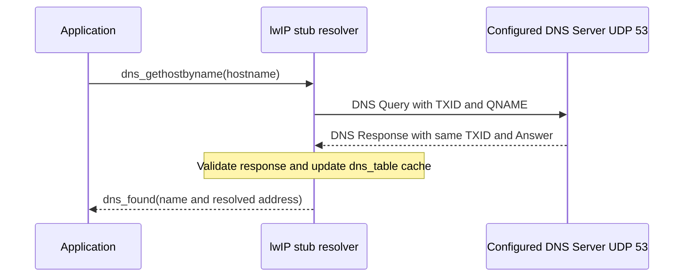
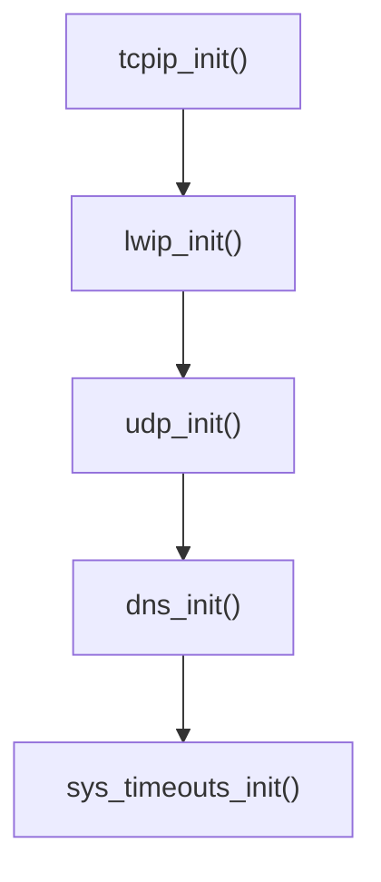
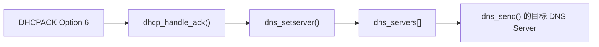
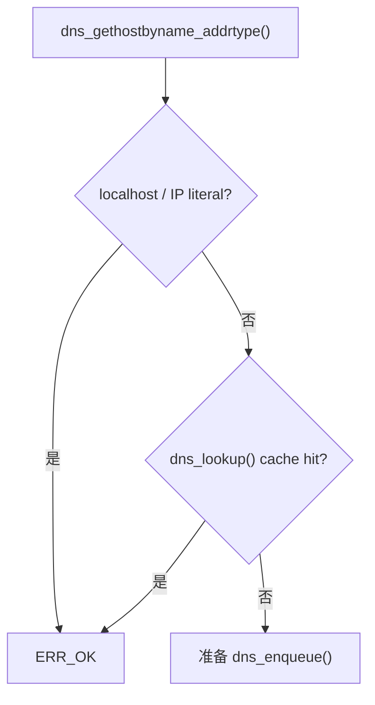
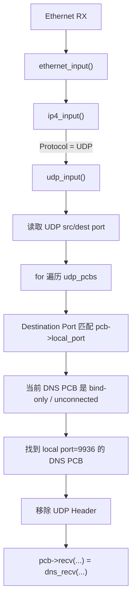
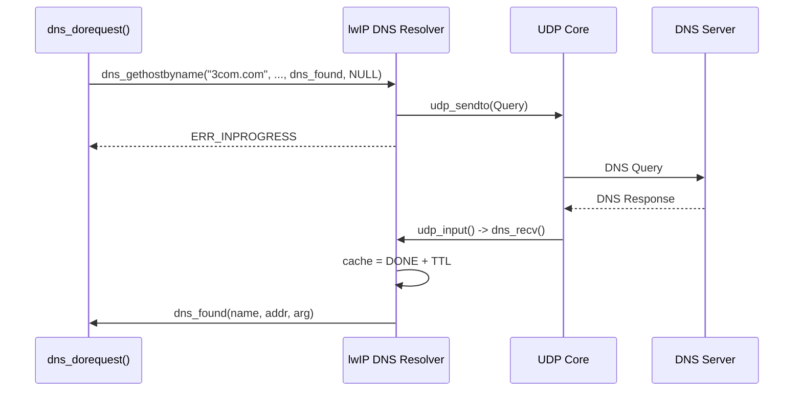
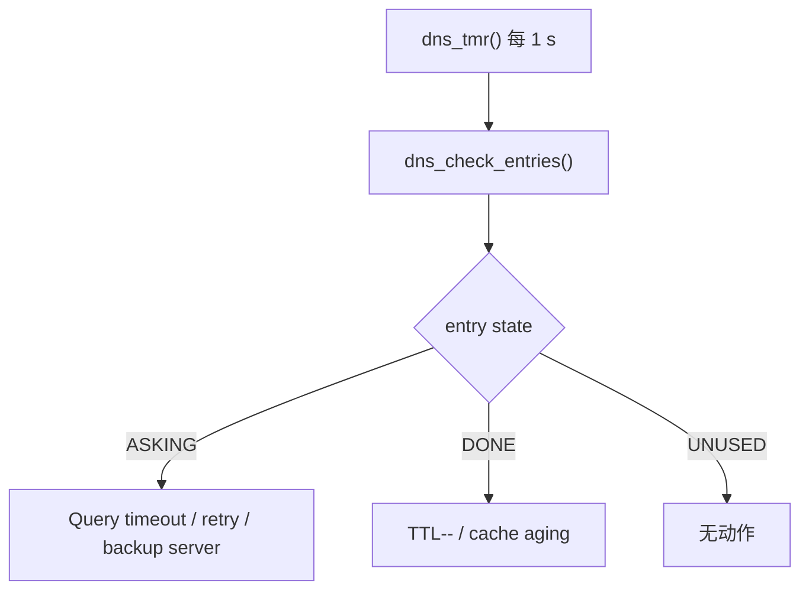
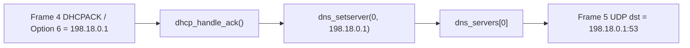
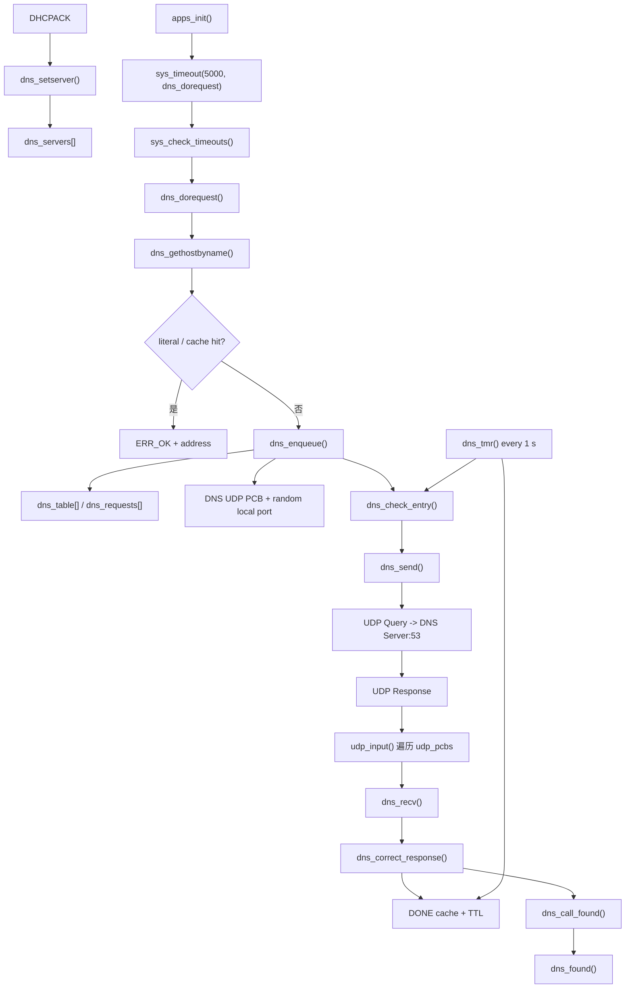

<meta name="referrer" content="no-referrer" />

# 教程 14：从 `dns_gethostbyname()` 到 `dns_found()`——DNS Resolver、UDP PCB、Cache、Timer 与异步回调

> 摘要：从 example_app 的 DNS 请求入口追踪 resolver、UDP PCB、Cache、Timer 与异步回调，并用 6 帧真实 PCAP 验证 DHCP Option 6、随机源端口、TXID、A 记录和 TTL。

[TOC]

DNS（Domain Name System，域名系统）把人类可读的 hostname 映射为 Resource Record（资源记录）等结构化数据。当前 lwIP 实现的是 **stub resolver**：应用把 hostname 交给 lwIP，lwIP 向已经配置好的 DNS Server 发送 Query；这个 DNS Server 通常是 recursive resolver（递归解析器），它可以代表 Client 继续访问 root、TLD（Top-Level Domain，顶级域）与 authoritative server（权威服务器），而 lwIP 本身并不实现那条递归/迭代查询链。[S11](#source-s11)[S12](#source-s12)

本篇只追踪普通 unicast DNS 查询。当前实验通过 UDP 发送 DNS message，Server 使用目标端口 53；请求使用 TXID（Transaction ID，事务标识符）与响应关联。Question 中的 QNAME 表示要查询的域名，QTYPE 表示记录类型，本文主线使用 A Record 查询 IPv4 地址，lwIP 也支持 AAAA Record 查询 IPv6 地址；Response 的 Answer 中携带 Resource Record 和 DNS TTL（缓存生存时间）。这里的 DNS TTL 与 IPv4 Header 的 TTL 不是同一个字段。[S7](#source-s7)[S8](#source-s8)[S13](#source-s13)

## 0. 阅读源码前：先建立 DNS resolver 协议模型

### 0.1 建议提前阅读

1. [Cloudflare Learning Center — What is DNS?](https://www.cloudflare.com/learning/dns/what-is-dns/)
   - 用途：建立 Client、recursive resolver、root/TLD/authoritative server 与缓存的整体关系。[S11](#source-s11)
2. [RFC 1034 — Domain Names: Concepts and Facilities](https://www.rfc-editor.org/rfc/rfc1034.html)
   - 用途：核对 namespace、resolver、name server 与 Resource Record 的概念边界。[S12](#source-s12)
3. [RFC 1035 — Domain Names: Implementation and Specification](https://www.rfc-editor.org/rfc/rfc1035.html)
   - 用途：核对 DNS Header、Question/Answer、QNAME、QTYPE、Flags、TTL 与 wire format。[S7](#source-s7)
4. [RFC 5452 — Measures for Making DNS More Resilient against Forged Answers](https://www.rfc-editor.org/rfc/rfc5452.html)
   - 用途：理解随机 TXID、随机 UDP source port 与 Response matching 为什么是 resolver 的安全边界。[S8](#source-s8)

这些资料用于权威核对和继续深入；不打开外链也不影响下面理解当前 DNS Query/Response 与 lwIP 源码链。

### 0.2 一份 DNS Query/Response 最少要认识哪些字段

DNS message 由 Header 和若干 section 组成。本文只需要当前路径真正读取或构造的字段；A Record 的基础格式来自 RFC 1035，AAAA Record 的 IPv6 扩展由 RFC 3596 定义：[S7](#source-s7)[S13](#source-s13)

| 对象 | 当前含义 | 本文中的源码作用 |
| --- | --- | --- |
| TXID | 16-bit transaction identifier | `dns_send()` 写入 Query，`dns_recv()` 用于定位当前 resolver entry |
| QR flag | Query/Response 标志 | `0` 表示 Query，`1` 表示 Response |
| RD flag | Recursion Desired | Client 请求 DNS Server 代表自己继续递归解析 |
| QNAME | 查询名称的 label 编码 | `3com.com` 在线上不是带点字符串，而是按 label 长度编码 |
| QTYPE | 要查询的 Resource Record 类型 | `A` 查询 IPv4，`AAAA` 查询 IPv6 |
| QCLASS | 记录类别 | 本文使用 `IN`（Internet）class |
| Answer TTL | 该 Resource Record 可缓存多久 | lwIP 转换为 `dns_table[]` 的 cache 生命周期 |
| RDATA | Answer 的实际记录数据 | A Record 中最终解析为 IPv4 address |

Cache hit 与 cache miss 也必须先区分：如果 `dns_table[]` 已有仍有效的结果，`dns_gethostbyname()` 可以同步返回；cache miss 才创建异步 Query，未来由 `dns_recv()` 解析 Response 并调用 application callback。[S2](#source-s2)

### 0.3 一次 cache miss 的协议总流程



DNS Server 地址并不是凭空出现。当前 Host 实验中，Stage 13 的 DHCPACK Option 6 调用 `dns_setserver()`，把 Server 地址写入 `dns_servers[]`；Stage 14 再从这个配置继续完成 Query。[S5](#source-s5)[S9](#source-s9)

### 0.4 协议动作怎样映射到 lwIP resolver

UDP PCB（Protocol Control Block，协议控制块）保存 resolver 使用的本地 UDP port、地址绑定和 receive callback；随机 source port 模式下，cache miss 时会按需创建这样的 PCB。

| 协议/生命周期阶段 | lwIP 入口 | 关键对象 | 下一步 |
| --- | --- | --- | --- |
| DNS Server 配置 | `dhcp_handle_ack()` → `dns_setserver()` | `dns_servers[]` | resolver 获得目标 Server |
| 应用查询 | `dns_gethostbyname()` | hostname、callback | cache hit 同步返回或进入 enqueue |
| 建立异步 transaction | `dns_enqueue()` / `dns_check_entry()` | `dns_table[]`、request callback | 分配 TXID 并发送 Query |
| 构造 Query | `dns_send()` | DNS Header、QNAME、QTYPE、UDP PCB | `udp_sendto()` 到 Server:53 |
| 接收 Response | `udp_input()` → `dns_recv()` | TXID、source endpoint、flags、Answer | 校验并解析 Resource Record |
| 更新缓存 | `dns_correct_response()` | address、TTL、entry state | cache 可供后续同步命中 |
| 返回应用 | `dns_call_found()` | callback / callback_arg | `dns_found()` |
| retry 与过期 | `dns_tmr()` | retry counter / cache TTL | 重发、失败 callback 或删除 cache |

下面进入 Source-driven 主线后，将沿真实调用顺序继续追踪这些阶段，而不是再单独另写一份“DNS 协议篇”。

## 1. 真实应用入口：`apps_init()` 先注册 5 秒 timeout，而不是立即查询 DNS

当前 `example_app` 的 DNS demo 由 `LWIP_DNS_APP && LWIP_DNS` 控制。`apps_init()` 中并不是直接调用 `dns_gethostbyname()`，而是先注册一个 one-shot software timeout：[S1](#source-s1)

```c
#if LWIP_DNS_APP && LWIP_DNS
  /* wait until the netif is up (for dhcp, autoip or ppp) */
  sys_timeout(5000, dns_dorequest, NULL);
#endif /* LWIP_DNS_APP && LWIP_DNS */
```

这一行必须和 Stage 11 的 timer 模型联系起来：

```text
apps_init()
  -> sys_timeout(5000, dns_dorequest, NULL)
  -> 插入 next_timeout 有序链表
  -> tcpip_thread 在 tcpip_mbox_fetch() 中等待
  -> 5 秒到期
  -> sys_check_timeouts()
  -> dns_dorequest(NULL)
```

所以不存在“DNS thread 5 秒后醒来”。当前 example 只是借 lwIP 通用 timeout scheduler，把 `dns_dorequest()` 安排到约 5 秒后在 Core execution context 执行。[S3](#source-s3)

这里的 5 秒也不是 DNS 协议要求。它只是 example 为 DHCP、AutoIP、PPP 等接口配置过程留出的等待时间。[S1](#source-s1)

## 2. Resolver 更早就初始化了：`lwip_init()` 会调用 `dns_init()`

`dns_dorequest()` 发生在应用初始化之后，但 DNS Core 本身早在 `lwip_init()` 阶段已经初始化。[S4](#source-s4)

当前初始化链可以简化为：



进入 `dns_init()`，上游连续源码片段如下：[S2](#source-s2)

```c
void
dns_init(void)
{
#ifdef DNS_SERVER_ADDRESS
  /* initialize default DNS server address */
  ip_addr_t dnsserver;
  DNS_SERVER_ADDRESS(&dnsserver);
  dns_setserver(0, &dnsserver);
#endif /* DNS_SERVER_ADDRESS */

  LWIP_ASSERT("sanity check SIZEOF_DNS_QUERY",
              sizeof(struct dns_query) == SIZEOF_DNS_QUERY);
  LWIP_ASSERT("sanity check SIZEOF_DNS_ANSWER",
              sizeof(struct dns_answer) <= SIZEOF_DNS_ANSWER_ASSERT);

  LWIP_DEBUGF(DNS_DEBUG, ("dns_init: initializing\n"));

#if ((LWIP_DNS_SECURE & LWIP_DNS_SECURE_RAND_SRC_PORT) == 0)
  if (dns_pcbs[0] == NULL) {
    dns_pcbs[0] = udp_new_ip_type(IPADDR_TYPE_ANY);
    LWIP_ASSERT("dns_pcbs[0] != NULL", dns_pcbs[0] != NULL);

    udp_bind(dns_pcbs[0], IP_ANY_TYPE, 0);
    udp_recv(dns_pcbs[0], dns_recv, NULL);
  }
#endif

#if DNS_LOCAL_HOSTLIST
  dns_init_local();
#endif
}
```

这里需要注意当前默认安全配置：`LWIP_DNS_SECURE_RAND_SRC_PORT` 默认启用，因此长期 `dns_pcbs[0]` 这条固定 PCB 初始化分支在当前 build 中不会采用；cache miss 时 resolver 会按需分配带随机 UDP source port 的 PCB。[S6](#source-s6)

但两种配置的共同点没有变化：`dns_init()` 的固定-PCB 分支或 `dns_alloc_random_port()` 的随机端口分支，最终都会给 DNS UDP PCB 注册同一个 receive callback：

```text
udp_recv(pcb, dns_recv, NULL);
```

也就是把：

```text
dns_recv
```

保存进：

```text
pcb->recv
```

后面 UDP response 到达时，Stage 5 展开的 `udp_input()` 会先根据 local/remote endpoint 找到该 PCB，再通过 `pcb->recv(...)` 调进 `dns_recv()`。

## 3. DNS Server 地址来自哪里：Stage 13 的 DHCPACK 在这里接上 DNS

`dns_init()` 支持编译期 `DNS_SERVER_ADDRESS`，但当前 Host 实验最直观的来源是 DHCP Option 6。[S5](#source-s5)

Stage 13 的 `dhcp_handle_ack()` 中存在下面的上游连续源码片段：[S5](#source-s5)

```c
#if LWIP_DHCP_PROVIDE_DNS_SERVERS
  /* DNS servers */
  for (n = 0; (n < LWIP_DHCP_PROVIDE_DNS_SERVERS) && dhcp_option_given(dhcp, DHCP_OPTION_IDX_DNS_SERVER + n); n++) {
    ip_addr_t dns_addr;
    ip_addr_set_ip4_u32_val(dns_addr, lwip_htonl(dhcp_get_option_value(dhcp, DHCP_OPTION_IDX_DNS_SERVER + n)));
    dns_setserver(n, &dns_addr);
  }
#endif /* LWIP_DHCP_PROVIDE_DNS_SERVERS */
```

`dns_setserver()` 再把地址写入 resolver 的 module-level server table：[S2](#source-s2)

```c
void
dns_setserver(u8_t numdns, const ip_addr_t *dnsserver)
{
  if (numdns < DNS_MAX_SERVERS) {
    if (dnsserver != NULL) {
      dns_servers[numdns] = (*dnsserver);
    } else {
      dns_servers[numdns] = *IP_ADDR_ANY;
    }
  }
}
```

因此 Stage 13 与 Stage 14 的真正连接是：



`struct dhcp` 并不长期“拥有 DNS resolver”。DHCP 只负责提供配置来源，DNS Core 自己维护 `dns_servers[]`、query table、request callbacks 和 UDP PCBs。

## 4. 5 秒后进入 `dns_dorequest()`：为什么 `ERR_OK` 和 `ERR_INPROGRESS` 完全不同

`sys_check_timeouts()` 到期调用 `dns_dorequest()` 后，example 真实代码是：[S1](#source-s1)

```c
static void
dns_found(const char *name, const ip_addr_t *addr, void *arg)
{
  LWIP_UNUSED_ARG(arg);
  printf("%s: %s\n", name, addr ? ipaddr_ntoa(addr) : "<not found>");
}

static void
dns_dorequest(void *arg)
{
  const char* dnsname = "3com.com";
  ip_addr_t dnsresp;
  LWIP_UNUSED_ARG(arg);

  if (dns_gethostbyname(dnsname, &dnsresp, dns_found, NULL) == ERR_OK) {
    dns_found(dnsname, &dnsresp, NULL);
  }
}
```

`dns_gethostbyname()` 的官方源码注释直接说明它是 **NON-BLOCKING callback version**。[S2](#source-s2)

它返回以后有两个最重要的正常路径：

| 返回值 | 当前含义 | 地址从哪里返回 |
| --- | --- | --- |
| `ERR_OK` | 地址现在已经知道，不需要发 DNS Query | 直接写到 `dnsresp`，example 立即自己调用 `dns_found()` |
| `ERR_INPROGRESS` | cache miss，异步 DNS Query 已经建立 | 未来由 resolver 内部调用 `dns_found()` |

所以：

```text
dns_gethostbyname()
```

不是传统意义上：

```text
阻塞等待 DNS response
```

而是：

```text
先同步查本地/literal/cache
    -> 能得到就 ERR_OK

否则建立异步 query
    -> ERR_INPROGRESS
    -> 未来 callback
```

## 5. `dns_gethostbyname()` 只是薄封装，真正逻辑在 `dns_gethostbyname_addrtype()`

当前函数：[S2](#source-s2)

```c
err_t
dns_gethostbyname(const char *hostname, ip_addr_t *addr, dns_found_callback found,
                  void *callback_arg)
{
  return dns_gethostbyname_addrtype(hostname, addr, found, callback_arg, LWIP_DNS_ADDRTYPE_DEFAULT);
}
```

所以进入 `dns_gethostbyname_addrtype()`。

它不会一上来就发 UDP。上游连续源码片段先处理 `localhost`、IP literal 和 cache：[S2](#source-s2)

```c
#if LWIP_HAVE_LOOPIF
  if (strcmp(hostname, "localhost") == 0) {
    ip_addr_set_loopback(LWIP_DNS_ADDRTYPE_IS_IPV6(dns_addrtype), addr);
    return ERR_OK;
  }
#endif /* LWIP_HAVE_LOOPIF */

  /* host name already in octet notation? set ip addr and return ERR_OK */
  if (ipaddr_aton(hostname, addr)) {
#if LWIP_IPV4 && LWIP_IPV6
    if ((IP_IS_V6(addr) && (dns_addrtype != LWIP_DNS_ADDRTYPE_IPV4)) ||
        (IP_IS_V4(addr) && (dns_addrtype != LWIP_DNS_ADDRTYPE_IPV6)))
#endif /* LWIP_IPV4 && LWIP_IPV6 */
    {
      return ERR_OK;
    }
  }
  /* already have this address cached? */
  if (dns_lookup(hostname, hostnamelen, addr LWIP_DNS_ADDRTYPE_ARG(dns_addrtype)) == ERR_OK) {
    return ERR_OK;
  }
```

因此第一层决策是：



## 6. `dns_table[]` 是 resolver state + cache，不只是“域名数组”

当前默认 `DNS_TABLE_SIZE=4`。[S6](#source-s6)

每个 entry 保存的重点包括：

```text
name
state
transaction id (txid)
当前 DNS server index
retry timer / retry count
最终解析出来的 ipaddr
TTL
```

主要 state：

```text
DNS_STATE_UNUSED
DNS_STATE_NEW
DNS_STATE_ASKING
DNS_STATE_DONE
```

理解方式：

| State | 语义 |
| --- | --- |
| `UNUSED` | slot 空闲 |
| `NEW` | 新请求已写入 table，马上准备发送 |
| `ASKING` | Query 已发出，等待 response/retry |
| `DONE` | 已得到地址，可供后续 cache hit |

所以同一个 `dns_table[]` 既保存 outstanding query 的状态，又保存已经完成的短期 cache。

## 7. Cache miss 进入 `dns_enqueue()`：先把 callback 与 query state 绑定

`dns_gethostbyname_addrtype()` 确认需要真正查询后进入 `dns_enqueue()`。[S2](#source-s2)

继续阅读 `dns_enqueue()` 中创建 entry 的关键片段：

```c
entry->state = DNS_STATE_NEW;
entry->seqno = dns_seqno;
LWIP_DNS_SET_ADDRTYPE(entry->reqaddrtype, dns_addrtype);
LWIP_DNS_SET_ADDRTYPE(req->reqaddrtype, dns_addrtype);
req->found = found;
req->arg   = callback_arg;
MEMCPY(entry->name, name, namelen);
entry->name[namelen] = 0;
```

这里有两个不同数组：[S2](#source-s2)

```text
dns_table[]
  -> query/cache state

dns_requests[]
  -> 谁在等结果
  -> found callback
  -> callback arg
  -> dns_table index
```

如果 query 最终成功，后面的 `dns_call_found()` 就依赖 `dns_requests[]` 把结果送回最初调用者。

## 8. 当前默认安全配置还会按需创建随机 UDP source port PCB

当前默认 `LWIP_DNS_SECURE` 包含 `LWIP_DNS_SECURE_RAND_SRC_PORT` 与随机 TXID。[S6](#source-s6)[S8](#source-s8)

因此 `dns_enqueue()` 会执行：

```c
#if ((LWIP_DNS_SECURE & LWIP_DNS_SECURE_RAND_SRC_PORT) != 0)
  entry->pcb_idx = dns_alloc_pcb();
  if (entry->pcb_idx >= DNS_MAX_SOURCE_PORTS) {
    entry->state = DNS_STATE_UNUSED;
    req->found = NULL;
    return ERR_MEM;
  }
#endif
```

继续进入 `dns_alloc_random_port()`：[S2](#source-s2)

```c
static struct udp_pcb *
dns_alloc_random_port(void)
{
  err_t err;
  struct udp_pcb *pcb;

  pcb = udp_new_ip_type(IPADDR_TYPE_ANY);
  if (pcb == NULL) {
    return NULL;
  }
  do {
    u16_t port = (u16_t)DNS_RAND_TXID();
    if (DNS_PORT_ALLOWED(port)) {
      err = udp_bind(pcb, IP_ANY_TYPE, port);
    } else {
      err = ERR_USE;
    }
  } while (err == ERR_USE);
  if (err != ERR_OK) {
    udp_remove(pcb);
    return NULL;
  }
  udp_recv(pcb, dns_recv, NULL);
  return pcb;
}
```

现在 `dns_recv()` 为什么会在 response 到达时被调用就有完整来源了：

```text
dns_alloc_random_port()
    -> udp_new_ip_type()
    -> udp_bind(random local port)
    -> udp_recv(pcb, dns_recv, NULL)

之后 response 到达
    -> udp_input()
    -> 遍历 udp_pcbs
    -> 找到这个 local port 的 PCB
    -> pcb->recv(...)
    -> dns_recv(...)
```

本次成功 PCAP 的 Frame 5 实际使用 `198.18.0.149:9936 -> 198.18.0.1:53`，Frame 6 再从 `198.18.0.1:53` 返回 `198.18.0.149:9936`。因此这里的“随机 local port”可以直接映射到本次运行中的 UDP source port `9936`。[S9](#source-s9)

RFC 5452 建议 resolver 使用不可预测的 query ID 与 source port 增大伪造 response 需要猜中的空间；lwIP 当前默认安全配置与这类设计目标一致。[S8](#source-s8)

## 9. `dns_enqueue()` 结尾直接进入 `dns_check_entry()`，第一次 Query 不需要等 1 秒 Timer

继续阅读 `dns_enqueue()` 的结尾：[S2](#source-s2)

```c
dns_seqno++;

/* force to send query without waiting timer */
dns_check_entry(i);

/* dns query is enqueued */
return ERR_INPROGRESS;
```

所以：

```text
ERR_INPROGRESS
```

不是“只是放进队列，下一秒才发”。真正的第一份 Query 通常已经在本次 API 调用栈中进入 `dns_check_entry()` / `dns_send()`。

## 10. `dns_check_entry()`：`NEW → ASKING`，生成 TXID 并发送

新 entry 当前是 `DNS_STATE_NEW`。进入 `dns_check_entry()` 后：[S2](#source-s2)

```c
case DNS_STATE_NEW:
  entry->txid = dns_create_txid();
  entry->state = DNS_STATE_ASKING;
  entry->server_idx = 0;
  entry->tmr = 1;
  entry->retries = 0;

  err = dns_send(i);
  if (err != ERR_OK) {
    LWIP_DEBUGF(DNS_DEBUG | LWIP_DBG_LEVEL_WARNING,
                ("dns_send returned error: %s\n", lwip_strerr(err)));
  }
  break;
```

此时 query state 变成：

```text
hostname = 3com.com
state    = ASKING
txid     = 随机 16-bit Transaction ID
server   = dns_servers[0]
retries  = 0
```

然后直接进入 `dns_send(i)`。本次成功抓包中，Frame 5 的 Transaction ID 为 `0xB53B`，Frame 6 Response 使用完全相同的 `0xB53B`，正好对应 `entry->txid` 用于 Query/Response 匹配的职责。[S9](#source-s9)

## 11. 进入 `dns_send()`：先建立 DNS Header，再解释 `Recursion Desired`

`dns_send()` 先分配 `PBUF_TRANSPORT`，填 DNS Header：[S2](#source-s2)

```c
p = pbuf_alloc(PBUF_TRANSPORT, (u16_t)(SIZEOF_DNS_HDR + strlen(entry->name) + 2 +
                                       SIZEOF_DNS_QUERY), PBUF_RAM);
if (p != NULL) {
  const ip_addr_t *dst;
  u16_t dst_port;
  /* fill dns header */
  memset(&hdr, 0, SIZEOF_DNS_HDR);
  hdr.id = lwip_htons(entry->txid);
  hdr.flags1 = DNS_FLAG1_RD;
  hdr.numquestions = PP_HTONS(1);
  pbuf_take(p, &hdr, SIZEOF_DNS_HDR);
```

`DNS_FLAG1_RD` 对应 RFC 1035 的 **Recursion Desired** bit。`RD=1` 表示 stub resolver 请求当前 DNS Server 代表 Client 继续完成递归解析；它并不表示 lwIP 自己去访问 root/TLD/authoritative server。[S7](#source-s7) 本次 Frame 5 的 Flags 实测为 `0x0100`，其中 `QR=0`、`RD=1`，与 `hdr.flags1 = DNS_FLAG1_RD` 直接对应。[S9](#source-s9)

### 11.1 当前 lwIP 实现的是 stub resolver，而不是 recursive resolver

Cloudflare 与 RFC 1034 已经把 recursive resolver、root/TLD/authoritative server 的关系讲清楚，本篇不再复述那条通用解析链。[S11](#source-s11)[S12](#source-s12) 对当前源码只需要建立一条实现边界：`dns.c` 把 Query 发给 `dns_servers[]` 中已经配置好的 resolver server，并等待最终 Response；它本身没有实现从 root 到 authoritative server 的递归/迭代解析过程。[S2](#source-s2)

## 12. `3com.com` 在线上不是普通带点字符串：QNAME 使用 label 编码

继续阅读 `dns_send()`：[S2](#source-s2)

```c
hostname = entry->name;
--hostname;

query_idx = SIZEOF_DNS_HDR;
do {
  ++hostname;
  hostname_part = hostname;
  for (n = 0; *hostname != '.' && *hostname != 0; ++hostname) {
    ++n;
  }
  copy_len = (u16_t)(hostname - hostname_part);
  if (query_idx + n + 1 > 0xFFFF) {
    goto overflow_return;
  }
  pbuf_put_at(p, query_idx, n);
  pbuf_take_at(p, hostname_part, copy_len, (u16_t)(query_idx + 1));
  query_idx = (u16_t)(query_idx + n + 1);
} while (*hostname != 0);
pbuf_put_at(p, query_idx, 0);
query_idx++;
```

QNAME 不是把 `3com.com` 这串文本原样写进报文，而是按 label 编码：每个 label 前先写一个长度 byte，最后用 `0` 结束。因此 `3com.com` 对应“长度 4 + `3com` + 长度 3 + `com` + 结束 0”。`dns_send()` 的循环正是在构造这一格式。[S7](#source-s7) Frame 5 的 DNS payload 中可以直接找到：[S9](#source-s9)

```text
04 33 63 6f 6d 03 63 6f 6d 00
```

其中 `04` 是 `3com` 的长度，`03` 是 `com` 的长度，末尾 `00` 结束 QNAME。

## 13. QTYPE 决定查 IPv4 A 还是 IPv6 AAAA

继续阅读 `dns_send()`：[S2](#source-s2)

```c
if (LWIP_DNS_ADDRTYPE_IS_IPV6(entry->reqaddrtype)) {
  qry.type = PP_HTONS(DNS_RRTYPE_AAAA);
} else {
  qry.type = PP_HTONS(DNS_RRTYPE_A);
}
qry.cls = PP_HTONS(DNS_RRCLASS_IN);
pbuf_take_at(p, &qry, SIZEOF_DNS_QUERY, query_idx);
```

QTYPE 决定希望得到哪一种 Resource Record：`A` 返回 IPv4 address，`AAAA` 返回 IPv6 address；QCLASS=`IN` 表示 Internet class。[S7](#source-s7)[S13](#source-s13) 当前代码分支因此在 IPv4 request 写 `DNS_RRTYPE_A`，IPv6 request 写 `DNS_RRTYPE_AAAA`。本次 Frame 5 的 Question 区实测 `QTYPE=0x0001`、`QCLASS=0x0001`，即 `A / IN`，与当前 IPv4 路径一致。[S9](#source-s9)

## 14. `dns_send()` 最终只是把 DNS Payload 交给 UDP，目的端口固定 53

继续阅读 `dns_send()` 的发送尾部。下面是普通 unicast DNS 的执行路径阅读版：只裁掉与本文主线无关的 mDNS destination 分支，保留当前路径的真实语句顺序。[S2](#source-s2)

```c
#if ((LWIP_DNS_SECURE & LWIP_DNS_SECURE_RAND_SRC_PORT) != 0)
  pcb_idx = entry->pcb_idx;
#else
  pcb_idx = 0;
#endif

dst_port = DNS_SERVER_PORT;
dst = &dns_servers[entry->server_idx];
err = udp_sendto(dns_pcbs[pcb_idx], p, dst, dst_port);

/* free pbuf */
pbuf_free(p);
```

普通 unicast DNS 因而形成：

```text
UDP Source Port      = resolver 随机 local port
UDP Destination Port = 53
Destination IP       = dns_servers[server_idx]
```

本次 Frame 5 把三个值全部落到了线上：source port=`9936`，destination port=`53`，destination IP=`198.18.0.1`。[S9](#source-s9)

这里再回到 Stage 5 的 UDP output；DNS Core 并不自己构造 IPv4/Ethernet Header。

## 15. Response 到达后，`udp_input()` 怎样识别这是 DNS PCB

这一段必须和 Stage 5 的完整 PCB demultiplex 连起来，不能从：

```text
DNS Response 到达
```

突然跳到：

```text
dns_recv()
```

真实链路是：[S3](#source-s3)



本次成功 PCAP 不需要再假设端口，Frame 5/6 已经给出真实 endpoint：[S9](#source-s9)

```text
Query:    lwIP 198.18.0.149:9936 -> DNS 198.18.0.1:53
Response: DNS  198.18.0.1:53     -> lwIP 198.18.0.149:9936
```

进入 `udp_input()` 处理 Frame 6 时：

```text
src  = 53
dest = 9936
```

对本次 DNS PCB 来说，真正参与 UDP demultiplex 的关键值是：

```text
packet Destination Port 9936 <-> pcb->local_port = 9936
```

原因是 `dns_alloc_random_port()` 只执行 `udp_bind()`，没有 `udp_connect()`；这个 PCB 属于 **unconnected UDP PCB**。[S2](#source-s2) 因而不能把 Frame 6 的 source `198.18.0.1:53` 写成 `udp_input()` 对 DNS PCB 的 connected remote endpoint 匹配条件。当前 `udp_input()` 的 fully-connected / unconnected PCB 优先级、local/remote IP 匹配和 move-to-front 优化已经在 Stage 5 展开，本篇只保留与 DNS 当前路径有关的边界。[S3](#source-s3)

## 16. 进入 `dns_recv()`：不是看到 UDP/53 就立刻信任答案

`udp_input()` 已经移除 UDP Header，因此进入：

```c
dns_recv(void *arg, struct udp_pcb *pcb, struct pbuf *p,
         const ip_addr_t *addr, u16_t port)
```

时：

```text
p->payload -> DNS Header
addr       -> DNS response source IP
port       -> DNS response source UDP port
```

`dns_recv()` 先根据 Transaction ID 找当前 `DNS_STATE_ASKING` entry，再检查 response、question 与 server 信息。[S2](#source-s2)

本次 Frame 6 的 UDP source 是 `198.18.0.1:53`，DNS Transaction ID 仍为 `0xB53B`；DNS Flags 为 `0x8580`，即 `QR=1`、`AA=1`、`RD=1`、`RA=1`、`RCODE=0`，并且 `QDCOUNT=1`、`ANCOUNT=1`。[S9](#source-s9) 这些是本次 dnsmasq 响应的实测字段，不应泛化为所有 DNS Server 都会设置 `AA` 或 `RA`。

当前目标版本的 `dns_recv()` 有一个容易被“安全设计目标”掩盖的实现细节：[S2](#source-s2)

```c
LWIP_UNUSED_ARG(pcb);
LWIP_UNUSED_ARG(port);
```

也就是说，`dns_recv()` **没有使用传入的 UDP source port 做额外比较**。它实际检查的关键条件包括：

```text
entry state = ASKING
Transaction ID
DNS response flag / question count
DNS Server source IP == dns_servers[server_idx]
Query name
QTYPE / QCLASS
```

随机 UDP local port 的价值仍然存在：攻击者若想把伪造 response 送进这个 DNS PCB，首先需要命中本次随机绑定的 destination port `9936`；但不要把这一点误写成“当前 `dns_recv()` 又校验了一次 response source port=53”。[S2](#source-s2)[S9](#source-s9)

RFC 5452 从 resolver 防伪造角度强调 query ID、query name、地址和端口等匹配维度，并建议增加 source-port entropy。[S8](#source-s8) 本文这里严格区分 RFC 的安全建议与当前 lwIP 目标版本的实际代码路径。

## 17. Answer 中的 A Record 最终写进 `dns_table[i].ipaddr`

当 `dns_recv()` 找到符合当前 IPv4 query 的 A Record 后，会从 `pbuf` 复制 4-byte IPv4 address 到对齐对象，再保存进 cache entry。[S2](#source-s2)

这条数据变化可以简化为：

```text
DNS Answer RDATA bytes
    ↓
pbuf_copy_partial()
    ↓
ip4_addr_t
    ↓
dns_table[i].ipaddr
```

继续阅读 `dns_recv()` 的成功 Answer 分支：地址复制完成后，函数直接调用：

```text
dns_correct_response(i, lwip_ntohl(ans.ttl));
```

## 18. 进入 `dns_correct_response()`：TTL 是“DNS 缓存生存时间”，不是 IPv4 Header TTL

`TTL` 全称也是 **Time To Live**，但这里属于 **DNS Resource Record 的缓存生存时间**，不是 IPv4 Header 里每过一个 router 减 1 的 TTL。[S7](#source-s7)

两者必须立即消歧：

| 名称 | 单位/变化方式 | 解决什么问题 |
| --- | --- | --- |
| IPv4 Header TTL | 每经过 router 减 1 | 防止 packet 无限路由循环 |
| DNS RR TTL | 秒；resolver cache 随时间过期 | 决定解析结果可以缓存多久 |

RFC 1035 的 DNS TTL 表示这条 Resource Record 在重新查询源之前可以缓存多少秒。[S7](#source-s7)

进入 `dns_correct_response()`：[S2](#source-s2)

```c
static void
dns_correct_response(u8_t idx, u32_t ttl)
{
  struct dns_table_entry *entry = &dns_table[idx];

  entry->state = DNS_STATE_DONE;

  entry->ttl = ttl;
  if (entry->ttl > DNS_MAX_TTL) {
    entry->ttl = DNS_MAX_TTL;
  }
  dns_call_found(idx, &entry->ipaddr);

  if (entry->ttl == 0) {
    if (entry->state == DNS_STATE_DONE) {
      entry->state = DNS_STATE_UNUSED;
    }
  }
}
```

### 18.1 本次 Frame 6 的 `TTL=0`：结果只用于当前 transaction，不进入持续 cache

本次 DNS Response 的 Answer Resource Record 实测字段为：[S9](#source-s9)

```text
NAME     = c0 0c      -> 压缩指针，指回 Question 中的 3com.com
TYPE     = 0x0001     -> A
CLASS    = 0x0001     -> IN
TTL      = 0
RDLENGTH = 4
RDATA    = c6 12 00 01 -> 198.18.0.1
```

这使 `dns_correct_response()` 的两个动作在同一次成功 response 中连续发生：

```text
entry->state = DNS_STATE_DONE
entry->ttl   = 0
dns_call_found(i, &entry->ipaddr)
    -> dns_found("3com.com", 198.18.0.1, ...)

callback 返回后
    -> entry->ttl == 0
    -> entry->state = DNS_STATE_UNUSED
```

因此这次实验虽然解析成功，但**这条 A Record 不会作为可持续命中的 DNS cache entry 保留下来**。这正好把前面 `TTL=0` 的源码分支从抽象条件变成了真实线上证据。[S2](#source-s2)[S9](#source-s9)

### 18.2 `DNS_MAX_TTL=604800` 到底是什么意思

当前 `dns.c` 定义：[S2](#source-s2)

```c
#define DNS_MAX_TTL 604800
```

`604800` 秒等于：

```text
7 天
```

因此：

```text
Server TTL = 300 s
    -> lwIP cache 300 s

Server TTL = 86400 s
    -> lwIP cache 86400 s

Server TTL = 2592000 s (30 天)
    -> 超过 DNS_MAX_TTL
    -> lwIP 只保存 604800 s
```

英文源码分析里常把：

```text
entry->ttl 被限制在最大值
```

写成 `clamp to DNS_MAX_TTL`。

文章里不需要保留这个英文词。更清楚的中文是：

> **如果 DNS Server 返回的 TTL 大于 `DNS_MAX_TTL`，lwIP 会把缓存时间限制到 `604800` 秒（7 天），不会按更大的服务器 TTL 缓存。**

这里的 `604800` 是当前 lwIP implementation limit，不是 RFC 1035 规定“所有 DNS cache 最多 7 天”。[S2](#source-s2)[S7](#source-s7)

## 19. `dns_call_found()`：这里才真正回到 example 的 `dns_found()`

`dns_enqueue()` 保存过：

```c
req->found = found;
req->arg   = callback_arg;
```

成功 response 进入 `dns_correct_response()` 后，又调用：

```c
dns_call_found(idx, &entry->ipaddr);
```

`dns_call_found()` 最终执行：[S2](#source-s2)

```c
if (dns_requests[i].found && (dns_requests[i].dns_table_idx == idx)) {
  (*dns_requests[i].found)(dns_table[idx].name, addr, dns_requests[i].arg);
  dns_requests[i].found = NULL;
}
```

当前 example 最开始传入的 `found` 就是：

```text
dns_found
```

所以异步闭环是：



如果 Query 最终失败/超时，则 callback 可以得到：

```text
addr == NULL
```

example 因而打印：

```text
3com.com: <not found>
```

本次成功实验走的是前面的成功路径：Frame 6 返回 A Record `198.18.0.1` 后，终端实际输出 `3com.com: 198.18.0.1`。[S9](#source-s9)

## 20. 第二次查相同 hostname 为什么可能完全不发 UDP/53

第一次成功以后：

```text
dns_table[i].state = DNS_STATE_DONE
entry->ipaddr       = 已解析地址
entry->ttl          = 剩余缓存秒数
```

只要 TTL 还没归零，再调用同一个 API：

```text
dns_gethostbyname("3com.com", ...)
```

就可能在 `dns_lookup()` 同步命中，直接：

```text
return ERR_OK
```

当前 example 看到 `ERR_OK` 后立即自己调用 `dns_found()`：

```c
if (dns_gethostbyname(dnsname, &dnsresp, dns_found, NULL) == ERR_OK) {
  dns_found(dnsname, &dnsresp, NULL);
}
```

所以同一个 `dns_found()` 有两条到达方式：

```text
cache hit
  -> caller 同步调用 dns_found()

cache miss
  -> ERR_INPROGRESS
  -> 网络 response / timeout
  -> dns_call_found()
  -> 异步调用 dns_found()
```

但本次实验是一个很有价值的反例：Frame 6 的 Answer `TTL=0`，所以 `dns_correct_response()` 在 callback 返回后立即把 entry 置回 `DNS_STATE_UNUSED`。[S2](#source-s2)[S9](#source-s9) 因此**如果紧接着再次解析 `3com.com`，不能期待本次结果走 `dns_lookup()` cache-hit 路径**；要观察真正的 cache hit，需要让 DNS Server 返回大于 0 的 TTL。

## 21. `dns_tmr()` 每 1 秒运行一次：同时推进 Query Retry 与 Cache TTL

Stage 11 已经把 `sys_check_timeouts()` 展开。DNS 自己的周期入口非常短：[S2](#source-s2)[S3](#source-s3)

```c
void
dns_tmr(void)
{
  LWIP_DEBUGF(DNS_DEBUG, ("dns_tmr: dns_check_entries\n"));
  dns_check_entries();
}
```

当前：

```text
DNS_TMR_INTERVAL = 1000 ms
DNS_MAX_RETRIES  = 4
```

都是 lwIP 默认配置值。[S6](#source-s6)

对于：

```text
DNS_STATE_ASKING
```

timer 推进：

```text
tmr
retries
server_idx
```

达到当前 server 的 retry 上限后，如果还有备用 `dns_servers[]`，可以切换 server；全部失败以后调用：

```text
dns_call_found(i, NULL)
```

对于：

```text
DNS_STATE_DONE
```

同一个 `dns_tmr()` 让：

```text
entry->ttl--
```

到 0 后 entry 变回 `UNUSED`，下一次解析就必须重新走网络 Query。[S2](#source-s2)

因此同一个周期 timer 根据 state 做的是完全不同的工作：



## 22. Host 实验必须使用三个同时运行的终端

Stage 14 实验最容易犯的错误不是协议错误，而是把提供服务或抓包的前台进程提前 `Ctrl+C` 停掉。

推荐明确分成三个终端。

### 22.1 终端 A：启动 `dnsmasq`，保持运行，不要先按 `Ctrl+C`

```sh
sudo dnsmasq \
  --no-daemon \
  --conf-file= \
  --interface=lwip0 \
  --bind-interfaces \
  --listen-address=198.18.0.1 \
  --no-resolv \
  --no-hosts \
  --dhcp-authoritative \
  --dhcp-range=198.18.0.100,198.18.0.199,255.255.255.0,1h \
  --dhcp-option=3,198.18.0.1 \
  --dhcp-option=6,198.18.0.1 \
  --address=/3com.com/198.18.0.1
```

这个进程需要同时承担：[S10](#source-s10)

```text
UDP/67 DHCP Server
UDP/53 DNS Server
```

`--address=/3com.com/198.18.0.1` 让实验不依赖公网 recursive lookup，`3com.com` 可以确定性返回 `198.18.0.1`。

### 22.2 终端 B：启动抓包，也保持运行

```sh
mkdir -p captures
sudo tcpdump -i lwip0 -nn -e -s 0 -U \
  -w captures/stage14-dns.pcap \
  'udp port 53 or udp port 67 or udp port 68'
```

不要在 `example_app` 启动前停止 tcpdump，否则 PCAP 根本不会包含最终 DNS Query/Response。

### 22.3 终端 C：最后启动 lwIP example

```sh
PRECONFIGURED_TAPIF=lwip0 \
./build/example/contrib/ports/unix/example_app/example_app
```

成功路径应当是：

```text
DHCPDISCOVER / OFFER / REQUEST / ACK
    ↓
netif = 198.18.0.x
    ↓
约 5 秒
    ↓
DNS Query 3com.com
    ↓
DNS Response A = 198.18.0.1
    ↓
3com.com: 198.18.0.1
```

只有等终端 C 已经得到 DNS 结果，才停止终端 B 的 tcpdump，再停止终端 A 的 dnsmasq。

本次按这个顺序得到的成功抓包已经保存为 [`assets/stage14-dns.pcap`](assets/stage14-dns.pcap)。[S9](#source-s9)

## 23. 本次成功抓包：6 帧把 DHCP Option 6 到 DNS A Record 完整闭环

本次 [`stage14-dns.pcap`](assets/stage14-dns.pcap) 使用过滤器：

```text
udp port 53 or udp port 67 or udp port 68
```

因此它只保留 DHCP 与 DNS，不包含 Stage 13 中 ACD 使用的 ARP Probe/Announcement。PCAP 一共正好 6 帧：前 4 帧完成 DHCP DORA，后 2 帧完成一次 DNS Query/Response。[S9](#source-s9)

| Frame | 相对时间 | 长度 | 线上事件 | 关键字段 |
| ---: | ---: | ---: | --- | --- |
| 1 | 0.000000 s | 350 B | DHCPDISCOVER | `0.0.0.0:68 -> 255.255.255.255:67`，XID=`0x5A19369E` |
| 2 | 0.001113 s | 342 B | DHCPOFFER | `yiaddr=198.18.0.149`，Server/Gateway/DNS=`198.18.0.1`，lease=`3600 s` |
| 3 | 0.001374 s | 350 B | DHCPREQUEST | Requested IP=`198.18.0.149`，Server Identifier=`198.18.0.1` |
| 4 | 0.009692 s | 342 B | DHCPACK | netmask=`255.255.255.0`，Gateway/DNS=`198.18.0.1`，lease=`3600 s` |
| 5 | 7.999869 s | 68 B | DNS Query | `198.18.0.149:9936 -> 198.18.0.1:53`，TXID=`0xB53B`，`A/IN`，`RD=1` |
| 6 | 8.000006 s | 84 B | DNS Response | `198.18.0.1:53 -> 198.18.0.149:9936`，TXID=`0xB53B`，Answer=`198.18.0.1`，TTL=`0` |

### 23.1 Frames 1～4：DHCP 不只给地址，还把 DNS Server 真正送进 resolver

四个 DHCP packet 使用同一个 XID `0x5A19369E`，因此属于同一笔 DORA transaction。[S9](#source-s9)

Frame 2 的 DHCPOFFER 与 Frame 4 的 DHCPACK 都携带：

```text
Subnet Mask = 255.255.255.0
Router      = 198.18.0.1
DNS Server  = 198.18.0.1
Lease Time  = 3600 s
```

其中对本篇最关键的是 DHCP Option 6：

```text
DNS Server = 198.18.0.1
```

这与第 3 节的源码链直接闭环：



这里能够从同一份 PCAP 同时看到“配置从哪里来”和“后续 Query 实际发向哪里”，比单独看 DHCPACK 或 DNS Query 都更完整。[S5](#source-s5)[S9](#source-s9)

需要注意 Frame 4 到 Frame 5 相隔约 `7.990177 s`。这个值是**从线上 DHCPACK 到第一份可见 DNS packet 的抓包间隔**，不能直接解释成 `sys_timeout(5000, ...)` 的实际超时值：PCAP 看不到 timeout 注册/触发，也看不到在 Ethernet TX 之前失败的内部发送尝试；同时本次过滤器还主动排除了 ARP/ACD 流量。能够确认的事实只有 Frame 5 是本次抓包中第一份真正上线的 UDP/53 Query。[S1](#source-s1)[S9](#source-s9)

### 23.2 Frame 5：一份 26-byte DNS Query 可以逐字段对应 `dns_send()`

Frame 5 的 Ethernet/IPv4/UDP endpoint 是：[S9](#source-s9)

```text
Ethernet 02:12:34:56:78:ab -> 0e:df:2b:29:78:22
IPv4     198.18.0.149       -> 198.18.0.1
UDP      9936               -> 53
```

DNS payload 共 26 byte：

```text
b5 3b 01 00 00 01 00 00 00 00 00 00
04 33 63 6f 6d 03 63 6f 6d 00
00 01 00 01
```

按 `dns_send()` 的构造顺序拆开：

| 字节 | 解析 | 对应源码/语义 |
| --- | --- | --- |
| `b5 3b` | TXID=`0xB53B` | `entry->txid = dns_create_txid()` |
| `01 00` | Flags=`0x0100` | `RD=1`，即 `DNS_FLAG1_RD` |
| `00 01` | QDCOUNT=`1` | 一个 Question |
| `00 00 00 00 00 00` | AN/NS/AR=`0` | Query 尚无 Answer |
| `04 33 63 6f 6d 03 63 6f 6d 00` | `3com.com` | QNAME label 编码 |
| `00 01` | QTYPE=`A` | IPv4 address query |
| `00 01` | QCLASS=`IN` | Internet class |

这份报文同时证明了三个此前只能从源码看到的实现细节：随机 UDP source port 本次取值为 `9936`，TXID 本次取值为 `0xB53B`，QNAME 确实采用 label-length 编码而不是带点 ASCII 字符串。[S2](#source-s2)[S9](#source-s9)

### 23.3 Frame 6：137 微秒后返回 A Record，TXID 保持一致、UDP 方向反转

Frame 6 到达时间为 `8.000006 s`，与 Frame 5 相差约 `137 us`。这是 TAP + 本机 dnsmasq 的单次实验测量，不代表真实网络的固定 DNS RTT。[S9](#source-s9)

线上方向已经反转：

```text
IPv4 198.18.0.1:53 -> 198.18.0.149:9936
```

DNS payload 为：

```text
b5 3b 85 80 00 01 00 01 00 00 00 00
04 33 63 6f 6d 03 63 6f 6d 00
00 01 00 01
c0 0c 00 01 00 01 00 00 00 00 00 04 c6 12 00 01
```

Header 与 Answer 可以拆成：

| 字段 | 实测值 | 含义 |
| --- | --- | --- |
| Transaction ID | `0xB53B` | 与 Frame 5 完全一致 |
| Flags | `0x8580` | `QR=1, AA=1, RD=1, RA=1, RCODE=0` |
| QDCOUNT | `1` | 保留原 Question |
| ANCOUNT | `1` | 一个 Answer RR |
| Answer NAME | `c0 0c` | DNS name compression pointer，指回 offset 12 的 QNAME |
| TYPE / CLASS | `A / IN` | IPv4 Internet address |
| TTL | `0` | 结果只用于当前 transaction，不持续缓存 |
| RDLENGTH | `4` | IPv4 RDATA 为 4 byte |
| RDATA | `c6 12 00 01` | `198.18.0.1` |

所以 Frame 5/6 可以形成严格的线上对应关系：

```text
Client local port: 9936 <--------------------> 9936
DNS TXID:          0xB53B <-----------------> 0xB53B
Question:          3com.com / A / IN <-------> same question
Answer:                                         198.18.0.1
```

其中 local port `9936` 的一致性首先由 UDP demultiplex 保证；`dns_recv()` 再继续校验 source DNS Server IP、TXID、Question name 与 QTYPE/QCLASS，而不是重新检查 source UDP port。[S2](#source-s2)

随后 `dns_recv()` 读取 A Record，把 `c6 12 00 01` 写入 `dns_table[i].ipaddr`，`dns_correct_response()` 调用 `dns_call_found()`，最终与终端输出 `3com.com: 198.18.0.1` 闭环。[S2](#source-s2)[S9](#source-s9)

## 24. 把本次 PCAP 字段逐项映射回 lwIP 源码

这份成功抓包已经可以把本文前面的主要源码对象逐项落到真实值上：[S2](#source-s2)[S5](#source-s5)[S9](#source-s9)

| 抓包证据 | 本次实测值 | lwIP 源码 | 证明什么 |
| --- | --- | --- | --- |
| DHCP Option 6 | `198.18.0.1` | `dhcp_handle_ack()` → `dns_setserver()` | DNS Server 配置来源 |
| Client IPv4 | `198.18.0.149` | `dhcp_handle_ack()` / 后续地址绑定 | DNS Query 的 source IP |
| UDP Source Port | `9936` | `dns_alloc_random_port()` | 本次 DNS PCB local port |
| UDP Destination Port | `53` | `dns_send()` | 普通 unicast DNS server port |
| DNS Transaction ID | `0xB53B` | `dns_create_txid()` / `entry->txid` | Query/Response transaction 匹配 |
| Query Flags | `0x0100` | `hdr.flags1 = DNS_FLAG1_RD` | `RD=1` |
| QNAME | `04 33 63 6f 6d 03 63 6f 6d 00` | `dns_send()` label loop | `3com.com` wire format |
| QTYPE/QCLASS | `A / IN` | `DNS_RRTYPE_A` / `DNS_RRCLASS_IN` | 当前请求 IPv4 address |
| Response endpoint | `198.18.0.1:53 -> 198.18.0.149:9936` | `udp_input()` → DNS PCB | response 回到同一 local port |
| Answer RDATA | `198.18.0.1` | `dns_recv()` | 写入 `entry->ipaddr` |
| Answer TTL | `0` | `dns_correct_response()` | callback 后立即 flush，不保留持续 cache |
| Console output | `3com.com: 198.18.0.1` | `dns_call_found()` → `dns_found()` | 异步结果回到应用 |

这比“抓到了 DNS Query/Response”更重要：同一份证据已经把 **DHCP 配置、DNS request state、UDP PCB endpoint、DNS wire format、response matching、A Record 解析、TTL cache 语义与应用 callback** 串成一条可复核的数据路径。

## 25. 把完整调用链重新连起来



到这里，DNS 不再是“调用 `dns_gethostbyname()` 然后神秘地得到 IP”。它实际串起了：

```text
Stage 5  UDP PCB / udp_input demultiplex
Stage 11 tcpip_thread / sys_check_timeouts
Stage 12 resource/table lifetime
Stage 13 DHCP DNS Server option
Stage 14 resolver state/cache/callback
```

下一篇进入 IPv6 后，DNS 的 A/AAAA address type 会自然成为连接点，但 IPv6 的 packet input、Next Header、ICMPv6 和 Neighbor Discovery 会重新建立新的网络层主线。

## 资料来源

<a id="source-s1"></a>
### [S1] lwIP upstream `example_app` DNS 入口
- 类型：目标版本源码
- 版本：`d08f4773edd0182b7910fc8f046eed82ffcd67c9`
- URL/文档：[`contrib/examples/example_app/test.c`](https://github.com/lwip-tcpip/lwip/blob/d08f4773edd0182b7910fc8f046eed82ffcd67c9/contrib/examples/example_app/test.c)
- 关键符号：`apps_init()`、`dns_dorequest()`、`dns_found()`
- 使用位置：DNS demo 入口、5 秒 timeout、同步/异步返回
- 支撑内容：证明当前 example 如何注册 DNS 请求并消费 `dns_gethostbyname()` 的返回值

<a id="source-s2"></a>
### [S2] lwIP DNS resolver Core
- 类型：目标版本源码
- 版本：`d08f4773edd0182b7910fc8f046eed82ffcd67c9`
- URL/文档：[`src/core/dns.c`](https://github.com/lwip-tcpip/lwip/blob/d08f4773edd0182b7910fc8f046eed82ffcd67c9/src/core/dns.c)、[`src/include/lwip/dns.h`](https://github.com/lwip-tcpip/lwip/blob/d08f4773edd0182b7910fc8f046eed82ffcd67c9/src/include/lwip/dns.h)
- 关键符号：`dns_init()`、`dns_gethostbyname_addrtype()`、`dns_enqueue()`、`dns_alloc_random_port()`、`dns_check_entry()`、`dns_send()`、`dns_recv()`、`dns_correct_response()`、`dns_call_found()`、`dns_tmr()`
- 使用位置：全文 DNS 主调用链
- 支撑内容：DNS PCB、resolver table、Query/Response、TTL、retry、callback 与 cache 行为

<a id="source-s3"></a>
### [S3] lwIP UDP demultiplex 与 timeout execution bridge
- 类型：目标版本源码
- 版本：`d08f4773edd0182b7910fc8f046eed82ffcd67c9`
- URL/文档：[`src/core/udp.c`](https://github.com/lwip-tcpip/lwip/blob/d08f4773edd0182b7910fc8f046eed82ffcd67c9/src/core/udp.c)、[`src/api/tcpip.c`](https://github.com/lwip-tcpip/lwip/blob/d08f4773edd0182b7910fc8f046eed82ffcd67c9/src/api/tcpip.c)、[`src/core/timeouts.c`](https://github.com/lwip-tcpip/lwip/blob/d08f4773edd0182b7910fc8f046eed82ffcd67c9/src/core/timeouts.c)
- 使用位置：UDP PCB 匹配、`pcb->recv()`、`sys_check_timeouts()` 与 `dns_dorequest()` execution context
- 支撑内容：证明 DNS response 如何从 UDP 进入 `dns_recv()`，以及 5 秒 request callback 与 DNS timer 如何运行

<a id="source-s4"></a>
### [S4] lwIP Core 初始化
- 类型：目标版本源码
- 版本：`d08f4773edd0182b7910fc8f046eed82ffcd67c9`
- URL/文档：[`src/core/init.c`](https://github.com/lwip-tcpip/lwip/blob/d08f4773edd0182b7910fc8f046eed82ffcd67c9/src/core/init.c)
- 使用位置：`dns_init()` 初始化时机
- 支撑内容：证明 DNS Core 在 `lwip_init()` 阶段初始化

<a id="source-s5"></a>
### [S5] DHCP 向 DNS resolver 注入 server address
- 类型：目标版本源码
- 版本：`d08f4773edd0182b7910fc8f046eed82ffcd67c9`
- URL/文档：[`src/core/ipv4/dhcp.c`](https://github.com/lwip-tcpip/lwip/blob/d08f4773edd0182b7910fc8f046eed82ffcd67c9/src/core/ipv4/dhcp.c)
- 关键符号：`dhcp_handle_ack()`、`dns_setserver()`
- 使用位置：Stage 13 → Stage 14 桥接
- 支撑内容：证明 DHCP Option 6 如何进入 `dns_servers[]`

<a id="source-s6"></a>
### [S6] lwIP DNS 配置默认值
- 类型：目标版本源码
- 版本：`d08f4773edd0182b7910fc8f046eed82ffcd67c9`
- URL/文档：[`src/include/lwip/opt.h`](https://github.com/lwip-tcpip/lwip/blob/d08f4773edd0182b7910fc8f046eed82ffcd67c9/src/include/lwip/opt.h)、[`src/core/dns.c`](https://github.com/lwip-tcpip/lwip/blob/d08f4773edd0182b7910fc8f046eed82ffcd67c9/src/core/dns.c)
- 使用位置：`DNS_TABLE_SIZE`、`DNS_MAX_RETRIES`、`DNS_TMR_INTERVAL`、`LWIP_DNS_SECURE`、`DNS_MAX_TTL`
- 支撑内容：当前 lwIP 默认容量、retry、timer 与 7 天 TTL 上限

<a id="source-s7"></a>
### [S7] RFC 1035 — Domain Names: Implementation and Specification
- 类型：Internet Standard
- 版本：RFC 1035，1987-11
- URL/文档：[RFC 1035](https://www.rfc-editor.org/rfc/rfc1035.html)
- 使用位置：QNAME label、RD、Resource Record TTL、A Query 基本语义
- 支撑内容：DNS wire format、Recursion Desired、A Record 与 DNS cache TTL 的标准定义

<a id="source-s8"></a>
### [S8] RFC 5452 — Measures for Making DNS More Resilient against Forged Answers
- 类型：IETF Standards Track
- 版本：RFC 5452，2009-01
- URL/文档：[RFC 5452](https://www.rfc-editor.org/rfc/rfc5452.html)
- 使用位置：随机 Query ID、随机 UDP source port 与 response matching
- 支撑内容：解释 resolver 使用不可预测端口/ID 与多字段匹配的安全背景

<a id="source-s9"></a>
### [S9] Stage 14 成功 DHCP + DNS 实验日志与 PCAP
- 类型：用户实际实验抓包与终端输出
- 时间：2026-10-02
- 文件：[`assets/stage14-dns.pcap`](assets/stage14-dns.pcap)
- 抓包过滤：`udp port 53 or udp port 67 or udp port 68`
- 使用位置：DHCP Option 6、Frames 1～6、随机 UDP source port、TXID、RD、QNAME、A Record、TTL 与 callback 闭环
- 支撑内容：PCAP 共 6 帧；Frames 1～4 完成 DHCP DORA 并下发 `198.18.0.1` 作为 DNS Server；Frame 5 为 `198.18.0.149:9936 -> 198.18.0.1:53` 的 `3com.com A/IN` Query，TXID=`0xB53B`；Frame 6 在约 `137 us` 后返回 `198.18.0.1`，TTL=`0`；终端最终输出 `3com.com: 198.18.0.1`

<a id="source-s10"></a>
### [S10] dnsmasq 官方手册
- 类型：工具官方文档
- 版本：在线手册，访问日期 2026-10-02
- URL/文档：[dnsmasq man page](https://thekelleys.org.uk/dnsmasq/docs/dnsmasq-man.html)
- 使用位置：Host DHCP+DNS 实验中的 `--interface`、`--bind-interfaces`、`--listen-address`、`--dhcp-option` 与 `--address`
- 支撑内容：说明实验 dnsmasq 如何约束监听接口并同时提供 DHCP/DNS 配置


<a id="source-s11"></a>
### [S11] Cloudflare Learning Center — DNS 整体工作模型
- 类型：高质量公开学习资料
- 版本：在线资料，访问日期 2026-10-02
- URL/文档：[What is DNS?](https://www.cloudflare.com/learning/dns/what-is-dns/)
- 使用位置：文章开头的 DNS 前置阅读、stub resolver 与 recursive/authoritative 角色边界
- 支撑内容：DNS client、recursive resolver、root/TLD/authoritative server、缓存与一次典型 DNS lookup 的整体心智模型。

<a id="source-s12"></a>
### [S12] RFC 1034 — Domain Names: Concepts and Facilities
- 类型：Internet Standard 基础规范
- 版本：RFC 1034，1987-11
- URL/文档：[RFC 1034](https://www.rfc-editor.org/rfc/rfc1034.html)
- 使用位置：文章开头的 DNS 前置阅读、resolver/name server 概念边界
- 支撑内容：DNS namespace、resolver、name server、resource record 与查询体系的概念模型；具体 wire format 继续由 RFC 1035 支撑。


<a id="source-s13"></a>
### [S13] RFC 3596 — DNS Extensions to Support IP Version 6
- 类型：IETF Standards Track
- 版本：RFC 3596，2003-10
- URL/文档：[RFC 3596](https://www.rfc-editor.org/rfc/rfc3596.html)
- 使用位置：协议基线、QTYPE A/AAAA 对照
- 支撑内容：AAAA Resource Record 与 IPv6 address query 的标准定义；A Record 仍由 RFC 1035 支撑。
