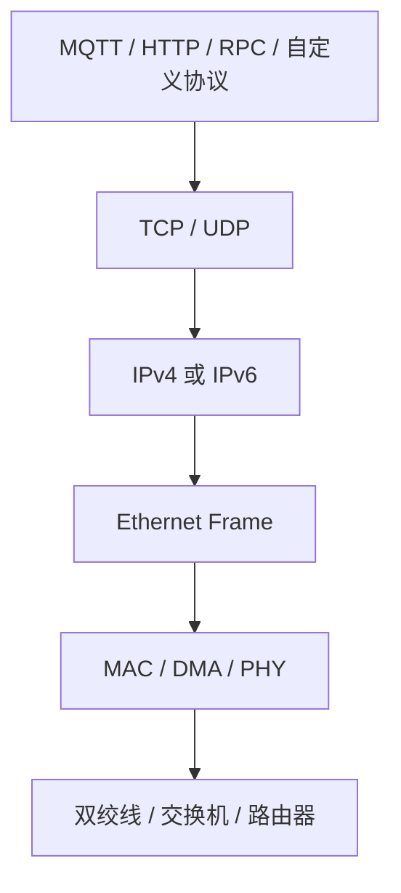
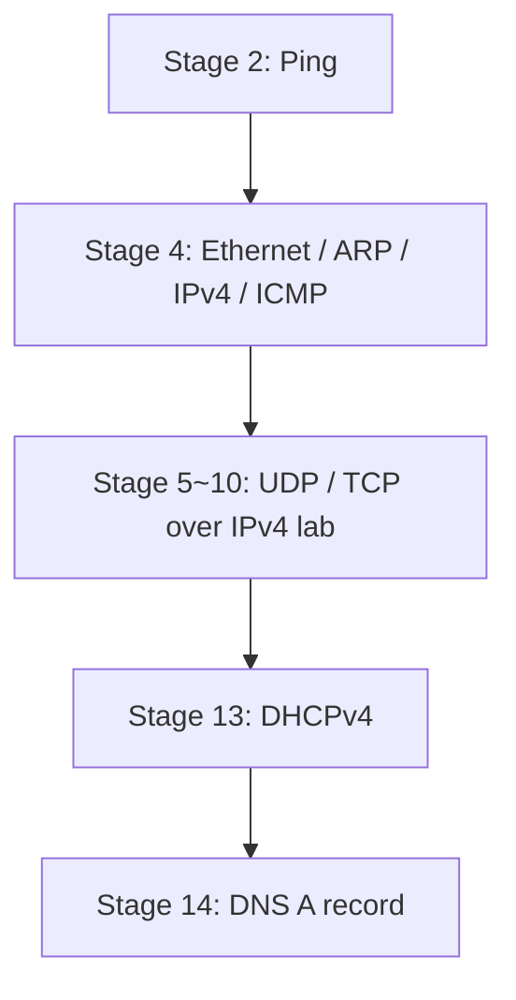
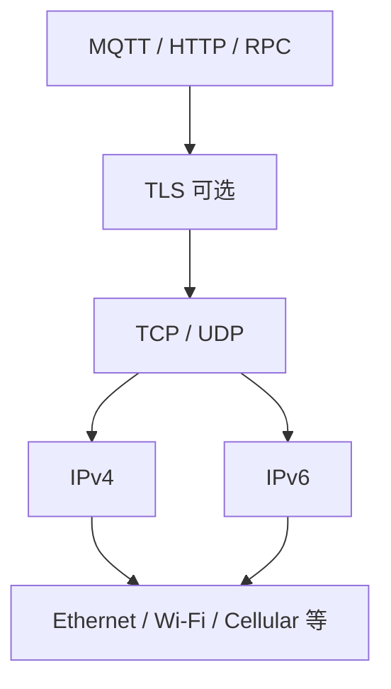

<meta name="referrer" content="no-referrer" />

# 教程 15：IPv4 与 IPv6——从网络层工作原理到嵌入式工程取舍

> 摘要：从前 14 篇已经建立的 IPv4 主线出发，对照 IPv6 的地址、邻居发现、自动配置、ICMP、分片、DNS 与过渡机制，并说明 MCU、Linux 与云场景需要掌握到什么程度。

[TOC]

Stage 1～14 的文章没有单独安排一篇“IPv4 总论”，但实际学习主线一直主要运行在 IPv4 上：Stage 2 的 Ping 使用 IPv4，Stage 4 明确进入 `ip4_input()`，Stage 5～10 的 UDP/TCP 实验运行在当前 IPv4 Host/TAP 网络，Stage 13 使用 DHCPv4 获取地址，Stage 14 的当前 DNS 实验解析 A 记录。[S1](#source-s1)

因此，本篇不是从零再讲一遍 IPv4，也不继续把 IPv6 拆成 Neighbor Discovery、SLAAC、MLD、DHCPv6 等多篇源码专题。目标是像厂商 Application Note 一样，先把 IPv4/IPv6 放回完整协议栈，建立一次端到端数据流，再解释两代网络层的关键差异、为什么会出现 IPv6，以及在 MCU Ethernet、Linux 网关和云连接中什么时候需要真正关心 IPv6。

本篇是 **Theory of Operation / 工程总览**，不是源码调用链文章。源码只用于说明 lwIP 中对应模块在哪里；如果以后需要深入 `ip6_input()`、`nd6_input()` 或 `dhcp6_recv()`，再从真实入口单独继续源码阅读。

## 1. 先把 IP 放回完整协议栈：MQTT、HTTP、RPC 并不直接“跑在 Ethernet 上”

对于典型 MCU Ethernet 设备，一条应用数据从业务代码走到网线，可以简化为：



这几层解决的问题不同：

| 层次 | 典型对象 | 当前真正解决的问题 |
| --- | --- | --- |
| 应用层 | MQTT topic、HTTP request、RPC method | 业务语义和应用消息 |
| 传输层 | TCP/UDP port | 同一台主机上的哪个 endpoint 接收数据 |
| 网络层 | IPv4/IPv6 address | packet 应该送到哪一个 IP 节点、经过哪些三层路由 |
| 数据链路层 | MAC address、Ethernet frame | 当前 Ethernet link 上下一跳是谁 |
| 物理层 | PHY、MII/RMII、线缆 | bit 怎样真正经过物理介质 |

Microchip AN1120 解释 Ethernet 时采用的核心方法也是先建立 protocol stack 与 encapsulation，再下钻 MAC/PHY，而不是先从 Ethernet Frame 字段表开始。[S11](#source-s11)

以 MQTT 为例，业务代码产生一个 PUBLISH 后：

```text
MQTT PUBLISH
    ↓
TCP segment
    ↓
IPv4 packet 或 IPv6 packet
    ↓
Ethernet frame
    ↓
PHY 发送
```

因此，IPv4 → IPv6 首先改变的是 **网络层地址与网络层控制机制**。MQTT、HTTP、TLS、RPC 的业务语义不会因为 IP 地址从 32 bit 变成 128 bit 就全部推倒重学；但 DNS、socket address、地址配置、邻居解析、路由和部分错误处理会发生变化。

## 2. 前 14 篇到底学了多少 IPv4

到 Stage 14 为止，IPv4 已经以“数据路径的一部分”出现多次，只是没有被单独抽成一篇背景总论。



Stage 4 已经建立了最关键的一条链：[S1](#source-s1)

```text
Ethernet frame
    ↓ EtherType = IPv4
ip4_input()
    ↓ Protocol
ICMP / UDP / TCP
```

同时，IPv4 packet 要在 Ethernet 上发送给同一链路的节点时，仍需要知道下一跳 MAC，所以 Stage 4 又建立：

```text
IPv4 destination
    ↓
本地 subnet ?
    ├─ 是：解析 destination 的 MAC
    └─ 否：解析 gateway 的 MAC
            ↓
           ARP
            ↓
      Ethernet destination MAC
```

Stage 13 则把“地址从哪里来”补齐为 DHCPv4；Stage 14 又把 hostname → IPv4 address 的普通 DNS A 查询接上。[S1](#source-s1)

所以更准确的说法不是“前 14 篇没有讲 IPv4”，而是：**IPv4 一直作为主数据面存在，但还缺少一次从完整网络层视角回看它，并与 IPv6 做系统比较。**

## 3. IPv4 的基本工程模型：地址、前缀、网关、ARP、DHCP 与 NAT 分别处于哪里

IPv4 address 是 32 bit。CIDR 使用 `/n` 表示前 `n` bit 是 network prefix，例如 `198.18.0.200/24` 表示前 24 bit 用于判断本地 subnet。[S3](#source-s3)

一个典型 MCU IPv4 配置可以抽象为：

```text
IPv4 address : 198.18.0.200
prefix       : /24
netmask      : 255.255.255.0
gateway      : 198.18.0.1
DNS server   : 198.18.0.1
```

这几个参数不要混在一起：

- **IPv4 address**：标识当前三层接口；
- **prefix/netmask**：判断目标是否属于当前 subnet；
- **default gateway**：目标不在本地 subnet 时使用的下一跳 router；
- **ARP**：在当前 Ethernet link 上把 IPv4 next-hop 映射到 MAC address；
- **DHCPv4**：可自动提供 IPv4 address、netmask、gateway、DNS 等配置；
- **DNS**：把 hostname 解析成 IP address；
- **NAT**：通常位于路由器/网关边界，用地址转换让私网节点共享或映射公网地址，并不是 IPv4 host 每次发送 packet 都必须执行的协议步骤。

RFC 1918 定义了私有 IPv4 地址空间，RFC 3022 描述了传统 NAT；它们缓解了公网 IPv4 地址消耗并形成今天非常常见的“设备在私网，网关做 NAT”的部署方式，但 NAT 不是 IPv4 基础报文格式的一部分。[S3](#source-s3)

## 4. 为什么会出现 IPv6：不只是“地址从 32 bit 扩到 128 bit”

IPv4 的 32-bit 地址空间和早期地址分配方式在互联网快速扩张后暴露出规模问题。CIDR 的重要目标之一就是减缓 IPv4 地址消耗并控制全球路由表增长；RFC 4632 同时明确指出，CIDR 并不从根本上消除 32-bit 地址空间最终耗尽的问题。[S3](#source-s3)

工程上后来又大量使用：

```text
CIDR
私有地址 RFC 1918
NAT / NAPT
```

这些机制让 IPv4 的生命周期远远超过早期预测，也解释了为什么今天很多 MCU 局域网产品仍然可以只使用 IPv4。

但 IPv6 的设计目标不是单纯制造“更多号码”。IPv6 重新设计了网络层的一些基础机制：[S4](#source-s4)[S5](#source-s5)[S6](#source-s6)

- 地址扩展到 128 bit；
- base header 固定化，并通过 Extension Header 扩展可选网络层信息；
- IPv6 本身不定义 broadcast address，更多依赖 multicast；
- ARP 不再用于 IPv6，邻居发现进入 ICMPv6 Neighbor Discovery；
- Router Advertisement 与 SLAAC 成为重要的地址/路由自动配置机制；
- Router 不再替 IPv6 source 做 fragmentation；
- ICMPv6 承担的职责比 IPv4 ICMP 更广，Neighbor Discovery 本身就建立在 ICMPv6 上。

因此 IPv6 是一套新的网络层工作模型，而不是“把 `uint32_t ip` 换成 16-byte array”这么简单。

## 5. IPv4 与 IPv6 先看整体差异

| 维度 | IPv4 | IPv6 |
| --- | --- | --- |
| 地址长度 | 32 bit | 128 bit |
| 常见文本形式 | `192.0.2.10` | `2001:db8::10` |
| 网络前缀 | CIDR，例如 `/24` | prefix length，例如 `/64` |
| Base Header | 最小 20 byte，可含 options | 固定 40 byte，扩展信息通过 Extension Headers |
| Header checksum | IPv4 Header 有 checksum | IPv6 base header 无 header checksum |
| 本地地址解析 | ARP | ICMPv6 Neighbor Discovery |
| Broadcast | 支持 IPv4 broadcast | IPv6 不定义 broadcast address |
| Multicast | IGMP 管理 IPv4 multicast membership | IPv6 大量依赖 multicast，MLD 管理 listener membership |
| 自动配置 | 静态 / DHCPv4 / AutoIP 等 | link-local + SLAAC，可结合 DHCPv6 等 |
| Internet Control | ICMPv4 | ICMPv6，且 ND/RA 等直接建立在其上 |
| Router fragmentation | 某些 IPv4 情况下 router 可以分片 | IPv6 router 不分片；source 承担 fragmentation |
| DNS 地址记录 | A | AAAA |

表格只建立地图。真正重要的是下一节开始的“同一职责由谁承担”。

## 6. 地址表示变化后，最先遇到的是 link-local 与 scope

IPv6 interface 通常会出现 link-local address。RFC 4291 为 IPv6 定义了 link-local address，并规定其作用范围只在当前 link 内；常见前缀是 `fe80::/10`。[S4](#source-s4)

这与 IPv4 工程经验有一个很大的认知差异：

```text
IPv4:
没有 DHCP/静态配置时，接口可能根本没有常规业务 IPv4 address

IPv6:
接口可以先拥有 link-local address
再通过 RA/SLAAC 等获得其他地址
```

link-local 不是“一个缩短版公网 IPv6 地址”。它具有 link scope，同一个 `fe80::...` destination 在多网卡系统里还可能需要额外的 interface/zone 信息才能确定从哪个 link 发送。

对于当前学习路线，只需要先记住三件事：

1. IPv6 地址不是只有“公网地址”一种；
2. link-local 是理解 ND、Router Discovery、SLAAC 的基础；
3. 地址存在不等于地址生命周期和可用状态完全相同，DAD 等机制会进一步确认地址是否可正常使用。[S6](#source-s6)

## 7. ARP 没有被“改名”为 ND：Neighbor Discovery 承担的职责更多

IPv4 Ethernet 最熟悉的关系是：

```text
IPv4 next-hop
    ↓ ARP
MAC address
```

IPv6 不使用 ARP。Neighbor Discovery（ND）使用 ICMPv6 消息完成 Neighbor Solicitation / Neighbor Advertisement 等工作，并且还承担 router discovery、prefix information、reachability 等职责。[S5](#source-s5)

最小的职责映射可以写成：

| 问题 | IPv4 常见机制 | IPv6 常见机制 |
| --- | --- | --- |
| “这个 next-hop 的 MAC 是什么？” | ARP Request/Reply | Neighbor Solicitation/Advertisement |
| “Router 在哪里？” | 常由静态/DHCPv4 提供 gateway | Router Solicitation/Advertisement |
| “邻居是否仍可到达？” | ARP cache + 实现策略 | ND Neighbor Unreachability Detection |
| “我要给 link 上所有节点发控制消息” | 可能使用 broadcast | IPv6 更依赖 multicast group |

所以不能简单记成：

```text
ARP = ND
```

更准确的是：**ND 覆盖了 ARP 的一部分地址解析职责，同时还把 Router Discovery、Prefix Discovery 与 neighbor reachability 等机制纳入同一个 IPv6 邻居发现体系。**

## 8. Broadcast 为什么在 IPv6 中弱化：Multicast 变得更重要

IPv4 局域网经常看到 broadcast，例如 DHCPv4 discovery 阶段。IPv6 addressing architecture 不定义 broadcast address，而是大量使用具有明确 scope 和 group 语义的 multicast。[S4](#source-s4)

例如 Neighbor Solicitation 并不是向整个二层网络做传统广播，而是使用 solicited-node multicast；IPv6 multicast 在 Ethernet 上再映射到 multicast MAC。IPv6 over Ethernet 的映射规则可进一步查 RFC 2464。[S12](#source-s12)

当应用或协议需要管理 IPv6 multicast listener membership 时，会遇到 MLD（Multicast Listener Discovery）。当前学习路线只需要知道它在 IPv6 multicast 中承担与“listener membership”相关的控制职责；MLDv1 的完整状态机可以按需查 RFC 2710，不需要现在追源码。[S12](#source-s12)

## 9. DHCPv4 与 SLAAC / DHCPv6 不是简单的一对一替换

Stage 13 的 DHCPv4 心智模型是：

```text
Client
  ↓ DISCOVER
Server
  ↓ OFFER
Client
  ↓ REQUEST
Server
  ↓ ACK
Client 获得 IPv4 address / netmask / gateway / DNS ...
```

IPv6 可以采用不同组合。

### 9.1 Router Advertisement

IPv6 Router Advertisement（RA）不仅告诉 host “router 存在”，还可以携带 prefix 等信息，是 IPv6 host 自动配置中的核心控制消息之一。[S5](#source-s5)

### 9.2 SLAAC

SLAAC（Stateless Address Autoconfiguration）允许 host 根据本地信息和 Router Advertisement 提供的 prefix 自动生成地址，并使用 Duplicate Address Detection 检查地址唯一性。[S6](#source-s6)

因此 IPv6 并不是“没有 DHCP Server 就没有地址”。

### 9.3 DHCPv6

DHCPv6 仍然存在，并由 RFC 8415 统一描述。它可以参与地址/参数配置，但不要把 DHCPv4 的每一个字段和状态机械映射成 DHCPv6 的同名步骤。[S7](#source-s7)

对当前 lwIP 学习只需要建立边界：

```text
IPv4: DHCPv4 是常见的完整地址配置入口

IPv6: RA / SLAAC / DHCPv6 可以组合承担配置职责
```

真正项目是否使用 SLAAC、DHCPv6，取决于网络设计和产品要求。

## 10. ICMPv6 为什么比“IPv6 版 Ping”重要得多

Stage 4 使用 ICMP Echo 建立了 IPv4 Ping。但在 IPv6 中，ICMPv6 不只是 Echo Request/Reply。[S8](#source-s8)

下列机制都与 ICMPv6 紧密相关：

```text
Echo Request / Reply
Neighbor Solicitation / Advertisement
Router Solicitation / Advertisement
Packet Too Big
其他 IPv6 error/control messages
```

这也是为什么“防火墙把 ICMPv6 全部禁掉”会比“禁掉 Ping”严重得多：Neighbor Discovery 和 Path MTU 等核心 IPv6 工作过程本身就依赖 ICMPv6。

对于 MCU 开发，需要形成的认知不是“记住所有 ICMPv6 Type”，而是：**IPv6 把更多网络层控制功能放进了 ICMPv6，不能把 ICMPv6 只理解成诊断工具。**

## 11. Fragmentation 与 Path MTU：IPv6 Router 不再替 Source 分片

IPv4 和 IPv6 在 fragmentation ownership 上存在关键差异。

IPv4 中，packet 大于下一跳 MTU 时，在允许 fragmentation 的条件下，source 或中间 router 都可能面对 IPv4 fragmentation/reassembly 机制。后续 Stage 16 会继续从 lwIP 的 `ip4_frag()` / `ip4_reass()` 深入 IPv4 这一条主线。

IPv6 则规定 fragmentation 只由 source node 执行，router 不对转发中的 IPv6 packet 做 fragmentation；当 packet 过大时，Path MTU Discovery 和 ICMPv6 Packet Too Big 成为关键反馈路径。[S4](#source-s4)[S8](#source-s8)

最小对照是：

```text
IPv4:
source / router 可能涉及 fragmentation

IPv6:
router 不 fragmentation
    ↓
Packet Too Big
    ↓
source 调整 packet size
必要时 source 使用 Fragment Header
```

当前学习路线不需要展开 Fragment Header 的每个 bit。需要做 IPv6 大包、隧道、特殊 MTU 或网络故障定位时，再查 RFC 8200 和 RFC 8201。[S4](#source-s4)[S8](#source-s8)

## 12. DNS：A 与 AAAA 把应用层和 IP 版本连接起来

Stage 14 的当前实验主要查询 DNS A record：hostname → IPv4 address。

IPv6 对应的地址记录是 AAAA。RFC 3596 定义了 DNS 对 IPv6 address 的扩展，同时保留 IPv4 A record，因此一个 hostname 可以同时存在 A 和 AAAA。[S9](#source-s9)

```text
example.com
   ├─ A    -> IPv4 address
   └─ AAAA -> IPv6 address
```

这也是为什么应用写成“先把 hostname 解析成一个通用 IP address，再 connect”通常比硬编码 `uint32_t IPv4` 更容易支持双栈。

但“DNS 返回 AAAA”不代表当前网络一定能真正到达这个 IPv6 destination。应用、OS/协议栈、route、interface 和网络基础设施都必须具备相应能力。

## 13. Dual-stack、IPv6-only、NAT64 / DNS64 分别解决什么问题

IPv4 与 IPv6 长期共存，因此实际系统常见的不只是“选 IPv4 或选 IPv6”。

### Dual-stack

同一个节点同时具备 IPv4 和 IPv6 能力：

```text
Application
   ↓
TCP / UDP
   ↓
IPv4 stack + IPv6 stack
```

Linux、服务器和网关场景经常需要处理这种模型。应用通过 DNS 和 socket API 选择实际使用的地址族。

### IPv6-only

节点本身只运行 IPv6。此时如果对端也是 IPv6，通信直接使用 IPv6；如果目标服务只有 IPv4，就需要转换机制或应用层 proxy。

### NAT64 + DNS64

NAT64 用于 IPv6 与 IPv4 packet/header translation；DNS64 可以在只有 A record 的情况下合成适合 NAT64 使用的 AAAA 结果，使 IPv6-only client 能够访问 IPv4-only server。[S10](#source-s10)

概念链可以简化为：

```text
IPv6-only client
    ↓ DNS AAAA query
DNS64
    ↓ synthesized AAAA
IPv6 destination using NAT64 prefix
    ↓
NAT64
    ↓ translate
IPv4-only server
```

这属于部署/过渡机制，不是每一个普通 MCU Ethernet 项目都需要实现。

## 14. MQTT、HTTP、TLS、RPC 到底和 IPv4/IPv6是什么关系

应用协议通常运行在 transport endpoint 之上，而不是绑定某一种 IP 版本。



因此，后续学习 HTTP、TLS、MQTT 或自定义 RPC 时，可以继续先以 IPv4 实验环境为主。需要 IPv6 时，重点检查的是：

- DNS 是否返回/处理 AAAA；
- socket/API 是否使用通用 address type；
- 配置文件是否支持 IPv6 literal / hostname；
- route 与 interface 是否存在可用 IPv6 path；
- firewall / ICMPv6 policy 是否破坏 ND/PMTU；
- 日志、序列化或 RPC schema 是否错误地把 IP address 固定成 32 bit。

MQTT 的 CONNECT/PUBLISH/SUBSCRIBE 语义、HTTP method/status、TLS record/handshake 的核心概念，并不会因为底层改用 IPv6 就全部重新定义。

## 15. 为什么很多传统 MCU Ethernet 项目仍然以 IPv4 为主

这里必须区分“工程常见做法”和“协议是否支持”。lwIP 本身同时提供 IPv4/IPv6 相关模块；某个项目只启用 IPv4，通常是产品需求与资源/验证范围的选择，而不是 lwIP 做不到 IPv6。[S2](#source-s2)

对于传统 MCU + Ethernet 产品，以下条件经常使 IPv4 成为更直接的首选：

- 设备工作在受控工厂/楼宇/机器人局域网；
- 对端是固定 Linux IPC、PLC、HMI、上位机或本地网关；
- 网络地址规划已经长期使用 IPv4 私网；
- 设备最终通过 Linux/工业网关上云，而 MCU 不直接承担公网路由复杂性；
- 现有诊断工具、现场运维脚本、客户网络规范都围绕 IPv4；
- 产品没有 IPv6-only、双栈或特定标准的硬需求。

这种场景下，先把下面这条 IPv4 工程链学扎实通常收益更高：

```text
Ethernet
  ↓
ARP / IPv4 / ICMP
  ↓
UDP / TCP
  ↓
DHCPv4 / DNS
  ↓
Socket / Raw API
  ↓
HTTP / TLS / MQTT / RPC
  ↓
Driver / DMA / PHY / 目标板 Port
```

但是不能把这种学习取舍写成“嵌入式不使用 IPv6”。以下条件出现时，IPv6 就从选修变成实际需求：

| 场景 | IPv6 关注程度 |
| --- | --- |
| MCU + Ethernet 固定局域网 | 常可先以 IPv4 为主，按产品需求决定是否双栈 |
| MCU ↔ Linux 网关 | IPv4 往往足够完成受控 LAN 通信；网关侧仍可能需要双栈 |
| MCU 直接访问企业/云网络 | 需要检查目标网络是否要求 IPv6/dual-stack |
| Linux Gateway / Edge Device | 更值得从一开始避免 IPv4-only 假设 |
| IPv6-only 网络 | 必须支持 IPv6，或依赖明确的 translation/proxy architecture |
| 协议/行业规范明确要求 IPv6 | IPv6 变成产品协议栈的一部分，不能当作可选背景知识 |

所以对当前学习路线，更准确的结论是：**IPv6 不是主线，但必须保留正确的整体认知；真正遇到产品需求时，再按模块深入。**

## 16. 对当前学习路线，IPv6 应该掌握到什么程度

### 当前必须掌握

- IPv4 与 IPv6 分别处于 TCP/UDP 和 Ethernet 之间；
- IPv4 是 32 bit，IPv6 是 128 bit；
- IPv6 link-local 与 scope 的基本概念；
- ARP 与 Neighbor Discovery 的职责差异；
- DHCPv4 与 RA/SLAAC/DHCPv6 的配置模型不同；
- IPv6 没有传统 broadcast address，multicast 更重要；
- ICMPv6 不只是 Ping；
- IPv6 router 不替 source fragmentation；
- DNS A 与 AAAA；
- dual-stack、IPv6-only、NAT64/DNS64 分别在解决什么问题；
- HTTP、MQTT、TLS、RPC 并不会因为使用 IPv6 就全部重学。

### 知道存在即可

- Neighbor Cache 的完整状态机；
- Router Advertisement 每个 option；
- DAD timer 与地址生命周期细节；
- MLDv1/MLDv2 完整状态机；
- DHCPv6 option 与 retransmission timer；
- IPv6 Fragment Header 每个字段；
- temporary/stable privacy address 生成策略。

### 项目真正需要 IPv6 时再深入

```text
IPv6-only / dual-stack 产品
    ↓
ND / SLAAC / DAD
    ↓
DHCPv6 / DNS AAAA
    ↓
PMTU / ICMPv6 / multicast
    ↓
目标板 RAM / timer / multicast filter / driver 支持
    ↓
实际网络互通与长期运行验证
```

这种学习深度能保证后续遇到 IPv6 时不会把它误认为“只是更长的 IP 地址”，同时又不会阻断当前 MCU Ethernet + lwIP + 应用协议主线。

## 17. 如果以后需要回到 lwIP IPv6 源码，从这些入口继续

当前 upstream revision 中，可以把 IPv6 相关源码地图先压缩成： [S2](#source-s2)

| 主题 | lwIP 入口/模块 | 以后要回答的问题 |
| --- | --- | --- |
| IPv6 RX/TX | `src/core/ipv6/ip6.c` | base header、Next Header、route/output |
| ICMPv6 | `src/core/ipv6/icmp6.c` | Echo、error、Packet Too Big |
| Neighbor Discovery / RA / SLAAC | `src/core/ipv6/nd6.c` | NS/NA、Router/Prefix、DAD、cache |
| Ethernet IPv6 output | `src/core/ipv6/ethip6.c` | IPv6 next-hop 到 Ethernet MAC |
| MLD | `src/core/ipv6/mld6.c` | IPv6 multicast membership |
| DHCPv6 | `src/core/ipv6/dhcp6.c` | DHCPv6 parameter acquisition 与实现边界 |
| IPv6 fragmentation | `src/core/ipv6/ip6_frag.c` | source fragmentation / reassembly |

这里仅给入口，不连续展开调用链。真正开始读某一个模块时，再从对应行为的真实入口重新建立 Source-driven 调用链。

## 18. 下一阶段回到 IPv4 主线

Stage 15 到这里结束 IPv6 总览。下一阶段继续当前工程主线，从 IPv4 已经实际存在的 MTU 边界进入 fragmentation/reassembly：

```text
Stage 15  IPv4 / IPv6 整体认知
    ↓
Stage 16  IPv4 fragmentation / reassembly
    ↓
Stage 17  IGMP / IPv4 multicast
    ↓
Stage 18  multi-netif routing
    ↓
Driver / DMA / PHY / VLAN
    ↓
应用层协议与目标板 Port
```

IPv6 后续不再单独扩展为连续源码 Stage；项目真正需要时，直接从本篇资料入口和 lwIP 对应模块回到源码即可。

## 资料来源

<a id="source-s1"></a>
### [S1] 本系列 Stage 2 / 4 / 13 / 14
- 类型：当前仓库学习文档与实验材料
- 版本：与当前仓库一致；目标 lwIP revision `d08f4773edd0182b7910fc8f046eed82ffcd67c9`
- 定位：[`02-netif-tap-first-ping.md`](02-netif-tap-first-ping.md)、[`04-ethernet-arp-ipv4-icmp.md`](04-ethernet-arp-ipv4-icmp.md)、[`13-dhcpv4.md`](13-dhcpv4.md)、[`14-dns.md`](14-dns.md)
- 使用位置：“前 14 篇到底学了多少 IPv4”“IPv4 工程模型”“DNS A record”
- 支撑内容：证明当前系列的 Host/TAP 数据面、`ip4_input()`、DHCPv4 和 DNS A 查询已经构成完整 IPv4 学习主线

<a id="source-s2"></a>
### [S2] lwIP upstream IPv4 / IPv6 实现
- 类型：目标版本上游源码
- 版本：commit `d08f4773edd0182b7910fc8f046eed82ffcd67c9`
- URL/文档：[lwIP upstream @ d08f477](https://github.com/lwip-tcpip/lwip/tree/d08f4773edd0182b7910fc8f046eed82ffcd67c9)
- 定位：`src/core/ipv4/`、`src/core/ipv6/ip6.c`、`icmp6.c`、`nd6.c`、`mld6.c`、`dhcp6.c`、`ip6_frag.c`、`src/core/ipv6/ethip6.c`
- 使用位置：“很多传统 MCU Ethernet 项目为什么仍以 IPv4 为主”“以后怎样回到 lwIP IPv6 源码”
- 支撑内容：证明目标 revision 同时具有 IPv4/IPv6 相关模块，并提供后续源码下钻入口

<a id="source-s3"></a>
### [S3] IPv4 地址规模、CIDR、私有地址与 NAT
- 类型：IETF / RFC Editor
- URL/文档：[RFC 4632 — CIDR](https://www.rfc-editor.org/rfc/rfc4632.html)、[RFC 1918 — Private Internets](https://www.rfc-editor.org/rfc/rfc1918.html)、[RFC 3022 — Traditional NAT](https://www.rfc-editor.org/rfc/rfc3022.html)
- 使用位置：“IPv4 基本工程模型”“为什么会出现 IPv6”
- 支撑内容：32-bit IPv4 地址空间、CIDR prefix、地址空间消耗问题、私有地址与传统 NAT 的部署背景

<a id="source-s4"></a>
### [S4] IPv6 基础协议与地址架构
- 类型：IETF / RFC Editor
- URL/文档：[RFC 8200 — IPv6 Specification](https://www.rfc-editor.org/rfc/rfc8200.html)、[RFC 4291 — IPv6 Addressing Architecture](https://www.rfc-editor.org/rfc/rfc4291.html)
- 使用位置：“为什么有 IPv6”“IPv4/IPv6 对比”“link-local”“fragmentation”
- 支撑内容：IPv6 base header、128-bit addressing、address types/scope、router 不执行 IPv6 fragmentation 等基础规则

<a id="source-s5"></a>
### [S5] RFC 4861 — Neighbor Discovery for IPv6
- 类型：IETF / RFC Editor
- URL/文档：[RFC 4861](https://www.rfc-editor.org/rfc/rfc4861.html)
- 使用位置：“ARP 与 ND”“Router Advertisement”
- 支撑内容：Neighbor Solicitation/Advertisement、Router Solicitation/Advertisement、neighbor/router/prefix discovery 与 reachability 机制

<a id="source-s6"></a>
### [S6] RFC 4862 — IPv6 Stateless Address Autoconfiguration
- 类型：IETF / RFC Editor
- URL/文档：[RFC 4862](https://www.rfc-editor.org/rfc/rfc4862.html)
- 使用位置：“link-local”“SLAAC”“DAD”
- 支撑内容：IPv6 stateless autoconfiguration、link-local/global address generation 与 Duplicate Address Detection

<a id="source-s7"></a>
### [S7] RFC 8415 — DHCP for IPv6
- 类型：IETF / RFC Editor
- URL/文档：[RFC 8415](https://www.rfc-editor.org/rfc/rfc8415.html)
- 使用位置：“DHCPv4 与 SLAAC/DHCPv6”
- 支撑内容：当前 DHCPv6 协议定义与参数/地址配置模型

<a id="source-s8"></a>
### [S8] ICMPv6 与 IPv6 Path MTU Discovery
- 类型：IETF / RFC Editor
- URL/文档：[RFC 4443 — ICMPv6](https://www.rfc-editor.org/rfc/rfc4443.html)、[RFC 8201 — IPv6 Path MTU Discovery](https://www.rfc-editor.org/rfc/rfc8201.html)
- 使用位置：“ICMPv6 为什么重要”“Fragmentation 与 Path MTU”
- 支撑内容：ICMPv6 error/control message、Packet Too Big 与 Path MTU Discovery 的职责

<a id="source-s9"></a>
### [S9] RFC 3596 — DNS Extensions to Support IPv6
- 类型：IETF / RFC Editor
- URL/文档：[RFC 3596](https://www.rfc-editor.org/rfc/rfc3596.html)
- 使用位置：“DNS A / AAAA”
- 支撑内容：AAAA record、IPv4/IPv6 address query 共存与 IPv6 reverse lookup 扩展

<a id="source-s10"></a>
### [S10] NAT64 与 DNS64
- 类型：IETF / RFC Editor
- URL/文档：[RFC 6146 — Stateful NAT64](https://www.rfc-editor.org/rfc/rfc6146.html)、[RFC 6147 — DNS64](https://www.rfc-editor.org/rfc/rfc6147.html)
- 使用位置：“IPv6-only、NAT64/DNS64”
- 支撑内容：IPv6-only client 访问 IPv4-only server 时的地址转换与 AAAA synthesis 机制

<a id="source-s11"></a>
### [S11] Microchip AN1120 — Ethernet Theory of Operation
- 类型：MCU 厂商 Application Note
- URL/文档：[AN1120 — Ethernet Theory of Operation](https://ww1.microchip.com/downloads/en/AppNotes/01120a.pdf)
- 使用位置：“先把 IP 放回完整协议栈”
- 支撑内容：以 protocol stack 与 frame/packet encapsulation 先建立系统模型、再下钻具体 Ethernet 机制的组织方式

<a id="source-s12"></a>
### [S12] IPv6 over Ethernet 与 Multicast Listener Discovery
- 类型：IETF / RFC Editor
- URL/文档：[RFC 2464 — IPv6 over Ethernet](https://www.rfc-editor.org/rfc/rfc2464.html)、[RFC 2710 — MLDv1](https://www.rfc-editor.org/rfc/rfc2710.html)
- 使用位置：“Broadcast 与 Multicast”
- 支撑内容：IPv6 multicast 到 Ethernet multicast MAC 的映射与 MLD listener membership 基础语义
