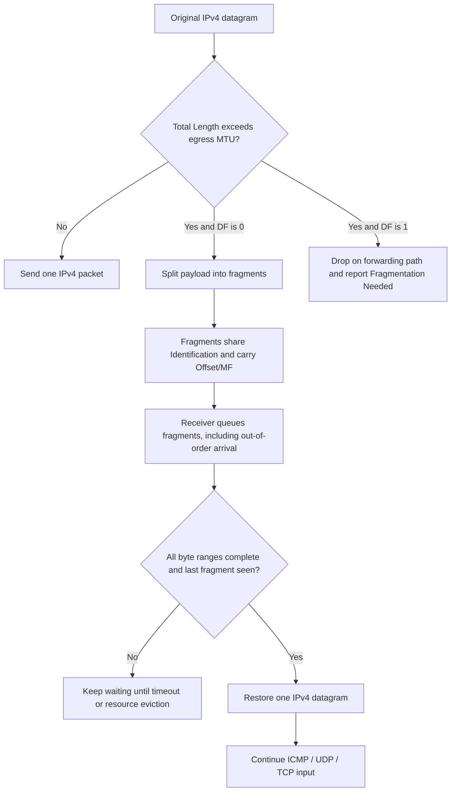
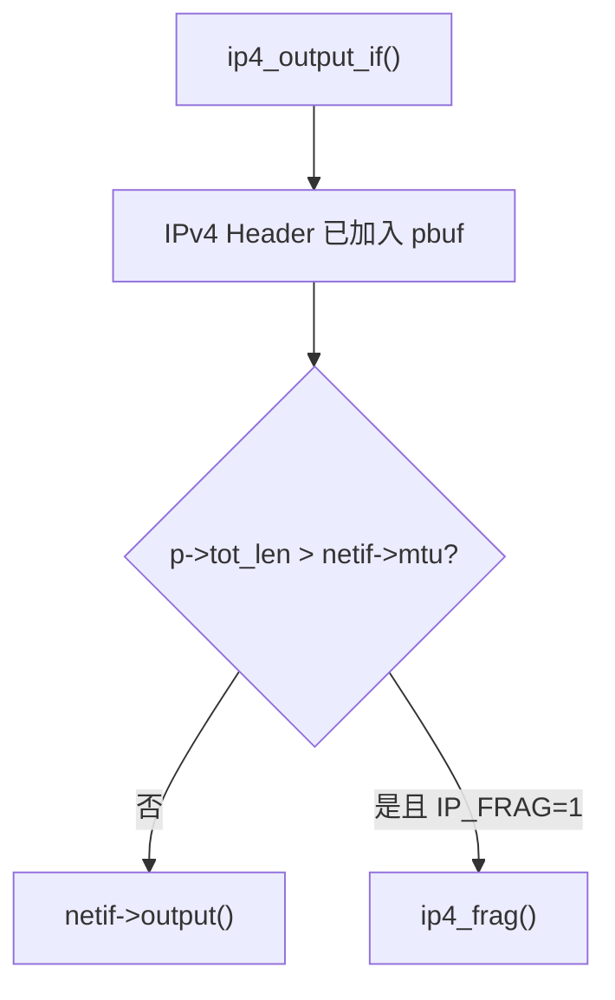
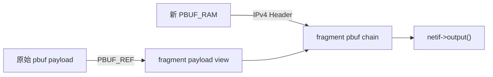
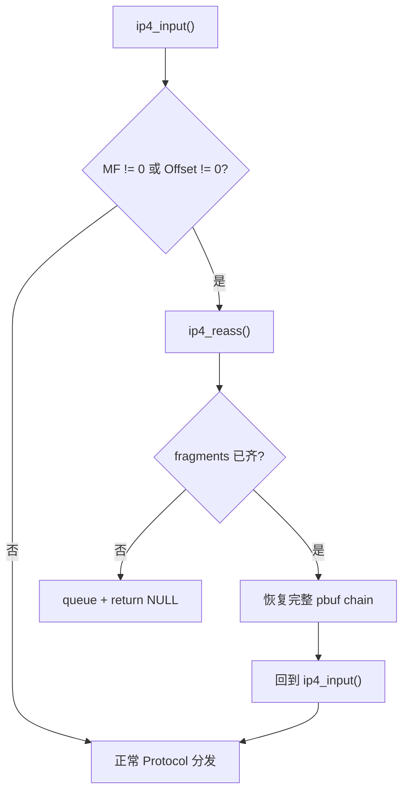
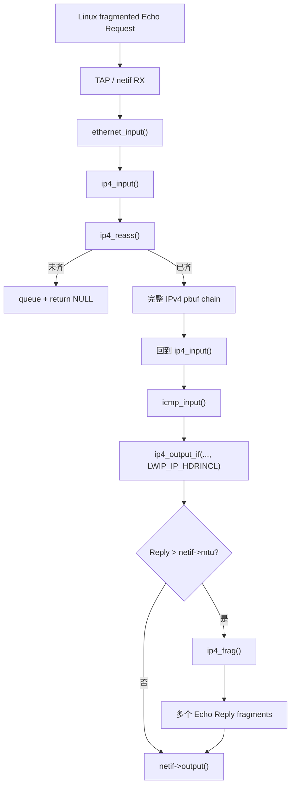

<meta name="referrer" content="no-referrer" />

# 教程 16：从 MTU 到 `ip4_frag()` / `ip4_reass()`——IPv4 分片、重组、超时与内存压力

> 摘要：沿 IPv4 发送与接收源码链，理解 MTU 如何触发分片、Offset/MF/ID 如何组织片段，以及 lwIP 怎样排序、重组、超时清理并限制资源占用。

[TOC]

IPv4 fragmentation（IPv4 分片）解决的是“一个 IPv4 datagram 比当前可发送路径允许的 packet 更大时，怎样把它拆成多个 fragment”；reassembly（重组）则在最终目的主机把这些 fragment 恢复成原始 datagram。Fragment 不是新的传输层或 ICMP message，每一片仍然携带自己的 IPv4 Header，并通过 Identification、MF（More Fragments）和 Fragment Offset 表明自己属于哪个原始 datagram、位于什么位置、后面是否还有片段。[S4](#source-s4)[S12](#source-s12)

MTU（Maximum Transmission Unit，最大传输单元）表示某个接口一次能够承载的最大网络层 packet 大小；PMTU（Path MTU，路径 MTU）是端到端路径上可无分片通过的最小 MTU；TCP MSS（Maximum Segment Size，最大报文段数据长度）属于 TCP 层，限制的是单个 TCP segment 中的 payload，不等于 IPv4 MTU。IPv4 Header 的 Total Length 则描述当前完整 IPv4 packet 的实际字节数。[S6](#source-s6)[S10](#source-s10)[S11](#source-s11)

DF（Don't Fragment）表示不允许中间 IPv4 router 对该 datagram 分片。DF 为 0 且 packet 超过出口 MTU 时可以进入 fragmentation；DF 为 1 时，转发节点不能直接拆片，而应丢弃超 MTU packet 并通过 ICMP “Fragmentation Needed” 类错误把限制反馈给发送端，供 IPv4 Path MTU Discovery 调整后续 packet 大小。[S4](#source-s4)[S6](#source-s6)

## 0. 阅读源码前：先把 fragmentation / reassembly 协议模型建立起来

### 0.1 建议提前阅读

1. [Cisco — IPv4 Fragmentation, MTU, MSS and PMTUD](https://www.cisco.com/c/en/us/support/docs/ip/generic-routing-encapsulation-gre/25885-pmtud-ipfrag.html)
   - 用途：快速区分 MTU、PMTU、MSS、DF 与 PMTUD（Path MTU Discovery，路径 MTU 发现）的工程关系。[S11](#source-s11)
2. [RFC 791 — Internet Protocol](https://www.rfc-editor.org/rfc/rfc791.html)
   - 用途：核对 Identification、MF、Fragment Offset、DF 与重组的基础语义。[S4](#source-s4)
3. [RFC 1191 — Path MTU Discovery](https://www.rfc-editor.org/rfc/rfc1191.html)
   - 用途：理解 DF、ICMP Fragmentation Needed 与 IPv4 PMTUD 怎样协作。[S6](#source-s6)
4. [RFC 8900 — IP Fragmentation Considered Fragile](https://www.rfc-editor.org/rfc/rfc8900.html)
   - 用途：理解 fragmentation 在真实网络中为什么会带来可靠性、安全与中间设备兼容风险。[S10](#source-s10)

### 0.2 Fragment Header 字段怎样共同描述一个原始 datagram

| 字段/概念 | 当前语义 | 对重组的作用 |
| --- | --- | --- |
| Identification | 标记原始 IPv4 datagram 的 ID | 接收端用它与地址等信息关联属于同一 datagram 的 fragments |
| Fragment Offset | 当前 fragment payload 在原始 IP payload 中的起始位置，单位为 8 bytes | 决定片段应该放回哪里 |
| MF | More Fragments | `1` 表示后面还有 fragment，最后一片为 `0` |
| DF | Don't Fragment | `1` 禁止 router fragmentation |
| Total Length | 当前 fragment 自己的 IPv4 Header + payload 长度 | 决定这一片实际携带多少字节 |

除最后一个 fragment 外，fragment payload 长度通常必须能够按 8-byte block 对齐，这样 Fragment Offset 才能精确表达下一片的位置。[S4](#source-s4)

### 0.3 一次 fragmentation → reassembly 的总流程



本文的真实 Host/TAP 实验同时覆盖两个方向：Linux 先把大 ICMP Echo Request 分片，lwIP 的 `ip4_reass()` 收齐后恢复完整 request；lwIP 生成同样很大的 Echo Reply 后，`ip4_frag()` 再按 `netif->mtu` 拆成 fragments 发回 Linux。[S7](#source-s7)

### 0.4 协议动作与 lwIP 源码的双轨映射

| 协议阶段 | lwIP 入口 | 关键字段/对象 | 完成后的下一步 |
| --- | --- | --- | --- |
| TX 判断是否超 MTU | `ip4_output_if_opt_src()` | `p->tot_len`、`netif->mtu` | 直接发送或进入 `ip4_frag()` |
| 构造 fragments | `ip4_frag()` | Identification、Offset、MF、Total Length | 每片调用 `netif->output()` |
| RX 识别 fragment | `ip4_input()` | MF / Fragment Offset | fragment 进入 `ip4_reass()` |
| 建立/查找重组项 | `ip4_reass()` | `ip_reassdata`、fragment byte range | 排序并等待缺失片段 |
| 完成重组 | `ip4_reass()` | 完整连续 byte range | 返回完整 `pbuf` 给 `ip4_input()` |
| 超时/资源回收 | `ip_reass_tmr()` / eviction path | timer、`IP_REASS_MAX_PBUFS` | 丢弃不完整 datagram |
| DF/PMTU 边界 | `ip4_forward()` | DF、egress MTU | fragment 或 ICMP error |

下面进入源码后，只沿这条真实执行路径下钻；RFC 与厂商资料负责权威定义，但正文会在字段第一次影响当前函数分支时继续解释其行为。

## 1. 真实发送入口：`ip4_output_if()` 为什么进入 `ip4_frag()`

Stage 4 里的普通 IPv4 packet 最终直接进入 `netif->output()`。现在只改变一个条件：IPv4 Header 已加入 `pbuf` 后，`p->tot_len` 大于输出接口 `netif->mtu`。

`ip4_output_if()` 最终进入 `ip4_output_if_opt_src()`。该函数先把 IPv4 Header 加到 `pbuf` 头部，并填写 Total Length、Identification、Offset 等字段。[S1](#source-s1)

```c
if (pbuf_add_header(p, IP_HLEN)) {
  IP_STATS_INC(ip.err);
  MIB2_STATS_INC(mib2.ipoutdiscards);
  return ERR_BUF;
}

iphdr = (struct ip_hdr *)p->payload;
IPH_TTL_SET(iphdr, ttl);
IPH_PROTO_SET(iphdr, proto);
ip4_addr_copy(iphdr->dest, *dest);
IPH_VHL_SET(iphdr, 4, ip_hlen / 4);
IPH_TOS_SET(iphdr, tos);
IPH_LEN_SET(iphdr, lwip_htons(p->tot_len));
IPH_OFFSET_SET(iphdr, 0);
```

所以此时：

```text
p->tot_len
=
IPv4 Header + L4 Header + L4 Payload
```

继续阅读同一个 `ip4_output_if_opt_src()` 的发送尾部：[S1](#source-s1)

```c
#if IP_FRAG
if (netif->mtu && (p->tot_len > netif->mtu)) {
  return ip4_frag(p, netif, dest);
}
#endif

return netif->output(netif, p, dest);
```



因此分片不是 Driver 临时决定的行为。**触发点就在 IPv4 output 层，判断依据是所选 `netif` 的 MTU。**

## 2. 协议字段回到 lwIP 时，对应哪些变量与对象

上面的协议基线已经说明 MTU、PMTU、MSS 与 fragment fields 的职责。进入源码后，需要继续把这些协议对象落到具体变量和分支，而不是把它们当作已知黑盒：[S1](#source-s1)[S10](#source-s10)[S11](#source-s11)

| 协议/工程概念 | lwIP 中当前对应对象 | 本篇为什么关心 |
| --- | --- | --- |
| 输出接口 MTU | `netif->mtu` | `ip4_output_if_opt_src()` 判断是否进入 `ip4_frag()` |
| 当前 IPv4 packet 总长度 | IPv4 `Total Length`、`p->tot_len` | 与 `netif->mtu` 比较并决定分片 |
| TCP MSS | TCP PCB / option 相关状态 | 属于 TCP segmentation 边界，不等于 IPv4 fragmentation |
| 当前 pbuf node 长度 | `p->len` | 只描述当前 node |
| 整条 pbuf chain 长度 | `p->tot_len` | IPv4 output 看到的完整 packet 长度 |
| Fragment Identification | IPv4 Header `id` | reassembly 用来区分不同原始 datagram |
| MF / Fragment Offset | IPv4 Header offset/flag | 表示当前 fragment 的位置及后续是否还有 fragment |

“线上出现多个 packet”不能直接等价为 IPv4 fragmentation；本文以 IPv4 fragment 字段和 `ip4_frag()` / `ip4_reass()` 调用链为准。

## 3. RFC 字段在 lwIP 中落到哪些宏

RFC 791/6864 已定义这些字段；这里仅映射到 lwIP 宏。[S4](#source-s4)[S12](#source-s12)[S1](#source-s1)

```c
#define IP_DF      0x4000U
#define IP_MF      0x2000U
#define IP_OFFMASK 0x1fffU

#define IPH_OFFSET_BYTES(hdr) \
  ((u16_t)((lwip_ntohs(IPH_OFFSET(hdr)) & IP_OFFMASK) * IP_MIN_FRAG_LENGTH))
```

实现映射只有一个关键点：Header 保存 8-byte block offset，`ip4_reass()` 会恢复为 byte range；例如 raw offset `185` 对应 byte offset `1480`。

## 4. 进入 `ip4_frag()`：先把 MTU 换算成 8-byte block

从 `ip4_output_if_opt_src()` 的 call site 进入 `ip4_frag()`。[S1](#source-s1)

```c
err_t
ip4_frag(struct pbuf *p, struct netif *netif, const ip4_addr_t *dest)
{
  struct pbuf *rambuf;
  struct ip_hdr *original_iphdr;
  struct ip_hdr *iphdr;
  const u16_t nfb = (u16_t)((netif->mtu - IP_HLEN) / 8);
  u16_t left, fragsize;
  u16_t ofo;
  int last;
  u16_t poff = IP_HLEN;
  u16_t tmp;
  int mf_set;
```

`nfb` 是一个最大 fragment 能装多少个 8-byte payload block。若 MTU=1500、IPv4 Header=20：

```text
nfb = floor((1500 - 20) / 8) = 185
最大非末片 payload = 185 × 8 = 1480 bytes
```

当前实现还要求 `IPH_HL_BYTES(iphdr) == IP_HLEN`，即只支持 20-byte IPv4 Header；带 IPv4 Options 的 Header 在 `ip4_frag()` 中返回 `ERR_VAL`。[S1](#source-s1) 这是当前 lwIP 实现限制，不是 IPv4 规范禁止对带 options 的 packet 分片。[S4](#source-s4)

随后 `ip4_frag()` 保存输入 packet 已有的 fragment 状态：

```c
tmp = lwip_ntohs(IPH_OFFSET(iphdr));
ofo = tmp & IP_OFFMASK;
mf_set = tmp & IP_MF;

left = (u16_t)(p->tot_len - IP_HLEN);
```

这使一个已经是 fragment 的 packet 在需要再次拆小时仍能保留原 offset 和 MF 语义，而不是错误地从 offset 0 重新开始。

## 5. `while (left)`：每轮只构造一个 fragment

继续阅读 `ip4_frag()`：[S1](#source-s1)

```c
while (left) {
  fragsize = LWIP_MIN(left, (u16_t)(nfb * 8));
```

若剩余 payload 是 8000 bytes、MTU=1500：

```text
1480 + 1480 + 1480 + 1480 + 1480 + 600
```

也就是 6 个 fragments。最后一片允许不是 8-byte 倍数，因为后面已经没有新的 fragment offset 需要表达。

## 6. Fragment 的 pbuf 有两种构造策略

`ip4_frag()` 根据 `LWIP_NETIF_TX_SINGLE_PBUF` 选择两种数据组织方式。[S1](#source-s1)[S2](#source-s2)

### 6.1 单 pbuf：复制当前 fragment payload

当 `LWIP_NETIF_TX_SINGLE_PBUF=1` 时，`ip4_frag()` 分配新的 `PBUF_RAM`，复制当前 fragment payload，再把 IPv4 Header 加回去：

```c
rambuf = pbuf_alloc(PBUF_IP, fragsize, PBUF_RAM);
if (rambuf == NULL) {
  goto memerr;
}

poff += pbuf_copy_partial(p, rambuf->payload, fragsize, poff);
if (pbuf_add_header(rambuf, IP_HLEN)) {
  pbuf_free(rambuf);
  goto memerr;
}
SMEMCPY(rambuf->payload, original_iphdr, IP_HLEN);
```

优点是 Driver 更容易得到一块连续 packet；代价是 payload copy。

### 6.2 pbuf chain：Header copy，payload 用 `PBUF_REF` 引用原数据

`LWIP_NETIF_TX_SINGLE_PBUF=0` 时，当前实现先分配只保存 Header 的 RAM pbuf，再为原 pbuf 中属于当前 fragment 的 payload 建立 `PBUF_REF`。[S1](#source-s1) 下面继续阅读 `ip4_frag()` 中这一分支。

```c
rambuf = pbuf_alloc(PBUF_LINK, IP_HLEN, PBUF_RAM);
if (rambuf == NULL) {
  goto memerr;
}
SMEMCPY(rambuf->payload, original_iphdr, IP_HLEN);
iphdr = (struct ip_hdr *)rambuf->payload;
```

继续阅读同一个 `ip4_frag()` 的引用构造：

```c
pcr = ip_frag_alloc_pbuf_custom_ref();
if (pcr == NULL) {
  pbuf_free(rambuf);
  goto memerr;
}

newpbuf = pbuf_alloced_custom(PBUF_RAW, newpbuflen, PBUF_REF, &pcr->pc,
                              (u8_t *)p->payload + poff, newpbuflen);
if (newpbuf == NULL) {
  ip_frag_free_pbuf_custom_ref(pcr);
  pbuf_free(rambuf);
  goto memerr;
}

pbuf_ref(p);
pcr->original = p;
pcr->pc.custom_free_function = ipfrag_free_pbuf_custom;
pbuf_cat(rambuf, newpbuf);
```



`pbuf_ref(p)` 保证 Driver/DMA 尚未完成发送时原数据不会提前释放。对应引用对象来自 `FRAG_PBUF` memp pool：[S2](#source-s2)

```c
LWIP_MEMPOOL(FRAG_PBUF, MEMP_NUM_FRAG_PBUF,
             sizeof(struct pbuf_custom_ref), "FRAG_PBUF")
```

默认 `MEMP_NUM_FRAG_PBUF` 为 15。`opt.h` 特别说明：DMA MAC 如果 `netif->output()` 返回时硬件还没发完，可能同时占用多个 fragment reference。[S2](#source-s2)

这把 Stage 3 的 pbuf ownership、Stage 12 的 memp pool 与 Driver TX 生命周期直接连在一起。

## 7. 每片怎样填写 MF、Offset、Length 和 checksum

当前 fragment payload 准备好以后，`ip4_frag()` 修正 Header：[S1](#source-s1)

```c
last = (left <= netif->mtu - IP_HLEN);

tmp = (IP_OFFMASK & ofo);
if (!last || mf_set) {
  tmp = tmp | IP_MF;
}
IPH_OFFSET_SET(iphdr, lwip_htons(tmp));
IPH_LEN_SET(iphdr, lwip_htons((u16_t)(fragsize + IP_HLEN)));
IPH_CHKSUM_SET(iphdr, 0);
#if CHECKSUM_GEN_IP
IF__NETIF_CHECKSUM_ENABLED(netif, NETIF_CHECKSUM_GEN_IP) {
  IPH_CHKSUM_SET(iphdr, inet_chksum(iphdr, IP_HLEN));
}
#endif
```

Identification 不需要重新生成，因为每片 Header 都由原 Header 复制而来；同一原 datagram 的 fragments 自然保留相同 ID。

随后每片独立进入 `netif->output()`：

```c
netif->output(netif, rambuf, dest);
IPFRAG_STATS_INC(ip_frag.xmit);

pbuf_free(rambuf);
left = (u16_t)(left - fragsize);
ofo = (u16_t)(ofo + nfb);
```

也就是说发送流程是“构造一片 → 输出一片 → 释放当前 fragment view → 继续下一片”，不是先做一个 fragment 数组再一次性交给 Driver。

## 8. MTU=1500 时，8000-byte payload 为什么正好是 6 片

由 `nfb=185` 得到最大 fragment payload=1480 bytes：

| Fragment | Payload | Offset field | Offset bytes | MF |
| ---: | ---: | ---: | ---: | ---: |
| 1 | 1480 | 0 | 0 | 1 |
| 2 | 1480 | 185 | 1480 | 1 |
| 3 | 1480 | 370 | 2960 | 1 |
| 4 | 1480 | 555 | 4440 | 1 |
| 5 | 1480 | 740 | 5920 | 1 |
| 6 | 600 | 925 | 7400 | 0 |

upstream Unit Test 直接把这个行为固定成断言。[S3](#source-s3)

```c
START_TEST(test_ip4_frag)
{
  struct pbuf *data = pbuf_alloc(PBUF_IP, 8000, PBUF_RAM);
  ip_addr_t peer_ip = IPADDR4_INIT_BYTES(192,168,0,5);
  err_t err;

  linkoutput_ctr = 0;
  linkoutput_byte_ctr = 0;

  fail_unless(data != NULL);
  test_netif_add();
  test_netif.output = arpless_output;
  err = ip4_output_if_src(data, &test_ipaddr, ip_2_ip4(&peer_ip),
                          16, 0, IP_PROTO_UDP, &test_netif);
  fail_unless(err == ERR_OK);
  fail_unless(linkoutput_ctr == 6);
  fail_unless(linkoutput_byte_ctr == (8000 + (6 * IP_HLEN)));
  pbuf_free(data);
  test_netif_remove();
}
END_TEST
```

除了 6 片，它还验证每片都有自己的 20-byte IPv4 Header，所以总发送字节数是 `8000 + 6 * IP_HLEN`。

## 9. 切换到 RX：`ip4_input()` 在 L4 分发前先检查 fragment 标志

发送侧到此闭环。接收侧从 `ip4_input()` 开始。

Stage 4 里普通 packet 会继续根据 `Protocol` 分发到 ICMP/UDP/TCP；fragmented packet 在这之前先经过：[S1](#source-s1)

```c
if ((IPH_OFFSET(iphdr) & PP_HTONS(IP_OFFMASK | IP_MF)) != 0) {
#if IP_REASSEMBLY
  p = ip4_reass(p);
  if (p == NULL) {
    return ERR_OK;
  }
  iphdr = (const struct ip_hdr *)p->payload;
#else
  pbuf_free(p);
  return ERR_OK;
#endif
}
```

判定不能只看 MF，因为最后一片虽然 `MF=0`，Fragment Offset 仍非 0。条件实际是：

```text
MF != 0  或  Offset != 0
```

命中以后先进入 `ip4_reass()`，完整 datagram 恢复前不会交给 L4。

## 10. `ip4_reass()` 返回 `NULL` 不等于错误

调用点是：

```c
p = ip4_reass(p);
if (p == NULL) {
  return ERR_OK;
}
```

所以 `ip4_reass()` 有两种正常语义：

| 返回值 | 含义 |
| --- | --- |
| `NULL` | 当前 fragment 已被排队，datagram 仍不完整；本次 RX 到此结束 |
| 非 `NULL` | 所有 fragments 已齐，返回恢复后的完整 IPv4 pbuf chain |

如果当前 fragment 无效或资源不足，`ip4_reass()` 也会在内部 free 后返回 `NULL`。因此调用者不能用“NULL=malloc fail”的惯性理解这个 API。

## 11. 进入 `ip4_reass()`：先把网络字段变成 byte range

上游连续源码片段：[S1](#source-s1)

```c
struct pbuf *
ip4_reass(struct pbuf *p)
{
  struct pbuf *r;
  struct ip_hdr *fraghdr;
  struct ip_reassdata *ipr;
  struct ip_reass_helper *iprh;
  u16_t offset, len, clen;
  u8_t hlen;
  int valid;
  int is_last;

  fraghdr = (struct ip_hdr *)p->payload;
```

继续阅读同一个 `ip4_reass()`，把 Header 字段换算成 byte range：

```c
offset = IPH_OFFSET_BYTES(fraghdr);
len = lwip_ntohs(IPH_LEN(fraghdr));
hlen = IPH_HL_BYTES(fraghdr);
if (hlen > len) {
  goto nullreturn;
}
len = (u16_t)(len - hlen);
```

从这里开始，排序主要使用：

```text
offset = fragment payload 起始 byte
len    = fragment payload 长度
end    = offset + len
```

当前 reassembly 实现同样不支持 IPv4 options；带非 20-byte Header 的 fragment 会被拒绝。[S1](#source-s1)

## 12. Reassembly 同时受两个资源上限约束

每一个“还没收齐的原始 datagram”需要一个 `struct ip_reassdata`：[S1](#source-s1)

```c
struct ip_reassdata {
  struct ip_reassdata *next;
  struct pbuf *p;
  struct ip_hdr iphdr;
  u16_t datagram_len;
  u8_t flags;
  u8_t timer;
};
```

它来自 `memp_std.h` 的 `LWIP_MEMPOOL()` pool 声明；下面不是函数体，而是 REASSDATA pool 的定义：

```c
LWIP_MEMPOOL(REASSDATA, MEMP_NUM_REASSDATA,
             sizeof(struct ip_reassdata), "REASSDATA")
```

所以 `MEMP_NUM_REASSDATA` 限制“同时有多少个 incomplete IPv4 datagram”。[S2](#source-s2)

另一条限制 `IP_REASS_MAX_PBUFS` 控制的是**所有等待重组 fragments 占用的 pbuf node 总数**。`ip4_reass()` 在排队前检查：[S1](#source-s1)

```c
clen = pbuf_clen(p);
if ((ip_reass_pbufcount + clen) > IP_REASS_MAX_PBUFS) {
#if IP_REASS_FREE_OLDEST
  if (!ip_reass_remove_oldest_datagram(fraghdr, clen) ||
      ((ip_reass_pbufcount + clen) > IP_REASS_MAX_PBUFS))
#endif
  {
    IPFRAG_STATS_INC(ip_frag.memerr);
    goto nullreturn;
  }
}
```

这不是多余限制：RX fragment 通常占用 `PBUF_POOL`。如果 reassembly queue 把 pool 吃光，后续正常 Ethernet RX 也会失去 buffer。

当前 `example_app/lwipopts.h` 还会根据一个 1500-byte packet 可能跨多少个 pool pbuf 放大该预算：[S2](#source-s2)

```c
#define IP_REASSEMBLY      1
#define IP_REASS_MAX_PBUFS (10 * ((1500 + PBUF_POOL_BUFSIZE - 1) / PBUF_POOL_BUFSIZE))
#define MEMP_NUM_REASSDATA IP_REASS_MAX_PBUFS
#define IP_FRAG            1
```

## 13. 第一个 fragment 到来时怎样建立 `ip_reassdata`

`ip4_reass()` 先遍历 `reassdatagrams` 寻找匹配项。当前 revision 的匹配宏是：[S1](#source-s1)

```c
#define IP_ADDRESSES_AND_ID_MATCH(iphdrA, iphdrB)  \
  (ip4_addr_eq(&(iphdrA)->src, &(iphdrB)->src) && \
   ip4_addr_eq(&(iphdrA)->dest, &(iphdrB)->dest) && \
   IPH_ID(iphdrA) == IPH_ID(iphdrB)) ? 1 : 0
```

RFC 791 描述 reassembly identity 时包括 source、destination、protocol 与 Identification；当前 lwIP lookup 宏直接比较 source、destination 和 ID。[S4](#source-s4) 这是实现事实与规范描述的区别。

继续阅读 `ip4_reass()`：没有匹配项时，它在这个分支进入 `ip_reass_enqueue_new_datagram()`。

```c
if (ipr == NULL) {
  ipr = ip_reass_enqueue_new_datagram(fraghdr, clen);
  if (ipr == NULL) {
    goto nullreturn;
  }
}
```

进入 `ip_reass_enqueue_new_datagram()`：[S1](#source-s1)

```c
ipr = (struct ip_reassdata *)memp_malloc(MEMP_REASSDATA);
if (ipr == NULL) {
#if IP_REASS_FREE_OLDEST
  if (ip_reass_remove_oldest_datagram(fraghdr, clen) >= clen) {
    ipr = (struct ip_reassdata *)memp_malloc(MEMP_REASSDATA);
  }
#endif
  if (ipr == NULL) {
    IPFRAG_STATS_INC(ip_frag.memerr);
    return NULL;
  }
}
memset(ipr, 0, sizeof(struct ip_reassdata));
ipr->timer = IP_REASS_MAXAGE;
ipr->next = reassdatagrams;
reassdatagrams = ipr;
SMEMCPY(&(ipr->iphdr), fraghdr, IP_HLEN);
```

阶段结果是“创建一个 incomplete datagram context，并保存一份 IPv4 Header 等后续 fragments”。

## 14. lwIP 复用了 fragment 自己的 IPv4 Header 空间保存排序信息

`struct ip_reass_helper`：[S1](#source-s1)

```c
struct ip_reass_helper {
  struct pbuf *next_pbuf;
  u16_t start;
  u16_t end;
};
```

进入 `ip_reass_chain_frag_into_datagram_and_validate()` 后，当前 fragment 的 Header 已被解析，于是 pbuf payload 开头原来的 Header 空间被临时改写成 helper：[S1](#source-s1)

```c
fraghdr = (struct ip_hdr *)new_p->payload;
len = lwip_ntohs(IPH_LEN(fraghdr));
hlen = IPH_HL_BYTES(fraghdr);
len = (u16_t)(len - hlen);
offset = IPH_OFFSET_BYTES(fraghdr);

iprh = (struct ip_reass_helper *)new_p->payload;
iprh->next_pbuf = NULL;
iprh->start = offset;
iprh->end = (u16_t)(offset + len);
```

内存视图临时从：

```text
[IPv4 Header][fragment payload]
```

变成：

```text
[ip_reass_helper: next/start/end][fragment payload]
```

第一片真实 IPv4 Header 已保存在 `ip_reassdata->iphdr`，完成重组时再复制回来。这是 Stage 3 “`p->payload` 是当前数据视图”的典型实例。

## 15. Fragment 可以乱序到达；内部链按 `start` 排序

继续阅读 `ip_reass_chain_frag_into_datagram_and_validate()`：[S1](#source-s1)

```c
for (q = ipr->p; q != NULL;) {
  iprh_tmp = (struct ip_reass_helper *)q->payload;
  if (iprh->start < iprh_tmp->start) {
    iprh->next_pbuf = q;
    if (iprh_prev != NULL) {
      iprh_prev->next_pbuf = new_p;
      if (iprh_prev->end != iprh->start) {
        valid = 0;
      }
    } else {
      ipr->p = new_p;
    }
    break;
  }
```

网络完全可以按“最后一片 → 第一片 → 第三片 → 第二片”到达。lwIP 排序以后检查相邻范围：

```text
prev.end == next.start
```

不相等就说明中间仍有 hole。

当前 `ip4_frag.c` 默认 `IP_REASS_CHECK_OVERLAP=1`。完全重复的 start 或与已有 range overlap 的新 fragment 会被丢弃，而不是直接拼入链表。[S1](#source-s1)

```c
} else if (iprh->start == iprh_tmp->start) {
  return IP_REASS_VALIDATE_PBUF_DROPPED;
#if IP_REASS_CHECK_OVERLAP
} else if (iprh->start < iprh_tmp->end) {
  return IP_REASS_VALIDATE_PBUF_DROPPED;
#endif
```

## 16. “最后一片到了”仍然不代表 datagram 完整

继续阅读 `ip4_reass()`：`MF=0` 只让 lwIP 知道原 datagram 的终点。

```c
is_last = (IPH_OFFSET(fraghdr) & PP_NTOHS(IP_MF)) == 0;
if (is_last) {
  u16_t datagram_len = (u16_t)(offset + len);
  if ((datagram_len < offset) || (datagram_len > (0xFFFF - IP_HLEN))) {
    goto nullreturn_ipr;
  }
}
```

真正完成还需要同时满足：

1. 已见到 `MF=0` 的最后一片；
2. 排序后第一片从 offset 0 开始；
3. 所有相邻 fragments 无 hole。

因此“最后一片先到”是完全允许的，只会记录最终长度并继续等待中间片。

## 17. 重组完成：恢复一个 IPv4 Header，再把后续 fragment Header 隐藏

当 helper 返回 `IP_REASS_VALIDATE_TELEGRAM_FINISHED`，`ip4_reass()` 进入完成路径。[S1](#source-s1)

```c
u16_t datagram_len = (u16_t)(ipr->datagram_len + IP_HLEN);
r = ((struct ip_reass_helper *)ipr->p->payload)->next_pbuf;

fraghdr = (struct ip_hdr *)(ipr->p->payload);
SMEMCPY(fraghdr, &ipr->iphdr, IP_HLEN);
IPH_LEN_SET(fraghdr, lwip_htons(datagram_len));
IPH_OFFSET_SET(fraghdr, 0);
IPH_CHKSUM_SET(fraghdr, 0);
```

第一片恢复完整 Header，Total Length 改成整个 datagram，Fragment Offset 清零。

继续阅读同一个 `ip4_reass()`：

```c
p = ipr->p;

while (r != NULL) {
  iprh = (struct ip_reass_helper *)r->payload;
  pbuf_remove_header(r, IP_HLEN);
  pbuf_cat(p, r);
  r = iprh->next_pbuf;
}
```

后续 fragments 在线上各自有 IPv4 Header，但重组后的 datagram 只需要一个，所以 `pbuf_remove_header(r, IP_HLEN)` 把每个后续 fragment 的 Header 从数据视图中移除，然后用 `pbuf_cat()` 串成一个完整 chain。

最终不要求 memcpy 成一个巨大连续 buffer：

```text
pbuf #1 [IPv4 Header][payload 0...]
   ↓
pbuf #2 [payload ...]
   ↓
pbuf #3 [payload ...]
```

## 18. 返回 `ip4_input()` 后才恢复正常 Protocol 分发

`ip4_reass()` 返回完整 `pbuf` 后，`ip4_input()` 更新 `iphdr` 指针并继续正常路径：[S1](#source-s1)

```c
p = ip4_reass(p);
if (p == NULL) {
  return ERR_OK;
}
iphdr = (const struct ip_hdr *)p->payload;
```

从这一刻开始，`p` 再次代表完整 IPv4 datagram。随后才根据 Protocol 进入：

```text
ICMP → icmp_input()
UDP  → udp_input()
TCP  → tcp_input()
```



## 19. Unit Test 故意让 fragments 乱序到达

`test_ip4_reass()` 用同一个 `ip_id=128` 构造 9 个 200-byte fragments。[S3](#source-s3) 继续阅读 `test_ip4_reass()` 的测试主体，它第一步就先送最后一片：

```c
create_ip4_input_fragment(ip_id, 8*200, 200, 1);
fail_unless(lwip_stats.mib2.ipreasmoks == 0);
```

继续阅读 `test_ip4_reass()`：随后送 0、1、2、3、4，再跳到 7、6，最后才补 5。

```c
create_ip4_input_fragment(ip_id, 7*200, 200, 0);
fail_unless(lwip_stats.mib2.ipreasmoks == 0);

create_ip4_input_fragment(ip_id, 6*200, 200, 0);
fail_unless(lwip_stats.mib2.ipreasmoks == 0);

create_ip4_input_fragment(ip_id, 5*200, 200, 0);
fail_unless(lwip_stats.mib2.ipreasmoks == 1);
```

所以这个测试直接证明：**最后一片到达只确定终点，只有最后一个 hole 被补齐后 reassembly 才完成。**

## 20. Fragment 永远缺一片时，由 `ip_reass_tmr()` 回收

Stage 11 已经建立 cyclic timer 框架。`src/core/timeouts.c` 把 IPv4 reassembly timer 注册为常规 cyclic timer：[S2](#source-s2)

```c
#if LWIP_IPV4
#if IP_REASSEMBLY
  {IP_TMR_INTERVAL, HANDLER(ip_reass_tmr)},
#endif
#endif
```

`IP_TMR_INTERVAL=1000 ms`，新建 `ip_reassdata` 时 `timer=IP_REASS_MAXAGE`，默认 `IP_REASS_MAXAGE=15`。[S1](#source-s1)[S2](#source-s2)

进入 `ip_reass_tmr()`：[S1](#source-s1)

```c
void
ip_reass_tmr(void)
{
  struct ip_reassdata *r, *prev = NULL;

  r = reassdatagrams;
  while (r != NULL) {
    if (r->timer > 0) {
      r->timer--;
      prev = r;
      r = r->next;
    } else {
      struct ip_reassdata *tmp = r;
      r = r->next;
      ip_reass_free_complete_datagram(tmp, prev);
    }
  }
}
```

它不是为每个 fragment 建一个独立毫秒 timer，而是每秒扫描 `reassdatagrams`，统一递减每个 incomplete datagram 的 age。默认值表示约 15 个一秒 age 单位；cleanup 由 cyclic tick 驱动，不应理解成精确的 15.000 秒 deadline。

如果第一片（offset 0）已经收到，超时清理路径还能恢复其 Header，并调用 `icmp_time_exceeded(..., ICMP_TE_FRAG)` 发送 Fragment Reassembly Time Exceeded；随后释放整个 datagram 的 pbuf 和 `MEMP_REASSDATA`。[S1](#source-s1)

RFC 1122 要求 IPv4 host 实现 datagram reassembly，并对可重组能力给出 host requirement。[S5](#source-s5)

## 21. 内存压力会先尝试淘汰旧 datagram，而不是只等待 timeout

当前 `ip4_frag.c` 默认 `IP_REASS_FREE_OLDEST=1`。[S1](#source-s1) 当新 fragment 会让：

```text
ip_reass_pbufcount + new_fragment_clen
>
IP_REASS_MAX_PBUFS
```

时，先尝试 `ip_reass_remove_oldest_datagram()` 释放更老的其他 incomplete datagram；仍然不足才丢当前 fragment。

所以回收有两条路径：

```text
正常等待但长期缺片
    → ip_reass_tmr() timeout

全局 reassembly pbuf budget 已满
    → 淘汰旧 datagram
    → 仍不够则 drop 新 fragment
```

这就是为什么 `MEMP_NUM_REASSDATA`、`IP_REASS_MAX_PBUFS`、`PBUF_POOL_SIZE` 必须一起看，而不能只调一个“最大分片数”。

## 22. Host 实测：先启动 `198.18.0.200`，再用大 Ping 同时观察 RX reassembly 与 TX fragmentation

当前实验网络继续使用 Stage 2 的固定地址：[S8](#source-s8)

```text
Linux Host : 198.18.0.1/24
TAP        : lwip0
lwIP       : 198.18.0.200/24
MTU        : 1500
```

这里最重要的前置条件是：`198.18.0.200` 不是 Linux Host 自己的地址，而是正在运行的 lwIP `example_app` 绑定 `lwip0` 后提供的地址。必须先把 TAP、静态 IPv4 和 `example_app` 启起来，再执行大 Ping；否则 Host 即使把请求分片发到 `lwip0`，另一端也没有 lwIP 实例接收。[S8](#source-s8)

### 22.1 准备 `lwip0` 与 Host 地址

如果 Stage 2 的 TAP 已经存在且地址仍有效，可以直接检查；否则重新创建：

```sh
sudo ip tuntap add dev lwip0 mode tap user "$USER"
sudo ip addr add 198.18.0.1/24 dev lwip0
sudo ip link set lwip0 up
```

确认接口、地址、MTU 与路由：

```sh
ip -d link show lwip0
ip -4 addr show lwip0
ip route get 198.18.0.200
```

实验要求 `lwip0` 的 MTU 为 1500。若不是 1500，执行：

```sh
sudo ip link set dev lwip0 mtu 1500
```

`ip route get 198.18.0.200` 应确认目标从 `lwip0` 发送，源地址为 `198.18.0.1`：

```text
198.18.0.200 dev lwip0 src 198.18.0.1
```

### 22.2 配置并启动 lwIP `example_app`

先从当前 upstream 模板刷新 Debug build tree：[S8](#source-s8)

```sh
scripts/configure-debug.sh
```

随后给 `example_app` 追加固定 IPv4 配置：

```sh
cat >> upstream/lwip/contrib/examples/example_app/lwipcfg.h <<'STAGE16_CFG'

/* Source Lab: Stage 16 deterministic TAP network. */
#undef USE_DHCP
#define USE_DHCP 0
#undef USE_AUTOIP
#define USE_AUTOIP 0

#undef LWIP_PORT_INIT_IPADDR
#define LWIP_PORT_INIT_IPADDR(addr)  IP4_ADDR((addr), 198,18,0,200)
#undef LWIP_PORT_INIT_GW
#define LWIP_PORT_INIT_GW(addr)      IP4_ADDR((addr), 198,18,0,1)
#undef LWIP_PORT_INIT_NETMASK
#define LWIP_PORT_INIT_NETMASK(addr) IP4_ADDR((addr), 255,255,255,0)
STAGE16_CFG
```

直接 build，不要再次运行 `configure-debug.sh`，因为该脚本会重新用 upstream 模板刷新 `lwipcfg.h`：[S8](#source-s8)

```sh
scripts/build.sh example
```

终端 A 启动 lwIP：

```sh
PRECONFIGURED_TAPIF=lwip0 \
  ./build/example/contrib/ports/unix/example_app/example_app
```

本轮实际运行输出为：

```text
Starting lwIP, local interface IP is 198.18.0.200
ip6 linklocal address: FE80::12:34FF:FE56:78AB
status_callback==UP, local interface IP is 198.18.0.200
status_callback==UP, local interface IP is 198.18.0.200
```

到这里才能确认 `198.18.0.200` 已经由运行中的 lwIP 实例接管。先用普通 Ping 验证基础链路也可以，但进入本节的 fragmentation 实验前，至少必须保持终端 A 中的 `example_app` 持续运行。

### 22.3 用 `tcpdump` 保存 PCAP，而不是只在终端观察

创建抓包目录：

```sh
mkdir -p captures
```

终端 B 保存 IPv4 fragments：

```sh
sudo tcpdump \
  -i lwip0 \
  -nn \
  -s 0 \
  -U \
  -w captures/stage16-ipv4-fragmentation.pcap \
  'ip[6:2] & 0x3fff != 0'
```

这个 BPF 只保留 IPv4 fragmentation 相关 packet：MF 为 1 的 fragment，或者 Fragment Offset 非 0 的 fragment。ARP 等非 fragment frame 不进入这个 PCAP，因此文件可以直接用于观察本篇关注的字段。

终端 C 产生一个 4000-byte ICMP payload：

```sh
ping -4 -I lwip0 -M dont -s 4000 -c 1 198.18.0.200
```

`-s 4000` 指定的是 ICMP data 长度；再加 8-byte ICMP Header 和 20-byte IPv4 Header，原始 IPv4 datagram 总长度为 4028 bytes。`-M dont` 不设置 DF，因而在当前 1500-byte MTU 下允许 Linux 对这个 IPv4 datagram 做本地 fragmentation。[S9](#source-s9)

本轮命令行实测成功返回 Echo Reply：

```text
PING 198.18.0.200 (198.18.0.200) from 198.18.0.1 lwip0: 4000(4028) bytes of data.
4008 bytes from 198.18.0.200: icmp_seq=1 ttl=255 time=0.241 ms

--- 198.18.0.200 ping statistics ---
1 packets transmitted, 1 received, 0% packet loss, time 0ms
```

Ping 成功后停止终端 B 的 `tcpdump`。仓库保留本轮用于分析的真实抓包：[`assets/stage16-ipv4-fragmentation.pcap`](assets/stage16-ipv4-fragmentation.pcap)。[S7](#source-s7)

### 22.4 用 Wireshark 看 6 个真实 fragments

打开抓包：

```sh
wireshark captures/stage16-ipv4-fragmentation.pcap
```

可使用显示过滤器：

```text
ip.flags.mf == 1 || ip.frag_offset > 0
```

上传 PCAP 中共有 6 个 IPv4 fragment：3 个 Echo Request fragments 从 Host 进入 lwIP，3 个 Echo Reply fragments 从 lwIP 返回 Host。[S7](#source-s7)

| Frame | 方向 | IPv4 Total Length | IP payload | Identification | MF | 原始 Offset 字段 | Payload byte offset | TTL |
| ---: | --- | ---: | ---: | --- | ---: | ---: | ---: | ---: |
| 1 | `198.18.0.1 → 198.18.0.200` | 1500 | 1480 | `0x1fa8` (8104) | 1 | 0 | 0 | 64 |
| 2 | `198.18.0.1 → 198.18.0.200` | 1500 | 1480 | `0x1fa8` (8104) | 1 | 185 | 1480 | 64 |
| 3 | `198.18.0.1 → 198.18.0.200` | 1068 | 1048 | `0x1fa8` (8104) | 0 | 370 | 2960 | 64 |
| 4 | `198.18.0.200 → 198.18.0.1` | 1500 | 1480 | `0x1fa8` (8104) | 1 | 0 | 0 | 255 |
| 5 | `198.18.0.200 → 198.18.0.1` | 1500 | 1480 | `0x1fa8` (8104) | 1 | 185 | 1480 | 255 |
| 6 | `198.18.0.200 → 198.18.0.1` | 1068 | 1048 | `0x1fa8` (8104) | 0 | 370 | 2960 | 255 |

IPv4 Fragment Offset 在 Header 中以 8 bytes 为单位，所以 PCAP 中原始字段 `185` 和 `370` 分别对应：[S4](#source-s4)[S7](#source-s7)

```text
185 × 8 = 1480 bytes
370 × 8 = 2960 bytes
```

每个方向的 payload range 因而恰好连续：

```text
Fragment 1: [   0, 1480)
Fragment 2: [1480, 2960)
Fragment 3: [2960, 4008)
```

总共恢复出 4008-byte IP payload，也就是：

```text
8-byte ICMP Header + 4000-byte ping data = 4008 bytes
```

再加 20-byte IPv4 Header，就是 `ping` 输出中的 4028-byte IPv4 datagram。

前三片的 Identification 都是 `0x1fa8`，且前两片 `MF=1`、最后一片 `MF=0`，因此它们构成一个完整 Echo Request datagram。后三片也具有相同的 Identification、offset 分布和 MF 终止关系，构成 Echo Reply datagram。[S4](#source-s4)[S7](#source-s7)

第一片还能够解析出完整 ICMP Header：Request 是 Type 8、Sequence 1；Reply 是 Type 0、Sequence 1。后续 fragments 从 ICMP payload 中部开始，因此抓包工具通常只把第一片显示成完整 ICMP Echo Request/Reply，后续片主要显示为 IPv4 fragment。

### 22.5 这 6 帧怎样对应本篇两条源码主线

Host 发出的前三片进入 lwIP：

```text
lwip0 / TAP RX
    ↓
ip4_input()
    ↓ 发现 MF / Fragment Offset
ip4_reass()
    ↓ 三片齐全
完整 4028-byte IPv4 datagram
    ↓
icmp_input()
```

这正好实测了 RX reassembly。`ip4_reass()` 在 fragments 未齐时持续返回 `NULL`；第三片补齐 `[2960, 4008)` 后，完整 datagram 才重新回到 `ip4_input()` 的正常 L4 分发路径。[S1](#source-s1)[S7](#source-s7)

`icmp_input()` 生成 Echo Reply 时复用该 packet，并调用：[S1](#source-s1)

```c
ret = ip4_output_if(p, src, LWIP_IP_HDRINCL,
                    ICMP_TTL, 0, IP_PROTO_ICMP, inp);
```

完整 Reply 仍是 4028 bytes，大于 `lwip0` / `netif->mtu=1500`，因此 TX 路径进入：

```text
ip4_output_if()
    ↓ p->tot_len > netif->mtu
ip4_frag()
    ↓
1500 + 1500 + 1068
    ↓
Host reassembly
```

PCAP 后三片就是这条 `ip4_frag()` 路径的真实输出。[S1](#source-s1)[S7](#source-s7)

因此，这一次大 Ping 不再只是“可能同时观察两条源码主线”，而是已经形成完整的双向证据闭环：

```text
Linux fragmentation
    ↓
lwIP ip4_reass()
    ↓
ICMP Echo Reply
    ↓
lwIP ip4_frag()
    ↓
Linux reassembly
```

## 23. DF 与 PMTU 只保留实现边界

DF=1 的核心语义是要求转发路径不要把当前 IPv4 datagram 拆成 fragments。若 router 发现 packet 大于下一跳接口 MTU，不能直接调用 fragmentation，而是丢弃该 packet，并返回 ICMP Destination Unreachable / Fragmentation Needed；IPv4 PMTUD 再利用这个反馈降低后续发送尺寸。[S6](#source-s6)[S10](#source-s10)[S11](#source-s11) 在当前 lwIP 实现中，`ip4_forward()` 正是先比较 `p->tot_len` 与 egress `netif->mtu`，再检查 DF：DF=0 且启用 `IP_FRAG` 时进入 `ip4_frag()`；DF=1 时调用 `icmp_dest_unreach(p, ICMP_DUR_FRAG)`。[S1](#source-s1)

`IP_FRAG` 与 `IP_REASSEMBLY` 仍是两个独立配置开关：前者控制 TX fragmentation，后者控制 RX reassembly。[S2](#source-s2) 当前 `example_app` 两者都启用。

## 24. 最终回看：一个大 Echo packet 怎样穿过完整 lwIP Core



本篇最后需要留下三个边界：

1. **分片发生在 IPv4 output 层，不是 Ethernet Driver 自己切 packet。**
2. **重组发生在 L4 分发之前；ICMP/UDP/TCP 正常看到的是恢复后的完整 IPv4 datagram。**
3. **reassembly 是有状态、有 timer、有 pbuf/memp 上限的机制，不是简单 memcpy 回一个大数组。**

下一阶段回到 IPv4 主线，进入 IGMP / IPv4 multicast：从“一个 datagram 怎样因 MTU 被拆开”切换到“一个 multicast packet 应该交给哪些接收者”。IPv6 的 PMTU / Fragment Header 已在 Stage 15 总览中保留概念边界，需要时再按源码模块深入。

## 资料来源

<a id="source-s1"></a>
### [S1] lwIP IPv4 fragmentation / reassembly 源码
- 类型：目标版本 upstream 源码；版本：`d08f4773edd0182b7910fc8f046eed82ffcd67c9`
- 定位：`src/core/ipv4/ip4.c`、`src/core/ipv4/ip4_frag.c`、`src/include/lwip/ip4_frag.h`、`src/include/lwip/prot/ip4.h`
- URL/文档：[lwIP upstream @ d08f477](https://github.com/lwip-tcpip/lwip/tree/d08f4773edd0182b7910fc8f046eed82ffcd67c9)
- 使用位置：发送分片、接收重组、乱序排序、overlap、timeout 与 ICMP cleanup
- 支撑内容：TX fragmentation、RX reassembly、Header 字段、乱序排序、overlap、timeout 与 ICMP cleanup

<a id="source-s2"></a>
### [S2] lwIP fragmentation 配置、memp 与 cyclic timer
- 类型：目标版本 upstream 源码；版本：`d08f4773edd0182b7910fc8f046eed82ffcd67c9`
- 定位：`src/include/lwip/opt.h`、`src/include/lwip/priv/memp_std.h`、`src/core/timeouts.c`、`contrib/examples/example_app/lwipopts.h`
- URL/文档：[lwIP configuration](https://github.com/lwip-tcpip/lwip/tree/d08f4773edd0182b7910fc8f046eed82ffcd67c9/src/include/lwip)
- 使用位置：fragment/reassembly 开关、memp/pbuf 预算、cyclic timer
- 支撑内容：`IP_FRAG`、`IP_REASSEMBLY`、`MEMP_NUM_FRAG_PBUF`、`MEMP_NUM_REASSDATA`、`IP_REASS_MAX_PBUFS`、`IP_REASS_MAXAGE`

<a id="source-s3"></a>
### [S3] upstream IPv4 Unit Test
- 类型：目标版本 Unit Test；版本：`d08f4773edd0182b7910fc8f046eed82ffcd67c9`
- 定位：`test/unit/ip4/test_ip4.c`：`test_ip4_frag`、`test_ip4_reass`、`create_ip4_input_fragment()`
- URL/文档：[test_ip4.c](https://github.com/lwip-tcpip/lwip/blob/d08f4773edd0182b7910fc8f046eed82ffcd67c9/test/unit/ip4/test_ip4.c)
- 使用位置：发送分片数量断言、乱序重组完成条件
- 支撑内容：8000-byte payload → 6 fragments；乱序 fragments 最终完成重组

<a id="source-s4"></a>
### [S4] RFC 791 — Internet Protocol
- 类型：IETF / RFC Editor；版本：RFC 791，1981-09
- URL/文档：[RFC 791](https://www.rfc-editor.org/rfc/rfc791.html)
- 使用位置：IPv4 fragment Header 字段、DF 与 reassembly identity
- 支撑内容：Identification、MF、Fragment Offset、DF 与 IPv4 fragmentation/reassembly 基本语义

<a id="source-s5"></a>
### [S5] RFC 1122 — Requirements for Internet Hosts
- 类型：IETF / RFC Editor；版本：RFC 1122，1989-10
- URL/文档：[RFC 1122](https://www.rfc-editor.org/rfc/rfc1122.html)
- 使用位置：reassembly timeout/host requirement 边界
- 支撑内容：IPv4 host reassembly requirement 与 receive/reassembly capability

<a id="source-s6"></a>
### [S6] RFC 1191 — Path MTU Discovery
- 类型：IETF / RFC Editor；版本：RFC 1191，1990-11
- URL/文档：[RFC 1191](https://www.rfc-editor.org/rfc/rfc1191.html)
- 使用位置：DF 与 PMTU Discovery 的边界说明
- 支撑内容：DF、ICMP Fragmentation Needed 与 IPv4 Path MTU Discovery 的边界

<a id="source-s7"></a>
### [S7] Stage 16 真实 IPv4 fragmentation PCAP
- 类型：用户提供的 Host/TAP 实验抓包
- 文件：[`assets/stage16-ipv4-fragmentation.pcap`](assets/stage16-ipv4-fragmentation.pcap)
- 实验网络：Host `198.18.0.1/24`，lwIP `198.18.0.200/24`，TAP `lwip0`，MTU 1500
- 使用位置：“Host 实测”“Wireshark 6 帧分析”“RX reassembly / TX fragmentation 证据闭环”
- 支撑内容：双向各 3 个 fragment；Total Length `1500/1500/1068`；Identification `0x1fa8`；raw offset `0/185/370`；Request TTL 64、Reply TTL 255

<a id="source-s8"></a>
### [S8] Source Lab Stage 2 Host/TAP 启动流程
- 类型：当前仓库文档与脚本
- 定位：`docs/02-netif-tap-first-ping.md`、`scripts/configure-debug.sh`、`scripts/build.sh`
- 使用位置：“准备 lwip0”“配置并启动 example_app”
- 支撑内容：`198.18.0.1/24 ↔ 198.18.0.200/24` 实验网络、`lwipcfg.h` override 顺序、`PRECONFIGURED_TAPIF=lwip0` 启动入口，以及 configure 后不得再次覆盖 stage-specific 配置的构建契约

<a id="source-s9"></a>
### [S9] Linux `ping(8)` 的 `-M` / `-s` 语义
- 类型：Linux / iputils manual
- URL/文档：[ping(8) — Linux manual page](https://man7.org/linux/man-pages/man8/ping.8.html)
- 使用位置：“产生 4000-byte ICMP payload”
- 支撑内容：`-s` 指定 data bytes；`-M dont` 不设置 DF，从而允许本实验在 MTU 1500 路径上产生 IPv4 fragmentation

<a id="source-s10"></a>
### [S10] RFC 8900 — IP Fragmentation Considered Fragile
- 类型：IETF BCP 230；版本：2020-09
- URL/文档：[RFC 8900](https://www.rfc-editor.org/rfc/rfc8900.html)
- 使用位置：协议前置阅读、MTU/PMTU 边界
- 支撑内容：MTU/PMTU、fragmentation procedure 与 fragility

<a id="source-s11"></a>
### [S11] Cisco — IPv4 Fragmentation, MTU, MSS and PMTUD
- 类型：厂商工程文档；更新：2023-05-17
- URL/文档：[Cisco IPv4 Fragmentation / PMTUD](https://www.cisco.com/c/en/us/support/docs/ip/generic-routing-encapsulation-gre/25885-pmtud-ipfrag.html)
- 使用位置：协议前置阅读
- 支撑内容：fragmentation/reassembly、MTU、MSS 与 PMTUD 的工程关系

<a id="source-s12"></a>
### [S12] RFC 6864 — Updated Specification of the IPv4 ID Field
- 类型：IETF Standards Track；版本：2013-02
- URL/文档：[RFC 6864](https://www.rfc-editor.org/rfc/rfc6864.html)
- 使用位置：IPv4 ID/fragment 字段映射
- 支撑内容：IPv4 Identification 的更新语义

