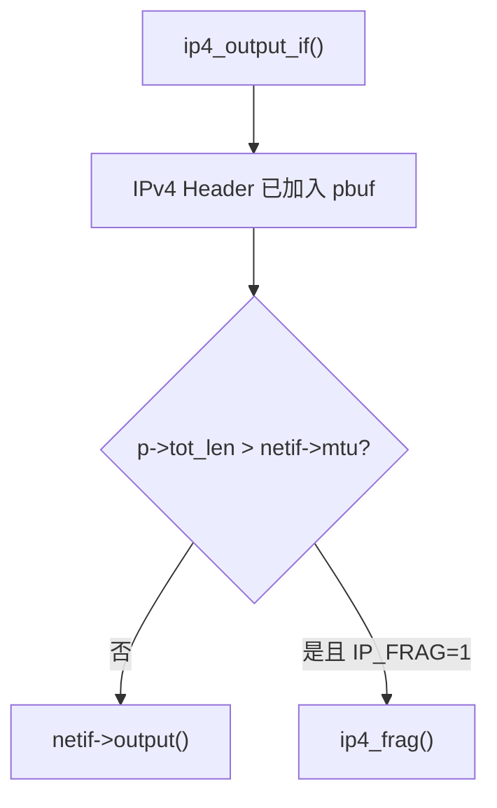
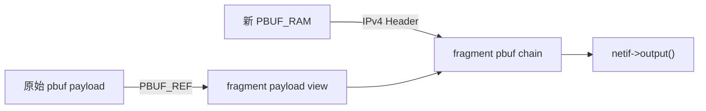
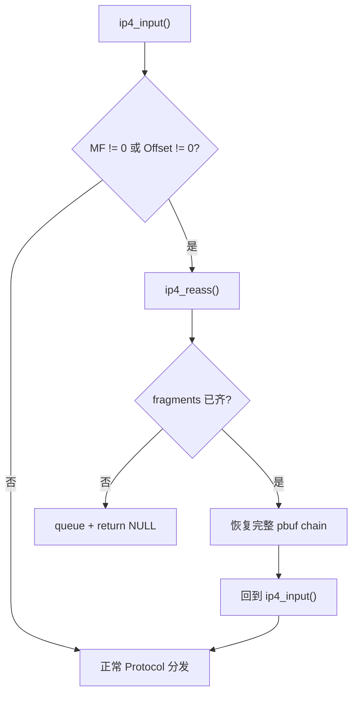
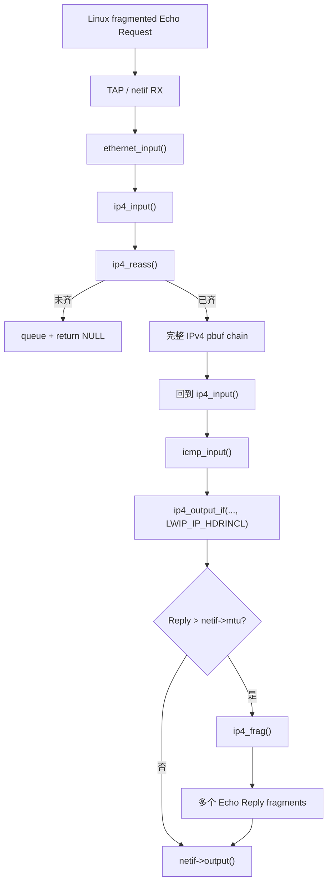

<meta name="referrer" content="no-referrer" />

# 教程 16：从 MTU 到 `ip4_frag()` / `ip4_reass()`——IPv4 分片、重组、超时与内存压力

> 摘要：沿 IPv4 发送与接收源码链，理解 MTU 如何触发分片、Offset/MF/ID 如何组织片段，以及 lwIP 怎样排序、重组、超时清理并限制资源占用。

[TOC]

Stage 4 已经建立 IPv4 的基本收发路径，Stage 12 又补齐了 `pbuf` / `memp` 的资源模型。现在进入协议栈的边界行为：一个原本完整的 IPv4 datagram 在 **输出接口 MTU 装不下** 时怎样被拆开，另一端又怎样把乱序 fragments 恢复成完整 packet。

本篇只保留这一条主线：

```text
IPv4 packet > netif->mtu
    ↓
ip4_frag()
    ↓
多个 fragment
    ↓
Ethernet / Driver / wire
    ↓
ip4_input()
    ↓
ip4_reass()
    ↓
完整 IPv4 pbuf chain
    ↓
ICMP / UDP / TCP
```

同时追踪两个不能忽略的工程问题：**fragment queue 的 timer** 和 **pbuf/memp 资源预算**。当前源码基线仍为 `d08f4773edd0182b7910fc8f046eed82ffcd67c9`。[S1](#source-s1)

本文源码块采用统一约定：除非明确写“上游连续源码片段”，其余 C 代码块均视为按当前 revision 截取的执行路径阅读版；函数切换会明确给出 call site 和当前函数，不使用省略号充当缺失源码。

## 1. 真实发送入口：`ip4_output_if()` 为什么进入 `ip4_frag()`

Stage 4 里的普通 IPv4 packet 最终直接进入 `netif->output()`。现在只改变一个条件：IPv4 Header 已加入 `pbuf` 后，`p->tot_len` 大于输出接口 `netif->mtu`。

`ip4_output_if()` 最终进入 `ip4_output_if_opt_src()`。该函数先把 IPv4 Header 加到 `pbuf` 头部，并填写 Total Length、Identification、Offset 等字段。[S1](#source-s1)

```c
if (pbuf_add_header(p, IP_HLEN)) {
  IP_STATS_INC(ip.err);
  MIB2_STATS_INC(mib2.ipoutdiscards);
  return ERR_BUF;
}

iphdr = (struct ip_hdr *)p->payload;
IPH_TTL_SET(iphdr, ttl);
IPH_PROTO_SET(iphdr, proto);
ip4_addr_copy(iphdr->dest, *dest);
IPH_VHL_SET(iphdr, 4, ip_hlen / 4);
IPH_TOS_SET(iphdr, tos);
IPH_LEN_SET(iphdr, lwip_htons(p->tot_len));
IPH_OFFSET_SET(iphdr, 0);
```

所以此时：

```text
p->tot_len
=
IPv4 Header + L4 Header + L4 Payload
```

继续阅读同一个 `ip4_output_if_opt_src()` 的发送尾部：[S1](#source-s1)

```c
#if IP_FRAG
if (netif->mtu && (p->tot_len > netif->mtu)) {
  return ip4_frag(p, netif, dest);
}
#endif

return netif->output(netif, p, dest);
```



因此分片不是 Driver 临时决定的行为。**触发点就在 IPv4 output 层，判断依据是所选 `netif` 的 MTU。**

## 2. MTU、IPv4 Total Length、TCP MSS 与 `pbuf` 长度不能混在一起

| 对象 | 层次 | 当前作用 |
| --- | --- | --- |
| `netif->mtu` | L3/L2 边界 | 一个 IPv4 packet 在该接口上无需 IPv4 fragmentation 时允许的最大 IP 长度 |
| IPv4 `Total Length` | IPv4 | 当前 packet 从 IP Header 开始的总长度 |
| TCP MSS | TCP | 单个 TCP segment 的 TCP payload 上限策略，通常用于避免产生过大的 IP packet |
| `p->len` | pbuf | 当前一个 pbuf node 的可见长度 |
| `p->tot_len` | pbuf chain | 从当前 pbuf 开始的整条 chain 长度 |

TCP segmentation 与 IPv4 fragmentation 都可能让大数据在线上变成多个 packet，但不是同一机制：

```text
TCP byte stream
   ↓ TCP segmentation
TCP segment
   ↓ IPv4 encapsulation
IPv4 packet
   ↓ 若仍然 > MTU
IPv4 fragmentation
```

只有 IPv4 Header 中的 MF / Fragment Offset 才说明发生了 IPv4 fragmentation。

## 3. Fragmentation 真正依赖的 Header 字段：ID、MF、Offset

RFC 791 定义 IPv4 fragmentation / reassembly 的基础字段：[S4](#source-s4)

- **Identification**：同一个原始 datagram 的 fragments 使用同一个 ID；
- **MF（More Fragments）**：后面还有 fragment 时为 1，最后一片为 0；
- **Fragment Offset**：当前 fragment payload 在原始 payload 中的位置，单位是 **8 字节**。

lwIP 的定义：[S1](#source-s1)

```c
#define IP_DF      0x4000U
#define IP_MF      0x2000U
#define IP_OFFMASK 0x1fffU

#define IPH_OFFSET_BYTES(hdr) \
  ((u16_t)((lwip_ntohs(IPH_OFFSET(hdr)) & IP_OFFMASK) * IP_MIN_FRAG_LENGTH))
```

例如 Offset field 为 185：

```text
185 × 8 = 1480 bytes
```

意味着这片 payload 从原始 payload 的 byte 1480 开始。除最后一片外，fragment payload 因而需要保持 8-byte 对齐。

## 4. 进入 `ip4_frag()`：先把 MTU 换算成 8-byte block

从 `ip4_output_if_opt_src()` 的 call site 进入 `ip4_frag()`。[S1](#source-s1)

```c
err_t
ip4_frag(struct pbuf *p, struct netif *netif, const ip4_addr_t *dest)
{
  struct pbuf *rambuf;
  struct ip_hdr *original_iphdr;
  struct ip_hdr *iphdr;
  const u16_t nfb = (u16_t)((netif->mtu - IP_HLEN) / 8);
  u16_t left, fragsize;
  u16_t ofo;
  int last;
  u16_t poff = IP_HLEN;
  u16_t tmp;
  int mf_set;
```

`nfb` 是一个最大 fragment 能装多少个 8-byte payload block。若 MTU=1500、IPv4 Header=20：

```text
nfb = floor((1500 - 20) / 8) = 185
最大非末片 payload = 185 × 8 = 1480 bytes
```

当前实现还要求 `IPH_HL_BYTES(iphdr) == IP_HLEN`，即只支持 20-byte IPv4 Header；带 IPv4 Options 的 Header 在 `ip4_frag()` 中返回 `ERR_VAL`。[S1](#source-s1) 这是当前 lwIP 实现限制，不是 IPv4 规范禁止对带 options 的 packet 分片。[S4](#source-s4)

随后 `ip4_frag()` 保存输入 packet 已有的 fragment 状态：

```c
tmp = lwip_ntohs(IPH_OFFSET(iphdr));
ofo = tmp & IP_OFFMASK;
mf_set = tmp & IP_MF;

left = (u16_t)(p->tot_len - IP_HLEN);
```

这使一个已经是 fragment 的 packet 在需要再次拆小时仍能保留原 offset 和 MF 语义，而不是错误地从 offset 0 重新开始。

## 5. `while (left)`：每轮只构造一个 fragment

继续阅读 `ip4_frag()`：[S1](#source-s1)

```c
while (left) {
  fragsize = LWIP_MIN(left, (u16_t)(nfb * 8));
```

若剩余 payload 是 8000 bytes、MTU=1500：

```text
1480 + 1480 + 1480 + 1480 + 1480 + 600
```

也就是 6 个 fragments。最后一片允许不是 8-byte 倍数，因为后面已经没有新的 fragment offset 需要表达。

## 6. Fragment 的 pbuf 有两种构造策略

`ip4_frag()` 根据 `LWIP_NETIF_TX_SINGLE_PBUF` 选择两种数据组织方式。[S1](#source-s1)[S2](#source-s2)

### 6.1 单 pbuf：复制当前 fragment payload

当 `LWIP_NETIF_TX_SINGLE_PBUF=1` 时，`ip4_frag()` 分配新的 `PBUF_RAM`，复制当前 fragment payload，再把 IPv4 Header 加回去：

```c
rambuf = pbuf_alloc(PBUF_IP, fragsize, PBUF_RAM);
if (rambuf == NULL) {
  goto memerr;
}

poff += pbuf_copy_partial(p, rambuf->payload, fragsize, poff);
if (pbuf_add_header(rambuf, IP_HLEN)) {
  pbuf_free(rambuf);
  goto memerr;
}
SMEMCPY(rambuf->payload, original_iphdr, IP_HLEN);
```

优点是 Driver 更容易得到一块连续 packet；代价是 payload copy。

### 6.2 pbuf chain：Header copy，payload 用 `PBUF_REF` 引用原数据

`LWIP_NETIF_TX_SINGLE_PBUF=0` 时，当前实现先分配只保存 Header 的 RAM pbuf，再为原 pbuf 中属于当前 fragment 的 payload 建立 `PBUF_REF`。[S1](#source-s1) 下面继续阅读 `ip4_frag()` 中这一分支。

```c
rambuf = pbuf_alloc(PBUF_LINK, IP_HLEN, PBUF_RAM);
if (rambuf == NULL) {
  goto memerr;
}
SMEMCPY(rambuf->payload, original_iphdr, IP_HLEN);
iphdr = (struct ip_hdr *)rambuf->payload;
```

继续阅读同一个 `ip4_frag()` 的引用构造：

```c
pcr = ip_frag_alloc_pbuf_custom_ref();
if (pcr == NULL) {
  pbuf_free(rambuf);
  goto memerr;
}

newpbuf = pbuf_alloced_custom(PBUF_RAW, newpbuflen, PBUF_REF, &pcr->pc,
                              (u8_t *)p->payload + poff, newpbuflen);
if (newpbuf == NULL) {
  ip_frag_free_pbuf_custom_ref(pcr);
  pbuf_free(rambuf);
  goto memerr;
}

pbuf_ref(p);
pcr->original = p;
pcr->pc.custom_free_function = ipfrag_free_pbuf_custom;
pbuf_cat(rambuf, newpbuf);
```



`pbuf_ref(p)` 保证 Driver/DMA 尚未完成发送时原数据不会提前释放。对应引用对象来自 `FRAG_PBUF` memp pool：[S2](#source-s2)

```c
LWIP_MEMPOOL(FRAG_PBUF, MEMP_NUM_FRAG_PBUF,
             sizeof(struct pbuf_custom_ref), "FRAG_PBUF")
```

默认 `MEMP_NUM_FRAG_PBUF` 为 15。`opt.h` 特别说明：DMA MAC 如果 `netif->output()` 返回时硬件还没发完，可能同时占用多个 fragment reference。[S2](#source-s2)

这把 Stage 3 的 pbuf ownership、Stage 12 的 memp pool 与 Driver TX 生命周期直接连在一起。

## 7. 每片怎样填写 MF、Offset、Length 和 checksum

当前 fragment payload 准备好以后，`ip4_frag()` 修正 Header：[S1](#source-s1)

```c
last = (left <= netif->mtu - IP_HLEN);

tmp = (IP_OFFMASK & ofo);
if (!last || mf_set) {
  tmp = tmp | IP_MF;
}
IPH_OFFSET_SET(iphdr, lwip_htons(tmp));
IPH_LEN_SET(iphdr, lwip_htons((u16_t)(fragsize + IP_HLEN)));
IPH_CHKSUM_SET(iphdr, 0);
#if CHECKSUM_GEN_IP
IF__NETIF_CHECKSUM_ENABLED(netif, NETIF_CHECKSUM_GEN_IP) {
  IPH_CHKSUM_SET(iphdr, inet_chksum(iphdr, IP_HLEN));
}
#endif
```

Identification 不需要重新生成，因为每片 Header 都由原 Header 复制而来；同一原 datagram 的 fragments 自然保留相同 ID。

随后每片独立进入 `netif->output()`：

```c
netif->output(netif, rambuf, dest);
IPFRAG_STATS_INC(ip_frag.xmit);

pbuf_free(rambuf);
left = (u16_t)(left - fragsize);
ofo = (u16_t)(ofo + nfb);
```

也就是说发送流程是“构造一片 → 输出一片 → 释放当前 fragment view → 继续下一片”，不是先做一个 fragment 数组再一次性交给 Driver。

## 8. MTU=1500 时，8000-byte payload 为什么正好是 6 片

由 `nfb=185` 得到最大 fragment payload=1480 bytes：

| Fragment | Payload | Offset field | Offset bytes | MF |
| ---: | ---: | ---: | ---: | ---: |
| 1 | 1480 | 0 | 0 | 1 |
| 2 | 1480 | 185 | 1480 | 1 |
| 3 | 1480 | 370 | 2960 | 1 |
| 4 | 1480 | 555 | 4440 | 1 |
| 5 | 1480 | 740 | 5920 | 1 |
| 6 | 600 | 925 | 7400 | 0 |

upstream Unit Test 直接把这个行为固定成断言。[S3](#source-s3)

```c
START_TEST(test_ip4_frag)
{
  struct pbuf *data = pbuf_alloc(PBUF_IP, 8000, PBUF_RAM);
  ip_addr_t peer_ip = IPADDR4_INIT_BYTES(192,168,0,5);
  err_t err;

  linkoutput_ctr = 0;
  linkoutput_byte_ctr = 0;

  fail_unless(data != NULL);
  test_netif_add();
  test_netif.output = arpless_output;
  err = ip4_output_if_src(data, &test_ipaddr, ip_2_ip4(&peer_ip),
                          16, 0, IP_PROTO_UDP, &test_netif);
  fail_unless(err == ERR_OK);
  fail_unless(linkoutput_ctr == 6);
  fail_unless(linkoutput_byte_ctr == (8000 + (6 * IP_HLEN)));
  pbuf_free(data);
  test_netif_remove();
}
END_TEST
```

除了 6 片，它还验证每片都有自己的 20-byte IPv4 Header，所以总发送字节数是 `8000 + 6 * IP_HLEN`。

## 9. 切换到 RX：`ip4_input()` 在 L4 分发前先检查 fragment 标志

发送侧到此闭环。接收侧从 `ip4_input()` 开始。

Stage 4 里普通 packet 会继续根据 `Protocol` 分发到 ICMP/UDP/TCP；fragmented packet 在这之前先经过：[S1](#source-s1)

```c
if ((IPH_OFFSET(iphdr) & PP_HTONS(IP_OFFMASK | IP_MF)) != 0) {
#if IP_REASSEMBLY
  p = ip4_reass(p);
  if (p == NULL) {
    return ERR_OK;
  }
  iphdr = (const struct ip_hdr *)p->payload;
#else
  pbuf_free(p);
  return ERR_OK;
#endif
}
```

判定不能只看 MF，因为最后一片虽然 `MF=0`，Fragment Offset 仍非 0。条件实际是：

```text
MF != 0  或  Offset != 0
```

命中以后先进入 `ip4_reass()`，完整 datagram 恢复前不会交给 L4。

## 10. `ip4_reass()` 返回 `NULL` 不等于错误

调用点是：

```c
p = ip4_reass(p);
if (p == NULL) {
  return ERR_OK;
}
```

所以 `ip4_reass()` 有两种正常语义：

| 返回值 | 含义 |
| --- | --- |
| `NULL` | 当前 fragment 已被排队，datagram 仍不完整；本次 RX 到此结束 |
| 非 `NULL` | 所有 fragments 已齐，返回恢复后的完整 IPv4 pbuf chain |

如果当前 fragment 无效或资源不足，`ip4_reass()` 也会在内部 free 后返回 `NULL`。因此调用者不能用“NULL=malloc fail”的惯性理解这个 API。

## 11. 进入 `ip4_reass()`：先把网络字段变成 byte range

上游连续源码片段：[S1](#source-s1)

```c
struct pbuf *
ip4_reass(struct pbuf *p)
{
  struct pbuf *r;
  struct ip_hdr *fraghdr;
  struct ip_reassdata *ipr;
  struct ip_reass_helper *iprh;
  u16_t offset, len, clen;
  u8_t hlen;
  int valid;
  int is_last;

  fraghdr = (struct ip_hdr *)p->payload;
```

继续阅读同一个 `ip4_reass()`，把 Header 字段换算成 byte range：

```c
offset = IPH_OFFSET_BYTES(fraghdr);
len = lwip_ntohs(IPH_LEN(fraghdr));
hlen = IPH_HL_BYTES(fraghdr);
if (hlen > len) {
  goto nullreturn;
}
len = (u16_t)(len - hlen);
```

从这里开始，排序主要使用：

```text
offset = fragment payload 起始 byte
len    = fragment payload 长度
end    = offset + len
```

当前 reassembly 实现同样不支持 IPv4 options；带非 20-byte Header 的 fragment 会被拒绝。[S1](#source-s1)

## 12. Reassembly 同时受两个资源上限约束

每一个“还没收齐的原始 datagram”需要一个 `struct ip_reassdata`：[S1](#source-s1)

```c
struct ip_reassdata {
  struct ip_reassdata *next;
  struct pbuf *p;
  struct ip_hdr iphdr;
  u16_t datagram_len;
  u8_t flags;
  u8_t timer;
};
```

它来自 `memp_std.h` 的 `LWIP_MEMPOOL()` pool 声明；下面不是函数体，而是 REASSDATA pool 的定义：

```c
LWIP_MEMPOOL(REASSDATA, MEMP_NUM_REASSDATA,
             sizeof(struct ip_reassdata), "REASSDATA")
```

所以 `MEMP_NUM_REASSDATA` 限制“同时有多少个 incomplete IPv4 datagram”。[S2](#source-s2)

另一条限制 `IP_REASS_MAX_PBUFS` 控制的是**所有等待重组 fragments 占用的 pbuf node 总数**。`ip4_reass()` 在排队前检查：[S1](#source-s1)

```c
clen = pbuf_clen(p);
if ((ip_reass_pbufcount + clen) > IP_REASS_MAX_PBUFS) {
#if IP_REASS_FREE_OLDEST
  if (!ip_reass_remove_oldest_datagram(fraghdr, clen) ||
      ((ip_reass_pbufcount + clen) > IP_REASS_MAX_PBUFS))
#endif
  {
    IPFRAG_STATS_INC(ip_frag.memerr);
    goto nullreturn;
  }
}
```

这不是多余限制：RX fragment 通常占用 `PBUF_POOL`。如果 reassembly queue 把 pool 吃光，后续正常 Ethernet RX 也会失去 buffer。

当前 `example_app/lwipopts.h` 还会根据一个 1500-byte packet 可能跨多少个 pool pbuf 放大该预算：[S2](#source-s2)

```c
#define IP_REASSEMBLY      1
#define IP_REASS_MAX_PBUFS (10 * ((1500 + PBUF_POOL_BUFSIZE - 1) / PBUF_POOL_BUFSIZE))
#define MEMP_NUM_REASSDATA IP_REASS_MAX_PBUFS
#define IP_FRAG            1
```

## 13. 第一个 fragment 到来时怎样建立 `ip_reassdata`

`ip4_reass()` 先遍历 `reassdatagrams` 寻找匹配项。当前 revision 的匹配宏是：[S1](#source-s1)

```c
#define IP_ADDRESSES_AND_ID_MATCH(iphdrA, iphdrB)  \
  (ip4_addr_eq(&(iphdrA)->src, &(iphdrB)->src) && \
   ip4_addr_eq(&(iphdrA)->dest, &(iphdrB)->dest) && \
   IPH_ID(iphdrA) == IPH_ID(iphdrB)) ? 1 : 0
```

RFC 791 描述 reassembly identity 时包括 source、destination、protocol 与 Identification；当前 lwIP lookup 宏直接比较 source、destination 和 ID。[S4](#source-s4) 这是实现事实与规范描述的区别。

继续阅读 `ip4_reass()`：没有匹配项时，它在这个分支进入 `ip_reass_enqueue_new_datagram()`。

```c
if (ipr == NULL) {
  ipr = ip_reass_enqueue_new_datagram(fraghdr, clen);
  if (ipr == NULL) {
    goto nullreturn;
  }
}
```

进入 `ip_reass_enqueue_new_datagram()`：[S1](#source-s1)

```c
ipr = (struct ip_reassdata *)memp_malloc(MEMP_REASSDATA);
if (ipr == NULL) {
#if IP_REASS_FREE_OLDEST
  if (ip_reass_remove_oldest_datagram(fraghdr, clen) >= clen) {
    ipr = (struct ip_reassdata *)memp_malloc(MEMP_REASSDATA);
  }
#endif
  if (ipr == NULL) {
    IPFRAG_STATS_INC(ip_frag.memerr);
    return NULL;
  }
}
memset(ipr, 0, sizeof(struct ip_reassdata));
ipr->timer = IP_REASS_MAXAGE;
ipr->next = reassdatagrams;
reassdatagrams = ipr;
SMEMCPY(&(ipr->iphdr), fraghdr, IP_HLEN);
```

阶段结果是“创建一个 incomplete datagram context，并保存一份 IPv4 Header 等后续 fragments”。

## 14. lwIP 复用了 fragment 自己的 IPv4 Header 空间保存排序信息

`struct ip_reass_helper`：[S1](#source-s1)

```c
struct ip_reass_helper {
  struct pbuf *next_pbuf;
  u16_t start;
  u16_t end;
};
```

进入 `ip_reass_chain_frag_into_datagram_and_validate()` 后，当前 fragment 的 Header 已被解析，于是 pbuf payload 开头原来的 Header 空间被临时改写成 helper：[S1](#source-s1)

```c
fraghdr = (struct ip_hdr *)new_p->payload;
len = lwip_ntohs(IPH_LEN(fraghdr));
hlen = IPH_HL_BYTES(fraghdr);
len = (u16_t)(len - hlen);
offset = IPH_OFFSET_BYTES(fraghdr);

iprh = (struct ip_reass_helper *)new_p->payload;
iprh->next_pbuf = NULL;
iprh->start = offset;
iprh->end = (u16_t)(offset + len);
```

内存视图临时从：

```text
[IPv4 Header][fragment payload]
```

变成：

```text
[ip_reass_helper: next/start/end][fragment payload]
```

第一片真实 IPv4 Header 已保存在 `ip_reassdata->iphdr`，完成重组时再复制回来。这是 Stage 3 “`p->payload` 是当前数据视图”的典型实例。

## 15. Fragment 可以乱序到达；内部链按 `start` 排序

继续阅读 `ip_reass_chain_frag_into_datagram_and_validate()`：[S1](#source-s1)

```c
for (q = ipr->p; q != NULL;) {
  iprh_tmp = (struct ip_reass_helper *)q->payload;
  if (iprh->start < iprh_tmp->start) {
    iprh->next_pbuf = q;
    if (iprh_prev != NULL) {
      iprh_prev->next_pbuf = new_p;
      if (iprh_prev->end != iprh->start) {
        valid = 0;
      }
    } else {
      ipr->p = new_p;
    }
    break;
  }
```

网络完全可以按“最后一片 → 第一片 → 第三片 → 第二片”到达。lwIP 排序以后检查相邻范围：

```text
prev.end == next.start
```

不相等就说明中间仍有 hole。

当前 `ip4_frag.c` 默认 `IP_REASS_CHECK_OVERLAP=1`。完全重复的 start 或与已有 range overlap 的新 fragment 会被丢弃，而不是直接拼入链表。[S1](#source-s1)

```c
} else if (iprh->start == iprh_tmp->start) {
  return IP_REASS_VALIDATE_PBUF_DROPPED;
#if IP_REASS_CHECK_OVERLAP
} else if (iprh->start < iprh_tmp->end) {
  return IP_REASS_VALIDATE_PBUF_DROPPED;
#endif
```

## 16. “最后一片到了”仍然不代表 datagram 完整

继续阅读 `ip4_reass()`：`MF=0` 只让 lwIP 知道原 datagram 的终点。

```c
is_last = (IPH_OFFSET(fraghdr) & PP_NTOHS(IP_MF)) == 0;
if (is_last) {
  u16_t datagram_len = (u16_t)(offset + len);
  if ((datagram_len < offset) || (datagram_len > (0xFFFF - IP_HLEN))) {
    goto nullreturn_ipr;
  }
}
```

真正完成还需要同时满足：

1. 已见到 `MF=0` 的最后一片；
2. 排序后第一片从 offset 0 开始；
3. 所有相邻 fragments 无 hole。

因此“最后一片先到”是完全允许的，只会记录最终长度并继续等待中间片。

## 17. 重组完成：恢复一个 IPv4 Header，再把后续 fragment Header 隐藏

当 helper 返回 `IP_REASS_VALIDATE_TELEGRAM_FINISHED`，`ip4_reass()` 进入完成路径。[S1](#source-s1)

```c
u16_t datagram_len = (u16_t)(ipr->datagram_len + IP_HLEN);
r = ((struct ip_reass_helper *)ipr->p->payload)->next_pbuf;

fraghdr = (struct ip_hdr *)(ipr->p->payload);
SMEMCPY(fraghdr, &ipr->iphdr, IP_HLEN);
IPH_LEN_SET(fraghdr, lwip_htons(datagram_len));
IPH_OFFSET_SET(fraghdr, 0);
IPH_CHKSUM_SET(fraghdr, 0);
```

第一片恢复完整 Header，Total Length 改成整个 datagram，Fragment Offset 清零。

继续阅读同一个 `ip4_reass()`：

```c
p = ipr->p;

while (r != NULL) {
  iprh = (struct ip_reass_helper *)r->payload;
  pbuf_remove_header(r, IP_HLEN);
  pbuf_cat(p, r);
  r = iprh->next_pbuf;
}
```

后续 fragments 在线上各自有 IPv4 Header，但重组后的 datagram 只需要一个，所以 `pbuf_remove_header(r, IP_HLEN)` 把每个后续 fragment 的 Header 从数据视图中移除，然后用 `pbuf_cat()` 串成一个完整 chain。

最终不要求 memcpy 成一个巨大连续 buffer：

```text
pbuf #1 [IPv4 Header][payload 0...]
   ↓
pbuf #2 [payload ...]
   ↓
pbuf #3 [payload ...]
```

## 18. 返回 `ip4_input()` 后才恢复正常 Protocol 分发

`ip4_reass()` 返回完整 `pbuf` 后，`ip4_input()` 更新 `iphdr` 指针并继续正常路径：[S1](#source-s1)

```c
p = ip4_reass(p);
if (p == NULL) {
  return ERR_OK;
}
iphdr = (const struct ip_hdr *)p->payload;
```

从这一刻开始，`p` 再次代表完整 IPv4 datagram。随后才根据 Protocol 进入：

```text
ICMP → icmp_input()
UDP  → udp_input()
TCP  → tcp_input()
```



## 19. Unit Test 故意让 fragments 乱序到达

`test_ip4_reass()` 用同一个 `ip_id=128` 构造 9 个 200-byte fragments。[S3](#source-s3) 继续阅读 `test_ip4_reass()` 的测试主体，它第一步就先送最后一片：

```c
create_ip4_input_fragment(ip_id, 8*200, 200, 1);
fail_unless(lwip_stats.mib2.ipreasmoks == 0);
```

继续阅读 `test_ip4_reass()`：随后送 0、1、2、3、4，再跳到 7、6，最后才补 5。

```c
create_ip4_input_fragment(ip_id, 7*200, 200, 0);
fail_unless(lwip_stats.mib2.ipreasmoks == 0);

create_ip4_input_fragment(ip_id, 6*200, 200, 0);
fail_unless(lwip_stats.mib2.ipreasmoks == 0);

create_ip4_input_fragment(ip_id, 5*200, 200, 0);
fail_unless(lwip_stats.mib2.ipreasmoks == 1);
```

所以这个测试直接证明：**最后一片到达只确定终点，只有最后一个 hole 被补齐后 reassembly 才完成。**

## 20. Fragment 永远缺一片时，由 `ip_reass_tmr()` 回收

Stage 11 已经建立 cyclic timer 框架。`src/core/timeouts.c` 把 IPv4 reassembly timer 注册为常规 cyclic timer：[S2](#source-s2)

```c
#if LWIP_IPV4
#if IP_REASSEMBLY
  {IP_TMR_INTERVAL, HANDLER(ip_reass_tmr)},
#endif
#endif
```

`IP_TMR_INTERVAL=1000 ms`，新建 `ip_reassdata` 时 `timer=IP_REASS_MAXAGE`，默认 `IP_REASS_MAXAGE=15`。[S1](#source-s1)[S2](#source-s2)

进入 `ip_reass_tmr()`：[S1](#source-s1)

```c
void
ip_reass_tmr(void)
{
  struct ip_reassdata *r, *prev = NULL;

  r = reassdatagrams;
  while (r != NULL) {
    if (r->timer > 0) {
      r->timer--;
      prev = r;
      r = r->next;
    } else {
      struct ip_reassdata *tmp = r;
      r = r->next;
      ip_reass_free_complete_datagram(tmp, prev);
    }
  }
}
```

它不是为每个 fragment 建一个独立毫秒 timer，而是每秒扫描 `reassdatagrams`，统一递减每个 incomplete datagram 的 age。默认值表示约 15 个一秒 age 单位；cleanup 由 cyclic tick 驱动，不应理解成精确的 15.000 秒 deadline。

如果第一片（offset 0）已经收到，超时清理路径还能恢复其 Header，并调用 `icmp_time_exceeded(..., ICMP_TE_FRAG)` 发送 Fragment Reassembly Time Exceeded；随后释放整个 datagram 的 pbuf 和 `MEMP_REASSDATA`。[S1](#source-s1)

RFC 1122 要求 IPv4 host 实现 datagram reassembly，并对可重组能力给出 host requirement。[S5](#source-s5)

## 21. 内存压力会先尝试淘汰旧 datagram，而不是只等待 timeout

当前 `ip4_frag.c` 默认 `IP_REASS_FREE_OLDEST=1`。[S1](#source-s1) 当新 fragment 会让：

```text
ip_reass_pbufcount + new_fragment_clen
>
IP_REASS_MAX_PBUFS
```

时，先尝试 `ip_reass_remove_oldest_datagram()` 释放更老的其他 incomplete datagram；仍然不足才丢当前 fragment。

所以回收有两条路径：

```text
正常等待但长期缺片
    → ip_reass_tmr() timeout

全局 reassembly pbuf budget 已满
    → 淘汰旧 datagram
    → 仍不够则 drop 新 fragment
```

这就是为什么 `MEMP_NUM_REASSDATA`、`IP_REASS_MAX_PBUFS`、`PBUF_POOL_SIZE` 必须一起看，而不能只调一个“最大分片数”。

## 22. Host 上一次大 ping 可以同时暴露 RX reassembly 与 TX fragmentation

当前实验网络仍沿用 Stage 2：

```text
Linux Host : 198.18.0.1/24
TAP        : lwip0
lwIP       : 198.18.0.200/24
```

以下是手工实验入口，本轮没有实际执行，不声称已得到对应运行结果。

先抓 IPv4 fragments：

```sh
sudo tcpdump -i lwip0 -nn -vv 'ip[6:2] & 0x3fff != 0'
```

再发送大 Echo Request：

```sh
ping -I lwip0 -M dont -s 4000 -c 1 198.18.0.200
```

若 Host 侧将请求拆成 fragments，lwIP 接收路径是：

```text
TAP RX
→ ip4_input()
→ ip4_reass()
→ 完整 ICMP Echo Request
→ icmp_input()
```

`icmp_input()` 生成 Echo Reply 时复用该 packet，并调用：[S1](#source-s1)

```c
ret = ip4_output_if(p, src, LWIP_IP_HDRINCL,
                    ICMP_TTL, 0, IP_PROTO_ICMP, inp);
```

若完整 Reply 仍大于 `netif->mtu`：

```text
ip4_output_if()
→ ip4_frag()
→ 多个 Echo Reply fragments
```

因此一次大 Echo 可以同时观察本篇两条源码主线。

抓包时重点核对：Identification 是否相同、MF 是否只在非末片为 1、Fragment Offset 是否按 8-byte 单位递增、每片 Total Length 是否等于当前 fragment 自己的长度。

## 23. DF 与 PMTU 属于下一层问题：当前只建立边界

RFC 791 规定 DF（Don't Fragment）置位的 datagram 不允许进行 IPv4 fragmentation。[S4](#source-s4) 当前 lwIP `ip4_forward()` 在转发路径遇到超 MTU packet 时先检查 DF：[S1](#source-s1)

```c
if (netif->mtu && (p->tot_len > netif->mtu)) {
  if ((IPH_OFFSET(iphdr) & PP_NTOHS(IP_DF)) == 0) {
#if IP_FRAG
    ip4_frag(p, netif, ip4_current_dest_addr());
#endif
  } else {
#if LWIP_ICMP
    icmp_dest_unreach(p, ICMP_DUR_FRAG);
#endif
  }
  return;
}
```

这已经触及 Path MTU Discovery：设置 DF 后根据 ICMP Fragmentation Needed 调整 packet size。RFC 1191 系统定义了 IPv4 PMTUD。[S6](#source-s6) 但本篇只解释“fragmentation 已发生后 lwIP 怎样拆和重组”，不继续扩成第二条 PMTU 主线。

另外，`IP_FRAG` 与 `IP_REASSEMBLY` 是正交开关：[S2](#source-s2)

| 配置 | 方向 | 作用 |
| --- | --- | --- |
| `IP_FRAG` | TX | 超 MTU 时提供 IPv4 fragmentation 实现 |
| `IP_REASSEMBLY` | RX | 收到 fragments 时建立 reassembly queue |

当前 `example_app` 两者都启用。

## 24. 最终回看：一个大 Echo packet 怎样穿过完整 lwIP Core



本篇最后需要留下三个边界：

1. **分片发生在 IPv4 output 层，不是 Ethernet Driver 自己切 packet。**
2. **重组发生在 L4 分发之前；ICMP/UDP/TCP 正常看到的是恢复后的完整 IPv4 datagram。**
3. **reassembly 是有状态、有 timer、有 pbuf/memp 上限的机制，不是简单 memcpy 回一个大数组。**

下一阶段如果继续沿边界行为展开，最自然的是 IPv6 Path MTU / Fragment Header：IPv6 Router 不再像 IPv4 Router 一样沿路分片，fragmentation ownership 会发生明显变化。

## 资料来源

<a id="source-s1"></a>
### [S1] lwIP IPv4 fragmentation / reassembly 源码
- 类型：目标版本 upstream 源码；版本：`d08f4773edd0182b7910fc8f046eed82ffcd67c9`
- 定位：`src/core/ipv4/ip4.c`、`src/core/ipv4/ip4_frag.c`、`src/include/lwip/ip4_frag.h`、`src/include/lwip/prot/ip4.h`
- URL/文档：[lwIP upstream @ d08f477](https://github.com/lwip-tcpip/lwip/tree/d08f4773edd0182b7910fc8f046eed82ffcd67c9)
- 使用位置：发送分片、接收重组、乱序排序、overlap、timeout 与 ICMP cleanup
- 支撑内容：TX fragmentation、RX reassembly、Header 字段、乱序排序、overlap、timeout 与 ICMP cleanup

<a id="source-s2"></a>
### [S2] lwIP fragmentation 配置、memp 与 cyclic timer
- 类型：目标版本 upstream 源码；版本：`d08f4773edd0182b7910fc8f046eed82ffcd67c9`
- 定位：`src/include/lwip/opt.h`、`src/include/lwip/priv/memp_std.h`、`src/core/timeouts.c`、`contrib/examples/example_app/lwipopts.h`
- URL/文档：[lwIP configuration](https://github.com/lwip-tcpip/lwip/tree/d08f4773edd0182b7910fc8f046eed82ffcd67c9/src/include/lwip)
- 使用位置：fragment/reassembly 开关、memp/pbuf 预算、cyclic timer
- 支撑内容：`IP_FRAG`、`IP_REASSEMBLY`、`MEMP_NUM_FRAG_PBUF`、`MEMP_NUM_REASSDATA`、`IP_REASS_MAX_PBUFS`、`IP_REASS_MAXAGE`

<a id="source-s3"></a>
### [S3] upstream IPv4 Unit Test
- 类型：目标版本 Unit Test；版本：`d08f4773edd0182b7910fc8f046eed82ffcd67c9`
- 定位：`test/unit/ip4/test_ip4.c`：`test_ip4_frag`、`test_ip4_reass`、`create_ip4_input_fragment()`
- URL/文档：[test_ip4.c](https://github.com/lwip-tcpip/lwip/blob/d08f4773edd0182b7910fc8f046eed82ffcd67c9/test/unit/ip4/test_ip4.c)
- 使用位置：发送分片数量断言、乱序重组完成条件
- 支撑内容：8000-byte payload → 6 fragments；乱序 fragments 最终完成重组

<a id="source-s4"></a>
### [S4] RFC 791 — Internet Protocol
- 类型：IETF / RFC Editor；版本：RFC 791，1981-09
- URL/文档：[RFC 791](https://www.rfc-editor.org/rfc/rfc791.html)
- 使用位置：IPv4 fragment Header 字段、DF 与 reassembly identity
- 支撑内容：Identification、MF、Fragment Offset、DF 与 IPv4 fragmentation/reassembly 基本语义

<a id="source-s5"></a>
### [S5] RFC 1122 — Requirements for Internet Hosts
- 类型：IETF / RFC Editor；版本：RFC 1122，1989-10
- URL/文档：[RFC 1122](https://www.rfc-editor.org/rfc/rfc1122.html)
- 使用位置：reassembly timeout/host requirement 边界
- 支撑内容：IPv4 host reassembly requirement 与 receive/reassembly capability

<a id="source-s6"></a>
### [S6] RFC 1191 — Path MTU Discovery
- 类型：IETF / RFC Editor；版本：RFC 1191，1990-11
- URL/文档：[RFC 1191](https://www.rfc-editor.org/rfc/rfc1191.html)
- 使用位置：DF 与 PMTU Discovery 的边界说明
- 支撑内容：DF、ICMP Fragmentation Needed 与 IPv4 Path MTU Discovery 的边界
