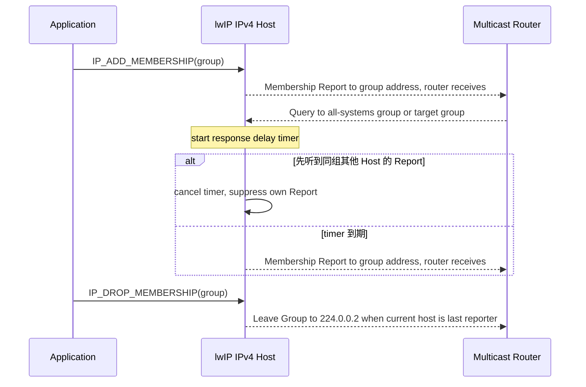
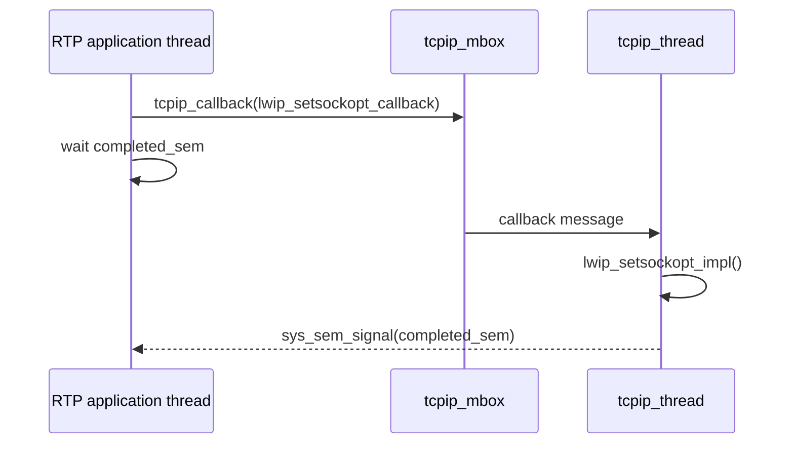
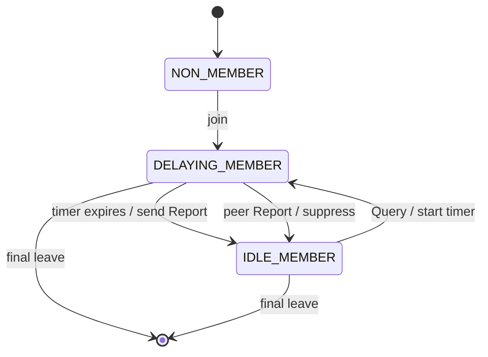
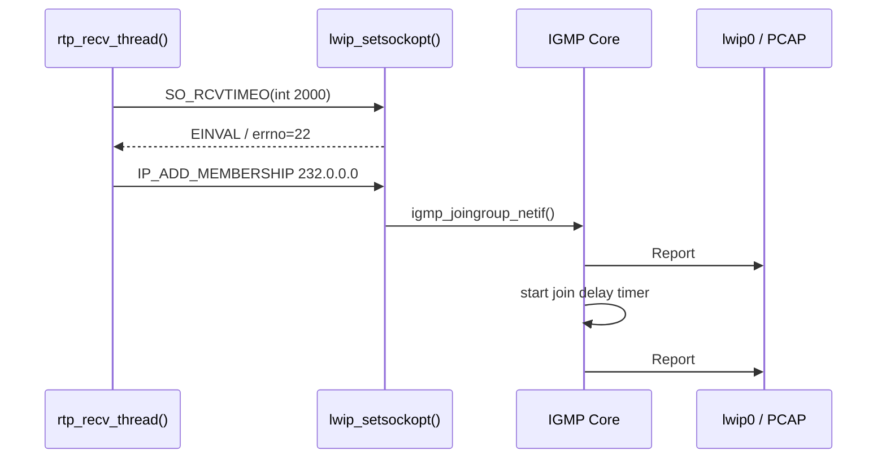
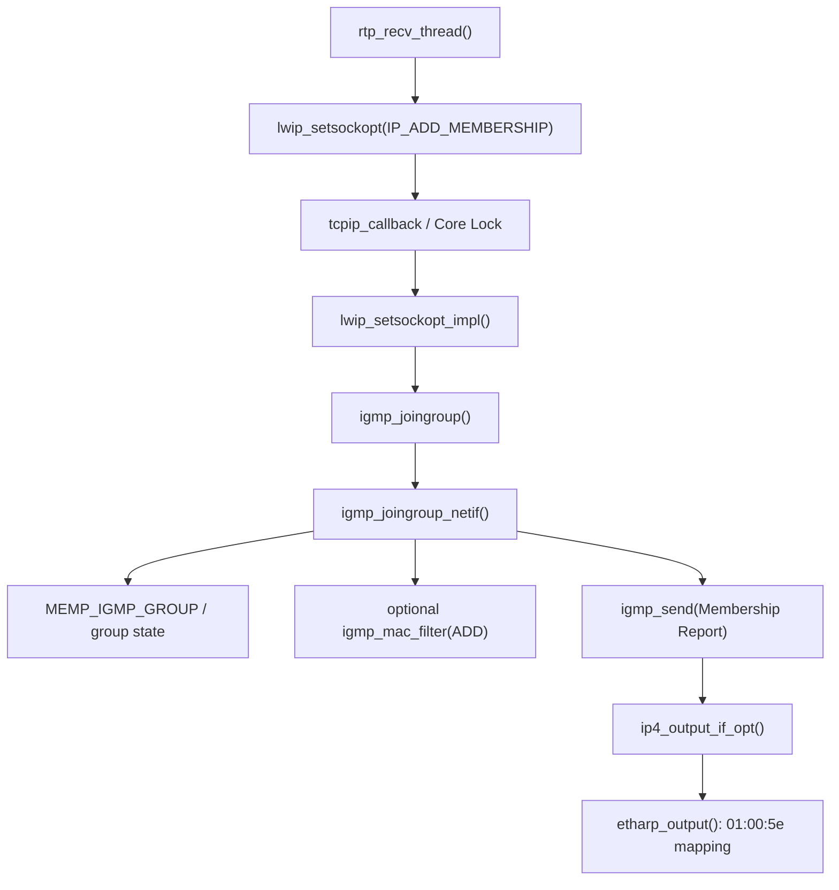
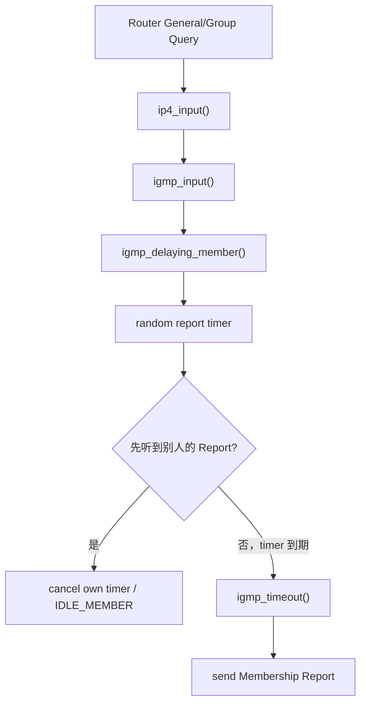

<meta name="referrer" content="no-referrer" />

# 教程 17：从 `IP_ADD_MEMBERSHIP` 到 `igmp_input()`——IPv4 Multicast、IGMPv2、MAC Filter 与组成员状态机

> 摘要：从 RTP multicast example 的 IP_ADD_MEMBERSHIP 入口追踪 IGMPv2 加组、Report/Query/Leave、定时器与 MAC 映射，并用真实 PCAP 验证调用链。

[TOC]

IPv4 multicast（IPv4 组播）让发送者把一个 IPv4 datagram 发送到 **multicast group address（组播组地址）**，所有已经加入该组、并且链路路径允许该组流量通过的接收者都可以获得同一份数据。IGMP（Internet Group Management Protocol，互联网组管理协议）不是业务数据协议，而是 IPv4 Host 与本地 multicast router 之间维护“哪些组当前有成员”的控制协议。[S3](#source-s3)[S4](#source-s4)

本文标题中的 MAC Filter 指 Ethernet MAC（Media Access Control，媒体访问控制）/Driver 的组播地址过滤能力：即使 IP 层已经加入组，如果网卡硬件在更早的二层过滤阶段把对应 multicast MAC frame 丢掉，lwIP 仍然收不到业务数据。组成员状态机则是 lwIP 为每个 `netif + group` 维护的 membership 状态、定时器和 `last_reporter_flag`；其中 `netif` 是 lwIP 的网络接口对象，`last_reporter_flag` 记录本机是否认为自己是该组最近一次发送 Report 的 Host。这些状态决定收到 Query、其他 Host 的 Report 或本机 leave 时下一步做什么。[S1](#source-s1)[S2](#source-s2)

RTP（Real-time Transport Protocol，实时传输协议）在当前 example 中只是 multicast **数据面**样例：`rtp_send_thread()` 通过 UDP 向 `232.0.0.0:4000` 发送 RTP packet；`rtp_recv_thread()` 则通过 `IP_ADD_MEMBERSHIP` 触发本文真正要追踪的 IGMP **控制面**。[S1](#source-s1)[S5](#source-s5)

## 0. 阅读源码前：建议提前阅读

以下资料用于建立标准语义和继续深入，不是正文的强制前置条件；不打开这些链接，后面的 join、Query/Report、suppression、Leave 和源码调用链仍然可以独立理解。

1. [RFC 2236 — Internet Group Management Protocol, Version 2](https://www.rfc-editor.org/rfc/rfc2236.html)：用于核对本文目标实现实际采用的 IGMPv2 Query、Membership Report、Leave、timer 与 host membership state machine。[S4](#source-s4)
2. [RFC 1112 — Host Extensions for IP Multicasting](https://www.rfc-editor.org/rfc/rfc1112.html)：用于 IPv4 multicast host model，以及 IPv4 multicast address 到 Ethernet multicast MAC 的映射规则。[S3](#source-s3)
3. [Cisco Multicast Configuration Guide — IGMP](https://www.cisco.com/c/en/us/td/docs/switches/lan/c9000/multicast/multicast-configuration-guide/igmp.html)：适合作为工程视角的补充阅读，重点看 host/router、Query、Report、Leave，以及 report suppression（本机在等待发送 Report 时听到同组其他 Host 的 Report，于是取消自己的待发 Report）。[S7](#source-s7)
4. [RFC 9776 — Internet Group Management Protocol, Version 3](https://www.rfc-editor.org/rfc/rfc9776.html)：用于确认当前 IGMPv3 标准状态。本文仍以 RFC 2236 为主要协议对照，因为目标 `igmp.c` 的 host-side 行为是 IGMPv2 模型。[S8](#source-s8)

### 0.1 先建立 IGMPv2 最小协议模型

本文只需要先掌握四类对象：

| 对象 | 在当前流程中的职责 |
| --- | --- |
| Application | 通过 `IP_ADD_MEMBERSHIP` / `IP_DROP_MEMBERSHIP` 表达本机是否需要接收某个组 |
| IPv4 Host / lwIP | 为每个 `netif + group` 维护 membership，并发送/接收 IGMP control message |
| Multicast Router | 周期或按需发送 Query，并根据 Host Report 维护本链路上的组成员信息 |
| Multicast Data Sender | 向 group address 发送实际 UDP/RTP 等业务 datagram；它不通过 IGMP 发送 payload |

IGMPv2 当前主线会遇到三类 Control Message：

- **Membership Query**：由 multicast router 发出，询问 Host 对全部组或某个指定组是否仍有成员。
- **Version 2 Membership Report**：Host 用它声明“本接口仍然属于这个 group”。新 join 时会主动发送，收到 Query 后也可能延迟发送。
- **Leave Group**：Host 最终离组时可能发送给 router，帮助 router 更快确认该链路是否还有成员。

`Max Response Time` 是 Query 中约束 Host 最迟何时响应的字段。Host 不会让所有成员同时立即 Report，而是为 group 启动一个随机 delay timer；如果等待期间先听到另一个 Host 对同组的 Report，本机可以取消自己的 Report，这就是 **Report Suppression（报告抑制）**。在 lwIP 中，这些协议行为最终落到 `group->timer`、`group_state` 与 `last_reporter_flag`。[S1](#source-s1)[S4](#source-s4)

### 0.2 一次完整 membership 生命周期先看协议，再看源码

IGMPv2 的 General Query 通常发送到 `224.0.0.1` all-systems group，Group-Specific Query 发送到被查询的 group；Membership Report 发送到对应 group address，Leave Group 则发送到 `224.0.0.2` all-routers group。[S3](#source-s3)[S4](#source-s4) 因此下面箭头表示“该类消息由 router/Host 接收”，不是 Host 对某台 router 做单播。



业务数据走另一条路径：Sender 把 IPv4 destination 设置成 multicast group；在 Ethernet 上，IPv4 multicast destination 会映射成 `01:00:5e:xx:xx:xx` 一类 multicast MAC。Host 的 IGMP membership 决定 IP 层是否接受该组，同时 Port（平台适配层）可以通过 `igmp_mac_filter()` 把对应 MAC 加入或移出硬件过滤器。[S1](#source-s1)[S3](#source-s3)

### 0.3 协议动作与 lwIP 源码先建立双轨映射

下面表里会提前出现三个源码状态名：`NON_MEMBER` 表示尚未加入，`DELAYING_MEMBER` 表示已经是成员且有一个待发送 Report 的 delay timer，`IDLE_MEMBER` 表示已经是成员但当前没有待发送 Report。后文会沿 `igmp_input()` 与 timer 代码看这些状态怎样迁移。

| 协议动作 | lwIP 入口/关键函数 | 关键对象/状态 | 下一步 |
| --- | --- | --- | --- |
| 应用加入组 | `lwip_setsockopt(IP_ADD_MEMBERSHIP)` → `igmp_joingroup()` | `struct igmp_group`、`group->use` 本机 join 引用计数 | 为目标 `netif` 建立/增加 membership |
| 新加入后主动 Report | `igmp_joingroup_netif()` → `igmp_send()` | `DELAYING_MEMBER`、join timer | 等待 Query、peer Report 或 timer |
| Router Query 到达 | `ip4_input()` → `igmp_input()` | `group->timer`、`group_state` | 延迟响应 |
| peer Report 到达 | `igmp_input()` | 取消 timer、`IDLE_MEMBER` | suppression 完成 |
| timer 到期 | `igmp_tmr()` → `igmp_timeout()` | 当前 group | 再发送 Membership Report |
| 最终离组 | `igmp_leavegroup_netif()` | `group->use`、`last_reporter_flag` | 可选 Leave、MAC filter 删除、释放 group |

下面开始沿真实应用入口追踪这张表，而不是按 RFC 章节顺序讲协议。

## 1. Multicast 的第一层边界：UDP Port 和 Multicast Group 是两个不同筛选条件

普通 UDP unicast 常见模型是：

```text
Destination IPv4
+ Destination UDP Port
→ 找到本机 UDP PCB（Protocol Control Block，协议控制块）/ Socket
```

Multicast 又多了一层 group membership：

```text
Destination IPv4 multicast group
        ↓
这个 netif 是否加入该 group？
        ↓
IPv4 packet 是否允许进入本机协议栈
        ↓
UDP destination port
        ↓
Socket / PCB
```

所以这三个动作不能混为一谈：

| 动作 | 决定什么 |
| --- | --- |
| `bind(..., UDP port)` | 哪个 UDP endpoint 接收某个 port 的 datagram |
| `IP_ADD_MEMBERSHIP` | 当前 Host/interface 是否加入一个 IPv4 multicast group |
| MAC multicast filter | Ethernet MAC/Driver 是否接收映射到该 multicast MAC 的 frame |

只 bind UDP port 并不等于加入 multicast group；加入 group 也不等于自动 bind 某个 UDP port。

## 2. 当前 example 已经启用 IGMP Core，但没有默认加入业务组

当前 `example_app/lwipopts.h` 定义：[S1](#source-s1)

```c
#define LWIP_IGMP                  LWIP_IPV4
```

继续看 Unix TAP Port 的 `tapif_init()`：它初始化 `netif` 时还会显式声明 IGMP capability。[S1](#source-s1)

```c
netif->flags = NETIF_FLAG_BROADCAST | NETIF_FLAG_ETHARP | NETIF_FLAG_IGMP;
```

因此只要 IPv4 开启，当前 Host example 具备 IGMP Core 能力。但这不代表它自动加入任意业务 multicast group。

真正加入业务组需要应用发起 join。upstream RTP example 正好提供了这条入口。

## 3. 真实应用入口：先认识 RTP example，再进入 `rtp_recv_thread()` 的 multicast join

`contrib/apps/rtp/rtp.c` 把 RTP 作为一个很小的 multicast application example。`rtp_init()` 同时创建发送和接收线程：[S1](#source-s1)

```c
void
rtp_init(void)
{
  sys_thread_new("rtp_send_thread", rtp_send_thread, NULL, DEFAULT_THREAD_STACKSIZE, DEFAULT_THREAD_PRIO);
  sys_thread_new("rtp_recv_thread", rtp_recv_thread, NULL, DEFAULT_THREAD_STACKSIZE, DEFAULT_THREAD_PRIO);
}
```

两个线程承担不同角色：

| 路径 | 当前 example 做什么 | 与 Stage 17 的关系 |
| --- | --- | --- |
| `rtp_send_thread()` | 把 MPEG4 payload 加上 RTP header，经 UDP 发往 `232.0.0.0:4000` | multicast **数据面**示例 |
| `rtp_recv_thread()` | bind UDP 4000，并通过 `IP_ADD_MEMBERSHIP` 加入 `232.0.0.0` | 本文 IGMP **控制面**入口 |

RTP 的协议格式、sequence/timestamp/SSRC 等字段直接参考 RFC 3550。[S5](#source-s5) 本篇不展开 RTP header、codec、jitter buffer 或 RTCP；当前 example 只提供两个必要上下文：`rtp_send_thread()` 产生 multicast UDP 数据，`rtp_recv_thread()` 通过 `IP_ADD_MEMBERSHIP` 触发 IGMP 控制链。

### 3.1 `rtp_recv_thread()` 的真实顺序里还有一次 `SO_RCVTIMEO`

接收线程并不是 bind 后立刻 join。当前源码的连续路径是：[S1](#source-s1)

```c
if (lwip_bind(sock, (struct sockaddr *)&local, sizeof(local)) == 0) {
  /* set recv timeout */
  timeout = RTP_RECV_TIMEOUT;
  result = lwip_setsockopt(sock, SOL_SOCKET, SO_RCVTIMEO, (char *)&timeout, sizeof(timeout));
  if (result) {
    LWIP_DEBUGF(RTP_DEBUG, ("rtp_recv_thread: setsockopt(SO_RCVTIMEO) failed: errno=%d\n", errno));
  }

  /* prepare multicast "ip_mreq" struct */
  ipmreq.imr_multiaddr.s_addr = rtp_stream_address;
  ipmreq.imr_interface.s_addr = PP_HTONL(INADDR_ANY);

  /* join multicast group */
  if (lwip_setsockopt(sock, IPPROTO_IP, IP_ADD_MEMBERSHIP, &ipmreq, sizeof(ipmreq)) == 0) {
```

当前 RTP example 默认值为：[S1](#source-s1)

```c
#define RTP_STREAM_PORT             4000
#define RTP_STREAM_ADDRESS          inet_addr("232.0.0.0")
#define RTP_RECV_TIMEOUT            2000
```

所以接收路径实际是：

```text
UDP socket
  ↓
bind 0.0.0.0:4000
  ↓
设置 2000 ms receive timeout
  ↓
构造 ip_mreq
  ↓
IP_ADD_MEMBERSHIP 232.0.0.0
```

这里 `bind()` 与 `IP_ADD_MEMBERSHIP` 仍然是两个独立动作：前者建立 UDP endpoint，后者建立 IPv4 multicast membership。

### 3.2 为什么当前 Ubuntu Host 会打印 `SO_RCVTIMEO errno=22`

实际运行当前 example 时出现了：[S6](#source-s6)

```text
Starting lwIP, local interface IP is 198.18.0.200
ip6 linklocal address: FE80::12:34FF:FE56:78AB
status_callback==UP, local interface IP is 198.18.0.200
rtp_recv_thread: setsockopt(SO_RCVTIMEO) failed: errno=22
```

`errno=22` 是 `EINVAL`。这里不是 TAP、IGMP 或 multicast group 配置失败，而是 RTP example 对 `SO_RCVTIMEO` 的参数形式与当前 lwIP 默认 Socket 语义不一致。[S1](#source-s1)[S2](#source-s2)

当前 `example_app/lwipopts.h` 打开了：

```c
#define LWIP_SO_RCVTIMEO 1
```

而 `opt.h` 对下面这个选项的默认值是：

```c
#define LWIP_SO_SNDRCVTIMEO_NONSTANDARD 0
```

当它为 `0` 时，`sockets.c` 要求 `SO_RCVTIMEO` 使用 `struct timeval`；只有显式把它设为 `1` 时，才采用 lwIP 的非标准 `int` 毫秒形式：[S1](#source-s1)[S2](#source-s2)

```c
#if LWIP_SO_SNDRCVTIMEO_NONSTANDARD
#define LWIP_SO_SNDRCVTIMEO_OPTTYPE int
#else
#define LWIP_SO_SNDRCVTIMEO_OPTTYPE struct timeval
#endif
```

当前 RTP example 却固定传入：

```c
int timeout;
timeout = RTP_RECV_TIMEOUT;
lwip_setsockopt(sock, SOL_SOCKET, SO_RCVTIMEO,
                (char *)&timeout, sizeof(timeout));
```

`sockets.c` 在处理 `SO_RCVTIMEO` 时先检查 `optlen` 是否满足 `LWIP_SO_SNDRCVTIMEO_OPTTYPE`。当前 Host 使用 `struct timeval` 语义，而 example 只传 `sizeof(int)`，因此长度检查返回 `EINVAL`。[S1](#source-s1)

如果需要修正 example，更符合当前默认 Socket 语义的写法是使用 `struct timeval`。下面是**兼容性修正示意，不是 upstream 原文**：

```c
struct timeval timeout;

timeout.tv_sec = RTP_RECV_TIMEOUT / 1000;
timeout.tv_usec = (RTP_RECV_TIMEOUT % 1000) * 1000;

lwip_setsockopt(sock, SOL_SOCKET, SO_RCVTIMEO,
                &timeout, sizeof(timeout));
```

也可以把 `LWIP_SO_SNDRCVTIMEO_NONSTANDARD` 设为 `1` 继续使用 `int` 毫秒，但这会改变整个 lwIP Socket 层的 `SO_SNDTIMEO/SO_RCVTIMEO` 参数语义，不应该只为了这个 example 随意切换全局行为。[S2](#source-s2)

更重要的是，当前 RTP source 在 timeout 设置失败后**只打印日志，并不会 return**；执行流仍继续构造 `ip_mreq` 并调用 `IP_ADD_MEMBERSHIP`。[S1](#source-s1) 因此：

```text
SO_RCVTIMEO errno=22
        ≠
IGMP join failed
```

这也解释了为什么本次运行虽然打印了 timeout warning，后面的 PCAP 仍然捕获到了正确的 IGMP Membership Report。[S6](#source-s6)


## 4. `lwip_setsockopt()` 不一定直接在 application thread 修改 IGMP Core

Stage 6 和 Stage 11 已经解释 Socket/Netconn 与 `tcpip_thread` 的线程边界。IGMP join 正好把这套模型重新用一次。

进入 `lwip_setsockopt()`：[S1](#source-s1)

```c
#if LWIP_TCPIP_CORE_LOCKING
LOCK_TCPIP_CORE();
err = lwip_setsockopt_impl(s, level, optname, optval, optlen);
UNLOCK_TCPIP_CORE();
#else
cberr = tcpip_callback(lwip_setsockopt_callback,
                       &LWIP_SETGETSOCKOPT_DATA_VAR_REF(data));
if (cberr != ERR_OK) {
  LWIP_SETGETSOCKOPT_DATA_VAR_FREE(data);
  set_errno(err_to_errno(cberr));
  done_socket(sock);
  return -1;
}
sys_arch_sem_wait((sys_sem_t *)(LWIP_SETGETSOCKOPT_DATA_VAR_REF(data).completed_sem), 0);
#endif
```

当前系列默认关注的 `NO_SYS=0`、非 Core Locking 模型下：



因此 `igmp_joingroup()` 最终在 lwIP Core execution context 中执行，不是两个线程同时直接改 `netif` 的 IGMP linked list。

## 5. 回调进入 `lwip_setsockopt_impl()`：`IP_ADD_MEMBERSHIP` 才映射到 `igmp_joingroup()`

`tcpip_thread` 执行 `lwip_setsockopt_callback()` 后进入 `lwip_setsockopt_impl()`。继续阅读 `IPPROTO_IP` 的 membership 分支：[S1](#source-s1)

```c
case IP_ADD_MEMBERSHIP:
case IP_DROP_MEMBERSHIP: {
  err_t igmp_err;
  const struct ip_mreq *imr = (const struct ip_mreq *)optval;
  ip4_addr_t if_addr;
  ip4_addr_t multi_addr;
  LWIP_SOCKOPT_CHECK_OPTLEN_CONN_PCB_TYPE(sock, optlen, struct ip_mreq, NETCONN_UDP);
  inet_addr_to_ip4addr(&if_addr, &imr->imr_interface);
  inet_addr_to_ip4addr(&multi_addr, &imr->imr_multiaddr);
  if (optname == IP_ADD_MEMBERSHIP) {
    if (!lwip_socket_register_membership(s, &if_addr, &multi_addr)) {
      err = ENOMEM;
      igmp_err = ERR_OK;
    } else {
      igmp_err = igmp_joingroup(&if_addr, &multi_addr);
    }
  } else {
    igmp_err = igmp_leavegroup(&if_addr, &multi_addr);
    lwip_socket_unregister_membership(s, &if_addr, &multi_addr);
  }
```

这里出现两个不同的“membership”对象：

1. Socket layer 自己记录这只 socket 加入过哪些 group，便于 socket close 时自动清理；
2. IGMP Core 的 `struct igmp_group` 记录某个 `netif` 对某个 multicast group 的协议状态。

前者不是 IGMP state machine 本身。

## 6. `igmp_joingroup()` 先决定在哪个 `netif` 上加入

`lwip_setsockopt_impl()` 调用 `igmp_joingroup()`。它遍历 `netif_list`，匹配应用指定的 interface address；当 `INADDR_ANY` 时，可以对符合条件的 IGMP-enabled interface 执行 join。[S1](#source-s1)

真正创建 group 对象和发送 report 的函数是：

```c
igmp_joingroup_netif(netif, groupaddr)
```

所以主线继续进入 `igmp_joingroup_netif()`。

## 7. 但在业务 join 之前，`lwip_init()` 与 `netif_add()` 已经完成两层初始化

不能把 `igmp_joingroup_netif()` 当成所有 IGMP 状态的起点。

第一层发生在 `lwip_init()`：[S1](#source-s1)

```c
#if LWIP_IGMP
igmp_init();
#endif /* LWIP_IGMP */
```

`igmp_init()` 只建立两个特殊地址：[S1](#source-s1)

```c
void
igmp_init(void)
{
  LWIP_DEBUGF(IGMP_DEBUG, ("igmp_init: initializing\n"));

  IP4_ADDR(&allsystems, 224, 0, 0, 1);
  IP4_ADDR(&allrouters, 224, 0, 0, 2);
}
```

第二层发生在 `netif_add()`。只要 Port 设置 `NETIF_FLAG_IGMP`，加入 `netif_list` 时会调用：[S1](#source-s1)

```c
#if LWIP_IGMP
if (netif->flags & NETIF_FLAG_IGMP) {
  igmp_start(netif);
}
#endif /* LWIP_IGMP */
```

因此业务应用执行 `IP_ADD_MEMBERSHIP` 前，IGMP module 和接口级基础状态已经存在。

## 8. `igmp_start()` 自动创建 224.0.0.1 all-systems group

进入 `igmp_start()`：[S1](#source-s1)

```c
err_t
igmp_start(struct netif *netif)
{
  struct igmp_group *group;

  group = igmp_lookup_group(netif, &allsystems);

  if (group != NULL) {
    group->group_state = IGMP_GROUP_IDLE_MEMBER;
    group->use++;

    if (netif->igmp_mac_filter != NULL) {
      netif->igmp_mac_filter(netif, &allsystems, NETIF_ADD_MAC_FILTER);
    }

    return ERR_OK;
  }

  return ERR_MEM;
}
```

`224.0.0.1` 是 all-systems group。当前实现把它固定放在每个 IGMP-enabled `netif` 的 group list 第一个位置，并在后续 Report 遍历中专门跳过它。[S1](#source-s1)[S3](#source-s3)

所以：

```text
NETIF_FLAG_IGMP
    ↓ netif_add()
igmp_start()
    ↓
224.0.0.1 group exists
```

不等于：

```text
所有 multicast group 都已加入
```

## 9. `struct igmp_group`：membership 是“每个 netif 一条 linked list”

当前 IGMP group 对象定义：[S1](#source-s1)

```c
struct igmp_group {
  struct igmp_group *next;
  ip4_addr_t         group_address;
  u8_t               last_reporter_flag;
  u8_t               group_state;
  u16_t              timer;
  u8_t               use;
};
```

字段分别承担：

| 字段 | 作用 |
| --- | --- |
| `group_address` | 当前 IPv4 multicast group |
| `group_state` | Non-Member / Delaying Member / Idle Member |
| `timer` | 等待发送 Membership Report 的倒计时 |
| `last_reporter_flag` | 当前 Host 是否认为自己是最后一个发送 Report 的成员 |
| `use` | 同一 group 在本机被多少调用者同时使用 |
| `next` | 同一个 `netif` 上的下一条 group membership |

`netif_igmp_data(netif)` 通过 `netif` client-data slot 保存 list head。这和 Stage 13 的 DHCP client data、Stage 15 总览中的 IPv6 neighbor state 都体现了同一个设计：运行时协议状态必须绑定到具体接口或具体 destination，而不能只放一个无边界的全局标志。

## 10. `igmp_lookup_group()`：第一次加入业务组时从 `MEMP_IGMP_GROUP` 分配对象

进入 `igmp_joingroup_netif()` 之前，它先调用 `igmp_lookup_group()`。如果 group 不存在，该函数分配一个新的 `struct igmp_group`：[S1](#source-s1)[S2](#source-s2)

```c
group = (struct igmp_group *)memp_malloc(MEMP_IGMP_GROUP);
if (group != NULL) {
  ip4_addr_set(&(group->group_address), addr);
  group->timer              = 0;
  group->group_state        = IGMP_GROUP_NON_MEMBER;
  group->last_reporter_flag = 0;
  group->use                = 0;
```

`MEMP_NUM_IGMP_GROUP` 默认值为 8，但具体项目可以通过配置覆盖。[S2](#source-s2)

这意味着 membership 数量同样是嵌入式资源预算的一部分。第 9 个 group 是否能加入，不能脱离当前 `lwipopts.h` 的 pool 配置讨论。

## 11. 进入 `igmp_joingroup_netif()`：join 同时触发三件事

从 `igmp_joingroup()` 的 call site 进入 `igmp_joingroup_netif()`。[S1](#source-s1)

```c
err_t
igmp_joingroup_netif(struct netif *netif, const ip4_addr_t *groupaddr)
{
  struct igmp_group *group;

  LWIP_ASSERT_CORE_LOCKED();

  LWIP_ERROR("igmp_joingroup_netif: attempt to join non-multicast address",
             ip4_addr_ismulticast(groupaddr), return ERR_VAL;);
  LWIP_ERROR("igmp_joingroup_netif: attempt to join on non-IGMP netif",
             netif->flags & NETIF_FLAG_IGMP, return ERR_VAL;);

  group = igmp_lookup_group(netif, groupaddr);
```

找到新 group 后，当前实现依次做：

```text
1. 必要时更新 MAC multicast filter
2. 立即发送 IGMPv2 Membership Report
3. 启动一个短 report timer，并进入 DELAYING_MEMBER
```

下面逐步展开。

## 12. 第一件事：`igmp_mac_filter(ADD)` 是 Core 到 Driver/MAC 的可选边界

继续阅读 `igmp_joingroup_netif()`：[S1](#source-s1)

```c
if ((group->use == 0) && (netif->igmp_mac_filter != NULL)) {
  netif->igmp_mac_filter(netif, groupaddr, NETIF_ADD_MAC_FILTER);
}
```

这里非常容易产生错误理解：

> IGMP join 不是“只发一个网络报文”。

对带硬件 multicast filter 的 Ethernet MAC，Driver 可以通过 `netif_set_igmp_mac_filter()` 安装 callback，使 lwIP Core 在 join/leave 时通知 Driver 添加或删除对应 multicast MAC filter。

但当前 Unix TAP Port 只设置 `NETIF_FLAG_IGMP`，并没有安装 `igmp_mac_filter` callback。因此在本系列 Linux TAP 环境里：

```text
netif->igmp_mac_filter == NULL
```

当前 join 不会执行硬件过滤器编程。[S1](#source-s1)

这属于 **Port 实现差异**，不是 IGMP 协议规定“无需 MAC filter”。实际 MCU Ethernet MAC 若默认只接收自身 unicast/broadcast，Driver 可能必须实现这个 callback，否则 IGMP 协议状态正确，multicast data frame 仍可能在硬件层就被丢掉。

## 13. Join 的网络侧结果：`igmp_send()` 把 membership 变成 IGMPv2 Report

继续阅读 `igmp_joingroup_netif()`：[S1](#source-s1)

```c
IGMP_STATS_INC(igmp.tx_join);
igmp_send(netif, group, IGMP_V2_MEMB_REPORT);

igmp_start_timer(group, IGMP_JOIN_DELAYING_MEMBER_TMR);

group->group_state = IGMP_GROUP_DELAYING_MEMBER;
```

这里不再重复解释 unsolicited Report 的协议理由；Cisco IGMP 资料与 RFC 2236 已完整说明。[S7](#source-s7)[S4](#source-s4) 对源码只需要确认三件事：立即发送一次 Report、启动延时 timer、把 group 置为 `DELAYING_MEMBER`。

进入 `igmp_send()` 后，当前实现根据 message type 选择目的地址并维护 `last_reporter_flag`：[S1](#source-s1)

```c
if (type == IGMP_V2_MEMB_REPORT) {
  dest = &(group->group_address);
  ip4_addr_copy(igmp->igmp_group_address, group->group_address);
  group->last_reporter_flag = 1;
} else {
  if (type == IGMP_LEAVE_GROUP) {
    dest = &allrouters;
    ip4_addr_copy(igmp->igmp_group_address, group->group_address);
  }
}
```

随后构造 8-byte IGMPv2 message、计算 checksum，并通过 `ip4_output_if_opt()` 以 `IP_PROTO_IGMP`、`IGMP_TTL=1` 和 Router Alert 发出。[S1](#source-s1)[S4](#source-s4) 这些 wire-level 规则由 RFC 承担，本文保留它们只是为了把源码字段与抓包对应起来。

## 14. Ethernet 输出：IPv4 multicast 地址直接映射 multicast MAC，不走 ARP

`igmp_send()` 产生的 IPv4 multicast packet 最终进入 `etharp_output()`。对 multicast destination，当前实现直接构造 Ethernet multicast MAC：[S1](#source-s1)[S3](#source-s3)

```c
} else if (ip4_addr_ismulticast(ipaddr)) {
  mcastaddr.addr[0] = LL_IP4_MULTICAST_ADDR_0;
  mcastaddr.addr[1] = LL_IP4_MULTICAST_ADDR_1;
  mcastaddr.addr[2] = LL_IP4_MULTICAST_ADDR_2;
  mcastaddr.addr[3] = ip4_addr2(ipaddr) & 0x7f;
  mcastaddr.addr[4] = ip4_addr3(ipaddr);
  mcastaddr.addr[5] = ip4_addr4(ipaddr);
  dest = &mcastaddr;
```

RFC 1112 已完整定义 `01:00:5e` 与低 23-bit 映射。[S3](#source-s3) 这里的实现结论只有两个：multicast output 不先发 ARP；硬件 MAC filter 命中也只是链路层粗过滤，IPv4 层仍需检查真正的 group membership。

## 15. 接收路径：`ip4_input()` 先核对 membership，再按 Protocol=2 进入 `igmp_input()`

Ethernet frame 已进入 lwIP 后，`ip4_input()` 对 multicast destination 不会无条件放行：[S1](#source-s1)

```c
if (ip4_addr_ismulticast(ip4_current_dest_addr())) {
#if LWIP_IGMP
  if ((inp->flags & NETIF_FLAG_IGMP) &&
      (igmp_lookfor_group(inp, ip4_current_dest_addr()))) {
    netif = inp;
  } else {
    netif = NULL;
  }
#endif /* LWIP_IGMP */
}
```

这一步把“MAC 接收了 frame”和“当前 `netif` 真正加入了 IPv4 group”分开。对于 IGMP control packet，IPv4 Protocol field 为 2。继续阅读 `ip4_input()` 的 protocol dispatch 分支：[S1](#source-s1)

```c
#if LWIP_IGMP
case IP_PROTO_IGMP:
  igmp_input(p, inp, ip4_current_dest_addr());
  break;
#endif /* LWIP_IGMP */
```

`igmp_input()` 首先检查最小长度、checksum 和当前 interface/group context，然后才根据 IGMP message type 推进状态。[S1](#source-s1)

## 16. Query 在 lwIP 中落到“每个 group 一个 delay timer”

General Query / Group-Specific Query 的协议语义直接参考 Cisco 文档和 RFC 2236。[S7](#source-s7)[S4](#source-s4) 在实现层，`igmp_input()` 把需要响应的 membership 交给 `igmp_delaying_member()`：[S1](#source-s1)

```c
static void
igmp_delaying_member(struct igmp_group *group, u8_t maxresp)
{
  if ((group->group_state == IGMP_GROUP_IDLE_MEMBER) ||
      ((group->group_state == IGMP_GROUP_DELAYING_MEMBER) &&
       ((group->timer == 0) || (maxresp < group->timer)))) {
    igmp_start_timer(group, maxresp);
    group->group_state = IGMP_GROUP_DELAYING_MEMBER;
  }
}
```

`igmp_start_timer()` 把协议允许的 response window 转成当前 group 的 timer；`IGMP_TMR_INTERVAL` 为 100 ms。[S1](#source-s1)[S2](#source-s2) timer 并不是独立线程，而是注册在 lwIP cyclic timer 表中的 `igmp_tmr()`：

```text
sys_timeouts framework
    ↓ every 100 ms
igmp_tmr()
    ↓ group->timer--
    ↓ timer == 0
igmp_timeout()
    ↓ igmp_send(IGMP_V2_MEMB_REPORT)
```

如果 Port 提供 `LWIP_RAND`，`igmp_start_timer()` 会在允许范围内随机取 delay；没有随机源时使用当前实现的 fallback。随机等待本身为什么存在由协议资料解释，本文只关注 timer 如何落到 lwIP 对象和 callback 路径。

## 17. Report Suppression 在源码中就是取消 timer，并推进三态 membership

当同 group 的 `IGMP_V2_MEMB_REPORT` 到达，而本机仍处于 `DELAYING_MEMBER`，`igmp_input()` 执行：[S1](#source-s1)

```c
case IGMP_V2_MEMB_REPORT:
  IGMP_STATS_INC(igmp.rx_report);
  if (group->group_state == IGMP_GROUP_DELAYING_MEMBER) {
    group->timer = 0;
    group->group_state = IGMP_GROUP_IDLE_MEMBER;
    group->last_reporter_flag = 0;
  }
  break;
```

协议层的 suppression 原理不在这里重复。[S4](#source-s4)[S7](#source-s7) 对 lwIP 来说，它就是“收到他人的 Report → 取消本机 delay → 进入 Idle → 清 last-reporter”。当前三态与触发点可以压缩成：[S1](#source-s1)



`NON_MEMBER` 是新 group object 的初始状态；最终 leave 时当前实现会删除 object，而不是永久保留一条 Non-Member membership。

## 18. Leave 同时受本机引用计数和 `last_reporter_flag` 控制

`group->use` 是**本机**对同一个 membership 的引用计数，不是 LAN 上 Host 数量。多个 Socket/模块 join 同一 group 时共享同一个 `struct igmp_group`；只有最后一个 local user 离开才进入真正 cleanup。[S1](#source-s1)

`igmp_leavegroup_netif()` 的关键路径是：[S1](#source-s1)

```c
if (group->use <= 1) {
  igmp_remove_group(netif, group);

  if (group->last_reporter_flag) {
    IGMP_STATS_INC(igmp.tx_leave);
    igmp_send(netif, group, IGMP_LEAVE_GROUP);
  }

  if (netif->igmp_mac_filter != NULL) {
    netif->igmp_mac_filter(netif, groupaddr, NETIF_DEL_MAC_FILTER);
  }

  memp_free(MEMP_IGMP_GROUP, group);
} else {
  group->use--;
}
```

RFC 2236 已定义 last-reporter/Leave 语义。[S4](#source-s4) 当前实现只是在本地记录这个事实：自己发 Report 时置 `last_reporter_flag=1`，收到别人的同组 Report 时清零。最终 leave 因而形成“从 group list 删除 → 条件发送 Leave → 可选 MAC filter DEL → 释放 `MEMP_IGMP_GROUP`”的完整生命周期。

## 19. 当前 `igmp.c` 的边界：目标实现仍是 IGMPv2 group membership

当前 `igmp_input()` 的主线处理 Membership Query 与 IGMPv2 Membership Report，并发送 IGMPv2 Report/Leave；源码没有 IGMPv3 INCLUDE/EXCLUDE source-list state machine。[S1](#source-s1) 因此 `igmp_joingroup*()` 表达的是 group membership，而不是完整 IGMPv3 source filtering。

RFC 9776 已是当前 IGMPv3 标准。[S8](#source-s8) 这不改变本篇源码事实：解析当前 lwIP `igmp.c` 时，RFC 2236 仍是理解其 v2 message/state 语义最直接的对照资料。

upstream RTP example 默认使用 `232.0.0.0`，本篇只把它视为现成的 `IP_ADD_MEMBERSHIP` call site；不能由这个地址反推当前 lwIP 已实现完整 SSM/IGMPv3 语义。

## 20. Unix TAP 与 MCU Ethernet MAC：同一 IGMP Core，MAC filter 边界不同

Unix TAP Port 没有安装 `igmp_mac_filter` callback；真实 MCU Ethernet MAC 则可能需要 Driver 在 join/leave 时编程 multicast filter。[S1](#source-s1) 因此同一条 IGMP Core 调用链在两类 Port 上的主要差异是：

```text
Linux TAP
IP_ADD_MEMBERSHIP
→ IGMP Core membership
→ TAP/host side 接收 multicast frame

MCU Ethernet
IP_ADD_MEMBERSHIP
→ IGMP Core membership
→ igmp_mac_filter(ADD)
→ MAC hardware filter
→ frame 才有机会进入 RX DMA / lwIP
```

这个 callback 是 Core → Driver 的实现边界，不是 IGMP wire protocol 的一部分。

## 21. Host 实验：真实运行已经证明 timeout warning 不阻断 IGMP join

当前 `example_app/lwipcfg.h` 默认：

```c
#define LWIP_RTP_APP                  0
```

本次实验将 RTP app 打开并重新构建，然后在 Host 上启动：[S6](#source-s6)

```sh
PRECONFIGURED_TAPIF=lwip0 \
  ./build/example/contrib/ports/unix/example_app/example_app
```

关键输出为：

```text
Starting lwIP, local interface IP is 198.18.0.200
ip6 linklocal address: FE80::12:34FF:FE56:78AB
status_callback==UP, local interface IP is 198.18.0.200
rtp_recv_thread: setsockopt(SO_RCVTIMEO) failed: errno=22
```

前面已经从源码解释了 `errno=22` 的来源。这个 warning 出现在 join 之前，但 RTP example 不会因此退出。继续阅读 `rtp_recv_thread()`，下一步仍会执行：

```c
lwip_setsockopt(sock, IPPROTO_IP, IP_ADD_MEMBERSHIP,
                &ipmreq, sizeof(ipmreq));
```

抓包使用 IGMP filter：[S6](#source-s6)

```sh
sudo tcpdump -i lwip0 -nn -s 0 -U \
  -w captures/stage17-igmp.pcap igmp
```

最终实际得到：

```text
2 packets captured
2 packets received by filter
0 packets dropped by kernel
```

这里的 `igmp` 是 BPF filter，所以 PCAP **只包含 IGMP control traffic**。`rtp_send_thread()` 同时产生的 UDP/RTP multicast data 不会进入这个文件。若需要同时观察控制面和数据面，可以使用：

```sh
sudo tcpdump -i lwip0 -nn -vv \
  'igmp or (udp and host 232.0.0.0 and port 4000)'
```

这样可以把两条路径明确分开：

```text
控制面：IP_ADD_MEMBERSHIP → IGMP Report
数据面：RTP → UDP → 232.0.0.0:4000
```

## 22. 真实 PCAP：两帧 Membership Report 与源码逐字段互证

本次抓包文件已保存在 [`assets/stage17-igmp.pcap`](assets/stage17-igmp.pcap)。它包含两帧、每帧 46 bytes 的 Ethernet frame。[S6](#source-s6)

两帧的关键字段完全一致：

| 字段 | 实际值 | 源码/协议对应 |
| --- | --- | --- |
| Ethernet Source | `02:12:34:56:78:ab` | 当前 TAP/netif MAC |
| Ethernet Destination | `01:00:5e:00:00:00` | `232.0.0.0` 的 IPv4 multicast MAC 映射 |
| EtherType | `0x0800` | IPv4 |
| IPv4 Source | `198.18.0.200` | 当前 lwIP interface address |
| IPv4 Destination | `232.0.0.0` | `group->group_address` |
| IPv4 IHL | `24 bytes` | 20-byte base header + 4-byte Router Alert |
| Router Alert | `94 04 00 00` | `igmp_ip_output_if()` 添加的 option |
| TTL | `1` | `IGMP_TTL` |
| IPv4 Protocol | `2` | `IP_PROTO_IGMP` |
| IGMP Type | `0x16` | `IGMP_V2_MEMB_REPORT` |
| IGMP Max Resp Time | `0` | unsolicited Membership Report |
| IGMP Group Address | `232.0.0.0` | 当前 RTP multicast group |
| IGMP Checksum | `0x01ff` | `inet_chksum()` 生成 |

第一帧时间为 `2026-10-02 15:15:10.678452 +08:00`，第二帧为 `15:15:11.077332 +08:00`，间隔约 **398.88 ms**。[S6](#source-s6)

这个间隔可以直接回到 `igmp_joingroup_netif()`：第一次 Report 在 join 时立即由 `igmp_send()` 发出，随后调用：[S1](#source-s1)

```c
igmp_start_timer(group, IGMP_JOIN_DELAYING_MEMBER_TMR);
group->group_state = IGMP_GROUP_DELAYING_MEMBER;
```

`IGMP_JOIN_DELAYING_MEMBER_TMR` 定义为 `500 / IGMP_TMR_INTERVAL`，而 `IGMP_TMR_INTERVAL=100 ms`，因此传入 `igmp_start_timer()` 的 `max_time` 为 5 tick。[S2](#source-s2) Unix Port 定义了 `LWIP_RAND()`；当前 `igmp_start_timer()` 使用 `LWIP_RAND() % max_time`，再把 0 修正为 1，所以这一实现实际得到 1～4 tick，也就是约 **100～400 ms** 的第二次 Report delay。[S1](#source-s1)[S2](#source-s2) 本次约 398.88 ms 的间隔与 4 tick 路径直接对应。

因此，这次实验把前文的 join 发送路径完整闭环：



原来只靠“预期应该看到 Report”的实验，现在已经有真实 packet 证据。尤其可以确认：`SO_RCVTIMEO` warning 与 IGMP join 是两条不同的语义路径，前者失败没有阻断后者。[S6](#source-s6)


## 23. 最终回看：从一个 Socket join 到链路上的 multicast membership



运行过程中：



离开时：

```text
IP_DROP_MEMBERSHIP
    ↓
igmp_leavegroup_netif()
    ↓
local use count
    ↓
最后一个使用者？
    ├─ 否 → use--
    └─ 是 → optional Leave + MAC filter DEL + memp_free
```

到这里，IPv4 multicast 的三个层次已经可以分开理解：

1. **应用/Socket**：是否订阅 group，以及 UDP port；
2. **IGMP/IP**：本 interface 是否属于 group、何时 Report/Leave；
3. **Ethernet/Driver**：IPv4 group 映射到哪个 multicast MAC，硬件是否放行该 MAC。

本系列不再把 IPv6 MLD 扩展成连续源码专题；Stage 15 已保留 IPv4/IPv6 multicast 的工程入口。后续主线继续转向 multi-netif、Driver 与实际产品集成，本文在 IGMPv2 Host membership 边界停止。

## 资料来源

<a id="source-s1"></a>
### [S1] lwIP IGMP、Socket、IPv4/Ethernet 与 Unix TAP 实现
- 类型：目标版本 upstream 源码；版本：`d08f4773edd0182b7910fc8f046eed82ffcd67c9`
- 定位：`src/core/ipv4/igmp.c`、`src/core/ipv4/ip4.c`、`src/core/ipv4/etharp.c`、`src/core/netif.c`、`src/api/sockets.c`、`contrib/apps/rtp/rtp.c`、`contrib/examples/example_app/lwipopts.h`、`contrib/ports/unix/port/netif/tapif.c`
- URL/文档：[lwIP upstream @ d08f477](https://github.com/lwip-tcpip/lwip/tree/d08f4773edd0182b7910fc8f046eed82ffcd67c9)
- 使用位置：RTP Socket join、线程桥接、IGMP init/join/query/report/leave、IPv4 multicast receive 与 Ethernet mapping
- 支撑内容：当前 revision 的真实应用入口、Core 调用链、group state、MAC filter callback 边界与 multicast output

<a id="source-s2"></a>
### [S2] lwIP IGMP 配置、memp 与 timer
- 类型：目标版本 upstream 源码；版本：`d08f4773edd0182b7910fc8f046eed82ffcd67c9`
- 定位：`src/include/lwip/opt.h`、`src/include/lwip/igmp.h`、`src/include/lwip/prot/igmp.h`、`src/include/lwip/priv/memp_std.h`、`src/core/timeouts.c`
- URL/文档：[lwIP IGMP headers](https://github.com/lwip-tcpip/lwip/tree/d08f4773edd0182b7910fc8f046eed82ffcd67c9/src/include/lwip)
- 使用位置：`LWIP_IGMP`、`MEMP_NUM_IGMP_GROUP`、三态定义、100 ms cyclic timer
- 支撑内容：编译开关、group pool、timer interval 与 message/state 常量

<a id="source-s3"></a>
### [S3] RFC 1112 — Host Extensions for IP Multicasting
- 类型：IETF / RFC Editor；版本：RFC 1112，1989-08
- URL/文档：[RFC 1112](https://www.rfc-editor.org/rfc/rfc1112.html)
- 使用位置：IPv4 multicast host model、Ethernet `01:00:5e` 低 23-bit mapping、all-systems group 背景
- 支撑内容：IPv4 multicast host extension 与 Ethernet multicast address mapping

<a id="source-s4"></a>
### [S4] RFC 2236 — Internet Group Management Protocol, Version 2
- 类型：IETF / RFC Editor；版本：RFC 2236，1997-11
- URL/文档：[RFC 2236](https://www.rfc-editor.org/rfc/rfc2236.html)
- 使用位置：Query/Report/Leave、Max Response Time、Report suppression、last reporter、三态 host state machine
- 支撑内容：IGMPv2 host membership protocol、message destination 与 timer/state 语义

<a id="source-s5"></a>
### [S5] RFC 3550 — RTP: A Transport Protocol for Real-Time Applications
- 类型：IETF / RFC Editor；版本：RFC 3550，2003-07
- URL/文档：[RFC 3550](https://www.rfc-editor.org/rfc/rfc3550.html)
- 使用位置：RTP 首次出现处、RTP fixed header 字段说明
- 支撑内容：RTP 的实时媒体传输定位，以及 sequence number、timestamp、payload type、SSRC 等 fixed header 语义

<a id="source-s6"></a>
### [S6] Stage 17 Linux Host 实验日志与 IGMP PCAP
- 类型：本地实验
- 版本/日期：2026-10-02；Ubuntu 24.04；TAP `lwip0`；lwIP `198.18.0.200`
- 定位：终端启动输出与 `docs/assets/stage17-igmp.pcap`
- 资源：[`assets/stage17-igmp.pcap`](assets/stage17-igmp.pcap)
- 使用位置：`SO_RCVTIMEO errno=22` 现象、两帧 IGMPv2 Membership Report、约 398.88 ms 的二次 Report 间隔
- 支撑内容：证明 timeout warning 未阻断 `IP_ADD_MEMBERSHIP`；确认 Ethernet multicast MAC、Router Alert、TTL=1、Protocol=2、Type=0x16、Group=`232.0.0.0` 与 join delay 实际报文

<a id="source-s7"></a>
### [S7] Cisco Multicast Configuration Guide — IGMP
- 类型：厂商官方协议说明；版本：Cisco IOS XE 17 文档，访问日期 2026-10-03
- URL/文档：[Multicast Configuration Guide - IGMP](https://www.cisco.com/c/en/us/td/docs/switches/lan/c9000/multicast/multicast-configuration-guide/igmp.html)
- 使用位置：“建议提前阅读”“Query/Report/Leave”“report suppression”
- 支撑内容：作为工程视角的补充材料，用于交叉核对 host/router、Query/Report/Leave 与 report suppression；正文仍独立建立当前主线所需的协议模型

<a id="source-s8"></a>
### [S8] RFC 9776 — Internet Group Management Protocol, Version 3
- 类型：IETF / RFC Editor；版本：RFC 9776，2025-03，STD 100
- URL/文档：[RFC 9776](https://www.rfc-editor.org/rfc/rfc9776.html)
- 使用位置：“阅读源码前”
- 支撑内容：确认当前 IGMPv3 标准状态；RFC 9776 更新 RFC 2236 并取代 RFC 3376，用于解释为什么本文仍把 RFC 2236 仅作为目标 lwIP IGMPv2 实现的对照规范

