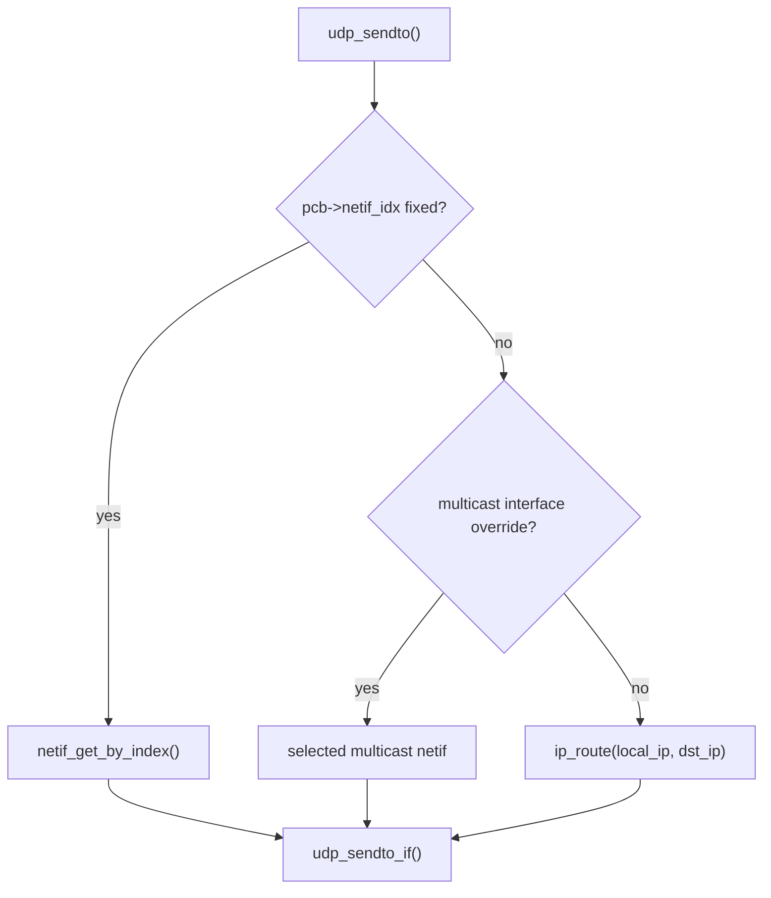
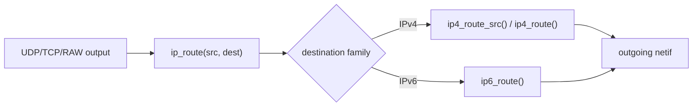
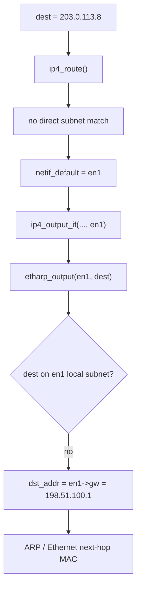
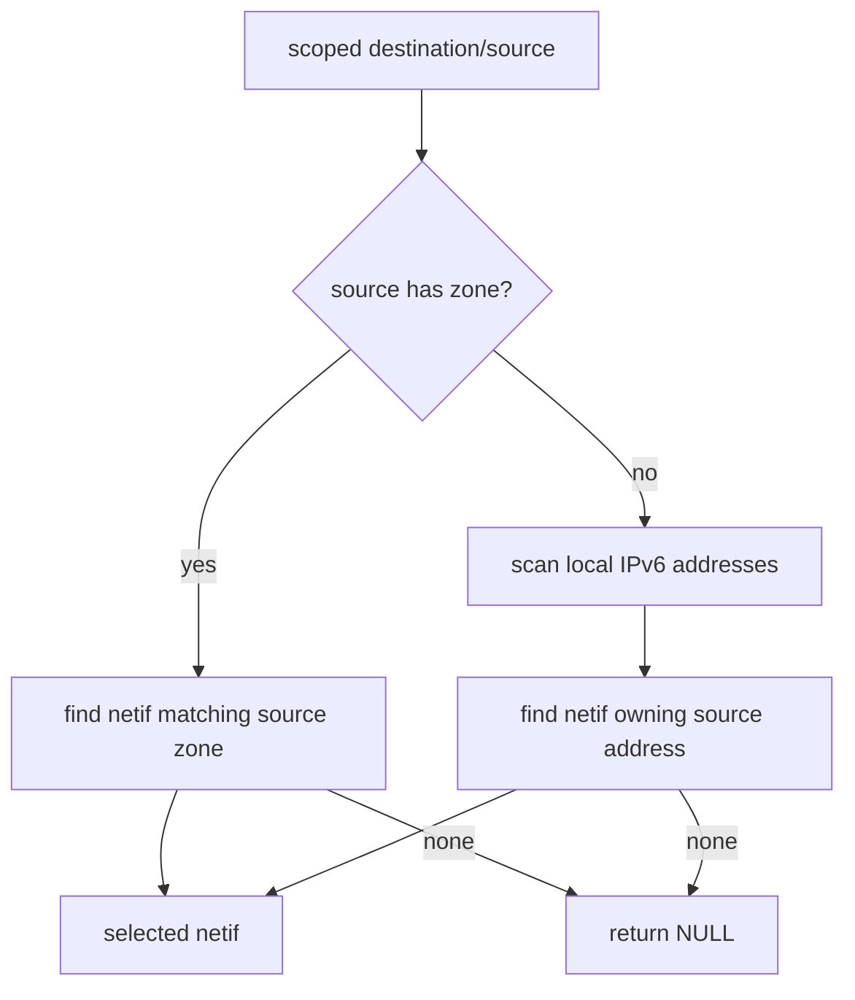
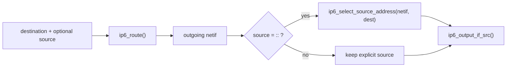
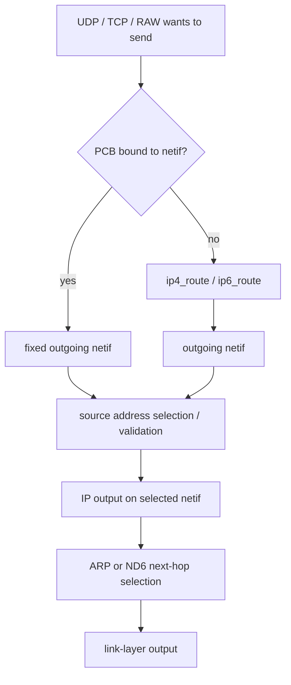

<meta name="referrer" content="no-referrer" />

# 教程 18：从 `udp_sendto()` 到 `netif->output()`——Multi-netif 路由选择、Default Netif、Gateway 与 IPv6 Source Selection

> 摘要：从 UDP/TCP 真实发送入口追踪多 netif 出口选择、默认接口、IPv4 Gateway、IPv6 ND 路由与源地址选择，并说明显式绑定接口和 route hook 的边界。

[TOC]

Stage 2 已建立 `netif`，Stage 4 走通过 IPv4/ARP，Stage 15 已从整体上解释 IPv6 ND、RA 与 SLAAC。此前实验基本只有一个 Unix TAP，所以“包从哪张网卡出去”没有形成真正的问题。

Stage 18 开始把 `netif` 从“一个接口对象”提升为“多个候选出口”。当前源码基线仍为 `d08f4773edd0182b7910fc8f046eed82ffcd67c9`。[S1](#source-s1)

本篇只回答一条主线：**应用没有显式指定接口时，lwIP 如何根据 destination、source、interface 状态和 IPv4/IPv6 路由信息选择 outgoing `netif`，又如何在选定 `netif` 后确定真正的下一跳。**

需要先把两个动作分开：

```text
route selection
    = 选哪一个 netif

next-hop selection
    = 已经选定 netif 后，直接发给 destination，还是发给 gateway/router
```

IPv4 中这两步主要落在 `ip4_route()` 与 `etharp_output()`；IPv6 中则主要落在 `ip6_route()` 与 ND6 的 Destination/Prefix/Default Router 机制。[S1](#source-s1)[S4](#source-s4)

当前 Unix `example_app` 仍只创建一个静态 `struct netif`，随后立刻调用 `netif_set_default()`，因此本篇的 multi-netif 行为主要由 Core 源码证明；文中的双接口拓扑是用于推演和后续实验扩展的阅读模型，不声称当前仓库已经运行过双 TAP 实验。[S2](#source-s2)

## 1. 当前 Unix example 为什么以前看不到“路由选择”

进入 `contrib/ports/unix/example_app/default_netif.c` 的 `init_default_netif()`。当前实现只有一个文件静态 `struct netif netif`，初始化后直接设为 default：[S2](#source-s2)

```c
static struct netif netif;

#if LWIP_IPV4
#define NETIF_ADDRS ipaddr, netmask, gw,
void init_default_netif(const ip4_addr_t *ipaddr, const ip4_addr_t *netmask, const ip4_addr_t *gw)
#else
#define NETIF_ADDRS
void init_default_netif(void)
#endif
{
#if NO_SYS
netif_add(&netif, NETIF_ADDRS NULL, tapif_init, netif_input);
#else
  netif_add(&netif, NETIF_ADDRS NULL, tapif_init, tcpip_input);
#endif
  netif_set_default(&netif);
}
```

在只有一张 `netif` 时：

```text
application
    ↓
route lookup
    ↓
唯一 netif
```

很多“路由算法”因此看起来像没有发生。

但当前 `opt.h` 中 `LWIP_SINGLE_NETIF` 默认是 `0`，Core 默认仍保留 multi-netif 数据结构和算法；只有项目显式配置 `LWIP_SINGLE_NETIF=1` 时，才把很多遍历路径编译成 single-netif 快路径。[S1](#source-s1)

```c
#if !defined LWIP_SINGLE_NETIF || defined __DOXYGEN__
#define LWIP_SINGLE_NETIF               0
#endif
```

所以当前 Unix example 是“应用只创建了一张网卡”，不是“lwIP Core 只支持一张网卡”。

## 2. 多张 `netif` 在 Core 里首先是一条链表

进入 `netif_add()`。完成 driver init、地址和 interface number 初始化后，新接口会插入 `netif_list` 头部：[S1](#source-s1)

```c
#if !LWIP_SINGLE_NETIF
  /* add this netif to the list */
  netif->next = netif_list;
  netif_list = netif;
#endif /* "LWIP_SINGLE_NETIF */
```

`NETIF_FOREACH()` 对应的就是这条单向链表：[S1](#source-s1)

```c
#if LWIP_SINGLE_NETIF
#define NETIF_FOREACH(netif) if (((netif) = netif_default) != NULL)
#else /* LWIP_SINGLE_NETIF */
/** The list of network interfaces. */
extern struct netif *netif_list;
#define NETIF_FOREACH(netif) for ((netif) = netif_list; (netif) != NULL; (netif) = (netif)->next)
#endif /* LWIP_SINGLE_NETIF */
/** The default network interface. */
extern struct netif *netif_default;
```

这里先得到两个完全不同的对象：

| 对象 | 含义 |
| --- | --- |
| `netif_list` | 所有已注册接口的链表，用于遍历候选 `netif` |
| `netif_default` | 没有更具体 route 时使用的默认接口 |

`netif_default` 不是链表头的同义词，也不是“唯一接口”。

由于新 `netif` 插入链表头部，默认 IPv4 route 的“第一个匹配”行为会受接口添加顺序影响；这是后文分析 overlapping subnet 时必须记住的实现细节。[S1](#source-s1)

## 3. `netif_set_default()` 只指定 fallback，不替代正常 route lookup

进入 `netif_set_default()`。它的核心动作很简单：[S1](#source-s1)

```c
void
netif_set_default(struct netif *netif)
{
  LWIP_ASSERT_CORE_LOCKED();

  if (netif == NULL) {
    /* remove default route */
    mib2_remove_route_ip4(1, netif);
  } else {
    /* install default route */
    mib2_add_route_ip4(1, netif);
  }
  netif_default = netif;
  LWIP_DEBUGF(NETIF_DEBUG, ("netif: setting default interface %c%c\n",
                            netif ? netif->name[0] : '\'', netif ? netif->name[1] : '\''));
}
```

因此：

```text
netif_set_default(en1)
```

只意味着：

> 在 Core 的普通 route 规则没有找到更具体出口时，可以退回 `en1`。

它并不意味着所有 packet 都强制从 `en1` 发送。

假设存在：

```text
en0 = 192.0.2.2/24,   gw 192.0.2.1
en1 = 198.51.100.2/24, gw 198.51.100.1
netif_default = en1
```

那么 destination `192.0.2.99` 仍应该命中 `en0` 的 local subnet；只有无法命中任何更具体路径的 destination 才退回 `en1`。

## 4. 从真实发送入口开始：`udp_sendto()` 先决定“是否允许自动选路”

Stage 5 已经介绍过 UDP Raw API。现在重新进入 `udp_sendto()`，只看 multi-netif 新问题。

真正执行主体是 `udp_sendto_chksum()`。该函数在构造 UDP header 之前先决定 outgoing `netif`：[S1](#source-s1)

```c
  if (pcb->netif_idx != NETIF_NO_INDEX) {
    netif = netif_get_by_index(pcb->netif_idx);
  } else {
#if LWIP_MULTICAST_TX_OPTIONS
    netif = NULL;
    if (ip_addr_ismulticast(dst_ip)) {
      if (pcb->mcast_ifindex != NETIF_NO_INDEX) {
        netif = netif_get_by_index(pcb->mcast_ifindex);
      }
#if LWIP_IPV4
      else
#if LWIP_IPV6
        if (IP_IS_V4(dst_ip))
#endif /* LWIP_IPV6 */
        {
          if (!ip4_addr_isany_val(pcb->mcast_ip4) &&
              !ip4_addr_eq(&pcb->mcast_ip4, IP4_ADDR_BROADCAST)) {
            netif = ip4_route_src(ip_2_ip4(&pcb->local_ip), &pcb->mcast_ip4);
          }
        }
#endif /* LWIP_IPV4 */
    }

    if (netif == NULL)
#endif /* LWIP_MULTICAST_TX_OPTIONS */
    {
      /* find the outgoing network interface for this packet */
      netif = ip_route(&pcb->local_ip, dst_ip);
    }
  }
```

这段代码建立了 multi-netif 发送的第一层优先级：



所以 automatic route lookup 并不是不可绕过的。如果 PCB 已经绑定 interface，UDP 会优先直接使用该 `netif`。

## 5. `SO_BINDTODEVICE` 为什么会直接改变 UDP/TCP route

Socket API 的 `SO_BINDTODEVICE` 最终不是把 interface name 存在 Socket 自己的字符串字段里，而是找到 `netif` 后把 interface index 写进协议 PCB。[S1](#source-s1)

继续阅读 `lwip_setsockopt_impl()` 的 `SO_BINDTODEVICE` 分支：[S1](#source-s1)

```c
        case SO_BINDTODEVICE: {
          const struct ifreq *iface;
          struct netif *n = NULL;

          LWIP_SOCKOPT_CHECK_OPTLEN_CONN(sock, optlen, struct ifreq);

          iface = (const struct ifreq *)optval;
          if (iface->ifr_name[0] != 0) {
            n = netif_find(iface->ifr_name);
            if (n == NULL) {
              done_socket(sock);
              return ENODEV;
            }
          }

          switch (NETCONNTYPE_GROUP(netconn_type(sock->conn))) {
#if LWIP_TCP
            case NETCONN_TCP:
              tcp_bind_netif(sock->conn->pcb.tcp, n);
              break;
#endif
#if LWIP_UDP
            case NETCONN_UDP:
              udp_bind_netif(sock->conn->pcb.udp, n);
              break;
#endif
#if LWIP_RAW
            case NETCONN_RAW:
              raw_bind_netif(sock->conn->pcb.raw, n);
              break;
#endif
            default:
              LWIP_ASSERT("Unhandled netconn type in SO_BINDTODEVICE", 0);
              break;
          }
        }
```

进入 `udp_bind_netif()`：[S1](#source-s1)

```c
void
udp_bind_netif(struct udp_pcb *pcb, const struct netif *netif)
{
  LWIP_ASSERT_CORE_LOCKED();

  if (netif != NULL) {
    pcb->netif_idx = netif_get_index(netif);
  } else {
    pcb->netif_idx = NETIF_NO_INDEX;
  }
}
```

TCP 的 `tcp_bind_netif()` 使用同一思路：把 `netif_get_index(netif)` 存进 PCB。[S1](#source-s1)

这解释了为什么“绑定本地 IP”和“绑定网卡”不能混为一谈：

| 操作 | 约束对象 | 主要效果 |
| --- | --- | --- |
| bind local IP | source address | 指定/限制源 IP |
| `SO_BINDTODEVICE` / `*_bind_netif()` | `netif_idx` | 直接固定 ingress/egress interface |
| normal route lookup | destination/source + route state | 自动选择 outgoing `netif` |

## 6. TCP 也遵守同一原则：固定接口优先，否则调用 `ip_route()`

进入 `tcp_connect()`。在 SYN 还没有发出前，TCP 已先解析 route：[S1](#source-s1)

```c
  if (pcb->netif_idx != NETIF_NO_INDEX) {
    netif = netif_get_by_index(pcb->netif_idx);
  } else {
    /* check if we have a route to the remote host */
    netif = ip_route(&pcb->local_ip, &pcb->remote_ip);
  }
  if (netif == NULL) {
    /* Don't even try to send a SYN packet if we have no route since that will fail. */
    return ERR_RTE;
  }

  /* check if local IP has been assigned to pcb, if not, get one */
  if (ip_addr_isany(&pcb->local_ip)) {
    const ip_addr_t *local_ip = ip_netif_get_local_ip(netif, ipaddr);
    if (local_ip == NULL) {
      return ERR_RTE;
    }
    ip_addr_copy(pcb->local_ip, *local_ip);
  }
```

这里顺序非常重要：

```text
先选 outgoing netif
        ↓
再在这个 netif 上决定 local source address
        ↓
最后才开始真正 TCP connect / SYN 路径
```

对于 IPv6，这一顺序与 RFC 6724 的 source-address candidate model是一致方向：候选源地址主要来自 outgoing interface；lwIP 的具体实现范围由后文 `ip6_select_source_address()` 体现。[S6](#source-s6)

## 7. `ip_route()` 是 IPv4/IPv6 的统一分发门

dual-stack 构建下，`ip_route()` 只是一个宏，根据 destination address type 分发到 IPv4 或 IPv6：[S1](#source-s1)

```c
#define ip_route(src, dest) \
        (IP_IS_V6(dest) ? \
        ip6_route(ip_2_ip6(src), ip_2_ip6(dest)) : \
        ip4_route_src(ip_2_ip4(src), ip_2_ip4(dest)))
```

到这里两条 route 算法正式分叉：



后面的差异不能用“IPv6 就是 IPv4 地址变长”解释。

## 8. IPv4 默认 route：先扫描所有接口的直连 subnet

如果没有配置 `LWIP_HOOK_IP4_ROUTE_SRC`，`ip4_route_src(src, dest)` 在头文件中直接退化为：

```c
#define ip4_route_src(src, dest) ip4_route(dest)
```

所以默认 IPv4 route 不使用 source address。[S1](#source-s1)

进入 `ip4_route()`。当前默认算法先线性遍历 `netif_list`：[S1](#source-s1)

```c
  /* iterate through netifs */
  NETIF_FOREACH(netif) {
    /* is the netif up, does it have a link and a valid address? */
    if (netif_is_up(netif) && netif_is_link_up(netif) && !ip4_addr_isany_val(*netif_ip4_addr(netif))) {
      /* network mask matches? */
      if (ip4_addr_net_eq(dest, netif_ip4_addr(netif), netif_ip4_netmask(netif))) {
        /* return netif on which to forward IP packet */
        return netif;
      }
      /* gateway matches on a non broadcast interface? (i.e. peer in a point to point interface) */
      if (((netif->flags & NETIF_FLAG_BROADCAST) == 0) && ip4_addr_eq(dest, netif_ip4_gw(netif))) {
        /* return netif on which to forward IP packet */
        return netif;
      }
    }
  }
```

因此双接口拓扑：

```text
en0  192.0.2.2/24
en1  198.51.100.2/24
```

面对：

```text
192.0.2.99
```

`ip4_route()` 会检查：

```text
dest & netmask
==
netif->ip_addr & netmask
```

匹配到 `192.0.2.0/24` 的 `en0` 后立即返回。

### 8.1 一个重要限制：默认 IPv4 Core 不是 longest-prefix routing table

默认代码不是：

```text
收集全部匹配 route
→ 比较 prefix length
→ 选择 longest prefix
```

而是：

```text
NETIF_FOREACH
→ 找到第一个 subnet match
→ return
```

再结合 `netif_add()` 把新接口插到 `netif_list` 头部，可以推出一个直接工程结论：**如果多个 IPv4 `netif` 的 subnet 重叠，默认 route 结果可能受 `netif` 链表顺序影响。**[S1](#source-s1)

这属于当前 lwIP 默认实现策略，不应泛化成完整 IP routing table 行为。需要 policy route、metric 或真正的 longest-prefix route table 时，应进入 route hook / 外部 route table，而不是依赖接口添加顺序。

## 9. IPv4 没有直连匹配时：Hook 之后才退到 `netif_default`

继续阅读 `ip4_route()`。普通 subnet 没有命中后，Core 才尝试 route hook：[S1](#source-s1)

```c
#ifdef LWIP_HOOK_IP4_ROUTE_SRC
  netif = LWIP_HOOK_IP4_ROUTE_SRC(NULL, dest);
  if (netif != NULL) {
    return netif;
  }
#elif defined(LWIP_HOOK_IP4_ROUTE)
  netif = LWIP_HOOK_IP4_ROUTE(dest);
  if (netif != NULL) {
    return netif;
  }
#endif
```

继续阅读 `ip4_route()` 的最后 fallback。之后才检查 `netif_default`：[S1](#source-s1)

```c
  if ((netif_default == NULL) || !netif_is_up(netif_default) || !netif_is_link_up(netif_default) ||
      ip4_addr_isany_val(*netif_ip4_addr(netif_default)) || ip4_addr_isloopback(dest)) {
    LWIP_DEBUGF(IP_DEBUG | LWIP_DBG_LEVEL_SERIOUS, ("ip4_route: No route to %"U16_F".%"U16_F".%"U16_F".%"U16_F"\n",
                ip4_addr1_16(dest), ip4_addr2_16(dest), ip4_addr3_16(dest), ip4_addr4_16(dest)));
    IP_STATS_INC(ip.rterr);
    MIB2_STATS_INC(mib2.ipoutnoroutes);
    return NULL;
  }

  return netif_default;
```

所以前面的双接口模型中：

```text
destination = 203.0.113.8
netif_default = en1
```

如果没有 hook 提供其它 route，`ip4_route()` 最终只返回：

```text
en1
```

注意：到这一步**只选出了 interface，还没有决定 Ethernet frame 发给谁的 MAC**。

## 10. `ip4_output()` 返回 route 后，source address 才与 netif 对齐

`ip4_output()` 的调用顺序非常清楚：[S1](#source-s1)

```c
err_t
ip4_output(struct pbuf *p, const ip4_addr_t *src, const ip4_addr_t *dest,
           u8_t ttl, u8_t tos, u8_t proto)
{
  struct netif *netif;

  LWIP_IP_CHECK_PBUF_REF_COUNT_FOR_TX(p);

  if ((netif = ip4_route_src(src, dest)) == NULL) {
    LWIP_DEBUGF(IP_DEBUG, ("ip4_output: No route to %"U16_F".%"U16_F".%"U16_F".%"U16_F"\n",
                           ip4_addr1_16(dest), ip4_addr2_16(dest), ip4_addr3_16(dest), ip4_addr4_16(dest)));
    IP_STATS_INC(ip.rterr);
    return ERR_RTE;
  }

  return ip4_output_if(p, src, dest, ttl, tos, proto, netif);
}
```

进入 `ip4_output_if()`。如果 caller 的 source 是 `0.0.0.0`/ANY，它会使用刚选出的 `netif` 的 IPv4 地址：[S1](#source-s1)

```c
  const ip4_addr_t *src_used = src;
  if (dest != LWIP_IP_HDRINCL) {
    if (ip4_addr_isany(src)) {
      src_used = netif_ip4_addr(netif);
    }
  }
```

所以自动 route 与自动 source 的关系是：

```text
destination
    ↓
ip4_route()
    ↓
outgoing netif
    ↓
netif->ip_addr
    ↓
IPv4 source address
```

## 11. IPv4 的 Gateway 为什么不在 `ip4_route()` 里选

这是 multi-netif 最容易产生误解的地方。

`ip4_route()` 返回 `en1` 后，packet 最终进入：

```text
ip4_output_if()
→ netif->output(netif, p, dest)
```

Ethernet netif 的 `output` 通常是 `etharp_output()`。这里才判断 destination 是否在已选 `netif` 的本地 subnet。[S1](#source-s1)

继续阅读 `etharp_output()` 的 unicast 分支：[S1](#source-s1)

```c
    if (!ip4_addr_net_eq(ipaddr, netif_ip4_addr(netif), netif_ip4_netmask(netif)) &&
        !ip4_addr_islinklocal(ipaddr)) {
#if LWIP_AUTOIP
      struct ip_hdr *iphdr = LWIP_ALIGNMENT_CAST(struct ip_hdr *, q->payload);
      if (!ip4_addr_islinklocal(&iphdr->src))
#endif /* LWIP_AUTOIP */
      {
#ifdef LWIP_HOOK_ETHARP_GET_GW
        dst_addr = LWIP_HOOK_ETHARP_GET_GW(netif, ipaddr);
        if (dst_addr == NULL)
#endif /* LWIP_HOOK_ETHARP_GET_GW */
        {
          if (!ip4_addr_isany_val(*netif_ip4_gw(netif))) {
            dst_addr = netif_ip4_gw(netif);
          } else {
            return ERR_RTE;
          }
        }
      }
    }
```

所以 destination `203.0.113.8` 的完整路径是：



这说明：

```text
IP destination = 203.0.113.8
Ethernet next hop = gateway 198.51.100.1
```

IP header 的 destination 不会因此改成 gateway。Gateway 只改变二层下一跳。

## 12. IPv4 Advanced Routing 需要同时考虑“选 netif”和“选 gateway”

`opt.h` 对两个 hook 的边界写得很明确：[S1](#source-s1)

```text
LWIP_HOOK_IP4_ROUTE / LWIP_HOOK_IP4_ROUTE_SRC
    → 返回 outgoing netif

LWIP_HOOK_ETHARP_GET_GW
    → 已经知道 outgoing netif 后，为当前 destination 返回 gateway IPv4
```

因此一个真正的 IPv4 route table entry 通常至少包含：

```text
prefix / mask
outgoing netif
gateway 或 on-link 标记
```

只实现 route hook、却让所有 off-link destination 都继续使用 `netif->gw`，并不能完整表达多个 gateway 的静态路由表。

当前 lwIP Core 并没有内建一个通用 IPv4 longest-prefix route table；`opt.h` 明确把 advanced routing table 留给应用/port，通过 hook 接入。[S1](#source-s1)

## 13. Source-based IPv4 routing：`LWIP_HOOK_IP4_ROUTE_SRC`

默认 `ip4_route()` 只看 destination，但如果定义 `LWIP_HOOK_IP4_ROUTE_SRC`，`ip4_route_src()` 会在 source 已知时优先让 hook 决策：[S1](#source-s1)

```c
struct netif *
ip4_route_src(const ip4_addr_t *src, const ip4_addr_t *dest)
{
  if (src != NULL) {
    /* when src==NULL, the hook is called from ip4_route(dest) */
    struct netif *netif = LWIP_HOOK_IP4_ROUTE_SRC(src, dest);
    if (netif != NULL) {
      return netif;
    }
  }
  return ip4_route(dest);
}
```

这允许 policy 类规则表达：

```text
source A + destination X → en0
source B + destination X → en1
```

但实际 route table、metric、policy rule 仍由项目自己实现；hook 只是 Core 的注入点。

## 14. IPv6 `ip6_route()` 不能简单复制 IPv4 的 subnet scan

IPv6 route 多了 zone、scope、RA prefix、default router 和 source address 的关系。

源码注释已经给出了当前 `ip6_route()` 的优先级：[S1](#source-s1)

```text
1. single netif fast path
2. zoned destination
3. scoped source/destination
4. destination subnet match
5. router-announced route
6. source-address matching netif
7. netif_default
```

这不是完整通用 IPv6 route-table 规范，而是当前 lwIP Core 的默认路由策略。

## 15. IPv6 第一优先级：Zone 可以直接限定 interface

link-local 地址如 `fe80::/10`、interface/link-local multicast 都存在 scope/zone 问题。

如果 destination 已经带 zone，`ip6_route()` 会遍历 netif，并只允许匹配该 zone 的 interface：[S1](#source-s1)

```c
  if (ip6_addr_has_zone(dest)) {
    IP6_ADDR_ZONECHECK(dest);
    NETIF_FOREACH(netif) {
      if (ip6_addr_test_zone(dest, netif) &&
          netif_is_up(netif) && netif_is_link_up(netif)) {
        return netif;
      }
    }
    return NULL;
  }
```

因此：

```text
fe80::1234%en0
```

里的 `%en0` 不是打印装饰，它参与 route boundary。

如果明确 zone 指向 `en0`，Core 不会因为 `en1` 也有 IPv6 connectivity 就随意改走 `en1`。这正是 scoped address 必须与 interface scope 一致的原因。

## 16. IPv6 对 scoped source 也会限制 outgoing netif

当 destination/source 属于 scope-sensitive 地址时，`ip6_route()` 会根据 source zone，或者根据“哪个 netif 真正拥有这个 source address”来选择 interface。[S1](#source-s1)

执行逻辑可压缩为：



这一分支的重要语义是：zone boundary 比 default route 更强。如果 scoped source/destination 无法找到合法 interface，函数返回 `NULL`，而不是继续无条件 fallback 到另一张网卡。

## 17. IPv6 unscoped destination：Hook、静态地址 subnet、RA route 依次参与

对于 global/ULA 等不受前面 scope 分支限制的地址，`ip6_route()` 先允许项目 hook 接管：[S1](#source-s1)

```c
#ifdef LWIP_HOOK_IP6_ROUTE
  netif = LWIP_HOOK_IP6_ROUTE(src, dest);
  if (netif != NULL) {
    return netif;
  }
#endif
```

然后检查 destination 是否匹配某个 interface 上的有效 IPv6 地址/静态 subnet：[S1](#source-s1)

```c
  NETIF_FOREACH(netif) {
    if (!netif_is_up(netif) || !netif_is_link_up(netif)) {
      continue;
    }
    for (i = 0; i < LWIP_IPV6_NUM_ADDRESSES; i++) {
      if (ip6_addr_isvalid(netif_ip6_addr_state(netif, i)) &&
          ip6_addr_net_eq(dest, netif_ip6_addr(netif, i)) &&
          (netif_ip6_addr_isstatic(netif, i) ||
          ip6_addr_nethost_eq(dest, netif_ip6_addr(netif, i)))) {
        return netif;
      }
    }
  }
```

这里的“static address 可隐含 /64 local subnet、dynamic address 不自动意味着 on-link prefix”与 RFC 5942 的 IPv6 subnet model 对应；lwIP 源码也在这里明确引用 RFC 5942。[S1](#source-s1)[S5](#source-s5)

## 18. RA 学到的 on-link prefix/default router 进入 `nd6_find_route()`

如果上面的本地静态地址规则没有命中，`ip6_route()` 继续调用：[S1](#source-s1)

```c
  /* Get the netif for a suitable router-announced route. */
  netif = nd6_find_route(dest);
  if (netif != NULL) {
    return netif;
  }
```

进入 `nd6_find_route()`。它先检查 RA/ND6 维护的 on-link `prefix_list`：[S1](#source-s1)

```c
  for (i = 0; i < LWIP_ND6_NUM_PREFIXES; ++i) {
    netif = prefix_list[i].netif;
    if ((netif != NULL) && ip6_addr_net_eq(&prefix_list[i].prefix, ip6addr) &&
        netif_is_up(netif) && netif_is_link_up(netif)) {
      return netif;
    }
  }
```

继续阅读 `nd6_find_route()`。如果 destination 不在已知 on-link prefix 中，才继续选 default router：[S1](#source-s1)

```c
  i = nd6_select_router(ip6addr, NULL);
  if (i >= 0) {
    LWIP_ASSERT("selected router must have a neighbor entry",
      default_router_list[i].neighbor_entry != NULL);
    return default_router_list[i].neighbor_entry->netif;
  }

  return NULL;
```

RFC 4861 的 next-hop determination 同样区分 on-link destination 与 off-link destination，并使用 Prefix List、Default Router List、Destination Cache 和 Neighbor Cache。[S4](#source-s4)

因此 IPv6 multi-netif 不只是遍历 `netif->gw`；RA/ND6 runtime state 本身会参与 route。

## 19. `nd6_select_router()` 会把 router 的 `netif` 带回 route layer

Stage 15 已介绍 Neighbor Cache。这里关注 multi-netif 新语义。

`default_router_list[]` 的 router entry 关联 Neighbor Cache，而 Neighbor Cache entry 又关联实际 `netif`。`nd6_select_router()` 只从符合 interface 状态要求的 router 中选择，并优先 reachable router。[S1](#source-s1)[S4](#source-s4)

核心判断是：

```c
      router_netif = default_router_list[i].neighbor_entry->netif;
      if ((router_netif != NULL) && (netif != NULL ? netif == router_netif :
          (netif_is_up(router_netif) && netif_is_link_up(router_netif)))) {
        if (default_router_list[i].neighbor_entry->state != ND6_INCOMPLETE) {
          if (default_router_list[i].neighbor_entry->state == ND6_REACHABLE) {
            return i;
          } else if (valid_router < 0) {
            valid_router = i;
          }
        }
      }
```

如果没有已知 reachable router，当前实现还会对 incomplete/unknown router 进行 round-robin fallback；源码注释明确对应 RFC 4861 Section 6.3.6。[S1](#source-s1)[S4](#source-s4)

所以 IPv6 中：

```text
Router Advertisement / ND6 state
        ↓
default_router_list[]
        ↓
neighbor_entry->netif
        ↓
ip6_route() selected netif
```

形成了比 IPv4 `netif->gw` 更动态的 interface 决策来源。

## 20. IPv6 route 仍然保留 source-address matching 与 default fallback

`nd6_find_route()` 也没有找到 route 时，`ip6_route()` 还会尝试“哪个 netif 拥有显式 source address”：[S1](#source-s1)

```c
  if (!ip6_addr_isany(src)) {
    NETIF_FOREACH(netif) {
      if (!netif_is_up(netif) || !netif_is_link_up(netif)) {
        continue;
      }
      for (i = 0; i < LWIP_IPV6_NUM_ADDRESSES; i++) {
        if (ip6_addr_isvalid(netif_ip6_addr_state(netif, i)) &&
            ip6_addr_eq(src, netif_ip6_addr(netif, i))) {
          return netif;
        }
      }
    }
  }
```

回到 `ip6_route()`。最后才是 `netif_default`：[S1](#source-s1)

```c
  if ((netif_default == NULL) || !netif_is_up(netif_default) || !netif_is_link_up(netif_default)) {
    return NULL;
  }
  return netif_default;
```

因此“指定 source address”可能反过来影响 IPv6 outgoing interface，这也是 IPv6 source/interface 关系比默认 IPv4 route 更紧密的原因。

## 21. `ip6_output()`：选出 interface 后才做源地址选择

进入 `ip6_output()`：[S1](#source-s1)

```c
  if (dest != LWIP_IP_HDRINCL) {
    netif = ip6_route(src, dest);
  } else {
    ip6hdr = (struct ip6_hdr *)p->payload;
    ip6_addr_copy_from_packed(src_addr, ip6hdr->src);
    ip6_addr_copy_from_packed(dest_addr, ip6hdr->dest);
    netif = ip6_route(&src_addr, &dest_addr);
    dest = &dest_addr;
  }

  if (netif == NULL) {
    LWIP_DEBUGF(IP6_DEBUG, ("ip6_output: no route for %"X16_F":%"X16_F":%"X16_F":%"X16_F":%"X16_F":%"X16_F":%"X16_F":%"X16_F"\n",
        IP6_ADDR_BLOCK1(dest),
        IP6_ADDR_BLOCK2(dest),
        IP6_ADDR_BLOCK3(dest),
        IP6_ADDR_BLOCK4(dest),
        IP6_ADDR_BLOCK5(dest),
        IP6_ADDR_BLOCK6(dest),
        IP6_ADDR_BLOCK7(dest),
        IP6_ADDR_BLOCK8(dest)));
    IP6_STATS_INC(ip6.rterr);
    return ERR_RTE;
  }

  return ip6_output_if(p, src, dest, hl, tc, nexth, netif);
```

进入 `ip6_output_if()`。如果 source 是 IPv6 ANY，才调用 `ip6_select_source_address(netif, dest)`：[S1](#source-s1)

```c
  const ip6_addr_t *src_used = src;
  if (dest != LWIP_IP_HDRINCL) {
    if (src != NULL && ip6_addr_isany(src)) {
      src_used = ip_2_ip6(ip6_select_source_address(netif, dest));
      if ((src_used == NULL) || ip6_addr_isany(src_used)) {
        LWIP_DEBUGF(IP6_DEBUG | LWIP_DBG_LEVEL_SERIOUS, ("ip6_output: No suitable source address for packet.\n"));
        IP6_STATS_INC(ip6.rterr);
        return ERR_RTE;
      }
    }
  }
```

这再次确认顺序：



RFC 6724 将 source selection 定义为从候选源地址集合中选择合适源地址；其推荐 candidate set 主要来自 outgoing interface。[S6](#source-s6)

## 22. `ip6_select_source_address()` 当前实现具体比较什么

当前 lwIP 并没有实现 RFC 6724 的全部 source selection rule。函数注释明确说明：[S1](#source-s1)

```text
Rules 1, 2, 3: fully implemented
Rules 4, 5, 5.5: not applicable
Rule 6: not implemented
Rule 7: not applicable
Rule 8: limited to /64 subnet match vs non-match
```

进入 `ip6_select_source_address()` 后，它只扫描**已经选定的 `netif`** 上 `LWIP_IPV6_NUM_ADDRESSES` 个本地地址槽。[S1](#source-s1)

候选过滤首先要求 address state 有效：

```c
  for (i = 0; i < LWIP_IPV6_NUM_ADDRESSES; i++) {
    /* Consider only valid (= preferred and deprecated) addresses. */
    if (!ip6_addr_isvalid(netif_ip6_addr_state(netif, i))) {
      continue;
    }
```

后面主要比较：

- candidate scope 是否适合 destination scope；
- `PREFERRED` 相对 `DEPRECATED`；
- 是否与 destination 有当前实现支持的 /64 match；
- exact same address 可立即胜出。[S1](#source-s1)[S6](#source-s6)

因此 multi-netif 与 multi-address 是两个连续但不同的问题：

```text
多个 netif 中先选一个
        ↓
该 netif 的多个 IPv6 address 中再选 source
```

## 23. IPv6 的下一跳由 ND6 再次决定，不等于 `ip6_route()` 返回 router

`ip6_route()` 返回的是 `netif`，不是 gateway IPv6 address。

Stage 15 的 `nd6_get_next_hop_entry()` 在已知 `netif` 后才判断 destination 是否 on-link。如果 on-link，next hop 就是 destination；否则通过 `LWIP_HOOK_ND6_GET_GW` 或 `nd6_select_router()` 选择 router。[S1](#source-s1)

当前源码核心路径：[S1](#source-s1)

```c
      if (ip6_addr_islinklocal(ip6addr) ||
          nd6_is_prefix_in_netif(ip6addr, netif)) {
        /* Destination in local link. */
        dest->pmtu = netif_mtu6(netif);
        ip6_addr_copy(dest->next_hop_addr, dest->destination_addr);
#ifdef LWIP_HOOK_ND6_GET_GW
      } else if ((next_hop_addr = LWIP_HOOK_ND6_GET_GW(netif, ip6addr)) != NULL) {
        /* Next hop for destination provided by hook function. */
        dest->pmtu = netif->mtu;
        ip6_addr_set(&dest->next_hop_addr, next_hop_addr);
#endif /* LWIP_HOOK_ND6_GET_GW */
      } else {
        /* We need to select a router. */
        i = nd6_select_router(ip6addr, netif);
        if (i < 0) {
          ip6_addr_set_any(&dest->destination_addr);
          return ERR_RTE;
        }
        dest->pmtu = netif_mtu6(netif);
        ip6_addr_copy(dest->next_hop_addr, default_router_list[i].neighbor_entry->next_hop_address);
      }
```

所以 IPv6 也必须坚持“两步模型”：

```text
ip6_route()
    → outgoing netif

ND6 next-hop determination
    → destination itself or router
```

## 24. IPv4 与 IPv6 route 的核心差异放到同一张表

| 维度 | IPv4 默认实现 | IPv6 默认实现 |
| --- | --- | --- |
| Core route 入口 | `ip4_route_src()` / `ip4_route()` | `ip6_route()` |
| source 默认是否参与 interface route | 否，除非 `LWIP_HOOK_IP4_ROUTE_SRC` | 是，尤其 scoped/source matching |
| 直连判定 | `netif->ip_addr + netmask` | zone/scope、static /64、RA on-link prefix |
| 默认出口 | `netif_default` | `netif_default` |
| 动态 router 信息 | 默认 route Core 不维护 | ND6 `default_router_list[]` |
| gateway/next-hop 决策 | `etharp_output()` 中 `netif->gw` / hook | ND6 Destination/Prefix/Default Router |
| advanced routing hook | IP4 route + ARP gateway hooks | IP6 route + ND6 gateway hooks |
| 内建通用 LPM route table | 无 | Core 无；contrib 有可选 static route addon |

这张表的重点不是比较“谁更先进”，而是说明两条源码链不能互相套用。

## 25. contrib 已经给了 IPv6 static routing 的参考实现

当前 upstream `contrib/addons/ipv6_static_routing/` 提供了一个很有价值的参考：它没有修改 `ip6.c`，而是通过 hook 接入自己的 static route table。[S3](#source-s3)

README 明确建议：

```text
LWIP_HOOK_IP6_ROUTE
    → ip6_static_route()

LWIP_HOOK_ND6_GET_GW
    → ip6_get_gateway()
```

这正好对应前面的“两步模型”。

其 `ip6_add_route_entry()` 在插入 route 时按 prefix length 降序排列：[S3](#source-s3)

```c
  for (i = LWIP_IPV6_NUM_ROUTE_ENTRIES - 1;
       i > 0 && (ip6_prefix->prefix_len > static_route_table[i - 1].prefix.prefix_len); i--) {
    SMEMCPY(&static_route_table[i], &static_route_table[i - 1], sizeof(struct ip6_route_entry));
  }

insert:
  SMEMCPY(&static_route_table[i].prefix, ip6_prefix, sizeof(struct ip6_prefix));
  static_route_table[i].netif = netif;
  static_route_table[i].gateway = gateway;
```

随后 `ip6_find_route_entry()` 从头线性搜索，因为 table 已按 prefix length 降序排列，第一个匹配自然形成 longest-prefix-match。[S3](#source-s3)

```c
  for(i = 0; i < LWIP_IPV6_NUM_ROUTE_ENTRIES; i++) {
    if (memcmp(ip6_dest_addr, &static_route_table[i].prefix.addr,
        static_route_table[i].prefix.prefix_len / 8) == 0) {
      idx = i;
      break;
    }
  }
```

这与默认 IPv4 “遍历 `netif_list` 后第一个 subnet match”形成鲜明对比。

## 26. 用双 `netif` 拓扑把三种 IPv4 route 一次区分

建立纯阅读拓扑：

```text
en0 = 192.0.2.2/24,    gw 192.0.2.1
en1 = 198.51.100.2/24, gw 198.51.100.1, netif_default
```

三种 destination 对应三条不同路径：

```text
192.0.2.80
→ ip4_route() 命中 en0 subnet
→ etharp_output(en0)
→ ARP destination itself

198.51.100.80
→ ip4_route() 命中 en1 subnet
→ etharp_output(en1)
→ ARP destination itself

203.0.113.80
→ 无 direct match
→ netif_default = en1
→ etharp_output(en1)
→ off-link，ARP en1->gw = 198.51.100.1
```

如果 Socket 再通过 `SO_BINDTODEVICE("en0")` 固定接口，`udp_sendto()` 会直接使用 `en0`，普通 `ip_route()` 不再决定 interface；off-link next hop 随后变成 `en0->gw`。因此 interface binding 不是“route preference”，而是更强的 interface 约束。[S1](#source-s1)

## 27. `ERR_RTE` 要先区分 interface selection 还是 next-hop selection

同一个错误码可能来自不同阶段：

```text
ip4_route()/ip6_route() 返回 NULL
→ 没找到 outgoing netif

IPv4 已选 netif，但 off-link 且 netif->gw 为空
→ etharp_output() 返回 ERR_RTE

IPv6 已选 netif，但 ND6 无 on-link route / gateway hook / default router
→ next-hop 解析返回 ERR_RTE
```

当前 Unix example 只有一个静态 `netif`；要实际观察多接口选择，需要扩展为两个 TAP/netif。该双 TAP 运行结果本篇未执行，不把它写成已验证证据。[S2](#source-s2)

## 28. 完整心智模型：route、source、gateway 不是一个动作

经过前面的源码链，可以把一次普通发送压缩为下面四阶段：



其中：

1. **PCB/interface binding** 可以绕过自动 interface route；
2. **route selection** 只回答“哪张 `netif`”；
3. **source selection** 在 selected `netif` 的约束下决定 source IP；
4. **next-hop selection** 再回答 destination 是直接邻居还是 gateway/router；
5. 最后才进入 ARP/ND6、MAC address 与 Driver TX。

理解这五步以后，多网口设备上的很多问题就可以被精确定位：

```text
选错接口
≠
选错源地址
≠
gateway 配错
≠
ARP/ND 邻居解析失败
```

## 29. 下一阶段的自然边界：Checksum / Hardware Offload

Stage 18 到这里已经完成“一个 packet 选择哪个 software interface、哪个 source、哪个 next hop”的闭环。

再向下进入 Driver 时，下一个新的独立问题是：

```text
IP/TCP/UDP checksum
哪些由 lwIP 计算
哪些可以由硬件生成/验证
netif checksum flags 如何影响行为
DMA descriptor/offload 又在哪一层接管
```

这属于新的 Driver/硬件边界，不继续塞进 multi-netif routing 主线。

## 资料来源

<a id="source-s1"></a>
### [S1] lwIP Core 路由、协议输出与 netif 源码
- 类型：目标版本上游源码
- 版本：commit `d08f4773edd0182b7910fc8f046eed82ffcd67c9`
- 定位：`src/core/netif.c`：`netif_add()`、`netif_set_default()`；`src/core/ipv4/ip4.c`：`ip4_route_src()`、`ip4_route()`、`ip4_output()`、`ip4_output_if()`；`src/core/ipv4/etharp.c`：`etharp_output()`；`src/core/ipv6/ip6.c`：`ip6_route()`、`ip6_select_source_address()`、`ip6_output()`、`ip6_output_if()`；`src/core/ipv6/nd6.c`：`nd6_find_route()`、`nd6_select_router()`、next-hop path；`src/core/udp.c`、`src/core/tcp.c`、`src/core/tcp_out.c`、`src/api/sockets.c`
- URL/文档：[lwIP upstream commit](https://github.com/lwip-tcpip/lwip/tree/d08f4773edd0182b7910fc8f046eed82ffcd67c9)
- 使用位置：route 主链、PCB 固定接口、IPv4 gateway、IPv6 ND/source selection
- 支撑内容：证明接口选择顺序、default fallback、next-hop 分层和 source selection

<a id="source-s2"></a>
### [S2] Unix example 默认 netif 与 lwIP 配置头
- 类型：目标版本上游示例与配置
- 版本：commit `d08f4773edd0182b7910fc8f046eed82ffcd67c9`
- 定位：`contrib/ports/unix/example_app/default_netif.c`；`src/include/lwip/netif.h`；`src/include/lwip/opt.h`
- URL/文档：[Unix example_app](https://github.com/lwip-tcpip/lwip/tree/d08f4773edd0182b7910fc8f046eed82ffcd67c9/contrib/ports/unix/example_app)
- 使用位置：“当前 Unix example”“netif list/default”“双 TAP 边界”
- 支撑内容：证明 Unix example 的单 netif 现状与 `netif_list/netif_default` 语义

<a id="source-s3"></a>
### [S3] lwIP contrib IPv6 Static Routing Addon
- 类型：上游 contrib 参考实现
- 版本：commit `d08f4773edd0182b7910fc8f046eed82ffcd67c9`
- 定位：`contrib/addons/ipv6_static_routing/README`、`ip6_route_table.c`、`ip6_route_table.h`
- URL/文档：[IPv6 static routing addon](https://github.com/lwip-tcpip/lwip/tree/d08f4773edd0182b7910fc8f046eed82ffcd67c9/contrib/addons/ipv6_static_routing)
- 使用位置：“IPv6 static routing 参考实现”
- 支撑内容：证明 route/gateway hook 组合以及 prefix-length 降序 lookup

<a id="source-s4"></a>
### [S4] RFC 4861：IPv6 Neighbor Discovery
- 类型：IETF 标准
- 版本：RFC 4861，September 2007
- URL/文档：[RFC 4861 - Neighbor Discovery for IP version 6](https://www.rfc-editor.org/rfc/rfc4861.html)
- 使用位置：RA route、default router、IPv6 next-hop
- 支撑内容：说明 Prefix/Default Router/Destination/Neighbor Cache 的角色

<a id="source-s5"></a>
### [S5] RFC 5942：IPv6 Subnet Model
- 类型：IETF 标准
- 版本：RFC 5942，July 2010
- URL/文档：[RFC 5942 - IPv6 Subnet Model](https://www.rfc-editor.org/rfc/rfc5942.html)
- 使用位置：IPv6 static/dynamic subnet 语义
- 支撑内容：说明 IPv6 address 不自动建立 on-link prefix

<a id="source-s6"></a>
### [S6] RFC 6724：IPv6 Source Address Selection
- 类型：IETF 标准
- 版本：RFC 6724，September 2012
- URL/文档：[RFC 6724 - Default Address Selection for IPv6](https://www.rfc-editor.org/rfc/rfc6724.html)
- 使用位置：TCP local source、`ip6_select_source_address()`
- 支撑内容：说明 IPv6 source candidate set 与选择规则背景
