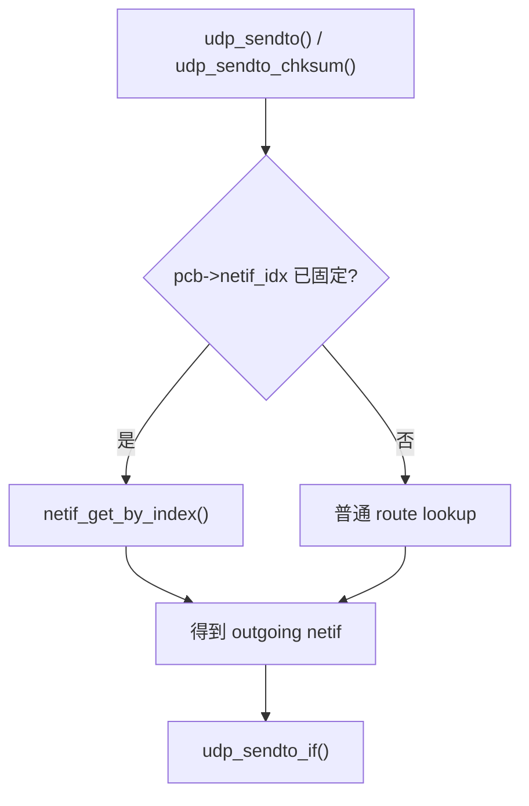
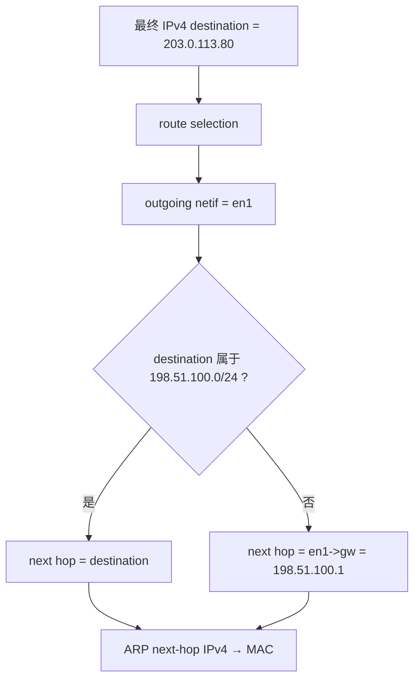
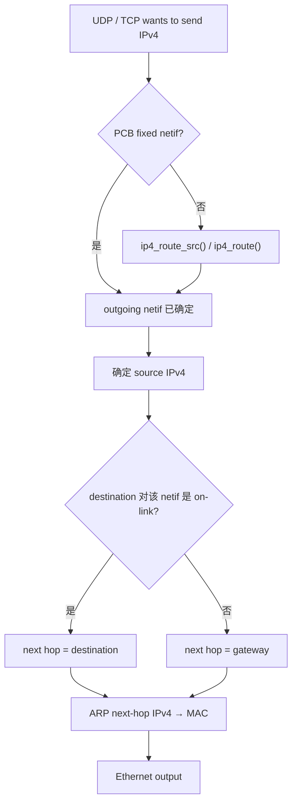

<meta name="referrer" content="no-referrer" />

# 教程 18：从 `udp_sendto()` 到 `etharp_output()`——Multi-netif IPv4 路由、Default Netif、Gateway 与下一跳

> 摘要：从 UDP/TCP 发送入口追踪 IPv4 multi-netif 出口选择、默认接口、源地址与 Gateway 下一跳，厘清 route 与 ARP 的职责边界。

[TOC]

Stage 2 已建立 `netif`，Stage 4 已走通 IPv4/ARP，Stage 5 已从 `udp_sendto()` 进入 UDP Raw API。此前 Unix Host 实验基本只有一个 TAP，因此“一个 IPv4 packet 到底从哪张网卡出去”一直没有真正暴露出来。

Stage 18 把问题收敛到一条 IPv4 主线：**应用没有显式固定接口时，lwIP 怎样选择 outgoing `netif`；选定接口以后，又怎样判断这一跳应该直接 ARP destination，还是 ARP 该接口的 gateway。** 当前源码基线仍为 upstream `master` commit `d08f4773edd0182b7910fc8f046eed82ffcd67c9`。[S1](#source-s1)

这里必须从一开始就把两个动作分开：

```text
route selection
    = 选哪一个 outgoing netif

next-hop selection
    = 已经选定 netif 后，
      当前 Ethernet 链路上的下一跳是谁
```

对于本文的 Ethernet/IPv4 路径，前者主要由 `ip4_route()` 决定，后者主要在 `etharp_output()` 中决定。[S1](#source-s1)

## 1. 从 `udp_sendto()` 开始：发包前先要得到一个 outgoing `netif`

重新进入 Stage 5 已经使用过的公共 API `udp_sendto()`。当前源码在启用 checksum-on-copy 时把它转入 `udp_sendto_chksum()`；无论具体条件编译怎样展开，后面的发送主体都首先要得到一个 `struct netif *netif`。[S1](#source-s1)

```c
err_t
udp_sendto(struct udp_pcb *pcb, struct pbuf *p,
           const ip_addr_t *dst_ip, u16_t dst_port)
{
#if LWIP_CHECKSUM_ON_COPY && CHECKSUM_GEN_UDP
  return udp_sendto_chksum(pcb, p, dst_ip, dst_port, 0, 0);
}

/** @ingroup udp_raw
 * Same as udp_sendto(), but with checksum */
err_t
udp_sendto_chksum(struct udp_pcb *pcb, struct pbuf *p, const ip_addr_t *dst_ip,
                  u16_t dst_port, u8_t have_chksum, u16_t chksum)
{
#endif /* LWIP_CHECKSUM_ON_COPY && CHECKSUM_GEN_UDP */
  struct netif *netif;
```

本文只跟踪 IPv4 单播。继续阅读 `udp_sendto_chksum()` 中的接口选择主干。下面是按这一执行条件裁剪后的**阅读版**，不是未经修改的上游完整函数；它删除了本文不需要的 multicast override 分支，只保留接口选择的主干：[S1](#source-s1)

```c
/* 执行路径阅读版：只保留本文 IPv4 单播主线 */
if (pcb->netif_idx != NETIF_NO_INDEX) {
  netif = netif_get_by_index(pcb->netif_idx);
} else {
  netif = ip_route(&pcb->local_ip, dst_ip);
}

if (netif == NULL) {
  return ERR_RTE;
}
```

因此 UDP 在真正构造并向下发送 datagram 前，先面对一个非常具体的问题：



这意味着自动路由并不是所有发送都必须经过的步骤。PCB 如果已经绑定接口，UDP 可以直接使用那张 `netif`。

## 2. `SO_BINDTODEVICE` 为什么能绕过普通 route lookup

Socket API 的 `SO_BINDTODEVICE` 最终会把接口约束写进协议 PCB，而不是只在 Socket 层保存一个接口名。[S1](#source-s1)

继续阅读 `lwip_setsockopt_impl()` 的 `SO_BINDTODEVICE` 分支。它先通过 `netif_find()` 找到接口，再根据协议类型调用 `tcp_bind_netif()`、`udp_bind_netif()` 或 `raw_bind_netif()`：[S1](#source-s1)

```c
        case SO_BINDTODEVICE: {
          const struct ifreq *iface;
          struct netif *n = NULL;

          LWIP_SOCKOPT_CHECK_OPTLEN_CONN(sock, optlen, struct ifreq);

          iface = (const struct ifreq *)optval;
          if (iface->ifr_name[0] != 0) {
            n = netif_find(iface->ifr_name);
            if (n == NULL) {
              done_socket(sock);
              return ENODEV;
            }
          }

          switch (NETCONNTYPE_GROUP(netconn_type(sock->conn))) {
#if LWIP_TCP
            case NETCONN_TCP:
              tcp_bind_netif(sock->conn->pcb.tcp, n);
              break;
#endif
#if LWIP_UDP
            case NETCONN_UDP:
              udp_bind_netif(sock->conn->pcb.udp, n);
              break;
#endif
#if LWIP_RAW
            case NETCONN_RAW:
              raw_bind_netif(sock->conn->pcb.raw, n);
              break;
#endif
            default:
              LWIP_ASSERT("Unhandled netconn type in SO_BINDTODEVICE", 0);
              break;
          }
        }
```

进入 `udp_bind_netif()`：[S1](#source-s1)

```c
void
udp_bind_netif(struct udp_pcb *pcb, const struct netif *netif)
{
  LWIP_ASSERT_CORE_LOCKED();

  if (netif != NULL) {
    pcb->netif_idx = netif_get_index(netif);
  } else {
    pcb->netif_idx = NETIF_NO_INDEX;
  }
}
```

因此下面三个概念不能混为一谈：

| 动作 | 约束对象 | 主要效果 |
| --- | --- | --- |
| `bind()` 到本地 IPv4 | source address | 限制/指定源 IPv4 |
| `SO_BINDTODEVICE` / `*_bind_netif()` | `pcb->netif_idx` | 固定 outgoing interface |
| 普通 route lookup | destination + route state | 自动选择 outgoing `netif` |

## 3. 为什么当前 Unix example 平时感觉不到 multi-netif route

当前 `contrib/ports/unix/example_app/default_netif.c` 只有一个文件静态 `struct netif netif`。`init_default_netif()` 创建它以后立即设成 default：[S2](#source-s2)

```c
static struct netif netif;

#if LWIP_IPV4
#define NETIF_ADDRS ipaddr, netmask, gw,
void init_default_netif(const ip4_addr_t *ipaddr, const ip4_addr_t *netmask, const ip4_addr_t *gw)
#else
#define NETIF_ADDRS
void init_default_netif(void)
#endif
{
#if NO_SYS
netif_add(&netif, NETIF_ADDRS NULL, tapif_init, netif_input);
#else
  netif_add(&netif, NETIF_ADDRS NULL, tapif_init, tcpip_input);
#endif
  netif_set_default(&netif);
}
```

只有一张接口时，运行时看起来往往就是：

```text
application
    ↓
route lookup
    ↓
唯一 netif
```

但 Core 默认仍保留 multi-netif 数据结构。`netif_add()` 会把新接口挂入 `netif_list`，`netif_default` 则单独保存默认出口。[S1](#source-s1)

```c
#if LWIP_SINGLE_NETIF
#define NETIF_FOREACH(netif) if (((netif) = netif_default) != NULL)
#else /* LWIP_SINGLE_NETIF */
/** The list of network interfaces. */
extern struct netif *netif_list;
#define NETIF_FOREACH(netif) for ((netif) = netif_list; (netif) != NULL; (netif) = (netif)->next)
#endif /* LWIP_SINGLE_NETIF */
/** The default network interface. */
extern struct netif *netif_default;
```

这两个对象的职责不同：

| 对象 | 含义 |
| --- | --- |
| `netif_list` | 所有候选网络接口，route lookup 可以遍历 |
| `netif_default` | 没有更具体路径时的 fallback interface |

`netif_default` 不是“唯一接口”，也不是“链表第一项”。

## 4. `netif_set_default()` 设置的是 fallback interface，不是 Gateway

进入 `netif_set_default()`：[S1](#source-s1)

```c
void
netif_set_default(struct netif *netif)
{
  LWIP_ASSERT_CORE_LOCKED();

  if (netif == NULL) {
    /* remove default route */
    mib2_remove_route_ip4(1, netif);
  } else {
    /* install default route */
    mib2_add_route_ip4(1, netif);
  }
  netif_default = netif;
  LWIP_DEBUGF(NETIF_DEBUG, ("netif: setting default interface %c%c\n",
                            netif ? netif->name[0] : '\'', netif ? netif->name[1] : '\''));
}
```

假设有两张接口：

```text
en0 = 192.0.2.2/24,    gw = 192.0.2.1
en1 = 198.51.100.2/24, gw = 198.51.100.1

netif_default = en1
```

这里有两个名字很容易混淆：

| 名称 | 当前回答的问题 |
| --- | --- |
| `netif_default = en1` | 没有更具体 route 时，**从哪张接口出去** |
| `en1->gw = 198.51.100.1` | 已经决定从 en1 出去且目标不在本地链路时，**这一跳交给谁** |

因此 `netif_default` 和 default gateway 不是同一个东西。

## 5. IPv4 自动 route：默认先扫描所有接口的直连 subnet

对于本文的 IPv4 发送路径，普通 route 最终进入 `ip4_route_src()` / `ip4_route()`。如果项目没有定义 source-routing hook，`ip4_route_src()` 直接退化为 `ip4_route(dest)`：[S1](#source-s1)

```c
#ifdef LWIP_HOOK_IP4_ROUTE_SRC
#define LWIP_IPV4_SRC_ROUTING   1
#else
#define LWIP_IPV4_SRC_ROUTING   0
#endif

struct netif *ip4_route(const ip4_addr_t *dest);
#if LWIP_IPV4_SRC_ROUTING
struct netif *ip4_route_src(const ip4_addr_t *src, const ip4_addr_t *dest);
#else /* LWIP_IPV4_SRC_ROUTING */
#define ip4_route_src(src, dest) ip4_route(dest)
#endif /* LWIP_IPV4_SRC_ROUTING */
```

进入 `ip4_route()`。默认算法先遍历 `netif_list`，只考虑处于 up/link-up 且拥有有效 IPv4 地址的接口，然后检查 destination 是否落在该接口的本地 subnet：[S1](#source-s1)

```c
  NETIF_FOREACH(netif) {
    /* is the netif up, does it have a link and a valid address? */
    if (netif_is_up(netif) && netif_is_link_up(netif) && !ip4_addr_isany_val(*netif_ip4_addr(netif))) {
      /* network mask matches? */
      if (ip4_addr_net_eq(dest, netif_ip4_addr(netif), netif_ip4_netmask(netif))) {
        /* return netif on which to forward IP packet */
        return netif;
      }
      /* gateway matches on a non broadcast interface? (i.e. peer in a point to point interface) */
      if (((netif->flags & NETIF_FLAG_BROADCAST) == 0) && ip4_addr_eq(dest, netif_ip4_gw(netif))) {
        /* return netif on which to forward IP packet */
        return netif;
      }
    }
  }
```

例如：

```text
en0 = 192.0.2.2/24
en1 = 198.51.100.2/24

destination = 192.0.2.80
```

`192.0.2.80` 与 `en0` 同属 `192.0.2.0/24`，因此 `ip4_route()` 直接返回 `en0`。此时根本不需要使用 `netif_default`。

### 5.1 默认实现不是一个完整的 longest-prefix route table

当前默认代码的行为是：

```text
NETIF_FOREACH
    ↓
第一个 subnet match
    ↓
立即 return
```

它不是：

```text
收集所有匹配项
    ↓
比较 prefix length / metric
    ↓
选择最佳 route
```

而 `netif_add()` 又会把新接口插到 `netif_list` 头部，因此 overlapping subnet 场景下，默认结果可能受接口链表顺序影响。[S1](#source-s1)

需要真正的静态路由表、metric、policy 或 longest-prefix match 时，应通过 route hook 接入项目自己的 route table，而不是依赖接口添加顺序。

## 6. 没有直连匹配时，`ip4_route()` 才退到 `netif_default`

普通 subnet 没命中后，`ip4_route()` 先给项目 route hook 接管机会：[S1](#source-s1)

```c
#ifdef LWIP_HOOK_IP4_ROUTE_SRC
  netif = LWIP_HOOK_IP4_ROUTE_SRC(NULL, dest);
  if (netif != NULL) {
    return netif;
  }
#elif defined(LWIP_HOOK_IP4_ROUTE)
  netif = LWIP_HOOK_IP4_ROUTE(dest);
  if (netif != NULL) {
    return netif;
  }
#endif
```

继续阅读 `ip4_route()` 的最后 fallback：[S1](#source-s1)

```c
  if ((netif_default == NULL) || !netif_is_up(netif_default) || !netif_is_link_up(netif_default) ||
      ip4_addr_isany_val(*netif_ip4_addr(netif_default)) || ip4_addr_isloopback(dest)) {
    LWIP_DEBUGF(IP_DEBUG | LWIP_DBG_LEVEL_SERIOUS, ("ip4_route: No route to %"U16_F".%"U16_F".%"U16_F".%"U16_F"\n",
                ip4_addr1_16(dest), ip4_addr2_16(dest), ip4_addr3_16(dest), ip4_addr4_16(dest)));
    IP_STATS_INC(ip.rterr);
    MIB2_STATS_INC(mib2.ipoutnoroutes);
    return NULL;
  }

  return netif_default;
```

现在使用贯穿本文的目标地址：

```text
destination = 203.0.113.80
```

它既不属于 `192.0.2.0/24`，也不属于 `198.51.100.0/24`，因此没有 direct subnet match。没有额外 route hook 时：

```text
203.0.113.80
    ↓
no direct subnet match
    ↓
netif_default
    ↓
en1
```

注意，此时 `ip4_route()` 只回答了：

> **这个 packet 从 en1 出去。**

它还没有回答：

> **en1 在 Ethernet 上应该把 frame 交给谁。**

这正是 Gateway 下一步才出现的原因。

## 7. `ip4_output()` 先用 route 选接口，再让 source address 与接口对齐

`ip4_output()` 会调用 `ip4_route_src()` 取得接口，然后把该 `netif` 传给 `ip4_output_if()`：[S1](#source-s1)

```c
err_t
ip4_output(struct pbuf *p, const ip4_addr_t *src, const ip4_addr_t *dest,
           u8_t ttl, u8_t tos, u8_t proto)
{
  struct netif *netif;

  LWIP_IP_CHECK_PBUF_REF_COUNT_FOR_TX(p);

  if ((netif = ip4_route_src(src, dest)) == NULL) {
    LWIP_DEBUGF(IP_DEBUG, ("ip4_output: No route to %"U16_F".%"U16_F".%"U16_F".%"U16_F"\n",
                           ip4_addr1_16(dest), ip4_addr2_16(dest), ip4_addr3_16(dest), ip4_addr4_16(dest)));
    IP_STATS_INC(ip.rterr);
    return ERR_RTE;
  }

  return ip4_output_if(p, src, dest, ttl, tos, proto, netif);
}
```

进入 `ip4_output_if()`。如果 caller 没有指定 source IPv4，它使用刚选出的接口地址：[S1](#source-s1)

```c
  const ip4_addr_t *src_used = src;
  if (dest != LWIP_IP_HDRINCL) {
    if (ip4_addr_isany(src)) {
      src_used = netif_ip4_addr(netif);
    }
  }
```

因此普通自动发送可以先建立这条关系：

```text
destination
    ↓
ip4_route()
    ↓
outgoing netif
    ↓
netif->ip_addr
    ↓
source IPv4
```

对于 `203.0.113.80` 的例子，route 返回 `en1` 后，如果 source 原本是 ANY，最终 source 就会使用 `198.51.100.2`。

## 8. 为什么 `203.0.113.80 → en1` 之后突然又跟 Gateway 有关系

这是本篇最关键的跨层边界。

已知：

```text
en1 IP      = 198.51.100.2
en1 netmask = 255.255.255.0 (/24)
en1 gateway = 198.51.100.1

destination = 203.0.113.80
```

`/24` 表示 `en1` 当前直接连接的 IPv4 subnet 是：

```text
198.51.100.0/24
```

`203.0.113.80` 不属于这个 subnet，因此它是 **off-link destination**：目标 IP 不是当前 Ethernet 链路上的直接邻居。

这时不能把两个“目的”混成一个概念：

| 层次 | 当前目的 |
| --- | --- |
| IPv4 最终目的 | `203.0.113.80` |
| 当前 Ethernet 下一跳 | `198.51.100.1`，即 en1 的 gateway |

ARP 解决的是**当前二层链路上某个 IPv4 下一跳对应哪个 MAC**。既然 `203.0.113.80` 不在 en1 的本地 subnet，当前主机不能指望通过本地 ARP 直接得到远端主机的 MAC；它必须先把这个 IP packet 交给本地链路上可达的路由器 `198.51.100.1`。

因此完整关系不是：

```text
203.0.113.80
    ↓
ARP 203.0.113.80
```

而是：



所以 Gateway 不是在替换最终目的地址，而是在回答：

> **这个远端 IPv4 packet 离开本机的第一跳应该先交给谁？**

## 9. 进入 `etharp_output()`：off-link 时把 ARP 对象改成 `netif->gw`

`ip4_output_if_src()` 最终调用：

```c
  LWIP_DEBUGF(IP_DEBUG, ("ip4_output_if: call netif->output()\n"));
  return netif->output(netif, p, dest);
```

Ethernet netif 的 IPv4 `output` 通常指向 `etharp_output()`。进入它的 unicast 路径后，函数再次拿 destination 与**已经选定 netif** 的地址/掩码比较。[S1](#source-s1)

```c
    if (!ip4_addr_net_eq(ipaddr, netif_ip4_addr(netif), netif_ip4_netmask(netif)) &&
        !ip4_addr_islinklocal(ipaddr)) {
#if LWIP_AUTOIP
      struct ip_hdr *iphdr = LWIP_ALIGNMENT_CAST(struct ip_hdr *, q->payload);
      if (!ip4_addr_islinklocal(&iphdr->src))
#endif /* LWIP_AUTOIP */
      {
#ifdef LWIP_HOOK_ETHARP_GET_GW
        dst_addr = LWIP_HOOK_ETHARP_GET_GW(netif, ipaddr);
        if (dst_addr == NULL)
#endif /* LWIP_HOOK_ETHARP_GET_GW */
        {
          if (!ip4_addr_isany_val(*netif_ip4_gw(netif))) {
            dst_addr = netif_ip4_gw(netif);
          } else {
            return ERR_RTE;
          }
        }
      }
    }
```

在 `203.0.113.80` 这个例子里：

```text
ipaddr = 203.0.113.80
netif  = en1

en1 local subnet = 198.51.100.0/24
```

条件成立，于是：

```text
dst_addr = en1->gw
         = 198.51.100.1
```

继续阅读 `etharp_output()`。后面的 ARP cache lookup / `etharp_query()` 使用的是 `dst_addr`，因此实际被解析成 MAC 的 IPv4 地址已经变成 gateway：[S1](#source-s1)

```c
    for (i = 0; i < ARP_TABLE_SIZE; i++) {
      if ((arp_table[i].state >= ETHARP_STATE_STABLE) &&
#if ETHARP_TABLE_MATCH_NETIF
          (arp_table[i].netif == netif) &&
#endif
          (ip4_addr_eq(dst_addr, &arp_table[i].ipaddr))) {
        ETHARP_SET_ADDRHINT(netif, i);
        return etharp_output_to_arp_index(netif, q, i);
      }
    }
    return etharp_query(netif, dst_addr, q);
```

因此真正发生的是：

```text
ARP target IPv4 = 198.51.100.1
                  ↑
                  gateway
```

而不是 ARP `203.0.113.80`。

## 10. Gateway 只改变二层下一跳，IP header 的 destination 仍然是 `203.0.113.80`

为了确认 Gateway 没有把最终 IP 目的地址改掉，需要回到 `ip4_output_if_src()` 构造 IPv4 header 的位置。

继续阅读 `ip4_output_if_src()`。在调用 `netif->output()` 之前，代码已经把原始 `dest` 写入 IPv4 header：[S1](#source-s1)

```c
    /* dest cannot be NULL here */
    ip4_addr_copy(iphdr->dest, *dest);
```

继续阅读 `ip4_output_if_src()` 的末尾，随后才进入：

```c
  return netif->output(netif, p, dest);
```

而 `etharp_output()` 做的事情，是根据这个 `dest` 决定 `dst_addr` 应该指向 destination 本身还是 gateway，再把 `dst_addr` 解析成 Ethernet destination MAC。

因此线上第一跳的 packet/frame 可以理解为：

```text
IPv4 Header
--------------------------------
Src IP = 198.51.100.2
Dst IP = 203.0.113.80

Ethernet Header
--------------------------------
Src MAC = en1 MAC
Dst MAC = 198.51.100.1 对应的 Gateway MAC
```

Gateway 收到 frame 后查看 IPv4 header，仍然知道真正目标是 `203.0.113.80`，于是继续执行下一跳转发。

这就是为什么：

```text
最终 IP destination
≠
当前 Ethernet next hop
```

## 11. 同网段 destination 为什么完全不需要 Gateway

把 destination 改成：

```text
198.51.100.80
```

它属于 en1 的 `198.51.100.0/24`。此时：

```text
ip4_route()
    ↓
subnet match en1
    ↓
etharp_output(en1, 198.51.100.80)
    ↓
仍然是 on-link
    ↓
dst_addr 保持为 destination
    ↓
ARP 198.51.100.80
```

最终：

```text
IPv4 destination = 198.51.100.80
Ethernet next hop = 198.51.100.80 自己
```

所以是否使用 Gateway，不是由“用了 default netif”决定，而是由：

> **destination 对于当前已经选定的 netif 来说，是 on-link 还是 off-link。**

## 12. 一个真正的 IPv4 route entry 往往需要同时回答“接口”和“下一跳”

lwIP 给 advanced routing 留了两个不同 hook：[S1](#source-s1)

```text
LWIP_HOOK_IP4_ROUTE / LWIP_HOOK_IP4_ROUTE_SRC
    → 返回 outgoing netif

LWIP_HOOK_ETHARP_GET_GW
    → outgoing netif 已知后，
      为当前 destination 返回 next-hop gateway IPv4
```

这正好对应真实静态路由项通常需要表达的三个核心字段：

```text
prefix / mask
outgoing netif
gateway 或 on-link
```

只实现 route hook，虽然能让 `203.0.113.80` 走某张指定接口，但如果后面的 `etharp_output()` 仍一律使用该接口自己的 `netif->gw`，就无法表达“同一接口针对不同 prefix 使用不同 gateway”的完整路由策略。

## 13. `LWIP_HOOK_IP4_ROUTE_SRC`：source 也可以参与接口选择

如果项目定义了 `LWIP_HOOK_IP4_ROUTE_SRC`，`ip4_route_src()` 会先把 source 与 destination 一起交给 hook：[S1](#source-s1)

```c
struct netif *
ip4_route_src(const ip4_addr_t *src, const ip4_addr_t *dest)
{
  if (src != NULL) {
    /* when src==NULL, the hook is called from ip4_route(dest) */
    struct netif *netif = LWIP_HOOK_IP4_ROUTE_SRC(src, dest);
    if (netif != NULL) {
      return netif;
    }
  }
  return ip4_route(dest);
}
```

这允许项目表达类似：

```text
source A + destination X → en0
source B + destination X → en1
```

但 route table、metric 和 policy rule 仍是项目自己的实现；hook 只是 lwIP Core 留出的决策注入点。

## 14. TCP 在发 SYN 以前也必须先完成同一类接口选择

进入 `tcp_connect()`。TCP 在真正发 SYN 之前先检查 PCB 是否固定接口，否则做 route lookup；得到 `netif` 后，如果 local IP 仍是 ANY，再从该接口获得 source address。[S1](#source-s1)

```c
  if (pcb->netif_idx != NETIF_NO_INDEX) {
    netif = netif_get_by_index(pcb->netif_idx);
  } else {
    /* check if we have a route to the remote host */
    netif = ip_route(&pcb->local_ip, &pcb->remote_ip);
  }
  if (netif == NULL) {
    /* Don't even try to send a SYN packet if we have no route since that will fail. */
    return ERR_RTE;
  }

  /* check if local IP has been assigned to pcb, if not, get one */
  if (ip_addr_isany(&pcb->local_ip)) {
    const ip_addr_t *local_ip = ip_netif_get_local_ip(netif, ipaddr);
    if (local_ip == NULL) {
      return ERR_RTE;
    }
    ip_addr_copy(pcb->local_ip, *local_ip);
  }
```

因此 UDP 与 TCP 在 multi-netif 上共享同一层核心认知：

```text
固定 netif?
    ↓ 否
自动 route
    ↓
outgoing netif
    ↓
source address
    ↓
协议继续发送
```

## 15. 用三个 destination 把 direct route、default interface 与 Gateway 一次区分

继续使用双接口阅读模型：

```text
en0 = 192.0.2.2/24,    gw = 192.0.2.1
en1 = 198.51.100.2/24, gw = 198.51.100.1, netif_default
```

### 15.1 `192.0.2.80`：direct match 到 en0

```text
192.0.2.80
→ ip4_route() 命中 en0 的 192.0.2.0/24
→ outgoing netif = en0
→ etharp_output(en0)
→ destination 对 en0 是 on-link
→ ARP 192.0.2.80
```

### 15.2 `198.51.100.80`：direct match 到 en1

```text
198.51.100.80
→ ip4_route() 命中 en1 的 198.51.100.0/24
→ outgoing netif = en1
→ etharp_output(en1)
→ destination 对 en1 是 on-link
→ ARP 198.51.100.80
```

### 15.3 `203.0.113.80`：没有 direct match，先选 default interface，再选 Gateway

```text
203.0.113.80
→ ip4_route() 无 direct subnet match
→ netif_default = en1
→ outgoing netif = en1
→ etharp_output(en1)
→ 203.0.113.80 对 en1 是 off-link
→ next hop = en1->gw = 198.51.100.1
→ ARP 198.51.100.1
→ Ethernet frame 发给 Gateway MAC
→ IPv4 dst 仍然是 203.0.113.80
```

这里最容易漏掉的中间判断就是：

```text
已经选出 en1
≠
已经决定 ARP 谁
```

`ip4_route()` 的结果是 interface；`etharp_output()` 才在该 interface 上决定 next hop。

如果 Socket 通过 `SO_BINDTODEVICE("en0")` 固定接口，则普通 route lookup 被绕过，但 next-hop 判断仍然存在：`203.0.113.80` 对 en0 同样是 off-link，所以后续会使用 `en0->gw = 192.0.2.1`。[S1](#source-s1)

## 16. `ERR_RTE` 也要区分“没选出接口”还是“选出接口但没有 Gateway”

同一个 `ERR_RTE` 可以来自不同阶段：

```text
阶段 A：interface selection
ip4_route() 返回 NULL
→ 没有可用 outgoing netif

阶段 B：next-hop selection
已经得到 outgoing netif
但 destination 是 off-link
且该 netif 没有可用 gateway
→ etharp_output() 返回 ERR_RTE
```

因此多网口设备出现 `ERR_RTE` 时，不能只问“路由有没有找到”，还要继续确认：

```text
route 返回了哪张 netif？
        ↓
目标对这张 netif 是 on-link 还是 off-link？
        ↓
off-link 时 next-hop gateway 从哪里来？
```

当前 Unix example 只有一个静态 `netif`；要真实观察 `en0/en1` 自动选择，需要后续把 Host 实验扩展为双 TAP/netif。本篇的双接口拓扑用于源码推演，不把它写成已经执行过的运行证据。[S2](#source-s2)

## 17. 把 Stage 18 压缩成四步：Route、Source、Next Hop、ARP

完成源码链后，一次普通 IPv4 发送可以压缩成下面四层决策：



四步分别回答：

1. **Route selection**：这个 packet 从哪张 `netif` 出去；
2. **Source selection**：该 packet 使用哪个本地 IPv4；
3. **Next-hop selection**：当前链路上直接交给 destination 还是 gateway；
4. **ARP**：把那个 next-hop IPv4 解析成 Ethernet MAC。

因此下面几种故障也属于不同层：

```text
选错 netif
≠
选错 source IPv4
≠
gateway 配错
≠
ARP 解析失败
```

而 `203.0.113.80 → en1 → 198.51.100.1` 的真正含义现在可以精确表达成：

```text
203.0.113.80
    = 最终 IPv4 destination

en1
    = outgoing interface

198.51.100.1
    = en1 上的当前 next-hop gateway
```

## 18. 下一阶段：从选定接口进入 Checksum / Hardware Offload

Stage 18 到这里完成的是软件协议栈发送前半程：

```text
destination
→ outgoing netif
→ source IPv4
→ next-hop IPv4
→ ARP / destination MAC
```

再继续向 Driver 下钻时，新的独立问题变成：

```text
IP/TCP/UDP checksum 谁计算
netif checksum flags 怎样控制软件计算
MAC/DMA 硬件 offload 在哪一层接管
```

这属于 Stage 19 的 Checksum / Hardware Offload 主线。

## 资料来源

<a id="source-s1"></a>
### [S1] lwIP Core IPv4 route、协议输出、ARP 与 Socket/PCB 源码
- 类型：目标版本上游源码
- 版本：commit `d08f4773edd0182b7910fc8f046eed82ffcd67c9`
- 定位：`src/core/netif.c`：`netif_add()`、`netif_set_default()`；`src/include/lwip/ip4.h`：`ip4_route_src()` 配置；`src/core/ipv4/ip4.c`：`ip4_route_src()`、`ip4_route()`、`ip4_output()`、`ip4_output_if()`、`ip4_output_if_src()`；`src/core/ipv4/etharp.c`：`etharp_output()`；`src/core/udp.c`：`udp_sendto()`、`udp_sendto_chksum()`、`udp_bind_netif()`；`src/core/tcp.c`：`tcp_connect()`；`src/api/sockets.c`：`SO_BINDTODEVICE`
- URL/文档：[lwIP upstream commit](https://github.com/lwip-tcpip/lwip/tree/d08f4773edd0182b7910fc8f046eed82ffcd67c9)
- 使用位置：IPv4 interface selection、default fallback、source address、Gateway/next-hop、ARP、PCB interface binding
- 支撑内容：证明 route 只返回 outgoing `netif`，而 `etharp_output()` 会在 off-link 场景把 ARP/二层下一跳切换为 gateway；同时证明 IPv4 header 的 destination 在进入 link output 前保持原始目标地址

<a id="source-s2"></a>
### [S2] Unix example 默认 netif 与 lwIP netif 配置
- 类型：目标版本上游 example 与配置
- 版本：commit `d08f4773edd0182b7910fc8f046eed82ffcd67c9`
- 定位：`contrib/ports/unix/example_app/default_netif.c`；`src/include/lwip/netif.h`；`src/include/lwip/opt.h`
- URL/文档：[Unix example_app](https://github.com/lwip-tcpip/lwip/tree/d08f4773edd0182b7910fc8f046eed82ffcd67c9/contrib/ports/unix/example_app)
- 使用位置：“当前 Unix example”“netif_list/netif_default”“双接口阅读模型边界”
- 支撑内容：证明当前 Unix example 只创建一个默认 netif，而 lwIP Core 仍保留 multi-netif 数据结构与默认接口语义
