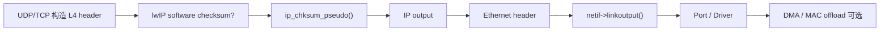
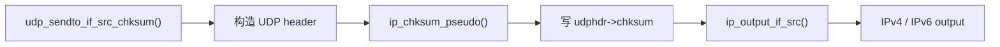
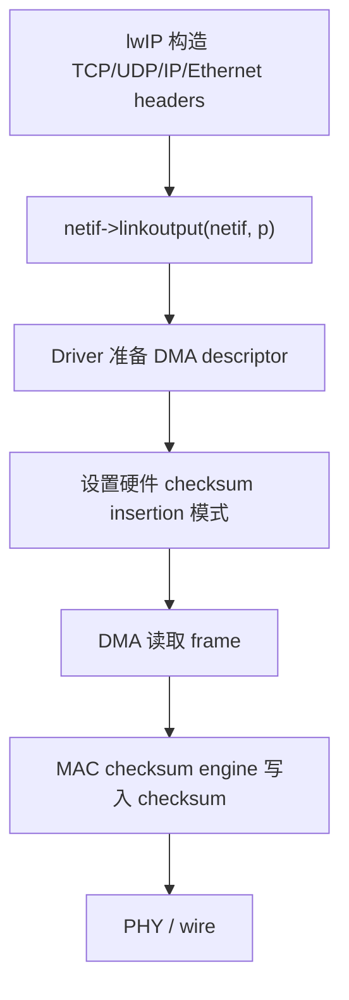
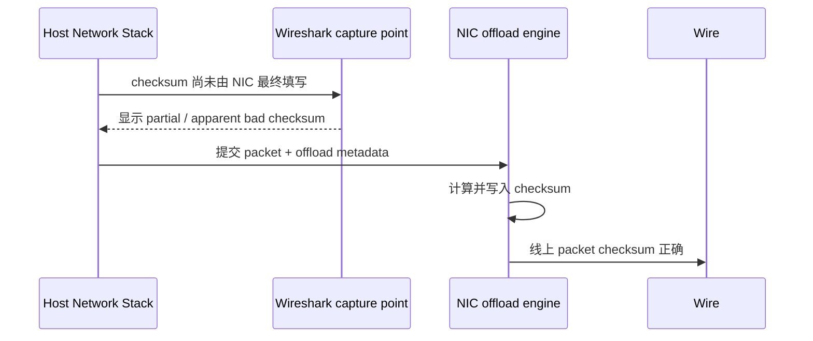
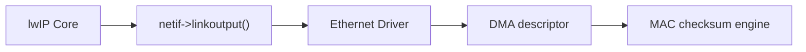

<meta name="referrer" content="no-referrer" />

# 教程 19：从 `ip_chksum_pseudo()` 到 `netif->linkoutput()`——lwIP 校验和、Checksum Offload 与驱动边界

> 摘要：沿 UDP/TCP 的真实收发路径解释 lwIP Internet checksum、pseudo header、per-netif checksum 控制，并明确软件校验和与 MAC/DMA 硬件卸载之间的驱动职责边界。

[TOC]

Stage 18 已经把一个 packet 从协议 PCB 追到 outgoing `netif`、source address、gateway/router 和 `netif->output()`。从这里继续向下，新的问题不再是“走哪张网卡”，而是：**包进入 Ethernet Driver 之前，IP/TCP/UDP/ICMP checksum 到底是谁计算的；进入 Driver 之后，硬件又能接管什么。**

当前源码基线仍为 lwIP commit `d08f4773edd0182b7910fc8f046eed82ffcd67c9`。[S1](#source-s1) 本篇继续使用 Unix TAP 作为可读的 Port 边界，但不会把 TAP 行为泛化为所有 MCU Ethernet Driver。当前 Unix `tapif` 没有 MAC/DMA checksum offload：`low_level_output()` 只是把 `pbuf` chain 拷贝到一个连续 buffer，然后 `write()` 到 TAP fd。[S2](#source-s2)

本篇只回答一条主线：



其中最重要的边界是：**`CHECKSUM_GEN_*` 关闭只代表 lwIP Core 不再生成对应软件 checksum，它不会自动配置任何 MAC、DMA descriptor 或 NIC。** 如果目标 Driver 没有真正接管，线上 packet 就会带着未完成的 checksum 离开设备。[S1](#source-s1)[S2](#source-s2)

## 1. 当前 Unix TAP 路径默认是谁算 checksum

先从配置事实开始。`src/include/lwip/opt.h` 中 `LWIP_CHECKSUM_CTRL_PER_NETIF` 默认是 `0`；`CHECKSUM_GEN_IP/UDP/TCP/ICMP/ICMP6` 与对应的 `CHECKSUM_CHECK_*` 默认都是 `1`。[S1](#source-s1)

```c
#if !defined LWIP_CHECKSUM_CTRL_PER_NETIF || defined __DOXYGEN__
#define LWIP_CHECKSUM_CTRL_PER_NETIF    0
#endif

#if !defined CHECKSUM_GEN_UDP || defined __DOXYGEN__
#define CHECKSUM_GEN_UDP                1
#endif
#if !defined CHECKSUM_GEN_TCP || defined __DOXYGEN__
#define CHECKSUM_GEN_TCP                1
#endif
#if !defined CHECKSUM_CHECK_UDP || defined __DOXYGEN__
#define CHECKSUM_CHECK_UDP              1
#endif
#if !defined CHECKSUM_CHECK_TCP || defined __DOXYGEN__
#define CHECKSUM_CHECK_TCP              1
#endif
```

因此在没有 `lwipopts.h` 覆盖时，TX 由 lwIP Core 生成常用 L3/L4 checksum，RX 也由 Core 验证。IPv4 header、ICMP/ICMPv6 对应宏同样默认启用。[S1](#source-s1)

这与当前 Unix TAP 的 Driver 行为匹配。`tapif_init()` 把 L2 发送函数绑定为 `low_level_output()`：[S2](#source-s2)

```c
err_t
tapif_init(struct netif *netif)
{
  struct tapif *tapif = (struct tapif *)mem_malloc(sizeof(struct tapif));

  if (tapif == NULL) {
    LWIP_DEBUGF(NETIF_DEBUG, ("tapif_init: out of memory for tapif\n"));
    return ERR_MEM;
  }
  netif->state = tapif;
  MIB2_INIT_NETIF(netif, snmp_ifType_other, 100000000);

  netif->name[0] = IFNAME0;
  netif->name[1] = IFNAME1;
#if LWIP_IPV4
  netif->output = etharp_output;
#endif
#if LWIP_IPV6
  netif->output_ip6 = ethip6_output;
#endif
  netif->linkoutput = low_level_output;
  netif->mtu = 1500;

  low_level_init(netif);
  return ERR_OK;
}
```

这里没有 DMA checksum insertion 或 checksum descriptor metadata。后文会回到这个 Port 边界。

## 2. 从真实 UDP 发送入口继续：checksum 在进入 IP 层前完成

Stage 5 已介绍 UDP Raw API，Stage 18 已完成 route 与 outgoing `netif`。这里从已经得到 `netif`、`src_ip`、`dst_ip` 的位置继续。

`udp_sendto_if_src()` 在默认未启用 checksum-on-copy 的路径下进入 `udp_sendto_if_src_chksum()` 的主体；该函数为 UDP header 准备空间，最终让 `q` 表示完整 UDP datagram。[S1](#source-s1)

继续阅读 `udp_sendto_if_src_chksum()` 的 header 初始化：[S1](#source-s1)

```c
  udphdr = (struct udp_hdr *)q->payload;
  udphdr->src = lwip_htons(pcb->local_port);
  udphdr->dest = lwip_htons(dst_port);
  /* in UDP, 0 checksum means 'no checksum' */
  udphdr->chksum = 0x0000;
```

这里的 `0` 首先是计算前初始值，后面的分支才决定是否跳过生成。[S1](#source-s1)[S4](#source-s4)

继续阅读同一个函数的普通 UDP checksum 分支：[S1](#source-s1)

```c
#if CHECKSUM_GEN_UDP
    IF__NETIF_CHECKSUM_ENABLED(netif, NETIF_CHECKSUM_GEN_UDP) {
      /* Checksum is mandatory over IPv6. */
      if (IP_IS_V6(dst_ip) || (pcb->flags & UDP_FLAGS_NOCHKSUM) == 0) {
        u16_t udpchksum;
#if LWIP_CHECKSUM_ON_COPY
        if (have_chksum) {
          u32_t acc;
          udpchksum = ip_chksum_pseudo_partial(q, IP_PROTO_UDP,
                                               q->tot_len, UDP_HLEN, src_ip, dst_ip);
          acc = udpchksum + (u16_t)~(chksum);
          udpchksum = FOLD_U32T(acc);
        } else
#endif
        {
          udpchksum = ip_chksum_pseudo(q, IP_PROTO_UDP, q->tot_len,
                                       src_ip, dst_ip);
        }

        if (udpchksum == 0x0000) {
          udpchksum = 0xffff;
        }
        udphdr->chksum = udpchksum;
      }
    }
#endif
```

这里有三层关键控制：compile-time `CHECKSUM_GEN_UDP`、可选的 per-netif `NETIF_CHECKSUM_GEN_UDP`，以及 IPv4 可选 zero checksum 与 IPv6 默认 mandatory checksum 的协议差异。[S1](#source-s1)[S4](#source-s4)[S5](#source-s5)

RFC 768 规定计算结果恰好为 `0x0000` 时线上写成 `0xffff`，因为全零在 IPv4 UDP 中表示发送端没有生成 checksum；当前 lwIP 代码与此直接对应。[S4](#source-s4)

## 3. `ip_chksum_pseudo()` 为什么不是只算 UDP/TCP header

`udp_sendto_if_src_chksum()` 调用的是：

```c
ip_chksum_pseudo(q, IP_PROTO_UDP, q->tot_len, src_ip, dst_ip);
```

进入 `ip_chksum_pseudo()`。它先根据 destination 的地址族选择 IPv4 或 IPv6 pseudo checksum 实现：[S1](#source-s1)

```c
u16_t
ip_chksum_pseudo(struct pbuf *p, u8_t proto, u16_t proto_len,
                 const ip_addr_t *src, const ip_addr_t *dest)
{
#if LWIP_IPV6
  if (IP_IS_V6(dest)) {
    return ip6_chksum_pseudo(p, proto, proto_len, ip_2_ip6(src), ip_2_ip6(dest));
  }
#endif
#if LWIP_IPV4 && LWIP_IPV6
  else
#endif
#if LWIP_IPV4
  {
    return inet_chksum_pseudo(p, proto, proto_len, ip_2_ip4(src), ip_2_ip4(dest));
  }
#endif
}
```

Pseudo header 不是线上 TCP/UDP packet 前面真的多出一个 header。它是 **仅参与 checksum 运算的逻辑输入**。IPv4 UDP 的 pseudo header 至少包含：source address、destination address、protocol 和 UDP length；IPv6 则使用 128-bit source/destination、upper-layer length 与 Next Header。[S4](#source-s4)[S5](#source-s5)

它的作用不是代替 IP Header checksum，而是让 TCP/UDP checksum 同时保护一部分关键 L3 端点信息。

因此必须区分：

| checksum | 实际覆盖范围 |
| --- | --- |
| IPv4 Header checksum | IPv4 header 本身 |
| TCP checksum | pseudo header + TCP header + TCP payload |
| UDP checksum | pseudo header + UDP header + UDP payload |
| ICMPv4 checksum | ICMPv4 message，不带 IPv4 pseudo header |
| ICMPv6 checksum | IPv6 pseudo header + ICMPv6 message |

IPv6 基本 header 本身没有类似 IPv4 Header checksum；RFC 8200 同时规定 UDP over IPv6 默认不能使用 zero checksum，并说明 ICMPv6 也把 IPv6 pseudo header 纳入 checksum。[S5](#source-s5)

## 4. 进入 `inet_chksum_pseudo()`：先累计地址，再遍历整个 `pbuf` chain

IPv4 路径进入 `inet_chksum_pseudo()`。函数先把 source 和 destination IPv4 address 分成 16-bit word 加到 accumulator，然后进入公共的 `inet_cksum_pseudo_base()`：[S1](#source-s1)

```c
u16_t
inet_chksum_pseudo(struct pbuf *p, u8_t proto, u16_t proto_len,
                   const ip4_addr_t *src, const ip4_addr_t *dest)
{
  u32_t acc;
  u32_t addr;

  addr = ip4_addr_get_u32(src);
  acc = (addr & 0xffffUL);
  acc = (u32_t)(acc + ((addr >> 16) & 0xffffUL));
  addr = ip4_addr_get_u32(dest);
  acc = (u32_t)(acc + (addr & 0xffffUL));
  acc = (u32_t)(acc + ((addr >> 16) & 0xffffUL));
  acc = FOLD_U32T(acc);
  acc = FOLD_U32T(acc);

  return inet_cksum_pseudo_base(p, proto, proto_len, acc);
}
```

进入 `inet_cksum_pseudo_base()`。这里是理解 `pbuf chain` 与 checksum 关系的关键位置：[S1](#source-s1)

```c
static u16_t
inet_cksum_pseudo_base(struct pbuf *p, u8_t proto, u16_t proto_len, u32_t acc)
{
  struct pbuf *q;
  int swapped = 0;

  for (q = p; q != NULL; q = q->next) {
    acc += LWIP_CHKSUM(q->payload, q->len);
    acc = FOLD_U32T(acc);
    if (q->len % 2 != 0) {
      swapped = !swapped;
      acc = SWAP_BYTES_IN_WORD(acc);
    }
  }

  if (swapped) {
    acc = SWAP_BYTES_IN_WORD(acc);
  }

  acc += (u32_t)lwip_htons((u16_t)proto);
  acc += (u32_t)lwip_htons(proto_len);

  acc = FOLD_U32T(acc);
  acc = FOLD_U32T(acc);
  return (u16_t)~(acc & 0xffffUL);
}
```

这个循环说明 checksum 并不要求 UDP/TCP packet 物理上是一块连续内存。Stage 3 的：

```text
pbuf A -> pbuf B -> pbuf C
```

可以直接作为一个逻辑 datagram/segment 被累计。

真正需要处理的是 **奇数字节边界**。Internet checksum 把连续字节按 16 bit 成对解释；若某个 `pbuf` 恰好以奇数字节结束，下一个 `pbuf` 的首字节在逻辑报文里仍要与前一个尾字节配成同一个 16-bit word。所以当前实现通过 `swapped` 和 `SWAP_BYTES_IN_WORD()` 保持跨 `pbuf` 边界的字节配对关系。[S1](#source-s1)[S3](#source-s3)

RFC 1071 描述的基础算法就是 16-bit one's-complement addition，并要求 end-around carry；lwIP 的 `FOLD_U32T()` 正是在累计过程中把高位 carry 折回低 16 bit。[S3](#source-s3)

## 5. 从 `ip_chksum_pseudo()` 返回 UDP：checksum 完成后才进入 IP 输出

`ip_chksum_pseudo()` 返回后，`udp_sendto_if_src_chksum()` 把结果写入 `udphdr->chksum`，然后继续走本来就存在的 IP 输出链：[S1](#source-s1)

```c
  NETIF_SET_HINTS(netif, &(pcb->netif_hints));
  err = ip_output_if_src(q, src_ip, dst_ip, ttl, pcb->tos, ip_proto, netif);
  NETIF_RESET_HINTS(netif);
```

因此当前默认 UDP TX 顺序是：



L4 checksum 在 IP header 构造之前已经可以完成，是因为 pseudo header 所需的 source/destination/protocol/length 已经由上层参数确定，并不需要先把真实 IP header 放入 `pbuf`。

## 6. IPv4 Header checksum 是另一条独立路径

若 destination 是 IPv4，`ip_output_if_src()` 最终进入 `ip4_output_if()` 系列。继续阅读 IPv4 header 构造中的 checksum 分支：[S1](#source-s1)

```c
#if CHECKSUM_GEN_IP_INLINE
    chk_sum += ip4_addr_get_u32(&iphdr->src) & 0xFFFF;
    chk_sum += ip4_addr_get_u32(&iphdr->src) >> 16;
    chk_sum = (chk_sum >> 16) + (chk_sum & 0xFFFF);
    chk_sum = (chk_sum >> 16) + chk_sum;
    chk_sum = ~chk_sum;
    IF__NETIF_CHECKSUM_ENABLED(netif, NETIF_CHECKSUM_GEN_IP) {
      iphdr->_chksum = (u16_t)chk_sum;
    }
#if LWIP_CHECKSUM_CTRL_PER_NETIF
    else {
      IPH_CHKSUM_SET(iphdr, 0);
    }
#endif
#else
    IPH_CHKSUM_SET(iphdr, 0);
#if CHECKSUM_GEN_IP
    IF__NETIF_CHECKSUM_ENABLED(netif, NETIF_CHECKSUM_GEN_IP) {
      IPH_CHKSUM_SET(iphdr, inet_chksum(iphdr, ip_hlen));
    }
#endif
#endif
```

这条路径只处理 **IPv4 header checksum**。它不会替代已经在 UDP/TCP 层生成的 transport checksum。

因此一个 IPv4 UDP packet 在 software checksum 全开的情况下至少发生两次不同的 checksum 计算：

```text
UDP layer:
pseudo header + UDP header + payload

IPv4 layer:
IPv4 header only
```

IPv6 不存在第二项 IPv6 base-header checksum，所以 IPv6 数据面更依赖 TCP/UDP/ICMPv6 自身的 end-to-end checksum。[S5](#source-s5)

## 7. TCP TX 使用相同 pseudo-header 机制，但还要处理重传与 checksum-on-copy

TCP 发送最终在 `tcp_output_segment()` 中把 segment 送入 IP 层。进入该函数准备 checksum 的位置，代码先把 TCP checksum 字段清零：[S1](#source-s1)

```c
  seg->p->payload = seg->tcphdr;

  seg->tcphdr->chksum = 0;

#ifdef LWIP_HOOK_TCP_OUT_ADD_TCPOPTS
  opts = LWIP_HOOK_TCP_OUT_ADD_TCPOPTS(seg->p, seg->tcphdr, pcb, opts);
#endif
```

继续阅读 `tcp_output_segment()` 的 checksum 分支：[S1](#source-s1)

```c
#if CHECKSUM_GEN_TCP
  IF__NETIF_CHECKSUM_ENABLED(netif, NETIF_CHECKSUM_GEN_TCP) {
#if TCP_CHECKSUM_ON_COPY
    u32_t acc;
    if ((seg->flags & TF_SEG_DATA_CHECKSUMMED) == 0) {
      LWIP_ASSERT("data included but not checksummed",
                  seg->p->tot_len == TCPH_HDRLEN_BYTES(seg->tcphdr));
    }

    acc = ip_chksum_pseudo_partial(seg->p, IP_PROTO_TCP,
                                   seg->p->tot_len, TCPH_HDRLEN_BYTES(seg->tcphdr), &pcb->local_ip, &pcb->remote_ip);
    if (seg->chksum_swapped) {
      seg_chksum_was_swapped = 1;
      seg->chksum = SWAP_BYTES_IN_WORD(seg->chksum);
      seg->chksum_swapped = 0;
    }
    acc = (u16_t)~acc + seg->chksum;
    seg->tcphdr->chksum = (u16_t)~FOLD_U32T(acc);
#else
    seg->tcphdr->chksum = ip_chksum_pseudo(seg->p, IP_PROTO_TCP,
                                           seg->p->tot_len, &pcb->local_ip, &pcb->remote_ip);
#endif
  }
#endif
```

默认 `LWIP_CHECKSUM_ON_COPY` 是 `0`，因此普通路径直接对完整 `pbuf chain` 调用 `ip_chksum_pseudo()`。[S1](#source-s1)

若项目启用 `LWIP_CHECKSUM_ON_COPY=1`，payload 在从 application buffer 拷进 `pbuf` 时就可以同步累计 checksum，最终发送只需要重新计算会变化的 TCP header/pseudo-header 部分，再合并之前保存的 payload checksum。这是 **software optimization**，不是 hardware offload。[S1](#source-s1)

两者不要混淆：

| 机制 | 谁计算 | 什么时候计算 |
| --- | --- | --- |
| 普通 software checksum | CPU / lwIP | packet 发送前完整遍历 |
| `LWIP_CHECKSUM_ON_COPY` | CPU / lwIP | copy payload 时先累计一部分 |
| Hardware checksum offload | MAC/NIC/DMA engine | Driver 提交 descriptor 后、真正上线前 |

## 8. TX checksum 完成后，Core 最终只把 `pbuf` 交给 `linkoutput`

Stage 4 已经讲过 ARP，Stage 15 已经讲过 ND6。无论 IPv4 最终经 `etharp_output()`，还是 IPv6 经 `ethip6_output()`，解析出 destination MAC 后都会进入 `ethernet_output()`。

进入 `ethernet_output()`。它增加 Ethernet header，填写 EtherType、source MAC 和 destination MAC，然后只有一个真正的发送调用：[S1](#source-s1)

```c
err_t
ethernet_output(struct netif * netif, struct pbuf * p,
                const struct eth_addr * src, const struct eth_addr * dst,
                u16_t eth_type) {
  struct eth_hdr *ethhdr;
  u16_t eth_type_be = lwip_htons(eth_type);

  if (pbuf_add_header(p, SIZEOF_ETH_HDR) != 0) {
    goto pbuf_header_failed;
  }

  LWIP_ASSERT_CORE_LOCKED();

  ethhdr = (struct eth_hdr *)p->payload;
  ethhdr->type = eth_type_be;
  SMEMCPY(&ethhdr->dest, dst, ETH_HWADDR_LEN);
  SMEMCPY(&ethhdr->src,  src, ETH_HWADDR_LEN);

  LWIP_ASSERT("netif->hwaddr_len must be 6 for ethernet_output!",
              (netif->hwaddr_len == ETH_HWADDR_LEN));

  return netif->linkoutput(netif, p);

pbuf_header_failed:
  LINK_STATS_INC(link.lenerr);
  return ERR_BUF;
}
```

这一接口非常值得注意：

```c
netif->linkoutput(netif, p)
```

参数只有 `netif` 和 `pbuf`。当前通用 `struct pbuf` flags 里也没有一个标准化的“这个 packet 需要硬件从 offset X 计算 TCP checksum，并写到 offset Y”的 metadata。[S1](#source-s1)

所以 **lwIP Core 的 per-netif checksum 开关只负责决定 Core 自己算不算，不构成一个完整的通用硬件 descriptor 协议。** 真正的硬件 offload 对接仍由具体 Port/Driver 决定。

## 9. 当前 Unix `tapif` 为什么没有 hardware checksum offload

回到 `tapif_init()` 绑定的 `low_level_output()`。当前实现把整个 `pbuf chain` copy 到栈上的 `buf[1518]`，然后直接写入 TAP fd：[S2](#source-s2)

```c
static err_t
low_level_output(struct netif *netif, struct pbuf *p)
{
  struct tapif *tapif = (struct tapif *)netif->state;
  char buf[1518];
  ssize_t written;

  if (p->tot_len > sizeof(buf)) {
    MIB2_STATS_NETIF_INC(netif, ifoutdiscards);
    perror("tapif: packet too large");
    return ERR_IF;
  }

  pbuf_copy_partial(p, buf, p->tot_len, 0);

  written = write(tapif->fd, buf, p->tot_len);
  if (written < p->tot_len) {
    MIB2_STATS_NETIF_INC(netif, ifoutdiscards);
    perror("tapif: write");
    return ERR_IF;
  } else {
    MIB2_STATS_NETIF_ADD(netif, ifoutoctets, (u32_t)written);
    return ERR_OK;
  }
}
```

这里没有：

- DMA TX descriptor；
- checksum insertion bit；
- checksum start offset；
- checksum field offset；
- protocol-specific hardware command。

因此当前实验路径的正确模型是：

```text
lwIP Core
  先生成正确 L3/L4 checksum
        ↓
etif->linkoutput()
        ↓
tapif low_level_output()
        ↓
pbuf_copy_partial()
        ↓
write(TAP fd)
```

如果仅仅把 `CHECKSUM_GEN_UDP/TCP/IP` 关掉，却不改变 `tapif`，得到的不是“开启硬件 offload”，而是 **直接把未由软件完成的 checksum 字段交给 TAP**。

## 10. `LWIP_CHECKSUM_CTRL_PER_NETIF` 解决的是“不同网卡能力不同”

Stage 18 引入 multi-netif 后，一个现实问题出现：

```text
netif0 = MCU Ethernet MAC
         支持部分 checksum offload

netif1 = software/tunnel/TAP
         没有 checksum offload
```

如果只靠全局：

```c
#define CHECKSUM_GEN_TCP 0
```

两张网卡都会失去 lwIP software TCP checksum。这不适合能力不同的接口。

于是 `LWIP_CHECKSUM_CTRL_PER_NETIF` 提供 runtime `netif` 粒度控制。`netif.h` 定义了每种生成/校验 bit：[S1](#source-s1)

```c
#if LWIP_CHECKSUM_CTRL_PER_NETIF
#define NETIF_CHECKSUM_GEN_IP       0x0001
#define NETIF_CHECKSUM_GEN_UDP      0x0002
#define NETIF_CHECKSUM_GEN_TCP      0x0004
#define NETIF_CHECKSUM_GEN_ICMP     0x0008
#define NETIF_CHECKSUM_GEN_ICMP6    0x0010
#define NETIF_CHECKSUM_CHECK_IP     0x0100
#define NETIF_CHECKSUM_CHECK_UDP    0x0200
#define NETIF_CHECKSUM_CHECK_TCP    0x0400
#define NETIF_CHECKSUM_CHECK_ICMP   0x0800
#define NETIF_CHECKSUM_CHECK_ICMP6  0x1000
#define NETIF_CHECKSUM_ENABLE_ALL   0xFFFF
#define NETIF_CHECKSUM_DISABLE_ALL  0x0000
#endif
```

`struct netif` 在该配置打开后才真正拥有 `chksum_flags`：[S1](#source-s1)

```c
#if LWIP_CHECKSUM_CTRL_PER_NETIF
  u16_t chksum_flags;
#endif
```

而 `netif_add()` 初始化接口时默认把这些 bit 全部打开：[S1](#source-s1)

```c
  NETIF_SET_CHECKSUM_CTRL(netif, NETIF_CHECKSUM_ENABLE_ALL);
  netif->mtu = 0;
  netif->flags = 0;
```

这表示：**开启 per-netif 功能并不会自动关闭软件 checksum。** Driver 或 board port 必须根据硬件实际能力主动修改 `chksum_flags`。

## 11. `IF__NETIF_CHECKSUM_ENABLED()` 如何把 compile-time 与 runtime 两层合起来

真正控制每个 checksum call site 的宏是：[S1](#source-s1)

```c
#if LWIP_CHECKSUM_CTRL_PER_NETIF
#define NETIF_SET_CHECKSUM_CTRL(netif, chksumflags) do { \
  (netif)->chksum_flags = chksumflags; } while(0)
#define NETIF_CHECKSUM_ENABLED(netif, chksumflag) (((netif) == NULL) || (((netif)->chksum_flags & (chksumflag)) != 0))
#define IF__NETIF_CHECKSUM_ENABLED(netif, chksumflag) if NETIF_CHECKSUM_ENABLED(netif, chksumflag)
#else
#define NETIF_CHECKSUM_ENABLED(netif, chksumflag) 0
#define NETIF_SET_CHECKSUM_CTRL(netif, chksumflags)
#define IF__NETIF_CHECKSUM_ENABLED(netif, chksumflag)
#endif
```

它产生两种不同编译结果。

### per-netif 关闭

例如：

```c
#if CHECKSUM_GEN_TCP
  IF__NETIF_CHECKSUM_ENABLED(netif, NETIF_CHECKSUM_GEN_TCP) {
    seg->tcphdr->chksum = ip_chksum_pseudo(...);
  }
#endif
```

当 `LWIP_CHECKSUM_CTRL_PER_NETIF=0` 时，`IF__NETIF_CHECKSUM_ENABLED()` 展开为空，所以只要 `CHECKSUM_GEN_TCP=1`，内部 block 就无条件执行。

### per-netif 开启

当 `LWIP_CHECKSUM_CTRL_PER_NETIF=1` 时，它真正展开成 `if (...)`，同一个 Core binary 才能对不同 `netif` 采用不同策略。

`opt.h` 还明确要求：启用 per-netif 控制时，相应 `CHECKSUM_GEN_*` / `CHECKSUM_CHECK_*` compile-time 选项本身必须保持启用，否则那段代码已经被预处理器整个裁掉，runtime bit 没有机会重新打开。[S1](#source-s1)

## 12. 一个典型的“部分硬件 offload”配置应该怎样理解

下面不是当前 Unix Port 的上游代码，而是 **Driver 集成示意**。假设某 MCU Ethernet MAC 只负责 TCP/UDP TX checksum 和 TCP/UDP RX verify，但 IPv4 header checksum、ICMP/ICMPv6 仍让 lwIP 软件处理。

首先保留对应 Core 代码，并打开 per-netif 控制：

```c
#define LWIP_CHECKSUM_CTRL_PER_NETIF 1

#define CHECKSUM_GEN_IP      1
#define CHECKSUM_GEN_UDP     1
#define CHECKSUM_GEN_TCP     1
#define CHECKSUM_GEN_ICMP    1
#define CHECKSUM_GEN_ICMP6   1

#define CHECKSUM_CHECK_IP    1
#define CHECKSUM_CHECK_UDP   1
#define CHECKSUM_CHECK_TCP   1
#define CHECKSUM_CHECK_ICMP  1
#define CHECKSUM_CHECK_ICMP6 1
```

随后在该硬件 `netif` 初始化完成时，才根据真实能力关闭 lwIP 的对应 software bit。示意代码如下：

```c
u16_t checksum_flags;

checksum_flags = NETIF_CHECKSUM_ENABLE_ALL;
checksum_flags &= (u16_t)~NETIF_CHECKSUM_GEN_UDP;
checksum_flags &= (u16_t)~NETIF_CHECKSUM_GEN_TCP;
checksum_flags &= (u16_t)~NETIF_CHECKSUM_CHECK_UDP;
checksum_flags &= (u16_t)~NETIF_CHECKSUM_CHECK_TCP;
NETIF_SET_CHECKSUM_CTRL(netif, checksum_flags);
```

此时只建立了一个 **Core contract**：

```text
lwIP:
我不再替这张 netif 生成/验证 TCP、UDP checksum
```

还差另一半：

```text
Driver:
我必须让 MAC/DMA 真正完成这些工作
```

前者不能替代后者。

## 13. TX hardware offload 真正发生在 lwIP Core 之后

典型 MCU Ethernet TX 可以抽象成：



图中 `C～F` 不属于 lwIP Core 的通用实现。不同 MCU/SoC 可能要求：

- Driver 设置 descriptor bit；
- Driver 指定 L3/L4 类型；
- Driver 指定 checksum 起始位置；
- Driver 只支持 IPv4 TCP/UDP，不支持 ICMP；
- Driver 对 IPv6 extension header 有额外限制；
- hardware 完全不支持 chained buffer，Driver 必须先线性化。

这些都是芯片/Driver 契约，不能从 `CHECKSUM_GEN_TCP=0` 推导出来。

这也是为什么当前通用 `netif->linkoutput(netif, p)` 只能视为 **Port ownership boundary**：Core 把最终 L2 frame 交出去，具体怎样映射成 DMA descriptor 由 Port 决定。[S1](#source-s1)[S2](#source-s2)

## 14. RX 方向先看 IPv4 Header checksum

接收路径反过来。Driver 构造 `pbuf` 后，经 `netif->input()` 进入 `ethernet_input()`，再进入 `ip4_input()`。

继续阅读 `ip4_input()` 的 IPv4 header verify：[S1](#source-s1)

```c
#if CHECKSUM_CHECK_IP
  IF__NETIF_CHECKSUM_ENABLED(inp, NETIF_CHECKSUM_CHECK_IP) {
    if (inet_chksum(iphdr, iphdr_hlen) != 0) {

      LWIP_DEBUGF(IP_DEBUG | LWIP_DBG_LEVEL_SERIOUS,
                  ("Checksum (0x%"X16_F") failed, IP packet dropped.\n", inet_chksum(iphdr, iphdr_hlen)));
      ip4_debug_print(p);
      pbuf_free(p);
      IP_STATS_INC(ip.chkerr);
      IP_STATS_INC(ip.drop);
      MIB2_STATS_INC(mib2.ipinhdrerrors);
      return ERR_OK;
    }
  }
#endif
```

若软件验证启用，坏 IPv4 header 在进入 UDP/TCP 之前就被丢弃。

若某硬件已经可靠验证 IPv4 header checksum，并且 Port 为这张 `netif` 关闭 `NETIF_CHECKSUM_CHECK_IP`，Core 就跳过这一步。

## 15. 进入 `udp_input()`：IPv4 zero checksum 与真正的 checksum error 不相同

UDP RX 进入 `udp_input()` 后，只有 packet 确认是本机接收对象，才进入 checksum verify。继续阅读该分支：[S1](#source-s1)

```c
#if CHECKSUM_CHECK_UDP
    IF__NETIF_CHECKSUM_ENABLED(inp, NETIF_CHECKSUM_CHECK_UDP) {
#if LWIP_UDPLITE
      if (ip_current_header_proto() == IP_PROTO_UDPLITE) {
        u16_t chklen = lwip_ntohs(udphdr->len);
        if (chklen < sizeof(struct udp_hdr)) {
          if (chklen == 0) {
            chklen = p->tot_len;
          } else {
            goto chkerr;
          }
        }
        if (ip_chksum_pseudo_partial(p, IP_PROTO_UDPLITE,
                                     p->tot_len, chklen,
                                     ip_current_src_addr(), ip_current_dest_addr()) != 0) {
          goto chkerr;
        }
      } else
#endif
      {
        if (udphdr->chksum != 0) {
          if (ip_chksum_pseudo(p, IP_PROTO_UDP, p->tot_len,
                               ip_current_src_addr(),
                               ip_current_dest_addr()) != 0) {
            goto chkerr;
          }
        }
      }
    }
#endif
```

在普通 IPv4 UDP 中：

```text
udphdr->chksum == 0
```

表示发送端没有提供 checksum，不等于“checksum 算出来恰好是 0”。后者在线上要编码成 `0xffff`。[S4](#source-s4)

IPv6 默认规则不同：zero UDP checksum 不能作为普通数据报的默认合法形式。[S5](#source-s5)

## 16. 进入 `tcp_input()`：软件 RX verify 失败后不会继续状态机

TCP RX 的对应逻辑在 `tcp_input()`。函数在解析 TCP header length、查 PCB、推进状态机之前先验证 checksum：[S1](#source-s1)

```c
#if CHECKSUM_CHECK_TCP
  IF__NETIF_CHECKSUM_ENABLED(inp, NETIF_CHECKSUM_CHECK_TCP) {
    u16_t chksum = ip_chksum_pseudo(p, IP_PROTO_TCP, p->tot_len,
                                    ip_current_src_addr(), ip_current_dest_addr());
    if (chksum != 0) {
      LWIP_DEBUGF(TCP_INPUT_DEBUG, ("tcp_input: packet discarded due to failing checksum 0x%04"X16_F"\n",
                                    chksum));
      tcp_debug_print(tcphdr);
      TCP_STATS_INC(tcp.chkerr);
      goto dropped;
    }
  }
#endif
```

所以 software checksum 验证属于 TCP 状态机之前的输入完整性门槛。坏 checksum packet 不会继续进入 `tcp_process()`、ACK handling 或 receive queue。

这也意味着，如果关闭 `NETIF_CHECKSUM_CHECK_TCP`：

> Core 不再对这一张 `netif` 的 TCP packet 做第二次软件确认。

因此 Driver/硬件接管不能只是“硬件有 checksum 状态位”，还必须把这个状态可靠地转成 Port 的接收策略。

## 17. lwIP 当前 `pbuf` 没有通用的 RX checksum-valid 状态

查看当前 `pbuf.h`，通用 flags 包括 `PBUF_FLAG_PUSH`、`PBUF_FLAG_IS_CUSTOM`、multicast/broadcast 以及 TCP FIN 等，但没有类似 Linux `skb->ip_summed` 的标准 per-packet checksum-valid metadata。[S1](#source-s1)

因此在当前通用接口中：

```text
硬件 RX checksum result
        ↓
Driver 自己解释 descriptor status
        ↓
Driver 决定 packet 是否可交给 lwIP
        ↓
若 NETIF_CHECKSUM_CHECK_* 已关闭
Core 不再重算
```

这不是说所有 Driver 都必须采用“坏包在 Driver 直接 drop”这一种策略，而是说：**一旦关闭 Core software verify，就必须由 Port 自己定义并保证等价的错误处理契约。** lwIP 通用 `pbuf` 不会替 Driver 保存一个跨平台统一的硬件校验结果。

Linux 的 `sk_buff` 有自己的一套 `ip_summed`/`CHECKSUM_PARTIAL` 等 offload contract，但那是 Linux network stack 与 Linux driver 之间的接口，不能直接套成 lwIP `pbuf` 语义。[S7](#source-s7)

## 18. 为什么“打开硬件 offload”通常同时涉及 TX 与 RX 两套配置

硬件的 TX generation 与 RX verification 是两套能力。芯片只声明“支持 checksum offload”并不等于所有 `GEN_*` 与 `CHECK_*` 都可关闭；每一个 bit 都应由实际 MAC/DMA capability 和 Driver descriptor/status 处理支撑。

## 19. Ethernet FCS 不是这里的 Internet checksum

Stage 0 已经从 Ethernet physical/frame 边界介绍过 FCS。到 Stage 19 必须重新做一次最小消歧，因为“网卡硬件校验”很容易把两类机制混在一起。

| 对象 | 所在层 | 典型算法 | lwIP `pbuf` 是否通常携带 |
| --- | --- | --- | --- |
| IPv4 Header checksum | L3 | one's-complement | 是，位于 IPv4 header |
| TCP/UDP checksum | L4 | pseudo header + one's-complement | 是，位于 TCP/UDP header |
| ICMP/ICMPv6 checksum | L3 control / upper-layer | Internet checksum | 是 |
| Ethernet FCS | L2 frame trailer | CRC-32 | 通常不作为 lwIP Ethernet `pbuf` 内容 |

当前 Unix `tapif.c` 自己已经给出一个很直观的边界提示：它的 `buf[1518]` 注释写的是 `excluding CRC`。[S2](#source-s2)

也就是说当前 `netif->linkoutput()` 看到的是 Ethernet header + payload，但 Ethernet FCS 仍不属于这条 lwIP Core checksum 主线。

因此：

```text
关闭 TCP checksum software generation
```

和：

```text
让 MAC 自动生成 Ethernet FCS
```

是两件不同的事。

## 20. Wireshark 为什么会把本机 TX packet 标成 bad checksum

这部分属于 Host/NIC 行为，不是当前 TAP Port 的 lwIP Core 行为。

Wireshark 官方文档说明，在操作系统使用 TX checksum offload 时，抓包点可能位于 NIC 真正填入 checksum **之前**。于是抓到的本机 outgoing packet 里 checksum 字段仍是未完成值，Wireshark 会显示 incorrect/partial，但实际线上的 NIC 已经在发送前补好。[S6](#source-s6)

Linux kernel 的 checksum-offload 文档也明确把 TX offload 定义成 stack 请求 device 在指定 checksum start/offset 上完成 one's-complement checksum；Driver/NIC 负责兑现该请求。[S7](#source-s7)

典型关系是：



但 **当前 lwIP Unix TAP 实验不能直接用这个理由解释 bad checksum**。当前路径是：

```text
lwIP software checksum
→ tapif copy
→ write(TAP)
```

`tapif` 没有一个后置 NIC checksum engine 帮它补字段。因此若直接在 `lwip0`/TAP 路径抓到 UDP/TCP checksum 错误，首先应该检查 lwIP 配置、packet 构造和 Port 修改，而不是先假设“这是 offload 假象”。[S1](#source-s1)[S2](#source-s2)

只有抓包位置已经进入 Linux 主机自己的真实物理 NIC TX 路径时，才需要把 Linux/NIC offload 作为解释因素之一。[S6](#source-s6)[S7](#source-s7)

## 21. 在当前 TAP 实验里观察 checksum，证据应该怎样对应源码

当前实验不需要先修改 Driver。只要已有 TAP/Ping/UDP/TCP 路径能运行，就可以在 Host 侧抓当前 TAP frame：

```bash
sudo tcpdump -i lwip0 -nn -vv -s 0 -w captures/checksum-stage19.pcap
```

随后触发已有 UDP 或 TCP traffic，再用 Wireshark 查看：

```text
IPv4 Header checksum
UDP/TCP checksum
source/destination IP
source/destination port
```

观察结果应与源码位置一一对应：

| PCAP 字段 | lwIP 生成/验证位置 |
| --- | --- |
| IPv4 Header Checksum | `ip4_output_if()` / `ip4_input()` |
| UDP Checksum | `udp_sendto_if_src_chksum()` / `udp_input()` |
| TCP Checksum | `tcp_output_segment()` / `tcp_input()` |
| Ethernet FCS | 不属于当前 TAP `pbuf` 内容 |

如果 `LWIP_CHECKSUM_CTRL_PER_NETIF=0` 且 `CHECKSUM_GEN_*` 仍保持默认 `1`，当前 TAP packet 应在 `write()` 之前已经具备由 lwIP 完成的 checksum。[S1](#source-s1)[S2](#source-s2)

本篇不声称已经执行上述抓包；命令只是复用 Stage 2/4 已经建立的 TAP 抓包方法，把 PCAP 字段重新连接到 checksum 源码位置。

## 22. 一个真正的 MCU Driver 接入时，职责应怎样分层

把前面的边界压缩成四层即可：lwIP Core 根据 checksum option 决定是否做软件工作；`netif->linkoutput()`/RX glue 把 `pbuf` 交给 Port；Driver 把 frame 映射为 DMA descriptor 并解释 RX status；MAC/DMA engine 最终执行硬件生成或验证。



任何一层都不能靠另一层的宏自动替代。

## 23. 两种典型错误可以从边界直接推导

最危险的组合是“Core 已关闭软件 checksum，但 Driver 没有真正配置硬件”，这会直接把未完成 checksum 的 packet 送出。另一类错误是硬件只验证 TCP/UDP，却把 IP/ICMP/ICMPv6 的 Core verify 也一并关闭。

因此排查顺序应先问 ownership：这个 checksum 本来应由谁生成/验证，Core 是否执行，per-netif bit 是否允许，Driver 是否真正设置硬件，以及抓包点位于 offload 前还是线上之后。

## 24. 从 Stage 18 到 Stage 19，packet 的完整路径已经延伸到 Driver 边界

Stage 19 把 Stage 18 的 `route → netif → next hop` 继续延伸到 `software checksum → ethernet_output() → linkoutput → Driver/MAC`。由此可以明确区分：`ip_chksum_pseudo*()` 是 lwIP software checksum；`LWIP_CHECKSUM_ON_COPY` 是 CPU copy/checksum 合并优化；MAC/DMA checksum offload 则属于 Port/Driver 与硬件的契约。

核心判断是：**lwIP checksum option 描述 Core 是否执行软件工作，不描述某块具体 Ethernet MAC 的能力，也不替 Driver 配置硬件。** 下一阶段自然进入 `pbuf`、DMA descriptor、zero-copy 与 TX/RX ring ownership。

## 资料来源

<a id="source-s1"></a>
### [S1] lwIP Core checksum、协议输入输出与 netif 源码
- 类型：目标版本上游源码
- 版本：commit `d08f4773edd0182b7910fc8f046eed82ffcd67c9`
- 定位：`src/core/inet_chksum.c`；`src/core/udp.c`；`src/core/tcp_in.c`；`src/core/tcp_out.c`；`src/core/ipv4/ip4.c`；`src/core/ipv4/icmp.c`；`src/core/ipv6/icmp6.c`；`src/core/pbuf.c`；`src/core/netif.c`；`src/netif/ethernet.c`；`src/include/lwip/opt.h`、`netif.h`、`pbuf.h`
- URL/文档：[lwIP upstream commit](https://github.com/lwip-tcpip/lwip/tree/d08f4773edd0182b7910fc8f046eed82ffcd67c9)
- 使用位置：UDP/TCP TX/RX、pseudo-header、IPv4 header checksum、per-netif checksum control、`linkoutput` 边界
- 支撑内容：证明软件 checksum 的真实调用点、`pbuf chain` 累计方式、compile-time/runtime 控制以及 Core 到 Driver 的函数边界

<a id="source-s2"></a>
### [S2] lwIP Unix TAP Port 与通用 Ethernet Driver 模板
- 类型：目标版本上游 Port/示例
- 版本：commit `d08f4773edd0182b7910fc8f046eed82ffcd67c9`
- 定位：`contrib/ports/unix/port/netif/tapif.c`：`tapif_init()`、`low_level_output()`、`low_level_input()`；`contrib/examples/ethernetif/ethernetif.c`
- URL/文档：[lwIP Unix Port](https://github.com/lwip-tcpip/lwip/tree/d08f4773edd0182b7910fc8f046eed82ffcd67c9/contrib/ports/unix)
- 使用位置：“当前 Unix TAP”“Driver boundary”“FCS 边界”“MCU Driver 对照”
- 支撑内容：证明 TAP TX 只是 pbuf copy + fd write，以及通用 Ethernet Port 由 `linkoutput` 接管真实硬件发送

<a id="source-s3"></a>
### [S3] RFC 1071：Internet Checksum 算法
- 类型：IETF 技术文档
- 版本：RFC 1071，September 1988
- URL/文档：[RFC 1071 - Computing the Internet Checksum](https://www.rfc-editor.org/rfc/rfc1071.html)
- 使用位置：“pbuf chain checksum”“one's-complement / fold”
- 支撑内容：说明 16-bit one's-complement sum、end-around carry 以及 checksum 实现的基础性质

<a id="source-s4"></a>
### [S4] RFC 768：UDP checksum 与 IPv4 zero-checksum 语义
- 类型：IETF 标准
- 版本：RFC 768，August 1980
- URL/文档：[RFC 768 - User Datagram Protocol](https://www.rfc-editor.org/rfc/rfc768.html)
- 使用位置：“UDP TX”“pseudo header”“UDP RX”
- 支撑内容：定义 UDP pseudo header、computed-zero 写成 all ones，以及 transmitted zero 表示未生成 checksum

<a id="source-s5"></a>
### [S5] RFC 8200：IPv6 Upper-Layer Checksum
- 类型：IETF Internet Standard
- 版本：RFC 8200，July 2017
- URL/文档：[RFC 8200 - Internet Protocol, Version 6 (IPv6) Specification](https://www.rfc-editor.org/rfc/rfc8200.html)
- 使用位置：“IPv6 UDP mandatory checksum”“IPv6 pseudo header”“ICMPv6”
- 支撑内容：说明 IPv6 upper-layer pseudo header、普通 UDP over IPv6 checksum 默认必需，以及 ICMPv6 checksum 使用 pseudo header

<a id="source-s6"></a>
### [S6] Wireshark Checksum Offload 抓包说明
- 类型：官方工具文档
- 版本：访问日期 2026-10-02
- URL/文档：[Wireshark CaptureSetup - Offloading](https://wiki.wireshark.org/CaptureSetup/Offloading)
- 使用位置：“Wireshark 为什么显示 bad checksum”
- 支撑内容：说明本机 TX 抓包点可能位于 NIC checksum completion 之前，因此会出现 apparent/partial checksum

<a id="source-s7"></a>
### [S7] Linux Kernel Checksum Offload 接口
- 类型：官方内核文档
- 版本：访问日期 2026-10-02
- URL/文档：[Linux Kernel - Checksum Offloads](https://docs.kernel.org/networking/checksum-offloads.html)
- 使用位置：“Host/NIC offload 对照”“TX/RX Driver contract”
- 支撑内容：说明 Linux stack 与 NIC/Driver 之间的 checksum offload metadata 与职责，用于和 lwIP 的 `pbuf`/`linkoutput` 边界做对照
