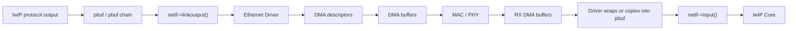
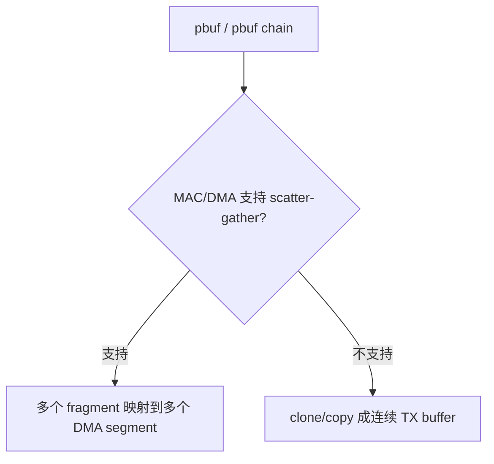
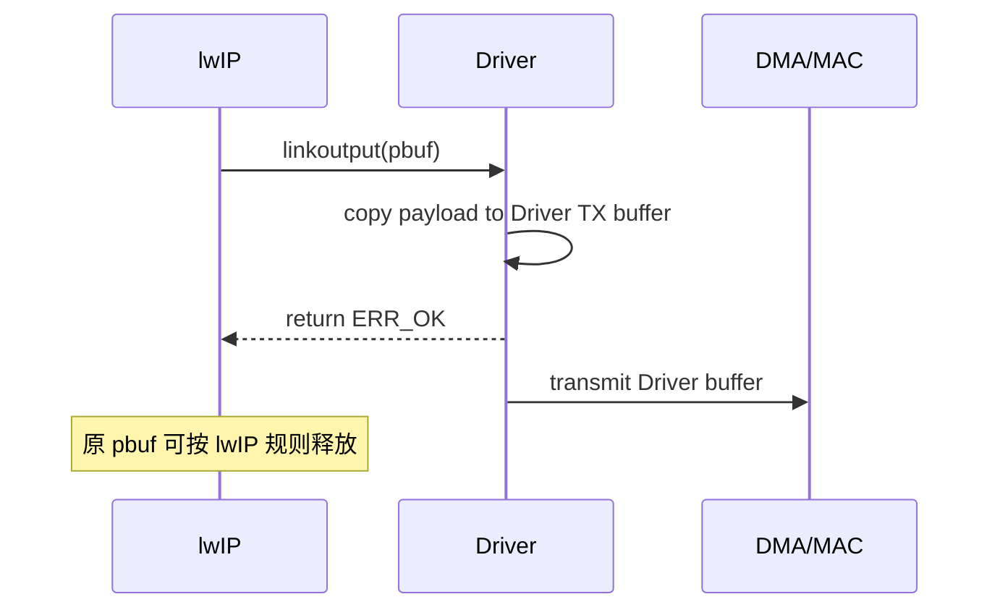
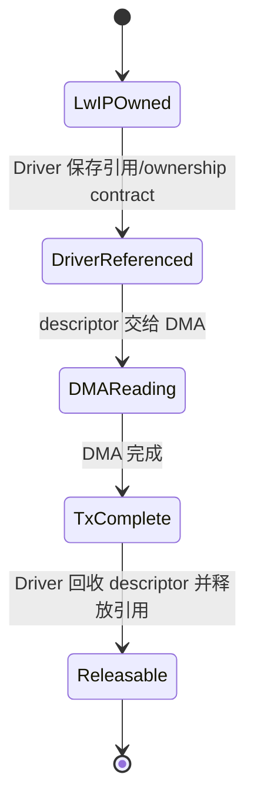
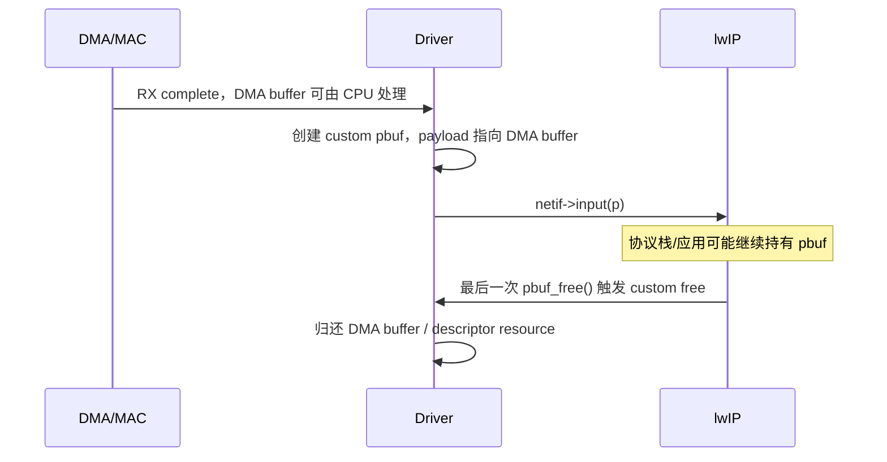

<meta name="referrer" content="no-referrer" />

# 教程 20：从 `netif->linkoutput()` 到 `pbuf_custom`——Ethernet Driver、DMA Buffer、所有权与 Zero-copy

> 摘要：建立 lwIP pbuf、Ethernet Driver、DMA buffer 与 zero-copy 的 ownership 模型，解释 TX/RX copy、scatter-gather、custom pbuf 与 Cache 边界。

[TOC]

Stage 19 已经把发送路径追到 `netif->linkoutput()`：从这一层开始，lwIP Core 不再决定 MAC/DMA 怎样搬运 frame，而是把已经形成的 Ethernet frame 交给 Port/Driver。对带 Ethernet DMA 的 MCU 而言，真正困难的部分不是“会不会调用 DMA”，而是 **pbuf、Driver buffer、DMA descriptor 和硬件之间的所有权何时转移，哪一方什么时候可以重新使用内存**。[S1](#source-s1)

Zero-copy（零拷贝）在本文中特指：尽量让同一块 packet payload 在 lwIP 与 Driver/DMA 之间直接交接，减少为了跨软件边界而进行的整帧 `memcpy`。它不是一个独立网络协议，也不意味着“完全没有 CPU 操作”；descriptor 编程、引用计数、Cache coherency、长度更新和错误恢复仍然存在。[S1](#source-s1)[S5](#source-s5)

## 阅读前建议：先认识 lwIP 的 zero-copy contract

下面三份资料适合在阅读正文前快速浏览。它们用于建立术语和官方 contract，但正文仍会独立解释所有关键机制：

1. [lwIP Zero-copy RX](https://lwip.nongnu.org/2_1_x/zerocopyrx.html)：官方给出的 custom pbuf + DMA RX buffer 回收示例，重点看 `pbuf_alloced_custom()`、`custom_free_function` 和 descriptor/buffer 归还路径。[S5](#source-s5)
2. [lwIP `pbuf_custom` API](https://lwip.nongnu.org/2_1_x/structpbuf__custom.html)：确认 custom pbuf 的结构和最后一次 `pbuf_free()` 如何进入 Driver 自定义释放函数。[S1](#source-s1)
3. [lwIP NETIF options](https://lwip.nongnu.org/2_0_x/group__lwip__opts__netif.html)：重点看 `LWIP_NETIF_TX_SINGLE_PBUF`，理解“尽量单 pbuf”和“Driver 可以假设永远单 pbuf”不是一回事。[S1](#source-s1)

## 1. 先建立整体模型：这里同时存在四类对象

进入具体 API 前，先把四类对象分开。它们经常在 MCU Driver 中被混成“网卡 buffer”，但职责不同。

| 对象 | 谁管理 | 保存什么 | 生命周期由谁决定 |
| --- | --- | --- | --- |
| `struct pbuf` | lwIP | packet 元数据、payload 指针、长度、引用计数、chain | lwIP + Driver contract |
| DMA buffer | Driver/HAL | DMA 实际读写的字节区域 | Driver/HAL |
| DMA descriptor | MAC/DMA Driver | buffer 地址、长度、ownership、状态位 | CPU 与 DMA 协议 |
| Ethernet frame | 协议数据 | Destination/Source MAC、EtherType、payload、FCS 之前的数据 | packet 本身 |

`pbuf` 不等于 DMA buffer，descriptor 更不等于 payload。一个 pbuf 可以引用 Driver 已经拥有的 DMA buffer；一个 packet 也可以由多个 pbuf fragment 组成，再映射到多个 descriptor。[S1](#source-s1)



这张图只回答“对象处在哪里”。Stage 21 会进一步讨论 descriptor ring 这种有限资源如何产生 backpressure；Stage 43 再进入 STM32H7 的 descriptor、Cache 与具体 HAL 调用。[S3](#source-s3)

## 2. `netif->linkoutput()` 是 lwIP 与 Ethernet Driver 的二层边界

Ethernet Port 初始化时会把实际二层发送入口保存到 `netif->linkoutput`。upstream Ethernet Interface Skeleton 在 `ethernetif_init()` 中给出的关键绑定是：[S1](#source-s1)

```c
#if LWIP_IPV4
  netif->output = etharp_output;
#endif
#if LWIP_IPV6
  netif->output_ip6 = ethip6_output;
#endif
  netif->linkoutput = low_level_output;
```

这三个入口处于不同层次：

| 入口 | 收到的对象 | 主要职责 |
| --- | --- | --- |
| `netif->output` | IPv4 packet | 选择二层 next hop，并经 ARP 等机制形成 Ethernet 输出 |
| `netif->output_ip6` | IPv6 packet | 经 IPv6 邻居机制形成 Ethernet 输出 |
| `netif->linkoutput` | 已经带 Ethernet header 的 frame | 交给真正的网卡/Driver |

因此 Stage 20 的讨论范围从这里开始：**路由、ARP/ND6 已经不是 Driver 的职责；Driver 需要解决的是怎样把当前 pbuf 表示的 frame 安全地交给硬件。**[S1](#source-s1)

## 3. `pbuf chain` 是正常输入，不是异常情况

upstream skeleton 对 `low_level_output()` 的注释明确指出，传入的 packet 可能是一条 chained pbuf。它的核心循环也是逐个 fragment 处理：[S1](#source-s1)

```c
static err_t
low_level_output(struct netif *netif, struct pbuf *p)
{
  struct pbuf *q;

  initiate transfer();

  for (q = p; q != NULL; q = q->next) {
    send data from(q->payload, q->len);
  }

  signal that packet should be sent();
  return ERR_OK;
}
```

这里需要先明确两个长度概念：

- `q->len`：当前这个 pbuf fragment 自己保存的字节数；
- `q->tot_len`：从当前 fragment 开始直到 chain 尾部的总字节数。

所以 Driver 的 TX 设计天然会遇到两种硬件能力：



Scatter-gather（分散/聚集）不是 lwIP 的另一种发送模式，而是 Driver/MAC 能否直接消费多个离散 payload segment 的能力。

## 4. `LWIP_NETIF_TX_SINGLE_PBUF` 只能降低 fragment 概率

`LWIP_NETIF_TX_SINGLE_PBUF` 用于兼容不支持 scatter-gather 的 DMA MAC。启用后 lwIP 会尽量把待发送数据放到一个 pbuf 中，但官方注释同时指出这可能增加 CPU memcpy，而且不应把它理解成 Driver 可以无条件假设 `p->next == NULL`。[S1](#source-s1)

因此正确的工程关系是：

```text
LWIP_NETIF_TX_SINGLE_PBUF
    ↓
降低 TX chain 出现概率 / 提升特定 MAC 兼容性
    ↓
但 Driver 仍然检查实际 pbuf 形态
```

这个选项解决的是“输入形态倾向”，不是 ownership，也不是 descriptor 数量问题。Stage 21 会看到，一个 packet 占用多少 descriptor 仍然取决于实际 fragment 数和硬件映射方式。

## 5. Zero-copy 真正难点是 ownership，而不是取消 `memcpy`

Ownership（所有权）表示：**当前哪一方有权修改、释放或重新使用这块内存。** 在 DMA 场景下，这比“有没有 copy”更关键。

### 5.1 TX copy：函数返回通常就是生命周期边界

如果 `low_level_output()` 在返回前把 pbuf 内容完整复制到 Driver 私有 TX buffer，那么原 pbuf 与硬件已经解耦：



这种方式的代价是 CPU copy，但 ownership 简单。

### 5.2 TX zero-copy：函数返回与硬件完成是两个事件

如果 Driver 直接把 `p->payload` 地址交给异步 DMA，那么 `linkoutput()` 返回并不代表 DMA 已经完成读取。此时 Driver 必须确保在 completion 到来前 payload 不会被释放或改写。[S1](#source-s1)



典型做法是 Driver 在提交异步 DMA 前增加 pbuf 引用，在 TX completion/reclaim 时再 `pbuf_free()` 释放这份 Driver 引用。具体放在哪个 callback、ring slot 或 completion queue 中属于 Port 设计，不是 lwIP Core 自动完成。[S1](#source-s1)

`MEMP_NUM_FRAG_PBUF` 的官方注释也说明，DMA-enabled MAC 在 `netif->output` 返回后仍可能持有 fragment pbuf；这正说明“API 返回”和“硬件不再访问 payload”不能视为同一时刻。[S1](#source-s1)

## 6. RX copy：DMA buffer 与 lwIP pbuf 是两块内存

upstream `low_level_input()` 展示的是最容易理解的 RX copy 模型：Driver 先得到 frame 长度，然后分配 `PBUF_POOL`，再把硬件数据复制进 pbuf chain。[S1](#source-s1)

```c
static struct pbuf *
low_level_input(struct netif *netif)
{
  struct pbuf *p, *q;
  u16_t len;

  len = get packet length();
  p = pbuf_alloc(PBUF_RAW, len, PBUF_POOL);

  if (p != NULL) {
    for (q = p; q != NULL; q = q->next) {
      read data into(q->payload, q->len);
    }
    acknowledge that packet has been read();
  }

  return p;
}
```

这条路径有两个独立生命周期：

```text
DMA RX buffer
  └─ Driver/HAL 可以在 copy 完成后回收

lwIP pbuf
  └─ 由协议栈和应用引用，最后通过 pbuf_free() 回收
```

它牺牲一次 frame copy，换来非常清晰的 ownership 边界。

## 7. RX zero-copy：让 DMA buffer 直接成为 `pbuf->payload`

Zero-copy RX 的目标不是“让 lwIP 管理 DMA descriptor”，而是让 lwIP 的 pbuf **引用 Driver 已经拥有的外部 payload memory**。upstream skeleton 的注释已经明确允许 Driver 为 DMA MAC 预分配 pbuf；lwIP 官方 Zero-copy RX 文档进一步给出了 `pbuf_alloced_custom()` 的完整 reference pattern。[S1](#source-s1)[S5](#source-s5)

这时 RX 过程变成：



关键变化是：**Driver 不能在把 pbuf 交给 lwIP 后立即复用同一块 RX buffer。** 这块 buffer 的可复用时间被延后到最后一个 pbuf 引用释放之后。[S5](#source-s5)

## 8. `struct pbuf_custom` 是 ownership 回程钩子

`struct pbuf_custom` 很小，但它解决了 RX zero-copy 最核心的问题：当 pbuf 的最后一个引用消失时，怎样把外部 payload 归还给真正的 owner。[S1](#source-s1)

```c
struct pbuf_custom {
  struct pbuf pbuf;
  pbuf_free_custom_fn custom_free_function;
};
```

`pbuf_alloced_custom()` 并不会替调用方分配 payload memory。它把外部 memory 绑定到 custom pbuf，并打上 `PBUF_FLAG_IS_CUSTOM`：[S1](#source-s1)

```c
struct pbuf *
pbuf_alloced_custom(pbuf_layer l, u16_t length, pbuf_type type,
                    struct pbuf_custom *p, void *payload_mem,
                    u16_t payload_mem_len)
{
  u16_t offset = (u16_t)l;
  void *payload;

  if (LWIP_MEM_ALIGN_SIZE(offset) + length > payload_mem_len) {
    return NULL;
  }

  payload = (u8_t *)payload_mem + LWIP_MEM_ALIGN_SIZE(offset);
  pbuf_init_alloced_pbuf(&p->pbuf, payload, length, length,
                         type, PBUF_FLAG_IS_CUSTOM);
  return &p->pbuf;
}
```

所以 ownership 关系是：

```text
pbuf object：由 lwIP 引用计数控制
payload memory：来自 Driver/DMA buffer pool
最后一次 pbuf_free()：通过 custom_free_function 把资源交还 Driver
```

## 9. `PBUF_REF` 不是 zero-copy 开关

`PBUF_REF` 的含义是：pbuf 本身引用外部 payload，普通 pbuf allocator 不拥有这块 payload memory。它并不会自动保证外部 memory 的生命周期，也不会自动增加 Driver reference，更不会处理 DMA Cache coherency。[S1](#source-s1)

因此下面这三个概念不能等价：

```text
PBUF_REF
≠ custom pbuf ownership contract
≠ DMA zero-copy 完整实现
```

真正可用的 RX zero-copy 至少还需要：

- 外部 buffer 的生命周期覆盖整个 pbuf 引用期；
- 最终释放路径能把 buffer 归还正确的 pool/ring；
- Driver 能在 buffer 被 stack 持有期间为 RX ring 提供新的可用 buffer；
- CPU/DMA 可见性满足平台要求。

## 10. Cache coherency 是与 zero-copy 正交的另一条轴

在带 data cache 的 MCU 上，CPU 和 DMA 可能通过不同路径观察同一片 RAM。Zero-copy 减少 copy 后，反而更需要明确“谁最后写过数据，下一方从哪里读取”。lwIP Zero-copy RX 官方示例本身就预留了 Cache maintenance 位置。[S5](#source-s5)

抽象上只需要记住：

| 数据方向 | 最后写入者 | 下一读取者 | 需要解决的问题 |
| --- | --- | --- | --- |
| TX | CPU | DMA | DMA 必须看到 CPU 最新写入的数据 |
| RX | DMA | CPU | CPU 必须看到 DMA 最新写入的数据 |

具体到 Cortex-M7 的 clean/invalidate、cache-line alignment、MPU memory attribute 等平台细节留到 Stage 43。Stage 20 只建立一个结论：**zero-copy 解决 copy 次数，不自动解决 coherency。**[S4](#source-s4)

## 11. 四种常见数据路径应该分开讨论

“Ethernet zero-copy”容易被说成一个开关，但实际至少有四个相互独立的选择：

| 路径 | 是否复制 payload | 主要收益 | 主要代价/风险 |
| --- | --- | --- | --- |
| TX copy | 是 | ownership 最简单 | CPU copy |
| TX scatter-gather / direct DMA | 可不复制 | 减少 TX copy | completion 前必须保持 pbuf/buffer 有效 |
| RX copy | 是 | Driver 可很快回收 DMA buffer | CPU copy + pbuf 分配 |
| RX custom pbuf zero-copy | 否 | 减少 RX copy | buffer pool、引用计数、refill、Cache 都更复杂 |

不要因为某个平台 TX 不 copy，就把整个 Ethernet Driver 称为“全路径 zero-copy”；RX 仍可能 copy，反之亦然。

## 12. RX 交给 `netif->input()` 后，Driver 已经跨过所有权边界

upstream `ethernetif_input()` 的关键行为非常短：[S1](#source-s1)

```c
p = low_level_input(netif);
if (p != NULL) {
  if (netif->input(p, netif) != ERR_OK) {
    pbuf_free(p);
  }
}
```

这几行代码反而清楚地定义了 Port contract：

- `low_level_input()` 负责得到一个合法 pbuf；
- `netif->input()` 成功接收后，pbuf 的后续生命周期进入 lwIP；
- 如果 `netif->input()` 拒绝，Port 必须立即释放这次没有被接管的 pbuf。

对 custom pbuf 而言，最后一个 `pbuf_free()` 可能发生在很久以后；因此 RX buffer 的真正回收时点不是 `netif->input()` 返回，而是引用计数归零。

## 13. Host TAP 能验证 Port 边界，不能证明 MCU DMA zero-copy

当前系列 Stage 02 使用 Unix TAP。TAP Port 可以验证：

- `netif->linkoutput()` 如何接收 pbuf；
- RX 怎样形成 pbuf 后交给 `netif->input()`；
- Core 与 Port 的 API/线程边界。

但 TAP fd 没有 MCU Ethernet DMA descriptor、Cache line 或 PHY，因此不能通过 Host 实验直接证明：

- descriptor ownership 是否正确；
- RX buffer 是否在 stack 持有期间被错误复用；
- D-Cache clean/invalidate 是否正确；
- 真正的 zero-copy 是否成立。

这些属于目标硬件 Driver 的证据范围。Stage 43 会在 STM32H7/RT-Thread Port 上进入真实 descriptor、HAL ETH、Cache 和 buffer 回收路径。[S2](#source-s2)[S3](#source-s3)

## 14. 这一篇真正需要带走的 ownership contract

把前面的机制压缩成 Driver 设计时必须回答的五个问题：

1. **输入是什么形态？** 单 pbuf 还是 chain，硬件是否支持 scatter-gather？
2. **谁拥有 payload？** 当前是 lwIP、Driver 还是 DMA 可以访问/修改？
3. **函数返回意味着什么？** 是已经完成 copy，还是只是异步提交？
4. **completion 后谁回收什么？** descriptor、DMA buffer、pbuf 引用必须分别闭环。
5. **CPU/DMA 是否看见同一份数据？** zero-copy 之后仍要满足平台 coherency contract。

只要这五个问题有一个没有明确答案，“zero-copy”就还只是性能口号，而不是可验证的 Driver 设计。

Stage 21 将在此基础上加入 descriptor ring 这个有限容量系统：即使 ownership 正确，只要提交速度、完成速度和 buffer refill 速度失衡，仍然会出现 TX ring full、RX starvation 和 backpressure。

## 资料来源

<a id="source-s1"></a>
### [S1] lwIP pbuf、netif 与 Ethernet Interface Skeleton
- 类型：目标版本上游源码与官方 API 文档
- 版本：commit `d08f4773edd0182b7910fc8f046eed82ffcd67c9`
- 定位：`src/include/lwip/pbuf.h`：`struct pbuf_custom`、`pbuf_alloced_custom()`；`src/core/pbuf.c`：`pbuf_alloced_custom()`、`pbuf_free()`；`src/include/lwip/opt.h`：`LWIP_NETIF_TX_SINGLE_PBUF`、`MEMP_NUM_FRAG_PBUF`；`contrib/examples/ethernetif/ethernetif.c`
- URL/文档：[lwIP upstream commit](https://github.com/lwip-tcpip/lwip/tree/d08f4773edd0182b7910fc8f046eed82ffcd67c9)、[pbuf_custom API](https://lwip.nongnu.org/2_1_x/structpbuf__custom.html)、[NETIF options](https://lwip.nongnu.org/2_0_x/group__lwip__opts__netif.html)
- 使用位置：“系统位置”“linkoutput 边界”“pbuf chain”“TX single pbuf”“custom pbuf”“RX/TX ownership”
- 支撑内容：证明 lwIP 与 Driver 的 pbuf contract、custom pbuf 回收机制以及 DMA MAC 相关配置边界

<a id="source-s2"></a>
### [S2] lwIP Unix TAP 与 Win32 pcapif Port
- 类型：目标版本上游 Port 实现
- 版本：commit `d08f4773edd0182b7910fc8f046eed82ffcd67c9`
- 定位：`contrib/ports/unix/port/netif/tapif.c`；`contrib/ports/win32/pcapif.c`
- URL/文档：[lwIP contrib ports](https://github.com/lwip-tcpip/lwip/tree/d08f4773edd0182b7910fc8f046eed82ffcd67c9/contrib/ports)
- 使用位置：“Host TAP 能力边界”
- 支撑内容：证明同一 Core API 可由非 DMA Port 实现，因此 Host 侧只能验证 Port contract，不能替代 MCU DMA/Cache 证据

<a id="source-s3"></a>
### [S3] ST STM32H7 lwIP Ethernet Driver 示例
- 类型：厂商官方实现样本
- 版本：STM32CubeH7 GitHub master，访问日期 2026-10-03
- 定位：`Projects/STM32H743I-EVAL/Applications/LwIP/LwIP_TFTP_Server/Src/ethernetif.c`
- URL/文档：[STM32CubeH7 LwIP TFTP Server ethernetif.c](https://github.com/STMicroelectronics/STM32CubeH7/blob/master/Projects/STM32H743I-EVAL/Applications/LwIP/LwIP_TFTP_Server/Src/ethernetif.c)
- 使用位置：“平台实现边界”“Stage 43 承接”
- 支撑内容：作为具体 STM32H7 Port 样本，证明通用 ownership contract 最终会落到 HAL ETH buffer/descriptor 与 custom pbuf 生命周期；本文不展开其平台源码

<a id="source-s4"></a>
### [S4] Arm CMSIS Cortex-M7 D-Cache API
- 类型：Arm 官方文档
- 版本：CMSIS 6 文档，访问日期 2026-10-03
- URL/文档：[CMSIS-Core Cortex-M7 D-Cache Functions](https://arm-software.github.io/CMSIS_6/latest/Core/group__Dcache__functions__m7.html)
- 使用位置：“Cache coherency 是独立约束”
- 支撑内容：用于界定带 D-Cache MCU 上 DMA buffer 仍需满足 clean/invalidate 与地址范围约束，具体平台实现留给 Stage 43

<a id="source-s5"></a>
### [S5] lwIP 官方 Zero-copy RX 文档
- 类型：lwIP 官方 Porting/示例文档
- 版本：lwIP 2.1.x 文档，访问日期 2026-10-03
- URL/文档：[Zero-copy RX](https://lwip.nongnu.org/2_1_x/zerocopyrx.html)
- 使用位置：“阅读前建议”“RX zero-copy”“custom free”“Cache maintenance 边界”
- 支撑内容：给出由外部 Driver 创建 custom pbuf、最后 `pbuf_free()` 时归还 DMA descriptor/buffer 的官方参考实现
