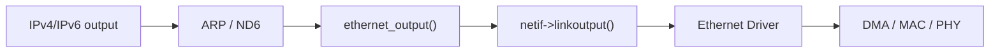
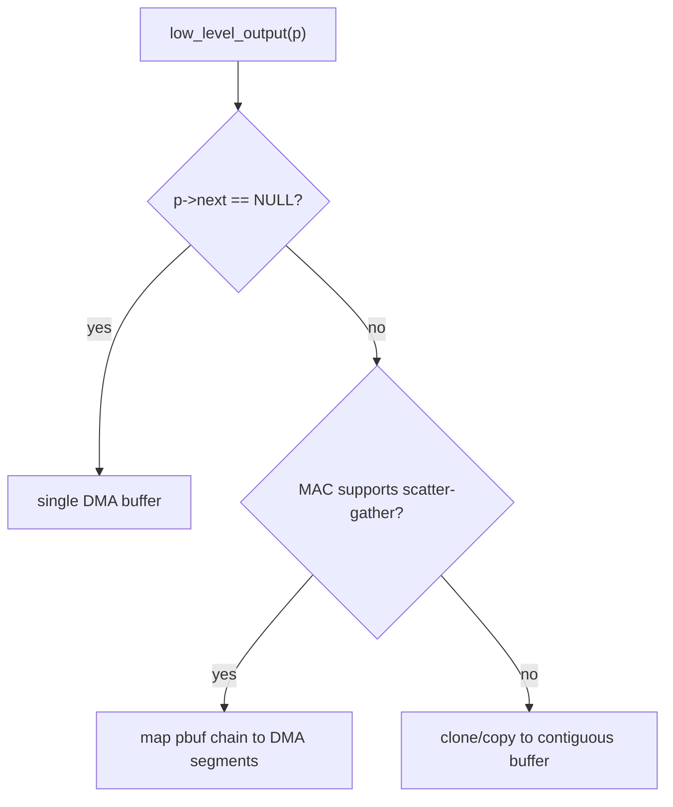
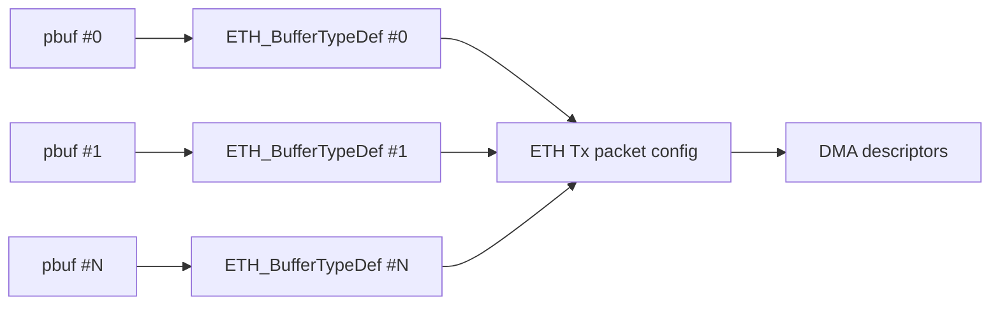
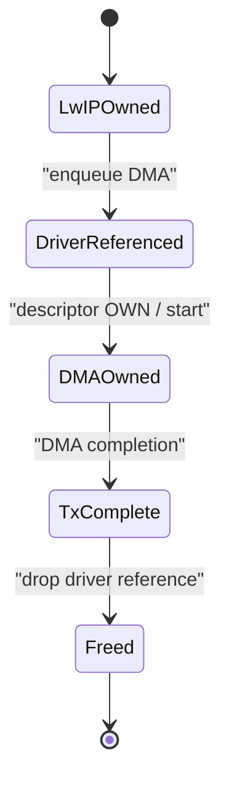
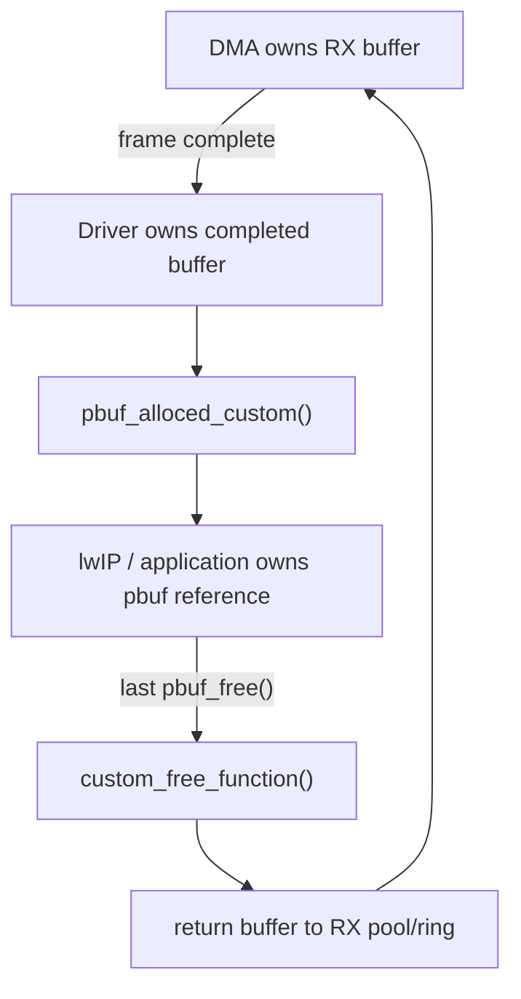

<meta name="referrer" content="no-referrer" />

# 教程 20：从 `netif->linkoutput()` 到 `pbuf_custom`——Ethernet Driver、DMA Buffer、所有权与 Zero-copy

> 摘要：从 lwIP 的 linkoutput 边界进入真实 Ethernet Driver，追踪 pbuf chain、DMA buffer、custom pbuf、Cache 一致性与 zero-copy 的所有权闭环。

[TOC]

Stage 19 已经把 checksum 追到 `netif->linkoutput()`。从这里开始，lwIP Core 不再负责“怎样把 frame 搬进 MAC”，而是把一个 `struct pbuf *` 交给具体 Port/Driver。对 MCU Ethernet 而言，接下来的难点不再是 TCP/IP 字段，而是 **buffer 属于谁、DMA 何时能读写、lwIP 何时可以释放，以及 zero-copy 如何把这些生命周期接起来**。[S1](#source-s1)

本篇继续使用当前项目的 upstream lwIP commit `d08f4773edd0182b7910fc8f046eed82ffcd67c9` 作为 Core 证据；为了把抽象接口落到真实 DMA Driver，还使用 ST 官方 STM32H7 Ethernet HAL/CubeH7 示例作为一个具体实现样本。STM32H7 示例只用于解释“某个 MCU Port 可以怎样实现”，不代表 lwIP Core 要求所有平台采用相同 HAL、descriptor 格式或 Cache API。[S1](#source-s1)[S3](#source-s3)

下面源码块若来自当前 lwIP upstream，会保持真实函数名与连续逻辑单元；外部 STM32H7 Driver 只做调用关系归纳，不大段复制厂商源码。

## 1. 入口仍然是 Stage 19 停下来的 `netif->linkoutput()`

Ethernet netif 初始化时，Port 会把二层实际发送函数保存到 `netif->linkoutput`。upstream 提供的 Ethernet Interface Skeleton 在 `ethernetif_init()` 中就是这样完成绑定的：[S1](#source-s1)

```c
err_t
ethernetif_init(struct netif *netif)
{
  struct ethernetif *ethernetif;

  LWIP_ASSERT("netif != NULL", (netif != NULL));

  ethernetif = mem_malloc(sizeof(struct ethernetif));
  if (ethernetif == NULL) {
    LWIP_DEBUGF(NETIF_DEBUG, ("ethernetif_init: out of memory\n"));
    return ERR_MEM;
  }

  netif->state = ethernetif;
  netif->name[0] = IFNAME0;
  netif->name[1] = IFNAME1;
#if LWIP_IPV4
  netif->output = etharp_output;
#endif
#if LWIP_IPV6
  netif->output_ip6 = ethip6_output;
#endif
  netif->linkoutput = low_level_output;

  ethernetif->ethaddr = (struct eth_addr *)&(netif->hwaddr[0]);
  low_level_init(netif);

  return ERR_OK;
}
```

这里的三个函数指针是三个不同层次：

| 函数指针 | 输入层次 | 主要职责 |
| --- | --- | --- |
| `netif->output` | IPv4 packet | IPv4 next-hop / ARP 后进入 Ethernet |
| `netif->output_ip6` | IPv6 packet | IPv6 ND6 后进入 Ethernet |
| `netif->linkoutput` | 已带 Ethernet header 的 frame | 真正交给网卡/Driver |

因此 Stage 20 从 `low_level_output()` 开始已经越过 IP 层。此时 `p->payload` 指向的 frame 可以包含 Ethernet destination/source/type，Driver 不应该再重新做 ARP、ND6 或 route selection。[S1](#source-s1)



## 2. `low_level_output()` 收到的不是“连续数组”，而可能是一条 `pbuf chain`

upstream Ethernet skeleton 对 Driver 的第一条重要提醒就是：传入的 packet 可能由多个 pbuf 组成。[S1](#source-s1)

继续阅读 `low_level_output()` 中遍历链表的核心逻辑：

```c
static err_t
low_level_output(struct netif *netif, struct pbuf *p)
{
  struct ethernetif *ethernetif = netif->state;
  struct pbuf *q;

  initiate transfer();

#if ETH_PAD_SIZE
  pbuf_remove_header(p, ETH_PAD_SIZE);
#endif

  for (q = p; q != NULL; q = q->next) {
    send data from(q->payload, q->len);
  }

  signal that packet should be sent();

#if ETH_PAD_SIZE
  pbuf_add_header(p, ETH_PAD_SIZE);
#endif

  LINK_STATS_INC(link.xmit);

  return ERR_OK;
}
```

这里最重要的不是示例中的伪硬件操作，而是 `for (q = p; q != NULL; q = q->next)`：**Driver 必须把 `pbuf chain` 当作正常输入，而不是异常情况。** 每个 `q->payload/q->len` 是一个 fragment，`p->tot_len` 才表示从当前 pbuf 开始的总长度。[S1](#source-s1)

这会直接决定 TX Driver 的两种实现路径：

1. MAC/DMA 支持 scatter-gather：把多个 `pbuf` fragment 映射为多个 DMA buffer/descriptor；
2. MAC/DMA 只接受连续 buffer：先把 chain clone/copy 到连续内存，再交给 DMA。

## 3. `LWIP_NETIF_TX_SINGLE_PBUF` 只是“尽量单 pbuf”，Driver 不能把它当硬保证

`src/include/lwip/opt.h` 对 `LWIP_NETIF_TX_SINGLE_PBUF` 的定义非常直接：启用后 lwIP 会尝试让待发送数据位于单一 pbuf，以兼容不支持 scatter-gather 的 DMA MAC；但这可能增加 CPU memcpy，而且注释明确要求 Driver **不能依赖** TX 永远只有一个 pbuf。[S1](#source-s1)

因此 Driver 设计不能写成：

```text
假设 p->next 永远为 NULL
→ 直接把 p->payload 写入一个 DMA descriptor
```

更稳妥的决策是：



同一个选项还会和 `TCP_OVERSIZE`、fragmentation 等共同影响 TX pbuf 形状，但它们都不能替代 Driver 对实际 `p->next` 的检查。[S1](#source-s1)

## 4. 一个真实 DMA Driver 可以把 `pbuf chain` 直接变成 scatter-gather buffer list

ST 官方 STM32CubeH7 lwIP `ethernetif.c` 提供了一个具体例子：`low_level_output()` 遍历 `pbuf chain`，把每个 `q->payload/q->len` 映射到 `ETH_BufferTypeDef` 链，再把 `p->tot_len`、buffer list 和 packet context 交给 HAL Ethernet TX 配置。[S3](#source-s3)

它的执行关系可以概括为：



这说明所谓 scatter-gather 不是“lwIP 特殊模式”，而是 Driver 把原本已经存在的 `pbuf chain` 映射给硬件 DMA 的能力。

如果硬件每个 descriptor 能描述一个 buffer，那么 `q->payload/q->len` 天然就是可映射对象；如果 descriptor 数量不够或硬件要求额外对齐，Driver 才需要合并或复制。

## 5. TX 最大的问题不是“怎么发”，而是 `linkoutput()` 返回后谁还拥有 `pbuf`

同步 copy Driver 很简单：`low_level_output()` 在返回前已经把所有字节复制进 Driver 自己的 TX buffer，因此 lwIP 调用方恢复执行后可以按原规则释放原 pbuf。

DMA zero-copy TX 完全不同。DMA 可能在 `low_level_output()` 返回以后才真正读取 `p->payload`。如果 Driver 没有为异步生命周期建立额外引用，lwIP 一旦释放或复用该 pbuf，DMA 会读到已经失效的内存。

upstream 的 `MEMP_NUM_FRAG_PBUF` 注释专门指出：当 DMA-enabled MAC 在 `netif->output` 返回时还没有完成发送，fragment pbuf 的并发占用会增加；这正是“函数返回”和“硬件完成”不是同一个事件的证据。[S1](#source-s1)

TX ownership 必须明确成下面的阶段：



真正的 zero-copy TX 通常需要 Driver 在把 pbuf 交给异步 DMA 前保存引用，例如增加 `pbuf_ref()`，然后在 TX complete 回调或 descriptor reclaim 时 `pbuf_free()`。具体引用保存位置属于 Driver 设计，而不是 lwIP Core 自动完成。[S1](#source-s1)[S3](#source-s3)

## 6. RX copy 路径：DMA buffer 与 lwIP pbuf 是两块不同内存

upstream skeleton 的 `low_level_input()` 展示的是最容易理解的 RX copy 模式：先知道 frame 长度，再 `pbuf_alloc(PBUF_RAW, len, PBUF_POOL)`，随后把网卡收到的数据逐段复制到 pbuf chain。[S1](#source-s1)

```c
static struct pbuf *
low_level_input(struct netif *netif)
{
  struct ethernetif *ethernetif = netif->state;
  struct pbuf *p, *q;
  u16_t len;

  len = get packet length();

  p = pbuf_alloc(PBUF_RAW, len, PBUF_POOL);

  if (p != NULL) {
    for (q = p; q != NULL; q = q->next) {
      read data into(q->payload, q->len);
    }
    acknowledge that packet has been read();
  }

  return p;
}
```

这段 skeleton 中的 `get packet length()`、`read data into()` 是上游模板本来就故意保留给 Driver 实现的占位语义，不是当前 Host Port 的可执行 C 源码。[S1](#source-s1)

copy 模式的 ownership 很清楚：

```text
DMA/RX buffer owned by Driver
        ↓ copy
PBUF_POOL owned by lwIP
        ↓
netif->input()
        ↓
pbuf_free()
```

DMA buffer 在 copy 完后就能立即回 RX ring，lwIP 后续持有的是另一份数据。代价就是每个 frame 至少发生一次内存复制。

## 7. upstream skeleton 已经明确允许 RX DMA buffer 直接成为 pbuf

同一个 `low_level_input()` 的注释明确指出：这一步不一定要 memcpy；对于 DMA-enabled MAC，可以预先准备 pbuf/buffer，接收后只根据真实 frame 长度调整 `len/tot_len`。[S1](#source-s1)

这正是 zero-copy RX 的入口：**DMA 写入的那块内存本身就是 lwIP 后续读取的 payload。**

问题随之变化：原来 copy 路径只需要回答“数据复制到哪里”，zero-copy 则必须回答“这块 DMA buffer 什么时候才能重新交给 DMA”。

答案不能是“`netif->input()` 返回后”，因为 TCP/UDP/application 可能继续持有 pbuf；真正可靠的回收事件是最后一个 pbuf reference 被释放。

## 8. `struct pbuf_custom` 把“最后一次 `pbuf_free()`”变成 Driver 回收钩子

`src/include/lwip/pbuf.h` 对 custom pbuf 的定义非常小：[S1](#source-s1)

```c
struct pbuf_custom {
  struct pbuf pbuf;
  pbuf_free_custom_fn custom_free_function;
};
```

`pbuf_alloced_custom()` 不分配 payload 内存，而是把调用方已经拥有的 `payload_mem` 包装成 pbuf，并设置 `PBUF_FLAG_IS_CUSTOM`。[S1](#source-s1)

```c
struct pbuf *
pbuf_alloced_custom(pbuf_layer l, u16_t length, pbuf_type type,
                    struct pbuf_custom *p, void *payload_mem,
                    u16_t payload_mem_len)
{
  u16_t offset = (u16_t)l;
  void *payload;

  if (LWIP_MEM_ALIGN_SIZE(offset) + length > payload_mem_len) {
    return NULL;
  }

  if (payload_mem != NULL) {
    payload = (u8_t *)payload_mem + LWIP_MEM_ALIGN_SIZE(offset);
  } else {
    payload = NULL;
  }
  pbuf_init_alloced_pbuf(&p->pbuf, payload, length, length, type,
                         PBUF_FLAG_IS_CUSTOM);
  return &p->pbuf;
}
```

进入时，buffer ownership 仍由 Driver 定义；函数只是让 lwIP 用标准 `struct pbuf` 接口引用它。

## 9. `pbuf_free()` 才是 RX DMA buffer 生命周期的真正回程入口

继续阅读 `pbuf_free()`。当 reference count 减到 0，而且 pbuf 带有 `PBUF_FLAG_IS_CUSTOM` 时，Core 不调用普通 pool/heap free，而是执行 Driver 提供的 `custom_free_function`：[S1](#source-s1)

```c
if ((p->flags & PBUF_FLAG_IS_CUSTOM) != 0) {
  struct pbuf_custom *pc = (struct pbuf_custom *)p;
  LWIP_ASSERT("pc->custom_free_function != NULL",
              pc->custom_free_function != NULL);
  pc->custom_free_function(p);
}
```

因此 zero-copy RX 的 ownership 闭环是：



这张图比“zero-copy = 没有 memcpy”更重要。**Zero-copy 首先是一套 ownership protocol，其次才是一项性能优化。**

## 10. STM32H7 官方 lwIP 示例正是按 custom pbuf 建立 RX ownership

ST CubeH7 的 lwIP Ethernet 示例把 `pbuf_custom` 放进专用 RX pool。HAL 需要新 RX buffer 时，`HAL_ETH_RxAllocateCallback()` 从 pool 取出 custom object，设置 `custom_free_function`，再用 `pbuf_alloced_custom()` 把对象中的 DMA buffer 包装为 `PBUF_REF`。[S3](#source-s3)

当一个 frame 跨多个 DMA RX buffer 时，`HAL_ETH_RxLinkCallback()` 把这些 custom pbuf 连接成 pbuf chain，并修正每个节点的 `len/tot_len`。随后 `HAL_ETH_ReadData()` 把 chain 交给 `low_level_input()`，再由 `ethernetif_input()` 调用 `netif->input()`。[S3](#source-s3)

最后，lwIP/application 完成处理并把 reference count 降到 0 后，custom free callback 才把对象归还 RX pool。这个具体实现把 Stage 3 的 `pbuf ref` 和真实 DMA buffer 生命周期直接连接起来。

## 11. `PBUF_REF` 不等于“自动 zero-copy”，它只描述 payload 不由普通 pbuf allocator 拥有

在 custom RX 示例里常见 `PBUF_REF`，但不能反向推导“凡是 `PBUF_REF` 都是 DMA zero-copy”。

`PBUF_REF` 只说明 payload 生命周期由外部对象负责，lwIP 不会按普通 RAM pbuf 的方式释放 payload。是否真的 zero-copy，要看：

- payload 是否就是 DMA 实际读写的 buffer；
- 是否没有额外 memcpy；
- custom free 是否把同一块 buffer 归还硬件/Driver pool；
- CPU 与 DMA 是否满足 alignment/cache/coherency 要求。

因此类型是 ownership 提示，不是性能保证。[S1](#source-s1)

## 12. Cortex-M7 上还多一条隐藏边界：CPU Cache 与 DMA 看到的 RAM 可能不是同一时刻的数据

DMA 直接访问 RAM，而带 D-Cache 的 Cortex-M7 CPU 可能先在 cache line 中读写数据。ARM CMSIS 提供 `SCB_CleanDCache_by_Addr()`、`SCB_InvalidateDCache_by_Addr()` 等 API，并要求地址按 cache line 边界处理。[S4](#source-s4)

从 ownership 角度理解即可：

| 方向 | 风险 | 常见维护动作 |
| --- | --- | --- |
| TX：CPU → DMA | CPU 新数据还只在 D-Cache | DMA 取数据前 clean 对应 cache lines |
| RX：DMA → CPU | CPU cache 中仍保留 DMA 写入前的旧副本 | CPU/lwIP 读之前 invalidate 对应 cache lines |

ST CubeH7 示例在 RX buffer 被 HAL 链接进 pbuf 时执行 D-Cache invalidate，就是一个具体实现证据。[S3](#source-s3)[S4](#source-s4)

必须区分：**Cache maintenance 不属于 lwIP Core API 契约。** lwIP 只传递 pbuf；具体 CPU、内存区属性、MPU、DMA coherent/non-coherent 设计属于 Port/Driver。

## 13. Zero-copy 不意味着“任何内存都能直接给 DMA”

即使 ownership 正确，DMA buffer 仍可能受以下约束：

- 地址对齐；
- buffer 长度对齐；
- DMA 可访问的 SRAM region；
- cache line 对齐与共享风险；
- descriptor 对 buffer 数量/长度的限制；
- Ethernet header 前是否需要 headroom；
- RX buffer size 能否容纳 MTU/VLAN/frame padding。

`pbuf_alloced_custom()` 自己就会检查 header offset 与 `payload_mem_len`，并明确要求调用方负责正确 alignment。[S1](#source-s1)

这说明“把任意 malloc buffer 塞给 `pbuf_alloced_custom()`”并不是可靠 DMA Driver 设计。

## 14. TX copy、TX scatter-gather、RX copy、RX zero-copy 是四个独立选择

不要把 Driver 简化成“copy 模式”和“zero-copy 模式”两个总开关。

| 路径 | 实现 | CPU copy | 生命周期难度 |
| --- | --- | ---: | ---: |
| TX copy | pbuf chain → Driver contiguous buffer | 有 | 低 |
| TX scatter-gather | pbuf chain → 多 descriptor | 可无 | 中到高 |
| RX copy | DMA buffer → PBUF_POOL | 有 | 低 |
| RX custom pbuf | DMA buffer → `pbuf_custom` | 可无 | 高 |

一个项目完全可能使用“TX scatter-gather + RX copy”，也可能“TX copy + RX zero-copy”。选择取决于 MAC/DMA 能力、RAM 预算、cache 代价、实现复杂度和稳定性目标，而不是追求一个统一的“zero-copy”标签。

## 15. `ethernetif_input()` 说明 RX Driver 与 lwIP Core 的最后交接点

upstream skeleton 的 `ethernetif_input()` 很短，但 ownership 很明确：[S1](#source-s1)

```c
static void
ethernetif_input(struct netif *netif)
{
  struct pbuf *p;

  p = low_level_input(netif);
  if (p != NULL) {
    if (netif->input(p, netif) != ERR_OK) {
      pbuf_free(p);
      p = NULL;
    }
  }
}
```

`low_level_input()` 返回的 pbuf 可以来自 copy，也可以是 DMA-backed custom pbuf。`netif->input()` 不需要知道它来自哪种方案，只通过标准 pbuf contract 继续进入 `tcpip_input()` / `ethernet_input()`。

这正是 lwIP 的边界价值：**Core 处理 packet object，Driver 处理物理 buffer。**

## 16. 当前 Unix TAP 实验为什么只能验证 pbuf/Port 边界，不能证明 MCU DMA zero-copy

当前项目的 Unix `tapif` 没有 DMA descriptor。TX 会把 pbuf 内容写到 TAP file descriptor；RX 从 TAP fd 读取数据后构造 pbuf。因此它适合观察：

- `linkoutput` 什么时候被调用；
- pbuf chain 在 Port 边界是什么形状；
- `netif->input()` 如何把 RX pbuf 交回 Core；
- packet bytes 是否正确。

但它不能证明：

- DMA OWN bit；
- descriptor reclaim；
- D-Cache clean/invalidate；
- custom pbuf 归还 RX ring；
- MAC scatter-gather 时序。

这些只能在真实 MCU Ethernet Driver 或一个明确模拟 ownership 的测试 harness 上验证。把 TAP 结果直接外推成 DMA 证据会越过 Port 边界。[S2](#source-s2)

## 17. 从 Stage 19 到 Stage 20，`pbuf` 已经真正走出协议栈 Core

到这里可以把整个边界压缩为：

```text
lwIP Core builds packet
        ↓
Ethernet frame in pbuf chain
        ↓
netif->linkoutput()
        ↓
Driver chooses copy / scatter-gather
        ↓
DMA owns TX buffers until completion

DMA fills RX buffers
        ↓
Driver chooses copy / pbuf_custom
        ↓
netif->input()
        ↓
lwIP owns references
        ↓
last pbuf_free()
        ↓
custom_free_function()
        ↓
Driver recycles DMA buffer
```

Stage 20 的核心判断不是“zero-copy 更快”，而是：**只有 buffer ownership、reference lifetime 与 Cache coherency 同时闭环时，zero-copy 才是正确实现。**

下一阶段继续向下追 descriptor ring、OWN bit、ISR/polling、TX completion、RX starvation 与 backpressure。那一篇会回答“当 DMA ring 满了或 RX buffer 用光时，谁应该停、谁应该等、谁负责唤醒”。

## 资料来源

<a id="source-s1"></a>
### [S1] lwIP pbuf、netif 与 Ethernet Interface Skeleton
- 类型：目标版本上游源码
- 版本：commit `d08f4773edd0182b7910fc8f046eed82ffcd67c9`
- 定位：`src/include/lwip/pbuf.h`：`struct pbuf_custom`、`pbuf_alloced_custom()`；`src/core/pbuf.c`：`pbuf_alloced_custom()`、`pbuf_free()`；`src/include/lwip/opt.h`：`LWIP_NETIF_TX_SINGLE_PBUF`、`MEMP_NUM_FRAG_PBUF`；`contrib/examples/ethernetif/ethernetif.c`
- URL/文档：[lwIP upstream commit](https://github.com/lwip-tcpip/lwip/tree/d08f4773edd0182b7910fc8f046eed82ffcd67c9)
- 使用位置：“linkoutput 入口”“pbuf chain”“TX single pbuf”“RX copy/zero-copy”“custom free”
- 支撑内容：证明 lwIP 到 Driver 的 pbuf contract、custom pbuf 生命周期、DMA 相关配置提示以及通用 Ethernet Port 的 TX/RX 边界

<a id="source-s2"></a>
### [S2] lwIP Unix TAP 与 Win32 pcapif Port
- 类型：目标版本上游 Port 实现
- 版本：commit `d08f4773edd0182b7910fc8f046eed82ffcd67c9`
- 定位：`contrib/ports/unix/port/netif/tapif.c`；`contrib/ports/win32/pcapif.c`：`pcapif_rx_ref()`、`pcapif_input()`
- URL/文档：[lwIP contrib ports](https://github.com/lwip-tcpip/lwip/tree/d08f4773edd0182b7910fc8f046eed82ffcd67c9/contrib/ports)
- 使用位置：“Port 边界”“custom pbuf 对照”“Host 实验能力边界”
- 支撑内容：证明相同 Core API 可以由 fd/pcap Port 实现，并展示 upstream 自身使用 `pbuf_alloced_custom()` 包装外部 RX payload 的例子

<a id="source-s3"></a>
### [S3] ST STM32H7 lwIP Ethernet Driver 示例
- 类型：厂商官方示例源码
- 版本：STM32CubeH7 GitHub master，访问日期 2026-10-02
- 定位：`Projects/STM32H743I-EVAL/Applications/LwIP/LwIP_TFTP_Server/Src/ethernetif.c`：`low_level_output()`、`low_level_input()`、`HAL_ETH_RxAllocateCallback()`、`HAL_ETH_RxLinkCallback()`、`pbuf_free_custom()`、`HAL_ETH_TxFreeCallback()`
- URL/文档：[STM32CubeH7 LwIP TFTP Server ethernetif.c](https://github.com/STMicroelectronics/STM32CubeH7/blob/master/Projects/STM32H743I-EVAL/Applications/LwIP/LwIP_TFTP_Server/Src/ethernetif.c)
- 使用位置：“DMA scatter-gather 示例”“RX custom pbuf”“Cache invalidate”“TX/RX ownership”
- 支撑内容：提供一个具体 STM32H7 Port 如何把 pbuf chain 映射到 HAL ETH buffer、使用 custom RX pool 并在最后 free 时回收 buffer 的实现样本

<a id="source-s4"></a>
### [S4] Arm CMSIS Cortex-M7 D-Cache API
- 类型：Arm 官方文档
- 版本：CMSIS 6 文档，访问日期 2026-10-02
- URL/文档：[CMSIS-Core Cortex-M7 D-Cache Functions](https://arm-software.github.io/CMSIS_6/latest/Core/group__Dcache__functions__m7.html)
- 使用位置：“DMA 与 Cache coherency”“alignment”
- 支撑内容：说明 clean/invalidate by address API 以及 cache-line alignment 约束，用于界定带 D-Cache MCU 上 DMA buffer 的额外 Port/Driver 责任