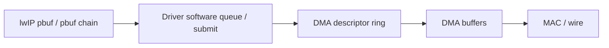
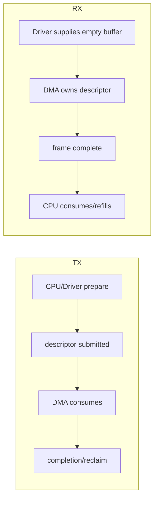
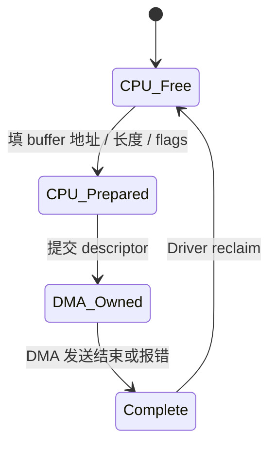
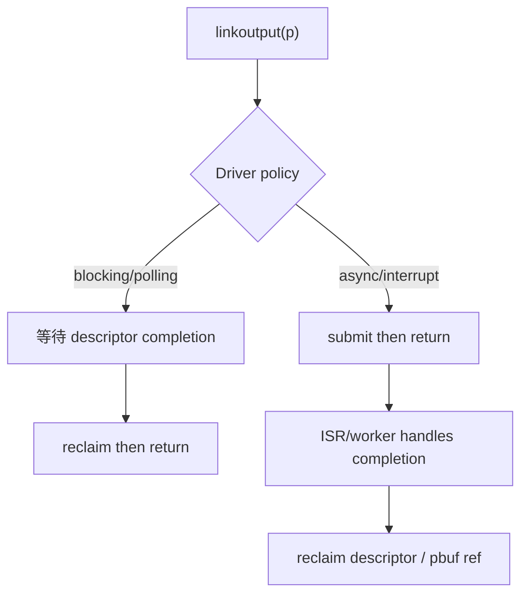
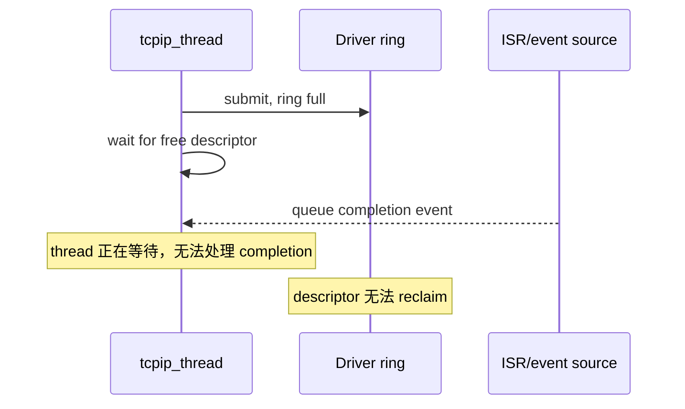
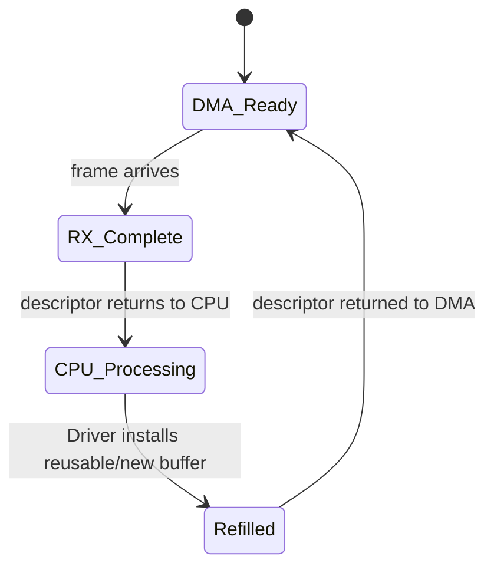
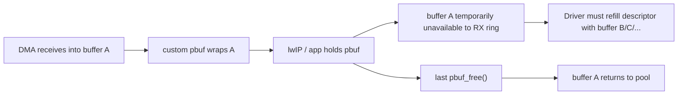

<meta name="referrer" content="no-referrer" />

# 教程 21：从 DMA Descriptor Ring 到 `netif->input()`——ISR、Polling、TX Completion 与 Backpressure

> 摘要：建立 Ethernet DMA descriptor ring 的生产者—消费者模型，解释 TX/RX ownership、completion、refill、backpressure 与线程上下文边界。

[TOC]

Stage 20 已经建立了 pbuf、DMA buffer 与 Driver 之间的 ownership contract，但 ownership 正确并不等于系统一定稳定。Ethernet DMA 通常通过一个固定数量的 descriptor（描述符）循环工作：CPU/Driver 不断提交要发送的 buffer，DMA 不断消费；RX 方向则由 DMA 填充 buffer，Driver 再把完成的 packet 交给 lwIP。只要“提交速度、完成速度、回收速度”失去平衡，有限 ring 就会被占满或耗尽。[S1](#source-s1)

Backpressure（背压）指下游资源不足时，压力如何向上游传播：TX ring full 时，Driver 需要决定等待、排队、返回错误还是丢包；RX 没有可回填 buffer 时，DMA 可能无法继续接收。Completion（完成事件）表示 DMA 已结束某次 descriptor 操作，refill（回填）表示 Driver 给 RX descriptor 补上下一块可接收 buffer；ISR（Interrupt Service Routine，中断服务程序）则是硬件中断到达 CPU 后最先执行的处理上下文。它们都不是 TCP 的 congestion control，而是 Driver 资源管理的一部分。

## 阅读前建议：先把 ring、completion 与 Driver service 频率放在一起看

1. [lwIP Ethernet Interface Skeleton](https://github.com/lwip-tcpip/lwip/blob/d08f4773edd0182b7910fc8f046eed82ffcd67c9/contrib/examples/ethernetif/ethernetif.c)：重点看 `low_level_output()` 关于 DMA queue full 的注释，以及 RX/TX pbuf contract。[S1](#source-s1)
2. [lwIP Optimization hints](https://www.nongnu.org/lwip/2_1_x/optimization.html)：重点看网卡没有及时 service 时的 RX buffer overflow，以及 RTOS 环境下由中断唤醒高优先级处理任务的建议。[S4](#source-s4)
3. [STM32H7 HAL Ethernet Driver](https://github.com/STMicroelectronics/stm32h7xx-hal-driver/blob/7e541d92019e18f98d211fc4ab9197ec8e8105f6/Src/stm32h7xx_hal_eth.c)：只作为一个 descriptor ring/ownership/completion 实现样本；具体 STM32H7 调用链留到 Stage 43。[S2](#source-s2)

## 1. Descriptor、buffer、ring、queue 先分开

Descriptor 是硬件/Driver 用来描述一次 DMA buffer 操作的小型元数据结构，通常包含 buffer 地址、长度、状态位和 ownership 位。多个 descriptor 按固定数组或链表循环使用，就形成 descriptor ring。

这和 Stage 20 的对象层次关系如下：



四层资源不能混写：

| 资源 | 典型 owner | 数量耗尽时的现象 |
| --- | --- | --- |
| lwIP pbuf / memp | lwIP | packet/protocol object 分配失败 |
| Driver software queue | Driver/RTOS | 尚未进入 DMA 的 packet 排队增长 |
| DMA descriptor ring | Driver + DMA | 无 descriptor 可提交/接收 |
| DMA buffer pool | Driver/HAL | descriptor 没有 buffer 可挂接 |

一个系统可能 descriptor 还有空位但 RX buffer pool 已空，也可能 pbuf 很充足但 TX ring 已满。排障时必须先确认到底是哪一层资源耗尽。

## 2. Ring 本质上是一个有限容量生产者—消费者系统

TX 中，CPU/Driver 是 producer，DMA/MAC 是 consumer；RX 中，DMA/MAC 产生“已接收 packet”，CPU/Driver 消费并 refill descriptor。



Ring depth 只是缓存“生产速率与消费速率短时间不一致”的容量。它不能长期弥补 consumer 跟不上 producer 的问题。

## 3. TX descriptor 的关键不是“空/满”，而是 ownership 状态

许多 MAC/DMA 用一个 OWN bit 或等价状态表示 descriptor 当前由 CPU 还是 DMA 控制。具体 bit 名因硬件不同，但通用生命周期一致：[S2](#source-s2)



这里要区分三个事件：

1. **submit**：CPU 把 descriptor 交给 DMA；
2. **completion**：DMA 已经不再访问当前 TX buffer；
3. **reclaim**：Driver 读取 completion 状态、释放关联资源并把 descriptor 重新纳入可提交集合。

如果 TX 采用 Stage 20 的 direct-DMA/zero-copy，pbuf 引用也必须在 completion/reclaim 时同步闭环，而不是在 submit 时释放。

## 4. `linkoutput()` 返回与 TX completion 不是同一语义

有些 Driver 采用 polling/blocking TX：`linkoutput()` 内部一直等到当前 frame 完成再返回；另一些 Driver 采用 interrupt/asynchronous TX：函数只完成 enqueue/submit，实际 completion 稍后通过 ISR 或 worker 处理。[S2](#source-s2)



这两种设计都可以使用 DMA；区别是“谁等待 completion”以及调用方何时重新获得执行权。不能把“DMA”与“异步”简单画等号。

## 5. TX ring full 时，Driver 必须定义 backpressure policy

upstream Ethernet skeleton 在 `low_level_output()` 注释里明确提醒：如果 DMA queue full 时直接返回 `ERR_MEM`，可能产生奇怪结果，因为 stack 一般不会自动重试这个被丢弃的 packet（TCP timer 是一个例外场景）；实现者可以考虑等待 DMA queue 出现空间。[S1](#source-s1)

这不是“必须阻塞”的规范，而是在提醒 Driver：**ring full 不能被当成一个无代价的普通丢包点。** 常见策略各有前提：

| 策略 | 优点 | 风险/前提 |
| --- | --- | --- |
| 短时等待 descriptor | 不丢当前 frame | 不能无限等；completion 必须能在等待期间发生 |
| Driver software queue | `linkoutput()` 可快速返回 | 需要额外内存、队列上限和 drop policy |
| 返回错误 | 实现简单 | 上层未必重试，可能形成隐蔽丢包 |
| 主动 drop | 延迟可控 | 必须接受协议/业务层可见的 packet loss |

所以 backpressure 不是“用哪个 err_t”，而是一套 **资源耗尽时怎样把压力向上游传播** 的 policy。

## 6. 最危险的等待是 completion 依赖被阻塞的同一个执行上下文

假设 `low_level_output()` 当前运行在 lwIP `tcpip_thread` 中，并且 ring full 后它阻塞等待一个 descriptor；如果 TX completion 又需要把事件排回 `tcpip_thread` 才能 reclaim，就会形成自锁：



因此选择 wait/semaphore/queue 前必须先回答：

- completion 在 ISR 中直接 reclaim，还是只通知 worker？
- worker 是独立 Driver task，还是 lwIP Core thread？
- 等待者持有什么锁？
- link down / DMA error 时谁负责唤醒等待者？

Stage 11 的线程与 Core locking 模型在这里直接决定 Driver policy 是否安全。

## 7. `pbuf chain` 会放大 TX descriptor 消耗

Stage 20 已经说明一个 Ethernet frame 可能由多个 pbuf fragment 组成。如果硬件 scatter-gather 设计按 fragment 映射 descriptor，那么“一个 packet”不一定只占一个 descriptor。

```text
单个 packet 的 descriptor 消耗
    ≈ 实际 fragment 数 × 每 fragment 的硬件映射需求
```

因此 TX ring depth 与以下因素是耦合的：

- pbuf chain fragment 数；
- MAC 每个 descriptor 能描述几个 buffer segment；
- 同时在飞的 frame 数；
- completion/reclaim 延迟；
- software queue 是否提前吸收 burst。

`LWIP_NETIF_TX_SINGLE_PBUF` 可以减少部分 chain，但不能替代 ring capacity 设计。[S1](#source-s1)

## 8. RX 的压力点不是“ring full”，而是“无法 refill”

RX 初始化时，Driver 通常先给每个 RX descriptor 挂上可写 buffer，再把 ownership 交给 DMA。收到 frame 后，descriptor/buffer 变成 CPU 可处理状态；Driver 取走 packet 后还需要给 ring 补回一个新的可接收 buffer。[S2](#source-s2)



如果 RX 是 copy path，Driver copy 完 frame 后通常可以很快复用原 DMA buffer；如果是 Stage 20 的 custom-pbuf zero-copy，原 buffer 可能被 lwIP/应用继续持有，Driver 必须从额外 buffer pool 取另一块 memory 来 refill descriptor。[S3](#source-s3)

这就是 RX starvation（接收资源饥饿）：不是“网络没有数据”，而是 **DMA 没有空 buffer 可以继续接收新 frame**。

## 9. Zero-copy 把 RX descriptor pressure 与 pbuf lifetime 连起来

RX zero-copy 的优势是减少 copy，但代价是上层持有 pbuf 的时间会直接影响 Driver buffer pool。



因此 RX ring size、RX buffer pool size 和上层最大持有时间必须一起考虑。只增加 descriptor 数而不增加可回填 buffer，不一定能解决 zero-copy RX starvation。

## 10. TX backpressure 与 RX backpressure 的传播方向不同

TX 压力从硬件向发送者反向传播：

```text
DMA completion 变慢
  → TX descriptors 长时间占用
  → ring full
  → Driver wait/queue/error/drop
  → lwIP output path 感知
```

RX 压力则从上层持有资源向网卡接收能力传播：

```text
lwIP / application 长时间持有 RX pbuf
  → RX buffer pool 变少
  → descriptor 无法 refill
  → DMA 接收能力下降
  → 新 frame 在 MAC/DMA 处丢失
```

两者都叫 backpressure，但不能用同一个“queue full”心智模型解释。

## 11. TCP 会重传，不代表 Driver 可以把 ring full 当正常丢包策略

TCP 的端到端可靠性可以在之后重传部分丢失数据，但这不意味着 Driver 丢包没有代价：

- RTO/fast retransmit 会增加延迟；
- congestion control 可能把本地 Driver 丢包解释成网络拥塞；
- 重传增加带宽和 CPU；
- ARP、ICMP、UDP 等流量并没有 TCP 的同一套端到端恢复。

因此 Driver backpressure 应该从资源和实时性角度设计，而不是把“TCP 会重传”当作 DMA ring overflow 的恢复机制。[S1](#source-s1)

## 12. Interrupt、Polling 与 Worker Thread 解决的是“什么时候 service ring”

Descriptor ring 必须被及时 service。结合 upstream 文档与常见 Driver 结构，可以把 service ring 的执行方式概括为以下几类；前三类有当前来源支撑，具体平台如何组合属于 Driver policy：

- **Polling**：周期检查 completion/received descriptor；
- **Interrupt**：DMA/MAC 完成后触发 ISR；
- **ISR + worker**：ISR 只记录事件/唤醒任务，真正 dequeue/refill/reclaim 在 Driver task 中完成；

lwIP Optimization hints 指出，如果网卡没有被及时 service，RX buffer 可能 overflow；在 RTOS 环境中可以由中断唤醒高优先级任务及时处理 Driver。[S4](#source-s4)

因此问题不是“中断一定比 polling 好”，而是：

```text
最坏输入速率
vs
Driver service latency
vs
ring/buffer 容量
```

三者是否形成稳定余量。

## 13. Completion 不只表示成功，还要闭合 error path

DMA completion 可能携带成功、underflow、bus error、descriptor error 等状态；具体错误位由硬件定义。通用 Driver contract 要求无论成功还是失败，都必须最终回答：[S2](#source-s2)

- 这次提交关联的 descriptor 是否可 reclaim？
- 关联 pbuf/reference 是否应该释放？
- buffer 是否还能复用？
- wait queue/semaphore 是否需要唤醒？
- 错误是否要求 reset DMA/ring 或重新初始化？

如果 error path 只记录日志，却没有归还 descriptor 或引用，系统会表现成“偶发一次错误后 ring 永久越来越满”。

## 14. 一个可审查的 Driver 应该能画出两条独立生命周期

TX：

```text
pbuf ready
→ descriptor available
→ map/copy buffer
→ submit to DMA
→ completion/error
→ reclaim descriptor
→ release pbuf/buffer ownership
```

RX：

```text
empty buffer available
→ descriptor armed
→ DMA receives frame
→ CPU/Driver obtains completion
→ wrap/copy into pbuf
→ netif->input()
→ refill descriptor
→ old zero-copy buffer eventually returns through pbuf_free()
```

任何一条链中出现“资源交出去，但不知道在哪里回来”，都意味着 ownership/backpressure 还没有闭环。

## 15. Host TAP 能验证调度边界，但不存在真实 descriptor ring

Unix TAP/pcap Port 可以帮助验证：

- RX 是否由独立线程/polling 读取；
- packet 什么时候交给 `netif->input()`；
- lwIP Core 与 Port/Driver 的线程边界。

但 Host fd/pcap 没有 MCU MAC DMA descriptor，因此无法用 Stage 02 的 TAP 实验测出：

- descriptor OWN bit 生命周期；
- ring depth 是否足够；
- TX completion reclaim 是否正确；
- RX zero-copy buffer starvation；
- DMA error recovery。

Stage 43 会在具体 STM32H7/RT-Thread Driver 上追真实 descriptor、HAL ETH 与 completion；本篇只建立跨平台可复用的 ring/backpressure 心智模型。[S2](#source-s2)[S3](#source-s3)

## 16. Stage 20 → 21 的核心变化：从“谁拥有 buffer”升级到“有限资源怎样流动”

Stage 20 解决的是 ownership：某一时刻谁可以使用/释放 buffer。Stage 21 再加上 ring capacity 与 completion timing 后，系统变成一个生产者—消费者问题。

最终需要同时回答：

1. descriptor 什么时候从 CPU 交给 DMA，又什么时候回来？
2. pbuf/buffer 的生命周期是否比 descriptor 更长？
3. ring full / RX starvation 时压力向哪里传播？
4. completion 在什么上下文完成，等待是否可能阻塞 completion 本身？
5. error path 是否同样释放 descriptor、buffer 和引用？

Stage 22 将继续向下一层走：即使 ring 设计正确，MAC/DMA 能否真正工作还取决于 PHY link 是否建立、auto-negotiation 结果是否被 Driver 正确读取，以及 MAC speed/duplex 是否与 PHY resolved state 一致。

## 资料来源

<a id="source-s1"></a>
### [S1] lwIP Ethernet Driver Skeleton 与 DMA 相关配置
- 类型：目标版本上游源码
- 版本：commit `d08f4773edd0182b7910fc8f046eed82ffcd67c9`
- 定位：`contrib/examples/ethernetif/ethernetif.c`：`low_level_output()`、`low_level_input()`、`ethernetif_input()`；`src/include/lwip/opt.h`：`LWIP_NETIF_TX_SINGLE_PBUF`、`MEMP_NUM_FRAG_PBUF`
- URL/文档：[lwIP upstream commit](https://github.com/lwip-tcpip/lwip/tree/d08f4773edd0182b7910fc8f046eed82ffcd67c9)
- 使用位置：“ring full policy”“TX pbuf fragments”“RX buffer 生命周期”“Core/Driver 边界”
- 支撑内容：证明 upstream 对 DMA queue full 的显式警告、pbuf chain contract、单 pbuf 选项边界以及 Driver 向 `netif->input()` 交包的通用模型

<a id="source-s2"></a>
### [S2] ST STM32H7 Ethernet HAL Driver
- 类型：厂商官方 Driver 实现样本
- 版本：commit `7e541d92019e18f98d211fc4ab9197ec8e8105f6`
- 定位：`stm32h7xx_hal_eth.c`：`HAL_ETH_Transmit()`、`HAL_ETH_Transmit_IT()`、`HAL_ETH_ReadData()`、`HAL_ETH_IRQHandler()`、descriptor list init 与 TX descriptor prepare 路径
- URL/文档：[STM32H7 HAL ETH driver at pinned commit](https://github.com/STMicroelectronics/stm32h7xx-hal-driver/blob/7e541d92019e18f98d211fc4ab9197ec8e8105f6/Src/stm32h7xx_hal_eth.c)
- 使用位置：“descriptor ownership”“polling vs async”“completion/error”“Stage 43 承接”
- 支撑内容：作为具体 MAC/DMA Driver 样本，展示循环 descriptor index、ownership、tail pointer、RX/TX completion interrupt 与 error path；本文不展开平台调用链

<a id="source-s3"></a>
### [S3] ST STM32CubeH7 lwIP Ethernet 示例
- 类型：厂商官方 lwIP Port 示例
- 版本：STM32CubeH7 GitHub master，访问日期 2026-10-03
- 定位：`Projects/STM32H743I-EVAL/Applications/LwIP/LwIP_TFTP_Server/Src/ethernetif.c`
- URL/文档：[STM32CubeH7 ethernetif.c](https://github.com/STMicroelectronics/STM32CubeH7/blob/master/Projects/STM32H743I-EVAL/Applications/LwIP/LwIP_TFTP_Server/Src/ethernetif.c)
- 使用位置：“RX zero-copy buffer pool”“descriptor refill 与 pbuf lifetime 关系”
- 支撑内容：提供一个 custom pbuf RX pool 的实际样本，说明 stack 持有 buffer 时 Driver 仍需要其他 buffer 继续 refill ring

<a id="source-s4"></a>
### [S4] lwIP 官方 Optimization hints
- 类型：lwIP 官方性能/Porting 文档
- 版本：lwIP 2.1.x 文档，访问日期 2026-10-03
- URL/文档：[Optimization hints](https://www.nongnu.org/lwip/2_1_x/optimization.html)
- 使用位置：“Driver service latency”“Interrupt/worker”“RX overflow”
- 支撑内容：官方指出网卡若没有被及时 service 可能发生 buffer overflow，并建议 RTOS 环境使用中断唤醒高优先级任务及时处理 Driver
