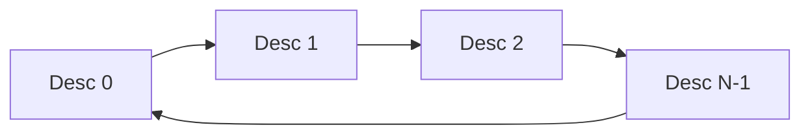
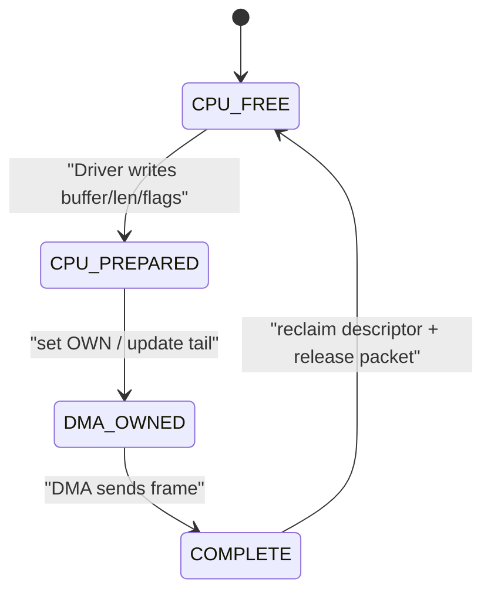
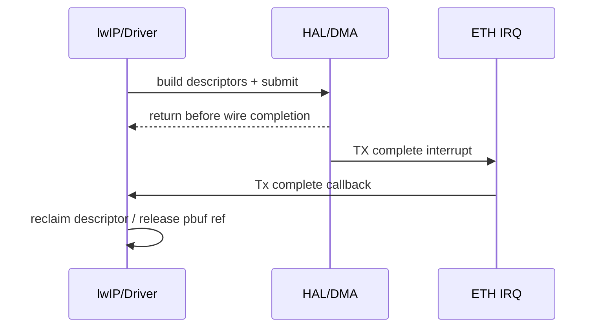
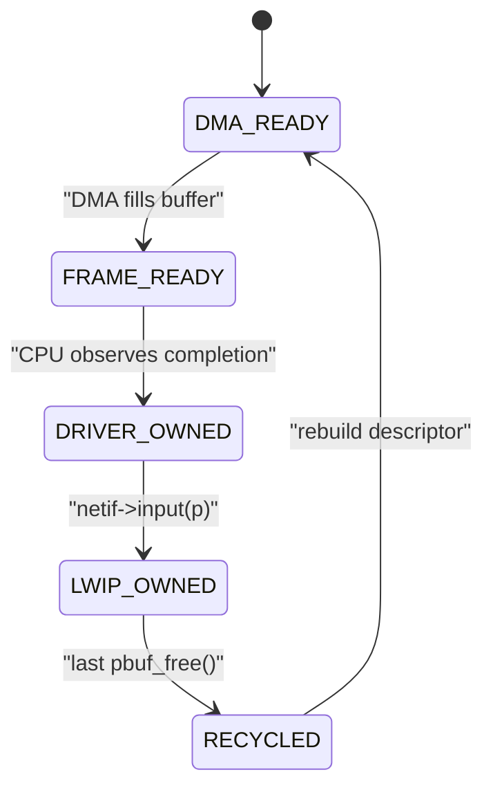
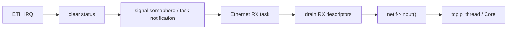
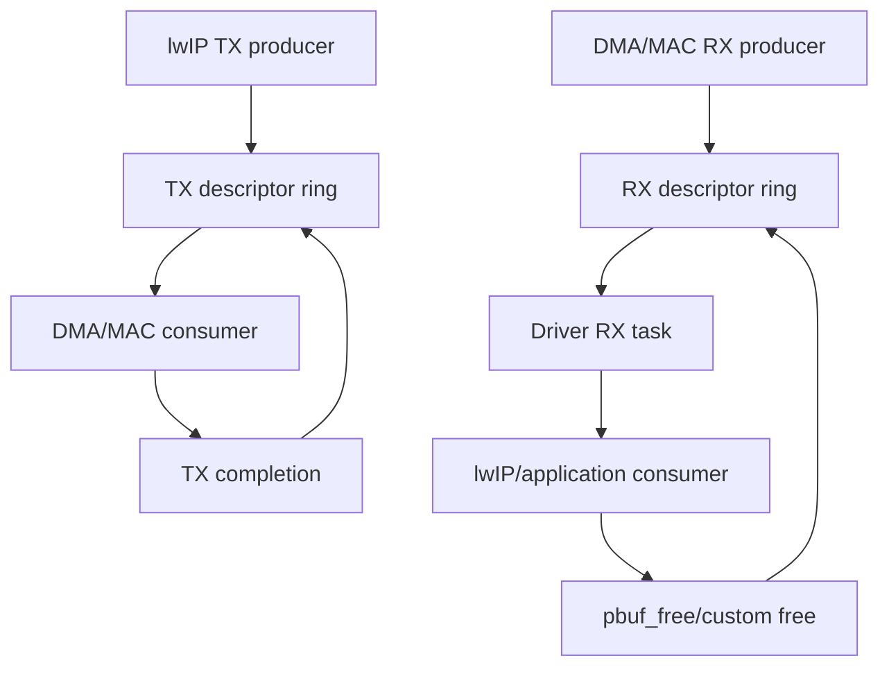

<meta name="referrer" content="no-referrer" />

# 教程 21：从 DMA Descriptor Ring 到 `netif->input()`——ISR、Polling、TX Completion 与 Backpressure

> 摘要：沿真实 Ethernet Driver 边界解释 TX/RX descriptor ring、OWN 状态、ISR 与 polling、资源回收、RX starvation 和 backpressure 如何影响 lwIP。

[TOC]

Stage 20 已经解决“buffer 属于谁”；Stage 21 继续追问一个更具体的问题：**当 DMA descriptor 不够、TX queue 满、RX buffer 用光或中断来不及处理时，packet 会停在哪里，谁负责恢复系统继续前进？**

lwIP Core 并不规定某一种 DMA descriptor 格式，也没有一个统一的 Ethernet ISR API。真正的 descriptor ring、OWN bit、interrupt status、tail pointer 都属于具体 MAC/DMA Driver。为了把这层讲清，本篇仍以 lwIP upstream Ethernet skeleton 作为 Core contract，再用 ST 官方 STM32H7 Ethernet HAL 作为一个具体 ring/interrupt 实现样本。[S1](#source-s1)[S2](#source-s2)

## 1. Stage 21 的入口仍然是 `low_level_output()`，但这次关注它“失败时怎么办”

upstream Ethernet Interface Skeleton 在 `low_level_output()` 注释里留下了一条非常重要的工程提醒：[S1](#source-s1)

> 当 DMA queue 已满时，如果 `low_level_output()` 直接返回 `ERR_MEM`，可能出现奇怪结果；因为除 TCP timer 等少数情况外，stack 不会自动重新发送刚刚因为 Driver queue 满而丢掉的 packet。

这句话说明：**DMA ring 满不是普通的“内存申请失败”语义。** 它更接近一种短暂的发送资源拥塞。

如果 Driver 直接做：

```text
TX descriptor full
→ return ERR_MEM
→ drop current frame
```

上层并不一定会把这个 frame 原样重新送回来。TCP 最终可能通过 retransmission 恢复，但 UDP、ARP、ICMP 或控制报文不具备同样的重试语义。[S1](#source-s1)

因此 Stage 21 的核心不是“descriptor ring 是循环数组”，而是：**ring occupancy 是 Driver 层 backpressure，必须和 packet ownership、唤醒机制、协议层重试语义一起设计。**

## 2. DMA ring 是什么：固定数量 descriptor 在 CPU 与 DMA 之间循环交接

以 STM32H7 HAL 为具体例子，初始化时会建立 TX/RX descriptor list；HAL 源码维护 `CurTxDesc`、`RxDescIdx` 等索引，并通过固定数量 `ETH_TX_DESC_CNT` / `ETH_RX_DESC_CNT` 形成循环使用关系。[S2](#source-s2)

概念上可以画成：



这里的“ring”不是 lwIP 数据结构，而是 MAC DMA Driver 的资源池。每个 descriptor 通常至少描述：

- buffer address；
- buffer length；
- frame first/last segment；
- checksum/CRC/offload attributes；
- ownership / completion status；
- error flags。

具体 bit 定义取决于 MAC IP，本篇只把 STM32H7 作为实例，不把这些字段泛化为所有网卡。[S2](#source-s2)

## 3. TX descriptor 的关键状态不是“空/满”，而是 CPU 与 DMA ownership

STM32H7 HAL 的 `ETH_Prepare_Tx_Descriptors()` 会先检查当前 descriptor 是否仍由 DMA 持有，或者当前 slot 是否还保存着未释放 packet context；若是，就返回 busy。[S2](#source-s2)

因此一个 TX slot 可以抽象为：



OWN bit 的真正意义是：**哪一方此刻可以修改 descriptor/buffer metadata。**

- CPU_FREE：Driver 可以改；
- DMA_OWNED：CPU 不能擅自重写；
- COMPLETE：硬件已经结束当前 descriptor，Driver 需要做 reclaim；
- reclaim 后才再次可用于下一包。

这和 Stage 20 的 pbuf ownership 是两套关联但不同的状态机：descriptor 可以已经完成，而 pbuf reference 还没释放；也可以 pbuf 已经加 ref，但 descriptor 尚未真正交给 DMA。

## 4. `HAL_ETH_Transmit_IT()` 展示了“提交”与“完成”是两个事件

ST HAL 的 interrupt-mode TX API 会把 packet context 保存到 TX descriptor list，准备 descriptors，然后通过 DMA tail pointer 启动传输；函数可以在硬件真正发送完成之前返回。之后 TX complete interrupt 再进入 `HAL_ETH_IRQHandler()`，并调用 TX completion callback。[S2](#source-s2)

这条异步桥接必须显式展开：



因此 asynchronous TX Driver 不能把 `low_level_output()` 返回当作“DMA 已经不再访问 buffer”的依据。

## 5. Polling TX 与 Interrupt TX 的区别不是“有没有 DMA”，而是谁等待 completion

ST HAL 同时提供 blocking/polling TX 和 interrupt TX。[S2](#source-s2)

两者都可以使用 DMA descriptors；区别在于 completion 的等待方式：

| 模式 | 提交后行为 | completion 处理 |
| --- | --- | --- |
| blocking/polling TX | 调用线程等待 descriptor ownership 归还或 timeout | 当前线程轮询 |
| interrupt TX | API 先返回 | IRQ/callback reclaim |

因此“DMA 模式”和“中断模式”不是同义词。DMA 可以被 polling 驱动，也可以被 interrupt 驱动。

对 lwIP Port 来说，真正需要回答的是：`linkoutput()` 要不要阻塞等待 TX slot？如果异步返回，如何保持 pbuf reference？如果 ring 满，如何等待/唤醒？

## 6. 为什么 upstream skeleton 建议 ring 满时“等待空间”而不是直接 drop

继续回到 lwIP upstream 的 `low_level_output()` contract。它明确指出 stack 不会普遍重试 Driver 因 DMA queue full 丢掉的 packet。[S1](#source-s1)

因此一种常见的 RTOS Driver 设计是：

```text
low_level_output()
    ↓
检查 TX descriptor
    ├─ 有空位 → enqueue
    └─ 无空位 → 等待 TX completion semaphore/event
                     ↓
                 descriptor reclaimed
                     ↓
                 retry enqueue
```

这里的 semaphore/event 属于 Port/Driver，不属于 lwIP Ethernet API 强制要求。核心目标是把“暂时没有 descriptor”转换成受控 backpressure，而不是无条件丢包。

需要同时避免另一个极端：**不能在 lwIP Core context 中无限等待。** 如果 TX completion 因 link down、DMA error 或 IRQ 丢失永远不来，无限阻塞会冻结整个 TCP/IP core。因此实际实现通常还要有 timeout、error recovery 或 link-state abort 路径。

## 7. TX ring size 与 `pbuf chain` fragment 数是耦合资源

Stage 20 已看到一个 packet 可能由多个 pbuf fragment 组成。如果 scatter-gather 模式下“一段 pbuf 对应一个或多个 TX descriptor”，那么单个大 packet 就可能消耗多个 descriptor。

因此下面两个数量不能分开看：

```text
TX ring descriptor count
        ×
每个 frame 的 pbuf fragment count
```

`LWIP_NETIF_TX_SINGLE_PBUF` 和 `TCP_OVERSIZE` 可以影响 pbuf fragment 数，但都不是 descriptor ring 的替代品。[S1](#source-s1)

当 `ETH_TX_DESC_CNT` 很小、TCP segment 又经常形成多个 pbuf 时，ring occupancy 会比“每包一个 descriptor”的直觉快得多达到上限。

## 8. RX ring 的状态方向正好相反：DMA 先拥有 buffer

RX 一开始通常是 Driver 准备好 buffer/descriptor，然后交给 DMA。网卡收到 frame 后，DMA 填数据并把完成状态留给 CPU。

可以抽象为：



对于 RX copy Driver，`DRIVER_OWNED → LWIP_OWNED` 之间会 memcpy 到新 PBUF_POOL，原 DMA buffer 可以很快回 ring。

对于 RX zero-copy，DMA buffer 必须等 lwIP 最后一个 reference 释放后才能真正 RECYCLED。于是 RX ring 可用 descriptor 数量和 lwIP/application 持包时间直接耦合。[S1](#source-s1)[S3](#source-s3)

## 9. `HAL_ETH_ReadData()` 展示了 CPU 如何从 RX descriptor ring 消费完成帧

在 STM32H7 HAL 中，`HAL_ETH_ReadData()` 从当前 RX descriptor index 开始检查 descriptor 是否已经不再由 DMA 拥有，再根据 first/last descriptor 标记组合一个完整 frame；处理后推进 ring index。[S2](#source-s2)

这说明 RX poll 函数的核心工作是：

```text
查看当前 descriptor ownership
→ 找到完整 frame
→ 把多个 segment 链起来
→ 把 packet context 返回给上层
→ 为后续 descriptor recycle 更新索引
```

lwIP 本身并不读取 OWN bit；这些细节必须在 `low_level_input()` 下面解决。

## 10. RX Interrupt 不应该直接把整个 TCP/IP 栈跑在硬中断里

ST HAL 的 `HAL_ETH_IRQHandler()` 在收到 RX complete 状态时调用 RX callback；TX complete 时调用 TX callback。[S2](#source-s2)

但是“IRQ callback 被调用”不等于“应该在 ISR 里一路调用 `ethernet_input()`、`ip4_input()`、`tcp_input()`”。

在 OS 模式下，更常见的边界是：



这能缩短 ISR 时间，并让 pbuf allocation、cache maintenance、descriptor rebuild 和 `netif->input()` 运行在普通线程环境。

具体是 semaphore、event flag、task notification 还是 poll loop，是 Port/RTOS 选择；lwIP Core 只要求线程/locking 规则正确。[S1](#source-s1)

## 11. Polling RX 与 Interrupt RX 的真正区别在“谁触发 drain”

ST HAL 文档明确区分：[S2](#source-s2)

- `HAL_ETH_Start()`：不启用传输完成中断，应用通过 `HAL_ETH_ReadData()` polling；
- `HAL_ETH_Start_IT()`：启用 completion interrupt，接收后进入 RX callback。

无论哪种方式，最终都必须消费 RX descriptors 并把 packet 送到 `netif->input()`。

所以可以把三种常见策略看成：

| 策略 | 触发 | 优点 | 风险 |
| --- | --- | --- | --- |
| 纯 polling | 周期性/主循环调用 drain | 简单、无中断抖动 | 空闲时浪费 CPU，poll 周期影响 latency |
| 每包中断 | 每次 RX complete 唤醒 | 低流量 latency 好 | 高 PPS 时中断频率高 |
| interrupt + batch drain | IRQ 只唤醒，task 一次消费多包 | 延迟与吞吐折中 | Driver 状态机更复杂 |

第三种不是 lwIP 强制机制，但它通常更容易把 ISR 与 packet processing 分层。

## 12. RX starvation：不是“没有 packet”，而是“没有 buffer 可以继续交给 DMA”

zero-copy RX 的一个典型压力场景是：application 长时间持有很多 pbuf，custom free 尚未发生，于是 RX pool 无法提供新 buffer。

ST CubeH7 示例用专用 RX pool 和 `RxAllocStatus` 表示这种资源压力；当 `HAL_ETH_RxAllocateCallback()` 无法取得 custom pbuf 时，状态切换为 allocation error；后续 custom free 归还对象时再允许 RX descriptor rebuild 继续推进。[S3](#source-s3)

这条链说明 RX starvation 的资源关系是：

```text
application holds pbuf
        ↓
custom RX buffer not returned
        ↓
RX pool decreases
        ↓
DMA descriptors cannot all be rebuilt
        ↓
RX throughput drops / receive stops
```

这和 heap “还有多少字节”不是同一个问题；即使系统总体 RAM 还很多，固定 RX buffer pool 仍可能被耗尽。

## 13. `pbuf_free_custom()` 是 RX backpressure 的反向释放信号

Stage 20 已经看到 custom free 是 ownership 回程。到了 Stage 21，它还有另一个意义：**它也是 RX resource pressure 缓解的时刻。**

一个 RX buffer 从 lwIP 回到 Driver pool 后，Driver 才能重新挂入 descriptor ring。因此在 zero-copy 模式下，`pbuf_free()` 的时机直接影响 NIC 可接收的 burst 深度。

这也是为什么应用层“不必要地长期保存 RX pbuf”会变成底层丢包或 starvation 问题。

## 14. Backpressure 要区分 TX 与 RX：二者传播方向完全不同

TX backpressure 是从硬件向发送者反向传播：

```text
TX ring full
← Driver
← linkoutput()
← lwIP output path
← application/protocol
```

RX backpressure 则更多体现为“接收资源耗尽”：

```text
application holds pbuf
→ RX buffers unavailable
→ DMA ring cannot refill
→ incoming frames may be dropped by MAC/DMA
```

因此不能用一个统一的 `ERR_MEM` 概念解释两边。

## 15. TCP 可以最终重传，不代表 Driver 可以把 TX ring full 当成正常丢包策略

TCP 的可靠性会让部分 TX drop 最终通过 RTO/fast retransmit 恢复，但代价是：

- latency 上升；
- congestion control 可能误判网络拥塞；
- retransmission 增加带宽与 CPU；
- ARP、ICMP、UDP 等其他 packet 没有 TCP 的端到端恢复机制。

所以“反正 TCP 会重传”不是一个正确的 Driver backpressure 设计原则。upstream skeleton 对 DMA queue full 的警告正是为了避免这种误用。[S1](#source-s1)

## 16. Driver queue 满时最危险的是在错误上下文里等待

如果 `low_level_output()` 运行在 `tcpip_thread`，Driver 选择阻塞等待 TX descriptor 时，就等于阻塞整个 lwIP Core。短时间、可界定的等待可能可接受，但必须明确其后果。

如果 TX completion callback 又依赖同一个被阻塞线程才能执行，就可能形成自锁：

```text
Core thread waits for descriptor
        ↓
completion event queued to Core thread
        ↓
Core thread cannot process event
        ↓
descriptor never reclaimed
```

因此等待机制必须考虑 completion 是 ISR、独立 driver task，还是 Core callback。Stage 11 的 thread/core-locking 模型在这里再次成为硬前提。

## 17. Descriptor ring、buffer pool、pbuf pool 是三个不同资源层

实际嵌入式 Ethernet 系统常同时存在：

| 资源 | 谁管理 | 耗尽时表现 |
| --- | --- | --- |
| DMA descriptor ring | Driver/HAL | 无 slot 可提交/接收 |
| RX/TX DMA buffer pool | Driver/Port | descriptor 没有可挂 buffer |
| lwIP pbuf/memp/mem | lwIP Core | packet object / protocol object 分配失败 |

它们可以互相耦合，但不能混为一个“内存不足”。

例如 zero-copy RX 时，descriptor 数还有空槽，但 custom RX pool 全被 application 持有，仍然无法补 descriptor；反之 pbuf pool 充足也不意味着 TX descriptor 可用。

## 18. 真实 Driver 还必须处理 DMA error，而不是只等正常 completion

ST HAL IRQ handler除了 RX/TX completion，还检查 DMA abnormal/error status；fatal bus error 等状态会进入错误处理路径。[S2](#source-s2)

因此 ring state machine 不能只设计成功路径：

```text
submit
→ complete
→ reclaim
```

还必须存在：

```text
submit
→ DMA error / link loss / timeout
→ stop/reset/reclaim policy
→ wake blocked sender
```

否则“等待 descriptor”的 backpressure 机制在异常情况下会变成永久阻塞。

## 19. Host TAP 能验证的是调度边界，不是硬件 descriptor

当前 Linux TAP 环境仍然没有硬件 DMA ring，因此无法在 PCAP 中直接看到 descriptor OWN bit 或 reclaim index。

但可以用它验证两个上层不变量：

1. `netif->linkoutput()` 仍然是发送 Driver 边界；
2. RX 最终必须通过 `netif->input()` 回到 lwIP Core。

真正的 ring occupancy、IRQ latency、RX starvation、descriptor error 只能在有对应 MAC/DMA Driver 的目标板上验证，或使用专门模拟 ring 状态的测试 harness。

## 20. 从 Stage 20 到 Stage 21，所有权已经变成一个生产者—消费者系统

把整个机制压缩起来：



因此 Stage 21 的核心判断是：**descriptor ring 不是一个被动数组，而是连接 CPU、DMA、lwIP 和 application 的有限容量生产者—消费者系统。**

Stage 22 将继续处理另一个会让整个 ring 突然失效的外部事件：PHY link down/up。下一篇会明确区分 administrative up/down 与 physical link up/down，并追踪 auto-negotiation 结果如何反向配置 MAC speed/duplex，再通知 DHCP、ND6、IGMP/MLD 等 Core 模块。

## 资料来源

<a id="source-s1"></a>
### [S1] lwIP Ethernet Driver Skeleton 与 DMA 相关配置
- 类型：目标版本上游源码
- 版本：commit `d08f4773edd0182b7910fc8f046eed82ffcd67c9`
- 定位：`contrib/examples/ethernetif/ethernetif.c`：`low_level_output()`、`low_level_input()`、`ethernetif_input()`；`src/include/lwip/opt.h`：`LWIP_NETIF_TX_SINGLE_PBUF`、`MEMP_NUM_FRAG_PBUF`；`src/include/lwip/pbuf.h`
- URL/文档：[lwIP upstream commit](https://github.com/lwip-tcpip/lwip/tree/d08f4773edd0182b7910fc8f046eed82ffcd67c9)
- 使用位置：“DMA queue full”“TX pbuf fragments”“RX buffer 生命周期”“Core/Driver 边界”
- 支撑内容：证明 upstream 对 DMA queue full 的显式警告、pbuf chain contract、单 pbuf 选项边界以及 Driver 向 `netif->input()` 交包的通用模型

<a id="source-s2"></a>
### [S2] ST STM32H7 Ethernet HAL Driver
- 类型：厂商官方 Driver 源码
- 版本：GitHub master，访问日期 2026-10-02
- 定位：`stm32h7xx_hal_eth.c`：`HAL_ETH_Init()`、`HAL_ETH_Transmit()`、`HAL_ETH_Transmit_IT()`、`HAL_ETH_ReadData()`、`HAL_ETH_IRQHandler()`、`ETH_DMATxDescListInit()`、`ETH_DMARxDescListInit()`、`ETH_Prepare_Tx_Descriptors()`
- URL/文档：[STM32H7 HAL ETH driver](https://github.com/STMicroelectronics/stm32h7xx-hal-driver/blob/master/Src/stm32h7xx_hal_eth.c)
- 使用位置：“descriptor ring”“OWN/busy”“polling vs interrupt”“IRQ completion”“DMA error”
- 支撑内容：提供一个具体 MAC/DMA Driver 如何管理循环 descriptor index、ownership、tail pointer、RX/TX completion interrupt 和 error path 的实现样本

<a id="source-s3"></a>
### [S3] ST STM32CubeH7 lwIP Ethernet 示例
- 类型：厂商官方 lwIP Port 示例
- 版本：STM32CubeH7 GitHub master，访问日期 2026-10-02
- 定位：`Projects/STM32H743I-EVAL/Applications/LwIP/LwIP_TFTP_Server/Src/ethernetif.c`：`low_level_output()`、`low_level_input()`、`ethernetif_input()`、`HAL_ETH_RxAllocateCallback()`、`HAL_ETH_RxLinkCallback()`、`pbuf_free_custom()`
- URL/文档：[STM32CubeH7 ethernetif.c](https://github.com/STMicroelectronics/STM32CubeH7/blob/master/Projects/STM32H743I-EVAL/Applications/LwIP/LwIP_TFTP_Server/Src/ethernetif.c)
- 使用位置：“RX starvation”“custom RX pool”“descriptor refill”“pbuf lifetime”
- 支撑内容：证明一个具体 lwIP+STM32H7 Port 如何用 custom pbuf pool 向 HAL 提供 RX buffer，并通过最后 free 缓解 RX resource pressure