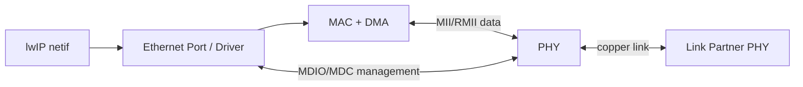
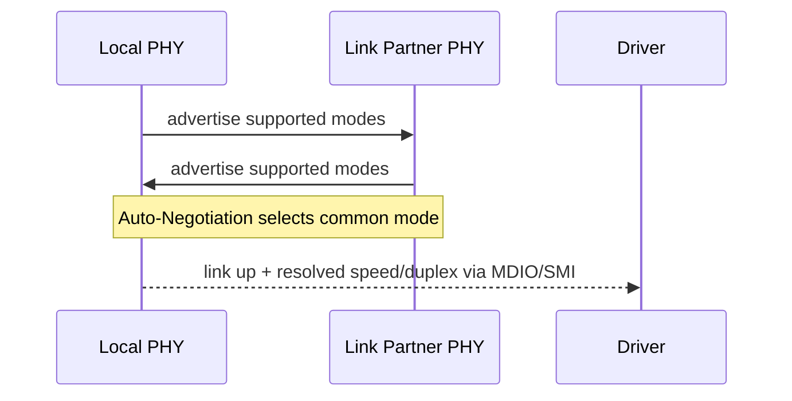
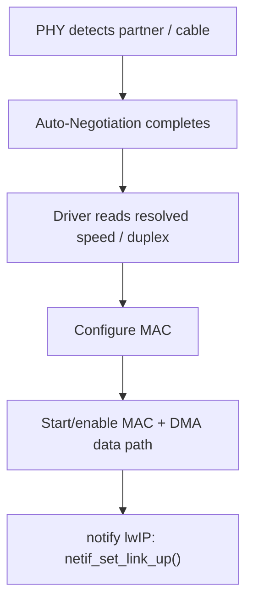
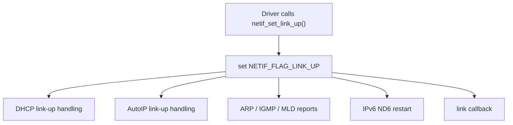
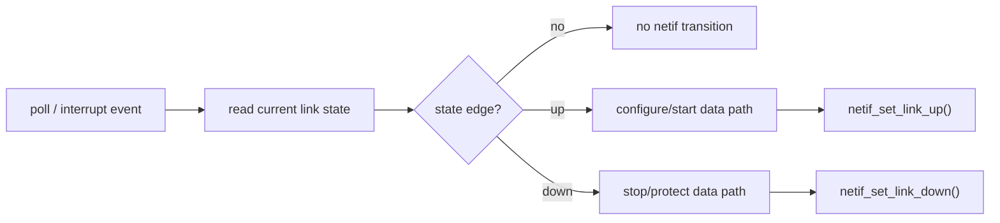

<meta name="referrer" content="no-referrer" />

# 教程 22：从 PHY Auto-Negotiation 到 `netif_set_link_up()`——Link Up/Down、MAC 速率与协议栈恢复

> 摘要：建立 Ethernet PHY link lifecycle，解释 Auto-Negotiation、MAC speed/duplex、admin/link 状态与 lwIP link-up/down 恢复链。

[TOC]

Stage 21 已经把 descriptor ring、completion 和 backpressure 串成了一个稳定的数据面模型，但 DMA 能不能真正发送/接收还有一个更底层前提：**PHY 已经建立物理链路，而且 MAC 的速率与双工模式和 PHY 的协商结果一致。**

PHY（Physical Layer Transceiver，物理层收发器）负责把 MAC（Media Access Control，媒体访问控制）产生的数字链路数据转换成双绞线上的物理信号，并检测对端是否存在。Auto-Negotiation（自动协商）是 Ethernet PHY 之间交换能力并选择共同工作模式的机制；这里的 speed 指链路速率（本文关注 10/100 Mbit/s），duplex 指半双工或全双工工作方式。协商完成后，Driver 需要读回 resolved speed/duplex，配置 MAC，然后才应该把“link 可用”这一事实通知 lwIP。[S3](#source-s3)[S4](#source-s4)

## 阅读前建议：先把 PHY、Auto-Negotiation 与 link state 建立起来

1. [LAN8742A/LAN8742Ai Datasheet](https://ww1.microchip.com/downloads/aemDocuments/documents/OTH/ProductDocuments/DataSheets/DS_LAN8742_00001989A.pdf) §3.2：重点看 Auto-Negotiation、Link Status、Auto-Negotiation Complete 以及协商后 speed/duplex 的读回方式。[S4](#source-s4)
2. [Microchip Ethernet Link Testing Techniques](https://onlinedocs.microchip.com/oxy/GUID-E4098E15-180F-4086-BC4A-070E637A8B56-en-US-1/GUID-B7445640-86EE-4040-90AD-EAA07D5D8F90.html)：用于建立 cable/link、Auto-Negotiation 和寄存器检查的工程心智模型。[S5](#source-s5)
3. [lwIP `netif` API and source](https://github.com/lwip-tcpip/lwip/tree/d08f4773edd0182b7910fc8f046eed82ffcd67c9/src/core)：用于对照 `netif_set_up/down()` 与 `netif_set_link_up/down()` 的不同语义。[S1](#source-s1)

正文不会把这些资料当作必读前置。下面先从系统边界开始，把“PHY 发生了什么、Driver 做什么、lwIP 又做什么”连成一条完整控制流。

## 1. 先看系统位置：PHY、MAC、Driver、lwIP 是四个层次

在典型 MCU Ethernet 系统中，PHY 和 MAC 之间通常通过 MII/RMII 一类数据接口交换 Ethernet symbol/frame 数据；CPU/Driver 通过 MDIO/MDC（也常称 SMI management interface）读写 PHY 管理寄存器。lwIP 并不直接操作 PHY 寄存器，它只接收 Port/Driver 汇报的 link state。[S3](#source-s3)[S4](#source-s4)



四层职责可以这样划分：

| 层次 | 主要职责 |
| --- | --- |
| PHY | 信号检测、Auto-Negotiation、link status、resolved speed/duplex |
| MAC/DMA | 按当前 speed/duplex 发送/接收 frame，管理 descriptor/ring |
| Driver/Port | 读取 PHY、配置 MAC、选择 polling/interrupt policy、通知 lwIP |
| lwIP `netif` | 保存软件接口和 link 状态，触发 DHCP/AutoIP/ND6/report/callback 等协议层动作 |

这张表也是 Stage 22 与 Stage 44 的边界：本篇解释通用 lifecycle；Stage 44 再追 STM32H750/RT-Thread 具体线程、PHY driver 和 DHCP 恢复调用链。

## 2. Auto-Negotiation 解决的是“双方怎样选出共同链路模式”

Link partner 指网线另一端的 PHY，例如交换机端口 PHY。双方并不知道对端支持什么能力，所以 PHY 可以通过 Auto-Negotiation 交换能力广告，并选择双方共同支持的工作模式。以 LAN8742A 为例，协商属于 PHY 层活动，独立于 MAC 控制器；协商结果可以通过管理寄存器读回。[S4](#source-s4)

对 10/100 Ethernet，最常见的结果维度是：

- 10 Mbit/s 或 100 Mbit/s；
- half-duplex（半双工）或 full-duplex（全双工）。

Full-duplex 表示发送和接收可以同时进行；half-duplex 受共享介质/冲突模型约束。Driver 不能凭经验跳过 resolved result，而应以目标 PHY/链路实际状态为准。[S4](#source-s4)



这条过程发生在 PHY 内部，不是 lwIP 状态机。

## 3. “Link Up” 不应该早于 MAC 配置完成

PHY 报告 link up 并不意味着上层立即可以安全发送。Driver 还需要把 resolved speed/duplex 配置到 MAC，使 MAC 时序与 PHY 当前模式一致；必要时还要启动/恢复 DMA 和 MAC TX/RX。[S3](#source-s3)

因此一个稳定的通用顺序是：



反过来，link down 时 Driver 也必须考虑停止/保护数据面、清理 pending DMA ownership 或让等待者退出；这些硬件操作并不是 `netif_set_link_down()` 自动完成的。Stage 21 的 descriptor lifecycle 在这里与 link lifecycle 汇合。

## 4. `NETIF_FLAG_UP` 与 `NETIF_FLAG_LINK_UP` 是两个正交状态

lwIP 在 `struct netif` 中区分 administrative state 与 physical/link state。[S1](#source-s1)

```c
#define NETIF_FLAG_UP           0x01U
#define NETIF_FLAG_LINK_UP      0x04U
```

二者含义不同：

| 状态 | 回答的问题 |
| --- | --- |
| `NETIF_FLAG_UP` | 软件上是否允许这个 netif 参与协议处理 |
| `NETIF_FLAG_LINK_UP` | Driver 是否认为底层 link 当前可用 |

所以这四种组合都具有清晰语义：

| Admin | Link | 含义 |
| --- | --- | --- |
| down | down | 接口停用且物理 link 不可用 |
| up | down | 软件接口启用，但网线/PHY 当前没有有效物理链路 |
| down | up | 物理链路存在，但软件接口被管理性关闭 |
| up | up | 软件与物理条件都允许正常协议活动 |

这一步非常重要，因为很多“网线插了但 DHCP 不工作”“接口 up 但发不出去”的问题，本质上是把两个 flag 当成了同一个状态。

## 5. `netif_set_up/down()` 管软件状态，`netif_set_link_up/down()` 管链路状态

`netif_set_up()` 设置的是 `NETIF_FLAG_UP`；`netif_set_down()` 清除它，并执行 ARP/ND6 等更重的软件状态清理。[S1](#source-s1)

`netif_set_link_up()` / `netif_set_link_down()` 则用于 Driver 汇报物理链路事件。上游源码的函数注释也直接写明：它们由 Driver 在 link goes up/down 时调用。[S1](#source-s1)

这意味着下面两种调用不能互相替代：

```text
netif_set_up()
≠ “网线插上”

netif_set_link_up()
≠ “把接口软件启用”
```

某个 Port 可以在 link event 中同时修改 admin state，这是平台 policy；但不能把这种具体实现策略泛化成 lwIP Core 规定。

## 6. Link-up 在 lwIP 里是一个协议恢复触发点

目标版本 `netif_set_link_up()` 在第一次看到 link 从 down 变 up 时会：[S1](#source-s1)

```c
void
netif_set_link_up(struct netif *netif)
{
  if (!(netif->flags & NETIF_FLAG_LINK_UP)) {
    netif_set_flags(netif, NETIF_FLAG_LINK_UP);

#if LWIP_DHCP
    dhcp_network_changed_link_up(netif);
#endif
#if LWIP_AUTOIP
    autoip_network_changed_link_up(netif);
#endif

    netif_issue_reports(netif,
                        NETIF_REPORT_TYPE_IPV4 | NETIF_REPORT_TYPE_IPV6);
#if LWIP_IPV6
    nd6_restart_netif(netif);
#endif

    NETIF_LINK_CALLBACK(netif);
  }
}
```

这里第一次把 PHY link 与上层协议状态真正连起来：



因此 link up 不是一个纯硬件状态位，它会成为 DHCP 等协议重新评估网络可达性的触发条件。Stage 13 已经讲 DHCP；Stage 17 已经讲 IGMP；Stage 15 建立了 IPv4/IPv6 总览。本篇只说明这些机制如何被同一个 link event 重新串起来，不重新展开各协议内部状态机。

## 7. 为什么 `netif_issue_reports()` 还要同时检查 admin 和 link

目标版本 `netif_issue_reports()` 开头先检查两个 flag：[S1](#source-s1)

```c
if (!(netif->flags & NETIF_FLAG_LINK_UP) ||
    !(netif->flags & NETIF_FLAG_UP)) {
  return;
}
```

这是一个很好的系统边界：

- 只有 admin up：软件想工作，但物理链路不存在，发送 report 没意义；
- 只有 link up：物理 carrier 存在，但接口被软件禁用，也不应该主动发协议 report；
- 两者都 up：才具备“可以对网络重新宣告状态”的条件。

随后函数会根据配置发送 gratuitous ARP、重新报告 IGMP/MLD membership 等。[S1](#source-s1)

## 8. Link-down 与 Link-up 不是机械镜像

当前版本 `netif_set_link_down()` 会清 `NETIF_FLAG_LINK_UP`，通知 AutoIP/ACD，处理特定 IPv6 MTU 状态，并触发 link callback；它没有在这里调用一个对称的 DHCP link-down handler。[S1](#source-s1)

这说明两件事：

1. 协议恢复/退化策略必须以实际源码为准，不能从 up path 推导 down path；
2. Driver 在 link down 时还要做的 MAC/DMA 停止、descriptor/waiter 处理属于 Driver policy，不由这一个 lwIP API 承担。

而 `netif_set_down()` 的语义更强：它清 administrative up，并清理 ARP/ND6 等软件接口状态。[S1](#source-s1)

## 9. Link callback 与 status callback 监听的是不同事件

lwIP 提供两类容易混淆的 callback：[S1](#source-s1)

| callback | 主要事件 |
| --- | --- |
| link callback | `NETIF_FLAG_LINK_UP` 的 up/down 变化 |
| status callback | interface administrative up/down 或地址等状态变化 |

如果应用想知道“网线/PHY 是否掉线”，优先理解 link callback；如果应用想知道“接口软件状态/IP 配置是否变化”，则 status callback 更接近这个语义。

应用层若把二者混成一个“网络好了/坏了”的布尔值，就容易错误地认为“link up == 已经拿到 IP == 业务可以连接”。实际上这是三个不同层次。

## 10. Link Up、Netif Up、IP Ready、业务可用是四个不同条件

一个 Ethernet 产品的恢复过程通常至少经历：


所以：

- PHY link up 只说明物理层已经建立；
- lwIP link up 说明 Driver 已把链路变化通知协议栈；
- IP ready 还可能等待 DHCP 等过程；
- 云连接/MQTT/HTTP 还要等待路由、DNS、TLS 和远端服务。

这个层次区分会在 Stage 44/45 继续使用。

## 11. Polling 还是 PHY interrupt，是 Driver policy

PHY link state 可以通过周期 polling 管理寄存器，也可以使用 PHY interrupt 作为边沿通知。两者最终都需要 Driver 在合适的执行上下文中读取稳定状态、配置 MAC，并调用 `netif_set_link_up/down()`。

upstream Win32 `pcapif` 虽然不是 MCU PHY Driver，但它展示了一个很清楚的 Port 模型：定时获取 adapter link state，只有状态发生变化时才调用 `netif_set_link_up()` 或 `netif_set_link_down()`，随后重新安排下一次检查。[S2](#source-s2)



关键不是“必须 polling 还是 interrupt”，而是 **只在稳定状态边沿产生一次上层 transition**。

## 12. Link flap 为什么必须做状态边沿控制

Link flap 指物理链路在很短时间内反复 up/down。每一次 `netif_set_link_up()` 都可能触发 DHCP/AutoIP、report、ND6 restart 和 callback；如果 Driver 把 PHY 寄存器瞬时抖动直接放大成大量上层 event，就会形成协议状态机反复重启和业务重连风暴。[S1](#source-s1)

因此 Driver 常需要明确：

- PHY status 读取是否需要稳定判定；
- 是否只有 resolved state 真正变化才重配 MAC；
- link state 是否只在边沿改变时通知 lwIP；
- reconfiguration 期间是否暂停 DMA/TX；
- 上层业务重连是否还需要额外 debounce/backoff。

这些是 Driver/product policy，不是 `netif_set_link_*()` 自动提供的功能。

## 13. Auto-Negotiation 结果变化不一定等于 link flag 变化

例如某些硬件/交换机重协商后，link 可能保持 up，但 resolved speed/duplex 发生变化。Driver 如果只盯 `link up/down` 一个位，就可能错过 MAC 需要重新配置的情况。

因此一个完整 PHY monitor 至少区分：

```text
link presence
resolved speed
resolved duplex
(optional) remote fault / negotiation status
```

只有当 MAC 配置和 PHY resolved state 一致后，数据面才真正稳定。具体 STM32H750 Port 怎样存储和比较这些状态留到 Stage 44。

## 14. Host TAP 为什么看不到真实 Auto-Negotiation

当前系列的 Unix TAP Port 在初始化成功后直接调用 `netif_set_link_up(netif)`；它没有外接 MCU PHY，也没有 MDIO、Auto-Negotiation 或 MAC speed/duplex reconfiguration。[S2](#source-s2)

所以 Host TAP 能验证的是：

- `netif_set_link_up/down()` 进入 Core 后的语义；
- link callback / status callback 的区别；
- link event 与协议栈动作之间的关系。

但它不能验证：

- PHY 寄存器读取是否正确；
- Auto-Negotiation 是否完成；
- speed/duplex 是否解析正确；
- MAC 是否按 resolved state 重配置；
- link down 时 DMA/descriptor 是否安全停机。

这些需要真实 MCU/PHY Driver 证据。

## 15. Stage 44 会把这套通用生命周期落到具体 STM32H750/RT-Thread 实现

本篇刻意不展开 STM32H7 `ethernet_link_check_state()`、HAL PHY register、RT-Thread `phy` thread 或 DHCP 恢复调用链。这里需要建立的是可迁移模型：

```text
PHY detects / negotiates
→ Driver reads stable resolved state
→ MAC/DMA configuration follows PHY
→ Driver emits link edge to lwIP
→ lwIP restarts/refreshes protocol state
→ IP/application continue recovery
```

Stage 44 再回答具体平台问题：谁创建 PHY monitor thread、谁调用 `eth_device_linkchange()`、RT-Thread 怎样跨线程到 lwIP、`netif_set_link_up()` 后 DHCP 在当前 Port 中实际怎样恢复。

## 16. 从 Stage 19～22，Ethernet Port 的完整边界已经建立

Stage 19 解决 checksum ownership；Stage 20 解决 pbuf/DMA buffer ownership；Stage 21 解决 descriptor ring 和 backpressure；Stage 22 再补上 PHY/MAC/link lifecycle。

到这里，一个 Ethernet Port 的关键责任可以压缩成四条独立但相互连接的 contract：

1. **Packet contract**：lwIP 交给 Driver 的 pbuf/frame 是什么形态；
2. **Memory contract**：CPU、Driver、DMA 谁拥有/何时回收 buffer；
3. **Resource contract**：descriptor/ring/buffer pool 满时怎样形成 backpressure；
4. **Link contract**：PHY resolved state 怎样变成 MAC 配置和 lwIP link transition。

后面的 MCU 平台篇不再重新发明这些概念，而是验证具体 Driver 是否正确实现它们。

## 资料来源

<a id="source-s1"></a>
### [S1] lwIP netif、DHCP、ND6 与 report 源码
- 类型：目标版本上游源码
- 版本：commit `d08f4773edd0182b7910fc8f046eed82ffcd67c9`
- 定位：`src/include/lwip/netif.h`：`NETIF_FLAG_UP`、`NETIF_FLAG_LINK_UP`；`src/core/netif.c`：`netif_set_up()`、`netif_set_down()`、`netif_set_link_up()`、`netif_set_link_down()`、`netif_issue_reports()`；`src/core/ipv4/dhcp.c`：`dhcp_network_changed_link_up()`
- URL/文档：[lwIP upstream commit](https://github.com/lwip-tcpip/lwip/tree/d08f4773edd0182b7910fc8f046eed82ffcd67c9)
- 使用位置：“admin vs link”“link up/down Core 行为”“协议恢复”“callback”
- 支撑内容：证明目标版本 lwIP 的 link/admin flags 是独立状态，以及 link transition 会触发哪些协议动作和 callback

<a id="source-s2"></a>
### [S2] lwIP Unix TAP 与 Win32 pcapif link-state Port
- 类型：目标版本上游 Port 实现
- 版本：commit `d08f4773edd0182b7910fc8f046eed82ffcd67c9`
- 定位：`contrib/ports/unix/port/netif/tapif.c`；`contrib/ports/win32/pcapif.c`：`pcapif_check_linkstate()`、`PCAPIF_LINKCHECK_INTERVAL_MS`
- URL/文档：[lwIP contrib ports](https://github.com/lwip-tcpip/lwip/tree/d08f4773edd0182b7910fc8f046eed82ffcd67c9/contrib/ports)
- 使用位置：“Host TAP 边界”“link polling”“Port 到 Core 的 link bridge”
- 支撑内容：证明不同 Port 可以直接宣告 link up，也可以周期检测外部 adapter 状态后调用 `netif_set_link_up/down()`

<a id="source-s3"></a>
### [S3] STM32H7 Ethernet Port/HAL 文档与实现样本
- 类型：厂商官方 Driver/Port 资料
- 版本：STM32CubeH7 / STM32H7 HAL，访问日期 2026-10-03
- 定位：CubeH7 `ethernetif.c` 的 PHY/MAC link handling；HAL ETH `HAL_ETH_GetMACConfig()`、`HAL_ETH_SetMACConfig()`、PHY register API
- URL/文档：[STM32CubeH7 ethernetif.c](https://github.com/STMicroelectronics/STM32CubeH7/blob/master/Projects/STM32H743I-EVAL/Applications/LwIP/LwIP_TFTP_Server/Src/ethernetif.c)、[UM2217 STM32H7 HAL and LL Drivers](https://www.st.com/resource/en/user_manual/um2217-stm32cubeh7-stm32cube-embedded-software-package-for-stm32h7-series-stmicroelectronics.pdf)
- 使用位置：“PHY/MAC/Driver 系统边界”“MAC speed/duplex 必须跟随 resolved state”“Stage 44 承接”
- 支撑内容：提供具体 MCU Port 如何读取 PHY、配置 MAC 并启停 Ethernet data path 的实现样本；本文只用于通用机制映射

<a id="source-s4"></a>
### [S4] Microchip LAN8742A/LAN8742Ai 数据手册
- 类型：PHY 厂商数据手册
- 版本：DS00001989A
- URL/文档：[LAN8742A/LAN8742Ai Datasheet](https://ww1.microchip.com/downloads/aemDocuments/documents/OTH/ProductDocuments/DataSheets/DS_LAN8742_00001989A.pdf)
- 使用位置：“Auto-Negotiation”“link partner”“resolved speed/duplex”“MDIO/SMI 管理结果”
- 支撑内容：说明 Auto-Negotiation 属于 PHY 层活动、双方交换能力并选择共同模式，以及协商结果可通过管理寄存器读回

<a id="source-s5"></a>
### [S5] Microchip Ethernet Link Testing Techniques
- 类型：PHY 厂商官方工程资料
- 版本：访问日期 2026-10-03
- URL/文档：[Ethernet Link Testing Techniques](https://onlinedocs.microchip.com/oxy/GUID-E4098E15-180F-4086-BC4A-070E637A8B56-en-US-1/GUID-B7445640-86EE-4040-90AD-EAA07D5D8F90.html)
- 使用位置：“阅读前建议”“PHY/Auto-Negotiation 工程模型”
- 支撑内容：提供铜缆 Ethernet link procedure、forced/auto-negotiation 和 link-status 验证方法，用于承接更深入 PHY 调试
