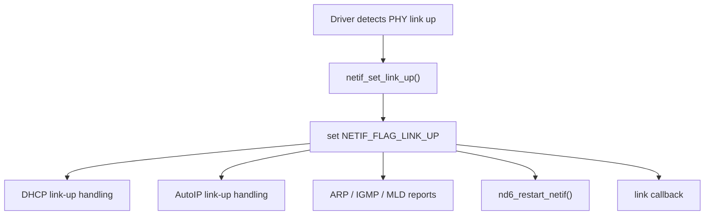
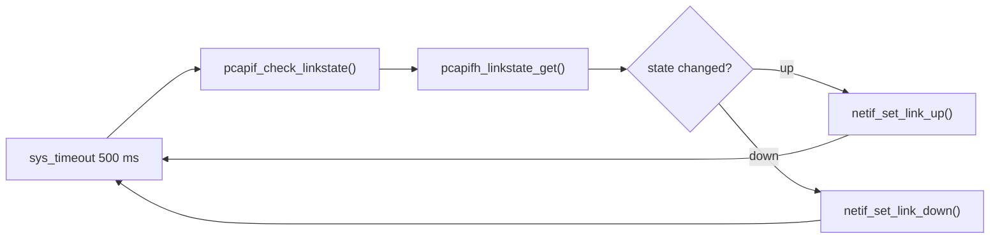
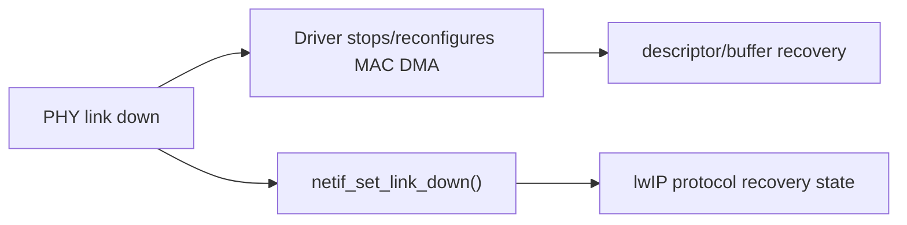

<meta name="referrer" content="no-referrer" />

# 教程 22：从 PHY Auto-Negotiation 到 `netif_set_link_up()`——Link Up/Down、MAC 速率与协议栈恢复

> 摘要：从 PHY 链路检测与自动协商进入 lwIP link state，区分 admin up 与 physical link，并追踪 MAC speed/duplex、DHCP、ND6 与组播报告恢复。

[TOC]

Stage 21 已经建立 DMA ring 的运行模型，但 descriptor ring 能正常工作还有一个更底层前提：**PHY 真的已经建立链路，而且 MAC 的 speed/duplex 配置与 PHY 协商结果一致。**

这篇不把 PHY 当作“网线插上就是 up”的黑盒，而是沿一条真实链路走完：PHY 通过 MDIO 报告 link/auto-negotiation 结果，Driver 配置 MAC，然后调用 lwIP 的 `netif_set_link_up()` / `netif_set_link_down()`；Core 再据此触发 DHCP、AutoIP、ARP/IGMP/MLD、ND6 与 link callback。[S1](#source-s1)[S3](#source-s3)

## 1. 先消歧：`NETIF_FLAG_UP` 和 `NETIF_FLAG_LINK_UP` 不是同一件事

`src/include/lwip/netif.h` 同时定义了 administrative state 与 physical/link state。[S1](#source-s1)

```c
#define NETIF_FLAG_UP           0x01U
#define NETIF_FLAG_LINK_UP      0x04U
```

对应查询宏也是两个：

```c
#define netif_is_up(netif) \
  (((netif)->flags & NETIF_FLAG_UP) ? (u8_t)1 : (u8_t)0)
#define netif_is_link_up(netif) \
  (((netif)->flags & NETIF_FLAG_LINK_UP) ? (u8_t)1 : (u8_t)0)
```

二者回答的问题不同：

| 状态 | 问题 |
| --- | --- |
| `NETIF_FLAG_UP` | 软件上是否允许这个 netif 参与协议处理 |
| `NETIF_FLAG_LINK_UP` | Driver 判断物理链路是否可用 |

因此：

```text
netif up + link down
```

是合法状态，表示接口在软件上启用，但网线/PHY 当前没有 carrier；而：

```text
netif down + link up
```

也可能短暂存在，表示物理 carrier 存在，但软件管理状态关闭。

## 2. `netif_set_up()` 是 administrative transition，不等于“网线接通”

进入 `netif_set_up()`：[S1](#source-s1)

```c
void
netif_set_up(struct netif *netif)
{
  LWIP_ASSERT_CORE_LOCKED();

  LWIP_ERROR("netif_set_up: invalid netif", netif != NULL, return);

  if (!(netif->flags & NETIF_FLAG_UP)) {
    netif_set_flags(netif, NETIF_FLAG_UP);

    MIB2_COPY_SYSUPTIME_TO(&netif->ts);

    NETIF_STATUS_CALLBACK(netif);

    netif_issue_reports(netif,
                        NETIF_REPORT_TYPE_IPV4 | NETIF_REPORT_TYPE_IPV6);
#if LWIP_IPV6
    nd6_restart_netif(netif);
#endif
  }
}
```

这里设置的是 `NETIF_FLAG_UP`。随后 `netif_issue_reports()` 还会再检查 **link 与 admin 是否都 up**，只有两者同时满足才真的发送 gratuitous ARP、IGMP/MLD report 等。[S1](#source-s1)

所以 `netif_set_up()` 不是“强制把 link 变成 up”。

## 3. `netif_set_link_up()` 才是 Driver 把物理链路变化通知给 Core 的入口

进入 `netif_set_link_up()`：[S1](#source-s1)

```c
void
netif_set_link_up(struct netif *netif)
{
  LWIP_ASSERT_CORE_LOCKED();

  LWIP_ERROR("netif_set_link_up: invalid netif", netif != NULL, return);

  if (!(netif->flags & NETIF_FLAG_LINK_UP)) {
    netif_set_flags(netif, NETIF_FLAG_LINK_UP);

#if LWIP_DHCP
    dhcp_network_changed_link_up(netif);
#endif

#if LWIP_AUTOIP
    autoip_network_changed_link_up(netif);
#endif

    netif_issue_reports(netif,
                        NETIF_REPORT_TYPE_IPV4 | NETIF_REPORT_TYPE_IPV6);
#if LWIP_IPV6
    nd6_restart_netif(netif);
#endif

    NETIF_LINK_CALLBACK(netif);
  }
}
```

这条调用链说明 link-up 不是一个纯 flag update。它还是多个协议状态机的恢复触发点：



Stage 13、15、15、17、15 中分别看到过 DHCP、ND6、SLAAC、IGMP、MLD，这里第一次能看到它们如何在“物理链路重新出现”时被一个 netif event 串起来。

## 4. `netif_set_link_down()` 的行为并不是 `netif_set_link_up()` 的机械镜像

继续进入 `netif_set_link_down()`：[S1](#source-s1)

```c
void
netif_set_link_down(struct netif *netif)
{
  LWIP_ASSERT_CORE_LOCKED();

  LWIP_ERROR("netif_set_link_down: invalid netif", netif != NULL, return);

  if (netif->flags & NETIF_FLAG_LINK_UP) {
    netif_clear_flags(netif, NETIF_FLAG_LINK_UP);

#if LWIP_AUTOIP
    autoip_network_changed_link_down(netif);
#endif

#if LWIP_ACD
    acd_network_changed_link_down(netif);
#endif

#if LWIP_IPV6 && LWIP_ND6_ALLOW_RA_UPDATES
    netif->mtu6 = netif->mtu;
#endif

    NETIF_LINK_CALLBACK(netif);
  }
}
```

当前版本里，link-down 会清 `NETIF_FLAG_LINK_UP`，通知 AutoIP/ACD，恢复 `mtu6` 的特定状态并触发 link callback；它没有在这里直接调用一个对称的 `dhcp_network_changed_link_down()`。[S1](#source-s1)

这意味着不能凭“up 路径做了什么”推测 down 路径也一定一一对应。源码必须按实际分支阅读。

## 5. `netif_set_down()` 比 link-down 更重：它是软件接口停用

进入 `netif_set_down()`：[S1](#source-s1)

```c
void
netif_set_down(struct netif *netif)
{
  LWIP_ASSERT_CORE_LOCKED();

  LWIP_ERROR("netif_set_down: invalid netif", netif != NULL, return);

  if (netif->flags & NETIF_FLAG_UP) {
    netif_clear_flags(netif, NETIF_FLAG_UP);
    MIB2_COPY_SYSUPTIME_TO(&netif->ts);

#if LWIP_IPV4 && LWIP_ARP
    if (netif->flags & NETIF_FLAG_ETHARP) {
      etharp_cleanup_netif(netif);
    }
#endif

#if LWIP_IPV6
    nd6_cleanup_netif(netif);
#endif

    NETIF_STATUS_CALLBACK(netif);
  }
}
```

这里会清理 ARP/ND6 状态，因此语义比“carrier 暂时掉线”更强。

某个具体 Port 可以选择在 PHY link down 时同时调用 `netif_set_down()` 与 `netif_set_link_down()`；但这是 Port policy，不是 lwIP Core 强制要求。后面 STM32H7 示例正好体现了这种策略。[S3](#source-s3)

## 6. 当前 Unix TAP Port 为什么几乎看不到真实 PHY 自动协商

当前项目的 Unix `tapif` 是 Host file descriptor Port，没有 MCU PHY。初始化时它会把 TAP 设备打开并直接调用 `netif_set_link_up(netif)`。[S2](#source-s2)

因此 Stage 2 以来的 TAP 实验中：

```text
TAP fd ready
→ Port declares link up
```

不存在真实的：

```text
PHY cable detect
→ auto-negotiation
→ speed/duplex resolve
→ MAC reconfiguration
```

所以 Host TAP 非常适合协议栈数据面，但不适合验证 PHY/MAC link negotiation。

## 7. upstream Win32 `pcapif` 展示了“定时检测 link → 通知 netif”的完整桥接

`pcapif` 是一个更接近真实 link monitor 的 upstream Port。它可选择每 500 ms 通过 helper 获取 adapter link state；如果 event 变化，就调用 `netif_set_link_up()` 或 `netif_set_link_down()`，随后用 `sys_timeout()` 安排下一次检查。[S2](#source-s2)

主链是：



这条链很重要，因为它说明 `netif_set_link_*()` 不要求由硬中断直接调用；Driver 可以通过 polling/task/timer 检测 physical state，再在符合 Core locking 规则的上下文中通知 lwIP。

## 8. 真正 MCU PHY 通常通过 MDIO/MDC 暴露管理寄存器

以 LAN8742 为例，MAC 与 PHY 除了 MII/RMII 数据接口，还通过 Serial Management Interface 访问 PHY control/status registers。STM32H7 Ethernet HAL 对外提供 `HAL_ETH_ReadPHYRegister()` / `HAL_ETH_WritePHYRegister()`；CubeH7 lwIP Port 再把它们包装成 LAN8742 Driver 的 bus IO callback。[S3](#source-s3)[S4](#source-s4)

因此不要把两组信号混在一起：

| 接口 | 作用 |
| --- | --- |
| MII/RMII | 实际 Ethernet 数据在 MAC 与 PHY 之间传输 |
| MDC/MDIO | CPU/MAC 管理逻辑读写 PHY register |

link status、auto-negotiation complete、speed/duplex resolve 都属于后者的管理面信息。

## 9. Auto-negotiation 在 PHY 内部完成，不是 lwIP 状态机

LAN8742 数据手册说明 auto-negotiation 是 PHY 层机制：两个 link partner 通过 Fast Link Pulse 交换能力，并选择双方都支持的最高优先级模式；协商结果再通过 PHY status/control registers 提供给控制器读取。[S4](#source-s4)

对 LAN8742 这类 10/100 PHY，常见结果包括：

- 100M Full Duplex；
- 100M Half Duplex；
- 10M Full Duplex；
- 10M Half Duplex。

Basic Status Register 还区分：

- Link Status；
- Auto-Negotiate Complete；
- Auto-Negotiate Ability。

这些状态先存在 PHY，不会自动修改 lwIP `netif->flags`。[S4](#source-s4)

## 10. PHY link up 之后还不能马上通知 lwIP：MAC speed/duplex 必须先匹配

如果 PHY 最终协商为 100M full-duplex，而 MAC 仍按 10M/half-duplex 配置，物理 carrier 虽然存在，数据面仍可能错误。

ST CubeH7 的 `ethernet_link_check_state()` 给出了完整顺序：[S3](#source-s3)

```text
LAN8742_GetLinkState()
        ↓
解析 10/100 + half/full
        ↓
HAL_ETH_GetMACConfig()
        ↓
修改 MAC Speed / Duplex
        ↓
HAL_ETH_SetMACConfig()
        ↓
HAL_ETH_Start()
        ↓
netif_set_up()
        ↓
netif_set_link_up()
```

这里“先配置 MAC，再告诉 lwIP link up”是关键顺序。

## 11. STM32H7 示例的 link-down 策略比 lwIP Core 的 link-down 更激进

同一个 `ethernet_link_check_state()` 在检测到 PHY down 时，会停止 Ethernet HAL，然后调用 `netif_set_down()` 和 `netif_set_link_down()`。[S3](#source-s3)

因此它的策略是：

```text
PHY link down
→ stop MAC/DMA
→ administrative down
→ physical link down
```

而 lwIP Core 本身允许只执行：

```text
netif_set_link_down()
```

保持 `NETIF_FLAG_UP` 不变。

这就是 Core contract 与 Port policy 的典型区别。具体产品希望 cable 拔出时保留 IP/admin configuration，还是把接口完整 down，再决定是否照搬 Cube 示例。

## 12. Link-up 之后 `netif_issue_reports()` 为什么要同时检查两个 flag

`netif_issue_reports()` 的开头逻辑是：[S1](#source-s1)

```c
if (!(netif->flags & NETIF_FLAG_LINK_UP) ||
    !(netif->flags & NETIF_FLAG_UP)) {
  return;
}
```

只有 physical link 与 administrative state 都允许，lwIP 才会发恢复性 control traffic。

IPv4 侧可能包括 gratuitous ARP 与 IGMP membership report；IPv6 侧包括 MLD group report，并配合 `nd6_restart_netif()` 重新建立 ND/Router discovery 行为。[S1](#source-s1)

这解释了为什么两个 flag 必须分开存在：任何一个单独为真都不足以真正发 packet。

## 13. DHCP 在 cable reconnect 时为什么会重新进入 discover/reboot 路径

`netif_set_link_up()` 直接调用 `dhcp_network_changed_link_up(netif)`。Stage 13 已经读过该函数：BOUND/RENEWING/REBINDING 等状态会进入 reboot 流程，其他需要重新获取配置的状态可能重新 discover。[S1](#source-s1)

因此 cable reconnect 不是“把旧 IP flag 打开”这么简单。Core 会根据 DHCP 当前 state 判断旧 lease 是否需要重新确认。

这也是 link event 应该准确反映 physical state 的原因：Driver 如果频繁抖动地调用 link up/down，会反复触发协议恢复动作。

## 14. IPv6 link-up 会触发 `nd6_restart_netif()`，所以它不仅影响 Neighbor Cache

`netif_set_link_up()` 和 `netif_set_up()` 都可能调用 `nd6_restart_netif()`。[S1](#source-s1)

Stage 15 总览中的 ND、RS/RA、SLAAC 依赖 link-local address、neighbor discovery 与 router discovery。link 恢复后，Core 需要重新启动相应行为，而不是只保留旧邻居项继续发送。

因此下面这条链是跨多个旧章节的统一入口：

```text
PHY carrier restored
→ MAC configured
→ netif_set_link_up()
→ ND6 restart
→ RS/RA/neighbor activity resumes
```

## 15. IGMP/MLD membership 也需要在 link 恢复后重新向网络声明

`netif_issue_reports()` 在 link/admin 都 up 时会调用：

- IPv4 `igmp_report_groups()`；
- IPv6 `mld6_report_groups()`。[S1](#source-s1)

这不是重新创建 membership object，而是把本机已有 membership 重新向链路上的 multicast infrastructure 宣告。

所以 Stage 17 的 IGMP group state 与 Stage 15 概览中的 IPv6 multicast/MLD 并不孤立；它们也受 link lifecycle 驱动。

## 16. Link callback 与 status callback 也必须分清

lwIP 提供两类回调概念：[S1](#source-s1)

- `NETIF_STATUS_CALLBACK`：administrative up/down 或地址等状态变化；
- `NETIF_LINK_CALLBACK`：physical link up/down。

应用若关心“网线是否插着”，应该观察 link callback；若关心“接口是否被软件启用、地址是否可用”，status callback 更接近需求。

混用二者会导致经典错误：把 DHCP 地址变化误当 PHY link event，或把 cable unplug 当成接口配置被删除。

## 17. Auto-negotiation 结果变化不一定伴随 link flag 从 down 变 up

某些 PHY/交换机环境可能在重新协商、节能、link partner 变化后得到新的 speed/duplex。此时 Driver 仍需要确保 MAC 配置和 PHY resolve 一致。

本篇使用的 CubeH7 示例主要在 link transition 时重新配置 MAC；更复杂产品可能需要处理“link 仍然存在但 negotiated mode 变化”的场景。具体机制取决于 PHY interrupt/status 能力和 Driver policy，lwIP Core 不感知 10M/100M/full/half 这些物理属性。[S3](#source-s3)[S4](#source-s4)

## 18. Poll PHY 还是用 PHY interrupt，同样属于 Driver policy

常见方式有两种：

| 方式 | 触发 | 特点 |
| --- | --- | --- |
| periodic PHY polling | task/timer 定期读 MDIO status | 简单，检测延迟由周期决定 |
| PHY interrupt | PHY IRQ 通知 link/status change | latency 低，但需处理 IRQ/debounce/status clear |

无论哪种方式，最终都应该汇入一个受控的 link-state handler：读取/确认 PHY 状态、必要时配置 MAC，然后在正确 lwIP Core/locking 上下文调用 `netif_set_link_up/down()`。

upstream `pcapif` 的 500 ms polling 和 STM32H7 的 `ethernet_link_check_state()` 分别提供了两种“检测层与 Core 通知层分离”的例子。[S2](#source-s2)[S3](#source-s3)

## 19. Link flap 会放大成协议栈事件风暴，因此 Driver 需要稳定的状态边沿

`netif_set_link_up/down()` 自己会检查 flag，只有状态真正变化时才执行内部动作。这可以过滤“连续重复通知同一个状态”。[S1](#source-s1)

但如果 PHY 在短时间内真的交替报告 up/down，Core 会看到真实边沿，并可能反复执行 DHCP reboot、ND6 restart、IGMP/MLD report、callbacks。

因此 PHY debounce/stability window 是否需要存在，是 Driver/产品问题。lwIP 不替 PHY 判断 carrier 是否已经稳定。

## 20. Link down 时 DMA ring 怎么办，不由 `netif_set_link_down()` 自动解决

Stage 21 的 TX/RX descriptors 属于 MAC/DMA Driver。`netif_set_link_down()` 只更新 lwIP link state 和相关协议逻辑，不会替 Driver：

- stop MAC DMA；
- reclaim TX descriptors；
- flush hardware queue；
- recycle RX buffers；
- clear DMA error status。

所以实际 link-down 流程通常至少有两条同步变化：



顺序与并发保护必须由 Port 设计。

## 21. 一个稳定的 MCU link-management 流程应该明确四个层次

把本篇压缩成四层：

```text
PHY
  link detect / auto-negotiation / resolved speed-duplex
        ↓ MDIO status
Driver
  configure MAC / start-stop DMA / recover descriptors
        ↓
Port
  call netif_set_link_up/down in valid Core context
        ↓
lwIP Core
  DHCP / AutoIP / ARP / IGMP / MLD / ND6 / callbacks
```

只要四层边界清晰，很多问题就能快速定位：

- PHY 一直 down：查 cable/clock/strap/MDIO/auto-negotiation；
- PHY up 但无流量：查 MAC speed/duplex、RMII clock、DMA ring；
- MAC 能收发但 DHCP 不恢复：查 `netif_set_link_up()` 是否正确通知 Core；
- link callback 正常但接口仍不发包：再检查 `NETIF_FLAG_UP` 是否为真。

## 22. 当前 Host 实验能验证哪一段

Unix TAP 可以验证 `netif_set_link_up/down()` 之后的 Core 行为，但不能验证真实 PHY negotiation。

Win32 `pcapif` 则能展示一个真实的“OS adapter link monitor → lwIP link event”桥接，但它仍不是 MCU MII/RMII PHY。

若要验证 Stage 22 的完整链，需要目标板具备可读 PHY status，并观察：

```text
PHY register / PHY driver state
→ MAC speed/duplex
→ DMA start/stop
→ netif flags
→ DHCP/ND6/multicast reports
```

本篇没有在当前会话执行目标板 PHY 实验；这些行为依据源码与厂商官方资料建立。

## 23. Stage 19～22 已经把 lwIP 一直追到物理链路管理边界

从 Stage 19 开始，系列已经连续走完：

```text
checksum generation/verification
        ↓
netif->linkoutput()
        ↓
pbuf / DMA buffer ownership
        ↓
descriptor ring / ISR / backpressure
        ↓
MAC / DMA
        ↓
PHY auto-negotiation / link state
        ↓
netif_set_link_up/down()
        ↓
DHCP / ND6 / IGMP / MLD recovery
```

Stage 22 的核心判断是：**PHY link、MAC configuration、Driver DMA state 与 lwIP netif state 是四个不同对象；正确 Port 必须把它们按明确顺序连接，而不能把“网线插上”简化成一个 flag。**

## 资料来源

<a id="source-s1"></a>
### [S1] lwIP netif、DHCP、ND6 与 report 源码
- 类型：目标版本上游源码
- 版本：commit `d08f4773edd0182b7910fc8f046eed82ffcd67c9`
- 定位：`src/include/lwip/netif.h`：`NETIF_FLAG_UP`、`NETIF_FLAG_LINK_UP`；`src/core/netif.c`：`netif_set_up()`、`netif_set_down()`、`netif_set_link_up()`、`netif_set_link_down()`、`netif_issue_reports()`；`src/core/ipv4/dhcp.c`：`dhcp_network_changed_link_up()`
- URL/文档：[lwIP upstream commit](https://github.com/lwip-tcpip/lwip/tree/d08f4773edd0182b7910fc8f046eed82ffcd67c9)
- 使用位置：“admin vs link”“link up/down Core 行为”“DHCP/ND6/IGMP/MLD 恢复”“callback”
- 支撑内容：证明 current lwIP link/admin flags 是独立状态，以及 link transition 会触发哪些协议与 callback

<a id="source-s2"></a>
### [S2] lwIP Unix TAP 与 Win32 pcapif link-state Port
- 类型：目标版本上游 Port 实现
- 版本：commit `d08f4773edd0182b7910fc8f046eed82ffcd67c9`
- 定位：`contrib/ports/unix/port/netif/tapif.c`；`contrib/ports/win32/pcapif.c`：`pcapif_check_linkstate()`、`PCAPIF_LINKCHECK_INTERVAL_MS`
- URL/文档：[lwIP contrib ports](https://github.com/lwip-tcpip/lwip/tree/d08f4773edd0182b7910fc8f046eed82ffcd67c9/contrib/ports)
- 使用位置：“Host TAP 边界”“500 ms link polling”“Port 到 Core 的 link bridge”
- 支撑内容：证明不同 Port 可以直接宣告 link up，也可以周期检测外部 adapter 状态后调用 `netif_set_link_up/down()`

<a id="source-s3"></a>
### [S3] ST STM32CubeH7 lwIP Ethernet Port 与 STM32H7 HAL ETH
- 类型：厂商官方 Driver/Port 示例
- 版本：GitHub master，访问日期 2026-10-02
- 定位：CubeH7 `ethernetif.c`：`low_level_init()`、`ethernet_link_check_state()`、`ETH_PHY_IO_ReadReg()`、`ETH_PHY_IO_WriteReg()`；HAL ETH：`HAL_ETH_ReadPHYRegister()`、`HAL_ETH_WritePHYRegister()`、`HAL_ETH_GetMACConfig()`、`HAL_ETH_SetMACConfig()`、`HAL_ETH_Start()`、`HAL_ETH_Stop()`
- URL/文档：[STM32CubeH7 ethernetif.c](https://github.com/STMicroelectronics/STM32CubeH7/blob/master/Projects/STM32H743I-EVAL/Applications/LwIP/LwIP_TFTP_Server/Src/ethernetif.c)；[STM32H7 HAL ETH driver](https://github.com/STMicroelectronics/stm32h7xx-hal-driver/blob/master/Src/stm32h7xx_hal_eth.c)
- 使用位置：“MDIO bridge”“resolved speed/duplex”“MAC reconfiguration”“具体 link-up/down policy”
- 支撑内容：提供一个真实 STM32 Port 从 LAN8742 state 到 MAC speed/duplex、HAL start/stop 与 lwIP netif transition 的实现样本

<a id="source-s4"></a>
### [S4] Microchip LAN8742A/LAN8742Ai 数据手册
- 类型：PHY 厂商数据手册
- 版本：DS00001989A
- URL/文档：[LAN8742A/LAN8742Ai Datasheet](https://www.microchip.com/content/dam/mchp/documents/OTH/ProductDocuments/DataSheets/DS_LAN8742_00001989A.pdf)
- 使用位置：“Auto-negotiation”“Basic Status Register”“link status / AN complete”“10/100 与 duplex resolve”
- 支撑内容：说明 auto-negotiation 属于 PHY 层活动、Link Status/Auto-Negotiation Complete 寄存器语义以及协商后的 speed/duplex 能力选择