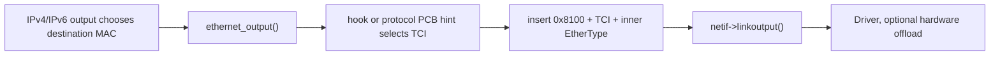
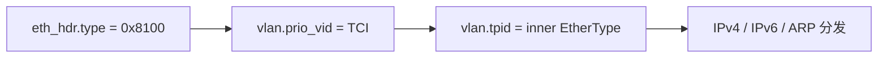
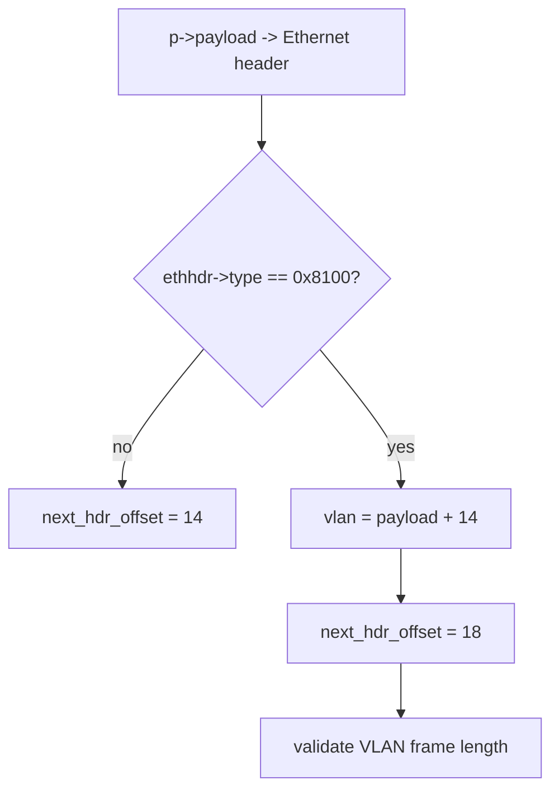
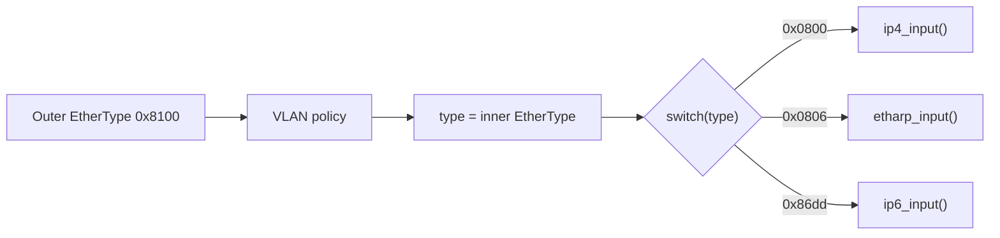
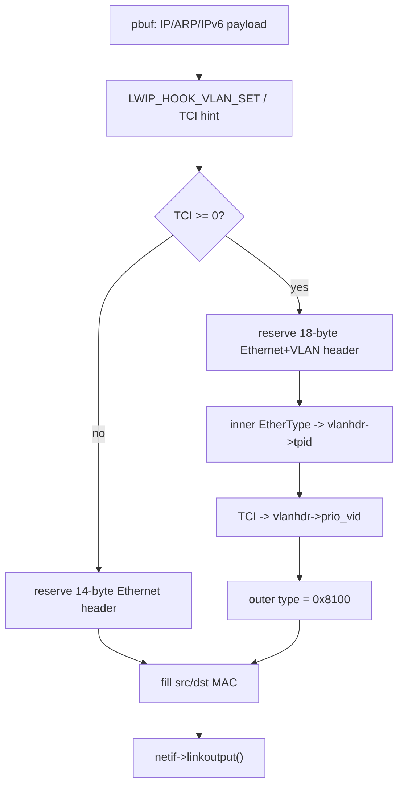
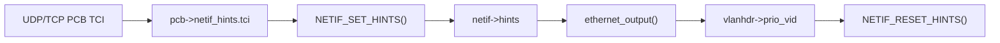
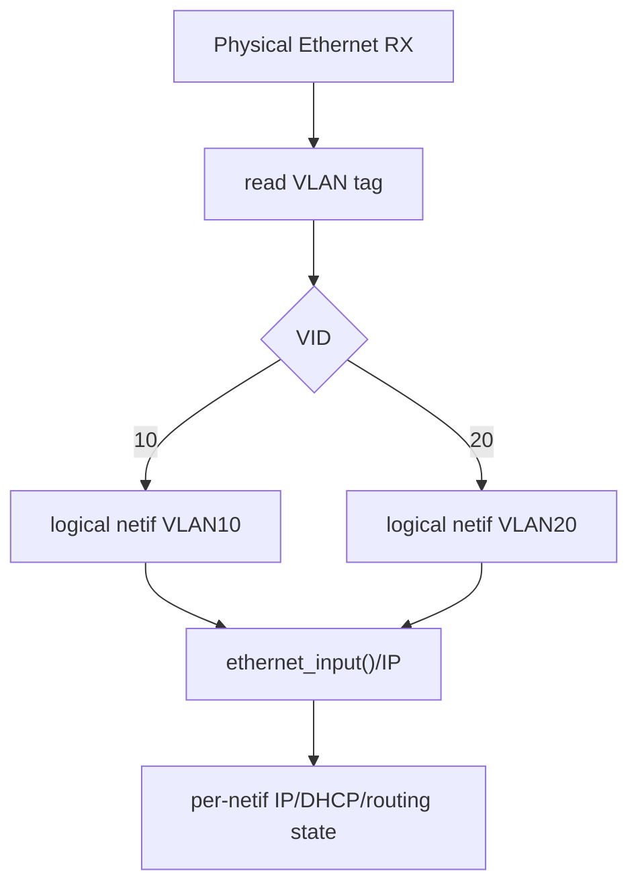
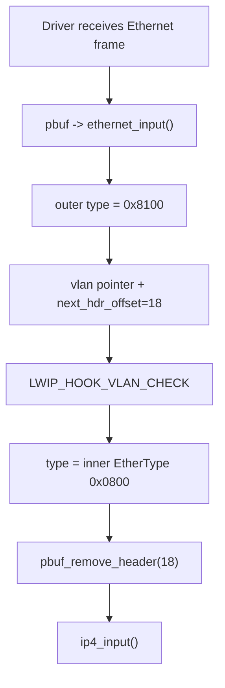
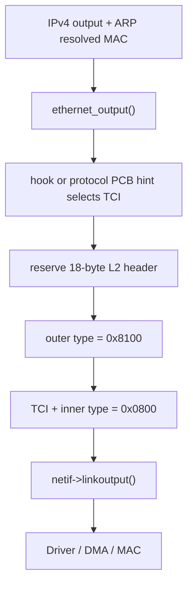

<meta name="referrer" content="no-referrer" />

# 教程 23：从 `ethernet_input()` 到 `LWIP_HOOK_VLAN_SET`——802.1Q VLAN Tag、VID/PCP 与硬件 Offload

> 摘要：沿 Ethernet RX/TX 真实路径追踪 802.1Q 标签解析、字段映射、VLAN 策略 hook 与软硬件卸载边界。

[TOC]

VLAN（Virtual Local Area Network，虚拟局域网）用于在同一套 Ethernet 基础设施上建立彼此隔离的二层广播域。IEEE 802.1Q 定义了常见的 Customer VLAN Tag（C-Tag）：在线上 Ethernet frame 中插入 4-byte tag，其中 TPID（Tag Protocol Identifier）标识 tag 类型，TCI（Tag Control Information）内部再保存 **VID（VLAN Identifier）**、**PCP（Priority Code Point）**与 **DEI（Drop Eligibility Indicator）**。[S3](#source-s3)[S5](#source-s5)

标题中的 hardware offload（硬件卸载）指 Ethernet MAC（Media Access Control，媒体访问控制）/Driver 代替 lwIP software path 做 VLAN tag insertion、stripping 或 filtering。这里的 hook 是项目可提供的策略扩展点；Port 是把 lwIP 接到具体 OS/Driver/hardware 的平台适配层。lwIP Core 只定义软件解析/构造与 hook 边界，是否由 MAC/DMA（Direct Memory Access，直接内存访问）硬件完成，需要 Port/Driver 单独建立契约。[S1](#source-s1)[S6](#source-s6)

## 0. 阅读源码前：建议提前阅读

以下资料用于标准语义和工程扩展，正文仍会完整解释当前源码主线需要的 tag layout、字段和 RX/TX 行为：

1. [IEEE 802.1Q-2022](https://standards.ieee.org/ieee/802.1Q/10323/)：VLAN 感知网桥、tagging 和优先级/Traffic Class 等标准语义来源。[S3](#source-s3)
2. [IANA IEEE 802 Numbers](https://www.iana.org/assignments/ieee-802-numbers/ieee-802-numbers.xhtml)：用于核对 `0x8100` Customer VLAN Tag Type 和 `0x88A8` Service VLAN Tag Type 等 EtherType 编号。[S4](#source-s4)
3. [Cisco — Configuring 802.1Q VLAN Interfaces](https://www.cisco.com/c/en/us/td/docs/iosxr/ncs5000/interfaces/711x/configuration/guide/b-interfaces-hardware-component-cg-ncs5000-711x/configuring-802-vlan-interfaces.html)：作为带 tag/不带 tag frame 与 VLAN interface 的工程视角补充。[S7](#source-s7)
4. [STM32H7 HAL/LL Driver User Manual](https://www.st.com/resource/en/user_manual/um2217-description-of-stm32h7-hal-and-lowlayer-drivers-stmicroelectronics.pdf)：用于理解真实 MAC hardware 可能提供 VLAN compare、tag insertion/replacement 等能力；本文只把它作为 offload 示例，不把 ST HAL 行为泛化成 lwIP 规范。[S6](#source-s6)

## 1. 先建立 802.1Q tag 的最小协议模型

没有 802.1Q tag 的 Ethernet II frame 头部可以简化成：

```text
Destination MAC | Source MAC | EtherType | Payload
      6               6           2
```

插入一个常见 Customer VLAN Tag（C-Tag）后变成：

```text
Destination MAC | Source MAC | TPID 0x8100 | TCI | Inner EtherType | Payload
      6               6              2         2          2
```

因此 tagged frame 比原 frame 多 4 bytes。TPID（Tag Protocol Identifier）告诉 parser“这里有 VLAN tag”；TCI（Tag Control Information）保存 PCP、DEI 和 VID；Inner EtherType 才是后续 IPv4、IPv6、ARP 等真正的上层协议分发表 key。[S3](#source-s3)[S4](#source-s4)

TCI 的 16 bit 按当前标准语义划分为：

```text
15            13 12 11                         0
+---------------+--+-----------------------------+
|      PCP      |DEI|             VID             |
+---------------+--+-----------------------------+
      3 bit      1 bit          12 bit
```

这里还要提前区分三个容易混淆的机制：

| 机制 | 解决的问题 | lwIP 中对应什么 |
| --- | --- | --- |
| VLAN tagging | frame 属于哪个 VLAN、携带什么 PCP/DEI | `ethernet_input()` / `ethernet_output()` 解析或插入 4-byte tag |
| VLAN filtering | 当前接口/系统是否接受某个 VID | `LWIP_HOOK_VLAN_CHECK` 等 policy hook |
| logical VLAN interface | 为不同 VLAN 建立独立 IP-layer interface/address/route 视图 | lwIP generic VLAN path 不会自动创建，需要应用/Port 自己建模 |

### 1.1 先看完整 RX/TX 协议动作，再进入函数

RX：


TX：



协议动作与当前 lwIP 实现的主要映射如下：

| 802.1Q 动作 | lwIP 实现落点 | 关键字段/对象 |
| --- | --- | --- |
| 判断 tagged frame | `ethernet_input()` | outer `eth_hdr->type == PP_HTONS(ETHTYPE_VLAN)` |
| 读取 TCI/VID | `struct eth_vlan_hdr`、`VLAN_ID()` | `prio_vid` |
| RX policy | `LWIP_HOOK_VLAN_CHECK` / legacy check | VID / `netif` |
| 恢复真正 L3 协议 | `ethernet_input()` | inner EtherType |
| TX 决定是否插 tag | `LWIP_HOOK_VLAN_SET` 或 `LWIP_VLAN_PCP` | 16-bit TCI，后者可使用 protocol control block（PCB，协议控制块）的 per-packet hint |
| 构造 tagged header | `ethernet_output()` | `0x8100` + TCI + inner EtherType |
| 交给硬件 | `netif->linkoutput()` | Driver-defined contract |

下面开始逐步映射这些字段和分支。

### 1.2 线上字段在后文源码里分别决定什么

前面的 frame layout 已经说明 tag 插入位置。进入源码前只保留一个阅读规则：`eth_hdr->type` 先告诉 `ethernet_input()` 当前是否存在 `0x8100` tag；存在时，后续分发不能继续使用 outer EtherType，而要读取 tag 后面的 inner EtherType。TCI 则独立承担 PCP/DEI/VID，不是另一个 EtherType。[S1](#source-s1)

## 2. 标准字段进入 lwIP 后，对应的是哪些成员

标准 frame layout 不再重画；这里只保留读源码必须知道的实现映射。`src/include/lwip/prot/ethernet.h` 中的结构是：[S1](#source-s1)

```c
struct eth_hdr {
#if ETH_PAD_SIZE
  PACK_STRUCT_FLD_8(u8_t padding[ETH_PAD_SIZE]);
#endif
  PACK_STRUCT_FLD_S(struct eth_addr dest);
  PACK_STRUCT_FLD_S(struct eth_addr src);
  PACK_STRUCT_FIELD(u16_t type);
} PACK_STRUCT_STRUCT;

struct eth_vlan_hdr {
  PACK_STRUCT_FIELD(u16_t prio_vid);
  PACK_STRUCT_FIELD(u16_t tpid);
} PACK_STRUCT_STRUCT;
```

当前实现的关键对应关系是：

| 线上语义 | lwIP 当前字段/判断 |
| --- | --- |
| 外层 TPID `0x8100` | `eth_hdr->type` |
| TCI | `eth_vlan_hdr.prio_vid` |
| inner EtherType | `eth_vlan_hdr.tpid` |
| VID | `VLAN_ID(vlanhdr)` |
| PCP/DEI/VID 的 TX 组合 | `pcb_tci_set_pcp_dei_vid()` / hook 返回值 |

因此 `eth_vlan_hdr.tpid` 这个成员名不能按线上的“outer TPID”机械理解；在当前 parser/builder 中它保存的是 inner EtherType。[S1](#source-s1)



这张图表达的是 **lwIP 内存视图**，不是另一份 802.1Q 协议图。

## 2.1 `prio_vid` 不能整体当作 VLAN ID

前面的协议模型已经拆过 TCI 位域。进入源码后真正要记住的是：`eth_vlan_hdr.prio_vid` 保存完整 16-bit TCI，而 VID 只是低 12 bit；因此检查 VLAN membership 时要使用 `VLAN_ID(vlanhdr)`，不能直接把整个 `prio_vid` 当成 VID。[S1](#source-s1)

标准可用于普通 VLAN 标识的 VID 范围是 1～4094；VID 0 具有 priority-tagged 语义，4095 保留。[S5](#source-s5) 当前 `LWIP_HOOK_VLAN_SET` 返回 16-bit TCI 后，lwIP 会按值写入 header，并不会替项目验证该值是否符合业务 VLAN 规划。

## 3. `CFI` 与 `DEI`：只解释源码里的命名差异

当前 `src/include/lwip/opt.h` 的 `LWIP_VLAN_PCP` 注释还能看到旧术语 `CFI`，但 `src/include/lwip/ip.h` 的实际 helper 已使用 `dei`。继续阅读 `pcb_tci_set_pcp_dei_vid()` 这个宏定义：[S1](#source-s1)

```c
#define pcb_tci_set_pcp_dei_vid(pcb, pcp, dei, vid) \
  pcb_tci_set(pcb, (((pcp) & 7) << 13) | (((dei) & 1) << 12) | ((vid) & 0xFFF))
```

802.1Q-2011 之后该位采用 DEI（Drop Eligibility Indicator）语义；RFC 7780 对 CFI → DEI 的历史变化有公开说明。[S5](#source-s5) 本文后续统一按 `PCP | DEI | VID` 阅读当前 lwIP 代码，不再展开字段标准史。

## 4. 当前 example 默认没有打开 VLAN

当前 upstream `example_app/test_configs` 的常用配置明确写着：

```c
#define ETHARP_SUPPORT_VLAN             0
```

因此本系列当前默认 Linux Host example 不会自动进入下面的 VLAN parsing/tagging 分支。[S2](#source-s2)

要阅读 VLAN 代码，至少先理解三个配置层：

```text
ETHARP_SUPPORT_VLAN
        │
        ├─ RX: 允许 ethernet_input() 识别 0x8100
        │
        └─ TX: 给 ethernet_output() 提供 VLAN header 能力

LWIP_HOOK_VLAN_CHECK
        └─ RX policy: 接受 / 丢弃某个 tag

LWIP_HOOK_VLAN_SET 或 LWIP_VLAN_PCP
        └─ TX policy: 是否插 tag、TCI 写什么
```

`ETHARP_SUPPORT_VLAN=1` 只打开通用 VLAN 支持，并不会自动决定“接口属于 VLAN 10”。策略仍需要 hook、固定 check 或 Port/Driver 实现。

## 5. RX 真实入口没有变化：Driver 仍然把完整 Ethernet frame 交给 `ethernet_input()`

Stage 20～21 已经建立：

```text
DMA / TAP RX
   ↓
pbuf
   ↓
netif->input()
   ↓
tcpip_input() 或 NO_SYS 直接入口
   ↓
ethernet_input()
```

VLAN 并不会建立一条全新的 IP input API。它首先仍是一个 Ethernet frame。

当前 `ethernet_input()` 开始时读取最外层 Ethernet header：[S1](#source-s1)

```c
err_t
ethernet_input(struct pbuf *p, struct netif *netif)
{
  struct eth_hdr *ethhdr;
  u16_t type;
#if LWIP_ARP || ETHARP_SUPPORT_VLAN || LWIP_IPV6
  u16_t next_hdr_offset = SIZEOF_ETH_HDR;
#endif

  LWIP_ASSERT_CORE_LOCKED();

  if (p->len <= SIZEOF_ETH_HDR) {
    ETHARP_STATS_INC(etharp.proterr);
    ETHARP_STATS_INC(etharp.drop);
    MIB2_STATS_NETIF_INC(netif, ifinerrors);
    goto free_and_return;
  }

  ethhdr = (struct eth_hdr *)p->payload;
  type = ethhdr->type;
```

此时 `p->payload` 仍指向 destination MAC；`type` 是**outer EtherType**。

未打 tag 时：

```text
type = 0x0800 / 0x0806 / 0x86dd
```

打 C-Tag 后：

```text
type = 0x8100
```

这就是进入 VLAN 分支的条件。

## 6. `ethernet_input()` 识别 `0x8100` 后先改变的是“下一层头偏移”

继续阅读 `ethernet_input()` 的 VLAN 分支：[S1](#source-s1)

```c
#if ETHARP_SUPPORT_VLAN
  if (type == PP_HTONS(ETHTYPE_VLAN)) {
    struct eth_vlan_hdr *vlan =
      (struct eth_vlan_hdr *)(((char *)ethhdr) + SIZEOF_ETH_HDR);
    next_hdr_offset = SIZEOF_ETH_HDR + SIZEOF_VLAN_HDR;
    if (p->len <= SIZEOF_ETH_HDR + SIZEOF_VLAN_HDR) {
      ETHARP_STATS_INC(etharp.proterr);
      ETHARP_STATS_INC(etharp.drop);
      MIB2_STATS_NETIF_INC(netif, ifinerrors);
      goto free_and_return;
    }
```

这里发生了两个关键变化：

```text
vlan = payload + 14
next_hdr_offset = 14 + 4 = 18
```

也就是说，lwIP 并没有把 tag 单独复制到其他对象；它只是继续在同一个 `pbuf` 上建立新的结构体视图。



Stage 3 的 `pbuf` 心智模型再次生效：**VLAN parsing 首先是 view/offset 的变化，不是重新分配 packet。**

## 7. `LWIP_HOOK_VLAN_CHECK` 只做 RX policy，不负责创建 logical netif

长度检查通过后，`ethernet_input()` 会执行 VLAN 接受策略：[S1](#source-s1)

```c
#ifdef LWIP_HOOK_VLAN_CHECK
    if (!LWIP_HOOK_VLAN_CHECK(netif, ethhdr, vlan)) {
#elif defined(ETHARP_VLAN_CHECK_FN)
    if (!ETHARP_VLAN_CHECK_FN(ethhdr, vlan)) {
#elif defined(ETHARP_VLAN_CHECK)
    if (VLAN_ID(vlan) != ETHARP_VLAN_CHECK) {
#endif
      pbuf_free(p);
      return ERR_OK;
    }
```

三种策略从灵活到固定分别是：

| 机制 | 输入 | 结果 |
| --- | --- | --- |
| `LWIP_HOOK_VLAN_CHECK` | `netif + eth_hdr + vlan_hdr` | 自定义接受/丢弃 |
| `ETHARP_VLAN_CHECK_FN` | `eth_hdr + vlan_hdr` | 自定义接受/丢弃 |
| `ETHARP_VLAN_CHECK` | 固定 VID | 只接受指定 VID |

如果什么都没有定义，源码注释明确写的是：

```text
allow all VLANs
```

因此 `ETHARP_SUPPORT_VLAN=1` 并不等于自动做 VLAN isolation。

更重要的是，`LWIP_HOOK_VLAN_CHECK` 的返回值只有：

```text
0     -> drop
非 0  -> accept
```

它没有“返回另一张 netif”的语义。

所以默认 lwIP VLAN hook 不是 Linux bridge/VLAN subsystem，也不会自动产生：

```text
eth0.10
eth0.20
```

如果一个产品需要 VLAN 10 与 VLAN 20 各自拥有独立 IPv4/IPv6 地址、DHCP 状态和 route policy，Port/Driver 通常还需要额外的 logical-netif demux 设计。

## 8. `VLAN_ID()` 只取 TCI 的低 12 bit

当前 header 定义：[S1](#source-s1)

```c
#define VLAN_ID(vlan_hdr) \
  (lwip_htons((vlan_hdr)->prio_vid) & 0xFFF)
```

因此固定 `ETHARP_VLAN_CHECK` 比较的是：

```text
TCI & 0x0fff
```

PCP 与 DEI 不参与 VID 比较。

这也是为什么下面两个 TCI 可以属于同一个 VID：

```text
PCP=0, DEI=0, VID=100
PCP=5, DEI=1, VID=100
```

VLAN membership 与 priority/drop eligibility 是同一个 TCI 里的不同字段，不能把完整 16 bit TCI 直接称为“VLAN ID”。

## 9. 通过检查后，lwIP 把 inner EtherType 恢复成真正的协议分发表 key

继续阅读 `ethernet_input()`：[S1](#source-s1)

```c
    type = vlan->tpid;
  }
#endif
```

尽管字段名叫 `tpid`，这里读取的实际值是发送端写入的原始 EtherType。

例如一个 tagged IPv4 packet 在线上是：

```text
Outer type = 0x8100
TCI        = PCP/DEI/VID
Inner type = 0x0800
```

执行这一句后：

```text
type = 0x0800
```

于是后面原来的 Ethernet protocol switch 根本不需要知道 VLAN policy：



VLAN 在这里扮演的是二层 encapsulation/demux 层，而不是新建一套 IPv4/IPv6 Core。

## 10. 进入 IPv4/ARP/IPv6 前，`pbuf_remove_header()` 一次移除 18 bytes

继续阅读 `ethernet_input()` 的 IPv4 分支：[S1](#source-s1)

```c
case PP_HTONS(ETHTYPE_IP):
  if (!(netif->flags & NETIF_FLAG_ETHARP)) {
    goto free_and_return;
  }
  if (pbuf_remove_header(p, next_hdr_offset)) {
    goto free_and_return;
  } else {
    ip4_input(p, netif);
  }
  break;
```

对于普通 Ethernet：

```text
next_hdr_offset = 14
```

对于单 VLAN tag：

```text
next_hdr_offset = 18
```

因此进入 `ip4_input()` 时，两种 frame 的 `p->payload` 最终都重新指向 IPv4 Header。

```text
Tagged RX:

p->payload
   ↓
[ Ethernet 14 ][ VLAN 4 ][ IPv4 ][ TCP/UDP ]

pbuf_remove_header(18)
                     ↓
                  [ IPv4 ][ TCP/UDP ]
```

ARP 与 IPv6 分支使用同一个 `next_hdr_offset` 思路。

这也是 VLAN 能与上层协议解耦的核心：tag 在 Ethernet 层被消费，上层继续看到自己熟悉的 packet view。

## 11. TX 的真实入口在 `ethernet_output()`，不是 Driver 自己猜一个 VLAN

Stage 4、15、18 已经建立：IPv4 ARP resolution 或 IPv6 ND resolution 最终会拿到 destination MAC，然后调用 `ethernet_output()` 构造 L2 header。

VLAN TX 就插在这里。[S1](#source-s1)

`ethernet_output()` 的参数仍然是：

```c
err_t
ethernet_output(struct netif *netif, struct pbuf *p,
                const struct eth_addr *src, const struct eth_addr *dst,
                u16_t eth_type)
```

进入函数时：

```text
src/dst  -> 已经确定的 MAC
eth_type -> 原始 inner EtherType，例如 0x0800
p        -> 上层 packet，尚未有最终 Ethernet header
```

VLAN policy 必须在这一步决定“是否把普通 Ethernet header 扩成 tagged header”。

## 12. `LWIP_HOOK_VLAN_SET` 返回的是整个 16-bit TCI

继续阅读 `ethernet_output()` 的 tag decision：[S1](#source-s1)

```c
#if ETHARP_SUPPORT_VLAN && \
    (defined(LWIP_HOOK_VLAN_SET) || LWIP_VLAN_PCP)
  s32_t vlan_prio_vid;
#ifdef LWIP_HOOK_VLAN_SET
  vlan_prio_vid = LWIP_HOOK_VLAN_SET(netif, p, src, dst, eth_type);
#elif LWIP_VLAN_PCP
  vlan_prio_vid = -1;
  if (netif->hints && (netif->hints->tci >= 0)) {
    vlan_prio_vid = (u16_t)netif->hints->tci;
  }
#endif
```

返回值语义是：

```text
< 0          -> 不插 VLAN header
0..0xffff    -> 插 VLAN header，数值作为 TCI
```

因此一个自定义 hook 可以基于：

- outgoing `netif`；
- `pbuf`；
- source MAC；
- destination MAC；
- inner EtherType；

决定 TCI。

一个典型策略可以是“某张 netif 全部打 VID 100”，也可以更细化为“ARP 不打、IPv4 打 VID 100、某些业务用不同 PCP”。这些属于项目 policy，不是 lwIP Core 默认规则。

## 13. Tag 真正插入时，原始 EtherType 被向内移动 4 bytes

继续阅读 `ethernet_output()`：[S1](#source-s1)

```c
  if (vlan_prio_vid >= 0) {
    struct eth_vlan_hdr *vlanhdr;

    LWIP_ASSERT("prio_vid must be <= 0xFFFF",
                vlan_prio_vid <= 0xFFFF);

    if (pbuf_add_header(p,
                        SIZEOF_ETH_HDR + SIZEOF_VLAN_HDR) != 0) {
      goto pbuf_header_failed;
    }
    vlanhdr = (struct eth_vlan_hdr *)
      (((u8_t *)p->payload) + SIZEOF_ETH_HDR);
    vlanhdr->tpid = eth_type_be;
    vlanhdr->prio_vid = lwip_htons((u16_t)vlan_prio_vid);

    eth_type_be = PP_HTONS(ETHTYPE_VLAN);
  }
```

执行顺序非常明确：

1. 为 Ethernet + VLAN 一次性向前扩 18 bytes；
2. `vlanhdr->tpid = 原始 EtherType`；
3. `vlanhdr->prio_vid = TCI`；
4. 最外层 `eth_type_be` 改成 `0x8100`。

然后回到 `ethernet_output()` 的返回路径，继续填写外层 Ethernet header：

```c
  ethhdr = (struct eth_hdr *)p->payload;
  ethhdr->type = eth_type_be;
  SMEMCPY(&ethhdr->dest, dst, ETH_HWADDR_LEN);
  SMEMCPY(&ethhdr->src, src, ETH_HWADDR_LEN);

  return netif->linkoutput(netif, p);
```

完整 TX 数据变化是：



Driver 收到的 `pbuf` 已经是一个完整 tagged Ethernet frame。

## 14. 为什么打开 TX VLAN 后 `PBUF_LINK_HLEN` 会从 14 变成 18

`src/include/lwip/opt.h` 还有一个很容易漏掉的编译期联动：[S1](#source-s1)

```c
#if (defined LWIP_HOOK_VLAN_SET || LWIP_VLAN_PCP) && \
    !defined __DOXYGEN__
#define PBUF_LINK_HLEN (18 + ETH_PAD_SIZE)
#else
#define PBUF_LINK_HLEN (14 + ETH_PAD_SIZE)
#endif
```

这不是一个排版常量，而是为 TX `pbuf_add_header()` 预留 headroom。

普通 Ethernet 需要：

```text
14 bytes
```

软件插单个 802.1Q tag 需要：

```text
18 bytes
```

如果上层 `pbuf` 没有足够前置空间，`ethernet_output()` 就会走 `ERR_BUF`。

注意条件不是单纯：

```text
ETHARP_SUPPORT_VLAN == 1
```

而是当前编译确实具备 TX tagging policy：

```text
LWIP_HOOK_VLAN_SET 或 LWIP_VLAN_PCP
```

这与 RX-only VLAN parsing 是两个不同需求。

## 15. `LWIP_VLAN_PCP` 把 PCB 的 TCI 暂时挂到 `netif->hints`

如果不定义全局 `LWIP_HOOK_VLAN_SET`，当前 lwIP 还提供 `LWIP_VLAN_PCP` 路径。它不是独立 VLAN device，而是把每个 PCB 的 TCI 作为一个 transient netif hint 传到 Ethernet output。[S1](#source-s1)

当前 PCB helper 集中在 `pcb_tci_set()` / `pcb_tci_set_pcp_dei_vid()` 等宏。继续阅读这些 TCI helper：

```c
#define pcb_has_tci(pcb) ((pcb)->netif_hints.tci >= 0)
#define pcb_tci_get(pcb) ((pcb)->netif_hints.tci)
#define pcb_tci_clear(pcb) \
  do { (pcb)->netif_hints.tci = -1; } while(0)
#define pcb_tci_set(pcb, tci_val) \
  do { (pcb)->netif_hints.tci = (tci_val) & 0xffff; } while(0)
#define pcb_tci_set_pcp_dei_vid(pcb, pcp, dei, vid) \
  pcb_tci_set(pcb, (((pcp) & 7) << 13) | \
                       (((dei) & 1) << 12) | ((vid) & 0xFFF))
```

UDP 发送到 IP 前，继续阅读 `udp_sendto_if_src_chksum()` 的 output call site：[S1](#source-s1)

```c
NETIF_SET_HINTS(netif, &(pcb->netif_hints));
err = ip_output_if_src(q, src_ip, dst_ip,
                       ttl, pcb->tos, ip_proto, netif);
NETIF_RESET_HINTS(netif);
```

因此同步调用期间形成：



这里的 `netif->hints` 是**调用链上的临时提示**，不是这张网卡永久属于某个 VLAN 的配置对象。

## 16. `LWIP_VLAN_PCP` 更接近“每个 PCB 的二层 QoS tag”，不是完整 VLAN 管理系统

这个功能名字本身强调 PCP。`opt.h` 也把它描述为 outgoing per-PCB VLAN tagging for QoS。[S1](#source-s1)

所以它更适合这样的场景：

```text
TCP PCB A -> PCP 6
UDP PCB B -> PCP 4
普通 PCB -> no tag / PCP 0
```

而完整 VLAN subsystem 还可能需要：

```text
VLAN-specific IP addresses
VLAN-specific DHCP client
VLAN-specific routing
VLAN-specific multicast membership
VLAN-specific statistics
RX demux to logical interfaces
```

这些对象当前通用 lwIP VLAN helper 并不会自动创建。

Stage 18 的 multi-netif 需要与这里组合起来理解：

```text
VLAN demux
   ↓
logical netif
   ↓
ip4_route() / ip6_route()
```

如果项目真正把 VLAN 当多张三层逻辑接口，Port 层需要明确设计“tag → logical netif”的映射，而不能只打开 `ETHARP_SUPPORT_VLAN` 就认为隔离已经完成。

## 17. 软件 tagging 与硬件 VLAN offload 的边界

当前 lwIP 通用 `ethernet_output()` 是**软件插 tag**：`pbuf` 在进入 `netif->linkoutput()` 前已经包含 `0x8100 + TCI`。[S1](#source-s1)

```text
lwIP Core
  ethernet_output()
      ↓
  tagged pbuf
      ↓
netif->linkoutput()
      ↓
Driver / DMA / MAC
```

真实 Ethernet MAC 也可能支持硬件 VLAN processing。以 STM32H7 HAL 为具体例子，官方 UM2217 提供 RX VLAN identifier/filtering，以及 TX VLAN configuration / TX VLAN identifier API；这证明 VLAN filtering/insertion 可以位于 MAC hardware，而不是只能由 lwIP software 完成。[S6](#source-s6)

硬件路径可以概念化为：

```text
untagged frame data
      +
Driver / descriptor / MAC VLAN configuration
      ↓
MAC inserts tag on TX
      ↓
wire
```

或 RX：

```text
wire tagged frame
      ↓
MAC VLAN filtering / parsing
      ↓
Driver receives frame/status
      ↓
lwIP
```

关键工程规则与 Stage 19 的 checksum offload 完全一致：

> **关闭/绕过软件功能不会自动打开硬件功能。**

如果决定让 MAC 插 tag，Driver 必须明确配置对应硬件；如果 `ethernet_output()` 已经软件插 tag，又让 MAC 再插一次，就可能形成双 tag，而不是“更可靠的 VLAN”。

## 18. lwIP 没有定义一个通用 VLAN-offload metadata contract

Stage 19 已经看到 generic `pbuf` 没有统一的“硬件已校验 checksum”metadata 契约。VLAN offload 也有类似边界。

当前通用软件路径最终给 Driver 的仍然只是：

```c
netif->linkoutput(netif, p);
```

`pbuf` 里没有一个跨所有 Port 通用的：

```text
insert_vlan = true
vid = 100
pcp = 5
strip_vlan = true
```

标准 metadata 对象。

因此硬件 offload 往往需要 Port-specific 设计，例如：

- 自定义 Driver context；
- descriptor-specific VLAN fields；
- 自定义 `pbuf` wrapper；
- 在 `netif->hints` 仍有效的同步调用期间读取 TCI；
- 或在进入 generic `ethernet_output()` 之前/之外建立专用发送接口。

这些都属于 Port contract，不能写成 lwIP Core 默认行为。

## 19. 当前 Unix TAP 路径没有 VLAN offload：它会按字节写出 `pbuf`

本系列当前 Linux Host Port 的 `tapif` 与 Stage 19 一样，不存在真实 MAC descriptor VLAN insertion metadata。[S2](#source-s2)

因此如果 software path 生成：

```text
Dst | Src | 0x8100 | TCI | 0x0800 | IPv4
```

TAP 收到的就是这些字节。

这个实验环境非常适合验证 lwIP 的 software tagging/parsing，因为不存在“NIC 在抓包点之后才插 tag”的额外硬件变量。

相反，在真实 NIC/MAC offload 环境中，Host 抓包点与 wire bytes 可能不同：

```text
TX capture before hardware insertion
→ 抓包里看不到 VLAN tag
→ wire 上可能已经由 NIC/MAC 插入
```

或 RX hardware stripping 后：

```text
wire 上有 tag
→ NIC/MAC 先解析/剥离
→ 上层抓包看到 untagged frame 或通过额外 metadata 才知道 VID
```

所以和 checksum offload 一样，**“Wireshark 没看到 tag”不能脱离抓包点与 NIC offload 配置直接下结论。**

## 20. VLAN 加了 4 bytes，但 `netif->mtu` 不会被 lwIP 自动减 4

`netif->mtu` 是 IP 层用于分片/PMTU 判断的接口 MTU。VLAN tag 是后面 `ethernet_output()` 才插入的 L2 header。[S1](#source-s1)

调用顺序是：

```text
IP output
  ↓
根据 netif->mtu 判断 packet 是否超 MTU
  ↓
ARP / ND
  ↓
ethernet_output()
  ↓
可能再增加 4-byte VLAN tag
```

因此打开 `ETHARP_SUPPORT_VLAN` 本身不会触发：

```text
netif->mtu = netif->mtu - 4
```

也不会自动让 Stage 16 的 IPv4 fragmentation threshold 与 Stage 15 概览中的 IPv6 MTU/fragmentation 边界 改变。

正确的工程问题是：

> MAC、DMA buffer、PHY 对端以及中间 switch 是否支持“1500-byte IP packet + VLAN tag”形成的 L2 frame？

如果支持，IP MTU 可以继续是 1500；如果具体链路/设备限制更小，则 Port 应把实际可承载的 IP MTU反映到 `netif->mtu`/IPv6 MTU 管理中，而不是期待 VLAN Core 自动修正。

## 21. lwIP generic path 当前只直接解析一个 `0x8100` tag

这一点从 `ethernet_input()` 的控制流可以直接推出。[S1](#source-s1)

它只做一次：

```text
if outer type == 0x8100
    parse one vlan header
    type = inner EtherType
```

然后立刻进入普通：

```text
switch(type)
```

并没有递归：

```text
while type is VLAN
```

也没有 generic `0x88a8` S-Tag 分支。

IANA registry 把 `0x88A8` 登记为 IEEE 802.1Q Service VLAN tag identifier，也就是常用于 provider/S-Tag 的 EtherType。[S4](#source-s4)

因此当前通用 lwIP path 不应被描述成“完整 QinQ parser”。例如：

```text
0x88a8 outer S-Tag
→ generic ethernet_input() 不会进入 0x8100 VLAN 分支
```

以及：

```text
0x8100
  ↓ parse once
inner type 又是 0x8100
  ↓
switch(type) 没有第二层 VLAN recursion
```

需要 QinQ / double VLAN 的项目应在 Driver、custom Ethernet hook 或专用 Port 层另行设计，而不是假定 `ETHARP_SUPPORT_VLAN` 已经覆盖。

## 22. VLAN filtering 与 VLAN logical interface 是两个不同问题

硬件与 software 都能做“filter”：

```text
VID != expected
→ drop
```

但 filter 只回答：

```text
这个 frame 要不要收？
```

logical interface demux 回答的是：

```text
这个 frame 属于 netif_vlan10 还是 netif_vlan20？
```

这是两种不同能力。

`LWIP_HOOK_VLAN_CHECK` 提供第一种；它没有直接提供第二种。

一个产品如果要运行：

```text
VLAN 10 -> 192.0.2.10/24
VLAN 20 -> 198.51.100.20/24
```

就必须让后续 IPv4/IPv6 Core 能看到两个独立的 `netif` 语义，否则 Stage 18 的 route/source selection 仍只知道原始物理 netif。

因此完整设计通常需要：



这张图描述的是一种 Port architecture，不是当前 lwIP Core 自动创建的对象。

## 23. VLAN 与 Stage 17 的 IGMP multicast filter 与 Stage 15 概览中的 IPv6 multicast filter 也处在不同维度

IGMP/MLD 的 MAC filter 解决：

```text
这个 multicast MAC 是否允许进入 MAC RX filter？
```

VLAN filter 解决：

```text
这个 tagged frame 的 VID/TCI 是否允许？
```

一个 frame 可以同时受到两种过滤：

```text
VLAN 100
+
IPv4 multicast 01:00:5e:xx:xx:xx
```

MAC/Driver 可能先做 VLAN filtering，再做 destination MAC filtering；具体顺序取决于硬件实现，但在 lwIP Core 模型里它们依然是不同控制面。

因此排查“组播收不到”时，如果系统启用了 VLAN，不能只检查 IGMP membership；还必须确认 tagged frame 有没有在更早的 VLAN filter 被丢弃。

## 24. 一个完整的 tagged IPv4 RX/TX 心智模型

现在可以把本篇所有关键对象压成一次往返。

RX：



TX：



这两条链之间最重要的对称关系是：

```text
TX 把 original EtherType 向内移动 4 bytes
RX 再把 inner EtherType 提出来恢复原协议分发
```

## 25. 当前 Host 实验最适合验证 software VLAN，而不是 hardware offload

当前 Unix TAP 没有真实 Ethernet MAC 的 VLAN insertion/stripping engine，因此它特别适合观察 raw bytes：[S2](#source-s2)

可以把未来的手工实验目标定义成：

```text
enable ETHARP_SUPPORT_VLAN
+ define LWIP_HOOK_VLAN_SET
+ select fixed TCI
```

然后在 `lwip0` 抓包观察：

```text
eth.type == 0x8100
vlan.id
vlan.priority
inner eth.type == IPv4/ARP/IPv6
```

但本篇没有在当前会话实际重新 configure/build example，也没有执行 TAP VLAN 抓包。这里给出的 packet 结果是根据当前源码路径与标准字段推导出的**待实验验证行为**，不是已经生成的 PCAP 证据。

硬件 VLAN offload 则不能由 TAP 证明；它需要真实 MAC/NIC、descriptor/config register 与线侧抓包才能闭环。

## 26. Stage 23 把 Driver 与 Ethernet Core 之间最后一个常见二层封装补齐了

Stage 19～23 可以连成：

```text
L3/L4 checksum
      ↓
Ethernet header construction
      ↓
802.1Q VLAN tag
      ↓
netif->linkoutput()
      ↓
pbuf / DMA ownership
      ↓
descriptor ring / ISR / backpressure
      ↓
MAC offload / filtering
      ↓
PHY / link state
```

Stage 23 的核心结论可以压缩成四条：

1. 当前 lwIP generic VLAN path 是**单个 0x8100 C-Tag**的软件 parser/tagger，不是完整 VLAN switch/subinterface subsystem；
2. RX hook 只决定 accept/drop，TX hook 返回的是完整 16-bit TCI；
3. VLAN tag 在 Ethernet 层增加 4 bytes，但 lwIP 不会因此自动修改 IP MTU；
4. 硬件 VLAN filtering/insertion 属于 MAC/Driver offload，必须与 software tagging 明确分工，避免漏 tag 或 double-tag。

这样，前面从 `ethernet_input()`、ARP/IP、multicast、multi-netif、checksum、DMA、PHY 建立的知识已经在 VLAN 这一层重新闭合。

## 资料来源

<a id="source-s1"></a>
### [S1] lwIP VLAN、Ethernet、PCB hint 源码
- 类型：目标版本上游源码
- 版本：commit `d08f4773edd0182b7910fc8f046eed82ffcd67c9`
- 定位：`src/netif/ethernet.c`：`ethernet_input()`、`ethernet_output()`；`src/include/lwip/opt.h`：`ETHARP_SUPPORT_VLAN`、`LWIP_VLAN_PCP`、`PBUF_LINK_HLEN`、VLAN hooks；`src/include/lwip/prot/ethernet.h`：`struct eth_vlan_hdr`、`VLAN_ID()`；`src/include/lwip/ip.h`：`pcb_tci_*()`；`src/core/udp.c`、`src/core/tcp_out.c`：`NETIF_SET_HINTS()`
- URL/文档：[lwIP upstream commit](https://github.com/lwip-tcpip/lwip/tree/d08f4773edd0182b7910fc8f046eed82ffcd67c9)
- 使用位置：“RX 0x8100 解析”“VLAN hook”“TX tag 插入”“per-PCB TCI”“PBUF_LINK_HLEN”“QinQ 边界”
- 支撑内容：证明当前 lwIP 单 tag 的解析/发送实现、TCI 数据通路、默认 hook 语义与编译期 header reserve

<a id="source-s2"></a>
### [S2] lwIP example 配置与 Unix TAP Port
- 类型：目标版本上游 example/Port
- 版本：commit `d08f4773edd0182b7910fc8f046eed82ffcd67c9`
- 定位：`contrib/examples/example_app/test_configs/opt_default.h` 等：`ETHARP_SUPPORT_VLAN=0`；`contrib/ports/unix/port/netif/tapif.c`
- URL/文档：[lwIP contrib tree](https://github.com/lwip-tcpip/lwip/tree/d08f4773edd0182b7910fc8f046eed82ffcd67c9/contrib)
- 使用位置：“当前 example 默认配置”“TAP software VLAN 实验边界”“无硬件 insertion metadata”
- 支撑内容：证明本系列默认 example 没有启用 VLAN，以及 Unix TAP 路径适合观察 software-generated raw Ethernet bytes

<a id="source-s3"></a>
### [S3] IEEE 802.1Q-2022
- 类型：标准规范
- 版本：IEEE 802.1Q-2022，Active Standard
- URL/文档：[IEEE 802.1Q-2022](https://standards.ieee.org/ieee/802.1Q/10323/)
- 使用位置：“建议提前阅读”“VLAN/Bridged Networks 标准边界”“TCI 现代语义”
- 支撑内容：作为 802.1Q 的标准来源，用于核对 VLAN tagging、TCI 与 bridge 语义；正文仍独立建立当前源码主线需要的协议模型

<a id="source-s4"></a>
### [S4] IANA IEEE 802 Ethertype registry
- 类型：权威编号注册表
- 版本：IANA IEEE 802 Numbers，访问日期 2026-10-03
- URL/文档：[IANA IEEE 802 Numbers](https://www.iana.org/assignments/ieee-802-numbers/ieee-802-numbers.xhtml)
- 使用位置：“802.1Q 前置阅读”“0x8100 C-Tag”“0x88A8 S-Tag”“QinQ 边界”
- 支撑内容：提供 EtherType 编号的权威注册信息

<a id="source-s5"></a>
### [S5] IETF 对 802.1Q 字段的可追溯说明
- 类型：IETF RFC
- 版本：RFC 4363、RFC 7780、RFC 9892
- URL/文档：[RFC 4363](https://www.rfc-editor.org/rfc/rfc4363.html)；[RFC 7780](https://www.rfc-editor.org/rfc/rfc7780.html)；[RFC 9892](https://www.rfc-editor.org/rfc/rfc9892.html)
- 使用位置：“VID 1～4094”“PCP 3 bit / VID 12 bit”“CFI → DEI 术语变化”
- 支撑内容：提供可公开追溯的 VLAN ID 范围、PCP/VID 位宽，以及 802.1Q-2011 后 CFI 改称 DEI 的说明

<a id="source-s6"></a>
### [S6] STM32H7 HAL Ethernet VLAN processing API
- 类型：厂商官方 Driver 文档
- 版本：ST UM2217 Rev 6
- URL/文档：[STM32H7 HAL/LL Driver User Manual](https://www.st.com/resource/en/user_manual/um2217-description-of-stm32h7-hal-and-lowlayer-drivers-stmicroelectronics.pdf)
- 使用位置：“硬件 VLAN filtering”“TX VLAN configuration/identifier”“software 与 hardware offload 边界”
- 支撑内容：提供一个具体 MAC/Driver 实例，证明真实 Ethernet hardware 可在 RX/TX 路径承担 VLAN filtering/tag configuration，而这些能力不属于 lwIP Core 自动行为

<a id="source-s7"></a>
### [S7] Cisco 802.1Q VLAN Interfaces
- 类型：厂商官方网络技术文档
- 版本：Cisco IOS XR NCS 5000 Series 7.11.x 文档，访问日期 2026-10-03
- URL/文档：[Configuring 802.1Q VLAN Interfaces](https://www.cisco.com/c/en/us/td/docs/iosxr/ncs5000/interfaces/711x/configuration/guide/b-interfaces-hardware-component-cg-ncs5000-711x/configuring-802-vlan-interfaces.html)
- 使用位置：“建议提前阅读”“tagged/untagged 与 logical VLAN interface 边界”
- 支撑内容：作为工程视角补充，用于交叉核对 tagged frame、VLAN interface 与 trunk/access 类概念；正文仍独立解释当前源码所需的 tag layout
