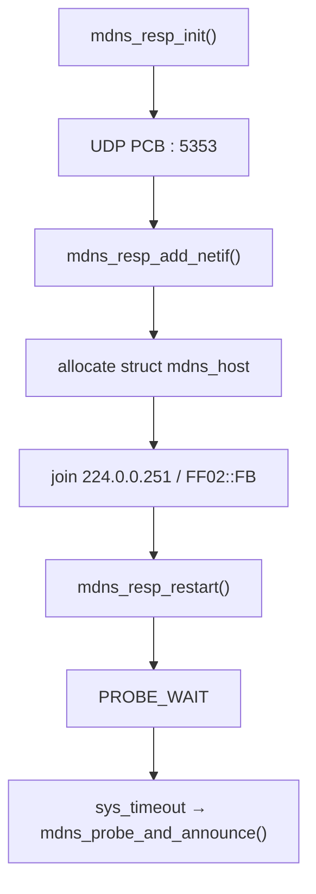
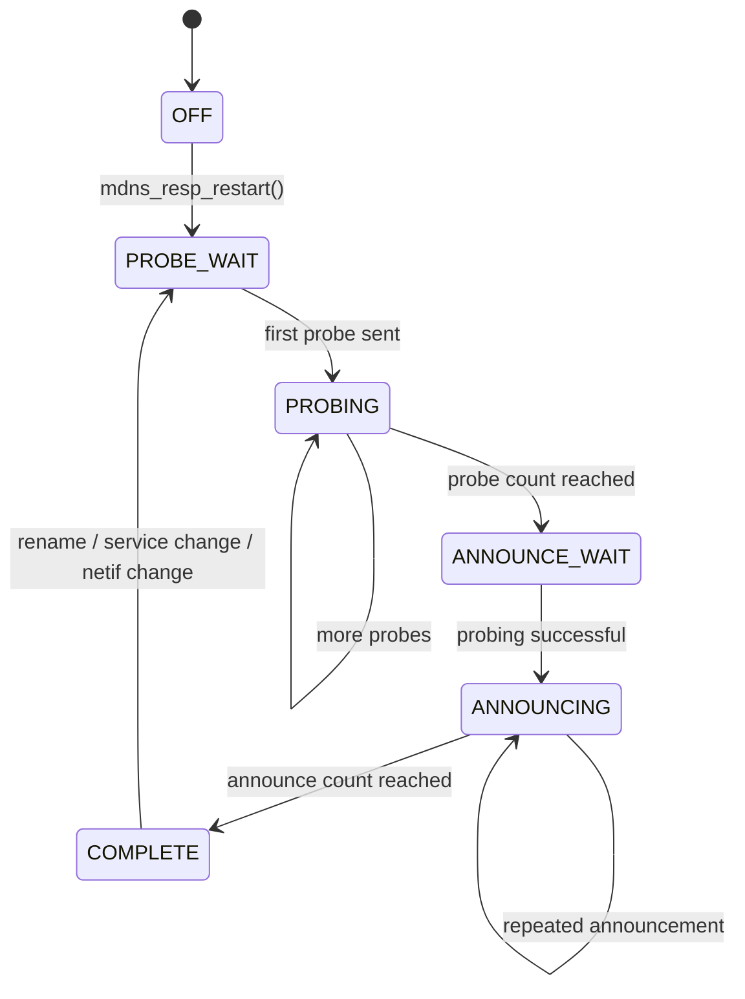
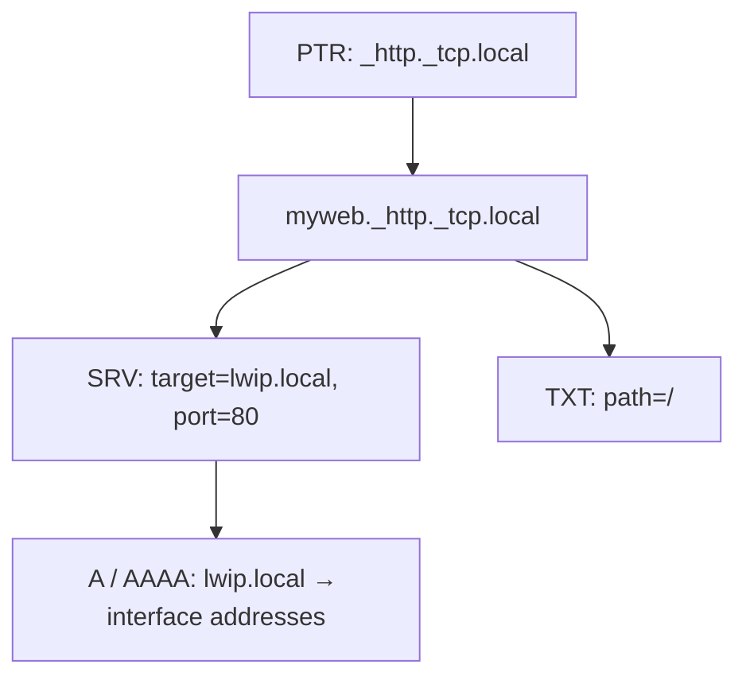
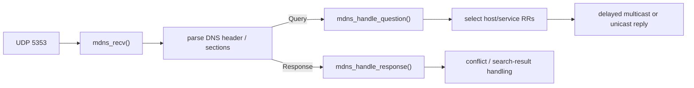
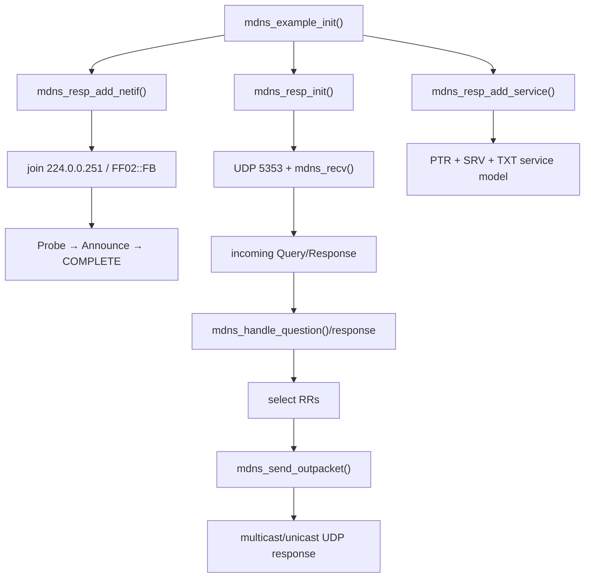

<meta name="referrer" content="no-referrer" />

# 教程 24：从 `mdns_example_init()` 到 `mdns_recv()`——mDNS、DNS-SD、Probe/Announce 与 PTR/SRV/TXT 服务发现

> 摘要：从 upstream mDNS example 进入 5353/组播收发，追踪 netif 加组、Probe/Announce 状态机、冲突处理、DNS-SD PTR/SRV/TXT 记录、查询匹配与多播/单播响应边界。

[TOC]

Stage 14 讲的是传统 DNS resolver：客户端向已配置 DNS server 发单播 query。Stage 15 则在 IPv4/IPv6 总览中建立了 IPv6 multicast 与 MLD 的基本位置。Stage 24 把两条线重新接到一起：mDNS 使用标准 DNS 报文格式，但把 name resolution 放到本地链路 multicast；DNS-SD 再利用 PTR/SRV/TXT 等标准 DNS RR 结构，在同一机制上完成服务实例发现。[S1](#source-s1)[S3](#source-s3)[S4](#source-s4)

本文继续使用本系列 pinned upstream commit `d08f4773edd0182b7910fc8f046eed82ffcd67c9`。当前 upstream 同时实现 responder 和可选 search API；真实 example entry 是 `mdns_example_init()`。[S1](#source-s1)[S2](#source-s2)

## 1. 当前 example 的第一条真实执行链

`contrib/examples/mdns/mdns_example.c` 给出最小完整入口：[S2](#source-s2)

```c
void
mdns_example_init(void)
{
#if LWIP_MDNS_RESPONDER
  mdns_resp_register_name_result_cb(mdns_example_report);
  mdns_resp_init();
  mdns_resp_add_netif(netif_default, "lwip");
  mdns_resp_add_service(netif_default, "myweb", "_http", DNSSD_PROTO_TCP, 80, srv_txt, NULL);
  mdns_resp_announce(netif_default);
#endif
}
```

它完成四件事：

1. 初始化全局 mDNS UDP transport；
2. 把 `netif_default` 注册成 hostname `lwip.local` 的 responder；
3. 发布一个 `myweb._http._tcp.local` 服务；
4. 请求发送当前已知记录的 unsolicited announcement。

当前 `contrib/examples/example_app/lwipopts.h` 把 `LWIP_MDNS_RESPONDER` 定义为 `LWIP_UDP`，因此 responder Core 会随 UDP 编译；但当前 `lwipcfg.h` 默认 `LWIP_MDNS_APP=0`，`test.c` 不会自动调用 `mdns_example_init()`。[S2](#source-s2)

所以“代码已编译”和“example 已运行”是两回事。

## 2. `mdns_resp_init()`：一个双栈 UDP PCB 绑定 5353

进入 `mdns_resp_init()`：[S1](#source-s1)

```c
void
mdns_resp_init(void)
{
  err_t res;

#if LWIP_MDNS_SEARCH
  memset(mdns_requests, 0, sizeof(mdns_requests));
#endif
  LWIP_MEMPOOL_INIT(MDNS_PKTS);
  mdns_pcb = udp_new_ip_type(IPADDR_TYPE_ANY);
  LWIP_ASSERT("Failed to allocate pcb", mdns_pcb != NULL);
#if LWIP_MULTICAST_TX_OPTIONS
  udp_set_multicast_ttl(mdns_pcb, MDNS_IP_TTL);
#else
  mdns_pcb->ttl = MDNS_IP_TTL;
#endif
  res = udp_bind(mdns_pcb, IP_ANY_TYPE, LWIP_IANA_PORT_MDNS);
  LWIP_UNUSED_ARG(res);
  LWIP_ASSERT("Failed to bind pcb", res == ERR_OK);
  udp_recv(mdns_pcb, mdns_recv, NULL);

  mdns_netif_client_id = netif_alloc_client_data_id();

#if MDNS_RESP_USENETIF_EXTCALLBACK
  netif_add_ext_callback(&netif_callback, mdns_netif_ext_status_callback);
#endif
}
```

关键运行对象是：

```text
one mdns_pcb
local port = 5353
IP type = ANY → IPv4 + IPv6
RX callback = mdns_recv()
multicast TTL/Hop Limit = 255
```

RFC 6762 指定 mDNS 使用 UDP 5353，IPv4 multicast address 为 `224.0.0.251`，IPv6 等价地址为 `FF02::FB`。[S3](#source-s3)

## 3. `mdns_resp_add_netif()`：真正把 responder 绑定到一张接口

全局 PCB 建好后，`mdns_resp_add_netif(netif, hostname)` 创建 per-netif `struct mdns_host`，把 hostname 保存到 netif client data，并准备 IPv4/IPv6 multicast destination。[S1](#source-s1)

当前函数还会显式加入两类 multicast group：

```c
#if LWIP_IPV4
  res = igmp_joingroup_netif(netif, ip_2_ip4(&v4group));
  if (res != ERR_OK) {
    goto cleanup;
  }
#endif
#if LWIP_IPV6
  res = mld6_joingroup_netif(netif, ip_2_ip6(&v6group));
  if (res != ERR_OK) {
    goto cleanup;
  }
#endif
```

`v4group` 与 `v6group` 来自：

```text
224.0.0.251
FF02::FB
```

因此 Stage 17 的 IGMP 与 Stage 15 概览中的 MLD 不是独立知识点，它们在这里变成 mDNS responder 的 transport 前置条件。

## 4. `struct mdns_host` 是 per-netif 状态机，不是全局 hostname table

每个已注册 netif 有自己的 `struct mdns_host`：[S1](#source-s1)

```c
typedef enum {
  MDNS_STATE_OFF,
  MDNS_STATE_PROBE_WAIT,
  MDNS_STATE_PROBING,
  MDNS_STATE_ANNOUNCE_WAIT,
  MDNS_STATE_ANNOUNCING,
  MDNS_STATE_COMPLETE
} mdns_resp_state_enum_t;
```

对象还保存：

```text
hostname
services[MDNS_MAX_SERVICES]
sent_num
state
IPv4 delayed-response state
IPv6 delayed-response state
conflict timestamps / rate-limit state
```

这说明 mDNS responder 不是“收到 query 就永远直接答”；启动前要先通过 probing 确认 unique name 不冲突。

## 5. `mdns_resp_add_netif()` 最后不是 announce，而是 restart probing

函数结尾调用：

```c
mdns_resp_restart(netif);
```

`mdns_resp_restart()` 再进入 `mdns_resp_restart_delay()`，把状态设为 `MDNS_STATE_PROBE_WAIT`，通过 `sys_timeout()` 安排后续 `mdns_probe_and_announce()`。[S1](#source-s1)

所以真实初始化链是：



## 6. `mdns_probe_and_announce()`：Probe/Announce 状态机的真实推进器

这个 timer callback 是当前 responder 生命周期的核心：[S1](#source-s1)

```c
static void
mdns_probe_and_announce(void* arg)
{
  struct netif *netif = (struct netif *)arg;
  struct mdns_host* mdns = NETIF_TO_HOST(netif);
  u32_t announce_delay;

  switch (mdns->state) {
    case MDNS_STATE_OFF:
    case MDNS_STATE_PROBE_WAIT:
    case MDNS_STATE_PROBING:
#if LWIP_IPV4
      if (!ip4_addr_isany_val(*netif_ip4_addr(netif)) &&
          mdns_send_probe(netif, &v4group) == ERR_OK)
#endif
      {
#if LWIP_IPV6
        if (mdns_send_probe(netif, &v6group) == ERR_OK)
#endif
        {
          mdns->state = MDNS_STATE_PROBING;
          mdns->sent_num++;
        }
      }

      if (mdns->sent_num >= MDNS_PROBE_COUNT) {
        mdns->state = MDNS_STATE_ANNOUNCE_WAIT;
        mdns->sent_num = 0;
      }

      if (mdns->sent_num && mdns->rate_limit_activated == 1) {
        sys_timeout(MDNS_PROBE_MAX_CONFLICTS_TIMEOUT, mdns_probe_and_announce, netif);
      }
      else {
        sys_timeout(MDNS_PROBE_DELAY_MS, mdns_probe_and_announce, netif);
      }
      break;
```

probe 阶段会对 IPv4/IPv6 都发送 probe；IPv4 只有在接口已有非零地址时才参与。

## 7. Probe 成功后才进入 Announce

继续阅读同一个 `mdns_probe_and_announce()` 的 announce 分支：[S1](#source-s1)

```c
    case MDNS_STATE_ANNOUNCE_WAIT:
    case MDNS_STATE_ANNOUNCING:
      if (mdns->sent_num == 0) {
        mdns->state = MDNS_STATE_ANNOUNCING;
        mdns->rate_limit_activated = 0;
        if (mdns_name_result_cb != NULL) {
          mdns_name_result_cb(netif, MDNS_PROBING_SUCCESSFUL, 0);
        }
      }

      mdns_resp_announce(netif);
      mdns->sent_num++;

      if (mdns->sent_num >= MDNS_ANNOUNCE_COUNT) {
        mdns->state = MDNS_STATE_COMPLETE;
        mdns->sent_num = 0;
      }
      else {
        announce_delay = MDNS_ANNOUNCE_DELAY_MS * (1 << (mdns->sent_num - 1));
        sys_timeout(announce_delay, mdns_probe_and_announce, netif);
      }
      break;
    case MDNS_STATE_COMPLETE:
    default:
      break;
  }
}
```

probe/announce 生命周期可以画成：



这个状态机解释了为什么 service/hostname 变更需要 restart，而不是只更新一个字符串。

## 8. 为什么要 Probe：mDNS 的 unique record 需要先做冲突检测

RFC 6762 要求 responder 在开始正式使用 unique name 之前通过 probing 处理冲突；lwIP 把收到 probe/response 后的 conflict detection 和 rate limiting 集成进 `mdns.c`。[S1](#source-s1)[S3](#source-s3)

当前 `struct mdns_host` 记录 conflict timestamps、conflict count 与 rate-limit flag。连续冲突会让下一轮 probe delay 增大，避免多个冲突节点持续高频碰撞。

这里的冲突检测和 Stage 25 将讲的 IPv4 ACD 类似，目标都是“地址/名字宣布前先确认没有冲突”，但它们处理的对象不同：

```text
mDNS probing → DNS name / resource records
ACD probing  → IPv4 address ownership
```

## 9. DNS-SD real example：`myweb._http._tcp.local`

继续阅读 `mdns_example_init()` 中注册 DNS-SD service 的调用：[S2](#source-s2)

```c
mdns_resp_add_service(netif_default,
                      "myweb",
                      "_http",
                      DNSSD_PROTO_TCP,
                      80,
                      srv_txt,
                      NULL);
```

`mdns_resp_add_service()` 创建 `struct mdns_service`，保存：

```text
instance name = myweb
service type  = _http
protocol      = _tcp
port          = 80
TXT callback  = srv_txt
```

因此 DNS-SD service instance name 形成：

```text
myweb._http._tcp.local
```

RFC 6763 使用 PTR + SRV + TXT 组合描述服务：PTR 用于枚举实例，SRV 给出 target host + port，TXT 给出附加 key/value metadata。[S4](#source-s4)

## 10. `mdns_resp_add_service()` 会触发重新 Probe

完整函数在保存 service 后执行：

```c
mdns->services[slot] = srv;

mdns_resp_restart(netif);

return slot;
```

这不是多余动作。新增 service 会改变当前 responder 要宣告的 unique records，因此需要重新走 probing/announcing lifecycle。[S1](#source-s1)

## 11. TXT 不是固定字符串字段，而是在生成 Reply 时调用 callback

example 的 TXT callback 是：[S2](#source-s2)

```c
static void
srv_txt(struct mdns_service *service, void *txt_userdata)
{
  err_t res;
  LWIP_UNUSED_ARG(txt_userdata);

  res = mdns_resp_add_service_txtitem(service, "path=/", 6);
  LWIP_ERROR("mdns add service txt failed\n", (res == ERR_OK), return);
}
```

`mdns_resp_add_service()` 保存 `txt_fn`，真正构造 TXT RR 时 callback 可动态填数据。这使 service metadata 不必在注册时永久固定。

`mdns_resp_add_service_txtitem()` 把每个 TXT item 以 DNS label-style length prefix 写入 service 的 TXT buffer：[S1](#source-s1)

```c
err_t
mdns_resp_add_service_txtitem(struct mdns_service *service, const char *txt, u8_t txt_len)
{
  LWIP_ASSERT_CORE_LOCKED();
  LWIP_ASSERT("mdns_resp_add_service_txtitem: service != NULL", service);

  return mdns_domain_add_label(&service->txtdata, txt, txt_len);
}
```

## 12. PTR / SRV / TXT 分别回答什么

对 `_http._tcp.local` 的 service discovery，可以用三层关系理解：[S4](#source-s4)



PTR 解决“有哪些实例”；SRV 解决“实例在哪里、端口是多少”；TXT 解决“实例还有哪些服务特定参数”；最后 A/AAAA 把 target hostname 映射成 IP address。

## 13. mDNS 没有发明新的 DNS RR 类型

DNS-SD 的一个重要边界是：它复用标准 DNS message/RR 机制，并不要求新的 DNS opcode。[S4](#source-s4)

因此 lwIP 的 mDNS parser 仍然处理：

```text
DNS header
Question section
Answer section
Authority section
Additional section
```

区别主要在 transport、multicast semantics、probing/announcing、known-answer suppression 与 link-local scope。

## 14. `mdns_recv()`：所有 IPv4/IPv6 mDNS 报文都汇入一个 callback

`mdns_resp_init()` 已经把 UDP receive callback 绑定为 `mdns_recv()`。收到 datagram 后，函数先取得实际 input netif：[S1](#source-s1)

```c
static void
mdns_recv(void *arg, struct udp_pcb *pcb, struct pbuf *p, const ip_addr_t *addr, u16_t port)
{
  struct dns_hdr hdr;
  struct mdns_packet packet;
  struct netif *recv_netif = ip_current_input_netif();
  u16_t offset = 0;

  LWIP_UNUSED_ARG(arg);
  LWIP_UNUSED_ARG(pcb);
```

然后检查该 netif 是否已经 `mdns_resp_add_netif()`；没有 per-netif host state 的接口不会处理 mDNS packet。

## 15. IPv4/IPv6 multicast destination 会分别验证

`mdns_recv()` 对 multicast destination 做协议级检查。IPv6 会按 zoneless equality 检查 `FF02::FB`；IPv4 则检查 `224.0.0.251`。[S1](#source-s1)

这也是为什么同一个全局 PCB 能支持多 netif：报文到达哪个 interface、destination scope 是否匹配，仍由当前 IP input context 提供。

## 16. Query 与 Response 会进入不同 handler

解析 DNS header 后，`mdns_recv()` 根据 QR bit 分流：query 进入 question handling，response 进入 response/conflict handling。当前源码把主要处理拆成 `mdns_handle_question()`、`mdns_handle_response()` 等内部路径。[S1](#source-s1)

简化后的运行关系是：



这里不能把 `mdns_recv()` 简化成“收到 query 就立即 multicast reply”，因为 current implementation 还包含 delayed response、legacy/unicast response、probe conflict 与 known-answer logic。

## 17. mDNS Response 为什么既可能 multicast，也可能 unicast

RFC 6762 的默认响应目标仍是 5353 multicast group，但明确列出 unicast-response bit、legacy query、direct unicast query 等例外。[S3](#source-s3)

lwIP 为每个 netif、每个 IP family 保存独立的 delayed multicast 与 delayed unicast outmsg state，因此响应方式是 query semantics 的结果，而不是固定写死。

## 18. `mdns_send_outpacket()` 才真正把已选择 RR 序列化成 UDP packet

响应逻辑先生成 `struct mdns_outmsg`：里面保存 question/reply bitmask、destination、port、transaction ID 等。真正输出时进入 `mdns_send_outpacket()`，它先调用 `mdns_create_outpacket()` 构造 DNS wire-format，再通过 UDP 发到目标地址。[S1](#source-s1)

因此职责分层是：

```text
mdns_handle_question()
  → 决定“应该回答什么”

struct mdns_outmsg
  → 保存“这次要输出哪些 RR、发到哪里”

mdns_create_outpacket()
  → 序列化 DNS message

UDP
  → 发送到 multicast/unicast destination
```

## 19. Announcement 不是 Query 的 Reply，而是 unsolicited answer

`mdns_resp_announce(netif)` 在 responder 已经进入 `ANNOUNCING` 或 `COMPLETE` 时主动发送当前记录：[S1](#source-s1)

```c
if (mdns->state >= MDNS_STATE_ANNOUNCING) {
#if LWIP_IPV6
  mdns_announce(netif, &v6group);
  mdns_start_multicast_timeouts_ipv6(netif);
#endif
#if LWIP_IPV4
  if (!ip4_addr_isany_val(*netif_ip4_addr(netif))) {
    mdns_announce(netif, &v4group);
```

这用于 name/service registration 的主动传播，不需要先收到 query。

## 20. Hostname/Service rename 都会触发新一轮 probing

`mdns_resp_rename_netif()` 修改 hostname 后调用：

```text
mdns_resp_restart_delay(netif, MDNS_PROBE_DELAY_MS)
```

`mdns_resp_rename_service()` 也会重新 restart。因为 unique record identity 已改变，不能继续沿用旧 name 已完成的 Probe 状态。[S1](#source-s1)

如果启用了 `MDNS_RESP_USENETIF_EXTCALLBACK`，netif status/address 变化也会通过 ext callback 触发 responder 更新。[S1](#source-s1)

## 21. Search API 是另外一条“客户端”路径

当 `LWIP_MDNS_SEARCH=1`，lwIP 还提供：

```c
err_t
mdns_search_service(const char *name, const char *service, enum mdns_sd_proto proto,
                    struct netif *netif, search_result_fn_t result_fn, void *arg,
                    u8_t *request_id)
```

这个 API 从 `mdns_requests[]` 找空 slot，把 query type 设置成 PTR，随后同时向 IPv6/IPv4 mDNS groups 发送 request。[S1](#source-s1)

继续阅读 `mdns_search_service()` 中保存 request metadata 并发送 multicast query 的核心片段：

```c
req->result_fn = result_fn;
req->arg = arg;
req->proto = (u16_t)proto;
req->qtype = DNS_RRTYPE_PTR;
mdns_domain_add_string(&req->service, service);

#if LWIP_IPV6
  mdns_send_request(req, netif, &v6group);
#endif
#if LWIP_IPV4
  mdns_send_request(req, netif, &v4group);
#endif
```

这与 responder path 不同：responder 发布本机 host/service；search path 主动发现链路上的其他 service instances。

## 22. DNS-SD discovery 不是“先 SRV 再 PTR”

当前 search API 默认 qtype 是 PTR，原因与 RFC 6763 模型一致：先查询 service type，得到 instance names，再从 response 中取得对应 SRV/TXT/host records。[S4](#source-s4)

因此合理心智模型是：

```text
browse service type
  → PTR enumerates instances
  → SRV locates endpoint
  → TXT supplies metadata
  → A/AAAA locates host address
```

不是直接知道某个 SRV name 后再去枚举服务。

## 23. mDNS TTL 与普通 IP TTL 是两个完全不同的字段

当前源码同时出现：

```text
MDNS_IP_TTL = 255
MDNS_TTL_10 / 120 / 4500
```

前者是 IPv4 TTL / IPv6 Hop Limit，用于 IP packet scope/validation；后者是 DNS RR TTL，用于 cache lifetime。[S1](#source-s1)[S3](#source-s3)

不要把：

```text
IP TTL = 255
```

误读成：

```text
DNS record cache TTL = 255 s
```

它们在不同协议层。

## 24. mDNS 与传统 DNS resolver 的边界

Stage 14 的 resolver 核心路径是：

```text
application hostname
  → dns_gethostbyname()
  → configured unicast DNS server
  → cache/query/retry
```

Stage 24 mDNS responder/search 的路径是：

```text
.local host/service
  → link-local multicast 5353
  → no central DNS server required
  → peer responders answer
```

lwIP 当前 mDNS app 不是把 Stage 14 resolver 简单改一个 server address，而是独立 `src/apps/mdns` 模块，拥有 probing、announce、service registry、query/response policy 与自己的 state objects。[S1](#source-s1)

## 25. mDNS 与 MLD/IGMP 的边界

`mdns_resp_add_netif()` 显式 join group，但 MLD/IGMP 只解决二层/三层 multicast membership。它们不知道 PTR、SRV、TXT，也不知道 hostname conflict。

```text
IGMP / MLD
  → “这张网卡要接收哪个 multicast group”

mDNS
  → “收到 5353 DNS packet 后如何解析、Probe、回答”

DNS-SD
  → “用哪些 DNS RR 表达服务发现”
```

这三层不可合并。

## 26. 当前 resource limits 也是实现的一部分

`mdns_opts.h` 默认：

```c
#define MDNS_MAX_SERVICES 1
#define MDNS_MAX_STORED_PKTS 4
#define MDNS_MAX_REQUESTS 2
```

同时 `MDNS_OUTPUT_PACKET_SIZE` 默认在一个 service 时为 512 bytes，多 service 时提高到 1450 bytes。[S1](#source-s1)

因此“支持 DNS-SD”不代表无限服务实例或无限并行 search。嵌入式部署必须把 service slot、pending request、known-answer packet pool 当作资源预算。

## 27. 当前完整主线



## 28. Stage 24 的实现边界

当前目标版本真正提供：

- mDNS responder；
- IPv4/IPv6 multicast transport；
- Probe/Announce name conflict lifecycle；
- A/AAAA/PTR/SRV/TXT 等 responder record path；
- DNS-SD service registration；
- 可选 mDNS service search；
- netif ext callback integration；
- delayed multicast/unicast response machinery。

但 mDNS/DNS-SD 并不等于完整通用 DNS server，也不等于 Linux/Avahi/Bonjour daemon 的全部能力。本文只描述当前 lwIP `src/apps/mdns` 的实际范围。

下一篇进入 AutoIP：当 IPv4 DHCP 不可用时，lwIP 如何选择 `169.254/16` 地址，并通过统一 ACD 子系统完成 Probe、Announce、Conflict 与 Defense。

## 资料来源

<a id="source-s1"></a>
### [S1] lwIP mDNS responder/search 源码
- 类型：目标版本上游源码
- 版本：commit `d08f4773edd0182b7910fc8f046eed82ffcd67c9`
- 定位：`src/apps/mdns/mdns.c`：`mdns_resp_init()`、`mdns_resp_add_netif()`、`mdns_probe_and_announce()`、`mdns_recv()`、`mdns_resp_add_service()`、`mdns_search_service()`、`mdns_resp_announce()`；`src/apps/mdns/mdns_out.c`；`src/include/lwip/apps/mdns*.h`
- URL/文档：[lwIP mDNS source](https://github.com/lwip-tcpip/lwip/tree/d08f4773edd0182b7910fc8f046eed82ffcd67c9/src/apps/mdns)
- 使用位置：“UDP 5353 transport”“multicast group”“Probe/Announce 状态机”“service registry”“query/response”“search”“resource limits”
- 支撑内容：证明当前 responder/search 的真实调用链、状态对象、timer、RR 选择与 output machinery

<a id="source-s2"></a>
### [S2] lwIP mDNS example 与 example_app 配置
- 类型：目标版本上游 example
- 版本：commit `d08f4773edd0182b7910fc8f046eed82ffcd67c9`
- 定位：`contrib/examples/mdns/mdns_example.c`；`contrib/examples/example_app/test.c`；`lwipopts.h`；`lwipcfg.h`
- URL/文档：[lwIP contrib examples](https://github.com/lwip-tcpip/lwip/tree/d08f4773edd0182b7910fc8f046eed82ffcd67c9/contrib/examples)
- 使用位置：“真实 application entry”“myweb._http._tcp”“当前 example 默认不启动 mDNS app”
- 支撑内容：提供本文真实入口和 service/TXT 示例，并区分 Core 编译能力与 app runtime enable

<a id="source-s3"></a>
### [S3] RFC 6762：Multicast DNS
- 类型：IETF 标准规范
- 版本：RFC 6762，2013
- URL/文档：[RFC 6762](https://www.rfc-editor.org/rfc/rfc6762.html)
- 使用位置：“UDP 5353”“224.0.0.251 / FF02::FB”“Probe/Announce”“multicast/unicast response”“IP TTL/Hop Limit”
- 支撑内容：给出 mDNS transport、link-local multicast、probing 与 response semantics 的规范依据

<a id="source-s4"></a>
### [S4] RFC 6763：DNS-Based Service Discovery
- 类型：IETF 标准规范
- 版本：RFC 6763，2013
- URL/文档：[RFC 6763](https://www.rfc-editor.org/rfc/rfc6763.html)
- 使用位置：“PTR/SRV/TXT service model”“service instance naming”“browse sequence”
- 支撑内容：说明 DNS-SD 如何用标准 DNS RR 表达 service type、instance、target/port 与 TXT metadata
