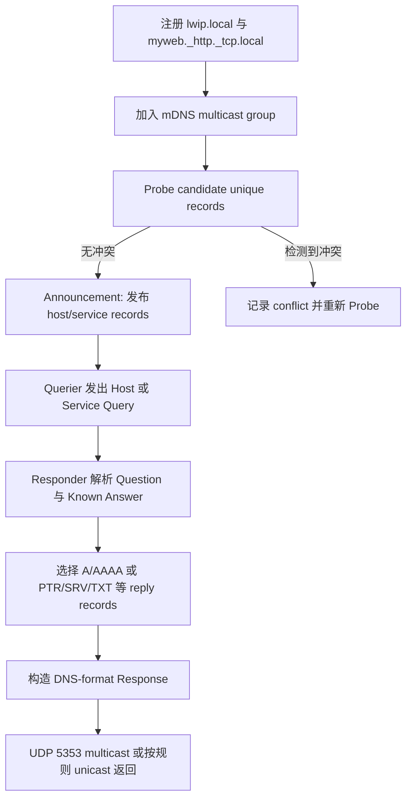
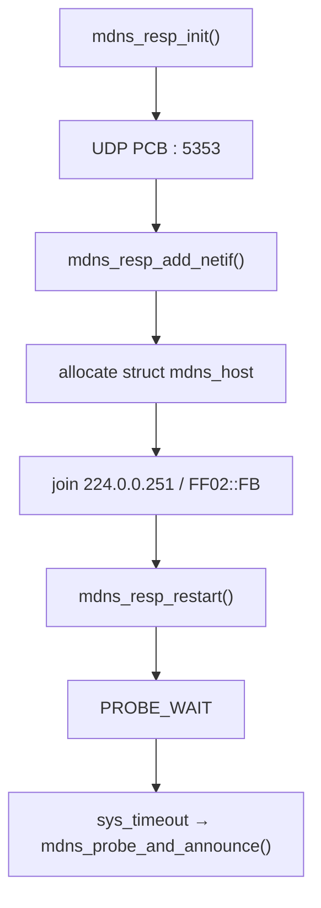
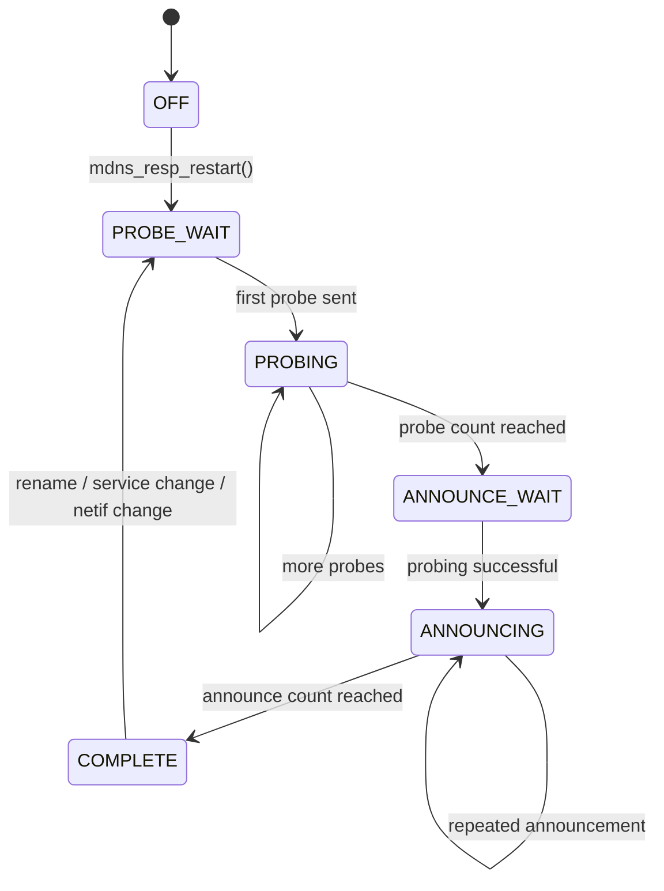
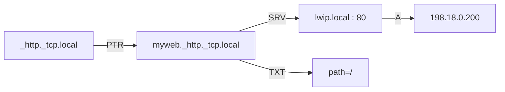
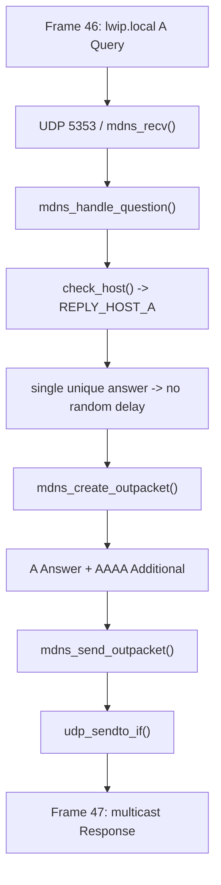
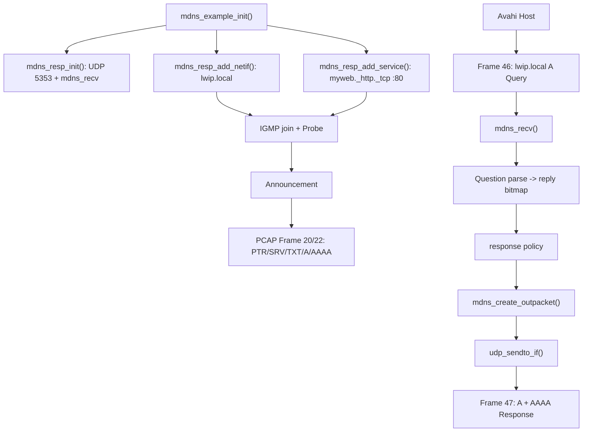

<meta name="referrer" content="no-referrer" />

# 教程 24：从 `mdns_example_init()` 到 `mdns_recv()`——mDNS、DNS-SD、Probe/Announce 与 PTR/SRV/TXT 服务发现

> 摘要：从 upstream mDNS example 追踪 Probe/Announce、PTR/SRV/TXT 与 Query/Response，并用真实 48 帧抓包将源码和线上报文逐项互证。

[TOC]


mDNS（Multicast DNS，多播 DNS）把 DNS 风格的名称解析限制在本地链路：querier（查询端）和 responder（响应端）通过 UDP 5353 向 IPv4 `224.0.0.251` 或 IPv6 `FF02::FB` 交换 DNS 格式的 Query/Response，而不是先把 `.local.` 名称交给传统递归 DNS server。[S3](#source-s3) DNS-SD（DNS-Based Service Discovery，基于 DNS 的服务发现）进一步约定如何用 DNS Resource Record（RR，资源记录）描述“有哪些服务、服务实例叫什么、目标主机和端口是什么、还有哪些附加属性”。[S4](#source-s4)

标题中的几个协议动作先建立最小语义。**Probe** 是 responder 在正式宣告要求单一所有者的 unique name/record 前发送的冲突探测；**Announcement** 是名称确认可用后主动发送的 unsolicited response（非请求触发响应），用于让同链路 peer 尽快学习当前记录。[S3](#source-s3) DNS-SD 中，**PTR** 把 service type 指向 service instance，**SRV** 给出该实例的 target host 与 port，**TXT** 承载服务附加元数据，**A/AAAA** 分别给出 target host 的 IPv4/IPv6 地址。[S4](#source-s4) 因而一次完整服务发现不是“查到一个 IP”就结束，而是从 service type 逐步得到 instance、target/port、metadata 与 address。

Stage 14 已经建立传统 DNS resolver。Stage 24 只恢复当前需要的差异：mDNS 是本地链路上的 multicast name resolution，DNS-SD 是建立在 DNS record 之上的 service discovery 约定；本文随后从真实 `mdns_example_init()` 入口继续追踪 Probe/Announce、Query/Response、PTR/SRV/TXT/A/AAAA 与真实 PCAP。[S1](#source-s1)[S2](#source-s2)[S6](#source-s6)

## 阅读源码前：建议提前阅读

这些资料用于规范核对和进一步阅读，不是理解正文的强制前置条件：

1. [Apple Bonjour Concepts](https://developer.apple.com/library/archive/documentation/Cocoa/Conceptual/NetServices/Articles/about.html) —— Bonjour 是 Apple 对这套零配置网络能力的总称；本资料用于建立 Bonjour、mDNS 与 DNS-SD 的整体关系，尤其关注 local-link name 与 service discovery 的区别。[S7](#source-s7)
2. [RFC 6762：Multicast DNS](https://www.rfc-editor.org/rfc/rfc6762.html) —— 用于核对 UDP 5353、multicast destination、Probe/Announcement 与 Query/Response policy。[S3](#source-s3)
3. [RFC 6763：DNS-Based Service Discovery](https://www.rfc-editor.org/rfc/rfc6763.html) —— 用于核对 service instance naming，以及 PTR/SRV/TXT/A/AAAA 如何组成 service discovery 结果。[S4](#source-s4)

## 进入源码前先看完整协议流程

当前 example 同时包含“名称唯一性建立”和“服务/主机查询响应”两类动作。mDNS Query 还可以携带 **Known Answer（已知答案）**：querier 把自己已经缓存的 answer 放进 Query，responder 若判断这些记录仍足够新鲜，就可以抑制重复发送，从而减少本地链路上的 multicast 流量。[S3](#source-s3) 按本文实际会进入源码的路径，可以先把它们串成一条总流程：



Known Answer 会在真正进入 `mdns_handle_question()` 时映射到 parser 与 reply bitmap。这里的 **reply bitmap** 不是 mDNS 线上字段，而是 lwIP 内部用来记录“本次 Response 应包含哪些 host/service records”的选择位图。

协议动作与本文源码落点如下：

| 协议阶段 | 协议对象/动作 | lwIP 实现入口 | 关键对象/状态 | 下一步 |
| --- | --- | --- | --- | --- |
| 建立 transport | UDP 5353、mDNS multicast | `mdns_resp_init()` | global `mdns_pcb` | 注册 RX callback |
| 注册本接口 | hostname + multicast membership | `mdns_resp_add_netif()` | per-netif `struct mdns_host` | 进入 Probe |
| 唯一性探测 | Probe | `mdns_resp_restart()` → `mdns_probe_and_announce()` | `MDNS_STATE_PROBE_*` | Announce 或 conflict/restart |
| 发布服务 | service instance / PTR / SRV / TXT | `mdns_resp_add_service()` | `struct mdns_service` | 重新 Probe/Announce |
| 接收查询 | Query + Known Answer | `mdns_recv()` → `mdns_handle_question()` | parser state + reply bitmap | 选择 records |
| 构造响应 | A/AAAA/PTR/SRV/TXT | `mdns_create_outpacket()` | output packet builder | `mdns_send_outpacket()` |

后面的 Source-driven 主线仍按真实执行顺序展开；上面的协议模型只负责告诉读者“当前函数正在实现哪一个协议动作”。

## 1. 当前 example 的第一条真实执行链

`contrib/examples/mdns/mdns_example.c` 给出最小完整入口：[S2](#source-s2)

```c
void
mdns_example_init(void)
{
#if LWIP_MDNS_RESPONDER
  mdns_resp_register_name_result_cb(mdns_example_report);
  mdns_resp_init();
  mdns_resp_add_netif(netif_default, "lwip");
  mdns_resp_add_service(netif_default, "myweb", "_http", DNSSD_PROTO_TCP, 80, srv_txt, NULL);
  mdns_resp_announce(netif_default);
#endif
}
```

它完成四件事：

1. 初始化全局 mDNS UDP transport；
2. 把 `netif_default` 注册成 hostname `lwip.local` 的 responder；
3. 发布一个 `myweb._http._tcp.local` 服务；
4. 请求发送当前已知记录的 unsolicited announcement。

当前 `contrib/examples/example_app/lwipopts.h` 把 `LWIP_MDNS_RESPONDER` 定义为 `LWIP_UDP`，因此 responder Core 会随 UDP 编译；但当前 `lwipcfg.h` 默认 `LWIP_MDNS_APP=0`，`test.c` 不会自动调用 `mdns_example_init()`。[S2](#source-s2)

所以“代码已编译”和“example 已运行”是两回事。

## 2. `mdns_resp_init()`：一个双栈 UDP PCB 绑定 5353

进入 `mdns_resp_init()`：[S1](#source-s1)

```c
void
mdns_resp_init(void)
{
  err_t res;

#if LWIP_MDNS_SEARCH
  memset(mdns_requests, 0, sizeof(mdns_requests));
#endif
  LWIP_MEMPOOL_INIT(MDNS_PKTS);
  mdns_pcb = udp_new_ip_type(IPADDR_TYPE_ANY);
  LWIP_ASSERT("Failed to allocate pcb", mdns_pcb != NULL);
#if LWIP_MULTICAST_TX_OPTIONS
  udp_set_multicast_ttl(mdns_pcb, MDNS_IP_TTL);
#else
  mdns_pcb->ttl = MDNS_IP_TTL;
#endif
  res = udp_bind(mdns_pcb, IP_ANY_TYPE, LWIP_IANA_PORT_MDNS);
  LWIP_UNUSED_ARG(res);
  LWIP_ASSERT("Failed to bind pcb", res == ERR_OK);
  udp_recv(mdns_pcb, mdns_recv, NULL);

  mdns_netif_client_id = netif_alloc_client_data_id();

#if MDNS_RESP_USENETIF_EXTCALLBACK
  netif_add_ext_callback(&netif_callback, mdns_netif_ext_status_callback);
#endif
}
```

关键运行对象是：

```text
one mdns_pcb
local port = 5353
IP type = ANY → IPv4 + IPv6
RX callback = mdns_recv()
multicast TTL/Hop Limit = 255
```

RFC 6762 指定 mDNS 使用 UDP 5353，IPv4 multicast address 为 `224.0.0.251`，IPv6 等价地址为 `FF02::FB`。[S3](#source-s3)

## 3. `mdns_resp_add_netif()`：真正把 responder 绑定到一张接口

全局 PCB 建好后，`mdns_resp_add_netif(netif, hostname)` 创建 per-netif `struct mdns_host`，把 hostname 保存到 netif client data，并准备 IPv4/IPv6 multicast destination。[S1](#source-s1)

当前函数还会显式加入两类 multicast group：

```c
#if LWIP_IPV4
  res = igmp_joingroup_netif(netif, ip_2_ip4(&v4group));
  if (res != ERR_OK) {
    goto cleanup;
  }
#endif
#if LWIP_IPV6
  res = mld6_joingroup_netif(netif, ip_2_ip6(&v6group));
  if (res != ERR_OK) {
    goto cleanup;
  }
#endif
```

`v4group` 与 `v6group` 来自：

```text
224.0.0.251
FF02::FB
```

因此 Stage 17 的 IGMP 与 Stage 15 概览中的 MLD 不是独立知识点，它们在这里变成 mDNS responder 的 transport 前置条件。

## 4. `struct mdns_host` 是 per-netif 状态机，不是全局 hostname table

每个已注册 netif 有自己的 `struct mdns_host`：[S1](#source-s1)

```c
typedef enum {
  MDNS_STATE_OFF,
  MDNS_STATE_PROBE_WAIT,
  MDNS_STATE_PROBING,
  MDNS_STATE_ANNOUNCE_WAIT,
  MDNS_STATE_ANNOUNCING,
  MDNS_STATE_COMPLETE
} mdns_resp_state_enum_t;
```

对象还保存：

```text
hostname
services[MDNS_MAX_SERVICES]
sent_num
state
IPv4 delayed-response state
IPv6 delayed-response state
conflict timestamps / rate-limit state
```

这说明 mDNS responder 不是“收到 query 就永远直接答”；启动前要先通过 probing 确认 unique name 不冲突。

## 5. `mdns_resp_add_netif()` 最后不是 announce，而是 restart probing

函数结尾调用：

```c
mdns_resp_restart(netif);
```

`mdns_resp_restart()` 再进入 `mdns_resp_restart_delay()`，把状态设为 `MDNS_STATE_PROBE_WAIT`，通过 `sys_timeout()` 安排后续 `mdns_probe_and_announce()`。[S1](#source-s1)

所以真实初始化链是：



## 6. `mdns_probe_and_announce()`：Probe/Announce 状态机的真实推进器

这个 timer callback 是当前 responder 生命周期的核心：[S1](#source-s1)

```c
static void
mdns_probe_and_announce(void* arg)
{
  struct netif *netif = (struct netif *)arg;
  struct mdns_host* mdns = NETIF_TO_HOST(netif);
  u32_t announce_delay;

  switch (mdns->state) {
    case MDNS_STATE_OFF:
    case MDNS_STATE_PROBE_WAIT:
    case MDNS_STATE_PROBING:
#if LWIP_IPV4
      if (!ip4_addr_isany_val(*netif_ip4_addr(netif)) &&
          mdns_send_probe(netif, &v4group) == ERR_OK)
#endif
      {
#if LWIP_IPV6
        if (mdns_send_probe(netif, &v6group) == ERR_OK)
#endif
        {
          mdns->state = MDNS_STATE_PROBING;
          mdns->sent_num++;
        }
      }

      if (mdns->sent_num >= MDNS_PROBE_COUNT) {
        mdns->state = MDNS_STATE_ANNOUNCE_WAIT;
        mdns->sent_num = 0;
      }

      if (mdns->sent_num && mdns->rate_limit_activated == 1) {
        sys_timeout(MDNS_PROBE_MAX_CONFLICTS_TIMEOUT, mdns_probe_and_announce, netif);
      }
      else {
        sys_timeout(MDNS_PROBE_DELAY_MS, mdns_probe_and_announce, netif);
      }
      break;
```

probe 阶段会对 IPv4/IPv6 都发送 probe；IPv4 只有在接口已有非零地址时才参与。

## 7. Probe 成功后才进入 Announce

继续阅读同一个 `mdns_probe_and_announce()` 的 announce 分支：[S1](#source-s1)

```c
    case MDNS_STATE_ANNOUNCE_WAIT:
    case MDNS_STATE_ANNOUNCING:
      if (mdns->sent_num == 0) {
        mdns->state = MDNS_STATE_ANNOUNCING;
        mdns->rate_limit_activated = 0;
        if (mdns_name_result_cb != NULL) {
          mdns_name_result_cb(netif, MDNS_PROBING_SUCCESSFUL, 0);
        }
      }

      mdns_resp_announce(netif);
      mdns->sent_num++;

      if (mdns->sent_num >= MDNS_ANNOUNCE_COUNT) {
        mdns->state = MDNS_STATE_COMPLETE;
        mdns->sent_num = 0;
      }
      else {
        announce_delay = MDNS_ANNOUNCE_DELAY_MS * (1 << (mdns->sent_num - 1));
        sys_timeout(announce_delay, mdns_probe_and_announce, netif);
      }
      break;
    case MDNS_STATE_COMPLETE:
    default:
      break;
  }
}
```

probe/announce 生命周期可以画成：



这个状态机解释了为什么 service/hostname 变更需要 restart，而不是只更新一个字符串。

## 8. Probe 冲突语义如何落到 lwIP 的状态与限速字段

mDNS 对 unique record 做 Probe 的目的，是在把名称视为“本机拥有”之前发现同链路冲突；如果收到与候选 unique record 冲突的响应，responder 不能继续把该名称当成已确认可用。RFC 6762 还规定了冲突持续发生时的速率限制，避免设备在冲突环境中形成高频 Probe 风暴。[S3](#source-s3) lwIP 把这些协议语义落在 `struct mdns_host` 的 conflict timestamps、conflict count、rate-limit flag 和 `MDNS_STATE_*` 迁移中，并由 `mdns_probe_and_announce()` 继续推进。[S1](#source-s1)

Stage 25 的 IPv4 ACD 也会出现“投入使用前先检测冲突”，但它验证的是 IPv4 address ownership；这里验证的是 mDNS name/resource-record ownership。两条实现链不能混为同一个状态机。

## 9. DNS-SD real example：`myweb._http._tcp.local`

继续阅读 `mdns_example_init()` 中注册 DNS-SD service 的调用：[S2](#source-s2)

```c
mdns_resp_add_service(netif_default,
                      "myweb",
                      "_http",
                      DNSSD_PROTO_TCP,
                      80,
                      srv_txt,
                      NULL);
```

`mdns_resp_add_service()` 创建 `struct mdns_service`，把 example 的 instance、service type、transport、port 与 TXT callback 保存为后续 packet builder 的输入：[S1](#source-s1)[S2](#source-s2)

```text
myweb + _http + _tcp + 80 + srv_txt
        ↓
struct mdns_service
        ↓
后续 PTR / SRV / TXT serializer
```

`myweb._http._tcp.local` 可以拆成 service instance `myweb`、service type `_http`、transport `_tcp` 与 local domain。浏览 `_http._tcp.local` 时，PTR 把 service type 指向这个 instance；SRV 再给出 target host 与 port 80；TXT 给出 `path=/` 等 metadata；最后 A/AAAA 把 target host 映射到 IP 地址。[S4](#source-s4)[S7](#source-s7) 下面继续看这些协议对象怎样进入 `struct mdns_service` 与 serializer。

## 10. `mdns_resp_add_service()` 会触发重新 Probe

完整函数在保存 service 后执行：

```c
mdns->services[slot] = srv;

mdns_resp_restart(netif);

return slot;
```

这不是多余动作。新增 service 会改变当前 responder 要宣告的 unique records，因此需要重新走 probing/announcing lifecycle。[S1](#source-s1)

## 11. TXT 不是固定字符串字段，而是在生成 Reply 时调用 callback

example 的 TXT callback 是：[S2](#source-s2)

```c
static void
srv_txt(struct mdns_service *service, void *txt_userdata)
{
  err_t res;
  LWIP_UNUSED_ARG(txt_userdata);

  res = mdns_resp_add_service_txtitem(service, "path=/", 6);
  LWIP_ERROR("mdns add service txt failed\n", (res == ERR_OK), return);
}
```

`mdns_resp_add_service()` 保存 `txt_fn`，真正构造 TXT RR 时 callback 可动态填数据。这使 service metadata 不必在注册时永久固定。

`mdns_resp_add_service_txtitem()` 把每个 TXT item 以 DNS label-style length prefix 写入 service 的 TXT buffer：[S1](#source-s1)

```c
err_t
mdns_resp_add_service_txtitem(struct mdns_service *service, const char *txt, u8_t txt_len)
{
  LWIP_ASSERT_CORE_LOCKED();
  LWIP_ASSERT("mdns_resp_add_service_txtitem: service != NULL", service);

  return mdns_domain_add_label(&service->txtdata, txt, txt_len);
}
```

## 12. DNS-SD 记录关系如何映射到 lwIP 对象与 serializer

把前面的协议模型重新挂回源码，可以得到一条直接的对象映射：service type 的 PTR 用于发现 instance，instance 的 SRV 给出 target/port，TXT 给出 metadata，target host 的 A/AAAA 给出地址。[S4](#source-s4) 当前 lwIP 分别用 service object、reply bitmap 和 serializer 实现这些动作：

| DNS-SD 角色 | lwIP 当前实现对象/路径 |
| --- | --- |
| service instance/type/transport/port | `struct mdns_service` |
| TXT 动态内容 | `txt_fn` → `mdns_resp_add_service_txtitem()` |
| service browse/instance reply bitmap | `check_service()` / `serv_replies[]` |
| PTR 序列化 | `mdns_add_servicetype_ptr_answer()` / `mdns_add_servicename_ptr_answer()` |
| SRV 序列化 | `mdns_add_srv_answer()` |
| TXT 序列化 | `mdns_add_txt_answer()` |
| host address additional records | `mdns_add_a_answer()` / IPv6 对应 builder |

因此后文看到 PTR/SRV/TXT 时，会同时保持两条线：协议上该 record 在 service discovery 中承担什么角色，以及当前 Query 如何把 reply bitmap 置位、`mdns_create_outpacket()` 最终调用哪个 serializer。[S1](#source-s1)

## 13. 把当前 responder 跑起来：先 configure，再追加 Stage 24 配置

前 12 节已经得到一个可以明确观测的结论：example 会注册 `lwip.local`，发布 `myweb._http._tcp.local`，并在完成 probing 后发送 announcement。此时再引入 Host 工具，目的是验证这些对象是否真的出现在链路上，而不是把 `tcpdump` 当成脱离源码的工具教程。

本仓库的 `scripts/configure-debug.sh` 每次都会从 upstream `lwipcfg.h.example` 刷新本地 `lwipcfg.h`；因此 Stage 专属 override 必须放在 configure **之后**，然后直接 build，不能再执行一次 configure。[S5](#source-s5)

Ubuntu Host 若还没有 Avahi 查询工具，先补充：

```bash
sudo apt update
sudo apt install avahi-daemon avahi-utils
```

从仓库根目录执行：

```bash
scripts/configure-debug.sh
```

然后追加 Stage 24 的 IPv4/mDNS 配置：[S2](#source-s2)[S5](#source-s5)

```bash
cat >> upstream/lwip/contrib/examples/example_app/lwipcfg.h <<'STAGE24_CFG'

/* Source Lab: Stage 24 mDNS/DNS-SD experiment. */
#undef USE_DHCP
#define USE_DHCP 0

#undef USE_AUTOIP
#define USE_AUTOIP 0

#undef LWIP_PORT_INIT_IPADDR
#define LWIP_PORT_INIT_IPADDR(addr)  IP4_ADDR((addr), 198,18,0,200)

#undef LWIP_PORT_INIT_GW
#define LWIP_PORT_INIT_GW(addr)      IP4_ADDR((addr), 198,18,0,1)

#undef LWIP_PORT_INIT_NETMASK
#define LWIP_PORT_INIT_NETMASK(addr) IP4_ADDR((addr), 255,255,255,0)

#undef LWIP_MDNS_APP
#define LWIP_MDNS_APP 1
STAGE24_CFG
```

这里真正用于启动 mDNS example 的专属开关是 `LWIP_MDNS_APP=1`。当前 `contrib/examples/example_app/lwipopts.h` 已经把 `LWIP_MDNS_RESPONDER` 绑定到 `LWIP_UDP`，而 `lwipcfg.h.example` 默认把 `LWIP_MDNS_APP` 关闭，因此“responder 源码被编译”与“example_app 运行时真正调用 `mdns_example_init()`”是两个不同条件。[S2](#source-s2)

这次实验同时关闭 DHCP/AutoIP，并固定 `198.18.0.200/24`，是为了把 mDNS/IGMP 流量从 DHCP、ACD 等其他阶段流量中分离出来；这只是本 Host 实验配置，不是 mDNS 协议要求。[S5](#source-s5)

直接构建 example，不再 configure：[S5](#source-s5)

```bash
scripts/build.sh example
```

生成程序：

```text
build/example/contrib/ports/unix/example_app/example_app
```

## 14. 建立 `lwip0` TAP，并在启动 example 之前先开始抓包

Stage 2 起的 Host 实验网络固定为：[S5](#source-s5)

```text
Linux Host : 198.18.0.1/24
TAP        : lwip0
lwIP       : 198.18.0.200/24
Gateway    : 198.18.0.1
```

若需要重新创建 TAP：

```bash
sudo ip link del lwip0 2>/dev/null || true
sudo ip tuntap add dev lwip0 mode tap user "$USER"
sudo ip addr add 198.18.0.1/24 dev lwip0
sudo ip link set lwip0 up
```

确认 host route：

```bash
ip -4 addr show lwip0
ip route get 198.18.0.200
```

必须**先抓包、再启动 example**。Probe 和 Announcement 都发生在 responder startup lifecycle，如果反过来执行会直接丢掉本文最重要的一组启动证据。

```bash
mkdir -p captures

sudo tcpdump \
    -i lwip0 \
    -nn \
    -e \
    -vvv \
    -s 0 \
    -U \
    -w captures/stage24-mdns-ipv4.pcap \
    'ip and (udp port 5353 or igmp)'
```

这里显式使用 `ip`，本轮先只研究 IPv4 mDNS 与 IGMP；lwIP binary 仍然有 IPv6 link-local address，但 IPv6 mDNS/MLD 不进入当前 capture filter。

## 15. 启动 `example_app`：运行日志已经证明 probing 成功

另一个终端启动 lwIP：[S5](#source-s5)

```bash
PRECONFIGURED_TAPIF=lwip0 \
  ./build/example/contrib/ports/unix/example_app/example_app
```

本次真实运行日志是：[S6](#source-s6)

```text
Starting lwIP, local interface IP is 198.18.0.200
ip6 linklocal address: FE80::12:34FF:FE56:78AB
status_callback==UP, local interface IP is 198.18.0.200
status_callback==UP, local interface IP is 198.18.0.200
mdns status[netif 1][service 0]: 1
```

`mdns_example.c` 的 `mdns_example_report()` 只是把 callback 参数打印出来；`src/include/lwip/apps/mdns.h` 当前定义 `MDNS_PROBING_CONFLICT=0`、`MDNS_PROBING_SUCCESSFUL=1`，因此最后一行表示当前 name/service probing 最终成功。[S1](#source-s1)[S2](#source-s2)[S6](#source-s6)

需要注意实际日志是 `netif 1`，不是预先假定的 `netif 0`。文章只使用当前运行结果，不把 netif number 写成 mDNS 固定属性。

## 16. 真实 PCAP 前 22 帧：IGMP、Probe 和两次 Announcement 都出现了

本次 `tcpdump` 最终报告：[S6](#source-s6)

```text
48 packets captured
48 packets received by filter
0 packets dropped by kernel
```

PCAP 覆盖约 `52.291553 s`。其中最能建立启动心智模型的帧如下：[S6](#source-s6)

| Frame | 相对时间 | 方向 | 关键内容 |
| ---: | ---: | --- | --- |
| 1 | 0.000000 s | `198.18.0.200 → 224.0.0.251` | IGMP type `0x16`，加入 mDNS IPv4 group；Ethernet 目的 MAC `01:00:5e:00:00:fb` |
| 2 | 0.238883 s | `198.18.0.200:5353 → 224.0.0.251:5353` | Probe-style Query：`lwip.local ANY`、`myweb._http._tcp.local ANY`；Authority 带 A 与 SRV |
| 13 | 2.129987 s | 同上 | 后续 Probe 已同时带 A、AAAA 与 SRV authority data |
| 20 | 2.880903 s | `198.18.0.200:5353 → 224.0.0.251:5353` | Announcement，Response/AA，8 个 Answer |
| 22 | 3.880414 s | 同上 | 第二次同类 Announcement，与 Frame 20 相隔约 `0.999511 s` |

当前 capture **不是一条干净的“只有 3 个 Probe”序列**。Frame 2、4～10、13、15、19 都呈现 Probe-style `ANY Question + Authority RR`；这与当前 responder 可以被 netif/service/address 状态变化重新 `mdns_resp_restart()` 的实现相容，但仅凭 PCAP 不能唯一判断每次 restart 的具体触发者，因此正文不把这些帧强行归因为某一个 callback。[S1](#source-s1)[S6](#source-s6)


## 17. Frame 20/22 把 DNS-SD 的 PTR/SRV/TXT 模型直接放到了线上

Frame 20 与 Frame 22 都是从 lwIP 发往 `224.0.0.251:5353` 的 authoritative Response；每帧包含 8 个 Answer。[S6](#source-s6)

Frame 20 的实际记录是：[S6](#source-s6)

| RR | Name | RDATA / 含义 |
| --- | --- | --- |
| A | `lwip.local` | `198.18.0.200` |
| PTR | `200.0.18.198.in-addr.arpa` | `lwip.local` |
| AAAA | `lwip.local` | `fe80::12:34ff:fe56:78ab` |
| PTR | IPv6 reverse name | `lwip.local` |
| PTR | `_services._dns-sd._udp.local` | `_http._tcp.local` |
| PTR | `_http._tcp.local` | `myweb._http._tcp.local` |
| SRV | `myweb._http._tcp.local` | priority 0、weight 0、port 80、target `lwip.local` |
| TXT | `myweb._http._tcp.local` | `path=/` |

Frame 20/22 把第 9～13 节的概念直接变成 packet evidence：



这里还有一个容易忽略的边界：example 宣告 `_http._tcp` port 80，并不代表当前 binary 一定启用了 HTTPD。`mdns_resp_add_service()` 发布的是**服务发现记录**；业务 server 是否真的在监听该端口是另一层应用责任。[S2](#source-s2)

## 18. 用 `avahi-resolve` 生成一个真实 Host Query

Host 上执行：[S6](#source-s6)

```bash
avahi-resolve -4 -n lwip.local
```

本次实际返回：[S6](#source-s6)

```text
lwip.local      198.18.0.200
```

对应 PCAP 的 Frame 46/47：[S6](#source-s6)

| Frame | 相对时间 | 方向 | DNS 内容 |
| ---: | ---: | --- | --- |
| 46 | 48.617123 s | `198.18.0.1:5353 → 224.0.0.251:5353` | Query：`lwip.local A`，没有 QU bit |
| 47 | 48.617208 s | `198.18.0.200:5353 → 224.0.0.251:5353` | Response：Answer=`lwip.local A 198.18.0.200`；Additional=`lwip.local AAAA fe80::12:34ff:fe56:78ab` |

在这个 TAP capture 里，两帧时间差约 `85 µs`。它只能说明当前同机 Host/TAP 实验里的处理时序，不能泛化成真实 Ethernet 网络的 mDNS RTT。[S6](#source-s6)

Frame 46 没有请求 QU，因此 Frame 47 仍然发往 `224.0.0.251` multicast，而不是直接 unicast 回 `198.18.0.1`。接下来正好从这一个真实 Query 回到源码输入路径。

## 19. Frame 46 怎么进入 `mdns_recv()`：UDP 5353 callback 恢复接收接口和 DNS parser 状态

第 2 节已经看到 `mdns_resp_init()` 执行 `udp_recv(mdns_pcb, mdns_recv, NULL)`。因此 Frame 46 被 UDP 层匹配到本地 5353 PCB 后，当前 callback 就是 `mdns_recv()`。[S1](#source-s1)[S6](#source-s6)

进入 `mdns_recv()`：[S1](#source-s1)

```c
static void
mdns_recv(void *arg, struct udp_pcb *pcb, struct pbuf *p, const ip_addr_t *addr, u16_t port)
{
  struct dns_hdr hdr;
  struct mdns_packet packet;
  struct netif *recv_netif = ip_current_input_netif();
  u16_t offset = 0;

  LWIP_UNUSED_ARG(arg);
  LWIP_UNUSED_ARG(pcb);

  if (NETIF_TO_HOST(recv_netif) == NULL) {
    goto dealloc;
  }

  if (pbuf_copy_partial(p, &hdr, SIZEOF_DNS_HDR, offset) < SIZEOF_DNS_HDR) {
    goto dealloc;
  }
  offset += SIZEOF_DNS_HDR;

  if (DNS_HDR_GET_OPCODE(&hdr)) {
    goto dealloc;
  }
```

这里先完成三件事：

1. `ip_current_input_netif()` 取得真正收到这个 UDP datagram 的接口；
2. `NETIF_TO_HOST()` 确认这张接口已经注册 mDNS responder；
3. 从 `pbuf` 复制固定 DNS header，并把 parser offset 移到 Question section 起点。

接着同一个函数把 DNS section count 保存为可递减的 parser state：[S1](#source-s1)

```c
  memset(&packet, 0, sizeof(packet));
  SMEMCPY(&packet.source_addr, addr, sizeof(packet.source_addr));
  packet.source_port = port;
  packet.pbuf = p;
  packet.parse_offset = offset;
  packet.tx_id = lwip_ntohs(hdr.id);
  packet.questions = packet.questions_left = lwip_ntohs(hdr.numquestions);
  packet.answers = packet.answers_left = lwip_ntohs(hdr.numanswers);
  packet.authoritative = packet.authoritative_left = lwip_ntohs(hdr.numauthrr);
  packet.additional = packet.additional_left = lwip_ntohs(hdr.numextrarr);
```

Frame 46 的 `qd=1, an=0, ns=0, ar=0` 因此会变成一个只有一个 Question 的 `struct mdns_packet`。[S6](#source-s6)

## 20. `mdns_recv()` 根据 QR bit 把 Frame 46 送进 `mdns_handle_question()`

继续阅读 `mdns_recv()` 的主分流。下面是**按 Frame 46 当前条件裁剪的执行路径阅读版**：省略了当前 `answers=0` 不会命中的 pending Known-Answer continuation 分支，保留 Response / TC / 普通 Query 的原执行顺序。[S1](#source-s1)

```c
  if (hdr.flags1 & DNS_FLAG1_RESPONSE) {
    mdns_handle_response(&packet, recv_netif);
  } else {
    if (packet.questions && hdr.flags1 & DNS_FLAG1_TRUNC) {
      struct mdns_packet *pkt = (struct mdns_packet *)LWIP_MEMPOOL_ALLOC(MDNS_PKTS);
      if (!pkt)
        goto dealloc;
      SMEMCPY(pkt, &packet, sizeof(packet));
      pkt->next_tc_question = pending_tc_questions;
      pending_tc_questions = pkt;
      sys_timeout(MDNS_RESPONSE_TC_DELAY_MS, mdns_handle_tc_question, pkt);
      return;
    }

    mdns_handle_question(&packet, recv_netif);
  }
```

Frame 46 的 QR=0、TC=0，所以不会进入 Response handler，也不会进入 truncated-query timer；它直接调用 `mdns_handle_question()`。这就是抓包和函数分发之间的第一条直接对应关系。[S1](#source-s1)[S6](#source-s6)

## 21. `mdns_handle_question()`：先解析 Question，再用 Known Answer 和 Authority 修正 reply bitmap

进入 `mdns_handle_question()` 后，responder 只有在 `ANNOUNCING/COMPLETE` 阶段才回答普通 Query。下面是**按 Frame 46 当前条件裁剪的执行路径阅读版**：省略 probing tiebreaking 与 `pkt->next_answer` 扩展 Known-Answer 分支，只保留当前普通 Query 实际经过的三个 parser。[S1](#source-s1)

```c
  memset(&reply, 0, sizeof(struct mdns_outmsg));

  res = mdns_parse_pkt_questions(netif, pkt, &reply);
  if (res != ERR_OK) {
    return;
  }

  res = mdns_parse_pkt_known_answers(netif, pkt, &reply);
  if (res != ERR_OK) {
    return;
  }

  res = mdns_parse_pkt_authoritative_answers(netif, pkt, &reply);
  if (res != ERR_OK) {
    return;
  }
```

这三个函数分别承担不同语义：

```text
Question
  -> 哪些 host/service RR 与本机匹配

Known Answer
  -> querier 已经缓存哪些仍然足够新的 RR，可从 reply 中抑制

Authority
  -> 当前 Query 是否还带着 Probe candidate，需要进入 probe/tiebreaking 语义
```

Frame 46 没有 Answer/Authority，因此后两步不会改变 reply bitmap；真正决定它需要 A Reply 的是 Question parser。

## 22. `mdns_parse_pkt_questions()`：`lwip.local A` 最终变成 `REPLY_HOST_A`

继续进入 `mdns_parse_pkt_questions()`：[S1](#source-s1)

```c
static err_t
mdns_parse_pkt_questions(struct netif *netif, struct mdns_packet *pkt,
                         struct mdns_outmsg *reply)
{
  struct mdns_host *mdns = NETIF_TO_HOST(netif);
  struct mdns_service *service;
  int i;
  err_t res;

  while (pkt->questions_left) {
    struct mdns_question q;

    res = mdns_read_question(pkt, &q);
    if (res != ERR_OK) {
      LWIP_DEBUGF(MDNS_DEBUG, ("MDNS: Failed to parse question, skipping query packet\n"));
      return res;
    }

    LWIP_DEBUGF(MDNS_DEBUG, ("MDNS: Query for domain "));
    mdns_domain_debug_print(&q.info.domain);
    LWIP_DEBUGF(MDNS_DEBUG, (" type %d class %d\n", q.info.type, q.info.klass));

    if (q.unicast) {
      reply->unicast_reply_requested = 1;
    }

    reply->host_replies |= check_host(netif, &q.info, &reply->host_reverse_v6_replies);

    for (i = 0; i < MDNS_MAX_SERVICES; i++) {
      service = mdns->services[i];
      if (!service) {
        continue;
      }
      reply->serv_replies[i] |= check_service(service, &q.info);
    }
  }

  return ERR_OK;
}
```

Frame 46 的 name=`lwip.local`、type=A，所以 `check_host()` 把 `REPLY_HOST_A` 置入 `reply.host_replies`。它的 class 没有 QU bit，因此 `q.unicast=0`，`unicast_reply_requested` 仍然为 0。[S1](#source-s1)[S6](#source-s6)

对于 DNS-SD browse，则同一个函数会让 `_http._tcp.local PTR` 经过 `check_service()` 变成 service reply bitmap；也就是说 hostname resolution 和 service discovery 共用同一 parser，只是匹配对象不同。

## 23. Known Answer suppression：为什么 mDNS Query 可以让 responder 少发一些记录

Frame 46 没有 Known Answer，但当前实现允许 querier 把已经缓存的 Answer 放在 Query 中。`mdns_parse_pkt_known_answers()` 会把“本来准备发、而且对端已经拥有且 TTL 仍足够”的 RR 从 reply bitmap 清掉。[S1](#source-s1)[S3](#source-s3)

以 A record 为例。下面是**按 A record 条件裁剪的执行路径阅读版**：省略 PTR/AAAA/service Known Answer 分支，只保留 A RR 的匹配、TTL 与 payload 比较。[S1](#source-s1)

```c
    match = reply->host_replies & check_host(netif, &ans.info, &rev_v6);
    if (match && (ans.ttl > (rr_ttl / 2))) {
      if (match & REPLY_HOST_A) {
#if LWIP_IPV4
        if (ans.rd_length == sizeof(ip4_addr_t) &&
            pbuf_memcmp(pkt->pbuf, ans.rd_offset, netif_ip4_addr(netif), ans.rd_length) == 0) {
          reply->host_replies &= ~REPLY_HOST_A;
        }
#endif
      }
    }
```

因此“Known Answer suppression”不是发送后再丢包，而是在 packet builder 之前直接修改 reply bitmap。

本次 PCAP 没有捕获到针对 `lwip.local` 的 Known Answer Query，所以这里属于源码/规范机制说明，不伪写成本次实验已经验证的现象。[S1](#source-s1)[S3](#source-s3)[S6](#source-s6)

## 24. 回到 `mdns_handle_question()`：Frame 46 为什么不随机延迟、也不转成 unicast

三个 parser 返回后，`mdns_handle_question()` 先汇总是否真的有 RR 要发送：[S1](#source-s1)

```c
  rrs_to_send = reply.host_replies | reply.host_questions;
  for (i = 0; i < MDNS_MAX_SERVICES; i++) {
    rrs_to_send |= reply.serv_replies[i] | reply.serv_questions[i];
  }

  if (!rrs_to_send) {
    return;
  }

  reply.flags = DNS_FLAG1_RESPONSE | DNS_FLAG1_AUTHORATIVE;
```

回到 `mdns_handle_question()` 的 delay decision：当前 Query 只有一个 `lwip.local A`，属于 single unique answer，而且不是 Probe，因此 `delay_response` 会被清零。[S1](#source-s1)

```c
  if (((pkt->questions == 1) && (!shared_answer) && !reply.probe_query_recv)
      || (reply.probe_query_recv && reply.unicast_reply_requested)) {
    delay_response = 0;
  }
```

这与 Frame 46/47 在 TAP 上只相差约 `85 µs` 的实验事实一致；但该时间只验证“当前路径没有走随机 delay timer”，不是对真实网络 latency 的性能承诺。[S1](#source-s1)[S6](#source-s6)

另一方面，Frame 46 的 Question 没有 QU bit，source port 又是标准 5353，也不是 direct-unicast/legacy query，因此 `send_unicast` 不成立，最终 Response destination 仍是 mDNS multicast group。Frame 47 的目的地址确实是 `224.0.0.251`。[S1](#source-s1)[S6](#source-s6)

## 25. `mdns_create_outpacket()`：Frame 47 为什么 Answer 是 A，而 Additional 又带一个 AAAA

response policy 确定后，`mdns_send_outpacket()` 首先调用 `mdns_create_outpacket()`。后者根据 reply bitmap 写 Answer section；`REPLY_HOST_A` 会进入 `mdns_add_a_answer()`：[S1](#source-s1)

```c
#if LWIP_IPV4
  if (msg->host_replies & REPLY_HOST_A) {
    res = mdns_add_a_answer(outpkt, msg, netif);
    if (res != ERR_OK) {
      return res;
    }
    answers++;
  }
#endif
```

继续阅读 `mdns_create_outpacket()` 的 service answer loop，service reply bitmap 分别落到 PTR/SRV/TXT serializer：[S1](#source-s1)

```c
    if (msg->serv_replies[i] & REPLY_SERVICE_TYPE_PTR) {
      res = mdns_add_servicetype_ptr_answer(outpkt, msg, service);
      if (res != ERR_OK) {
        return res;
      }
      answers++;
    }

    if (msg->serv_replies[i] & REPLY_SERVICE_NAME_PTR) {
      res = mdns_add_servicename_ptr_answer(outpkt, msg, service);
      if (res != ERR_OK) {
        return res;
      }
      answers++;
    }

    if (msg->serv_replies[i] & REPLY_SERVICE_SRV) {
      res = mdns_add_srv_answer(outpkt, msg, mdns, service);
      if (res != ERR_OK) {
        return res;
      }
      answers++;
    }

    if (msg->serv_replies[i] & REPLY_SERVICE_TXT) {
      res = mdns_add_txt_answer(outpkt, msg, service);
      if (res != ERR_OK) {
        return res;
      }
      answers++;
    }
```

随后 Additional-RR logic 会在请求 host address 或 service instance/SRV 时补齐其他有效 host address。当前 netif 同时有有效 IPv6 link-local address，因此 Frame 47 在 A Answer 之外又出现：[S1](#source-s1)[S6](#source-s6)

```text
Additional:
lwip.local AAAA fe80::12:34ff:fe56:78ab
```

这与启动日志中的 IPv6 link-local 地址完全一致。[S6](#source-s6)

## 26. `mdns_send_outpacket()`：DNS Header、pbuf 与 `udp_sendto_if()` 完成 Response 输出闭环

`mdns_create_outpacket()` 返回后，继续阅读 `mdns_send_outpacket()`：[S1](#source-s1)

```c
err_t
mdns_send_outpacket(struct mdns_outmsg *msg, struct netif *netif)
{
  struct mdns_outpacket outpkt;
  err_t res;

  memset(&outpkt, 0, sizeof(outpkt));

  res = mdns_create_outpacket(netif, msg, &outpkt);
  if (res != ERR_OK) {
    goto cleanup;
  }

  if (outpkt.pbuf) {
    struct dns_hdr hdr;

    memset(&hdr, 0, sizeof(hdr));
    hdr.flags1 = msg->flags;
    hdr.numquestions = lwip_htons(outpkt.questions);
    hdr.numanswers = lwip_htons(outpkt.answers);
    hdr.numauthrr = lwip_htons(outpkt.authoritative);
    hdr.numextrarr = lwip_htons(outpkt.additional);
    hdr.id = lwip_htons(msg->tx_id);
    pbuf_take(outpkt.pbuf, &hdr, sizeof(hdr));

    pbuf_realloc(outpkt.pbuf, outpkt.write_offset);
    res = udp_sendto_if(get_mdns_pcb(), outpkt.pbuf,
                        &msg->dest_addr, msg->dest_port, netif);
  }
```

因此 Frame 46/47 可以完整映射为：[S1](#source-s1)[S6](#source-s6)



这条链完成了“真实 PCAP 字段 ↔ DNS Question/RR ↔ parser/reply bitmap/packet builder ↔ multicast Response”的四线对应。

## 27. DNS-SD browse：当前 PCAP 已验证 Announcement 记录，但还没有捕获 `_http._tcp` 主动查询

本次 48 帧 PCAP 已经通过 Frame 20/22 证明 lwIP 发布了 `_http._tcp.local → myweb._http._tcp.local → lwip.local:80` 以及 `TXT path=/`。[S6](#source-s6)

但这份 capture **没有出现 Host 主动发出的 `_http._tcp.local PTR` browse Query**。其中能看到 `_ipp._tcp.local`、`_ipps._tcp.local` 等 Avahi background browse，这是 Host 上其他服务发现行为，不应误写成当前 `myweb` 实验结果。[S6](#source-s6)

要继续补齐“外部 querier 主动 browse `_http._tcp`”这组证据，在 example 和 tcpdump 都保持运行时执行：

```bash
avahi-browse \
    -4 \
    -i lwip0 \
    -r \
    -t \
    _http._tcp
```

预期目标是让 PCAP 多出一组 `_http._tcp.local PTR` Query，再观察 responder 返回 PTR/SRV/TXT/A/AAAA。这里只写成**下一次可执行操作**；在真正得到第二份 PCAP 前，不把预期结果冒充为本次抓包事实。

## 28. 抓包里为什么还有很多 `wdfk-ubuntu24.local`、`_ipp._tcp`、`_smb._tcp`

当前 capture filter 是整个 `lwip0` 上的 IPv4 `udp/5353 or igmp`，因此 Avahi daemon 自己的 hostname/service traffic 也会被抓进来。Frame 11～18、24～45 等可以看到 Host 自己的 `wdfk-ubuntu24.local`、打印服务 browse、SMB/device-info announcement。[S6](#source-s6)

分析 Stage 24 时最稳妥的过滤维度不是“所有 5353 packet 都属于 lwIP”，而是同时看：

```text
source IP = 198.18.0.200
或
name = lwip.local / myweb._http._tcp.local / _http._tcp.local
```

Wireshark 可以先使用：

```text
udp.port == 5353 && ip.addr == 198.18.0.200
```

这能把 Host 自己的 Avahi 背景流量和 lwIP responder 主线分开。

## 29. Announcement、普通 Query Reply 与 lwIP Search API 是三种不同触发源

本次实验实际验证了两种触发源：Frame 20/22 是 responder 自己主动发出的 Announcement；Frame 46/47 是 Avahi Query 触发的 responder Reply。[S6](#source-s6)

当前 lwIP 在 `LWIP_MDNS_SEARCH=1` 时还可以主动充当 service-search client。`mdns_search_service()` 分配 `mdns_requests[]` slot、默认设置 `qtype=PTR`，再调用 `mdns_send_request()`；远端 Response 回到同一个 `mdns_recv()` 后走 QR=1 分支进入 `mdns_handle_response()`，匹配 request 后调用应用 `result_fn()`。[S1](#source-s1)

继续阅读 `mdns_search_service()`。下面是**按 IPv4 search 主线裁剪的执行路径阅读版**：省略参数校验、`only_ptr` 特例和 IPv6 send 分支，只保留 request slot 填充与 IPv4 multicast request 提交。[S1](#source-s1)

```c
  req = &mdns_requests[slot];
  memset(req, 0, sizeof(struct mdns_request));
  req->result_fn = result_fn;
  req->arg = arg;
  req->proto = (u16_t)proto;
  req->qtype = DNS_RRTYPE_PTR;
  *request_id = slot;
#if LWIP_IPV4
  mdns_send_request(req, netif, &v4group);
#endif
```

本次 Host 实验使用 Avahi 作为外部 querier，没有调用 lwIP 自己的 search API，因此这条只作为 implementation boundary，不与 Frame 46/47 混在一起。[S1](#source-s1)[S6](#source-s6)

## 30. mDNS、DNS-SD 与传统 DNS / IGMP 的边界

源码和 PCAP 都闭环后，再统一收束几个容易混淆的对象：

```text
IGMP
  -> IPv4 multicast group membership
  -> 本次 Frame 1/3 可见 224.0.0.251 membership report

mDNS
  -> UDP 5353 上的本地名称 Query/Response
  -> 还维护 Probe / Announce / conflict lifecycle

DNS-SD
  -> 用 PTR/SRV/TXT/A/AAAA 组织服务发现语义
  -> Frame 20/22 已实际验证 service records

传统 DNS resolver
  -> 客户端向配置好的 DNS Server 单播查询
  -> 不负责 mDNS Probe/Announce
```

mDNS IPv4 destination 固定为 `224.0.0.251`，对应 Ethernet multicast MAC `01:00:5e:00:00:fb`；本次 Frame 1、2、20、22、47 都能直接看到这个 MAC/IP 目的组合。[S3](#source-s3)[S6](#source-s6)

## 31. 当前 resource limits 与实验边界

`mdns_opts.h` 默认：[S1](#source-s1)

```c
#define MDNS_MAX_SERVICES 1
#define MDNS_MAX_STORED_PKTS 4
#define MDNS_MAX_REQUESTS 2
```

这说明 service registry、pending/truncated packet 和 search request 都是真实 runtime resource；“支持 mDNS/DNS-SD”并不等于可以无限注册 service 或并行 request。

当前实验还存在三个明确边界：

- capture filter 只保存 IPv4 mDNS/IGMP，但 responder binary 是双栈，Announcement/Response 里仍可能携带 AAAA RR；
- `myweb._http._tcp.local:80` 是 example 发布的 service record，本轮没有验证 HTTPD 真正在 80 端口监听；
- 当前 PCAP 验证了 Announcement 和 Host A Query/Response，但没有验证 `_http._tcp` browse Query，也没有验证 Known Answer suppression。

这些未验证项保留为未验证状态，不由源码“应该如此”替代真实运行证据。[S1](#source-s1)[S6](#source-s6)

## 32. Stage 24 的最终心智模型



这一阶段真正建立的不是“记住 UDP 5353”，而是把四种证据连成一条链：

```text
example 配置
  -> responder 状态机
  -> 真实 PCAP / DNS RR
  -> parser / reply bitmap / packet builder
```

下一篇进入 AutoIP：当 DHCPv4 不可用时，lwIP 如何选择 `169.254/16` candidate，并通过 ACD 的 Probe、Announce、Conflict 与 Defense 决定这个地址能否安全投入使用。

## 资料来源

<a id="source-s1"></a>
### [S1] lwIP mDNS responder/search 源码
- 类型：目标版本上游源码
- 版本：commit `d08f4773edd0182b7910fc8f046eed82ffcd67c9`
- 定位：`src/apps/mdns/mdns.c`：`mdns_resp_init()`、`mdns_resp_add_netif()`、`mdns_probe_and_announce()`、`mdns_recv()`、`mdns_handle_question()`、`mdns_parse_pkt_questions()`、`mdns_parse_pkt_known_answers()`、`mdns_resp_add_service()`、`mdns_search_service()`；`src/apps/mdns/mdns_out.c`：`mdns_create_outpacket()`、`mdns_send_outpacket()`、`mdns_send_request()`
- URL/文档：[lwIP mDNS source](https://github.com/lwip-tcpip/lwip/tree/d08f4773edd0182b7910fc8f046eed82ffcd67c9/src/apps/mdns)
- 使用位置：“UDP 5353 transport”“Probe/Announce”“真实 Query parser”“Known Answer”“response policy”“RR 构造”“search boundary”
- 支撑内容：证明 responder/search 的真实调用链、状态对象、reply bitmap 与 output machinery

<a id="source-s2"></a>
### [S2] lwIP mDNS example 与 example_app 配置
- 类型：目标版本上游 example
- 版本：commit `d08f4773edd0182b7910fc8f046eed82ffcd67c9`
- 定位：`contrib/examples/mdns/mdns_example.c`；`contrib/examples/example_app/test.c`；`lwipopts.h`；`lwipcfg.h.example`
- URL/文档：[lwIP contrib examples](https://github.com/lwip-tcpip/lwip/tree/d08f4773edd0182b7910fc8f046eed82ffcd67c9/contrib/examples)
- 使用位置：“真实 application entry”“myweb._http._tcp”“TXT path=/”“LWIP_MDNS_APP”
- 支撑内容：提供真实入口和 service/TXT 示例，并区分 responder Core 编译能力与 app runtime enable

<a id="source-s3"></a>
### [S3] RFC 6762：Multicast DNS
- 类型：IETF 标准规范
- 版本：RFC 6762，2013
- URL/文档：[RFC 6762](https://www.rfc-editor.org/rfc/rfc6762.html)
- 使用位置：“mDNS 前置阅读”“UDP 5353”“224.0.0.251”“Probe/Announce”“Known Answer”“multicast/unicast response”
- 支撑内容：提供 mDNS 的规范语义，并用于核对正文中的 UDP 5353、Probe/Announcement、Known Answer、冲突与 response policy

<a id="source-s4"></a>
### [S4] RFC 6763：DNS-Based Service Discovery
- 类型：IETF 标准规范
- 版本：RFC 6763，2013
- URL/文档：[RFC 6763](https://www.rfc-editor.org/rfc/rfc6763.html)
- 使用位置：“DNS-SD 前置阅读”“service instance naming”“PTR/SRV/TXT 与 serializer 映射”
- 支撑内容：提供 DNS-SD service instance、PTR/SRV/TXT/A/AAAA 关系的规范依据，并用于核对 lwIP service object/serializer 映射

<a id="source-s5"></a>
### [S5] lwIP Source Lab Host 构建与实验约定
- 类型：目标项目脚本/README
- 版本：本轮实验仓库状态
- 定位：`scripts/configure-debug.sh`、`scripts/build.sh`、README 的 Host 实验网络与“configure 后追加 stage override”约定
- 使用位置：“configure/build”“lwipcfg.h override”“TAP 198.18.0.1/24 ↔ 198.18.0.200/24”
- 支撑内容：保证本文操作命令与当前仓库真实入口一致

<a id="source-s6"></a>
### [S6] Stage 24 真实 Host 实验与 PCAP
- 类型：用户实验日志 + 抓包
- 时间：2026-10-02
- 环境：Ubuntu 24.04 Host；`lwip0`；Host `198.18.0.1/24`；lwIP `198.18.0.200/24`
- 定位：`captures/stage24-mdns-ipv4.pcap`；`example_app` 启动日志；`avahi-resolve -4 -n lwip.local` 输出
- 抓包范围：48 帧，约 52.291553 s，capture 结束时 0 kernel drop
- 使用位置：“IGMP/Probe”“Announcement 8 RR”“Frame 46/47 Host A Query/Response”“Avahi background traffic”“实验边界”
- 支撑内容：证明本次实际运行中的 mDNS group membership、Probe-style Query、两次 Announcement、PTR/SRV/TXT/A/AAAA 记录，以及 `lwip.local → 198.18.0.200` 的真实解析结果

<a id="source-s7"></a>
### [S7] Apple Bonjour Concepts
- 类型：协议作者/平台厂商公开高层资料
- 版本：Apple Developer Archive，访问日期 2026-10-03
- URL/文档：[Bonjour Concepts](https://developer.apple.com/library/archive/documentation/Cocoa/Conceptual/NetServices/Articles/about.html)；[About Bonjour](https://developer.apple.com/library/archive/documentation/Cocoa/Conceptual/NetServices/Introduction.html)
- 使用位置：“mDNS/DNS-SD 前置阅读”“service discovery 与 local-link 名称解析心智模型”
- 支撑内容：提供 Bonjour、mDNS 与 DNS-SD 的高层心智模型，作为正文自洽解释之外的进一步阅读与交叉核对
