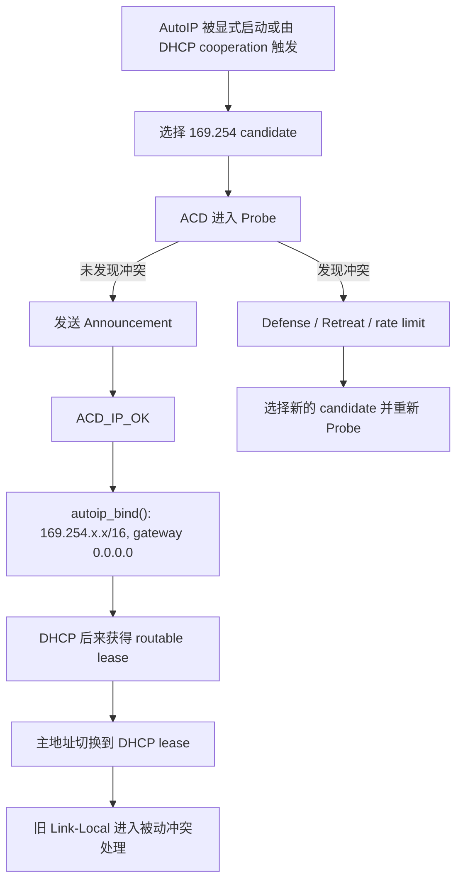
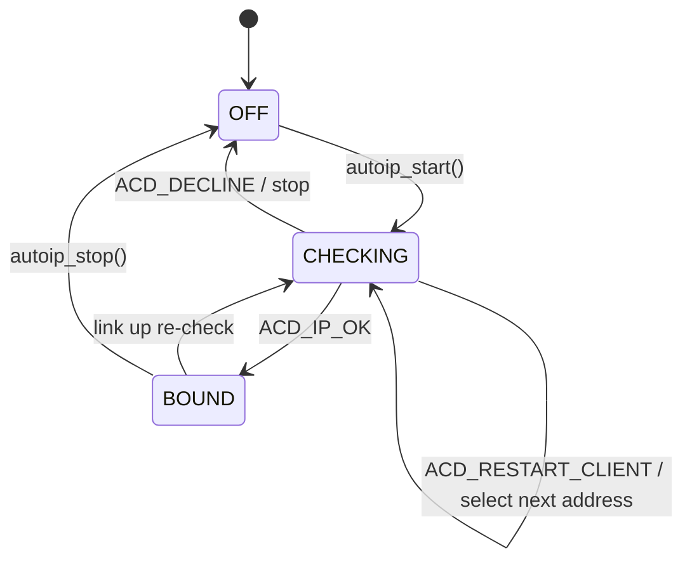
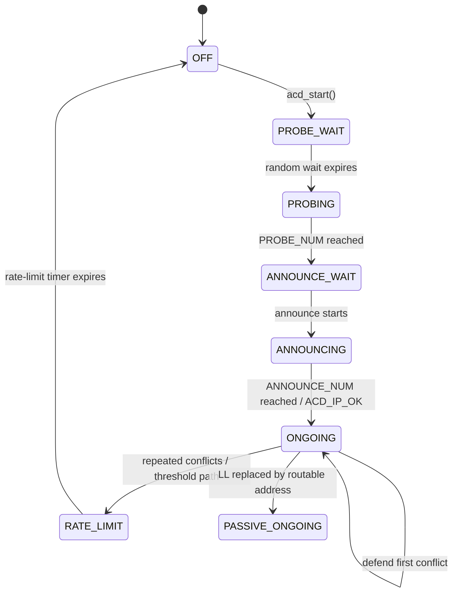
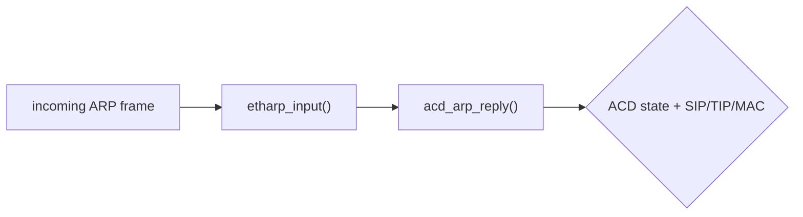
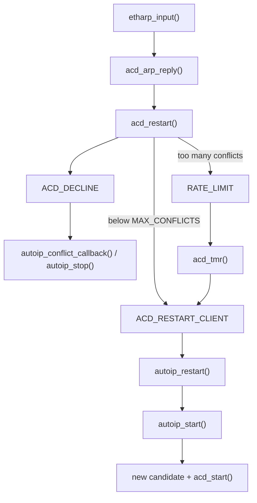
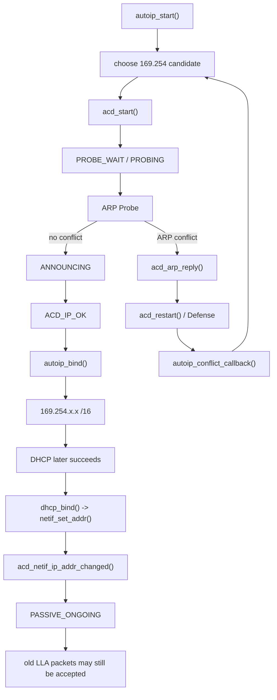

<meta name="referrer" content="no-referrer" />

# 教程 25：从 `autoip_start()` 到 `ACD_IP_OK`——IPv4 Link-Local、169.254/16、ARP Probe/Announce、Conflict 与 DHCP Cooperation

> 摘要：从 AutoIP 入口追踪 169.254 地址选择、AutoIP/ACD 双层状态机、ARP Probe/Announce、冲突防御、DHCP cooperation 与链路变化。

[TOC]


AutoIP 是 lwIP 对 IPv4 Link-Local 自动配置机制的实现。IPv4 Link-Local 的目标是在没有可经路由器转发的 IPv4 配置时，仍让同一二层链路上的设备获得本地 IPv4 连通性；动态候选地址来自 `169.254.1.0` 到 `169.254.254.255`，绑定后使用 `/16`，不依赖默认 gateway，因此它解决的是**同链路连通性**，不是“没有 DHCP 时自动获得 Internet access”。[S3](#source-s3)

地址不能选中后立刻使用，因为同一链路上的另一台设备可能已经使用同一个地址。ACD（Address Conflict Detection，地址冲突检测）用 ARP（Address Resolution Protocol，地址解析协议）完成这一检查：**candidate** 是尚未正式绑定的候选地址；**Probe** 使用 ARP 询问该 candidate 是否已经被占用；**Announcement** 在确认可用后声明本机正在使用该地址；地址投入使用后若再次检测到冲突，可以进行一次 **Defense**，短时间内再次冲突则需要 **Retreat（退让）** 并重新选择地址；持续冲突还需要 **rate limiting（速率限制）**，避免反复探测形成广播风暴。[S4](#source-s4)

AutoIP 与 DHCPv4（Dynamic Host Configuration Protocol for IPv4，IPv4 动态主机配置协议）不是互斥机制。配置了 `LWIP_DHCP_AUTOIP_COOP` 时，DHCP 在多次 Discover 未成功后可以启动 AutoIP；如果 DHCP 随后获得可路由 lease（租约），主 IPv4 地址可以切回 DHCP，同时 ACD/AutoIP 仍参与旧 Link-Local 地址的冲突处理与接收边界。[S1](#source-s1) Stage 13 已经讲 DHCPv4，Stage 22 已经讲 link state；Stage 25 只追踪这两条线怎样通过 `autoip.c`、`acd.c`、ARP input 与 `netif` callback 汇合。

## 阅读源码前：建议提前阅读

这些资料用于规范核对与进一步阅读，正文即使脱离外链也会完整解释当前主线：

1. [RFC 3927：Dynamic Configuration of IPv4 Link-Local Addresses](https://www.rfc-editor.org/rfc/rfc3927.html) —— 重点核对候选地址范围、link-local scope、与 DHCP 的协作原则。[S3](#source-s3)
2. [RFC 5227：IPv4 Address Conflict Detection](https://www.rfc-editor.org/rfc/rfc5227.html) —— 重点核对 Probe、Announcement、Conflict、Defense 与 rate limiting。[S4](#source-s4)
3. [Microsoft Learn：How to use automatic TCP/IP addressing without a DHCP server](https://learn.microsoft.com/windows-server/troubleshoot/how-to-use-automatic-tcpip-addressing-without-a-dh) —— 用工程视角观察 DHCP 不可用时 `169.254/16` 的典型表现和同链路边界。[S5](#source-s5)

## 进入源码前先看完整协议流程

ACD 完成 Probe/Announcement 且确认 candidate 可以使用时，会通过 callback 上报 `ACD_IP_OK`；AutoIP 收到这个事件后才执行 `autoip_bind()`。因此 `ACD_IP_OK` 是“候选地址已经通过冲突检测”的实现事件，不是一种线上报文。



AutoIP 自身只关心 OFF/CHECKING/BOUND，真正的 ARP 冲突检测由嵌套的 ACD 状态机推进。表中的 `PROBING` 表示正在发送 Probe，`ANNOUNCING` 表示正在发送 Announcement，`ONGOING` 表示地址已经投入使用后继续监视冲突；后文会沿 `acd_tmr()` 和 ARP receive path 展开这些迁移。

协议动作与本文源码落点如下：

| 协议阶段 | 协议动作 | lwIP 实现入口 | 关键对象/状态 | 下一步 |
| --- | --- | --- | --- | --- |
| 启动 | 选择 Link-Local candidate | `autoip_start()` / `autoip_create_addr()` | `struct autoip` | `acd_start()` |
| 使用前冲突检测 | ARP Probe | `acd_tmr()` → `etharp_acd_probe()` | `struct acd` + `PROBING` | Announcement 或 conflict |
| 宣告地址 | ARP Announcement | `acd_tmr()` → `etharp_acd_announce()` | `ANNOUNCING` | `ACD_IP_OK` |
| 正式绑定 | 将 candidate 写入 interface | `autoip_conflict_callback()` → `autoip_bind()` | `AUTOIP_STATE_BOUND` | same-link traffic |
| 运行中冲突 | Defense / Retreat | `etharp_input()` → `acd_arp_reply()` | `ONGOING` / rate-limit state | Defense 或 restart |
| DHCP cooperation | DHCP success 替换主地址 | `dhcp_bind()` / `acd_netif_ip_addr_changed()` | routable IPv4 + passive ACD | 保留必要 Link-Local 接收能力 |

后文仍从公开入口 `autoip_start()` 开始沿真实执行顺序下钻，协议图只负责导航。

## 1. 当前 example 默认没有直接启用 AutoIP

`src/include/lwip/opt.h` 默认 `LWIP_AUTOIP=0`。当前 `contrib/examples/example_app/test_configs/opt_default.h` 也显式关闭 AutoIP；而 `example_app/lwipopts.h` 另一套通用配置会把 `LWIP_AUTOIP` 绑定到 `LWIP_DHCP`，并允许 `LWIP_DHCP_AUTOIP_COOP`。[S2](#source-s2)

因此需要区分：

```text
Core feature exists
  ≠
current test profile automatically runs it
```

本文主要解释当前 pinned source 的真实机制，没有在本轮重新启用 AutoIP 做 TAP 抓包实验。

## 2. lwIP 如何编码 RFC 3927 的 Link-Local candidate 范围

IPv4 Link-Local 使用 `169.254/16`，但 RFC 3927 把动态 candidate 范围限制在 `169.254.1.0` 到 `169.254.254.255`；也就是说 `169.254.0.x` 与 `169.254.255.x` 不参与本文这一动态选择过程。[S3](#source-s3)

lwIP 在 `prot/autoip.h` 中直接编码同一范围：[S1](#source-s1)

```c
#define AUTOIP_NET              0xA9FE0000
#define AUTOIP_RANGE_START      (AUTOIP_NET | 0x0100)
#define AUTOIP_RANGE_END        (AUTOIP_NET | 0xFEFF)
```

这一代码范围与 RFC 3927 的候选范围对应。绑定后的地址用于同一链路通信，不建立可跨路由的默认 gateway；后面的 `autoip_bind()` 会把这一点直接落实为 `/16` netmask 和 `0.0.0.0` gateway。[S1](#source-s1)[S3](#source-s3)

## 3. AutoIP 自己只有三态

当前 `autoip_state_enum_t` 很简单：[S1](#source-s1)

```c
typedef enum {
  AUTOIP_STATE_OFF,
  AUTOIP_STATE_CHECKING,
  AUTOIP_STATE_BOUND
} autoip_state_enum_t;
```

`struct autoip` 保存：

```c
struct autoip
{
  ip4_addr_t llipaddr;
  u8_t state;
  u8_t tried_llipaddr;
  struct acd acd;
};
```

如果只读这里，很容易误以为 probing/announcing 没有状态。实际上这些状态已经下沉到 `struct acd`。

## 4. `autoip_start()` 是真实公开入口

当前函数首先要求 netif 已经 administrative up，然后按需分配 `struct autoip` 并挂到 netif client data。[S1](#source-s1)

```c
err_t
autoip_start(struct netif *netif)
{
  struct autoip *autoip = netif_autoip_data(netif);
  err_t result = ERR_OK;

  LWIP_ASSERT_CORE_LOCKED();
  LWIP_ERROR("netif is not up, old style port?", netif_is_up(netif), return ERR_ARG;);

  if (autoip == NULL) {
    autoip = (struct autoip *)mem_calloc(1, sizeof(struct autoip));
    if (autoip == NULL) {
      return ERR_MEM;
    }
    netif_set_client_data(netif, LWIP_NETIF_CLIENT_DATA_INDEX_AUTOIP, autoip);
  }
```

因此 AutoIP state 是 per-netif，而不是一个全局地址选择器。

## 5. 地址 seed 默认来自 MAC 地址末尾字节

继续阅读函数式宏 `LWIP_AUTOIP_CREATE_SEED_ADDR(netif)` 的默认定义：[S1](#source-s1)

```c
#ifndef LWIP_AUTOIP_CREATE_SEED_ADDR
#define LWIP_AUTOIP_CREATE_SEED_ADDR(netif) \
  lwip_htonl(AUTOIP_RANGE_START + ((u32_t)(((u8_t)(netif->hwaddr[4])) | \
                 ((u32_t)((u8_t)(netif->hwaddr[5]))) << 8)))
#endif
```

`autoip_create_addr()` 再叠加 `tried_llipaddr` 并折回合法范围。这样当前实现倾向于同一硬件接口在无冲突时重复选择稳定的 Link-Local address，而不是每次完全随机挑一个。[S1](#source-s1)

RFC 3927 也建议不同主机应产生不同序列，并允许利用设备唯一信息帮助形成稳定选择。[S3](#source-s3)

## 6. `autoip_start()` 不会立刻写 `netif->ip_addr`

继续阅读 `autoip_start()`：[S1](#source-s1)

```c
if (autoip->state == AUTOIP_STATE_OFF) {
  acd_add(netif, &autoip->acd, autoip_conflict_callback);

  if (!ip4_addr_islinklocal(&autoip->llipaddr)) {
    autoip_create_addr(netif, &(autoip->llipaddr));
  }
  autoip->state = AUTOIP_STATE_CHECKING;
  acd_start(netif, &autoip->acd, autoip->llipaddr);
}
```

关键顺序是：

```text
choose candidate
  → CHECKING
  → ACD Probe/Announce
  → only after ACD_IP_OK
  → autoip_bind()
  → netif_set_addr()
```

候选地址在 conflict detection 完成前不是正式 interface IPv4 address。

## 7. ACD 是当前真正负责 Probe/Announce 的状态机

AutoIP 通过 `acd_add()` 把自己的 `struct acd` 挂到 `netif->acd_list`，并注册 `autoip_conflict_callback()`。[S1](#source-s1)

当前 ACD 状态包括：

```text
OFF
PROBE_WAIT
PROBING
ANNOUNCE_WAIT
ANNOUNCING
ONGOING
PASSIVE_ONGOING
RATE_LIMIT
```

这说明 ACD 已经从“AutoIP 私有 helper”演进成可被 DHCP 地址冲突检测等路径复用的通用 IPv4 address conflict module。

## 8. `acd_start()`：候选地址进入 PROBE_WAIT

`acd_start(netif, acd, ipaddr)` 保存 candidate address，清理 Probe counters，把状态设置为 `ACD_STATE_PROBE_WAIT`，再生成首次随机等待时间。[S1](#source-s1)

```c
acd->ipaddr = ipaddr;
acd->state = ACD_STATE_PROBE_WAIT;
acd->sent_num = 0;
acd->ttw = (u16_t)(ACD_RANDOM_PROBE_WAIT(netif, acd));
```

当前 random source 优先使用 `LWIP_RAND()`；若没有，则可兼容 `LWIP_AUTOIP_RAND`，再退到 MAC-derived fallback。[S1](#source-s1)

## 9. ACD timer 每 100 ms 推进状态

`timeouts.c` 在 `LWIP_ACD` 启用时注册 `acd_tmr()`；`ACD_TMR_INTERVAL` 是 100 ms。[S1](#source-s1)

`acd_tmr()` 遍历每个 netif 的 `acd_list`。在 `PROBE_WAIT/PROBING` 中，当 `ttw` 到 0 时调用：

```c
etharp_acd_probe(netif, &acd->ipaddr);
```

达到 `PROBE_NUM` 后进入 `ANNOUNCE_WAIT`。[S1](#source-s1)

RFC 5227 定义了 Probe、Announcement、Conflict Detection 与 Defense 的通用 ACD 规则；当前 lwIP 的 ACD constants 与这些规则对应。[S4](#source-s4)

## 10. `etharp_acd_probe()` 如何把 RFC 5227 Probe 落到 ARP 字段

ACD Probe 的目标是询问“是否已有节点正在使用这个 candidate”，但 Probe 本身还不能把 candidate 当作本机正式 IPv4 源地址。因此 RFC 5227 使用 `0.0.0.0` 作为 ARP sender IP，并把 candidate 放在 target IP；当前 lwIP 正是按这一语义构造报文。[S4](#source-s4)

当前发送结果逻辑上是：

```text
Ethernet dst = ff:ff:ff:ff:ff:ff
ARP sender MAC = local MAC
ARP sender IP  = 0.0.0.0
ARP target MAC = 00:00:00:00:00:00
ARP target IP  = candidate 169.254.x.x
```

与 Stage 4 的普通 ARP address resolution 相比，差异点只在这里需要识别：该报文由 ACD 路径构造，用于 candidate ownership detection。

## 11. Probe 计数完成后，lwIP 如何进入 Announcement

`acd_tmr()` 完成 Probe count 后等待 `ANNOUNCE_WAIT`，随后进入 `ANNOUNCING` 并调用：[S1](#source-s1)

```c
etharp_acd_announce(netif, &acd->ipaddr);
```

当前 constants 包括：[S1](#source-s1)[S4](#source-s4)

```c
#define PROBE_NUM            3
#define ANNOUNCE_NUM         2
#define RATE_LIMIT_INTERVAL  60
#define DEFEND_INTERVAL      10
```

当 `ANNOUNCE_NUM` 达到后，ACD 进入 `ONGOING` 并通过 callback 报告 `ACD_IP_OK`。

## 12. `ACD_IP_OK` 才回到 AutoIP 并真正绑定地址

`autoip_conflict_callback()` 是 ACD → AutoIP 的关键桥接：[S1](#source-s1)

```c
static void
autoip_conflict_callback(struct netif *netif, acd_callback_enum_t state)
{
  struct autoip *autoip = netif_autoip_data(netif);

  switch (state) {
    case ACD_IP_OK:
      autoip_bind(netif);
      break;
    case ACD_RESTART_CLIENT:
      autoip_restart(netif);
      break;
    case ACD_DECLINE:
      ip4_addr_set_any(&autoip->llipaddr);
      autoip->tried_llipaddr++;
      autoip_stop(netif);
      break;
    default:
      break;
  }
}
```

这就是异步 return path：`autoip_start()` 早已返回，后续由 100 ms timer 和 incoming ARP events 推进 ACD，最终 callback 回到 AutoIP。

## 13. `autoip_bind()`：/16 netmask、无 gateway

`ACD_IP_OK` 进入 `autoip_bind()`：[S1](#source-s1)

```c
static err_t
autoip_bind(struct netif *netif)
{
  struct autoip *autoip = netif_autoip_data(netif);
  ip4_addr_t sn_mask, gw_addr;

  autoip->state = AUTOIP_STATE_BOUND;

  IP4_ADDR(&sn_mask, 255, 255, 0, 0);
  IP4_ADDR(&gw_addr, 0, 0, 0, 0);

  netif_set_addr(netif, &autoip->llipaddr, &sn_mask, &gw_addr);

  return ERR_OK;
}
```

也就是：

```text
address = 169.254.x.x
netmask = 255.255.0.0
gateway = 0.0.0.0
```

这与 RFC 3927 的 link-local scope 一致：该地址不是为了通过 router 到达远端网络。[S3](#source-s3)

## 14. AutoIP 与 ACD 两层状态机必须一起看

AutoIP 上层状态：



ACD 下层状态：



上层决定“这个 candidate 接下来怎么处理”；下层决定“这个 candidate 在链路上是否冲突”。

## 15. ARP conflict 的真实入口在 `etharp_input()`，不是 ACD 自己主动轮询网络

前 14 节已经跑完 `autoip_start()` → `acd_start()` → Probe/Announce → `ACD_IP_OK`。地址进入 `ONGOING` 后，ACD 仍需要持续监听链路上是否出现同地址主机；这个入口不是新的 timer，而是所有 incoming ARP 都会经过的 `etharp_input()`。[S1](#source-s1)

继续阅读 `etharp_input()` 在完成 ARP header 基本合法性检查后的调用点：[S1](#source-s1)

```c
#if LWIP_ACD
  /* We have to check if a host already has configured our ip address and
   * continuously check if there is a host with this IP-address so we can
   * detect collisions.
   * acd_arp_reply ensures the detection of conflicts. It will handle possible
   * defending or retreating and will make sure a new IP address is selected.
   * etharp_input does not need to handle packets that originate "from_us".
   */
  acd_arp_reply(netif, hdr);
#endif /* LWIP_ACD */
```

因此 ACD conflict path 的触发模型是：



这也解释了为什么“别人正常发一个 ARP”就足以暴露冲突，不需要对端专门回复本机 Probe。

## 16. 进入 `acd_arp_reply()`：Probe 阶段和地址已使用阶段采用不同冲突条件

`etharp_input()` 直接把当前 `netif` 与 ARP header 交给 `acd_arp_reply()`。函数先取出 sender IP、target IP 与本机 MAC，然后遍历该 netif 上的 ACD clients。[S1](#source-s1)

在 `PROBE_WAIT / PROBING / ANNOUNCE_WAIT` 阶段，candidate 还没有被确认可用。继续阅读 `acd_arp_reply()` 的第一组状态分支：[S1](#source-s1)[S4](#source-s4)

```c
      case ACD_STATE_PROBE_WAIT:
      case ACD_STATE_PROBING:
      case ACD_STATE_ANNOUNCE_WAIT:
        /* RFC 5227 Section 2.1.1:
         * from beginning to after ANNOUNCE_WAIT seconds we have a conflict if
         * ip.src == ipaddr (someone is already using the address)
         * OR
         * ip.dst == ipaddr && hw.src != own hwaddr (someone else is probing it)
         */
        if ((ip4_addr_eq(&sipaddr, &acd->ipaddr)) ||
            (ip4_addr_isany_val(sipaddr) &&
             ip4_addr_eq(&dipaddr, &acd->ipaddr) &&
             !eth_addr_eq(&netifaddr, &hdr->shwaddr))) {
          LWIP_DEBUGF(ACD_DEBUG | LWIP_DBG_TRACE | LWIP_DBG_STATE | LWIP_DBG_LEVEL_WARNING,
                      ("acd_arp_reply(): Probe Conflict detected\n"));
          acd_restart(netif, acd);
        }
        break;
```

这里有两种冲突证据：

1. `sender IP == candidate`：说明已经有人在使用这个地址；
2. `sender IP == 0` 且 `target IP == candidate` 且 sender MAC 不是自己：说明另一台主机也在 Probe 同一个 candidate。

地址已经进入 `ANNOUNCING / ONGOING / PASSIVE_ONGOING` 后，判断条件发生变化。继续阅读 `acd_arp_reply()` 的下一组状态：[S1](#source-s1)[S4](#source-s4)

```c
      case ACD_STATE_ANNOUNCING:
      case ACD_STATE_ONGOING:
      case ACD_STATE_PASSIVE_ONGOING:
        /* RFC 5227 Section 2.4:
         * in any state we have a conflict if
         * ip.src == ipaddr && hw.src != own hwaddr (someone is using our address)
         */
        if (ip4_addr_eq(&sipaddr, &acd->ipaddr) &&
            !eth_addr_eq(&netifaddr, &hdr->shwaddr)) {
          LWIP_DEBUGF(ACD_DEBUG | LWIP_DBG_TRACE | LWIP_DBG_STATE | LWIP_DBG_LEVEL_WARNING,
                      ("acd_arp_reply(): Conflicting ARP-Packet detected\n"));
          acd_handle_arp_conflict(netif, acd);
        }
        break;
```

这时地址已经在使用，只有看到**别的 MAC 以该 IP 作为 sender IP**才进入 ongoing conflict handler。Probe 阶段与 Ongoing 阶段因此不是同一个布尔判断。

## 17. 进入 `acd_handle_arp_conflict()`：第一次 Defense、短时间再次冲突 Retreat、Passive 直接退出

`acd_arp_reply()` 在已使用地址的状态下调用 `acd_handle_arp_conflict()`。这个函数直接决定“保地址还是退让”。[S1](#source-s1)[S4](#source-s4)

```c
static void
acd_handle_arp_conflict(struct netif *netif, struct acd *acd)
{
  if (acd->state == ACD_STATE_PASSIVE_ONGOING) {
    /* Immediately back off on a conflict. */
    LWIP_DEBUGF(ACD_DEBUG | LWIP_DBG_TRACE | LWIP_DBG_STATE,
      ("acd_handle_arp_conflict(): conflict when we are in passive mode -> back off\n"));
    acd_stop(acd);
    acd->acd_conflict_callback(netif, ACD_DECLINE);
  }
  else {
    if (acd->lastconflict > 0) {
      /* retreat, there was a conflicting ARP in the last DEFEND_INTERVAL seconds */
      LWIP_DEBUGF(ACD_DEBUG | LWIP_DBG_TRACE | LWIP_DBG_STATE,
        ("acd_handle_arp_conflict(): conflict within DEFEND_INTERVAL -> retreating\n"));

      /* Active TCP sessions are aborted when removing the ip address but a bad
       * connection was inevitable anyway with conflicting hosts */
       acd_restart(netif, acd);
    } else {
      LWIP_DEBUGF(ACD_DEBUG | LWIP_DBG_TRACE | LWIP_DBG_STATE,
          ("acd_handle_arp_conflict(): we are defending, send ARP Announce\n"));
      etharp_acd_announce(netif, &acd->ipaddr);
      acd->lastconflict = DEFEND_INTERVAL * ACD_TICKS_PER_SECOND;
    }
  }
}
```

运行语义因此是：[S4](#source-s4)

```text
ACTIVE ONGOING 第一次冲突
  -> ARP Announcement defense
  -> lastconflict = DEFEND_INTERVAL

DEFEND_INTERVAL 内再次冲突
  -> acd_restart()
  -> 放弃当前 candidate，重新开始地址获取

PASSIVE_ONGOING 冲突
  -> acd_stop()
  -> ACD_DECLINE
  -> 不主动 Defense
```

`lastconflict` 又会由 `acd_tmr()` 每个 ACD tick 递减，因此 Defense window 本身也是状态机的一部分，而不是一条孤立 if。

## 18. 进入 `acd_restart()`：Decline 先通知上层，随后决定立即重启还是进入 Rate Limit

无论 Probe 阶段直接发现冲突，还是 Ongoing 阶段在 Defense window 内再次冲突，最终都会进入 `acd_restart()`。继续阅读该函数：[S1](#source-s1)[S4](#source-s4)

```c
static void
acd_restart(struct netif *netif, struct acd *acd)
{
  /* increase conflict counter. */
  acd->num_conflicts++;

  /* Decline the address */
  acd->acd_conflict_callback(netif, ACD_DECLINE);

  /* if we tried more then MAX_CONFLICTS we must limit our rate for
   * acquiring and probing addresses. compliant to RFC 5227 Section 2.1.1 */
  if (acd->num_conflicts >= MAX_CONFLICTS) {
    acd->state = ACD_STATE_RATE_LIMIT;
    acd->ttw = (u16_t)(RATE_LIMIT_INTERVAL * ACD_TICKS_PER_SECOND);
    LWIP_DEBUGF(ACD_DEBUG | LWIP_DBG_TRACE | LWIP_DBG_STATE | LWIP_DBG_LEVEL_WARNING,
                ("acd_restart(): rate limiting initiated. too many conflicts\n"));
  }
  else {
    /* acd should be stopped because ipaddr isn't valid any more */
    acd_stop(acd);
    /* let the acd user know right away that their is a conflict detected.
     * So it can restart the address acquiring process. */
    acd->acd_conflict_callback(netif, ACD_RESTART_CLIENT);
  }
}
```

这里存在两个 callback，不应压成“冲突后重启”：

- `ACD_DECLINE` 先告诉上层“当前 candidate 已经不能继续使用”；
- 若未达到 `MAX_CONFLICTS`，再通过 `ACD_RESTART_CLIENT` 请求上层立即重新选地址；
- 达到阈值则进入 `ACD_STATE_RATE_LIMIT`，暂时不发第二个 callback。

Rate Limit 的完成点仍在 `acd_tmr()`。继续阅读 `ACD_STATE_RATE_LIMIT` 分支：[S1](#source-s1)

```c
        case ACD_STATE_RATE_LIMIT:
          if (acd->ttw == 0) {
            /* acd should be stopped because ipaddr isn't valid any more */
            acd_stop(acd);
            /* let the acd user (after rate limit interval) know that their is
             * a conflict detected. So it can restart the address acquiring
             * process.*/
            acd->acd_conflict_callback(netif, ACD_RESTART_CLIENT);
          }
          break;
```

所以 Rate Limit 不是死状态；等待结束后仍通过同一个 callback bridge 返回 AutoIP client。

## 19. 回到 AutoIP 的 callback：`ACD_RESTART_CLIENT` 才真正选择下一个 169.254 candidate

`autoip_start()` 在前半篇已经通过 `acd_add(netif, &autoip->acd, autoip_conflict_callback)` 注册 ACD callback。因此第 18 节的 `acd->acd_conflict_callback()` 实际回到 `autoip_conflict_callback()`。[S1](#source-s1)

```c
static void
autoip_conflict_callback(struct netif *netif, acd_callback_enum_t state)
{
  struct autoip *autoip = netif_autoip_data(netif);

  switch (state) {
    case ACD_IP_OK:
      autoip_bind(netif);
      break;
    case ACD_RESTART_CLIENT:
      autoip_restart(netif);
      break;
    case ACD_DECLINE:
      /* "delete" conflicting address and increment tried addr so a new one
       * will be selected in autoip_start() */
      ip4_addr_set_any(&autoip->llipaddr);
      autoip->tried_llipaddr++;
      autoip_stop(netif);
      break;
      default:
      break;
  }
}
```

当收到 `ACD_RESTART_CLIENT` 时继续进入 `autoip_restart()`：[S1](#source-s1)

```c
static void
autoip_restart(struct netif *netif)
{
  struct autoip *autoip = netif_autoip_data(netif);
  autoip->tried_llipaddr++;
  autoip_start(netif);
}
```

然后执行又回到前面已经读过的 `autoip_start()`：如果 `llipaddr` 已经被 `ACD_DECLINE` 清空，`autoip_create_addr()` 使用新的 `tried_llipaddr` 生成下一个 candidate，再调用 `acd_start()` 重新 Probe。需要注意当前 pinned source 的一个实现细节：AutoIP 的 `ACD_DECLINE` 分支会先执行一次 `tried_llipaddr++`，随后 `ACD_RESTART_CLIENT` 进入 `autoip_restart()` 时又执行一次 `tried_llipaddr++`；这是当前 lwIP callback 组合产生的实现行为，不应泛化成 RFC 3927/5227 规定的固定“地址步长”。[S1](#source-s1)

因此完整冲突重试链现在能够连续跑通：



## 20. DHCP cooperation 的第一半：`dhcp_discover()` 尝试达到阈值后才启动 AutoIP

当 `LWIP_DHCP_AUTOIP_COOP=1` 时，AutoIP 不是和 DHCP 二选一。DHCP client 仍然先尝试获得 routable lease；只有 `tries` 达到配置阈值后，`dhcp_discover()` 才调用 `autoip_start(netif)`。[S1](#source-s1)

继续阅读 `dhcp_discover()` 的入口部分：[S1](#source-s1)

```c
static err_t
dhcp_discover(struct netif *netif)
{
  struct dhcp *dhcp = netif_dhcp_data(netif);
  err_t result = ERR_OK;
  u16_t msecs;
  u8_t i;
  struct pbuf *p_out;
  u16_t options_out_len;

  LWIP_DEBUGF(DHCP_DEBUG | LWIP_DBG_TRACE, ("dhcp_discover()\n"));

#if LWIP_DHCP_AUTOIP_COOP
  if (dhcp->tries >= LWIP_DHCP_AUTOIP_COOP_TRIES) {
    autoip_start(netif);
  }
#endif /* LWIP_DHCP_AUTOIP_COOP */
```

当前默认 `LWIP_DHCP_AUTOIP_COOP_TRIES` 为 9。[S1](#source-s1) 这条路径解决的是：DHCP Server 暂时不可达时，设备仍可通过 `169.254/16` 获得 same-link connectivity，同时 DHCP client 继续自己的状态机。

## 21. DHCP cooperation 的第二半：DHCP 后来成功时，`dhcp_bind()` 会把 netif 主地址切成 routable lease

只讲“DHCP 失败后启动 AutoIP”是不完整的。DHCP 后续收到可用 lease 时会进入 `dhcp_bind()`，这个函数把状态切到 `DHCP_STATE_BOUND`，再通过 `netif_set_addr()` 覆盖 netif 的 IPv4 address/mask/gateway。[S1](#source-s1)

继续阅读 `dhcp_bind()` 的收尾：[S1](#source-s1)

```c
  /* netif is now bound to DHCP leased address - set this before assigning the address
     to ensure the callback can use dhcp_supplied_address() */
  dhcp_set_state(dhcp, DHCP_STATE_BOUND);

  netif_set_addr(netif, &dhcp->offered_ip_addr, &sn_mask, &gw_addr);
  /* interface is used by routing now that an address is set */
}
```

`netif_set_addr()` 最终进入 `netif_do_set_ipaddr()`。当地址真正变化时，该函数先保存 old/new address，并把变化通知 ACD：[S1](#source-s1)

```c
static int
netif_do_set_ipaddr(struct netif *netif, const ip4_addr_t *ipaddr, ip_addr_t *old_addr)
{
  LWIP_ASSERT("invalid pointer", ipaddr != NULL);
  LWIP_ASSERT("invalid pointer", old_addr != NULL);

  /* address is actually being changed? */
  if (ip4_addr_eq(ipaddr, netif_ip4_addr(netif)) == 0) {
    ip_addr_t new_addr;
    *ip_2_ip4(&new_addr) = *ipaddr;
    IP_SET_TYPE_VAL(new_addr, IPADDR_TYPE_V4);

    ip_addr_copy(*old_addr, *netif_ip_addr4(netif));

    LWIP_DEBUGF(NETIF_DEBUG | LWIP_DBG_STATE, ("netif_set_ipaddr: netif address being changed\n"));
    netif_do_ip_addr_changed(old_addr, &new_addr);

#if LWIP_ACD
    acd_netif_ip_addr_changed(netif, old_addr, &new_addr);
#endif /* LWIP_ACD */
```

这里第一次把 DHCP 与“旧 Link-Local ACD”真正接起来。

## 22. 进入 `acd_netif_ip_addr_changed()`：Link-Local 被 routable IPv4 替换后转入 `PASSIVE_ONGOING`

`netif_do_set_ipaddr()` 直接调用 `acd_netif_ip_addr_changed()`。继续进入这个函数：[S1](#source-s1)

```c
void
acd_netif_ip_addr_changed(struct netif *netif, const ip_addr_t *old_addr,
                          const ip_addr_t *new_addr)
{
  struct acd *acd;

  LWIP_DEBUGF(ACD_DEBUG | LWIP_DBG_TRACE | LWIP_DBG_STATE,
    ("acd_netif_ip_addr_changed(): Address changed\n"));

  LWIP_DEBUGF(ACD_DEBUG | LWIP_DBG_TRACE | LWIP_DBG_STATE,
    ("acd_netif_ip_addr_changed(): old address = %s\n", ipaddr_ntoa(old_addr)));
  LWIP_DEBUGF(ACD_DEBUG | LWIP_DBG_TRACE | LWIP_DBG_STATE,
    ("acd_netif_ip_addr_changed(): new address = %s\n", ipaddr_ntoa(new_addr)));

  /* If we change from ANY to an IP or from an IP to ANY we do nothing */
  if (ip_addr_isany(old_addr) || ip_addr_isany(new_addr)) {
    return;
  }

  ACD_FOREACH(acd, netif->acd_list) {
    /* Find ACD module of old address */
    if(ip4_addr_eq(&acd->ipaddr, ip_2_ip4(old_addr))) {
      /* Did we change from a LL address to a routable address? */
      if (ip_addr_islinklocal(old_addr) && !ip_addr_islinklocal(new_addr)) {
        LWIP_DEBUGF(ACD_DEBUG | LWIP_DBG_TRACE | LWIP_DBG_STATE,
          ("acd_netif_ip_addr_changed(): changed from LL to routable address\n"));
        /* Put the module in passive conflict detection mode */
        acd_put_in_passive_mode(netif, acd);
      }
    }
  }
}
```

接着进入 `acd_put_in_passive_mode()`。如果旧 ACD 已经在 `ANNOUNCING/ONGOING`，状态变成 `ACD_STATE_PASSIVE_ONGOING`；如果还处于 probing/rate-limit，当前实现则停止它并报告 `ACD_DECLINE`。[S1](#source-s1)

这个状态的意义是：**netif 的主 IPv4 已经换成 DHCP 地址，但旧 Link-Local 地址仍可能暂时服务已经建立的连接，因此后台继续被动监听冲突，却不再把这个地址当成需要主动保卫的主地址。**

## 23. 为什么旧 Link-Local 连接在主地址切换后还能继续：`ip4_input_accept()` 显式调用 `autoip_accept_packet()`

仅有 passive ACD 还不能解释“旧地址的 packet 为什么 IP input 仍会接收”。答案在 IPv4 input path。[S1](#source-s1)[S3](#source-s3)

继续阅读 `ip4_input_accept()` 的 AutoIP 分支：[S1](#source-s1)

```c
#if LWIP_AUTOIP
    /* connections to link-local addresses must persist after changing
        the netif's address (RFC3927 ch. 1.9) */
    if (autoip_accept_packet(netif, ip4_current_dest_addr())) {
      LWIP_DEBUGF(IP_DEBUG, ("ip4_input: LLA packet accepted on interface %c%c\n",
                             netif->name[0], netif->name[1]));
      /* accept on this netif */
      return 1;
    }
#endif /* LWIP_AUTOIP */
```

它调用的 `autoip_accept_packet()` 很直接：[S1](#source-s1)

```c
u8_t
autoip_accept_packet(struct netif *netif, const ip4_addr_t *addr)
{
  struct autoip *autoip = netif_autoip_data(netif);
  return     (autoip != NULL)
          && (ip4_addr_eq(addr, &(autoip->llipaddr)))
          && (autoip->state == AUTOIP_STATE_BOUND);
}
```

因此当前实现中的“地址切换后仍接受旧 LLA packet”不是泛泛的兼容性描述，而是 `ip4_input_accept()` 的显式输入条件。它和第 22 节的 passive ACD 合在一起，构成 DHCP cooperation 的完整后半段。

## 24. Link Up/Down 的触发入口也在 `netif.c`，不是 AutoIP 自己检测 PHY

Stage 22 已经建立 `netif_set_link_up/down()` 与 PHY/Driver 的关系。本篇只继续追 AutoIP/ACD 的桥接调用点。

`netif_set_link_up()` 在 link flag 从 down 变成 up 后直接通知 DHCP 和 AutoIP：[S1](#source-s1)

```c
#if LWIP_DHCP
    dhcp_network_changed_link_up(netif);
#endif /* LWIP_DHCP */

#if LWIP_AUTOIP
    autoip_network_changed_link_up(netif);
#endif /* LWIP_AUTOIP */
```

`netif_set_link_down()` 则通知 AutoIP 与所有 ACD clients：[S1](#source-s1)

```c
#if LWIP_AUTOIP
    autoip_network_changed_link_down(netif);
#endif /* LWIP_AUTOIP */

#if LWIP_ACD
    acd_network_changed_link_down(netif);
#endif /* LWIP_ACD */
```

因此调用链是：

```text
PHY/Driver 检测 link
  -> netif_set_link_up/down()
  -> AutoIP/ACD network_changed callback
```

AutoIP 并不自己轮询 PHY。

## 25. `autoip_network_changed_link_up()` 为什么优先重新 Probe 上次使用的地址

进入 `autoip_network_changed_link_up()`：[S1](#source-s1)[S3](#source-s3)

```c
void
autoip_network_changed_link_up(struct netif *netif)
{
  struct autoip *autoip = netif_autoip_data(netif);

  if (autoip && (autoip->state != AUTOIP_STATE_OFF) && !LWIP_DHCP_AUTOIP_COOP) {
    LWIP_DEBUGF(AUTOIP_DEBUG | LWIP_DBG_TRACE,
                ("autoip_network_changed_link_up(): start acd\n"));
    autoip->state = AUTOIP_STATE_CHECKING;
    /* Start acd check again for the last used address */
    acd_start(netif, &autoip->acd, autoip->llipaddr);
  }
}
```

非 DHCP cooperation 模式下，link 恢复后不立刻生成一个新地址，而是把状态退回 CHECKING，对保存在 `autoip->llipaddr` 的旧 candidate 再做 ACD。这与 RFC 3927 倾向尽量复用同一 Link-Local 地址的目标一致。[S3](#source-s3)

Link Down 的 cooperation 分支则相反：[S1](#source-s1)

```c
void
autoip_network_changed_link_down(struct netif *netif)
{
  struct autoip *autoip = netif_autoip_data(netif);

  if (autoip && (autoip->state != AUTOIP_STATE_OFF) && LWIP_DHCP_AUTOIP_COOP) {
    LWIP_DEBUGF(AUTOIP_DEBUG | LWIP_DBG_TRACE,
                ("autoip_network_changed_link_down(): stop autoip\n"));
    autoip_stop(netif);
  }
}
```

因为下一次 link up 后应先让 DHCP 重新尝试，必要时再由 `dhcp_discover()` 按阈值启动 AutoIP。

## 26. AutoIP、DHCP、mDNS 各解决不同层的问题

源码主链闭环后再统一区分这三个经常一起出现的“零配置”组件：

```text
DHCP
  -> 从服务器获得 routable IPv4 / mask / gateway / DNS

AutoIP / IPv4 Link-Local
  -> DHCP 不可用时，从 169.254/16 获得 same-link IPv4 connectivity

mDNS / DNS-SD
  -> 在本地链路通过名称解析和服务发现找到 peer/service
```

`autoip_bind()` 明确把 netmask 设为 `/16`、gateway 设为 `0.0.0.0`；RFC 3927 也限定 Link-Local scope。[S1](#source-s1)[S3](#source-s3) 因此 AutoIP 不是“没有 DHCP 时自动获得 Internet access”，也不是 DHCP server 的替代品。

同样，有 AutoIP 不会自动发布 `device.local`；那是 Stage 24 mDNS/DNS-SD 的职责。IPv6 link-local/SLAAC 同样也可以承载 mDNS，所以二者只是常见组合，不是强绑定。

## 27. Stage 25 的完整源码心智模型



Stage 25 最终建立的是两个嵌套 lifecycle：AutoIP 决定“选择哪个 Link-Local candidate、何时把它绑定到 netif”，ACD 决定“这个 candidate 在链路上是否安全、发生冲突时 defend、retreat 还是 rate-limit”。DHCP cooperation 和 Link change 又通过明确的 callback/`netif` bridge 驱动这两个状态机，而不是旁路修改地址。

下一篇进入 SNMP/MIB2：从网络配置生命周期转向设备运行状态的管理视角，观察 lwIP 怎样把 netif、IP、ICMP、TCP、UDP 统计映射成 OID tree，并通过 UDP 161 响应管理端查询。

## 资料来源

<a id="source-s1"></a>
### [S1] lwIP AutoIP、ACD、DHCP cooperation 与 netif 源码
- 类型：目标版本上游源码
- 版本：commit `d08f4773edd0182b7910fc8f046eed82ffcd67c9`
- 定位：`src/core/ipv4/autoip.c`：`autoip_start()`、`autoip_create_addr()`、`autoip_conflict_callback()`、`autoip_bind()`、link-change handlers；`src/core/ipv4/acd.c`：`acd_start()`、`acd_tmr()`、`acd_arp_reply()`、`acd_handle_arp_conflict()`；`src/core/ipv4/dhcp.c`：cooperation bridge；`src/core/netif.c`、`src/core/ipv4/ip4.c`
- URL/文档：[lwIP upstream commit](https://github.com/lwip-tcpip/lwip/tree/d08f4773edd0182b7910fc8f046eed82ffcd67c9)
- 使用位置：“地址选择”“AutoIP/ACD 双状态机”“Probe/Announce”“Conflict/Defense”“DHCP cooperation”“link change”“old LLA persistence”
- 支撑内容：证明当前实现真实调用链、callback bridge、状态迁移、timer 与 routing/input integration

<a id="source-s2"></a>
### [S2] lwIP AutoIP 配置
- 类型：目标版本上游配置
- 版本：commit `d08f4773edd0182b7910fc8f046eed82ffcd67c9`
- 定位：`src/include/lwip/opt.h`；`contrib/examples/example_app/lwipopts.h`；`contrib/examples/example_app/test_configs/opt_default.h`
- URL/文档：[lwIP example_app](https://github.com/lwip-tcpip/lwip/tree/d08f4773edd0182b7910fc8f046eed82ffcd67c9/contrib/examples/example_app)
- 使用位置：“当前 profile 默认关闭”“DHCP/AutoIP cooperation compile options”
- 支撑内容：区分 Core 能力、通用 example 配置与当前 test profile

<a id="source-s3"></a>
### [S3] RFC 3927：Dynamic Configuration of IPv4 Link-Local Addresses
- 类型：IETF 标准规范
- 版本：RFC 3927，2005
- URL/文档：[RFC 3927](https://www.rfc-editor.org/rfc/rfc3927.html)
- 使用位置：“169.254/16”“动态选择范围”“link-local scope”“稳定地址倾向”“routing boundary”
- 支撑内容：给出 IPv4 Link-Local 地址选择、使用范围与同链路通信规则

<a id="source-s4"></a>
### [S4] RFC 5227：IPv4 Address Conflict Detection
- 类型：IETF 标准规范
- 版本：RFC 5227，2008
- URL/文档：[RFC 5227](https://www.rfc-editor.org/rfc/rfc5227.html)
- 使用位置：“ARP Probe/Announcement”“PROBE_NUM/ANNOUNCE_NUM”“Conflict Defense”“RATE_LIMIT_INTERVAL”“DEFEND_INTERVAL”
- 支撑内容：提供 lwIP ACD 状态机和 timing constants 对应的规范语义

<a id="source-s5"></a>
### [S5] Microsoft Learn：Automatic TCP/IP addressing without DHCP
- 类型：厂商官方工程说明
- 版本：访问日期 2026-10-03
- URL/文档：[How to use automatic TCP/IP addressing without a DHCP server](https://learn.microsoft.com/windows-server/troubleshoot/how-to-use-automatic-tcpip-addressing-without-a-dh)
- 使用位置：“阅读源码前：建议提前阅读”
- 支撑内容：从工程现象解释 DHCP 不可用时的 APIPA/`169.254/16`、同一 LAN 通信范围与不能跨子网的边界；规范细节仍以 RFC 3927/5227 为准
