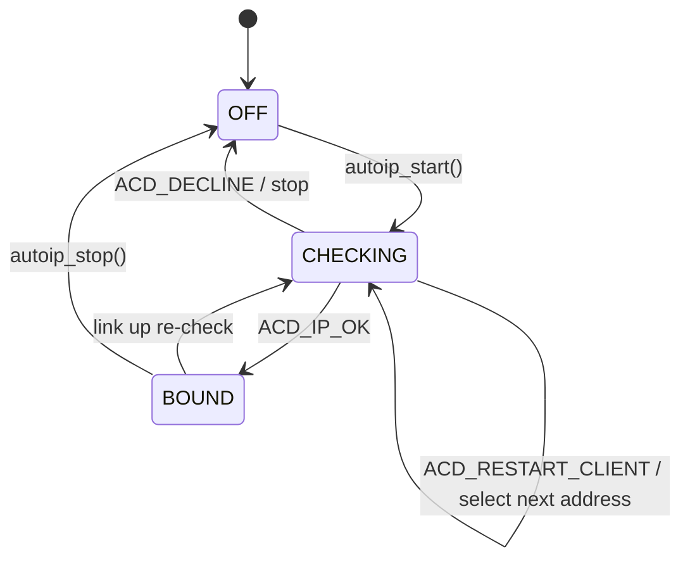
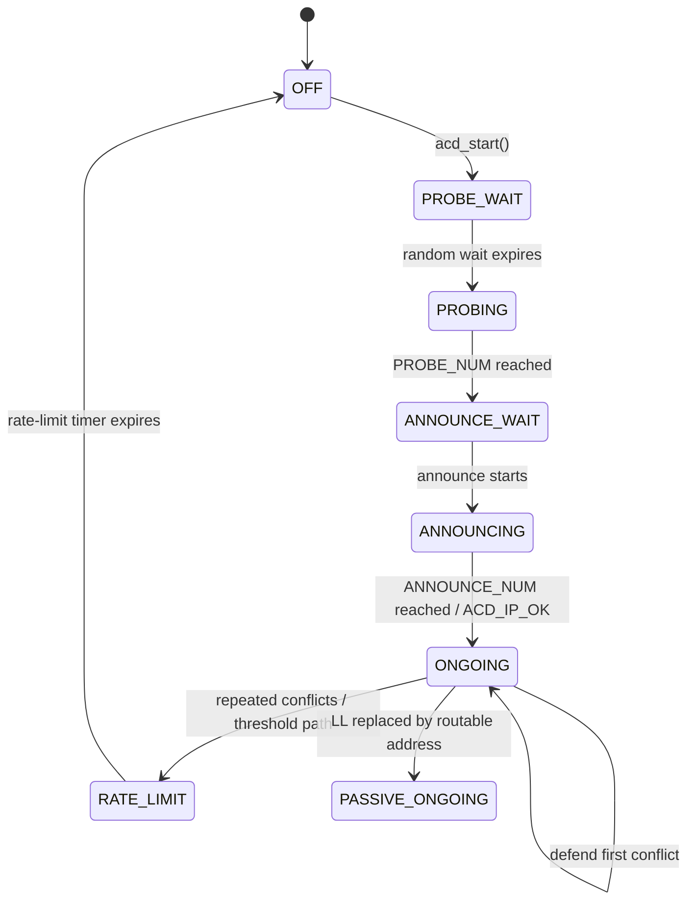
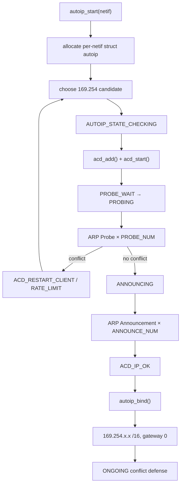

<meta name="referrer" content="no-referrer" />

# 教程 25：从 `autoip_start()` 到 `ACD_IP_OK`——IPv4 Link-Local、169.254/16、ARP Probe/Announce、Conflict 与 DHCP Cooperation

> 摘要：从 AutoIP 入口追踪 169.254 地址选择、AutoIP/ACD 双层状态机、ARP Probe/Announce、冲突防御、DHCP cooperation 与链路变化。

[TOC]

Stage 13 讲 DHCPv4，Stage 22 讲 PHY/Link 状态。Stage 25 补上另一条 IPv4 自动配置路径：当稳定、可路由的 IPv4 配置不可用时，AutoIP 从 `169.254/16` 选择 Link-Local address，再通过 Address Conflict Detection（ACD）确认地址是否能安全使用。[S1](#source-s1)[S3](#source-s3)[S4](#source-s4)

当前 lwIP 已把“选择 Link-Local 地址”和“通用 ARP 地址冲突检测”拆成两个模块：`autoip.c` 管 AutoIP client lifecycle；`acd.c` 管 Probe、Announce、Conflict、Defense 与 rate limit。这个分层是理解当前源码的关键。[S1](#source-s1)

## 1. 当前 example 默认没有直接启用 AutoIP

`src/include/lwip/opt.h` 默认 `LWIP_AUTOIP=0`。当前 `contrib/examples/example_app/test_configs/opt_default.h` 也显式关闭 AutoIP；而 `example_app/lwipopts.h` 另一套通用配置会把 `LWIP_AUTOIP` 绑定到 `LWIP_DHCP`，并允许 `LWIP_DHCP_AUTOIP_COOP`。[S2](#source-s2)

因此需要区分：

```text
Core feature exists
  ≠
current test profile automatically runs it
```

本文主要解释当前 pinned source 的真实机制，没有在本轮重新启用 AutoIP 做 TAP 抓包实验。

## 2. IPv4 Link-Local 不是任意 169.254.x.x

RFC 3927 给出的动态选择范围是：

```text
169.254.1.0  ...  169.254.254.255
```

`169.254.0.x` 与 `169.254.255.x` 不用于这个动态选择过程。[S3](#source-s3)

lwIP 在 `prot/autoip.h` 中直接编码同一范围：[S1](#source-s1)

```c
#define AUTOIP_NET              0xA9FE0000
#define AUTOIP_RANGE_START      (AUTOIP_NET | 0x0100)
#define AUTOIP_RANGE_END        (AUTOIP_NET | 0xFEFF)
```

这类地址只用于同一物理/逻辑 link 上的通信，不能当普通可路由私网地址理解。[S3](#source-s3)

## 3. AutoIP 自己只有三态

当前 `autoip_state_enum_t` 很简单：[S1](#source-s1)

```c
typedef enum {
  AUTOIP_STATE_OFF,
  AUTOIP_STATE_CHECKING,
  AUTOIP_STATE_BOUND
} autoip_state_enum_t;
```

`struct autoip` 保存：

```c
struct autoip
{
  ip4_addr_t llipaddr;
  u8_t state;
  u8_t tried_llipaddr;
  struct acd acd;
};
```

如果只读这里，很容易误以为 probing/announcing 没有状态。实际上这些状态已经下沉到 `struct acd`。

## 4. `autoip_start()` 是真实公开入口

当前函数首先要求 netif 已经 administrative up，然后按需分配 `struct autoip` 并挂到 netif client data。[S1](#source-s1)

```c
err_t
autoip_start(struct netif *netif)
{
  struct autoip *autoip = netif_autoip_data(netif);
  err_t result = ERR_OK;

  LWIP_ASSERT_CORE_LOCKED();
  LWIP_ERROR("netif is not up, old style port?", netif_is_up(netif), return ERR_ARG;);

  if (autoip == NULL) {
    autoip = (struct autoip *)mem_calloc(1, sizeof(struct autoip));
    if (autoip == NULL) {
      return ERR_MEM;
    }
    netif_set_client_data(netif, LWIP_NETIF_CLIENT_DATA_INDEX_AUTOIP, autoip);
  }
```

因此 AutoIP state 是 per-netif，而不是一个全局地址选择器。

## 5. 地址 seed 默认来自 MAC 地址末尾字节

继续阅读函数式宏 `LWIP_AUTOIP_CREATE_SEED_ADDR(netif)` 的默认定义：[S1](#source-s1)

```c
#ifndef LWIP_AUTOIP_CREATE_SEED_ADDR
#define LWIP_AUTOIP_CREATE_SEED_ADDR(netif) \
  lwip_htonl(AUTOIP_RANGE_START + ((u32_t)(((u8_t)(netif->hwaddr[4])) | \
                 ((u32_t)((u8_t)(netif->hwaddr[5]))) << 8)))
#endif
```

`autoip_create_addr()` 再叠加 `tried_llipaddr` 并折回合法范围。这样当前实现倾向于同一硬件接口在无冲突时重复选择稳定的 Link-Local address，而不是每次完全随机挑一个。[S1](#source-s1)

RFC 3927 也建议不同主机应产生不同序列，并允许利用设备唯一信息帮助形成稳定选择。[S3](#source-s3)

## 6. `autoip_start()` 不会立刻写 `netif->ip_addr`

继续阅读 `autoip_start()`：[S1](#source-s1)

```c
if (autoip->state == AUTOIP_STATE_OFF) {
  acd_add(netif, &autoip->acd, autoip_conflict_callback);

  if (!ip4_addr_islinklocal(&autoip->llipaddr)) {
    autoip_create_addr(netif, &(autoip->llipaddr));
  }
  autoip->state = AUTOIP_STATE_CHECKING;
  acd_start(netif, &autoip->acd, autoip->llipaddr);
}
```

关键顺序是：

```text
choose candidate
  → CHECKING
  → ACD Probe/Announce
  → only after ACD_IP_OK
  → autoip_bind()
  → netif_set_addr()
```

候选地址在 conflict detection 完成前不是正式 interface IPv4 address。

## 7. ACD 是当前真正负责 Probe/Announce 的状态机

AutoIP 通过 `acd_add()` 把自己的 `struct acd` 挂到 `netif->acd_list`，并注册 `autoip_conflict_callback()`。[S1](#source-s1)

当前 ACD 状态包括：

```text
OFF
PROBE_WAIT
PROBING
ANNOUNCE_WAIT
ANNOUNCING
ONGOING
PASSIVE_ONGOING
RATE_LIMIT
```

这说明 ACD 已经从“AutoIP 私有 helper”演进成可被 DHCP 地址冲突检测等路径复用的通用 IPv4 address conflict module。

## 8. `acd_start()`：候选地址进入 PROBE_WAIT

`acd_start(netif, acd, ipaddr)` 保存 candidate address，清理 Probe counters，把状态设置为 `ACD_STATE_PROBE_WAIT`，再生成首次随机等待时间。[S1](#source-s1)

```c
acd->ipaddr = ipaddr;
acd->state = ACD_STATE_PROBE_WAIT;
acd->sent_num = 0;
acd->ttw = (u16_t)(ACD_RANDOM_PROBE_WAIT(netif, acd));
```

当前 random source 优先使用 `LWIP_RAND()`；若没有，则可兼容 `LWIP_AUTOIP_RAND`，再退到 MAC-derived fallback。[S1](#source-s1)

## 9. ACD timer 每 100 ms 推进状态

`timeouts.c` 在 `LWIP_ACD` 启用时注册 `acd_tmr()`；`ACD_TMR_INTERVAL` 是 100 ms。[S1](#source-s1)

`acd_tmr()` 遍历每个 netif 的 `acd_list`。在 `PROBE_WAIT/PROBING` 中，当 `ttw` 到 0 时调用：

```c
etharp_acd_probe(netif, &acd->ipaddr);
```

达到 `PROBE_NUM` 后进入 `ANNOUNCE_WAIT`。[S1](#source-s1)

RFC 5227 定义了 Probe、Announcement、Conflict Detection 与 Defense 的通用 ACD 规则；当前 lwIP 的 ACD constants 与这些规则对应。[S4](#source-s4)

## 10. Probe 与普通 ARP Request 的关键字段不同

ARP Probe 的目的不是“解析这个 IP 对应哪张 MAC”，而是询问“有人已经在使用这个 candidate address 吗”。因此 sender IP 为 `0.0.0.0`，target IP 为 candidate。[S4](#source-s4)

逻辑上：

```text
Ethernet dst = ff:ff:ff:ff:ff:ff
ARP sender MAC = local MAC
ARP sender IP  = 0.0.0.0
ARP target MAC = 00:00:00:00:00:00
ARP target IP  = candidate 169.254.x.x
```

Stage 4 的 ARP 解析知识在这里被复用，但目的已经从 address resolution 变成 address ownership detection。

## 11. Probe 成功后进入 Announcement

`acd_tmr()` 完成 Probe count 后等待 `ANNOUNCE_WAIT`，随后进入 `ANNOUNCING` 并调用：[S1](#source-s1)

```c
etharp_acd_announce(netif, &acd->ipaddr);
```

当前 constants 包括：[S1](#source-s1)[S4](#source-s4)

```c
#define PROBE_NUM            3
#define ANNOUNCE_NUM         2
#define RATE_LIMIT_INTERVAL  60
#define DEFEND_INTERVAL      10
```

当 `ANNOUNCE_NUM` 达到后，ACD 进入 `ONGOING` 并通过 callback 报告 `ACD_IP_OK`。

## 12. `ACD_IP_OK` 才回到 AutoIP 并真正绑定地址

`autoip_conflict_callback()` 是 ACD → AutoIP 的关键桥接：[S1](#source-s1)

```c
static void
autoip_conflict_callback(struct netif *netif, acd_callback_enum_t state)
{
  struct autoip *autoip = netif_autoip_data(netif);

  switch (state) {
    case ACD_IP_OK:
      autoip_bind(netif);
      break;
    case ACD_RESTART_CLIENT:
      autoip_restart(netif);
      break;
    case ACD_DECLINE:
      ip4_addr_set_any(&autoip->llipaddr);
      autoip->tried_llipaddr++;
      autoip_stop(netif);
      break;
    default:
      break;
  }
}
```

这就是异步 return path：`autoip_start()` 早已返回，后续由 100 ms timer 和 incoming ARP events 推进 ACD，最终 callback 回到 AutoIP。

## 13. `autoip_bind()`：/16 netmask、无 gateway

`ACD_IP_OK` 进入 `autoip_bind()`：[S1](#source-s1)

```c
static err_t
autoip_bind(struct netif *netif)
{
  struct autoip *autoip = netif_autoip_data(netif);
  ip4_addr_t sn_mask, gw_addr;

  autoip->state = AUTOIP_STATE_BOUND;

  IP4_ADDR(&sn_mask, 255, 255, 0, 0);
  IP4_ADDR(&gw_addr, 0, 0, 0, 0);

  netif_set_addr(netif, &autoip->llipaddr, &sn_mask, &gw_addr);

  return ERR_OK;
}
```

也就是：

```text
address = 169.254.x.x
netmask = 255.255.0.0
gateway = 0.0.0.0
```

这与 RFC 3927 的 link-local scope 一致：该地址不是为了通过 router 到达远端网络。[S3](#source-s3)

## 14. AutoIP 与 ACD 两层状态机必须一起看

AutoIP 上层状态：



ACD 下层状态：



上层决定“这个 candidate 接下来怎么处理”；下层决定“这个 candidate 在链路上是否冲突”。

## 15. 收到任何相关 ARP 都可能推进 ACD conflict path

`etharp_input()` 会把 incoming ARP 交给 `acd_arp_reply()`。ACD 遍历当前 netif 的 ACD clients，根据 sender/target IP、hardware address 和当前 state 判断是否冲突。[S1](#source-s1)

因此 conflict detection 不是只等别人专门回复 Probe；其他主机正常 ARP traffic 也可能暴露地址已被占用。

## 16. 检测到冲突时不是永远“立刻换地址”

RFC 5227 允许已经使用地址的 host 在合适条件下尝试 defense。当前 lwIP `acd_handle_arp_conflict()` 区分 passive mode 与 active ongoing mode。[S1](#source-s1)[S4](#source-s4)

在 active ongoing 模式：

```text
first recent conflict
  → send one ARP Announcement to defend
  → start DEFEND_INTERVAL

another conflict within DEFEND_INTERVAL
  → retreat / restart address acquisition
```

当前 `DEFEND_INTERVAL=10s`。[S1](#source-s1)[S4](#source-s4)

## 17. Conflict 太多会进入 Rate Limit

`acd_restart()` 每次增加 `num_conflicts`。达到 `MAX_CONFLICTS` 后，不再立刻开始下一轮，而是进入 `ACD_STATE_RATE_LIMIT`，等待 `RATE_LIMIT_INTERVAL=60s`。[S1](#source-s1)[S4](#source-s4)

这防止一条严重冲突的链路让设备持续高频广播 Probe。

## 18. AutoIP conflict callback 怎样选择下一个地址

若 ACD 返回 `ACD_RESTART_CLIENT`，AutoIP 调用：

```c
static void
autoip_restart(struct netif *netif)
{
  struct autoip *autoip = netif_autoip_data(netif);
  autoip->tried_llipaddr++;
  autoip_start(netif);
}
```

下一次 `autoip_create_addr()` 把 `tried_llipaddr` 叠加到 seed，并把结果重新限制在 `169.254.1.0 .. 169.254.254.255`。[S1](#source-s1)

所以 current algorithm 的候选序列是 deterministic seed + retry offset，而不是每次 conflict 重新做完全无状态 random pick。

## 19. DHCP + AutoIP cooperation：DHCP 先尝试，失败若干次后再启动 Link-Local

当 `LWIP_DHCP_AUTOIP_COOP=1` 时，`dhcp_discover()` 内有真实桥接：[S1](#source-s1)

```c
#if LWIP_DHCP_AUTOIP_COOP
  if (dhcp->tries >= LWIP_DHCP_AUTOIP_COOP_TRIES) {
    autoip_start(netif);
  }
#endif
```

默认 `LWIP_DHCP_AUTOIP_COOP_TRIES` 是 9。[S1](#source-s1)

这意味着 cooperation 的主线不是：

```text
DHCP or AutoIP 二选一编译
```

而是：

```text
DHCP discovery
  → 连续尝试达到阈值
  → AutoIP 可以并行提供 Link-Local connectivity
  → 后续 DHCP 成功时再切回 routable address
```

## 20. Link Up/Down 会重新驱动 AutoIP/ACD

Stage 22 已经读过 `netif_set_link_up/down()`。这里补 AutoIP-specific bridge：[S1](#source-s1)

```text
netif_set_link_up()
  → autoip_network_changed_link_up()
  → 非 DHCP cooperation 时重新 ACD probe 上次地址

netif_set_link_down()
  → autoip_network_changed_link_down()
  → cooperation 模式下停止 AutoIP
  → acd_network_changed_link_down()
```

物理链路变化可能意味着已经换到另一个广播域，因此旧地址不能盲目继续认为安全。

## 21. 为什么 Link Up 后优先 Probe“上次那个地址”

`autoip_network_changed_link_up()` 在非 cooperation 模式下把状态切回 CHECKING，并对 `autoip->llipaddr` 再做 `acd_start()`。[S1](#source-s1)

这与 RFC 3927 倾向尽量保持同一个 Link-Local address 的目标一致：先验证旧地址是否仍可用，只有 conflict 时再换。[S3](#source-s3)

## 22. routable IPv4 到来后，旧 Link-Local ACD 可以进入 passive mode

当前 `acd_netif_ip_addr_changed()` 检测：如果原来监控的是 Link-Local address，netif 后来切换到 routable address，会把对应 ACD instance 转为 `ACD_STATE_PASSIVE_ONGOING`。[S1](#source-s1)

这和另一个 current implementation 特性配合：`ip4_input_accept()` 会调用 `autoip_accept_packet()`，允许某些指向旧 Link-Local address 的连接在 netif 主 IPv4 地址变化后继续被接受。[S1](#source-s1)

源码注释明确把这件事与 RFC 3927 的 connection persistence 联系起来。

## 23. Passive mode 为什么不继续主动 Defense

`ACD_STATE_PASSIVE_ONGOING` 表示这个 ACD instance 不再代表 netif 当前主 IPv4 地址。若此时检测到 conflict，当前实现直接停止该 ACD 并向上报告 `ACD_DECLINE`，而不是主动发送 defense announcement。[S1](#source-s1)

原因是：active defense 适用于“当前仍要保住这个地址”的场景；旧 Link-Local 只是在背景里为现有连接保留兼容性时，发生冲突后立即退出更合理。

## 24. AutoIP 不是一个 DHCP server fallback gateway

当前 `autoip_bind()` 把 gateway 设为 `0.0.0.0`，而 RFC 3927 明确 Link-Local packet 不应由 router 转发。[S1](#source-s1)[S3](#source-s3)

所以 AutoIP 提供的是：

```text
same-link reachability
```

不是：

```text
没有 DHCP 时自动获得 Internet access
```

设备与 PC 都有 169.254/16 地址时，可以在同一二层链路直接通信；离开这个 link 就失去该地址的作用域。

## 25. AutoIP 与 mDNS 是 Zero-Configuration 的不同层

Stage 24 mDNS 和 Stage 25 AutoIP 常一起出现在“零配置网络”语境，但职责完全不同：

```text
AutoIP
  → 没有 IPv4 DHCP 时获得 link-local IPv4 address

mDNS
  → 没有中心 DNS server 时解析 local names

DNS-SD
  → 没有静态服务目录时发现 local services
```

有 mDNS 不意味着一定使用 AutoIP；IPv6 link-local/SLAAC 同样可以承载 mDNS。反过来，有 AutoIP 也不自动发布 DNS-SD 服务。

## 26. 当前完整执行链



## 27. Stage 25 的核心边界

当前 lwIP AutoIP 的关键结论可以压缩为：

1. AutoIP 只负责候选地址与上层 client lifecycle；
2. ACD 才负责 Probe/Announce/Defense/Rate-limit；
3. `ACD_IP_OK` 之前 candidate 不会写入 netif 主 IPv4 address；
4. 地址范围严格限制为 `169.254.1.0 .. 169.254.254.255`；
5. DHCP cooperation 是 runtime fallback/transition 机制，不是两个完全独立的地址栈；
6. Link-Local 只服务同链路通信，不是默认路由替代品。

下一篇进入 SNMP/MIB2：不再讨论地址获取，而是观察 lwIP 如何把 netif、IP、ICMP、TCP、UDP 的运行状态映射成 OID tree，并通过 UDP 161 响应管理请求。

## 资料来源

<a id="source-s1"></a>
### [S1] lwIP AutoIP、ACD、DHCP cooperation 与 netif 源码
- 类型：目标版本上游源码
- 版本：commit `d08f4773edd0182b7910fc8f046eed82ffcd67c9`
- 定位：`src/core/ipv4/autoip.c`：`autoip_start()`、`autoip_create_addr()`、`autoip_conflict_callback()`、`autoip_bind()`、link-change handlers；`src/core/ipv4/acd.c`：`acd_start()`、`acd_tmr()`、`acd_arp_reply()`、`acd_handle_arp_conflict()`；`src/core/ipv4/dhcp.c`：cooperation bridge；`src/core/netif.c`、`src/core/ipv4/ip4.c`
- URL/文档：[lwIP upstream commit](https://github.com/lwip-tcpip/lwip/tree/d08f4773edd0182b7910fc8f046eed82ffcd67c9)
- 使用位置：“地址选择”“AutoIP/ACD 双状态机”“Probe/Announce”“Conflict/Defense”“DHCP cooperation”“link change”“old LLA persistence”
- 支撑内容：证明当前实现真实调用链、callback bridge、状态迁移、timer 与 routing/input integration

<a id="source-s2"></a>
### [S2] lwIP AutoIP 配置
- 类型：目标版本上游配置
- 版本：commit `d08f4773edd0182b7910fc8f046eed82ffcd67c9`
- 定位：`src/include/lwip/opt.h`；`contrib/examples/example_app/lwipopts.h`；`contrib/examples/example_app/test_configs/opt_default.h`
- URL/文档：[lwIP example_app](https://github.com/lwip-tcpip/lwip/tree/d08f4773edd0182b7910fc8f046eed82ffcd67c9/contrib/examples/example_app)
- 使用位置：“当前 profile 默认关闭”“DHCP/AutoIP cooperation compile options”
- 支撑内容：区分 Core 能力、通用 example 配置与当前 test profile

<a id="source-s3"></a>
### [S3] RFC 3927：Dynamic Configuration of IPv4 Link-Local Addresses
- 类型：IETF 标准规范
- 版本：RFC 3927，2005
- URL/文档：[RFC 3927](https://www.rfc-editor.org/rfc/rfc3927.html)
- 使用位置：“169.254/16”“动态选择范围”“link-local scope”“稳定地址倾向”“routing boundary”
- 支撑内容：给出 IPv4 Link-Local 地址选择、使用范围与同链路通信规则

<a id="source-s4"></a>
### [S4] RFC 5227：IPv4 Address Conflict Detection
- 类型：IETF 标准规范
- 版本：RFC 5227，2008
- URL/文档：[RFC 5227](https://www.rfc-editor.org/rfc/rfc5227.html)
- 使用位置：“ARP Probe/Announcement”“PROBE_NUM/ANNOUNCE_NUM”“Conflict Defense”“RATE_LIMIT_INTERVAL”“DEFEND_INTERVAL”
- 支撑内容：提供 lwIP ACD 状态机和 timing constants 对应的规范语义
