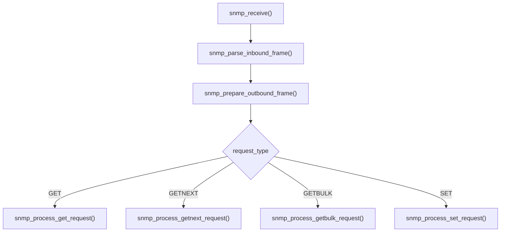
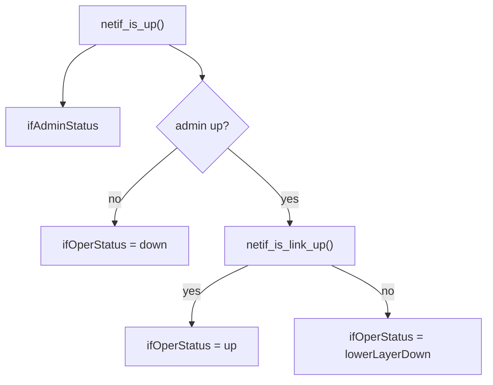
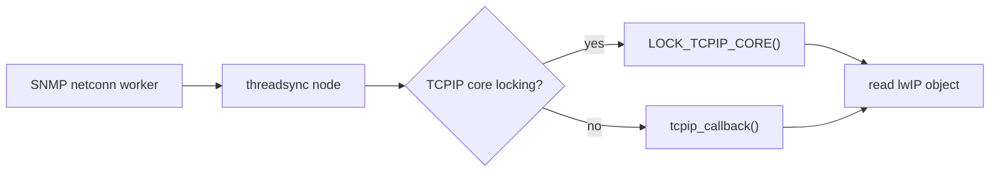
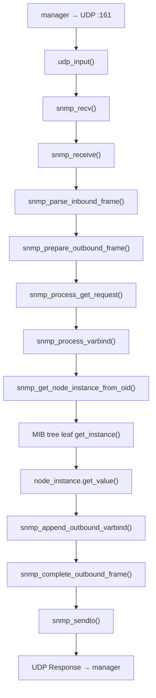

<meta name="referrer" content="no-referrer" />

# 教程 26：从 `snmp_example_init()` 到 `mib2_counters`——SNMPv2c、OID Tree、GET/GETNEXT/GETBULK 与 MIB2

> 摘要：从 SNMP 示例入口追踪 UDP 161、ASN.1/PDU 解析、GET/GETNEXT/GETBULK、OID Tree、MIB2 interface/counter 映射与 RAW/NETCONN 线程边界。

[TOC]

Stage 22 已经把 `netif` 的 administrative state、physical link state、速率和 duplex 关系讲清；Stage 19～21 又把 packet、Driver 与统计边界逐步下沉到 Ethernet。Stage 26 从另一个方向回看这些对象：SNMP agent 如何把 lwIP 内部的 `netif`、IP、ICMP、TCP、UDP 状态组织成 OID tree，再通过 UDP 161 返回管理请求。[S1](#source-s1)[S3](#source-s3)[S4](#source-s4)

本文聚焦当前 pinned lwIP 的 SNMPv2c request/response 主线与 MIB2。SNMPv3 在当前源码中存在，但 `snmp_opts.h` 明确把它标成 experimental；本篇不把实验性 SNMPv3 security path 混进 MIB2 基础执行链。[S1](#source-s1)

## 1. 当前 example 编译 SNMP Core，但默认不启动 SNMP app

`contrib/examples/example_app/lwipopts.h` 当前配置为：[S2](#source-s2)

```c
#define LWIP_SNMP                  LWIP_UDP
#define MIB2_STATS                 LWIP_SNMP
#define LWIP_SNMP_V3               (LWIP_SNMP)
```

但运行期开关 `contrib/examples/example_app/lwipcfg.h` 是：[S2](#source-s2)

```c
#define LWIP_SNMP_APP                 0
```

`test.c` 的 `apps_init()` 只有在该 app flag 打开时才调用真实示例入口：[S2](#source-s2)

继续阅读 `apps_init()` 中的条件调用：

```c
#if LWIP_SNMP_APP
  snmp_example_init();
#endif
```

因此当前仓库需要区分两个事实：

```text
SNMP Core 被编译
        ≠
example 自动启动 SNMP agent
```

本文解释目标版本源码中的真实机制，不声称本轮已经在 TAP 网络中启用 UDP 161 并执行 `snmpget`/`snmpwalk`。

## 2. 真实应用入口是 `snmp_example_init()`

当前 upstream example 不从 `snmp_init()` 直接开讲，而是先准备 MIB、MIB2 metadata、transport 与 trap destination。`snmp_example_init()` 的关键执行顺序如下。[S1](#source-s1)[S2](#source-s2)

```c
void
snmp_example_init(void)
{
#if LWIP_SNMP
  s32_t req_nr;
  lwip_privmib_init();
#if SNMP_LWIP_MIB2
#if SNMP_USE_NETCONN
  snmp_threadsync_init(&snmp_mib2_lwip_locks, snmp_mib2_lwip_synchronizer);
#endif
  snmp_mib2_set_syscontact_readonly((const u8_t*)"root", NULL);
  snmp_mib2_set_syslocation_readonly((const u8_t*)"lwIP development PC", NULL);
  snmp_mib2_set_sysdescr((const u8_t*)"lwIP example", NULL);
#endif

#if LWIP_SNMP_V3
  snmpv3_dummy_init();
#endif

  snmp_set_mibs(mibs, LWIP_ARRAYSIZE(mibs));
  snmp_init();

  snmp_trap_dst_ip_set(0, &netif_default->gw);
  snmp_trap_dst_enable(0, 1);

  snmp_send_inform_generic(SNMP_GENTRAP_COLDSTART, NULL, &req_nr);
  snmp_send_trap_generic(SNMP_GENTRAP_COLDSTART);
#endif
}
```

本篇主线只继续展开 `snmp_set_mibs()` 与 `snmp_init()` 之后的 request/response path。示例最后发送 cold-start Inform/Trap 属于主动通知路径，不是 GET/GETNEXT/GETBULK 的必要前提。

## 3. `snmp_set_mibs()` 先决定 OID 从哪些树中解析

当前 example 的 MIB list 是：[S1](#source-s1)[S2](#source-s2)

```c
static const struct snmp_mib *mibs[] = {
  &mib2,
  &mib_private
#if LWIP_SNMP_V3
  , &snmpframeworkmib
  , &snmpusmmib
#endif
};
```

`snmp_set_mibs()` 并不动态加载某个 MIB 文件，它只是把 agent 的已编译 MIB pointer list 切换为调用方提供的数组：[S1](#source-s1)

```c
void
snmp_set_mibs(const struct snmp_mib **mibs, u8_t num_mibs)
{
  LWIP_ASSERT_SNMP_LOCKED();
  LWIP_ASSERT("mibs pointer must be != NULL", (mibs != NULL));
  LWIP_ASSERT("num_mibs pointer must be != 0", (num_mibs != 0));
  snmp_mibs     = mibs;
  snmp_num_mibs = num_mibs;
}
```

如果应用不调用 `snmp_set_mibs()`，Core 也有默认 MIB list：启用 `SNMP_LWIP_MIB2` 时至少包含 `mib2`；启用当前 SNMPv3 代码后还会附带 framework/USM MIB。[S1](#source-s1)

这一步建立了后面 OID lookup 的搜索空间：


## 4. MIB2 在 lwIP 中是一棵真正的节点树

当前 `snmp_mib2.c` 把 MIB-II base OID 定义为：[S1](#source-s1)[S4](#source-s4)

```c
static const u32_t mib2_base_oid_arr[] = { 1, 3, 6, 1, 2, 1 };
const struct snmp_mib mib2 = SNMP_MIB_CREATE(mib2_base_oid_arr, &mib2_root.node);
```

其根节点按当前编译能力挂接 system、interfaces、at、ip、icmp、tcp、udp、snmp 等子树：[S1](#source-s1)

```text
1.3.6.1.2.1  mib-2
├─ 1  system
├─ 2  interfaces
├─ 3  at
├─ 4  ip
├─ 5  icmp
├─ 6  tcp
├─ 7  udp
└─ 11 snmp
```

这不是一个把字符串 OID 映射到变量的扁平表。Core 会先选择 MIB，再沿 tree node 找 leaf，再由 leaf 解析具体 instance，最后通过 `get_value`/`set_value` callback 读取或修改对象。

## 5. `snmp_init()` 的默认 transport 是 RAW API

`snmp_opts.h` 默认配置是：[S1](#source-s1)

```c
#define SNMP_USE_NETCONN           0
#define SNMP_USE_RAW               1
```

两者不能同时打开。默认 RAW 模式意味着 SNMP agent 直接在 lwIP Core execution context 处理请求；MIB callback 不应执行阻塞操作。[S1](#source-s1)

当前 RAW 版本的 `snmp_init()` 建立 UDP PCB、注册 callback，并绑定标准 SNMP agent port 161：[S1](#source-s1)[S3](#source-s3)

```c
void
snmp_init(void)
{
  err_t err;

  struct udp_pcb *snmp_pcb = udp_new_ip_type(IPADDR_TYPE_ANY);
  LWIP_ERROR("snmp_raw: no PCB", (snmp_pcb != NULL), return;);

  LWIP_ASSERT_CORE_LOCKED();

  snmp_traps_handle = snmp_pcb;

  udp_recv(snmp_pcb, snmp_recv, NULL);
  err = udp_bind(snmp_pcb, IP_ANY_TYPE, LWIP_IANA_PORT_SNMP);
  LWIP_ERROR("snmp_raw: Unable to bind PCB", (err == ERR_OK), return;);
}
```

这里完成最关键的 callback binding：

```text
UDP destination port 161
        ↓
UDP PCB
        ↓
snmp_recv()
```

## 6. 管理请求如何从 Ethernet 到达 `snmp_recv()`

前文已经完整解释 Ethernet、IPv4/IPv6 与 UDP input；Stage 26 只保留必要桥接：


`snmp_recv()` 是 RAW transport callback。它不解析 ASN.1，本身只把 pbuf、source address 和 source port 交给 message layer，然后释放 inbound pbuf：[S1](#source-s1)

```c
static void
snmp_recv(void *arg, struct udp_pcb *pcb, struct pbuf *p, const ip_addr_t *addr, u16_t port)
{
  LWIP_UNUSED_ARG(arg);

  snmp_receive(pcb, p, addr, port);

  pbuf_free(p);
}
```

进入 `snmp_receive()` 后，transport 层已经结束职责。后续处理只通过 `handle` 在最终发送 Response 时回到相同 transport。

## 7. `snmp_receive()` 建立一次请求的处理上下文

`snmp_recv()` 直接调用 `snmp_receive()`。该函数创建栈上 `struct snmp_request`，保存 transport handle、source endpoint 与 inbound pbuf：[S1](#source-s1)

```c
void
snmp_receive(void *handle, struct pbuf *p, const ip_addr_t *source_ip, u16_t port)
{
  err_t err;
  struct snmp_request request;

  memset(&request, 0, sizeof(request));
  request.handle       = handle;
  request.source_ip    = source_ip;
  request.source_port  = port;
  request.inbound_pbuf = p;

  snmp_stats.inpkts++;

  err = snmp_parse_inbound_frame(&request);
```

当前阶段只有原始 bytes 和 remote endpoint。还没有完成：

- SNMP version 判定；
- community 校验；
- request-id 读取；
- PDU type 分发；
- varbind/OID lookup。

这些语义都由后续 parser 从同一个 `request` 对象逐步填入。

## 8. `snmp_parse_inbound_frame()` 把 ASN.1 bytes 变成 request metadata

`snmp_receive()` 直接进入 `snmp_parse_inbound_frame()`。当前 parser 会依次解析 message sequence、version、community/security fields、PDU、request-id、error fields 以及 VarBindList，并把位置保存在 `struct snmp_request` 中。[S1](#source-s1)[S3](#source-s3)

对 SNMPv2c 主线，PDU type 至少可能是：[S1](#source-s1)[S3](#source-s3)

```text
GET
GETNEXT
GETBULK
SET
RESPONSE
```

当前 parser 对 GETBULK 还显式要求版本至少为 SNMPv2c：[S1](#source-s1)

```c
case (SNMP_ASN1_CLASS_CONTEXT | SNMP_ASN1_CONTENTTYPE_CONSTRUCTED |
      SNMP_ASN1_CONTEXT_PDU_GET_BULK_REQ):
  if (request->version < SNMP_VERSION_2c) {
    return ERR_ARG;
  }
  break;
```

接着 parser 验证 community。当前默认配置为：[S1](#source-s1)

```c
#define SNMP_COMMUNITY                  "public"
#define SNMP_COMMUNITY_WRITE            "private"
#define SNMP_COMMUNITY_TRAP             "public"
```

GET 类请求检查 read community，SET 检查 write community。这里讨论的是当前实现的 protocol field validation，不应把默认 example 字符串当作生产部署安全建议。

## 9. VarBindList 不会在 parser 阶段一次性展开成对象数组

`snmp_parse_inbound_frame()` 找到 VarBindList 后，记录其 offset/length，再初始化 enumerator：[S1](#source-s1)

```c
request->inbound_varbind_offset = pbuf_stream.offset;
request->inbound_varbind_len    = pbuf_stream.length - request->inbound_padding_len;
snmp_vb_enumerator_init(&(request->inbound_varbind_enumerator),
                        request->inbound_pbuf,
                        request->inbound_varbind_offset,
                        request->inbound_varbind_len);
```

因此 SNMP message parser 与 MIB lookup 之间的桥是：

```text
ASN.1 parser
   ↓
VarBindList byte range
   ↓
snmp_vb_enumerator
   ↓
逐个 VarBind 处理
```

这个设计避免先把整个 request 中所有 VarBind 复制成另一套大型结构。

## 10. 回到 `snmp_receive()`：先为 Response 准备输出 pbuf

`snmp_parse_inbound_frame()` 返回 `ERR_OK` 后，控制流回到 `snmp_receive()`。如果收到的不是 Inform 的 Response，下一步调用 `snmp_prepare_outbound_frame()`：[S1](#source-s1)

```c
err = snmp_prepare_outbound_frame(&request);
```

继续阅读 `snmp_prepare_outbound_frame()`：该函数先分配最大 1472-byte response pbuf，再开始编码 SNMP message、version、community 和 PDU header。[S1](#source-s1)

```c
request->outbound_pbuf = pbuf_alloc(PBUF_TRANSPORT, 1472, PBUF_RAM);
if (request->outbound_pbuf == NULL) {
  return ERR_MEM;
}
```

这意味着 request processing 不是先生成一个抽象 Response object，最后才分配 buffer；而是边解析 input、边向 `outbound_pbuf_stream` 写 response VarBind。

## 11. `snmp_receive()` 根据 PDU type 进入四条处理路径

完成 outbound frame header 后，`snmp_receive()` 在同一函数中直接分发：[S1](#source-s1)

```c
if (request.error_status == SNMP_ERR_NOERROR) {
  if (request.request_type == SNMP_ASN1_CONTEXT_PDU_GET_REQ) {
    err = snmp_process_get_request(&request);
  } else if (request.request_type == SNMP_ASN1_CONTEXT_PDU_GET_NEXT_REQ) {
    err = snmp_process_getnext_request(&request);
  } else if (request.request_type == SNMP_ASN1_CONTEXT_PDU_GET_BULK_REQ) {
    err = snmp_process_getbulk_request(&request);
  } else if (request.request_type == SNMP_ASN1_CONTEXT_PDU_SET_REQ) {
    err = snmp_process_set_request(&request);
  }
}
```



下面先沿最直接的 GET 主线向下追，再回来解释 GETNEXT/GETBULK 为什么需要不同的 OID lookup。

## 12. GET：`snmp_process_get_request()` 逐个枚举 VarBind

`snmp_receive()` 的 GET 分支进入 `snmp_process_get_request()`。函数反复从 inbound enumerator 读取下一个 VarBind；GET request 中 value 必须是 ASN.1 NULL，然后调用 `snmp_process_varbind(..., 0)`：[S1](#source-s1)[S3](#source-s3)

```c
static err_t
snmp_process_get_request(struct snmp_request *request)
{
  snmp_vb_enumerator_err_t err;
  struct snmp_varbind vb;
  vb.value = request->value_buffer;

  while (request->error_status == SNMP_ERR_NOERROR) {
    err = snmp_vb_enumerator_get_next(&request->inbound_varbind_enumerator, &vb);
    if (err == SNMP_VB_ENUMERATOR_ERR_OK) {
      if ((vb.type == SNMP_ASN1_TYPE_NULL) && (vb.value_len == 0)) {
        snmp_process_varbind(request, &vb, 0);
      } else {
        request->error_status = SNMP_ERR_GENERROR;
      }
    } else if (err == SNMP_VB_ENUMERATOR_ERR_EOVB) {
      break;
    } else if (err == SNMP_VB_ENUMERATOR_ERR_ASN1ERROR) {
      return ERR_ARG;
    } else {
      request->error_status = SNMP_ERR_GENERROR;
    }
  }

  return ERR_OK;
}
```

这里的 `0` 表示 exact GET，而不是 GetNext。

## 13. `snmp_process_varbind()` 是 ASN.1 与 OID Tree 的真正交界处

GET 处理函数直接进入 `snmp_process_varbind()`。exact GET 调用：[S1](#source-s1)

```c
request->error_status = snmp_get_node_instance_from_oid(
    vb->oid.id, vb->oid.len, &node_instance);
```

如果 lookup 成功，`struct snmp_node_instance` 会带回：

- leaf node；
- instance OID；
- ASN.1 type；
- read/write access；
- `get_value` callback；
- 可选 `set_test` / `set_value` / `release_instance`。

随后 `snmp_process_varbind()` 真正读取对象值：[S1](#source-s1)

```c
s16_t len = node_instance.get_value(&node_instance, vb->value);
```

读取成功后，它设置 VarBind type/length，并调用 `snmp_append_outbound_varbind()` 把结果编码到正在构造的 Response 中。

因此 GET 的核心不是“根据字符串 OID 找变量”，而是：


## 14. `snmp_get_node_instance_from_oid()` 如何解析 exact OID

`snmp_process_varbind()` 进入 `snmp_get_node_instance_from_oid()` 后，Core 先选 MIB，再精确解析 tree node，然后调用 leaf 的 `get_instance()`：[S1](#source-s1)

```c
u8_t
snmp_get_node_instance_from_oid(const u32_t *oid, u8_t oid_len,
                                struct snmp_node_instance *node_instance)
{
  u8_t result = SNMP_ERR_NOSUCHOBJECT;
  const struct snmp_mib *mib;
  const struct snmp_node *mn = NULL;

  mib = snmp_get_mib_from_oid(oid, oid_len);
  if (mib != NULL) {
    u8_t oid_instance_len;

    mn = snmp_mib_tree_resolve_exact(mib, oid, oid_len, &oid_instance_len);
    if ((mn != NULL) && (mn->node_type != SNMP_NODE_TREE)) {
      const struct snmp_leaf_node *leaf_node =
          (const struct snmp_leaf_node *)(const void *)mn;

      node_instance->node = mn;
      snmp_oid_assign(&node_instance->instance_oid,
                      oid + (oid_len - oid_instance_len), oid_instance_len);

      result = leaf_node->get_instance(
          oid, oid_len - oid_instance_len, node_instance);
    }
  }

  return result;
}
```

返回 `SNMP_ERR_NOERROR` 时，控制流回到 `snmp_process_varbind()`，由它调用刚刚绑定好的 `node_instance.get_value()`。

## 15. GETNEXT 不是 exact GET 加一，而是“找字典序下一实例”

GETNEXT 的 `snmp_process_getnext_request()` 同样枚举 VarBind，但调用：

```c
snmp_process_varbind(request, &vb, 1);
```

`snmp_process_varbind()` 因此进入 `snmp_get_next_node_instance_from_oid()`。该函数可能：[S1](#source-s1)[S3](#source-s3)

1. 在当前 MIB 内寻找当前 node 的下一个 instance；
2. 当前 node 没有更大 instance 时寻找下一个 node；
3. 当前 MIB 已结束时继续下一个 MIB；
4. 通过 validation callback 跳过不可读或不适用于当前版本的 instance。

这正是 `snmpwalk` 一类操作能够沿 OID tree 顺序遍历的核心机制。

## 16. GETBULK 把多次“找下一实例”压进一个 SNMPv2c 请求

RFC 3416 定义 GETBULK 用于一次取回较多顺序对象；lwIP parser 只允许 SNMPv2c 及之后版本进入该 PDU path。[S1](#source-s1)[S3](#source-s3)

当前 `snmp_process_getbulk_request()` 会根据：

```text
non-repeaters
max-repetitions
```

反复执行 next-instance lookup。其核心仍然不是另一套 MIB 查询引擎，而是复用 `snmp_process_varbind(..., 1)` 与 `snmp_get_next_node_instance_from_oid()`。[S1](#source-s1)

因此三种读操作的关系可以归纳为：

| PDU | OID 语义 | Core lookup |
| --- | --- | --- |
| GET | 精确实例 | `snmp_get_node_instance_from_oid()` |
| GETNEXT | 字典序下一实例 | `snmp_get_next_node_instance_from_oid()` |
| GETBULK | 批量重复 GETNEXT 语义 | 同一 next-instance engine |

## 17. 进入 MIB2 interfaces：OID 最终落到 `struct netif`

当 OID 指向 MIB-II interfaces table 时，leaf 的 `get_value` 最终绑定到 `interfaces_Table_get_value()`。这一步把抽象 OID 重新接回 Stage 18～23 一直使用的真实 `struct netif`。[S1](#source-s1)[S4](#source-s4)

继续阅读 `interfaces_Table_get_value()`：

```c
static s16_t
interfaces_Table_get_value(struct snmp_node_instance *instance, void *value)
{
  struct netif *netif = (struct netif *)instance->reference.ptr;
  u32_t *value_u32 = (u32_t *)value;
  s32_t *value_s32 = (s32_t *)value;
  u16_t value_len;

  switch (SNMP_TABLE_GET_COLUMN_FROM_OID(instance->instance_oid.id)) {
    case 4:
      *value_s32 = netif->mtu;
      value_len = sizeof(*value_s32);
      break;
    case 5:
      *value_u32 = netif->link_speed;
      value_len = sizeof(*value_u32);
      break;
```

这里已经直接证明：MIB2 不是另存一份“管理数据库”；大量 interface object 实时读取 lwIP `netif` 本身。

## 18. Stage 22 的 admin/link state 在这里变成 ifAdminStatus/ifOperStatus

继续阅读同一个 `interfaces_Table_get_value()`，column 7 与 8 直接使用 `netif_is_up()` 与 `netif_is_link_up()`：[S1](#source-s1)

```c
case 7: /* ifAdminStatus */
  if (netif_is_up(netif)) {
    *value_s32 = iftable_ifOperStatus_up;
  } else {
    *value_s32 = iftable_ifOperStatus_down;
  }
  value_len = sizeof(*value_s32);
  break;
case 8: /* ifOperStatus */
  if (netif_is_up(netif)) {
    if (netif_is_link_up(netif)) {
      *value_s32 = iftable_ifAdminStatus_up;
    } else {
      *value_s32 = iftable_ifAdminStatus_lowerLayerDown;
    }
  } else {
    *value_s32 = iftable_ifAdminStatus_down;
  }
  value_len = sizeof(*value_s32);
  break;
```

这把 Stage 22 的两个状态维度直接映射到 MIB2：



所以 PHY unplug 后，如果 Driver 正确调用 `netif_set_link_down()`，MIB2 interface status 也会反映出 operational state 变化，而不需要 SNMP 模块自己轮询 PHY。

## 19. `ifSpeed` 同样依赖 Driver/Port 正确维护 `netif->link_speed`

MIB2 `ifSpeed` 只是读取：[S1](#source-s1)

```c
*value_u32 = netif->link_speed;
```

因此 SNMP agent 不能自行推导当前是 10M、100M 还是 1G。Stage 22 已经说明 PHY negotiation 结果必须由 Port/Driver 转换为 MAC configuration 与 netif metadata；Stage 26 只是消费该结果。

```text
PHY negotiation
   ↓
Driver / Port
   ↓
netif->link_speed
   ↓
MIB2 ifSpeed
   ↓
SNMP Response
```

如果 Driver 从未维护 `link_speed`，SNMP 只能返回当前结构体里的值，不能替 Driver 补出真实物理速率。

## 20. `mib2_counters` 把 packet path 变成 ifIn/ifOut 统计

`struct netif` 在启用 MIB2 statistics 时包含：[S1](#source-s1)

```c
struct stats_mib2_netif_ctrs mib2_counters;
```

继续阅读 `interfaces_Table_get_value()`：MIB2 interfaces table 的多个 column 直接读取它。[S1](#source-s1)

```c
case 10: /* ifInOctets */
  *value_u32 = netif->mib2_counters.ifinoctets;
  break;
case 11: /* ifInUcastPkts */
  *value_u32 = netif->mib2_counters.ifinucastpkts;
  break;
case 16: /* ifOutOctets */
  *value_u32 = netif->mib2_counters.ifoutoctets;
  break;
case 17: /* ifOutUcastPkts */
  *value_u32 = netif->mib2_counters.ifoutucastpkts;
  break;
```

这些 counter 的准确性取决于 packet path 是否在正确边界调用 `MIB2_STATS_NETIF_INC/ADD()`。lwIP Core 在 loopback 等路径会主动更新；具体 Ethernet Port/Driver 仍需要遵循对应统计 contract。[S1](#source-s1)

这与 Stage 19～21 的原则一致：

```text
硬件发生了 packet RX/TX
        ≠
MIB2 counter 一定自动正确
```

统计值必须在软件可确认的生命周期点被更新。

## 21. MIB2 不只是一张 interface table

当前 `mib2_nodes[]` 根据编译能力把多个协议子树接入同一 `mib-2` 根：[S1](#source-s1)[S4](#source-s4)

```text
system
interfaces
at
ip
icmp
tcp
udp
snmp
```

因此前面各 Stage 不是和 SNMP 平行的孤立知识：SNMP/MIB2 正是把这些运行对象投影为管理视图。

例如：

```text
Stage 4   IPv4/ICMP     → ip / icmp MIB
Stage 5   UDP           → udp MIB
Stage 7-10 TCP          → tcp MIB
Stage 18  netif/routing → interfaces/ip MIB
Stage 22  link state    → ifAdminStatus/ifOperStatus
Stage 19-21 packet path → ifIn/ifOut counters
```

## 22. `SNMP_SAFE_REQUESTS` 决定某些 MIB object 是否允许修改系统状态

当前默认：[S1](#source-s1)

```c
#define SNMP_SAFE_REQUESTS              1
```

源码说明此选项只允许“safe” write action；例如通过 SNMP 关闭 netif 被视为不安全动作，因此默认禁用。[S1](#source-s1)

在 interfaces table 中，`ifAdminStatus` 只有 `!SNMP_SAFE_REQUESTS` 时才是 READ_WRITE，否则是 READ_ONLY：[S1](#source-s1)

```c
#if !SNMP_SAFE_REQUESTS
  { 7, SNMP_ASN1_TYPE_INTEGER, SNMP_NODE_INSTANCE_READ_WRITE },
#else
  { 7, SNMP_ASN1_TYPE_INTEGER, SNMP_NODE_INSTANCE_READ_ONLY },
#endif
```

如果显式关闭这个保护，SET path 最终可以执行 `netif_set_up()` 或 `netif_set_down()`。这属于当前实现提供的可选管理动作，不是普通 GET 监控所必需的行为。

## 23. RAW 与 NETCONN 的差别首先是执行上下文，不是 SNMP 语义

默认 RAW path：

```text
udp_input()
  → snmp_recv()
  → snmp_receive()
  → MIB callback
```

全部在 lwIP Core context 内执行，所以 MIB callback 不应阻塞。[S1](#source-s1)

如果改为：

```c
#define SNMP_USE_RAW     0
#define SNMP_USE_NETCONN 1
```

`snmp_init()` 不再分配 Raw PCB，而是创建独立 SNMP worker thread：[S1](#source-s1)

```c
void
snmp_init(void)
{
  sys_thread_new("snmp_netconn", snmp_netconn_thread, NULL,
                 SNMP_STACK_SIZE, SNMP_THREAD_PRIO);
}
```

worker thread 使用 blocking `netconn_recv()`，收到数据后仍然调用同一个 `snmp_receive()`。因此 ASN.1、PDU、OID tree 与 MIB lookup 不需要重写；变化的是 transport 与线程边界。

## 24. NETCONN worker 访问 lwIP MIB2 对象时必须重新同步回 TCPIP Core

独立 SNMP thread 允许 MIB callback 做 blocking operation，但它也产生一个新问题：MIB2 interfaces/TCP/UDP/IP node 会读取 lwIP Core-owned objects。

因此 example 在 `SNMP_USE_NETCONN` 时先初始化：[S1](#source-s1)[S2](#source-s2)

```c
snmp_threadsync_init(&snmp_mib2_lwip_locks,
                     snmp_mib2_lwip_synchronizer);
```

`snmp_mib2_lwip_synchronizer()` 当前根据 Core Locking 选择锁或 callback：[S1](#source-s1)

```c
void
snmp_mib2_lwip_synchronizer(snmp_threadsync_called_fn fn, void *arg)
{
#if LWIP_TCPIP_CORE_LOCKING
  LOCK_TCPIP_CORE();
  fn(arg);
  UNLOCK_TCPIP_CORE();
#else
  tcpip_callback(fn, arg);
#endif
}
```

线程桥因此是：



这和 Stage 11 的原则完全一致：能在 worker thread 收 packet，不等于可以绕过 lwIP Core ownership 直接访问所有 PCB/netif internal state。

## 25. Response 如何沿原 UDP endpoint 返回 manager

GET/GETNEXT/GETBULK/SET handler 返回后，控制流回到 `snmp_receive()`。如果处理成功，它调用 `snmp_complete_outbound_frame()` 修正 ASN.1 length/error fields，然后通过 transport-independent `snmp_sendto()` 发回原 source endpoint：[S1](#source-s1)

```c
err = snmp_complete_outbound_frame(&request);

if (err == ERR_OK) {
  err = snmp_sendto(request.handle,
                    request.outbound_pbuf,
                    request.source_ip,
                    request.source_port);
}
```

RAW transport 的 `snmp_sendto()` 最终是：[S1](#source-s1)

```c
return udp_sendto((struct udp_pcb *)handle, p, dst, port);
```

随后 `snmp_receive()` 释放 outbound pbuf；再返回 `snmp_recv()`，由 `snmp_recv()` 释放最初的 inbound pbuf。

至此一次普通 SNMP request 的 pbuf ownership 也闭环：

```text
RX pbuf
  ↓ snmp_recv()
snmp_receive()
  ↓ allocate
outbound pbuf
  ↓ snmp_sendto()
Response
  ↓
free outbound
  ↓ return
free inbound
```

## 26. 当前 SNMPv2c GET 的完整源码链



对于 interfaces MIB，一个具体的 `get_value()` 又会落回：

```text
OID
→ interfaces table instance
→ struct netif *
→ mtu / link_speed / flags / mib2_counters
```

## 27. Stage 26 的实现边界

当前目标版本需要明确保留以下边界：[S1](#source-s1)[S2](#source-s2)

1. `LWIP_SNMP` 默认在 Core options 中关闭；example `lwipopts.h` 可以启用，但当前 `LWIP_SNMP_APP=0`，所以运行时示例没有自动启动；
2. 默认 transport 是 RAW，不创建独立 SNMP worker thread；
3. NETCONN 模式提供 worker thread，但访问 lwIP MIB2 对象时需要 thread synchronization；
4. MIB2 是编译进程序的 OID tree，不是运行时加载文本 MIB 文件；
5. MIB2 interface 值大量直接来自 `struct netif` 与 `mib2_counters`，准确性依赖 Core/Port/Driver 正确维护这些字段；
6. `SNMP_SAFE_REQUESTS=1` 默认阻止类似远程关闭 netif 的 unsafe write；
7. 当前源码存在 SNMPv3 支持，但配置文件明确标注为 experimental，本篇不把它作为产品级安全方案展开。

到 Stage 26，系列已经把自动配置、局域网服务发现、IPv4 无 DHCP fallback 与运行状态管理这些应用/管理侧路径补齐。后续如果继续扩展系列，更自然的方向是性能测量、目标板专项 Port、PPP/SLIP 或具体应用协议与 lwIP Core 的集成，而不是继续在同一篇 SNMP 中堆入 Trap/Inform/private MIB 的全部细节。

## 资料来源

<a id="source-s1"></a>
### [S1] lwIP SNMP Core、transport 与 MIB2 源码
- 类型：目标版本上游源码
- 版本：commit `d08f4773edd0182b7910fc8f046eed82ffcd67c9`
- 定位：`src/apps/snmp/snmp_raw.c`：`snmp_init()`、`snmp_recv()`、`snmp_sendto()`；`snmp_netconn.c`；`snmp_msg.c`：`snmp_receive()`、`snmp_parse_inbound_frame()`、GET/GETNEXT/GETBULK/SET handlers、`snmp_process_varbind()`；`snmp_core.c`：MIB list 与 OID resolution；`snmp_mib2.c`、`snmp_mib2_interfaces.c`；`src/include/lwip/apps/snmp_opts.h`；`src/core/netif.c`、`src/include/lwip/netif.h`、`src/include/lwip/snmp.h`
- URL/文档：[lwIP upstream commit](https://github.com/lwip-tcpip/lwip/tree/d08f4773edd0182b7910fc8f046eed82ffcd67c9)
- 使用位置：“transport”“ASN.1/PDU parsing”“VarBind/OID lookup”“MIB2 interfaces”“counters”“threadsync”“safe requests”
- 支撑内容：证明当前 pinned 实现的真实 request/response 调用链、OID tree、netif 映射、线程边界与配置默认值

<a id="source-s2"></a>
### [S2] lwIP SNMP example 与 example_app 配置
- 类型：目标版本上游 example/config
- 版本：commit `d08f4773edd0182b7910fc8f046eed82ffcd67c9`
- 定位：`contrib/examples/snmp/snmp_example.c`：`snmp_example_init()`；`contrib/examples/example_app/test.c`；`lwipopts.h`；`lwipcfg.h`
- URL/文档：[lwIP contrib examples](https://github.com/lwip-tcpip/lwip/tree/d08f4773edd0182b7910fc8f046eed82ffcd67c9/contrib/examples)
- 使用位置：“真实应用入口”“MIB list”“MIB2 metadata”“current app flag”“NETCONN synchronization initialization”
- 支撑内容：区分 SNMP Core 编译能力、example 初始化动作与当前 example_app 是否实际启动 agent

<a id="source-s3"></a>
### [S3] RFC 3416：Version 2 of the Protocol Operations for SNMP
- 类型：IETF 标准规范
- 版本：RFC 3416，2002
- URL/文档：[RFC 3416](https://www.rfc-editor.org/rfc/rfc3416.html)
- 使用位置：“SNMPv2c PDU”“GET/GETNEXT/GETBULK/SET/Response”“VarBind”“GETBULK non-repeaters/max-repetitions”
- 支撑内容：提供 SNMPv2 protocol operation 与 PDU/VarBind 语义，用于区分规范语义和 lwIP 具体实现

<a id="source-s4"></a>
### [S4] RFC 1213：Management Information Base for Network Management of TCP/IP-based internets: MIB-II
- 类型：IETF 标准规范
- 版本：RFC 1213，1991
- URL/文档：[RFC 1213](https://www.rfc-editor.org/rfc/rfc1213.html)
- 使用位置：“mib-2 base OID”“system/interfaces/ip/icmp/tcp/udp/snmp 分组”“ifTable 字段语义”
- 支撑内容：提供 MIB-II 对象树与接口管理对象的标准背景，用于对照 lwIP MIB2 node 实现
