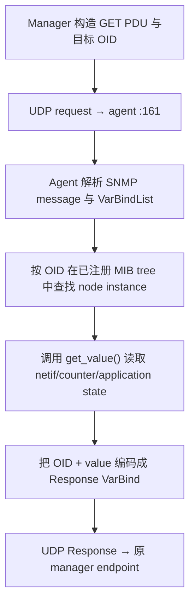
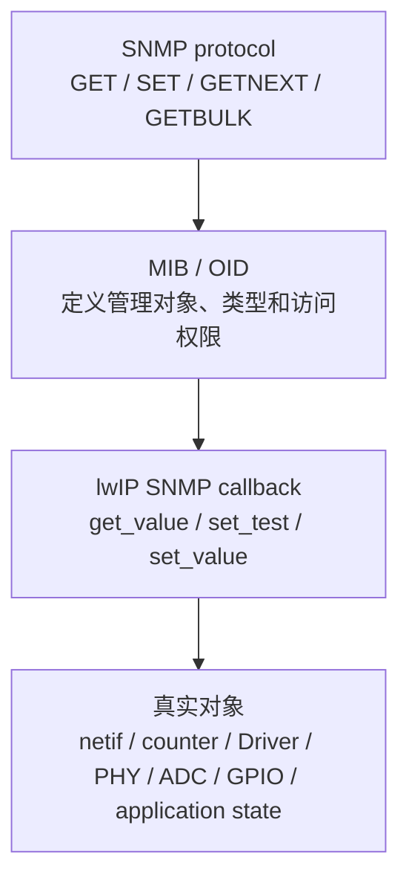
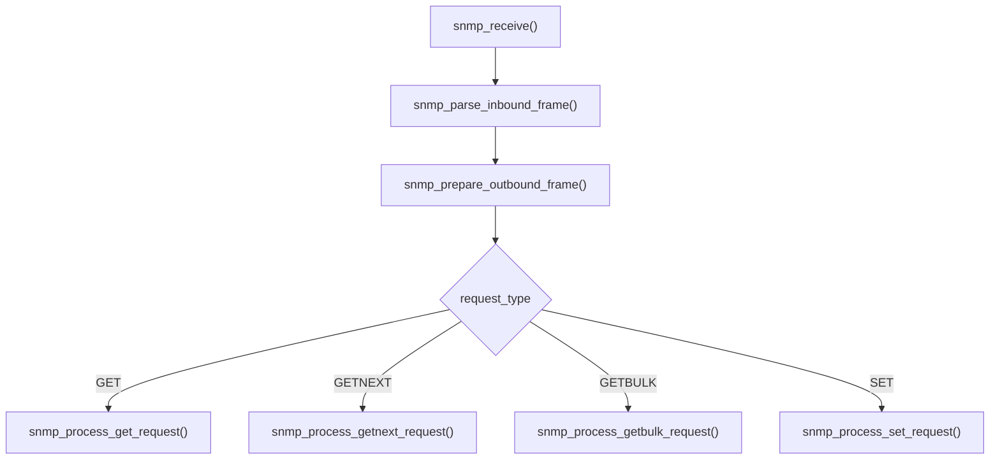
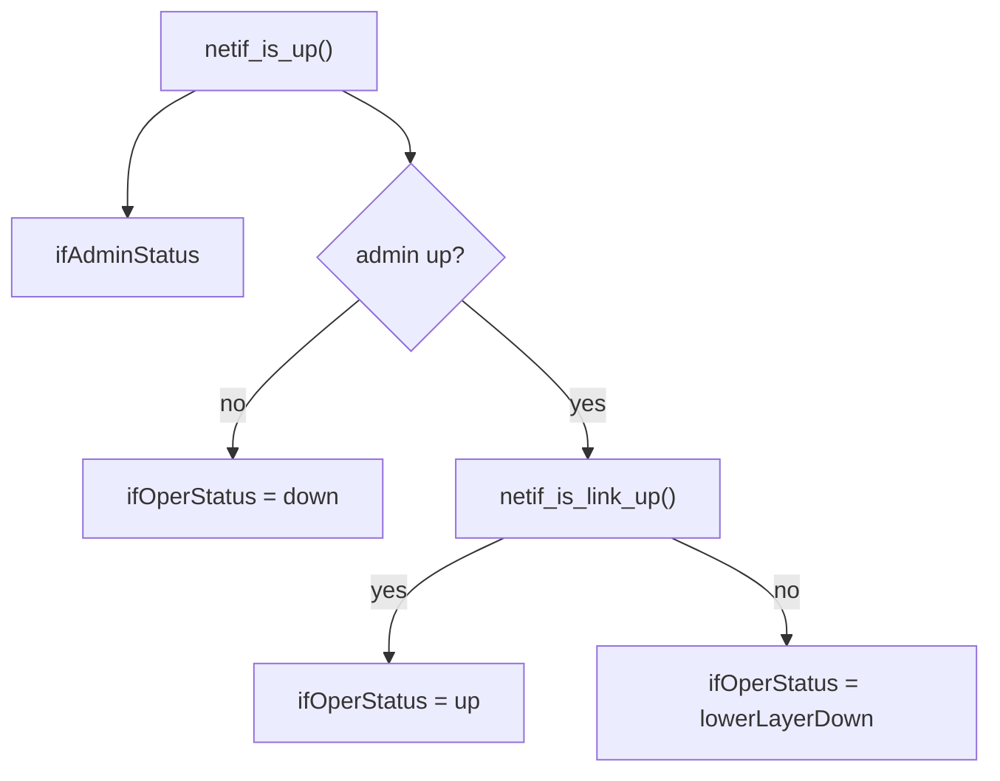
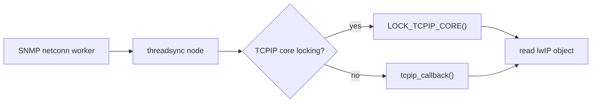
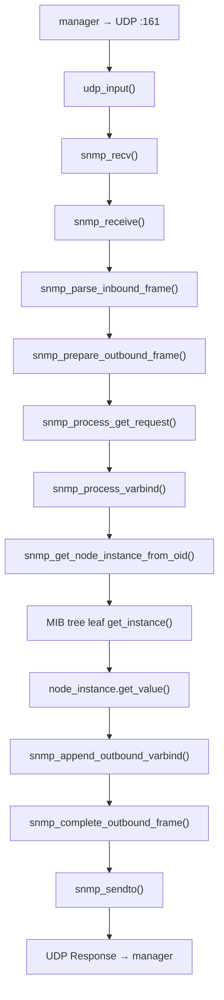

<meta name="referrer" content="no-referrer" />

# 教程 26：从 `snmp_example_init()` 到 `mib2_counters`——SNMPv2c、OID Tree、GET/GETNEXT/GETBULK 与 MIB2

> 摘要：从 SNMP 示例入口追踪 UDP 161、PDU/OID 解析、MIB2 可管理对象与读写边界、GET/GETNEXT/GETBULK、接口统计和线程模型。

[TOC]


SNMP（Simple Network Management Protocol，简单网络管理协议）把设备管理抽象成 **manager 发请求、agent 读取或修改管理对象并返回结果**。本篇的 agent 是 lwIP SNMP 模块；manager 可以是 NMS（Network Management System，网络管理系统）或 `snmpget`/`snmpwalk` 一类管理工具。默认 request/response transport 使用 UDP 161。[S1](#source-s1)[S3](#source-s3)

MIB（Management Information Base，管理信息库）定义“有哪些对象可以被管理、对象是什么类型、允许怎样访问”；OID（Object Identifier，对象标识符）是树状命名空间中的数字路径，用来唯一定位一个管理对象。一次 SNMP 操作装在 PDU（Protocol Data Unit，协议数据单元）中；PDU 里的 VarBind（Variable Binding，变量绑定）把一个 OID 与请求值、响应值或异常状态绑定起来。[S3](#source-s3)[S4](#source-s4) SNMP 消息使用 ASN.1（Abstract Syntax Notation One，抽象语法记法一）描述数据结构，并使用 BER（Basic Encoding Rules，基本编码规则）形成线上字节；lwIP parser 会从字节流中恢复 version、community、PDU、request-id 与 VarBindList，再进入 OID tree lookup。[S1](#source-s1) 对当前 SNMPv2c 路径，community 是消息中的访问域标识字段，lwIP 分别用配置的 read/write community 对读取与 SET 请求做校验。[S1](#source-s1)

本文所说的 SNMPv2c 是当前 community-based SNMP version 2 request/response 路径。主线会遇到四种同步请求：**GET** 精确读取一个 OID；**GETNEXT** 读取字典序上的下一个对象；**GETBULK** 用较少请求批量推进 next-instance lookup；**SET** 尝试修改可写对象；agent 最后用 **Response** 返回结果。[S3](#source-s3) Trap/Inform 是 agent 主动通知 manager 的另一条路径；InformRequest 仍属于需要 Response 的操作，而 Trap 更偏向单向通知。当前 example 会发送 cold-start notification，但它不是本文 GET/GETNEXT/GETBULK 主链的必要前提。[S2](#source-s2)[S3](#source-s3)

MIB-II（Management Information Base II）是一组标准化管理对象，覆盖 `system`、`interfaces`、`ip`、`icmp`、`tcp`、`udp`、`snmp` 等区域。[S4](#source-s4) Stage 22 已经讲过 `netif` 的 admin/link state、速率与 duplex，Stage 19～21 已经下沉到 packet/Driver 统计边界；Stage 26 从管理面反向追踪这些内部状态怎样变成 OID value，最终形成 UDP Response。

本文聚焦当前 pinned lwIP 的 SNMPv2c request/response 主线与 MIB2。SNMPv3 在当前源码中存在，但 `snmp_opts.h` 明确标为 experimental；本篇不把实验性 security path 混进 MIB2 基础执行链。[S1](#source-s1)

## 阅读源码前：建议提前阅读

这些资料用于规范核对和进一步阅读，正文不会把 manager/agent/MIB/OID/PDU/VarBind 的基本语义外包给它们：

1. [Cisco：Configuring SNMP Support](https://www.cisco.com/en/US/docs/ios-xml/ios/snmp/configuration/15-0s/nm-snmp-cfg-snmp-support.html) —— 从工程视角建立 manager、agent、MIB 与 notification 的整体关系。[S5](#source-s5)
2. [RFC 3416：Version 2 of the Protocol Operations for SNMP](https://www.rfc-editor.org/rfc/rfc3416.html) —— 核对 GET、GETNEXT、GETBULK、SET、Response 与 VarBind 操作语义。[S3](#source-s3)
3. [RFC 1213：MIB-II](https://www.rfc-editor.org/rfc/rfc1213.html) —— 核对本文使用的 `system/interfaces/ip/icmp/tcp/udp/snmp` 对象组与接口表语义。[S4](#source-s4)

## 进入源码前先看一次 GET 的完整协议流程



GETNEXT/GETBULK 与 GET 的主要差异是“如何选择下一个 OID instance”；SET 的主要差异是进入 `set_test`/`set_value` 写路径。它们都复用同一 transport、message parser、MIB tree 与 response builder。[S1](#source-s1)[S3](#source-s3) `snmp_node_instance` 是 lwIP 在 OID tree 中解析出一个具体可读/可写对象后使用的运行时描述，其中绑定对象类型、访问权限以及 `get_value`/`set_value` 等 callback；它不是 SNMP 线上报文字段。

协议动作与本文源码落点如下：

| 协议阶段 | 协议对象/动作 | lwIP 实现入口 | 关键对象 | 下一步 |
| --- | --- | --- | --- | --- |
| Agent 初始化 | 注册 MIB + 启动 UDP transport | `snmp_example_init()` → `snmp_set_mibs()` → `snmp_init()` | MIB pointer list + transport | 等待 UDP 161 |
| 接收请求 | SNMP message / PDU | `snmp_recv()` → `snmp_receive()` | inbound pbuf + `struct snmp_request` | parser |
| 解析请求 | version / community / PDU / VarBind | `snmp_parse_inbound_frame()` | request metadata + VarBind enumerator | 按 PDU type 分发 |
| OID lookup | exact 或 next instance | `snmp_process_varbind()` → OID lookup | `snmp_node_instance` | `get_value()` / set callbacks |
| 读取对象 | MIB2 / private MIB value | node-specific callback | `netif` / counters / application object | response VarBind |
| 返回结果 | Response PDU | `snmp_complete_outbound_frame()` → `snmp_sendto()` | outbound pbuf | manager 收到响应 |

后文仍从真实 application entry `snmp_example_init()` 开始，不按 MIB 文件顺序机械介绍源码。

## 1. SNMP 到底能管理什么：能力由 MIB/OID 和 callback 决定

协议层已经明确 manager 通过 PDU 对 OID 发起操作；回到 lwIP 后最重要的工程边界是：**某台设备究竟能读取什么、修改什么，不由“支持 SNMP”这件事自动决定，而由它实际注册的 MIB/OID 以及这些 OID 绑定的 `get_value` / `set_value` callback 决定。**[S1](#source-s1)[S3](#source-s3)

可以把完整关系理解为四层：



因此，“管理”既可能只是**远程监控**，也可能包含**远程控制**。lwIP 内置 MIB-II 的重点明显偏向前者：把 TCP/IP 协议栈、网络接口和统计信息转换成标准 OID，让 NMS 能够统一读取。[S1](#source-s1)[S4](#source-s4)

当前 lwIP MIB-II 可以按下面的工程视角理解：

| MIB-II 区域 | 当前 lwIP 主要暴露的内容 | 当前实现中的写入边界 |
| --- | --- | --- |
| `system` | `sysDescr`、`sysUpTime`、设备名称、联系人、安装位置等 | `sysContact`、`sysName`、`sysLocation` 节点定义为 READ_WRITE，但只有应用提供可写 buffer 后才真正可写 |
| `interfaces` | 网口索引、MTU、MAC、`ifSpeed`、admin/link 状态、RX/TX octets/packets/errors/discards | `ifSpeed` 是 READ_ONLY；`ifAdminStatus` 只有关闭 `SNMP_SAFE_REQUESTS` 才允许 SET |
| `ip` | IPv4 转发状态、TTL、地址/路由和 IP 层统计 | 部分节点在 MIB 结构中标为 READ_WRITE，但当前实现不会借此动态重配置完整 IP 子系统 |
| `icmp` | ICMP 输入/输出及错误统计 | 主要用于读取统计 |
| `tcp` | TCP 连接、主动/被动打开、重传、RST、segment 统计等 | 主要用于读取状态和统计 |
| `udp` | UDP endpoint 与 datagram 统计 | 主要用于读取状态和统计 |
| `snmp` | SNMP agent 自身收发请求、错误等统计 | 大部分是只读统计；`snmpEnableAuthenTraps` 在当前实现中可写 |

还要注意 `ip` 组里一个很典型的“形式上可写、实际上不改变运行配置”的例子：`ipForwarding` 和 `ipDefaultTTL` 被创建为 READ_WRITE，但 `ip_set_test()` 只接受与当前编译配置相同的值，随后 `ip_set_value()` 是空操作。因此它们不能被理解成“通过 SNMP 动态打开 IP forwarding 或修改 TTL”。[S1](#source-s1)

这里最容易误解的是 `ifSpeed`。当前 `snmp_mib2_interfaces.c` 对这一列的定义就是 READ_ONLY：[S1](#source-s1)

```c
{ 5, SNMP_ASN1_TYPE_GAUGE, SNMP_NODE_INSTANCE_READ_ONLY }, /* ifSpeed */
```

读取时只是返回：

```c
*value_u32 = netif->link_speed;
```

所以标准 MIB-II 路径表达的是：

```text
PHY negotiation
    ↓
Driver / Port 更新 netif->link_speed
    ↓
SNMP GET ifSpeed
    ↓
NMS 看到当前链路速率
```

而不是：

```text
SNMP SET ifSpeed = 100 Mbps
    ↓
PHY 被切换到 100 Mbps       ← 当前 lwIP MIB-II 没有这条控制路径
```

如果产品确实需要通过 SNMP 修改 PHY 强制速率、duplex、PoE、电源、风扇、继电器或业务参数，应定义产品自己的 private/enterprise MIB，再把 writable OID 的 `set_value` callback 接到对应 Driver 或业务控制函数。这时 SNMP 才真正成为硬件或业务控制入口。

lwIP example 本身已经给了这个扩展模式。`snmp_example_init()` 注册的 `mibs[]` 不只有标准 `mib2`，还包含 `mib_private`；`contrib/examples/snmp/snmp_private_mib/lwip_prvmib.c` 创建了一个 sensor table，其中 temperature column 明确声明为 READ_WRITE，并通过 `sensor_table_set_value()` 修改传感器示例值。[S2](#source-s2)

```c
static const struct snmp_table_col_def sensor_table_columns[] = {
  { 1, SNMP_ASN1_TYPE_INTEGER,      SNMP_NODE_INSTANCE_READ_WRITE },
  { 2, SNMP_ASN1_TYPE_OCTET_STRING, SNMP_NODE_INSTANCE_READ_ONLY  }
};
```

真实 MCU 产品可以把这个模式替换成自己的对象。例如：

```text
private enterprise MIB
├─ temperature          → GET  → ADC / temperature sensor
├─ fanTargetSpeed       → SET  → PWM / fan driver
├─ phyForcedSpeed       → SET  → PHY driver configuration
├─ portEnable           → SET  → Ethernet/PHY control
└─ reboot               → SET  → system reset policy
```

这类对象不属于 lwIP 标准 MIB-II，OID 语义、权限检查和副作用都由产品自行设计。企业私有 OID 还应使用自己的 IANA Private Enterprise Number；lwIP private MIB example 使用的 enterprise tree 只用于项目示例，源码也明确提示不要擅自在 lwIP 的企业号下分配产品对象。[S2](#source-s2)

最后还要区分“节点声明可写”和“当前运行实例真的可写”。例如 `sysContact`、`sysName`、`sysLocation` 在 MIB2 node table 中声明为 READ_WRITE，但 `system_set_test()` 会检查应用是否提供了 writable buffer；buffer size 为 0 时直接返回 `SNMP_ERR_NOTWRITABLE`。[S1](#source-s1)

当前 example 调用的是：

```c
snmp_mib2_set_syscontact_readonly((const u8_t*)"root", NULL);
snmp_mib2_set_syslocation_readonly((const u8_t*)"lwIP development PC", NULL);
```

它也没有为 `sysName` 提供 writable buffer。因此，在当前 example 配置里，不能仅因为 MIB node 定义写着 READ_WRITE 就推断这些字符串一定能被远程修改。

建立这个边界之后，后面的源码链就容易理解：GET/SET 只是先找到某个 OID 对应的 `snmp_node_instance`，真正的“读取设备状态”或“修改设备状态”发生在该 instance 绑定的 callback 中。

## 2. 当前 example 编译 SNMP Core，但默认不启动 SNMP app

`contrib/examples/example_app/lwipopts.h` 当前配置为：[S2](#source-s2)

```c
#define LWIP_SNMP                  LWIP_UDP
#define MIB2_STATS                 LWIP_SNMP
#define LWIP_SNMP_V3               (LWIP_SNMP)
```

但运行期开关 `contrib/examples/example_app/lwipcfg.h` 是：[S2](#source-s2)

```c
#define LWIP_SNMP_APP                 0
```

`test.c` 的 `apps_init()` 只有在该 app flag 打开时才调用真实示例入口：[S2](#source-s2)

继续阅读 `apps_init()` 中的条件调用：

```c
#if LWIP_SNMP_APP
  snmp_example_init();
#endif
```

因此当前仓库需要区分两个事实：

```text
SNMP Core 被编译
        ≠
example 自动启动 SNMP agent
```

本文解释目标版本源码中的真实机制，不声称本轮已经在 TAP 网络中启用 UDP 161 并执行 `snmpget`/`snmpwalk`。

## 3. 真实应用入口是 `snmp_example_init()`

当前 upstream example 不从 `snmp_init()` 直接开讲，而是先准备 MIB、MIB2 metadata、transport 与 trap destination。`snmp_example_init()` 的关键执行顺序如下。[S1](#source-s1)[S2](#source-s2)

```c
void
snmp_example_init(void)
{
#if LWIP_SNMP
  s32_t req_nr;
  lwip_privmib_init();
#if SNMP_LWIP_MIB2
#if SNMP_USE_NETCONN
  snmp_threadsync_init(&snmp_mib2_lwip_locks, snmp_mib2_lwip_synchronizer);
#endif
  snmp_mib2_set_syscontact_readonly((const u8_t*)"root", NULL);
  snmp_mib2_set_syslocation_readonly((const u8_t*)"lwIP development PC", NULL);
  snmp_mib2_set_sysdescr((const u8_t*)"lwIP example", NULL);
#endif

#if LWIP_SNMP_V3
  snmpv3_dummy_init();
#endif

  snmp_set_mibs(mibs, LWIP_ARRAYSIZE(mibs));
  snmp_init();

  snmp_trap_dst_ip_set(0, &netif_default->gw);
  snmp_trap_dst_enable(0, 1);

  snmp_send_inform_generic(SNMP_GENTRAP_COLDSTART, NULL, &req_nr);
  snmp_send_trap_generic(SNMP_GENTRAP_COLDSTART);
#endif
}
```

本篇主线只继续展开 `snmp_set_mibs()` 与 `snmp_init()` 之后的 request/response path。示例最后发送 cold-start Inform/Trap 属于主动通知路径，不是 GET/GETNEXT/GETBULK 的必要前提。

## 4. `snmp_set_mibs()` 先决定 OID 从哪些树中解析

当前 example 的 MIB list 是：[S1](#source-s1)[S2](#source-s2)

```c
static const struct snmp_mib *mibs[] = {
  &mib2,
  &mib_private
#if LWIP_SNMP_V3
  , &snmpframeworkmib
  , &snmpusmmib
#endif
};
```

`snmp_set_mibs()` 并不动态加载某个 MIB 文件，它只是把 agent 的已编译 MIB pointer list 切换为调用方提供的数组：[S1](#source-s1)

```c
void
snmp_set_mibs(const struct snmp_mib **mibs, u8_t num_mibs)
{
  LWIP_ASSERT_SNMP_LOCKED();
  LWIP_ASSERT("mibs pointer must be != NULL", (mibs != NULL));
  LWIP_ASSERT("num_mibs pointer must be != 0", (num_mibs != 0));
  snmp_mibs     = mibs;
  snmp_num_mibs = num_mibs;
}
```

如果应用不调用 `snmp_set_mibs()`，Core 也有默认 MIB list：启用 `SNMP_LWIP_MIB2` 时至少包含 `mib2`；启用当前 SNMPv3 代码后还会附带 framework/USM MIB。[S1](#source-s1)

这一步建立了后面 OID lookup 的搜索空间：


## 5. MIB2 在 lwIP 中是一棵真正的节点树

当前 `snmp_mib2.c` 把 MIB-II base OID 定义为：[S1](#source-s1)[S4](#source-s4)

```c
static const u32_t mib2_base_oid_arr[] = { 1, 3, 6, 1, 2, 1 };
const struct snmp_mib mib2 = SNMP_MIB_CREATE(mib2_base_oid_arr, &mib2_root.node);
```

其根节点按当前编译能力挂接 system、interfaces、at、ip、icmp、tcp、udp、snmp 等子树：[S1](#source-s1)

```text
1.3.6.1.2.1  mib-2
├─ 1  system
├─ 2  interfaces
├─ 3  at
├─ 4  ip
├─ 5  icmp
├─ 6  tcp
├─ 7  udp
└─ 11 snmp
```

这不是一个把字符串 OID 映射到变量的扁平表。Core 会先选择 MIB，再沿 tree node 找 leaf，再由 leaf 解析具体 instance，最后通过 `get_value`/`set_value` callback 读取或修改对象。

## 6. `snmp_init()` 的默认 transport 是 RAW API

`snmp_opts.h` 默认配置是：[S1](#source-s1)

```c
#define SNMP_USE_NETCONN           0
#define SNMP_USE_RAW               1
```

两者不能同时打开。默认 RAW 模式意味着 SNMP agent 直接在 lwIP Core execution context 处理请求；MIB callback 不应执行阻塞操作。[S1](#source-s1)

当前 RAW 版本的 `snmp_init()` 建立 UDP PCB、注册 callback，并绑定标准 SNMP agent port 161：[S1](#source-s1)[S3](#source-s3)

```c
void
snmp_init(void)
{
  err_t err;

  struct udp_pcb *snmp_pcb = udp_new_ip_type(IPADDR_TYPE_ANY);
  LWIP_ERROR("snmp_raw: no PCB", (snmp_pcb != NULL), return;);

  LWIP_ASSERT_CORE_LOCKED();

  snmp_traps_handle = snmp_pcb;

  udp_recv(snmp_pcb, snmp_recv, NULL);
  err = udp_bind(snmp_pcb, IP_ANY_TYPE, LWIP_IANA_PORT_SNMP);
  LWIP_ERROR("snmp_raw: Unable to bind PCB", (err == ERR_OK), return;);
}
```

这里完成最关键的 callback binding：

```text
UDP destination port 161
        ↓
UDP PCB
        ↓
snmp_recv()
```

## 7. 管理请求如何从 Ethernet 到达 `snmp_recv()`

前文已经完整解释 Ethernet、IPv4/IPv6 与 UDP input；Stage 26 只保留必要桥接：


`snmp_recv()` 是 RAW transport callback。它不解析 ASN.1，本身只把 pbuf、source address 和 source port 交给 message layer，然后释放 inbound pbuf：[S1](#source-s1)

```c
static void
snmp_recv(void *arg, struct udp_pcb *pcb, struct pbuf *p, const ip_addr_t *addr, u16_t port)
{
  LWIP_UNUSED_ARG(arg);

  snmp_receive(pcb, p, addr, port);

  pbuf_free(p);
}
```

进入 `snmp_receive()` 后，transport 层已经结束职责。后续处理只通过 `handle` 在最终发送 Response 时回到相同 transport。

## 8. `snmp_receive()` 建立一次请求的处理上下文

`snmp_recv()` 直接调用 `snmp_receive()`。该函数创建栈上 `struct snmp_request`，保存 transport handle、source endpoint 与 inbound pbuf：[S1](#source-s1)

```c
void
snmp_receive(void *handle, struct pbuf *p, const ip_addr_t *source_ip, u16_t port)
{
  err_t err;
  struct snmp_request request;

  memset(&request, 0, sizeof(request));
  request.handle       = handle;
  request.source_ip    = source_ip;
  request.source_port  = port;
  request.inbound_pbuf = p;

  snmp_stats.inpkts++;

  err = snmp_parse_inbound_frame(&request);
```

当前阶段只有原始 bytes 和 remote endpoint。还没有完成：

- SNMP version 判定；
- community 校验；
- request-id 读取；
- PDU type 分发；
- varbind/OID lookup。

这些语义都由后续 parser 从同一个 `request` 对象逐步填入。

## 9. `snmp_parse_inbound_frame()` 把 ASN.1 bytes 变成 request metadata

`snmp_receive()` 直接进入 `snmp_parse_inbound_frame()`。当前 parser 会依次解析 message sequence、version、community/security fields、PDU、request-id、error fields 以及 VarBindList，并把位置保存在 `struct snmp_request` 中。[S1](#source-s1)[S3](#source-s3)

对 SNMPv2c 主线，PDU type 至少可能是：[S1](#source-s1)[S3](#source-s3)

```text
GET
GETNEXT
GETBULK
SET
RESPONSE
```

当前 parser 对 GETBULK 还显式要求版本至少为 SNMPv2c：[S1](#source-s1)

```c
case (SNMP_ASN1_CLASS_CONTEXT | SNMP_ASN1_CONTENTTYPE_CONSTRUCTED |
      SNMP_ASN1_CONTEXT_PDU_GET_BULK_REQ):
  if (request->version < SNMP_VERSION_2c) {
    return ERR_ARG;
  }
  break;
```

接着 parser 验证 community。当前默认配置为：[S1](#source-s1)

```c
#define SNMP_COMMUNITY                  "public"
#define SNMP_COMMUNITY_WRITE            "private"
#define SNMP_COMMUNITY_TRAP             "public"
```

GET 类请求检查 read community，SET 检查 write community。这里讨论的是当前实现的 protocol field validation，不应把默认 example 字符串当作生产部署安全建议。

## 10. VarBindList 不会在 parser 阶段一次性展开成对象数组

`snmp_parse_inbound_frame()` 找到 VarBindList 后，记录其 offset/length，再初始化 enumerator：[S1](#source-s1)

```c
request->inbound_varbind_offset = pbuf_stream.offset;
request->inbound_varbind_len    = pbuf_stream.length - request->inbound_padding_len;
snmp_vb_enumerator_init(&(request->inbound_varbind_enumerator),
                        request->inbound_pbuf,
                        request->inbound_varbind_offset,
                        request->inbound_varbind_len);
```

因此 SNMP message parser 与 MIB lookup 之间的桥是：

```text
ASN.1 parser
   ↓
VarBindList byte range
   ↓
snmp_vb_enumerator
   ↓
逐个 VarBind 处理
```

这个设计避免先把整个 request 中所有 VarBind 复制成另一套大型结构。

## 11. 回到 `snmp_receive()`：先为 Response 准备输出 pbuf

`snmp_parse_inbound_frame()` 返回 `ERR_OK` 后，控制流回到 `snmp_receive()`。如果收到的不是 Inform 的 Response，下一步调用 `snmp_prepare_outbound_frame()`：[S1](#source-s1)

```c
err = snmp_prepare_outbound_frame(&request);
```

继续阅读 `snmp_prepare_outbound_frame()`：该函数先分配最大 1472-byte response pbuf，再开始编码 SNMP message、version、community 和 PDU header。[S1](#source-s1)

```c
request->outbound_pbuf = pbuf_alloc(PBUF_TRANSPORT, 1472, PBUF_RAM);
if (request->outbound_pbuf == NULL) {
  return ERR_MEM;
}
```

这意味着 request processing 不是先生成一个抽象 Response object，最后才分配 buffer；而是边解析 input、边向 `outbound_pbuf_stream` 写 response VarBind。

## 12. `snmp_receive()` 根据 PDU type 进入四条处理路径

完成 outbound frame header 后，`snmp_receive()` 在同一函数中直接分发：[S1](#source-s1)

```c
if (request.error_status == SNMP_ERR_NOERROR) {
  if (request.request_type == SNMP_ASN1_CONTEXT_PDU_GET_REQ) {
    err = snmp_process_get_request(&request);
  } else if (request.request_type == SNMP_ASN1_CONTEXT_PDU_GET_NEXT_REQ) {
    err = snmp_process_getnext_request(&request);
  } else if (request.request_type == SNMP_ASN1_CONTEXT_PDU_GET_BULK_REQ) {
    err = snmp_process_getbulk_request(&request);
  } else if (request.request_type == SNMP_ASN1_CONTEXT_PDU_SET_REQ) {
    err = snmp_process_set_request(&request);
  }
}
```



下面先沿最直接的 GET 主线向下追，再回来解释 GETNEXT/GETBULK 为什么需要不同的 OID lookup。

## 13. GET：`snmp_process_get_request()` 逐个枚举 VarBind

`snmp_receive()` 的 GET 分支进入 `snmp_process_get_request()`。函数反复从 inbound enumerator 读取下一个 VarBind；GET request 中 value 必须是 ASN.1 NULL，然后调用 `snmp_process_varbind(..., 0)`：[S1](#source-s1)[S3](#source-s3)

```c
static err_t
snmp_process_get_request(struct snmp_request *request)
{
  snmp_vb_enumerator_err_t err;
  struct snmp_varbind vb;
  vb.value = request->value_buffer;

  while (request->error_status == SNMP_ERR_NOERROR) {
    err = snmp_vb_enumerator_get_next(&request->inbound_varbind_enumerator, &vb);
    if (err == SNMP_VB_ENUMERATOR_ERR_OK) {
      if ((vb.type == SNMP_ASN1_TYPE_NULL) && (vb.value_len == 0)) {
        snmp_process_varbind(request, &vb, 0);
      } else {
        request->error_status = SNMP_ERR_GENERROR;
      }
    } else if (err == SNMP_VB_ENUMERATOR_ERR_EOVB) {
      break;
    } else if (err == SNMP_VB_ENUMERATOR_ERR_ASN1ERROR) {
      return ERR_ARG;
    } else {
      request->error_status = SNMP_ERR_GENERROR;
    }
  }

  return ERR_OK;
}
```

这里的 `0` 表示 exact GET，而不是 GetNext。

## 14. `snmp_process_varbind()` 是 ASN.1 与 OID Tree 的真正交界处

GET 处理函数直接进入 `snmp_process_varbind()`。exact GET 调用：[S1](#source-s1)

```c
request->error_status = snmp_get_node_instance_from_oid(
    vb->oid.id, vb->oid.len, &node_instance);
```

如果 lookup 成功，`struct snmp_node_instance` 会带回：

- leaf node；
- instance OID；
- ASN.1 type；
- read/write access；
- `get_value` callback；
- 可选 `set_test` / `set_value` / `release_instance`。

随后 `snmp_process_varbind()` 真正读取对象值：[S1](#source-s1)

```c
s16_t len = node_instance.get_value(&node_instance, vb->value);
```

读取成功后，它设置 VarBind type/length，并调用 `snmp_append_outbound_varbind()` 把结果编码到正在构造的 Response 中。

因此 GET 的核心不是“根据字符串 OID 找变量”，而是：


## 15. `snmp_get_node_instance_from_oid()` 如何解析 exact OID

`snmp_process_varbind()` 进入 `snmp_get_node_instance_from_oid()` 后，Core 先选 MIB，再精确解析 tree node，然后调用 leaf 的 `get_instance()`：[S1](#source-s1)

```c
u8_t
snmp_get_node_instance_from_oid(const u32_t *oid, u8_t oid_len,
                                struct snmp_node_instance *node_instance)
{
  u8_t result = SNMP_ERR_NOSUCHOBJECT;
  const struct snmp_mib *mib;
  const struct snmp_node *mn = NULL;

  mib = snmp_get_mib_from_oid(oid, oid_len);
  if (mib != NULL) {
    u8_t oid_instance_len;

    mn = snmp_mib_tree_resolve_exact(mib, oid, oid_len, &oid_instance_len);
    if ((mn != NULL) && (mn->node_type != SNMP_NODE_TREE)) {
      const struct snmp_leaf_node *leaf_node =
          (const struct snmp_leaf_node *)(const void *)mn;

      node_instance->node = mn;
      snmp_oid_assign(&node_instance->instance_oid,
                      oid + (oid_len - oid_instance_len), oid_instance_len);

      result = leaf_node->get_instance(
          oid, oid_len - oid_instance_len, node_instance);
    }
  }

  return result;
}
```

返回 `SNMP_ERR_NOERROR` 时，控制流回到 `snmp_process_varbind()`，由它调用刚刚绑定好的 `node_instance.get_value()`。

## 16. lwIP 如何实现 GETNEXT 的 next-instance lookup

GETNEXT 的语义是：对给定 OID 返回 MIB 字典序上的下一个可访问对象，因此 manager 可以从一个起点不断推进，遍历表或子树。[S3](#source-s3) 下面继续看 lwIP 如何把这个“next”落实到 OID tree。`snmp_process_getnext_request()` 同样枚举 VarBind，但调用：

```c
snmp_process_varbind(request, &vb, 1);
```

`snmp_process_varbind()` 因此进入 `snmp_get_next_node_instance_from_oid()`。该函数可能：[S1](#source-s1)[S3](#source-s3)

1. 在当前 MIB 内寻找当前 node 的下一个 instance；
2. 当前 node 没有更大 instance 时寻找下一个 node；
3. 当前 MIB 已结束时继续下一个 MIB；
4. 通过 validation callback 跳过不可读或不适用于当前版本的 instance。

这正是 `snmpwalk` 一类操作能够沿 OID tree 顺序遍历的核心机制。

## 17. lwIP 如何把 GETBULK 落到同一 next-instance engine

GETBULK 是 SNMPv2 增加的批量读取操作：它用 `non-repeaters` 指定前一部分 VarBind 只推进一次，再用 `max-repetitions` 控制后续对象最多重复多少轮 next-instance lookup，从而减少连续 GETNEXT 的往返次数。[S3](#source-s3) 当前 lwIP parser 只允许 SNMPv2c 及之后版本进入该 PDU path。[S1](#source-s1)[S3](#source-s3)

当前 `snmp_process_getbulk_request()` 会根据：

```text
non-repeaters
max-repetitions
```

反复执行 next-instance lookup。其核心仍然不是另一套 MIB 查询引擎，而是复用 `snmp_process_varbind(..., 1)` 与 `snmp_get_next_node_instance_from_oid()`。[S1](#source-s1)

因此三种读操作的关系可以归纳为：

| PDU | OID 语义 | Core lookup |
| --- | --- | --- |
| GET | 精确实例 | `snmp_get_node_instance_from_oid()` |
| GETNEXT | 字典序下一实例 | `snmp_get_next_node_instance_from_oid()` |
| GETBULK | 批量重复 GETNEXT 语义 | 同一 next-instance engine |

## 18. 进入 MIB2 interfaces：OID 最终落到 `struct netif`

当 OID 指向 MIB-II interfaces table 时，leaf 的 `get_value` 最终绑定到 `interfaces_Table_get_value()`。这一步把抽象 OID 重新接回 Stage 18～23 一直使用的真实 `struct netif`。[S1](#source-s1)[S4](#source-s4)

继续阅读 `interfaces_Table_get_value()`：

```c
static s16_t
interfaces_Table_get_value(struct snmp_node_instance *instance, void *value)
{
  struct netif *netif = (struct netif *)instance->reference.ptr;
  u32_t *value_u32 = (u32_t *)value;
  s32_t *value_s32 = (s32_t *)value;
  u16_t value_len;

  switch (SNMP_TABLE_GET_COLUMN_FROM_OID(instance->instance_oid.id)) {
    case 4:
      *value_s32 = netif->mtu;
      value_len = sizeof(*value_s32);
      break;
    case 5:
      *value_u32 = netif->link_speed;
      value_len = sizeof(*value_u32);
      break;
```

这里已经直接证明：MIB2 不是另存一份“管理数据库”；大量 interface object 实时读取 lwIP `netif` 本身。

## 19. Stage 22 的 admin/link state 在这里变成 ifAdminStatus/ifOperStatus

继续阅读同一个 `interfaces_Table_get_value()`，column 7 与 8 直接使用 `netif_is_up()` 与 `netif_is_link_up()`：[S1](#source-s1)

```c
case 7: /* ifAdminStatus */
  if (netif_is_up(netif)) {
    *value_s32 = iftable_ifOperStatus_up;
  } else {
    *value_s32 = iftable_ifOperStatus_down;
  }
  value_len = sizeof(*value_s32);
  break;
case 8: /* ifOperStatus */
  if (netif_is_up(netif)) {
    if (netif_is_link_up(netif)) {
      *value_s32 = iftable_ifAdminStatus_up;
    } else {
      *value_s32 = iftable_ifAdminStatus_lowerLayerDown;
    }
  } else {
    *value_s32 = iftable_ifAdminStatus_down;
  }
  value_len = sizeof(*value_s32);
  break;
```

这把 Stage 22 的两个状态维度直接映射到 MIB2：



所以 PHY unplug 后，如果 Driver 正确调用 `netif_set_link_down()`，MIB2 interface status 也会反映出 operational state 变化，而不需要 SNMP 模块自己轮询 PHY。

## 20. `ifSpeed` 同样依赖 Driver/Port 正确维护 `netif->link_speed`

MIB2 `ifSpeed` 只是读取：[S1](#source-s1)

```c
*value_u32 = netif->link_speed;
```

因此 SNMP agent 不能自行推导当前是 10M、100M 还是 1G。Stage 22 已经说明 PHY negotiation 结果必须由 Port/Driver 转换为 MAC configuration 与 netif metadata；Stage 26 只是消费该结果。

```text
PHY negotiation
   ↓
Driver / Port
   ↓
netif->link_speed
   ↓
MIB2 ifSpeed
   ↓
SNMP Response
```

如果 Driver 从未维护 `link_speed`，SNMP 只能返回当前结构体里的值，不能替 Driver 补出真实物理速率。

当前 interfaces table 还把 `ifSpeed` 明确定义成 `SNMP_NODE_INSTANCE_READ_ONLY`，因此这里不存在通过标准 MIB-II `SET ifSpeed` 改写 PHY 速率的路径；需要远程配置 PHY 时，应由产品 private MIB 或其他管理接口连接到 Driver/PHY 配置逻辑。[S1](#source-s1)

## 21. `mib2_counters` 把 packet path 变成 ifIn/ifOut 统计

`struct netif` 在启用 MIB2 statistics 时包含：[S1](#source-s1)

```c
struct stats_mib2_netif_ctrs mib2_counters;
```

继续阅读 `interfaces_Table_get_value()`：MIB2 interfaces table 的多个 column 直接读取它。[S1](#source-s1)

```c
case 10: /* ifInOctets */
  *value_u32 = netif->mib2_counters.ifinoctets;
  break;
case 11: /* ifInUcastPkts */
  *value_u32 = netif->mib2_counters.ifinucastpkts;
  break;
case 16: /* ifOutOctets */
  *value_u32 = netif->mib2_counters.ifoutoctets;
  break;
case 17: /* ifOutUcastPkts */
  *value_u32 = netif->mib2_counters.ifoutucastpkts;
  break;
```

这些 counter 的准确性取决于 packet path 是否在正确边界调用 `MIB2_STATS_NETIF_INC/ADD()`。lwIP Core 在 loopback 等路径会主动更新；具体 Ethernet Port/Driver 仍需要遵循对应统计 contract。[S1](#source-s1)

这与 Stage 19～21 的原则一致：

```text
硬件发生了 packet RX/TX
        ≠
MIB2 counter 一定自动正确
```

统计值必须在软件可确认的生命周期点被更新。

## 22. MIB2 不只是一张 interface table

当前 `mib2_nodes[]` 根据编译能力把多个协议子树接入同一 `mib-2` 根：[S1](#source-s1)[S4](#source-s4)

```text
system
interfaces
at
ip
icmp
tcp
udp
snmp
```

因此前面各 Stage 不是和 SNMP 平行的孤立知识：SNMP/MIB2 正是把这些运行对象投影为管理视图。

例如：

```text
Stage 4   IPv4/ICMP     → ip / icmp MIB
Stage 5   UDP           → udp MIB
Stage 7-10 TCP          → tcp MIB
Stage 18  netif/routing → interfaces/ip MIB
Stage 22  link state    → ifAdminStatus/ifOperStatus
Stage 19-21 packet path → ifIn/ifOut counters
```

## 23. `SNMP_SAFE_REQUESTS` 决定某些 MIB object 是否允许修改系统状态

当前默认：[S1](#source-s1)

```c
#define SNMP_SAFE_REQUESTS              1
```

源码说明此选项只允许“safe” write action；例如通过 SNMP 关闭 netif 被视为不安全动作，因此默认禁用。[S1](#source-s1)

在 interfaces table 中，`ifAdminStatus` 只有 `!SNMP_SAFE_REQUESTS` 时才是 READ_WRITE，否则是 READ_ONLY：[S1](#source-s1)

```c
#if !SNMP_SAFE_REQUESTS
  { 7, SNMP_ASN1_TYPE_INTEGER, SNMP_NODE_INSTANCE_READ_WRITE },
#else
  { 7, SNMP_ASN1_TYPE_INTEGER, SNMP_NODE_INSTANCE_READ_ONLY },
#endif
```

如果显式关闭这个保护，SET path 最终可以执行 `netif_set_up()` 或 `netif_set_down()`。这属于当前实现提供的可选管理动作，不是普通 GET 监控所必需的行为。

## 24. RAW 与 NETCONN 的差别首先是执行上下文，不是 SNMP 语义

默认 RAW path：

```text
udp_input()
  → snmp_recv()
  → snmp_receive()
  → MIB callback
```

全部在 lwIP Core context 内执行，所以 MIB callback 不应阻塞。[S1](#source-s1)

如果改为：

```c
#define SNMP_USE_RAW     0
#define SNMP_USE_NETCONN 1
```

`snmp_init()` 不再分配 Raw PCB，而是创建独立 SNMP worker thread：[S1](#source-s1)

```c
void
snmp_init(void)
{
  sys_thread_new("snmp_netconn", snmp_netconn_thread, NULL,
                 SNMP_STACK_SIZE, SNMP_THREAD_PRIO);
}
```

worker thread 使用 blocking `netconn_recv()`，收到数据后仍然调用同一个 `snmp_receive()`。因此 ASN.1、PDU、OID tree 与 MIB lookup 不需要重写；变化的是 transport 与线程边界。

## 25. NETCONN worker 访问 lwIP MIB2 对象时必须重新同步回 TCPIP Core

独立 SNMP thread 允许 MIB callback 做 blocking operation，但它也产生一个新问题：MIB2 interfaces/TCP/UDP/IP node 会读取 lwIP Core-owned objects。

因此 example 在 `SNMP_USE_NETCONN` 时先初始化：[S1](#source-s1)[S2](#source-s2)

```c
snmp_threadsync_init(&snmp_mib2_lwip_locks,
                     snmp_mib2_lwip_synchronizer);
```

`snmp_mib2_lwip_synchronizer()` 当前根据 Core Locking 选择锁或 callback：[S1](#source-s1)

```c
void
snmp_mib2_lwip_synchronizer(snmp_threadsync_called_fn fn, void *arg)
{
#if LWIP_TCPIP_CORE_LOCKING
  LOCK_TCPIP_CORE();
  fn(arg);
  UNLOCK_TCPIP_CORE();
#else
  tcpip_callback(fn, arg);
#endif
}
```

线程桥因此是：



这和 Stage 11 的原则完全一致：能在 worker thread 收 packet，不等于可以绕过 lwIP Core ownership 直接访问所有 PCB/netif internal state。

## 26. Response 如何沿原 UDP endpoint 返回 manager

GET/GETNEXT/GETBULK/SET handler 返回后，控制流回到 `snmp_receive()`。如果处理成功，它调用 `snmp_complete_outbound_frame()` 修正 ASN.1 length/error fields，然后通过 transport-independent `snmp_sendto()` 发回原 source endpoint：[S1](#source-s1)

```c
err = snmp_complete_outbound_frame(&request);

if (err == ERR_OK) {
  err = snmp_sendto(request.handle,
                    request.outbound_pbuf,
                    request.source_ip,
                    request.source_port);
}
```

RAW transport 的 `snmp_sendto()` 最终是：[S1](#source-s1)

```c
return udp_sendto((struct udp_pcb *)handle, p, dst, port);
```

随后 `snmp_receive()` 释放 outbound pbuf；再返回 `snmp_recv()`，由 `snmp_recv()` 释放最初的 inbound pbuf。

至此一次普通 SNMP request 的 pbuf ownership 也闭环：

```text
RX pbuf
  ↓ snmp_recv()
snmp_receive()
  ↓ allocate
outbound pbuf
  ↓ snmp_sendto()
Response
  ↓
free outbound
  ↓ return
free inbound
```

## 27. 当前 SNMPv2c GET 的完整源码链



对于 interfaces MIB，一个具体的 `get_value()` 又会落回：

```text
OID
→ interfaces table instance
→ struct netif *
→ mtu / link_speed / flags / mib2_counters
```

## 28. Stage 26 的实现边界

当前目标版本需要明确保留以下边界：[S1](#source-s1)[S2](#source-s2)

1. `LWIP_SNMP` 默认在 Core options 中关闭；example `lwipopts.h` 可以启用，但当前 `LWIP_SNMP_APP=0`，所以运行时示例没有自动启动；
2. 默认 transport 是 RAW，不创建独立 SNMP worker thread；
3. NETCONN 模式提供 worker thread，但访问 lwIP MIB2 对象时需要 thread synchronization；
4. MIB2 是编译进程序的 OID tree，不是运行时加载文本 MIB 文件；
5. MIB2 interface 值大量直接来自 `struct netif` 与 `mib2_counters`，准确性依赖 Core/Port/Driver 正确维护这些字段；
6. `ifSpeed` 在当前 MIB2 interfaces table 中是只读监控值，不提供修改 PHY 速率的标准 SET 路径；
7. `SNMP_SAFE_REQUESTS=1` 默认阻止类似远程关闭 netif 的 unsafe write；
8. “SNMP 能管理什么”最终取决于已注册 MIB/OID 与 callback；产品级硬件/业务控制通常通过 private/enterprise MIB 扩展，而不是由 MIB-II 自动提供；
9. 当前源码存在 SNMPv3 支持，但配置文件明确标注为 experimental，本篇不把它作为产品级安全方案展开。

到 Stage 26，系列已经把自动配置、局域网服务发现、IPv4 无 DHCP fallback 与运行状态管理这些应用/管理侧路径补齐。本文只用 lwIP private MIB example 说明“自定义可管理对象”的扩展边界，不继续展开完整企业 MIB 设计；后续如果继续扩展系列，更自然的方向是性能测量、目标板专项 Port、PPP/SLIP 或具体应用协议与 lwIP Core 的集成。

## 资料来源

<a id="source-s1"></a>
### [S1] lwIP SNMP Core、transport 与 MIB2 源码
- 类型：目标版本上游源码
- 版本：commit `d08f4773edd0182b7910fc8f046eed82ffcd67c9`
- 定位：`src/apps/snmp/snmp_raw.c`：`snmp_init()`、`snmp_recv()`、`snmp_sendto()`；`snmp_netconn.c`；`snmp_msg.c`：`snmp_receive()`、`snmp_parse_inbound_frame()`、GET/GETNEXT/GETBULK/SET handlers、`snmp_process_varbind()`；`snmp_core.c`：MIB list 与 OID resolution；`snmp_mib2.c`、`snmp_mib2_system.c`、`snmp_mib2_interfaces.c`、`snmp_mib2_ip.c`、`snmp_mib2_icmp.c`、`snmp_mib2_tcp.c`、`snmp_mib2_udp.c`、`snmp_mib2_snmp.c`；`src/include/lwip/apps/snmp_opts.h`；`src/core/netif.c`、`src/include/lwip/netif.h`、`src/include/lwip/snmp.h`
- URL/文档：[lwIP upstream commit](https://github.com/lwip-tcpip/lwip/tree/d08f4773edd0182b7910fc8f046eed82ffcd67c9)
- 使用位置：“SNMP 可管理对象与读写边界”“transport”“ASN.1/PDU parsing”“VarBind/OID lookup”“MIB2 interfaces”“system writable buffer”“counters”“threadsync”“safe requests”
- 支撑内容：证明当前 pinned 实现的真实 request/response 调用链、OID tree、netif 映射、线程边界与配置默认值

<a id="source-s2"></a>
### [S2] lwIP SNMP example 与 example_app 配置
- 类型：目标版本上游 example/config
- 版本：commit `d08f4773edd0182b7910fc8f046eed82ffcd67c9`
- 定位：`contrib/examples/snmp/snmp_example.c`：`snmp_example_init()`；`contrib/examples/snmp/snmp_private_mib/lwip_prvmib.c`；`contrib/examples/example_app/test.c`；`lwipopts.h`；`lwipcfg.h`
- URL/文档：[lwIP contrib examples](https://github.com/lwip-tcpip/lwip/tree/d08f4773edd0182b7910fc8f046eed82ffcd67c9/contrib/examples)
- 使用位置：“SNMP 可管理对象与 private MIB 扩展边界”“真实应用入口”“MIB list”“MIB2 metadata”“current app flag”“NETCONN synchronization initialization”
- 支撑内容：区分 SNMP Core 编译能力、example 初始化动作与当前 example_app 是否实际启动 agent，并证明 example private MIB 如何定义可写 sensor object

<a id="source-s3"></a>
### [S3] RFC 3416：Version 2 of the Protocol Operations for SNMP
- 类型：IETF 标准规范
- 版本：RFC 3416，2002
- URL/文档：[RFC 3416](https://www.rfc-editor.org/rfc/rfc3416.html)
- 使用位置：“SNMP manager/agent 概念桥”“SNMPv2c PDU”“GET/GETNEXT/GETBULK/SET/Response”“VarBind”“GETBULK non-repeaters/max-repetitions”
- 支撑内容：提供 SNMPv2 protocol operation 与 PDU/VarBind 语义，用于区分规范语义和 lwIP 具体实现

<a id="source-s4"></a>
### [S4] RFC 1213：Management Information Base for Network Management of TCP/IP-based internets: MIB-II
- 类型：IETF 标准规范
- 版本：RFC 1213，1991
- URL/文档：[RFC 1213](https://www.rfc-editor.org/rfc/rfc1213.html)
- 使用位置：“MIB/OID 概念桥”“mib-2 base OID”“system/interfaces/ip/icmp/tcp/udp/snmp 分组”“ifTable 字段语义”
- 支撑内容：提供 MIB-II 对象树与接口管理对象的标准背景，用于对照 lwIP MIB2 node 实现

<a id="source-s5"></a>
### [S5] Cisco：Configuring SNMP Support
- 类型：厂商官方工程说明
- 版本：Cisco IOS 15.0S 文档，访问日期 2026-10-03
- URL/文档：[Configuring SNMP Support](https://www.cisco.com/en/US/docs/ios-xml/ios/snmp/configuration/15-0s/nm-snmp-cfg-snmp-support.html)
- 使用位置：“阅读源码前：建议提前阅读”
- 支撑内容：提供 manager、agent、MIB、Get/Set、notification 的工程视角，用于与正文自洽协议模型交叉核对；协议操作规范仍以 RFC 3416 为准
