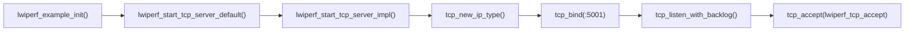
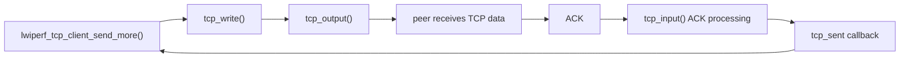
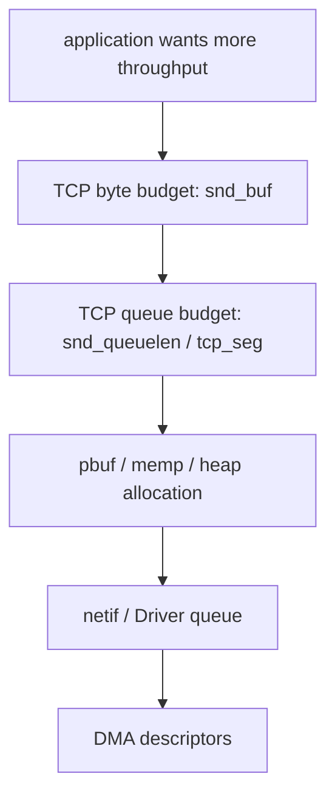
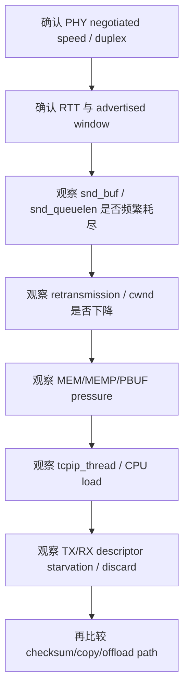
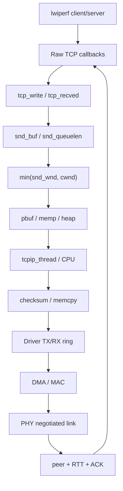

<meta name="referrer" content="no-referrer" />

# 教程 27：从 `lwiperf_start_tcp_server_default()` 到 TCP ACK——lwIP 吞吐量、窗口、pbuf、线程与 Driver 瓶颈定位

> 摘要：从 lwiperf Raw TCP 入口追踪收发、ACK 驱动的续传、窗口与发送队列，再把 pbuf/memp、tcpip_thread、DMA ring、checksum offload 与 PHY 速率接成一条性能瓶颈证据链。

[TOC]


`lwiperf` 是 lwIP 自带的 TCP 吞吐测试应用模块，不是 TCP Core 本身；官方文档把它定位为可与 PC 端 iPerf2 配合的最小 TCP client/server 性能测量实现。[S6](#source-s6) 当前实现直接使用 Raw TCP API，也就是绕过 Socket/Netconn、直接注册 TCP Core callback 的回调式 API，建立连接、累计 application bytes 并按持续时间计算 `bandwidth_kbitpsec`。[S1](#source-s1)

进入源码前先区分几个经常被混用的性能量。**PHY line rate** 是物理链路协商出的名义速率；**throughput** 是某一层单位时间实际传送的数据量；**application goodput** 更强调真正交付给应用的有效数据，不包含下层 header、重传等开销。lwiperf 当前 report 只用 `bytes_transferred / duration` 计算应用侧传输速率，它不直接等于 Ethernet wire rate，也没有同时给出 CPU cycles、packet rate、drop、retransmission 或 descriptor occupancy。[S1](#source-s1)[S6](#source-s6)

另一个必须先建立的量是 BDP（Bandwidth-Delay Product，带宽时延积）：在给定带宽与 RTT（Round-Trip Time，往返时延）下，要让发送端持续填满链路，通常需要足够的 in-flight data。于是 TCP receive window、`cwnd`、`snd_buf`/`snd_queuelen`、pbuf/memp、CPU、checksum/copy、Driver ring、DMA/MAC 与 PHY 都可能成为限制层；性能定位的目标不是“一次调很多宏”，而是找到**最先达到上限或最先出现异常证据的那一层**。[S3](#source-s3)[S4](#source-s4)[S5](#source-s5)

Stage 8～10 已经分别解释 TCP 数据发送、ACK 清队列、拥塞窗口与重传；Stage 12 解释了 pbuf/mem/memp；Stage 19～22 又把 checksum、DMA、descriptor ring 与 PHY 速率补到了 Driver/硬件边界。Stage 27 不重复这些完整机制，而是从 upstream `lwiperf` 的真实 Raw TCP 入口开始，把它们接成一条“吞吐为什么上不去”的可证伪证据链。[S1](#source-s1)[S3](#source-s3)

本篇没有真实目标板吞吐、CPU、cache miss、descriptor occupancy 或 retransmission 测量，因此不会给出所谓“最佳 TCP 宏值”。源码只能证明限制可能在哪里出现；最终瓶颈必须由实际平台证据确认。

## 1. 当前 example 编译了 lwiperf，但默认不启动

`contrib/examples/example_app/lwipcfg.h` 当前为：[S2](#source-s2)

```c
#define LWIP_LWIPERF_APP              0
```

`apps_init()` 只有在该开关非零时才进入示例入口：[S2](#source-s2)

```c
#if LWIP_LWIPERF_APP
  lwiperf_example_init();
#endif
```

因此当前仓库状态必须先区分：

```text
lwiperf 源码存在并可编译
        !=
当前 example_app 已自动启动 iperf server
```

本篇解释源码中的性能路径，不声称本轮已经实际运行 iperf、采集吞吐或 CPU utilization。

## 2. 真实 server 入口：`lwiperf_example_init()`

upstream example 的入口非常短：[S1](#source-s1)[S2](#source-s2)

```c
void
lwiperf_example_init(void)
{
  lwiperf_start_tcp_server_default(lwiperf_report, NULL);
}
```

`lwiperf_start_tcp_server_default()` 使用标准 lwiperf TCP port 5001，然后进入通用 server 创建函数：[S1](#source-s1)

```c
void *
lwiperf_start_tcp_server_default(lwiperf_report_fn report_fn, void *report_arg)
{
  return lwiperf_start_tcp_server(IP_ADDR_ANY, LWIPERF_TCP_PORT_DEFAULT,
                                  report_fn, report_arg);
}
```

继续进入 `lwiperf_start_tcp_server()`：

```c
void *
lwiperf_start_tcp_server(const ip_addr_t *local_addr, u16_t local_port,
                         lwiperf_report_fn report_fn, void *report_arg)
{
  err_t err;
  lwiperf_state_tcp_t *state = NULL;

  err = lwiperf_start_tcp_server_impl(local_addr, local_port, report_fn, report_arg,
    NULL, &state);
  if (err == ERR_OK) {
    return state;
  }
  return NULL;
}
```

真正建立 listen PCB 的是 `lwiperf_start_tcp_server_impl()`：[S1](#source-s1)

```c
pcb = tcp_new_ip_type(LWIPERF_SERVER_IP_TYPE);
if (pcb == NULL) {
  return ERR_MEM;
}
err = tcp_bind(pcb, local_addr, local_port);
if (err != ERR_OK) {
  return err;
}
s->server_pcb = tcp_listen_with_backlog(pcb, 1);
if (s->server_pcb == NULL) {
  if (pcb != NULL) {
    tcp_close(pcb);
  }
  LWIPERF_FREE(lwiperf_state_tcp_t, s);
  return ERR_MEM;
}

tcp_arg(s->server_pcb, s);
tcp_accept(s->server_pcb, lwiperf_tcp_accept);
```

此时建立的不是“性能测试专用 TCP”，而是普通 lwIP Raw TCP PCB。后面所有吞吐约束仍然来自同一套 TCP Core。



## 3. accept 后，性能测试真正落到 `lwiperf_tcp_recv()`

新连接完成三次握手后，TCP Core 调用注册的 `lwiperf_tcp_accept()`。该 callback 分配 per-connection state，并把 receive/poll/error callback 装到新 PCB：[S1](#source-s1)

```c
conn->conn_pcb = newpcb;
conn->time_started = sys_now();
conn->report_fn = s->report_fn;
conn->report_arg = s->report_arg;

tcp_arg(newpcb, conn);
tcp_recv(newpcb, lwiperf_tcp_recv);
tcp_poll(newpcb, lwiperf_tcp_poll, 2U);
tcp_err(conn->conn_pcb, lwiperf_tcp_err);
```

`lwiperf_tcp_accept()` 返回后，连接进入正常 TCP receive path。后续数据到达 `tcp_input()`，满足 sequence/window 条件后传给 application callback，也就是 `lwiperf_tcp_recv()`。

## 4. RX 吞吐的关键不是 `pbuf_free()`，而是先 `tcp_recved()`

`lwiperf_tcp_recv()` 收到数据后先记录 `p->tot_len`，完成 header/settings 处理，随后统计整个 pbuf chain 的 payload，并在释放 pbuf 前调用：[S1](#source-s1)

```c
conn->bytes_transferred += packet_idx;
tcp_recved(tpcb, tot_len);
pbuf_free(p);
return ERR_OK;
```

这里最重要的顺序是：

```text
application 已经消费这些 bytes
        ↓
tcp_recved(tpcb, len)
        ↓
TCP receive window 可重新扩大
        ↓
pbuf_free()
        ↓
底层 buffer 资源释放
```

`tcp_recved()` 表达的是“应用层已经消费多少字节”，不是“释放 pbuf”的同义词。TCP 接收窗口属于流量控制状态；pbuf 属于内存 ownership。两者相关，但不是同一个对象。[S3](#source-s3)[S5](#source-s5)

如果应用长期不调用 `tcp_recved()`，即使它已经自行保存或处理了数据，peer 看到的 advertised receive window 仍可能逐步缩小，最终限制发送端吞吐。

## 5. server 的报告值怎么计算

`lwip_tcp_conn_report()` 用 `sys_now()` 计算测试持续时间，并基于 `bytes_transferred` 生成 kbit/s：[S1](#source-s1)

```c
now = sys_now();
duration_ms = now - conn->time_started;
if (duration_ms == 0) {
  bandwidth_kbitpsec = 0;
} else {
  bandwidth_kbitpsec = (conn->bytes_transferred / duration_ms) * 8U;
}
```

该值是 lwiperf 自身基于 application bytes 与毫秒时间差得到的 throughput 指标。它不是 PHY line rate，也没有扣除 Ethernet/IP/TCP header，因此不要把它和物理层 raw bit rate 直接当成同一数值。

## 6. client 入口暴露了第一个明确瓶颈：`tcp_write()` 的 `ERR_MEM`

`lwiperf_start_tcp_client_default()` 最终进入主动连接路径，连接建立后 `lwiperf_tcp_client_connected()` 记录起始时间并调用 `lwiperf_tcp_client_send_more()`。[S1](#source-s1)

发送循环的核心是：[S1](#source-s1)

```c
txlen = txlen_max;
do {
  err = tcp_write(conn->conn_pcb, txptr, txlen, apiflags);
  if (err == ERR_MEM) {
    txlen /= 2;
  }
} while ((err == ERR_MEM) && (txlen >= (TCP_MSS / 2)));

if (err == ERR_OK) {
  conn->bytes_transferred += txlen;
} else {
  send_more = 0;
}
```

这段代码说明 lwiperf 本身已经把 `ERR_MEM` 当成正常的“当前发送资源不足”信号。它先减小单次写入长度；仍无法写入时停止本轮灌数据，等待后续 callback 再继续。

`ERR_MEM` 在这里不能简单翻译成“heap 真没内存了”。对 `tcp_write()` 而言，它也可能意味着当前 `snd_buf` 或发送队列资源不够容纳新的 segment/pbuf。[S3](#source-s3)

## 7. ACK 为什么会重新驱动发送

client 注册 `tcp_sent()` callback 后，ACK 确认数据时进入 `lwiperf_tcp_client_sent()`：[S1](#source-s1)

```c
static err_t
lwiperf_tcp_client_sent(void *arg, struct tcp_pcb *tpcb, u16_t len)
{
  lwiperf_state_tcp_t *conn = (lwiperf_state_tcp_t *)arg;
  LWIP_ASSERT("invalid conn", conn->conn_pcb == tpcb);
  LWIP_UNUSED_ARG(tpcb);
  LWIP_UNUSED_ARG(len);

  conn->poll_count = 0;

  return lwiperf_tcp_client_send_more(conn);
}
```

调用链因此不是“一个 while 永远写到底”，而是：



这正是吞吐测量最有价值的地方：发送端能否持续保持 pipe 中有足够多数据，取决于发送资源、接收窗口、拥塞窗口和 ACK 返回速度。

## 8. `TCP_SND_BUF` 与 `TCP_SND_QUEUELEN` 是不同维度

当前 example 配置：[S2](#source-s2)

```c
#define TCP_SND_BUF             2048
#define TCP_SND_QUEUELEN       (4 * TCP_SND_BUF/TCP_MSS)
#define TCP_SNDLOWAT           (TCP_SND_BUF/2)
#define TCP_WND                 (20 * 1024)
```

upstream `opt.h` 对默认语义的区分是：[S3](#source-s3)

```text
TCP_SND_BUF
    = sender buffer space，单位 bytes

TCP_SND_QUEUELEN
    = sender queue 可占用的 pbuf/segment 数量维度
```

因此“还能写多少 byte”和“还能挂多少 buffer/segment”并不是一个限制。

```text
写入新数据
  ├─ snd_buf bytes 够不够？
  ├─ snd_queuelen 够不够？
  └─ segment/pbuf/memp 分配成功吗？
```

任何一个先触顶，都可能让 `tcp_write()` 暂时返回 `ERR_MEM`。

## 9. `snd_buf` 足够，也不代表 packet 现在就能发出去

Stage 8 已经解释过 TCP output gate。Stage 27 只恢复必要公式：发送量会同时受到 remote advertised window 和 congestion window 限制。[S3](#source-s3)[S5](#source-s5)

```text
usable send window ≈ min(snd_wnd, cwnd)
```

其中：

- `snd_wnd`：peer 通过 TCP Window field 告知的接收能力，属于 flow control；
- `cwnd`：本端 congestion control 允许在网络中保持的未确认数据规模；
- `snd_buf`：lwIP 本地 application 尚可 enqueue 的发送 buffer 额度。

这三者回答不同问题，不能只调大 `TCP_SND_BUF` 就期待吞吐必然上升。

## 10. RTT × bandwidth 为什么会决定“窗口够不够”

对于稳定 bulk transfer，要充分利用链路，发送方通常需要允许大约一个 bandwidth-delay product 量级的数据处于 flight 中。这个关系是性能分析公式，不是 lwIP 某个变量的定义：[S4](#source-s4)

```text
BDP = bandwidth × RTT
```

例如 100 Mbit/s、RTT 40 ms：

```text
100,000,000 bit/s × 0.04 s
= 4,000,000 bit
≈ 500,000 byte
```

如果有效 receive/congestion window 远小于这一数量级，发送方会在 ACK 往返期间反复“发满 → 等 ACK”，无法填满物理链路。

但在本地 TAP 或 LAN 的极低 RTT 场景，真正瓶颈可能反而落在 CPU、copy、pbuf、Driver ring 或 PHY，而不是窗口。

## 11. `TCP_WND` 是上限，不等于线上始终 advertised 这个值

`TCP_WND` 定义接收窗口资源尺度，但运行时可用窗口还取决于未被 application 消费的数据量以及 window update 策略。[S3](#source-s3)

```text
TCP_WND
  ↓
数据进入 receive queue
  ↓
应用尚未 tcp_recved()
  ↓
可 advertised 空间下降
  ↓
应用消费 + tcp_recved()
  ↓
窗口重新开放
```

因此如果 server RX 吞吐异常，应同时观察：

1. application callback 是否及时运行；
2. `tcp_recved()` 是否及时调用；
3. `tcpip_thread` 是否被别的工作长期占用；
4. PBUF_POOL 是否发生压力。

## 12. pbuf/memp 压力会从 TCP 层表现出来

Stage 12 已经建立资源模型：TCP segment、PCB、pbuf 与 heap/pool 不是无限资源。性能测试把资源消耗速率放大之后，原本偶发的不足会变成持续瓶颈。

可以把发送链拆成三类资源：[S3](#source-s3)



`tcp_write()` 的 `ERR_MEM` 只能证明“这一层无法继续 enqueue”；要确定是 byte budget、queue length 还是底层 allocation，需要结合 TCP stats、MEM/MEMP/PBUF stats 或目标调试证据继续定位。

## 13. `LWIPERF_CHECK_RX_DATA` 会改变 CPU 工作量

`lwiperf_tcp_recv()` 可选地逐字节验证 payload pattern：[S1](#source-s1)

```c
#if LWIPERF_CHECK_RX_DATA
    const u8_t *payload = (const u8_t *)q->payload;
    u16_t i;
    for (i = 0; i < q->len; i++) {
      u8_t val = payload[i];
      u8_t num = val - '0';
      if (num == conn->next_num) {
        conn->next_num++;
        if (conn->next_num == 10) {
          conn->next_num = 0;
        }
      } else {
        lwiperf_tcp_close(conn, LWIPERF_TCP_ABORTED_LOCAL_DATAERROR);
        pbuf_free(p);
        return ERR_OK;
      }
    }
#endif
```

如果启用该选项，测试本身增加了逐字节 CPU 工作。比较两个 build 的吞吐时，必须确认测试 workload 一致，否则“协议栈性能变化”可能只是测试代码变化。

## 14. 跨层瓶颈不再逐篇复述，用证据面把前文机制接起来

Stage 11/12/19/21/22 已经分别把 Core thread、allocator、checksum、descriptor ring 与 PHY 讲清楚。性能篇不需要把这些机制再解释一次，而是把它们变成 **同一次 lwiperf 压力下应该观察的不同证据面**。lwIP 官方 Optimization hints 也强调 checksum routine、network-interface service 频率和 buffer overflow 都可能成为性能关键点，同时指出单纯把 memory options 调得很大通常不会自动带来明显提速。[S7](#source-s7)

| 层次 | 性能现象 | 需要回看的证据 | 主讲文章 |
| --- | --- | --- | --- |
| TCP flow/congestion | sender 经常等 ACK / window | `snd_wnd`、`cwnd`、RTT、ACK cadence | Stage 8～10 |
| TCP enqueue resource | `tcp_write()` 返回 `ERR_MEM` | `snd_buf`、`snd_queuelen`、`tcp_seg` | 本篇 + Stage 12 |
| Core execution | RX/ACK/callback 延迟 | `tcpip_thread` 是否被长 callback/其他 work 占用 | Stage 11 |
| memory/pbuf | allocation/drop 上升 | MEM/MEMP/PBUF stats | Stage 12 |
| checksum/copy CPU | CPU 饱和但窗口/ring 不缺资源 | software checksum、copy path、Cache 行为 | Stage 19/20/43 |
| Driver TX/RX | ring full、buffer starvation、drop | descriptor reclaim/refill、Driver counters | Stage 21/43 |
| PHY/link | throughput 顶在固定上界 | negotiated speed/duplex/link errors | Stage 22/44 |

这样出现“吞吐低”时，下一步不是继续放大某一个 buffer，而是先判断 **等待发生在哪一层**。例如 cwnd 下降可能是 Driver drop 的后果，`ERR_MEM` 也可能来自 TCP queue/pbuf resource，而不是 C heap 已耗尽。

## 15. 一个更可靠的瓶颈定位顺序

面对“iperf 只有预期的一半”这类现象，优先按从硬上限到内部资源的顺序排除：



这个顺序的目的，是避免一看到吞吐低就同时修改十几个宏，最终失去因果证据。

## 16. 如何解释 lwiperf 的报告值，而不是把一个 kbit/s 当成全部性能

`report_fn` 得到的是 `bytes_transferred`、`ms_duration` 与由此计算的 `bandwidth_kbitpsec`。[S1](#source-s1)[S6](#source-s6) 这个值反映 lwiperf application bytes 在测试持续时间内的平均传输速率；它没有把 Ethernet/IP/TCP header 计入分子，也不会单独显示重传、CPU 时间、queue occupancy 或 packet rate，因此不能直接拿来等同于 PHY line rate，更不能仅凭一个数值判断瓶颈位于 TCP、内存还是 Driver。

如果需要判断“链路利用率为什么低”，至少还应把 RTT/BDP、advertised window、retransmission、CPU load、pbuf/memp pressure、descriptor starvation 与实际 negotiated speed 放到同一证据面。RFC 6349 可以提供更完整的 TCP throughput testing 框架，[S4](#source-s4) 但当前文章已经给出读懂 lwiperf report 所需的最小指标语义，不要求离开正文后才能理解这一数值。

## 17. Stage 27 的完整性能心智模型



这张图的关键不是“性能有很多因素”，而是每一层都有不同的可观察证据。真正的定位过程应寻找最先达到上限或最先出现异常的层。

## 18. 当前实现边界

当前目标版本需要保留这些边界：[S1](#source-s1)[S2](#source-s2)[S3](#source-s3)

1. `LWIP_LWIPERF_APP=0`，当前 example_app 不自动启动 lwiperf；
2. upstream lwiperf 使用 Raw TCP API，不是 Socket/Netconn benchmark；
3. server 默认监听 TCP 5001；
4. client 的续传由 `tcp_sent` ACK callback 和 poll callback 驱动，不是单个阻塞 send loop；
5. `tcp_write()` 的 `ERR_MEM` 不能只解释成 heap exhaustion；
6. `tcp_recved()` 与 `pbuf_free()` 分别表达 receive-window consumption 与 buffer ownership；
7. 本篇没有在真实目标板测量吞吐、CPU、descriptor occupancy 或 retransmission，因此不提供“最佳宏值”；
8. DMA、checksum offload、zero-copy、PHY 上限仍属于 Port/Driver/hardware 能力，不能由 lwiperf 源码本身证明某块板的实际性能。

## 资料来源

<a id="source-s1"></a>
### [S1] lwIP lwiperf 源码
- 类型：目标版本上游源码
- 版本：commit `d08f4773edd0182b7910fc8f046eed82ffcd67c9`
- 定位：`src/apps/lwiperf/lwiperf.c`：`lwiperf_start_tcp_server_default()`、`lwiperf_start_tcp_server_impl()`、`lwiperf_tcp_accept()`、`lwiperf_tcp_recv()`、`lwiperf_tcp_client_send_more()`、`lwiperf_tcp_client_sent()`、`lwip_tcp_conn_report()`；`src/include/lwip/apps/lwiperf.h`
- URL/文档：[lwIP upstream commit](https://github.com/lwip-tcpip/lwip/tree/d08f4773edd0182b7910fc8f046eed82ffcd67c9)
- 使用位置：“server/client 入口”“ACK 驱动续传”“RX window consumption”“report bandwidth”
- 支撑内容：证明当前 lwiperf Raw TCP 的真实 callback 链、资源不足处理与统计方式

<a id="source-s2"></a>
### [S2] lwIP example 与当前 example_app 配置
- 类型：目标版本上游 example/config
- 版本：commit `d08f4773edd0182b7910fc8f046eed82ffcd67c9`
- 定位：`contrib/examples/lwiperf/lwiperf_example.c`；`contrib/examples/example_app/lwipcfg.h`、`lwipopts.h`、`test.c`
- URL/文档：[lwIP contrib examples](https://github.com/lwip-tcpip/lwip/tree/d08f4773edd0182b7910fc8f046eed82ffcd67c9/contrib/examples)
- 使用位置：“真实应用入口”“当前 app flag”“TCP_SND_BUF/TCP_SND_QUEUELEN/TCP_WND example 配置”
- 支撑内容：区分 lwiperf 编译能力、当前 example 是否启动和 example 的 TCP resource 配置

<a id="source-s3"></a>
### [S3] lwIP TCP Core 与配置
- 类型：目标版本上游源码
- 版本：commit `d08f4773edd0182b7910fc8f046eed82ffcd67c9`
- 定位：`src/core/tcp.c`、`tcp_out.c`、`tcp_in.c`；`src/include/lwip/tcp.h`、`tcpbase.h`、`opt.h`
- URL/文档：[lwIP TCP source](https://github.com/lwip-tcpip/lwip/tree/d08f4773edd0182b7910fc8f046eed82ffcd67c9/src/core)
- 使用位置：“tcp_write ERR_MEM”“snd_buf/snd_queuelen”“snd_wnd/cwnd”“tcp_recved”“window update”
- 支撑内容：提供性能现象背后的 TCP resource、flow-control 与 congestion-control 实现依据

<a id="source-s4"></a>
### [S4] RFC 6349：Framework for TCP Throughput Testing
- 类型：IETF 信息性规范
- 版本：RFC 6349，2011
- URL/文档：[RFC 6349](https://www.rfc-editor.org/rfc/rfc6349.html)
- 使用位置：“bandwidth-delay product”“吞吐测试指标边界”
- 支撑内容：提供 TCP throughput 测试与 BDP/RTT/窗口关系的标准化性能分析背景

<a id="source-s5"></a>
### [S5] RFC 9293 与 RFC 5681：TCP / Congestion Control
- 类型：IETF 标准规范
- 版本：RFC 9293，2022；RFC 5681，2009
- URL/文档：[RFC 9293](https://www.rfc-editor.org/rfc/rfc9293.html)，[RFC 5681](https://www.rfc-editor.org/rfc/rfc5681.html)
- 使用位置：“advertised receive window”“ACK”“congestion window”
- 支撑内容：提供 TCP flow control 与 congestion-control 的协议语义，用于区分规范概念和 lwIP 具体变量实现

<a id="source-s6"></a>
### [S6] lwIP 官方 lwiperf API 文档
- 类型：lwIP 官方 Application API 文档
- 版本：lwIP 2.1.x 文档，访问日期 2026-10-03
- URL/文档：[Iperf server / lwiperf](https://www.nongnu.org/lwip/2_1_x/group__iperf.html)
- 使用位置：开篇工具定位、server/client 能力、report 指标边界
- 支撑内容：官方把 lwiperf 定义为与 iPerf2 配合的最小 TCP client/server 性能测量实现，并列出启动/abort/report API

<a id="source-s7"></a>
### [S7] lwIP 官方 Optimization hints
- 类型：lwIP 官方性能文档
- 版本：lwIP 2.1.x 文档，访问日期 2026-10-03
- URL/文档：[Optimization hints](https://www.nongnu.org/lwip/2_1_x/optimization.html)
- 使用位置：跨层瓶颈证据面、checksum、Driver service 频率、buffer overflow、memory sizing 边界
- 支撑内容：官方指出 checksum routine 与 network-interface service 频率是重要性能点，并提醒单纯增大 memory options 通常不会自动显著提升速度
