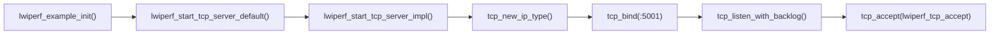
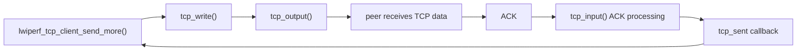
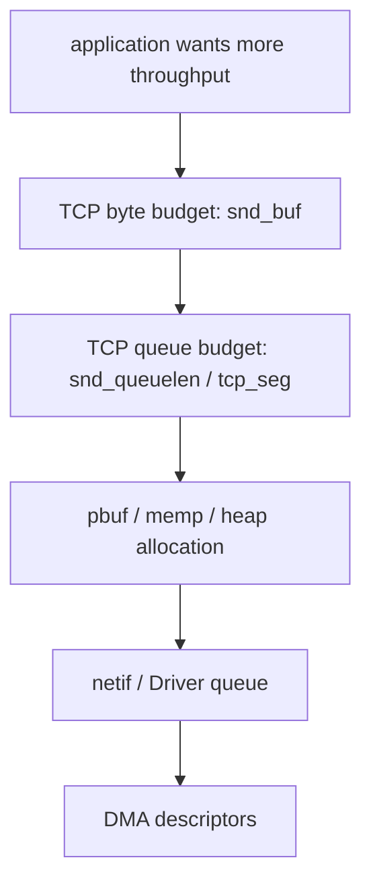
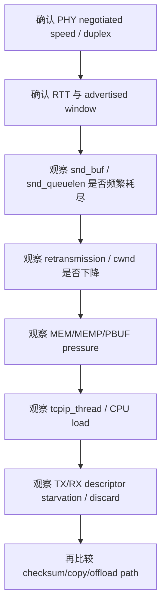
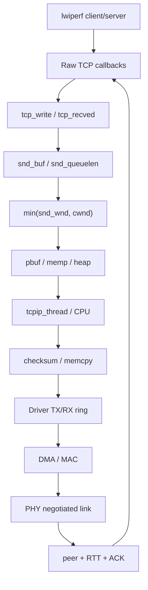

<meta name="referrer" content="no-referrer" />

# 教程 27：从 `lwiperf_start_tcp_server_default()` 到 TCP ACK——lwIP 吞吐量、窗口、pbuf、线程与 Driver 瓶颈定位

> 摘要：从 lwiperf Raw TCP 入口追踪收发、ACK 驱动的续传、窗口与发送队列，再把 pbuf/memp、tcpip_thread、DMA ring、checksum offload 与 PHY 速率接成一条性能瓶颈证据链。

[TOC]

Stage 8～10 已经分别解释 TCP 数据发送、ACK 清队列、拥塞窗口与重传；Stage 12 解释了 pbuf/mem/memp；Stage 19～22 又把 checksum、DMA、descriptor ring 与 PHY 速率补到了 Driver/硬件边界。Stage 27 不重新逐章复述这些机制，而是从 upstream `lwiperf` 的真实 Raw TCP 入口开始，把它们放进同一条“吞吐为什么上不去”的执行链。[S1](#source-s1)[S3](#source-s3)

本篇不把某个配置值直接写成“最佳参数”。吞吐量取决于链路带宽、RTT、TCP 窗口、发送队列、内存、CPU、Driver 与 PHY 等共同约束；没有实际目标板测量，就只能建立可证伪的定位方法，不能给出无条件调优结论。[S3](#source-s3)[S4](#source-s4)

## 1. 当前 example 编译了 lwiperf，但默认不启动

`contrib/examples/example_app/lwipcfg.h` 当前为：[S2](#source-s2)

```c
#define LWIP_LWIPERF_APP              0
```

`apps_init()` 只有在该开关非零时才进入示例入口：[S2](#source-s2)

```c
#if LWIP_LWIPERF_APP
  lwiperf_example_init();
#endif
```

因此当前仓库状态必须先区分：

```text
lwiperf 源码存在并可编译
        !=
当前 example_app 已自动启动 iperf server
```

本篇解释源码中的性能路径，不声称本轮已经实际运行 iperf、采集吞吐或 CPU utilization。

## 2. 真实 server 入口：`lwiperf_example_init()`

upstream example 的入口非常短：[S1](#source-s1)[S2](#source-s2)

```c
void
lwiperf_example_init(void)
{
  lwiperf_start_tcp_server_default(lwiperf_report, NULL);
}
```

`lwiperf_start_tcp_server_default()` 使用标准 lwiperf TCP port 5001，然后进入通用 server 创建函数：[S1](#source-s1)

```c
void *
lwiperf_start_tcp_server_default(lwiperf_report_fn report_fn, void *report_arg)
{
  return lwiperf_start_tcp_server(IP_ADDR_ANY, LWIPERF_TCP_PORT_DEFAULT,
                                  report_fn, report_arg);
}
```

继续进入 `lwiperf_start_tcp_server()`：

```c
void *
lwiperf_start_tcp_server(const ip_addr_t *local_addr, u16_t local_port,
                         lwiperf_report_fn report_fn, void *report_arg)
{
  err_t err;
  lwiperf_state_tcp_t *state = NULL;

  err = lwiperf_start_tcp_server_impl(local_addr, local_port, report_fn, report_arg,
    NULL, &state);
  if (err == ERR_OK) {
    return state;
  }
  return NULL;
}
```

真正建立 listen PCB 的是 `lwiperf_start_tcp_server_impl()`：[S1](#source-s1)

```c
pcb = tcp_new_ip_type(LWIPERF_SERVER_IP_TYPE);
if (pcb == NULL) {
  return ERR_MEM;
}
err = tcp_bind(pcb, local_addr, local_port);
if (err != ERR_OK) {
  return err;
}
s->server_pcb = tcp_listen_with_backlog(pcb, 1);
if (s->server_pcb == NULL) {
  if (pcb != NULL) {
    tcp_close(pcb);
  }
  LWIPERF_FREE(lwiperf_state_tcp_t, s);
  return ERR_MEM;
}

tcp_arg(s->server_pcb, s);
tcp_accept(s->server_pcb, lwiperf_tcp_accept);
```

此时建立的不是“性能测试专用 TCP”，而是普通 lwIP Raw TCP PCB。后面所有吞吐约束仍然来自同一套 TCP Core。



## 3. accept 后，性能测试真正落到 `lwiperf_tcp_recv()`

新连接完成三次握手后，TCP Core 调用注册的 `lwiperf_tcp_accept()`。该 callback 分配 per-connection state，并把 receive/poll/error callback 装到新 PCB：[S1](#source-s1)

```c
conn->conn_pcb = newpcb;
conn->time_started = sys_now();
conn->report_fn = s->report_fn;
conn->report_arg = s->report_arg;

tcp_arg(newpcb, conn);
tcp_recv(newpcb, lwiperf_tcp_recv);
tcp_poll(newpcb, lwiperf_tcp_poll, 2U);
tcp_err(conn->conn_pcb, lwiperf_tcp_err);
```

`lwiperf_tcp_accept()` 返回后，连接进入正常 TCP receive path。后续数据到达 `tcp_input()`，满足 sequence/window 条件后传给 application callback，也就是 `lwiperf_tcp_recv()`。

## 4. RX 吞吐的关键不是 `pbuf_free()`，而是先 `tcp_recved()`

`lwiperf_tcp_recv()` 收到数据后先记录 `p->tot_len`，完成 header/settings 处理，随后统计整个 pbuf chain 的 payload，并在释放 pbuf 前调用：[S1](#source-s1)

```c
conn->bytes_transferred += packet_idx;
tcp_recved(tpcb, tot_len);
pbuf_free(p);
return ERR_OK;
```

这里最重要的顺序是：

```text
application 已经消费这些 bytes
        ↓
tcp_recved(tpcb, len)
        ↓
TCP receive window 可重新扩大
        ↓
pbuf_free()
        ↓
底层 buffer 资源释放
```

`tcp_recved()` 表达的是“应用层已经消费多少字节”，不是“释放 pbuf”的同义词。TCP 接收窗口属于流量控制状态；pbuf 属于内存 ownership。两者相关，但不是同一个对象。[S3](#source-s3)[S5](#source-s5)

如果应用长期不调用 `tcp_recved()`，即使它已经自行保存或处理了数据，peer 看到的 advertised receive window 仍可能逐步缩小，最终限制发送端吞吐。

## 5. server 的报告值怎么计算

`lwip_tcp_conn_report()` 用 `sys_now()` 计算测试持续时间，并基于 `bytes_transferred` 生成 kbit/s：[S1](#source-s1)

```c
now = sys_now();
duration_ms = now - conn->time_started;
if (duration_ms == 0) {
  bandwidth_kbitpsec = 0;
} else {
  bandwidth_kbitpsec = (conn->bytes_transferred / duration_ms) * 8U;
}
```

该值是 lwiperf 自身基于 application bytes 与毫秒时间差得到的 throughput 指标。它不是 PHY line rate，也没有扣除 Ethernet/IP/TCP header，因此不要把它和物理层 raw bit rate 直接当成同一数值。

## 6. client 入口暴露了第一个明确瓶颈：`tcp_write()` 的 `ERR_MEM`

`lwiperf_start_tcp_client_default()` 最终进入主动连接路径，连接建立后 `lwiperf_tcp_client_connected()` 记录起始时间并调用 `lwiperf_tcp_client_send_more()`。[S1](#source-s1)

发送循环的核心是：[S1](#source-s1)

```c
txlen = txlen_max;
do {
  err = tcp_write(conn->conn_pcb, txptr, txlen, apiflags);
  if (err == ERR_MEM) {
    txlen /= 2;
  }
} while ((err == ERR_MEM) && (txlen >= (TCP_MSS / 2)));

if (err == ERR_OK) {
  conn->bytes_transferred += txlen;
} else {
  send_more = 0;
}
```

这段代码说明 lwiperf 本身已经把 `ERR_MEM` 当成正常的“当前发送资源不足”信号。它先减小单次写入长度；仍无法写入时停止本轮灌数据，等待后续 callback 再继续。

`ERR_MEM` 在这里不能简单翻译成“heap 真没内存了”。对 `tcp_write()` 而言，它也可能意味着当前 `snd_buf` 或发送队列资源不够容纳新的 segment/pbuf。[S3](#source-s3)

## 7. ACK 为什么会重新驱动发送

client 注册 `tcp_sent()` callback 后，ACK 确认数据时进入 `lwiperf_tcp_client_sent()`：[S1](#source-s1)

```c
static err_t
lwiperf_tcp_client_sent(void *arg, struct tcp_pcb *tpcb, u16_t len)
{
  lwiperf_state_tcp_t *conn = (lwiperf_state_tcp_t *)arg;
  LWIP_ASSERT("invalid conn", conn->conn_pcb == tpcb);
  LWIP_UNUSED_ARG(tpcb);
  LWIP_UNUSED_ARG(len);

  conn->poll_count = 0;

  return lwiperf_tcp_client_send_more(conn);
}
```

调用链因此不是“一个 while 永远写到底”，而是：



这正是吞吐测量最有价值的地方：发送端能否持续保持 pipe 中有足够多数据，取决于发送资源、接收窗口、拥塞窗口和 ACK 返回速度。

## 8. `TCP_SND_BUF` 与 `TCP_SND_QUEUELEN` 是不同维度

当前 example 配置：[S2](#source-s2)

```c
#define TCP_SND_BUF             2048
#define TCP_SND_QUEUELEN       (4 * TCP_SND_BUF/TCP_MSS)
#define TCP_SNDLOWAT           (TCP_SND_BUF/2)
#define TCP_WND                 (20 * 1024)
```

upstream `opt.h` 对默认语义的区分是：[S3](#source-s3)

```text
TCP_SND_BUF
    = sender buffer space，单位 bytes

TCP_SND_QUEUELEN
    = sender queue 可占用的 pbuf/segment 数量维度
```

因此“还能写多少 byte”和“还能挂多少 buffer/segment”并不是一个限制。

```text
写入新数据
  ├─ snd_buf bytes 够不够？
  ├─ snd_queuelen 够不够？
  └─ segment/pbuf/memp 分配成功吗？
```

任何一个先触顶，都可能让 `tcp_write()` 暂时返回 `ERR_MEM`。

## 9. `snd_buf` 足够，也不代表 packet 现在就能发出去

Stage 8 已经解释过 TCP output gate。Stage 27 只恢复必要公式：发送量会同时受到 remote advertised window 和 congestion window 限制。[S3](#source-s3)[S5](#source-s5)

```text
usable send window ≈ min(snd_wnd, cwnd)
```

其中：

- `snd_wnd`：peer 通过 TCP Window field 告知的接收能力，属于 flow control；
- `cwnd`：本端 congestion control 允许在网络中保持的未确认数据规模；
- `snd_buf`：lwIP 本地 application 尚可 enqueue 的发送 buffer 额度。

这三者回答不同问题，不能只调大 `TCP_SND_BUF` 就期待吞吐必然上升。

## 10. RTT × bandwidth 为什么会决定“窗口够不够”

对于稳定 bulk transfer，要充分利用链路，发送方通常需要允许大约一个 bandwidth-delay product 量级的数据处于 flight 中。这个关系是性能分析公式，不是 lwIP 某个变量的定义：[S4](#source-s4)

```text
BDP = bandwidth × RTT
```

例如 100 Mbit/s、RTT 40 ms：

```text
100,000,000 bit/s × 0.04 s
= 4,000,000 bit
≈ 500,000 byte
```

如果有效 receive/congestion window 远小于这一数量级，发送方会在 ACK 往返期间反复“发满 → 等 ACK”，无法填满物理链路。

但在本地 TAP 或 LAN 的极低 RTT 场景，真正瓶颈可能反而落在 CPU、copy、pbuf、Driver ring 或 PHY，而不是窗口。

## 11. `TCP_WND` 是上限，不等于线上始终 advertised 这个值

`TCP_WND` 定义接收窗口资源尺度，但运行时可用窗口还取决于未被 application 消费的数据量以及 window update 策略。[S3](#source-s3)

```text
TCP_WND
  ↓
数据进入 receive queue
  ↓
应用尚未 tcp_recved()
  ↓
可 advertised 空间下降
  ↓
应用消费 + tcp_recved()
  ↓
窗口重新开放
```

因此如果 server RX 吞吐异常，应同时观察：

1. application callback 是否及时运行；
2. `tcp_recved()` 是否及时调用；
3. `tcpip_thread` 是否被别的工作长期占用；
4. PBUF_POOL 是否发生压力。

## 12. pbuf/memp 压力会从 TCP 层表现出来

Stage 12 已经建立资源模型：TCP segment、PCB、pbuf 与 heap/pool 不是无限资源。性能测试把资源消耗速率放大之后，原本偶发的不足会变成持续瓶颈。

可以把发送链拆成三类资源：[S3](#source-s3)



`tcp_write()` 的 `ERR_MEM` 只能证明“这一层无法继续 enqueue”；要确定是 byte budget、queue length 还是底层 allocation，需要结合 TCP stats、MEM/MEMP/PBUF stats 或目标调试证据继续定位。

## 13. `LWIPERF_CHECK_RX_DATA` 会改变 CPU 工作量

`lwiperf_tcp_recv()` 可选地逐字节验证 payload pattern：[S1](#source-s1)

```c
#if LWIPERF_CHECK_RX_DATA
    const u8_t *payload = (const u8_t *)q->payload;
    u16_t i;
    for (i = 0; i < q->len; i++) {
      u8_t val = payload[i];
      u8_t num = val - '0';
      if (num == conn->next_num) {
        conn->next_num++;
        if (conn->next_num == 10) {
          conn->next_num = 0;
        }
      } else {
        lwiperf_tcp_close(conn, LWIPERF_TCP_ABORTED_LOCAL_DATAERROR);
        pbuf_free(p);
        return ERR_OK;
      }
    }
#endif
```

如果启用该选项，测试本身增加了逐字节 CPU 工作。比较两个 build 的吞吐时，必须确认测试 workload 一致，否则“协议栈性能变化”可能只是测试代码变化。

## 14. `tcpip_thread` 可能成为串行化瓶颈

在 `NO_SYS=0` 且未采用特殊 core locking 设计时，大量协议处理集中在 lwIP Core execution context。Stage 11 已经解释 mailbox 与 Core Locking；在性能测试中，它们体现为执行资源竞争：

```text
RX interrupt / driver task
        ↓
input submission
        ↓
tcpip_thread
        ├─ IP/TCP RX
        ├─ ACK processing
        ├─ Raw callbacks
        ├─ timers
        └─ other protocol work
```

如果 `lwiperf_tcp_recv()` 或其他 callback 做大量计算，TCP Core 本身也会被延迟。吞吐下降和 RTT/ACK 延迟增大可能同时出现。

## 15. checksum 与 memcpy 是 CPU 路径，不是 TCP window 问题

Stage 19 已经说明 software checksum 与 hardware offload 的边界；Stage 20 又说明 copy/zero-copy ownership。性能分析时可以把 CPU data path 拆开：

```text
application bytes
   ↓
tcp_write copy? / reference?
   ↓
TCP/IP checksum
   ↓
Ethernet Driver copy / scatter-gather
   ↓
DMA
```

如果 CPU utilization 已接近饱和，而窗口、ACK 和 descriptor queue 都没有明显空闲等待，继续增大 TCP buffer 可能不会提高吞吐。此时更合理的候选是 checksum offload、减少 copy、cache/DMA 访问模式或更高效的 Driver path。

这些属于工程分析条件，不是“打开 offload 一定更快”的无条件结论。

## 16. Stage 21 的 descriptor ring 会形成第二层背压

TCP Core 可以 enqueue，不代表 Driver 永远有空闲 TX descriptor。

```text
TCP output
  ↓
netif output
  ↓
Driver TX ring
  ↓
没有 free descriptor
```

如果 Driver 不能及时 reclaim completion：

- `linkoutput()` 可能失败或阻塞，取决于 Port contract；
- TCP 数据仍可能留在上层等待后续输出；
- CPU 也可能耗在轮询/retry；
- 物理链路会出现空闲 gap。

反向 RX 路径中，如果 RX descriptors/buffers 长时间得不到 recycle，就可能出现丢包。TCP 会把丢包解释成网络拥塞/丢失并进入重传与 congestion control，最终表现为吞吐下降。

因此“TCP cwnd 下降”可能是结果，不一定是最初的原因。

## 17. PHY negotiated speed 是绝对上界之一

Stage 22 已经把 `netif->link_speed`、PHY auto-negotiation 与 duplex 分开。性能测试前必须先确认物理事实：

```text
10 Mbit/s link
100 Mbit/s link
1 Gbit/s link
half duplex / full duplex
```

应用 goodput 不可能长期超过实际 negotiated line rate；而 Ethernet/IP/TCP framing 还会进一步降低 application payload 比例。

所以第一步不是调 `TCP_WND`，而是确认测试对象的真实 link speed 与 duplex。

## 18. SNMP/MIB2 counters 可以成为 Driver 侧旁证

Stage 26 已经讲过 `mib2_counters`。它不能替代 packet capture 或 Driver debug，但可以用于判断“吞吐下降期间有没有同时发生 discard/error”。例如：

```text
ifInOctets / ifOutOctets
ifInDiscards / ifOutDiscards
```

如果 application throughput 下降同时 discard 快速增长，应优先检查资源/ring/Driver path；如果 discard 没有增长但 ACK 间隔明显变大，则 CPU scheduling、window 或 peer behavior 更值得怀疑。

这是证据组合方式，不是单个 counter 的自动根因诊断。

## 19. 一个更可靠的瓶颈定位顺序

面对“iperf 只有预期的一半”这类现象，优先按从硬上限到内部资源的顺序排除：



这个顺序的目的，是避免一看到吞吐低就同时修改十几个宏，最终失去因果证据。

## 20. throughput、goodput、packet rate 不应混为一个指标

至少要区分：

| 指标 | 当前含义 |
| --- | --- |
| PHY line rate | 物理链路比特率 |
| TCP/application throughput | 一段时间内传输的应用/TCP payload 量 |
| goodput | 真正有用且非重传的上层数据速率 |
| packet rate | packets per second，受 packet size 强烈影响 |
| CPU utilization | 计算资源占用，并不直接等于吞吐 |
| retransmission rate | 网络/资源/调度问题的重要侧证 |

lwiperf 的 `bandwidth_kbitpsec` 是它自身基于 `bytes_transferred` 与 elapsed milliseconds 计算出的应用侧统计，不应被标记成“Ethernet wire speed”。[S1](#source-s1)

## 21. Stage 27 的完整性能心智模型



这张图的关键不是“性能有很多因素”，而是每一层都有不同的可观察证据。真正的定位过程应寻找最先达到上限或最先出现异常的层。

## 22. 当前实现边界

当前目标版本需要保留这些边界：[S1](#source-s1)[S2](#source-s2)[S3](#source-s3)

1. `LWIP_LWIPERF_APP=0`，当前 example_app 不自动启动 lwiperf；
2. upstream lwiperf 使用 Raw TCP API，不是 Socket/Netconn benchmark；
3. server 默认监听 TCP 5001；
4. client 的续传由 `tcp_sent` ACK callback 和 poll callback 驱动，不是单个阻塞 send loop；
5. `tcp_write()` 的 `ERR_MEM` 不能只解释成 heap exhaustion；
6. `tcp_recved()` 与 `pbuf_free()` 分别表达 receive-window consumption 与 buffer ownership；
7. 本篇没有在真实目标板测量吞吐、CPU、descriptor occupancy 或 retransmission，因此不提供“最佳宏值”；
8. DMA、checksum offload、zero-copy、PHY 上限仍属于 Port/Driver/hardware 能力，不能由 lwiperf 源码本身证明某块板的实际性能。

## 资料来源

<a id="source-s1"></a>
### [S1] lwIP lwiperf 源码
- 类型：目标版本上游源码
- 版本：commit `d08f4773edd0182b7910fc8f046eed82ffcd67c9`
- 定位：`src/apps/lwiperf/lwiperf.c`：`lwiperf_start_tcp_server_default()`、`lwiperf_start_tcp_server_impl()`、`lwiperf_tcp_accept()`、`lwiperf_tcp_recv()`、`lwiperf_tcp_client_send_more()`、`lwiperf_tcp_client_sent()`、`lwip_tcp_conn_report()`；`src/include/lwip/apps/lwiperf.h`
- URL/文档：[lwIP upstream commit](https://github.com/lwip-tcpip/lwip/tree/d08f4773edd0182b7910fc8f046eed82ffcd67c9)
- 使用位置：“server/client 入口”“ACK 驱动续传”“RX window consumption”“report bandwidth”
- 支撑内容：证明当前 lwiperf Raw TCP 的真实 callback 链、资源不足处理与统计方式

<a id="source-s2"></a>
### [S2] lwIP example 与当前 example_app 配置
- 类型：目标版本上游 example/config
- 版本：commit `d08f4773edd0182b7910fc8f046eed82ffcd67c9`
- 定位：`contrib/examples/lwiperf/lwiperf_example.c`；`contrib/examples/example_app/lwipcfg.h`、`lwipopts.h`、`test.c`
- URL/文档：[lwIP contrib examples](https://github.com/lwip-tcpip/lwip/tree/d08f4773edd0182b7910fc8f046eed82ffcd67c9/contrib/examples)
- 使用位置：“真实应用入口”“当前 app flag”“TCP_SND_BUF/TCP_SND_QUEUELEN/TCP_WND example 配置”
- 支撑内容：区分 lwiperf 编译能力、当前 example 是否启动和 example 的 TCP resource 配置

<a id="source-s3"></a>
### [S3] lwIP TCP Core 与配置
- 类型：目标版本上游源码
- 版本：commit `d08f4773edd0182b7910fc8f046eed82ffcd67c9`
- 定位：`src/core/tcp.c`、`tcp_out.c`、`tcp_in.c`；`src/include/lwip/tcp.h`、`tcpbase.h`、`opt.h`
- URL/文档：[lwIP TCP source](https://github.com/lwip-tcpip/lwip/tree/d08f4773edd0182b7910fc8f046eed82ffcd67c9/src/core)
- 使用位置：“tcp_write ERR_MEM”“snd_buf/snd_queuelen”“snd_wnd/cwnd”“tcp_recved”“window update”
- 支撑内容：提供性能现象背后的 TCP resource、flow-control 与 congestion-control 实现依据

<a id="source-s4"></a>
### [S4] RFC 6349：Framework for TCP Throughput Testing
- 类型：IETF 信息性规范
- 版本：RFC 6349，2011
- URL/文档：[RFC 6349](https://www.rfc-editor.org/rfc/rfc6349.html)
- 使用位置：“bandwidth-delay product”“吞吐测试指标边界”
- 支撑内容：提供 TCP throughput 测试与 BDP/RTT/窗口关系的标准化性能分析背景

<a id="source-s5"></a>
### [S5] RFC 9293 与 RFC 5681：TCP / Congestion Control
- 类型：IETF 标准规范
- 版本：RFC 9293，2022；RFC 5681，2009
- URL/文档：[RFC 9293](https://www.rfc-editor.org/rfc/rfc9293.html)，[RFC 5681](https://www.rfc-editor.org/rfc/rfc5681.html)
- 使用位置：“advertised receive window”“ACK”“congestion window”
- 支撑内容：提供 TCP flow control 与 congestion-control 的协议语义，用于区分规范概念和 lwIP 具体变量实现
