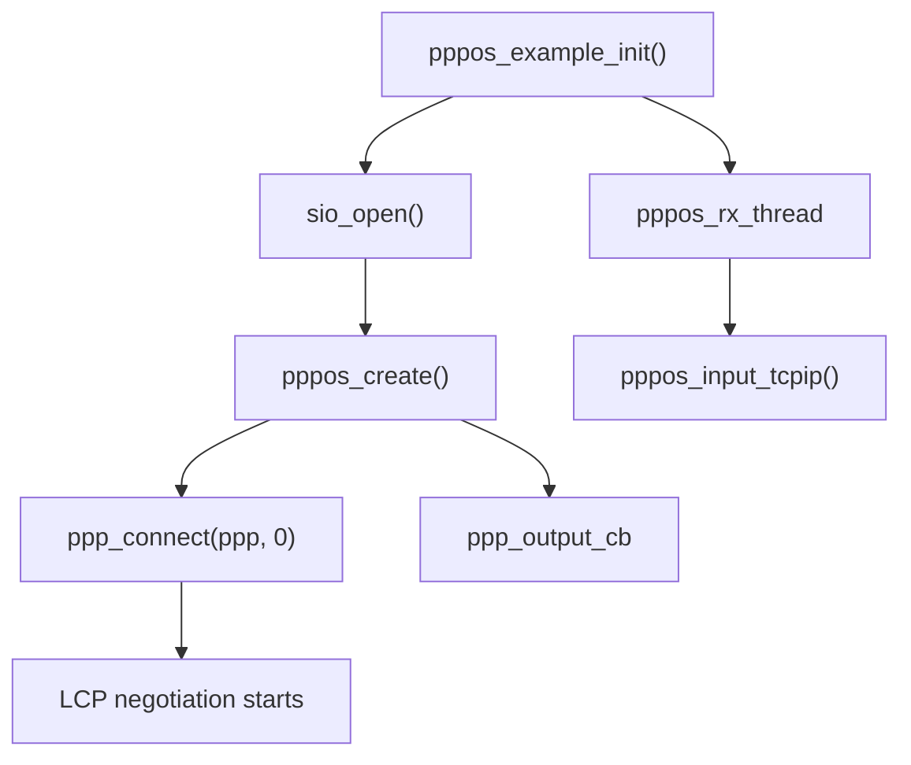
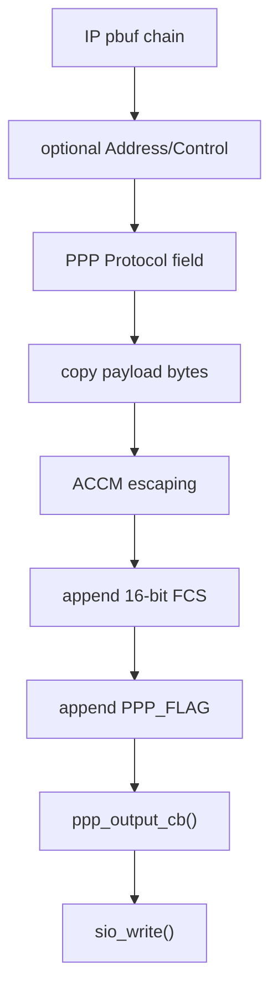
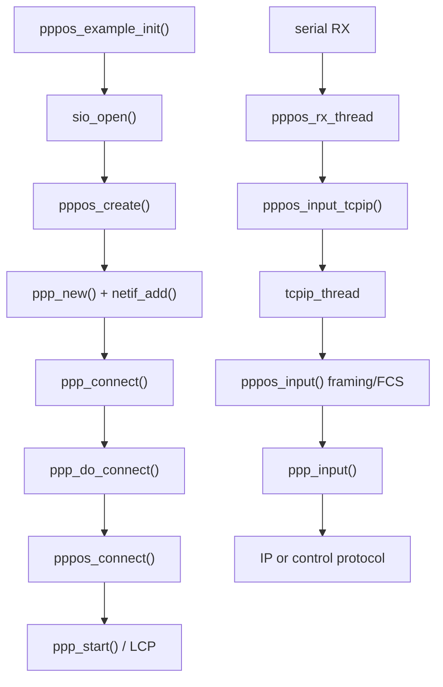

<meta name="referrer" content="no-referrer" />

# 教程 28：从 `pppos_create()` 到 `ppp_input()`——PPP Core、PPPoS 串口字节流、异步 HDLC Framing 与 FCS

> 摘要：从 upstream PPPoS example 追踪 PPP netif 创建、LCP 启动、串口 RX 跨线程输入、异步 HDLC 解帧、Protocol 分发，以及 TX 的 ACCM escaping、PFC/ACFC 与 FCS。

[TOC]

Stage 27 完成了 Ethernet 路径上的性能闭环。Stage 28 切换到另一种常见嵌入式链路：没有 Ethernet MAC/PHY、只有 UART/串行字节流时，lwIP 如何通过 PPPoS 建立一个能承载 IPv4/IPv6 的 `netif`。[S1](#source-s1)[S2](#source-s2)

本篇只回答“PPP Core 怎样挂到 serial link、byte stream 怎样变成 PPP frame、frame 怎样进入 IP”的问题。LCP option negotiation、PAP/CHAP、IPCP、IPv6CP 放到 Stage 29；地址/DNS/default route/断线重连放到 Stage 30。

## 1. 当前 example 编译 PPP/PPPoS，但运行时 `USE_PPP=0`

`contrib/examples/example_app/lwipopts.h` 当前配置：[S2](#source-s2)

```c
#define PPP_SUPPORT             1
#define PPPOE_SUPPORT           1
#define PPPOS_SUPPORT           1
#define PAP_SUPPORT             1
#define CHAP_SUPPORT            1
#define MSCHAP_SUPPORT          0
```

但 `test.c` 当前又明确写着：[S2](#source-s2)

```c
#define USE_PPP 0
```

所以必须区分：

```text
PPP Core / PPPoS 被编译
        !=
当前 example_app 运行时真的打开串口并拨起 PPP
```

本篇解释 pinned 源码，不声称本轮已经连接 modem、建立 PPP session 或获得运营商地址。

## 2. 真实 example 入口是 `pppos_example_init()`

upstream PPPoS example 先打开 serial I/O，再创建 PPP control block：[S2](#source-s2)

```c
void
pppos_example_init(void)
{
#if PPPOS_SUPPORT
  ppp_sio = sio_open(2);
  if(!ppp_sio)
  {
      perror("PPPOS example: Error opening device");
      return;
  }

  ppp = pppos_create(&pppos_netif, ppp_output_cb, ppp_link_status_cb, NULL);
  if (!ppp)
  {
      printf("PPPOS example: Could not create PPP control interface");
      return;
  }

  ppp_connect(ppp, 0);

  sys_thread_new("pppos_rx_thread", pppos_rx_thread, NULL,
                 DEFAULT_THREAD_STACKSIZE, DEFAULT_THREAD_PRIO);
#endif
}
```

这里同时建立了三条后续链：

1. `ppp_output_cb`：PPPoS encoder 最终如何把 bytes 写回串口；
2. `ppp_link_status_cb`：PPP 网络协议真正 up/down 后怎样通知应用；
3. `pppos_rx_thread`：串口 RX 怎样重新进入 lwIP Core。



## 3. `pppos_create()` 只创建 link adapter，不开始 LCP

进入 `pppos_create()`：[S1](#source-s1)

```c
ppp_pcb *pppos_create(struct netif *pppif, pppos_output_cb_fn output_cb,
       ppp_link_status_cb_fn link_status_cb, void *ctx_cb)
{
  pppos_pcb *pppos;
  ppp_pcb *ppp;
  LWIP_ASSERT_CORE_LOCKED();

  pppos = (pppos_pcb *)LWIP_MEMPOOL_ALLOC(PPPOS_PCB);
  if (pppos == NULL) {
    return NULL;
  }

  ppp = ppp_new(pppif, &pppos_callbacks, pppos, link_status_cb, ctx_cb);
  if (ppp == NULL) {
    LWIP_MEMPOOL_FREE(PPPOS_PCB, pppos);
    return NULL;
  }

  memset(pppos, 0, sizeof(pppos_pcb));
  pppos->ppp = ppp;
  pppos->output_cb = output_cb;
  return ppp;
}
```

`pppos_callbacks` 把 PPP Core 与 serial framing adapter 连接起来：[S1](#source-s1)

```c
static const struct link_callbacks pppos_callbacks = {
  pppos_connect,
#if PPP_SERVER
  pppos_listen,
#endif
  pppos_disconnect,
  pppos_destroy,
  pppos_write,
  pppos_netif_output,
  pppos_send_config,
  pppos_recv_config
};
```

因此 `ppp_pcb` 不直接知道 UART API；它只持有一组 link callback。PPPoS、PPPoE、L2TP 等不同承载可以通过这层抽象复用 PPP Core。

## 4. `ppp_new()` 创建真正的 PPP `netif`

`pppos_create()` 进入 `ppp_new()` 后，Core 分配 `PPP_PCB`，设置 LCP/FSM/auth 默认参数，然后把 caller 提供的 `struct netif` 注册进 lwIP：[S1](#source-s1)

```c
pcb->netif = pppif;
MIB2_INIT_NETIF(pppif, snmp_ifType_ppp, 0);
if (!netif_add(pcb->netif,
#if LWIP_IPV4
               IP4_ADDR_ANY4, IP4_ADDR_BROADCAST, IP4_ADDR_ANY4,
#endif
               (void *)pcb, ppp_netif_init_cb, NULL)) {
  LWIP_MEMPOOL_FREE(PPP_PCB, pcb);
  return NULL;
}
netif_set_up(pcb->netif);

pcb->link_cb = callbacks;
pcb->link_ctx_cb = link_ctx_cb;
pcb->link_status_cb = link_status_cb;
pcb->ctx_cb = ctx_cb;
```

继续阅读 `ppp_new()`：随后逐个初始化编译进来的 PPP protocol handler，最后进入 `PPP_PHASE_DEAD`：[S1](#source-s1)

```c
for (i = 0; (protp = protocols[i]) != NULL; ++i) {
    (*protp->init)(pcb);
}

new_phase(pcb, PPP_PHASE_DEAD);
```

此时 `netif` 已存在，但 PPP negotiation 还没有开始。

## 5. `ppp_netif_init_cb()` 把 IP output 接到 PPP Core

`netif_add()` 调用 `ppp_netif_init_cb()`：[S1](#source-s1)

```c
static err_t ppp_netif_init_cb(struct netif *netif) {
  netif->name[0] = 'p';
  netif->name[1] = 'p';
#if PPP_IPV4_SUPPORT
  netif->output = ppp_netif_output_ip4;
#endif
#if PPP_IPV6_SUPPORT
  netif->output_ip6 = ppp_netif_output_ip6;
#endif
  return ERR_OK;
}
```

所以 PPP `netif` 没有 `linkoutput` 这种 Ethernet 二层 callback。IPv4/IPv6 直接落入 PPP protocol encapsulation：

```text
ip4_output / ip6_output
        ↓
ppp netif output callback
        ↓
PPP protocol = PPP_IP / PPP_IPV6
        ↓
link adapter = PPPoS
```

这和 Stage 20 的 Ethernet Driver 边界完全不同。

## 6. `ppp_connect()`：从 DEAD phase 启动连接

example 调用 `ppp_connect(ppp, 0)`。`holdoff=0` 时直接进入 `ppp_do_connect()`：[S1](#source-s1)

```c
err_t ppp_connect(ppp_pcb *pcb, u16_t holdoff) {
  LWIP_ASSERT_CORE_LOCKED();
  if (pcb->phase != PPP_PHASE_DEAD) {
    return ERR_ALREADY;
  }

  magic_randomize();

  if (holdoff == 0) {
    ppp_do_connect(pcb);
    return ERR_OK;
  }

  new_phase(pcb, PPP_PHASE_HOLDOFF);
  sys_timeout((u32_t)(holdoff*1000), ppp_do_connect, pcb);
  return ERR_OK;
}
```

继续进入 `ppp_do_connect()`：[S1](#source-s1)

```c
static void ppp_do_connect(void *arg) {
  ppp_pcb *pcb = (ppp_pcb*)arg;

  new_phase(pcb, PPP_PHASE_INITIALIZE);
  pcb->link_cb->connect(pcb, pcb->link_ctx_cb);
}
```

这里通过 `link_cb->connect` 从 PPP Core 回到 PPPoS adapter，也就是 `pppos_connect()`。

## 7. `pppos_connect()` 初始化 byte-stream parser，再调用 `ppp_start()`

`pppos_connect()` 清理上一个 session 的 parser 状态，设置默认 ACCM，并把 link 标记 open：[S1](#source-s1)

```c
memset(&pppos->last_xmit, 0,
       sizeof(pppos_pcb) - offsetof(pppos_pcb, last_xmit));

pppos->in_accm[15] = 0x60;
pppos->out_accm[15] = 0x60;
pppos->open = 1;

ppp_start(ppp);
```

`ppp_start()` 才真正开始 PPP protocol negotiation：[S1](#source-s1)

```c
void ppp_start(ppp_pcb *pcb) {
  new_phase(pcb, PPP_PHASE_ESTABLISH);
  lcp_open(pcb);
  lcp_lowerup(pcb);
}
```

Stage 28 到这里先停止展开 LCP FSM。Stage 29 会从这两条调用继续下钻。

## 8. RX 真实入口：`pppos_rx_thread()` 不逐字节投递 mailbox

example 的 RX thread：[S2](#source-s2)

```c
static void
pppos_rx_thread(void *arg)
{
  u32_t len;
  u8_t buffer[128];
  LWIP_UNUSED_ARG(arg);

  while (1) {
    len = sio_read(ppp_sio, buffer, sizeof(buffer));
    if (len > 0) {
      pppos_input_tcpip(ppp, buffer, len);
    }
  }
}
```

源码注释明确要求避免一个 byte 一个 byte 地跨线程提交。这里一次最多读 128 bytes，再整块交给 `pppos_input_tcpip()`。[S2](#source-s2)

## 9. `pppos_input_tcpip()`：从 serial thread 切回 `tcpip_thread`

这是 PPPoS 非 IRQ-safe 默认路径中少数允许在 Core 外调用的函数：[S1](#source-s1)

```c
err_t
pppos_input_tcpip(ppp_pcb *ppp, const void *s, int l)
{
  struct pbuf *p;
  err_t err;

  p = pbuf_alloc(PBUF_RAW, l, PBUF_POOL);
  if (!p) {
    return ERR_MEM;
  }
  pbuf_take(p, s, l);

  err = tcpip_inpkt(p, ppp_netif(ppp), pppos_input_sys);
  if (err != ERR_OK) {
     pbuf_free(p);
  }
  return err;
}
```

这里发生一次明确 copy：serial buffer → PBUF_POOL。随后 `tcpip_inpkt()` 把处理提交给 lwIP Core execution context。

到 `tcpip_thread` 后，`pppos_input_sys()` 再逐个 pbuf segment 调用 byte-stream parser：[S1](#source-s1)

```c
err_t pppos_input_sys(struct pbuf *p, struct netif *inp) {
  ppp_pcb *ppp = (ppp_pcb*)inp->state;
  struct pbuf *n;
  LWIP_ASSERT_CORE_LOCKED();

  for (n = p; n; n = n->next) {
    pppos_input(ppp, n->payload, n->len);
  }
  pbuf_free(p);
  return ERR_OK;
}
```


## 10. PPPoS framing 不是 Ethernet frame

PPP over asynchronous serial 使用 HDLC-like framing。当前 implementation 中最关键的特殊字符是：[S1](#source-s1)[S4](#source-s4)

```text
PPP_FLAG    = 0x7E
PPP_ESCAPE  = 0x7D
PPP_TRANS   = 0x20
```

典型未压缩 frame 逻辑结构：

```text
Flag
Address = 0xFF
Control = 0x03
Protocol
Information
FCS
Flag
```

PPP 本身的 Protocol field 决定 payload 是 LCP、PAP、CHAP、IPCP、IPv4、IPv6 等；这和 Ethernet EtherType 起到相似的“上层 protocol demux”作用，但 frame format 与链路语义完全不同。[S3](#source-s3)[S4](#source-s4)

## 11. `pppos_input()` 是 byte-stream 状态机

串口没有天然 packet boundary。`pppos_input()` 必须逐字节恢复 frame。[S1](#source-s1)

函数先检查 session 是否 open，然后逐字节处理：

```c
while (l-- > 0) {
  cur_char = *s_u8++;

  escaped = ESCAPE_P(pppos->in_accm, cur_char);

  if (escaped) {
    if (cur_char == PPP_ESCAPE) {
      pppos->in_escaped = 1;
    } else if (cur_char == PPP_FLAG) {
      /* frame boundary / validation */
    }
  }
```

当收到 `PPP_ESCAPE`，下一个 escaped byte 需要恢复原值；当收到 `PPP_FLAG`，则意味着当前 frame 到边界，需要检查 header 完整性与 FCS。

## 12. FCS 是 PPPoS frame 的链路校验，不是 TCP checksum

PPPoS 使用 16-bit Frame Check Sequence。当前实现初始化：[S1](#source-s1)[S4](#source-s4)

```c
#define PPP_INITFCS     0xffff
#define PPP_GOODFCS     0xf0b8
```

每接收一个 frame byte 都推进 FCS。遇到结束 Flag 后，如果最终值不是 `PPP_GOODFCS`，当前 packet 被丢弃并增加 link/drop counters。[S1](#source-s1)

这与 Stage 19 的 checksum 必须分开：

| 校验 | 覆盖范围 | 所属层次 |
| --- | --- | --- |
| PPP FCS | PPP serial frame | link framing |
| IPv4 header checksum | IPv4 header | network layer |
| TCP/UDP checksum | pseudo header + transport data | transport layer |

同一个 IPv4/TCP packet 经过 PPPoS 时，可以同时存在 PPP FCS、IPv4 checksum、TCP checksum。

## 13. Address/Control 与 Protocol 字段都可能压缩

PPPoS state 中保存：

```text
accomp = Address-and-Control-Field-Compression
pcomp  = Protocol-Field-Compression
```

这些值由 LCP negotiation 之后的 `ppp_send_config()`/`ppp_recv_config()` 下发到 `pppos_send_config()`/`pppos_recv_config()`。[S1](#source-s1)[S3](#source-s3)

TX 时，`pppos_netif_output()` 只有在 `!accomp` 时才发送 `0xFF 0x03`：[S1](#source-s1)

```c
if (!pppos->accomp) {
  err = pppos_output_append(pppos, err, nb, PPP_ALLSTATIONS, 1, &fcs_out);
  err = pppos_output_append(pppos, err, nb, PPP_UI, 1, &fcs_out);
}
```

继续阅读 `pppos_netif_output()`，Protocol field 同样支持 PFC：

```c
if (!pppos->pcomp || protocol > 0xFF) {
  err = pppos_output_append(pppos, err, nb,
                            (protocol >> 8) & 0xFF, 1, &fcs_out);
}
err = pppos_output_append(pppos, err, nb, protocol & 0xFF, 1, &fcs_out);
```

所以抓串口 raw bytes 时，不能假设每个 PPP frame 永远固定以 `7E FF 03 xx xx` 开头。

## 14. ACCM 决定哪些控制字符必须 escaping

Asynchronous Control Character Map 用 bit map 决定特定字符是否需要 escape。[S1](#source-s1)[S4](#source-s4)

`pppos_output_append()` 的关键逻辑：[S1](#source-s1)

```c
if (fcs) {
  *fcs = PPP_FCS(*fcs, c);
}

if (accm && ESCAPE_P(pppos->out_accm, c)) {
  *((u8_t*)nb->payload + nb->len++) = PPP_ESCAPE;
  *((u8_t*)nb->payload + nb->len++) = c ^ PPP_TRANS;
} else {
  *((u8_t*)nb->payload + nb->len++) = c;
}
```

注意顺序：FCS 对原始逻辑 byte 计算，然后才做 serial escaping。escape 是传输编码，不改变上层 frame 内容。

## 15. 完整 RX frame 最终怎样进入 `ppp_input()`

`pppos_input()` 完成解码、FCS 验证并组好 pbuf 后，会把 protocol bytes 放在 payload 前部，最终由 PPP input dispatcher 消费。[S1](#source-s1)

`ppp_input()` 先取出 16-bit Protocol：[S1](#source-s1)

```c
protocol = (((u8_t *)pb->payload)[0] << 8) | ((u8_t*)pb->payload)[1];
pbuf_remove_header(pb, sizeof(protocol));
```

随后有两个大分支：

```text
PPP_IP / PPP_IPV6
    → 直接进入 ip4_input() / ip6_input()

LCP / PAP / CHAP / IPCP / IPv6CP / ...
    → protocols[] 查找 protent
    → protent->input()
```

继续阅读 `ppp_input()`，IPv4/IPv6 当前直接分发：[S1](#source-s1)

```c
case PPP_IP:
  ip4_input(pb, pcb->netif);
  return;

case PPP_IPV6:
  ip6_input(pb, pcb->netif);
  return;
```

这就是 serial byte stream 回到 lwIP IP layer 的最终桥接点。

## 16. control protocol 为什么还要 `pbuf_coalesce()`

对于 LCP、PAP、CHAP、IPCP 等 protocol handler，`ppp_input()` 会先找到 `protocols[]` 中匹配的 `protent`，再确保 control packet 是连续 buffer：[S1](#source-s1)

```c
if (protp->protocol == protocol) {
  pb = pbuf_coalesce(pb, PBUF_RAW);
  if (pb->next != NULL) {
    goto drop;
  }
  (*protp->input)(pcb, (u8_t*)pb->payload, pb->len);
  goto out;
}
```

因此 Stage 29 进入 `lcp_input()` / `ipcp_input()` 时，不需要再猜 control packet 是否跨多个 pbuf；PPP dispatcher 已经在这里把它整理成连续区间。

## 17. TX：IPv4 先变成 `PPP_IP`

当 IP layer 从 PPP netif 发送 IPv4：[S1](#source-s1)

```c
static err_t ppp_netif_output_ip4(struct netif *netif,
                                  struct pbuf *pb,
                                  const ip4_addr_t *ipaddr) {
  LWIP_UNUSED_ARG(ipaddr);
  return ppp_netif_output(netif, pb, PPP_IP);
}
```

IPv6 同理使用 `PPP_IPV6`。

`ppp_netif_output()` 先检查对应网络协议是否已经 up；如果 IPCP/IPv6CP 尚未完成，它不会把普通 IP packet 直接送进 serial framing。[S1](#source-s1)

然后通过 link adapter callback：

```text
ppp_netif_output()
    ↓
pcb->link_cb->netif_output(..., protocol)
    ↓
pppos_netif_output()
```

## 18. `pppos_netif_output()` 构造完整 serial frame

当前 TX 顺序：[S1](#source-s1)



`pppos_netif_output()` 遍历整个 input pbuf chain，把每个 byte 交给 `pppos_output_append()`，因此它当前是一个 serial encoding/copy path，而不是 zero-copy 把原 pbuf 直接交 UART DMA。

## 19. `pppos_output_last()` 最终调用应用提供的 serial callback

frame 尾部由 `pppos_output_last()` 补齐：[S1](#source-s1)

```c
err = pppos_output_append(pppos, err, nb, ~(*fcs) & 0xFF, 1, NULL);
err = pppos_output_append(pppos, err, nb, (~(*fcs) >> 8) & 0xFF, 1, NULL);
err = pppos_output_append(pppos, err, nb, PPP_FLAG, 0, NULL);
```

若 output buffer 还有数据，就进入 `output_cb`：[S1](#source-s1)

```c
u32_t l = pppos->output_cb(ppp, nb->payload, nb->len, ppp->ctx_cb);
if (l != nb->len) {
  err = ERR_IF;
}
```

upstream example 的 callback 只是：[S2](#source-s2)

```c
static u32_t
ppp_output_cb(ppp_pcb *pcb, const void *data, u32_t len, void *ctx)
{
  LWIP_UNUSED_ARG(pcb);
  LWIP_UNUSED_ARG(ctx);
  return sio_write(ppp_sio, (const u8_t*)data, len);
}
```

这就是 PPP Core 与具体 UART/USB-serial/TTY driver 的最后边界。

## 20. `pppos_write()` 与 `pppos_netif_output()` 为什么是两个 callback

两者用途不同：[S1](#source-s1)

- `pppos_write()`：PPP Core 自己生成的 control protocol packet 已经带 PPP protocol header，用于 LCP/PAP/CHAP/IPCP 等；
- `pppos_netif_output()`：来自 lwIP IP layer 的 IPv4/IPv6 packet，需要 adapter 根据参数补 PPP protocol field。

也就是：

```text
PPP control protocol
  ppp_write()
      ↓
  pppos_write()

IPv4 / IPv6 data plane
  ppp_netif_output()
      ↓
  pppos_netif_output(protocol)
```

把两条路径混在一起，会很难理解为什么一个函数需要额外 `protocol` 参数而另一个不需要。

## 21. `PPP_INPROC_IRQ_SAFE` 会改变 RX execution model

默认 `PPP_INPROC_IRQ_SAFE=0`。[S1](#source-s1)

这种情况下推荐使用 `pppos_input_tcpip()`，先把 serial bytes 提交到 `tcpip_thread`，然后在 Core context 中运行 parser。

如果启用 `PPP_INPROC_IRQ_SAFE=1`，源码会走另一套可从 IRQ context 输入的保护/排队路径。该配置改变并发与内存行为，本篇不把它泛化成默认实现。[S1](#source-s1)

## 22. PPP phase 和 PPP FSM 是两层状态，不要混在一起

Stage 28 已经出现 `PPP_PHASE_DEAD`、`INITIALIZE`、`ESTABLISH`。这是整个 PPP session 的高层 phase。

Stage 29 还会看到 LCP/IPCP 各自的 generic FSM：

```text
INITIAL / STARTING / CLOSED / STOPPED
REQSENT / ACKRCVD / ACKSENT / OPENED
CLOSING / STOPPING
```

两者不是同一套状态机：

```text
PPP phase
  = 整个 session 现在处于 establish/auth/network/running/terminate 哪一阶段

LCP/IPCP FSM state
  = 某一个 control protocol 的 Configure-Request/Ack/Nak/Reject 状态
```

这个区分是 Stage 29 阅读源码的前置条件。[S1](#source-s1)[S3](#source-s3)

## 23. Stage 28 完整调用链



## 24. 当前实现边界

1. 当前 example 编译 `PPP_SUPPORT=1`、`PPPOS_SUPPORT=1`，但 `USE_PPP=0`，因此默认运行不会建立 PPP；[S2](#source-s2)
2. PPPoS serial driver 通过 `sio_*` 抽象接入，真实 UART/DMA 驱动不属于 lwIP Core；
3. 默认 RX example 使用独立 `pppos_rx_thread` + `pppos_input_tcpip()` 跨线程进入 Core；
4. current PPPoS TX 会重新编码到中间 `PBUF_RAM`，逐 byte escaping/FCS，不是 zero-copy UART DMA contract；
5. FCS 属于 PPP serial framing，不等于 IP/TCP checksum；
6. ACFC/PFC/ACCM 是 negotiation 后的 link framing 参数，不能假设抓到的 frame 永远固定 header；
7. 本篇只建立 Core/PPPoS/framing，LCP/Auth/NCP negotiation 留给 Stage 29。

## 资料来源

<a id="source-s1"></a>
### [S1] lwIP PPP Core 与 PPPoS 源码
- 类型：目标版本上游源码
- 版本：commit `d08f4773edd0182b7910fc8f046eed82ffcd67c9`
- 定位：`src/netif/ppp/ppp.c`：`ppp_new()`、`ppp_connect()`、`ppp_start()`、`ppp_input()`、`ppp_netif_output()`、`ppp_write()`；`src/netif/ppp/pppos.c`：`pppos_create()`、`pppos_connect()`、`pppos_input_tcpip()`、`pppos_input()`、`pppos_netif_output()`、`pppos_write()`、`pppos_output_append()`、`pppos_output_last()`；`src/include/netif/ppp/ppp.h`、`pppos.h`、`ppp_opts.h`
- URL/文档：[lwIP PPP source](https://github.com/lwip-tcpip/lwip/tree/d08f4773edd0182b7910fc8f046eed82ffcd67c9/src/netif/ppp)
- 使用位置：“PPP netif 创建”“phase 启动”“RX thread bridge”“serial framing”“FCS/ACCM/PFC/ACFC”“PPP Protocol 分发”
- 支撑内容：证明当前 pinned PPPoS 的真实 Core↔link adapter 边界和字节流收发实现

<a id="source-s2"></a>
### [S2] lwIP PPPoS example 与 example_app 配置
- 类型：目标版本上游 example/config
- 版本：commit `d08f4773edd0182b7910fc8f046eed82ffcd67c9`
- 定位：`contrib/examples/ppp/pppos_example.c`；`contrib/examples/example_app/lwipopts.h`、`test.c`
- URL/文档：[lwIP PPP examples](https://github.com/lwip-tcpip/lwip/tree/d08f4773edd0182b7910fc8f046eed82ffcd67c9/contrib/examples/ppp)
- 使用位置：“真实入口”“sio_open”“RX thread”“output callback”“PPP compile/runtime flags”
- 支撑内容：区分 upstream PPPoS 使用方式、当前编译能力与当前 example_app 默认运行状态

<a id="source-s3"></a>
### [S3] RFC 1661：The Point-to-Point Protocol (PPP)
- 类型：IETF 标准规范
- 版本：RFC 1661，1994
- URL/文档：[RFC 1661](https://www.rfc-editor.org/rfc/rfc1661.html)
- 使用位置：“PPP Protocol field”“LCP/NCP 分层”“phase 与 configuration negotiation”
- 支撑内容：提供 PPP link、LCP、Network-Layer Protocol 与 frame protocol demultiplex 的规范语义

<a id="source-s4"></a>
### [S4] RFC 1662：PPP in HDLC-like Framing
- 类型：IETF 标准规范
- 版本：RFC 1662，1994
- URL/文档：[RFC 1662](https://www.rfc-editor.org/rfc/rfc1662.html)
- 使用位置：“0x7E Flag”“0x7D escaping”“ACCM”“Address/Control compression”“Protocol compression”“16-bit FCS”
- 支撑内容：提供异步串行 PPP framing 与 transparency/FCS 的标准定义，用于对照 `pppos.c` 实现
