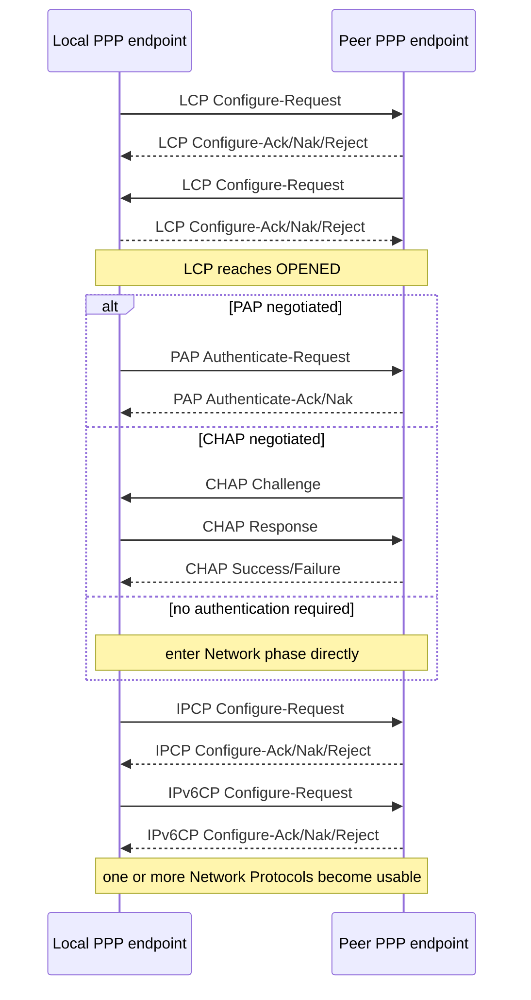
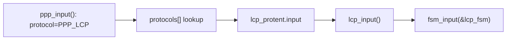
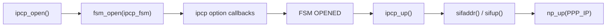
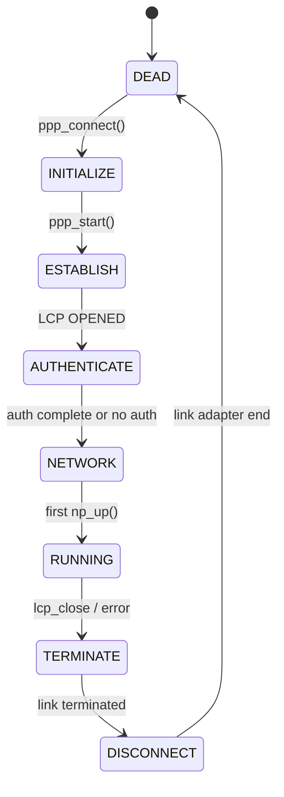
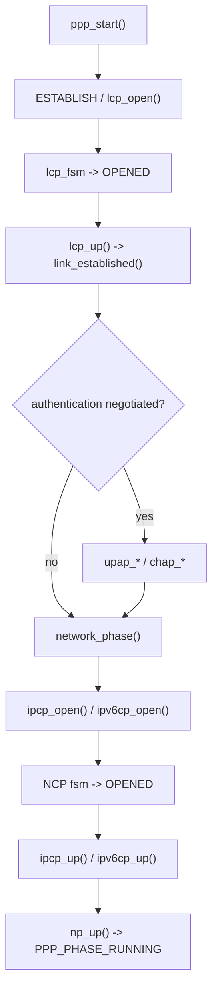
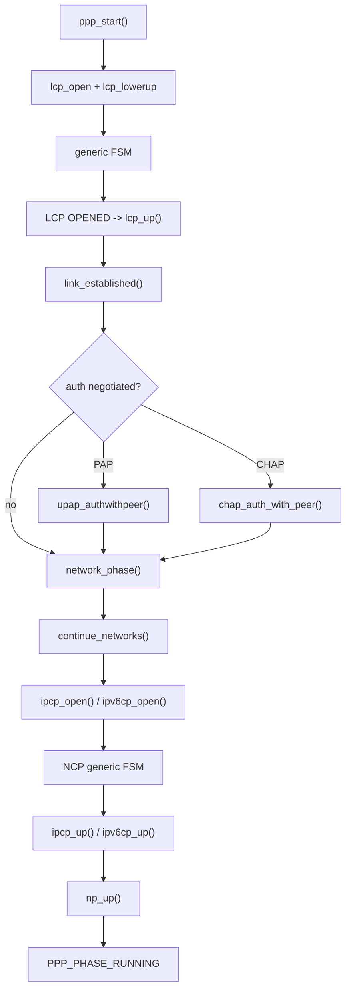

<meta name="referrer" content="no-referrer" />

# 教程 29：从 `lcp_open()` 到 `np_up()`——LCP、PAP/CHAP、IPCP、IPv6CP 与 PPP 协商状态机

> 摘要：沿 PPP phase 与 generic FSM 追踪 LCP 配置协商、PAP/CHAP 认证、Network phase、IPCP/IPv6CP 配置与网络协议启用，明确各层职责与 RUNNING 条件。

[TOC]

PPP 的控制面不是一个协议一次完成：LCP（Link Control Protocol，链路控制协议）先建立和配置 PPP link；如果双方协商要求认证，再由 PAP（Password Authentication Protocol）或 CHAP（Challenge Handshake Authentication Protocol）确认对端身份；链路进入 Network phase 后，IPCP（Internet Protocol Control Protocol）和 IPv6CP（IPv6 Control Protocol）分别配置 IPv4 与 IPv6 在这条 PPP link 上运行所需的网络层参数。[S3](#source-s3)[S4](#source-s4)[S5](#source-s5)[S6](#source-s6)[S7](#source-s7)

这些 control protocol 在 lwIP 中复用 generic FSM（Finite State Machine，有限状态机）推进 Configure-Request/Ack/Nak/Reject、timeout 与 OPENED 等状态，因此本文需要同时区分“整个 PPP session 的 phase”和“单个控制协议的 FSM state”。[S1](#source-s1)

Stage 28 已经把 PPPoS 串口字节流恢复成 PPP frame，并把 frame 交给 `ppp_input()`。Stage 29 从 `ppp_start()` 中已经出现的 `lcp_open()` / `lcp_lowerup()` 继续，追踪 PPP 为什么不会一收到串口字节就直接允许 IPv4/IPv6，而要依次经过 LCP、可选认证和 Network Control Protocol。[S1](#source-s1)[S3](#source-s3)

## 阅读源码前：建议按“PPP 总体 → 认证 → NCP（Network Control Protocol，网络控制协议）”顺序阅读

Stage 29 进入 PPP 最容易混淆的一层：多个 control protocol 共用一套协商框架，却负责不同阶段。下面资料适合提前阅读；正文仍会把每个会改变源码控制流的术语重新解释。[S3](#source-s3)[S4](#source-s4)[S5](#source-s5)[S6](#source-s6)[S7](#source-s7)

1. [RFC 1661 — The Point-to-Point Protocol (PPP)](https://www.rfc-editor.org/rfc/rfc1661.html)
   - 用途：建立 PPP phase（整个会话阶段）、LCP（链路控制协议）、Authentication（认证阶段）和 Network-Layer Protocol phase（网络层协议阶段）的总体顺序。
   - 建议重点：§3.2～§3.6 和 §4。
2. [RFC 1334 — PPP Authentication Protocols](https://www.rfc-editor.org/rfc/rfc1334.html) 与 [RFC 1994 — PPP Challenge Handshake Authentication Protocol (CHAP)](https://www.rfc-editor.org/rfc/rfc1994.html)
   - 用途：分别理解 PAP 的明文凭据请求/确认模型，以及 CHAP 的 Challenge/Response 模型。
3. [RFC 1332 — The PPP Internet Protocol Control Protocol (IPCP)](https://www.rfc-editor.org/rfc/rfc1332.html)
   - 用途：理解 IPv4 参数为什么在 LCP/认证之后再由 IPCP（Internet Protocol Control Protocol，IPv4 网络控制协议）协商。
4. [RFC 5072 — IP Version 6 over PPP](https://www.rfc-editor.org/rfc/rfc5072.html)
   - 用途：理解 IPv6CP（IPv6 Control Protocol）、Interface-Identifier（接口标识符）与 PPP IPv6 link-local（链路本地）地址之间的关系。
5. [lwIP PPP source](https://github.com/lwip-tcpip/lwip/tree/d08f4773edd0182b7910fc8f046eed82ffcd67c9/src/netif/ppp)
   - 用途：对照 `fsm.c`、`lcp.c`、`auth.c`、`ipcp.c`、`ipv6cp.c` 的职责边界。

## 先区分两套“状态”：PPP session phase 与单个 control protocol 的 FSM state

Stage 28 只负责把 serial bytes 恢复成 PPP packet。到了 Stage 29，PPP Core 还不能立即把 IPv4/IPv6 当作可用数据面，因为两端必须先把**链路本身是否可用、是否需要认证、网络层参数是否就绪**依次谈妥。[S3](#source-s3)

这里必须先分清两套状态：

- **PPP phase**：描述整个 PPP session 当前处在 Dead、Establish、Authenticate、Network、Running、Terminate 等哪一个大阶段。它回答“整条会话已经走到哪里”。
- **FSM（Finite State Machine，有限状态机）state**：LCP、IPCP、IPv6CP 各自拥有一份 Configure 协商状态，例如 `REQSENT`、`ACKRCVD`、`ACKSENT`、`OPENED`。它回答“某一个 control protocol 的 Configure 交换走到哪里”。[S1](#source-s1)[S3](#source-s3)

几个后文会第一次真正参与控制流的协议也先建立最低限度定义：

| 名称 | 角色 | 当前阶段解决什么问题 |
| --- | --- | --- |
| LCP（Link Control Protocol） | PPP 的链路控制协议 | 先协商 PPP link 的基本参数和能力；只有 LCP OPENED，后续认证/NCP 才有意义 |
| PAP（Password Authentication Protocol） | 简单的用户名/密码认证协议 | 一端发送 Authenticate-Request，另一端返回 Ack/Nak；凭据不会通过 Challenge 保护 [S4](#source-s4) |
| CHAP（Challenge Handshake Authentication Protocol） | Challenge/Response 认证协议 | 验证方先发 Challenge，对端计算 Response，再返回 Success/Failure [S5](#source-s5) |
| NCP（Network Control Protocol） | 一类网络层控制协议的统称 | 在 PPP link 已建立后，为某个 Network-Layer Protocol 配置参数 |
| IPCP（Internet Protocol Control Protocol） | IPv4 对应的 NCP | 协商/确认 IPv4 参数，OPENED 后才把 IPv4 data plane 标记为可用 [S6](#source-s6) |
| IPv6CP（IPv6 Control Protocol） | IPv6 对应的 NCP | 协商 IPv6 Interface-Identifier，并据此形成 PPP link-local 地址 [S7](#source-s7) |

Configure 协商还会反复出现四类消息：**Configure-Request** 提出一组 option；**Configure-Ack** 表示原样接受；**Configure-Nak** 表示当前值不接受但给出可协商替代；**Configure-Reject** 表示某个 option 本身不能接受。lwIP 的 generic `fsm.c` 正是把这些通用动作抽出来复用。[S1](#source-s1)[S3](#source-s3)

## Stage 29 协议总流程：LCP → 可选认证 → IPCP/IPv6CP → Network Protocol up



PAP 与 CHAP 在图中被画成同一个“认证阶段”，但二者报文模型并不相同；正文到达各自源码时会单独展开。IPCP 与 IPv6CP 也不是“必须同时成功才算 PPP 成功”的简单绑定关系，lwIP 会分别通过 `np_up()` 记录哪些 Network Protocol 已经 up。[S1](#source-s1)

## 协议阶段与 lwIP 实现的双轨映射

| PPP 阶段 | 协议动作 | lwIP 主要函数 | 关键状态/对象 | 成功后进入 |
| --- | --- | --- | --- | --- |
| Establish | 打开 LCP 并通知 lower layer ready | `ppp_start()` → `lcp_open()` / `lcp_lowerup()` | `pcb->phase`、`pcb->lcp_fsm` | LCP Configure FSM |
| LCP Configure | Req/Ack/Nak/Reject 与 timeout/retry | `fsm_open()`、`fsm_input()` + LCP callbacks | per-protocol `fsm` | `lcp_up()` |
| Authentication | 根据 LCP option 选择 PAP/CHAP 等 | `link_established()` → `upap_*` / `chap_*` | `auth_pending`、LCP negotiated options | `network_phase()` |
| Network | 启动一个或多个 NCP | `network_phase()` / `start_networks()` | `num_np_open`、各 NCP FSM | IPCP/IPv6CP Configure |
| IPCP OPENED | IPv4 network protocol 可用 | `ipcp_up()` → `np_up(PPP_IP)` | IPv4 negotiated options | Stage 30 的地址/DNS应用 |
| IPv6CP OPENED | IPv6 network protocol 可用 | `ipv6cp_up()` → `np_up(PPP_IPV6)` | Interface-Identifier、IPv6 state | Stage 30 的 link lifecycle |
| Running | 至少一个 Network Protocol 已 up | `np_up()` | `num_np_up`、PPP phase | IP 数据面开始通过 gate |

后文从 Stage 28 的 `ppp_start()` 接着走，始终把 generic FSM、具体 control protocol 和 session phase 三者分开。

## 1. 当前 example 打开 PAP/CHAP，但是否实际认证由协商结果决定

当前 `contrib/examples/example_app/lwipopts.h`：[S2](#source-s2)

```c
#define PAP_SUPPORT             1
#define CHAP_SUPPORT            1
#define MSCHAP_SUPPORT          0
```

继续阅读 `pppos_example_init()`：PPPoS example 只有在定义测试宏时才主动设置 CHAP credential。[S2](#source-s2)

```c
#ifdef LWIP_PPP_CHAP_TEST
  ppp_set_auth(ppp, PPPAUTHTYPE_CHAP, "lwip", "mysecret");
#endif
```

所以“编译了 PAP/CHAP”与“当前 peer 一定要求认证”不是一回事。真正是否进入 PAP/CHAP，取决于 LCP negotiation 后双方接受的 authentication protocol option。[S1](#source-s1)[S3](#source-s3)

## 2. `ppp_start()` 同时触发 LCP open 与 lower-up

Stage 28 的终点是：[S1](#source-s1)

```c
void ppp_start(ppp_pcb *pcb) {
  new_phase(pcb, PPP_PHASE_ESTABLISH);
  lcp_open(pcb);
  lcp_lowerup(pcb);
}
```

这里有两个不同事件：

- `lcp_open()`：上层说“这个协议允许开始”；
- `lcp_lowerup()`：下层 serial link 已可用。

二者都进入 generic FSM，但对应不同事件入口。

## 3. RFC 1661 的 Configure FSM 在 lwIP 中由 `fsm.c` 统一实现

RFC 1661 已经给出 LCP automaton 和 Configure packet 的状态/事件语义；这里不再逐状态教学，而只定位 lwIP 的复用关系。[S1](#source-s1)[S3](#source-s3)

`fsm.h` 保存 RFC automaton 对应的 10 个 implementation state：

```text
INITIAL / STARTING / CLOSED / STOPPED / CLOSING
STOPPING / REQSENT / ACKRCVD / ACKSENT / OPENED
```

LCP、IPCP、IPv6CP 各自持有一份 `fsm`，但 Configure-Request/Ack/Nak/Reject、timeout/retry 与状态迁移统一进入 `fsm_open()`、`fsm_lowerup()`、`fsm_input()` 和 timer path。协议之间真正不同的是 option callbacks 与 OPENED 后的 `up()` 行为。


这样阅读后续源码时，重点不再是背 RFC 状态名，而是确认“当前是哪一份 `fsm`、哪一个 option callback、OPENED 后进入哪个 protocol-specific `up()`”。

## 4. LCP `protent` 把 protocol number 接到 FSM

`ppp_input()` 读到 `PPP_LCP` 后，通过 `protocols[]` 找到 `lcp_protent`。该表把 generic PPP dispatcher 与 LCP 实现连接起来：[S1](#source-s1)

```c
const struct protent lcp_protent = {
    PPP_LCP,
    lcp_init,
    lcp_input,
    lcp_protrej,
    lcp_lowerup,
    lcp_lowerdown,
    lcp_open,
    lcp_close,
#if PRINTPKT_SUPPORT
    lcp_printpkt,
#endif
#if PPP_DATAINPUT
    NULL,
#endif
#if PRINTPKT_SUPPORT
    "LCP",
    NULL,
#endif
#if PPP_OPTIONS
    lcp_option_list,
    NULL,
#endif
#if DEMAND_SUPPORT
    NULL,
    NULL
#endif
};
```

因此 RX bridge 是：



## 5. `lcp_up()` 把 LCP 协商结果写回 PPPoS data path

LCP option 的含义由 RFC 1661/1662 定义；这里直接看 lwIP 在 FSM 到达 `OPENED` 后怎样消费结果。[S1](#source-s1)[S3](#source-s3)

`lcp_up()` 从 negotiated option 计算 MTU/MRU，并把 async map、PFC、ACFC 下发给 Stage 28 的 PPPoS adapter：[S1](#source-s1)

```c
mtu = ho->neg_mru? ho->mru: PPP_DEFMRU;
mru = go->neg_mru? LWIP_MAX(wo->mru, go->mru): PPP_DEFMRU;
ppp_netif_set_mtu(pcb, LWIP_MIN(LWIP_MIN(mtu, mru), ao->mru));

ppp_send_config(pcb, mtu,
                (ho->neg_asyncmap? ho->asyncmap: 0xffffffff),
                ho->neg_pcompression, ho->neg_accompression);
ppp_recv_config(pcb, mru,
                (pcb->settings.lax_recv? 0: go->neg_asyncmap? go->asyncmap: 0xffffffff),
                go->neg_pcompression, go->neg_accompression);
```

随后 `lcp_up()` 调用：

```c
link_established(pcb);
```

因此 Stage 28 的 `pcomp`、`accomp`、`in_accm/out_accm` 不是 PPPoS 自己决定的固定参数，而是 LCP control plane 写回 serial data path 的协商结果。

## 6. `link_established()` 把 phase 切到 AUTHENTICATE

进入 `link_established()` 后，先通知其他 protocol“LCP 已 up”，再根据 LCP negotiation 结果决定认证方向：[S1](#source-s1)

```c
new_phase(pcb, PPP_PHASE_AUTHENTICATE);
auth = 0;
```

如果对端要求本端认证，`ho` 中相应 flag 会触发：

```text
PAP  -> upap_authwithpeer()
CHAP -> chap_auth_with_peer()
EAP  -> eap_authwithpeer()
```

如果本端作为 server 要求 peer 认证，则使用 `go` 中协商出的方向触发 `upap_authpeer()` / `chap_auth_peer()` 等。[S1](#source-s1)

没有任何认证待完成时，直接进入 `network_phase()`。

## 7. PAP 标准报文在 lwIP 中落到 `upap_*` 哪些函数

PAP 的两次交互和 packet format 已由 RFC 1334 §2 定义；本文只保留调用映射。[S1](#source-s1)[S4](#source-s4)

client 入口 `upap_authwithpeer()` 保存 username/password，并在 lower layer ready 后进入 `upap_sauthreq()`，对应标准的 Authenticate-Request：[S1](#source-s1)

```c
void upap_authwithpeer(ppp_pcb *pcb, const char *user, const char *password) {
    if(!user || !password)
        return;

    pcb->upap.us_user = user;
    pcb->upap.us_userlen = (u8_t)LWIP_MIN(strlen(user), 0xff);
    pcb->upap.us_passwd = password;
    pcb->upap.us_passwdlen = (u8_t)LWIP_MIN(strlen(password), 0xff);
    pcb->upap.us_transmits = 0;

    if (pcb->upap.us_clientstate == UPAPCS_INITIAL ||
        pcb->upap.us_clientstate == UPAPCS_PENDING) {
        pcb->upap.us_clientstate = UPAPCS_PENDING;
        return;
    }

    upap_sauthreq(pcb);
}
```

因此源码阅读重点是 credential 保存位置、pending state 与实际 send call，而不是再次解释 PAP 为什么是 two-way handshake。

## 8. PAP Ack 最终进入 `auth_withpeer_success()`

当本端收到 Authenticate-Ack，PAP handler 把 client state 切到 OPEN，并调用：

```text
auth_withpeer_success(pcb, PPP_PAP, 0)
```

`auth_withpeer_success()` 清除对应 `auth_pending` bit。只有所有需要的认证都完成时，才进入 `network_phase()`。[S1](#source-s1)

```text
PAP success
  or CHAP success
        ↓
auth_pending 清相应 bit
        ↓
auth_pending == 0 ?
        ↓ yes
network_phase()
```

## 9. CHAP 标准四类消息怎样进入 `chap_input()` 分发

CHAP 的 Challenge/Response/Success/Failure 与 packet format 直接见 RFC 1994；这里仅追 lwIP parser 如何映射这些 Code。[S1](#source-s1)[S5](#source-s5)

`chap_input()` 按 Code 分发：[S1](#source-s1)

```c
switch (code) {
case CHAP_CHALLENGE:
    chap_respond(pcb, id, pkt, len);
    break;
case CHAP_RESPONSE:
    chap_handle_response(pcb, id, pkt, len);
    break;
case CHAP_SUCCESS:
case CHAP_FAILURE:
    chap_handle_status(pcb, code, id, pkt, len);
    break;
}
```

client 收到 `CHAP_SUCCESS` 后，`chap_handle_status()` 最终调用：

```c
auth_withpeer_success(pcb, PPP_CHAP, pcb->chap_client.digest->code);
```

认证失败则进入 `auth_withpeer_fail()` 并触发 link close path。Challenge 的 hash 计算属于 CHAP 协议定义，本篇不再展开其算法，只保留 lwIP 从 Code 到 handler 再到 PPP phase 推进的链路。

## 10. `link_established()` 为什么已经知道该走 PAP 还是 CHAP

RFC 1661/1994 已经规定 authentication protocol 通过 LCP Authentication-Protocol option 协商；lwIP 的实现结果保存在 LCP negotiated options 中。[S1](#source-s1)[S3](#source-s3)[S5](#source-s5)

因此源码顺序是：

```text
LCP option callbacks
        ↓
negotiated auth flags in go/ho
        ↓
lcp_up()
        ↓
link_established()
        ↓
upap_auth*() / chap_auth_*() / no-auth
```

PAP/CHAP packet 的 PPP Protocol value 只负责 `ppp_input()` 收包后的 demux；“本次 session 是否要求认证、要求哪一种”在更早的 LCP negotiation 中已经决定。

## 11. `network_phase()` 不直接配置 IP，而是启动 NCP

认证完成后 `network_phase()` 调用 `start_networks()`，再进入 `continue_networks()`。[S1](#source-s1)

`start_networks()` 先执行 phase 切换；在 CCP/ECP/MPPE 的条件分支处理后，函数尾部只有满足当前加密条件才调用 `continue_networks()`。下面分别保留这两个连续源码片段：[S1](#source-s1)

继续阅读 `start_networks()` 的 phase 切换：

```c
new_phase(pcb, PPP_PHASE_NETWORK);
```

继续阅读 `start_networks()` 的函数尾部：

```c
if (1
#if ECP_SUPPORT
    && !ecp_gotoptions[unit].required
#endif
#if MPPE_SUPPORT
    && !pcb->ccp_gotoptions.mppe
#endif
    )
  continue_networks(pcb);
```

`continue_networks()` 遍历 `protocols[]`，对真正的 network protocols 调用各自 `open()`：[S1](#source-s1)

```c
for (i = 0; (protp = protocols[i]) != NULL; ++i)
    if (protp->protocol < 0xC000
        && protp->open != NULL) {
        (*protp->open)(pcb);
        ++pcb->num_np_open;
    }
```

对于本篇主线，就是：

```text
IPCP  -> ipcp_open()
IPv6CP -> ipv6cp_open()
```

## 12. IPCP 与 LCP 复用同一个 `fsm_open()`

`ipcp_open()` 本身只有：[S1](#source-s1)

```c
static void ipcp_open(ppp_pcb *pcb) {
    fsm_open(&pcb->ipcp_fsm);
}
```

收到 IPCP frame 时：

```c
static void ipcp_input(ppp_pcb *pcb, u_char *p, int len) {
    fsm_input(&pcb->ipcp_fsm, p, len);
}
```

这和 LCP 的 control-flow skeleton 完全相同：差异主要在各 protocol 的 option callbacks，而不是 FSM engine 本身。

## 13. RFC 1332 的 IPCP option 怎样进入 `ipcp.c` callbacks

IPCP 的 NCP 语义与 Configuration Options 直接见 RFC 1332 §2～§3；这里只追 lwIP 的 implementation mapping。[S1](#source-s1)[S6](#source-s6)

当前 `ipcp_fsm` 仍通过 `fsm_open()` / `fsm_input()` 交换 Configure packet；区别在 `ipcp.c` 的 option callbacks 会读取/更新 local/remote IPv4 address、compression 以及 DNS request 等状态。FSM 到达 OPENED 后进入 `ipcp_up()`，再把协商结果写入 netif，并最终调用 `np_up(PPP_IP)`。[S1](#source-s1)



Stage 30 再继续展开 `sifaddr()`、DNS 与 route，避免在本篇把 IPCP 标准字段表重新复制一遍。

## 14. RFC 5072 的 IPv6CP Interface-Identifier 怎样落到 `ipv6cp.c`

IPv6CP 的职责、Interface-Identifier option 与 PPP link-local address 形成方式直接见 RFC 5072 §3～§5；本文只看 lwIP 选择了哪些 option。[S1](#source-s1)[S7](#source-s7)

`ipv6cp_init()` 当前默认启用 Interface-Identifier negotiation：[S1](#source-s1)

```c
wo->accept_local = 1;
wo->neg_ifaceid = 1;
ao->neg_ifaceid = 1;
```

这说明当前 lwIP `ipv6cp.c` 的主协商对象是 PPP link 两端的 IPv6 interface identifier。它与 Ethernet 上的 RA/SLAAC、DHCPv6 是不同实现路径；更完整的协议区别由 RFC 5072 与 Stage 15 承担，本篇不再扩写 IPv6 地址配置教程。

## 15. `ipv6cp_up()` 先生成 link-local，再 `np_up(PPP_IPV6)`

IPv6CP FSM 到 OPENED 后，`ipv6cp_up()` 检查双方 Interface-Identifier，然后通过 `sif6addr()` 设置本地 link-local，再 `sif6up()`：[S1](#source-s1)

```c
if (!sif6addr(f->pcb, go->ourid, ho->hisid)) {
    ipv6cp_close(f->pcb, "Interface configuration failed");
    return;
}

if (!sif6up(f->pcb)) {
    ipv6cp_close(f->pcb, "Interface configuration failed");
    return;
}

np_up(f->pcb, PPP_IPV6);
pcb->ipv6cp_is_up = 1;
```

所以“IPv6CP OPENED”与“PPP session 整体 RUNNING”之间仍隔着 `sif6up()` / `np_up()`。

## 16. `np_up()` 是 PPP high-level RUNNING 的关键桥

IPCP 或 IPv6CP 任一个 network protocol 首次 up 时都会调用 `np_up()`。[S1](#source-s1)

下面是 `np_up()` 在不启用 idle/max-connect/max-octets 附加定时器时的执行路径阅读版；它裁掉的是当前主线不执行的条件编译分支，不是未经修改的完整上游函数：[S1](#source-s1)

```c
if (pcb->num_np_up == 0) {
    new_phase(pcb, PPP_PHASE_RUNNING);
}
++pcb->num_np_up;
```

因此：

```text
IPCP up first
    -> PPP_PHASE_RUNNING
    -> num_np_up = 1
IPv6CP later up
    -> phase already RUNNING
    -> num_np_up = 2
```

如果只编译/启用 IPv4，一个 IPCP up 就足以让 session 进入 RUNNING。

## 17. PPP phase 的主线状态图

当前实现的 phase 定义比基础 RFC phase 更细，包括 HOLDOFF、INITIALIZE、DISCONNECT 等 implementation state。[S1](#source-s1)

主成功路径可以压缩为：



这里 `AUTHENTICATE` 可以非常短：如果 LCP 没有协商出任何认证，`link_established()` 会直接进入 `network_phase()`。[S1](#source-s1)

## 18. 为什么收到 IP packet 前要检查 phase/LCP state

`ppp_input()` 对 RX 做两层 gate：[S1](#source-s1)

继续阅读 `ppp_input()`。第一层：LCP 未 OPEN 时，除 LCP 外的 packet 全部丢弃：

```c
if (protocol != PPP_LCP && pcb->lcp_fsm.state != PPP_FSM_OPENED) {
    goto drop;
}
```

继续阅读 `ppp_input()`。第二层：认证阶段及之前，只允许 LCP/LQR/PAP/CHAP/EAP：[S1](#source-s1)

```c
if (pcb->phase <= PPP_PHASE_AUTHENTICATE
   && !(protocol == PPP_LCP
        || protocol == PPP_PAP
        || protocol == PPP_CHAP)) {
    goto drop;
}
```

所以即使串口上已经出现合法 `PPP_IP` frame，在 authentication 尚未完成时也不会被送进 `ip4_input()`。

## 19. LCP option negotiation 怎样反向改变 Stage 28 的 framing

Stage 28 的 `pppos->pcomp`、`accomp`、`in_accm/out_accm` 不是固定常量。LCP OPEN 后，`lcp_up()` 调用：

```text
ppp_send_config()
    -> link_cb->send_config()
    -> pppos_send_config()

ppp_recv_config()
    -> link_cb->recv_config()
    -> pppos_recv_config()
```

因此 protocol negotiation 的结果会直接改变 serial frame 编码方式。[S1](#source-s1)

这就是为什么 PPP Core 与 PPPoS framing 不能完全割裂：LCP control plane 会配置 link adapter data path。

## 20. 把 RFC phase 映射回 lwIP 的正常成功路径

RFC 1661 已经提供 PPP phase diagram；下面这张图不再表示“PPP 协议教程”，而是把本篇已经读过的 lwIP 函数挂回标准 phase，便于确认源码链没有断点。[S1](#source-s1)[S3](#source-s3)



PAP、CHAP、IPCP、IPv6CP 是否全部出现由 build config 与 LCP/NCP negotiation 决定；图只表达本篇源码中可能形成的主成功链。

## 21. 当前 example 的认证能力边界

当前 example config：[S2](#source-s2)

| 能力 | 当前 compile config |
| --- | --- |
| PAP | enabled |
| CHAP | enabled |
| MSCHAP | disabled |
| VJ | disabled |
| CCP | disabled |
| PPPoS | enabled |

因此本篇重点只把 PAP 与 basic CHAP 作为当前可执行能力解释。源码树里存在更多 EAP/MSCHAP/CCP/MPPE 路径，但当前 example config 不应被描述成默认都启用。

## 22. Stage 29 完整调用链



## 23. 当前实现边界

1. PAP/CHAP 是否实际执行由 LCP negotiation 决定，不由 compile flag 单独决定；
2. PPP high-level phase 与 per-protocol generic FSM 是两层状态机；
3. LCP 负责 link configuration，不负责 IPv4/IPv6 address；
4. PAP 与 CHAP 是不同认证协议，PAP credential exchange 不具备 CHAP challenge-response 语义；
5. IPCP 与 IPv6CP 复用 generic FSM，但协商 option 集不同；
6. IPv6CP 主要协商 IPv6 over PPP link 参数/Interface-Identifier，不等于 DHCPv6/SLAAC；
7. `PPP_PHASE_RUNNING` 在第一个 network protocol `np_up()` 时进入，不要求 IPv4 与 IPv6 都已经 up；
8. 地址写入 `netif`、DNS/default route、断线与 reconnect 留到 Stage 30。

## 资料来源

<a id="source-s1"></a>
### [S1] lwIP PPP LCP/Auth/NCP/FSM 源码
- 类型：目标版本上游源码
- 版本：commit `d08f4773edd0182b7910fc8f046eed82ffcd67c9`
- 定位：`src/netif/ppp/ppp.c`、`fsm.c`、`lcp.c`、`auth.c`、`upap.c`、`chap-new.c`、`ipcp.c`、`ipv6cp.c`；`src/include/netif/ppp/fsm.h`、`ppp.h`、`ppp_impl.h`
- URL/文档：[lwIP PPP source](https://github.com/lwip-tcpip/lwip/tree/d08f4773edd0182b7910fc8f046eed82ffcd67c9/src/netif/ppp)
- 使用位置：“PPP phase”“generic FSM”“LCP up”“PAP/CHAP success”“network_phase”“IPCP/IPv6CP”“np_up”
- 支撑内容：证明当前 pinned PPP control-plane 的真实状态机、callback 与 protocol transition

<a id="source-s2"></a>
### [S2] lwIP PPP example/config
- 类型：目标版本上游 example/config
- 版本：commit `d08f4773edd0182b7910fc8f046eed82ffcd67c9`
- 定位：`contrib/examples/ppp/pppos_example.c`；`contrib/examples/example_app/lwipopts.h`
- URL/文档：[lwIP PPP examples](https://github.com/lwip-tcpip/lwip/tree/d08f4773edd0182b7910fc8f046eed82ffcd67c9/contrib/examples/ppp)
- 使用位置：“PAP/CHAP compile config”“example credential 设置”
- 支撑内容：限定当前 example 实际启用的 PPP authentication/compression 能力

<a id="source-s3"></a>
### [S3] RFC 1661：The Point-to-Point Protocol (PPP)
- 类型：IETF 标准规范
- 版本：RFC 1661，1994
- URL/文档：[RFC 1661](https://www.rfc-editor.org/rfc/rfc1661.html)
- 使用位置：“建议提前阅读”“LCP”“PPP phases”“Authentication-Protocol option”“NCP”
- 支撑内容：提供 PPP link establishment、authentication 与 network-layer protocol configuration 的规范语义

<a id="source-s4"></a>
### [S4] RFC 1334：PPP Authentication Protocols
- 类型：IETF 标准规范
- 版本：RFC 1334，1992；文档整体已被 RFC 1994 标记为 Obsoleted，本篇仅使用其中 §2 的 PAP 定义
- URL/文档：[RFC 1334](https://www.rfc-editor.org/rfc/rfc1334.html)
- 使用位置：“建议提前阅读”“PAP Authenticate-Request/Ack/Nak”“PAP credential exchange”
- 支撑内容：提供 PAP 的协议语义，并用于与 CHAP 的 challenge-response 区分

<a id="source-s5"></a>
### [S5] RFC 1994：PPP Challenge Handshake Authentication Protocol (CHAP)
- 类型：IETF 标准规范
- 版本：RFC 1994，1996
- URL/文档：[RFC 1994](https://www.rfc-editor.org/rfc/rfc1994.html)
- 使用位置：“建议提前阅读”“CHAP Challenge/Response/Success/Failure”
- 支撑内容：提供 CHAP challenge-response authentication 的标准报文与状态语义

<a id="source-s6"></a>
### [S6] RFC 1332：The PPP Internet Protocol Control Protocol (IPCP)
- 类型：IETF 标准规范
- 版本：RFC 1332，1992
- URL/文档：[RFC 1332](https://www.rfc-editor.org/rfc/rfc1332.html)
- 使用位置：“建议提前阅读”“IPCP”“IPv4 address negotiation”“IP-Compression-Protocol”
- 支撑内容：提供 IPCP 的 Network Control Protocol 语义，用于对照 lwIP `ipcp.c`

<a id="source-s7"></a>
### [S7] RFC 5072：IP Version 6 over PPP
- 类型：IETF 标准规范
- 版本：RFC 5072，2007
- URL/文档：[RFC 5072](https://www.rfc-editor.org/rfc/rfc5072.html)
- 使用位置：“建议提前阅读”“IPv6CP”“Interface-Identifier”“IPv6 over PPP”
- 支撑内容：提供 IPv6CP 与 IPv6 datagram over PPP 的标准语义，避免把 IPv6CP 与 DHCPv6/SLAAC 混淆
