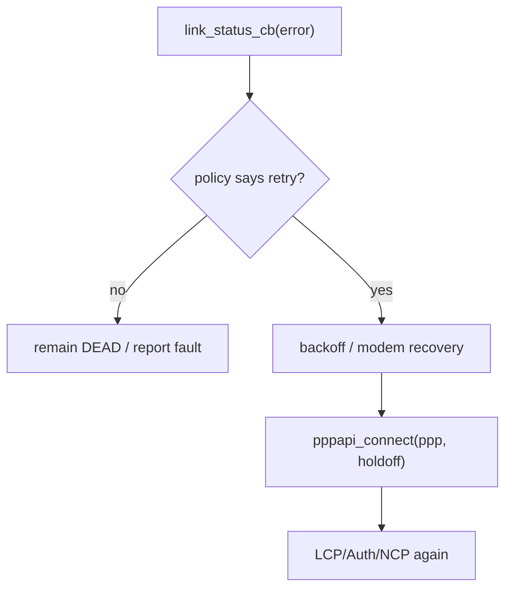
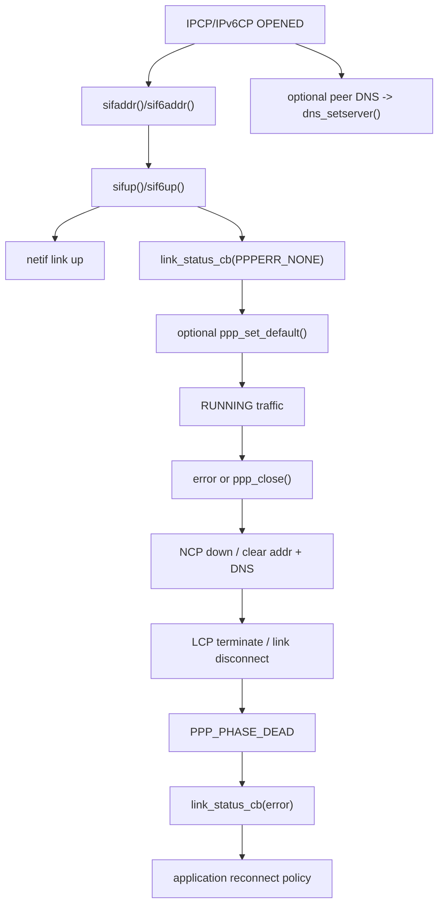

<meta name="referrer" content="no-referrer" />

# 教程 30：从 `ipcp_up()` 到 `ppp_link_status_cb()`——PPP 地址、DNS、Default Route、Link Down 与 Reconnect

> 摘要：从 IPCP/IPv6CP OPENED 追踪 netif 地址、peer DNS、default netif、link up/down、PPPERR 回调、关闭与应用侧重连责任，建立 PPP 网络配置生命周期。

[TOC]

Stage 29 的终点是 IPCP/IPv6CP 进入 `OPENED`，随后 `np_up()` 把 PPP session 推到 `PPP_PHASE_RUNNING`。Stage 30 继续回答更接近产品代码的问题：IP 地址到底写到哪里、peer DNS 何时生效、PPP 会不会自动成为默认路由、断线时地址/DNS 如何清理，以及谁负责重新连接。[S1](#source-s1)

## 1. `ipcp_up()` 先确认 negotiated IPv4 参数，再配置 `netif`

IPCP FSM 到 OPENED 后进入 `ipcp_up()`。在调用 `sifaddr()` 之前，当前实现先检查 local/remote address 是否有效，并根据 negotiation 结果决定最终 `go->ouraddr` 与 `ho->hisaddr`。[S1](#source-s1)[S4](#source-s4)

正常非 demand path 的关键调用是：[S1](#source-s1)

```c
mask = get_mask(go->ouraddr);

if (!sifaddr(pcb, go->ouraddr, ho->hisaddr, mask)) {
    ipcp_close(f->pcb, "Interface configuration failed");
    return;
}

if (!sifup(pcb)) {
    ipcp_close(f->pcb, "Interface configuration failed");
    return;
}
```

所以“IPCP negotiation 完成”和“lwIP `netif` 已可发送 IPv4”之间还存在实际 interface configuration。

## 2. `sifaddr()` 把 peer address 写进 `netif->gw`

进入 `sifaddr()`：[S1](#source-s1)

```c
int sifaddr(ppp_pcb *pcb, u32_t our_adr, u32_t his_adr, u32_t netmask) {
  ip4_addr_t ip, nm, gw;

  ip4_addr_set_u32(&ip, our_adr);
  ip4_addr_set_u32(&nm, netmask);
  ip4_addr_set_u32(&gw, his_adr);
  netif_set_addr(pcb->netif, &ip, &nm, &gw);
  return 1;
}
```

这里建立的是 point-to-point interface 的 lwIP IPv4 view：

```text
netif IPv4 address = our_adr
netif netmask      = get_mask(...)
netif gateway      = his_adr
```

在 PPP 上，`his_adr` 是 peer IPv4 address，不是 Ethernet 场景中“同一 LAN 上 ARP 可解析的路由器 MAC”。PPP data path 没有 ARP/Ethernet neighbor resolution 这一层。[S3](#source-s3)[S4](#source-s4)

## 3. 当前 `get_mask()` 实际返回广播掩码常量

当前 target 中 `get_mask()` 的传统 classful/system-interface 推导代码被 `#if 0` 禁用，函数最后返回：[S1](#source-s1)

```c
LWIP_UNUSED_ARG(addr);
return IPADDR_BROADCAST;
```

也就是 `0xffffffff`。这反映 PPP point-to-point netif 不依赖 Ethernet subnet reachability 选择 peer；不要把这里的 netmask 行为机械等同于 Stage 18 的 Ethernet subnet route match。

## 4. `sifup()` 同时改变 PPP protocol gate 与 netif link state

`sifup()`：[S1](#source-s1)

```c
int sifup(ppp_pcb *pcb) {
  pcb->if4_up = 1;
  pcb->err_code = PPPERR_NONE;
  netif_set_link_up(pcb->netif);

  pcb->link_status_cb(pcb, pcb->err_code, pcb->ctx_cb);
  return 1;
}
```

这里有三个不同层次的状态变化：

1. `pcb->if4_up = 1`：PPP Core 允许 `PPP_IP` data plane output；
2. `netif_set_link_up()`：lwIP `netif` link state 变成 up；
3. `link_status_cb(... PPPERR_NONE ...)`：通知应用 PPP network protocol 已经成功可用。

`netif_set_up()` 在 `ppp_new()` 中已经被调用过；所以 admin up 与 PPP negotiated link up 仍然是不同状态，和 Stage 22 的 Ethernet admin/link 区分一致。[S1](#source-s1)

## 5. `ppp_link_status_cb()` 才是 example 获取 negotiated 地址的应用入口

upstream example 在 `PPPERR_NONE` 分支读取 `ppp_netif(pcb)`：[S2](#source-s2)

```c
case PPPERR_NONE:
{
    fprintf(stderr, "ppp_link_status_cb: PPPERR_NONE\n\r");
#if LWIP_IPV4
    fprintf(stderr, "   our_ip4addr = %s\n\r", ip4addr_ntoa(netif_ip4_addr(pppif)));
    fprintf(stderr, "   his_ipaddr  = %s\n\r", ip4addr_ntoa(netif_ip4_gw(pppif)));
    fprintf(stderr, "   netmask     = %s\n\r", ip4addr_ntoa(netif_ip4_netmask(pppif)));
#endif
}
break;
```

这说明应用不应该在 `ppp_connect()` 返回 `ERR_OK` 后立刻假设地址已经可用。`ppp_connect()` 只表示 negotiation 已成功启动；真正 up 的异步证据是 status callback。

## 6. peer DNS 不是默认自动采用，取决于 `usepeerdns`

公共 API 宏：[S1](#source-s1)

```c
#define ppp_set_usepeerdns(ppp, boolval) (ppp->settings.usepeerdns = boolval)
```

IPCP option 初始化会根据这个 setting 请求 DNS address。`ipcp_up()` 在 negotiation 完成后只有满足：[S1](#source-s1)

```c
if (pcb->settings.usepeerdns && (go->dnsaddr[0] || go->dnsaddr[1])) {
    sdns(pcb, go->dnsaddr[0], go->dnsaddr[1]);
}
```

才把 peer DNS 写入 lwIP DNS subsystem。

## 7. `sdns()` 最终落到 `dns_setserver()`

`sdns()` 很直接：[S1](#source-s1)

```c
int sdns(ppp_pcb *pcb, u32_t ns1, u32_t ns2) {
  ip_addr_t ns;
  LWIP_UNUSED_ARG(pcb);

  ip_addr_set_ip4_u32_val(ns, ns1);
  dns_setserver(0, &ns);
  ip_addr_set_ip4_u32_val(ns, ns2);
  dns_setserver(1, &ns);
  return 1;
}
```

因此 PPP peer DNS 与 Stage 14 DNS cache/query 使用的是同一套 global DNS server slots。PPP 并没有单独创建一个“只属于这个 netif 的 DNS resolver”。

这也意味着 multi-netif 产品必须自己考虑 DNS source policy：如果 Ethernet DHCP 与 PPP IPCP 都写 global DNS server slots，最后生效者可能改变全局 resolver configuration。

## 8. IPCP down 会只清理自己曾设置的 DNS

`ipcp_down()` 调用：[S1](#source-s1)

```c
sifdown(pcb);
ipcp_clear_addrs(pcb, go->ouraddr, ho->hisaddr, 0);
#if LWIP_DNS
cdns(pcb, go->dnsaddr[0], go->dnsaddr[1]);
#endif
```

`cdns()` 不是无条件把所有 DNS 清零，而是先比较当前 slot 是否仍等于该 PPP session 的 DNS；匹配才清掉：[S1](#source-s1)

```c
nsa = dns_getserver(0);
ip_addr_set_ip4_u32_val(nsb, ns1);
if (ip_addr_eq(nsa, &nsb)) {
  dns_setserver(0, IP_ADDR_ANY);
}
```

这个细节避免了 PPP down 时误删已经被其他机制替换过的不同 DNS address。

## 9. `ppp_set_default()` 不是 IPCP 自动动作

公共 API 定义：[S1](#source-s1)

```c
#define ppp_set_default(ppp) netif_set_default(ppp->netif)
```

也就是说，PPP “成为默认路由”本质上只是把它的 `netif` 设为 `netif_default`。Stage 18 已经解释过 IPv4 route miss 最后如何回退到 `netif_default`。

当前 `ipcp_up()` 中传统 pppd 风格的 `sifdefaultroute()` 逻辑在 lwIP port 里被 `#if 0` 禁用。[S1](#source-s1)

因此：

```text
IPCP OPENED
  -> PPP IPv4 netif address/link up
  != automatically netif_default
```

应用若希望 PPP 承担 default route，需要显式调用 `ppp_set_default()`；在非 Core thread 中则使用 thread-safe wrapper `pppapi_set_default()`。[S1](#source-s1)

## 10. `pppapi_*` 是非 Core thread 调 PPP API 的桥

Stage 11 已经讲过 lwIP Core context。当前 `pppapi.c` 使用 `tcpip_api_call()` 把操作切到 `tcpip_thread`。[S1](#source-s1)

例如 `pppapi_connect()`：[S1](#source-s1)

```c
err_t
pppapi_connect(ppp_pcb *pcb, u16_t holdoff)
{
  err_t err;
  PPPAPI_VAR_DECLARE(msg);
  PPPAPI_VAR_ALLOC(msg);

  PPPAPI_VAR_REF(msg).msg.ppp = pcb;
  PPPAPI_VAR_REF(msg).msg.msg.connect.holdoff = holdoff;
  err = tcpip_api_call(pppapi_do_ppp_connect, &PPPAPI_VAR_REF(msg).call);
  PPPAPI_VAR_FREE(msg);
  return err;
}
```

进入 `pppapi_do_ppp_connect()` worker，真正调用：

```c
return ppp_connect(msg->msg.ppp, msg->msg.msg.connect.holdoff);
```

所以产品应用线程如果不在 Core context，应该使用 `pppapi_*` 版本，而不是绕过 locking/context contract 直接调内部 API。

## 11. IPv6CP 配置的是 link-local，不是 IPv6 default route

Stage 29 已经看到 `ipv6cp_up()`。它通过 `sif6addr()` 把 Interface-Identifier 拼成 link-local：[S1](#source-s1)[S5](#source-s5)

```c
IN6_LLADDR_FROM_EUI64(ip6, our_eui64);
netif_ip6_addr_set(pcb->netif, 0, &ip6);
netif_ip6_addr_set_state(pcb->netif, 0, IP6_ADDR_PREFERRED);
```

然后 `sif6up()`：

```c
pcb->if6_up = 1;
pcb->err_code = PPPERR_NONE;
netif_set_link_up(pcb->netif);
pcb->link_status_cb(pcb, pcb->err_code, pcb->ctx_cb);
```

IPv6CP 本身不等价于 Router Advertisement，也不会自动提供任意 global IPv6 prefix/default router。Stage 15 总览中的 SLAAC/DHCPv6 是另一类链路环境与控制协议。[S5](#source-s5)

## 12. IPv4 与 IPv6 都 up 时，link callback 可能由各自 `sif*up()` 触发

当前 implementation 的 `sifup()` 和 `sif6up()` 都独立调用 `link_status_cb(PPPERR_NONE)`。[S1](#source-s1)

因此 dual-stack 产品 callback 不应把一次 `PPPERR_NONE` 简化成“所有协议都已经完全配置”。更稳妥的判断来自：

```text
ppp_netif(pcb)
+ netif IPv4 address state
+ netif IPv6 address state
+ application required protocol set
```

这是当前实现细节，不是 RFC 规定必须回调两次。

## 13. `PPPERR_*` 是 session 结束/失败原因的应用接口

`ppp.h` 定义当前错误码：[S1](#source-s1)

```text
PPPERR_NONE         success
PPPERR_PARAM        invalid parameter
PPPERR_OPEN         unable to open session
PPPERR_DEVICE       invalid I/O device
PPPERR_ALLOC        resource allocation failure
PPPERR_USER         user interrupt
PPPERR_CONNECT      connection lost
PPPERR_AUTHFAIL     authentication failed
PPPERR_PROTOCOL     protocol negotiation failure
PPPERR_PEERDEAD     peer timeout
PPPERR_IDLETIMEOUT  idle timeout
PPPERR_CONNECTTIME  max connect time
PPPERR_LOOPBACK     loopback detected
```

example 的 `ppp_link_status_cb()` 正是按这些 error code 分支。[S2](#source-s2)

应用做 reconnect policy 时，应区分 `AUTHFAIL`、`PEERDEAD`、`CONNECT`、`USER` 等原因，而不是任何 down event 都立即无限重拨。

## 14. `ppp_close()`：正常关闭优先走 LCP terminate

`ppp_close(pcb, nocarrier)` 首先写入：[S1](#source-s1)

```c
pcb->err_code = PPPERR_USER;
```

继续阅读 `ppp_close()`：如果 session 已经在正常 stable phase，推荐 `nocarrier=0`，函数调用：

```c
lcp_close(pcb, "User request");
```

即通过 LCP FSM 执行正常 Terminate-Request/Terminate-Ack teardown。[S1](#source-s1)[S3](#source-s3)

只有特定 `nocarrier` + `PPP_PHASE_RUNNING` 情况才直接 `lcp_lowerdown()` 并强制终止。

## 15. 为什么源码注释建议即使 carrier lost 也优先 `nocarrier=0`

`ppp_close()` 注释明确说明：`nocarrier=1` 可以在链路已消失时更快强制结束，但总是使用 `nocarrier=0` 更安全，只是 link down 时等待更久一些，因为它更符合 FSM 正常 shutdown path。[S1](#source-s1)

这是当前实现的 FSM 工程建议，不是所有平台都必须永远等待正常 terminate handshake。

## 16. IPCP down 如何撤销 IPv4 data plane

`ipcp_down()` 首先：[S1](#source-s1)

```c
if (pcb->ipcp_is_up) {
  pcb->ipcp_is_up = 0;
  np_down(pcb, PPP_IP);
}
```

然后 `sifdown()`：

```c
pcb->if4_up = 0;
if (!pcb->if6_up) {
  netif_set_link_down(pcb->netif);
}
```

最后 `cifaddr()` 清掉地址：

```c
netif_set_addr(pcb->netif,
               IP4_ADDR_ANY4,
               IP4_ADDR_BROADCAST,
               IP4_ADDR_ANY4);
```

所以 PPP link down 不是只改一个 error flag；network protocol state、netif link state、address 与 DNS 都会分层撤销。

## 17. IPv6CP down 只在 IPv4 也 down 时拉低 netif link

`sif6down()`：[S1](#source-s1)

```c
pcb->if6_up = 0;

if (!pcb->if4_up) {
  netif_set_link_down(pcb->netif);
}
```

这保证 dual-stack 场景下：

```text
IPv6CP down
+ IPv4 IPCP 仍 up
=> netif physical/logical link 仍保持 up
```

同理，IPv4 down 时如果 `if6_up` 仍为 1，也不会把整个 netif link 拉低。

## 18. `ppp_link_terminated()` 把 teardown 交回 link adapter

LCP/auth/network teardown 最终进入：[S1](#source-s1)

```c
void ppp_link_terminated(ppp_pcb *pcb) {
  pcb->link_cb->disconnect(pcb, pcb->link_ctx_cb);
}
```

PPPoS adapter 的 `pppos_disconnect()` 将 parser/link 标记关闭，再调用：[S1](#source-s1)

```c
ppp_link_end(ppp);
```

`ppp_link_end()` 最终进入 DEAD phase，并发 status callback：[S1](#source-s1)

```c
new_phase(pcb, PPP_PHASE_DEAD);
if (pcb->err_code == PPPERR_NONE) {
  pcb->err_code = PPPERR_CONNECT;
}
pcb->link_status_cb(pcb, pcb->err_code, pcb->ctx_cb);
```

这才是一次 PPP session 生命周期真正结束。

## 19. Core 不会在 `PPPERR_CONNECT` 后自动无限重连

`ppp_connect()` 只有在 `PPP_PHASE_DEAD` 才允许新连接：[S1](#source-s1)

```c
if (pcb->phase != PPP_PHASE_DEAD) {
  return ERR_ALREADY;
}
```

继续阅读 `ppp_connect()`：`holdoff` 参数只是“这一次调用在真正开始 negotiation 前等待多少秒”：

```c
new_phase(pcb, PPP_PHASE_HOLDOFF);
sys_timeout((u32_t)(holdoff*1000), ppp_do_connect, pcb);
```

它不是一个“断线后自动重拨策略”。当前 Core 在 link status callback 报错后不会自己决定 5 秒后再 call `ppp_connect()`。

因此 reconnect policy 属于应用：



## 20. 为什么不能在 callback 里无条件立即死循环重拨

如果错误是 `PPPERR_AUTHFAIL`，立即重复同一 username/password 往往不会改变结果；如果是 `PPPERR_DEVICE`，serial device 甚至可能尚未恢复。应用应该根据 error type、modem state、重试次数和 backoff policy 决定下一步。

这是应用层工程策略。lwIP Core 只提供 phase/error/callback 和重新调用 `ppp_connect()` 的机制，不替应用定义运营商/modem recovery policy。

## 21. `ppp_free()` 与 `ppp_close()` 生命周期不同

`ppp_free()` 只允许在 DEAD phase：[S1](#source-s1)

```c
if (pcb->phase != PPP_PHASE_DEAD) {
  return ERR_CONN;
}

netif_remove(pcb->netif);
err = pcb->link_cb->free(pcb, pcb->link_ctx_cb);
LWIP_MEMPOOL_FREE(PPP_PCB, pcb);
```

因此正确概念是：

```text
ppp_close()
  = terminate current session

ppp_free()
  = destroy PPP control block + remove netif
```

如果产品只想断线后稍后重拨，不应该每次都 free/recreate PCB；可以保留 control block，等回到 DEAD 再 connect。

## 22. Default route 生命周期需要应用自己管理

因为 `ppp_set_default()` 直接改变全局 `netif_default`，多接口产品还要决定 PPP down 后默认路由回到谁。

例如：

```text
Ethernet netif + PPP netif
        ↓
PPP up: ppp_set_default(ppp)
        ↓
PPP down
        ↓
应用是否需要 netif_set_default(ethernet)?
```

lwIP PPP Core 不会保存“原 default netif”并自动恢复。Stage 18 的 multi-netif route policy 在这里重新成为应用设计的一部分。[S1](#source-s1)

## 23. Stage 30 的完整生命周期



## 24. 当前实现边界

1. IPCP negotiated peer address 被放进 `netif->gw`，但 PPP 不经过 Ethernet ARP；
2. `usepeerdns` 必须显式开启，peer DNS 才会写入 global lwIP DNS slots；
3. PPP 不会因 IPCP up 自动成为 `netif_default`，需要显式 `ppp_set_default()`；
4. `pppapi_*` 是非 Core thread 的 thread-safe bridge；
5. IPv6CP 当前配置 PPP link-local address，不等价于 RA/SLAAC/DHCPv6；
6. `ppp_close()` 结束 session，`ppp_free()` 销毁 PCB/netif；
7. Core 不实现“断线自动无限重拨”，应用负责 error-aware reconnect/backoff；
8. default netif 的恢复策略同样属于 multi-netif 应用，而不是 PPP Core 自动回滚。

## 资料来源

<a id="source-s1"></a>
### [S1] lwIP PPP network configuration 与 PPP API 源码
- 类型：目标版本上游源码
- 版本：commit `d08f4773edd0182b7910fc8f046eed82ffcd67c9`
- 定位：`src/netif/ppp/ppp.c`：`sifaddr()`、`cifaddr()`、`sdns()`、`cdns()`、`sifup()`、`sifdown()`、`sif6addr()`、`sif6up()`、`sif6down()`、`ppp_connect()`、`ppp_close()`、`ppp_free()`、`ppp_link_end()`；`ipcp.c`：`ipcp_up()`/`ipcp_down()`；`ipv6cp.c`；`pppapi.c`；`src/include/netif/ppp/ppp.h`
- URL/文档：[lwIP PPP source](https://github.com/lwip-tcpip/lwip/tree/d08f4773edd0182b7910fc8f046eed82ffcd67c9/src/netif/ppp)
- 使用位置：“地址写入”“peer DNS”“link status”“default netif”“thread-safe PPP API”“close/free/reconnect”
- 支撑内容：证明当前 pinned PPP network configuration 与 session lifecycle 的真实实现

<a id="source-s2"></a>
### [S2] lwIP PPPoS example
- 类型：目标版本上游 example
- 版本：commit `d08f4773edd0182b7910fc8f046eed82ffcd67c9`
- 定位：`contrib/examples/ppp/pppos_example.c`：`ppp_link_status_cb()`、`pppos_example_init()`
- URL/文档：[lwIP PPPoS example](https://github.com/lwip-tcpip/lwip/blob/d08f4773edd0182b7910fc8f046eed82ffcd67c9/contrib/examples/ppp/pppos_example.c)
- 使用位置：“PPPERR callback”“negotiated address/DNS 读取”
- 支撑内容：给出应用观察 PPP 成功/失败与配置结果的真实示例入口

<a id="source-s3"></a>
### [S3] RFC 1661：The Point-to-Point Protocol (PPP)
- 类型：IETF 标准规范
- 版本：RFC 1661，1994
- URL/文档：[RFC 1661](https://www.rfc-editor.org/rfc/rfc1661.html)
- 使用位置：“point-to-point link”“LCP terminate”“network protocol lifecycle”
- 支撑内容：提供 PPP session establishment/termination 的协议背景，用于区分规范与 lwIP API 策略

<a id="source-s4"></a>
### [S4] RFC 1332：The PPP Internet Protocol Control Protocol (IPCP)
- 类型：IETF 标准规范
- 版本：RFC 1332，1992
- URL/文档：[RFC 1332](https://www.rfc-editor.org/rfc/rfc1332.html)
- 使用位置：“IPv4 address negotiation”“IPCP address option”
- 支撑内容：提供 IPCP network-layer IPv4 configuration 的规范语义

<a id="source-s5"></a>
### [S5] RFC 5072：IP Version 6 over PPP
- 类型：IETF 标准规范
- 版本：RFC 5072，2007
- URL/文档：[RFC 5072](https://www.rfc-editor.org/rfc/rfc5072.html)
- 使用位置：“IPv6CP Interface-Identifier”“PPP IPv6 link-local”
- 支撑内容：提供 IPv6 over PPP 与 IPv6CP 的标准边界，避免与 SLAAC/DHCPv6 混淆
