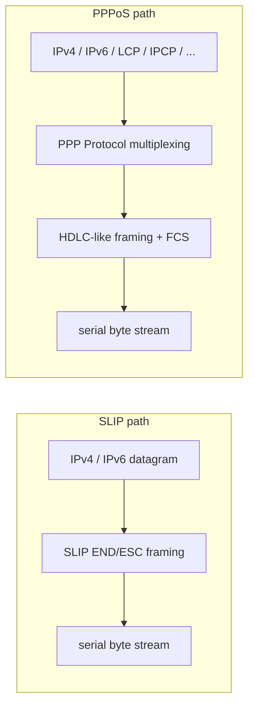
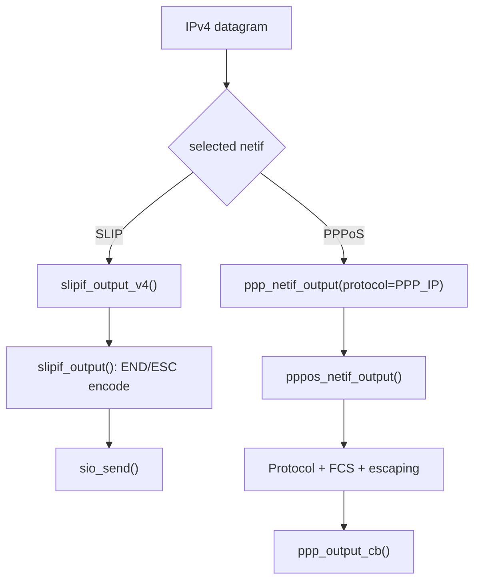
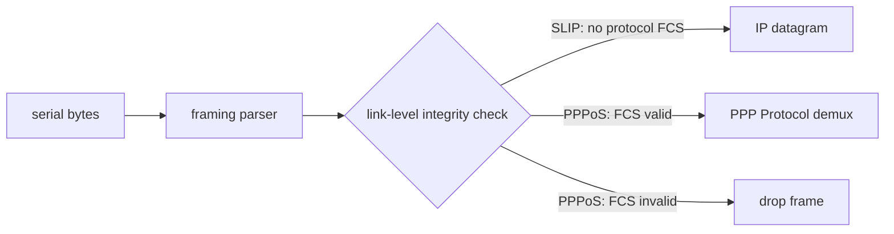

<meta name="referrer" content="no-referrer" />

# 教程 31：SLIP vs PPPoS——串口 IP Framing、错误检测、协商与工程边界

> 摘要：用统一的数据流、控制面与实现边界比较 lwIP SLIP 和 PPPoS，解释 framing、错误检测、协议分发、地址配置、执行上下文与生命周期差异。

[TOC]

SLIP（Serial Line Internet Protocol，串行线路 IP）和 PPPoS（PPP over Serial）都能让 IP 数据穿过 serial byte stream，但二者解决的问题并不相同。SLIP 是一个极简的 **IP datagram framing**：它告诉接收端一段 IP 数据在哪里开始/结束，并对少数字节做 escaping；PPPoS 则把完整 PPP 放到串行链路上，因此除了 framing，还具有 FCS（Frame Check Sequence，帧校验序列）错误检测、Protocol multiplexing（按 PPP Protocol 字段复用多种上层协议）、LCP（Link Control Protocol，链路控制协议）、可选认证、IPCP（Internet Protocol Control Protocol，IPv4 网络控制协议）/IPv6CP（IPv6 Control Protocol，IPv6 网络控制协议）等 control plane（用于建立、协商和维护链路的控制面）。[S3](#source-s3)[S4](#source-s4)[S5](#source-s5)

Stage 28～30 已经完整展开 PPPoS 的 framing、协商和网络配置源码。本篇不再复制那些调用链，而是回答一个独立工程问题：**同样是“串口传 IP”，SLIP 与 PPPoS 在系统职责、错误语义、配置能力和生命周期上到底差在哪里？** lwIP 源码只作为机制映射，不再作为文章骨架。[S1](#source-s1)[S6](#source-s6)

## 阅读前建议：先看协议原文，再用本文建立工程映射

1. [RFC 1055 — A Nonstandard for Transmission of IP Datagrams over Serial Lines: SLIP](https://www.rfc-editor.org/rfc/rfc1055.html)
   - 用途：理解 SLIP 的 END（帧结束字节）/ESC（转义前缀）framing，以及它明确**不提供**地址协商、type field、错误检测等能力。[S3](#source-s3)
2. [RFC 1661 — The Point-to-Point Protocol (PPP)](https://www.rfc-editor.org/rfc/rfc1661.html)
   - 用途：理解 PPP 为什么有 Protocol field（协议类型字段）、LCP（链路控制协议）/NCP（网络控制协议）和 session phase（会话阶段），而不是只有一个串口封装器。[S4](#source-s4)
3. [RFC 1662 — PPP in HDLC-like Framing](https://www.rfc-editor.org/rfc/rfc1662.html)
   - 用途：理解异步 PPP 的 Flag（帧边界标记）、Control Escape（转义前缀）、ACCM（异步控制字符映射）与 FCS（帧校验序列）。[S5](#source-s5)
4. [lwIP `slipif.c`](https://github.com/lwip-tcpip/lwip/blob/d08f4773edd0182b7910fc8f046eed82ffcd67c9/src/netif/slipif.c) 与 [lwIP PPP source](https://github.com/lwip-tcpip/lwip/tree/d08f4773edd0182b7910fc8f046eed82ffcd67c9/src/netif/ppp)
   - 用途：把协议职责映射到当前 pinned lwIP 实现，区分 Core 机制与 example/Port 行为。[S1](#source-s1)[S6](#source-s6)

## 1. 先看系统位置：两者共享 serial transport，但不是同一层次的“串口协议”

serial transport 只提供字节收发。SLIP 直接位于 serial 与 IP 之间；PPPoS 位于 serial 与 PPP Core 之间，而 PPP Core 再承载 IPv4、IPv6 和多个 control protocol。[S1](#source-s1)[S4](#source-s4)[S6](#source-s6)



这里的关键不是哪条链更长，而是**职责层次**：SLIP framing 完成后，payload 直接就是 IP datagram；PPPoS framing 完成后，payload 仍然先进入 PPP Core，由 `Protocol` field 决定这是 IP data 还是 control packet。[S1](#source-s1)[S3](#source-s3)[S6](#source-s6)

## 2. 同一个 IPv4 datagram，在两条路径上发生了什么

从上层交给 `netif` 的 IPv4 packet 出发，可以把 TX 数据流统一成下面两条路径：



RX 则反过来：

- SLIP parser 看到 END，得到的完整 `pbuf` 直接交给 `netif->input()`；upstream example 把该 callback 设成 `ip_input()`。[S1](#source-s1)[S2](#source-s2)
- PPPoS parser 完成 frame/FCS 校验后先交给 `ppp_input()`；`ppp_input()` 读取 `Protocol` field，再决定进入 IPv4、IPv6、LCP、PAP、CHAP、IPCP 等哪一个 handler。[S6](#source-s6)

因此，“串口上都能发 IP”并不能推出两者具有相同的数据链路语义。

## 3. Framing：SLIP 只解决边界与转义，PPPoS 还承担 PPP 链路格式

SLIP 的 wire rule 极少：`END` 标记 packet boundary，payload 中如果出现 END 或 ESC，就用 ESC sequence 转义。RFC 1055 没有为 SLIP 定义 type field、sequence number 或 checksum/FCS。[S3](#source-s3)

PPPoS 使用 RFC 1662 的 asynchronous HDLC-like framing。除了 Flag/Control Escape，还涉及 Address/Control field、PPP `Protocol` field、FCS，以及 LCP 协商可能改变的 ACCM/PFC/ACFC。[S4](#source-s4)[S5](#source-s5)

| 维度 | SLIP | PPPoS |
| --- | --- | --- |
| 帧边界 | END | Flag Sequence `0x7E` |
| escaping | END/ESC 两类特殊字节 | Control Escape + ACCM 规则 |
| payload 类型标识 | 无；解码后默认就是 IP datagram | 有 PPP `Protocol` field，可区分 IP 与 control protocol |
| link-level error detection | RFC 1055 未定义 | 16-bit FCS（当前 lwIP PPPoS 路径）[S5](#source-s5)[S6](#source-s6) |
| framing 是否受协商影响 | 否 | 会；PFC/ACFC/ACCM 可由 LCP 结果改变 |

## 4. 错误检测差异不是“小功能”，它改变 frame 是否有资格进入 IP 层

SLIP parser 能判断的是 framing 是否完整，例如 END 到达、ESC sequence 如何恢复。协议本身没有 frame-level FCS，因此接收端无法依靠 SLIP framing 判断某个完整 datagram 是否在串行链路中发生 bit error。[S3](#source-s3)

PPPoS 则在 `pppos_input()` 中持续累计 FCS；只有完整 frame 的 FCS 满足条件，packet 才继续进入 `ppp_input()`。因此 FCS 在这里属于**进入 PPP Core 前的 link-level gate**，和后续 IPv4 header checksum、TCP/UDP checksum 不是同一层检查。[S5](#source-s5)[S6](#source-s6)



## 5. Protocol multiplexing：SLIP 隐含“就是 IP”，PPP 明确写出“这是什么协议”

SLIP 没有协议类型字段。lwIP 的 `slipif_output_v4()` 与 `slipif_output_v6()` 最终都调用同一个 `slipif_output()`，而 RX 完成后直接走 `netif->input()`；example 选择 `ip_input()`，由 IP 入口继续辨认 IPv4/IPv6。[S1](#source-s1)[S2](#source-s2)

PPP frame 则显式携带 `Protocol` field。例如 IPv4 使用 PPP_IP，IPv6 使用 PPP_IPV6，LCP/PAP/CHAP/IPCP/IPv6CP 也各自有 protocol number。`ppp_input()` 读取这个字段后再做 protocol demultiplex。[S4](#source-s4)[S6](#source-s6)

这也是为什么 PPP 可以在同一条 serial link 上同时承载**数据面**和**控制面**，而 SLIP 本身只负责把 IP datagram 运过去。

## 6. 地址、DNS、认证：差异根源是“有没有 control plane”

SLIP 没有 LCP/NCP。upstream example 在 `netif_add()` 之前准备 IPv4 address、gateway 和 netmask，然后直接 `netif_set_up()`；这些值来自 example/Port 配置，不是 SLIP 线上协商的结果。[S2](#source-s2)

PPPoS 承载完整 PPP control plane：


Stage 29 已经解释 LCP/Auth/NCP，Stage 30 已经解释 negotiated address、peer DNS、default-netif policy、link down 与 reconnect。本篇只保留这个职责映射，不重复逐函数展开。[S6](#source-s6)

## 7. “接口 up”在两者中不是同一个生命周期语义

SLIP example 创建 `netif` 后可以直接 `netif_set_up()`；只要 serial I/O 和静态网络参数已经准备好，就不存在“必须等待 LCP/NCP OPENED 才允许 IP”的协议门槛。[S2](#source-s2)

PPPoS 不同。`pppos_create()` 创建的是 link adapter + PPP control block，`ppp_connect()` 之后还要经历 LCP、可选认证和 NCP。lwIP 的 PPP Core 还会在 `ppp_input()` 根据当前 phase/LCP state 丢弃不应出现的数据协议 packet。[S6](#source-s6)

因此不能把 `netif_set_up()` 与 `PPP_PHASE_RUNNING` 直接类比成同一个状态：前者是 lwIP interface administrative state，后者属于 PPP session/control-plane progression。

## 8. lwIP 实现映射：只看最能解释边界的几个符号

Theory-of-Operation 不需要再复制 Stage 28～30 的完整 PPP 调用链，只需把机制定位到实现。

### 8.1 SLIP：`slipif_init()` 直接把 IP output 接到 serial framing

`slipif_init()` 把 IPv4/IPv6 output callback 绑定到 SLIP encoder，并打开 serial device：[S1](#source-s1)

```c
#if LWIP_IPV4
  netif->output = slipif_output_v4;
#endif
#if LWIP_IPV6
  netif->output_ip6 = slipif_output_v6;
#endif
  netif->mtu = SLIP_MAX_SIZE;

  priv->sd = sio_open(sio_num);
```

这段实现没有创建额外 control protocol object。RX parser 完整组出 packet 后，`slipif_rxbyte_input()` 直接调用 `netif->input(p, netif)`。[S1](#source-s1)

### 8.2 PPPoS：`pppos_create()` 创建 link adapter，但 PPP Core 仍拥有 session

Stage 28 的 `pppos_create()` 通过 `ppp_new()` 创建真正的 PPP control block/netif，并注册 serial output callback；`ppp_connect()` 才启动 session。PPPoS 自身不是 LCP/IPCP 状态机的 owner。[S6](#source-s6)

这两个入口已经足以解释架构差异：

```text
SLIP:  netif -> framing adapter -> serial
PPPoS: netif -> PPP Core -> PPPoS framing adapter -> serial
```

## 9. RX execution context：都可以有线程/ISR，但线程模型不是协议本身

当前 lwIP `slipif` 支持几种 RX integration：独立 `SLIP_USE_RX_THREAD` 线程、主循环 `slipif_poll()`，以及配置允许时的 ISR enqueue + `slipif_process_rxqueue()`。[S1](#source-s1)

PPPoS example 使用自己的 serial RX thread，再通过 `pppos_input_tcpip()` 把字节交回 `tcpip_thread`；如果配置改变，PPPoS 也有其他 execution model。[S6](#source-s6)

因此“SLIP 是线程方式、PPPoS 是 Core 线程方式”不是协议结论。能比较的是：**当前 lwIP integration 为了满足 Core locking/threading contract，分别提供了哪些桥接方式。**

## 10. TX error feedback：协议能力与 I/O abstraction 要分开

当前 `slipif_output()` 最终调用 `sio_send()`；该 serial abstraction 没有提供可传播的发送失败返回值，因此 `slipif_output_v4()/v6()` 的 API 注释说明当前路径总是返回 `ERR_OK`。[S1](#source-s1)

PPPoS 的 `ppp_output_cb` 类型允许应用 callback 返回写入长度，PPPoS encoder 可以依据回调结果形成自己的返回语义。[S6](#source-s6)

这属于**当前 lwIP I/O abstraction 的实现差异**，不能泛化成“SLIP 协议永远无法报告错误、PPP 协议一定能报告 UART 错误”。协议 wire format 与本地 driver/API error semantics 是两个层次。

## 11. 大小限制与 overhead：不要只比较固定 header 字节

SLIP 的 `SLIP_MAX_SIZE` 是当前 lwIP parser 接收 packet 的实现上限；PPP 的 MRU（Maximum-Receive-Unit，最大接收单元）属于 PPP 链路参数，并可通过 LCP 参与协商。[S1](#source-s1)[S4](#source-s4)[S6](#source-s6)

两者的 serial overhead 也不是“固定多几个 header byte”这么简单：

- SLIP 遇到 END/ESC 时会扩展 escaping；
- PPPoS 的 overhead 受 Address/Control、Protocol 压缩、FCS，以及 ACCM 需要 escape 的字节数量影响。[S3](#source-s3)[S5](#source-s5)

所以没有实际 payload 分布和链路配置时，不应给出一个无条件的“某方案一定更省带宽”的结论。

## 12. IPv6：区分 lwIP integration 能力与协议标准化历史

当前 lwIP `slipif` 可以设置 `netif->output_ip6 = slipif_output_v6`，因此实现层面能够把 IPv6 datagram 直接通过 SLIP framing 送到串行链路。[S1](#source-s1)

但 RFC 1055 本身是历史上的 IP-over-serial SLIP 文档，不提供类似 PPP IPv6CP 的 IPv6 control plane。PPP 则由 RFC 5072 定义 IPv6 over PPP 和 IPv6CP。[S7](#source-s7)

因此应该表述为：**当前 lwIP 可以把 IPv6 packet 走 `slipif`，但它没有因此获得 PPP IPv6CP 那套协商语义。**

## 13. 用统一维度比较 SLIP 与 PPPoS

| 维度 | SLIP | PPPoS |
| --- | --- | --- |
| 核心职责 | 最小 IP datagram serial framing | 完整 PPP over serial link adapter + PPP control plane |
| RX 完成后的下一层 | 通常直接进入 IP input | 先进入 `ppp_input()` 做 Protocol demux |
| link-level FCS | 无协议定义 | 有 HDLC-like FCS |
| 协议类型复用 | 无独立 type field | PPP `Protocol` field |
| 链路参数协商 | 无 | LCP |
| 认证 | 无 | 可选 PAP/CHAP/EAP 等，取决于配置/协商 |
| IPv4 参数协商 | 无 | IPCP |
| IPv6 control plane | 无 IPv6CP | IPv6CP |
| peer DNS | 无协议机制 | 可通过 IPCP extension 获取，取决于实现/配置 |
| framing 参数可协商 | 基本固定 | ACCM/PFC/ACFC 等受 LCP 影响 |
| 当前 lwIP integration | thread / poll / ISR queue | PPPoS callback + Core/thread bridge 等 |
| 生命周期复杂度 | 小 | 明显更高，因为存在 session phase 和 control protocol FSM |

表中“无”表示**该协议本身不提供对应机制**，不代表产品不能通过其他私有命令、静态配置或上层协议补充这些能力。

## 14. 工程边界：选择的不是“哪个封装更高级”，而是哪一层需要承担配置责任

如果链路两端已经通过产品约定预先知道 IP 参数，只需要极小的 datagram boundary/escaping 机制，那么 SLIP 的设计目标与这种场景更接近。代价是地址配置、peer 能力、认证、link-level integrity 等职责需要由其他层解决。[S3](#source-s3)

如果链路需要建立 session、协商链路参数、可选认证、配置 IPv4/IPv6、获得 peer DNS，并希望多种 Network/Control Protocol 在同一 link 上明确复用，那么 PPP/PPPoS 提供的是一套完整 control plane；代价是实现状态、定时器、协商失败路径和生命周期都更复杂。[S4](#source-s4)[S5](#source-s5)[S6](#source-s6)

这个判断不是性能排名。实际项目仍要结合 peer 支持、modem 接口、RAM/ROM、认证要求、故障恢复和部署环境决定。

## 15. Stage 28～31 的知识边界

经过四篇后，串口网络路径已经形成清晰分层：

- Stage 28：PPP Core 与 PPPoS framing，回答 serial bytes 如何变成 PPP packet；
- Stage 29：LCP/Auth/NCP，回答 PPP session 为什么需要协商才能进入 Network/Running；
- Stage 30：地址、DNS、route policy 与 teardown/reconnect，回答协商结果怎样成为可用 `netif`；
- Stage 31：SLIP vs PPPoS，回答两种 serial IP 方案的职责边界与工程取舍。

Stage 31 到这里停止，不再重新展开 PPP FSM 或 address lifecycle 的源码细节。

## 资料来源

<a id="source-s1"></a>
### [S1] lwIP SLIP netif 源码
- 类型：目标版本上游源码
- 版本：commit `d08f4773edd0182b7910fc8f046eed82ffcd67c9`
- 定位：`src/netif/slipif.c`：`slipif_init()`、`slipif_output()`、`slipif_output_v4()`、`slipif_output_v6()`、`slipif_rxbyte()`、`slipif_rxbyte_input()`、`slipif_loop_thread()`、`slipif_poll()`、ISR queue 路径；`src/include/netif/slipif.h`
- URL/文档：[lwIP slipif.c](https://github.com/lwip-tcpip/lwip/blob/d08f4773edd0182b7910fc8f046eed82ffcd67c9/src/netif/slipif.c)
- 使用位置：“SLIP 系统位置”“framing/escaping”“RX/TX 数据流”“执行上下文”“IPv6 integration”
- 支撑内容：证明当前 pinned lwIP `slipif` 的真实 framing、pbuf 与 serial I/O 实现

<a id="source-s2"></a>
### [S2] lwIP example_app 的 SLIP 创建路径
- 类型：目标版本上游 example
- 版本：commit `d08f4773edd0182b7910fc8f046eed82ffcd67c9`
- 定位：`contrib/examples/example_app/test.c`：`USE_SLIPIF` 分支；`contrib/examples/example_app/lwipcfg.h`
- URL/文档：[lwIP example_app/test.c](https://github.com/lwip-tcpip/lwip/blob/d08f4773edd0182b7910fc8f046eed82ffcd67c9/contrib/examples/example_app/test.c)
- 使用位置：“SLIP 初始化模型”“静态 IPv4 参数”“`ip_input` callback”“IPv6 integration”
- 支撑内容：证明 upstream example 如何把 SLIP netif 接入 lwIP，而不是把 Port 行为泛化成 Core 规则

<a id="source-s3"></a>
### [S3] RFC 1055：A Nonstandard for Transmission of IP Datagrams over Serial Lines: SLIP
- 类型：IETF 历史协议文档
- 版本：RFC 1055，1988
- URL/文档：[RFC 1055](https://www.rfc-editor.org/rfc/rfc1055.html)
- 使用位置：“建议提前阅读”“SLIP framing 职责”“END/ESC”“能力边界”
- 支撑内容：定义 SLIP 是最小 IP datagram serial framing，并明确其不承担的功能

<a id="source-s4"></a>
### [S4] RFC 1661：The Point-to-Point Protocol (PPP)
- 类型：IETF Internet Standard
- 版本：RFC 1661 / STD 51，1994
- URL/文档：[RFC 1661](https://www.rfc-editor.org/rfc/rfc1661.html)
- 使用位置：“建议提前阅读”“PPP control plane”“Protocol multiplexing”“LCP/NCP”“MRU”
- 支撑内容：提供 PPP 链路建立、configuration protocol 与 multi-protocol encapsulation 的规范边界

<a id="source-s5"></a>
### [S5] RFC 1662：PPP in HDLC-like Framing
- 类型：IETF Internet Standard
- 版本：RFC 1662 / STD 51，1994
- URL/文档：[RFC 1662](https://www.rfc-editor.org/rfc/rfc1662.html)
- 使用位置：“建议提前阅读”“PPPoS framing”“Flag/Control Escape”“ACCM/FCS”
- 支撑内容：定义 asynchronous PPP 的 HDLC-like octet framing 与 FCS

<a id="source-s6"></a>
### [S6] lwIP PPP/PPPoS 源码与 example
- 类型：目标版本上游源码与 example
- 版本：commit `d08f4773edd0182b7910fc8f046eed82ffcd67c9`
- 定位：`src/netif/ppp/pppos.c`、`ppp.c`、`lcp.c`、`auth.c`、`ipcp.c`、`ipv6cp.c`、`fsm.c`；`contrib/examples/ppp/pppos_example.c`
- URL/文档：[lwIP PPP source](https://github.com/lwip-tcpip/lwip/tree/d08f4773edd0182b7910fc8f046eed82ffcd67c9/src/netif/ppp)
- 使用位置：“PPPoS 对照模型”“framing/FCS”“Protocol demux”“control plane”“lifecycle”“执行上下文”
- 支撑内容：作为 Stage 28～30 已展开机制的直接源码依据，用统一维度与 SLIP 对照

<a id="source-s7"></a>
### [S7] RFC 5072：IP Version 6 over PPP
- 类型：IETF 标准规范
- 版本：RFC 5072，2007
- URL/文档：[RFC 5072](https://www.rfc-editor.org/rfc/rfc5072.html)
- 使用位置：“IPv6CP 与 IPv6 over PPP 边界”
- 支撑内容：用于区分 current lwIP raw IPv6-over-slip integration 与正式 PPP IPv6CP/IPv6 protocol control
