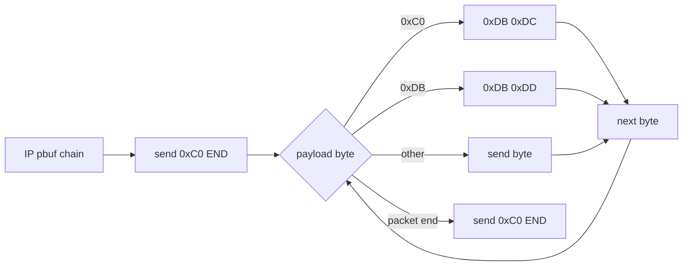
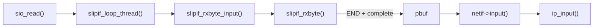
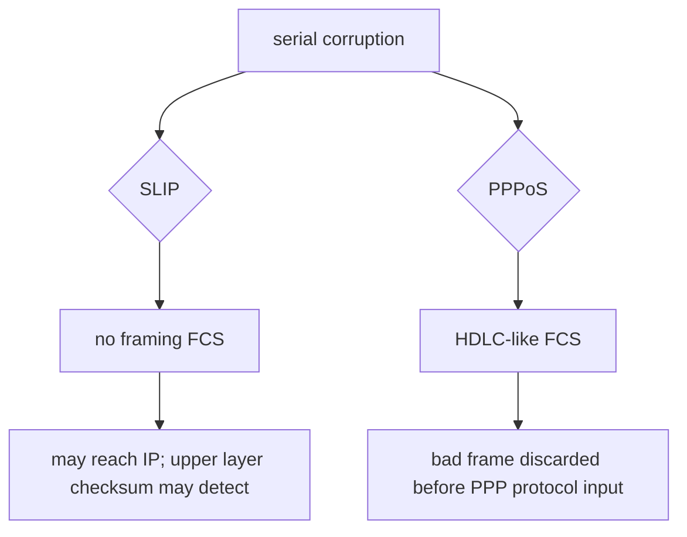
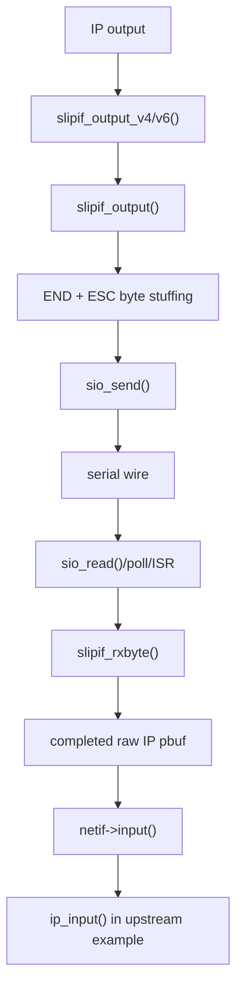
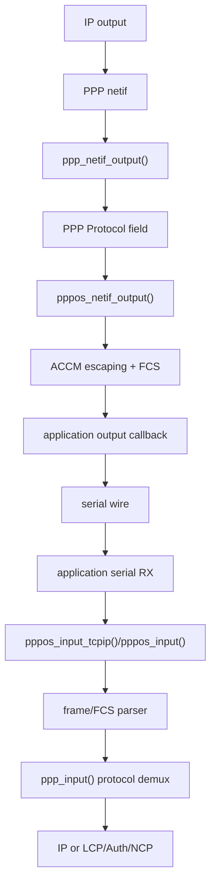
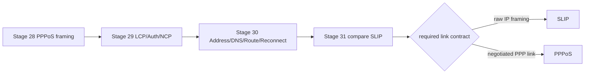

<meta name="referrer" content="no-referrer" />

# 教程 31：从 `slipif_init()` 到 `pppos_create()`——SLIP 与 PPPoS 的串口封装、错误检测、协商与工程边界

> 摘要：从 lwIP 的 SLIP 与 PPPoS 两条真实串口路径对比 framing、Protocol 分发、FCS、地址配置、认证、线程桥接与错误语义，明确最小 IP framing 与完整 PPP 控制面的边界。

[TOC]

Stage 28～30 已经从 `pppos_create()` 追到 PPPoS framing、LCP/PAP/CHAP、IPCP/IPv6CP，再追到地址、DNS、default route 与 reconnect。Stage 31 不重复整套 PPP 状态机，而是换到 lwIP 另一条串口网络接口 `slipif`，从它真实的初始化和收发函数进入，再与已经建立好的 PPPoS 路径逐项对照。[S1](#source-s1)[S2](#source-s2)

这里最重要的边界是：SLIP 在 RFC 1055 中只是“把 IP datagram 分帧到串口字节流”的 framing protocol；它不提供地址协商、packet type identification、error detection/correction 或 link configuration。PPP 则定义独立的数据链路封装、Protocol field、LCP/NCP，并在 HDLC-like framing 中使用 FCS 做 frame-level error detection。[S3](#source-s3)[S4](#source-s4)[S5](#source-s5)

因此，二者虽然都可以运行在 UART/serial byte stream 上，但承担的协议职责明显不同。

## 1. upstream example 从 `netif_add(..., slipif_init, ip_input)` 创建 SLIP 接口

进入 `test_netif_init()`：lwIP `contrib/examples/example_app/test.c` 的 SLIP 创建代码直接把 `slipif_init` 注册为 netif init callback，并把 `ip_input` 作为输入函数。[S2](#source-s2)

```c
netif_add(&slipif1, SLIP1_ADDRS &num_slip1, slipif_init, ip_input);
#if !USE_ETHERNET
netif_set_default(&slipif1);
#endif
#if LWIP_IPV6
netif_create_ip6_linklocal_address(&slipif1, 1);
#endif
netif_set_up(&slipif1);
```

这几行已经暴露 SLIP 与 Ethernet、PPPoS 的第一个结构差异：


没有 `ethernet_input()`，因为 SLIP frame 里没有 Ethernet header、MAC 地址或 EtherType。也没有 PPP Protocol field；完整 SLIP packet 解码出来后，payload 本身就是 IP datagram。[S1](#source-s1)[S3](#source-s3)

IPv4 地址在这个 example 中由 `LWIP_PORT_INIT_SLIP1_IPADDR()`、`LWIP_PORT_INIT_SLIP1_GW()`、`LWIP_PORT_INIT_SLIP1_NETMASK()` 在 `netif_add()` 前准备。也就是说，示例的 SLIP IPv4 configuration 来自 Port/example 配置，而不是 SLIP 协议在链路上协商得到。[S2](#source-s2)

Stage 30 中的 PPP 则不同：IPCP OPENED 后才通过 `sifaddr()` 把 negotiated IPv4 local/peer address 写进 PPP netif；这属于 PPP network-control protocol 的结果，而不是串口 Driver 自己预先填好的静态参数。

## 2. 进入 `slipif_init()`：SLIP 把普通 IP output 直接绑定到串口 framing

`netif_add()` 调用 `slipif_init()`。该函数分配私有状态、打开 serial device，并建立 IPv4/IPv6 output callback。[S1](#source-s1)

下面是 `slipif_init()` 的关键连续片段：

```c
err_t
slipif_init(struct netif *netif)
{
  struct slipif_priv *priv;
  u8_t sio_num;

  LWIP_ASSERT("slipif needs an input callback", netif->input != NULL);

  sio_num = LWIP_PTR_NUMERIC_CAST(u8_t, netif->state);

  priv = (struct slipif_priv *)mem_malloc(sizeof(struct slipif_priv));
  if (!priv) {
    return ERR_MEM;
  }

  netif->name[0] = 's';
  netif->name[1] = 'l';
#if LWIP_IPV4
  netif->output = slipif_output_v4;
#endif
#if LWIP_IPV6
  netif->output_ip6 = slipif_output_v6;
#endif
  netif->mtu = SLIP_MAX_SIZE;

  priv->sd = sio_open(sio_num);
  if (!priv->sd) {
    mem_free(priv);
    return ERR_IF;
  }
```

当前 `SLIP_MAX_SIZE` 默认是 1500。`netif->state` 在进入 init 前被解释成 serial port number；成功打开后，`netif->state` 改成 `struct slipif_priv *`，其中保存 serial descriptor、当前 RX pbuf chain、解析状态和接收长度。[S1](#source-s1)

继续阅读同一个 `slipif_init()`，它初始化 RX parser；若 `SLIP_USE_RX_THREAD` 为 1，还会创建一个阻塞读串口的线程：

```c
  priv->p = NULL;
  priv->q = NULL;
  priv->state = SLIP_RECV_NORMAL;
  priv->i = 0;
  priv->recved = 0;
#if SLIP_RX_FROM_ISR
  priv->rxpackets = NULL;
#endif

  netif->state = priv;

  MIB2_INIT_NETIF(netif, snmp_ifType_slip, SLIP_SIO_SPEED(priv->sd));

#if SLIP_USE_RX_THREAD
  sys_thread_new(SLIPIF_THREAD_NAME, slipif_loop_thread, netif,
                 SLIPIF_THREAD_STACKSIZE, SLIPIF_THREAD_PRIO);
#endif
  return ERR_OK;
}
```

函数返回后，回到 `netif_add()`；example 随后调用 `netif_set_up(&slipif1)`。此时 netif 已具备：

- TX：`netif->output` / `output_ip6` → SLIP encoder；
- RX：串口线程、poll 或 ISR 输入 → SLIP decoder → `netif->input`；
- input callback：example 指定为 `ip_input()`。

这和 PPPoS 的初始化层次不同。PPPoS 先由 `pppos_create()` 建立 PPP control block 和 PPP netif，随后 `ppp_connect()` 启动 LCP session；“netif 存在”和“PPP session 已经可承载 IP”是两个不同阶段。[S6](#source-s6)

## 3. SLIP TX：`slipif_output_v4()`/`v6()` 不使用 next-hop 地址

IPv4 或 IPv6 output 到达 SLIP netif 后分别进入 `slipif_output_v4()` 或 `slipif_output_v6()`。两个 wrapper 都忽略目标地址，只把完整 IP packet 交给 `slipif_output()`：[S1](#source-s1)

```c
static err_t
slipif_output_v4(struct netif *netif, struct pbuf *p, const ip4_addr_t *ipaddr)
{
  LWIP_UNUSED_ARG(ipaddr);
  return slipif_output(netif, p);
}
```

IPv6 wrapper 的结构相同。这符合 point-to-point serial link 的数据路径：`slipif` 不做 ARP/ND next-hop MAC resolution，也不构造 L2 address header；它只需要把调用方已经形成的 IP datagram 变成可在串口字节流中识别边界的 SLIP frame。

`slipif_output_v4()` 直接调用 `slipif_output()`，下面进入 encoder。

## 4. `slipif_output()`：SLIP framing 只有 END 与 ESC escaping

RFC 1055 定义的核心字符是 END `0xC0` 和 ESC `0xDB`。lwIP 还定义 `ESC_END=0xDC`、`ESC_ESC=0xDD`，完全对应 RFC 的字节透明机制。[S1](#source-s1)[S3](#source-s3)

`slipif_output()` 从 END delimiter 开始，然后逐个遍历 pbuf chain 的 payload byte：[S1](#source-s1)

```c
static err_t
slipif_output(struct netif *netif, struct pbuf *p)
{
  struct slipif_priv *priv;
  struct pbuf *q;
  u16_t i;
  u8_t c;

  priv = (struct slipif_priv *)netif->state;

  sio_send(SLIP_END, priv->sd);

  for (q = p; q != NULL; q = q->next) {
    for (i = 0; i < q->len; i++) {
      c = ((u8_t *)q->payload)[i];
      switch (c) {
        case SLIP_END:
          sio_send(SLIP_ESC, priv->sd);
          sio_send(SLIP_ESC_END, priv->sd);
          break;
        case SLIP_ESC:
          sio_send(SLIP_ESC, priv->sd);
          sio_send(SLIP_ESC_ESC, priv->sd);
          break;
        default:
          sio_send(c, priv->sd);
          break;
      }
    }
  }
  sio_send(SLIP_END, priv->sd);
  return ERR_OK;
}
```

完整 wire-level 关系是：



这里没有 PPP 的 Address `0xff`、Control `0x03`、Protocol field，也没有 FCS。RFC 1055 对 SLIP 的描述就是 packet framing only；error detection/correction 不属于 SLIP framing。[S3](#source-s3)

### 4.1 `sio_send()` 的 API 设计让 `slipif_output()` 无法报告串口发送失败

`slipif_output()` 的源码注释明确说明：serial layer 的 `sio_send()` 没有返回值，因此这个函数总是返回 `ERR_OK`。[S1](#source-s1)

这不是“所有串口驱动都不会失败”的协议结论，而是当前 lwIP `sio` abstraction 与 `slipif` implementation 的错误传播边界。

Stage 28 的 PPPoS 则由应用提供 `pppos_output_cb()`；`pppos_write()` 会比较 output callback 返回的实际长度与请求长度，发生 short write 时可以向 PPP link path 返回 `ERR_IF`。[S6](#source-s6)

因此仅从 lwIP 当前接口契约看，两者的 TX error feedback 能力并不相同。

## 5. SLIP RX：`slipif_loop_thread()` 每次读一个字节交给 parser

当 `SLIP_USE_RX_THREAD` 为 1，`slipif_init()` 创建 `slipif_loop_thread()`。线程阻塞在 `sio_read()`：[S1](#source-s1)

```c
static void
slipif_loop_thread(void *nf)
{
  u8_t c;
  struct netif *netif = (struct netif *)nf;
  struct slipif_priv *priv = (struct slipif_priv *)netif->state;

  while (1) {
    if (sio_read(priv->sd, &c, 1) > 0) {
      slipif_rxbyte_input(netif, c);
    }
  }
}
```

收到一个 byte 后直接进入 `slipif_rxbyte_input()`。该 helper 调 `slipif_rxbyte()`；只有 parser 确认一整个 packet 完成时才把 pbuf 送给 `netif->input()`：[S1](#source-s1)

```c
static void
slipif_rxbyte_input(struct netif *netif, u8_t c)
{
  struct pbuf *p;
  p = slipif_rxbyte(netif, c);
  if (p != NULL) {
    if (netif->input(p, netif) != ERR_OK) {
      pbuf_free(p);
    }
  }
}
```

回到 example 的创建参数，`netif->input` 就是 `ip_input()`。所以完整默认线程路径是：[S1](#source-s1)[S2](#source-s2)



这条路径没有 `tcpip_input()` mailbox bridge。是否需要进一步切到 TCP/IP Core thread，取决于 Port 给 `netif->input` 绑定什么 callback 以及所采用的 lwIP execution model。upstream example 这里明确使用 `ip_input()`，因此这只是该 example 的执行方式，不能泛化成所有 RTOS SLIP Port 的线程安全模板。

## 6. `slipif_rxbyte()`：两态 parser 恢复 END/ESC 并累积 pbuf chain

SLIP parser 的状态只有：

```c
enum slipif_recv_state {
  SLIP_RECV_NORMAL,
  SLIP_RECV_ESCAPE
};
```

`SLIP_RECV_NORMAL` 收到 END 时，如果已经累计了 payload，就裁剪 pbuf chain 并返回完整 packet；收到 ESC 时切到 `SLIP_RECV_ESCAPE`。[S1](#source-s1)

下面继续阅读 `slipif_rxbyte()` 的 delimiter/escape 分支：

```c
switch (priv->state) {
  case SLIP_RECV_NORMAL:
    switch (c) {
      case SLIP_END:
        if (priv->recved > 0) {
          pbuf_realloc(priv->q, priv->recved);
          LINK_STATS_INC(link.recv);
          t = priv->q;
          priv->p = priv->q = NULL;
          priv->i = priv->recved = 0;
          return t;
        }
        return NULL;
      case SLIP_ESC:
        priv->state = SLIP_RECV_ESCAPE;
        return NULL;
      default:
        break;
    }
    break;
  case SLIP_RECV_ESCAPE:
    switch (c) {
      case SLIP_ESC_END:
        c = SLIP_END;
        break;
      case SLIP_ESC_ESC:
        c = SLIP_ESC;
        break;
      default:
        break;
    }
    priv->state = SLIP_RECV_NORMAL;
    break;
  default:
    break;
}
```

这不是类似 LCP/IPCP 那种 protocol FSM；它只是 byte unescaping parser。把 `SLIP_RECV_NORMAL/ESCAPE` 与 PPP `PPP_PHASE_*` 或 generic PPP FSM 的 CLOSED/REQSENT/OPENED 混为一谈，会把“串口 framing parser 状态”和“链路协议协商状态”混在不同层次。

### 6.1 packet body 直接进入 `PBUF_POOL`

同一个 `slipif_rxbyte()` 在需要空间时通过 `pbuf_alloc(PBUF_LINK, ..., PBUF_POOL)` 分配新的 pbuf，并用 `pbuf_cat()` 接到当前 packet chain。[S1](#source-s1)

```c
if (priv->p == NULL) {
  priv->p = pbuf_alloc(PBUF_LINK,
                       (PBUF_POOL_BUFSIZE - PBUF_LINK_HLEN - PBUF_LINK_ENCAPSULATION_HLEN),
                       PBUF_POOL);

  if (priv->p == NULL) {
    LINK_STATS_INC(link.drop);
    return NULL;
  }

  if (priv->q != NULL) {
    pbuf_cat(priv->q, priv->p);
  } else {
    priv->q = priv->p;
  }
}
```

因此 SLIP RX 也会受到 Stage 12 已经讲过的 PBUF_POOL 资源约束。它没有 Ethernet DMA ring，但仍可能因为 pbuf allocation failure 而 drop packet。

当前实现还限制 `SLIP_MAX_SIZE`。超过限制的后续 bytes 不再写进 pbuf，直到 END 到来完成当前 parser cycle。[S1](#source-s1)

## 7. SLIP 有三种 RX execution mode，不等价于 PPPoS 的 Core bridge

`slipif.h` 明确给出三类接收方式：[S1](#source-s1)

1. `SLIP_USE_RX_THREAD`：独立 thread 阻塞 `sio_read()`；
2. `slipif_poll()`：主循环用 `sio_tryread()` polling；
3. `SLIP_RX_FROM_ISR`：ISR 调 `slipif_received_byte[s]()`，完成 packet 后排队，main loop 再 `slipif_process_rxqueue()`。

`SLIP_USE_RX_THREAD` 的默认值是 `!NO_SYS`；`SLIP_RX_FROM_ISR` 默认关闭。[S1](#source-s1)

PPPoS example 的典型路径则是应用自己的 serial RX thread 批量读取，再调用 `pppos_input_tcpip()`，由该 API 把输入切换到 `tcpip_thread` 后执行 PPP framing parser。若配置 `PPP_INPROC_IRQ_SAFE`，则可以采用另一种 in-process 模式。[S6](#source-s6)

因此两个模块都允许多种 Port 方式，但 API 边界不同：

```text
SLIP:
serial source
→ slipif-specific RX thread/poll/ISR queue
→ completed IP pbuf
→ netif->input

PPPoS:
application serial source
→ pppos_input_tcpip()/pppos_input
→ PPP framing + protocol demux
→ PPP netif / IP
```

线程模型属于 Port/integration contract，不能只根据“底层都是 UART”假定相同。

## 8. PPPoS 多出的不是几字节 header，而是一整层 PPP data-link protocol

Stage 28 已经完整展开 PPPoS，这里只保留本篇需要的对照桥接。`pppos_create()` 创建 PPP PCB；`ppp_connect()` 让 adapter connect 后进入 `ppp_start()`；LCP 先建立链路，再按配置进入认证与 NCP。[S6](#source-s6)

PPP asynchronous HDLC-like frame 的逻辑结构包括：[S4](#source-s4)[S5](#source-s5)

```text
Flag
Address
Control
Protocol
Information
FCS
Flag
```

在 LCP 协商后，Address/Control 可以通过 ACFC 省略，Protocol field 也可以通过 PFC 压缩；ACCM 决定异步链路上还需转义哪些控制字符。[S4](#source-s4)[S5](#source-s5)

SLIP frame 则可以概括为：

```text
END
escaped IP datagram bytes
END
```

RFC 1055 不定义 protocol field，因此原始 SLIP framing 本身没有“这个 payload 是 IPv4、IPv6、LCP 还是 IPCP”的 data-link type identifier。[S3](#source-s3)

lwIP 当前 `slipif` 同时设置 `output` 和 `output_ip6`，并直接把完成的 datagram 交给 generic `ip_input()`；这是 lwIP implementation 对 raw IP datagram 的处理能力。RFC 1055 本身是 1988 年的 IP-over-serial SLIP 文档，不应把 lwIP 当前 IPv6 integration 反向描述成 RFC 1055 当年定义的 IPv6 SLIP 标准。[S1](#source-s1)[S3](#source-s3)

## 9. error detection：SLIP framing 没有 FCS，PPPoS 在 frame 层验证 FCS

这是二者最容易被低估的差别之一。

RFC 1055 明确指出 SLIP 没有 error detection/correction；如果串口传输中某个 ordinary byte 被翻转成另一个 ordinary byte，而且没有破坏 END/ESC framing，SLIP decoder 自己没有 frame-level checksum 可以据此拒绝整个 packet。[S3](#source-s3)

上层协议可能仍有自己的校验：

- IPv4 header checksum 只覆盖 IPv4 header；
- TCP/UDP checksum 覆盖其 transport pseudo-header/header/payload；
- IPv6 header 本身没有 IPv4 那种 header checksum。

这些都不等价于链路层对整个 serial frame 做 FCS。

PPPoS 则按 RFC 1662 使用 HDLC FCS；lwIP `pppos_input()` parser 在完整 frame 结束前累计 FCS，不满足 good-FCS 条件的 frame 不进入 `ppp_input()`。TX 端 `pppos_netif_output()`/相关 writer 同样生成 FCS。[S4](#source-s4)[S6](#source-s6)



图中“may”是边界限定：具体 bit error 是否最终被 IP/transport checksum 检出，取决于受损字段和承载协议，不能把上层 checksum 当成 SLIP frame FCS 的等价替代。

## 10. Protocol multiplexing：SLIP 只交 raw IP，PPP 用 Protocol field 分发多种协议

Stage 28 中 `ppp_input()` 根据 PPP Protocol field 分发：[S6](#source-s6)

```text
PPP_IP     → IPv4 input
PPP_IPV6   → IPv6 input
PPP_LCP    → lcp_input()
PPP_PAP    → auth input
PPP_CHAP   → auth input
PPP_IPCP   → ipcp_input()
PPP_IPV6CP → ipv6cp_input()
```

这就是 Stage 29 的 LCP/Auth/NCP 能与用户 IP traffic 共享同一串口的基础。

SLIP 没有对应 protocol field。`slipif_rxbyte_input()` 一旦完成 packet 就调用 `netif->input()`；upstream example 把该 callback 绑定为 `ip_input()`。[S1](#source-s1)[S2](#source-s2)

因此 SLIP 不能仅靠自己的 framing，在同一 link 内原生 multiplex 一套类似 LCP/PAP/IPCP 的 control protocols。若产品要在 SLIP serial link 旁边再实现 modem control/config channel，那是另外的 framing/multiplexing 设计，不属于 RFC 1055 SLIP 本身。

## 11. 地址与 DNS：SLIP 依赖外部配置，PPP 可以在 NCP 中协商

upstream SLIP example 在创建 netif 前直接初始化 IPv4 local/gateway/netmask，然后 `netif_add()`。[S2](#source-s2)

也就是说，下面这些问题不由 SLIP framing 回答：

```text
local IPv4 是多少？
peer IPv4 是多少？
DNS server 是多少？
什么时候认为链路 configuration 完成？
```

实际产品必须通过静态配置、串口外的 modem command、应用协议或其他机制得到这些信息。

PPPoS 则有明确的 control plane：


Stage 29/30 已经证明 lwIP 当前 IPCP/IPv6CP 与 `sifaddr()`、`sdns()`、`sifup()` 等函数如何更新 PPP netif。[S6](#source-s6)

所以“串口拨号网络为什么常见 PPPoS 而不是只有 SLIP framing”不能只用 packet overhead 解释；是否需要 negotiation、authentication、address/DNS configuration、error detection 与 protocol multiplexing 才是更完整的协议能力差异。

## 12. Authentication：SLIP 没有 PAP/CHAP 对应层

Stage 29 已经追踪 PAP/CHAP 在 PPP phase 中的位置。这里仅做边界对照：RFC 1055 SLIP 没有 link authentication state machine；PPP 通过 LCP negotiation 确定 authentication protocol，并可进入 PAP/CHAP。[S3](#source-s3)[S4](#source-s4)[S6](#source-s6)

因此：

```text
SLIP over UART
```

本身不能表达“peer 必须用某个 username/password 完成 PAP/CHAP 后才允许 Network phase”。如果产品在 SLIP 上需要认证，必须在 SLIP 之外自行建立认证机制。

## 13. Link lifecycle：SLIP `netif_set_up()` 不等价于 PPP RUNNING

SLIP example 在 `netif_add()` 后直接 `netif_set_up(&slipif1)`。SLIP framing 没有 LCP lower-up、AUTHENTICATE、NETWORK、RUNNING 这一组协商阶段。[S2](#source-s2)[S3](#source-s3)

PPPoS 中：

```text
pppos_create()
→ PPP PCB / netif exists
→ ppp_connect()
→ ESTABLISH
→ AUTHENTICATE (optional)
→ NETWORK
→ RUNNING
```

Stage 30 又说明 error/close 会把 NCP、link 和 phase 逐层收回到 DEAD，再由 application 决定是否 reconnect。[S6](#source-s6)

因此不能把：

```text
SLIP netif UP
```

直接类比为：

```text
PPP_PHASE_RUNNING
```

前者只是 lwIP netif administrative state 加上 Port 已经准备好的 serial path；后者表示 PPP link control/auth/network control 已经完成到允许 network protocol traffic 的阶段。

## 14. 两种 framing 的 escaping 也不是同一套规则

SLIP 只需要对两个特殊 byte 做透明处理：[S1](#source-s1)[S3](#source-s3)

| 原 byte | wire sequence |
| --- | --- |
| `0xC0` END | `0xDB 0xDC` |
| `0xDB` ESC | `0xDB 0xDD` |

PPP asynchronous HDLC framing 使用 `0x7e` Flag、`0x7d` Control Escape，并按 ACCM 对控制字符执行 octet stuffing；被转义 byte 与 `0x20` 做变换。LCP 还可以协商 ACCM。[S5](#source-s5)[S6](#source-s6)

所以把 SLIP `0xC0/0xDB` 机械替换成 PPP `0x7e/0x7d` 并不会得到 PPPoS；PPP frame 还包含 protocol multiplexing、FCS 和 negotiation-driven compression/options。

## 15. overhead 不能只看 header byte 数量

从 wire format 看，SLIP 确实很薄：通常只是 packet delimiter，再对 END/ESC 做 escape；PPP 还有 Address/Control、Protocol、FCS，并可能因为 ACCM 产生更多 escaping。[S3](#source-s3)[S5](#source-s5)

但实际链路开销还受这些因素影响：

- payload 中特殊 byte 出现频率；
- PPP 是否协商 ACFC/PFC；
- ACCM；
- serial line rate；
- LCP/Auth/NCP control traffic；
- retransmission 是否发生在更高层；
- implementation 的 per-byte/pbuf processing cost。

因此不能在没有真实流量和串口速率测量的情况下，仅凭“SLIP header 更短”就给出吞吐量排名。Stage 27 的性能原则仍然适用：需要根据实际 byte count、CPU、pbuf pressure 与链路速率测量，而不是从协议名字推导性能结论。

## 16. IPv6 支持要区分 lwIP implementation 与历史 SLIP RFC

当前 `slipif_init()` 在 `LWIP_IPV6` 下设置：

```c
netif->output_ip6 = slipif_output_v6;
```

继续阅读 `test_netif_init()`，upstream example 还调用：

```c
netif_create_ip6_linklocal_address(&slipif1, 1);
```

并继续把完整 RX packet 交给 generic `ip_input()`。[S1](#source-s1)[S2](#source-s2)

这些代码证明当前 lwIP `slipif` 可以把 IPv6 datagram 放到该 raw serial framing 路径中。但 RFC 1055 的规范背景是 1988 年的 SLIP/IP；其“packet framing only”定义不能被改写成一个后来正式标准化的 IPv6-over-SLIP negotiation protocol。[S3](#source-s3)

PPP 的 IPv6 则有 Stage 29 已讲过的 IPv6CP，并由 RFC 5072 定义 IPv6 over PPP 的 protocol/control boundary。[S7](#source-s7)

## 17. SLIP `SLIP_MAX_SIZE=1500` 与 PPP MRU 的语义不同

当前 `slipif.c` 的 `SLIP_MAX_SIZE` 默认 1500，并直接赋给 `netif->mtu`。RX parser 也据此限制当前 packet 最大接收长度。[S1](#source-s1)

这个值是 lwIP SLIP implementation 的 compile-time/default sizing policy。

PPP 中 Stage 29 已经看到 MRU 是 LCP configuration option；peer 可以在 LCP Configure negotiation 中协商其能接收的最大 Information field。lwIP PPP 还维护本地/peer MRU 相关状态。[S4](#source-s4)[S6](#source-s6)

因此：

```text
SLIP_MAX_SIZE
```

与：

```text
PPP MRU
```

不能只因为都限制 packet/frame 大小就当成同一种机制。前者是当前 SLIP netif implementation 的本地上限，后者属于 PPP 链路协商的一部分。

## 18. 本系列中的两条完整串口数据路径

经过 Stage 28～31，现在可以把同一块 MCU/RTOS 上“serial network interface”的两种路径压缩成两张图。

### 18.1 SLIP



### 18.2 PPPoS



第二条图中还隐含 Stage 29 的 LCP/Auth/NCP control plane；SLIP 图没有对应 control plane，因为它不属于 SLIP 协议。

## 19. 用统一维度比较 SLIP 与 PPPoS

| 维度 | lwIP SLIP | lwIP PPPoS |
| --- | --- | --- |
| serial framing | END/ESC byte framing | PPP HDLC-like octet framing |
| data-link Protocol field | 无 | 有 |
| frame-level FCS | 无 | 有，PPP FCS |
| link negotiation | 无 | LCP |
| authentication | SLIP 本身无 | PAP/CHAP 等，视编译/配置 |
| IPv4 参数协商 | SLIP 本身无 | IPCP |
| IPv6 control | 当前 lwIP 可承载 raw IPv6，但 SLIP 本身无 IPv6CP | IPv6CP + IPv6 PPP protocol |
| peer DNS | SLIP 本身无 | IPCP 可带 peer DNS，应用决定是否采用 |
| compression option negotiation | 无 | ACFC/PFC 等由 LCP 协商 |
| serial escaping policy | 固定 END/ESC | Flag/Escape + ACCM |
| lwIP TX error feedback | `sio_send()` 无返回值，`slipif_output()` 总是 `ERR_OK` | output callback 长度可参与 short-write/error 判断 |
| RX integration | thread / poll / ISR queue | application RX + `pppos_input_tcpip()`，或特定 in-process 模式 |
| netif configuration | example 由外部/static 参数建立 | NCP OPENED 后写入 negotiated configuration |
| reconnect protocol state | SLIP 本身无 session FSM | PPP 有 phase/FSM，应用决定重拨策略 |
| implementation complexity | framing path 较少 | control plane 与 framing 状态更多 |

表格描述的是“协议和当前 lwIP implementation 的能力差异”，不是给不同产品做绝对优劣排序。真正的选择还取决于 peer 支持什么协议、是否需要动态配置/认证、串口错误环境、资源预算以及已有 modem/host 协议。

## 20. 什么时候“只需要 framing”，什么时候需要完整 point-to-point control plane

如果链路两端完全受同一系统控制，IP 参数预先已知，不需要 PAP/CHAP、动态地址、peer DNS，也接受由上层 checksum 或物理链路承担剩余错误检测，那么 SLIP 所提供的最小 framing 模型能够减少协议状态和 negotiation 逻辑。这是由其能力边界推导出的适用条件，不是“SLIP 一定更好”。[S1](#source-s1)[S3](#source-s3)

如果链路对端要求 PPP、需要 LCP negotiation、authentication、IPCP/IPv6CP、PPP FCS、Protocol multiplexing，或者 modem/network 本身就是 PPP service endpoint，那么这些能力只能由 PPP control/data plane 提供，不能通过给 SLIP 多加几个配置项得到。[S4](#source-s4)[S5](#source-s5)[S6](#source-s6)

换句话说，真正的分界不是：

```text
哪一种转义字符更简单？
```

而是：

```text
这个 serial link 只需要 raw IP framing，
还是需要一个完整的 point-to-point data-link control protocol？
```

## 21. Stage 28～31 的完整机制回看

串口网络这一组文章现在形成完整闭环：



Stage 28 解释“byte stream 怎样恢复成 PPP frame”；Stage 29 解释“PPP 为什么必须先协商”；Stage 30 解释“协商结果怎样进入 lwIP netif 和应用生命周期”；Stage 31 再用 SLIP 证明，serial framing、link configuration、authentication、protocol multiplexing 和 reconnect policy 本来就是不同层次的问题。

## 资料来源

<a id="source-s1"></a>
### [S1] lwIP SLIP netif 源码
- 类型：目标版本上游源码
- 版本：commit `d08f4773edd0182b7910fc8f046eed82ffcd67c9`
- 定位：`src/netif/slipif.c`：`slipif_init()`、`slipif_output()`、`slipif_output_v4()`、`slipif_output_v6()`、`slipif_rxbyte()`、`slipif_rxbyte_input()`、`slipif_loop_thread()`、`slipif_poll()`、ISR queue 路径；`src/include/netif/slipif.h`
- URL/文档：[lwIP slipif.c](https://github.com/lwip-tcpip/lwip/blob/d08f4773edd0182b7910fc8f046eed82ffcd67c9/src/netif/slipif.c)
- 使用位置：“SLIP init/TX/RX”“END/ESC framing”“PBUF_POOL”“thread/poll/ISR”“SLIP_MAX_SIZE”“IPv6 integration”
- 支撑内容：证明当前 pinned lwIP `slipif` 的真实 framing、pbuf 与 serial I/O 实现

<a id="source-s2"></a>
### [S2] lwIP example_app 的 SLIP 创建路径
- 类型：目标版本上游 example
- 版本：commit `d08f4773edd0182b7910fc8f046eed82ffcd67c9`
- 定位：`contrib/examples/example_app/test.c`：`USE_SLIPIF` 分支；`contrib/examples/example_app/lwipcfg.h`
- URL/文档：[lwIP example_app/test.c](https://github.com/lwip-tcpip/lwip/blob/d08f4773edd0182b7910fc8f046eed82ffcd67c9/contrib/examples/example_app/test.c)
- 使用位置：“真实创建入口”“static IPv4 参数”“`ip_input` callback”“IPv6 link-local”“netif up/default”
- 支撑内容：证明 upstream example 如何把 SLIP netif 接入 lwIP，而不是把 Port 行为泛化成 Core 规则

<a id="source-s3"></a>
### [S3] RFC 1055：A Nonstandard for Transmission of IP Datagrams over Serial Lines: SLIP
- 类型：IETF 历史协议文档
- 版本：RFC 1055，1988
- URL/文档：[RFC 1055](https://www.rfc-editor.org/rfc/rfc1055.html)
- 使用位置：“SLIP framing 职责”“END/ESC”“没有 addressing/type/error detection/compression”“IPv6 规范边界”
- 支撑内容：定义 SLIP 是最小 IP datagram serial framing，并明确其不承担的功能

<a id="source-s4"></a>
### [S4] RFC 1661：The Point-to-Point Protocol (PPP)
- 类型：IETF Internet Standard
- 版本：RFC 1661 / STD 51，1994
- URL/文档：[RFC 1661](https://www.rfc-editor.org/rfc/rfc1661.html)
- 使用位置：“PPP Protocol field”“LCP/NCP”“MRU negotiation”“PPP phase/control plane”
- 支撑内容：提供 PPP 链路建立、configuration protocol 与 multi-protocol encapsulation 的规范边界

<a id="source-s5"></a>
### [S5] RFC 1662：PPP in HDLC-like Framing
- 类型：IETF Internet Standard
- 版本：RFC 1662 / STD 51，1994
- URL/文档：[RFC 1662](https://www.rfc-editor.org/rfc/rfc1662.html)
- 使用位置：“Flag/Control Escape”“ACCM”“Address/Control/Protocol/FCS”“FCS error detection”
- 支撑内容：定义 asynchronous PPP 的 HDLC-like octet framing 与 FCS

<a id="source-s6"></a>
### [S6] lwIP PPP/PPPoS 源码与 example
- 类型：目标版本上游源码与 example
- 版本：commit `d08f4773edd0182b7910fc8f046eed82ffcd67c9`
- 定位：`src/netif/ppp/pppos.c`、`ppp.c`、`lcp.c`、`auth.c`、`ipcp.c`、`ipv6cp.c`、`fsm.c`；`contrib/examples/ppp/pppos_example.c`
- URL/文档：[lwIP PPP source](https://github.com/lwip-tcpip/lwip/tree/d08f4773edd0182b7910fc8f046eed82ffcd67c9/src/netif/ppp)
- 使用位置：“PPPoS framing/FCS”“Protocol demux”“LCP/Auth/NCP”“address/DNS/reconnect”“TX error feedback”“RX Core bridge”
- 支撑内容：作为 Stage 28～30 已展开机制的直接源码依据，用统一维度与 SLIP 对照

<a id="source-s7"></a>
### [S7] RFC 5072：IP Version 6 over PPP
- 类型：IETF 标准规范
- 版本：RFC 5072，2007
- URL/文档：[RFC 5072](https://www.rfc-editor.org/rfc/rfc5072.html)
- 使用位置：“IPv6CP 与 IPv6 over PPP 边界”
- 支撑内容：用于区分 current lwIP raw IPv6-over-slip integration 与正式 PPP IPv6CP/IPv6 protocol control
