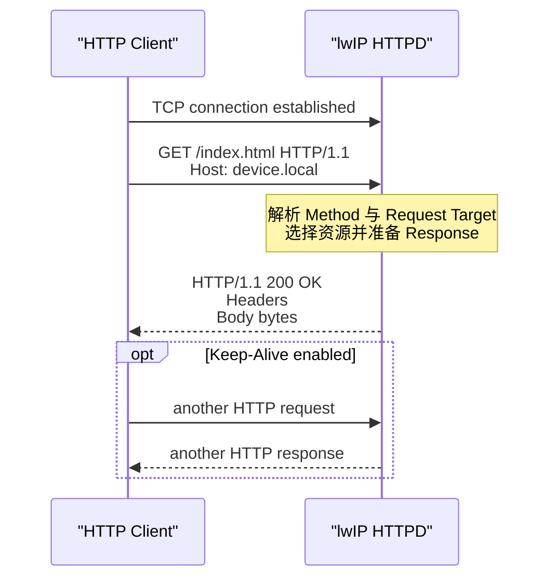
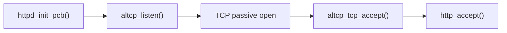
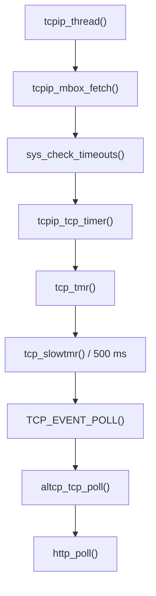
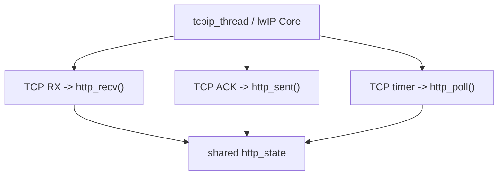
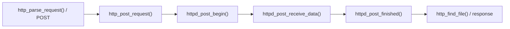
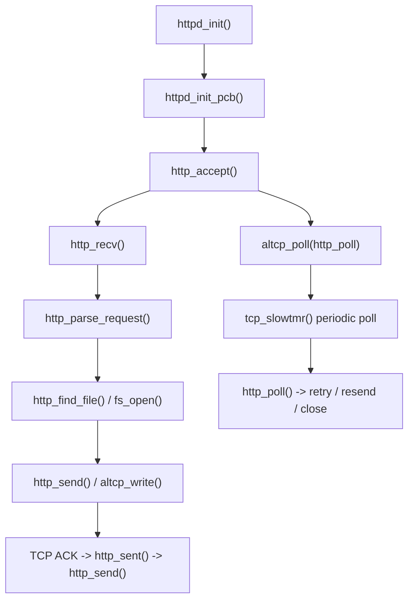

<meta name="referrer" content="no-referrer" />

# 教程 32：从 `httpd_init()` 到 `http_sent()`——HTTPD、altcp、fsdata 与 HTTP 连接生命周期

> 摘要：从 lwIP HTTPD 的真实初始化入口追踪监听、连接状态、请求解析、fsdata 文件查找、TCP 背压与 ACK 驱动续传，理解 altcp 如何把 HTTP 应用与 TCP/TLS 传输解耦。

[TOC]

Stage 07～10 已经建立 TCP handshake、byte stream、ACK、重传与乱序处理。Stage 32 进入 lwIP 自带的 **HTTPD（HTTP server application）**：`altcp` 是 lwIP 的 TCP-like connection abstraction，用统一接口承接普通 TCP 或后续 TLS wrapper；`fsdata` 则是把静态网页/资源生成成可编译进 firmware 的 C 数据，使没有 POSIX filesystem 的 MCU 也能提供 HTTP 文件。[S1](#source-s1)[S2](#source-s2)[S6](#source-s6)[S7](#source-s7)

HTTP（Hypertext Transfer Protocol，超文本传输协议）由 **Client（发起请求的一方）**向 **Server（接收请求并返回结果的一方）**发送 request（请求），Server 再返回 response（响应）。这一篇采用 Source-driven 主线：协议基线只服务于后面的真实源码，随后从 `httpd_init()` 按实际执行顺序下钻。

## 0. 进入源码前先建立 HTTP 最小协议模型

### 0.1 建议提前阅读：用于加速理解，不是正文前置条件

1. [MDN — Overview of HTTP](https://developer.mozilla.org/en-US/docs/Web/HTTP/Guides/Overview) 与 [HTTP messages](https://developer.mozilla.org/en-US/docs/Web/HTTP/Guides/Messages)
   - 用途：快速建立 HTTP 一次请求—响应交互与消息组织方式的直观模型。[S10](#source-s10)
2. [RFC 9110 — HTTP Semantics](https://www.rfc-editor.org/rfc/rfc9110.html)
   - 用途：确认 HTTP 操作、目标资源与响应结果等语义边界。[S11](#source-s11)
3. [RFC 9112 — HTTP/1.1](https://www.rfc-editor.org/rfc/rfc9112.html)
   - 用途：确认 HTTP/1.1 线上消息格式、消息边界和连接复用/关闭规则。[S5](#source-s5)

即使不打开这些链接，下面的协议模型也足以继续阅读当前源码。

### 0.2 HTTP 是 request/response 协议，TCP 只负责承载字节流

HTTP（Hypertext Transfer Protocol，超文本传输协议）位于应用层。**Client** 主动向 **Server** 发送 request，Server 解析 request 后返回 response。HTTP/1.1 通常运行在 TCP 可靠字节流之上；因此 TCP 负责“字节可靠到达”，HTTP 自己负责“这些字节属于哪条 request/response、表达什么应用语义”。[S5](#source-s5)[S11](#source-s11)

一条最小 HTTP/1.1 request 可以抽象为：

```text
GET /index.html HTTP/1.1\r\n     <- request line
Host: device.local\r\n          <- Header field
\r\n                              <- Header 结束
```

这里：

- **Method（方法）**描述 Client 希望 Server 对目标资源执行什么动作，例如 `GET` 获取资源、`POST` 提交数据；
- **Request Target（请求目标）**指出本次操作针对哪个资源，例如 `/index.html`。当前 lwIP HTTPD 内部常把这个路径保存在名为 `uri` 的变量中；
- **Header（首部字段）**携带元数据。`Host` 指明本次请求针对的主机/authority，`Content-Length` 可声明 Body 长度，`Connection` 可表达连接管理意图；
- **Body（消息体）**是可选的应用数据。GET 通常没有 request body，而 POST 常通过 Body 携带表单或其他输入。[S5](#source-s5)[S11](#source-s11)

Server 的 response 则从 **status line（状态行）**开始，例如 `HTTP/1.1 200 OK`，后面跟 Header、空行和可选 Body。`200` 这类 **status code（状态码）**属于 HTTP 应用语义，不是 TCP 的成功/失败码。[S5](#source-s5)[S11](#source-s11)

最重要的边界是：**HTTP message boundary 不等于 TCP segment boundary，也不等于 lwIP `pbuf` boundary。** TCP 只提供连续字节流，一条 request 可能跨多个 TCP segment / pbuf，到达时也可能和后续数据处在不同切分位置；HTTP parser 必须自己找到 request line、Header 结束和 Body 长度。[S5](#source-s5) 这正是后面 `http_recv()` 不能假定“一次 callback 就收到完整 request”的原因。

HTTP/1.1 还允许 **persistent connection（持久连接）**：同一条 TCP connection 可以承载多组 request/response，而不是每次 response 后都立刻关闭。lwIP HTTPD 是否启用 Keep-Alive 是编译配置与当前 feature 的实现问题，后文在 `http_poll()` / EOF 路径再映射到源码。[S4](#source-s4)[S5](#source-s5)

### 0.3 本篇要追的协议总流程

下面只画当前 HTTPD 主线真正需要的协议动作；CGI、SSI、POST 等 feature 在后文第一次改变调用路径时再展开。



从协议动作映射到源码，主线是：[S1](#source-s1)[S2](#source-s2)[S3](#source-s3)

| HTTP/连接阶段 | 协议或传输动作 | lwIP 主要入口 | 当前对象/状态 | 下一步 |
| --- | --- | --- | --- | --- |
| Server 准备监听 | 尚无 HTTP message | `httpd_init()` → `httpd_init_pcb()` | altcp listener | 等待 TCP passive open |
| 接受新连接 | TCP connection established | `http_accept()` | 新 `altcp_pcb` + `http_state` | 等待 request bytes |
| 接收 request | request line/Header/Body 到达 | `http_recv()` | RX `pbuf`、`http_state` | 进入 parser |
| 解析 request | Method + Request Target | `http_parse_request()` | request buffer/URI | 查找资源或进入 POST 路径 |
| 选择资源 | 将路径映射到 server resource | `http_find_file()` → `fs_open()` | `fs_file` | 准备 response |
| 发送 response | status/Header/Body bytes | `http_send()` / `http_write()` | TCP send buffer、文件偏移 | 等 ACK |
| ACK 推进 | 已发送字节被确认 | `http_sent()` | 更新剩余 response | 继续发送或结束/Keep-Alive |

从下一节开始，源码按这张表的真实执行顺序展开。

## 1. 从 `httpd_init()` 开始：HTTPD 先创建一个 altcp listener

当前 pinned upstream `master` 为 commit `d08f4773edd0182b7910fc8f046eed82ffcd67c9`。`httpd_init()` 是普通 HTTP server 的公开初始化入口。[S1](#source-s1)

它做的事情很少，但这个入口决定了后面整条调用链：

```text
httpd_init()
  -> altcp_tcp_new_ip_type(IPADDR_TYPE_ANY)
  -> httpd_init_pcb(..., HTTPD_SERVER_PORT)
```

这里第一次出现 `altcp`。它不是新的传输协议，而是 lwIP 在 TCP-like connection 之上提供的一层函数分发表抽象。对普通 HTTP，`altcp_tcp_new_ip_type()` 最终包装一个真实 `tcp_pcb`；到了 Stage 33，HTTPD 可以把这个下层替换成 TLS-over-TCP，而上层仍然继续调用 `altcp_bind()`、`altcp_listen()`、`altcp_write()` 等同一组接口。[S2](#source-s2)[S3](#source-s3)

换句话说，Stage 32 的第一个关键关系不是：

```text
HTTPD -> tcp_*
```

而是：


`altcp_tcp_new_ip_type()` 内部先创建 `tcp_pcb`，再分配 `altcp_pcb`，把 `altcp_tcp_functions` 安装到这个 wrapper，并把真实 TCP PCB 保存为下层 state。[S3](#source-s3)

在 `NO_SYS=0` 的多线程 Port 中，这类 callback-style/raw-style API 仍属于 lwIP core context：应从 `tcpip_thread` 调用，或在启用 `LWIP_TCPIP_CORE_LOCKING` 时持有 core lock。官方 multithreading 文档明确指出 callback-style API 不能从任意 RTOS task/IRQ 直接调用；Stage 11 已经解释过这个执行上下文，这里把它重新绑定到 `httpd_init()`。[S8](#source-s8)

## 2. 进入 `httpd_init_pcb()`：bind、listen、accept 才真正建立 server 入口

`httpd_init()` 得到 `altcp_pcb` 后直接调用 `httpd_init_pcb()`。该函数依次完成：

```text
altcp_setprio()
  -> altcp_bind(IP_ANY_TYPE, port)
  -> altcp_listen()
  -> altcp_accept(..., http_accept)
```

因此 `httpd_init_pcb()` 返回之后，HTTPD 还没有一条具体客户端连接；它只有 listener。后续 TCP 三次握手由 Stage 07 已经学过的 TCP core 处理。握手完成并被 listener 接受时，altcp TCP adapter 把新的 `tcp_pcb` 包装成新的 `altcp_pcb`，再调用 HTTPD 注册的 `http_accept()`。[S1](#source-s1)[S3](#source-s3)

这一段的桥接关系可以压缩为：



Stage 07 的 TCP listener 到这里终于被一个真实 application callback 消费。

## 3. 进入 `http_accept()`：`struct http_state` 成为一条 HTTP 连接的应用层状态

`http_accept()` 收到新的 `altcp_pcb` 后首先分配 `struct http_state`。这个对象不是 TCP PCB 的替代品，而是 HTTPD 自己的 per-connection state。[S1](#source-s1)

它保存的内容包括：

- 当前连接对应的 `altcp_pcb`；
- 当前打开的 `fs_file`；
- 尚未发送的文件指针和剩余长度；
- 请求缓存或 request pbuf chain；
- retry/poll 状态；
- 可选 Keep-Alive 状态；
- 可选 SSI、CGI、POST 状态；
- 可选 dynamic header 和 dynamic file read 状态。

这体现出很重要的一层分工：

```text
TCP/altcp PCB
  负责：transport connection、send/receive window、ACK、retransmission

http_state
  负责：HTTP request/response、URI、文件、HTTP feature、应用层生命周期
```

`http_accept()` 随后把 `http_state` 通过 `altcp_arg()` 绑定到连接，并注册四个关键 callback：[S1](#source-s1)

```text
altcp_recv(..., http_recv)
altcp_err (..., http_err)
altcp_poll(..., http_poll, ...)
altcp_sent(..., http_sent)
```

后面的 HTTPD 主线并不是一个同步的 `while (recv) { send; }`。它是 callback-driven state machine：RX、ACK、poll、error 都会重新进入同一个 `http_state`。

## 4. TCP 数据到达后进入 `http_recv()`：先消费 pbuf，再决定它是 request 还是 POST body

浏览器发送 HTTP request 后，TCP core 最终通过 altcp adapter 调用 `http_recv()`。[S1](#source-s1)

`http_recv()` 首先处理三类边界：

1. `err != ERR_OK`；
2. `p == NULL`，表示下层连接关闭；
3. `hs == NULL`，表示 HTTP connection state 不存在。

正常情况下，HTTPD 会调用 `altcp_recved()` 告诉下层“这些字节已经由应用消费”，然后继续判断当前连接是在接收 POST body，还是仍在等待首个 HTTP request header。[S1](#source-s1)

主路径可以概括为下面这个执行路径阅读版；它是根据当前源码整理的伪代码，不是上游原文：

```c
http_recv(hs, pcb, p, err)
{
    acknowledge_received_bytes_to_altcp();

    if (receiving_post_body)
        pass_pbuf_to_post_handler();
    else if (hs->handle == NULL)
        parsed = http_parse_request(p, hs, pcb);

    if (parsed == ERR_OK)
        http_send(pcb, hs);
}
```

`hs->handle == NULL` 在这里具有清晰语义：response file 还没有初始化，因此收到的数据仍然被解释为 request。等 `http_find_file()` / `http_init_file()` 建立了 `hs->handle` 以后，连接进入“正在发送 response”阶段。

### 4.1 request 不保证只在一个 pbuf 中

当前 lwIP HTTPD 在 HTTP/1.x over TCP 上接收的是连续字节流；HTTP message framing 由 HTTP/1.1 语法决定，不由单个 TCP segment 或单个 pbuf 决定。[S5](#source-s5) 因而一个 request header 既可能落在一个 pbuf，也可能跨多个 pbuf。lwIP HTTPD 为此提供 `LWIP_HTTPD_SUPPORT_REQUESTLIST`：启用后可以暂存 request pbuf，并把待解析内容复制到受 `LWIP_HTTPD_MAX_REQ_LENGTH` 限制的 request buffer 中。[S1](#source-s1)[S4](#source-s4)

因此不能形成“一个 `http_recv()` callback 就等于一个完整 HTTP request”的心智模型。真正的边界由 request parser 是否已经取得完整 message 所需的数据决定，而不是由单个 TCP packet 决定。

## 5. 从 `http_recv()` 进入 `http_parse_request()`：HTTP method 与 URI 在这里变成应用动作

当当前连接尚未开始发送文件时，`http_recv()` 调用 `http_parse_request()`。[S1](#source-s1)

HTTPD 支持的具体 feature 由 `httpd_opts.h` 条件编译控制。核心主线只需要抓住两个结果：

- parser 从字节流中识别 method、URI 与必要 header；
- 成功后把 URI 交给 `http_find_file()`，或者把 POST 交给 POST handler path。

HTTP 规范规定 request-target 属于 request line 的组成部分；lwIP 的实现再把这个 URI 映射到它自己的 ROM/custom filesystem。[S1](#source-s1)[S5](#source-s5)

这也是“协议语义”和“lwIP 实现策略”的边界：HTTP 规定 request/response 的语法与语义，但“URI 最后查 `fsdata.c`”是 lwIP HTTPD 的实现选择。

## 6. 进入 `http_find_file()`：URI 最终由 `fs_open()` 映射到 `FS_ROOT`

`http_find_file()` 会处理默认首页、URI 参数、可选 CGI/SSI，然后调用 `fs_open()` 查找实际 response file。[S1](#source-s1)

继续进入 `fs_open()`。当前 `fs.c` 的默认实现从 `FS_ROOT` 开始遍历 `struct fsdata_file` 链表，根据请求路径比较文件名；命中后，把文件数据地址、长度与 flags 填入 `struct fs_file`。[S6](#source-s6)

因此一个典型静态页面的运行关系是：


### 6.1 `fsdata` 为什么适合 MCU

lwIP 附带 `makefsdata` 工具，把 HTML、CSS、JS 等静态资源转换成 C source 中的 `fsdata_file` 结构。[S7](#source-s7)

这意味着在没有 POSIX filesystem 的 MCU 上，HTTPD 也可以直接从编译进 firmware image 的只读数据提供网页。这里的“file”是 HTTPD filesystem abstraction，不等价于 Linux 上必须存在一个真实磁盘文件。

如果项目启用了 `LWIP_HTTPD_CUSTOM_FILES` 或 dynamic file read，则 `fs_open_custom()` / `fs_read_custom()` 可以把这一层替换成产品自己的存储或动态数据源；但这些属于扩展路径，不改变本文的主线。

## 7. 返回 `http_recv()` 后进入 `http_send()`：HTTPD 必须服从 TCP send buffer 的背压

`http_parse_request()` 成功并初始化 response file 后返回 `http_recv()`；`http_recv()` 立即调用 `http_send()` 尝试发送 header 和 body。[S1](#source-s1)

这里不能把“一个 response file”理解成“一次 `altcp_write()` 全发完”。HTTPD 会先读取当前 `altcp_sndbuf()` 可用空间，再根据 header/body 剩余长度决定本轮能 enqueue 多少字节。[S1](#source-s1)

简化后的逻辑是：

```c
http_send(pcb, hs)
{
    send_available_headers_without_exceeding_altcp_sndbuf();
    send_available_file_bytes_without_exceeding_altcp_sndbuf();
}
```

最终写入通过 `http_write()` 落到 `altcp_write()`；普通 HTTP 的 altcp TCP layer 再映射到 TCP Raw API。[S1](#source-s1)[S2](#source-s2)[S3](#source-s3)

如果当前 send buffer 不足，HTTPD 不应该自己阻塞等待。它保存 `hs->file`、`hs->left` 等状态并返回，等待后续 ACK 释放发送空间。

这和 Stage 08 已经学过的 TCP send queue 正好接起来：

```text
HTTPD response bytes
  -> altcp_write()
  -> TCP send buffer / unsent
  -> network
  -> peer ACK
  -> TCP frees send capacity
  -> http_sent()
  -> http_send() continues
```

## 8. ACK 到达后进入 `http_sent()`：response 是由 ACK 一段一段推进的

`http_accept()` 已经注册 `http_sent()`。当下层确认此前发送的数据后，altcp 触发这个 callback。[S1](#source-s1)

`http_sent()` 本身非常短：重置 retry counter，然后再次调用 `http_send()`。

因此 `http_sent()` 的意义不在代码行数，而在控制流：它把 TCP ACK 产生的新发送额度重新交给 HTTP application。


这一点也解释了为什么 HTTPD 不需要应用线程阻塞在“等发送完成”上。连接进度由 TCP callback 驱动。

## 9. `http_poll()` 不是独立线程：它从 TCP timer 回调链进入 HTTPD

`http_accept()` 注册 `http_poll()` 时，只是在当前 connection 上登记一个 callback 和 poll interval；这里**没有创建 HTTPD 线程，也没有创建 `http_poll` 线程**。[S1](#source-s1)

继续看 `http_accept()` 的真实注册点：[S1](#source-s1)

```c
  /* Set up the various callback functions */
  altcp_recv(pcb, http_recv);
  altcp_err(pcb, http_err);
  altcp_poll(pcb, http_poll, HTTPD_POLL_INTERVAL);
  altcp_sent(pcb, http_sent);
```

这四个 callback 的触发源不同：

```text
RX data / close   -> http_recv()
TCP error         -> http_err()
ACK progress      -> http_sent()
TCP periodic poll -> http_poll()
```

前面已经解释了 `http_recv()` 和 `http_sent()`；`http_poll()` 需要继续向下追到 TCP timer，才能知道它究竟在哪里执行。

### 9.1 `altcp_poll()` 怎样一路注册到真实 `tcp_pcb`

`altcp_poll()` 先把 upper callback 和 interval 保存到 `altcp_pcb`，然后调用当前 altcp implementation 的 `set_poll` function。[S2](#source-s2)

```c
void
altcp_poll(struct altcp_pcb *conn, altcp_poll_fn poll, u8_t interval)
{
  if (conn) {
    conn->poll = poll;
    conn->pollinterval = interval;
    if (conn->fns && conn->fns->set_poll) {
      conn->fns->set_poll(conn, interval);
    }
  }
}
```

普通 HTTP 当前使用 altcp TCP adapter，因此 `set_poll` 进入 `altcp_tcp_set_poll()`；它再把真实 TCP PCB 的 poll callback 注册成 `altcp_tcp_poll()`。[S3](#source-s3)

```c
static void
altcp_tcp_set_poll(struct altcp_pcb *conn, u8_t interval)
{
  if (conn != NULL) {
    struct tcp_pcb *pcb = (struct tcp_pcb *)conn->state;
    ALTCP_TCP_ASSERT_CONN(conn);
    tcp_poll(pcb, altcp_tcp_poll, interval);
  }
}
```

因此，真正保存到 `tcp_pcb` 的不是 `http_poll()` 本身，而是这个 adapter callback：

```text
http_poll
  ↑ conn->poll
altcp_tcp_poll
  ↑ tcp_pcb->poll
TCP timer
```

当 TCP Core 后面触发 `tcp_pcb->poll` 时，`altcp_tcp_poll()` 再转调 `conn->poll()`，最终才到 HTTPD 的 `http_poll()`。[S3](#source-s3)

### 9.2 谁触发 `tcp_pcb->poll`：`tcp_tmr()` → `tcp_slowtmr()`

TCP timer 的入口是 `tcp_tmr()`。当前实现每次先跑 fast timer；每隔一次调用再运行 `tcp_slowtmr()`，因此 slow timer 周期是 500 ms。[S9](#source-s9)

```c
void
tcp_tmr(void)
{
  /* Call tcp_fasttmr() every 250 ms */
  tcp_fasttmr();

  if (++tcp_timer & 1) {
    /* Call tcp_slowtmr() every 500 ms, i.e., every other timer
       tcp_tmr() is called. */
    tcp_slowtmr();
  }
}
```

`tcp_slowtmr()` 遍历 active PCB，并为每条连接推进 `polltmr`。达到该 PCB 的 `pollinterval` 后，才触发 application poll event：[S9](#source-s9)

```c
      /* We check if we should poll the connection. */
      ++prev->polltmr;
      if (prev->polltmr >= prev->pollinterval) {
        prev->polltmr = 0;
        LWIP_DEBUGF(TCP_DEBUG, ("tcp_slowtmr: polling application\n"));
        tcp_active_pcbs_changed = 0;
        TCP_EVENT_POLL(prev, err);
        if (tcp_active_pcbs_changed) {
          goto tcp_slowtmr_start;
        }
        /* if err == ERR_ABRT, 'prev' is already deallocated */
        if (err == ERR_OK) {
          tcp_output(prev);
        }
      }
```

HTTPD 默认配置是：[S4](#source-s4)

```c
#define HTTPD_POLL_INTERVAL                 4
```

`pollinterval` 的单位是 500 ms 的 TCP slow timer，所以默认：

```text
4 × 500 ms = 2 s
```

也就是说，一条 HTTP connection 大约每 2 秒获得一次 `http_poll()` 机会。

### 9.3 标准 `NO_SYS=0` 下，`http_poll()` 实际运行在 `tcpip_thread`

还差最后一段：`tcp_tmr()` 又是谁调用的？

当前 timer implementation 在有 active/TIME-WAIT TCP PCB 时通过 `sys_timeout()` 安排 `tcpip_tcp_timer()`；timer callback 再调用 `tcp_tmr()`。[S9](#source-s9)

```c
static void
tcpip_tcp_timer(void *arg)
{
  LWIP_UNUSED_ARG(arg);

  /* call TCP timer handler */
  tcp_tmr();
  /* timer still needed? */
  if (tcp_active_pcbs || tcp_tw_pcbs) {
    /* restart timer */
    sys_timeout(TCP_TMR_INTERVAL, tcpip_tcp_timer, NULL);
  } else {
    /* disable timer */
    tcpip_tcp_timer_active = 0;
  }
}
```

在标准 `NO_SYS=0`、未自定义 timer 的线程模型里，`tcpip_thread()` 的主循环调用 `tcpip_mbox_fetch()`；这个 helper 在等待 mailbox message 的同时处理到期 timeout。[S9](#source-s9)

```c
  while (1) {                          /* MAIN Loop */
    LWIP_TCPIP_THREAD_ALIVE();
    /* wait for a message, timeouts are processed while waiting */
    tcpip_mbox_fetch(&tcpip_mbox, (void **)&msg);
    if (msg == NULL) {
      LWIP_DEBUGF(TCPIP_DEBUG, ("tcpip_thread: invalid message: NULL\n"));
      LWIP_ASSERT("tcpip_thread: invalid message", 0);
      continue;
    }
    tcpip_thread_handle_msg(msg);
  }
```

而 `tcpip_mbox_fetch()` 超时后直接调用 `sys_check_timeouts()`：[S9](#source-s9)

```c
  res = sys_arch_mbox_fetch(mbox, msg, sleeptime);
  LOCK_TCPIP_CORE();
  if (res == SYS_ARCH_TIMEOUT) {
    /* If a SYS_ARCH_TIMEOUT value is returned, a timeout occurred
       before a message could be fetched. */
    sys_check_timeouts();
    /* We try again to fetch a message from the mbox. */
    goto again;
  }
```

因此当前标准 OS mode 的完整执行链是：



所以 `http_poll()` 的执行上下文是：

> **标准 `NO_SYS=0` + lwIP 内建 timer 模型下，`http_poll()` 运行在 `tcpip_thread` / lwIP Core context 中。**

它不是 application task，也不是独立 HTTPD worker thread。

这个结论不能无条件推广到所有 Port：

- `NO_SYS=1` 时没有 `tcpip_thread`，应用 main loop 周期调用 `sys_check_timeouts()`，poll callback 就运行在该调用上下文；[S9](#source-s9)
- `LWIP_TIMERS_CUSTOM=1` 时 timer execution context 由 Port 自己定义，但仍必须满足 lwIP Core 的线程安全约束；[S8](#source-s8)[S9](#source-s9)
- `LWIP_TCPIP_CORE_LOCKING` 改变的是其他线程进入 Core API 的保护方式，不会把标准 TCP timer 自动变成 HTTPD 独立线程。[S8](#source-s8)

### 9.4 `http_poll()` 自己做什么：retry、补发与资源回收

现在再回到 `http_poll()` 本体就容易理解了。每次 poll 它都会推进 `hs->retries`；达到 `HTTPD_MAX_RETRIES` 后关闭连接。如果当前已经有 response file，则再尝试一次 `http_send()`；确实 enqueue 了数据时再调用 `altcp_output()`。[S1](#source-s1)

```c
  } else {
    hs->retries++;
    if (hs->retries == HTTPD_MAX_RETRIES) {
      LWIP_DEBUGF(HTTPD_DEBUG, ("http_poll: too many retries, close\n"));
      http_close_conn(pcb, hs);
      return ERR_OK;
    }

    /* If this connection has a file open, try to send some more data. If
     * it has not yet received a GET request, don't do this since it will
     * cause the connection to close immediately. */
    if (hs->handle) {
      LWIP_DEBUGF(HTTPD_DEBUG | LWIP_DBG_TRACE, ("http_poll: try to send more data\n"));
      if (http_send(pcb, hs)) {
        /* If we wrote anything to be sent, go ahead and send it now. */
        LWIP_DEBUGF(HTTPD_DEBUG | LWIP_DBG_TRACE, ("tcp_output\n"));
        altcp_output(pcb);
      }
    }
  }
```

`http_sent()` 会把 `hs->retries` 重置为 0，所以 retry counter 表示的是“连续若干 poll 周期都没有被 sent progress 清零”的停滞程度。[S1](#source-s1) 默认 `HTTPD_POLL_INTERVAL=4`、`HTTPD_MAX_RETRIES=4` 时，poll 大约每 2 秒一次；若始终没有发送进展，约 8 秒后达到关闭条件。

当文件发送到 EOF 后，HTTPD 会关闭 `fs_file`、释放 SSI/request/dynamic-buffer 状态，并根据 Keep-Alive 配置决定复用连接还是关闭 TCP。[S1](#source-s1)

因此一条 HTTP connection 的 callback/线程心智模型应当是：



三个 callback 操作的是同一个 `http_state`，并不是三个并发 HTTPD worker 在竞争这份状态。

### 9.5 HTTP/1.1 Keep-Alive 在 lwIP 中是可选功能

RFC 9112 §9.3 定义了 HTTP/1.1 persistent connection 的语义；当前 `httpd_opts.h` 中 `LWIP_HTTPD_SUPPORT_11_KEEPALIVE` 默认关闭，因此 lwIP 是否复用连接是实现配置，而不是因为“HTTP/1.1”字样就自动成立。[S5](#source-s5)[S4](#source-s4)

启用后，HTTPD 需要正确处理 response length/header 与连接复用条件。这个开关不是“打开后一定更快”的无条件优化：长连接减少重复 TCP 建连成本，但会让每个 peer 更长时间占用 PCB、HTTP state 和内存，因此 MCU 上需要结合并发连接数和资源预算选择。

## 10. CGI、SSI、POST、Dynamic Headers、Custom Files 分别是干什么的

这些选项不是五套新的 HTTP server 架构，而是给 Stage 32 已经建立的 request→response 主链增加不同的**内容生成或输入处理能力**。第一次接触时，先区分它们解决的问题，再看源码插入点。[S1](#source-s1)[S4](#source-s4)[S6](#source-s6)

| Feature | 它解决什么问题 | MCU/嵌入式典型用途 | 核心方向 |
| --- | --- | --- | --- |
| CGI | 根据 URI/query 参数执行应用动作，并决定返回哪个页面 | `/led.cgi?state=1` 控制 GPIO、修改简单参数 | request → application action → response URI |
| SSI | 在静态文件发送过程中，把 `<!--#tag-->` 替换成运行时数据 | 在状态页插入温度、IP、uptime、传感器值 | static file + runtime value → response body |
| POST | 接收 request body，而不仅是 URI/query 参数 | 配置表单、JSON 参数、较大控制数据 | request body → application callback |
| Dynamic Headers | 运行时生成 HTTP response header，而不是把 header 预先烘焙进每个 fsdata file | 动态 Content-Length、Content-Type、Connection/Keep-Alive | file metadata/state → response header |
| Custom Files | 让 HTTPD 打开 `fsdata` 之外的资源 | 外部 Flash、虚拟文件、运行时 JSON/状态资源 | URI → application-provided file source |

### 10.1 CGI：用 URI 参数触发动作，再返回一个 response URI

lwIP 的 old-style CGI 不是 Apache/PHP 那种通用脚本运行环境。它更像一个很轻量的“URL → C handler”分发表。[S4](#source-s4)

例如：

```text
GET /led.cgi?state=1
        ↓
CGI handler
        ↓
set_led(1)
        ↓
handler 返回 "/ok.html"
        ↓
fs_open("/ok.html")
```

当前源码在 `http_find_file()` 中先提取 URI parameters，匹配已注册 CGI URL，调用 handler；handler 返回的新 URI 随后继续进入普通 `fs_open()`。[S1](#source-s1)

```c
#if LWIP_HTTPD_CGI
    http_cgi_paramcount = -1;
    /* Does the base URI we have isolated correspond to a CGI handler? */
    if (httpd_num_cgis && httpd_cgis) {
      for (i = 0; i < httpd_num_cgis; i++) {
        if (strcmp(uri, httpd_cgis[i].pcCGIName) == 0) {
          /*
           * We found a CGI that handles this URI so extract the
           * parameters and call the handler.
           */
          http_cgi_paramcount = extract_uri_parameters(hs, params);
          uri = httpd_cgis[i].pfnCGIHandler(i, http_cgi_paramcount, hs->params,
                                         hs->param_vals);
          break;
        }
      }
    }
#endif /* LWIP_HTTPD_CGI */
```

CGI 因而适合“一个 request 触发一次小动作，再返回固定/静态页面”的 MCU 场景。

### 10.2 SSI：静态页面不重做，只替换其中少量动态 tag

SSI（Server-Side Includes）适合“页面大部分是静态 HTML，但其中几个字段来自运行时状态”。当前 HTTPD 会扫描 SSI-enabled 文件中的 tag，并调用预注册 handler 生成插入字符串。[S4](#source-s4)

例如静态页面包含：

```html
Temperature: <!--#temp-->
IP Address: <!--#ip-->
```

发送时的数据流是：

```text
fsdata 中的静态 HTML
        ↓
http_send_data_ssi()
        ↓
发现 <!--#temp-->
        ↓
SSI handler 读取实时温度
        ↓
"27.3 C"
        ↓
插入 response body
```

它和 CGI 的区别是：

```text
CGI
  -> request 参数触发应用动作，并决定“返回哪个资源”

SSI
  -> 已经选定某个资源，在发送 body 时替换其中的动态内容
```

所以设备状态页通常更适合 SSI，而简单控制动作通常更适合 CGI。当前实现还限制 tag 名和单次插入长度，以控制 MCU RAM 使用。[S4](#source-s4)

### 10.3 POST：接收 request body，适合配置表单和较大的输入数据

GET/CGI 常把参数放在 URI；POST 则允许 client 在 HTTP request body 中携带数据。当前 lwIP HTTPD 在 parser 识别 `POST` 后进入 `http_post_request()`，先解析 `Content-Length`，再调用 application 的 `httpd_post_begin()`。[S1](#source-s1)

```c
          err = httpd_post_begin(hs, uri, hdr_start_after_uri, hdr_data_len, content_len,
                                 http_uri_buf, LWIP_HTTPD_URI_BUF_LEN, &post_auto_wnd);
          if (err == ERR_OK) {
            /* try to pass in data of the first pbuf(s) */
            struct pbuf *q = inp;
            u16_t start_offset = hdr_len;
```

后续 body 可以跨多个 TCP/pbuf callback 到达。HTTPD 通过 `http_post_rxpbuf()` 把 body pbuf 交给 application：[S1](#source-s1)

```c
  if (p != NULL) {
    err = httpd_post_receive_data(hs, p);
  } else {
    err = ERR_OK;
  }
```

body 全部处理完后，再调用 `httpd_post_finished()` 取得 response URI，并重新回到 `http_find_file()`。[S1](#source-s1)

因此 POST 主线是：



如果处理端比网络接收慢，例如 body 需要写 Flash，`LWIP_HTTPD_POST_MANUAL_WND` 允许 application 延后归还 TCP receive window，从而利用 TCP flow control 限制 sender；这个选项解决的是**接收背压**，不是 HTTP 协议新增功能。[S1](#source-s1)[S4](#source-s4)

### 10.4 Dynamic Headers：header 运行时生成，而不是每个静态文件都自带一份

默认 `LWIP_HTTPD_DYNAMIC_HEADERS=0` 时，`makefsdata` 可以把 HTTP response header 和文件内容一起预生成进 `fsdata`。这样代码更小，但每个静态资源都要保存自己的 header，readonly fsdata 会更大一些。[S4](#source-s4)

开启 `LWIP_HTTPD_DYNAMIC_HEADERS` 后，`http_init_file()` 根据 URI/file state 调用 `get_http_headers()` 生成 header：[S1](#source-s1)

```c
#if LWIP_HTTPD_DYNAMIC_HEADERS
  /* Determine the HTTP headers to send based on the file extension of
   * the requested URI. */
  if ((hs->handle == NULL) || ((hs->handle->flags & FS_FILE_FLAGS_HEADER_INCLUDED) == 0)) {
    get_http_headers(hs, uri);
  }
#else /* LWIP_HTTPD_DYNAMIC_HEADERS */
  LWIP_UNUSED_ARG(uri);
#endif /* LWIP_HTTPD_DYNAMIC_HEADERS */
```

它解决的是“header 需要根据当前 response/file/connection 动态决定”的问题，而不是动态生成整个 body。

### 10.5 Custom Files：让 URI 指向 `fsdata` 之外的数据源

默认 `fs_open()` 只在 `FS_ROOT` / fsdata 中查资源。启用 `LWIP_HTTPD_CUSTOM_FILES` 后，`fs_open()` 会优先调用 application 提供的 `fs_open_custom()`。[S4](#source-s4)[S6](#source-s6)

```c
#if LWIP_HTTPD_CUSTOM_FILES
  if (fs_open_custom(file, name)) {
    file->flags |= FS_FILE_FLAGS_CUSTOM;
    return ERR_OK;
  }
#endif /* LWIP_HTTPD_CUSTOM_FILES */
```

这使得 `/status.json`、外部 SPI Flash 文件、虚拟配置文件等资源不必提前编译进 `fsdata.c`。

如果再启用 `LWIP_HTTPD_DYNAMIC_FILE_READ`，HTTPD 可以通过 `fs_read()` 分块读取文件；对于 custom file，读取最终转到 `fs_read_custom()`。[S4](#source-s4)[S6](#source-s6)

```text
fs_open_custom()
    -> 建立 custom fs_file

fs_read()
    -> fs_read_custom()
    -> 分块产生数据
    -> http_send()
```

因此 Custom Files 与 SSI 也不是同一件事：SSI 是“静态资源中插少量动态值”，Custom Files 则可以让**整个资源的数据来源**由 application 接管。

## 11. 这些 feature 在主调用链的哪里插入

完成用途区分后，再把它们放回 Stage 32 的 Source-driven 主链：[S1](#source-s1)[S4](#source-s4)[S6](#source-s6)

| Feature | 插入位置 | 完成后重新汇入 |
| --- | --- | --- |
| CGI | `http_find_file()` 的 URI/query mapping | handler 返回 URI → `fs_open()` → `http_init_file()` |
| SSI | `http_init_file()` 建 SSI state；body 发送走 `http_send_data_ssi()` | `http_send()` / `http_write()` |
| POST | `http_parse_request()` → `http_post_request()`；后续 body 继续由 `http_recv()` 驱动 | `httpd_post_finished()` → response URI → `http_find_file()` |
| Dynamic Headers | `http_init_file()` 根据 file/URI 调 `get_http_headers()` | `http_send()` header phase → body phase |
| Custom Files | `fs_open()` 优先 `fs_open_custom()`；可选 `fs_read_custom()` | `fs_file` / `http_state` cursor → `http_send()` |

所以这些 feature 改变的是“request 怎样驱动应用动作”“body/header 从哪里得到”，但没有改变连接骨架：

```text
http_recv()
  -> parse / feature-specific processing
  -> response state
  -> http_send()
  -> altcp_write()
  -> TCP ACK
  -> http_sent()
```

## 12. 回看 altcp：Stage 32 为什么故意没有直接写 `tcp_write()`

到这里再回看最初的 `altcp` 才能看到它的价值。`altcp_write()` 自身只是根据 `conn->fns->write` 分发到当前连接层；普通 TCP connection 的函数表进入 altcp TCP adapter。[S2](#source-s2)[S3](#source-s3)

这给 HTTPD 留出一个非常关键的替换点：

```text
Stage 32
HTTPD -> altcp -> TCP

Stage 33
HTTPD -> altcp -> TLS -> TCP
```

HTTPD 的 `http_recv()`、`http_send()`、`http_sent()` 不需要因为 TLS 加密而重写。Stage 33 会从 `https_ex_init()` / `httpd_inits()` 开始，沿 `altcp_tls_new()` 追踪 TLS layer 怎样插入同一条 callback 数据路径。

## 13. Stage 32 的完整调用链

把已经展开过的函数重新串起来：



主线中每一层分别回答一个问题：

- `httpd_init()`：server 从哪里建立；
- `http_accept()`：每条连接的 HTTP state 在哪里产生；
- `http_recv()`：TCP byte stream 怎样进入 HTTP parser；
- `http_find_file()` / `fs_open()`：URI 怎样变成 response data；
- `http_send()`：怎样服从 TCP send-buffer 背压；
- `http_sent()`：ACK 怎样推动剩余 response；
- `http_poll()`：TCP timer 怎样在 lwIP Core context 中周期触发补发与超时回收；
- CGI/SSI/POST/Dynamic Headers/Custom Files：分别在哪个阶段改变 request handling、body/header 或 resource source；
- altcp：为什么同一 HTTPD 可以在下一阶段无缝插入 TLS。

## 资料来源

<a id="source-s1"></a>
### [S1] lwIP HTTPD 源码
- 类型：目标版本上游源码
- 版本：commit `d08f4773edd0182b7910fc8f046eed82ffcd67c9`
- 定位：`src/apps/http/httpd.c`：`httpd_init()`、`httpd_init_pcb()`、`http_accept()`、`http_recv()`、`http_parse_request()`、`http_find_file()`、`http_send()`、`http_sent()`、`http_poll()`、`struct http_state`
- URL/文档：[lwIP httpd.c](https://github.com/lwip-tcpip/lwip/blob/d08f4773edd0182b7910fc8f046eed82ffcd67c9/src/apps/http/httpd.c)
- 使用位置：HTTPD 初始化、callback 注册、request/response、`http_poll()`、Keep-Alive、CGI/SSI/POST、连接生命周期
- 支撑内容：证明当前 HTTPD 的真实 Source-driven 主调用链

<a id="source-s2"></a>
### [S2] lwIP altcp 通用接口
- 类型：目标版本上游源码
- 版本：同上
- 定位：`src/core/altcp.c`：`altcp_connect()`、`altcp_write()`、`altcp_recv()`、`altcp_sent()`、函数表分发
- URL/文档：[lwIP altcp.c](https://github.com/lwip-tcpip/lwip/blob/d08f4773edd0182b7910fc8f046eed82ffcd67c9/src/core/altcp.c)
- 使用位置：“altcp 是什么”“write/recv callback 如何分发”“为 TLS 留出的边界”
- 支撑内容：证明 altcp 是 TCP-like connection abstraction，而不是新的 wire protocol

<a id="source-s3"></a>
### [S3] lwIP altcp TCP adapter
- 类型：目标版本上游源码
- 版本：同上
- 定位：`src/core/altcp_tcp.c`：`altcp_tcp_new_ip_type()`、`altcp_tcp_setup()`、`altcp_tcp_accept()` 与 callback bridge
- URL/文档：[lwIP altcp_tcp.c](https://github.com/lwip-tcpip/lwip/blob/d08f4773edd0182b7910fc8f046eed82ffcd67c9/src/core/altcp_tcp.c)
- 使用位置：“普通 HTTP 如何落到 TCP PCB”“listener accept 如何包装新连接”“`altcp_poll()` 如何桥接到 TCP poll callback”
- 支撑内容：证明 altcp TCP wrapper 与原始 TCP PCB 的对象关系

<a id="source-s4"></a>
### [S4] lwIP HTTPD 编译选项
- 类型：目标版本上游配置头
- 版本：同上
- 定位：`src/include/lwip/apps/httpd_opts.h`：request list、Keep-Alive、SSI、CGI、POST、dynamic headers 等选项
- URL/文档：[lwIP httpd_opts.h](https://github.com/lwip-tcpip/lwip/blob/d08f4773edd0182b7910fc8f046eed82ffcd67c9/src/include/lwip/apps/httpd_opts.h)
- 使用位置：“request 跨 pbuf”“Keep-Alive 默认边界”“CGI/SSI/POST/Dynamic Headers/Custom Files 的用途与编译选项”“HTTPD poll interval”
- 支撑内容：限定当前实现的配置语义，避免把可选 feature 写成固定行为

<a id="source-s5"></a>
### [S5] RFC 9112：HTTP/1.1
- 类型：IETF Internet Standard
- 版本：RFC 9112，2022
- URL/文档：[RFC 9112](https://www.rfc-editor.org/rfc/rfc9112.html)
- 使用位置：“HTTP 是 TCP 上的消息语义”“request line/request target”“持久连接背景”
- 支撑内容：提供 HTTP/1.1 message syntax 与 connection management 的规范背景；lwIP 具体 feature 仍以目标源码为准

<a id="source-s6"></a>
### [S6] lwIP HTTP filesystem
- 类型：目标版本上游源码
- 版本：同上
- 定位：`src/apps/http/fs.c`：`fs_open()`、`fs_close()`、dynamic/custom file read
- URL/文档：[lwIP fs.c](https://github.com/lwip-tcpip/lwip/blob/d08f4773edd0182b7910fc8f046eed82ffcd67c9/src/apps/http/fs.c)
- 使用位置：“URI 到文件”“FS_ROOT / fsdata”“custom file 边界”
- 支撑内容：证明 HTTPD 默认文件查找不是 POSIX filesystem，而是 HTTP filesystem abstraction

<a id="source-s7"></a>
### [S7] lwIP makefsdata
- 类型：目标版本上游工具源码
- 版本：同上
- 定位：`src/apps/http/makefsdata/makefsdata.c`
- URL/文档：[lwIP makefsdata.c](https://github.com/lwip-tcpip/lwip/blob/d08f4773edd0182b7910fc8f046eed82ffcd67c9/src/apps/http/makefsdata/makefsdata.c)
- 使用位置：“静态网页如何变成 fsdata C source”
- 支撑内容：说明 MCU 无磁盘文件系统时仍可把网页资源编译进 firmware image
<a id="source-s8"></a>
### [S8] lwIP Multithreading / Common pitfalls
- 类型：目标版本上游 Doxygen 文档
- 版本：同上
- 定位：`doc/doxygen/main_page.h`：`Multithreading`、`Common pitfalls`
- URL/文档：[lwIP multithreading guidance](https://github.com/lwip-tcpip/lwip/blob/d08f4773edd0182b7910fc8f046eed82ffcd67c9/doc/doxygen/main_page.h)
- 使用位置：“`httpd_init()` 的线程/锁上下文”
- 支撑内容：说明 callback-style API 在 OS mode 下必须位于 TCPIP thread 或正确的 core-locking 保护下
<a id="source-s9"></a>
### [S9] lwIP TCP Timer / Poll 与 `tcpip_thread`
- 类型：目标版本上游源码
- 版本：同上
- 定位：`src/core/tcp.c`：`tcp_tmr()`、`tcp_slowtmr()`、`tcp_poll()`；`src/core/timeouts.c`：`tcpip_tcp_timer()`、`sys_check_timeouts()`；`src/api/tcpip.c`：`tcpip_mbox_fetch()`、`tcpip_thread()`；`src/include/lwip/opt.h`：`LWIP_TIMERS_CUSTOM`
- URL/文档：[lwIP tcp.c](https://github.com/lwip-tcpip/lwip/blob/d08f4773edd0182b7910fc8f046eed82ffcd67c9/src/core/tcp.c)、[lwIP timeouts.c](https://github.com/lwip-tcpip/lwip/blob/d08f4773edd0182b7910fc8f046eed82ffcd67c9/src/core/timeouts.c)、[lwIP tcpip.c](https://github.com/lwip-tcpip/lwip/blob/d08f4773edd0182b7910fc8f046eed82ffcd67c9/src/api/tcpip.c)、[lwIP opt.h](https://github.com/lwip-tcpip/lwip/blob/d08f4773edd0182b7910fc8f046eed82ffcd67c9/src/include/lwip/opt.h)
- 使用位置：“`http_poll()` 谁触发”“默认 2 s poll interval”“标准 `NO_SYS=0` 下在哪个线程执行”“`NO_SYS=1`/custom timer 的边界”
- 支撑内容：证明 HTTPD poll 最终由 TCP slow timer 触发，标准 OS mode 的 timeout processing 运行在 `tcpip_thread` / lwIP Core context

<a id="source-s10"></a>
### [S10] MDN HTTP Overview / Messages
- 类型：成熟协议学习资料
- 版本：MDN Web Docs，访问于 2026-10-03
- URL/文档：[Overview of HTTP](https://developer.mozilla.org/en-US/docs/Web/HTTP/Guides/Overview)、[HTTP messages](https://developer.mozilla.org/en-US/docs/Web/HTTP/Guides/Messages)
- 使用位置：HTTP 初学者基线、request/response message 结构与总流程
- 支撑内容：提供 client/server、request/response 与 HTTP message 结构的直观学习入口；正文仍自行建立当前源码所需的协议模型

<a id="source-s11"></a>
### [S11] RFC 9110：HTTP Semantics
- 类型：IETF Internet Standard
- 版本：RFC 9110，2022
- URL/文档：[RFC 9110](https://www.rfc-editor.org/rfc/rfc9110.html)
- 使用位置：HTTP 初学者基线、request/response message 结构与总流程、method/request target 语义边界
- 支撑内容：定义 HTTP 的 request/response 核心语义、target resource 与 method 语义；HTTP/1.1 具体 wire syntax 仍由 [S5] RFC 9112 承担
