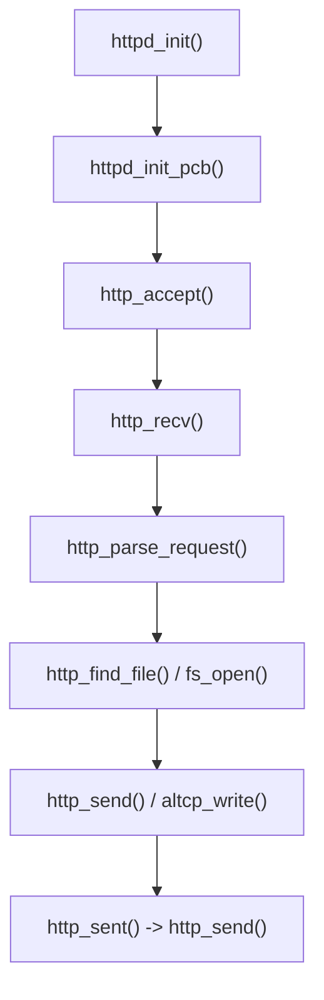

<meta name="referrer" content="no-referrer" />

# 教程 32：从 `httpd_init()` 到 `http_sent()`——HTTPD、altcp、fsdata 与 HTTP 连接生命周期

> 摘要：从 lwIP HTTPD 的真实初始化入口追踪监听、连接状态、请求解析、fsdata 文件查找、TCP 背压与 ACK 驱动续传，理解 altcp 如何把 HTTP 应用与 TCP/TLS 传输解耦。

[TOC]

Stage 07～10 已经把 TCP 的握手、数据发送、ACK、重传与乱序路径建立起来。Stage 32 不再从 TCP 内核重新开始，而是进入 lwIP 自带的 HTTP server application：`httpd_init()`。[S1](#source-s1)

这一篇采用 Source-driven 主线。重点不是把 HTTP 规范从头讲一遍，而是回答一个更具体的问题：**浏览器建立 TCP 连接后，一条 HTTP request 怎样进入 lwIP HTTPD，怎样找到静态资源，又怎样借助 TCP send buffer 和 ACK 把 response 逐段送完。**

## 1. 从 `httpd_init()` 开始：HTTPD 先创建一个 altcp listener

当前 pinned upstream `master` 为 commit `d08f4773edd0182b7910fc8f046eed82ffcd67c9`。`httpd_init()` 是普通 HTTP server 的公开初始化入口。[S1](#source-s1)

它做的事情很少，但这个入口决定了后面整条调用链：

```text
httpd_init()
  -> altcp_tcp_new_ip_type(IPADDR_TYPE_ANY)
  -> httpd_init_pcb(..., HTTPD_SERVER_PORT)
```

这里第一次出现 `altcp`。它不是新的传输协议，而是 lwIP 在 TCP-like connection 之上提供的一层函数分发表抽象。对普通 HTTP，`altcp_tcp_new_ip_type()` 最终包装一个真实 `tcp_pcb`；到了 Stage 33，HTTPD 可以把这个下层替换成 TLS-over-TCP，而上层仍然继续调用 `altcp_bind()`、`altcp_listen()`、`altcp_write()` 等同一组接口。[S2](#source-s2)[S3](#source-s3)

换句话说，Stage 32 的第一个关键关系不是：

```text
HTTPD -> tcp_*
```

而是：


`altcp_tcp_new_ip_type()` 内部先创建 `tcp_pcb`，再分配 `altcp_pcb`，把 `altcp_tcp_functions` 安装到这个 wrapper，并把真实 TCP PCB 保存为下层 state。[S3](#source-s3)

在 `NO_SYS=0` 的多线程 Port 中，这类 callback-style/raw-style API 仍属于 lwIP core context：应从 `tcpip_thread` 调用，或在启用 `LWIP_TCPIP_CORE_LOCKING` 时持有 core lock。官方 multithreading 文档明确指出 callback-style API 不能从任意 RTOS task/IRQ 直接调用；Stage 11 已经解释过这个执行上下文，这里把它重新绑定到 `httpd_init()`。[S8](#source-s8)

## 2. 进入 `httpd_init_pcb()`：bind、listen、accept 才真正建立 server 入口

`httpd_init()` 得到 `altcp_pcb` 后直接调用 `httpd_init_pcb()`。该函数依次完成：

```text
altcp_setprio()
  -> altcp_bind(IP_ANY_TYPE, port)
  -> altcp_listen()
  -> altcp_accept(..., http_accept)
```

因此 `httpd_init_pcb()` 返回之后，HTTPD 还没有一条具体客户端连接；它只有 listener。后续 TCP 三次握手由 Stage 07 已经学过的 TCP core 处理。握手完成并被 listener 接受时，altcp TCP adapter 把新的 `tcp_pcb` 包装成新的 `altcp_pcb`，再调用 HTTPD 注册的 `http_accept()`。[S1](#source-s1)[S3](#source-s3)

这一段的桥接关系可以压缩为：


Stage 07 的 TCP listener 到这里终于被一个真实 application callback 消费。

## 3. 进入 `http_accept()`：`struct http_state` 成为一条 HTTP 连接的应用层状态

`http_accept()` 收到新的 `altcp_pcb` 后首先分配 `struct http_state`。这个对象不是 TCP PCB 的替代品，而是 HTTPD 自己的 per-connection state。[S1](#source-s1)

它保存的内容包括：

- 当前连接对应的 `altcp_pcb`；
- 当前打开的 `fs_file`；
- 尚未发送的文件指针和剩余长度；
- 请求缓存或 request pbuf chain；
- retry/poll 状态；
- 可选 Keep-Alive 状态；
- 可选 SSI、CGI、POST 状态；
- 可选 dynamic header 和 dynamic file read 状态。

这体现出很重要的一层分工：

```text
TCP/altcp PCB
  负责：transport connection、send/receive window、ACK、retransmission

http_state
  负责：HTTP request/response、URI、文件、HTTP feature、应用层生命周期
```

`http_accept()` 随后把 `http_state` 通过 `altcp_arg()` 绑定到连接，并注册四个关键 callback：[S1](#source-s1)

```text
altcp_recv(..., http_recv)
altcp_err (..., http_err)
altcp_poll(..., http_poll, ...)
altcp_sent(..., http_sent)
```

后面的 HTTPD 主线并不是一个同步的 `while (recv) { send; }`。它是 callback-driven state machine：RX、ACK、poll、error 都会重新进入同一个 `http_state`。

## 4. TCP 数据到达后进入 `http_recv()`：先消费 pbuf，再决定它是 request 还是 POST body

浏览器发送 HTTP request 后，TCP core 最终通过 altcp adapter 调用 `http_recv()`。[S1](#source-s1)

`http_recv()` 首先处理三类边界：

1. `err != ERR_OK`；
2. `p == NULL`，表示下层连接关闭；
3. `hs == NULL`，表示 HTTP connection state 不存在。

正常情况下，HTTPD 会调用 `altcp_recved()` 告诉下层“这些字节已经由应用消费”，然后继续判断当前连接是在接收 POST body，还是仍在等待首个 HTTP request header。[S1](#source-s1)

主路径可以概括为下面这个执行路径阅读版；它是根据当前源码整理的伪代码，不是上游原文：

```c
http_recv(hs, pcb, p, err)
{
    acknowledge_received_bytes_to_altcp();

    if (receiving_post_body)
        pass_pbuf_to_post_handler();
    else if (hs->handle == NULL)
        parsed = http_parse_request(p, hs, pcb);

    if (parsed == ERR_OK)
        http_send(pcb, hs);
}
```

`hs->handle == NULL` 在这里具有清晰语义：response file 还没有初始化，因此收到的数据仍然被解释为 request。等 `http_find_file()` / `http_init_file()` 建立了 `hs->handle` 以后，连接进入“正在发送 response”阶段。

### 4.1 request 不保证只在一个 pbuf 中

HTTP 是 TCP 上的字节流协议。一个 request header 可能落在一个 TCP segment，也可能跨多个 pbuf。lwIP HTTPD 为此提供 `LWIP_HTTPD_SUPPORT_REQUESTLIST`：启用后可以暂存 request pbuf，并把需要解析的 request 复制到受 `LWIP_HTTPD_MAX_REQ_LENGTH` 限制的 request buffer 中。[S1](#source-s1)[S4](#source-s4)

因此不能形成“一个 `http_recv()` callback 就等于一个完整 HTTP request”的错误心智模型。真正的边界由 request parser 是否已经看到足够数据决定，而不是由单个 TCP packet 决定。

## 5. 从 `http_recv()` 进入 `http_parse_request()`：HTTP method 与 URI 在这里变成应用动作

当当前连接尚未开始发送文件时，`http_recv()` 调用 `http_parse_request()`。[S1](#source-s1)

HTTPD 支持的具体 feature 由 `httpd_opts.h` 条件编译控制。核心主线只需要抓住两个结果：

- parser 从字节流中识别 method、URI 与必要 header；
- 成功后把 URI 交给 `http_find_file()`，或者把 POST 交给 POST handler path。

HTTP 规范规定 request-target 属于 request line 的组成部分；lwIP 的实现再把这个 URI 映射到它自己的 ROM/custom filesystem。[S1](#source-s1)[S5](#source-s5)

这也是“协议语义”和“lwIP 实现策略”的边界：HTTP 规定 request/response 的语法与语义，但“URI 最后查 `fsdata.c`”是 lwIP HTTPD 的实现选择。

## 6. 进入 `http_find_file()`：URI 最终由 `fs_open()` 映射到 `FS_ROOT`

`http_find_file()` 会处理默认首页、URI 参数、可选 CGI/SSI，然后调用 `fs_open()` 查找实际 response file。[S1](#source-s1)

继续进入 `fs_open()`。当前 `fs.c` 的默认实现从 `FS_ROOT` 开始遍历 `struct fsdata_file` 链表，根据请求路径比较文件名；命中后，把文件数据地址、长度与 flags 填入 `struct fs_file`。[S6](#source-s6)

因此一个典型静态页面的运行关系是：


### 6.1 `fsdata` 为什么适合 MCU

lwIP 附带 `makefsdata` 工具，把 HTML、CSS、JS 等静态资源转换成 C source 中的 `fsdata_file` 结构。[S7](#source-s7)

这意味着在没有 POSIX filesystem 的 MCU 上，HTTPD 也可以直接从编译进 firmware image 的只读数据提供网页。这里的“file”是 HTTPD filesystem abstraction，不等价于 Linux 上必须存在一个真实磁盘文件。

如果项目启用了 `LWIP_HTTPD_CUSTOM_FILES` 或 dynamic file read，则 `fs_open_custom()` / `fs_read_custom()` 可以把这一层替换成产品自己的存储或动态数据源；但这些属于扩展路径，不改变本文的主线。

## 7. 返回 `http_recv()` 后进入 `http_send()`：HTTPD 必须服从 TCP send buffer 的背压

`http_parse_request()` 成功并初始化 response file 后返回 `http_recv()`；`http_recv()` 立即调用 `http_send()` 尝试发送 header 和 body。[S1](#source-s1)

这里不能把“一个 response file”理解成“一次 `altcp_write()` 全发完”。HTTPD 会先读取当前 `altcp_sndbuf()` 可用空间，再根据 header/body 剩余长度决定本轮能 enqueue 多少字节。[S1](#source-s1)

简化后的逻辑是：

```c
http_send(pcb, hs)
{
    send_available_headers_without_exceeding_altcp_sndbuf();
    send_available_file_bytes_without_exceeding_altcp_sndbuf();
}
```

最终写入通过 `http_write()` 落到 `altcp_write()`；普通 HTTP 的 altcp TCP layer 再映射到 TCP Raw API。[S1](#source-s1)[S2](#source-s2)[S3](#source-s3)

如果当前 send buffer 不足，HTTPD 不应该自己阻塞等待。它保存 `hs->file`、`hs->left` 等状态并返回，等待后续 ACK 释放发送空间。

这和 Stage 08 已经学过的 TCP send queue 正好接起来：

```text
HTTPD response bytes
  -> altcp_write()
  -> TCP send buffer / unsent
  -> network
  -> peer ACK
  -> TCP frees send capacity
  -> http_sent()
  -> http_send() continues
```

## 8. ACK 到达后进入 `http_sent()`：response 是由 ACK 一段一段推进的

`http_accept()` 已经注册 `http_sent()`。当下层确认此前发送的数据后，altcp 触发这个 callback。[S1](#source-s1)

`http_sent()` 本身非常短：重置 retry counter，然后再次调用 `http_send()`。

因此 `http_sent()` 的意义不在代码行数，而在控制流：它把 TCP ACK 产生的新发送额度重新交给 HTTP application。


这一点也解释了为什么 HTTPD 不需要应用线程阻塞在“等发送完成”上。连接进度由 TCP callback 驱动。

## 9. `http_poll()`、EOF 与 close：没有进展的连接不能永久占住 HTTP state

`http_accept()` 还注册了 `http_poll()`。当前源码注释说明 poll 周期用于处理长时间无发送进展的连接，并在达到 retry 条件时关闭；如果仍有 file data，poll 还会再次尝试 `http_send()`。[S1](#source-s1)

当文件发送到 EOF 后，HTTPD 需要关闭 `fs_file`、释放 SSI/request/dynamic-buffer 状态，并根据 Keep-Alive 配置决定复用连接还是关闭 TCP。[S1](#source-s1)

因此 HTTP connection 的应用层生命周期不是简单的：

```text
accept -> recv -> send -> close
```

而更接近：

```text
accept
  -> request collecting/parsing
  -> file/header prepared
  -> send as capacity allows
  -> ACK-driven continuation
  -> EOF
  -> keep-alive: reset for next request
     or close: free http_state
```

### 9.1 HTTP/1.1 Keep-Alive 在 lwIP 中是可选功能

当前 `httpd_opts.h` 中 `LWIP_HTTPD_SUPPORT_11_KEEPALIVE` 默认关闭。[S4](#source-s4)

启用后，HTTPD 需要正确处理 response length/header 与连接复用条件。这个开关不是“打开后一定更快”的无条件优化：长连接减少重复 TCP 建连成本，但会让每个 peer 更长时间占用 PCB、HTTP state 和内存，因此 MCU 上需要结合并发连接数和资源预算选择。

## 10. CGI、SSI 与 POST 在主链的什么位置

HTTPD 还支持多个可选 feature，但它们不应该把主链打散：[S1](#source-s1)[S4](#source-s4)

- **CGI**：URI 命中 handler 后，由 handler 返回需要响应的 filename；最终仍回到文件发送模型；
- **SSI**：发送支持 SSI 的文件时，在 body 扫描 tag，并把 handler 生成的内容插入 response；
- **POST**：parser 识别 POST header 后，把 body pbuf 交给 application POST callback，完成后再决定 response URI；
- **dynamic headers**：HTTPD 根据 file extension 等信息生成 response headers，而不是要求 fsdata 自带完整 HTTP header。

这些 feature 改变的是“怎样得到 response body / header”，但没有改变连接主骨架：`http_recv()` 接收、`http_send()` enqueue、`http_sent()` 继续推进。

## 11. 回看 altcp：Stage 32 为什么故意没有直接写 `tcp_write()`

到这里再回看最初的 `altcp` 才能看到它的价值。`altcp_write()` 自身只是根据 `conn->fns->write` 分发到当前连接层；普通 TCP connection 的函数表进入 altcp TCP adapter。[S2](#source-s2)[S3](#source-s3)

这给 HTTPD 留出一个非常关键的替换点：

```text
Stage 32
HTTPD -> altcp -> TCP

Stage 33
HTTPD -> altcp -> TLS -> TCP
```

HTTPD 的 `http_recv()`、`http_send()`、`http_sent()` 不需要因为 TLS 加密而重写。Stage 33 会从 `https_ex_init()` / `httpd_inits()` 开始，沿 `altcp_tls_new()` 追踪 TLS layer 怎样插入同一条 callback 数据路径。

## 12. Stage 32 的完整调用链

把已经展开过的函数重新串起来：



主线中每一层分别回答一个问题：

- `httpd_init()`：server 从哪里建立；
- `http_accept()`：每条连接的 HTTP state 在哪里产生；
- `http_recv()`：TCP byte stream 怎样进入 HTTP parser；
- `http_find_file()` / `fs_open()`：URI 怎样变成 response data；
- `http_send()`：怎样服从 TCP send-buffer 背压；
- `http_sent()`：ACK 怎样推动剩余 response；
- altcp：为什么同一 HTTPD 可以在下一阶段无缝插入 TLS。

## 资料来源

<a id="source-s1"></a>
### [S1] lwIP HTTPD 源码
- 类型：目标版本上游源码
- 版本：commit `d08f4773edd0182b7910fc8f046eed82ffcd67c9`
- 定位：`src/apps/http/httpd.c`：`httpd_init()`、`httpd_init_pcb()`、`http_accept()`、`http_recv()`、`http_parse_request()`、`http_find_file()`、`http_send()`、`http_sent()`、`http_poll()`、`struct http_state`
- URL/文档：[lwIP httpd.c](https://github.com/lwip-tcpip/lwip/blob/d08f4773edd0182b7910fc8f046eed82ffcd67c9/src/apps/http/httpd.c)
- 使用位置：HTTPD 初始化、callback 注册、request/response、Keep-Alive、CGI/SSI/POST、连接生命周期
- 支撑内容：证明当前 HTTPD 的真实 Source-driven 主调用链

<a id="source-s2"></a>
### [S2] lwIP altcp 通用接口
- 类型：目标版本上游源码
- 版本：同上
- 定位：`src/core/altcp.c`：`altcp_connect()`、`altcp_write()`、`altcp_recv()`、`altcp_sent()`、函数表分发
- URL/文档：[lwIP altcp.c](https://github.com/lwip-tcpip/lwip/blob/d08f4773edd0182b7910fc8f046eed82ffcd67c9/src/core/altcp.c)
- 使用位置：“altcp 是什么”“write/recv callback 如何分发”“为 TLS 留出的边界”
- 支撑内容：证明 altcp 是 TCP-like connection abstraction，而不是新的 wire protocol

<a id="source-s3"></a>
### [S3] lwIP altcp TCP adapter
- 类型：目标版本上游源码
- 版本：同上
- 定位：`src/core/altcp_tcp.c`：`altcp_tcp_new_ip_type()`、`altcp_tcp_setup()`、`altcp_tcp_accept()` 与 callback bridge
- URL/文档：[lwIP altcp_tcp.c](https://github.com/lwip-tcpip/lwip/blob/d08f4773edd0182b7910fc8f046eed82ffcd67c9/src/core/altcp_tcp.c)
- 使用位置：“普通 HTTP 如何落到 TCP PCB”“listener accept 如何包装新连接”
- 支撑内容：证明 altcp TCP wrapper 与原始 TCP PCB 的对象关系

<a id="source-s4"></a>
### [S4] lwIP HTTPD 编译选项
- 类型：目标版本上游配置头
- 版本：同上
- 定位：`src/include/lwip/apps/httpd_opts.h`：request list、Keep-Alive、SSI、CGI、POST、dynamic headers 等选项
- URL/文档：[lwIP httpd_opts.h](https://github.com/lwip-tcpip/lwip/blob/d08f4773edd0182b7910fc8f046eed82ffcd67c9/src/include/lwip/apps/httpd_opts.h)
- 使用位置：“request 跨 pbuf”“Keep-Alive 默认边界”“可选 HTTPD feature”
- 支撑内容：限定当前实现的配置语义，避免把可选 feature 写成固定行为

<a id="source-s5"></a>
### [S5] RFC 9112：HTTP/1.1
- 类型：IETF Internet Standard
- 版本：RFC 9112，2022
- URL/文档：[RFC 9112](https://www.rfc-editor.org/rfc/rfc9112.html)
- 使用位置：“HTTP 是 TCP 上的消息语义”“request line/request target”“持久连接背景”
- 支撑内容：提供 HTTP/1.1 message syntax 与 connection management 的规范背景；lwIP 具体 feature 仍以目标源码为准

<a id="source-s6"></a>
### [S6] lwIP HTTP filesystem
- 类型：目标版本上游源码
- 版本：同上
- 定位：`src/apps/http/fs.c`：`fs_open()`、`fs_close()`、dynamic/custom file read
- URL/文档：[lwIP fs.c](https://github.com/lwip-tcpip/lwip/blob/d08f4773edd0182b7910fc8f046eed82ffcd67c9/src/apps/http/fs.c)
- 使用位置：“URI 到文件”“FS_ROOT / fsdata”“custom file 边界”
- 支撑内容：证明 HTTPD 默认文件查找不是 POSIX filesystem，而是 HTTP filesystem abstraction

<a id="source-s7"></a>
### [S7] lwIP makefsdata
- 类型：目标版本上游工具源码
- 版本：同上
- 定位：`src/apps/http/makefsdata/makefsdata.c`
- URL/文档：[lwIP makefsdata.c](https://github.com/lwip-tcpip/lwip/blob/d08f4773edd0182b7910fc8f046eed82ffcd67c9/src/apps/http/makefsdata/makefsdata.c)
- 使用位置：“静态网页如何变成 fsdata C source”
- 支撑内容：说明 MCU 无磁盘文件系统时仍可把网页资源编译进 firmware image
<a id="source-s8"></a>
### [S8] lwIP Multithreading / Common pitfalls
- 类型：目标版本上游 Doxygen 文档
- 版本：同上
- 定位：`doc/doxygen/main_page.h`：`Multithreading`、`Common pitfalls`
- URL/文档：[lwIP multithreading guidance](https://github.com/lwip-tcpip/lwip/blob/d08f4773edd0182b7910fc8f046eed82ffcd67c9/doc/doxygen/main_page.h)
- 使用位置：“`httpd_init()` 的线程/锁上下文”
- 支撑内容：说明 callback-style API 在 OS mode 下必须位于 TCPIP thread 或正确的 core-locking 保护下
