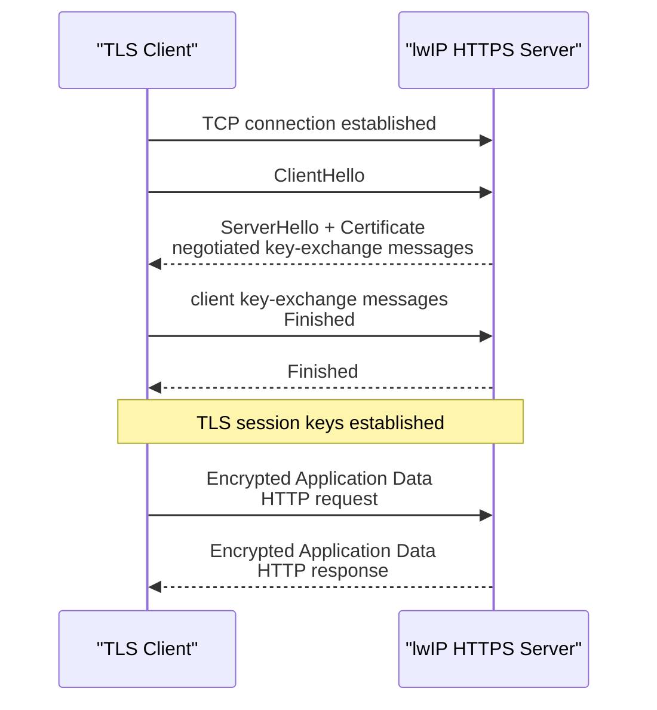
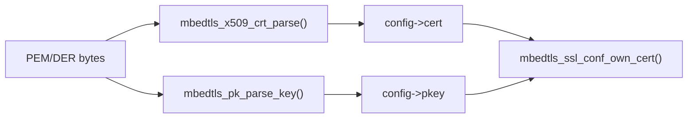
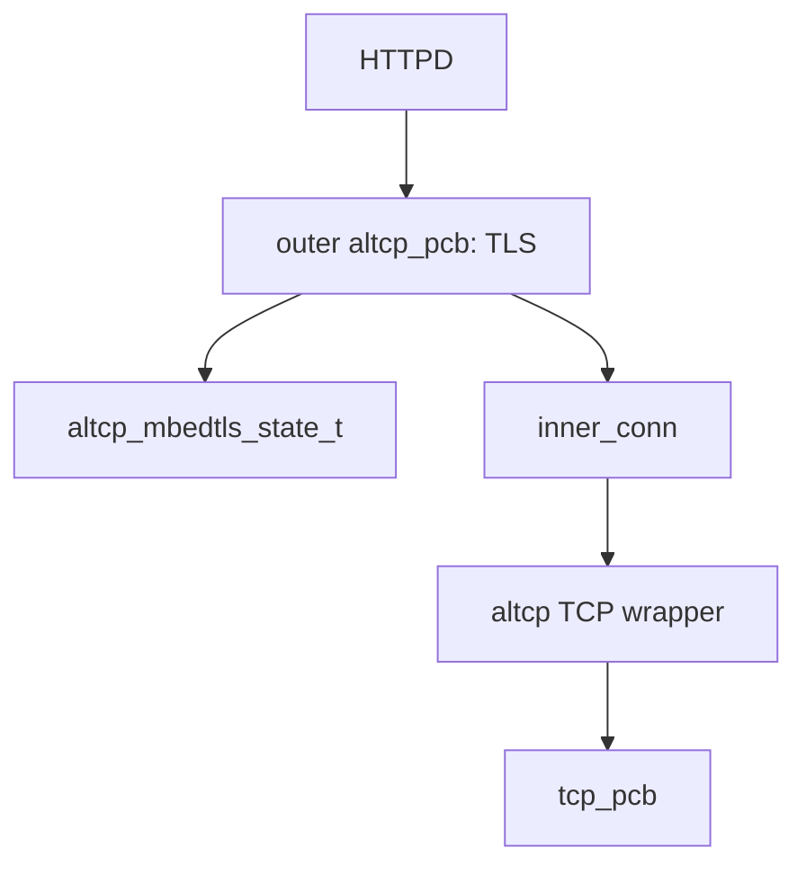
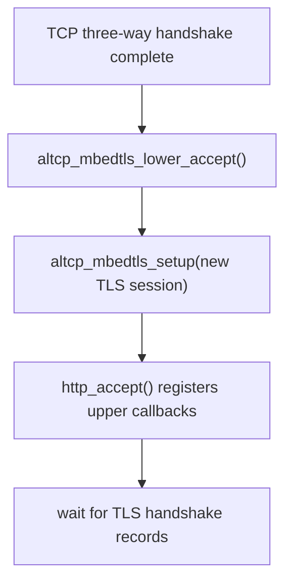
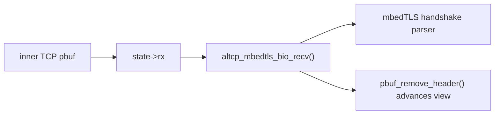
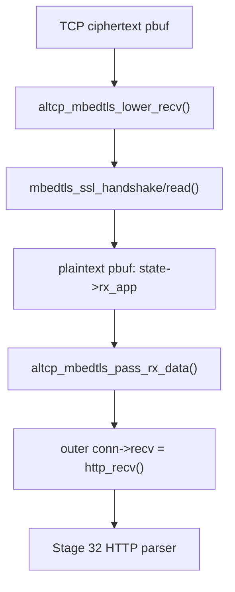
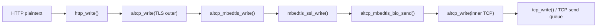
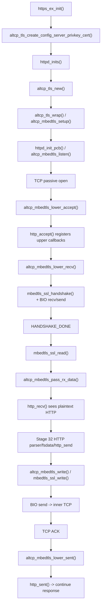

<meta name="referrer" content="no-referrer" />

# 教程 33：从 `https_ex_init()` 到 `http_recv()`——altcp、mbedTLS、TLS Handshake 与 HTTPS 数据通路

> 摘要：从 HTTPS example 真实入口追踪 TLS 配置、TLS-over-TCP wrapper、握手、密文/明文回调与 ACK 桥接，解释同一 HTTPD 如何运行在 HTTPS 上。

[TOC]

HTTPS（HTTP over TLS）不是另一套 HTTP parser，而是把 HTTP request/response 放进 TLS（Transport Layer Security，传输层安全协议）保护的连接中，再由 TCP 可靠传输。TLS 在 TCP 字节流上定义 **Record（记录）** 作为自己的传输单元，并在 **Handshake（握手）** 阶段协商安全参数、建立共享密钥。`altcp` 是 lwIP 的 TCP-like connection abstraction，**mbed TLS** 是这里实际执行 TLS 状态机与密码学的库；HTTPD 仍继续使用 Stage 32 的 `http_accept()`、`http_recv()`、`http_sent()`。[S1](#source-s1)[S2](#source-s2)[S3](#source-s3)

Stage 33 采用 Source-driven 主线，只回答新增的一层：**`https_ex_init()` 怎样建立 server TLS configuration，握手怎样通过下层 I/O 与 inner TCP 交换 TLS Record，握手完成后明文又怎样重新进入原来的 HTTPD callback。**

## 0. 进入源码前先建立 TLS 最小协议模型

### 0.1 建议提前阅读：用于确认规范与库概念

1. [Mbed TLS Tutorial](https://mbed-tls.readthedocs.io/en/latest/kb/how-to/mbedtls-tutorial/)
   - 用途：理解 Mbed TLS 怎样保存 server 配置、为每条连接维护会话状态、执行握手并接入下层 I/O。[S8](#source-s8)
2. [RFC 5246 — TLS 1.2](https://www.rfc-editor.org/rfc/rfc5246.html)
   - 用途：理解与当前 2.x-era integration 匹配的 TLS 1.2 线上记录格式与连接建立流程。[S10](#source-s10)
3. [RFC 8446 — TLS 1.3](https://www.rfc-editor.org/rfc/rfc8446.html)
   - 用途：作为现代 TLS 1.3 的规范入口；不要把 TLS 1.3 的具体 message sequence 直接套回本文目标源码。[S11](#source-s11)

这些资料是权威锚点，不是继续阅读正文的强制前置条件。

### 0.2 TLS Record、Handshake、Application Data 分别是什么

TCP 给 TLS 的仍然只是可靠字节流。TLS 在这个字节流上定义 **Record（记录）**，每个 Record 带有类型、版本/长度等 framing 信息，并承载不同内容。与本文最相关的两类内容是：[S10](#source-s10)

- **Handshake data**：Client 与 Server 用来协商协议参数、选择密码套件、交换建立会话密钥所需的信息，并完成相应身份认证；
- **Application Data**：握手成功以后承载 HTTP 等上层应用数据。发送方向先把 HTTP 明文交给 TLS，TLS 生成 ciphertext；接收方向则从 ciphertext 恢复 plaintext，再交给 HTTPD。

因此三层数据不能混为一谈：

```text
HTTP plaintext
    -> TLS Application Data / encrypted record bytes
    -> TCP byte stream
```

反向接收则相反。后文看到 `state->rx` 中的 encrypted `pbuf`、`mbedtls_ssl_read()` 输出的新明文 `pbuf` 时，就是这三个数据视图的实际实现。

### 0.3 Certificate、Private Key 与身份认证的最小关系

**Certificate（证书）**把一个 public key 与身份信息绑定，并由签发链提供可验证的信任关系；**Private Key（私钥）**必须由 Server 自己持有，用来证明对相应 key material 的控制，并参与所协商的握手算法。Client 侧通常从预配置的 **trust anchor（信任锚，通常是受信 CA 证书或公钥）**开始验证 certificate chain，并在 Web 场景检查证书身份是否与期望的 hostname 相符。因此 TLS 加密本身不自动等于“Server 身份已经可信”。[S10](#source-s10)

Stage 33 是 Server 侧源码，因此文章首先关注 `certificate + private key -> server config`；Client 侧 CA/hostname/time verification 会在 Stage 37 回到 HTTPS Client 时再讨论。

### 0.4 Handshake：先建立受保护会话，再传 HTTP

当前 target adapter 与 Mbed TLS 2.x API 对齐。对 certificate-based TLS 1.2，可以把本文需要理解的主路径抽象为下面的协议导航图；实际 key-exchange message 组合会随 cipher suite 改变，因此图中不把某一特定 cipher suite 的可选 message 写死。[S10](#source-s10)



这里的 **BIO** 不是 TLS wire message。BIO 是 mbed TLS 用来“向下层读取/写入传输字节”的 I/O callback 边界。`mbedtls_ssl_handshake()` 不直接知道 lwIP `pbuf` 或 `altcp_pcb`；它通过配置好的 BIO receive/send callback 消费/产生 TLS record bytes，lwIP adapter 再把这些 bytes 接到 inner TCP。[S3](#source-s3)[S5](#source-s5)

### 0.5 TLS 协议动作怎样落到 lwIP/mbedTLS 调用链

| TLS/HTTPS 阶段 | 协议动作 | lwIP / mbedTLS 主要入口 | 关键对象/状态 | 完成后的下一步 |
| --- | --- | --- | --- | --- |
| Server 配置 | 准备 certificate/private key | `https_ex_init()` → `altcp_tls_create_config_server_privkey_cert()` | `altcp_tls_config` / `mbedtls_ssl_config` | 创建 HTTPS listener |
| 接受 TCP | 为每条连接建立 TLS state | `altcp_mbedtls_lower_accept()` → `altcp_mbedtls_setup()` | `altcp_mbedtls_state_t` + `mbedtls_ssl_context` | 等 encrypted records |
| 运行握手 | 解析/生成 Handshake records | `altcp_mbedtls_lower_recv_process()` → `mbedtls_ssl_handshake()` | handshake state | BIO 读写 inner TCP |
| TLS 读网络 | 从 TCP 收到 record bytes | BIO receive callback | `state->rx` encrypted pbuf | 继续 handshake/read |
| TLS 写网络 | 发送 handshake/ciphertext | `altcp_mbedtls_bio_send()` | inner altcp/TCP send buffer | 等 TCP ACK / 后续 record |
| 交付 HTTP | 解密 Application Data | `mbedtls_ssl_read()` → `altcp_mbedtls_pass_rx_data()` | plaintext pbuf | `http_recv()` |
| 发送 HTTP response | plaintext 进入 TLS | `altcp_mbedtls_write()` → `mbedtls_ssl_write()` | TLS ciphertext | BIO send → TCP |

这里还必须锁定版本边界：目标 `altcp_tls_mbedtls.c` 文件头明确面向 Mbed TLS 2.x API。Mbed TLS 2.28.10 已是 2.28 LTS 的最终版本并结束维护，因此本文使用 2.28 API 只为解释目标源码，不构成继续部署该旧分支的安全建议。[S3](#source-s3)[S5](#source-s5)[S9](#source-s9)

## 1. 从 `https_ex_init()` 开始：example 先建立长期 TLS server configuration

upstream HTTPS example 的真实入口是 `https_ex_init()`。Host example 先从文件读取 server private key 与 certificate，再把二者交给 TLS config builder，最后调用 `httpd_inits()`。[S1](#source-s1)

```c
void
https_ex_init(void)
{
  struct altcp_tls_config *conf;
  u8_t *privkey, *cert;
  size_t privkey_size, cert_size;

  privkey = read_file(LWIP_HTTPD_EXAMPLE_HTTPS_KEY_FILE, &privkey_size);
  LWIP_ASSERT("Failed to open https server private key", privkey != NULL);
  cert = read_file(LWIP_HTTPD_EXAMPLE_HTTPS_CERT_FILE, &cert_size);
  LWIP_ASSERT("Failed to open https server certificate", cert != NULL);

  conf = altcp_tls_create_config_server_privkey_cert(privkey, privkey_size,
    LWIP_HTTPD_EXAMPLE_HTTPS_KEY_FILE_PASS, LWIP_HTTPD_EXAMPLE_HTTPS_KEY_FILE_PASS_LEN, cert, cert_size);
  LWIP_ASSERT("Failed to create https server config", conf != NULL);

  httpd_inits(conf);

  /* secure erase should be done in production environment */
  free(privkey);
  free(cert);
}
```

这里先区分两个生命周期完全不同的对象：

```text
altcp_tls_config
    -> server 级长期配置
    -> certificate / private key / RNG / mbedTLS ssl_config

每条已连接 TLS session
    -> 单独的 altcp_mbedtls_state_t
    -> 单独的 mbedtls_ssl_context
```

所以 `conf` 不是“某个 client 的 TLS session”。它会被 listener 保存，并在每次 accept 时用于创建新的 per-connection TLS state。[S3](#source-s3)

example 的 `read_file()` 是 Host 演示行为，不是 TLS Core contract。MCU 产品可以从 Flash、只读资源、secure storage 或安全芯片取得 certificate/private key；真正需要保持的是“在创建 server config 时向 TLS layer 提供可解析的 key/certificate”。[S1](#source-s1)[S3](#source-s3)

`https_ex_init()` 在 config 创建成功后释放原始 `privkey/cert` buffer，说明后续 listener 不依赖这两个 Host file buffer 的生命周期；当前 mbedTLS port 已经把证书与 key 解析进 config 持有的 mbedTLS 对象。[S1](#source-s1)[S3](#source-s3)

## 2. 进入 `altcp_tls_create_config_server_privkey_cert()`：certificate/key 被解析进 mbedTLS config

`https_ex_init()` 的关键子调用是 `altcp_tls_create_config_server_privkey_cert()`。它先创建一个 server config，再把 certificate/private key 加进去。[S3](#source-s3)

```c
struct altcp_tls_config *
altcp_tls_create_config_server_privkey_cert(const u8_t *privkey, size_t privkey_len,
    const u8_t *privkey_pass, size_t privkey_pass_len,
    const u8_t *cert, size_t cert_len)
{
  struct altcp_tls_config *conf = altcp_tls_create_config_server(1);
  if (conf == NULL) {
    return NULL;
  }

  if (altcp_tls_config_server_add_privkey_cert(conf, privkey, privkey_len,
    privkey_pass, privkey_pass_len, cert, cert_len) != ERR_OK) {
    altcp_tls_free_config(conf);
    return NULL;
  }

  return conf;
}
```

继续进入 `altcp_tls_config_server_add_privkey_cert()`。这里才真正把 X.509 certificate 和 private key 从 byte buffer 解析成 mbedTLS 对象，并通过 `mbedtls_ssl_conf_own_cert()` 绑定到共享 server configuration。[S3](#source-s3)

```c
err_t altcp_tls_config_server_add_privkey_cert(struct altcp_tls_config *config,
      const u8_t *privkey, size_t privkey_len,
      const u8_t *privkey_pass, size_t privkey_pass_len,
      const u8_t *cert, size_t cert_len)
{
  int ret;
  mbedtls_x509_crt *srvcert;
  mbedtls_pk_context *pkey;

  if (config->cert_count >= config->cert_max) {
    return ERR_MEM;
  }
  if (config->pkey_count >= config->pkey_max) {
    return ERR_MEM;
  }

  srvcert = config->cert + config->cert_count;
  mbedtls_x509_crt_init(srvcert);

  pkey = config->pkey + config->pkey_count;
  mbedtls_pk_init(pkey);

  /* Load the certificates and private key */
  ret = mbedtls_x509_crt_parse(srvcert, cert, cert_len);
  if (ret != 0) {
    LWIP_DEBUGF(ALTCP_MBEDTLS_DEBUG, ("mbedtls_x509_crt_parse failed: %d\n", ret));
    return ERR_VAL;
  }

  ret = mbedtls_pk_parse_key(pkey, (const unsigned char *) privkey, privkey_len, privkey_pass, privkey_pass_len);
  if (ret != 0) {
    LWIP_DEBUGF(ALTCP_MBEDTLS_DEBUG, ("mbedtls_pk_parse_public_key failed: %d\n", ret));
    mbedtls_x509_crt_free(srvcert);
    return ERR_VAL;
  }

  ret = mbedtls_ssl_conf_own_cert(&config->conf, srvcert, pkey);
  if (ret != 0) {
    LWIP_DEBUGF(ALTCP_MBEDTLS_DEBUG, ("mbedtls_ssl_conf_own_cert failed: %d\n", ret));
    mbedtls_x509_crt_free(srvcert);
    mbedtls_pk_free(pkey);
    return ERR_VAL;
  }

  config->cert_count++;
  config->pkey_count++;
  return ERR_OK;
}
```

因此 Host buffer 被 `free()` 之前已经完成：



这也是 example/production 边界：文件读取可以替换，TLS config 中 certificate/key 的解析与绑定语义不能被跳过。

## 3. 回到 `https_ex_init()`，进入 `httpd_inits()`：HTTPS 与 HTTP 只在 listener 创建处分叉

`altcp_tls_create_config_server_privkey_cert()` 返回 `conf` 后，执行回到 `https_ex_init()`，下一条关键调用是 `httpd_inits(conf)`。下面进入 HTTPD 的 HTTPS 初始化入口。[S2](#source-s2)

```c
void
httpd_inits(struct altcp_tls_config *conf)
{
#if LWIP_ALTCP_TLS
  struct altcp_pcb *pcb_tls = altcp_tls_new(conf, IPADDR_TYPE_ANY);
  LWIP_ASSERT("httpd_init: altcp_tls_new failed", pcb_tls != NULL);
  httpd_init_pcb(pcb_tls, HTTPD_SERVER_PORT_HTTPS);
#else /* LWIP_ALTCP_TLS */
  LWIP_UNUSED_ARG(conf);
#endif /* LWIP_ALTCP_TLS */
}
```

Stage 32 的普通 HTTP 是：

```text
httpd_init()
    -> altcp_tcp_new_ip_type()
    -> httpd_init_pcb()
```

HTTPS 现在只是把第一步换成：

```text
httpd_inits()
    -> altcp_tls_new()
    -> httpd_init_pcb()
```

从 `httpd_init_pcb()` 开始，bind/listen/`http_accept()` 注册逻辑完全复用 Stage 32。因此 HTTPD 没有第二套 HTTPS parser。[S2](#source-s2)

与 Stage 32 相同，`httpd_inits()` 仍属于 callback/raw-style lwIP Core API；OS mode 下需要在 TCPIP thread 或正确的 core-locking context 中初始化。[S7](#source-s7)

## 4. 进入 `altcp_tls_new()`：先建 inner TCP，再用 TLS outer wrapper 包起来

`httpd_inits()` 直接调用 `altcp_tls_new(conf, IPADDR_TYPE_ANY)`。该函数位于 `src/core/altcp_alloc.c`。[S4](#source-s4)

```c
struct altcp_pcb *
altcp_tls_new(struct altcp_tls_config *config, u8_t ip_type)
{
  struct altcp_pcb *inner_conn, *ret;
  LWIP_UNUSED_ARG(ip_type);

  inner_conn = altcp_tcp_new_ip_type(ip_type);
  if (inner_conn == NULL) {
    return NULL;
  }
  ret = altcp_tls_wrap(config, inner_conn);
  if (ret == NULL) {
    altcp_close(inner_conn);
  }
  return ret;
}
```

这段源码直接确定对象关系：TLS **不替代 TCP**，而是创建一个 outer altcp connection 包裹已有的 inner TCP connection。



继续进入 `altcp_tls_wrap()`，它分配 outer `altcp_pcb`，再调用 `altcp_mbedtls_setup()` 完成 TLS session 装配。[S3](#source-s3)

```c
struct altcp_pcb *
altcp_tls_wrap(struct altcp_tls_config *config, struct altcp_pcb *inner_pcb)
{
  struct altcp_pcb *ret;
  if (inner_pcb == NULL) {
    return NULL;
  }
  ret = altcp_alloc();
  if (ret != NULL) {
    if (altcp_mbedtls_setup(config, ret, inner_pcb) != ERR_OK) {
      altcp_free(ret);
      return NULL;
    }
  }
  return ret;
}
```

## 5. 进入 `altcp_mbedtls_setup()`：BIO 与 lower callbacks 在这里绑定

`altcp_tls_wrap()` 的关键子调用是 `altcp_mbedtls_setup(config, outer, inner)`。下面进入该函数。[S3](#source-s3)

```c
static err_t
altcp_mbedtls_setup(void *conf, struct altcp_pcb *conn, struct altcp_pcb *inner_conn)
{
  int ret;
  struct altcp_tls_config *config = (struct altcp_tls_config *)conf;
  altcp_mbedtls_state_t *state;
  if (!conf) {
    return ERR_ARG;
  }
  LWIP_ASSERT("invalid inner_conn", conn != inner_conn);

  /* allocate mbedtls context */
  state = altcp_mbedtls_alloc(conf);
  if (state == NULL) {
    return ERR_MEM;
  }
  /* initialize mbedtls context: */
  mbedtls_ssl_init(&state->ssl_context);
  ret = mbedtls_ssl_setup(&state->ssl_context, &config->conf);
  if (ret != 0) {
    LWIP_DEBUGF(ALTCP_MBEDTLS_DEBUG, ("mbedtls_ssl_setup failed\n"));
    /* @todo: convert 'ret' to err_t */
    altcp_mbedtls_free(conf, state);
    return ERR_MEM;
  }
  /* tell mbedtls about our I/O functions */
  mbedtls_ssl_set_bio(&state->ssl_context, conn, altcp_mbedtls_bio_send, altcp_mbedtls_bio_recv, NULL);

  altcp_mbedtls_setup_callbacks(conn, inner_conn);
  conn->inner_conn = inner_conn;
  conn->fns = &altcp_mbedtls_functions;
  conn->state = state;
  return ERR_OK;
}
```

这里建立两个方向的桥：

```text
mbedTLS -> network
    mbedtls_ssl_set_bio()
    -> altcp_mbedtls_bio_send()
    -> inner altcp/TCP

network -> TLS
    inner altcp callbacks
    -> altcp_mbedtls_lower_recv/sent/err/poll
    -> mbedTLS / outer callbacks
```

继续看 `altcp_mbedtls_setup_callbacks()`，可以直接看到 inner connection 的 receive/sent/error callback 已经不再指向 HTTPD，而是先进入 TLS layer。[S3](#source-s3)

```c
static void
altcp_mbedtls_setup_callbacks(struct altcp_pcb *conn, struct altcp_pcb *inner_conn)
{
  altcp_arg(inner_conn, conn);
  altcp_recv(inner_conn, altcp_mbedtls_lower_recv);
  altcp_sent(inner_conn, altcp_mbedtls_lower_sent);
  altcp_err(inner_conn, altcp_mbedtls_lower_err);
  /* tcp_poll is set when interval is set by application */
  /* listen is set totally different :-) */
}
```

所以 Stage 33 的核心不是“HTTPD 调 mbedTLS”，而是 **TLS outer connection 截获 inner TCP callbacks，然后在解密/加密之后再恢复 upper altcp semantics**。

## 6. 回到 `httpd_inits()`，`httpd_init_pcb()` 调 `altcp_listen()` 时会进入 TLS listener 实现

`altcp_tls_new()` 返回 TLS outer connection 后，`httpd_inits()` 把它交给 Stage 32 已经展开过的 `httpd_init_pcb()`。该函数内部调用 `altcp_bind()`、`altcp_listen()`、`altcp_accept(..., http_accept)`。[S2](#source-s2)

由于当前 outer connection 的 `fns` 是 `altcp_mbedtls_functions`，`altcp_listen()` 会分发到 `altcp_mbedtls_listen()`。下面进入 TLS listener 的实现。[S3](#source-s3)[S6](#source-s6)

```c
static struct altcp_pcb *
altcp_mbedtls_listen(struct altcp_pcb *conn, u8_t backlog, err_t *err)
{
  struct altcp_pcb *lpcb;
  if (conn == NULL) {
    return NULL;
  }
  lpcb = altcp_listen_with_backlog_and_err(conn->inner_conn, backlog, err);
  if (lpcb != NULL) {
    altcp_mbedtls_state_t *state = (altcp_mbedtls_state_t *)conn->state;
    /* Free members of the ssl context (not used on listening pcb). This
       includes freeing input/output buffers, so saves ~32KByte by default */
    mbedtls_ssl_free(&state->ssl_context);

    conn->inner_conn = lpcb;
    altcp_accept(lpcb, altcp_mbedtls_lower_accept);
    return conn;
  }
  return NULL;
}
```

这里发生两个重要变化：

1. inner TCP connection 被转换成真正的 listener；
2. inner listener 的 accept callback 被固定成 `altcp_mbedtls_lower_accept()`。

HTTPD 自己注册的 `http_accept()` 仍然保存在 **outer TLS listener** 上。于是 passive open 完成后会先进入 TLS lower accept，再转发到 HTTPD。

## 7. TCP handshake 完成后进入 `altcp_mbedtls_lower_accept()`：先创建 per-connection TLS state，再调用 `http_accept()`

当 inner TCP listener 完成一次 passive open，accept callback 到达 `altcp_mbedtls_lower_accept()`。[S3](#source-s3)

```c
static err_t
altcp_mbedtls_lower_accept(void *arg, struct altcp_pcb *accepted_conn, err_t err)
{
  struct altcp_pcb *listen_conn = (struct altcp_pcb *)arg;
  if (listen_conn && listen_conn->state && listen_conn->accept) {
    err_t setup_err;
    altcp_mbedtls_state_t *listen_state = (altcp_mbedtls_state_t *)listen_conn->state;
    /* create a new altcp_conn to pass to the next 'accept' callback */
    struct altcp_pcb *new_conn = altcp_alloc();
    if (new_conn == NULL) {
      return ERR_MEM;
    }
    setup_err = altcp_mbedtls_setup(listen_state->conf, new_conn, accepted_conn);
    if (setup_err != ERR_OK) {
      altcp_free(new_conn);
      return setup_err;
    }
    return listen_conn->accept(listen_conn->arg, new_conn, err);
  }
  return ERR_ARG;
}
```

这里要特别注意顺序：**server-side `http_accept()` 在 TLS handshake 完成之前就会被调用。**

原因是 `listen_conn->accept` 正是 `httpd_init_pcb()` 注册的 `http_accept()`。`altcp_mbedtls_lower_accept()` 先为刚接入的 TCP connection 创建新的 TLS outer connection 和独立 `mbedtls_ssl_context`，随后立即把这条 outer connection 交给 `http_accept()`。[S2](#source-s2)[S3](#source-s3)

Stage 32 的 `http_accept()` 会在这条 TLS outer connection 上继续注册：

```text
outer recv -> http_recv
outer sent -> http_sent
outer err  -> http_err
outer poll -> http_poll
```

但这些 upper callbacks 此时尚不会收到 HTTP 明文；client 接下来先发送 TLS handshake records，inner TCP RX 会被 `altcp_mbedtls_lower_recv()` 截获。



## 8. TLS record 到达后进入 `altcp_mbedtls_lower_recv()`：encrypted pbuf 先排进 `state->rx`

inner connection 的 receive callback 已在 `altcp_mbedtls_setup_callbacks()` 中绑定到 `altcp_mbedtls_lower_recv()`。下面进入这个函数的正常数据路径。[S3](#source-s3)

```c
  /* If we come here, the connection is in good state (handshake phase or application data phase).
     Queue up the pbuf for processing as handshake data or application data. */
  if (state->rx == NULL) {
    state->rx = p;
  } else {
    LWIP_ASSERT("rx pbuf overflow", (int)p->tot_len + (int)p->len <= 0xFFFF);
    pbuf_cat(state->rx, p);
  }
  return altcp_mbedtls_lower_recv_process(conn, state);
```

这段连续片段位于 `altcp_mbedtls_lower_recv()` 的末尾。进入函数时的 `p` 仍然是 **TLS ciphertext record bytes**，不是 HTTP request。函数把它保存在 TLS state 的 `rx` pbuf chain 中，再调用 `altcp_mbedtls_lower_recv_process()`。

因此此处的 packet/data view 是：

```text
inner TCP recv pbuf
    payload = TLS records
    owner = altcp TLS state
          ↓
state->rx
          ↓
mbedTLS BIO receive callback later consumes bytes
```

## 9. 进入 `altcp_mbedtls_lower_recv_process()`：handshake 没完成时只运行 `mbedtls_ssl_handshake()`

`altcp_mbedtls_lower_recv()` 直接调用 `altcp_mbedtls_lower_recv_process(conn, state)`。下面进入该函数。[S3](#source-s3)[S5](#source-s5)

```c
static err_t
altcp_mbedtls_lower_recv_process(struct altcp_pcb *conn, altcp_mbedtls_state_t *state)
{
  if (!(state->flags & ALTCP_MBEDTLS_FLAGS_HANDSHAKE_DONE)) {
    /* handle connection setup (handshake not done) */
    int ret = mbedtls_ssl_handshake(&state->ssl_context);
    /* try to send data... */
    altcp_output(conn->inner_conn);
    if (state->bio_bytes_read) {
      /* acknowledge all bytes read */
      altcp_mbedtls_lower_recved(conn->inner_conn, state->bio_bytes_read);
      state->bio_bytes_read = 0;
    }

    if (ret == MBEDTLS_ERR_SSL_WANT_READ || ret == MBEDTLS_ERR_SSL_WANT_WRITE) {
      /* handshake not done, wait for more recv calls */
      LWIP_ASSERT("in this state, the rx chain should be empty", state->rx == NULL);
      return ERR_OK;
    }
    if (ret != 0) {
      LWIP_DEBUGF(ALTCP_MBEDTLS_DEBUG, ("mbedtls_ssl_handshake failed: %d\n", ret));
      /* handshake failed, connection has to be closed */
      if (conn->err) {
        conn->err(conn->arg, ERR_CLSD);
      }

      if (altcp_close(conn) != ERR_OK) {
        altcp_abort(conn);
      }
      return ERR_OK;
    }
```

这里是事件驱动 TLS 的核心：`mbedtls_ssl_handshake()` 不要求一次调用就完成整个 handshake。当前输入不足或输出暂时无法继续时，mbedTLS 可以返回 `MBEDTLS_ERR_SSL_WANT_READ/WANT_WRITE`；`altcp_mbedtls_lower_recv_process()` 此时结束本轮处理。后续新的 TCP RX 会再次进入 `altcp_mbedtls_lower_recv()` → `altcp_mbedtls_lower_recv_process()`，从而对同一个 `ssl_context` 再次调用 `mbedtls_ssl_handshake()`。`lower_sent` / `lower_poll` 可以推动 pending TLS output 的 flush，但它们不是直接重新调用 `mbedtls_ssl_handshake()` 的入口。[S3](#source-s3)[S5](#source-s5)

如果返回真正的错误，TLS layer 调 upper `err` callback，再关闭/abort connection。对于 HTTPS server，这个 upper error callback 已在 `http_accept()` 中绑定为 `http_err()`。

## 10. `mbedtls_ssl_handshake()` 怎样从 `state->rx` 取数据：BIO receive 回调消费 pbuf

`mbedtls_ssl_handshake()` 内部需要读取 transport bytes 时，会调用第 5 节通过 `mbedtls_ssl_set_bio()` 注册的 `altcp_mbedtls_bio_recv()`。[S3](#source-s3)[S5](#source-s5)

继续进入该函数的核心读取逻辑：[S3](#source-s3)

```c
  state = (altcp_mbedtls_state_t *)conn->state;
  LWIP_ASSERT("state != NULL", state != NULL);
  p = state->rx;

  /* @todo: return MBEDTLS_ERR_NET_CONN_RESET/MBEDTLS_ERR_NET_RECV_FAILED? */

  if ((p == NULL) || ((p->len == 0) && (p->next == NULL))) {
    if (p) {
      pbuf_free(p);
    }
    state->rx = NULL;
    if ((state->flags & (ALTCP_MBEDTLS_FLAGS_RX_CLOSE_QUEUED | ALTCP_MBEDTLS_FLAGS_RX_CLOSED)) ==
        ALTCP_MBEDTLS_FLAGS_RX_CLOSE_QUEUED) {
      /* close queued but not passed up yet */
      return 0;
    }
    return MBEDTLS_ERR_SSL_WANT_READ;
  }
  /* limit number of bytes again to copy from first pbuf in a chain only */
  copy_len = (u16_t)LWIP_MIN(len, p->len);
  /* copy the data */
  ret = pbuf_copy_partial(p, buf, copy_len, 0);
  LWIP_ASSERT("ret == copy_len", ret == copy_len);
  /* hide the copied bytes from the pbuf */
  err = pbuf_remove_header(p, ret);
  LWIP_ASSERT("error", err == ERR_OK);
```

当前 BIO receive 做的是“把 TLS ciphertext bytes 从 lwIP pbuf 拷到 mbedTLS 提供的 `buf`”，然后用 `pbuf_remove_header()` 推进 `state->rx` 的可见数据范围。读到的数据量累计进 `state->bio_bytes_read`，后续 TLS adapter 才据此把 TCP receive-window credit 归还给 inner connection。

因此 handshake 期间的数据 ownership 是：



## 11. handshake 需要发送 record 时进入 `altcp_mbedtls_bio_send()`：ciphertext 最终写 inner TCP

handshake engine 需要向 peer 输出 TLS records 时，mbed TLS 通过同一个 BIO binding 调 `altcp_mbedtls_bio_send()`；具体 handshake message 组合由协商到的 TLS version、authentication mode 与 cipher configuration 决定，本文不在这里复述协议流程。[S3](#source-s3)[S10](#source-s10)[S11](#source-s11)

```c
static int
altcp_mbedtls_bio_send(void *ctx, const unsigned char *dataptr, size_t size)
{
  struct altcp_pcb *conn = (struct altcp_pcb *) ctx;
  altcp_mbedtls_state_t *state;
  int written = 0;
  size_t size_left = size;
  u8_t apiflags = TCP_WRITE_FLAG_COPY;

  LWIP_ASSERT("conn != NULL", conn != NULL);
  if ((conn == NULL) || (conn->inner_conn == NULL)) {
    return MBEDTLS_ERR_NET_INVALID_CONTEXT;
  }
  state = (altcp_mbedtls_state_t *)conn->state;
  LWIP_ASSERT("state != NULL", state != NULL);

  while (size_left) {
    u16_t write_len = (u16_t)LWIP_MIN(size_left, 0xFFFF);
    err_t err = altcp_write(conn->inner_conn, (const void *)dataptr, write_len, apiflags);
    if (err == ERR_OK) {
      written += write_len;
      size_left -= write_len;
      state->overhead_bytes_adjust += write_len;
    } else if (err == ERR_MEM) {
      if (written) {
        return written;
      }
      return 0; /* MBEDTLS_ERR_SSL_WANT_WRITE; */
    } else {
      LWIP_ASSERT("tls_write, tcp_write: err != ERR MEM", 0);
      /* @todo: return MBEDTLS_ERR_NET_CONN_RESET or MBEDTLS_ERR_NET_SEND_FAILED */
      return MBEDTLS_ERR_NET_SEND_FAILED;
    }
  }
  return written;
}
```

`dataptr` 在这里已经是 **mbedTLS 生成的 TLS record bytes**。BIO 不把它交给 HTTPD，而是调用：

```text
altcp_write(conn->inner_conn, ciphertext)
    -> altcp TCP adapter
    -> tcp_write()
    -> TCP send queue
```

Stage 08 的 TCP send-buffer、retransmission 与 ACK 机制仍然全部存在；TLS 只改变“上层明文如何变成要交给 TCP 的 byte stream”。

## 12. 回到 `altcp_mbedtls_lower_recv_process()`：成功后只设置 `HANDSHAKE_DONE`，server upper accept 早已完成

当 `mbedtls_ssl_handshake()` 返回 0，继续阅读同一个 `altcp_mbedtls_lower_recv_process()`：[S3](#source-s3)

```c
    /* If we come here, handshake succeeded. */
    LWIP_ASSERT("state", state->bio_bytes_read == 0);
    LWIP_ASSERT("state", state->bio_bytes_appl == 0);
    state->flags |= ALTCP_MBEDTLS_FLAGS_HANDSHAKE_DONE;
    /* issue "connect" callback" to upper connection (this can only happen for active open) */
    if (conn->connected) {
      err_t err;
      err = conn->connected(conn->arg, conn, ERR_OK);
      if (err != ERR_OK) {
        return err;
      }
    }
    if (state->rx == NULL) {
      return ERR_OK;
    }
  }
  /* handle application data */
  return altcp_mbedtls_handle_rx_appldata(conn, state);
}
```

对于本篇 HTTPS **server passive open**，`http_accept()` 已在第 7 节由 `altcp_mbedtls_lower_accept()` 调过，所以这里通常没有 active-open `connected` callback 要通知。这个分支是 altcp TLS 同时支持 client connect 的通用逻辑。

如果同一批 TCP bytes 在 handshake 完成后还残留 application data，函数不会丢掉它，而是直接继续进入 `altcp_mbedtls_handle_rx_appldata()`。

## 13. 进入 `altcp_mbedtls_handle_rx_appldata()`：`mbedtls_ssl_read()` 把 TLS records 解成新的明文 pbuf

handshake 完成后，`altcp_mbedtls_lower_recv_process()` 转入 application-data path。下面进入 `altcp_mbedtls_handle_rx_appldata()`。[S3](#source-s3)[S5](#source-s5)

```c
static err_t
altcp_mbedtls_handle_rx_appldata(struct altcp_pcb *conn, altcp_mbedtls_state_t *state)
{
  int ret;
  LWIP_ASSERT("state != NULL", state != NULL);
  if (!(state->flags & ALTCP_MBEDTLS_FLAGS_HANDSHAKE_DONE)) {
    /* handshake not done yet */
    return ERR_VAL;
  }
  do {
    /* allocate a full-sized unchained PBUF_POOL: this is for RX! */
    struct pbuf *buf = pbuf_alloc(PBUF_RAW, PBUF_POOL_BUFSIZE, PBUF_POOL);
    if (buf == NULL) {
      /* We're short on pbufs, try again later from 'poll' or 'recv' callbacks.
         @todo: close on excessive allocation failures or leave this up to upper conn? */
      return ERR_OK;
    }

    /* decrypt application data, this pulls encrypted RX data off state->rx pbuf chain */
    ret = mbedtls_ssl_read(&state->ssl_context, (unsigned char *)buf->payload, PBUF_POOL_BUFSIZE);
```

这里第一次出现“新的明文 pbuf”：

```text
state->rx
    payload = encrypted TLS records
          ↓ mbedtls_ssl_read()
new PBUF_POOL buf
    payload = decrypted application bytes
```

继续阅读 `altcp_mbedtls_handle_rx_appldata()` 在成功解密后的处理：[S3](#source-s3)

```c
      if (ret) {
        LWIP_ASSERT("bogus receive length", (size_t)ret <= PBUF_POOL_BUFSIZE);
        /* trim pool pbuf to actually decoded length */
        pbuf_realloc(buf, (u16_t)ret);

        state->bio_bytes_appl += ret;
        if (mbedtls_ssl_get_bytes_avail(&state->ssl_context) == 0) {
          /* Record is done, now we know the share between application and protocol bytes
             and can adjust the RX window by the protocol bytes.
             The rest is 'recved' by the application calling our 'recved' fn. */
          int overhead_bytes;
          LWIP_ASSERT("bogus byte counts", state->bio_bytes_read > state->bio_bytes_appl);
          overhead_bytes = state->bio_bytes_read - state->bio_bytes_appl;
          altcp_mbedtls_lower_recved(conn->inner_conn, overhead_bytes);
          state->bio_bytes_read = 0;
          state->bio_bytes_appl = 0;
        }

        if (state->rx_app == NULL) {
          state->rx_app = buf;
        } else {
          pbuf_cat(state->rx_app, buf);
        }
```

TLS record header、MAC/tag 等 protocol overhead 不应该作为“HTTP application bytes”计入 upper receive-window consumption，所以当前实现用 `bio_bytes_read - bio_bytes_appl` 区分 TLS overhead 与明文 byte count。这是 altcp TLS 能继续维持 TCP-like `recved()` 语义的一部分。[S3](#source-s3)

## 14. `altcp_mbedtls_handle_rx_appldata()` 继续调用 `altcp_mbedtls_pass_rx_data()`：这里才真正到达 `http_recv()`

同一个 application-data loop 在准备好 `state->rx_app` 后直接调用 `altcp_mbedtls_pass_rx_data()`。[S3](#source-s3)

```c
      err = altcp_mbedtls_pass_rx_data(conn, state);
      if (err != ERR_OK) {
        if (err == ERR_ABRT) {
          /* recv callback needs to return this as the pcb is deallocated */
          return ERR_ABRT;
        }
        /* we hide all other errors as we retry feeding the pbuf to the app later */
        return ERR_OK;
      }
```

继续进入 `altcp_mbedtls_pass_rx_data()`：[S3](#source-s3)

```c
static err_t
altcp_mbedtls_pass_rx_data(struct altcp_pcb *conn, altcp_mbedtls_state_t *state)
{
  err_t err;
  struct pbuf *buf;
  LWIP_ASSERT("conn != NULL", conn != NULL);
  LWIP_ASSERT("state != NULL", state != NULL);
  buf = state->rx_app;
  if (buf) {
    state->rx_app = NULL;
    if (conn->recv) {
      u16_t tot_len = buf->tot_len;
      /* this needs to be increased first because the 'recved' call may come nested */
      state->rx_passed_unrecved += tot_len;
      state->flags |= ALTCP_MBEDTLS_FLAGS_UPPER_CALLED;
      err = conn->recv(conn->arg, conn, buf, ERR_OK);
```

`conn->recv` 是谁？第 7 节中 `altcp_mbedtls_lower_accept()` 已经把 outer TLS connection 交给 Stage 32 的 `http_accept()`；`http_accept()` 随后执行：

```text
altcp_recv(pcb, http_recv)
```

所以这里的间接调用在语义上等价于：

```text
http_recv(http_state, tls_outer_conn, plaintext_pbuf, ERR_OK)
```

这一步完成 HTTPS RX 主行为闭环：**inner TCP 收到 TLS ciphertext → mbedTLS 解密 → outer altcp 恢复 pbuf/callback semantics → HTTPD 收到普通 HTTP plaintext。**



## 15. `http_recv()` 调 `altcp_recved()` 时怎样回到底层 TCP：TLS layer 先扣除 upper 明文字节计数

Stage 32 的 `http_recv()` 消费 request pbuf 后调用 `altcp_recved(pcb, p->tot_len)`。此时 `pcb` 是 TLS outer connection，因此会进入 `altcp_mbedtls_recved()`。[S2](#source-s2)[S3](#source-s3)

```c
static void
altcp_mbedtls_recved(struct altcp_pcb *conn, u16_t len)
{
  u16_t lower_recved;
  altcp_mbedtls_state_t *state;
  if (conn == NULL) {
    return;
  }
  state = (altcp_mbedtls_state_t *)conn->state;
  if (state == NULL) {
    return;
  }
  if (!(state->flags & ALTCP_MBEDTLS_FLAGS_HANDSHAKE_DONE)) {
    return;
  }
  lower_recved = len;
  if (lower_recved > state->rx_passed_unrecved) {
    LWIP_DEBUGF(ALTCP_MBEDTLS_DEBUG, ("bogus recved count (len > state->rx_passed_unrecved / %d / %d)\n",
                                      len, state->rx_passed_unrecved));
    lower_recved = (u16_t)state->rx_passed_unrecved;
  }
  state->rx_passed_unrecved -= lower_recved;

  altcp_recved(conn->inner_conn, lower_recved);
}
```

这说明 outer `recved()` 仍然以 HTTP plaintext byte count 为接口，但最终会转成 inner connection 的 receive-window update；TLS protocol overhead 已在第 13 节由 adapter 单独处理。

所以 TLS wrapper 不只是“加密/解密函数”，它必须继续维持 TCP-like flow-control accounting。

## 16. response 发送回到 Stage 32 的 `http_write()`：outer `altcp_write()` 分发到 `altcp_mbedtls_write()`

HTTP request 解密后，Stage 32 的 parser/fsdata/send path 完全复用：

```text
http_recv()
  -> http_parse_request()
  -> http_find_file()/fs_open()
  -> http_send()
  -> http_write()
  -> altcp_write(outer TLS conn, HTTP plaintext)
```

由于 outer connection 的 function table 在 `altcp_mbedtls_setup()` 中已设为 `altcp_mbedtls_functions`，`altcp_write()` 会分发到 `altcp_mbedtls_write()`。[S3](#source-s3)[S6](#source-s6)

下面进入该函数：[S3](#source-s3)

```c
static err_t
altcp_mbedtls_write(struct altcp_pcb *conn, const void *dataptr, u16_t len, u8_t apiflags)
{
  int ret;
  altcp_mbedtls_state_t *state;

  LWIP_UNUSED_ARG(apiflags);

  if (conn == NULL) {
    return ERR_VAL;
  }

  state = (altcp_mbedtls_state_t *)conn->state;
  if (state == NULL) {
    /* @todo: which error? */
    return ERR_ARG;
  }
  if (!(state->flags & ALTCP_MBEDTLS_FLAGS_HANDSHAKE_DONE)) {
    /* @todo: which error? */
    return ERR_VAL;
  }
```

当前函数首先拒绝尚未完成 handshake 的 application write。继续阅读 `altcp_mbedtls_write()` 真正的加密发送部分：[S3](#source-s3)

```c
  ret = mbedtls_ssl_write(&state->ssl_context, (const unsigned char *)dataptr, len);
  /* try to send data... */
  altcp_output(conn->inner_conn);
  if (ret >= 0) {
    if (ret == len) {
      /* update application sent counter */
      state->overhead_bytes_adjust -= ret;
      return ERR_OK;
    } else {
      /* @todo/@fixme: assumption: either everything sent or error */
      LWIP_ASSERT("ret <= 0", 0);
      return ERR_MEM;
    }
  } else {
    if (ret == MBEDTLS_ERR_SSL_WANT_WRITE) {
      /* @todo: convert error to err_t */
      return ERR_MEM;
    }
    LWIP_ASSERT("unhandled error", 0);
    return ERR_VAL;
  }
}
```

`dataptr` 是 HTTP response 明文；`mbedtls_ssl_write()` 把它封装成 encrypted TLS records，并再次通过第 11 节的 BIO send callback 写入 inner TCP。

因此 TX 数据视图是：



## 17. inner TCP ACK 怎样重新变成 `http_sent()`：`altcp_mbedtls_lower_sent()` 去掉 TLS overhead

Stage 32 的 response send loop依赖 `http_sent()`：peer ACK 后释放 send capacity，再调用 `http_send()` 推进剩余文件。HTTPS 必须保持这个语义，否则 HTTPD 的 ACK-driven flow control 会被 TLS 破坏。

inner TCP 的 sent callback 已在 `altcp_mbedtls_setup_callbacks()` 中绑定为 `altcp_mbedtls_lower_sent()`。下面进入它。[S3](#source-s3)

```c
static err_t
altcp_mbedtls_lower_sent(void *arg, struct altcp_pcb *inner_conn, u16_t len)
{
  struct altcp_pcb *conn = (struct altcp_pcb *)arg;
  LWIP_UNUSED_ARG(inner_conn); /* for LWIP_NOASSERT */
  if (conn) {
    int overhead;
    u16_t app_len;
    altcp_mbedtls_state_t *state = (altcp_mbedtls_state_t *)conn->state;
    LWIP_ASSERT("state", state != NULL);
    LWIP_ASSERT("pcb mismatch", conn->inner_conn == inner_conn);
    /* calculate TLS overhead part to not send it to application */
    overhead = state->overhead_bytes_adjust + state->ssl_context.out_left;
    if ((unsigned)overhead > len) {
      overhead = len;
    }
    /* remove ACKed bytes from overhead adjust counter */
    state->overhead_bytes_adjust -= len;
    /* try to send more if we failed before (may increase overhead adjust counter) */
    altcp_mbedtls_flush_output(state);
    /* remove calculated overhead from ACKed bytes len */
    app_len = len - (u16_t)overhead;
    /* update application write counter and inform application */
    if (app_len) {
      state->overhead_bytes_adjust += app_len;
      if (conn->sent)
        return conn->sent(conn->arg, conn, app_len);
    }
  }
  return ERR_OK;
}
```

`len` 是 inner TCP ACKed byte count，其中包含 TLS record overhead。TLS layer 先算出 `app_len`，只有 application-byte progress 才调用 outer `conn->sent()`。

而 `conn->sent` 在 Stage 32 的 `http_accept()` 中已经绑定成 `http_sent()`。因此完整 ACK bridge 是：

```text
TCP ACK
    -> inner altcp sent
    -> altcp_mbedtls_lower_sent()
    -> subtract TLS overhead
    -> outer conn->sent(app_len)
    -> http_sent()
    -> http_send()
```

这一步解释了为什么 Stage 32 的 `hs->left` / ACK-driven send loop 能原样复用在 HTTPS 上：altcp TLS 不仅包装 write，还把下层 ACK 重新投影成上层 application-byte ACK。

## 18. listener 为什么不为每个端口永久保留完整 `mbedtls_ssl_context` buffer

第 6 节 `altcp_mbedtls_listen()` 有一个容易忽略的资源优化：listener 转入 listen state 后会调用：

```c
mbedtls_ssl_free(&state->ssl_context);
```

源码注释说明 listening PCB 不需要 per-session SSL input/output buffers，这样默认配置下能节省一大块 RAM。[S3](#source-s3)

真正 client 接入时，`altcp_mbedtls_lower_accept()` 会为 **accepted connection** 调 `altcp_mbedtls_setup()`，重新建立独立的 per-connection `mbedtls_ssl_context`。

所以 MCU 上 TLS RAM 预算应区分：

```text
server config / listener lifetime
    ≠
per-connection TLS session lifetime
```

并发 HTTPS connection 越多，需要同时存在的 TLS session state 越多。upstream example 自己也提醒要观察 heap、`MEMP_NUM_TCP_PCB`、`MEMP_NUM_ALTCP_PCB`、TCP segment 和 TCPIP input message 等资源。[S1](#source-s1)

本文不声明固定“HTTPS 需要多少 KB RAM”，因为实际开销由 mbedTLS build、certificate/key、cipher suite、TLS version、buffer 配置和并发数共同决定。

## 19. server certificate、client CA 与“TLS 已加密”不是同一个安全结论

本篇走的是 HTTPS **server** example：server configuration 持有自己的 certificate/private key，用于向 client 证明 server identity 并完成选定 cipher/authentication 流程。[S1](#source-s1)[S3](#source-s3)

同一个 lwIP altcp TLS port 也提供 `altcp_tls_create_config_client()`。client config 可以接收 CA certificate chain，用于 peer certificate verification；源码明确把“不提供 CA”描述为节省内存但容易遭受中间人攻击的选择。[S3](#source-s3)

因此要区分：

| 对象 | 主要用途 |
| --- | --- |
| server certificate | 向 client 提供 server public identity material |
| server private key | 证明 server 持有对应 private key |
| client CA trust | client 验证 peer certificate chain |
| TLS encryption | 保护连接中的 record confidentiality/integrity |

“连接已经加密”不自动等于“对端身份验证策略已经满足产品安全要求”。证书验证策略、可信 CA、系统时间、hostname verification 等 client-side 问题会在后续 HTTPS Client/MQTT TLS 场景继续出现。

## 20. Stage 33 的完整源码闭环

把已经逐函数展开的 server path 收束起来：



这条链把“HTTPS = HTTP over TLS over TCP”落实为三个相互独立但通过 altcp 对接的状态层：

```text
HTTPD
    http_state / request parser / fsdata / ACK-driven response

TLS outer
    altcp_mbedtls_state_t / mbedtls_ssl_context / BIO / record transform

TCP inner
    tcp_pcb / reliable byte stream / congestion / retransmission / ACK
```

Stage 32 的 HTTPD 没有因为 HTTPS 被复制一份；Stage 33 真正新增的是 TLS outer layer 如何维护 callback、flow control 与 byte accounting，使 HTTPD 仍能把它当成一条 TCP-like connection 使用。

Stage 34 将切换到 MQTT：先建立发布/订阅、Control Packet、QoS、Keep Alive 等协议模型，再从 lwIP MQTT client 的真实入口把 CONNECT、CONNACK、SUBSCRIBE、PUBLISH 与回调逐步映射到源码。

## 资料来源

<a id="source-s1"></a>
### [S1] lwIP upstream HTTPS example
- 类型：用户提供源码快照 + upstream 对照
- 版本：目标快照对应 commit `d08f4773edd0182b7910fc8f046eed82ffcd67c9`
- 定位：`contrib/examples/httpd/https_example/https_example.c`：`read_file()`、`https_ex_init()`
- URL/文档：[lwIP https_example.c](https://github.com/lwip-tcpip/lwip/blob/d08f4773edd0182b7910fc8f046eed82ffcd67c9/contrib/examples/httpd/https_example/https_example.c)
- 使用位置：“真实入口”“certificate/private key 输入”“Host example 与产品 Port 边界”“资源提示”
- 支撑内容：提供 Stage 33 的真实 example 入口以及 config 建立顺序

<a id="source-s2"></a>
### [S2] lwIP HTTPD HTTPS 入口
- 类型：目标版本上游源码
- 版本：同上
- 定位：`src/apps/http/httpd.c`：`httpd_inits()`、`httpd_init_pcb()`、`http_accept()`、`http_recv()`、`http_sent()`
- URL/文档：[lwIP httpd.c](https://github.com/lwip-tcpip/lwip/blob/d08f4773edd0182b7910fc8f046eed82ffcd67c9/src/apps/http/httpd.c)
- 使用位置：“HTTP/HTTPS 分叉点”“upper callback 绑定”“解密后重新进入 HTTPD”
- 支撑内容：证明 HTTPS listener 创建以后复用 Stage 32 的同一 HTTP application state machine

<a id="source-s3"></a>
### [S3] lwIP mbedTLS altcp Port
- 类型：目标版本上游源码
- 版本：同上
- 定位：`src/apps/altcp_tls/altcp_tls_mbedtls.c`：server config creation、`altcp_tls_wrap()`、`altcp_mbedtls_setup()`、`altcp_mbedtls_listen()`、`altcp_mbedtls_lower_accept()`、lower RX、handshake、BIO、application-data RX、`altcp_mbedtls_write()`、`altcp_mbedtls_lower_sent()`
- URL/文档：[lwIP altcp_tls_mbedtls.c](https://github.com/lwip-tcpip/lwip/blob/d08f4773edd0182b7910fc8f046eed82ffcd67c9/src/apps/altcp_tls/altcp_tls_mbedtls.c)
- 使用位置：Stage 33 TLS 主调用链
- 支撑内容：证明 TLS outer layer 如何包裹 inner TCP、维持 handshake/BIO、明文 callback、flow-control 和 sent callback 语义

<a id="source-s4"></a>
### [S4] lwIP altcp TLS allocator
- 类型：目标版本上游源码
- 版本：同上
- 定位：`src/core/altcp_alloc.c`：`altcp_tls_new()`、`altcp_tls_alloc()`
- URL/文档：[lwIP altcp_alloc.c](https://github.com/lwip-tcpip/lwip/blob/d08f4773edd0182b7910fc8f046eed82ffcd67c9/src/core/altcp_alloc.c)
- 使用位置：“TLS outer + TCP inner 对象关系”
- 支撑内容：证明 `altcp_tls_new()` 先创建 inner TCP connection，再用 TLS wrapper 包裹

<a id="source-s5"></a>
### [S5] Mbed TLS 2.28.10 SSL API
- 类型：密码库官方版本化 API 文档
- 版本：Mbed TLS 2.28.10
- URL/文档：[Mbed TLS 2.28.10 `ssl.h` API](https://mbed-tls.readthedocs.io/projects/api/en/v2.28.10/api/file/ssl_8h/)
- 使用位置：“`mbedtls_ssl_handshake()`”“WANT_READ/WANT_WRITE”“`mbedtls_ssl_read()` / `mbedtls_ssl_write()`”以及本文版本边界说明
- 支撑内容：与目标 lwIP adapter 文件头标注的 2.x compatibility 对齐，用于解释目标源码实际调用的 SSL API；不把 3.6.x/4.x API 反向套到 2.x 源码

<a id="source-s6"></a>
### [S6] lwIP altcp interface
- 类型：目标版本上游源码
- 版本：同上
- 定位：`src/core/altcp.c`、`src/include/lwip/altcp.h`：function-table dispatch 与 upper callbacks
- URL/文档：[lwIP altcp.c](https://github.com/lwip-tcpip/lwip/blob/d08f4773edd0182b7910fc8f046eed82ffcd67c9/src/core/altcp.c)
- 使用位置：“为什么 `altcp_listen/write/recved` 会进入 TLS implementation”“upper/lower adapter”
- 支撑内容：定义 HTTPD 与 TLS/TCP 实现之间统一的 TCP-like connection contract

<a id="source-s7"></a>
### [S7] lwIP Multithreading / Common pitfalls
- 类型：目标版本上游 Doxygen 文档
- 版本：同上
- 定位：`doc/doxygen/main_page.h`：`Multithreading`、`Common pitfalls`
- URL/文档：[lwIP multithreading guidance](https://github.com/lwip-tcpip/lwip/blob/d08f4773edd0182b7910fc8f046eed82ffcd67c9/doc/doxygen/main_page.h)
- 使用位置：“`httpd_inits()` / altcp TLS 初始化的 RTOS execution context”
- 支撑内容：限定 callback-style/core API 在 OS mode 下的 TCPIP thread/core-lock 调用边界

<a id="source-s8"></a>
### [S8] Mbed TLS 官方 SSL/TLS Tutorial
- 类型：密码库官方教程
- 版本：访问于 2026-10-03
- URL/文档：[Mbed TLS tutorial](https://mbed-tls.readthedocs.io/en/latest/kb/how-to/mbedtls-tutorial/)
- 使用位置：TLS 初学者基线、Mbed TLS config/context/handshake/BIO 模型
- 支撑内容：提供 Mbed TLS config/context、handshake、BIO/network callbacks、read/write 的官方库模型；正文同时建立协议层 Record/Handshake/Application Data 与 lwIP adapter 的映射

<a id="source-s9"></a>
### [S9] Mbed TLS 2.28.10 最终发布与维护状态
- 类型：维护者官方 release 信息
- 版本：Mbed TLS 2.28.10，2025-03-24 发布；访问于 2026-10-03
- URL/文档：[Mbed TLS 2.28.10 release](https://github.com/Mbed-TLS/mbedtls/releases/tag/mbedtls-2.28.10)
- 使用位置：文章开头的版本边界说明
- 支撑内容：确认 2.28.10 是 2.28 LTS 最终版本，之后不再接收 bug/security fixes；因此 2.28 API 文档仅用于匹配本文目标 lwIP 源码

<a id="source-s10"></a>
### [S10] RFC 5246：TLS 1.2
- 类型：IETF Standards Track（历史 TLS 1.2 规范）
- 版本：RFC 5246，2008；后续被 RFC 8446 obsoleted
- URL/文档：[RFC 5246](https://www.rfc-editor.org/rfc/rfc5246.html)
- 使用位置：TLS 1.2 Record/Handshake 初学者基线、BIO handshake 输出说明
- 支撑内容：提供 TLS 1.2 Record Protocol 与 Handshake Protocol 模型，用于理解目标 2.x-era integration 的协议背景；具体 lwIP callback/byte accounting 仍由 [S3] 证明

<a id="source-s11"></a>
### [S11] RFC 8446：TLS 1.3
- 类型：IETF Standards Track
- 版本：RFC 8446，2018
- URL/文档：[RFC 8446](https://www.rfc-editor.org/rfc/rfc8446.html)
- 使用位置：文章开头的现代 TLS 协议边界说明
- 支撑内容：定义 TLS 1.3 handshake 与 record model，并说明其 supersede TLS 1.2；本文不把 TLS 1.3 的具体消息序列直接映射到目标 lwIP 2.x adapter
