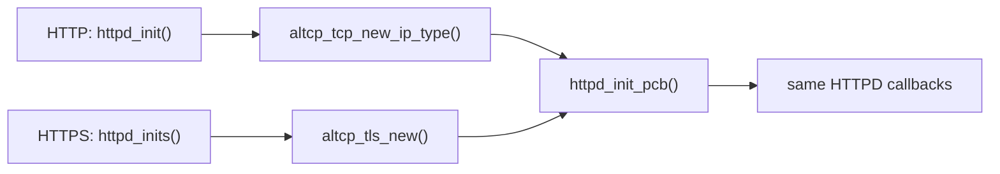
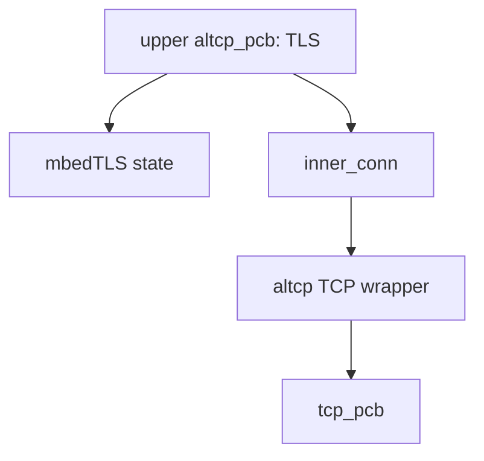
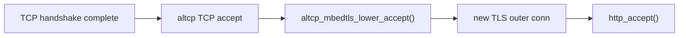
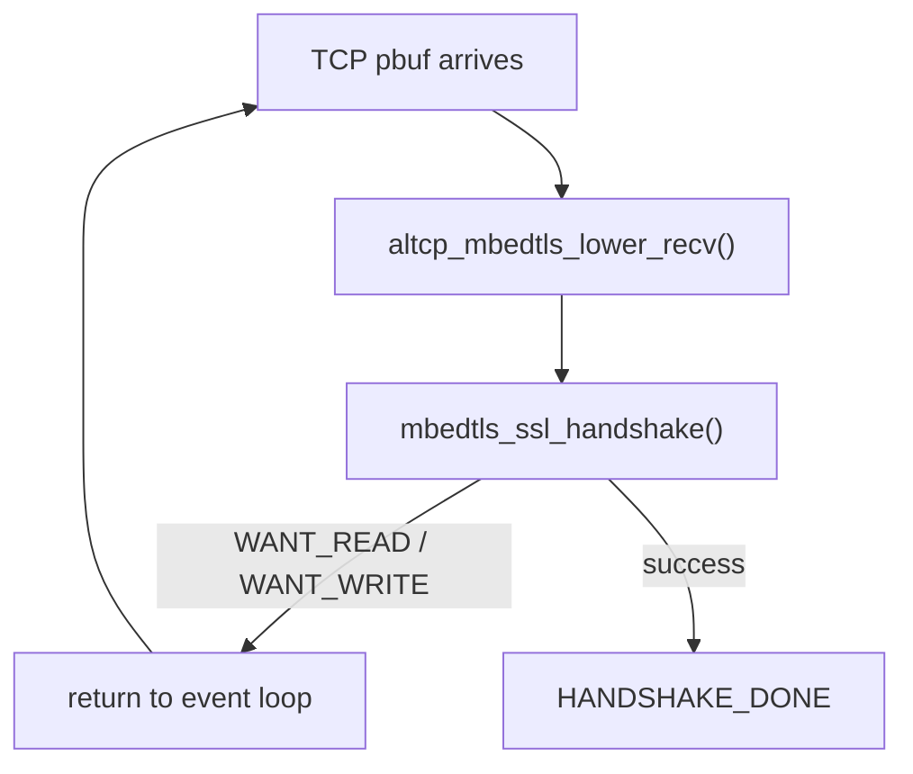
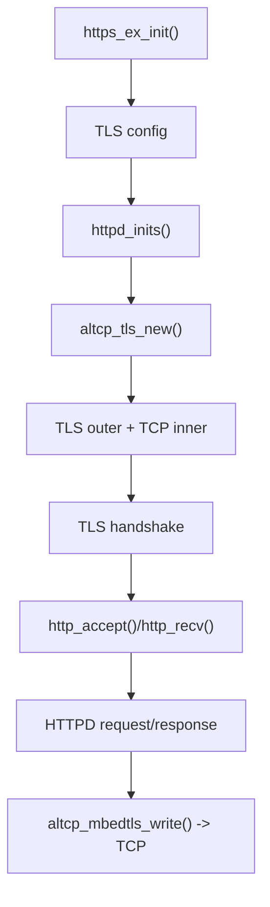

<meta name="referrer" content="no-referrer" />

# 教程 33：从 `https_ex_init()` 到 `http_recv()`——altcp、mbedTLS、TLS Handshake 与 HTTPS 数据通路

> 摘要：从 https_ex_init() 追踪 TLS 配置、altcp TLS wrapper、mbedTLS handshake 与 HTTPD callback，理解 HTTPS 如何复用 Stage 32 的 HTTP 主链。

[TOC]

Stage 32 已经证明 HTTPD 的应用层主链是 `httpd_init()` / `http_accept()` / `http_recv()` / `http_send()`，而传输访问统一走 `altcp_*`。Stage 33 不重新讲 HTTP parser；这一篇从 upstream `https_ex_init()` 开始，追踪 TLS 怎样被插入 `HTTPD -> altcp -> TCP` 之间。[S1](#source-s1)[S2](#source-s2)

这一篇仍然是 Source-driven。TLS 握手的密码学细节只解释到足以读懂当前 lwIP/mbedTLS integration，不展开证书算法、cipher suite 或 TLS RFC 的完整状态机。

## 1. upstream HTTPS example 从 `https_ex_init()` 创建 server TLS configuration

`contrib/examples/httpd/https_example/https_example.c` 的真实入口是 `https_ex_init()`。[S1](#source-s1)

example 首先加载 server private key 与 certificate，然后调用：

```text
altcp_tls_create_config_server_privkey_cert(...)
  -> httpd_inits(conf)
```

这里的 `struct altcp_tls_config` 是 TLS layer 的长期配置对象。它包含 mbedTLS configuration、certificate/private-key 等建立 TLS session 所需的配置；它不是某一条已经连接的客户端 session。[S3](#source-s3)

example 随后释放最初从文件读取的 key/cert buffer，因为 `altcp_tls_create_config_server_privkey_cert()` 已经把需要的内容解析进 TLS configuration。上游注释还特别指出，生产环境应考虑对敏感 private-key buffer 做 secure erase。[S1](#source-s1)

Host example 从磁盘读取 PEM/DER 文件只是 example/Port 行为。真实 MCU 产品通常会从 Flash、secure storage、secure element 或其他产品定义位置提供证书和私钥；不能把 `read_file()` 当成 altcp TLS 的硬要求。

## 2. 进入 `httpd_inits()`：HTTPS 与 HTTP 只在“创建哪一种 altcp PCB”处分叉

`https_ex_init()` 把 `conf` 交给 `httpd_inits()`。继续进入 `httpd.c`：[S2](#source-s2)

```text
httpd_inits(conf)
  -> altcp_tls_new(conf, IPADDR_TYPE_ANY)
  -> httpd_init_pcb(pcb_tls, HTTPD_SERVER_PORT_HTTPS)
```

从第二步开始，Stage 32 的 HTTP server 初始化链重新出现：同一个 `httpd_init_pcb()` 完成 bind、listen 和 `http_accept()` 注册。

`httpd_inits()` 最终仍进入 altcp/TCP callback-style API，因此在 RTOS Port 中继承 Stage 32 的 core-context 约束：初始化应位于 TCPIP thread，或在启用 core locking 时持有正确的 core lock；不能因为外层多了 TLS 就从任意 task/IRQ 直接调用。[S7](#source-s7)

因此 HTTP 与 HTTPS 的结构差异可以非常精确地写成：



这就是 altcp 给应用层带来的直接价值：HTTPD 不需要维护两套 parser、file server 和 response state machine。

## 3. 进入 `altcp_tls_new()`：TLS connection 实际上是“TLS wrapper + inner TCP connection”

`altcp_tls_new()` 当前位于 `src/core/altcp_alloc.c`。它先调用 `altcp_tcp_new_ip_type()` 创建 inner TCP connection，再调用 `altcp_tls_wrap()` 把 TLS layer 包在这个 inner connection 外面。[S4](#source-s4)

对象关系不是：

```text
TLS 替代 TCP
```

而是：



上层 HTTPD 只持有外层 TLS `altcp_pcb`。外层对象的 `fns` 指向 TLS function table；真正的 TCP PCB 隐藏在 `inner_conn` 后面。[S3](#source-s3)[S4](#source-s4)

## 4. 进入 `altcp_tls_wrap()` / `altcp_mbedtls_setup()`：把 mbedTLS BIO 接到 lwIP altcp

`altcp_tls_wrap()` 分配新的 outer `altcp_pcb`，然后调用 `altcp_mbedtls_setup()`。[S3](#source-s3)

`altcp_mbedtls_setup()` 做三件关键事情：

1. 为这一条 TLS connection 分配 `altcp_mbedtls_state_t`；
2. 初始化 `mbedtls_ssl_context` 并通过 `mbedtls_ssl_setup()` 绑定共享的 TLS configuration；
3. 用 `mbedtls_ssl_set_bio()` 把 mbedTLS 的加密记录 I/O 接到 lwIP 提供的 `altcp_mbedtls_bio_send()` / BIO receive path。

随后它把 inner TCP connection 的 callback 改为 TLS lower callbacks，并记录：

```text
outer TLS conn -> inner_conn -> TCP
```

这一步非常重要：mbedTLS 不直接驱动网卡，也不直接认识 lwIP `tcp_pcb`。它看到的是 BIO callback；BIO callback 再使用 inner altcp/TCP 完成网络 I/O。[S3](#source-s3)[S5](#source-s5)

## 5. TCP listener accept 后先进入 TLS lower layer，而不是直接进入 HTTP `http_accept()`

HTTPS listener 的 inner connection 仍然是 TCP，因此三次握手完成时，下层先产生一个新的 accepted TCP/altcp connection。TLS layer 的 `altcp_mbedtls_lower_accept()` 接住这个事件。[S3](#source-s3)

该 callback 为新连接创建 outer TLS `altcp_pcb`，调用 `altcp_mbedtls_setup()` 建立独立 TLS state，然后才调用 outer listener 注册的 accept callback——也就是 Stage 32 的 `http_accept()`。

所以 server accept 桥接是：



`http_accept()` 仍然像 Stage 32 一样创建 `struct http_state` 并注册 `http_recv()` / `http_sent()` / `http_poll()`。HTTPD 只知道它拿到了一条 `altcp_pcb`；它不需要知道这条 connection 内部多了一层 TLS。

## 6. TLS handshake 数据先进入 `altcp_mbedtls_lower_recv()`

HTTPS client 发来的首批 TCP payload 不是 HTTP `GET`，而是 TLS handshake records。inner TCP connection 的 receive callback 已被 TLS layer 改成 `altcp_mbedtls_lower_recv()`。[S3](#source-s3)

它把收到的 pbuf 排入 TLS state 的 RX chain，然后调用 `altcp_mbedtls_lower_recv_process()`。

只要 `ALTCP_MBEDTLS_FLAGS_HANDSHAKE_DONE` 还没有置位，`altcp_mbedtls_lower_recv_process()` 就调用 `mbedtls_ssl_handshake()`。如果 mbedTLS 返回 WANT_READ/WANT_WRITE，当前 callback 返回，等待更多网络数据或发送空间；这正符合事件驱动 TCP stack 的工作方式。[S3](#source-s3)[S5](#source-s5)

因此 handshake 不是一个同步的“函数调用后立刻全部完成”：



## 7. handshake 输出怎样回到 TCP：`altcp_mbedtls_bio_send()`

当 `mbedtls_ssl_handshake()` 需要发送 TLS record 时，mbedTLS 通过此前注册的 BIO send callback 调用 `altcp_mbedtls_bio_send()`。[S3](#source-s3)

该函数不会把密文交回 HTTPD，而是写入 `conn->inner_conn`：

```text
mbedTLS handshake/application ciphertext
  -> altcp_mbedtls_bio_send()
  -> altcp_write(inner_conn, ...)
  -> altcp TCP
  -> tcp_write()
```

所以 Stage 08 的 TCP send-buffer、ACK 与重传机制仍然存在；TLS 只是把上层明文变换成 TLS records，然后把这些 records 当作 TCP byte stream 发送。

## 8. handshake 完成后，TLS 才把解密后的 application data 交给 HTTPD

`mbedtls_ssl_handshake()` 成功后，TLS state 设置 `ALTCP_MBEDTLS_FLAGS_HANDSHAKE_DONE`。[S3](#source-s3)

随后收到的 TLS records 会进入 application-data 解密路径。`altcp_mbedtls_handle_rx_appldata()` / `altcp_mbedtls_pass_rx_data()` 最终把解密后的 bytes 封装成 pbuf，并调用 outer connection 注册的 receive callback。[S3](#source-s3)

而这个 outer receive callback 就是 Stage 32 在 `http_accept()` 中注册的 `http_recv()`。

于是 HTTPS RX 的完整边界变成：

```text
Ethernet/IP/TCP
  -> inner altcp TCP
  -> TLS record RX
  -> mbedTLS decrypt
  -> outer altcp pbuf
  -> http_recv()
  -> HTTP request parser
```

这一点必须和“HTTPD 自己会解 TLS”区分开：**HTTPD 看到的是已经解密的 HTTP byte stream。**

## 9. HTTP response 怎样加密：`http_send()` 最终进入 `altcp_mbedtls_write()`

HTTPD 发送 response 时仍然调用 Stage 32 的 `http_send()` / `http_write()` / `altcp_write()`。[S2](#source-s2)

由于当前 outer connection 的 function table 是 TLS functions，`altcp_write()` 不再进入 altcp TCP write，而是进入 `altcp_mbedtls_write()`。[S3](#source-s3)

`altcp_mbedtls_write()` 在 handshake 完成后调用 `mbedtls_ssl_write()`；mbedTLS 生成 encrypted TLS records，再通过 `altcp_mbedtls_bio_send()` 写入 inner TCP connection。[S3](#source-s3)


HTTPD 的 `hs->left`、file offset、Keep-Alive 和 URI 逻辑没有因为 TLS 而改变；改变的是 `altcp_write()` 下面到底是哪一种 connection layer。

## 10. `altcp` callback 为什么能让 TLS 对 HTTPD 看起来像 TCP

`altcp` 不只抽象 `write()`，还保存 upper-layer 的 `recv`、`sent`、`err`、`poll`、`connected` callback。[S6](#source-s6)

TLS layer 对 inner connection 注册自己的 lower callbacks；等解密、handshake 或错误处理完成后，再转发给 outer connection 的 upper callback。

因此它承担的是双向 adapter：

```text
upper -> write/connect/close -> TLS -> lower TCP
upper <- recv/sent/error  <- TLS <- lower TCP callbacks
```

这比“给 `tcp_write()` 外面手工套一个 `mbedtls_ssl_write()`”完整得多，因为 receive、accept、connect completion、close/error 与 send-buffer accounting 同样需要被桥接。

## 11. certificate / CA / private key 在 client 与 server 中职责不同

Stage 33 主要跟踪 HTTPS server example：它通过 server certificate 和 private key 创建 `altcp_tls_config`。[S1](#source-s1)[S3](#source-s3)

同一个 port 还提供 client configuration API，例如 `altcp_tls_create_config_client()`；提供 CA 时，mbedTLS 可以用 CA chain 验证 peer certificate。当前源码明确说明 CA 可选是为了节省内存，但生产环境不配置 CA 会失去 server identity verification，暴露于中间人风险。[S3](#source-s3)

这一点会在 Stage 35 再出现：MQTT over TLS 使用的是 **client** TLS config，不是 HTTP server 的 server TLS config。

## 12. MCU 上真正要预算的是 TLS state，而不只是“多一个协议头”

从当前实现可以直接看到，每条 TLS connection 额外引入：

- outer `altcp_pcb`；
- `altcp_mbedtls_state_t`；
- `mbedtls_ssl_context`；
- handshake / crypto working state；
- certificate/CA/key configuration；
- RX/TX record buffering 与 TLS overhead。

因此 MCU 上 HTTPS 的资源成本不能只按 Ethernet/TCP packet header 估算。具体 RAM/Flash/stack 数字依赖 mbedTLS 配置、证书链、cipher suite、并发连接数和 allocator，当前仓库没有给出统一实测值，所以本文不声明固定资源开销。

## 13. Stage 32 与 Stage 33 合起来的完整数据路径



这条链把“HTTPS = HTTP over TLS over TCP”落实成了具体对象和 callback：HTTPD 仍然是 Stage 32 的 HTTPD；TLS 是 altcp layer；TCP 仍然负责可靠字节流。

Stage 34 将不再继续 HTTP server，而切到 lwIP 自带 MQTT client，从 `mqtt_example_init()` / `mqtt_client_connect()` 追踪 CONNECT、CONNACK、SUBSCRIBE、PUBLISH 与 callback 数据通路。

## 资料来源

<a id="source-s1"></a>
### [S1] lwIP upstream HTTPS example
- 类型：目标版本上游 example
- 版本：commit `d08f4773edd0182b7910fc8f046eed82ffcd67c9`
- 定位：`contrib/examples/httpd/https_example/https_example.c`：`https_ex_init()`
- URL/文档：[lwIP https_example.c](https://github.com/lwip-tcpip/lwip/blob/d08f4773edd0182b7910fc8f046eed82ffcd67c9/contrib/examples/httpd/https_example/https_example.c)
- 使用位置：“HTTPS 真实入口”“server certificate/private key”“Host file-loading 与产品 Port 的边界”
- 支撑内容：提供 Stage 33 的真实上游调用入口

<a id="source-s2"></a>
### [S2] lwIP HTTPD HTTPS 入口
- 类型：目标版本上游源码
- 版本：同上
- 定位：`src/apps/http/httpd.c`：`httpd_inits()`、`httpd_init_pcb()`、HTTPD callbacks
- URL/文档：[lwIP httpd.c](https://github.com/lwip-tcpip/lwip/blob/d08f4773edd0182b7910fc8f046eed82ffcd67c9/src/apps/http/httpd.c)
- 使用位置：“HTTP/HTTPS 分叉点”“TLS 之后继续复用 HTTPD”
- 支撑内容：证明 HTTPS 入口创建 TLS altcp PCB 后复用同一 HTTP listener/application path

<a id="source-s3"></a>
### [S3] lwIP mbedTLS altcp port
- 类型：目标版本上游源码
- 版本：同上
- 定位：`src/apps/altcp_tls/altcp_tls_mbedtls.c`：TLS config creation、`altcp_tls_wrap()`、`altcp_mbedtls_setup()`、lower RX、handshake、application-data RX、`altcp_mbedtls_write()`、BIO send
- URL/文档：[lwIP altcp_tls_mbedtls.c](https://github.com/lwip-tcpip/lwip/blob/d08f4773edd0182b7910fc8f046eed82ffcd67c9/src/apps/altcp_tls/altcp_tls_mbedtls.c)
- 使用位置：TLS state、BIO bridge、handshake、加解密、certificate/CA 边界
- 支撑内容：证明 TLS layer 如何把 mbedTLS 接入 lwIP altcp callback model

<a id="source-s4"></a>
### [S4] lwIP altcp TLS allocator
- 类型：目标版本上游源码
- 版本：同上
- 定位：`src/core/altcp_alloc.c`：`altcp_tls_new()`、`altcp_tls_alloc()`
- URL/文档：[lwIP altcp_alloc.c](https://github.com/lwip-tcpip/lwip/blob/d08f4773edd0182b7910fc8f046eed82ffcd67c9/src/core/altcp_alloc.c)
- 使用位置：“TLS outer + TCP inner 对象关系”
- 支撑内容：证明 TLS PCB 是包裹 inner TCP altcp connection，而不是替代 TCP

<a id="source-s5"></a>
### [S5] Mbed TLS SSL API
- 类型：上游密码库 API 文档
- 版本：Mbed TLS 3.6.x 文档系列
- URL/文档：[Mbed TLS `ssl.h` API](https://mbed-tls.readthedocs.io/projects/api/en/v3.6.3/api/file/ssl_8h/)
- 使用位置：“`mbedtls_ssl_handshake()`”“WANT_READ/WANT_WRITE 事件驱动语义”“`mbedtls_ssl_write()` 背景”
- 支撑内容：提供 mbedTLS API 的语义背景；lwIP callback bridge 仍以目标 lwIP 源码为准

<a id="source-s6"></a>
### [S6] lwIP altcp interface
- 类型：目标版本上游源码
- 版本：同上
- 定位：`src/core/altcp.c`、`src/include/lwip/altcp.h`
- URL/文档：[lwIP altcp.c](https://github.com/lwip-tcpip/lwip/blob/d08f4773edd0182b7910fc8f046eed82ffcd67c9/src/core/altcp.c)
- 使用位置：“upper/lower callback adapter”“HTTPD 为什么不需要知道 TLS 实现”
- 支撑内容：定义 altcp function-table 与 callback abstraction

<a id="source-s7"></a>
### [S7] lwIP Multithreading / Common pitfalls
- 类型：目标版本上游 Doxygen 文档
- 版本：同上
- 定位：`doc/doxygen/main_page.h`：`Multithreading`、`Common pitfalls`
- URL/文档：[lwIP multithreading guidance](https://github.com/lwip-tcpip/lwip/blob/d08f4773edd0182b7910fc8f046eed82ffcd67c9/doc/doxygen/main_page.h)
- 使用位置：“`httpd_inits()` / altcp TLS 初始化的 RTOS execution context”
- 支撑内容：限定 callback-style API 的 TCPIP thread/core-lock 调用边界
