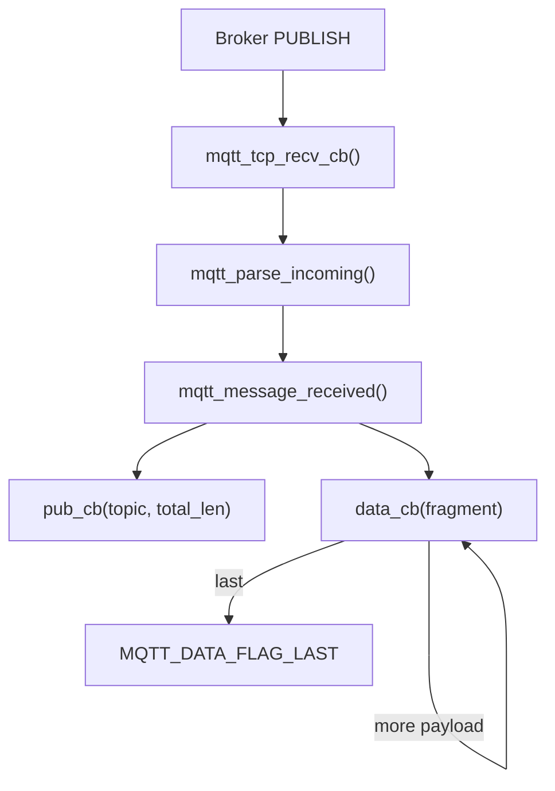
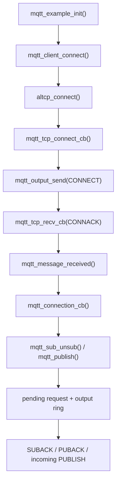

<meta name="referrer" content="no-referrer" />

# 教程 34：从 `mqtt_example_init()` 到 `mqtt_message_received()`——MQTT CONNECT、SUBSCRIBE、PUBLISH 与回调数据通路

> 摘要：从 mqtt_example_init() 追踪 CONNECT/CONNACK、SUBSCRIBE、PUBLISH、请求队列与入站回调，理解 MQTT 如何建立在 altcp/TCP 之上。

[TOC]

Stage 32～33 已经把应用层如何通过 `altcp` 使用 TCP/TLS 讲清楚。Stage 34 切换到另一个真实 application：lwIP 自带 MQTT client。本文从 upstream example 的 `mqtt_example_init()` 开始，不先展开 MQTT 协议百科，而是沿当前实现回答：**一个 lwIP MQTT client 怎样建立连接、等待 CONNACK、订阅 Topic、发布消息，并把 Broker 下发的 PUBLISH 交给应用 callback。** [S1](#source-s1)[S2](#source-s2)

当前源码基线仍固定为 upstream `master` commit `d08f4773edd0182b7910fc8f046eed82ffcd67c9`。该实现发送 CONNECT 时使用 protocol level 4，也就是 MQTT 3.1.1 的 wire protocol level；本文的协议语义因此以 MQTT 3.1.1 与目标源码共同为准。[S2](#source-s2)[S5](#source-s5)

## 1. 从 `mqtt_example_init()` 开始：先建立 client 对象和入站 callback

`contrib/examples/mqtt/mqtt_example.c` 的公开 example 入口是 `mqtt_example_init()`。[S1](#source-s1)

它按下面顺序执行：

```text
mqtt_client_new()
  -> mqtt_set_inpub_callback(...)
  -> mqtt_client_connect(...)
```

这个顺序先建立了两个不同方向的 callback：

- `mqtt_connection_cb()`：连接建立、拒绝、断开或 timeout 时通知应用；
- `mqtt_incoming_publish_cb()` / `mqtt_incoming_data_cb()`：Broker 下发 PUBLISH 时，把 Topic 与 payload 分阶段交给应用。[S1](#source-s1)[S3](#source-s3)

upstream example 的 `mqtt_connect_client_info_t` 使用 client id `test`、keep alive 100 秒、无 username/password、无 Will，并在 TLS 编译可用时把 `tls_config` 留为 `NULL`。因此 Stage 34 追踪的是明文 MQTT over TCP；TLS 分支留到 Stage 35。[S1](#source-s1)

## 2. 进入 `mqtt_client_connect()`：先重置 connection state，再构造 MQTT CONNECT

`mqtt_example_init()` 直接调用公共 API `mqtt_client_connect()`。当前实现首先要求 client 处于 `TCP_DISCONNECTED`，随后清零连接状态，但特意保留此前由 `mqtt_set_inpub_callback()` 安装的 incoming publish/data callback。[S2](#source-s2)

接着它保存：

- `connect_cb` / `connect_arg`；
- `keep_alive`；
- request tracking objects；
- client id、Will、username/password 等 CONNECT 参数。[S2](#source-s2)

CONNECT packet 并不是等 TCP connect 完成后才临时拼出来。`mqtt_client_connect()` 先计算 Remaining Length，再向 MQTT output ring buffer 顺序写入：

```text
Fixed Header: CONNECT
Protocol Name: "MQTT"
Protocol Level: 4
Connect Flags
Keep Alive
Client Identifier
[Will]
[Username]
[Password]
```

当前实现还会无条件加入 `MQTT_CONNECT_FLAG_CLEAN_SESSION`。[S2](#source-s2)

这是一条很重要的实现边界：**当前 lwIP MQTT client 的连接入口默认使用 Clean Session，不提供“把旧 session 持久状态留给下一次连接”的开关。** 这一点会直接影响 Stage 35 的 reconnect 设计：断线后应用不能假定旧订阅和 pending request 会由当前 client implementation 自动恢复。

## 3. `mqtt_client_connect()` 创建 altcp/TCP connection，而不是直接操作 `tcp_pcb`

Stage 34 的 `client_info->tls_config == NULL`，所以当前分支调用：

```text
altcp_tcp_new_ip_type(IP_GET_TYPE(ip_addr))
```

然后依次：

```text
altcp_arg(client->conn, client)
  -> altcp_bind(..., IP_ADDR_ANY, 0)
  -> altcp_connect(..., mqtt_tcp_connect_cb)
  -> altcp_err(..., mqtt_tcp_err_cb)
  -> client->conn_state = TCP_CONNECTING
```

这里再次出现 Stage 32 已经学过的 altcp boundary。MQTT application 持有 `struct altcp_pcb *conn`，普通连接落到 TCP adapter；Stage 35 只需要换成 TLS allocator，上层 MQTT parser 与 request queue 不需要重写。[S2](#source-s2)[S6](#source-s6)

`altcp_connect()` 是异步连接入口。`mqtt_client_connect()` 返回 `ERR_OK` 只表示连接动作和 CONNECT packet 排队成功，不表示 Broker 已接受 MQTT session。

当前 `mqtt_client_connect()`、`mqtt_publish()`、`mqtt_sub_unsub()` 都包含 `LWIP_ASSERT_CORE_LOCKED()`。在 `NO_SYS=0` 的 RTOS Port 中，它们属于 callback-style/raw-style core API：应用任务不能无锁直接调用，应通过 TCPIP thread（例如 `tcpip_callback()`）或启用并正确持有 lwIP core lock 后进入。[S2](#source-s2)[S7](#source-s7)

## 4. TCP 三次握手成功后进入 `mqtt_tcp_connect_cb()`：此时才真正发送 MQTT CONNECT

下层 TCP active open 成功后，altcp 调用 `mqtt_tcp_connect_cb()`。[S2](#source-s2)

进入该 callback 后，当前实现完成四件事：

1. 初始化 MQTT RX message index；
2. 注册 `mqtt_tcp_recv_cb()`、`mqtt_tcp_sent_cb()`、`mqtt_tcp_poll_cb()`；
3. 把 MQTT 状态改成 `MQTT_CONNECTING`，并启动 `mqtt_cyclic_timer()`；
4. 调用 `mqtt_output_send()`，把此前排在 output ring buffer 中的 CONNECT 发向 Broker。[S2](#source-s2)

因此 TCP connection 与 MQTT connection 是两个不同层次的状态：


TCP 三次握手结束只说明可靠字节流已建立；只有收到 Broker 的 CONNACK 并接受以后，MQTT client 才进入 `MQTT_CONNECTED`。

## 5. `mqtt_output_send()`：MQTT packet 先经过 ring buffer，再受 TCP send buffer 约束

`mqtt_tcp_connect_cb()` 调用 `mqtt_output_send()` 发送 CONNECT。这个函数不是简单地把整个 ring buffer 一次性写给 TCP。[S2](#source-s2)

它先比较：

- MQTT output ring buffer 当前连续可读长度；
- `altcp_sndbuf()` 当前可用的 TCP send space。

然后取两者较小值，通过 `altcp_write(..., TCP_WRITE_FLAG_COPY, ...)` enqueue；如果 ring buffer 在末尾发生 wrap，则可能分两段写入，最后调用 `altcp_output()`。[S2](#source-s2)

于是 Stage 08 的 TCP 背压模型在 MQTT 中重新出现：

```text
MQTT control packet / PUBLISH
  -> MQTT output ring buffer
  -> mqtt_output_send()
  -> altcp_sndbuf()
  -> altcp_write()
  -> TCP send queue
```

如果 TCP send buffer 当前放不下全部待发送数据，剩余 bytes 保留在 MQTT ring buffer，后续 `mqtt_tcp_sent_cb()` 或 `mqtt_tcp_poll_cb()` 会再次调用 `mqtt_output_send()`。[S2](#source-s2)

## 6. Broker 返回 CONNACK：`mqtt_tcp_recv_cb()` 把 TCP pbuf 送进 MQTT parser

Broker 的 CONNACK 到达后，下层通过 Stage 4～10 已经建立的 RX 链进入 altcp，最终触发 `mqtt_tcp_recv_cb()`。[S2](#source-s2)

正常 RX 路径是：

```text
mqtt_tcp_recv_cb()
  -> altcp_recved()
  -> mqtt_parse_incoming()
  -> pbuf_free()
```

`mqtt_parse_incoming()` 不能假定一个 TCP pbuf 就是一整个 MQTT Control Packet。它维护 `client->msg_idx` 和 `rx_buffer`，先解析 Fixed Header 与可变长度 Remaining Length；消息被 TCP 分段时，会保留已解析 header 状态并在后续 pbuf 到达后继续。[S2](#source-s2)

这和 Stage 32 HTTP request 的结论一致：**TCP 只提供 byte stream，不提供 application message boundary。** MQTT parser 必须自己恢复 Control Packet 边界。[S5](#source-s5)

## 7. 进入 `mqtt_message_received()`：CONNACK 才把状态推进到 `MQTT_CONNECTED`

当 `mqtt_parse_incoming()` 拼出完整或可处理的 MQTT message 后，会调用 `mqtt_message_received()`。[S2](#source-s2)

CONNACK 分支首先确认当前状态是 `MQTT_CONNECTING`，读取 Broker 返回的 result code。只有 result 为 `MQTT_CONNECT_ACCEPTED` 时才：

```text
client->cyclic_tick = 0
client->conn_state = MQTT_CONNECTED
client->connect_cb(..., MQTT_CONNECT_ACCEPTED)
```

于是调用链回到 upstream example 的 `mqtt_connection_cb()`。[S1](#source-s1)[S2](#source-s2)

这条异步桥接不能省略：


应用真正适合开始 subscribe/publish 的位置，是 `mqtt_connection_cb()` 收到 ACCEPTED 之后，而不是 `mqtt_client_connect()` 刚返回时。

## 8. 回到 example 的 `mqtt_connection_cb()`：连接接受后立即发 SUBSCRIBE

upstream example 在 `mqtt_connection_cb()` 收到 `MQTT_CONNECT_ACCEPTED` 后，通过 `mqtt_sub_unsub()` 分别订阅 `topic_qos1` 和 `topic_qos0`。[S1](#source-s1)

`mqtt_subscribe()` 在 public header 中实际上是 `mqtt_sub_unsub(..., sub=1)` 的 macro wrapper。[S3](#source-s3)

进入 `mqtt_sub_unsub()` 后，当前实现：

1. 计算 Topic length；
2. 生成 non-zero Packet Identifier；
3. 从固定 request object pool 中取得 `mqtt_request_t`；
4. 检查 output ring buffer 是否有足够空间；
5. 编码 SUBSCRIBE fixed header、Packet Identifier、Topic 与 requested QoS；
6. 把 request 挂到 pending request queue；
7. 调用 `mqtt_output_send()`。[S2](#source-s2)

因此 SUBSCRIBE 不只是“发两行字符串”。Packet Identifier 把后续 SUBACK 与当前本地 request object 关联起来。

## 9. SUBACK 回来后：Packet Identifier 把 Broker response 找回原来的 callback

Broker 返回 SUBACK 后，再次走：

```text
mqtt_tcp_recv_cb()
  -> mqtt_parse_incoming()
  -> mqtt_message_received()
```

`mqtt_message_received()` 从 SUBACK variable header 中取 Packet Identifier，然后调用 `mqtt_take_request()` 在 pending request queue 中找到对应 `mqtt_request_t`。[S2](#source-s2)

对于 SUBACK，`mqtt_incoming_suback()` 把 Broker 的结果转换成 `ERR_OK` 或 `ERR_ABRT`，最后调用用户注册的 `mqtt_request_cb()`。[S2](#source-s2)

于是 request/response 的 ownership 很清楚：

```text
mqtt_subscribe()
  -> create mqtt_request_t(pkt_id)
  -> pending request queue
  -> Broker SUBACK(pkt_id)
  -> mqtt_take_request(pkt_id)
  -> request callback
  -> request object becomes reusable
```

同一套 request tracking 也用于需要 protocol acknowledgment 的 PUBLISH/UNSUBSCRIBE。

## 10. 从 `mqtt_publish()` 开始看发送：QoS 决定 Packet Identifier 与完成条件

应用调用 `mqtt_publish()` 时，函数先确认 connection 未处于 `TCP_DISCONNECTED`，然后计算 Topic + payload 的 Remaining Length。[S2](#source-s2)

如果 `qos > 0`，它生成 Packet Identifier；QoS 0 则使用内部保留值 `pkt_id = 0`。随后：

```text
mqtt_create_request()
  -> output space check
  -> append PUBLISH fixed header
  -> append Topic
  -> [append Packet Identifier]
  -> append payload
  -> mqtt_append_request()
  -> mqtt_output_send()
```

当前 lwIP implementation 支持 QoS 0/1/2 的 control packet handling。[S2](#source-s2)[S5](#source-s5)

完成 callback 的触发条件并不相同：

- QoS 0 没有 MQTT-layer PUBACK；当 TCP `sent` callback 证明已经被 TCP acknowledgment 推进后，`mqtt_tcp_sent_cb()` 处理 `pkt_id == 0` 的 publish request callback；
- QoS 1 等待 Broker 的 PUBACK；
- QoS 2 继续经过 PUBREC / PUBREL / PUBCOMP control packet exchange。[S2](#source-s2)

这里要区分两个“ACK”：TCP ACK 只确认可靠字节流；MQTT PUBACK/PUBREC/PUBCOMP 是 application protocol 的 delivery state。两者不是一个层次的确认。

## 11. Broker 主动 PUBLISH：先回调 Topic，再分片回调 payload

收到 PUBLISH 时，`mqtt_message_received()` 先解析 Topic；QoS > 0 时还读取 Packet Identifier。[S2](#source-s2)

第一次解析出该 PUBLISH 的 Topic 时，它调用：

```text
client->pub_cb(arg, topic, total_payload_length)
```

也就是 example 的 `mqtt_incoming_publish_cb()`。[S1](#source-s1)[S2](#source-s2)

payload 则通过 `data_cb` 交付。payload 大于当前 RX buffer/pbuf 可处理范围时，callback 可能被调用多次；最后一个 fragment 带 `MQTT_DATA_FLAG_LAST`。[S2](#source-s2)[S3](#source-s3)



因此应用不能保存 `topic` 或 `data` pointer 并在 callback 返回后继续假设其有效；public header 明确限定了 callback data 的生命周期。[S3](#source-s3)

## 12. 入站 QoS 1/2 的 acknowledgment 仍由 MQTT core 生成

当入站 PUBLISH 的最后一段 payload 被处理完，且 QoS > 0 时，当前实现会自动发送对应 response：[S2](#source-s2)

- QoS 1：PUBACK；
- QoS 2：先 PUBREC，随后收到 PUBREL 再回 PUBCOMP。

这些 response 都通过 `pub_ack_rec_rel_response()` 编码到 MQTT output ring buffer，并最终进入 `mqtt_output_send()` / altcp/TCP。

所以 application callback 主要消费 Topic/payload；协议级 ACK state 由 lwIP MQTT core 维护。

## 13. `mqtt_opts.h` 决定 MCU 上的静态资源上限

MQTT client 不是“动态无限缓存”的 application。当前默认配置中：[S4](#source-s4)

| 配置 | 当前默认值 | 约束对象 |
|---|---:|---|
| `MQTT_OUTPUT_RINGBUF_SIZE` | 256 B | outgoing control packet / PUBLISH 的 ring buffer |
| `MQTT_VAR_HEADER_BUFFER_LEN` | 128 B | incoming variable header、Topic 与 payload fragment buffer |
| `MQTT_REQ_MAX_IN_FLIGHT` | 4 | pending subscribe/unsubscribe/publish request 数 |
| `MQTT_CYCLIC_TIMER_INTERVAL` | 5 s | MQTT cyclic timer tick |
| `MQTT_REQ_TIMEOUT` | 30 s | pending request timeout |
| `MQTT_CONNECT_TIMOUT` | 100 s | 等待 MQTT connection 建立的 timeout |

这些是当前 upstream 的 **默认宏值**，不是协议规定，也不是所有 MCU 的推荐配置。尤其 `MQTT_OUTPUT_RINGBUF_SIZE` 必须容纳最大 outgoing publish 的 Topic + payload + MQTT framing；如果产品要发送较大 payload，不能沿用默认 256 B 后再假设 `mqtt_publish()` 一定成功。

## 14. Stage 34 的完整主调用链

把已经出现的关键函数串起来：



Stage 34 到这里建立的是 **MQTT application state over altcp/TCP**：

- TCP 负责可靠 byte stream；
- altcp 提供可替换 transport adapter；
- MQTT parser 恢复 Control Packet boundary；
- request queue 用 Packet Identifier 关联异步 request/response；
- callback 把连接状态与 incoming publish 交回 application。

Stage 35 将沿 `mqtt_client_connect()` 的 `tls_config` 分支继续，并重点展开 `mqtt_cyclic_timer()`、PINGREQ/PINGRESP、timeout、disconnect callback 与 **应用侧** reconnect/resubscribe 责任。

## 资料来源

<a id="source-s1"></a>
### [S1] lwIP upstream MQTT example
- 类型：目标版本上游 example
- 版本：commit `d08f4773edd0182b7910fc8f046eed82ffcd67c9`
- 定位：`contrib/examples/mqtt/mqtt_example.c`：`mqtt_example_init()`、`mqtt_connection_cb()`、incoming publish/data callback
- URL/文档：[lwIP mqtt_example.c](https://github.com/lwip-tcpip/lwip/blob/d08f4773edd0182b7910fc8f046eed82ffcd67c9/contrib/examples/mqtt/mqtt_example.c)
- 使用位置：Stage 34 真实入口、example connection parameters、连接接受后的 subscribe 行为
- 支撑内容：证明 upstream example 怎样初始化并驱动 MQTT client

<a id="source-s2"></a>
### [S2] lwIP MQTT client implementation
- 类型：目标版本上游源码
- 版本：同上
- 定位：`src/apps/mqtt/mqtt.c`：`mqtt_client_connect()`、`mqtt_tcp_connect_cb()`、`mqtt_output_send()`、`mqtt_tcp_recv_cb()`、`mqtt_parse_incoming()`、`mqtt_message_received()`、`mqtt_sub_unsub()`、`mqtt_publish()`、request queue
- URL/文档：[lwIP mqtt.c](https://github.com/lwip-tcpip/lwip/blob/d08f4773edd0182b7910fc8f046eed82ffcd67c9/src/apps/mqtt/mqtt.c)
- 使用位置：CONNECT/CONNACK、SUBSCRIBE/SUBACK、PUBLISH、QoS ACK、TCP callback bridge
- 支撑内容：提供本文 Source-driven 主调用链

<a id="source-s3"></a>
### [S3] lwIP MQTT public API
- 类型：目标版本上游 public header
- 版本：同上
- 定位：`src/include/lwip/apps/mqtt.h`：`mqtt_connect_client_info_t`、connection/request/incoming callback、public API、MQTT ports
- URL/文档：[lwIP mqtt.h](https://github.com/lwip-tcpip/lwip/blob/d08f4773edd0182b7910fc8f046eed82ffcd67c9/src/include/lwip/apps/mqtt.h)
- 使用位置：callback 生命周期、public API、TLS extension point
- 支撑内容：限定应用层能观察和配置的 MQTT client contract

<a id="source-s4"></a>
### [S4] lwIP MQTT compile-time options
- 类型：目标版本上游配置头
- 版本：同上
- 定位：`src/include/lwip/apps/mqtt_opts.h`
- URL/文档：[lwIP mqtt_opts.h](https://github.com/lwip-tcpip/lwip/blob/d08f4773edd0182b7910fc8f046eed82ffcd67c9/src/include/lwip/apps/mqtt_opts.h)
- 使用位置：“output/RX buffer”“in-flight request”“timer/timeout 默认值”
- 支撑内容：说明当前 upstream 默认资源边界；这些默认值不是 MQTT 规范要求

<a id="source-s5"></a>
### [S5] OASIS MQTT Version 3.1.1
- 类型：MQTT 标准
- 版本：MQTT 3.1.1
- URL/文档：[MQTT Version 3.1.1](https://docs.oasis-open.org/mqtt/mqtt/v3.1.1/mqtt-v3.1.1.html)
- 使用位置：“Protocol Level 4”“Control Packet / Remaining Length”“CONNECT/CONNACK”“QoS/PUBACK 系列”“Keep Alive 背景”
- 支撑内容：提供 wire protocol 语义；lwIP 的 buffer、callback 与 Clean Session 固定策略仍以目标源码为准

<a id="source-s6"></a>
### [S6] lwIP altcp TCP adapter
- 类型：目标版本上游源码
- 版本：同上
- 定位：`src/core/altcp.c`、`src/core/altcp_tcp.c`
- URL/文档：[lwIP altcp.c](https://github.com/lwip-tcpip/lwip/blob/d08f4773edd0182b7910fc8f046eed82ffcd67c9/src/core/altcp.c)
- 使用位置：“MQTT 为什么持有 altcp_pcb”“普通 MQTT 如何落到 TCP”
- 支撑内容：承接 Stage 32 的 transport abstraction，并为 Stage 35 TLS 分支建立边界

<a id="source-s7"></a>
### [S7] lwIP Multithreading / Common pitfalls
- 类型：目标版本上游 Doxygen 文档
- 版本：同上
- 定位：`doc/doxygen/main_page.h`：`Multithreading`、`Common pitfalls`
- URL/文档：[lwIP multithreading guidance](https://github.com/lwip-tcpip/lwip/blob/d08f4773edd0182b7910fc8f046eed82ffcd67c9/doc/doxygen/main_page.h)
- 使用位置：“MQTT public API 的 RTOS 调用上下文”
- 支撑内容：说明 callback-style API 在 OS mode 下必须从 TCPIP thread 调用，或在 core locking 模式下持锁调用
